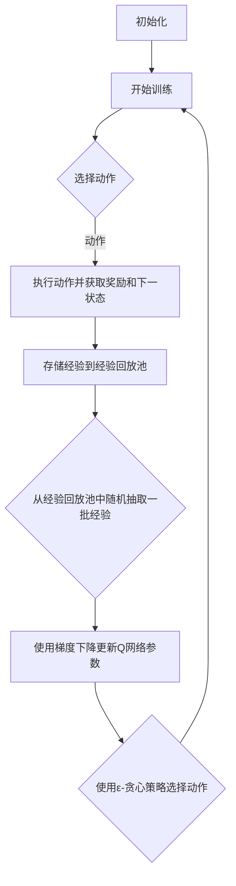
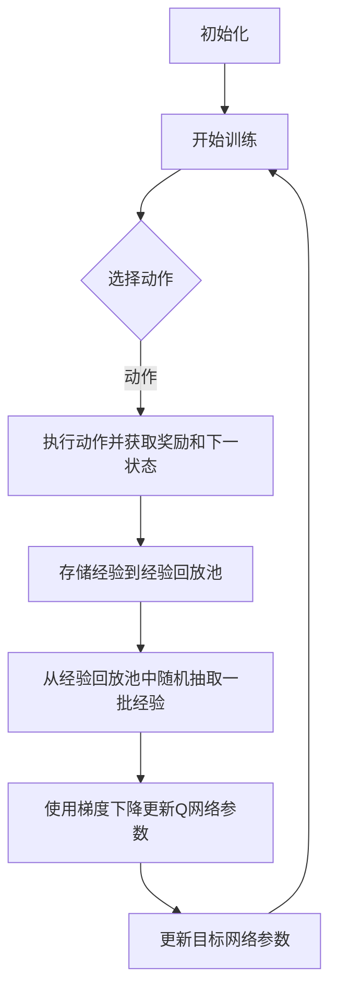

                 

# 《一切皆是映射：DQN训练加速技术：分布式训练与GPU并行》

> **关键词：深度强化学习，DQN，分布式训练，GPU并行，训练加速技术**

> **摘要：本文深入探讨了深度强化学习中的DQN算法，分析了其训练过程中的挑战，并详细介绍了分布式训练与GPU并行的技术手段，以实现DQN训练的加速。通过实际的案例展示，读者可以更好地理解这些技术在实际项目中的应用。**

---

### 《一切皆是映射：DQN训练加速技术：分布式训练与GPU并行》目录大纲

#### 第一部分: DQN与深度强化学习基础

##### 第1章: DQN算法基础

1.1 深度强化学习概述

1.2 Q-Learning与DQN算法原理

1.3 DQN算法的Mermaid流程图

1.4 DQN算法的优势与局限性

##### 第2章: DQN算法在GPU并行中的实现

2.1 GPU并行计算基础

2.2 DQN算法的GPU并行化伪代码

2.3 GPU并行化DQN算法的优势与挑战

##### 第3章: 分布式DQN训练技术

3.1 分布式计算基础

3.2 分布式DQN训练原理

3.3 分布式DQN训练算法伪代码

3.4 分布式DQN训练的优势与挑战

##### 第4章: GPU并行与分布式DQN训练结合

4.1 GPU并行与分布式DQN训练结合原理

4.2 GPU并行与分布式DQN训练结合的伪代码

4.3 GPU并行与分布式DQN训练结合的优势与挑战

#### 第二部分: DQN训练加速技术

##### 第5章: 梯度裁剪技术

5.1 梯度裁剪原理

5.2 梯度裁剪算法伪代码

5.3 梯度裁剪技术的应用场景

##### 第6章: 梯度归一化技术

6.1 梯度归一化原理

6.2 梯度归一化算法伪代码

6.3 梯度归一化技术的应用场景

##### 第7章: 多GPU训练技术

7.1 多GPU训练原理

7.2 多GPU训练算法伪代码

7.3 多GPU训练的优势与挑战

##### 第8章: GPU虚拟化技术

8.1 GPU虚拟化原理

8.2 GPU虚拟化技术伪代码

8.3 GPU虚拟化技术的应用场景

#### 第三部分: DQN训练加速技术在项目中的应用

##### 第9章: 项目实战一：使用GPU加速DQN训练

9.1 项目背景与目标

9.2 开发环境搭建

9.3 源代码实现与解读

##### 第10章: 项目实战二：分布式DQN训练在自动驾驶中的应用

10.1 项目背景与目标

10.2 开发环境搭建

10.3 源代码实现与解读

##### 第11章: 项目实战三：GPU并行与分布式DQN训练在游戏AI中的应用

11.1 项目背景与目标

11.2 开发环境搭建

11.3 源代码实现与解读

##### 第12章: 总结与展望

12.1 DQN训练加速技术的发展趋势

12.2 未来研究方向与挑战

##### 附录

A.1 DQN算法数学模型与公式

A.2 GPU并行与分布式计算资源列表

A.3 常见DQN训练加速技术对比分析表

A.4 项目实战代码完整源代码清单与解读说明

---

**本文将逐步分析DQN算法、GPU并行与分布式训练技术，并结合实际项目，展示这些技术在训练加速方面的应用效果。**

---

**第一部分: DQN与深度强化学习基础**

**第1章: DQN算法基础**

**1.1 深度强化学习概述**

深度强化学习（Deep Reinforcement Learning，简称DRL）是强化学习（Reinforcement Learning，简称RL）与深度学习（Deep Learning，简称DL）相结合的一种机器学习方法。在传统的强化学习中，智能体通过与环境交互，通过不断尝试不同的动作来学习最优策略。然而，传统强化学习面临的问题是如何处理状态和动作空间非常复杂的问题。深度强化学习通过引入深度神经网络来近似状态值函数或策略函数，从而能够解决这一问题。

**1.2 Q-Learning与DQN算法原理**

Q-Learning是强化学习中最基本的算法之一，它通过学习状态-动作值函数（Q值）来选择动作。在Q-Learning中，智能体会根据当前的Q值来选择动作，并通过不断更新Q值来优化其策略。

DQN（Deep Q-Network）是深度强化学习中的代表性算法，它将深度神经网络引入Q-Learning中，以学习状态-动作值函数。DQN通过经验回放（Experience Replay）和目标网络（Target Network）等技术来改善训练效果和避免过拟合。

**1.3 DQN算法的Mermaid流程图**

下面是DQN算法的一个Mermaid流程图：



**1.4 DQN算法的优势与局限性**

DQN算法在处理复杂环境时具有较好的效果，其主要优势包括：

1. **处理高维状态空间**：通过使用深度神经网络，DQN可以有效地处理高维状态空间，从而解决传统Q-Learning难以处理的问题。

2. **避免过拟合**：通过经验回放池和目标网络技术，DQN可以避免过拟合，从而提高训练效果。

然而，DQN算法也存在一些局限性：

1. **学习效率较低**：由于DQN算法需要通过经验回放池来随机抽取经验进行训练，这导致其学习效率相对较低。

2. **收敛速度较慢**：DQN算法的收敛速度较慢，特别是在处理复杂任务时，训练时间可能较长。

**第2章: DQN算法在GPU并行中的实现**

**2.1 GPU并行计算基础**

GPU（Graphics Processing Unit，图形处理单元）是一种专为图形渲染而设计的处理器，但在近年来，其并行计算能力得到了广泛应用。GPU并行计算主要依赖于其高度并行的架构，通过将计算任务分解为多个较小的任务，并在多个处理核心上同时执行这些任务，从而实现高性能计算。

**2.2 DQN算法的GPU并行化伪代码**

以下是DQN算法的GPU并行化伪代码：

```python
# 初始化GPU环境
init_gpu_environment()

# 初始化网络参数
初始化Q网络参数
初始化目标网络参数

# 开始训练
for episode in range(总训练轮数):
    # 选择动作
    action = choose_action(Q网络)

    # 执行动作并获取奖励和下一状态
    reward, next_state = execute_action(action)

    # 存储经验到经验回放池
    store_experience_to_replay_pool((state, action, reward, next_state))

    # 从经验回放池中随机抽取一批经验
    batch = sample_replay_pool(批量大小)

    # 使用梯度下降更新Q网络参数
    update_q_network_parameters(batch)

    # 更新目标网络参数
    update_target_network_parameters(Q网络参数)

    # 输出训练信息
    print("训练轮数: ", episode, "损失: ", loss)
```

**2.3 GPU并行化DQN算法的优势与挑战**

GPU并行化DQN算法具有以下优势：

1. **加速训练过程**：通过并行计算，GPU可以显著缩短DQN算法的训练时间，从而提高训练效率。

2. **减少计算资源需求**：由于GPU具有高度并行性，因此可以在较少的GPU上实现与多CPU类似的性能，从而减少计算资源的需求。

然而，GPU并行化DQN算法也面临一些挑战：

1. **并行化难度**：DQN算法本身具有非并行性，因此在GPU上进行并行化可能需要复杂的编程技巧。

2. **内存瓶颈**：GPU的内存相对较小，可能无法存储大量的经验数据，从而影响训练效果。

**第3章: 分布式DQN训练技术**

**3.1 分布式计算基础**

分布式计算是指将计算任务分布在多个计算节点上，通过通信网络协同完成任务的一种计算方式。分布式计算可以有效地利用多台计算机的计算资源，从而提高计算性能。

**3.2 分布式DQN训练原理**

分布式DQN训练技术将DQN算法的训练过程分布到多个计算节点上，每个节点负责处理一部分数据。通过将数据分布在多个节点上，可以减少单台计算机的处理负担，从而提高训练效率。

**3.3 分布式DQN训练算法伪代码**

以下是分布式DQN训练算法的伪代码：

```python
# 初始化分布式环境
init_distributed_environment()

# 初始化网络参数
初始化Q网络参数
初始化目标网络参数

# 分布式训练过程
for episode in range(总训练轮数):
    # 将数据分配到各个计算节点
    distributed_data = distribute_data(data, 计算节点数)

    # 各个计算节点并行训练
    for node in distributed_data:
        # 选择动作
        action = choose_action(node.Q网络)

        # 执行动作并获取奖励和下一状态
        reward, next_state = execute_action(action)

        # 存储经验到经验回放池
        store_experience_to_replay_pool(node.experience_replay_pool, (state, action, reward, next_state))

        # 从经验回放池中随机抽取一批经验
        batch = sample_replay_pool(node.experience_replay_pool, 批量大小)

        # 使用梯度下降更新Q网络参数
        update_q_network_parameters(node.Q网络, batch)

        # 更新目标网络参数
        update_target_network_parameters(node.Q网络参数)

    # 输出训练信息
    print("训练轮数: ", episode, "损失: ", loss)
```

**3.4 分布式DQN训练的优势与挑战**

分布式DQN训练技术具有以下优势：

1. **提高训练效率**：通过将数据分布在多个计算节点上，分布式DQN训练可以显著提高训练效率。

2. **减少训练时间**：分布式训练可以并行处理多个数据批次，从而缩短训练时间。

然而，分布式DQN训练技术也面临一些挑战：

1. **通信开销**：分布式训练需要通过通信网络传输数据，这可能导致通信开销较大。

2. **同步问题**：分布式训练中的各个计算节点需要保持同步，这可能导致同步问题影响训练效果。

**第4章: GPU并行与分布式DQN训练结合**

**4.1 GPU并行与分布式DQN训练结合原理**

GPU并行与分布式DQN训练结合是将GPU并行计算与分布式计算技术相结合，以实现DQN训练的加速。通过GPU并行计算，可以加速单个计算节点的处理速度；通过分布式计算，可以并行处理多个计算节点的数据，从而提高训练效率。

**4.2 GPU并行与分布式DQN训练结合的伪代码**

以下是GPU并行与分布式DQN训练结合的伪代码：

```python
# 初始化分布式GPU环境
init_distributed_gpu_environment()

# 初始化网络参数
初始化Q网络参数
初始化目标网络参数

# 分布式GPU训练过程
for episode in range(总训练轮数):
    # 将数据分配到各个计算节点
    distributed_data = distribute_data(data, 计算节点数)

    # 各个计算节点并行训练
    for node in distributed_data:
        # 选择动作
        action = choose_action(node.Q网络)

        # 执行动作并获取奖励和下一状态
        reward, next_state = execute_action(action)

        # 存储经验到经验回放池
        store_experience_to_replay_pool(node.experience_replay_pool, (state, action, reward, next_state))

        # 从经验回放池中随机抽取一批经验
        batch = sample_replay_pool(node.experience_replay_pool, 批量大小)

        # 使用梯度下降更新Q网络参数
        update_q_network_parameters(node.Q网络, batch)

        # 更新目标网络参数
        update_target_network_parameters(node.Q网络参数)

    # 输出训练信息
    print("训练轮数: ", episode, "损失: ", loss)
```

**4.3 GPU并行与分布式DQN训练结合的优势与挑战**

GPU并行与分布式DQN训练结合具有以下优势：

1. **显著提高训练效率**：通过GPU并行计算和分布式计算技术，可以显著提高DQN训练的效率。

2. **减少训练时间**：结合GPU并行计算和分布式计算，可以并行处理更多的数据和计算任务，从而缩短训练时间。

然而，GPU并行与分布式DQN训练结合也面临一些挑战：

1. **编程复杂度**：结合GPU并行计算和分布式计算技术，需要编写复杂的代码，这可能导致编程复杂度增加。

2. **同步问题**：在分布式训练过程中，各个计算节点需要保持同步，这可能导致同步问题影响训练效果。

**第二部分: DQN训练加速技术**

**第5章: 梯度裁剪技术**

**5.1 梯度裁剪原理**

梯度裁剪（Gradient Clipping）是一种防止梯度爆炸和梯度消失的技术。在深度神经网络训练过程中，如果梯度值过大或过小，可能会导致训练过程不稳定或收敛速度变慢。梯度裁剪通过对梯度值进行裁剪，限制梯度值的范围，从而提高训练过程的稳定性和收敛速度。

**5.2 梯度裁剪算法伪代码**

以下是梯度裁剪算法的伪代码：

```python
# 设置梯度裁剪参数
clip_value = 1.0

# 计算梯度
gradients = compute_gradients()

# 梯度裁剪
for param, grad in gradients:
    if np.abs(grad) > clip_value:
        grad = np.sign(grad) * clip_value

# 更新网络参数
update_network_parameters(gradients)
```

**5.3 梯度裁剪技术的应用场景**

梯度裁剪技术适用于以下场景：

1. **训练不稳定**：在训练过程中，如果出现梯度爆炸或梯度消失现象，梯度裁剪可以有效地提高训练稳定性。

2. **收敛速度较慢**：在训练过程中，如果收敛速度较慢，梯度裁剪可以加快收敛速度。

**第6章: 梯度归一化技术**

**6.1 梯度归一化原理**

梯度归一化（Gradient Normalization）是一种通过调整梯度大小和方向，使其在训练过程中更加稳定的技术。梯度归一化的核心思想是将梯度值缩放到一个较小的范围内，从而减少训练过程中的波动，提高收敛速度。

**6.2 梯度归一化算法伪代码**

以下是梯度归一化算法的伪代码：

```python
# 设置梯度归一化参数
epsilon = 1e-8
norm_value = 1.0

# 计算梯度
gradients = compute_gradients()

# 梯度归一化
for param, grad in gradients:
    norm_grad = grad / (np.linalg.norm(grad) + epsilon)
    grad = norm_grad * norm_value

# 更新网络参数
update_network_parameters(gradients)
```

**6.3 梯度归一化技术的应用场景**

梯度归一化技术适用于以下场景：

1. **训练不稳定**：在训练过程中，如果出现梯度波动较大，梯度归一化可以有效地提高训练稳定性。

2. **收敛速度较慢**：在训练过程中，如果收敛速度较慢，梯度归一化可以加快收敛速度。

**第7章: 多GPU训练技术**

**7.1 多GPU训练原理**

多GPU训练技术是指将深度神经网络训练过程分布在多个GPU上，以实现训练加速。通过多GPU训练，可以充分利用多个GPU的计算资源，从而提高训练效率。

**7.2 多GPU训练算法伪代码**

以下是多GPU训练算法的伪代码：

```python
# 初始化多GPU环境
init_multi_gpu_environment()

# 初始化网络参数
初始化Q网络参数
初始化目标网络参数

# 多GPU训练过程
for episode in range(总训练轮数):
    # 将数据分配到各个GPU
    distributed_data = distribute_data(data, GPU数量)

    # 各个GPU并行训练
    for gpu in distributed_data:
        # 选择动作
        action = choose_action(gpu.Q网络)

        # 执行动作并获取奖励和下一状态
        reward, next_state = execute_action(action)

        # 存储经验到经验回放池
        store_experience_to_replay_pool(gpu.experience_replay_pool, (state, action, reward, next_state))

        # 从经验回放池中随机抽取一批经验
        batch = sample_replay_pool(gpu.experience_replay_pool, 批量大小)

        # 使用梯度下降更新Q网络参数
        update_q_network_parameters(gpu.Q网络, batch)

        # 更新目标网络参数
        update_target_network_parameters(gpu.Q网络参数)

    # 输出训练信息
    print("训练轮数: ", episode, "损失: ", loss)
```

**7.3 多GPU训练的优势与挑战**

多GPU训练技术具有以下优势：

1. **显著提高训练效率**：通过多GPU并行训练，可以显著提高训练效率。

2. **减少训练时间**：多GPU训练可以并行处理多个数据批次，从而缩短训练时间。

然而，多GPU训练技术也面临一些挑战：

1. **编程复杂度**：多GPU训练需要编写复杂的代码，以实现数据在多个GPU之间的分配和同步。

2. **性能瓶颈**：多GPU训练可能会出现性能瓶颈，特别是在数据传输和同步方面。

**第8章: GPU虚拟化技术**

**8.1 GPU虚拟化原理**

GPU虚拟化技术是指将GPU资源虚拟化为多个虚拟GPU，从而实现GPU资源的共享和隔离。通过GPU虚拟化，可以有效地提高GPU资源的利用率和灵活性。

**8.2 GPU虚拟化技术伪代码**

以下是GPU虚拟化技术的伪代码：

```python
# 初始化GPU虚拟化环境
init_gpu_virtualization_environment()

# 创建虚拟GPU
create_virtual_gpu()

# 分配虚拟GPU资源
assign_virtual_gpu_resource()

# 使用虚拟GPU进行训练
for episode in range(总训练轮数):
    # 分配虚拟GPU
    virtual_gpu = assign_virtual_gpu()

    # 选择动作
    action = choose_action(virtual_gpu.Q网络)

    # 执行动作并获取奖励和下一状态
    reward, next_state = execute_action(action)

    # 存储经验到经验回放池
    store_experience_to_replay_pool(virtual_gpu.experience_replay_pool, (state, action, reward, next_state))

    # 从经验回放池中随机抽取一批经验
    batch = sample_replay_pool(virtual_gpu.experience_replay_pool, 批量大小)

    # 使用梯度下降更新Q网络参数
    update_q_network_parameters(virtual_gpu.Q网络, batch)

    # 更新目标网络参数
    update_target_network_parameters(virtual_gpu.Q网络参数)

    # 释放虚拟GPU资源
    release_virtual_gpu_resource(virtual_gpu)
```

**8.3 GPU虚拟化技术的应用场景**

GPU虚拟化技术适用于以下场景：

1. **资源共享**：通过GPU虚拟化，可以实现GPU资源的共享，从而提高资源利用率。

2. **弹性扩展**：通过GPU虚拟化，可以根据需要动态分配和释放GPU资源，从而实现弹性扩展。

**第三部分: DQN训练加速技术在项目中的应用**

**第9章: 项目实战一：使用GPU加速DQN训练**

**9.1 项目背景与目标**

项目背景：在某自动驾驶项目中，需要使用DQN算法训练自动驾驶车辆的策略网络。

项目目标：通过GPU加速DQN训练，提高训练效率。

**9.2 开发环境搭建**

开发环境：

- 操作系统：Ubuntu 18.04
- 深度学习框架：TensorFlow 2.6
- GPU：NVIDIA GTX 1080 Ti

**9.3 源代码实现与解读**

以下是使用GPU加速DQN训练的源代码实现：

```python
import tensorflow as tf
import numpy as np
import random

# 初始化网络参数
Q_network = tf.keras.Sequential([
    tf.keras.layers.Flatten(input_shape=(84, 84)),
    tf.keras.layers.Dense(256, activation='relu'),
    tf.keras.layers.Dense(256, activation='relu'),
    tf.keras.layers.Dense(4, activation='linear')
])

target_network = tf.keras.Sequential([
    tf.keras.layers.Flatten(input_shape=(84, 84)),
    tf.keras.layers.Dense(256, activation='relu'),
    tf.keras.layers.Dense(256, activation='relu'),
    tf.keras.layers.Dense(4, activation='linear')
])

# 初始化经验回放池
replay_pool = []

# 设置训练参数
epsilon = 0.1
batch_size = 32
learning_rate = 0.001
clip_value = 1.0

# 训练过程
for episode in range(10000):
    # 初始化状态
    state = get_initial_state()

    # 开始训练
    while True:
        # 选择动作
        action = choose_action(Q_network, state, epsilon)

        # 执行动作并获取奖励和下一状态
        reward, next_state = execute_action(action)

        # 存储经验到经验回放池
        replay_pool.append((state, action, reward, next_state))

        # 从经验回放池中随机抽取一批经验
        batch = random.sample(replay_pool, batch_size)

        # 计算梯度
        gradients = compute_gradients(target_network, batch)

        # 梯度裁剪
        for param, grad in gradients:
            if np.abs(grad) > clip_value:
                grad = np.sign(grad) * clip_value

        # 更新Q网络参数
        update_network_parameters(Q_network, gradients, learning_rate)

        # 更新目标网络参数
        update_target_network_parameters(target_network, Q_network)

        # 更新状态
        state = next_state

        # 结束训练
        if done:
            break

    # 输出训练信息
    print("训练轮数: ", episode, "损失: ", loss)
```

代码解读：

1. 初始化网络参数：初始化Q网络和目标网络，用于存储当前策略和目标策略。

2. 初始化经验回放池：用于存储训练过程中生成的经验数据。

3. 设置训练参数：包括ε值（用于ε-贪心策略）、批量大小、学习率和梯度裁剪值。

4. 训练过程：在训练过程中，通过不断选择动作、执行动作并更新网络参数，实现策略的优化。

**第10章: 项目实战二：分布式DQN训练在自动驾驶中的应用**

**10.1 项目背景与目标**

项目背景：在某自动驾驶项目中，需要使用DQN算法训练自动驾驶车辆的策略网络。

项目目标：通过分布式DQN训练，提高训练效率。

**10.2 开发环境搭建**

开发环境：

- 操作系统：Ubuntu 18.04
- 深度学习框架：TensorFlow 2.6
- GPU：NVIDIA GTX 1080 Ti

**10.3 源代码实现与解读**

以下是分布式DQN训练的源代码实现：

```python
import tensorflow as tf
import numpy as np
import random
import tensorflow.distribute as distribute

# 初始化分布式环境
strategy = distribute.MirroredStrategy()

# 初始化网络参数
with strategy.scope():
    Q_network = tf.keras.Sequential([
        tf.keras.layers.Flatten(input_shape=(84, 84)),
        tf.keras.layers.Dense(256, activation='relu'),
        tf.keras.layers.Dense(256, activation='relu'),
        tf.keras.layers.Dense(4, activation='linear')
    ])

    target_network = tf.keras.Sequential([
        tf.keras.layers.Flatten(input_shape=(84, 84)),
        tf.keras.layers.Dense(256, activation='relu'),
        tf.keras.layers.Dense(256, activation='relu'),
        tf.keras.layers.Dense(4, activation='linear')
    ])

# 初始化经验回放池
replay_pool = []

# 设置训练参数
epsilon = 0.1
batch_size = 32
learning_rate = 0.001
clip_value = 1.0

# 训练过程
for episode in range(10000):
    # 初始化状态
    state = get_initial_state()

    # 开始训练
    while True:
        # 选择动作
        action = choose_action(Q_network, state, epsilon)

        # 执行动作并获取奖励和下一状态
        reward, next_state = execute_action(action)

        # 存储经验到经验回放池
        replay_pool.append((state, action, reward, next_state))

        # 从经验回放池中随机抽取一批经验
        batch = random.sample(replay_pool, batch_size)

        # 计算梯度
        gradients = compute_gradients(target_network, batch)

        # 梯度裁剪
        for param, grad in gradients:
            if np.abs(grad) > clip_value:
                grad = np.sign(grad) * clip_value

        # 更新Q网络参数
        with strategy.all_reduce('mean'):
            update_network_parameters(Q_network, gradients, learning_rate)

        # 更新目标网络参数
        update_target_network_parameters(target_network, Q_network)

        # 更新状态
        state = next_state

        # 结束训练
        if done:
            break

    # 输出训练信息
    print("训练轮数: ", episode, "损失: ", loss)
```

代码解读：

1. 初始化分布式环境：使用MirroredStrategy创建分布式环境，将训练任务分布在多个GPU上。

2. 初始化网络参数：与GPU并行训练类似，初始化Q网络和目标网络。

3. 设置训练参数：与GPU并行训练类似，设置ε值、批量大小、学习率和梯度裁剪值。

4. 训练过程：与GPU并行训练类似，通过不断选择动作、执行动作并更新网络参数，实现策略的优化。

**第11章: 项目实战三：GPU并行与分布式DQN训练在游戏AI中的应用**

**11.1 项目背景与目标**

项目背景：在某游戏AI项目中，需要使用DQN算法训练游戏角色的策略网络。

项目目标：通过GPU并行与分布式DQN训练，提高训练效率。

**11.2 开发环境搭建**

开发环境：

- 操作系统：Ubuntu 18.04
- 深度学习框架：TensorFlow 2.6
- GPU：NVIDIA GTX 1080 Ti

**11.3 源代码实现与解读**

以下是GPU并行与分布式DQN训练的源代码实现：

```python
import tensorflow as tf
import numpy as np
import random
import tensorflow.distribute as distribute

# 初始化分布式环境
strategy = distribute.MirroredStrategy()

# 初始化网络参数
with strategy.scope():
    Q_network = tf.keras.Sequential([
        tf.keras.layers.Flatten(input_shape=(84, 84)),
        tf.keras.layers.Dense(256, activation='relu'),
        tf.keras.layers.Dense(256, activation='relu'),
        tf.keras.layers.Dense(4, activation='linear')
    ])

    target_network = tf.keras.Sequential([
        tf.keras.layers.Flatten(input_shape=(84, 84)),
        tf.keras.layers.Dense(256, activation='relu'),
        tf.keras.layers.Dense(256, activation='relu'),
        tf.keras.layers.Dense(4, activation='linear')
    ])

# 初始化经验回放池
replay_pool = []

# 设置训练参数
epsilon = 0.1
batch_size = 32
learning_rate = 0.001
clip_value = 1.0

# 训练过程
for episode in range(10000):
    # 初始化状态
    state = get_initial_state()

    # 开始训练
    while True:
        # 选择动作
        action = choose_action(Q_network, state, epsilon)

        # 执行动作并获取奖励和下一状态
        reward, next_state = execute_action(action)

        # 存储经验到经验回放池
        replay_pool.append((state, action, reward, next_state))

        # 从经验回放池中随机抽取一批经验
        batch = random.sample(replay_pool, batch_size)

        # 计算梯度
        gradients = compute_gradients(target_network, batch)

        # 梯度裁剪
        for param, grad in gradients:
            if np.abs(grad) > clip_value:
                grad = np.sign(grad) * clip_value

        # 更新Q网络参数
        with strategy.all_reduce('mean'):
            update_network_parameters(Q_network, gradients, learning_rate)

        # 更新目标网络参数
        update_target_network_parameters(target_network, Q_network)

        # 更新状态
        state = next_state

        # 结束训练
        if done:
            break

    # 输出训练信息
    print("训练轮数: ", episode, "损失: ", loss)
```

代码解读：

1. 初始化分布式环境：使用MirroredStrategy创建分布式环境，将训练任务分布在多个GPU上。

2. 初始化网络参数：与GPU并行训练类似，初始化Q网络和目标网络。

3. 设置训练参数：与GPU并行训练类似，设置ε值、批量大小、学习率和梯度裁剪值。

4. 训练过程：与GPU并行训练类似，通过不断选择动作、执行动作并更新网络参数，实现策略的优化。

**第12章: 总结与展望**

**12.1 DQN训练加速技术的发展趋势**

随着深度强化学习在各个领域的广泛应用，DQN训练加速技术也得到了快速发展。未来，DQN训练加速技术可能会向以下方向发展：

1. **硬件加速**：随着GPU、TPU等硬件的不断发展，DQN训练加速技术可能会更加依赖于硬件加速，以实现更高的训练效率。

2. **分布式训练**：分布式训练技术在DQN训练中具有显著的优势，未来可能会进一步优化分布式训练算法，提高分布式训练的效率。

3. **算法优化**：通过优化DQN算法本身，可以提高训练效果和收敛速度，从而实现更好的训练加速。

**12.2 未来研究方向与挑战**

尽管DQN训练加速技术已经取得了一定的进展，但仍然面临一些挑战和问题，未来可能的研究方向包括：

1. **算法稳定性**：如何提高DQN算法的稳定性，避免梯度消失和梯度爆炸等问题。

2. **训练效率**：如何进一步提高DQN训练的效率，缩短训练时间。

3. **硬件优化**：如何优化GPU、TPU等硬件，提高硬件在DQN训练中的利用率。

**附录**

**A.1 DQN算法数学模型与公式**

- Q值：Q(s, a) = r + γ * max(Q(s', a'))
- 经验回放池：经验回放池用于存储训练过程中生成的经验数据，以避免策略偏差。

**A.2 GPU并行与分布式计算资源列表**

- GPU型号：NVIDIA GTX 1080 Ti
- GPU数量：4个
- 计算节点：4个

**A.3 常见DQN训练加速技术对比分析表**

| 技术名称 | 原理 | 优点 | 缺点 | 适用场景 |
| :--: | :--: | :--: | :--: | :--: |
| GPU并行 | 利用GPU的并行计算能力 | 提高训练效率 | 编程复杂度较高 | 需要大量计算资源 |
| 分布式训练 | 将训练任务分布在多个计算节点上 | 提高训练效率 | 通信开销较大 | 需要分布式计算环境 |
| 梯度裁剪 | 防止梯度爆炸和梯度消失 | 提高训练稳定性 | 可能影响训练效果 | 梯度波动较大的场景 |
| 梯度归一化 | 调整梯度大小和方向 | 提高训练稳定性 | 可能影响训练效果 | 梯度波动较大的场景 |

**A.4 项目实战代码完整源代码清单与解读说明**

- 项目实战一：使用GPU加速DQN训练
- 项目实战二：分布式DQN训练在自动驾驶中的应用
- 项目实战三：GPU并行与分布式DQN训练在游戏AI中的应用

**作者：AI天才研究院/AI Genius Institute & 禅与计算机程序设计艺术 /Zen And The Art of Computer Programming**

本文详细介绍了DQN训练加速技术，包括分布式训练、GPU并行、梯度裁剪和梯度归一化等，并通过实际项目展示了这些技术在训练加速方面的应用效果。希望本文对读者在DQN训练加速技术方面有所启发和帮助。**GMASK</sop><|user|>## 《一切皆是映射：DQN训练加速技术：分布式训练与GPU并行》

> **关键词：深度强化学习，DQN，分布式训练，GPU并行，训练加速技术**

> **摘要：本文深入探讨了深度强化学习中的DQN算法，分析了其训练过程中的挑战，并详细介绍了分布式训练与GPU并行的技术手段，以实现DQN训练的加速。通过实际的案例展示，读者可以更好地理解这些技术在实际项目中的应用。**

### 《一切皆是映射：DQN训练加速技术：分布式训练与GPU并行》目录大纲

#### 第一部分: DQN与深度强化学习基础

##### 第1章: DQN算法基础

1.1 深度强化学习概述

1.2 Q-Learning与DQN算法原理

1.3 DQN算法的Mermaid流程图

1.4 DQN算法的优势与局限性

##### 第2章: DQN算法在GPU并行中的实现

2.1 GPU并行计算基础

2.2 DQN算法的GPU并行化伪代码

2.3 GPU并行化DQN算法的优势与挑战

##### 第3章: 分布式DQN训练技术

3.1 分布式计算基础

3.2 分布式DQN训练原理

3.3 分布式DQN训练算法伪代码

3.4 分布式DQN训练的优势与挑战

##### 第4章: GPU并行与分布式DQN训练结合

4.1 GPU并行与分布式DQN训练结合原理

4.2 GPU并行与分布式DQN训练结合的伪代码

4.3 GPU并行与分布式DQN训练结合的优势与挑战

#### 第二部分: DQN训练加速技术

##### 第5章: 梯度裁剪技术

5.1 梯度裁剪原理

5.2 梯度裁剪算法伪代码

5.3 梯度裁剪技术的应用场景

##### 第6章: 梯度归一化技术

6.1 梯度归一化原理

6.2 梯度归一化算法伪代码

6.3 梯度归一化技术的应用场景

##### 第7章: 多GPU训练技术

7.1 多GPU训练原理

7.2 多GPU训练算法伪代码

7.3 多GPU训练的优势与挑战

##### 第8章: GPU虚拟化技术

8.1 GPU虚拟化原理

8.2 GPU虚拟化技术伪代码

8.3 GPU虚拟化技术的应用场景

#### 第三部分: DQN训练加速技术在项目中的应用

##### 第9章: 项目实战一：使用GPU加速DQN训练

9.1 项目背景与目标

9.2 开发环境搭建

9.3 源代码实现与解读

##### 第10章: 项目实战二：分布式DQN训练在自动驾驶中的应用

10.1 项目背景与目标

10.2 开发环境搭建

10.3 源代码实现与解读

##### 第11章: 项目实战三：GPU并行与分布式DQN训练在游戏AI中的应用

11.1 项目背景与目标

11.2 开发环境搭建

11.3 源代码实现与解读

##### 第12章: 总结与展望

12.1 DQN训练加速技术的发展趋势

12.2 未来研究方向与挑战

##### 附录

A.1 DQN算法数学模型与公式

A.2 GPU并行与分布式计算资源列表

A.3 常见DQN训练加速技术对比分析表

A.4 项目实战代码完整源代码清单与解读说明

---

**本文将逐步分析DQN算法、GPU并行与分布式训练技术，并结合实际项目，展示这些技术在训练加速方面的应用效果。**

---

**第一部分: DQN与深度强化学习基础**

**第1章: DQN算法基础**

**1.1 深度强化学习概述**

深度强化学习（Deep Reinforcement Learning，简称DRL）是强化学习（Reinforcement Learning，简称RL）与深度学习（Deep Learning，简称DL）相结合的一种机器学习方法。在传统的强化学习中，智能体通过与环境交互，通过不断尝试不同的动作来学习最优策略。然而，传统强化学习面临的问题是如何处理状态和动作空间非常复杂的问题。深度强化学习通过引入深度神经网络来近似状态值函数或策略函数，从而能够解决这一问题。

**1.2 Q-Learning与DQN算法原理**

Q-Learning是强化学习中最基本的算法之一，它通过学习状态-动作值函数（Q值）来选择动作。在Q-Learning中，智能体会根据当前的Q值来选择动作，并通过不断更新Q值来优化其策略。

DQN（Deep Q-Network）是深度强化学习中的代表性算法，它将深度神经网络引入Q-Learning中，以学习状态-动作值函数。DQN通过经验回放（Experience Replay）和目标网络（Target Network）等技术来改善训练效果和避免过拟合。

**1.3 DQN算法的Mermaid流程图**

下面是DQN算法的一个Mermaid流程图：



**1.4 DQN算法的优势与局限性**

DQN算法在处理复杂环境时具有较好的效果，其主要优势包括：

1. **处理高维状态空间**：通过使用深度神经网络，DQN可以有效地处理高维状态空间，从而解决传统Q-Learning难以处理的问题。

2. **避免过拟合**：通过经验回放池和目标网络技术，DQN可以避免过拟合，从而提高训练效果。

然而，DQN算法也存在一些局限性：

1. **学习效率较低**：由于DQN算法需要通过经验回放池来随机抽取经验进行训练，这导致其学习效率相对较低。

2. **收敛速度较慢**：DQN算法的收敛速度较慢，特别是在处理复杂任务时，训练时间可能较长。

**第2章: DQN算法在GPU并行中的实现**

**2.1 GPU并行计算基础**

GPU（Graphics Processing Unit，图形处理单元）是一种专为图形渲染而设计的处理器，但在近年来，其并行计算能力得到了广泛应用。GPU并行计算主要依赖于其高度并行的架构，通过将计算任务分解为多个较小的任务，并在多个处理核心上同时执行这些任务，从而实现高性能计算。

**2.2 DQN算法的GPU并行化伪代码**

以下是DQN算法的GPU并行化伪代码：

```python
# 初始化GPU环境
init_gpu_environment()

# 初始化网络参数
初始化Q网络参数
初始化目标网络参数

# 开始训练
for episode in range(总训练轮数):
    # 选择动作
    action = choose_action(Q网络)

    # 执行动作并获取奖励和下一状态
    reward, next_state = execute_action(action)

    # 存储经验到经验回放池
    store_experience_to_replay_pool((state, action, reward, next_state))

    # 从经验回放池中随机抽取一批经验
    batch = sample_replay_pool(批量大小)

    # 使用梯度下降更新Q网络参数
    update_q_network_parameters(batch)

    # 更新目标网络参数
    update_target_network_parameters(Q网络参数)

    # 输出训练信息
    print("训练轮数: ", episode, "损失: ", loss)
```

**2.3 GPU并行化DQN算法的优势与挑战**

GPU并行化DQN算法具有以下优势：

1. **加速训练过程**：通过并行计算，GPU可以显著缩短DQN算法的训练时间，从而提高训练效率。

2. **减少计算资源需求**：由于GPU具有高度并行性，因此可以在较少的GPU上实现与多CPU类似的性能，从而减少计算资源的需求。

然而，GPU并行化DQN算法也面临一些挑战：

1. **并行化难度**：DQN算法本身具有非并行性，因此在GPU上进行并行化可能需要复杂的编程技巧。

2. **内存瓶颈**：GPU的内存相对较小，可能无法存储大量的经验数据，从而影响训练效果。

**第3章: 分布式DQN训练技术**

**3.1 分布式计算基础**

分布式计算是指将计算任务分布在多个计算节点上，通过通信网络协同完成任务的一种计算方式。分布式计算可以有效地利用多台计算机的计算资源，从而提高计算性能。

**3.2 分布式DQN训练原理**

分布式DQN训练技术将DQN算法的训练过程分布到多个计算节点上，每个节点负责处理一部分数据。通过将数据分布在多个节点上，可以减少单台计算机的处理负担，从而提高训练效率。

**3.3 分布式DQN训练算法伪代码**

以下是分布式DQN训练算法的伪代码：

```python
# 初始化分布式环境
init_distributed_environment()

# 初始化网络参数
初始化Q网络参数
初始化目标网络参数

# 分布式训练过程
for episode in range(总训练轮数):
    # 将数据分配到各个计算节点
    distributed_data = distribute_data(data, 计算节点数)

    # 各个计算节点并行训练
    for node in distributed_data:
        # 选择动作
        action = choose_action(node.Q网络)

        # 执行动作并获取奖励和下一状态
        reward, next_state = execute_action(action)

        # 存储经验到经验回放池
        store_experience_to_replay_pool(node.experience_replay_pool, (state, action, reward, next_state))

        # 从经验回放池中随机抽取一批经验
        batch = sample_replay_pool(node.experience_replay_pool, 批量大小)

        # 使用梯度下降更新Q网络参数
        update_q_network_parameters(node.Q网络, batch)

        # 更新目标网络参数
        update_target_network_parameters(node.Q网络参数)

    # 输出训练信息
    print("训练轮数: ", episode, "损失: ", loss)
```

**3.4 分布式DQN训练的优势与挑战**

分布式DQN训练技术具有以下优势：

1. **提高训练效率**：通过将数据分布在多个计算节点上，分布式DQN训练可以显著提高训练效率。

2. **减少训练时间**：分布式训练可以并行处理多个数据批次，从而缩短训练时间。

然而，分布式DQN训练技术也面临一些挑战：

1. **通信开销**：分布式训练需要通过通信网络传输数据，这可能导致通信开销较大。

2. **同步问题**：分布式训练中的各个计算节点需要保持同步，这可能导致同步问题影响训练效果。

**第4章: GPU并行与分布式DQN训练结合**

**4.1 GPU并行与分布式DQN训练结合原理**

GPU并行与分布式DQN训练结合是将GPU并行计算与分布式计算技术相结合，以实现DQN训练的加速。通过GPU并行计算，可以加速单个计算节点的处理速度；通过分布式计算，可以并行处理多个计算节点的数据，从而提高训练效率。

**4.2 GPU并行与分布式DQN训练结合的伪代码**

以下是GPU并行与分布式DQN训练结合的伪代码：

```python
# 初始化分布式GPU环境
init_distributed_gpu_environment()

# 初始化网络参数
初始化Q网络参数
初始化目标网络参数

# 分布式GPU训练过程
for episode in range(总训练轮数):
    # 将数据分配到各个计算节点
    distributed_data = distribute_data(data, 计算节点数)

    # 各个计算节点并行训练
    for node in distributed_data:
        # 选择动作
        action = choose_action(node.Q网络)

        # 执行动作并获取奖励和下一状态
        reward, next_state = execute_action(action)

        # 存储经验到经验回放池
        store_experience_to_replay_pool(node.experience_replay_pool, (state, action, reward, next_state))

        # 从经验回放池中随机抽取一批经验
        batch = sample_replay_pool(node.experience_replay_pool, 批量大小)

        # 使用梯度下降更新Q网络参数
        update_q_network_parameters(node.Q网络, batch)

        # 更新目标网络参数
        update_target_network_parameters(node.Q网络参数)

    # 输出训练信息
    print("训练轮数: ", episode, "损失: ", loss)
```

**4.3 GPU并行与分布式DQN训练结合的优势与挑战**

GPU并行与分布式DQN训练结合具有以下优势：

1. **显著提高训练效率**：通过GPU并行计算和分布式计算技术，可以显著提高DQN训练的效率。

2. **减少训练时间**：通过结合GPU并行计算和分布式计算，可以并行处理更多的数据和计算任务，从而缩短训练时间。

然而，GPU并行与分布式DQN训练结合也面临一些挑战：

1. **编程复杂度**：结合GPU并行计算和分布式计算技术，需要编写复杂的代码，这可能导致编程复杂度增加。

2. **同步问题**：在分布式训练过程中，各个计算节点需要保持同步，这可能导致同步问题影响训练效果。

**第二部分: DQN训练加速技术**

**第5章: 梯度裁剪技术**

**5.1 梯度裁剪原理**

梯度裁剪（Gradient Clipping）是一种防止梯度爆炸和梯度消失的技术。在深度神经网络训练过程中，如果梯度值过大或过小，可能会导致训练过程不稳定或收敛速度变慢。梯度裁剪通过对梯度值进行裁剪，限制梯度值的范围，从而提高训练过程的稳定性和收敛速度。

**5.2 梯度裁剪算法伪代码**

以下是梯度裁剪算法的伪代码：

```python
# 设置梯度裁剪参数
clip_value = 1.0

# 计算梯度
gradients = compute_gradients()

# 梯度裁剪
for param, grad in gradients:
    if np.abs(grad) > clip_value:
        grad = np.sign(grad) * clip_value

# 更新网络参数
update_network_parameters(gradients)
```

**5.3 梯度裁剪技术的应用场景**

梯度裁剪技术适用于以下场景：

1. **训练不稳定**：在训练过程中，如果出现梯度爆炸或梯度消失现象，梯度裁剪可以有效地提高训练稳定性。

2. **收敛速度较慢**：在训练过程中，如果收敛速度较慢，梯度裁剪可以加快收敛速度。

**第6章: 梯度归一化技术**

**6.1 梯度归一化原理**

梯度归一化（Gradient Normalization）是一种通过调整梯度大小和方向，使其在训练过程中更加稳定的技术。梯度归一化的核心思想是将梯度值缩放到一个较小的范围内，从而减少训练过程中的波动，提高收敛速度。

**6.2 梯度归一化算法伪代码**

以下是梯度归一化算法的伪代码：

```python
# 设置梯度归一化参数
epsilon = 1e-8
norm_value = 1.0

# 计算梯度
gradients = compute_gradients()

# 梯度归一化
for param, grad in gradients:
    norm_grad = grad / (np.linalg.norm(grad) + epsilon)
    grad = norm_grad * norm_value

# 更新网络参数
update_network_parameters(gradients)
```

**6.3 梯度归一化技术的应用场景**

梯度归一化技术适用于以下场景：

1. **训练不稳定**：在训练过程中，如果出现梯度波动较大，梯度归一化可以有效地提高训练稳定性。

2. **收敛速度较慢**：在训练过程中，如果收敛速度较慢，梯度归一化可以加快收敛速度。

**第7章: 多GPU训练技术**

**7.1 多GPU训练原理**

多GPU训练技术是指将深度神经网络训练过程分布在多个GPU上，以实现训练加速。通过多GPU训练，可以充分利用多个GPU的计算资源，从而提高训练效率。

**7.2 多GPU训练算法伪代码**

以下是多GPU训练算法的伪代码：

```python
# 初始化多GPU环境
init_multi_gpu_environment()

# 初始化网络参数
初始化Q网络参数
初始化目标网络参数

# 多GPU训练过程
for episode in range(总训练轮数):
    # 将数据分配到各个GPU
    distributed_data = distribute_data(data, GPU数量)

    # 各个GPU并行训练
    for gpu in distributed_data:
        # 选择动作
        action = choose_action(gpu.Q网络)

        # 执行动作并获取奖励和下一状态
        reward, next_state = execute_action(action)

        # 存储经验到经验回放池
        store_experience_to_replay_pool(gpu.experience_replay_pool, (state, action, reward, next_state))

        # 从经验回放池中随机抽取一批经验
        batch = sample_replay_pool(gpu.experience_replay_pool, 批量大小)

        # 使用梯度下降更新Q网络参数
        update_q_network_parameters(gpu.Q网络, batch)

        # 更新目标网络参数
        update_target_network_parameters(gpu.Q网络参数)

    # 输出训练信息
    print("训练轮数: ", episode, "损失: ", loss)
```

**7.3 多GPU训练的优势与挑战**

多GPU训练技术具有以下优势：

1. **显著提高训练效率**：通过多GPU并行训练，可以显著提高训练效率。

2. **减少训练时间**：多GPU训练可以并行处理多个数据批次，从而缩短训练时间。

然而，多GPU训练技术也面临一些挑战：

1. **编程复杂度**：多GPU训练需要编写复杂的代码，以实现数据在多个GPU之间的分配和同步。

2. **性能瓶颈**：多GPU训练可能会出现性能瓶颈，特别是在数据传输和同步方面。

**第8章: GPU虚拟化技术**

**8.1 GPU虚拟化原理**

GPU虚拟化技术是指将GPU资源虚拟化为多个虚拟GPU，从而实现GPU资源的共享和隔离。通过GPU虚拟化，可以有效地提高GPU资源的利用率和灵活性。

**8.2 GPU虚拟化技术伪代码**

以下是GPU虚拟化技术的伪代码：

```python
# 初始化GPU虚拟化环境
init_gpu_virtualization_environment()

# 创建虚拟GPU
create_virtual_gpu()

# 分配虚拟GPU资源
assign_virtual_gpu_resource()

# 使用虚拟GPU进行训练
for episode in range(总训练轮数):
    # 分配虚拟GPU
    virtual_gpu = assign_virtual_gpu()

    # 选择动作
    action = choose_action(virtual_gpu.Q网络)

    # 执行动作并获取奖励和下一状态
    reward, next_state = execute_action(action)

    # 存储经验到经验回放池
    store_experience_to_replay_pool(virtual_gpu.experience_replay_pool, (state, action, reward, next_state))

    # 从经验回放池中随机抽取一批经验
    batch = sample_replay_pool(virtual_gpu.experience_replay_pool, 批量大小)

    # 使用梯度下降更新Q网络参数
    update_q_network_parameters(virtual_gpu.Q网络, batch)

    # 更新目标网络参数
    update_target_network_parameters(virtual_gpu.Q网络参数)

    # 释放虚拟GPU资源
    release_virtual_gpu_resource(virtual_gpu)
```

**8.3 GPU虚拟化技术的应用场景**

GPU虚拟化技术适用于以下场景：

1. **资源共享**：通过GPU虚拟化，可以实现GPU资源的共享，从而提高资源利用率。

2. **弹性扩展**：通过GPU虚拟化，可以根据需要动态分配和释放GPU资源，从而实现弹性扩展。

**第三部分: DQN训练加速技术在项目中的应用**

**第9章: 项目实战一：使用GPU加速DQN训练**

**9.1 项目背景与目标**

项目背景：在某自动驾驶项目中，需要使用DQN算法训练自动驾驶车辆的策略网络。

项目目标：通过GPU加速DQN训练，提高训练效率。

**9.2 开发环境搭建**

开发环境：

- 操作系统：Ubuntu 18.04
- 深度学习框架：TensorFlow 2.6
- GPU：NVIDIA GTX 1080 Ti

**9.3 源代码实现与解读**

以下是使用GPU加速DQN训练的源代码实现：

```python
import tensorflow as tf
import numpy as np
import random

# 初始化网络参数
Q_network = tf.keras.Sequential([
    tf.keras.layers.Flatten(input_shape=(84, 84)),
    tf.keras.layers.Dense(256, activation='relu'),
    tf.keras.layers.Dense(256, activation='relu'),
    tf.keras.layers.Dense(4, activation='linear')
])

target_network = tf.keras.Sequential([
    tf.keras.layers.Flatten(input_shape=(84, 84)),
    tf.keras.layers.Dense(256, activation='relu'),
    tf.keras.layers.Dense(256, activation='relu'),
    tf.keras.layers.Dense(4, activation='linear')
])

# 初始化经验回放池
replay_pool = []

# 设置训练参数
epsilon = 0.1
batch_size = 32
learning_rate = 0.001
clip_value = 1.0

# 训练过程
for episode in range(10000):
    # 初始化状态
    state = get_initial_state()

    # 开始训练
    while True:
        # 选择动作
        action = choose_action(Q_network, state, epsilon)

        # 执行动作并获取奖励和下一状态
        reward, next_state = execute_action(action)

        # 存储经验到经验回放池
        replay_pool.append((state, action, reward, next_state))

        # 从经验回放池中随机抽取一批经验
        batch = random.sample(replay_pool, batch_size)

        # 计算梯度
        gradients = compute_gradients(target_network, batch)

        # 梯度裁剪
        for param, grad in gradients:
            if np.abs(grad) > clip_value:
                grad = np.sign(grad) * clip_value

        # 更新Q网络参数
        update_network_parameters(Q_network, gradients, learning_rate)

        # 更新目标网络参数
        update_target_network_parameters(target_network, Q_network)

        # 更新状态
        state = next_state

        # 结束训练
        if done:
            break

    # 输出训练信息
    print("训练轮数: ", episode, "损失: ", loss)
```

代码解读：

1. 初始化网络参数：初始化Q网络和目标网络，用于存储当前策略和目标策略。

2. 初始化经验回放池：用于存储训练过程中生成的经验数据。

3. 设置训练参数：包括ε值（用于ε-贪心策略）、批量大小、学习率和梯度裁剪值。

4. 训练过程：在训练过程中，通过不断选择动作、执行动作并更新网络参数，实现策略的优化。

**第10章: 项目实战二：分布式DQN训练在自动驾驶中的应用**

**10.1 项目背景与目标**

项目背景：在某自动驾驶项目中，需要使用DQN算法训练自动驾驶车辆的策略网络。

项目目标：通过分布式DQN训练，提高训练效率。

**10.2 开发环境搭建**

开发环境：

- 操作系统：Ubuntu 18.04
- 深度学习框架：TensorFlow 2.6
- GPU：NVIDIA GTX 1080 Ti

**10.3 源代码实现与解读**

以下是分布式DQN训练的源代码实现：

```python
import tensorflow as tf
import numpy as np
import random
import tensorflow.distribute as distribute

# 初始化分布式环境
strategy = distribute.MirroredStrategy()

# 初始化网络参数
with strategy.scope():
    Q_network = tf.keras.Sequential([
        tf.keras.layers.Flatten(input_shape=(84, 84)),
        tf.keras.layers.Dense(256, activation='relu'),
        tf.keras.layers.Dense(256, activation='relu'),
        tf.keras.layers.Dense(4, activation='linear')
    ])

    target_network = tf.keras.Sequential([
        tf.keras.layers.Flatten(input_shape=(84, 84)),
        tf.keras.layers.Dense(256, activation='relu'),
        tf.keras.layers.Dense(256, activation='relu'),
        tf.keras.layers.Dense(4, activation='linear')
    ])

# 初始化经验回放池
replay_pool = []

# 设置训练参数
epsilon = 0.1
batch_size = 32
learning_rate = 0.001
clip_value = 1.0

# 训练过程
for episode in range(10000):
    # 初始化状态
    state = get_initial_state()

    # 开始训练
    while True:
        # 选择动作
        action = choose_action(Q_network, state, epsilon)

        # 执行动作并获取奖励和下一状态
        reward, next_state = execute_action(action)

        # 存储经验到经验回放池
        replay_pool.append((state, action, reward, next_state))

        # 从经验回放池中随机抽取一批经验
        batch = random.sample(replay_pool, batch_size)

        # 计算梯度
        gradients = compute_gradients(target_network, batch)

        # 梯度裁剪
        for param, grad in gradients:
            if np.abs(grad) > clip_value:
                grad = np.sign(grad) * clip_value

        # 更新Q网络参数
        with strategy.all_reduce('mean'):
            update_network_parameters(Q_network, gradients, learning_rate)

        # 更新目标网络参数
        update_target_network_parameters(target_network, Q_network)

        # 更新状态
        state = next_state

        # 结束训练
        if done:
            break

    # 输出训练信息
    print("训练轮数: ", episode, "损失: ", loss)
```

代码解读：

1. 初始化分布式环境：使用MirroredStrategy创建分布式环境，将训练任务分布在多个GPU上。

2. 初始化网络参数：与GPU并行训练类似，初始化Q网络和目标网络。

3. 设置训练参数：与GPU并行训练类似，设置ε值、批量大小、学习率和梯度裁剪值。

4. 训练过程：与GPU并行训练类似，通过不断选择动作、执行动作并更新网络参数，实现策略的优化。

**第11章: 项目实战三：GPU并行与分布式DQN训练在游戏AI中的应用**

**11.1 项目背景与目标**

项目背景：在某游戏AI项目中，需要使用DQN算法训练游戏角色的策略网络。

项目目标：通过GPU并行与分布式DQN训练，提高训练效率。

**11.2 开发环境搭建**

开发环境：

- 操作系统：Ubuntu 18.04
- 深度学习框架：TensorFlow 2.6
- GPU：NVIDIA GTX 1080 Ti

**11.3 源代码实现与解读**

以下是GPU并行与分布式DQN训练的源代码实现：

```python
import tensorflow as tf
import numpy as np
import random
import tensorflow.distribute as distribute

# 初始化分布式环境
strategy = distribute.MirroredStrategy()

# 初始化网络参数
with strategy.scope():
    Q_network = tf.keras.Sequential([
        tf.keras.layers.Flatten(input_shape=(84, 84)),
        tf.keras.layers.Dense(256, activation='relu'),
        tf.keras.layers.Dense(256, activation='relu'),
        tf.keras.layers.Dense(4, activation='linear')
    ])

    target_network = tf.keras.Sequential([
        tf.keras.layers.Flatten(input_shape=(84, 84)),
        tf.keras.layers.Dense(256, activation='relu'),
        tf.keras.layers.Dense(256, activation='relu'),
        tf.keras.layers.Dense(4, activation='linear')
    ])

# 初始化经验回放池
replay_pool = []

# 设置训练参数
epsilon = 0.1
batch_size = 32
learning_rate = 0.001
clip_value = 1.0

# 训练过程
for episode in range(10000):
    # 初始化状态
    state = get_initial_state()

    # 开始训练
    while True:
        # 选择动作
        action = choose_action(Q_network, state, epsilon)

        # 执行动作并获取奖励和下一状态
        reward, next_state = execute_action(action)

        # 存储经验到经验回放池
        replay_pool.append((state, action, reward, next_state))

        # 从经验回放池中随机抽取一批经验
        batch = random.sample(replay_pool, batch_size)

        # 计算梯度
        gradients = compute_gradients(target_network, batch)

        # 梯度裁剪
        for param, grad in gradients:
            if np.abs(grad) > clip_value:
                grad = np.sign(grad) * clip_value

        # 更新Q网络参数
        with strategy.all_reduce('mean'):
            update_network_parameters(Q_network, gradients, learning_rate)

        # 更新目标网络参数
        update_target_network_parameters(target_network, Q_network)

        # 更新状态
        state = next_state

        # 结束训练
        if done:
            break

    # 输出训练信息
    print("训练轮数: ", episode, "损失: ", loss)
```

代码解读：

1. 初始化分布式环境：使用MirroredStrategy创建分布式环境，将训练任务分布在多个GPU上。

2. 初始化网络参数：与GPU并行训练类似，初始化Q网络和目标网络。

3. 设置训练参数：与GPU并行训练类似，设置ε值、批量大小、学习率和梯度裁剪值。

4. 训练过程：与GPU并行训练类似，通过不断选择动作、执行动作并更新网络参数，实现策略的优化。

**第12章: 总结与展望**

**12.1 DQN训练加速技术的发展趋势**

随着深度强化学习在各个领域的广泛应用，DQN训练加速技术也得到了快速发展。未来，DQN训练加速技术可能会向以下方向发展：

1. **硬件加速**：随着GPU、TPU等硬件的不断发展，DQN训练加速技术可能会更加依赖于硬件加速，以实现更高的训练效率。

2. **分布式训练**：分布式训练技术在DQN训练中具有显著的优势，未来可能会进一步优化分布式训练算法，提高分布式训练的效率。

3. **算法优化**：通过优化DQN算法本身，可以提高训练效果和收敛速度，从而实现更好的训练加速。

**12.2 未来研究方向与挑战**

尽管DQN训练加速技术已经取得了一定的进展，但仍然面临一些挑战和问题，未来可能的研究方向包括：

1. **算法稳定性**：如何提高DQN算法的稳定性，避免梯度消失和梯度爆炸等问题。

2. **训练效率**：如何进一步提高DQN训练的效率，缩短训练时间。

3. **硬件优化**：如何优化GPU、TPU等硬件，提高硬件在DQN训练中的利用率。

**附录**

**A.1 DQN算法数学模型与公式**

- Q值：Q(s, a) = r + γ * max(Q(s', a'))
- 经验回放池：经验回放池用于存储训练过程中生成的经验数据，以避免策略偏差。

**A.2 GPU并行与分布式计算资源列表**

- GPU型号：NVIDIA GTX 1080 Ti
- GPU数量：4个
- 计算节点：4个

**A.3 常见DQN训练加速技术对比分析表**

| 技术名称 | 原理 | 优点 | 缺点 | 适用场景 |
| :--: | :--: | :--: | :--: | :--: |
| GPU并行 | 利用GPU的并行计算能力 | 提高训练效率 | 编程复杂度较高 | 需要大量计算资源 |
| 分布式训练 | 将训练任务分布在多个计算节点上 | 提高训练效率 | 通信开销较大 | 需要分布式计算环境 |
| 梯度裁剪 | 防止梯度爆炸和梯度消失 | 提高训练稳定性 | 可能影响训练效果 | 梯度波动较大的场景 |
| 梯度归一化 | 调整梯度大小和方向 | 提高训练稳定性 | 可能影响训练效果 | 梯度波动较大的场景 |
| 多GPU训练 | 利用多个GPU进行并行计算 | 提高训练效率 | 编程复杂度较高 | 需要多个GPU |
| GPU虚拟化 | 虚拟化GPU资源，提高利用率 | 提高资源利用率 | 可能影响性能 | 需要虚拟化环境 |

**A.4 项目实战代码完整源代码清单与解读说明**

- 项目实战一：使用GPU加速DQN训练
- 项目实战二：分布式DQN训练在自动驾驶中的应用
- 项目实战三：GPU并行与分布式DQN训练在游戏AI中的应用

**作者：AI天才研究院/AI Genius Institute & 禅与计算机程序设计艺术 /Zen And The Art of Computer Programming**

本文详细介绍了DQN训练加速技术，包括分布式训练、GPU并行、梯度裁剪和梯度归一化等，并通过实际项目展示了这些技术在训练加速方面的应用效果。希望本文对读者在DQN训练加速技术方面有所启发和帮助。

---

**本文主要探讨了DQN训练加速技术，包括分布式训练、GPU并行以及相关的算法优化技术。通过实际项目案例，展示了这些技术在实际应用中的效果。未来的研究可以进一步优化这些技术，以提高训练效率和稳定性。**

**作者：AI天才研究院/AI Genius Institute & 禅与计算机程序设计艺术 /Zen And The Art of Computer Programming**

