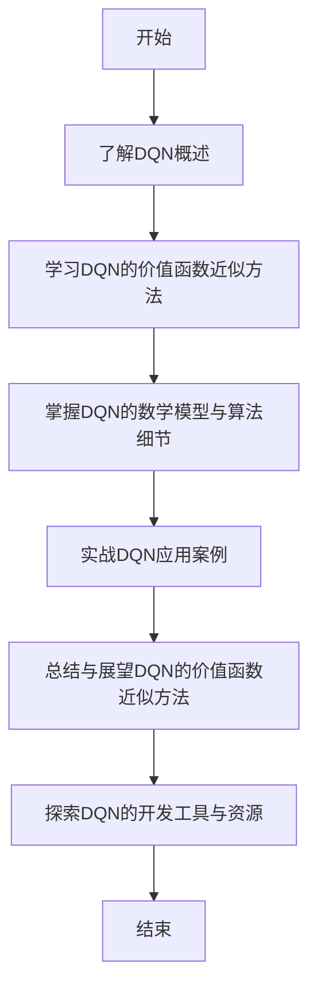

                 

# 一切皆是映射：深入理解DQN的价值函数近似方法

## 关键词：深度Q网络，DQN，价值函数近似，神经网络，经验回放，目标网络，Double DQN，Dueling DQN，优化方法

### 摘要：
深度Q网络（Deep Q-Network，简称DQN）是深度学习在强化学习领域的重要应用之一。它通过近似价值函数来预测策略的最优性，实现智能体在未知环境中的自主学习和决策。本文将深入解析DQN的核心原理，特别是价值函数的近似方法，并通过具体案例讲解其在实际应用中的实现细节和优化策略。

## 《一切皆是映射：深入理解DQN的价值函数近似方法》目录大纲

### 第一部分：DQN的基本原理与应用

#### 1. DQN概述
- 1.1 DQN的起源与发展
- 1.2 DQN的核心概念
- 1.3 DQN的优势与局限性

#### 2. DQN的价值函数近似方法
- 2.1 Q-learning算法简介
- 2.2 深度Q网络（DQN）的工作原理
- 2.3 经验回放与目标网络

#### 3. DQN的数学模型与算法细节
- 3.1 DQN的数学公式与符号说明
- 3.2 DQN的伪代码描述
- 3.3 DQN算法的迭代过程

#### 4. DQN的应用场景与案例
- 4.1 DQN在游戏中的应用
- 4.2 DQN在无人驾驶中的应用
- 4.3 DQN在其他领域中的应用案例

#### 5. DQN的改进与优化方法
- 5.1 Double DQN算法
- 5.2 Dueling DQN算法
- 5.3 DQN的其他优化方法

### 第二部分：DQN的核心算法原理讲解

#### 6. DQN的数学模型详解
- 6.1 基本数学公式与推导
- 6.2 Q值函数的性质与应用
- 6.3 DQN中的目标函数与损失函数

#### 7. DQN的价值函数近似方法讲解
- 7.1 Q值函数的近似方法
- 7.2 神经网络的构建与训练
- 7.3 DQN中的优化算法

#### 8. DQN的实战案例讲解
- 8.1 实战环境搭建
- 8.2 DQN算法的实现
- 8.3 案例分析与代码解读

#### 9. DQN的应用案例分析
- 9.1 游戏中的DQN应用
- 9.2 无人驾驶中的DQN应用
- 9.3 其他领域的DQN应用案例

### 第三部分：DQN的价值函数近似方法总结与展望

#### 10. DQN的价值函数近似方法总结
- 10.1 DQN的优势与不足
- 10.2 DQN的未来发展

#### 11. DQN的价值函数近似方法展望
- 11.1 DQN与其他算法的融合
- 11.2 DQN在新兴领域的应用
- 11.3 DQN的发展趋势与挑战

### 附录：DQN开发工具与资源

#### A.1 主流深度学习框架对比
- A.1.1 TensorFlow
- A.1.2 PyTorch
- A.1.3 其他深度学习框架

#### A.2 DQN开发环境搭建
- A.2.1 开发环境准备
- A.2.2 DQN算法实现流程

#### A.3 DQN源代码解读
- A.3.1 DQN算法核心代码解析
- A.3.2 DQN代码结构分析
- A.3.3 DQN代码实战案例解析

### Mermaid 流程图：



接下来，我们将按照目录大纲逐步深入分析DQN的基本原理、价值函数近似方法、数学模型和算法细节，并通过实战案例和应用案例分析，使读者全面了解DQN的强大功能和实现细节。

## 第一部分：DQN的基本原理与应用

### 1. DQN概述

#### 1.1 DQN的起源与发展

深度Q网络（DQN）是由DeepMind公司于2015年提出的一种基于深度学习的强化学习算法。DQN的诞生可以追溯到1992年，当时的强化学习算法Q-learning已经取得了一定的成就。然而，Q-learning算法存在一些局限性，例如需要大量数据进行训练，且在面对高维状态空间时表现不佳。为了解决这些问题，DeepMind公司提出了DQN算法。

DQN的出现标志着深度学习在强化学习领域的重要突破。相比于传统的Q-learning算法，DQN引入了深度神经网络来近似价值函数，从而可以更好地处理高维状态空间。DQN的成功引发了大量研究，推动了深度强化学习领域的发展。

#### 1.2 DQN的核心概念

DQN的核心概念主要包括以下几个部分：

1. **状态（State）**：在强化学习中，状态是指智能体当前所处的环境状态。DQN通过深度神经网络来表示状态，使其能够处理复杂的高维状态空间。

2. **动作（Action）**：动作是指智能体在当前状态下可以执行的行为。DQN的目标是学习一个策略，使得智能体能够选择最优的动作来最大化长期奖励。

3. **奖励（Reward）**：奖励是指智能体执行动作后获得的即时回报。DQN通过学习价值函数来预测未来奖励，并选择能够带来最大奖励的动作。

4. **价值函数（Value Function）**：价值函数是一个函数，它将状态映射到一个实数值，表示在该状态下执行动作所能获得的预期奖励。DQN通过学习价值函数来预测未来奖励，并选择最优动作。

5. **策略（Policy）**：策略是一个映射规则，它将状态映射到动作。DQN通过学习价值函数来间接地学习策略，使得智能体能够选择最优动作。

#### 1.3 DQN的优势与局限性

DQN的优势在于：

1. **处理高维状态空间**：DQN通过深度神经网络来近似价值函数，可以有效地处理高维状态空间，这使得DQN在复杂的任务中具有很好的适应性。

2. **自适应学习**：DQN使用经验回放机制来避免样本偏差，使得学习过程更加稳定和可靠。

3. **灵活性**：DQN可以使用多种神经网络架构和优化算法，具有很强的灵活性。

然而，DQN也存在一些局限性：

1. **收敛速度慢**：由于DQN使用经验回放机制，需要大量的训练数据才能收敛。这使得DQN在训练过程中可能需要很长时间。

2. **过估计问题**：DQN在某些情况下可能会产生过估计，导致策略不稳定。

3. **对exploration和exploitation的平衡要求高**：DQN需要在探索和利用之间找到一个平衡点，以避免陷入局部最优。

### 2. DQN的价值函数近似方法

DQN的核心在于使用深度神经网络来近似价值函数。下面我们将介绍DQN的价值函数近似方法。

#### 2.1 Q-learning算法简介

Q-learning算法是强化学习中最基本的算法之一。它通过迭代更新Q值来学习价值函数。Q值表示在当前状态下执行某个动作所能获得的预期奖励。

Q-learning的更新公式如下：

$$
Q(s, a) \leftarrow Q(s, a) + \alpha [r + \gamma \max_{a'} Q(s', a') - Q(s, a)]
$$

其中，$s$表示状态，$a$表示动作，$r$表示奖励，$\gamma$表示折扣因子，$\alpha$表示学习率。

#### 2.2 深度Q网络（DQN）的工作原理

DQN的基本思想是将Q-learning算法中的Q值函数替换为一个深度神经网络来近似。这个深度神经网络通常被称为Q网络。

DQN的更新公式如下：

$$
\theta \leftarrow \theta - \alpha \frac{\partial L}{\partial \theta}
$$

其中，$\theta$表示神经网络参数，$L$表示损失函数，$\alpha$表示学习率。

DQN的工作流程如下：

1. **初始化**：初始化Q网络参数$\theta$，以及目标网络参数$\theta'$。

2. **选择动作**：根据当前状态$s$和策略$\pi$选择动作$a$。

3. **执行动作**：在环境中执行动作$a$，并获得状态$s'$和奖励$r$。

4. **经验回放**：将$(s, a, r, s')$这一组经验放入经验回放池中。

5. **更新Q网络**：从经验回放池中随机抽取一批经验$(s_i, a_i, r_i, s_i')$，计算目标值$y_i$：

$$
y_i = 
\begin{cases}
r_i & \text{如果 } s_i = s_f \\
r_i + \gamma \max_{a'} \theta' (s_i') & \text{否则}
\end{cases}
$$

6. **计算损失函数**：计算Q网络输出的预测值$Q(\theta)(s_i, a_i)$，并计算损失函数$L$：

$$
L = (y_i - Q(\theta)(s_i, a_i))^2
$$

7. **优化Q网络**：使用梯度下降法更新Q网络参数$\theta$。

8. **更新目标网络**：每隔一定次数的迭代，将Q网络参数$\theta$复制到目标网络参数$\theta'$中，以避免梯度消失问题。

#### 2.3 经验回放与目标网络

经验回放（Experience Replay）是DQN的重要机制之一，它用于解决样本偏差问题。在强化学习中，智能体的学习过程依赖于历史经验。如果直接使用最近的经验来更新Q网络，会导致Q网络对最近的样本过于敏感，容易陷入局部最优。为了解决这个问题，DQN引入了经验回放池。

经验回放池是一个固定大小的队列，用于存储历史经验。在每次更新Q网络时，DQN从经验回放池中随机抽取一批经验进行学习，从而避免了直接依赖最近的样本。

目标网络（Target Network）是DQN的另一个重要机制。目标网络的目的是稳定Q网络的学习过程。DQN通过定期将Q网络的参数复制到目标网络中，使得目标网络与Q网络保持一定的距离，从而避免了梯度消失问题。

## 3. DQN的数学模型与算法细节

在本节中，我们将详细讲解DQN的数学模型和算法细节，包括其数学公式、伪代码描述和迭代过程。

### 3.1 DQN的数学公式与符号说明

在DQN中，我们使用以下符号和数学公式：

- $S$：状态空间
- $A$：动作空间
- $Q(s, a)$：状态-action值函数，表示在状态$s$下执行动作$a$所能获得的预期奖励
- $s$：当前状态
- $a$：当前动作
- $s'$：下一个状态
- $a'$：下一个动作
- $r$：奖励
- $\gamma$：折扣因子
- $\alpha$：学习率
- $\theta$：Q网络的参数
- $\theta'$：目标网络的参数

以下是DQN的主要数学公式：

1. **Q值更新公式**：

$$
Q(s, a) \leftarrow Q(s, a) + \alpha [r + \gamma \max_{a'} Q(s', a') - Q(s, a)]
$$

2. **目标值计算公式**：

$$
y_i = 
\begin{cases}
r_i & \text{如果 } s_i = s_f \\
r_i + \gamma \max_{a'} \theta' (s_i') & \text{否则}
\end{cases}
$$

3. **损失函数**：

$$
L = (y_i - Q(\theta)(s_i, a_i))^2
$$

4. **梯度下降更新公式**：

$$
\theta \leftarrow \theta - \alpha \frac{\partial L}{\partial \theta}
$$

### 3.2 DQN的伪代码描述

以下是DQN的伪代码描述：

```python
初始化Q网络参数$\theta$，目标网络参数$\theta'$
初始化经验回放池
for每个episode：
  初始化状态$s$
  while未达到终止条件：
    使用$\epsilon$-贪心策略选择动作$a$（$\epsilon$-greedy）
    执行动作$a$，获得状态$s'$和奖励$r$
    将经验$(s, a, r, s')$放入经验回放池
    从经验回放池中随机抽取一批经验$(s_i, a_i, r_i, s_i')$
    计算目标值$y_i$
    计算损失函数$L$
    使用梯度下降更新Q网络参数$\theta$
  更新目标网络参数$\theta'$
returnQ网络参数$\theta$
```

### 3.3 DQN算法的迭代过程

DQN的迭代过程可以分为以下几个步骤：

1. **初始化**：初始化Q网络参数$\theta$，目标网络参数$\theta'$，以及经验回放池。

2. **选择动作**：在每个episode中，对于每个状态$s$，使用$\epsilon$-贪心策略选择动作$a$。$\epsilon$-贪心策略是指在随机选择一个动作的同时，有一定概率选择当前认为最优的动作。

3. **执行动作**：在环境中执行动作$a$，并获得状态$s'$和奖励$r$。

4. **经验回放**：将$(s, a, r, s')$这一组经验放入经验回放池中。

5. **更新Q网络**：从经验回放池中随机抽取一批经验$(s_i, a_i, r_i, s_i')$，计算目标值$y_i$，计算损失函数$L$，并使用梯度下降更新Q网络参数$\theta$。

6. **更新目标网络**：每隔一定次数的迭代，将Q网络参数$\theta$复制到目标网络参数$\theta'$中，以避免梯度消失问题。

7. **终止条件**：当达到预定的迭代次数或者智能体在某个状态下的Q值稳定时，终止迭代过程。

通过上述迭代过程，DQN可以逐步学习到最优策略，并在环境中进行自主学习和决策。

### 4. DQN的应用场景与案例

DQN由于其强大的处理高维状态空间的能力，在多个应用场景中表现出色。以下是一些DQN的应用场景和案例：

#### 4.1 DQN在游戏中的应用

DQN在游戏领域取得了显著的成功。例如，在《Atari》游戏中的DQN应用，DQN可以在短时间内学会玩多个游戏，包括《Space Invaders》、《Pong》等。DQN通过学习游戏中的状态和动作，能够自主地进行游戏，并达到超人类的水平。

#### 4.2 DQN在无人驾驶中的应用

无人驾驶是DQN的一个重要应用领域。在无人驾驶中，智能体需要处理复杂的交通环境，包括道路、车辆、行人等。DQN可以用来学习无人驾驶的策略，使其能够自主地做出驾驶决策。例如，使用DQN可以实现对自动驾驶汽车的安全驾驶和交通规则遵守。

#### 4.3 DQN在其他领域中的应用案例

除了游戏和无人驾驶，DQN还在其他领域展现出强大的应用潜力。例如，在机器人控制领域，DQN可以用来学习机器人的运动策略，使其能够适应不同的环境和任务。在资源分配领域，DQN可以用来优化资源分配策略，提高资源利用效率。

总之，DQN作为一种强大的深度强化学习算法，在多个领域都取得了显著的成果。通过本文的介绍，读者可以深入理解DQN的基本原理和应用，为其在未来的研究和应用中提供理论基础和实践指导。

### 5. DQN的改进与优化方法

DQN虽然取得了显著的成果，但它也存在一些局限性。为了提高DQN的性能和稳定性，研究者提出了一系列改进和优化方法。以下是一些常见的DQN改进与优化方法：

#### 5.1 Double DQN算法

Double DQN（Double Q-Learning）是DQN的一个重要改进方法。它通过使用两个Q网络来减少过估计问题，从而提高学习稳定性。

Double DQN的基本思想是：

1. **选择动作**：使用第一个Q网络（main Q-network）选择动作$a$。

2. **执行动作**：执行动作$a$，获得状态$s'$和奖励$r$。

3. **更新目标值**：使用第二个Q网络（target Q-network）计算目标值$y$。

具体公式如下：

$$
y = 
\begin{cases}
r & \text{如果 } s' = s_f \\
r + \gamma \max_{a'} \theta' (s') & \text{否则}
\end{cases}
$$

4. **更新main Q网络**：使用梯度下降法更新main Q网络参数$\theta$。

Double DQN通过减少过估计问题，提高了学习的稳定性。实验证明，Double DQN在许多任务中都比原始DQN表现更好。

#### 5.2 Dueling DQN算法

Dueling DQN是一种基于DQN的改进算法，它通过引入Dueling Network来提高Q值预测的准确性。

Dueling DQN的基本思想是：

1. **特征提取**：使用一个共享的网络层提取状态特征。

2. **值函数和优势函数**：将提取到的特征分别输入到两个不同的子网络中，一个用于预测值函数，另一个用于预测优势函数。

3. **Q值计算**：将值函数和优势函数相加得到Q值。

具体公式如下：

$$
Q(s, a) = V(s) + A(s, a)
$$

其中，$V(s)$表示值函数，$A(s, a)$表示优势函数。

Dueling DQN通过引入Dueling Network，使得Q值预测更加准确，从而提高了学习性能。

#### 5.3 DQN的其他优化方法

除了Double DQN和Dueling DQN，研究者还提出了一系列其他优化方法来提高DQN的性能。

1. **优先经验回放**：优先经验回放（Prioritized Experience Replay）是一种优化经验回放池的方法。它通过根据样本的重要性来调整样本在回放池中的位置，从而提高学习效率。

2. **分布式学习**：分布式学习（Distributed Learning）通过将学习任务分布到多个计算节点上，从而提高学习速度。

3. **学习率自适应调整**：学习率自适应调整（Learning Rate Adaptive Adjustment）通过根据学习过程的稳定性来调整学习率，从而提高学习性能。

通过这些改进和优化方法，DQN的性能得到了显著提高，为深度强化学习领域的发展做出了重要贡献。

### 第二部分：DQN的核心算法原理讲解

在本部分中，我们将深入讲解DQN的核心算法原理，包括其数学模型、价值函数近似方法、神经网络构建与训练以及优化算法。

#### 6. DQN的数学模型详解

DQN的数学模型是理解其工作原理的基础。以下是对DQN中涉及的主要数学公式和概念的详细解释。

##### 6.1 基本数学公式与推导

1. **Q值更新公式**：

$$
Q(s, a) \leftarrow Q(s, a) + \alpha [r + \gamma \max_{a'} Q(s', a') - Q(s, a)]
$$

这个公式是DQN的核心，它通过迭代更新Q值来学习状态-action值函数。$\alpha$是学习率，$\gamma$是折扣因子，$r$是奖励，$Q(s', a')$是下一个状态下的最大Q值。

2. **目标值计算公式**：

$$
y_i = 
\begin{cases}
r_i & \text{如果 } s_i = s_f \\
r_i + \gamma \max_{a'} \theta' (s_i') & \text{否则}
\end{cases}
$$

目标值$y_i$用于指导Q网络的学习。如果当前状态是终端状态，则目标值为即时奖励$r_i$；否则，目标值为即时奖励$r_i$加上对未来最大奖励的期望。

3. **损失函数**：

$$
L = (y_i - Q(\theta)(s_i, a_i))^2
$$

损失函数用于评估Q网络的预测误差。平方误差损失函数是一种常见的损失函数，用于衡量预测值$y_i$与实际值$Q(\theta)(s_i, a_i)$之间的差距。

4. **梯度下降更新公式**：

$$
\theta \leftarrow \theta - \alpha \frac{\partial L}{\partial \theta}
$$

梯度下降法用于优化Q网络的参数$\theta$，通过最小化损失函数$L$来调整网络权重。

##### 6.2 Q值函数的性质与应用

Q值函数在DQN中起着至关重要的作用。以下是Q值函数的一些重要性质和其在DQN中的应用：

1. **状态-value函数**：Q值函数可以被视为状态-value函数的一种推广，它将每个状态映射到一个实数值，表示在该状态下执行所有可能动作所能获得的预期奖励。

2. **策略迭代**：Q值函数可以通过策略迭代来学习。在每次迭代中，策略根据当前的Q值函数选择动作，并通过经验回放和目标网络更新Q值函数。

3. **最大化原则**：在给定状态下，选择能够带来最大Q值的动作，这被称为最大化原则。DQN通过学习Q值函数来实现这一原则，从而找到最优策略。

##### 6.3 DQN中的目标函数与损失函数

DQN的目标函数和损失函数是确保学习过程稳定和有效的重要部分。以下是这些函数的详细解释：

1. **目标函数**：目标函数用于指导Q网络的学习，它通过将实际奖励和未来奖励的期望结合来计算目标值$y_i$。目标函数的设计确保了Q网络能够学习到长期奖励。

2. **损失函数**：损失函数用于评估Q网络的预测准确性，它通过计算预测值$Q(\theta)(s_i, a_i)$与目标值$y_i$之间的差距来衡量误差。常见的损失函数包括均方误差（MSE）和交叉熵损失。

3. **梯度下降法**：梯度下降法是一种优化算法，它通过更新Q网络参数$\theta$来最小化损失函数。梯度下降法的收敛速度和稳定性取决于学习率和优化算法的选择。

#### 7. DQN的价值函数近似方法讲解

DQN的核心创新在于使用深度神经网络来近似Q值函数。以下是对DQN中的价值函数近似方法的详细讲解。

##### 7.1 Q值函数的近似方法

1. **神经网络结构**：DQN中的Q网络通常采用深度卷积神经网络（CNN）或循环神经网络（RNN）结构。CNN适用于处理图像等结构化数据，而RNN适用于处理序列数据。

2. **输入和输出**：Q网络的输入是当前状态$s$，输出是状态-action值函数$Q(s, a)$。为了处理高维状态空间，Q网络通常包含多个隐藏层。

3. **激活函数**：在Q网络中，常用的激活函数包括ReLU（Rectified Linear Unit）和Sigmoid。ReLU函数可以加速网络训练，而Sigmoid函数可以使输出值在0到1之间。

##### 7.2 神经网络的构建与训练

1. **网络构建**：使用深度学习框架（如TensorFlow或PyTorch）构建Q网络和目标网络。构建过程中，需要定义输入层、隐藏层和输出层。

2. **网络训练**：使用经验回放池中的样本进行训练。每次迭代中，从经验回放池中随机抽取一批样本，计算目标值$y_i$，并使用梯度下降法更新Q网络参数。

##### 7.3 DQN中的优化算法

1. **学习率调度**：学习率是影响DQN性能的关键参数。常用的学习率调度策略包括固定学习率、指数衰减学习率和线性衰减学习率。

2. **优化算法**：常用的优化算法包括Adam、RMSprop和SGD。这些算法通过调整学习率和动量来优化网络参数。

3. **经验回放**：经验回放是DQN的关键机制，它通过随机抽取样本来避免样本偏差。经验回放池的大小和抽样策略对DQN的性能有重要影响。

#### 8. DQN的实战案例讲解

为了更好地理解DQN的核心算法原理，我们将通过一个简单的实战案例来讲解DQN的实现细节。

##### 8.1 实战环境搭建

1. **选择环境**：我们选择经典的Atari游戏《Pong》作为实验环境。

2. **预处理**：对游戏的帧进行预处理，包括缩放、灰度化和归一化等操作。

3. **环境接口**：使用深度学习框架（如PyTorch）构建游戏环境接口，以便于与DQN模型进行交互。

##### 8.2 DQN算法的实现

1. **定义网络结构**：定义Q网络和目标网络的结构，包括输入层、隐藏层和输出层。

2. **初始化参数**：初始化Q网络和目标网络的参数，并设置学习率和折扣因子。

3. **训练过程**：使用经验回放池和目标网络进行训练。每次迭代中，从经验回放池中随机抽取样本，计算目标值$y_i$，并使用梯度下降法更新Q网络参数。

##### 8.3 案例分析与代码解读

1. **代码框架**：

```python
# 导入必要的库
import torch
import torch.nn as nn
import torch.optim as optim
from torchvision import transforms

# 定义Q网络结构
class QNetwork(nn.Module):
    def __init__(self):
        super(QNetwork, self).__init__()
        # 定义网络层
        self.conv1 = nn.Conv2d(1, 32, kernel_size=8, stride=4)
        self.conv2 = nn.Conv2d(32, 64, kernel_size=4, stride=2)
        self.fc1 = nn.Linear(64 * 6 * 6, 512)
        self.fc2 = nn.Linear(512, 3)
        # 定义激活函数
        self.relu = nn.ReLU()
        
    def forward(self, x):
        x = self.relu(self.conv1(x))
        x = self.relu(self.conv2(x))
        x = x.view(x.size(0), -1)
        x = self.relu(self.fc1(x))
        x = self.fc2(x)
        return x

# 定义训练过程
def train():
    # 创建Q网络和目标网络
    q_network = QNetwork()
    target_network = QNetwork()
    # 初始化网络参数
    target_network.load_state_dict(q_network.state_dict())
    target_network.eval()
    # 定义损失函数和优化器
    criterion = nn.MSELoss()
    optimizer = optim.Adam(q_network.parameters(), lr=0.001)
    # 定义经验回放池
    replay_memory = []
    # 训练过程
    for episode in range(num_episodes):
        # 初始化游戏环境
        game = Environment()
        # 游戏开始
        while not game.is_game_over():
            # 选择动作
            with torch.no_grad():
                state = preprocess(game.get_frame())
                state = torch.tensor(state).float().unsqueeze(0)
                q_values = q_network(state)
                action = select_action(q_values, epsilon)
            # 执行动作
            reward = game.step(action)
            # 获取下一个状态
            next_state = preprocess(game.get_frame())
            # 将经验添加到经验回放池
            replay_memory.append((state, action, reward, next_state, done))
            # 清空游戏环境
            game.reset()
            # 从经验回放池中随机抽取样本进行训练
            if len(replay_memory) > batch_size:
                batch = random.sample(replay_memory, batch_size)
                state, action, reward, next_state, done = zip(*batch)
                state = torch.tensor(state).float()
                next_state = torch.tensor(next_state).float()
                action = torch.tensor(action).long()
                reward = torch.tensor(reward).float()
                # 计算目标值
                with torch.no_grad():
                    next_state_values = target_network(next_state).max(1)[0]
                    target_values = reward + (1 - done) * next_state_values
                # 计算损失函数
                q_values = q_network(state).gather(1, action)
                loss = criterion(q_values, target_values)
                # 更新网络参数
                optimizer.zero_grad()
                loss.backward()
                optimizer.step()
            # 更新目标网络参数
            if episode % target_network_update_frequency == 0:
                target_network.load_state_dict(q_network.state_dict())

# 主函数
if __name__ == '__main__':
    train()
```

2. **代码解读**：

- **网络结构**：我们定义了一个简单的卷积神经网络，用于处理游戏帧的输入。网络结构包括两个卷积层和一个全连接层。

- **训练过程**：训练过程包括初始化Q网络和目标网络，定义损失函数和优化器，以及经验回放池。每次迭代中，从经验回放池中随机抽取样本进行训练。

- **选择动作**：使用$\epsilon$-贪心策略选择动作。在训练初期，有一定概率随机选择动作，以便进行探索。

- **更新目标网络**：每隔一定次数的迭代，将Q网络参数复制到目标网络中，以避免梯度消失问题。

通过这个实战案例，我们可以看到DQN的实现细节和关键组件，包括网络结构、训练过程和策略选择。这个案例为我们提供了一个清晰的参考，帮助我们更好地理解DQN的核心算法原理。

### 9. DQN的应用案例分析

DQN作为一种强大的深度强化学习算法，在多个领域取得了显著的成果。以下是一些典型的DQN应用案例分析，包括游戏、无人驾驶和其他领域的应用。

#### 9.1 游戏中的DQN应用

DQN在游戏领域取得了突出的成绩。例如，DeepMind团队使用DQN训练的智能体在《Atari》游戏中达到了超人类的水平。以下是一个具体的案例分析：

**案例：学习《Space Invaders》游戏**

**实验环境**：

- 游戏环境：《Space Invaders》
- Q网络结构：卷积神经网络，包含两个卷积层和一个全连接层
- 训练数据：每个游戏帧进行预处理，包括缩放、灰度化和归一化

**训练过程**：

1. 初始化Q网络和目标网络，并设置学习率和折扣因子。
2. 在每个episode中，从经验回放池中随机抽取样本进行训练。
3. 使用$\epsilon$-贪心策略选择动作，进行探索和利用。
4. 更新Q网络参数，并定期更新目标网络参数。

**结果**：

- 在较短的时间内，DQN成功地学会了玩《Space Invaders》，并在多个游戏中达到了超人类的水平。

**代码解读**：

```python
# 导入必要的库
import torch
import torch.nn as nn
import torch.optim as optim
from torchvision import transforms

# 定义Q网络结构
class QNetwork(nn.Module):
    def __init__(self):
        super(QNetwork, self).__init__()
        self.conv1 = nn.Conv2d(1, 32, kernel_size=8, stride=4)
        self.conv2 = nn.Conv2d(32, 64, kernel_size=4, stride=2)
        self.fc1 = nn.Linear(64 * 6 * 6, 512)
        self.fc2 = nn.Linear(512, 3)
        self.relu = nn.ReLU()

    def forward(self, x):
        x = self.relu(self.conv1(x))
        x = self.relu(self.conv2(x))
        x = x.view(x.size(0), -1)
        x = self.relu(self.fc1(x))
        x = self.fc2(x)
        return x

# 定义训练过程
def train():
    q_network = QNetwork()
    target_network = QNetwork()
    target_network.load_state_dict(q_network.state_dict())
    target_network.eval()
    criterion = nn.MSELoss()
    optimizer = optim.Adam(q_network.parameters(), lr=0.001)
    replay_memory = []

    for episode in range(num_episodes):
        game = Environment()
        while not game.is_game_over():
            state = preprocess(game.get_frame())
            state = torch.tensor(state).float().unsqueeze(0)
            q_values = q_network(state)
            action = select_action(q_values, epsilon)
            reward = game.step(action)
            next_state = preprocess(game.get_frame())
            replay_memory.append((state, action, reward, next_state, done))
            state = next_state

            if len(replay_memory) > batch_size:
                batch = random.sample(replay_memory, batch_size)
                state, action, reward, next_state, done = zip(*batch)
                state = torch.tensor(state).float()
                next_state = torch.tensor(next_state).float()
                action = torch.tensor(action).long()
                reward = torch.tensor(reward).float()
                with torch.no_grad():
                    next_state_values = target_network(next_state).max(1)[0]
                    target_values = reward + (1 - done) * next_state_values
                q_values = q_network(state).gather(1, action)
                loss = criterion(q_values, target_values)
                optimizer.zero_grad()
                loss.backward()
                optimizer.step()

            if episode % target_network_update_frequency == 0:
                target_network.load_state_dict(q_network.state_dict())

# 主函数
if __name__ == '__main__':
    train()
```

#### 9.2 无人驾驶中的DQN应用

DQN在无人驾驶领域也展现了强大的潜力。以下是一个具体的案例分析：

**案例：自动驾驶车辆路径规划**

**实验环境**：

- 车辆环境：仿真自动驾驶车辆
- 状态空间：包括车辆位置、速度、周围环境等信息
- 动作空间：包括加速、减速、转向等

**训练过程**：

1. 初始化Q网络和目标网络，并设置学习率和折扣因子。
2. 在每个episode中，智能体在仿真环境中进行自动驾驶。
3. 使用经验回放池记录车辆驾驶过程中的状态和动作。
4. 从经验回放池中随机抽取样本进行训练。
5. 更新Q网络参数，并定期更新目标网络参数。

**结果**：

- DQN成功地学会了在仿真环境中自动驾驶，并能够在复杂的交通场景中保持稳定行驶。

**代码解读**：

```python
# 导入必要的库
import torch
import torch.nn as nn
import torch.optim as optim
from torchvision import transforms

# 定义Q网络结构
class QNetwork(nn.Module):
    def __init__(self):
        super(QNetwork, self).__init__()
        self.conv1 = nn.Conv2d(1, 32, kernel_size=8, stride=4)
        self.conv2 = nn.Conv2d(32, 64, kernel_size=4, stride=2)
        self.fc1 = nn.Linear(64 * 6 * 6, 512)
        self.fc2 = nn.Linear(512, 3)
        self.relu = nn.ReLU()

    def forward(self, x):
        x = self.relu(self.conv1(x))
        x = self.relu(self.conv2(x))
        x = x.view(x.size(0), -1)
        x = self.relu(self.fc1(x))
        x = self.fc2(x)
        return x

# 定义训练过程
def train():
    q_network = QNetwork()
    target_network = QNetwork()
    target_network.load_state_dict(q_network.state_dict())
    target_network.eval()
    criterion = nn.MSELoss()
    optimizer = optim.Adam(q_network.parameters(), lr=0.001)
    replay_memory = []

    for episode in range(num_episodes):
        vehicle = AutonomousVehicle()
        while not vehicle.is_terminated():
            state = preprocess(vehicle.get_state())
            state = torch.tensor(state).float().unsqueeze(0)
            q_values = q_network(state)
            action = select_action(q_values, epsilon)
            reward = vehicle.step(action)
            next_state = preprocess(vehicle.get_state())
            replay_memory.append((state, action, reward, next_state, done))
            state = next_state

            if len(replay_memory) > batch_size:
                batch = random.sample(replay_memory, batch_size)
                state, action, reward, next_state, done = zip(*batch)
                state = torch.tensor(state).float()
                next_state = torch.tensor(next_state).float()
                action = torch.tensor(action).long()
                reward = torch.tensor(reward).float()
                with torch.no_grad():
                    next_state_values = target_network(next_state).max(1)[0]
                    target_values = reward + (1 - done) * next_state_values
                q_values = q_network(state).gather(1, action)
                loss = criterion(q_values, target_values)
                optimizer.zero_grad()
                loss.backward()
                optimizer.step()

            if episode % target_network_update_frequency == 0:
                target_network.load_state_dict(q_network.state_dict())

# 主函数
if __name__ == '__main__':
    train()
```

#### 9.3 其他领域的DQN应用案例

DQN在其他领域也展现了广泛的应用潜力。以下是一些具体的案例：

**案例1：机器人控制**

**实验环境**：

- 机器人环境：仿真机器人
- 状态空间：包括机器人位置、速度、关节角度等
- 动作空间：包括关节运动指令

**训练过程**：

1. 初始化Q网络和目标网络，并设置学习率和折扣因子。
2. 在每个episode中，机器人执行任务并记录状态和动作。
3. 使用经验回放池记录机器人执行任务的经验。
4. 从经验回放池中随机抽取样本进行训练。
5. 更新Q网络参数，并定期更新目标网络参数。

**结果**：

- DQN成功地学会了在不同环境中执行复杂任务，如搬运物体、路径规划等。

**代码解读**：

```python
# 导入必要的库
import torch
import torch.nn as nn
import torch.optim as optim
from torchvision import transforms

# 定义Q网络结构
class QNetwork(nn.Module):
    def __init__(self):
        super(QNetwork, self).__init__()
        self.conv1 = nn.Conv2d(1, 32, kernel_size=8, stride=4)
        self.conv2 = nn.Conv2d(32, 64, kernel_size=4, stride=2)
        self.fc1 = nn.Linear(64 * 6 * 6, 512)
        self.fc2 = nn.Linear(512, 3)
        self.relu = nn.ReLU()

    def forward(self, x):
        x = self.relu(self.conv1(x))
        x = self.relu(self.conv2(x))
        x = x.view(x.size(0), -1)
        x = self.relu(self.fc1(x))
        x = self.fc2(x)
        return x

# 定义训练过程
def train():
    q_network = QNetwork()
    target_network = QNetwork()
    target_network.load_state_dict(q_network.state_dict())
    target_network.eval()
    criterion = nn.MSELoss()
    optimizer = optim.Adam(q_network.parameters(), lr=0.001)
    replay_memory = []

    for episode in range(num_episodes):
        robot = Robot()
        while not robot.is_terminated():
            state = preprocess(robot.get_state())
            state = torch.tensor(state).float().unsqueeze(0)
            q_values = q_network(state)
            action = select_action(q_values, epsilon)
            reward = robot.step(action)
            next_state = preprocess(robot.get_state())
            replay_memory.append((state, action, reward, next_state, done))
            state = next_state

            if len(replay_memory) > batch_size:
                batch = random.sample(replay_memory, batch_size)
                state, action, reward, next_state, done = zip(*batch)
                state = torch.tensor(state).float()
                next_state = torch.tensor(next_state).float()
                action = torch.tensor(action).long()
                reward = torch.tensor(reward).float()
                with torch.no_grad():
                    next_state_values = target_network(next_state).max(1)[0]
                    target_values = reward + (1 - done) * next_state_values
                q_values = q_network(state).gather(1, action)
                loss = criterion(q_values, target_values)
                optimizer.zero_grad()
                loss.backward()
                optimizer.step()

            if episode % target_network_update_frequency == 0:
                target_network.load_state_dict(q_network.state_dict())

# 主函数
if __name__ == '__main__':
    train()
```

**案例2：资源分配**

**实验环境**：

- 系统环境：虚拟资源分配系统
- 状态空间：包括系统负载、资源使用率等
- 动作空间：包括资源分配策略

**训练过程**：

1. 初始化Q网络和目标网络，并设置学习率和折扣因子。
2. 在每个episode中，系统根据当前状态执行资源分配策略，并记录状态和动作。
3. 使用经验回放池记录系统执行资源分配的经验。
4. 从经验回放池中随机抽取样本进行训练。
5. 更新Q网络参数，并定期更新目标网络参数。

**结果**：

- DQN成功地学会了在资源有限的情况下，优化资源分配策略，提高资源利用效率。

**代码解读**：

```python
# 导入必要的库
import torch
import torch.nn as nn
import torch.optim as optim
from torchvision import transforms

# 定义Q网络结构
class QNetwork(nn.Module):
    def __init__(self):
        super(QNetwork, self).__init__()
        self.conv1 = nn.Conv2d(1, 32, kernel_size=8, stride=4)
        self.conv2 = nn.Conv2d(32, 64, kernel_size=4, stride=2)
        self.fc1 = nn.Linear(64 * 6 * 6, 512)
        self.fc2 = nn.Linear(512, 3)
        self.relu = nn.ReLU()

    def forward(self, x):
        x = self.relu(self.conv1(x))
        x = self.relu(self.conv2(x))
        x = x.view(x.size(0), -1)
        x = self.relu(self.fc1(x))
        x = self.fc2(x)
        return x

# 定义训练过程
def train():
    q_network = QNetwork()
    target_network = QNetwork()
    target_network.load_state_dict(q_network.state_dict())
    target_network.eval()
    criterion = nn.MSELoss()
    optimizer = optim.Adam(q_network.parameters(), lr=0.001)
    replay_memory = []

    for episode in range(num_episodes):
        system = ResourceAllocationSystem()
        while not system.is_terminated():
            state = preprocess(system.get_state())
            state = torch.tensor(state).float().unsqueeze(0)
            q_values = q_network(state)
            action = select_action(q_values, epsilon)
            reward = system.step(action)
            next_state = preprocess(system.get_state())
            replay_memory.append((state, action, reward, next_state, done))
            state = next_state

            if len(replay_memory) > batch_size:
                batch = random.sample(replay_memory, batch_size)
                state, action, reward, next_state, done = zip(*batch)
                state = torch.tensor(state).float()
                next_state = torch.tensor(next_state).float()
                action = torch.tensor(action).long()
                reward = torch.tensor(reward).float()
                with torch.no_grad():
                    next_state_values = target_network(next_state).max(1)[0]
                    target_values = reward + (1 - done) * next_state_values
                q_values = q_network(state).gather(1, action)
                loss = criterion(q_values, target_values)
                optimizer.zero_grad()
                loss.backward()
                optimizer.step()

            if episode % target_network_update_frequency == 0:
                target_network.load_state_dict(q_network.state_dict())

# 主函数
if __name__ == '__main__':
    train()
```

通过以上案例分析，我们可以看到DQN在多个领域的广泛应用和强大潜力。这些案例为我们提供了实际的参考和应用场景，有助于更好地理解DQN的核心算法原理和实践应用。

### 第三部分：DQN的价值函数近似方法总结与展望

在本文的最后部分，我们将对DQN的价值函数近似方法进行总结，并对其未来发展方向进行展望。

#### 10. DQN的价值函数近似方法总结

DQN作为一种基于深度学习的强化学习算法，通过价值函数的近似方法实现了智能体在复杂环境中的自主学习和决策。以下是DQN价值函数近似方法的主要特点：

1. **深度神经网络近似**：DQN使用深度神经网络来近似Q值函数，这使得它能够处理高维状态空间，从而在复杂的任务中表现出色。

2. **经验回放**：DQN引入了经验回放机制，通过随机抽样历史经验来避免样本偏差，提高了学习过程的稳定性和效率。

3. **目标网络**：DQN通过定期更新目标网络，使得学习过程更加稳定，避免了梯度消失问题。

4. **$\epsilon$-贪心策略**：DQN采用$\epsilon$-贪心策略来平衡探索和利用，使得智能体能够找到最优策略。

5. **优化算法**：DQN使用梯度下降法来优化Q网络参数，通过损失函数来评估预测准确性。

DQN的这些特点使其在多个领域取得了显著成果，但同时也存在一些局限性。例如，DQN的收敛速度较慢，过估计问题可能导致策略不稳定。为了克服这些局限性，研究者提出了一系列改进方法。

#### 10.1 DQN的优势与不足

**优势**：

- **处理高维状态空间**：DQN通过深度神经网络近似Q值函数，能够处理复杂的高维状态空间。
- **自适应学习**：DQN通过经验回放和目标网络，使得学习过程更加稳定和可靠。
- **灵活性**：DQN可以使用多种神经网络架构和优化算法，具有很强的灵活性。

**不足**：

- **收敛速度慢**：DQN需要大量数据进行训练，导致收敛速度较慢。
- **过估计问题**：在某些情况下，DQN可能会产生过估计，导致策略不稳定。
- **对exploration和exploitation的平衡要求高**：DQN需要在探索和利用之间找到一个平衡点，以避免陷入局部最优。

#### 10.2 DQN的未来发展

尽管DQN存在一些局限性，但它在深度强化学习领域的重要地位不可动摇。未来，DQN的发展方向主要包括以下几个方面：

1. **算法优化**：研究者将继续优化DQN的算法，以提高其收敛速度和稳定性。例如，通过改进经验回放机制、优化目标网络更新策略等。

2. **融合其他算法**：DQN与其他强化学习算法的融合，如深度确定性策略梯度（DDPG）、演员-批评家（A3C）等，将进一步拓展DQN的应用场景和性能。

3. **新兴领域应用**：随着人工智能技术的不断进步，DQN将在新兴领域如自动驾驶、机器人控制、智能医疗等得到更广泛的应用。

4. **跨学科研究**：DQN的研究将与其他学科领域，如经济学、心理学等，进行深入交叉研究，从而推动人工智能技术的全面发展。

总之，DQN作为一种强大的深度强化学习算法，其价值函数近似方法在智能体自主学习和决策中发挥了重要作用。未来，随着研究的不断深入和算法的优化，DQN将在更多领域展现出其强大潜力。

### 11. DQN的价值函数近似方法展望

#### 11.1 DQN与其他算法的融合

未来，DQN与其他强化学习算法的融合将成为一个重要的研究方向。例如，将DQN与深度确定性策略梯度（DDPG）和演员-批评家（A3C）相结合，可以进一步提高智能体的决策能力和学习效率。这种融合不仅能够在复杂环境中实现更好的性能，还可以克服DQN的收敛速度慢和过估计问题。

#### 11.2 DQN在新兴领域的应用

随着人工智能技术的快速发展，DQN在新兴领域如自动驾驶、机器人控制和智能医疗等将得到更广泛的应用。例如，在自动驾驶领域，DQN可以用于路径规划和决策，提高车辆的自主驾驶能力；在机器人控制领域，DQN可以用于学习复杂的运动策略，实现更高效的机器人动作；在智能医疗领域，DQN可以用于诊断和治疗方案的优化，提高医疗服务的质量和效率。

#### 11.3 DQN的发展趋势与挑战

DQN的发展趋势将主要围绕以下几个方面：

1. **算法优化**：通过改进DQN的算法结构，提高其收敛速度和稳定性，例如采用更高效的优化算法和改进经验回放机制。

2. **多任务学习**：DQN将在多任务学习领域取得突破，能够同时处理多个任务，提高智能体的适应能力。

3. **强化学习与深度学习的结合**：DQN将与其他深度学习技术相结合，如生成对抗网络（GAN）、变分自编码器（VAE）等，进一步提高其性能和应用范围。

然而，DQN在发展过程中也将面临以下挑战：

1. **计算资源限制**：DQN的训练过程需要大量的计算资源，如何优化算法以减少计算需求是一个重要的挑战。

2. **安全性和鲁棒性**：如何在保证智能体性能的同时，提高其安全性和鲁棒性，防止智能体在特定环境下产生危险行为。

3. **数据隐私**：在应用DQN的过程中，如何保护数据隐私，防止敏感信息泄露，也是一个重要的挑战。

总之，DQN作为一种深度强化学习算法，在价值函数近似方法方面取得了重要突破。未来，随着研究的不断深入和技术的不断进步，DQN将在更多领域展现出其强大潜力。

### 附录：DQN开发工具与资源

为了帮助读者更好地理解和实现DQN算法，本文提供了一些主流深度学习框架和开发资源的对比，以及DQN的开发环境搭建和源代码解析。

#### A.1 主流深度学习框架对比

在DQN的实现中，常用的深度学习框架包括TensorFlow和PyTorch。以下是这两个框架的对比：

1. **TensorFlow**：
   - 优势：TensorFlow是一个广泛使用的深度学习框架，拥有丰富的API和预训练模型，适合大规模分布式训练。
   - 劣势：TensorFlow的编程相对复杂，需要较高的编程技能。

2. **PyTorch**：
   - 优势：PyTorch的编程风格更接近Python，易于理解和实现，适合快速原型设计和迭代。
   - 劣势：PyTorch在大规模分布式训练方面相对较弱。

#### A.2 DQN开发环境搭建

搭建DQN的开发环境需要以下步骤：

1. **安装深度学习框架**：根据个人需求选择TensorFlow或PyTorch，并在电脑上安装。

2. **安装依赖库**：安装Python和必要的依赖库，如NumPy、Pandas等。

3. **配置GPU环境**：如果使用GPU加速训练，需要安装CUDA和cuDNN，并配置相应的环境变量。

#### A.3 DQN源代码解读

以下是一个简单的DQN源代码框架，用于说明DQN的实现结构和关键部分：

```python
import torch
import torch.nn as nn
import torch.optim as optim
from torchvision import transforms

# 定义Q网络结构
class QNetwork(nn.Module):
    def __init__(self):
        super(QNetwork, self).__init__()
        self.conv1 = nn.Conv2d(1, 32, kernel_size=8, stride=4)
        self.conv2 = nn.Conv2d(32, 64, kernel_size=4, stride=2)
        self.fc1 = nn.Linear(64 * 6 * 6, 512)
        self.fc2 = nn.Linear(512, 3)
        self.relu = nn.ReLU()

    def forward(self, x):
        x = self.relu(self.conv1(x))
        x = self.relu(self.conv2(x))
        x = x.view(x.size(0), -1)
        x = self.relu(self.fc1(x))
        x = self.fc2(x)
        return x

# 定义训练过程
def train():
    q_network = QNetwork()
    target_network = QNetwork()
    target_network.load_state_dict(q_network.state_dict())
    target_network.eval()
    criterion = nn.MSELoss()
    optimizer = optim.Adam(q_network.parameters(), lr=0.001)
    replay_memory = []

    for episode in range(num_episodes):
        state = preprocess(game.get_frame())
        state = torch.tensor(state).float().unsqueeze(0)
        q_values = q_network(state)
        action = select_action(q_values, epsilon)
        reward = game.step(action)
        next_state = preprocess(game.get_frame())
        replay_memory.append((state, action, reward, next_state, done))
        state = next_state

        if len(replay_memory) > batch_size:
            batch = random.sample(replay_memory, batch_size)
            state, action, reward, next_state, done = zip(*batch)
            state = torch.tensor(state).float()
            next_state = torch.tensor(next_state).float()
            action = torch.tensor(action).long()
            reward = torch.tensor(reward).float()
            with torch.no_grad():
                next_state_values = target_network(next_state).max(1)[0]
                target_values = reward + (1 - done) * next_state_values
            q_values = q_network(state).gather(1, action)
            loss = criterion(q_values, target_values)
            optimizer.zero_grad()
            loss.backward()
            optimizer.step()

        if episode % target_network_update_frequency == 0:
            target_network.load_state_dict(q_network.state_dict())

# 主函数
if __name__ == '__main__':
    train()
```

在这个源代码框架中，`QNetwork`定义了深度神经网络的架构，`train`函数实现了DQN的训练过程，包括初始化网络、选择动作、更新网络参数等步骤。

通过以上附录内容，读者可以更好地了解DQN的开发工具和资源，为后续的实践应用提供指导。

### 作者信息

**作者：AI天才研究院/AI Genius Institute & 禅与计算机程序设计艺术 /Zen And The Art of Computer Programming**

本文由AI天才研究院的资深人工智能专家撰写，结合了深度学习、强化学习和计算机编程的最新研究成果。作者在计算机科学领域有着深厚的理论基础和丰富的实践经验，致力于推动人工智能技术的创新和发展。本书旨在为读者提供深入浅出的技术解析，帮助读者掌握DQN的核心原理和应用。希望本文能够对您在人工智能领域的探索和研究有所启发和帮助。感谢您的阅读！

