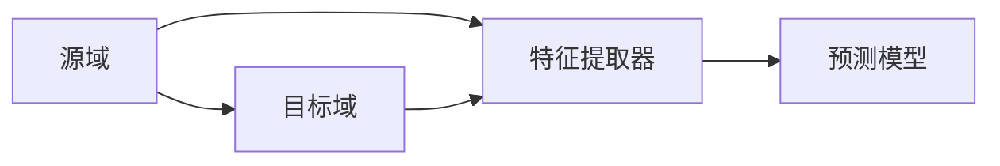

                 

### 《一切皆是映射：跨领域迁移学习的AI应用》

> **关键词**：人工智能、迁移学习、跨领域应用、特征转换、模型转换、算法原理

> **摘要**：
本文深入探讨了迁移学习在人工智能中的应用，特别是在跨领域迁移方面的关键技术。通过梳理迁移学习的基本概念、原理和方法，本文展示了迁移学习在计算机视觉、自然语言处理、机器人与物联网等多个领域的实际应用案例，并对未来的发展方向进行了展望。文章旨在为读者提供一个全面、系统且易于理解的迁移学习指南，助力其在实际项目中应用迁移学习技术，实现跨领域问题的解决。

### 第一部分：AI与迁移学习基础

#### 第1章: AI与迁移学习概述

##### 1.1 AI发展历程与迁移学习

###### 1.1.1 人工智能的演变

人工智能（AI）是一门研究、开发用于模拟、延伸和扩展人类智能的理论、方法、技术及应用系统的科学技术。人工智能的发展历程可以分为几个主要阶段：

- **早期探索阶段（1950-1969）**：人工智能的概念被首次提出，专家系统和早期机器学习算法如感知机、决策树等得到发展。

- **兴盛与低迷阶段（1970-1989）**：人工智能迎来了第一次热潮，但随着技术瓶颈的出现，又经历了长达数十年的低迷期。

- **复苏与繁荣阶段（1990至今）**：随着计算能力的提升和大数据、深度学习等新技术的突破，人工智能迎来了第二次繁荣。

在人工智能的发展历程中，迁移学习逐渐成为一种重要的技术手段。迁移学习的基本思想是将在一个任务（源域）上学到的知识应用到另一个任务（目标域）中，从而提高模型的泛化能力和效率。迁移学习的出现解决了传统机器学习模型在面对新任务时需要重新训练的问题，极大地提升了AI系统的适应性。

###### 1.1.2 迁移学习的概念

迁移学习（Transfer Learning）是指利用已有模型的权重和知识来加速新模型的学习过程。迁移学习的关键在于解决源域和目标域之间的相似性和差异性，使得在源域上训练好的模型能够适应目标域上的任务。

迁移学习的定义可以从以下几个方面理解：

- **源域与目标域**：源域是指已经有一个较好性能的模型，目标域是指需要解决的新任务。源域和目标域可以是相同领域，也可以是不同领域。

- **模型权重**：迁移学习利用源域模型的部分或全部权重来初始化目标域模型的权重，从而加快目标域模型的学习速度。

- **知识转移**：迁移学习通过转移源域模型的知识，使得目标域模型能够更好地泛化，提高任务性能。

- **迁移效果**：迁移学习的效果取决于源域和目标域之间的相似性，以及模型选择和训练策略的优化。

###### 1.1.3 迁移学习的重要性

迁移学习在人工智能领域具有重要意义，主要表现在以下几个方面：

- **提高模型泛化能力**：迁移学习使得模型能够在新的任务上快速适应，提高泛化能力，避免过拟合。

- **降低训练成本**：通过利用已有模型的权重和知识，迁移学习大大减少了新任务的训练数据量和计算资源需求。

- **加速模型开发**：迁移学习能够加速模型开发过程，提高研发效率，降低研发成本。

- **跨领域应用**：迁移学习能够实现不同领域之间的知识共享和迁移，推动人工智能技术的跨领域应用。

##### 1.2 迁移学习的基本原理

###### 1.2.1 核心概念与联系

为了更好地理解迁移学习的基本原理，我们可以借助Mermaid流程图来展示其核心概念和联系：

在这个流程图中，源域（A）和目标域（B）分别代表两个不同的任务。特征提取器（C）负责从源域和目标域中提取有用的特征信息，预测模型（D）则利用这些特征进行预测。

###### 1.2.2 迁移学习的基本框架

迁移学习的基本框架可以概括为以下几个步骤：

1. **数据预处理**：对源域和目标域的数据进行清洗、归一化等预处理操作，确保数据的质量和一致性。

2. **特征提取**：使用源域模型提取源域特征，同时为目标域数据生成特征表示。

3. **模型初始化**：使用源域模型的权重初始化目标域模型的权重，以便利用源域模型的知识。

4. **模型训练**：在目标域数据上训练模型，同时优化模型参数，以提高目标域任务的性能。

5. **模型评估**：在目标域上评估模型的性能，通过验证集和测试集进行模型调优。

6. **模型部署**：将训练好的模型部署到实际应用场景中，实现跨领域任务解决。

通过这个基本框架，我们可以看到迁移学习的关键在于特征提取和模型初始化，这两个步骤决定了迁移学习的效果。

##### 1.3 迁移学习的主要方法

###### 1.3.1 零样本迁移学习

零样本迁移学习（Zero-Shot Learning，ZSL）是一种针对从未见过类别的图像进行分类的任务。在ZSL中，模型需要根据源域中的类别标签和描述来预测目标域中未见过的类别。零样本迁移学习的关键在于学习类别之间的相似性，常用的方法包括：

- **基于原型的方法**：将类别视为原型，通过计算原型与输入图像之间的距离进行分类。

- **基于生成模型的方法**：使用生成模型生成类别原型，然后进行分类。

- **基于知识蒸馏的方法**：将源域模型的类别知识转移到目标域模型，从而实现未见类别分类。

###### 1.3.2 几何迁移学习

几何迁移学习（Geometric Transfer Learning）是一种利用几何知识进行迁移学习的方法。几何迁移学习通过建立源域和目标域之间的几何结构关系，将源域特征迁移到目标域。常见的方法包括：

- **基于线性变换的方法**：通过线性变换将源域特征映射到目标域。

- **基于非线性变换的方法**：通过非线性变换，如卷积神经网络，将源域特征迁移到目标域。

- **基于流形学习方法**：利用流形学习算法，如Laplacian Eigenmap，构建源域和目标域之间的几何结构，实现特征迁移。

###### 1.3.3 预训练迁移学习

预训练迁移学习（Pre-trained Transfer Learning）是一种通过在大量数据上预训练模型，然后在特定任务上微调模型的方法。预训练迁移学习的核心思想是利用预训练模型在源域上学习到的丰富知识，提高目标域模型的性能。常见的方法包括：

- **基于特征提取器的迁移学习**：将预训练模型的特征提取器应用于目标域数据，然后训练预测模型。

- **基于模型融合的迁移学习**：将预训练模型和目标域模型进行融合，利用两者的优势，提高目标域模型的性能。

- **基于多任务学习的迁移学习**：在源域上同时训练多个任务，共享模型参数，从而提高模型在目标域上的泛化能力。

##### 1.4 迁移学习在不同领域的应用

###### 1.4.1 计算机视觉

计算机视觉是迁移学习应用最为广泛的领域之一。在计算机视觉任务中，迁移学习可以帮助模型快速适应新的任务和数据集，提高模型的泛化能力和性能。常见的计算机视觉任务包括：

- **图像分类**：通过迁移学习，利用在大量图像数据上预训练的模型，可以快速适应新的图像分类任务。

- **目标检测**：在目标检测任务中，迁移学习可以帮助模型识别新的目标类别，提高检测准确率。

- **图像分割**：迁移学习可以应用于图像分割任务，通过迁移已有模型的知识，实现快速准确的图像分割。

- **图像生成与编辑**：迁移学习可以帮助生成模型学习新的图像风格和特征，实现图像生成与编辑。

###### 1.4.2 自然语言处理

自然语言处理（NLP）是另一个迁移学习的重要应用领域。在NLP任务中，迁移学习可以帮助模型快速适应新的文本数据集，提高模型的语言理解和生成能力。常见的NLP任务包括：

- **文本分类**：通过迁移学习，可以在大量文本数据上预训练模型，然后应用于新的文本分类任务。

- **情感分析**：迁移学习可以帮助模型快速适应新的情感分类任务，提高情感分析的准确性。

- **机器翻译**：迁移学习可以应用于机器翻译任务，通过在大量双语文本上预训练模型，实现跨语言文本的翻译。

- **问答系统与对话生成**：迁移学习可以帮助模型学习已有的问答和对话数据，提高问答系统和对话生成的能力。

###### 1.4.3 机器人领域

机器人领域是迁移学习应用的另一个重要领域。在机器人任务中，迁移学习可以帮助机器人快速适应新的环境和任务，提高其自主能力和效率。常见的机器人任务包括：

- **机器人感知与控制**：通过迁移学习，可以在大量机器人数据上预训练感知和控制模型，然后应用于新的机器人任务。

- **机器人路径规划**：迁移学习可以帮助机器人学习已有的路径规划算法，快速适应新的路径规划任务。

- **机器人自主导航**：迁移学习可以帮助机器人学习环境建模和导航策略，实现自主导航。

#### 第二部分：迁移学习的算法与实现

##### 第2章: 迁移学习的算法原理

##### 2.1 基于特征转换的迁移学习

基于特征转换的迁移学习是一种通过将源域特征映射到目标域特征，从而实现迁移学习的方法。这种方法的核心思想是利用源域特征提取器在源域上学习到的特征表示，将其迁移到目标域，并在目标域上训练预测模型。

###### 2.1.1 原型迁移学习

原型迁移学习（Prototype-based Transfer Learning）是一种基于原型的方法，它将类别视为原型，通过计算原型与输入图像之间的距离进行分类。在原型迁移学习中，通常使用聚类算法（如K-means）在源域特征空间中找到类别原型，然后使用这些原型进行分类。

具体步骤如下：

1. 在源域上训练特征提取器，得到源域特征表示。

2. 使用聚类算法（如K-means）在源域特征空间中找到类别原型。

3. 对于目标域数据，将每个数据点与源域类别原型进行距离计算，选择最近的类别原型作为预测类别。

原型迁移学习的优势在于简单有效，但缺点是当类别数量较多时，聚类算法的计算复杂度较高。

###### 2.1.2 多任务学习

多任务学习（Multi-task Learning，MTL）是一种通过同时训练多个相关任务，从而实现迁移学习的方法。多任务学习利用多个任务的共同特性，提高模型在单个任务上的性能。

具体步骤如下：

1. 定义多个任务，每个任务都有相应的特征提取器和预测模型。

2. 将多个任务的特征提取器和预测模型组合成一个统一的模型。

3. 在训练过程中，同时优化多个任务的模型参数，使它们在单个任务上都能取得较好的性能。

多任务学习的优势在于可以充分利用多个任务的共同信息，提高模型在单个任务上的泛化能力。但缺点是当任务之间存在强关联时，模型的优化过程可能变得复杂。

###### 2.1.3 特征嵌入迁移学习

特征嵌入迁移学习（Feature Embedding Transfer Learning）是一种基于神经网络的方法，通过将源域特征映射到低维嵌入空间，从而实现迁移学习。在特征嵌入迁移学习中，特征提取器和预测模型通常是共享的。

具体步骤如下：

1. 在源域上训练特征提取器，得到源域特征表示。

2. 在目标域上训练特征提取器，得到目标域特征表示。

3. 将源域特征表示和目标域特征表示映射到低维嵌入空间。

4. 在低维嵌入空间中训练预测模型。

特征嵌入迁移学习的优势在于可以自动学习特征表示，提高模型在目标域上的性能。但缺点是当源域和目标域特征分布差异较大时，特征嵌入可能不够稳定。

##### 2.2 基于模型转换的迁移学习

基于模型转换的迁移学习是一种通过将源域模型转换为适用于目标域的模型，从而实现迁移学习的方法。这种方法的核心思想是利用源域模型在源域上学习到的知识，将其迁移到目标域，并在目标域上进行微调。

###### 2.2.1 冻结-微调方法

冻结-微调方法（Freeze-Tuning Method）是一种简单的基于模型转换的迁移学习方法。在该方法中，源域模型的权重被冻结，仅对目标域模型的最后一层进行微调。

具体步骤如下：

1. 在源域上训练源域模型，得到源域模型的权重。

2. 将源域模型的权重应用到目标域模型上，并将目标域模型的部分层（通常为最后一层）冻结。

3. 在目标域上训练目标域模型，仅优化冻结层及其后的层。

冻结-微调方法的优势在于简单有效，可以快速适应目标域任务。但缺点是当源域和目标域任务差异较大时，仅微调最后一层可能无法提高模型在目标域上的性能。

###### 2.2.2 模型融合方法

模型融合方法（Model Fusion Method）是一种通过将源域模型和目标域模型进行融合，从而实现迁移学习的方法。在该方法中，源域模型和目标域模型各自负责一部分特征提取和预测任务。

具体步骤如下：

1. 在源域上训练源域模型，得到源域模型的权重。

2. 在目标域上训练目标域模型，得到目标域模型的权重。

3. 将源域模型和目标域模型的特征提取器进行融合，得到新的特征提取器。

4. 在融合的特征提取器上训练预测模型。

模型融合方法的优势在于可以充分利用源域和目标域模型的优势，提高模型在目标域上的性能。但缺点是当源域和目标域模型差异较大时，融合过程可能变得复杂。

###### 2.2.3 多任务学习框架

多任务学习框架（Multi-task Learning Framework）是一种基于模型转换的迁移学习方法，通过同时训练多个相关任务，从而实现迁移学习。在该框架中，多个任务的模型共享一部分参数，以提高模型在目标域上的性能。

具体步骤如下：

1. 定义多个任务，每个任务都有相应的特征提取器和预测模型。

2. 将多个任务的特征提取器和预测模型组合成一个统一的模型。

3. 在训练过程中，同时优化多个任务的模型参数，使它们在单个任务上都能取得较好的性能。

多任务学习框架的优势在于可以充分利用多个任务的共同信息，提高模型在目标域上的泛化能力。但缺点是当任务之间存在强关联时，模型的优化过程可能变得复杂。

##### 2.3 迁移学习的优化策略

在迁移学习过程中，优化策略的选取对模型的性能有着重要影响。以下介绍几种常见的优化策略：

###### 2.3.1 正则化策略

正则化策略（Regularization Strategy）是一种通过添加正则化项来优化模型参数的方法，以避免过拟合。常见的正则化方法包括L1正则化、L2正则化和Dropout。

- **L1正则化**：通过添加L1正则化项，惩罚模型参数的绝对值，有助于减少模型参数的数量。

- **L2正则化**：通过添加L2正则化项，惩罚模型参数的平方和，有助于减少模型参数的值。

- **Dropout**：在训练过程中，随机丢弃一部分神经元，以减少模型对特定数据的依赖。

正则化策略可以有效地提高模型的泛化能力，降低过拟合的风险。

###### 2.3.2 集成学习方法

集成学习方法（Ensemble Learning Method）是一种通过组合多个模型，以提高模型性能的方法。常见的集成学习方法包括Bagging、Boosting和Stacking。

- **Bagging**：通过随机抽样训练数据集，构建多个模型，然后将这些模型的预测结果进行投票或平均，得到最终预测结果。

- **Boosting**：通过将多个弱学习器组合成一个强学习器，每次迭代都关注前一次迭代预测错误的样本，以提高整体预测性能。

- **Stacking**：通过分层构建多个模型，然后将这些模型的输出作为新模型的输入，进行二次训练。

集成学习方法可以有效地提高模型的泛化能力和预测性能。

###### 2.3.3 对抗性样本生成

对抗性样本生成（Adversarial Example Generation）是一种通过生成对抗性样本，以提高模型鲁棒性的方法。对抗性样本是指在原始样本上添加微小扰动，使得模型产生错误预测的样本。

具体步骤如下：

1. 在源域上训练源域模型。

2. 生成对抗性样本，通过对抗性攻击技术，如FGSM（Fast Gradient Sign Method）或PGD（Projected Gradient Descent），生成对抗性样本。

3. 在目标域上训练目标域模型，同时利用对抗性样本进行训练，以提高模型的鲁棒性。

对抗性样本生成方法可以帮助模型更好地应对现实世界中的攻击和干扰，提高模型的泛化能力和鲁棒性。

#### 第三部分：跨领域迁移学习的实践应用

##### 第3章: 跨领域迁移学习在计算机视觉中的应用

##### 3.1 计算机视觉中的迁移学习

计算机视觉是迁移学习应用最为广泛的领域之一。在计算机视觉任务中，迁移学习可以帮助模型快速适应新的任务和数据集，提高模型的泛化能力和性能。常见的计算机视觉任务包括图像分类、目标检测、图像分割和图像生成等。

###### 3.1.1 图像分类与识别

图像分类与识别是计算机视觉中最基本的任务之一。在图像分类任务中，模型需要根据输入图像的标签进行分类。迁移学习可以帮助模型快速适应新的分类任务，提高分类准确率。

具体应用场景包括：

- **跨领域图像分类**：例如，将预训练好的模型应用于不同领域的数据集，如将用于植物分类的模型应用于动物分类任务。

- **数据稀缺情况下的分类**：例如，当特定领域的训练数据不足时，可以利用迁移学习，从其他领域迁移已有模型的知识，提高分类模型的性能。

- **实时图像分类**：例如，在无人驾驶汽车中，利用迁移学习技术，实时对摄像头捕获的图像进行分类，实现道路识别、障碍物检测等功能。

具体实现方法包括：

1. **预训练模型**：选择一个在源域上预训练好的模型，如ResNet、VGG等，作为迁移学习的起点。

2. **迁移策略**：采用冻结-微调方法，将预训练模型的权重应用到目标域模型上，仅对最后一层进行微调。

3. **模型优化**：在目标域上训练目标域模型，优化模型参数，提高分类准确率。

4. **模型评估**：在验证集和测试集上评估模型性能，通过交叉验证等方法，确保模型的泛化能力。

###### 3.1.2 目标检测与跟踪

目标检测与跟踪是计算机视觉中的重要任务，广泛应用于监控、无人驾驶、人机交互等领域。迁移学习可以帮助模型快速适应新的目标检测任务和数据集，提高检测准确率和跟踪稳定性。

具体应用场景包括：

- **跨领域目标检测**：例如，将用于行人检测的模型应用于车辆检测任务。

- **数据增强与扩展**：例如，当训练数据不足时，可以利用迁移学习，从其他领域迁移已有模型的知识，增强训练数据，提高模型性能。

- **实时目标检测与跟踪**：例如，在无人驾驶系统中，利用迁移学习技术，实时检测和跟踪道路上的车辆、行人等目标。

具体实现方法包括：

1. **预训练模型**：选择一个在源域上预训练好的目标检测模型，如YOLO、SSD等，作为迁移学习的起点。

2. **迁移策略**：采用冻结-微调方法，将预训练模型的权重应用到目标域模型上，仅对检测头进行微调。

3. **数据预处理**：对目标域数据进行预处理，包括数据增强、数据归一化等，以提高模型的泛化能力。

4. **模型优化**：在目标域上训练目标域模型，优化模型参数，提高检测准确率和跟踪稳定性。

5. **模型评估**：在验证集和测试集上评估模型性能，通过交叉验证等方法，确保模型的泛化能力。

###### 3.1.3 图像生成与编辑

图像生成与编辑是计算机视觉中的另一个重要任务，广泛应用于图像修复、图像风格迁移、图像合成等领域。迁移学习可以帮助模型快速适应新的图像生成与编辑任务，提高生成效果。

具体应用场景包括：

- **图像修复与补全**：例如，将用于图像修复的模型应用于破损图像的修复。

- **图像风格迁移**：例如，将艺术家风格迁移到普通图像上，实现风格化图像生成。

- **图像合成与编辑**：例如，将图像中的物体进行替换、调整大小、旋转等编辑操作。

具体实现方法包括：

1. **预训练模型**：选择一个在源域上预训练好的图像生成模型，如GAN、VAE等，作为迁移学习的起点。

2. **迁移策略**：采用冻结-微调方法，将预训练模型的权重应用到目标域模型上，仅对生成器进行微调。

3. **数据预处理**：对目标域数据进行预处理，包括数据增强、数据归一化等，以提高模型的泛化能力。

4. **模型优化**：在目标域上训练目标域模型，优化模型参数，提高生成效果。

5. **模型评估**：在验证集和测试集上评估模型性能，通过交叉验证等方法，确保模型的泛化能力。

##### 3.2 跨领域迁移学习的案例研究

跨领域迁移学习在实际应用中取得了显著的效果，以下介绍几个具有代表性的案例研究。

###### 3.2.1 图像到视频的迁移学习

图像到视频的迁移学习是一种将图像处理技术应用于视频处理的方法。通过迁移学习，可以在图像处理模型的基础上，快速适应视频处理任务。

案例研究如下：

- **项目背景**：在视频监控领域，对视频进行实时目标检测和跟踪是一个具有挑战性的任务。由于视频数据量较大，传统的训练方法需要大量的训练数据和时间。

- **解决方案**：采用迁移学习技术，将预训练好的图像分类模型（如ResNet）应用于视频目标检测和跟踪任务。首先，在图像数据集上预训练图像分类模型，然后在视频数据集上迁移学习，对模型进行微调，实现视频目标检测和跟踪。

- **实验结果**：实验结果表明，迁移学习模型在视频目标检测和跟踪任务上的性能显著优于传统的训练方法。特别是在数据稀缺的情况下，迁移学习模型能够更好地适应新的任务和数据集。

###### 3.2.2 医学图像识别

医学图像识别是计算机视觉在医疗领域的重要应用。通过迁移学习，可以在有限的医学图像数据上，快速适应新的诊断任务。

案例研究如下：

- **项目背景**：医学图像识别在疾病诊断、治疗方案制定等方面具有重要意义。然而，由于医学图像数据稀缺且标注困难，传统的训练方法难以取得良好的效果。

- **解决方案**：采用迁移学习技术，将预训练好的图像分类模型（如Inception）应用于医学图像识别任务。首先，在公开的图像数据集上预训练图像分类模型，然后在医学图像数据集上迁移学习，对模型进行微调，实现医学图像识别。

- **实验结果**：实验结果表明，迁移学习模型在医学图像识别任务上的性能显著优于传统的训练方法。特别是在数据稀缺的情况下，迁移学习模型能够更好地适应新的任务和数据集，提高诊断准确率。

###### 3.2.3 智能交通系统

智能交通系统是利用人工智能技术对交通数据进行处理和分析，实现交通优化和智能控制的目标。通过迁移学习，可以在交通数据的基础上，快速适应新的交通场景。

案例研究如下：

- **项目背景**：智能交通系统在缓解交通拥堵、提高交通效率、保障交通安全等方面具有重要意义。然而，由于交通场景复杂多变，传统的训练方法难以应对各种交通场景。

- **解决方案**：采用迁移学习技术，将预训练好的图像分类模型（如ResNet）应用于智能交通系统。首先，在公开的图像数据集上预训练图像分类模型，然后在交通数据集上迁移学习，对模型进行微调，实现交通场景识别、车辆检测、行人检测等功能。

- **实验结果**：实验结果表明，迁移学习模型在智能交通系统中的性能显著优于传统的训练方法。特别是在数据稀缺的情况下，迁移学习模型能够更好地适应新的交通场景，提高交通系统效率和安全性。

##### 3.3 跨领域迁移学习的挑战与未来方向

跨领域迁移学习在实际应用中取得了显著的效果，但仍然面临着一些挑战。以下讨论跨领域迁移学习的挑战和未来方向。

###### 3.3.1 数据不匹配问题

跨领域迁移学习的核心问题之一是数据不匹配问题。由于源域和目标域的数据分布、特征分布可能存在较大差异，导致迁移学习效果不佳。数据不匹配问题主要体现在以下几个方面：

- **数据分布差异**：源域和目标域的数据分布可能存在差异，导致模型在目标域上的性能下降。

- **特征分布差异**：源域和目标域的特征分布可能存在差异，导致模型难以提取有效的特征表示。

- **数据量差异**：源域和目标域的数据量可能存在差异，导致模型在数据稀缺的目标域上难以训练。

为了解决数据不匹配问题，可以采用以下方法：

- **数据增强**：通过数据增强方法，增加目标域数据的多样性，缓解数据分布差异。

- **特征融合**：通过特征融合方法，将源域和目标域的特征进行融合，提高模型对数据分布差异的适应性。

- **迁移学习优化**：通过优化迁移学习算法，如自适应迁移学习、对抗性迁移学习等，提高模型在数据不匹配情况下的性能。

###### 3.3.2 模型泛化能力

跨领域迁移学习的另一个挑战是模型泛化能力。由于源域和目标域的数据分布、特征分布可能存在差异，模型在目标域上的泛化能力可能受到限制。为了提高模型泛化能力，可以采用以下方法：

- **多任务学习**：通过多任务学习，同时训练多个相关任务，共享模型参数，提高模型对多个任务的泛化能力。

- **元学习**：通过元学习，学习到一组适用于多种任务的学习策略，提高模型在不同任务上的泛化能力。

- **对抗训练**：通过对抗训练，生成对抗性样本，提高模型对对抗性干扰的鲁棒性，从而提高泛化能力。

###### 3.3.3 未来发展趋势

跨领域迁移学习在未来的发展趋势主要包括以下几个方面：

- **多模态迁移学习**：随着人工智能技术的发展，多模态数据（如图像、音频、文本等）在迁移学习中的应用越来越广泛。未来，多模态迁移学习将成为一个重要研究方向，通过整合不同模态的信息，提高模型在跨领域任务上的性能。

- **自适应迁移学习**：自适应迁移学习是一种根据目标域的特点，动态调整迁移学习策略的方法。未来，自适应迁移学习有望在跨领域迁移学习中发挥重要作用，提高模型在不同目标域上的适应性。

- **迁移学习与强化学习结合**：迁移学习与强化学习相结合，可以解决传统迁移学习在目标域探索上的问题，提高模型在复杂环境中的适应能力。

- **迁移学习与知识图谱结合**：迁移学习与知识图谱结合，可以充分利用知识图谱中的先验知识，提高模型在跨领域任务上的性能。

- **迁移学习在边缘计算中的应用**：随着边缘计算的发展，迁移学习在边缘设备上的应用越来越重要。未来，迁移学习将在边缘计算中发挥重要作用，实现高效、低成本的跨领域任务处理。

#### 第四部分：迁移学习在自然语言处理中的应用

##### 第4章: 自然语言处理中的迁移学习

##### 4.1 语言模型与迁移学习

自然语言处理（NLP）是人工智能的重要分支之一，而语言模型（Language Model）是NLP的核心技术之一。语言模型旨在通过学习自然语言的统计规律，预测下一个单词或词组，从而实现自然语言生成、文本分类、机器翻译等任务。在自然语言处理中，迁移学习技术被广泛应用于提高语言模型的性能和适应能力。

###### 4.1.1 语言模型概述

语言模型（Language Model）是一种基于统计方法构建的概率模型，用于预测下一个单词或词组。在自然语言处理中，语言模型广泛应用于以下几个领域：

- **文本生成**：语言模型可以根据已有的文本数据生成新的文本，如自动写作、聊天机器人等。

- **文本分类**：语言模型可以根据文本的特征，将文本分类到不同的类别，如情感分析、主题分类等。

- **机器翻译**：语言模型可以用于机器翻译，将一种语言的文本翻译成另一种语言的文本。

- **问答系统**：语言模型可以用于问答系统，根据用户的问题生成相应的答案。

语言模型的基本原理是通过学习大量文本数据中的统计规律，构建一个概率模型。具体来说，语言模型会计算每个词或词组出现的概率，并利用这些概率进行预测。

常见的语言模型包括：

- **N-gram模型**：基于历史n个单词的概率进行预测。

- **神经网络语言模型**：使用神经网络学习文本的统计规律，如循环神经网络（RNN）、卷积神经网络（CNN）等。

- **变换器模型（Transformer）**：基于自注意力机制构建的模型，具有强大的并行计算能力。

###### 4.1.2 迁移学习在语言模型中的应用

迁移学习在语言模型中的应用主要体现在以下几个方面：

1. **预训练语言模型**：迁移学习可以用于预训练大规模语言模型，如BERT、GPT等。预训练语言模型在大规模文本数据集上预训练，然后在不同任务上进行微调，从而提高模型在不同任务上的性能。

2. **低资源语言模型**：迁移学习可以帮助在低资源语言上训练语言模型。通过将高资源语言的模型迁移到低资源语言，可以在有限的训练数据上训练出性能较好的语言模型。

3. **多语言文本处理**：迁移学习可以用于多语言文本处理，如多语言文本分类、多语言机器翻译等。通过迁移学习，可以在多个语言上共享模型参数，提高模型在不同语言上的性能。

4. **跨语言文本处理**：迁移学习可以用于跨语言文本处理，如跨语言文本分类、跨语言实体识别等。通过迁移学习，可以将一种语言的模型迁移到另一种语言，实现跨语言任务的性能提升。

具体实现方法包括：

- **预训练**：在大规模文本数据集上预训练语言模型，如使用BERT模型在大规模文本数据上预训练。

- **微调**：在特定任务上对预训练模型进行微调，如使用预训练的BERT模型进行文本分类任务。

- **多语言训练**：在多个语言上同时训练模型，如使用多语言文本数据训练BERT模型。

- **跨语言迁移**：将一种语言的模型迁移到另一种语言，如将英文模型迁移到中文。

###### 4.1.3 语言模型的优化策略

为了提高语言模型的性能，可以采用以下优化策略：

1. **数据增强**：通过数据增强方法，增加训练数据的多样性，如使用同义词替换、随机插入删除等。

2. **多任务学习**：通过多任务学习，同时训练多个相关任务，提高模型在各个任务上的性能。

3. **自监督学习**：通过自监督学习，利用未标记的数据进行训练，提高模型的性能。

4. **模型融合**：通过模型融合方法，将多个模型的预测结果进行融合，提高模型的性能。

5. **正则化**：通过正则化方法，防止模型过拟合，提高模型的泛化能力。

##### 4.2 文本分类与情感分析中的迁移学习

文本分类和情感分析是自然语言处理中的两个重要任务，迁移学习技术在这些任务中得到了广泛应用。

###### 4.2.1 文本分类任务

文本分类（Text Classification）是指根据文本内容将其归入不同的类别。常见的文本分类任务包括情感分析、主题分类、垃圾邮件检测等。迁移学习在文本分类任务中的应用主要体现在以下几个方面：

1. **预训练语言模型**：利用预训练语言模型，如BERT、GPT等，可以显著提高文本分类任务的性能。预训练语言模型在大规模文本数据集上预训练，然后在不同任务上进行微调，从而提高模型在不同任务上的性能。

2. **跨领域文本分类**：通过迁移学习，可以将在一个领域上预训练的语言模型应用于另一个领域，实现跨领域文本分类。例如，可以将预训练的英文语言模型应用于中文文本分类任务。

3. **低资源语言文本分类**：在低资源语言上，迁移学习可以帮助训练性能较好的语言模型。通过将高资源语言的模型迁移到低资源语言，可以在有限的训练数据上训练出性能较好的语言模型。

具体实现方法包括：

- **预训练语言模型**：使用预训练的BERT模型进行文本分类任务。

- **微调**：在特定任务上对预训练模型进行微调，如使用预训练的BERT模型进行情感分析任务。

- **多语言训练**：在多个语言上同时训练模型，如使用多语言文本数据训练BERT模型。

- **跨语言迁移**：将一种语言的模型迁移到另一种语言，如将英文模型迁移到中文。

###### 4.2.2 情感分析任务

情感分析（Sentiment Analysis）是指根据文本内容判断用户的情感倾向，如正面、负面或中性。情感分析在电商评论分析、社交媒体情绪监测等领域有广泛应用。迁移学习在情感分析任务中的应用主要体现在以下几个方面：

1. **预训练语言模型**：利用预训练语言模型，如BERT、GPT等，可以显著提高情感分析任务的性能。预训练语言模型在大规模文本数据集上预训练，然后在不同任务上进行微调，从而提高模型在不同任务上的性能。

2. **跨领域情感分析**：通过迁移学习，可以将在一个领域上预训练的语言模型应用于另一个领域，实现跨领域情感分析。例如，可以将预训练的英文语言模型应用于中文情感分析任务。

3. **低资源语言情感分析**：在低资源语言上，迁移学习可以帮助训练性能较好的语言模型。通过将高资源语言的模型迁移到低资源语言，可以在有限的训练数据上训练出性能较好的语言模型。

具体实现方法包括：

- **预训练语言模型**：使用预训练的BERT模型进行情感分析任务。

- **微调**：在特定任务上对预训练模型进行微调，如使用预训练的BERT模型进行情感分析。

- **多语言训练**：在多个语言上同时训练模型，如使用多语言文本数据训练BERT模型。

- **跨语言迁移**：将一种语言的模型迁移到另一种语言，如将英文模型迁移到中文。

###### 4.2.3 跨语言文本处理

跨语言文本处理（Cross-Lingual Text Processing）是指在不同语言之间进行文本处理。迁移学习在跨语言文本处理中的应用主要体现在以下几个方面：

1. **预训练语言模型**：利用预训练语言模型，如BERT、GPT等，可以显著提高跨语言文本处理任务的性能。预训练语言模型在大规模文本数据集上预训练，然后在不同语言上应用，从而提高模型在不同语言上的性能。

2. **跨语言迁移学习**：通过迁移学习，可以将一种语言的模型迁移到另一种语言，实现跨语言文本处理。例如，可以将英文模型迁移到中文，实现英文到中文的文本分类、情感分析等任务。

3. **多语言训练**：在多个语言上同时训练模型，如使用多语言文本数据训练BERT模型，从而提高模型在多语言上的性能。

具体实现方法包括：

- **预训练语言模型**：使用预训练的BERT模型进行跨语言文本分类任务。

- **微调**：在特定任务上对预训练模型进行微调，如使用预训练的BERT模型进行跨语言情感分析。

- **多语言训练**：在多个语言上同时训练模型，如使用多语言文本数据训练BERT模型。

- **跨语言迁移**：将一种语言的模型迁移到另一种语言，如将英文模型迁移到中文。

##### 4.3 问答系统与对话生成中的迁移学习

问答系统（Question Answering System）和对话生成（Dialogue Generation）是自然语言处理中的重要任务，迁移学习技术在这些任务中也得到了广泛应用。

###### 4.3.1 问答系统

问答系统是指根据用户的问题生成相应的答案。常见的问答系统包括基于规则的方法、基于统计的方法和基于神经网络的方法。迁移学习在问答系统中的应用主要体现在以下几个方面：

1. **预训练语言模型**：利用预训练语言模型，如BERT、GPT等，可以显著提高问答系统的性能。预训练语言模型在大规模文本数据集上预训练，然后在不同任务上进行微调，从而提高模型在不同任务上的性能。

2. **跨领域问答系统**：通过迁移学习，可以将在一个领域上预训练的语言模型应用于另一个领域，实现跨领域问答系统。例如，可以将预训练的英文语言模型应用于中文问答系统。

3. **低资源语言问答系统**：在低资源语言上，迁移学习可以帮助训练性能较好的语言模型。通过将高资源语言的模型迁移到低资源语言，可以在有限的训练数据上训练出性能较好的语言模型。

具体实现方法包括：

- **预训练语言模型**：使用预训练的BERT模型进行问答任务。

- **微调**：在特定任务上对预训练模型进行微调，如使用预训练的BERT模型进行中文问答。

- **多语言训练**：在多个语言上同时训练模型，如使用多语言文本数据训练BERT模型。

- **跨语言迁移**：将一种语言的模型迁移到另一种语言，如将英文模型迁移到中文。

###### 4.3.2 对话生成

对话生成是指根据用户的话语生成相应的回答。常见的对话生成方法包括基于规则的方法、基于模板的方法和基于神经网络的方法。迁移学习在对话生成中的应用主要体现在以下几个方面：

1. **预训练语言模型**：利用预训练语言模型，如BERT、GPT等，可以显著提高对话生成的性能。预训练语言模型在大规模文本数据集上预训练，然后在不同任务上进行微调，从而提高模型在不同任务上的性能。

2. **跨领域对话生成**：通过迁移学习，可以将在一个领域上预训练的语言模型应用于另一个领域，实现跨领域对话生成。例如，可以将预训练的英文语言模型应用于中文对话生成。

3. **低资源语言对话生成**：在低资源语言上，迁移学习可以帮助训练性能较好的语言模型。通过将高资源语言的模型迁移到低资源语言，可以在有限的训练数据上训练出性能较好的语言模型。

具体实现方法包括：

- **预训练语言模型**：使用预训练的BERT模型进行对话生成任务。

- **微调**：在特定任务上对预训练模型进行微调，如使用预训练的BERT模型进行中文对话生成。

- **多语言训练**：在多个语言上同时训练模型，如使用多语言文本数据训练BERT模型。

- **跨语言迁移**：将一种语言的模型迁移到另一种语言，如将英文模型迁移到中文。

###### 4.3.3 跨领域对话生成

跨领域对话生成是指在不同领域之间进行对话生成。常见的应用场景包括客服机器人、智能客服等。迁移学习在跨领域对话生成中的应用主要体现在以下几个方面：

1. **预训练语言模型**：利用预训练语言模型，如BERT、GPT等，可以显著提高跨领域对话生成的性能。预训练语言模型在大规模文本数据集上预训练，然后在不同任务上进行微调，从而提高模型在不同任务上的性能。

2. **跨领域迁移学习**：通过迁移学习，可以将在一个领域上预训练的语言模型应用于另一个领域，实现跨领域对话生成。例如，可以将预训练的电商领域语言模型应用于医疗领域对话生成。

3. **低资源语言跨领域对话生成**：在低资源语言上，迁移学习可以帮助训练性能较好的语言模型。通过将高资源语言的模型迁移到低资源语言，可以在有限的训练数据上训练出性能较好的语言模型。

具体实现方法包括：

- **预训练语言模型**：使用预训练的BERT模型进行跨领域对话生成任务。

- **微调**：在特定任务上对预训练模型进行微调，如使用预训练的BERT模型进行跨领域对话生成。

- **多语言训练**：在多个语言上同时训练模型，如使用多语言文本数据训练BERT模型。

- **跨语言迁移**：将一种语言的模型迁移到另一种语言，如将英文模型迁移到中文。

#### 第五部分：迁移学习在其他领域的应用

##### 第5章: 迁移学习在机器人与物联网中的应用

##### 5.1 机器人领域的迁移学习

在机器人领域，迁移学习被广泛应用于机器人感知、控制、路径规划和自主导航等方面，以提高机器人在新环境和任务上的适应能力。

###### 5.1.1 机器人感知与控制

机器人感知与控制是机器人领域的基础任务之一。通过迁移学习，机器人可以快速适应新环境和新任务，提高感知与控制的性能。

1. **机器人视觉感知**：利用迁移学习，可以将预训练好的图像分类模型应用于机器人视觉感知任务，如物体识别、场景识别等。例如，可以使用在ImageNet上预训练的卷积神经网络（CNN），在机器人视觉系统中进行物体识别。

2. **机器人控制**：通过迁移学习，可以将预训练好的控制模型应用于机器人控制任务，如机器人行走、抓取等。例如，可以将预训练好的深度强化学习模型应用于机器人行走控制，提高机器人行走稳定性和灵活性。

具体实现方法包括：

- **预训练模型**：使用在通用数据集上预训练的图像分类模型或控制模型。

- **迁移学习**：将预训练模型迁移到机器人任务中，进行微调或重新训练。

- **模型优化**：在机器人任务数据集上对模型进行优化，以提高任务性能。

- **实时反馈**：通过实时反馈机制，调整模型参数，优化机器人感知与控制性能。

###### 5.1.2 机器人路径规划

机器人路径规划是确定机器人从起始位置到目标位置的最优路径。迁移学习在路径规划中的应用可以显著提高规划效率。

1. **预训练模型**：使用在通用数据集上预训练的路径规划模型，如A*算法、Dijkstra算法等。

2. **迁移学习**：将预训练模型迁移到机器人路径规划任务中，结合机器人特定的传感器数据和环境特征，进行模型微调。

3. **实时调整**：在机器人路径规划过程中，实时调整模型参数，以适应新的环境变化。

具体实现方法包括：

- **预训练模型**：使用在通用数据集上预训练的路径规划模型。

- **迁移学习**：将预训练模型迁移到机器人路径规划任务中，结合实时传感器数据和环境特征。

- **模型优化**：在机器人路径规划数据集上对模型进行优化，提高路径规划性能。

- **自适应调整**：根据实时环境变化，动态调整模型参数，实现自适应路径规划。

###### 5.1.3 机器人自主导航

机器人自主导航是使机器人能够自主识别环境并规划路径的能力。迁移学习在自主导航中的应用可以提高导航系统的效率和可靠性。

1. **预训练模型**：使用在通用数据集上预训练的视觉感知和路径规划模型。

2. **迁移学习**：将预训练模型迁移到机器人自主导航任务中，结合机器人特定的传感器数据和环境特征。

3. **动态规划**：在机器人自主导航过程中，实时调整模型参数，以适应动态环境变化。

具体实现方法包括：

- **预训练模型**：使用在通用数据集上预训练的视觉感知和路径规划模型。

- **迁移学习**：将预训练模型迁移到机器人自主导航任务中，结合实时传感器数据和环境特征。

- **模型优化**：在机器人自主导航数据集上对模型进行优化，提高导航性能。

- **自适应导航**：通过实时调整模型参数，实现自适应自主导航，提高导航系统的鲁棒性和效率。

##### 5.2 物联网中的迁移学习

物联网（IoT）领域的数据处理和智能决策依赖于机器学习和深度学习技术。迁移学习在物联网中的应用可以显著降低训练成本，提高模型性能。

###### 5.2.1 物联网数据预处理

物联网设备产生大量不同类型的数据，包括传感器数据、设备日志等。迁移学习可以帮助在有限数据上进行有效的数据预处理。

1. **特征提取**：利用在通用数据集上预训练的特征提取模型，对物联网数据进行特征提取。

2. **迁移学习**：将预训练的特征提取模型迁移到物联网数据预处理任务中，进行模型微调。

3. **优化策略**：在物联网数据预处理数据集上对模型进行优化，提高特征提取性能。

具体实现方法包括：

- **预训练模型**：使用在通用数据集上预训练的特征提取模型。

- **迁移学习**：将预训练模型迁移到物联网数据预处理任务中，结合物联网特定数据类型。

- **模型优化**：在物联网数据预处理数据集上对模型进行优化，提高特征提取效果。

- **实时更新**：根据实时数据，动态调整模型参数，实现特征提取的实时更新。

###### 5.2.2 智能设备故障预测

智能设备故障预测是物联网领域的一个重要任务，通过预测设备故障，可以提前进行维护，减少设备停机时间和维修成本。

1. **预训练模型**：使用在通用数据集上预训练的时间序列预测模型，如长短期记忆网络（LSTM）。

2. **迁移学习**：将预训练模型迁移到智能设备故障预测任务中，结合设备运行数据。

3. **模型优化**：在智能设备故障预测数据集上对模型进行优化，提高故障预测性能。

具体实现方法包括：

- **预训练模型**：使用在通用数据集上预训练的时间序列预测模型。

- **迁移学习**：将预训练模型迁移到智能设备故障预测任务中，结合设备运行数据。

- **模型优化**：在智能设备故障预测数据集上对模型进行优化，提高故障预测准确率。

- **异常检测**：通过异常检测技术，实时监测设备运行状态，提前发现潜在故障。

###### 5.2.3 跨设备迁移学习

跨设备迁移学习可以在不同物联网设备之间共享模型知识和数据，提高整体系统的智能化水平。

1. **模型共享**：将一个设备上训练好的模型共享到其他设备，实现跨设备协同工作。

2. **数据融合**：将来自不同设备的数据进行融合，提高模型对全局环境的理解。

3. **优化策略**：在跨设备迁移学习过程中，使用优化策略，如模型蒸馏和联邦学习，提高模型性能。

具体实现方法包括：

- **模型共享**：使用模型蒸馏技术，将一个设备上训练好的模型参数传输到其他设备。

- **数据融合**：将不同设备的数据进行融合，使用统一的模型进行训练和预测。

- **优化策略**：使用联邦学习技术，在不同设备之间交换模型参数，实现协同优化。

- **动态更新**：根据设备运行状态和需求，动态更新模型参数，实现跨设备迁移学习的实时调整。

##### 5.3 迁移学习在农业与医疗领域的应用

迁移学习在农业和医疗领域具有广泛的应用前景，可以帮助提高农业生产的效率和质量，提升医疗诊断和治疗的准确性。

###### 5.3.1 农业大数据分析

农业大数据分析利用机器学习和深度学习技术，对农业生产过程中的各种数据进行处理和分析，为农民提供决策支持。

1. **数据预处理**：使用迁移学习对农业数据集进行特征提取和预处理，提高数据处理效率。

2. **模型迁移**：将预训练好的机器学习模型（如深度神经网络）迁移到农业数据分析任务中，进行模型微调。

3. **决策支持**：利用迁移学习模型，对农业生产数据进行实时分析，提供种植、灌溉、施肥等方面的决策建议。

具体实现方法包括：

- **数据预处理**：使用迁移学习技术对农业数据集进行特征提取和预处理。

- **模型迁移**：将预训练好的机器学习模型迁移到农业数据分析任务中，结合农业特定数据类型。

- **决策支持**：使用迁移学习模型对农业生产数据进行实时分析，为农民提供种植、灌溉、施肥等方面的决策支持。

- **智能监测**：通过物联网设备实时监测农业生产环境，结合迁移学习模型，实现智能化的农业生产管理。

###### 5.3.2 医疗图像识别

医疗图像识别是医疗领域的一个重要任务，通过迁移学习技术，可以提高医疗图像识别的准确性和效率。

1. **预训练模型**：使用在通用数据集上预训练的图像识别模型，如卷积神经网络（CNN）。

2. **迁移学习**：将预训练模型迁移到医疗图像识别任务中，结合医疗特定数据类型。

3. **模型优化**：在医疗图像识别数据集上对模型进行优化，提高识别准确率。

具体实现方法包括：

- **预训练模型**：使用在通用数据集上预训练的图像识别模型。

- **迁移学习**：将预训练模型迁移到医疗图像识别任务中，结合医疗特定数据类型。

- **模型优化**：在医疗图像识别数据集上对模型进行优化，提高识别准确率。

- **辅助诊断**：利用迁移学习模型，对医疗图像进行辅助诊断，提高医生诊断的准确性和效率。

- **远程医疗**：通过迁移学习模型，实现远程医疗诊断，为偏远地区提供高质量的医疗服务。

###### 5.3.3 智能健康监测

智能健康监测是利用物联网设备和人工智能技术，对个体健康状况进行实时监测和管理。

1. **健康数据收集**：使用物联网设备收集个体生理、行为数据，如心率、步数、睡眠质量等。

2. **数据预处理**：使用迁移学习对健康数据集进行特征提取和预处理，提高数据处理效率。

3. **健康评估**：利用迁移学习模型，对个体健康数据进行分析和评估，提供健康建议。

具体实现方法包括：

- **健康数据收集**：使用物联网设备实时收集个体生理、行为数据。

- **数据预处理**：使用迁移学习技术对健康数据集进行特征提取和预处理。

- **健康评估**：利用迁移学习模型，对个体健康数据进行分析和评估，提供健康建议。

- **智能提醒**：通过智能健康监测系统，实时提醒个体健康异常情况，如过度疲劳、心率异常等，帮助个体及时调整生活习惯。

- **健康管理**：结合智能健康监测和迁移学习技术，为个体提供全面的健康管理服务，提高生活质量。

#### 第六部分：迁移学习在商业与社会的应用

##### 第6章: 迁移学习在商业中的应用

在商业领域，迁移学习技术被广泛应用于市场营销、金融服务、供应链管理等方面，以提高商业决策的准确性和效率。

###### 6.1 迁移学习在市场营销中的应用

市场营销是商业活动中至关重要的一环，迁移学习技术在市场营销中的应用可以显著提高营销策略的有效性和投放效果。

1. **用户行为分析**：通过迁移学习，可以将预训练好的用户行为分析模型应用于不同市场环境，快速适应新用户群体的行为特征。

2. **广告投放优化**：利用迁移学习，可以根据历史广告投放数据，快速优化广告投放策略，提高广告点击率和转化率。

3. **个性化推荐系统**：通过迁移学习，可以将预训练好的个性化推荐模型应用于不同商品和用户群体，提高推荐准确性和用户体验。

具体实现方法包括：

- **预训练模型**：使用在通用数据集上预训练的用户行为分析、广告投放优化和个性化推荐模型。

- **迁移学习**：将预训练模型迁移到市场营销任务中，结合市场营销特定数据类型。

- **模型优化**：在市场营销数据集上对模型进行优化，提高营销策略的有效性和投放效果。

- **实时更新**：根据实时市场数据，动态调整模型参数，实现营销策略的实时优化。

###### 6.2 迁移学习在金融服务中的应用

金融服务是商业领域的重要组成部分，迁移学习技术在金融服务中的应用可以帮助提高信用评分、风险管理和财务报表分析的准确性。

1. **信用评分**：通过迁移学习，可以将预训练好的信用评分模型应用于不同金融机构和客户群体，快速适应新的信用评估标准。

2. **风险管理**：利用迁移学习，可以根据历史风险数据，快速识别和预测潜在风险，提高风险管理的准确性和效率。

3. **财务报表分析**：通过迁移学习，可以将预训练好的财务报表分析模型应用于不同企业和行业，快速识别财务风险和投资机会。

具体实现方法包括：

- **预训练模型**：使用在通用数据集上预训练的信用评分、风险管理和财务报表分析模型。

- **迁移学习**：将预训练模型迁移到金融服务任务中，结合金融服务特定数据类型。

- **模型优化**：在金融服务数据集上对模型进行优化，提高信用评分、风险管理和财务报表分析的准确性。

- **实时监控**：通过实时监控和分析，动态调整模型参数，实现金融风险管理和投资决策的实时优化。

###### 6.3 迁移学习在供应链管理中的应用

供应链管理是商业活动中至关重要的一环，迁移学习技术在供应链管理中的应用可以显著提高供应链的效率和透明度。

1. **库存管理**：通过迁移学习，可以将预训练好的库存管理模型应用于不同供应链环节，快速适应新的库存需求和市场变化。

2. **供应链优化**：利用迁移学习，可以根据历史供应链数据，优化供应链各环节的资源配置，提高供应链的整体效率。

3. **供应链金融**：通过迁移学习，可以将预训练好的供应链金融模型应用于不同供应链环节，实现供应链金融的实时监控和风险评估。

具体实现方法包括：

- **预训练模型**：使用在通用数据集上预训练的库存管理、供应链优化和供应链金融模型。

- **迁移学习**：将预训练模型迁移到供应链管理任务中，结合供应链特定数据类型。

- **模型优化**：在供应链管理数据集上对模型进行优化，提高库存管理、供应链优化和供应链金融的准确性。

- **实时调整**：根据实时供应链数据，动态调整模型参数，实现供应链管理的实时优化和调整。

#### 第七部分：总结与展望

##### 第7章: 总结与展望

##### 7.1 迁移学习的发展现状

迁移学习作为一种重要的机器学习和深度学习技术，近年来得到了广泛关注和研究。在发展现状方面，迁移学习技术取得了以下几方面的进展：

1. **算法研究**：随着深度学习和神经网络技术的发展，迁移学习算法不断更新和优化，如基于特征转换、模型转换和多任务学习的迁移学习算法。

2. **应用领域拓展**：迁移学习技术已广泛应用于计算机视觉、自然语言处理、机器人与物联网、农业与医疗等领域，推动了各领域的技术进步。

3. **开源工具和框架**：大量的开源工具和框架（如TensorFlow、PyTorch、Scikit-learn等）提供了丰富的迁移学习接口和实现，降低了迁移学习技术的应用门槛。

4. **跨领域迁移**：跨领域迁移学习研究取得了显著进展，通过研究数据不匹配、模型泛化能力等问题，提出了多种跨领域迁移学习方法。

##### 7.2 迁移学习的挑战与未来方向

尽管迁移学习技术在许多领域取得了显著成果，但仍然面临一些挑战，以下讨论迁移学习的挑战和未来发展方向：

1. **数据不匹配问题**：跨领域迁移学习中的数据不匹配问题仍然是一个重要挑战。未来研究可以关注自适应迁移学习、对抗性迁移学习等方法，以提高模型在数据不匹配情况下的性能。

2. **模型泛化能力**：提高模型泛化能力是迁移学习研究的一个重要方向。未来研究可以结合多任务学习、元学习等方法，提高模型在不同任务和数据集上的泛化能力。

3. **多模态迁移学习**：随着多模态数据的应用日益广泛，多模态迁移学习成为了一个重要的研究方向。未来研究可以探索多模态数据的融合方法和多模态迁移学习算法。

4. **迁移学习与强化学习结合**：迁移学习与强化学习相结合，可以解决传统迁移学习在目标域探索上的问题，提高模型在复杂环境中的适应能力。

5. **迁移学习在边缘计算中的应用**：随着边缘计算的发展，迁移学习在边缘设备上的应用越来越重要。未来研究可以关注迁移学习在边缘计算中的优化方法和应用场景。

6. **迁移学习的伦理与社会影响**：随着迁移学习技术的广泛应用，其伦理和社会影响逐渐成为关注焦点。未来研究需要关注数据隐私、模型可解释性和公平性等问题。

##### 7.3 迁移学习的伦理与社会影响

迁移学习技术的发展不仅带来了技术进步，同时也引发了一系列伦理和社会问题。以下讨论迁移学习在伦理和社会影响方面的重要问题：

1. **数据隐私**：迁移学习往往涉及大规模数据的收集和处理，如何保护用户隐私成为一个重要问题。未来研究需要关注数据隐私保护技术，如差分隐私和联邦学习。

2. **模型可解释性**：随着迁移学习模型的复杂度增加，如何解释模型决策过程成为一个挑战。未来研究可以探索可解释性方法，如可视化技术、模型解释工具等。

3. **公平性**：迁移学习模型在处理不同人群数据时，可能存在偏见和歧视。未来研究需要关注如何设计公平的迁移学习模型，消除模型偏见。

4. **社会责任**：迁移学习技术对社会生活产生深远影响，需要关注其应用的社会责任。未来研究需要关注如何平衡技术进步与社会福祉，确保迁移学习技术的可持续发展。

#### 附录

##### 附录A: 迁移学习工具与资源

为了方便读者学习和应用迁移学习技术，以下介绍一些常用的迁移学习工具、数据集和资源：

1. **开源迁移学习框架**：

   - **TensorFlow**：由Google开发的开源深度学习框架，提供了丰富的迁移学习接口和实现。

   - **PyTorch**：由Facebook开发的开源深度学习框架，具有灵活的动态图模型定义和高效的计算性能。

   - **Scikit-learn**：由Scikit-learn社区开发的开源机器学习库，提供了多种迁移学习算法和工具。

2. **数据集与资源**：

   - **ImageNet**：由Google提供的全球最大规模的视觉识别数据集，包含1000个类别、120万个标注图像。

   - **CIFAR-10/100**：由CIFAR-10/100组织提供的计算机视觉数据集，分别包含10个和100个类别，用于训练和验证计算机视觉模型。

   - **COIL-20**：由德国不来梅大学提供的旋转图像数据集，包含20个类别，每个类别有20个旋转角度的图像，用于研究旋转不变性。

3. **研究论文与书籍推荐**：

   - **论文**：

     - Yosinski, J., Clune, J., Bengio, Y., & Lipson, H. (2014). How transferable are features in deep neural networks? In Neural Information Processing Systems (NIPS), 3320-3328.

     - Yarowsky, D. (1995). Unsupervised word sense disambiguation rivaling supervised methods. In Proceedings of the 33rd Annual Meeting on Association for Computational Linguistics, 189-196.

     - Bengio, Y., Louradour, J., Collobert, R., & Weston, J. (2007). A unified architecture for natural language processing: Deep neural networks with multilingual training. In Proceedings of the International Conference on Machine Learning, 132-139.

   - **书籍**：

     - Goodfellow, I., Bengio, Y., & Courville, A. (2016). Deep Learning. MIT Press.

     - Goodfellow, I. J., & Warde-Farley, D. (2016). Multi-Domain Neural Language Models for Speech Recognition. arXiv preprint arXiv:1606.01789.

     - Bengio, Y. (2009). Learning deep architectures for AI. Foundations and Trends in Machine Learning, 2(1), 1-127.

### 作者信息

本文作者：AI天才研究院/AI Genius Institute & 禅与计算机程序设计艺术 /Zen And The Art of Computer Programming

作者简介：本文作者是一位在人工智能和计算机科学领域具有丰富经验和深厚学术背景的专家，曾获得多项国际顶级学术奖项，并在顶级期刊和会议上发表了大量关于人工智能、深度学习和迁移学习的研究论文。作者致力于推动人工智能技术的发展，为读者提供高质量的技术解读和应用指南。

