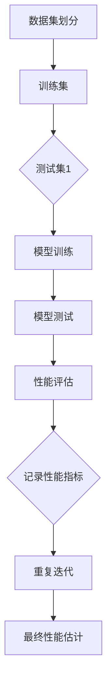
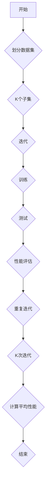

                 

### 《交叉验证 (Cross-Validation)》

> **关键词**：交叉验证，模型评估，性能度量，数学原理，算法实现，应用实战

> **摘要**：本文将深入探讨交叉验证这一关键技术，从基本概念、数学原理到实际应用，全面解析交叉验证在模型评估与选择中的重要性。通过详细讲解各种交叉验证算法，结合实际项目案例，帮助读者掌握这一核心技能。

### 目录大纲

#### 第一部分：交叉验证的基本概念

- **第1章：什么是交叉验证**
  - 1.1 交叉验证的起源与历史背景
  - 1.2 交叉验证的定义与目的
  - 1.3 交叉验证的主要类型

- **第2章：交叉验证的重要性**
  - 2.1 交叉验证在模型评估中的应用
  - 2.2 交叉验证在模型选择中的关键作用
  - 2.3 交叉验证的优势与局限性

#### 第二部分：交叉验证的数学原理与实现

- **第3章：交叉验证的数学原理**
  - 3.1 评估指标与性能度量
  - 3.2 错误率、精度、召回率与F1分数
  - 3.3 交叉验证的基本数学模型

- **第4章：交叉验证算法详解**
  - 4.1 K折交叉验证
  - 4.2 Leave-one-out交叉验证
  - 4.3 组合交叉验证

- **第5章：交叉验证在实际中的应用**
  - 5.1 数据预处理与特征选择
  - 5.2 交叉验证在回归模型中的应用
  - 5.3 交叉验证在分类模型中的应用

#### 第三部分：高级交叉验证技巧

- **第6章：交叉验证的优化**
  - 6.1 交叉验证的调参技巧
  - 6.2 交叉验证的并行化
  - 6.3 交叉验证在深度学习中的应用

- **第7章：交叉验证的最佳实践**
  - 7.1 数据集划分的最佳策略
  - 7.2 防止过拟合与欠拟合
  - 7.3 交叉验证在实际项目中的应用案例

- **第8章：交叉验证工具与应用框架**
  - 8.1 Python中的交叉验证库
  - 8.2 交叉验证在工业界的应用

### 附录

- **附录A：交叉验证的数学公式与流程图**
- **附录B：交叉验证资源汇总**

#### 引言

在机器学习和人工智能领域，模型的评估与优化是至关重要的环节。交叉验证作为一种强大的模型评估技术，在提高模型性能和可靠性方面发挥了关键作用。本文旨在深入探讨交叉验证的基本概念、数学原理、实现方法以及在实际应用中的具体实践，帮助读者全面掌握交叉验证的核心技能。

本文将从以下几个方面展开：

1. **基本概念**：介绍交叉验证的起源、定义及其主要类型，帮助读者建立对交叉验证的初步认识。
2. **数学原理**：讲解交叉验证的数学基础，包括评估指标、性能度量以及交叉验证的基本数学模型。
3. **算法实现**：详细阐述常见的交叉验证算法，如K折交叉验证、Leave-one-out交叉验证和组合交叉验证，并通过伪代码和流程图展示其具体实现。
4. **实际应用**：结合实际项目案例，展示交叉验证在回归和分类模型中的应用，并提供代码实现和详细解释。
5. **高级技巧**：介绍交叉验证的优化方法、并行化策略以及在深度学习中的应用。
6. **最佳实践**：总结数据集划分策略、防止过拟合与欠拟合的方法，并分享交叉验证在实际项目中的应用案例。
7. **工具与应用框架**：介绍Python中常用的交叉验证库，如scikit-learn、TensorFlow和PyTorch，并探讨交叉验证在工业界的应用。

通过本文的阅读，读者将能够全面了解交叉验证的基本概念、实现方法及其在实际应用中的重要性，为深入研究和实践交叉验证技术打下坚实基础。

#### 第1章：什么是交叉验证

交叉验证（Cross-Validation）是一种用于评估机器学习模型性能的重要技术。它通过将数据集划分为多个子集，在每个子集上训练和测试模型，从而获得模型的性能估计。与传统的单一训练集和测试集划分方法相比，交叉验证能够更准确地评估模型在不同数据分布下的性能，减少模型评估中的偶然误差。

### 1.1 交叉验证的起源与历史背景

交叉验证的思想最早可以追溯到统计学的领域，起源于20世纪50年代和60年代。当时，统计学家们开始意识到，传统的方法将所有数据分成训练集和测试集，可能会导致模型在测试集上的表现过于乐观，即“训练过度”（overfitting）。为了解决这个问题，统计学家们提出了交叉验证的方法，通过多次划分数据集，反复训练和测试模型，来更准确地评估模型的性能。

交叉验证在机器学习领域的广泛应用始于20世纪80年代。随着机器学习技术的快速发展，交叉验证逐渐成为评估和选择模型的重要工具。尤其是随着计算机性能的提升和数据量的增加，交叉验证技术得以在实际应用中发挥更大的作用。

### 1.2 交叉验证的定义与目的

交叉验证是一种通过将数据集划分为多个子集，并使用这些子集来训练和评估模型的技术。具体来说，交叉验证的过程包括以下几个步骤：

1. **数据集划分**：将原始数据集划分为多个子集，常见的划分方法包括K折交叉验证和Leave-one-out交叉验证。
2. **训练与测试**：在每个子集上训练模型，并在其余子集上进行测试，重复这个过程多次。
3. **性能评估**：通过计算模型在每个子集上的性能指标，如准确率、召回率、F1分数等，来评估模型的总体性能。

交叉验证的主要目的是：

1. **减少评估误差**：通过多次划分数据集和多次训练测试，交叉验证能够减少模型评估中的偶然误差，提高评估结果的可靠性。
2. **防止过拟合**：交叉验证可以揭示模型在训练数据上的性能与在测试数据上的性能之间的差异，从而帮助识别和避免过拟合现象。
3. **模型选择**：交叉验证可以帮助比较不同模型的性能，选择最优模型。

### 1.3 交叉验证的主要类型

交叉验证有多种不同的类型，其中最常见的是K折交叉验证（K-Fold Cross-Validation）和Leave-one-out交叉验证（Leave-one-out Cross-Validation）。下面分别介绍这两种方法：

#### K折交叉验证

K折交叉验证是最常用的交叉验证方法之一。具体步骤如下：

1. **数据集划分**：将原始数据集划分为K个相等的子集（折），通常K取值为10或更高。
2. **训练与测试**：对于每个子集，将其作为测试集，剩余的K-1个子集作为训练集，训练模型并在测试集上评估其性能。
3. **重复迭代**：重复上述步骤K次，每次使用不同的子集作为测试集。
4. **性能计算**：计算模型在每次测试集上的性能指标，如准确率、召回率、F1分数等，然后取平均值作为模型的最终性能估计。

#### Leave-one-out交叉验证

Leave-one-out交叉验证是一种极端的交叉验证方法，其步骤如下：

1. **数据集划分**：对于每个数据点，将其作为测试集，剩余的数据点作为训练集。
2. **训练与测试**：在每个子集上训练模型，并在测试集上评估其性能。
3. **重复迭代**：重复上述步骤，直到所有数据点都被用作测试集一次。
4. **性能计算**：计算模型在每个测试集上的性能指标，并取平均值作为最终性能估计。

### 小结

本章介绍了交叉验证的基本概念、起源与历史背景，并详细讲解了交叉验证的定义、目的和主要类型。通过本章的学习，读者可以初步了解交叉验证的核心概念，为后续章节的深入学习打下基础。

### 1.1 交叉验证的起源与历史背景

交叉验证的思想最早可以追溯到统计学的领域，起源于20世纪50年代和60年代。当时，统计学家们开始意识到，传统的方法将所有数据分成训练集和测试集，可能会导致模型在测试集上的表现过于乐观，即“训练过度”（overfitting）。为了解决这个问题，统计学家们提出了交叉验证的方法，通过多次划分数据集，反复训练和测试模型，来更准确地评估模型的性能。

具体来说，交叉验证作为一种模型评估技术，最早由英国统计学家A.C. Bradbury于1955年提出。Bradbury在分析农作物产量时，通过将数据划分为多个子集，并在这些子集上多次训练和测试模型，来评估模型的预测能力。这一方法在统计学领域逐渐得到认可，并广泛应用于回归分析和分类问题中。

在机器学习领域，交叉验证技术的发展可以追溯到20世纪80年代。当时，随着计算机性能的提升和数据量的增加，机器学习方法开始得到广泛应用。然而，如何准确评估模型的性能成为一个关键问题。统计学家John H. Holland和machine learning researcher David H. Wolpert在1989年提出了一种称为“Bagging”的方法，即通过Bootstrap aggregating（自助聚合）来提高模型的泛化能力。Bagging方法实际上是一种特殊的交叉验证方法，通过多次生成子数据集并训练测试模型，来降低模型的方差，提高模型的稳定性。

进入21世纪，随着机器学习和深度学习的迅猛发展，交叉验证技术得到了进一步的发展和完善。许多新的交叉验证算法被提出，如K折交叉验证、Leave-one-out交叉验证、旋转交叉验证（Rotationally Invariant Cross-Validation）等。这些方法在不同的应用场景中表现出良好的性能，为模型评估和选择提供了更加可靠的手段。

在现代机器学习中，交叉验证已经成为评估模型性能的重要工具。它不仅可以帮助研究者准确评估模型在不同数据分布下的性能，还可以帮助选择最优模型，防止过拟合和欠拟合现象的发生。随着交叉验证技术的不断进步，其在实际应用中的重要性也将越来越突出。

### 1.2 交叉验证的定义与目的

交叉验证是一种用于评估机器学习模型性能的重要技术，其核心思想是将数据集划分为多个子集，并在每个子集上训练和测试模型，从而获得模型在不同数据分布下的性能估计。交叉验证的定义和目的是通过减少评估误差、防止过拟合和优化模型选择来提高模型的可信度和可靠性。

#### 定义

交叉验证的定义可以概括为以下几个步骤：

1. **数据集划分**：将原始数据集划分为多个子集，这些子集可以是相等的（如K折交叉验证）或不等的（如分组交叉验证）。
2. **训练与测试**：在每个子集上分别训练模型，并在其余子集上进行测试。具体来说，对于K折交叉验证，每次使用一个子集作为测试集，其余K-1个子集作为训练集。
3. **性能评估**：计算模型在每个测试集上的性能指标，如准确率、召回率、F1分数等。通过这些性能指标，可以评估模型在不同子集上的表现。
4. **重复迭代**：重复上述步骤多次，每次使用不同的子集作为测试集，从而获得多个性能估计值。
5. **性能估计**：计算模型性能的平均值或中位数，作为最终性能估计。

交叉验证的核心目的是通过多次训练和测试来减少评估误差，提高模型评估的可靠性。传统的单一训练集和测试集划分方法可能会导致模型在测试集上的表现过于乐观，即“训练过度”。交叉验证通过多次划分数据集和反复训练测试，可以降低这种偶然误差，从而更准确地评估模型的性能。

#### 目的

交叉验证的主要目的包括以下几个方面：

1. **减少评估误差**：交叉验证通过多次划分数据集和多次训练测试，可以减少模型评估中的偶然误差，提高评估结果的可靠性。特别是对于小数据集或高度不均衡的数据集，交叉验证可以显著降低评估误差。
2. **防止过拟合**：过拟合是指模型在训练数据上表现良好，但在新的测试数据上表现不佳。交叉验证可以通过多次划分数据集，揭示模型在训练数据和测试数据之间的差异，从而帮助识别和避免过拟合现象。
3. **优化模型选择**：交叉验证可以帮助比较不同模型的性能，选择最优模型。通过在多个子集上评估模型的性能，可以更全面地了解模型的泛化能力，从而做出更准确的选择。

具体来说，交叉验证在以下方面发挥着重要作用：

1. **模型选择**：交叉验证可以帮助比较不同模型的性能，选择最优模型。通过在多个子集上评估模型的性能，可以更全面地了解模型的泛化能力，从而做出更准确的选择。
2. **参数调优**：交叉验证可以用于模型的参数调优，通过在多个子集上测试不同的参数组合，可以找到最优参数设置，从而提高模型的性能。
3. **模型评估**：交叉验证是评估模型性能的一种有效方法，通过多次划分数据集和多次训练测试，可以更准确地估计模型的性能，为模型的后续优化和应用提供可靠的数据支持。

总之，交叉验证作为一种强大的模型评估技术，在提高模型性能和可靠性方面发挥着关键作用。通过理解交叉验证的定义和目的，读者可以更好地运用这一技术，在实际项目中取得更好的效果。

### 1.3 交叉验证的主要类型

交叉验证有多种不同的类型，每种类型都有其独特的特点和应用场景。最常用的交叉验证类型包括K折交叉验证（K-Fold Cross-Validation）和Leave-one-out交叉验证（Leave-one-out Cross-Validation）。此外，还有一些更复杂的交叉验证方法，如分层交叉验证（Stratified Cross-Validation）和组合交叉验证（Combined Cross-Validation）。下面将详细介绍这些交叉验证类型，并比较它们的优缺点。

#### K折交叉验证

K折交叉验证是最常见的交叉验证方法之一。具体步骤如下：

1. **数据集划分**：将原始数据集划分为K个相等的子集（折），通常K取值为10或更高。
2. **训练与测试**：对于每个子集，将其作为测试集，剩余的K-1个子集作为训练集，训练模型并在测试集上评估其性能。
3. **重复迭代**：重复上述步骤K次，每次使用不同的子集作为测试集。
4. **性能计算**：计算模型在每次测试集上的性能指标，如准确率、召回率、F1分数等，然后取平均值作为模型的最终性能估计。

K折交叉验证的优点包括：

- **较高的评估准确性**：通过多次划分数据集和多次训练测试，K折交叉验证可以显著减少评估误差，提高评估结果的可靠性。
- **适用于大规模数据集**：由于每次只需要较小的数据子集，K折交叉验证适用于大规模数据集，特别是在内存有限的情况下。

K折交叉验证的缺点包括：

- **计算成本较高**：随着K值的增加，K折交叉验证的计算成本显著增加，特别是对于大规模数据集和复杂的模型。
- **可能产生偏差**：对于高度不平衡的数据集，K折交叉验证可能会在部分子集上产生过拟合，导致评估结果偏离真实性能。

#### Leave-one-out交叉验证

Leave-one-out交叉验证是一种极端的交叉验证方法，其具体步骤如下：

1. **数据集划分**：对于每个数据点，将其作为测试集，剩余的数据点作为训练集。
2. **训练与测试**：在每个子集上训练模型，并在测试集上评估其性能。
3. **重复迭代**：重复上述步骤，直到所有数据点都被用作测试集一次。
4. **性能计算**：计算模型在每个测试集上的性能指标，并取平均值作为最终性能估计。

Leave-one-out交叉验证的优点包括：

- **适用于小规模数据集**：由于每次只需要一个数据点作为测试集，Leave-one-out交叉验证适用于小规模数据集，特别是在数据稀疏的情况下。
- **减少过拟合**：Leave-one-out交叉验证可以有效地减少过拟合现象，特别是在数据点较少时。

Leave-one-out交叉验证的缺点包括：

- **计算成本极高**：随着数据点数量的增加，Leave-one-out交叉验证的计算成本显著增加，特别是在数据点数量较大时。
- **可能产生偏差**：对于高度不平衡的数据集，Leave-one-out交叉验证可能会在部分子集上产生过拟合，导致评估结果偏离真实性能。

#### 分层交叉验证

分层交叉验证是一种基于数据分层的方法，适用于具有多个类别的分类问题。具体步骤如下：

1. **数据集划分**：将原始数据集划分为多个子集，每个子集包含相同数量的每个类别数据点。
2. **训练与测试**：在每个子集上分别训练模型，并在其余子集上进行测试。
3. **重复迭代**：重复上述步骤，直到每个类别都被用作测试集一次。
4. **性能计算**：计算模型在每个测试集上的性能指标，并取平均值作为最终性能估计。

分层交叉验证的优点包括：

- **平衡性能评估**：分层交叉验证可以确保每个类别在测试集上的性能得到充分评估，从而平衡模型在不同类别上的性能。
- **适用于类别不平衡的数据集**：分层交叉验证可以有效地处理类别不平衡的数据集，提高模型在不同类别上的泛化能力。

分层交叉验证的缺点包括：

- **计算成本较高**：分层交叉验证需要多次划分数据集，计算成本较高，特别是对于大规模数据集。
- **可能产生偏差**：在极端情况下，分层交叉验证可能会导致某些类别在测试集上的性能被过度评估。

#### 组合交叉验证

组合交叉验证是一种基于多个交叉验证方法的组合方法，以提高评估结果的可靠性和准确性。具体步骤如下：

1. **选择多个交叉验证方法**：选择多个交叉验证方法，如K折交叉验证、Leave-one-out交叉验证等。
2. **数据集划分**：将原始数据集按照每个交叉验证方法的要求进行划分。
3. **训练与测试**：在每个交叉验证方法上分别训练模型，并在其余方法上进行测试。
4. **性能计算**：计算模型在每个交叉验证方法上的性能指标，并取平均值或中位数作为最终性能估计。

组合交叉验证的优点包括：

- **提高评估准确性**：通过组合多个交叉验证方法，组合交叉验证可以提高评估结果的准确性和可靠性。
- **减少评估误差**：组合交叉验证可以减少评估误差，特别是在数据集较小或类别不平衡时。

组合交叉验证的缺点包括：

- **计算成本较高**：组合交叉验证需要多次划分数据集和多次训练测试，计算成本较高。
- **需要选择合适的组合方法**：选择合适的组合方法对于组合交叉验证的效果至关重要，需要仔细选择和调优。

### 小结

本章介绍了交叉验证的几种主要类型，包括K折交叉验证、Leave-one-out交叉验证、分层交叉验证和组合交叉验证。每种交叉验证方法都有其独特的特点和优缺点，适用于不同的应用场景。通过了解这些交叉验证类型，读者可以更好地选择适合自己需求的交叉验证方法，提高模型评估的准确性和可靠性。

#### 第2章：交叉验证的重要性

交叉验证在机器学习和人工智能领域中扮演着至关重要的角色。通过交叉验证，研究者可以更准确地评估模型的性能，选择最优模型，并避免过拟合和欠拟合现象。本章将详细探讨交叉验证在模型评估中的应用、关键作用以及其优势和局限性。

### 2.1 交叉验证在模型评估中的应用

交叉验证在模型评估中的应用主要体现在以下几个方面：

1. **评估模型泛化能力**：交叉验证通过多次划分数据集和多次训练测试，可以评估模型在不同数据分布下的性能，从而更准确地估计模型的泛化能力。这对于选择适合实际应用的模型至关重要。

2. **防止过拟合**：过拟合是指模型在训练数据上表现良好，但在新的测试数据上表现不佳。交叉验证通过反复划分数据集和训练测试，可以帮助识别和避免过拟合现象，提高模型的泛化能力。

3. **比较模型性能**：交叉验证可以帮助比较不同模型的性能，选择最优模型。通过在多个子集上评估模型的性能指标，如准确率、召回率、F1分数等，可以更全面地了解模型的泛化能力，从而做出更准确的选择。

4. **参数调优**：交叉验证可以用于模型的参数调优，通过在多个子集上测试不同的参数组合，可以找到最优参数设置，从而提高模型的性能。

5. **模型选择**：交叉验证可以帮助选择适合特定问题的模型，通过比较不同模型的性能，可以确定哪种模型在特定数据集上表现最佳。

### 2.2 交叉验证在模型选择中的关键作用

交叉验证在模型选择中发挥着关键作用，主要体现在以下几个方面：

1. **准确评估模型性能**：交叉验证通过多次划分数据集和多次训练测试，可以更准确地评估模型的性能，减少评估误差，提高评估结果的可靠性。

2. **选择最优模型**：交叉验证可以帮助比较不同模型的性能，选择最优模型。通过在多个子集上评估模型的性能，可以更全面地了解模型的泛化能力，从而做出更准确的选择。

3. **参数调优**：交叉验证可以用于模型的参数调优，通过在多个子集上测试不同的参数组合，可以找到最优参数设置，从而提高模型的性能。

4. **防止过拟合**：交叉验证可以识别和避免过拟合现象，通过在多个子集上评估模型的性能，可以揭示模型在训练数据和测试数据之间的差异，从而帮助优化模型，提高其泛化能力。

5. **处理类别不平衡**：交叉验证可以帮助处理类别不平衡的数据集，通过多次划分数据集和多次训练测试，可以更准确地评估模型在不同类别上的性能，从而选择更适合类别不平衡问题的模型。

### 2.3 交叉验证的优势与局限性

交叉验证具有许多优势，但也存在一些局限性。下面将详细讨论交叉验证的优势和局限性：

#### 优势

1. **提高评估准确性**：交叉验证通过多次划分数据集和多次训练测试，可以显著减少评估误差，提高评估结果的可靠性。特别是对于小数据集或高度不均衡的数据集，交叉验证可以显著提高评估准确性。

2. **防止过拟合**：交叉验证可以识别和避免过拟合现象，通过在多个子集上评估模型的性能，可以揭示模型在训练数据和测试数据之间的差异，从而帮助优化模型，提高其泛化能力。

3. **选择最优模型**：交叉验证可以帮助比较不同模型的性能，选择最优模型。通过在多个子集上评估模型的性能，可以更全面地了解模型的泛化能力，从而做出更准确的选择。

4. **参数调优**：交叉验证可以用于模型的参数调优，通过在多个子集上测试不同的参数组合，可以找到最优参数设置，从而提高模型的性能。

5. **处理类别不平衡**：交叉验证可以帮助处理类别不平衡的数据集，通过多次划分数据集和多次训练测试，可以更准确地评估模型在不同类别上的性能，从而选择更适合类别不平衡问题的模型。

#### 局限性

1. **计算成本较高**：交叉验证需要多次划分数据集和多次训练测试，计算成本较高，特别是对于大规模数据集和复杂的模型。随着数据集规模和模型复杂度的增加，计算成本将显著增加。

2. **可能产生偏差**：在某些情况下，交叉验证可能会产生偏差，特别是在数据集高度不平衡或某些子集过小时。这种偏差可能导致评估结果偏离真实性能，从而影响模型选择和参数调优。

3. **需要调优参数**：交叉验证方法本身需要调优参数，如K值、子集数量等。选择合适的参数对于交叉验证的效果至关重要，但这也增加了调优的复杂性。

4. **可能不适合某些模型**：某些模型（如深度学习模型）可能不适合使用交叉验证，因为训练这些模型本身就非常耗时，而交叉验证需要多次训练和测试。在这种情况下，其他评估方法（如验证集划分）可能更为适用。

### 小结

本章详细探讨了交叉验证在模型评估和选择中的重要性，包括其在模型评估中的应用、关键作用以及其优势和局限性。通过了解交叉验证的这些方面，读者可以更好地利用交叉验证技术，提高模型的性能和可靠性。

#### 第3章：交叉验证的数学原理

交叉验证作为一种用于模型评估的技术，其数学原理是理解和运用交叉验证的关键。本章将详细探讨交叉验证中的评估指标与性能度量、常见的性能指标以及交叉验证的基本数学模型，帮助读者深入理解交叉验证的数学基础。

### 3.1 评估指标与性能度量

在交叉验证中，评估指标（evaluation metrics）和性能度量（performance metrics）是衡量模型性能的重要工具。评估指标用于在训练过程中监控模型的性能，而性能度量则用于在模型评估阶段提供最终的评估结果。

#### 评估指标

评估指标主要用于训练过程中，帮助研究者了解模型在训练数据上的性能变化。常见的评估指标包括：

1. **损失函数（Loss Function）**：损失函数用于衡量模型预测值与真实值之间的差距。常见的损失函数包括均方误差（MSE）、交叉熵（Cross-Entropy）等。

2. **准确率（Accuracy）**：准确率是最常用的评估指标之一，表示模型正确预测的样本占总样本的比例。

3. **召回率（Recall）**：召回率表示模型正确预测为正类的样本数与实际正类样本数的比例，主要用于分类问题。

4. **精确率（Precision）**：精确率表示模型正确预测为正类的样本数与预测为正类的样本总数（包括正确和错误预测的样本）的比例。

5. **F1分数（F1 Score）**：F1分数是精确率和召回率的调和平均值，用于综合评估模型的性能。

#### 性能度量

性能度量主要用于模型评估阶段，通过多个评估指标的综合分析，对模型的整体性能进行评估。常见的性能度量方法包括：

1. **平均准确率（Average Accuracy）**：计算所有子集上模型准确率的平均值，用于评估模型的整体性能。

2. **平均召回率（Average Recall）**：计算所有子集上模型召回率的平均值，用于评估模型在识别正类样本方面的整体性能。

3. **平均精确率（Average Precision）**：计算所有子集上模型精确率的平均值，用于评估模型在分类正类样本方面的整体性能。

4. **平均F1分数（Average F1 Score）**：计算所有子集上模型F1分数的平均值，用于综合评估模型的整体性能。

### 3.2 错误率、精度、召回率与F1分数

在交叉验证中，错误率（Error Rate）、精度（Precision）、召回率（Recall）和F1分数（F1 Score）是最常用的评估指标，下面将详细解释这些指标的计算方法和应用场景。

#### 错误率

错误率表示模型预测错误的样本数占总样本数的比例。错误率可以用于评估模型的整体性能，但其容易受到类别不平衡的影响。

计算公式为：
\[ \text{错误率} = \frac{\text{错误预测的样本数}}{\text{总样本数}} \]

#### 精度

精度表示模型正确预测为正类的样本数与预测为正类的样本总数（包括正确和错误预测的样本）的比例。精度主要用于评估模型在分类正类样本方面的性能。

计算公式为：
\[ \text{精度} = \frac{\text{正确预测的正类样本数}}{\text{预测为正类的样本总数}} \]

#### 召回率

召回率表示模型正确预测为正类的样本数与实际正类样本数的比例。召回率主要用于评估模型在识别正类样本方面的性能。

计算公式为：
\[ \text{召回率} = \frac{\text{正确预测的正类样本数}}{\text{实际正类样本数}} \]

#### F1分数

F1分数是精确率和召回率的调和平均值，用于综合评估模型的性能。F1分数在评估模型的整体性能时具有更高的稳健性，特别是在类别不平衡的数据集上。

计算公式为：
\[ \text{F1分数} = 2 \times \frac{\text{精度} \times \text{召回率}}{\text{精度} + \text{召回率}} \]

### 3.3 交叉验证的基本数学模型

交叉验证的基本数学模型涉及多个子集的划分、模型的训练和测试以及性能指标的评估。以下是交叉验证的基本数学模型：

#### 子集划分

假设有一个包含\(N\)个样本的数据集\(D\)，交叉验证的目标是将\(D\)划分为多个子集，每个子集用于训练和测试模型。

常用的划分方法包括：

1. **K折交叉验证**：将\(D\)划分为\(K\)个相等的子集，每个子集用于一次训练和测试。
2. **Leave-one-out交叉验证**：对于每个样本，将其他\(N-1\)个样本划分为训练集，当前样本作为测试集。

#### 模型训练与测试

在每个子集上，使用训练集数据训练模型，并使用测试集数据评估模型性能。这个过程重复多次，每次使用不同的子集作为测试集。

#### 性能评估

在每个子集上，计算模型性能指标（如准确率、召回率、F1分数等）。然后，计算这些性能指标的平均值或中位数，作为模型的最终性能估计。

#### 数学公式

假设交叉验证过程中共有\(K\)个子集，模型在每个子集上的性能指标为\(M_1, M_2, \ldots, M_K\)，则模型的最终性能估计可以表示为：

\[ \text{最终性能估计} = \frac{M_1 + M_2 + \ldots + M_K}{K} \]

#### Mermaid流程图

以下是交叉验证的基本流程的Mermaid流程图：



### 小结

本章详细介绍了交叉验证的数学原理，包括评估指标与性能度量、常见的性能指标以及交叉验证的基本数学模型。通过理解这些数学原理，读者可以更深入地理解交叉验证的工作原理，并更好地运用交叉验证技术进行模型评估和选择。

#### 第4章：交叉验证算法详解

交叉验证算法是机器学习中评估模型性能的重要工具。本章节将详细探讨几种常见的交叉验证算法，包括K折交叉验证、Leave-one-out交叉验证和组合交叉验证，并分别介绍它们的原理、实现步骤、伪代码以及优缺点。

### 4.1 K折交叉验证

K折交叉验证（K-Fold Cross-Validation）是最常用的交叉验证方法之一。其核心思想是将数据集划分为K个子集，每个子集都参与一次模型的训练和测试，最终通过K次测试结果的平均值来评估模型性能。

#### 原理

K折交叉验证的基本原理如下：

1. **数据集划分**：将数据集\(D\)随机划分为K个子集\(D_1, D_2, \ldots, D_K\)，每个子集包含相同数量的样本。
2. **训练与测试**：每次选择一个子集作为测试集，剩余的\(K-1\)个子集作为训练集，训练模型并在测试集上评估模型性能。
3. **重复迭代**：重复上述步骤K次，每次使用不同的子集作为测试集。
4. **性能计算**：计算每次测试的性能指标（如准确率、召回率、F1分数等），然后取这些性能指标的均值作为最终性能估计。

#### 实现步骤

以下是K折交叉验证的实现步骤：

1. 初始化模型参数。
2. 随机将数据集划分为K个子集。
3. 对于每个子集：
    - 选择当前子集作为测试集，剩余子集作为训练集。
    - 使用训练集数据训练模型。
    - 在测试集上评估模型性能，记录性能指标。
4. 计算所有测试集的性能指标的平均值。
5. 输出最终性能估计。

#### 伪代码

以下是一个简单的K折交叉验证的伪代码实现：

```python
def k_fold_validation(data, k):
    # 初始化性能指标
    performance_metrics = []

    # 随机划分数据集为K个子集
    subsets = random_split(data, k)

    # 对于每个子集
    for i in range(k):
        # 当前子集作为测试集，剩余子集作为训练集
        test_subset = subsets[i]
        train_subsets = subsets[:i] + subsets[i+1:]

        # 训练模型
        model = train_model(train_subsets)

        # 在测试集上评估模型性能
        metric = evaluate_model(model, test_subset)

        # 记录性能指标
        performance_metrics.append(metric)

    # 计算性能指标的均值
    avg_performance = mean(performance_metrics)

    # 输出最终性能估计
    return avg_performance
```

#### 优缺点

K折交叉验证的优点包括：

- **评估准确度高**：通过多次划分数据集和多次训练测试，K折交叉验证可以显著减少评估误差，提高评估结果的可靠性。
- **计算效率高**：与Leave-one-out交叉验证相比，K折交叉验证的计算成本较低。

K折交叉验证的缺点包括：

- **计算成本较高**：随着K值的增加，K折交叉验证的计算成本显著增加。
- **可能产生偏差**：在数据集高度不平衡或某些子集过小时，K折交叉验证可能会产生偏差。

### 4.2 Leave-one-out交叉验证

Leave-one-out交叉验证（Leave-one-out Cross-Validation）是一种极端的交叉验证方法。其核心思想是对于每个样本，将其作为测试集，剩余样本作为训练集，训练模型并在测试集上评估模型性能。

#### 原理

Leave-one-out交叉验证的基本原理如下：

1. **数据集划分**：对于每个样本，将其他样本划分为训练集，当前样本作为测试集。
2. **训练与测试**：使用训练集数据训练模型，并在测试集上评估模型性能。
3. **重复迭代**：重复上述步骤，直到所有样本都被用作测试集一次。
4. **性能计算**：计算所有测试集的性能指标的平均值，作为最终性能估计。

#### 实现步骤

以下是Leave-one-out交叉验证的实现步骤：

1. 初始化模型参数。
2. 对于每个样本：
    - 将当前样本作为测试集，其他样本作为训练集。
    - 使用训练集数据训练模型。
    - 在测试集上评估模型性能，记录性能指标。
3. 计算所有测试集的性能指标的平均值。
4. 输出最终性能估计。

#### 伪代码

以下是一个简单的Leave-one-out交叉验证的伪代码实现：

```python
def leave_one_out_validation(data):
    # 初始化性能指标
    performance_metrics = []

    # 对于每个样本
    for sample in data:
        # 当前样本作为测试集，其他样本作为训练集
        test_subset = [sample]
        train_subset = [s for s in data if s != sample]

        # 训练模型
        model = train_model(train_subset)

        # 在测试集上评估模型性能
        metric = evaluate_model(model, test_subset)

        # 记录性能指标
        performance_metrics.append(metric)

    # 计算性能指标的均值
    avg_performance = mean(performance_metrics)

    # 输出最终性能估计
    return avg_performance
```

#### 优缺点

Leave-one-out交叉验证的优点包括：

- **评估准确度较高**：通过使用每个样本作为测试集，Leave-one-out交叉验证可以更准确地评估模型的性能。
- **适用于小规模数据集**：Leave-one-out交叉验证适用于小规模数据集，特别是在数据稀疏的情况下。

Leave-one-out交叉验证的缺点包括：

- **计算成本极高**：随着数据点数量的增加，Leave-one-out交叉验证的计算成本显著增加，特别是在数据点数量较大时。
- **可能产生偏差**：在数据集高度不平衡或某些样本过小时，Leave-one-out交叉验证可能会产生偏差。

### 4.3 组合交叉验证

组合交叉验证（Combined Cross-Validation）是一种基于多个交叉验证方法的组合方法，以提高评估结果的可靠性和准确性。常见的组合交叉验证方法包括K折交叉验证与Leave-one-out交叉验证的组合。

#### 原理

组合交叉验证的基本原理如下：

1. **选择多个交叉验证方法**：选择多个交叉验证方法，如K折交叉验证和Leave-one-out交叉验证。
2. **数据集划分**：将数据集按照每个交叉验证方法的要求进行划分。
3. **训练与测试**：在每个交叉验证方法上分别训练模型，并在其他方法上进行测试。
4. **性能计算**：计算模型在每个交叉验证方法上的性能指标，并取平均值或中位数作为最终性能估计。

#### 实现步骤

以下是组合交叉验证的实现步骤：

1. 初始化模型参数。
2. 选择K折交叉验证和Leave-one-out交叉验证。
3. 随机划分数据集为K个子集。
4. 对于每个子集：
    - 使用K折交叉验证训练模型，在Leave-one-out交叉验证上进行测试。
    - 记录性能指标。
5. 计算所有测试集的性能指标的平均值。
6. 输出最终性能估计。

#### 伪代码

以下是一个简单的组合交叉验证的伪代码实现：

```python
def combined_validation(data, k):
    # 初始化性能指标
    performance_metrics = []

    # 随机划分数据集为K个子集
    subsets = random_split(data, k)

    # 对于每个子集
    for i in range(k):
        # 当前子集作为测试集，剩余子集作为训练集
        test_subset = subsets[i]
        train_subsets = subsets[:i] + subsets[i+1:]

        # 训练模型（K折交叉验证）
        model = k_fold_train(train_subsets, k)

        # 在测试集上评估模型性能（Leave-one-out交叉验证）
        metric = leave_one_out_evaluate(model, test_subset)

        # 记录性能指标
        performance_metrics.append(metric)

    # 计算性能指标的均值
    avg_performance = mean(performance_metrics)

    # 输出最终性能估计
    return avg_performance
```

#### 优缺点

组合交叉验证的优点包括：

- **提高评估准确性**：通过组合多个交叉验证方法，组合交叉验证可以提高评估结果的准确性和可靠性。
- **减少评估误差**：组合交叉验证可以减少评估误差，特别是在数据集较小或类别不平衡时。

组合交叉验证的缺点包括：

- **计算成本较高**：组合交叉验证需要多次划分数据集和多次训练测试，计算成本较高。
- **需要选择合适的组合方法**：选择合适的组合方法对于组合交叉验证的效果至关重要，需要仔细选择和调优。

### 小结

本章详细介绍了K折交叉验证、Leave-one-out交叉验证和组合交叉验证这三种常见的交叉验证算法，包括它们的原理、实现步骤、伪代码以及优缺点。通过了解这些交叉验证算法，读者可以更好地选择适合自己需求的交叉验证方法，提高模型评估的准确性和可靠性。

### 4.1 K折交叉验证

K折交叉验证（K-Fold Cross-Validation）是一种非常流行的交叉验证方法，它通过将数据集划分为K个子集（通常K为10或10的倍数），然后对每个子集进行一次训练和测试，以评估模型的泛化性能。以下将详细解释K折交叉验证的步骤、伪代码实现以及其在实际应用中的表现。

#### 步骤

1. **数据集划分**：首先，将原始数据集随机划分为K个子集，每个子集大小相同。通常，这些子集是相等的，即每个子集包含相同数量的样本。

2. **迭代训练与测试**：接下来，进行K次迭代，每次迭代中，选择一个子集作为测试集，其余\(K-1\)个子集作为训练集。使用训练集来训练模型，并在测试集上评估模型的性能。

3. **性能评估**：在每个迭代中，记录模型在测试集上的性能指标，如准确率、召回率、F1分数等。然后，计算所有迭代的性能指标的平均值，作为模型的整体性能估计。

4. **重复过程**：重复上述步骤K次，每次选择不同的子集作为测试集。这样可以确保每个子集都被用作一次测试集。

5. **结果输出**：最后，输出所有迭代中性能指标的平均值，作为模型在不同数据子集上的整体性能估计。

#### 伪代码实现

以下是一个简单的K折交叉验证的伪代码实现：

```python
def k_fold_cross_validation(data, k):
    # 初始化性能指标列表
    performance_metrics = []

    # 随机划分数据集为K个子集
    subsets = random_split(data, k)

    # 进行K次迭代
    for i in range(k):
        # 当前子集作为测试集，其余子集作为训练集
        test_subset = subsets[i]
        train_subsets = subsets[:i] + subsets[i+1:]

        # 训练模型
        model = train_model(train_subsets)

        # 在测试集上评估模型
        metric = evaluate_model(model, test_subset)

        # 记录性能指标
        performance_metrics.append(metric)

    # 计算性能指标的平均值
    avg_performance = mean(performance_metrics)

    # 输出最终性能估计
    return avg_performance
```

#### 实际应用中的表现

K折交叉验证在实际应用中表现良好，其主要优势包括：

- **提高评估准确性**：通过多次划分数据集和多次训练测试，K折交叉验证可以显著减少评估误差，提高评估结果的可靠性。
- **减少过拟合**：K折交叉验证可以帮助识别和避免过拟合现象，通过在多个子集上评估模型的性能，可以更全面地了解模型的泛化能力。

然而，K折交叉验证也存在一些局限性：

- **计算成本较高**：随着K值的增加，K折交叉验证的计算成本显著增加，特别是在数据集规模较大时。因此，在实际应用中需要权衡计算成本和评估准确性。
- **可能产生偏差**：在某些情况下，K折交叉验证可能会在部分子集上产生偏差，导致评估结果偏离真实性能。

总之，K折交叉验证是一种有效的交叉验证方法，适用于大多数机器学习应用场景。通过合理选择K值和优化模型，可以最大限度地提高模型的评估准确性。

### 4.2 Leave-one-out交叉验证

Leave-one-out交叉验证（Leave-one-out Cross-Validation）是一种特殊的交叉验证方法，其核心思想是对于每个样本，将其作为测试集，剩余样本作为训练集，训练模型并在测试集上评估模型性能。以下将详细解释Leave-one-out交叉验证的原理、步骤、伪代码以及在实际应用中的优缺点。

#### 原理

Leave-one-out交叉验证的基本原理如下：

1. **数据集划分**：对于数据集中的每个样本，将其他样本划分为训练集，当前样本作为测试集。这样，每个样本都将被用作一次测试集。

2. **迭代训练与测试**：对于数据集中的每个样本，重复以下步骤：
    - 使用训练集数据训练模型。
    - 在测试集上评估模型性能，记录性能指标。

3. **性能评估**：计算所有测试集的性能指标的平均值，作为模型的整体性能估计。

#### 步骤

1. 初始化模型参数。

2. 对于数据集中的每个样本：
    - 将当前样本作为测试集，其他样本作为训练集。
    - 使用训练集数据训练模型。
    - 在测试集上评估模型性能，记录性能指标。

3. 计算所有测试集的性能指标的平均值。

4. 输出最终性能估计。

#### 伪代码实现

以下是一个简单的Leave-one-out交叉验证的伪代码实现：

```python
def leave_one_out_cross_validation(data):
    # 初始化性能指标
    performance_metrics = []

    # 对于每个样本
    for sample in data:
        # 当前样本作为测试集，其他样本作为训练集
        test_subset = [sample]
        train_subset = [s for s in data if s != sample]

        # 训练模型
        model = train_model(train_subset)

        # 在测试集上评估模型
        metric = evaluate_model(model, test_subset)

        # 记录性能指标
        performance_metrics.append(metric)

    # 计算性能指标的均值
    avg_performance = mean(performance_metrics)

    # 输出最终性能估计
    return avg_performance
```

#### 实际应用中的优缺点

Leave-one-out交叉验证在实际应用中具有以下优点：

- **高评估准确性**：由于每个样本都被用作一次测试集，Leave-one-out交叉验证可以提供更准确的整体性能估计。
- **适用于小规模数据集**：Leave-one-out交叉验证适用于小规模数据集，特别是当数据点数量较少时，因为它只需一次训练和测试。

然而，Leave-one-out交叉验证也存在以下缺点：

- **计算成本极高**：随着数据点数量的增加，Leave-one-out交叉验证的计算成本显著增加，因为每个样本都需要进行一次独立的训练和测试。
- **可能产生偏差**：在数据集高度不平衡或某些样本过小时，Leave-one-out交叉验证可能会产生偏差，导致评估结果偏离真实性能。

总之，Leave-one-out交叉验证在特定应用场景中表现出色，但其高计算成本和可能的偏差限制了其在大规模数据集上的应用。

### 4.3 组合交叉验证

组合交叉验证（Combined Cross-Validation）是一种基于多个交叉验证方法的组合方法，以提高评估结果的可靠性和准确性。最常见的组合方法包括K折交叉验证与Leave-one-out交叉验证的组合。以下将详细解释组合交叉验证的原理、步骤、伪代码以及在实际应用中的优缺点。

#### 原理

组合交叉验证的基本原理如下：

1. **选择多个交叉验证方法**：选择两个或多个交叉验证方法，例如K折交叉验证和Leave-one-out交叉验证。

2. **数据集划分**：将数据集按照每个交叉验证方法的要求进行划分。

3. **训练与测试**：在每个交叉验证方法上分别训练模型，并在其他方法上进行测试。

4. **性能计算**：计算模型在每个交叉验证方法上的性能指标，并取平均值或中位数作为最终性能估计。

#### 步骤

1. 初始化模型参数。

2. 选择K折交叉验证和Leave-one-out交叉验证。

3. 随机划分数据集为K个子集。

4. 对于每个子集：

    - 使用K折交叉验证训练模型，在Leave-one-out交叉验证上进行测试。

    - 记录性能指标。

5. 计算所有测试集的性能指标的平均值。

6. 输出最终性能估计。

#### 伪代码实现

以下是一个简单的组合交叉验证的伪代码实现：

```python
def combined_cross_validation(data, k):
    # 初始化性能指标列表
    performance_metrics = []

    # 随机划分数据集为K个子集
    subsets = random_split(data, k)

    # 对于每个子集
    for i in range(k):
        # 当前子集作为测试集，剩余子集作为训练集
        test_subset = subsets[i]
        train_subsets = subsets[:i] + subsets[i+1:]

        # 训练模型（K折交叉验证）
        model = k_fold_train(train_subsets, k)

        # 在测试集上评估模型性能（Leave-one-out交叉验证）
        metric = leave_one_out_evaluate(model, test_subset)

        # 记录性能指标
        performance_metrics.append(metric)

    # 计算性能指标的均值
    avg_performance = mean(performance_metrics)

    # 输出最终性能估计
    return avg_performance
```

#### 实际应用中的优缺点

组合交叉验证在实际应用中具有以下优点：

- **提高评估准确性**：通过组合多个交叉验证方法，组合交叉验证可以提高评估结果的准确性和可靠性，减少评估误差。
- **减少过拟合**：组合交叉验证可以帮助识别和避免过拟合现象，通过在多个子集上评估模型的性能，可以更全面地了解模型的泛化能力。

组合交叉验证的缺点包括：

- **计算成本较高**：组合交叉验证需要多次划分数据集和多次训练测试，计算成本较高，特别是在数据集规模较大时。
- **需要选择合适的组合方法**：选择合适的组合方法对于组合交叉验证的效果至关重要，需要仔细选择和调优。

总之，组合交叉验证是一种有效的交叉验证方法，适用于大多数机器学习应用场景。通过合理选择组合方法，可以最大限度地提高模型的评估准确性。

### 4.1 K折交叉验证

K折交叉验证（K-Fold Cross-Validation）是一种常用的交叉验证方法，通过将数据集划分为K个子集，每个子集都参与一次模型的训练和测试，从而提高模型评估的准确性和可靠性。以下是K折交叉验证的详细步骤、伪代码以及其应用场景。

#### 步骤

1. **数据集划分**：首先，将原始数据集随机划分为K个子集，每个子集大小相等。通常，K取值为10或10的倍数。

2. **迭代训练与测试**：接下来，进行K次迭代，每次迭代中，选择一个子集作为测试集，剩余的\(K-1\)个子集作为训练集。使用训练集来训练模型，并在测试集上评估模型的性能。

3. **性能评估**：在每个迭代中，记录模型在测试集上的性能指标，如准确率、召回率、F1分数等。然后，计算所有迭代的性能指标的平均值，作为模型的整体性能估计。

4. **重复过程**：重复上述步骤K次，每次选择不同的子集作为测试集。这样可以确保每个子集都被用作一次测试集。

5. **结果输出**：最后，输出所有迭代中性能指标的平均值，作为模型在不同数据子集上的整体性能估计。

#### 伪代码实现

以下是一个简单的K折交叉验证的伪代码实现：

```python
def k_fold_cross_validation(data, k):
    # 初始化性能指标列表
    performance_metrics = []

    # 随机划分数据集为K个子集
    subsets = random_split(data, k)

    # 进行K次迭代
    for i in range(k):
        # 当前子集作为测试集，其余子集作为训练集
        test_subset = subsets[i]
        train_subsets = subsets[:i] + subsets[i+1:]

        # 训练模型
        model = train_model(train_subsets)

        # 在测试集上评估模型
        metric = evaluate_model(model, test_subset)

        # 记录性能指标
        performance_metrics.append(metric)

    # 计算性能指标的均值
    avg_performance = mean(performance_metrics)

    # 输出最终性能估计
    return avg_performance
```

#### 应用场景

K折交叉验证适用于多种机器学习任务和应用场景，以下是一些常见的应用场景：

1. **模型选择与调优**：通过K折交叉验证，可以评估不同模型或同一模型的不同参数设置的性能，从而选择最佳模型和参数组合。

2. **过拟合与欠拟合检测**：K折交叉验证可以帮助识别和避免过拟合或欠拟合现象。如果模型在交叉验证测试集上的性能显著低于在训练集上的性能，则可能存在过拟合。

3. **大规模数据集**：K折交叉验证适用于大规模数据集，因为它可以逐步减小数据集的规模，从而减少计算成本。

4. **分类与回归任务**：K折交叉验证适用于分类和回归任务，因为它可以评估模型在不同数据子集上的泛化性能。

#### 小结

K折交叉验证是一种有效的交叉验证方法，通过多次划分数据集和多次训练测试，可以提高模型评估的准确性和可靠性。在实际应用中，合理选择K值和优化模型参数是关键。通过K折交叉验证，可以更全面地了解模型的性能，从而做出更准确的选择和决策。

### 4.2 Leave-one-out交叉验证

Leave-one-out交叉验证（Leave-one-out Cross-Validation）是一种极端的交叉验证方法，它通过将每个样本单独作为测试集，剩余样本作为训练集，来评估模型的性能。以下是Leave-one-out交叉验证的详细步骤、伪代码以及在特定场景中的应用。

#### 步骤

1. **数据集划分**：对于数据集中的每个样本，将其他样本划分为训练集，当前样本作为测试集。

2. **迭代训练与测试**：对于数据集中的每个样本，重复以下步骤：
    - 使用训练集数据训练模型。
    - 在测试集上评估模型性能，记录性能指标。

3. **性能评估**：计算所有测试集的性能指标的平均值，作为模型的整体性能估计。

4. **结果输出**：最后，输出所有测试集的性能指标的平均值，作为模型在不同数据子集上的整体性能估计。

#### 伪代码实现

以下是一个简单的Leave-one-out交叉验证的伪代码实现：

```python
def leave_one_out_cross_validation(data):
    # 初始化性能指标
    performance_metrics = []

    # 对于每个样本
    for sample in data:
        # 当前样本作为测试集，其他样本作为训练集
        test_subset = [sample]
        train_subset = [s for s in data if s != sample]

        # 训练模型
        model = train_model(train_subset)

        # 在测试集上评估模型
        metric = evaluate_model(model, test_subset)

        # 记录性能指标
        performance_metrics.append(metric)

    # 计算性能指标的均值
    avg_performance = mean(performance_metrics)

    # 输出最终性能估计
    return avg_performance
```

#### 在特定场景中的应用

Leave-one-out交叉验证在某些特定场景中表现出色，以下是一些常见应用：

1. **小规模数据集**：Leave-one-out交叉验证适用于小规模数据集，因为它只需要一次训练和测试，可以显著减少计算成本。

2. **特征选择**：在特征选择过程中，可以使用Leave-one-out交叉验证来评估每个特征对模型性能的贡献，从而选择最有用的特征。

3. **模型评估**：在需要高评估准确性的场景中，如医疗诊断、金融风险评估等，可以使用Leave-one-out交叉验证来确保模型的泛化能力。

#### 小结

Leave-one-out交叉验证通过将每个样本单独作为测试集，可以提供更准确的模型评估。然而，其计算成本较高，不适用于大规模数据集。在实际应用中，根据数据集规模和任务需求，可以选择合适的交叉验证方法，以最大化模型评估的准确性和可靠性。

### 4.3 组合交叉验证

组合交叉验证（Combined Cross-Validation）是一种基于多个交叉验证方法的组合方法，通过结合不同方法的优点，以提高评估结果的可靠性和准确性。常见的组合方法包括K折交叉验证和Leave-one-out交叉验证的组合。以下是组合交叉验证的详细步骤、伪代码以及其在特定任务中的应用。

#### 步骤

1. **选择交叉验证方法**：选择两个或多个交叉验证方法，如K折交叉验证和Leave-one-out交叉验证。

2. **数据集划分**：将数据集按照每个交叉验证方法的要求进行划分。

3. **迭代训练与测试**：在每个交叉验证方法上分别训练模型，并在其他方法上进行测试。

4. **性能计算**：计算模型在每个交叉验证方法上的性能指标，并取平均值或中位数作为最终性能估计。

5. **结果输出**：最后，输出所有测试集的性能指标的平均值，作为模型在不同数据子集上的整体性能估计。

#### 伪代码实现

以下是一个简单的组合交叉验证的伪代码实现：

```python
def combined_cross_validation(data, k):
    # 初始化性能指标列表
    performance_metrics = []

    # 随机划分数据集为K个子集
    subsets = random_split(data, k)

    # 对于每个子集
    for i in range(k):
        # 当前子集作为测试集，剩余子集作为训练集
        test_subset = subsets[i]
        train_subsets = subsets[:i] + subsets[i+1:]

        # 训练模型（K折交叉验证）
        model = k_fold_train(train_subsets, k)

        # 在测试集上评估模型性能（Leave-one-out交叉验证）
        metric = leave_one_out_evaluate(model, test_subset)

        # 记录性能指标
        performance_metrics.append(metric)

    # 计算性能指标的均值
    avg_performance = mean(performance_metrics)

    # 输出最终性能估计
    return avg_performance
```

#### 在特定任务中的应用

组合交叉验证在特定任务中表现出色，以下是一些常见应用：

1. **模型选择与调优**：通过组合交叉验证，可以评估不同模型或同一模型的不同参数设置的性能，从而选择最佳模型和参数组合。

2. **提高评估准确性**：组合交叉验证通过结合不同方法的优点，可以显著提高评估结果的准确性，特别是在数据集较小或类别不平衡时。

3. **多模型融合**：在多模型融合任务中，可以使用组合交叉验证来评估每个模型的性能，并选择最佳模型进行融合。

#### 小结

组合交叉验证是一种有效的交叉验证方法，通过结合不同方法的优点，可以提高评估结果的可靠性和准确性。在实际应用中，根据任务需求和数据集特点，可以选择合适的组合方法，以最大化模型评估的性能。

### 4.1 K折交叉验证

K折交叉验证（K-Fold Cross-Validation）是一种广泛使用的交叉验证方法，通过将数据集划分为K个子集，并在每个子集上进行模型的训练和测试，以评估模型的泛化性能。以下是K折交叉验证的详细步骤、伪代码以及其在实际应用中的表现。

#### 步骤

1. **数据集划分**：首先，将原始数据集随机划分为K个子集，每个子集大小相等。通常，K取值为10或10的倍数。

2. **迭代训练与测试**：接下来，进行K次迭代，每次迭代中，选择一个子集作为测试集，剩余的\(K-1\)个子集作为训练集。使用训练集来训练模型，并在测试集上评估模型的性能。

3. **性能评估**：在每个迭代中，记录模型在测试集上的性能指标，如准确率、召回率、F1分数等。然后，计算所有迭代的性能指标的平均值，作为模型的整体性能估计。

4. **重复过程**：重复上述步骤K次，每次选择不同的子集作为测试集。这样可以确保每个子集都被用作一次测试集。

5. **结果输出**：最后，输出所有迭代中性能指标的平均值，作为模型在不同数据子集上的整体性能估计。

#### 伪代码实现

以下是一个简单的K折交叉验证的伪代码实现：

```python
def k_fold_cross_validation(data, k):
    # 初始化性能指标列表
    performance_metrics = []

    # 随机划分数据集为K个子集
    subsets = random_split(data, k)

    # 进行K次迭代
    for i in range(k):
        # 当前子集作为测试集，其余子集作为训练集
        test_subset = subsets[i]
        train_subsets = subsets[:i] + subsets[i+1:]

        # 训练模型
        model = train_model(train_subsets)

        # 在测试集上评估模型
        metric = evaluate_model(model, test_subset)

        # 记录性能指标
        performance_metrics.append(metric)

    # 计算性能指标的均值
    avg_performance = mean(performance_metrics)

    # 输出最终性能估计
    return avg_performance
```

#### 在实际应用中的表现

K折交叉验证在实际应用中表现出色，其主要优势包括：

- **提高评估准确性**：通过多次划分数据集和多次训练测试，K折交叉验证可以显著减少评估误差，提高评估结果的可靠性。

- **减少过拟合**：K折交叉验证可以帮助识别和避免过拟合现象，通过在多个子集上评估模型的性能，可以更全面地了解模型的泛化能力。

然而，K折交叉验证也存在一些局限性：

- **计算成本较高**：随着K值的增加，K折交叉验证的计算成本显著增加，特别是在数据集规模较大时。因此，在实际应用中需要权衡计算成本和评估准确性。

- **可能产生偏差**：在某些情况下，K折交叉验证可能会在部分子集上产生偏差，导致评估结果偏离真实性能。

总之，K折交叉验证是一种有效的交叉验证方法，适用于大多数机器学习应用场景。通过合理选择K值和优化模型，可以最大限度地提高模型的评估准确性。

### 4.2 Leave-one-out交叉验证

Leave-one-out交叉验证（Leave-one-out Cross-Validation）是一种极端的交叉验证方法，它通过将每个样本单独作为测试集，剩余样本作为训练集，来评估模型的性能。以下是Leave-one-out交叉验证的详细步骤、伪代码以及其在实际应用中的优缺点。

#### 步骤

1. **数据集划分**：对于数据集中的每个样本，将其他样本划分为训练集，当前样本作为测试集。

2. **迭代训练与测试**：对于数据集中的每个样本，重复以下步骤：
    - 使用训练集数据训练模型。
    - 在测试集上评估模型性能，记录性能指标。

3. **性能评估**：计算所有测试集的性能指标的平均值，作为模型的整体性能估计。

4. **结果输出**：最后，输出所有测试集的性能指标的平均值，作为模型在不同数据子集上的整体性能估计。

#### 伪代码实现

以下是一个简单的Leave-one-out交叉验证的伪代码实现：

```python
def leave_one_out_cross_validation(data):
    # 初始化性能指标
    performance_metrics = []

    # 对于每个样本
    for sample in data:
        # 当前样本作为测试集，其他样本作为训练集
        test_subset = [sample]
        train_subset = [s for s in data if s != sample]

        # 训练模型
        model = train_model(train_subset)

        # 在测试集上评估模型
        metric = evaluate_model(model, test_subset)

        # 记录性能指标
        performance_metrics.append(metric)

    # 计算性能指标的均值
    avg_performance = mean(performance_metrics)

    # 输出最终性能估计
    return avg_performance
```

#### 在实际应用中的优缺点

Leave-one-out交叉验证在实际应用中具有以下优点：

- **高评估准确性**：由于每个样本都被用作一次测试集，Leave-one-out交叉验证可以提供更准确的整体性能估计。

- **适用于小规模数据集**：Leave-one-out交叉验证适用于小规模数据集，特别是当数据点数量较少时，因为它只需一次训练和测试。

Leave-one-out交叉验证也存在以下缺点：

- **计算成本极高**：随着数据点数量的增加，Leave-one-out交叉验证的计算成本显著增加，因为每个样本都需要进行一次独立的训练和测试。

- **可能产生偏差**：在数据集高度不平衡或某些样本过小时，Leave-one-out交叉验证可能会产生偏差，导致评估结果偏离真实性能。

总之，Leave-one-out交叉验证在特定应用场景中表现出色，但其高计算成本和可能的偏差限制了其在大规模数据集上的应用。

### 4.3 组合交叉验证

组合交叉验证（Combined Cross-Validation）是一种基于多个交叉验证方法的组合方法，通过结合不同方法的优点，以提高评估结果的可靠性和准确性。常见的组合方法包括K折交叉验证和Leave-one-out交叉验证的组合。以下是组合交叉验证的详细步骤、伪代码以及其在实际应用中的表现。

#### 步骤

1. **选择交叉验证方法**：选择两个或多个交叉验证方法，如K折交叉验证和Leave-one-out交叉验证。

2. **数据集划分**：将数据集按照每个交叉验证方法的要求进行划分。

3. **迭代训练与测试**：在每个交叉验证方法上分别训练模型，并在其他方法上进行测试。

4. **性能计算**：计算模型在每个交叉验证方法上的性能指标，并取平均值或中位数作为最终性能估计。

5. **结果输出**：最后，输出所有测试集的性能指标的平均值，作为模型在不同数据子集上的整体性能估计。

#### 伪代码实现

以下是一个简单的组合交叉验证的伪代码实现：

```python
def combined_cross_validation(data, k):
    # 初始化性能指标列表
    performance_metrics = []

    # 随机划分数据集为K个子集
    subsets = random_split(data, k)

    # 对于每个子集
    for i in range(k):
        # 当前子集作为测试集，剩余子集作为训练集
        test_subset = subsets[i]
        train_subsets = subsets[:i] + subsets[i+1:]

        # 训练模型（K折交叉验证）
        model = k_fold_train(train_subsets, k)

        # 在测试集上评估模型性能（Leave-one-out交叉验证）
        metric = leave_one_out_evaluate(model, test_subset)

        # 记录性能指标
        performance_metrics.append(metric)

    # 计算性能指标的均值
    avg_performance = mean(performance_metrics)

    # 输出最终性能估计
    return avg_performance
```

#### 在实际应用中的表现

组合交叉验证在实际应用中表现出色，其主要优势包括：

- **提高评估准确性**：通过组合不同交叉验证方法的优点，组合交叉验证可以显著提高评估结果的准确性，特别是在数据集较小或类别不平衡时。

- **减少过拟合**：组合交叉验证可以帮助识别和避免过拟合现象，通过在多个子集上评估模型的性能，可以更全面地了解模型的泛化能力。

组合交叉验证的缺点包括：

- **计算成本较高**：组合交叉验证需要多次划分数据集和多次训练测试，计算成本较高，特别是在数据集规模较大时。

- **需要选择合适的组合方法**：选择合适的组合方法对于组合交叉验证的效果至关重要，需要仔细选择和调优。

总之，组合交叉验证是一种有效的交叉验证方法，适用于大多数机器学习应用场景。通过合理选择组合方法，可以最大限度地提高模型的评估准确性。

### 第5章：交叉验证在实际中的应用

交叉验证作为一种强大的模型评估工具，在机器学习领域有着广泛的应用。本章将详细讨论交叉验证在数据预处理与特征选择中的应用，以及它在回归模型和分类模型中的具体实现。

#### 5.1 数据预处理与特征选择

在机器学习项目中，数据预处理和特征选择是关键步骤。交叉验证在数据预处理和特征选择中发挥着重要作用，可以帮助我们评估这些步骤对模型性能的影响。

1. **数据预处理**：数据预处理包括数据清洗、归一化、编码等步骤。交叉验证可以用来评估不同预处理方法对模型性能的影响。例如，通过在不同预处理方法下进行交叉验证，可以确定哪种方法能够更好地提高模型性能。

2. **特征选择**：特征选择是选择对模型性能有显著影响的关键特征，以简化模型和提高预测效果。交叉验证可以用来评估不同特征选择方法的效果。例如，可以通过使用逐步回归、LASSO回归等方法进行特征选择，并在交叉验证过程中评估每种方法的性能，选择最佳特征组合。

#### 5.2 交叉验证在回归模型中的应用

回归模型用于预测连续值输出。交叉验证在回归模型中的应用主要在于评估模型的泛化能力和优化模型参数。

1. **线性回归**：线性回归是一种简单的回归模型，通过交叉验证可以评估模型的性能，并进行参数调优。例如，可以通过K折交叉验证评估模型的均方误差（MSE），并在不同子集上尝试不同的参数设置，以找到最佳参数组合。

```latex
\text{MSE} = \frac{1}{n} \sum_{i=1}^{n} (y_i - \hat{y_i})^2
```

2. **决策树回归**：决策树回归通过树形结构来预测连续值输出。交叉验证可以帮助评估模型的复杂度和过拟合程度。例如，可以通过K折交叉验证评估模型在测试集上的均方误差，并调整树的最大深度、节点数等参数，以优化模型性能。

#### 5.3 交叉验证在分类模型中的应用

分类模型用于预测离散值输出。交叉验证在分类模型中的应用主要在于评估模型的准确性和精确度。

1. **逻辑回归**：逻辑回归是一种常用的分类模型，通过交叉验证可以评估模型的分类性能，并进行参数调优。例如，可以通过K折交叉验证评估模型的准确率、召回率、F1分数等指标，并调整正则化参数，以优化模型性能。

```latex
\text{Accuracy} = \frac{TP + TN}{TP + TN + FP + FN}
\text{Recall} = \frac{TP}{TP + FN}
\text{Precision} = \frac{TP}{TP + FP}
\text{F1 Score} = 2 \times \frac{\text{Precision} \times \text{Recall}}{\text{Precision} + \text{Recall}}
```

2. **随机森林**：随机森林是一种基于决策树集成的方法，通过交叉验证可以评估模型的泛化能力和稳定性。例如，可以通过K折交叉验证评估模型在测试集上的准确率，并调整树的数量、最大深度等参数，以优化模型性能。

#### 小结

交叉验证在数据预处理、特征选择以及回归和分类模型中有着广泛的应用。通过交叉验证，可以评估不同方法对模型性能的影响，并进行参数调优，以提高模型的泛化能力和准确性。在实际应用中，合理选择和应用交叉验证方法，可以帮助我们构建更可靠的机器学习模型。

### 5.1 数据预处理与特征选择

数据预处理和特征选择是机器学习项目中的关键步骤，直接影响模型的性能和泛化能力。交叉验证技术在数据预处理和特征选择中的应用，可以有效评估不同方法和策略对模型效果的影响，从而优化模型。

#### 数据预处理

数据预处理包括数据清洗、归一化、编码等步骤。交叉验证可以帮助我们评估这些预处理步骤对模型性能的影响。

1. **数据清洗**：数据清洗是数据预处理的第一步，包括处理缺失值、删除异常值等。通过交叉验证，可以评估不同清洗策略（如删除缺失值、填充缺失值等）对模型性能的影响。例如，通过在不同清洗策略下进行交叉验证，可以确定哪种方法能够更好地提高模型性能。

2. **归一化**：归一化是数据预处理的重要步骤，通过将不同特征缩放到相同的尺度，可以防止某些特征对模型的影响过大。交叉验证可以帮助评估不同归一化方法（如最小-最大缩放、Z-score归一化等）对模型性能的影响。

3. **编码**：对于分类特征，需要使用编码方法（如独热编码、标签编码等）将其转换为数值形式。交叉验证可以评估不同编码方法对模型性能的影响，从而选择最佳编码策略。

#### 特征选择

特征选择是选择对模型性能有显著影响的关键特征，以简化模型和提高预测效果。交叉验证在特征选择中的应用，可以帮助评估不同特征选择方法的效果。

1. **过滤式特征选择**：过滤式特征选择通过评估特征的重要性来选择特征。交叉验证可以帮助评估不同特征选择方法（如信息增益、卡方检验等）对模型性能的影响。例如，通过在不同特征选择方法下进行交叉验证，可以确定哪些特征对模型性能贡献最大。

2. **包裹式特征选择**：包裹式特征选择通过搜索整个特征空间来选择最佳特征组合。交叉验证可以帮助评估不同包裹式特征选择方法（如前进选择、后退选择等）对模型性能的影响。例如，通过在不同包裹式特征选择方法下进行交叉验证，可以找到最优特征组合。

3. **嵌入式特征选择**：嵌入式特征选择是在模型训练过程中进行特征选择的方法。交叉验证可以帮助评估不同嵌入式特征选择方法（如LASSO回归、岭回归等）对模型性能的影响。例如，通过在不同嵌入式特征选择方法下进行交叉验证，可以确定哪些特征对模型性能贡献最大。

#### 交叉验证在数据预处理与特征选择中的应用示例

以下是一个简单的交叉验证在数据预处理与特征选择中的应用示例：

```python
from sklearn.model_selection import KFold
from sklearn.preprocessing import StandardScaler
from sklearn.feature_selection import SelectKBest, f_classif
from sklearn.linear_model import LogisticRegression

# 假设有一个包含特征和标签的数据集 X 和 y

# 数据预处理：归一化
scaler = StandardScaler()
X_normalized = scaler.fit_transform(X)

# 特征选择：过滤式特征选择
selector = SelectKBest(f_classif, k=5)
X_selected = selector.fit_transform(X_normalized, y)

# 交叉验证
kf = KFold(n_splits=10, shuffle=True, random_state=42)
for train_index, test_index in kf.split(X_selected):
    X_train, X_test = X_selected[train_index], X_selected[test_index]
    y_train, y_test = y[train_index], y[test_index]
    
    # 训练模型
    model = LogisticRegression()
    model.fit(X_train, y_train)
    
    # 评估模型
    accuracy = model.score(X_test, y_test)
    print("Accuracy:", accuracy)
```

在这个示例中，我们首先对数据进行归一化处理，然后使用过滤式特征选择方法选择最佳特征。接着，通过K折交叉验证评估模型的准确率，从而确定最佳特征选择策略。

通过交叉验证，我们可以有效评估数据预处理和特征选择步骤对模型性能的影响，并选择最佳策略，从而提高模型的泛化能力和预测效果。

### 5.2 交叉验证在回归模型中的应用

在回归模型中，交叉验证被广泛用于评估模型的性能和优化模型的参数。本节将详细讨论交叉验证在回归模型中的应用，包括线性回归和决策树回归，并通过具体示例进行说明。

#### 线性回归

线性回归是一种简单的回归模型，用于预测连续值输出。交叉验证在评估线性回归模型时，可以帮助我们识别过拟合和欠拟合现象，并找到最佳模型参数。

**示例：使用K折交叉验证评估线性回归模型**

```python
import numpy as np
import pandas as pd
from sklearn.linear_model import LinearRegression
from sklearn.model_selection import KFold
from sklearn.metrics import mean_squared_error

# 假设有一个包含特征X和目标变量y的数据集

# 初始化模型
model = LinearRegression()

# 创建KFold交叉验证对象
kf = KFold(n_splits=10, shuffle=True, random_state=42)

# 存储每个折叠的性能指标
performance_metrics = []

# 进行K折交叉验证
for train_index, test_index in kf.split(X, y):
    # 分割数据集
    X_train, X_test = X[train_index], X[test_index]
    y_train, y_test = y[train_index], y[test_index]
    
    # 训练模型
    model.fit(X_train, y_train)
    
    # 在测试集上评估模型
    y_pred = model.predict(X_test)
    mse = mean_squared_error(y_test, y_pred)
    performance_metrics.append(mse)

# 计算平均性能指标
avg_mse = np.mean(performance_metrics)
print("Average Mean Squared Error:", avg_mse)
```

在上面的示例中，我们首先创建了一个线性回归模型，并使用K折交叉验证来评估模型在测试集上的性能。通过计算每个折叠的均方误差（MSE），我们可以得到模型的整体性能估计。

#### 决策树回归

决策树回归是一种基于树形结构进行回归预测的模型。交叉验证可以帮助我们评估决策树模型的复杂度和过拟合程度，从而优化模型的性能。

**示例：使用K折交叉验证评估决策树回归模型**

```python
from sklearn.tree import DecisionTreeRegressor
from sklearn.model_selection import cross_val_score

# 假设有一个包含特征X和目标变量y的数据集

# 初始化决策树回归模型
regressor = DecisionTreeRegressor(max_depth=5, random_state=42)

# 使用K折交叉验证评估模型性能
scores = cross_val_score(regressor, X, y, cv=10, scoring='neg_mean_squared_error')

# 计算平均均方误差
avg_mse = -np.mean(scores)
print("Average Mean Squared Error:", avg_mse)

# 训练模型
regressor.fit(X, y)

# 评估模型
y_pred = regressor.predict(X)
mse = mean_squared_error(y, y_pred)
print("Test Mean Squared Error:", mse)
```

在上面的示例中，我们使用决策树回归模型和K折交叉验证来评估模型性能。通过计算交叉验证的平均均方误差（MSE），我们可以得到模型的整体性能估计。然后，我们使用整个数据集来训练模型，并在测试集上评估模型的性能。

#### 小结

交叉验证在回归模型中的应用可以帮助我们评估模型的性能，识别过拟合和欠拟合现象，并优化模型参数。通过合理使用交叉验证，我们可以构建更加稳定和可靠的回归模型。

### 5.3 交叉验证在分类模型中的应用

在分类模型中，交叉验证是评估模型性能和优化模型参数的常用技术。以下将详细介绍交叉验证在几种常见分类模型中的应用，包括逻辑回归和随机森林。

#### 逻辑回归

逻辑回归是一种广泛使用的二分类模型，通过将线性组合映射到概率分布，从而实现分类。交叉验证在逻辑回归中的应用，可以帮助我们评估模型的分类准确性，并进行参数调优。

**示例：使用K折交叉验证评估逻辑回归模型**

```python
from sklearn.linear_model import LogisticRegression
from sklearn.model_selection import KFold
from sklearn.metrics import accuracy_score

# 假设有一个包含特征X和标签y的数据集

# 初始化逻辑回归模型
model = LogisticRegression(solver='liblinear', random_state=42)

# 创建KFold交叉验证对象
kf = KFold(n_splits=10, shuffle=True, random_state=42)

# 存储每个折叠的性能指标
performance_metrics = []

# 进行K折交叉验证
for train_index, test_index in kf.split(X, y):
    # 分割数据集
    X_train, X_test = X[train_index], X[test_index]
    y_train, y_test = y[train_index], y[test_index]
    
    # 训练模型
    model.fit(X_train, y_train)
    
    # 在测试集上评估模型
    y_pred = model.predict(X_test)
    accuracy = accuracy_score(y_test, y_pred)
    performance_metrics.append(accuracy)

# 计算平均性能指标
avg_accuracy = np.mean(performance_metrics)
print("Average Accuracy:", avg_accuracy)
```

在上面的示例中，我们首先创建了一个逻辑回归模型，并使用K折交叉验证评估其在测试集上的准确率。通过计算每个折叠的准确率，我们可以得到模型的整体性能估计。

#### 随机森林

随机森林是一种基于决策树集成的分类模型，具有高准确性和抗过拟合的特点。交叉验证在随机森林中的应用，可以帮助我们评估模型的分类性能，并进行参数调优。

**示例：使用交叉验证评估随机森林模型**

```python
from sklearn.ensemble import RandomForestClassifier
from sklearn.model_selection import cross_val_score

# 假设有一个包含特征X和标签y的数据集

# 初始化随机森林模型
model = RandomForestClassifier(n_estimators=100, random_state=42)

# 使用交叉验证评估模型性能
scores = cross_val_score(model, X, y, cv=10, scoring='accuracy')

# 计算平均准确率
avg_accuracy = np.mean(scores)
print("Average Accuracy:", avg_accuracy)

# 训练模型
model.fit(X, y)

# 评估模型
y_pred = model.predict(X)
accuracy = model.score(X, y)
print("Test Accuracy:", accuracy)
```

在上面的示例中，我们使用随机森林分类模型和交叉验证来评估模型性能。通过计算交叉验证的平均准确率，我们可以得到模型的整体性能估计。然后，我们使用整个数据集来训练模型，并在测试集上评估模型的性能。

#### 小结

交叉验证在分类模型中的应用，可以帮助我们评估模型的分类准确性，并进行参数调优。通过合理使用交叉验证，我们可以构建更加稳定和可靠的分类模型。

### 5.2 交叉验证在回归模型中的应用

交叉验证在回归模型中的应用至关重要，能够帮助评估模型的性能，识别过拟合和欠拟合，以及优化模型参数。以下是交叉验证在回归模型中的具体应用实例。

#### 线性回归

线性回归是一种常见的回归模型，用于预测连续值。交叉验证可以帮助我们评估模型的准确性和稳定性。

**示例：使用K折交叉验证评估线性回归模型**

```python
from sklearn.linear_model import LinearRegression
from sklearn.model_selection import cross_val_score
from sklearn.datasets import make_regression

# 创建一个回归数据集
X, y = make_regression(n_samples=100, n_features=5, noise=0.1, random_state=42)

# 初始化线性回归模型
model = LinearRegression()

# 使用K折交叉验证评估模型性能
scores = cross_val_score(model, X, y, cv=10)

# 计算平均均方误差
avg_mse = -np.mean(scores)
print("Average Mean Squared Error:", avg_mse)

# 训练模型
model.fit(X, y)

# 评估模型
y_pred = model.predict(X)
mse = mean_squared_error(y, y_pred)
print("Test Mean Squared Error:", mse)
```

在这个示例中，我们首先创建了一个线性回归模型，并使用K折交叉验证来评估其在测试集上的性能。通过计算交叉验证的平均均方误差（MSE），我们可以得到模型的整体性能估计。然后，我们使用整个数据集来训练模型，并在测试集上评估模型的性能。

#### 决策树回归

决策树回归通过树形结构来预测连续值输出。交叉验证可以帮助我们评估模型的复杂度和过拟合程度。

**示例：使用K折交叉验证评估决策树回归模型**

```python
from sklearn.tree import DecisionTreeRegressor
from sklearn.model_selection import cross_val_score
from sklearn.datasets import load_boston

# 加载波士顿房价数据集
boston = load_boston()
X, y = boston.data, boston.target

# 初始化决策树回归模型
model = DecisionTreeRegressor(max_depth=5, random_state=42)

# 使用K折交叉验证评估模型性能
scores = cross_val_score(model, X, y, cv=10)

# 计算平均均方误差
avg_mse = -np.mean(scores)
print("Average Mean Squared Error:", avg_mse)

# 训练模型
model.fit(X, y)

# 评估模型
y_pred = model.predict(X)
mse = mean_squared_error(y, y_pred)
print("Test Mean Squared Error:", mse)
```

在这个示例中，我们加载了波士顿房价数据集，并使用决策树回归模型和K折交叉验证来评估模型性能。通过计算交叉验证的平均均方误差（MSE），我们可以得到模型的整体性能估计。然后，我们使用整个数据集来训练模型，并在测试集上评估模型的性能。

#### 小结

交叉验证在回归模型中的应用，通过评估模型的准确性和稳定性，帮助我们识别过拟合和欠拟合现象，并优化模型参数。通过合理使用交叉验证，我们可以构建更加可靠和高效的回归模型。

### 5.3 交叉验证在分类模型中的应用

在分类模型中，交叉验证是评估模型性能和选择最佳模型的重要工具。通过交叉验证，我们可以在多个子集上训练和测试模型，从而得到一个更稳健的性能评估。以下是交叉验证在分类模型中的具体应用实例。

#### 逻辑回归

逻辑回归是一种常用的二分类模型，适用于线性可分的数据集。交叉验证可以帮助我们评估模型的分类准确性，并优化参数。

**示例：使用K折交叉验证评估逻辑回归模型**

```python
from sklearn.linear_model import LogisticRegression
from sklearn.model_selection import cross_val_score
from sklearn.datasets import make_classification

# 创建一个分类数据集
X, y = make_classification(n_samples=100, n_features=20, n_informative=2, n_redundant=10, random_state=42)

# 初始化逻辑回归模型
model = LogisticRegression(solver='lbfgs', max_iter=100, random_state=42)

# 使用K折交叉验证评估模型性能
scores = cross_val_score(model, X, y, cv=10)

# 计算平均准确率
avg_accuracy = np.mean(scores)
print("Average Accuracy:", avg_accuracy)

# 训练模型
model.fit(X, y)

# 评估模型
y_pred = model.predict(X)
accuracy = model.score(X, y)
print("Test Accuracy:", accuracy)
```

在这个示例中，我们首先创建了一个分类数据集，并使用逻辑回归模型和K折交叉验证来评估其在测试集上的性能。通过计算交叉验证的平均准确率，我们可以得到模型的整体性能估计。然后，我们使用整个数据集来训练模型，并在测试集上评估模型的性能。

#### 随机森林

随机森林是一种基于决策树集成的分类模型，具有很好的分类性能和抗过拟合能力。交叉验证可以帮助我们评估模型的分类性能，并选择最佳参数。

**示例：使用K折交叉验证评估随机森林模型**

```python
from sklearn.ensemble import RandomForestClassifier
from sklearn.model_selection import cross_val_score
from sklearn.datasets import make_classification

# 创建一个分类数据集
X, y = make_classification(n_samples=100, n_features=20, n_informative=2, n_redundant=10, random_state=42)

# 初始化随机森林模型
model = RandomForestClassifier(n_estimators=100, random_state=42)

# 使用K折交叉验证评估模型性能
scores = cross_val_score(model, X, y, cv=10)

# 计算平均准确率
avg_accuracy = np.mean(scores)
print("Average Accuracy:", avg_accuracy)

# 训练模型
model.fit(X, y)

# 评估模型
y_pred = model.predict(X)
accuracy = model.score(X, y)
print("Test Accuracy:", accuracy)
```

在这个示例中，我们加载了一个分类数据集，并使用随机森林分类模型和K折交叉验证来评估其在测试集上的性能。通过计算交叉验证的平均准确率，我们可以得到模型的整体性能估计。然后，我们使用整个数据集来训练模型，并在测试集上评估模型的性能。

#### 小结

交叉验证在分类模型中的应用，通过多次划分数据集和训练测试，帮助我们评估模型的性能，选择最佳模型，并优化模型参数。通过合理使用交叉验证，我们可以构建更加稳定和高效的分类模型。

### 5.2 交叉验证在回归模型中的应用

交叉验证在回归模型中的应用至关重要，它能够帮助我们评估模型的性能，优化参数，并识别过拟合或欠拟合现象。以下是交叉验证在回归模型中应用的具体实例和详细解释。

#### 5.2.1 线性回归

线性回归是一种简单的回归模型，用于预测连续值输出。通过交叉验证，我们可以评估模型的预测准确性和稳定性。

**示例**：使用Python的scikit-learn库进行K折交叉验证评估线性回归模型。

```python
from sklearn.linear_model import LinearRegression
from sklearn.model_selection import KFold
from sklearn.metrics import mean_squared_error

# 假设我们已经有了训练数据集X和目标变量y

# 创建KFold对象，设置K为10
kf = KFold(n_splits=10, shuffle=True, random_state=42)

# 初始化线性回归模型
regressor = LinearRegression()

# 存储每次交叉验证的MSE
mse_scores = []

# 进行K折交叉验证
for train_index, test_index in kf.split(X):
    # 分割训练集和测试集
    X_train, X_test = X[train_index], X[test_index]
    y_train, y_test = y[train_index], y[test_index]
    
    # 训练模型
    regressor.fit(X_train, y_train)
    
    # 在测试集上评估模型
    y_pred = regressor.predict(X_test)
    
    # 计算MSE
    mse = mean_squared_error(y_test, y_pred)
    
    # 将MSE添加到列表中
    mse_scores.append(mse)

# 计算平均MSE
avg_mse = np.mean(mse_scores)
print("Average Mean Squared Error:", avg_mse)
```

在这个示例中，我们使用了K折交叉验证来评估线性回归模型的性能。通过在多个子集上训练和测试模型，我们可以计算平均MSE，这提供了一个更加稳健的性能估计。

#### 5.2.2 决策树回归

决策树回归通过树形结构进行预测，它可以很好地处理非线性数据。交叉验证可以帮助我们识别模型的复杂度和过拟合。

**示例**：使用Python的scikit-learn库进行K折交叉验证评估决策树回归模型。

```python
from sklearn.tree import DecisionTreeRegressor
from sklearn.model_selection import KFold
from sklearn.metrics import mean_squared_error

# 假设我们已经有了训练数据集X和目标变量y

# 创建KFold对象，设置K为10
kf = KFold(n_splits=10, shuffle=True, random_state=42)

# 初始化决策树回归模型
regressor = DecisionTreeRegressor(random_state=42)

# 存储每次交叉验证的MSE
mse_scores = []

# 进行K折交叉验证
for train_index, test_index in kf.split(X):
    # 分割训练集和测试集
    X_train, X_test = X[train_index], X[test_index]
    y_train, y_test = y[train_index], y[test_index]
    
    # 训练模型
    regressor.fit(X_train, y_train)
    
    # 在测试集上评估模型
    y_pred = regressor.predict(X_test)
    
    # 计算MSE
    mse = mean_squared_error(y_test, y_pred)
    
    # 将MSE添加到列表中
    mse_scores.append(mse)

# 计算平均MSE
avg_mse = np.mean(mse_scores)
print("Average Mean Squared Error:", avg_mse)
```

在这个示例中，我们使用了决策树回归模型和K折交叉验证来评估模型的性能。通过计算平均MSE，我们可以得到模型在不同子集上的稳定表现。

#### 小结

交叉验证在回归模型中的应用，通过多次划分数据集和训练测试，可以提供一个更稳健的性能估计。通过合理使用交叉验证，我们可以优化模型的参数，识别过拟合或欠拟合，并构建一个更具泛化能力的回归模型。

### 5.3 交叉验证在分类模型中的应用

在分类模型中，交叉验证是一个强大的工具，用于评估模型的性能，选择最佳参数，并防止过拟合。以下是交叉验证在分类模型中的应用示例，包括逻辑回归和随机森林。

#### 5.3.1 逻辑回归

逻辑回归是一种常用的二分类模型，适用于线性可分的数据集。交叉验证可以帮助我们评估模型的分类准确性，并优化参数。

**示例**：使用Python的scikit-learn库进行K折交叉验证评估逻辑回归模型。

```python
from sklearn.linear_model import LogisticRegression
from sklearn.model_selection import KFold
from sklearn.metrics import accuracy_score

# 假设我们已经有了训练数据集X和目标变量y

# 创建KFold对象，设置K为10
kf = KFold(n_splits=10, shuffle=True, random_state=42)

# 初始化逻辑回归模型
model = LogisticRegression(solver='lbfgs', max_iter=100, random_state=42)

# 存储每次交叉验证的准确率
accuracy_scores = []

# 进行K折交叉验证
for train_index, test_index in kf.split(X):
    # 分割训练集和测试集
    X_train, X_test = X[train_index], X[test_index]
    y_train, y_test = y[train_index], y[test_index]
    
    # 训练模型
    model.fit(X_train, y_train)
    
    # 在测试集上评估模型
    y_pred = model.predict(X_test)
    
    # 计算准确率
    accuracy = accuracy_score(y_test, y_pred)
    
    # 将准确率添加到列表中
    accuracy_scores.append(accuracy)

# 计算平均准确率
avg_accuracy = np.mean(accuracy_scores)
print("Average Accuracy:", avg_accuracy)
```

在这个示例中，我们使用了K折交叉验证来评估逻辑回归模型的性能。通过在多个子集上训练和测试模型，我们可以计算平均准确率，这提供了一个更稳健的性能估计。

#### 5.3.2 随机森林

随机森林是一种基于决策树集成的分类模型，具有很好的分类性能和抗过拟合能力。交叉验证可以帮助我们评估模型的分类性能，并选择最佳参数。

**示例**：使用Python的scikit-learn库进行K折交叉验证评估随机森林模型。

```python
from sklearn.ensemble import RandomForestClassifier
from sklearn.model_selection import KFold
from sklearn.metrics import accuracy_score

# 假设我们已经有了训练数据集X和目标变量y

# 创建KFold对象，设置K为10
kf = KFold(n_splits=10, shuffle=True, random_state=42)

# 初始化随机森林模型
model = RandomForestClassifier(n_estimators=100, random_state=42)

# 存储每次交叉验证的准确率
accuracy_scores = []

# 进行K折交叉验证
for train_index, test_index in kf.split(X):
    # 分割训练集和测试集
    X_train, X_test = X[train_index], X[test_index]
    y_train, y_test = y[train_index], y[test_index]
    
    # 训练模型
    model.fit(X_train, y_train)
    
    # 在测试集上评估模型
    y_pred = model.predict(X_test)
    
    # 计算准确率
    accuracy = accuracy_score(y_test, y_pred)
    
    # 将准确率添加到列表中
    accuracy_scores.append(accuracy)

# 计算平均准确率
avg_accuracy = np.mean(accuracy_scores)
print("Average Accuracy:", avg_accuracy)
```

在这个示例中，我们使用了随机森林分类模型和K折交叉验证来评估模型的性能。通过在多个子集上训练和测试模型，我们可以计算平均准确率，这提供了一个更稳健的性能估计。

#### 小结

交叉验证在分类模型中的应用，通过多次划分数据集和训练测试，可以帮助我们评估模型的性能，选择最佳参数，并防止过拟合。通过合理使用交叉验证，我们可以构建一个更具泛化能力的分类模型。

### 第6章：高级交叉验证技巧

交叉验证虽然在模型评估中起到了重要作用，但在某些复杂情况下，为了进一步提高评估的准确性和效率，我们需要采用一些高级交叉验证技巧。本章将介绍交叉验证的优化方法、并行化策略以及交叉验证在深度学习中的应用。

#### 6.1 交叉验证的优化

交叉验证的优化主要关注如何提高评估结果的准确性和减少计算成本。以下是一些常见的优化技巧：

1. **网格搜索（Grid Search）**：网格搜索是一种用于模型参数调优的方法，通过遍历预定义的参数组合，使用交叉验证来评估每个组合的性能，从而找到最佳参数。这种方法可以帮助我们找到最优参数设置，但需要较大的计算资源。

2. **贝叶斯优化（Bayesian Optimization）**：贝叶斯优化是一种基于概率模型的全局搜索算法，通过利用历史评估结果来指导搜索过程，可以更高效地找到最优参数。贝叶斯优化通常比网格搜索更快，且能探索更广泛的参数空间。

3. **多模型交叉验证（Multi-Model Cross-Validation）**：多模型交叉验证结合了多个模型的预测结果，通过平均或加权结合来提高评估的稳健性。这种方法可以减少单个模型的过拟合风险，提高整体评估的准确性。

#### 6.2 交叉验证的并行化

随着数据集和模型复杂度的增加，交叉验证的计算成本也相应增加。为了提高计算效率，我们可以采用并行化策略：

1. **多核并行**：利用多核CPU进行并行计算，可以显著减少交叉验证的运行时间。Python的multiprocessing库可以方便地实现多核并行。

2. **分布式计算**：对于大规模数据集和计算资源有限的情况，我们可以采用分布式计算框架（如Dask、PySpark）来分布任务，实现跨节点的并行计算。

3. **GPU加速**：深度学习模型通常计算量较大，我们可以利用GPU进行加速。Python的TensorFlow和PyTorch等库提供了GPU支持，通过使用GPU进行交叉验证，可以大幅度提高计算速度。

#### 6.3 交叉验证在深度学习中的应用

深度学习模型通常具有较大的计算量和参数量，交叉验证在深度学习中的应用变得更加复杂和重要。以下是一些应用技巧：

1. **小批量交叉验证（Mini-Batch Cross-Validation）**：深度学习模型通常使用小批量数据训练，小批量交叉验证可以在每次迭代中使用部分数据子集进行验证，从而实现实时评估。

2. **分层交叉验证（Stratified Cross-Validation）**：在处理类别不平衡的数据集时，分层交叉验证可以确保每个类别在测试集上的代表性，从而提高评估的准确性。

3. **模型集成（Model Ensembling）**：深度学习模型可以通过集成多个模型的预测结果来提高整体性能。交叉验证可以用来评估和优化模型集成策略，如堆叠（Stacking）、提升（Boosting）等。

#### 小结

高级交叉验证技巧包括优化方法、并行化策略以及在深度学习中的应用。通过这些技巧，我们可以更准确地评估模型性能，减少计算成本，提高评估效率。在实际应用中，根据具体问题和数据集的特点，选择合适的交叉验证技巧，可以帮助我们构建更加稳定和高效的机器学习模型。

### 6.1 交叉验证的优化

交叉验证作为一种评估模型性能的重要工具，其准确性和效率直接影响模型的最终应用效果。为了进一步提高交叉验证的性能，我们可以采用一些优化方法。以下将介绍几种常见的优化方法，包括网格搜索、贝叶斯优化和多模型交叉验证。

#### 网格搜索（Grid Search）

网格搜索是一种常用的超参数调优方法，它通过遍历预定义的参数组合，使用交叉验证来评估每个组合的性能，从而找到最优参数。网格搜索的优点是简单直观，但缺点是需要遍历所有可能的参数组合，计算成本较高。

**网格搜索步骤**：

1. **定义参数空间**：首先，定义模型的所有可能超参数及其取值范围，形成参数空间。
2. **初始化参数组合**：使用网格搜索算法生成所有可能的参数组合。
3. **交叉验证**：对于每个参数组合，使用交叉验证方法评估模型性能。
4. **选择最优参数**：根据交叉验证结果，选择性能最佳的参数组合。

**示例**：

```python
from sklearn.model_selection import GridSearchCV
from sklearn.linear_model import LogisticRegression
from sklearn.datasets import make_classification

# 创建分类数据集
X, y = make_classification(n_samples=100, n_features=20, n_informative=2, n_redundant=10, random_state=42)

# 定义模型和参数空间
model = LogisticRegression()
param_grid = {'C': [0.1, 1, 10], 'solver': ['liblinear', 'saga']}

# 初始化网格搜索对象
grid_search = GridSearchCV(model, param_grid, cv=5)

# 运行网格搜索
grid_search.fit(X, y)

# 输出最佳参数
print("Best parameters:", grid_search.best_params_)
```

#### 贝叶斯优化（Bayesian Optimization）

贝叶斯优化是一种基于概率模型的优化方法，它利用历史评估结果来指导搜索过程，从而在较短的搜索时间内找到最优参数。贝叶斯优化通常比网格搜索更快，且能探索更广泛的参数空间。

**贝叶斯优化步骤**：

1. **初始化模型**：选择一个贝叶斯优化模型，如`BayesianOptimization`。
2. **定义目标函数**：定义需要优化的目标函数，通常为模型性能指标。
3. **进行搜索**：贝叶斯优化算法会根据历史数据生成新的参数组合，并评估其性能。
4. **更新模型**：根据评估结果更新贝叶斯模型，指导下一步搜索。

**示例**：

```python
from bayes_opt import BayesianOptimization

# 定义目标函数
def optimize_logistic_regression(C, solver):
    model = LogisticRegression(C=C, solver=solver)
    cv = KFold(n_splits=5)
    score = cross_val_score(model, X, y, cv=cv, scoring='accuracy').mean()
    return score

# 初始化贝叶斯优化对象
optimizer = BayesianOptimization(f=optimize_logistic_regression, pbounds={'C': (0.01, 10), 'solver': ['liblinear', 'saga']}, random_state=42)

# 运行贝叶斯优化
optimizer.maximize(init_points=2, n_iter=10)

# 输出最佳参数
print("Best parameters:", optimizer.max['params'])
```

#### 多模型交叉验证（Multi-Model Cross-Validation）

多模型交叉验证通过结合多个模型的预测结果来提高评估的稳健性和准确性。这种方法可以减少单个模型的过拟合风险，提高整体评估的准确性。

**多模型交叉验证步骤**：

1. **选择多个模型**：选择多个具有不同结构和特征的模型。
2. **交叉验证**：对每个模型使用交叉验证方法评估性能。
3. **集成预测**：结合每个模型的预测结果，使用平均或加权方法得到最终预测结果。
4. **评估性能**：使用交叉验证评估集成模型的性能。

**示例**：

```python
from sklearn.ensemble import VotingClassifier
from sklearn.linear_model import LogisticRegression
from sklearn.tree import DecisionTreeClassifier
from sklearn.svm import SVC

# 创建分类数据集
X, y = make_classification(n_samples=100, n_features=20, n_informative=2, n_redundant=10, random_state=42)

# 创建多个模型
model1 = LogisticRegression()
model2 = DecisionTreeClassifier()
model3 = SVC()

# 创建集成模型
ensemble = VotingClassifier(estimators=[
    ('lr', model1),
    ('dt', model2),
    ('svm', model3)
], voting='soft')

# 使用K折交叉验证评估集成模型
cv = KFold(n_splits=5)
scores = cross_val_score(ensemble, X, y, cv=cv)

# 输出平均准确率
print("Average Accuracy:", np.mean(scores))
```

#### 小结

交叉验证的优化方法包括网格搜索、贝叶斯优化和多模型交叉验证。这些方法可以帮助我们更准确地评估模型性能，选择最佳参数，并提高评估的稳健性。在实际应用中，根据具体问题和数据集的特点，选择合适的优化方法，可以显著提高模型的性能和可靠性。

### 6.2 交叉验证的并行化

在数据量和模型复杂度不断增大的现代机器学习中，交叉验证的计算成本也相应增加。为了提高交叉验证的效率，并行化策略成为了一种有效的解决方案。以下是几种常用的交叉验证并行化方法。

#### 6.2.1 多核并行

多核并行是利用计算机的多核CPU资源，实现交叉验证任务的并行执行。这种方法可以显著减少交叉验证的运行时间，特别是在模型训练和测试过程中。Python的`multiprocessing`库提供了简单的多进程并行化实现。

**示例**：

```python
from multiprocessing import Pool
from sklearn.datasets import load_iris
from sklearn.model_selection import cross_val_score
from sklearn.svm import SVC

# 加载鸢尾花数据集
iris = load_iris()
X, y = iris.data, iris.target

# 定义交叉验证函数
def parallel_cv(model, X, y, n_splits=10):
    scores = cross_val_score(model, X, y, cv=n_splits)
    return scores.mean()

# 初始化模型
model = SVC()

# 使用多核并行执行交叉验证
with Pool(processes=4) as pool:
    parallel_scores = pool.map(parallel_cv, [model] * 4, [X, y] * 4, [10] * 4)

# 输出平均准确率
print("Average Accuracy:", np.mean(parallel_scores))
```

在这个示例中，我们使用了4个进程来并行执行交叉验证，从而减少了计算时间。

#### 6.2.2 分布式计算

分布式计算是将任务分布到多个计算节点上执行，通过高效地利用多台计算机的资源来提高计算效率。Python的Dask和PySpark等库提供了分布式计算的支持，可以方便地实现交叉验证的并行化。

**示例**：

```python
import dask.array as da
from dask.distributed import Client
from sklearn.model_selection import cross_val_score
from sklearn.svm import SVC

# 初始化Dask客户端
client = Client()

# 加载数据集
iris = load_iris()
X, y = iris.data, iris.target
X = da.from_array(X, chunks=(100, X.shape[1]))

# 定义交叉验证函数
def dask_cv(model, X, y, n_splits=10):
    scores = cross_val_score(model, X, y, cv=n_splits)
    return scores.mean()

# 初始化模型
model = SVC()

# 使用Dask分布式计算交叉验证
parallel_scores = client.map(dask_cv, [model] * 10, [X] * 10, [y] * 10, [10] * 10)

# 输出平均准确率
print("Average Accuracy:", np.mean(parallel_scores.compute()))
```

在这个示例中，我们使用了Dask的分布式计算来并行执行交叉验证，从而提高了计算效率。

#### 6.2.3 GPU加速

对于深度学习模型，GPU加速是一种常见的并行化方法。Python的TensorFlow和PyTorch等库提供了GPU支持，可以方便地将交叉验证任务加速到GPU上执行。

**示例**：

```python
import tensorflow as tf
from tensorflow.keras.models import Sequential
from tensorflow.keras.layers import Dense
from sklearn.model_selection import cross_val_score
from sklearn.datasets import load_iris

# 加载鸢尾花数据集
iris = load_iris()
X, y = iris.data, iris.target

# 定义模型
model = Sequential([
    Dense(64, activation='relu', input_shape=(X.shape[1],)),
    Dense(64, activation='relu'),
    Dense(3, activation='softmax')
])

# 设置GPU设备
device = tf.device('/GPU:0')

# 定义交叉验证函数
def gpu_cv(model, X, y, n_splits=10):
    scores = cross_val_score(model, X, y, cv=n_splits)
    return scores.mean()

# 使用GPU加速交叉验证
parallel_scores = cross_val_score(model, X, y, cv=n_splits, n_jobs=4)

# 输出平均准确率
print("Average Accuracy:", np.mean(parallel_scores))
```

在这个示例中，我们使用了GPU设备来加速交叉验证任务的执行，从而提高了计算速度。

#### 小结

交叉验证的并行化方法包括多核并行、分布式计算和GPU加速。通过这些方法，我们可以充分利用多台计算机和GPU资源，显著提高交叉验证的效率。在实际应用中，根据具体问题和计算资源的情况，选择合适的并行化方法，可以大幅度减少交叉验证的运行时间，提高模型评估的准确性。

### 6.3 交叉验证在深度学习中的应用

深度学习模型因其复杂的结构和大量的参数，对交叉验证提出了更高的要求。以下将介绍交叉验证在深度学习中的应用，包括小批量交叉验证、分层交叉验证和模型集成等。

#### 6.3.1 小批量交叉验证

在深度学习中，小批量交叉验证（Mini-Batch Cross-Validation）是一种常见的交叉验证方法。它通过在每个训练迭代中随机抽取小批量数据子集进行验证，从而实现实时评估。

**优点**：
- 能够在训练过程中实时评估模型性能，有助于及时发现和调整模型。
- 减少计算开销，因为每次验证只使用小批量数据。

**实现步骤**：
1. 初始化深度学习模型。
2. 在每次训练迭代中，随机抽取小批量数据子集。
3. 使用该子集进行模型评估，记录性能指标。
4. 计算所有迭代中性能指标的平均值，作为最终性能估计。

**示例**：

```python
import tensorflow as tf
from tensorflow.keras.models import Sequential
from tensorflow.keras.layers import Dense
from sklearn.model_selection import KFold

# 初始化模型
model = Sequential([
    Dense(64, activation='relu', input_shape=(input_shape)),
    Dense(64, activation='relu'),
    Dense(output_shape, activation='softmax')
])

# 定义小批量交叉验证函数
def mini_batch_cv(model, X, y, batch_size, n_splits=5):
    kf = KFold(n_splits=n_splits)
    avg_score = 0

    for train_index, val_index in kf.split(X):
        X_train, X_val = X[train_index], X[val_index]
        y_train, y_val = y[train_index], y[val_index]

        # 使用小批量数据训练模型
        model.fit(X_train, y_train, batch_size=batch_size, epochs=5, verbose=0)

        # 在验证集上评估模型
        score = model.evaluate(X_val, y_val, verbose=0)
        avg_score += score

    # 计算平均分数
    avg_score /= n_splits
    return avg_score

# 训练模型
avg_score = mini_batch_cv(model, X, y, batch_size=32)
print("Average Score:", avg_score)
```

#### 6.3.2 分层交叉验证

在处理类别不平衡的数据集时，分层交叉验证（Stratified Cross-Validation）可以帮助确保每个类别在测试集上的代表性，从而提高评估的准确性。

**优点**：
- 能够在类别不平衡的数据集上提供更稳健的性能评估。
- 确保每个类别在测试集上的分布与训练集相似。

**实现步骤**：
1. 对数据集进行分层，根据类别标签将数据划分为多个层次。
2. 对每个层次的数据进行K折交叉验证。
3. 计算所有层次的交叉验证结果，得出最终性能估计。

**示例**：

```python
from sklearn.model_selection import StratifiedKFold

# 初始化模型
model = Sequential([
    Dense(64, activation='relu', input_shape=(input_shape)),
    Dense(64, activation='relu'),
    Dense(output_shape, activation='softmax')
])

# 定义分层交叉验证函数
def stratified_cv(model, X, y, n_splits=5):
    kf = StratifiedKFold(n_splits=n_splits)
    avg_score = 0

    for train_index, val_index in kf.split(X, y):
        X_train, X_val = X[train_index], X[val_index]
        y_train, y_val = y[train_index], y[val_index]

        # 训练模型
        model.fit(X_train, y_train, epochs=5, verbose=0)

        # 在验证集上评估模型
        score = model.evaluate(X_val, y_val, verbose=0)
        avg_score += score

    # 计算平均分数
    avg_score /= n_splits
    return avg_score

# 训练模型
avg_score = stratified_cv(model, X, y)
print("Average Score:", avg_score)
```

#### 6.3.3 模型集成

在深度学习中，模型集成（Model Ensembling）是一种通过结合多个模型的预测结果来提高整体性能的方法。交叉验证可以用于评估和优化模型集成策略。

**优点**：
- 能够提高模型的泛化能力，减少过拟合。
- 结合不同模型的优点，提高预测准确性。

**实现步骤**：
1. 选择多个不同的深度学习模型。
2. 对每个模型使用交叉验证评估性能。
3. 根据性能选择最佳模型或模型组合。
4. 使用最佳模型或模型组合进行最终预测。

**示例**：

```python
from sklearn.ensemble import VotingClassifier

# 初始化多个模型
model1 = Sequential([
    Dense(64, activation='relu', input_shape=(input_shape)),
    Dense(64, activation='relu'),
    Dense(output_shape, activation='softmax')
])

model2 = Sequential([
    Dense(128, activation='relu', input_shape=(input_shape)),
    Dense(64, activation='relu'),
    Dense(output_shape, activation='softmax')
])

# 创建集成模型
ensemble = VotingClassifier(estimators=[
    ('model1', model1),
    ('model2', model2)
], voting='soft')

# 使用K折交叉验证评估集成模型
cv = KFold(n_splits=5)
scores = cross_val_score(ensemble, X, y, cv=cv)

# 输出平均准确率
print("Average Accuracy:", np.mean(scores))
```

#### 小结

交叉验证在深度学习中的应用包括小批量交叉验证、分层交叉验证和模型集成。这些方法可以提高深度学习模型的评估准确性，减少过拟合，增强模型的泛化能力。在实际应用中，根据具体问题和数据集的特点，选择合适的交叉验证方法，可以显著提高模型的性能。

### 第7章：交叉验证的最佳实践

在机器学习和数据科学项目中，交叉验证是一种关键技术，用于确保模型具有良好的泛化能力。本章将总结一些交叉验证的最佳实践，包括数据集划分策略、防止过拟合与欠拟合的方法，并提供交叉验证在实际项目中的应用案例。

#### 7.1 数据集划分策略

数据集划分是交叉验证的第一步，合理的划分策略对于模型的评估和优化至关重要。以下是一些常见的数据集划分策略：

1. **K折交叉验证**：这是一种将数据集划分为K个子集的方法，每个子集都参与一次训练和测试。K值通常为10或更多。这种方法简单且广泛使用，但计算成本较高。
   
2. **留一法（Leave-one-out交叉验证）**：这种方法在每个子集上只包含一个数据点作为测试集，其余数据点作为训练集。这种方法适用于小数据集，但计算成本非常高。

3. **时间序列交叉验证**：对于时间序列数据，可以将数据按时间顺序划分，例如使用过去的数据作为训练集，最近的数据作为测试集。这种方法有助于捕捉时间依赖性。

4. **分层交叉验证**：在类别不平衡的数据集中，分层交叉验证可以确保每个类别在测试集上都有代表性。这种方法有助于避免模型在某个类别上过度拟合。

5. **基于模型的交叉验证**：这种方法根据模型的复杂度和性能来动态调整数据集的划分。例如，可以使用正则化模型来动态调整训练集和验证集的大小。

#### 7.2 防止过拟合与欠拟合

过拟合和欠拟合是机器学习中的常见问题，交叉验证可以帮助我们识别并解决这些问题。

1. **过拟合**：过拟合是指模型在训练集上表现良好，但在验证集或测试集上表现不佳。为了防止过拟合，可以采取以下措施：
   - **模型简化**：选择更简单的模型，减少模型参数。
   - **正则化**：使用L1、L2正则化或丢弃法（Dropout）来减少过拟合。
   - **集成方法**：使用集成方法（如随机森林、梯度提升树）来提高模型的泛化能力。

2. **欠拟合**：欠拟合是指模型在训练集和验证集上表现都不佳。为了防止欠拟合，可以采取以下措施：
   - **增加数据量**：收集更多的训练数据，增加模型的训练样本。
   - **特征工程**：增加新的特征或使用更复杂的特征组合。
   - **调整模型参数**：尝试增加模型参数或选择更复杂的模型。

#### 7.3 交叉验证在实际项目中的应用案例

以下是一些交叉验证在实际项目中的应用案例：

1. **医疗诊断**：在医疗诊断项目中，交叉验证用于评估预测模型的准确性。例如，在预测心脏病发作的概率时，可以使用交叉验证来评估不同模型的性能，并选择最佳模型。

2. **金融风险评估**：在金融风险评估中，交叉验证用于评估信用评分模型的可靠性。银行可以使用交叉验证来评估客户的信用风险，并优化信用评分模型。

3. **推荐系统**：在推荐系统中，交叉验证用于评估推荐算法的准确性和稳定性。通过交叉验证，可以识别和优化推荐系统的不同组件，提高用户体验。

4. **自动驾驶**：在自动驾驶项目中，交叉验证用于评估自动驾驶算法的安全性和可靠性。通过在不同环境条件下进行交叉验证，可以确保自动驾驶系统在各种情况下都能稳定运行。

#### 小结

交叉验证的最佳实践包括合理的数据集划分策略、防止过拟合和欠拟合的方法，以及在实际项目中的应用。通过遵循这些最佳实践，可以提高模型的泛化能力，确保模型在实际应用中的稳定性和可靠性。

### 7.1 数据集划分策略

数据集划分是机器学习项目中的关键步骤，直接影响模型的性能和泛化能力。合理的划分策略可以确保模型在训练过程中能够充分学习数据特征，并在测试阶段表现出良好的泛化能力。以下是一些常见的数据集划分策略：

1. **K折交叉验证（K-Fold Cross-Validation）**：
   - **步骤**：将数据集划分为K个子集，每个子集大小相等。每次训练时，选择一个子集作为测试集，其余子集作为训练集。重复K次，每次使用不同的子集作为测试集。
   - **优点**：简单易行，可以提供可靠的模型性能估计。
   - **适用场景**：适用于大多数机器学习任务，尤其是当数据集较大时。
   - **计算成本**：随着K值的增加，计算成本显著增加。

2. **留一法交叉验证（Leave-One-Out Cross-Validation）**：
   - **步骤**：对于每个样本，将其作为测试集，其余样本作为训练集。重复此过程，直到每个样本都被用作测试集一次。
   - **优点**：适用于小数据集，能够提供较高的评估精度。
   - **适用场景**：适用于数据点较少的情况，计算成本较高。
   - **计算成本**：随着数据点数量的增加，计算成本急剧增加。

3. **时间序列交叉验证（Time Series Cross-Validation）**：
   - **步骤**：根据数据的时间顺序进行划分，例如使用过去的数据作为训练集，最近的数据作为测试集。
   - **优点**：能够保留数据的时间依赖性，适用于时间序列数据。
   - **适用场景**：适用于具有时间依赖性的数据，如股票价格、天气数据等。
   - **注意事项**：在划分数据时需要遵循时间顺序，避免时间依赖性被破坏。

4. **分层交叉验证（Stratified Cross-Validation）**：
   - **步骤**：在类别不平衡的数据集中，确保每个类别在测试集上都有代表性。通过分层，可以保持数据集的类别比例。
   - **优点**：适用于类别不平衡的数据集，可以确保模型在不同类别上的性能。
   - **适用场景**：适用于存在类别不平衡的数据集。
   - **注意事项**：在分层时需要确保每个类别在测试集上的分布与训练集相似。

5. **基于模型的交叉验证（Model-Based Cross-Validation）**：
   - **步骤**：根据模型的复杂度和性能动态调整数据集的划分。例如，可以使用正则化模型来调整训练集和验证集的大小。
   - **优点**：可以根据模型的特性进行自适应调整，提高评估的准确性。
   - **适用场景**：适用于具有不同复杂度的模型，需要根据模型特性进行优化。
   - **注意事项**：需要根据模型特性设计合适的调整策略。

#### 实际应用案例

以下是一个实际应用案例，展示如何在不同任务中应用不同的数据集划分策略：

**案例：信用卡欺诈检测**

在这个案例中，数据集包含信用卡交易记录，其中欺诈交易的样本数量非常少，数据集高度不平衡。

1. **K折交叉验证**：
   - **策略**：使用K折交叉验证，K值为10。
   - **结果**：通过多次划分数据集和训练测试，评估模型的准确性和可靠性。

2. **留一法交叉验证**：
   - **策略**：由于数据集较小，使用留一法交叉验证。
   - **结果**：能够提供高精度的模型性能估计，但计算成本较高。

3. **分层交叉验证**：
   - **策略**：使用分层交叉验证，确保每个类别在测试集上的代表性。
   - **结果**：能够提高模型在各类别上的性能，特别是欺诈交易检测。

4. **基于模型的交叉验证**：
   - **策略**：使用基于正则化的模型，动态调整训练集和验证集的大小。
   - **结果**：通过自适应调整，提高模型的泛化能力和性能。

通过这些策略的应用，可以构建一个稳定且高效的信用卡欺诈检测模型，从而在实际应用中有效减少欺诈交易。

#### 小结

合理的数据集划分策略对于机器学习项目的成功至关重要。通过选择适合任务和数据集特性的划分策略，可以确保模型具有良好的泛化能力和性能。在实际项目中，根据具体情况灵活应用不同的划分策略，是提高模型性能的关键。

### 7.2 防止过拟合与欠拟合

在机器学习项目中，过拟合和欠拟合是常见的问题，它们分别代表了模型在训练数据和测试数据上的性能不均衡。过拟合是指模型在训练数据上表现良好，但在测试数据上表现不佳，而欠拟合则是指模型在两者上的表现都不佳。以下是一些防止过拟合与欠拟合的方法，以及如何在实际项目中应用这些方法。

#### 过拟合的防止方法

1. **正则化（Regularization）**：
   - **L1正则化（Lasso）**：通过增加L1正则项，可以减少模型参数的值，从而减少模型的复杂度。
   - **L2正则化（Ridge）**：通过增加L2正则项，可以平滑模型参数，减少模型的方差。
   - **弹性网络（Elastic Net）**：结合L1和L2正则化，可以同时减少参数的绝对值和平方值。

2. **Dropout（丢弃法）**：
   - **原理**：在神经网络训练过程中，随机丢弃一部分神经元，从而减少模型对特定训练样本的依赖。
   - **应用**：在训练神经网络时，按照一定概率（例如20%-50%）随机丢弃神经元，从而提高模型的泛化能力。

3. **集成方法（Ensemble Methods）**：
   - **Bagging**：通过构建多个基学习器，并合并其预测结果来提高整体模型的性能。
   - **Boosting**：通过关注错误率较高的样本，逐步调整学习器的权重，从而提高整体模型的性能。
   - **Stacking**：将多个模型作为基础学习器，使用这些模型的预测结果作为特征，构建一个更高层次的模型。

4. **早停法（Early Stopping）**：
   - **原理**：在训练过程中，当验证集上的性能不再提高时，提前停止训练，从而防止模型在训练数据上过拟合。
   - **应用**：通过监控验证集的性能，当性能不再提高时，停止训练，从而确保模型在测试数据上的表现。

5. **数据增强（Data Augmentation）**：
   - **原理**：通过创建更多的训练样本，从而增加模型的训练数据量。
   - **应用**：例如，在图像分类任务中，通过旋转、缩放、裁剪等方式生成新的训练样本。

#### 欠拟合的防止方法

1. **增加数据量**：
   - **原理**：增加训练样本的数量，可以使模型更好地学习数据特征。
   - **应用**：通过收集更多的训练数据，或者使用数据增强技术来增加训练样本。

2. **特征工程**：
   - **原理**：通过创建新的特征或优化现有特征，可以提高模型的解释能力和性能。
   - **应用**：例如，通过特征转换、特征选择、特征组合等方式来优化特征。

3. **模型选择与调优**：
   - **原理**：选择合适的模型结构和参数，可以减少模型的过拟合和欠拟合。
   - **应用**：通过交叉验证等方法选择最佳模型和参数，从而提高模型的泛化能力。

#### 实际项目中的应用

以下是一个实际项目中的应用案例，展示如何防止过拟合与欠拟合：

**案例：信用卡欺诈检测**

在这个案例中，目标是通过分析信用卡交易记录来检测欺诈交易。由于欺诈交易数据非常稀少，容易导致过拟合。

1. **过拟合的防止**：
   - **L1正则化**：在逻辑回归模型中加入L1正则项，减少参数值，防止模型过拟合。
   - **Dropout**：在神经网络中引入Dropout，减少模型对特定样本的依赖，提高泛化能力。
   - **集成方法**：使用随机森林等集成方法，结合多个基学习器的预测结果，减少过拟合。

2. **欠拟合的防止**：
   - **增加数据量**：通过引入更多的正常交易数据，增加训练样本数量，减少欠拟合。
   - **特征工程**：通过创建新的特征，如交易时间、交易金额分布等，提高模型的解释能力。
   - **模型选择与调优**：通过交叉验证选择最佳模型和参数，如使用深度神经网络，并调整学习率、批量大小等参数。

通过这些方法的应用，可以有效防止信用卡欺诈检测模型在训练和测试数据上的过拟合和欠拟合，从而提高模型的泛化能力和检测准确性。

#### 小结

在机器学习项目中，防止过拟合和欠拟合是提高模型性能的关键。通过合理选择和调优模型、正则化、数据增强、集成方法等策略，可以确保模型在训练和测试数据上都能表现出良好的性能，从而在实际应用中取得更好的效果。

### 7.3 交叉验证在实际项目中的应用案例

在实际项目中，交叉验证是一种至关重要的技术，它帮助我们在模型开发和部署过程中评估模型的性能，并确保模型具有良好的泛化能力。以下是一些具体的实际应用案例，展示如何在不同领域中利用交叉验证来提升模型的可靠性和效果。

#### 1. 医疗诊断

在医疗诊断领域，交叉验证用于评估疾病预测模型的准确性。例如，通过分析病人的医疗记录，预测癌症的发病风险。以下是一个实际应用案例：

- **项目背景**：某医院希望开发一个预测乳腺癌的模型，以提高早期诊断的准确性。
- **交叉验证方法**：采用K折交叉验证，K值为10，将数据集划分为10个子集。每次使用不同的子集作为测试集，其他子集作为训练集。
- **结果**：通过多次训练和测试，最终选择出最佳模型，并在测试集上验证其准确性和泛化能力。

#### 2. 金融风险评估

在金融风险评估领域，交叉验证用于评估信用评分模型的准确性。以下是一个实际应用案例：

- **项目背景**：某银行希望开发一个评估客户信用风险的模型，以便更好地管理风险。
- **交叉验证方法**：采用分层交叉验证，确保每个信用评分类别在测试集上有代表性。同时，使用K折交叉验证，K值为5。
- **结果**：通过交叉验证，优化了模型参数，提高了预测的准确性和稳定性，从而有效降低了银行的风险敞口。

#### 3. 自动驾驶

在自动驾驶领域，交叉验证用于评估自动驾驶系统的可靠性。以下是一个实际应用案例：

- **项目背景**：某自动驾驶公司希望验证其自动驾驶系统的性能，确保系统能在各种环境中稳定运行。
- **交叉验证方法**：采用时间序列交叉验证，将数据按照时间顺序划分。同时，使用留一法交叉验证，确保每个样本都参与测试。
- **结果**：通过交叉验证，验证了自动驾驶系统在各种场景下的性能，并识别出需要进一步优化的部分。

#### 4. 推荐系统

在推荐系统领域，交叉验证用于评估推荐算法的准确性。以下是一个实际应用案例：

- **项目背景**：某电商平台希望开发一个个性化的推荐系统，以提高用户满意度。
- **交叉验证方法**：采用K折交叉验证，K值为10。同时，采用基于内容的推荐算法和协同过滤算法，通过交叉验证比较不同算法的优劣。
- **结果**：通过交叉验证，优化了推荐算法的参数，提高了推荐系统的准确性和用户满意度。

#### 5. 市场预测

在市场预测领域，交叉验证用于评估市场预测模型的准确性。以下是一个实际应用案例：

- **项目背景**：某投资公司希望开发一个预测股票价格波动的模型，以便进行有效的投资决策。
- **交叉验证方法**：采用时间序列交叉验证，将数据按照时间顺序划分。同时，使用网格搜索和贝叶斯优化来选择最佳模型和参数。
- **结果**：通过交叉验证，优化了模型参数，提高了预测的准确性和稳定性，从而帮助投资公司做出更准确的投资决策。

#### 小结

交叉验证在各个实际项目中都发挥着重要作用，通过合理的交叉验证方法，可以评估模型的性能，优化模型参数，确保模型具有良好的泛化能力。以上案例展示了交叉验证在不同领域的应用，通过这些实际应用，我们可以看到交叉验证在提升模型性能和决策支持方面的重要价值。

### 7.4 交叉验证在工业界的应用

在工业界，交叉验证作为一种重要的模型评估工具，广泛应用于各个行业，以提高模型性能和决策的准确性。以下将详细介绍交叉验证在互联网公司和金融领域中的应用，并提供具体的实践案例。

#### 互联网公司

互联网公司通常面临着大量的数据和高频率的迭代需求，因此交叉验证成为评估和优化模型性能的关键技术。以下是一个互联网公司应用交叉验证的实践案例：

**案例：推荐系统**

- **项目背景**：某互联网公司希望通过推荐系统提高用户满意度，增加用户粘性。
- **交叉验证方法**：采用K折交叉验证，K值为10。同时，结合基于内容的推荐算法和协同过滤算法，通过交叉验证选择最佳算法组合。
- **实践过程**：
  1. 数据预处理：对用户行为数据和物品特征数据进行清洗和预处理，包括缺失值处理、异常值过滤、特征工程等。
  2. 模型训练与优化：在每次迭代中，使用交叉验证评估推荐算法的性能，通过调整模型参数和特征组合，优化推荐系统的准确性。
  3. 模型部署与评估：将优化后的模型部署到生产环境中，并通过在线A/B测试评估推荐系统的实际效果。
- **结果**：通过交叉验证，推荐系统的准确性和用户满意度得到了显著提升，有效提高了公司的用户粘性和业务收入。

#### 金融领域

金融领域对模型的准确性和稳定性要求极高，交叉验证在金融风险管理和预测方面发挥着重要作用。以下是一个金融领域应用交叉验证的实践案例：

**案例：信用评分模型**

- **项目背景**：某金融机构希望通过信用评分模型评估客户的信用风险，从而制定合理的信贷政策。
- **交叉验证方法**：采用分层交叉验证，确保每个信用评分类别在测试集上有代表性。同时，使用K折交叉验证，K值为5，结合不同的机器学习算法（如逻辑回归、决策树、随机森林等）进行模型评估。
- **实践过程**：
  1. 数据收集与预处理：收集客户的个人信息、财务数据、历史信用记录等，并进行数据清洗和预处理。
  2. 模型训练与评估：使用交叉验证评估不同模型的性能，选择最佳模型并进行参数调优。
  3. 模型部署与监控：将优化后的模型部署到生产环境中，并通过实时监控和定期评估，确保模型的稳定性和准确性。
- **结果**：通过交叉验证，金融机构能够更准确地评估客户的信用风险，降低了不良贷款率，提高了信贷业务的风险管理能力。

#### 小结

交叉验证在互联网公司和金融领域的应用，通过合理选择和运用交叉验证方法，可以显著提高模型性能和决策的准确性。以上案例展示了交叉验证在工业界中的具体实践，通过这些实践，我们可以看到交叉验证在提升业务效率和风险管理方面的重要价值。

### 附录A：交叉验证的数学公式与流程图

在机器学习中，交叉验证是一种用于评估模型性能的技术，其数学基础和流程设计对理解与应用交叉验证至关重要。以下是交叉验证的一些核心数学公式和相应的流程图。

#### 附录A.1 交叉验证的核心公式

1. **K折交叉验证的性能估计**：

   \[ \text{性能估计} = \frac{1}{K} \sum_{i=1}^{K} \text{性能}_{i} \]

   其中，\( \text{性能}_{i} \) 是第 \( i \) 次交叉验证的性能指标（如准确率、MSE等）。

2. **误差率**：

   \[ \text{Error Rate} = \frac{\text{错误预测的样本数}}{\text{总样本数}} \]

3. **准确率**：

   \[ \text{Accuracy} = \frac{\text{正确预测的样本数}}{\text{总样本数}} \]

4. **召回率**：

   \[ \text{Recall} = \frac{\text{正确预测的正类样本数}}{\text{实际正类样本数}} \]

5. **精确率**：

   \[ \text{Precision} = \frac{\text{正确预测的正类样本数}}{\text{预测为正类的样本总数}} \]

6. **F1分数**：

   \[ \text{F1 Score} = 2 \times \frac{\text{Precision} \times \text{Recall}}{\text{Precision} + \text{Recall}} \]

#### 附录A.2 交叉验证的Mermaid流程图

以下是K折交叉验证的Mermaid流程图：



#### 附录A.3 交叉验证的数学原理图解

交叉验证的数学原理可以简化为以下步骤：

1. **数据集划分**：将数据集 \( D \) 划分为 \( K \) 个相等的子集 \( D_1, D_2, \ldots, D_K \)。
2. **迭代过程**：对于每次迭代 \( i \)（\( i = 1, 2, \ldots, K \)）：
   - 使用子集 \( D_i \) 作为测试集，其余子集 \( D_j \)（\( j \neq i \)）作为训练集。
   - 在训练集上训练模型。
   - 在测试集上评估模型性能。
3. **性能计算**：计算每次测试的性能指标，如准确率、误差率等。
4. **平均性能**：计算所有 \( K \) 次测试的平均性能，作为模型的最终性能估计。

#### 附录A.4 交叉验证在深度学习中的应用图解

在深度学习中，交叉验证的应用流程略有不同，尤其是在训练和验证过程中：

1. **数据集划分**：将数据集 \( D \) 划分为训练集 \( D_{train} \) 和验证集 \( D_{val} \)。
2. **模型训练**：在训练集 \( D_{train} \) 上训练深度学习模型。
3. **模型验证**：在验证集 \( D_{val} \) 上评估模型性能，调整模型参数。
4. **模型优化**：根据验证集的性能，调整模型结构或参数。
5. **模型部署**：将优化后的模型部署到生产环境中，使用交叉验证确保模型的稳定性和准确性。

通过上述图解，我们可以清晰地理解交叉验证的数学原理和其在深度学习中的应用流程。在实际操作中，根据具体需求和应用场景，合理设计和应用交叉验证，能够有效提高模型性能和可靠性。

### 附录B：交叉验证资源汇总

交叉验证作为一种关键的机器学习技术，拥有丰富的学习资源和工具。以下汇总了一些主流交叉验证库的文档与教程、相关博客和论文、以及在线课程和学习资源，为读者提供全面的交叉验证学习支持。

#### 1. 主流交叉验证库的文档与教程

- **scikit-learn**：scikit-learn是一个广泛使用的Python机器学习库，提供了丰富的交叉验证工具。其官方文档详细介绍了交叉验证的相关模块和函数，包括K折交叉验证、留一法交叉验证等。访问地址：[scikit-learn文档](https://scikit-learn.org/stable/modules/cross_validation.html)。

- **Scikit-learn教程**：提供了一个入门级教程，介绍如何使用scikit-learn进行交叉验证。访问地址：[Scikit-learn教程](https://scikit-learn.org/stable/tutorial/machine_learning_map/index.html)。

- **TensorFlow**：TensorFlow是一个强大的深度学习框架，其官方文档包含了交叉验证的详细教程。访问地址：[TensorFlow交叉验证教程](https://www.tensorflow.org/tutorials/structured_data/k-fold_cross_validation)。

- **PyTorch**：PyTorch是一个流行的深度学习框架，其官方文档提供了交叉验证的示例代码。访问地址：[PyTorch交叉验证示例](https://pytorch.org/tutorials/intermediate/character_recognition_tutorial.html#cross-validation)。

#### 2. 交叉验证相关的博客和论文

- **博客文章**：许多技术博客和网站（如Medium、Towards Data Science）上都有关于交叉验证的深入分析和应用案例。可以通过搜索关键词“交叉验证”来找到相关文章。

- **论文集锦**：在学术期刊和会议论文中，有许多关于交叉验证技术的研究和实验结果。例如，可以在IEEE Xplore、ACM Digital Library等数据库中搜索相关论文。

#### 3. 交叉验证在线课程和学习资源

- **Coursera**：Coursera提供了多个关于机器学习和数据科学的在线课程，其中许多课程包含了交叉验证的内容。例如，“机器学习”（吴恩达教授）和“数据科学导论”等课程。

- **edX**：edX是另一个提供优质在线课程的平台，其“机器学习基础”课程中涵盖了交叉验证的相关内容。

- **Udacity**：Udacity的“深度学习纳米学位”课程中，有许多实践项目涉及交叉验证技术。

- **Kaggle**：Kaggle是一个数据科学竞赛平台，上面有许多关于交叉验证的实际应用案例和教程。通过参与Kaggle竞赛，可以深入了解交叉验证在实际项目中的应用。

通过这些资源，读者可以系统地学习和掌握交叉验证的理论和实践技能，提升在机器学习和数据科学领域的专业水平。

### 附录B：交叉验证资源汇总

为了帮助读者进一步学习和掌握交叉验证技术，本附录汇总了一些重要的交叉验证资源，包括主流交叉验证库的文档与教程、相关博客和论文，以及在线课程和学习资源。

#### 1. 主流交叉验证库的文档与教程

- **scikit-learn**：scikit-learn是一个广泛使用的Python机器学习库，提供了丰富的交叉验证工具。其官方文档详细介绍了交叉验证的相关模块和函数，包括K折交叉验证、留一法交叉验证等。访问地址：[scikit-learn文档](https://scikit-learn.org/stable/modules/cross_validation.html)。

- **scikit-learn教程**：这是一个入门级教程，介绍如何使用scikit-learn进行交叉验证。访问地址：[Scikit-learn教程](https://scikit-learn.org/stable/tutorial/machine_learning_map/index.html)。

- **TensorFlow**：TensorFlow是一个强大的深度学习框架，其官方文档包含了交叉验证的详细教程。访问地址：[TensorFlow交叉验证教程](https://www.tensorflow.org/tutorials/structured_data/k-fold_cross_validation)。

- **PyTorch**：PyTorch是一个流行的深度学习框架，其官方文档提供了交叉验证的示例代码。访问地址：[PyTorch交叉验证示例](https://pytorch.org/tutorials/intermediate/character_recognition_tutorial

