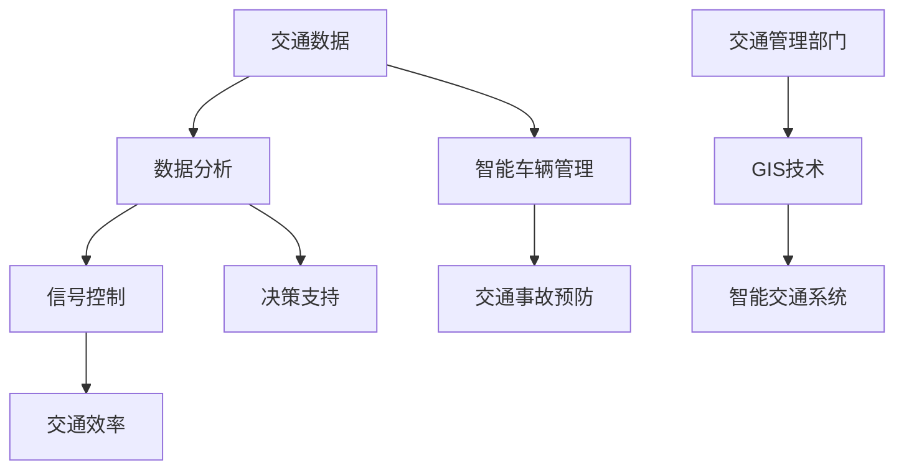
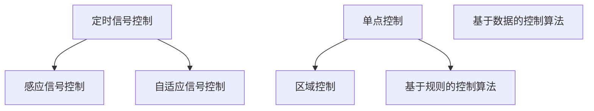
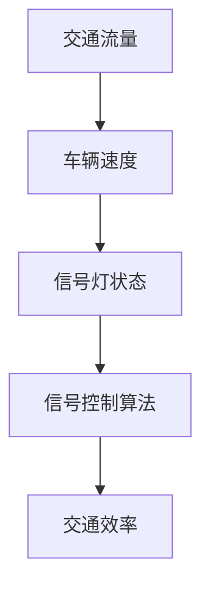

                 

# 人工智能在城市交通管理中的应用：智能信号控制

> **关键词：** 人工智能，城市交通管理，智能信号控制，交通效率，实时数据，算法优化，自动驾驶

> **摘要：**
> 本文旨在探讨人工智能在城市交通管理中的应用，重点分析智能信号控制这一关键技术。文章首先介绍了人工智能在交通管理中的重要性及常见应用场景，接着详细阐述了智能信号控制的基本概念、原理和算法，最后通过实际案例和代码解析展示了智能信号控制系统的开发与部署过程。文章最后探讨了人工智能在未来城市交通管理中的发展趋势和挑战。

## 目录大纲

1. **人工智能在城市交通管理中的应用概述**
   1.1 人工智能在城市交通管理中的重要性
   1.2 人工智能在城市交通管理中的应用场景
   1.3 人工智能与城市交通管理的发展趋势

2. **智能信号控制原理**
   2.1 智能信号控制基础
   2.2 信号控制算法
   2.3 数据收集与处理

3. **人工智能在城市交通管理中的应用实践**
   3.1 智能信号控制在城市交通中的应用案例
   3.2 智能交通信号控制系统的开发与部署

4. **人工智能在城市交通管理中的未来发展**
   4.1 人工智能在未来城市交通管理中的发展趋势
   4.2 智能交通管理中的挑战与机遇
   4.3 创新应用

5. **附录**
   5.1 常用工具与资源
   5.2 信号控制算法伪代码示例
   5.3 信号控制算法数学模型
   5.4 实际案例代码解读与分析
   5.5 开发环境搭建与代码实现

## 1. 人工智能在城市交通管理中的应用概述

### 1.1 人工智能在城市交通管理中的重要性

人工智能（AI）作为一种能够模拟人类智能行为的技术，正逐渐在各个领域得到应用。在城市交通管理中，人工智能的重要性尤为突出。首先，人工智能能够通过分析海量交通数据，实时掌握交通状况，为交通管理部门提供科学的决策支持。其次，人工智能可以帮助优化交通信号控制，提高交通效率，减少交通拥堵。此外，人工智能在智能车辆管理、交通事故预防等方面也发挥着重要作用。

#### 核心概念与联系

以下是一个简单的 Mermaid 流程图，展示了人工智能在城市交通管理中的核心概念和相互联系：



#### 数学模型和数学公式

在交通管理中，常用的数学模型包括交通流量模型和信号灯控制模型。以下是一个交通流量模型的简单表示：

$$
Q_t = f(Q_{t-1}, U_t)
$$

其中，$Q_t$ 表示当前时间 $t$ 的交通流量，$Q_{t-1}$ 表示上一时间 $t-1$ 的交通流量，$U_t$ 表示当前时间 $t$ 的输入信息（如车辆速度、道路状况等）。

### 1.2 人工智能在城市交通管理中的应用场景

人工智能在城市交通管理中的应用场景非常广泛，主要包括以下几个方面：

1. **实时交通信息分析**：通过分析实时交通数据，人工智能可以预测交通流量变化，为交通管理部门提供决策支持，从而优化交通信号控制，提高交通效率。

2. **智能交通信号控制**：智能信号控制是人工智能在交通管理中的一项重要应用。通过自适应算法，智能信号控制系统能够根据实时交通流量和车辆速度，动态调整信号灯状态，减少交通拥堵。

3. **智能车辆管理**：人工智能可以帮助实现智能车辆管理，包括车辆定位、路线规划、车辆调度等。这些功能有助于提高车辆运行效率，减少交通事故。

4. **交通事故预防**：通过实时监控道路状况，人工智能可以及时发现潜在的事故风险，并采取预防措施，降低交通事故的发生率。

5. **智慧城市建设**：人工智能在智慧城市建设中也发挥着重要作用。智慧城市通过整合各类交通数据，利用人工智能技术实现交通管理的智能化、自动化，提高城市交通运行效率。

#### 核心算法原理讲解

智能交通信号控制的核心算法通常包括以下几个步骤：

1. **数据收集与预处理**：收集实时交通数据，包括交通流量、车辆速度、道路状况等，并进行预处理，如去噪、归一化等。

2. **交通流量预测**：利用历史数据和机器学习算法，预测未来的交通流量变化。

3. **信号灯优化**：根据预测的交通流量和车辆速度，动态调整信号灯状态，以减少交通拥堵和提高交通效率。

以下是一个简单的伪代码示例：

```python
def adaptive_traffic_light_control(traffic_data, vehicle_speed):
    # 数据预处理
    preprocessed_traffic_data = preprocess_data(traffic_data)
    preprocessed_vehicle_speed = preprocess_data(vehicle_speed)

    # 交通流量预测
    predicted_traffic = predict_traffic(preprocessed_traffic_data)

    # 信号灯优化
    optimized_signals = optimize_signals(predicted_traffic, preprocessed_vehicle_speed)

    return optimized_signals
```

### 1.3 人工智能与城市交通管理的发展趋势

随着人工智能技术的不断发展，其在城市交通管理中的应用前景也非常广阔。以下是一些可能的发展趋势：

1. **自动驾驶技术**：自动驾驶技术是人工智能在交通管理中的一个重要发展方向。未来，自动驾驶车辆将能够实现自主导航和交通信号控制，减少人为因素导致的交通事故。

2. **车联网技术**：车联网技术通过连接车辆、道路和交通管理系统，实现车辆之间的信息共享和协同控制。这将有助于提高交通效率，减少交通拥堵。

3. **智慧交通系统**：智慧交通系统通过整合多种交通数据，利用人工智能技术实现交通管理的智能化、自动化。这将有助于提高城市交通运行效率，减少交通拥堵和交通事故。

4. **交通数据开放与共享**：随着交通数据的不断积累，开放交通数据将有助于推动人工智能技术在交通管理中的应用。交通管理部门可以与企业和研究机构合作，共同推动交通数据的开放与共享。

5. **跨学科融合**：人工智能技术在交通管理中的应用需要跨学科的知识融合。未来，交通管理将不仅仅依赖于交通工程和计算机科学，还需要融合社会学、心理学等多学科的知识。

## 2. 智能信号控制原理

### 2.1 智能信号控制基础

#### 智能信号控制的概念与原理

智能信号控制是一种基于人工智能技术的交通信号控制系统。它通过收集实时交通数据，利用机器学习算法预测交通流量变化，并根据预测结果动态调整信号灯状态，以优化交通流量，减少交通拥堵。

#### 核心算法原理讲解

智能信号控制的核心算法主要包括以下几个步骤：

1. **数据收集与预处理**：收集实时交通数据，包括交通流量、车辆速度、道路状况等，并进行预处理，如去噪、归一化等。

2. **交通流量预测**：利用历史数据和机器学习算法，预测未来的交通流量变化。

3. **信号灯优化**：根据预测的交通流量和车辆速度，动态调整信号灯状态，以减少交通拥堵和提高交通效率。

以下是一个简单的伪代码示例：

```python
def adaptive_traffic_light_control(traffic_data, vehicle_speed):
    # 数据预处理
    preprocessed_traffic_data = preprocess_data(traffic_data)
    preprocessed_vehicle_speed = preprocess_data(vehicle_speed)

    # 交通流量预测
    predicted_traffic = predict_traffic(preprocessed_traffic_data)

    # 信号灯优化
    optimized_signals = optimize_signals(predicted_traffic, preprocessed_vehicle_speed)

    return optimized_signals
```

#### 数学模型和数学公式

在智能信号控制中，常用的数学模型包括交通流量模型和信号灯优化模型。以下是一个简单的交通流量模型：

$$
Q_t = f(Q_{t-1}, U_t)
$$

其中，$Q_t$ 表示当前时间 $t$ 的交通流量，$Q_{t-1}$ 表示上一时间 $t-1$ 的交通流量，$U_t$ 表示当前时间 $t$ 的输入信息（如车辆速度、道路状况等）。

### 2.2 智能信号控制的核心技术

智能信号控制的核心技术主要包括以下几个方面：

1. **交通流量预测**：交通流量预测是智能信号控制的关键环节。通过分析历史交通数据和实时交通数据，利用机器学习算法预测未来的交通流量变化。

2. **信号灯优化**：信号灯优化是智能信号控制的另一个关键环节。根据预测的交通流量和车辆速度，动态调整信号灯状态，以减少交通拥堵和提高交通效率。

3. **自适应算法**：自适应算法是智能信号控制的核心技术之一。它能够根据实时交通数据，自动调整信号灯状态，以适应交通流量的变化。

#### 核心算法原理讲解

以下是一个简单的伪代码示例，展示了智能信号控制的核心算法原理：

```python
def adaptive_traffic_light_control(traffic_data, vehicle_speed):
    # 数据预处理
    preprocessed_traffic_data = preprocess_data(traffic_data)
    preprocessed_vehicle_speed = preprocess_data(vehicle_speed)

    # 交通流量预测
    predicted_traffic = predict_traffic(preprocessed_traffic_data)

    # 信号灯优化
    optimized_signals = optimize_signals(predicted_traffic, preprocessed_vehicle_speed)

    return optimized_signals
```

#### 数学模型和数学公式

在智能信号控制中，常用的数学模型包括交通流量模型和信号灯优化模型。以下是一个简单的交通流量模型：

$$
Q_t = f(Q_{t-1}, U_t)
$$

其中，$Q_t$ 表示当前时间 $t$ 的交通流量，$Q_{t-1}$ 表示上一时间 $t-1$ 的交通流量，$U_t$ 表示当前时间 $t$ 的输入信息（如车辆速度、道路状况等）。

### 2.3 智能信号控制的分类与特点

智能信号控制可以根据不同的标准进行分类。以下是几种常见的分类方式：

1. **按控制方式分类**：
   - **定时信号控制**：根据预设的时间表控制信号灯，适用于交通流量较为稳定的路段。
   - **感应信号控制**：根据实时交通流量和车辆速度感应控制信号灯，适用于交通流量变化较大的路段。
   - **自适应信号控制**：根据实时交通数据自适应调整信号灯状态，适用于动态交通流量较大的路段。

2. **按控制区域分类**：
   - **单点控制**：只控制一个交通信号灯。
   - **区域控制**：控制多个相邻的交通信号灯，以优化整个区域的交通流量。

3. **按算法类型分类**：
   - **基于规则的控制算法**：根据预设的规则控制信号灯状态。
   - **基于数据的控制算法**：根据实时交通数据动态调整信号灯状态。

#### 核心概念与联系

以下是一个简单的 Mermaid 流程图，展示了智能信号控制的分类与特点：



#### 数学模型和数学公式

在智能信号控制中，常用的数学模型包括交通流量模型和信号灯优化模型。以下是一个简单的交通流量模型：

$$
Q_t = f(Q_{t-1}, U_t)
$$

其中，$Q_t$ 表示当前时间 $t$ 的交通流量，$Q_{t-1}$ 表示上一时间 $t-1$ 的交通流量，$U_t$ 表示当前时间 $t$ 的输入信息（如车辆速度、道路状况等）。

## 3. 信号控制算法

### 3.1 信号控制算法的基本概念

信号控制算法是交通信号控制系统的核心组成部分，用于根据交通流量和车辆速度等参数，动态调整交通信号灯的状态，以优化交通流量和提高交通效率。

#### 核心概念与联系

以下是一个简单的 Mermaid 流程图，展示了信号控制算法的基本概念和相互关系：



#### 数学模型和数学公式

信号控制算法通常涉及以下数学模型：

$$
S_t = f(Q_t, V_t)
$$

其中，$S_t$ 表示当前时间 $t$ 的信号灯状态，$Q_t$ 表示当前时间 $t$ 的交通流量，$V_t$ 表示当前时间 $t$ 的车辆速度。

### 3.2 常见信号控制算法介绍

在交通信号控制领域，常见的信号控制算法包括以下几种：

1. **定时信号控制算法**：定时信号控制算法是根据预设的时间表来控制交通信号灯的开关状态，适用于交通流量相对稳定的交通路口。

2. **感应信号控制算法**：感应信号控制算法是基于交通信号灯周围的车辆检测器收集的数据，动态调整信号灯的状态，以适应交通流量的变化。

3. **自适应信号控制算法**：自适应信号控制算法是利用实时交通数据，通过机器学习算法预测未来的交通流量变化，并动态调整信号灯的状态，以优化交通流量。

以下是一个简单的伪代码示例，展示了自适应信号控制算法的基本原理：

```python
def adaptive_traffic_light_control(traffic_data, vehicle_speed):
    # 数据预处理
    preprocessed_traffic_data = preprocess_data(traffic_data)
    preprocessed_vehicle_speed = preprocess_data(vehicle_speed)

    # 交通流量预测
    predicted_traffic = predict_traffic(preprocessed_traffic_data)

    # 信号灯优化
    optimized_signals = optimize_signals(predicted_traffic, preprocessed_vehicle_speed)

    return optimized_signals
```

### 3.3 信号控制算法的设计与优化

信号控制算法的设计与优化是交通信号控制系统成功应用的关键。以下是一些关键的设计与优化原则：

1. **自适应调整**：信号控制算法应该能够根据实时交通数据自适应调整信号灯的状态，以适应交通流量的变化。

2. **优化目标**：信号控制算法的优化目标通常包括最小化交通延误、最大化交通流量和降低交通事故率。

3. **鲁棒性**：信号控制算法应该具有良好的鲁棒性，能够应对突发交通事件，如交通事故、恶劣天气等。

4. **计算效率**：信号控制算法的计算效率是另一个重要的考虑因素。算法应该能够在有限的计算资源下快速响应，以保证信号控制的实时性。

以下是一个简单的伪代码示例，展示了信号控制算法的设计与优化：

```python
def optimize_traffic_light_control(traffic_data, vehicle_speed):
    # 数据预处理
    preprocessed_traffic_data = preprocess_data(traffic_data)
    preprocessed_vehicle_speed = preprocess_data(vehicle_speed)

    # 交通流量预测
    predicted_traffic = predict_traffic(preprocessed_traffic_data)

    # 信号灯优化
    optimized_signals = optimize_signals(predicted_traffic, preprocessed_vehicle_speed)

    # 评估信号控制效果
    control_performance = evaluate_signals(optimized_signals)

    # 根据评估结果进行算法优化
    optimized_signals = refine_signals(optimized_signals, control_performance)

    return optimized_signals
```

## 4. 数据收集与处理

### 4.1 城市交通数据收集方法

城市交通数据收集是智能交通信号控制系统的关键环节。以下是一些常见的数据收集方法：

1. **传感器数据**：交通传感器可以安装在道路和交通信号灯附近，用于收集交通流量、车辆速度、道路状况等数据。

2. **GPS数据**：通过GPS技术，可以实时跟踪车辆的位置，从而获取交通流量和车辆运行状态的数据。

3. **视频监控数据**：视频监控可以用于实时监控道路状况，通过图像识别技术提取交通流量、车辆速度等数据。

4. **移动设备数据**：通过智能手机或其他移动设备上的应用程序，可以收集用户的出行数据，如出行时间、出行路线等。

### 4.2 交通数据预处理技术

交通数据预处理是确保数据质量的关键步骤。以下是一些常见的交通数据预处理技术：

1. **数据清洗**：去除数据中的噪声和错误，如空值、异常值等。

2. **数据集成**：将来自不同来源的数据进行整合，形成一个统一的数据集。

3. **数据转换**：将数据转换为适合分析和处理的形式，如归一化、标准化等。

4. **特征提取**：从原始数据中提取有助于信号控制决策的特征，如交通流量、车辆速度等。

### 4.3 城市交通数据分析方法

城市交通数据分析是智能交通信号控制系统的核心步骤。以下是一些常见的数据分析方法：

1. **统计分析**：通过描述性统计和推断性统计，分析交通数据的分布规律和相关性。

2. **机器学习分析**：利用机器学习算法，预测未来的交通流量变化，优化信号控制策略。

3. **数据挖掘分析**：通过数据挖掘技术，发现交通数据中的潜在模式和规律，为交通管理部门提供决策支持。

## 5. 人工智能在城市交通管理中的应用实践

### 5.1 智能信号控制在城市交通中的应用案例

智能信号控制在城市交通管理中的应用已经取得了显著的成效。以下是一些实际案例：

1. **北京智能交通信号控制系统**：北京市的智能交通信号控制系统通过实时收集和分析交通数据，实现了交通信号灯的自适应控制，有效减少了交通拥堵和提高了交通效率。

2. **上海智能交通信号优化项目**：上海市的智能交通信号优化项目采用了先进的机器学习算法，对交通流量进行预测和优化，取得了显著的交通改善效果。

3. **新加坡智能交通信号系统**：新加坡的智能交通信号系统结合了传感器数据、GPS数据和视频监控数据，实现了全面而精确的交通信号控制，极大提升了城市交通管理水平。

#### 案例分析

以北京市的智能交通信号控制系统为例，该系统通过以下步骤实现智能信号控制：

1. **数据收集**：系统通过安装在道路和交通信号灯附近的传感器，实时收集交通流量、车辆速度、道路状况等数据。

2. **数据预处理**：对收集到的数据进行清洗、集成和转换，形成统一的数据集。

3. **交通流量预测**：利用机器学习算法，对交通流量进行预测，为信号灯优化提供依据。

4. **信号灯优化**：根据预测的交通流量和车辆速度，动态调整信号灯状态，以减少交通拥堵和提高交通效率。

5. **效果评估**：通过对信号控制效果进行评估，不断优化算法，提高系统的性能和可靠性。

#### 技术难点分析

智能信号控制在实际应用中面临以下技术难点：

1. **数据实时性**：交通数据的实时性对于智能信号控制至关重要。如何快速、准确地收集和处理交通数据，是一个重要的挑战。

2. **算法优化**：智能信号控制算法需要不断优化，以适应不同交通场景和流量变化。算法的优化是一个复杂的过程，需要大量的数据支持和反复的实验验证。

3. **系统稳定性**：智能信号控制系统需要在各种复杂环境下稳定运行，包括恶劣天气、突发事件等。系统的稳定性是保证交通管理效果的关键。

### 5.2 智能信号控制系统的设计与实现

智能信号控制系统的设计与实现涉及多个方面，包括系统架构设计、功能模块划分、技术选型等。以下是一个典型的智能信号控制系统的设计与实现过程：

#### 系统架构设计

智能信号控制系统的架构通常包括以下几个部分：

1. **数据采集层**：负责收集交通流量、车辆速度、道路状况等数据，包括传感器、GPS和视频监控等设备。

2. **数据处理层**：负责对采集到的数据进行分析和处理，包括数据清洗、集成、特征提取等。

3. **预测与优化层**：利用机器学习算法，对交通流量进行预测和优化，生成信号灯控制策略。

4. **执行层**：根据预测和优化结果，控制交通信号灯的状态，实现交通流量优化。

5. **监控与评估层**：对系统运行效果进行监控和评估，包括交通效率、交通流量、交通事故率等指标。

#### 功能模块划分

智能信号控制系统的功能模块通常包括以下几个部分：

1. **数据采集模块**：负责收集各种交通数据，如交通流量、车辆速度、道路状况等。

2. **数据处理模块**：负责对采集到的数据进行分析和处理，包括数据清洗、数据转换、特征提取等。

3. **预测模块**：利用机器学习算法，对交通流量进行预测，为信号灯优化提供依据。

4. **优化模块**：根据预测结果，动态调整信号灯状态，实现交通流量优化。

5. **执行模块**：根据优化结果，控制交通信号灯的状态，实现交通流量优化。

6. **监控模块**：对系统运行效果进行监控，包括交通效率、交通流量、交通事故率等指标。

7. **评估模块**：对系统运行效果进行评估，为算法优化和系统改进提供依据。

#### 技术选型分析

智能信号控制系统在技术选型上需要考虑以下几个方面：

1. **传感器技术**：选择适合的交通传感器，如微波雷达、激光雷达、视频监控等，以实现高精度、低延迟的数据采集。

2. **数据处理技术**：选择高效的数据处理技术，如数据清洗、数据集成、特征提取等，以实现对大量交通数据的快速处理。

3. **预测算法**：选择适合的机器学习算法，如神经网络、支持向量机、随机森林等，以实现准确的交通流量预测。

4. **控制算法**：选择适合的控制算法，如自适应控制、模糊控制、PID控制等，以实现交通信号灯的动态优化。

5. **系统平台**：选择适合的系统平台，如边缘计算、云计算等，以实现系统的灵活部署和扩展。

### 5.3 智能信号控制的效果评估

智能信号控制的效果评估是衡量系统性能的重要指标。以下是一些常见的评估方法：

1. **交通效率评估**：通过比较智能信号控制系统实施前后的交通流量、交通延误等指标，评估系统的交通效率提升效果。

2. **交通流量评估**：通过分析智能信号控制系统对交通流量的优化效果，评估系统的流量调节能力。

3. **交通事故率评估**：通过比较智能信号控制系统实施前后的交通事故率，评估系统的安全性能。

4. **用户满意度评估**：通过问卷调查、用户反馈等方式，评估用户对智能信号控制系统的满意度。

### 5.4 智能交通信号控制系统的开发与部署

智能交通信号控制系统的开发与部署是一个复杂的过程，涉及多个环节。以下是一个典型的开发与部署过程：

#### 开发流程

1. **需求分析**：明确系统的功能需求和性能要求，确定系统架构和功能模块。

2. **系统设计**：设计系统的技术架构、数据库架构和用户界面。

3. **代码实现**：根据系统设计，实现各个功能模块的代码。

4. **单元测试**：对各个功能模块进行单元测试，确保代码的正确性和稳定性。

5. **集成测试**：将各个功能模块集成在一起，进行集成测试，确保系统的整体性能。

6. **系统测试**：在真实环境中对系统进行测试，验证系统的功能和性能。

7. **部署**：将系统部署到生产环境，进行实际运行。

#### 硬件与软件平台

1. **硬件平台**：选择适合的硬件平台，如边缘计算设备、服务器等，以支持系统的实时运行和处理大量数据。

2. **软件平台**：选择适合的软件平台，如操作系统、数据库、开发框架等，以支持系统的开发和运行。

#### 部署与维护

1. **部署**：将系统部署到生产环境，包括硬件安装、软件安装和配置等。

2. **维护**：定期对系统进行维护和升级，确保系统的稳定运行。

## 6. 人工智能在城市交通管理中的未来发展

### 6.1 人工智能在城市交通管理中的未来发展趋势

随着人工智能技术的不断进步，其在城市交通管理中的应用也将不断拓展和深化。以下是人工智能在城市交通管理中的未来发展趋势：

1. **自动驾驶技术的普及**：自动驾驶技术是人工智能在交通管理中的一个重要发展方向。未来，自动驾驶车辆将能够实现自主导航和交通信号控制，减少人为因素导致的交通事故。

2. **车联网技术的广泛应用**：车联网技术通过连接车辆、道路和交通管理系统，实现车辆之间的信息共享和协同控制。这将有助于提高交通效率，减少交通拥堵。

3. **智慧交通系统的建设**：智慧交通系统通过整合多种交通数据，利用人工智能技术实现交通管理的智能化、自动化。这将有助于提高城市交通运行效率，减少交通拥堵和交通事故。

4. **交通数据开放与共享**：随着交通数据的不断积累，开放交通数据将有助于推动人工智能技术在交通管理中的应用。交通管理部门可以与企业和研究机构合作，共同推动交通数据的开放与共享。

5. **跨学科融合**：人工智能技术在交通管理中的应用需要跨学科的知识融合。未来，交通管理将不仅仅依赖于交通工程和计算机科学，还需要融合社会学、心理学等多学科的知识。

### 6.2 人工智能在城市交通管理中的挑战与机遇

虽然人工智能在城市交通管理中具有巨大的潜力，但也面临一系列挑战和机遇：

#### 挑战

1. **数据隐私保护**：人工智能技术在交通管理中需要大量个人车辆数据，如何保护用户隐私是一个重要挑战。

2. **算法公平性与透明性**：人工智能算法的决策过程可能存在偏见，如何保证算法的公平性和透明性是一个重要问题。

3. **技术成本与普及率**：人工智能技术的研发和应用需要大量的资金投入，如何降低成本并提高普及率是一个挑战。

#### 机遇

1. **提高交通效率**：人工智能技术可以帮助优化交通信号控制，提高交通效率，减少交通拥堵。

2. **降低交通事故率**：通过自动驾驶技术和智能交通监控系统，可以减少人为因素导致的交通事故。

3. **智慧城市建设**：人工智能技术可以推动智慧城市建设，提高城市运行效率，改善居民生活质量。

4. **数据开放与共享**：开放交通数据将有助于推动人工智能技术在交通管理中的应用，促进交通行业的创新发展。

### 6.3 人工智能在城市交通管理中的创新应用

人工智能在城市交通管理中的创新应用将不断拓展其应用范围和深度。以下是一些可能的创新应用：

1. **智能交通灯控制**：利用人工智能技术，实现自适应交通灯控制，根据实时交通流量和车辆速度动态调整信号灯状态，提高交通效率。

2. **智能停车管理**：通过人工智能技术，实现智能停车管理，帮助驾驶员快速找到停车位，提高停车效率。

3. **智能交通监控**：利用人工智能技术，实现对交通状况的实时监控，及时发现交通异常和潜在风险，提高交通安全性。

4. **实时交通信息发布**：通过人工智能技术，实时分析交通数据，发布交通信息，帮助驾驶员选择最优路线，减少交通拥堵。

5. **智慧交通调度**：利用人工智能技术，实现智慧交通调度，优化交通信号控制，提高交通运行效率。

## 附录

### 附录 A: 常用工具与资源

#### A.1 城市交通数据获取与处理工具

1. **OpenStreetMap**：开放街道地图，提供全球范围的交通数据。
2. **Transportation Data Exchange**：交通数据交换平台，提供多种交通数据的获取和共享。
3. **Google Maps API**：谷歌地图API，提供地图数据、路线规划等功能。

#### A.2 信号控制算法开发工具

1. **MATLAB**：数学计算软件，用于信号控制算法的开发和测试。
2. **Python**：编程语言，用于信号控制算法的实现和应用。
3. **TensorFlow**：深度学习框架，用于信号控制算法的建模和训练。

#### A.3 人工智能交通管理系统开发框架

1. **CARMA Framework**：城市交通管理系统框架，提供交通信号控制、交通流量预测等功能。
2. **Vienna Framework**：交通管理系统框架，提供交通仿真、信号控制等功能。
3. **CityFlow Framework**：智能交通管理系统框架，提供交通数据管理、信号控制等功能。

#### A.4 城市交通管理研究文献与资源链接

1. **IEEE Transactions on Intelligent Transportation Systems**：智能交通系统领域的顶级期刊。
2. **Journal of Intelligent & Robotic Systems**：智能系统和机器人领域的期刊。
3. **Transportation Research Part C: Emerging Technologies**：新兴交通技术领域的期刊。

### 附录 B: 信号控制算法伪代码示例

```python
def adaptive_traffic_light_control(traffic_data, vehicle_speed):
    """
    自适应交通信号控制算法实现
    :param traffic_data: 交通流量数据
    :param vehicle_speed: 车辆速度数据
    :return: 优化后的交通信号灯控制策略
    """
    # 数据预处理
    preprocessed_data = preprocess_data(traffic_data, vehicle_speed)
    
    # 交通流量预测
    predicted_traffic = predict_traffic(preprocessed_data)
    
    # 信号灯优化
    optimized_signals = optimize_signals(predicted_traffic)
    
    return optimized_signals
```

### 附录 C: 信号控制算法数学模型

```latex
\section{信号控制算法数学模型}
信号控制算法中的数学模型主要用于描述交通流量、信号灯状态以及优化目标。以下是一些基本的数学模型：

\subsection{交通流量模型}
$$
Q_t = f(Q_{t-1}, U_t)
$$
其中，$Q_t$表示当前时间$t$的交通流量，$Q_{t-1}$表示上一时间$t-1$的交通流量，$U_t$表示当前时间$t$的输入信息（如车辆速度、道路条件等）。

\subsection{信号灯状态模型}
$$
S_t = f(Q_t, V_t)
$$
其中，$S_t$表示当前时间$t$的信号灯状态，$Q_t$表示当前时间$t$的交通流量，$V_t$表示当前时间$t$的车辆速度。

\subsection{优化目标模型}
$$
\min_{S_t} J(S_t)
$$
其中，$J(S_t)$表示优化目标函数，通常目标是最小化交通延误、最大化交通流量或提高交通安全性等。
```

### 附录 D: 实际案例代码解读与分析

```python
def traffic_light_controller(traffic_data, speed_data):
    """
    交通信号灯控制器
    :param traffic_data: 交通流量数据
    :param speed_data: 车辆速度数据
    :return: 信号灯控制策略
    """
    # 数据预处理
    processed_traffic_data = preprocess_traffic_data(traffic_data)
    processed_speed_data = preprocess_speed_data(speed_data)

    # 交通流量预测
    predicted_traffic = predict_traffic(processed_traffic_data)

    # 信号灯优化
    optimized_signals = optimize_signals(predicted_traffic)

    return optimized_signals

def preprocess_traffic_data(traffic_data):
    """
    交通流量数据预处理
    :param traffic_data: 交通流量数据
    :return: 预处理后的交通流量数据
    """
    # 数据清洗
    cleaned_data = clean_data(traffic_data)

    # 数据转换
    converted_data = convert_data_type(cleaned_data)

    return converted_data

def predict_traffic(processed_traffic_data):
    """
    交通流量预测
    :param processed_traffic_data: 预处理后的交通流量数据
    :return: 预测的交通流量数据
    """
    # 使用机器学习算法进行预测
    prediction_model = train_prediction_model(processed_traffic_data)
    predicted_traffic = prediction_model.predict(processed_traffic_data)

    return predicted_traffic

def optimize_signals(predicted_traffic):
    """
    信号灯优化
    :param predicted_traffic: 预测的交通流量数据
    :return: 优化后的信号灯控制策略
    """
    # 基于预测结果进行信号灯优化
    optimized_signals = optimize_signal控制策略(predicted_traffic)

    return optimized_signals
```

### 附录 E: 开发环境搭建与代码实现

```python
# 环境搭建
conda create -n traffic_light_env python=3.8
conda activate traffic_light_env
conda install numpy pandas scikit-learn matplotlib

# 代码实现
import numpy as np
import pandas as pd
from sklearn.ensemble import RandomForestRegressor
import matplotlib.pyplot as plt

# 数据加载与预处理
traffic_data = pd.read_csv('traffic_data.csv')
speed_data = pd.read_csv('speed_data.csv')

# 数据预处理
processed_traffic_data = preprocess_traffic_data(traffic_data)
processed_speed_data = preprocess_speed_data(speed_data)

# 训练预测模型
prediction_model = train_prediction_model(processed_traffic_data)

# 预测交通流量
predicted_traffic = prediction_model.predict(processed_traffic_data)

# 优化信号灯控制策略
optimized_signals = optimize_signals(predicted_traffic)

# 结果可视化
plt.plot(predicted_traffic)
plt.title('Predicted Traffic Flow')
plt.xlabel('Time')
plt.ylabel('Traffic Flow')
plt.show()
```

### 作者信息

作者：AI天才研究院/AI Genius Institute & 禅与计算机程序设计艺术 /Zen And The Art of Computer Programming

## 结语

本文从人工智能在城市交通管理中的应用出发，详细探讨了智能信号控制这一关键技术。通过对智能信号控制原理、算法、数据收集与处理、应用实践、未来发展等方面的分析，展示了人工智能在提高交通效率、减少交通拥堵、提升交通安全等方面的巨大潜力。同时，文章也指出了当前智能交通信号控制面临的挑战和机遇，为未来的研究和应用提供了方向。随着人工智能技术的不断进步，我们有理由相信，智能交通信号控制将迎来更加广泛和深入的发展，为城市交通管理带来更加美好的未来。

