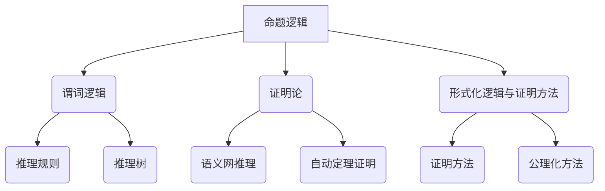

                 

## 人工智能的符号推理模型

> 关键词：符号推理、人工智能、逻辑推理、机器学习、自然语言处理

符号推理模型是人工智能领域中的一种重要模型，它通过符号表示和逻辑推理来模拟人类思维过程，实现知识表示、推理和决策。本文旨在探讨符号推理模型的基础知识、核心算法和实际应用，并通过实例分析展示其开发过程和效果。

> 摘要：本文首先介绍符号推理模型的基本概念和作用，然后详细阐述符号推理模型的基础知识，包括逻辑推理模型、语义网络和本体论。接着，探讨符号推理模型的核心算法，如基于规则的推理、不确定性推理和基于案例的推理，并介绍机器学习与符号推理的关系。最后，通过项目实战示例，展示符号推理模型在智能决策支持系统中的应用，并分析其未来发展趋势。

## 第一部分：符号推理模型的基础知识

符号推理模型是人工智能领域中的一种基本模型，通过符号表示和逻辑推理来实现知识的表示、推理和决策。符号推理模型的基本思想是将人类思维过程中的推理过程转化为计算机程序，从而实现自动化推理。这一部分将介绍符号推理模型的基础知识，包括逻辑推理模型、语义网络和本体论。

### 第1章：符号推理模型概述

#### 1.1 符号推理的定义与作用

符号推理是指利用符号表示的知识，通过逻辑推理规则进行推理的过程。符号推理的作用主要体现在以下几个方面：

1. **知识表示**：符号推理模型可以表示复杂的知识结构，包括事实、规则和关系等。
2. **推理**：符号推理模型可以通过逻辑推理规则，从已知的事实中推导出新的结论。
3. **决策**：符号推理模型可以基于推理结果，进行决策和规划。

#### 1.2 符号推理模型的发展历程

符号推理模型的发展可以追溯到20世纪50年代，当时逻辑学家提出了形式逻辑和谓词逻辑等理论。随着计算机技术的发展，符号推理模型逐渐应用于人工智能领域。近年来，随着机器学习技术的发展，符号推理模型与机器学习的结合，使得符号推理模型的性能和适用范围得到了极大的提升。

#### 1.3 符号推理模型的应用领域

符号推理模型广泛应用于各个领域，包括：

1. **自然语言处理**：符号推理模型可以用于语义分析、文本分类、机器翻译等任务。
2. **智能决策支持系统**：符号推理模型可以用于决策支持、风险评估、规划等任务。
3. **游戏AI**：符号推理模型可以用于游戏策略制定、棋谱分析等任务。

### 第2章：逻辑推理模型

逻辑推理模型是符号推理模型的核心组成部分，它利用逻辑规则进行推理。逻辑推理模型可以分为命题逻辑、谓词逻辑和证明论等。

#### 2.1 基本逻辑运算

基本逻辑运算包括合取（AND）、析取（OR）、非（NOT）等。这些运算构成了逻辑推理的基础。

- 合取运算：A ∧ B 表示 A 和 B 同时为真。
- 析取运算：A ∨ B 表示 A 和 B 中至少有一个为真。
- 非运算：¬A 表示 A 的否定。

#### 2.2 谓词逻辑

谓词逻辑是一种基于个体和属性的逻辑，它可以表示更复杂的关系和性质。

- 命题变元：表示个体或对象。
- 关系符号：表示个体之间的关系，如 "="（等于）、"∊"（属于）等。
- 谓词符号：表示个体的属性或性质。

#### 2.3 证明论

证明论是研究证明方法和证明理论的学科。在符号推理模型中，证明论提供了形式化的证明方法，可以用于证明命题的真伪。

- 形式证明：使用符号和逻辑规则，证明一个命题成立。
- 形式化逻辑：将自然语言命题转化为形式化的命题，以便进行证明。

#### 2.4 形式化逻辑与证明方法

形式化逻辑是一种将自然语言命题转化为符号形式的方法。通过形式化逻辑，可以更加精确地表示命题，并进行证明。

- 形式化语言：使用符号和语法规则，表示命题和推理。
- 形式证明方法：包括自然推理、逆否推理、归纳推理等。

### 第3章：语义网络与本体论

语义网络和本体论是用于表示知识的框架，它们可以用于构建符号推理模型。

#### 3.1 语义网络的定义与结构

语义网络是一种基于网络的表示方法，用于表示概念、关系和实例。

- 概念：表示事物或抽象概念。
- 关系：表示概念之间的关系。
- 实例：表示具体的事物或个体。

#### 3.2 本体论的基本概念

本体论是研究概念、分类和语义的学科。在符号推理模型中，本体论用于定义和描述知识的结构。

- 概念：表示事物或抽象概念。
- 属性：表示概念的特征。
- 实例：表示具体的事物或个体。

#### 3.3 语义网络与本体论的应用

语义网络和本体论在符号推理模型中的应用主要包括：

1. **知识表示**：使用语义网络和本体论，可以构建复杂的知识结构。
2. **推理**：基于语义网络和本体论，可以执行基于语义的推理。
3. **知识获取**：通过语义网络和本体论，可以自动化地获取知识。

## 第二部分：符号推理模型的核心算法

符号推理模型的核心算法包括基于规则的推理、不确定性推理和基于案例的推理。这些算法通过不同的方法和策略，实现了符号推理模型的推理功能。

### 第4章：基于规则的推理

基于规则的推理是符号推理模型中最基本和最常用的方法。它通过一系列规则，将输入事实映射到输出结论。

#### 4.1 基于规则的推理框架

基于规则的推理框架通常包括以下几个部分：

1. **规则库**：存储所有的推理规则。
2. **事实库**：存储当前的事实信息。
3. **推理机**：根据规则库和事实库，进行推理，生成新的结论。
4. **解释器**：用于解释推理过程和结果。

#### 4.2 条件概率推理

条件概率推理是一种基于概率论的推理方法，它通过计算条件概率，确定规则适用的可能性。

- 条件概率公式：P(A|B) = P(A∩B) / P(B)
- 贝叶斯定理：P(A|B) = P(B|A)P(A) / P(B)

#### 4.3 模式识别与分类

模式识别和分类是符号推理模型中的重要应用。通过训练模型，可以将新数据分类到已知的类别中。

- 决策树：一种常见的分类方法，通过树形结构，将数据划分为不同的类别。
- 支持向量机：一种基于间隔的分类方法，通过找到最优超平面，将数据分类。

### 第5章：不确定性推理

不确定性推理是符号推理模型中处理不确定信息的方法。它通过概率、模糊逻辑等方法，处理不确定性和模糊性。

#### 5.1 不确定性推理的定义与挑战

不确定性推理是指处理不确定信息的推理过程。它面临的挑战主要包括：

1. **不确定性表示**：如何准确表示不确定信息。
2. **推理策略**：如何在不确定性下进行有效推理。
3. **推理效率**：如何在保证推理准确性的同时，提高推理效率。

#### 5.2 模糊逻辑

模糊逻辑是一种处理不确定性和模糊性的数学工具。它通过模糊集合和模糊运算，描述和处理不确定信息。

- 模糊集合：用于表示模糊的概念和对象。
- 模糊运算：包括模糊合取、模糊析取和模糊非等。

#### 5.3 贝叶斯网络

贝叶斯网络是一种基于概率论的图形模型，用于表示不确定性和条件依赖关系。

- 贝叶斯网络结构：通过有向无环图，表示变量之间的条件依赖关系。
- 贝叶斯推理：通过贝叶斯网络，计算变量之间的概率分布。

#### 5.4 隐马尔可夫模型

隐马尔可夫模型（HMM）是一种用于处理序列数据的概率模型。它通过状态序列和观测序列，描述序列数据的不确定性。

- 状态转移概率：描述状态之间的转移概率。
- 观测概率：描述状态对应的观测概率。

### 第6章：基于案例的推理

基于案例的推理（Case-Based Reasoning, CBR）是一种基于已有案例的推理方法。它通过检索和适配已有案例，解决新问题。

#### 6.1 基于案例的推理原理

基于案例的推理原理包括以下几个步骤：

1. **案例检索**：根据新问题的特征，检索相似的已有案例。
2. **案例适配**：将检索到的案例适配到新问题，修正和调整案例的特征。
3. **案例应用**：将适配后的案例应用于新问题，生成解决方案。

#### 6.2 案例库的构建

案例库是CBR系统的基础。构建案例库的关键包括：

1. **案例选择**：选择具有代表性的案例。
2. **案例表示**：使用符号表示法，将案例特征和解决方案表示为符号形式。
3. **案例更新**：定期更新和扩充案例库，保持案例库的有效性和完整性。

#### 6.3 案例匹配与推理策略

案例匹配是CBR系统中的关键步骤。案例匹配包括以下几个步骤：

1. **特征提取**：从新问题和案例中提取特征。
2. **相似性度量**：计算新问题和案例之间的相似性度量。
3. **匹配策略**：根据相似性度量，选择最佳的匹配案例。

### 第7章：机器学习与符号推理

机器学习与符号推理的结合，为符号推理模型带来了新的发展机遇。机器学习可以用于训练符号推理模型，提高其性能和适用范围。

#### 7.1 机器学习的基本概念

机器学习是指通过计算机算法，从数据中自动学习和发现规律的方法。机器学习的基本概念包括：

1. **模型**：用于描述和预测数据的数学模型。
2. **特征**：用于描述数据特征的属性。
3. **训练**：使用已知数据，训练模型，使其能够预测新数据。

#### 7.2 符号学习与机器学习的关系

符号学习是机器学习的一个分支，它通过符号表示和推理，实现知识的表示和推理。符号学习与机器学习的关系包括：

1. **数据预处理**：符号学习可以用于预处理数据，提取有用的特征。
2. **模型选择**：符号学习可以用于选择适合问题的模型。
3. **推理优化**：机器学习可以用于优化推理过程，提高推理效率。

#### 7.3 决策树与支持向量机

决策树和支持向量机是两种常用的机器学习算法，它们在符号推理模型中有着广泛的应用。

- 决策树：通过树形结构，将数据划分为不同的类别。
- 支持向量机：通过找到最优超平面，将数据分类。

### 第三部分：符号推理模型的实际应用

符号推理模型在各个领域有着广泛的应用，包括自然语言处理、智能决策支持系统和游戏AI等。这一部分将介绍符号推理模型在这些领域的应用。

#### 第8章：符号推理模型在自然语言处理中的应用

自然语言处理（Natural Language Processing, NLP）是符号推理模型的一个重要应用领域。符号推理模型可以用于语义分析、文本分类、机器翻译等任务。

#### 8.1 自然语言处理的基本任务

自然语言处理的基本任务包括：

1. **分词**：将文本分解为单词或短语。
2. **词性标注**：为文本中的每个单词标注词性。
3. **句法分析**：分析文本的句法结构。
4. **语义分析**：理解文本的语义含义。

#### 8.2 基于规则的语义分析

基于规则的语义分析是符号推理模型在自然语言处理中的应用之一。它通过定义一系列规则，将文本映射到语义表示。

- 语义网络：用于表示文本的语义结构。
- 本体论：用于定义文本中的概念和关系。

#### 8.3 基于机器学习的语义分析

基于机器学习的语义分析是符号推理模型在自然语言处理中的另一个重要应用。它通过训练模型，自动提取和表示文本的语义信息。

- 决策树：用于分类文本。
- 支持向量机：用于分类文本。

#### 第9章：符号推理模型在智能决策支持系统中的应用

智能决策支持系统（Intelligent Decision Support System, IDSS）是符号推理模型在决策支持领域的应用。符号推理模型可以用于决策支持、风险评估、规划等任务。

#### 9.1 智能决策支持系统的概念

智能决策支持系统是指利用人工智能技术，提供决策支持和分析的系统。它通常包括以下几个部分：

1. **知识库**：存储决策相关的知识。
2. **推理机**：根据知识库和用户需求，进行推理和分析。
3. **用户界面**：提供用户交互的界面。

#### 9.2 基于符号推理的决策支持方法

基于符号推理的决策支持方法包括：

1. **基于规则的决策支持**：通过定义一系列规则，提供决策建议。
2. **基于案例的决策支持**：通过检索和适配已有案例，提供决策建议。

#### 9.3 决策支持系统的设计与实现

决策支持系统的设计与实现包括以下几个步骤：

1. **需求分析**：确定系统目标和功能。
2. **系统设计**：设计知识库、推理机和用户界面。
3. **模型训练**：训练符号推理模型，优化系统性能。
4. **系统实现**：编写代码，实现系统功能。
5. **系统测试**：测试系统的功能和性能。

#### 第10章：符号推理模型在游戏AI中的应用

游戏AI是符号推理模型在游戏领域的应用。符号推理模型可以用于游戏策略制定、棋谱分析等任务。

#### 10.1 游戏AI的基本概念

游戏AI是指利用人工智能技术，为游戏提供智能行为和策略。游戏AI的基本概念包括：

1. **规则AI**：通过定义一系列规则，控制游戏角色的行为。
2. **深度学习AI**：通过训练模型，实现游戏角色的智能行为。

#### 10.2 基于符号推理的游戏AI策略

基于符号推理的游戏AI策略包括：

1. **基于规则的策略**：通过定义一系列规则，制定游戏策略。
2. **基于案例的策略**：通过检索和适配已有案例，制定游戏策略。

#### 10.3 游戏AI的开发与优化

游戏AI的开发与优化包括以下几个步骤：

1. **需求分析**：确定游戏AI的需求和目标。
2. **系统设计**：设计符号推理模型框架。
3. **模型训练**：训练符号推理模型，优化策略性能。
4. **系统实现**：编写代码，实现游戏AI功能。
5. **系统测试**：测试游戏AI的性能和稳定性。

#### 第11章：符号推理模型的未来发展趋势

符号推理模型在人工智能领域有着广阔的应用前景。未来，符号推理模型将面临以下发展趋势：

1. **模型融合**：符号推理模型与深度学习、强化学习等模型的融合，提高推理性能。
2. **跨学科应用**：符号推理模型在认知科学、心理学等跨学科领域的应用，推动知识融合。
3. **智能化发展**：符号推理模型将逐步实现自动化和智能化，提高推理效率和准确性。

### 附录

#### 附录A：符号推理模型的开发工具与资源

符号推理模型的开发需要使用一系列工具和资源。以下是一些常用的工具和资源：

1. **开发工具**：包括Python、Java、C++等编程语言。
2. **开源符号推理框架**：如Prolog、Datalog、OWL等。
3. **符号推理相关论文与书籍推荐**：

   - [《人工智能：一种现代方法》](https://www.aima.org/wiki/index.php/A作曲家：一种现代方法)
   - [《认知模型与认知模拟》](https://www.amazon.com/Cognitive-Models-Emotions-Cognitive-Simulation/dp/0262033329)
   - [《机器学习》](https://www.amazon.com/Machine-Learning-Tom-Mitchell/dp/0262011716)

#### 附录B：符号推理模型的开发流程

符号推理模型的开发通常包括以下步骤：

1. **需求分析**：确定系统目标和功能。
2. **系统设计**：设计符号推理模型框架。
3. **知识库构建**：构建符号推理模型所需的知识库。
4. **模型训练**：训练符号推理模型，优化模型性能。
5. **系统实现**：编写代码，实现系统功能。
6. **系统测试**：测试系统的功能和性能。
7. **系统部署**：将系统部署到实际环境中。

### Mermaid 流程图示例（第2章：逻辑推理模型）



### 伪代码示例（第4章：基于规则的推理）

```python
# 定义规则库
rules = ["if A then B", "if B then C", "if C then D"]

# 输入事实
facts = ["A", "B"]

# 定义推理函数
def infer(facts, rules):
    inferred = []
    for fact in facts:
        for rule in rules:
            if fact == "if " + rule.split(" ")[0] + " then ":
                inferred.append(rule.split(" ")[1])
    return inferred

# 调用推理函数
inferences = infer(facts, rules)
print("推理结果：", inferences)
```

### 数学公式示例（第11章：符号推理模型的未来发展趋势）

$$
\text{符号推理模型的未来发展趋势} = f(\text{技术创新}, \text{跨学科合作}, \text{应用需求})
$$
$$
\text{其中，} f \text{为复合函数，} \text{技术创新} \text{表示符号推理算法和工具的改进，} \\
\text{跨学科合作} \text{表示与认知科学、心理学等领域的交叉研究，} \\
\text{应用需求} \text{表示不同领域对符号推理模型的具体需求。}
$$

### 项目实战示例（第9章：符号推理模型在智能决策支持系统中的应用）

// 示例：智能决策支持系统的设计与实现

1. 需求分析：确定系统目标、功能模块和数据流。
2. 系统设计：设计符号推理模型框架，包括知识库、推理机、解释器等。
3. 数据准备：收集相关领域的数据，构建符号推理模型所需的案例库和规则库。
4. 模型训练：使用机器学习算法训练符号推理模型，优化模型性能。
5. 系统实现：编写代码实现智能决策支持系统的各个模块。
6. 系统测试：测试系统的功能、性能和可靠性，确保系统满足需求。
7. 系统部署：将智能决策支持系统部署到实际环境中，提供决策支持服务。

// 代码解读与分析

- 需求分析阶段，明确了系统的目标，有助于后续的系统设计和实现。
- 系统设计阶段，符号推理模型框架的设计是系统的核心，直接影响系统的性能和效率。
- 数据准备阶段，数据的质量直接影响模型的效果，因此需要精心准备和筛选。
- 模型训练阶段，机器学习算法的选择和参数调优是关键，需要根据实际需求进行调整。
- 系统实现阶段，代码编写需要遵循良好的编程规范，保证代码的可读性和可维护性。
- 系统测试阶段，通过功能测试、性能测试和可靠性测试，确保系统的稳定运行。
- 系统部署阶段，将系统部署到实际环境中，提供决策支持服务，满足用户需求。

## 作者

作者：AI天才研究院/AI Genius Institute & 禅与计算机程序设计艺术 /Zen And The Art of Computer Programming

