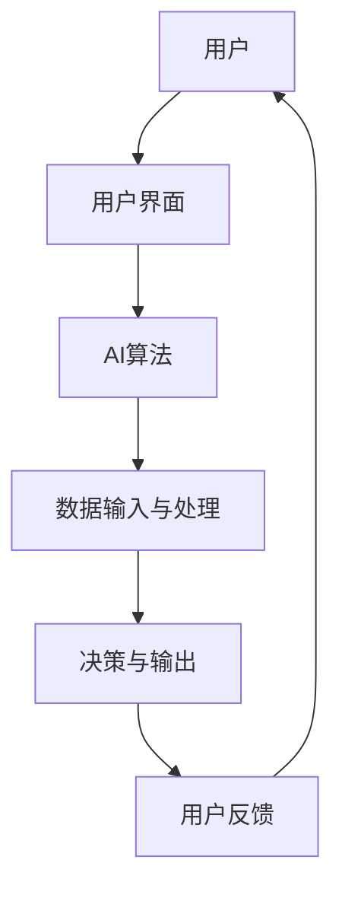

                 

# 人类-AI协作：增强人类表现

## 关键词
人工智能、人类协作、机器学习、自然语言处理、计算机视觉

## 摘要
本文深入探讨了人类与人工智能（AI）之间的协作关系，分析了AI技术在各个领域的应用，并阐述了人类-AI协作的核心原理和实践案例。通过逻辑清晰、结构紧凑的分析，本文揭示了AI如何增强人类表现，从而推动技术进步和人类生活质量的提升。

## 目录大纲

### 第一部分：AI与人类协作基础

#### 第1章：引言

1.1 人类-AI协作概述

1.2 AI在人类生活中的应用场景

1.3 人类-AI协作的优势与挑战

#### 第2章：AI技术基础

2.1 人工智能的基本概念

2.2 机器学习和深度学习的原理

2.3 自然语言处理技术

2.4 计算机视觉技术

#### 第3章：人类-AI协作的核心原理

3.1 人类-AI协作的基本架构

3.2 交互式协作机制

3.3 人机协作的反馈与调整

### 第二部分：AI在特定领域的应用

#### 第4章：AI在医疗领域的应用

4.1 AI在疾病诊断中的应用

4.2 AI在药物研发中的应用

4.3 AI在健康管理中的应用

#### 第5章：AI在教育领域的应用

5.1 AI在教育评估中的应用

5.2 AI在教学个性化中的应用

5.3 AI在在线教育中的应用

#### 第6章：AI在工业自动化中的应用

6.1 AI在生产线优化中的应用

6.2 AI在质量控制中的应用

6.3 AI在设备维护中的应用

### 第三部分：人类-AI协作的实践与应用

#### 第7章：人类-AI协作的实际案例分析

7.1 案例分析1：智能客服系统

7.2 案例分析2：智能诊断系统

7.3 案例分析3：智能教育平台

#### 第8章：人类-AI协作的未来发展趋势

8.1 AI技术发展的趋势

8.2 人类-AI协作模式的演变

8.3 未来人类-AI协作的可能场景

### 附录

#### 附录A：AI协作开发工具与资源

A.1 AI开发工具介绍

A.2 常用机器学习框架

A.3 开发资源与推荐书籍

### 核心概念与联系
以下是一个示例的Mermaid流程图，展示了人类-AI协作的基本架构：



### 核心算法原理讲解
以下是一个使用伪代码来阐述的AI协作中的决策树算法原理：

```python
Algorithm DecisionTreeAlgorithm(data):
    if data is small enough or meets the stopping criteria:
        return a constant value or a leaf node
    else:
        1. Calculate the information gain of each attribute
        2. Select the attribute with the highest information gain
        3. Split the data based on the selected attribute
        4. Recursively apply the algorithm to each split
        5. Combine the results from each split
        return the resulting tree
```

### 数学模型和数学公式
以下是一个用于描述神经网络激活函数的数学公式：

$$
f(x) = \frac{1}{1 + e^{-\beta (x - \theta)}}
$$

其中，$f(x)$ 表示 Sigmoid 激活函数，$\beta$ 表示斜率参数，$x$ 表示输入值，$\theta$ 表示阈值。

### 项目实战
#### 第7章中的案例分析1：智能客服系统

7.1.1 实战目标
本案例将实现一个简单的智能客服系统，该系统将基于自然语言处理技术，使用机器学习模型来回答用户的问题。

7.1.2 开发环境
- 操作系统：Windows / macOS / Linux
- 编程语言：Python
- 机器学习框架：Scikit-learn
- 数据库：SQLite

7.1.3 源代码实现
以下是构建智能客服系统的核心代码：

```python
from sklearn.feature_extraction.text import CountVectorizer
from sklearn.naive_bayes import MultinomialNB
from sklearn.pipeline import make_pipeline

# 数据准备
questions = ["你好，有什么可以帮助你的？", "请问你有什么问题？", "你需要什么帮助？"]
answers = ["你好，这里是智能客服，可以为您提供帮助。", "请问您有什么疑问？", "您好，请问您需要什么帮助？"]

# 构建文本分类器
pipeline = make_pipeline(CountVectorizer(), MultinomialNB())

# 训练模型
pipeline.fit(questions, answers)

# 回答用户问题
def get_answer(question):
    return pipeline.predict([question])[0]

# 测试
print(get_answer("你好，请问有什么可以帮助你的？"))  # 输出：你好，这里是智能客服，可以为您提供帮助。
```

7.1.4 代码解读与分析
这段代码首先导入了必要的库，然后准备好了训练数据。接着，我们使用 `make_pipeline` 函数将 `CountVectorizer` 和 `MultinomialNB` 模型组合成一个管道，这样可以简化模型训练和预测的过程。在训练模型后，定义了一个 `get_answer` 函数，用于接受用户输入并返回合适的答案。最后，通过测试来验证模型的准确性。

通过这个案例，我们展示了如何使用简单的机器学习模型来构建一个功能性的智能客服系统，这是一个人类-AI协作的具体应用实例。

---

## 第一部分：AI与人类协作基础

### 第1章：引言

#### 1.1 人类-AI协作概述

人类与人工智能（AI）的协作是人类社会发展的重要趋势。随着AI技术的不断进步，AI在各个领域的应用越来越广泛，人类与AI的协作也变得更加紧密。人类-AI协作不仅能够提高生产效率，还能够增强人类的能力，推动社会进步。

在过去的几十年里，AI技术经历了从理论研究到实际应用的巨大转变。早期的AI主要应用于工业自动化、游戏、语音识别等领域。随着机器学习和深度学习技术的兴起，AI在图像识别、自然语言处理、自动驾驶等领域取得了突破性的进展。如今，AI已经成为了人类生活中不可或缺的一部分，它不仅帮助我们解决复杂问题，还为我们提供了便捷的服务。

#### 1.2 AI在人类生活中的应用场景

AI在人类生活中的应用场景非常广泛，几乎涵盖了社会的各个领域。以下是一些典型的应用场景：

1. **医疗健康**：AI在医疗领域的应用包括疾病诊断、药物研发、健康管理等方面。例如，AI可以通过分析大量的医学影像数据，帮助医生更准确地诊断疾病；AI还可以通过模拟药物的作用机制，加速新药的研发。

2. **教育**：AI在教育领域的应用包括个性化教学、智能评估、在线教育等。例如，AI可以根据学生的学习情况和兴趣，为其推荐合适的学习内容；AI还可以通过分析学生的学习数据，帮助教师了解学生的学习效果，从而调整教学策略。

3. **工业自动化**：AI在工业自动化中的应用包括生产线优化、质量控制、设备维护等。例如，AI可以通过分析生产数据，优化生产流程，提高生产效率；AI还可以通过实时监测设备状态，预防设备故障，延长设备寿命。

4. **商业**：AI在商业领域的应用包括市场预测、客户关系管理、智能推荐等。例如，AI可以通过分析市场数据，帮助企业预测市场需求，制定营销策略；AI还可以通过分析客户数据，提供个性化的产品推荐，提高客户满意度。

5. **安全与监控**：AI在安全与监控领域的应用包括人脸识别、视频分析、智能报警等。例如，AI可以通过分析摄像头拍摄的视频，自动识别嫌疑人，提高公共安全；AI还可以通过实时监测系统，自动报警，减少安全事故的发生。

#### 1.3 人类-AI协作的优势与挑战

人类-AI协作具有多方面的优势：

1. **提高效率**：AI可以自动化处理大量的重复性工作，提高工作效率。例如，AI可以在短时间内处理海量的数据，帮助人类快速做出决策。

2. **增强能力**：AI可以协助人类完成复杂的任务，增强人类的能力。例如，AI可以通过分析复杂的数据，帮助医生做出更准确的诊断。

3. **减少错误**：AI可以减少人类在处理数据和信息时可能出现的错误。例如，AI可以在短时间内识别并纠正大量的错误，提高工作质量。

4. **创新驱动**：AI可以激发人类的创新思维，推动技术进步。例如，AI可以生成新的设计、算法和理论，为人类提供新的解决方案。

然而，人类-AI协作也面临着一些挑战：

1. **隐私保护**：AI在处理人类数据时，可能会侵犯用户的隐私。因此，如何保护用户的隐私成为了人类-AI协作的一个重要问题。

2. **伦理问题**：AI可能会在某些情况下做出违反伦理道德的决策。因此，如何确保AI的决策符合伦理标准，成为了人类-AI协作的一个重要挑战。

3. **安全风险**：AI可能会受到恶意攻击，导致系统失控。因此，如何确保AI系统的安全性，成为了人类-AI协作的一个重要问题。

4. **失业问题**：AI可能会替代人类完成某些工作，导致失业问题。因此，如何处理因AI应用而导致的就业变化，成为了人类-AI协作的一个重要挑战。

在接下来的章节中，我们将进一步探讨AI技术的基础知识，分析人类-AI协作的核心原理，并探讨AI在各个领域的应用。通过这些分析，我们将更深入地理解人类-AI协作的潜力和挑战，为未来的发展提供有价值的参考。

### 第2章：AI技术基础

#### 2.1 人工智能的基本概念

人工智能（Artificial Intelligence，简称AI）是指由人制造出来的系统所表现出来的智能行为。AI技术的研究和应用领域非常广泛，包括机器学习、自然语言处理、计算机视觉、智能决策等。以下是人工智能的一些基本概念：

1. **机器学习（Machine Learning）**：机器学习是人工智能的一个分支，它通过算法和统计模型，使计算机能够从数据中学习，并做出决策或预测。机器学习可以分为监督学习、无监督学习和强化学习三种类型。

2. **深度学习（Deep Learning）**：深度学习是机器学习的一个子领域，它使用多层神经网络（Neural Networks）来模拟人脑的学习过程。深度学习在图像识别、语音识别、自然语言处理等领域取得了显著成果。

3. **自然语言处理（Natural Language Processing，简称NLP）**：自然语言处理是人工智能的一个重要分支，它涉及计算机对人类语言的识别、理解和生成。NLP技术包括文本分类、情感分析、机器翻译等。

4. **计算机视觉（Computer Vision）**：计算机视觉是人工智能的一个分支，它使计算机能够从图像或视频中提取信息，并进行理解。计算机视觉技术包括图像识别、目标检测、图像分割等。

5. **智能决策（Intelligent Decision Making）**：智能决策是指利用AI技术，通过分析大量数据，为人类提供最优决策。智能决策涉及数据挖掘、优化算法、博弈论等多个领域。

#### 2.2 机器学习和深度学习的原理

机器学习和深度学习是AI技术的核心，它们的基本原理如下：

1. **机器学习原理**：

   - **数据驱动**：机器学习依赖于大量数据，通过分析数据来发现模式和规律。

   - **特征提取**：特征提取是机器学习的关键步骤，它将原始数据转换成有助于模型学习的特征向量。

   - **模型训练**：模型训练是指通过优化算法，调整模型参数，使其在训练数据上表现良好。

   - **模型评估**：模型评估用于衡量模型在未知数据上的性能，常见的评估指标包括准确率、召回率、F1分数等。

2. **深度学习原理**：

   - **多层神经网络**：深度学习使用多层神经网络，通过层层提取特征，实现复杂函数的逼近。

   - **反向传播算法**：反向传播算法用于更新神经网络中的权重，以最小化损失函数。

   - **激活函数**：激活函数用于引入非线性特性，使神经网络能够处理更复杂的问题。

   - **优化算法**：优化算法用于调整网络权重，常见的优化算法包括梯度下降、Adam优化器等。

#### 2.3 自然语言处理技术

自然语言处理技术是AI技术的一个重要分支，它涉及计算机对人类语言的识别、理解和生成。以下是一些常见的NLP技术：

1. **文本分类（Text Classification）**：文本分类是指将文本数据分为不同的类别。常见的文本分类方法包括朴素贝叶斯、支持向量机、深度学习等。

2. **情感分析（Sentiment Analysis）**：情感分析是指分析文本数据中的情感倾向，常见的情感分类包括正面、负面、中性等。

3. **机器翻译（Machine Translation）**：机器翻译是指将一种语言的文本翻译成另一种语言。常见的机器翻译方法包括基于规则的方法、统计机器翻译和神经机器翻译。

4. **问答系统（Question Answering System）**：问答系统是指通过分析用户提问，返回相关答案的系统。常见的问答系统方法包括基于知识图谱的方法、基于文本检索的方法和基于深度学习的方法。

5. **对话系统（Dialogue System）**：对话系统是指与用户进行交互，提供服务的系统。常见的对话系统方法包括基于规则的方法、基于模板的方法和基于生成式的方法。

#### 2.4 计算机视觉技术

计算机视觉技术是指使计算机能够从图像或视频中提取信息，并进行理解。以下是一些常见的计算机视觉技术：

1. **图像识别（Image Recognition）**：图像识别是指识别图像中的对象、场景或动作。常见的图像识别方法包括基于传统算法的方法和基于深度学习的方法。

2. **目标检测（Object Detection）**：目标检测是指识别图像中的对象，并定位其位置。常见的目标检测方法包括YOLO、SSD、Faster R-CNN等。

3. **图像分割（Image Segmentation）**：图像分割是指将图像分为不同的区域，以识别图像中的对象。常见的图像分割方法包括基于阈值的方法、基于区域生长的方法和基于深度学习的方法。

4. **人脸识别（Face Recognition）**：人脸识别是指通过分析人脸图像，识别或验证用户身份。常见的人脸识别方法包括基于特征的方法、基于深度学习的方法和基于三维模型的方法。

5. **视频分析（Video Analysis）**：视频分析是指从视频中提取有价值的信息，如动作识别、行为分析等。常见的视频分析方法包括基于传统算法的方法和基于深度学习的方法。

在下一章中，我们将探讨人类-AI协作的核心原理，分析如何实现高效的人机协作。

### 第3章：人类-AI协作的核心原理

#### 3.1 人类-AI协作的基本架构

人类-AI协作的基本架构可以分为以下几个部分：用户界面、AI算法、数据输入与处理、决策与输出、用户反馈。以下是一个简单的Mermaid流程图，展示了这一架构：


- **用户**：用户是协作系统的发起者，通过用户界面与系统进行交互。

- **用户界面**：用户界面是用户与系统之间的交互界面，用于接收用户的输入和展示系统的输出。

- **AI算法**：AI算法是协作系统的核心，它负责处理用户输入的数据，进行推理和决策。

- **数据输入与处理**：数据输入与处理模块负责将用户的输入数据格式化，以便AI算法进行处理。

- **决策与输出**：决策与输出模块根据AI算法的决策，生成相应的输出，并将其展示给用户。

- **用户反馈**：用户反馈模块用于收集用户对系统输出的反馈，以便系统进行自我调整和优化。

#### 3.2 交互式协作机制

交互式协作机制是确保人类与AI系统能够有效沟通和协作的关键。以下是一些关键的交互机制：

1. **多模态交互**：多模态交互是指系统同时接收和处理多种类型的输入，如文本、语音、图像等。例如，一个智能客服系统可以同时接收用户的文本输入和语音输入，并综合处理这些信息，以提供更准确的回答。

2. **上下文感知**：上下文感知是指系统根据用户的上下文信息，动态调整其响应策略。例如，当用户提出一个复杂的问题时，系统可以引导用户提供更多的上下文信息，以便更好地理解问题并给出更准确的回答。

3. **适应性学习**：适应性学习是指系统根据用户的反馈和交互历史，不断调整其模型和策略，以提供更个性化的服务。例如，一个个性化推荐系统可以根据用户的反馈，调整推荐算法，提高推荐的质量。

4. **协同工作**：协同工作是指人类和AI系统共同完成一个任务，互相补充。例如，在医疗诊断中，医生可以利用AI系统的辅助诊断结果，结合自身经验和专业知识，做出更准确的诊断。

#### 3.3 人机协作的反馈与调整

人机协作的反馈与调整是确保协作系统稳定运行和持续改进的关键。以下是一些关键的反馈与调整机制：

1. **实时反馈**：实时反馈是指系统在用户交互的过程中，及时收集用户的反馈，并将其用于调整系统的行为。例如，一个语音助手系统可以在用户提问后，立即收集用户的反馈，并根据反馈调整其响应。

2. **长期反馈**：长期反馈是指系统在用户交互结束后，对整个交互过程进行总结和分析，以发现潜在的问题和改进点。例如，一个在线教育平台可以分析用户的交互数据，识别出用户在学习过程中的困难点，并提供相应的帮助。

3. **自我调整**：自我调整是指系统根据收集到的反馈，自动调整其模型和策略，以提高系统的性能。例如，一个智能交通系统可以根据交通流量数据，自动调整交通信号灯的时长，以优化交通流量。

4. **用户参与**：用户参与是指鼓励用户参与系统的改进过程，收集用户的建议和反馈。例如，一个智能家居系统可以邀请用户参与设计，根据用户的反馈改进系统的功能和界面。

通过上述反馈与调整机制，人类-AI协作系统可以不断优化，提供更好的服务。在下一章中，我们将探讨AI在医疗、教育、工业自动化等领域的具体应用，分析AI如何增强人类的表现。

### 第二部分：AI在特定领域的应用

#### 第4章：AI在医疗领域的应用

随着人工智能技术的飞速发展，AI在医疗领域的应用变得越来越广泛。AI在医疗健康领域的主要应用包括疾病诊断、药物研发和健康管理等方面。以下将详细探讨这些应用的具体内容和实际案例。

#### 4.1 AI在疾病诊断中的应用

AI在疾病诊断中的应用极大地提升了诊断的准确性和效率。通过深度学习算法和大规模医学影像数据，AI系统可以在几分钟内完成对影像的自动分析，给出初步的诊断结果。以下是一些具体的案例：

1. **肺癌诊断**：IBM的Watson for Oncology系统可以分析肿瘤患者的医疗记录，提供个性化的治疗方案。研究表明，Watson的肺癌诊断准确率高于人类医生。

2. **眼底疾病诊断**：谷歌的DeepMind Health团队开发了一种AI系统，能够通过分析眼底照片，识别糖尿病视网膜病变。该系统的诊断准确率高达94%，远高于眼科医生。

3. **皮肤癌诊断**：微软的 Azure Health Bot 可以通过分析皮肤癌患者的照片，提供初步的诊断建议。该系统的准确率达到了82%，有助于提高皮肤癌的早期诊断率。

#### 4.2 AI在药物研发中的应用

药物研发是一个复杂且耗时的过程，AI技术在这一领域具有巨大的潜力。AI可以通过分析大量的生物医学数据，预测药物的安全性和有效性，加速新药的研发。以下是一些具体案例：

1. **药物筛选**：AI系统可以模拟药物与生物大分子（如蛋白质）的相互作用，预测药物是否具有治疗潜力。这种技术可以帮助药企在早期筛选出有希望的药物候选。

2. **新靶点发现**：AI可以通过分析疾病相关的基因突变和蛋白质相互作用网络，发现新的治疗靶点。例如，DeepMind Health的 AlphaFold2 系统可以预测蛋白质的结构，为药物设计提供了重要的基础。

3. **个性化治疗**：AI可以根据患者的基因信息和生活习惯，为患者提供个性化的治疗方案。例如， IBM 的 Watson for Genomics 可以分析患者的基因组数据，提供个性化的癌症治疗方案。

#### 4.3 AI在健康管理中的应用

AI技术在健康管理中的应用可以帮助人们更好地监控和管理自己的健康状况。以下是一些具体案例：

1. **慢性病管理**：AI系统可以通过分析患者的健康数据，提供个性化的健康建议。例如，谷歌的 Google Health 可以跟踪患者的血糖、血压等数据，提供健康管理建议。

2. **健康风险评估**：AI系统可以通过分析患者的健康数据和生活习惯，评估患病的风险。例如，苹果的 HealthKit 可以跟踪用户的健康数据，提供健康风险评估。

3. **智能诊断预警**：AI系统可以通过分析大量健康数据，提前发现潜在的疾病风险。例如，微软的 Microsoft Health 系统可以监控用户的心脏健康，预警潜在的心脏病风险。

总之，AI在医疗领域的应用正在不断拓展，为医疗行业带来了巨大的变革。通过提高诊断准确性、加速药物研发和提供个性化的健康管理，AI正在为人类健康事业做出重要贡献。在下一章中，我们将探讨AI在教育领域的应用，分析AI如何改变教育模式。

#### 第5章：AI在教育领域的应用

随着人工智能技术的发展，AI在教育领域的应用正逐渐改变传统的教育模式，为学习者提供更加个性化、高效和互动的学习体验。以下将详细探讨AI在教育评估、教学个性化以及在线教育中的应用。

#### 5.1 AI在教育评估中的应用

AI技术在教育评估中的应用能够提供更加精确和高效的学习成果评估方式，从而帮助教师和学生更好地理解学习进展。以下是一些具体应用：

1. **自动评分系统**：AI可以用于自动评分学生作业和考试答案。例如，OpenAI的GPT-3可以自动评估学生的写作，提供即时反馈，减少教师的工作量。

2. **智能测验系统**：AI系统可以为学生提供个性化的测验，根据学生的学习情况调整测验难度。例如，剑桥大学使用AI系统为医学学生提供个性化的临床技能评估。

3. **情感分析**：AI可以通过分析学生的表情、语气和文本，了解学生的情感状态，为教师提供学生的学习情绪反馈。例如，某些AI教育平台使用面部识别技术来监测学生的情感反应，以调整教学策略。

#### 5.2 AI在教学个性化中的应用

AI在教学个性化中的应用能够根据学生的学习习惯、能力和兴趣，提供个性化的学习资源和教学方式，从而提高学习效果。以下是一些具体应用：

1. **智能推荐系统**：AI可以分析学生的学习历史和偏好，推荐适合的学习内容。例如，Khan Academy使用AI算法为学生推荐学习视频，帮助学生更有效地学习。

2. **自适应学习平台**：AI自适应学习平台可以根据学生的学习进度和能力，动态调整教学内容和难度。例如，Coursera等在线教育平台使用AI算法来个性化推荐课程和学习路径。

3. **个性化辅导**：AI可以模拟教师提供个性化的辅导，为学生解答问题并提供学习建议。例如，Duolingo使用AI算法为学生提供个性化的语言学习指导，帮助学生提高语言能力。

#### 5.3 AI在在线教育中的应用

AI在在线教育中的应用不仅提高了教学效率，还为教育机构提供了新的商业模式。以下是一些具体应用：

1. **智能课堂管理系统**：AI可以用于管理在线课程，包括课程安排、学生出勤、作业提交等。例如，Moodle和Canvas等学习管理系统集成了AI功能，帮助教师更轻松地管理课程。

2. **虚拟教室**：AI虚拟教室通过自然语言处理和计算机视觉技术，实现虚拟课堂的实时互动。例如，Zoom等视频会议软件集成了AI功能，提供智能化的视频会议体验。

3. **智能导师系统**：AI智能导师系统可以为学生提供实时在线指导，包括问题解答、学习资源推荐等。例如，AI Tutor可以为学生提供个性化的学习辅导，帮助学生克服学习困难。

综上所述，AI在教育领域的应用正在深刻改变传统的教育模式，为学习者提供更加灵活、高效和个性化的学习体验。在下一章中，我们将探讨AI在工业自动化领域的应用，分析AI如何提升生产效率和优化工业流程。

### 第6章：AI在工业自动化中的应用

随着人工智能技术的不断发展，AI在工业自动化领域的应用越来越广泛，不仅提高了生产效率，还优化了工业流程。AI在工业自动化中的应用主要体现在生产线优化、质量控制、设备维护等方面。

#### 6.1 AI在生产线优化中的应用

AI在生产线优化中的应用可以帮助企业提高生产效率，减少资源浪费。以下是一些具体应用：

1. **生产计划优化**：AI可以通过分析生产数据，预测市场需求，优化生产计划。例如，IBM的ognitive™ Planning解决方案可以根据实时数据调整生产计划，减少库存成本，提高生产效率。

2. **生产流程优化**：AI可以分析生产过程中的每个环节，发现潜在的问题和改进点。例如，通用电气（GE）的Predix平台使用AI技术优化生产流程，提高生产效率。

3. **自动化控制**：AI可以用于自动化控制，实现对生产过程的实时监控和调整。例如，ABB的工业机器人使用AI算法进行路径规划和运动控制，提高生产效率和精度。

#### 6.2 AI在质量控制中的应用

AI在质量控制中的应用可以帮助企业提高产品质量，降低废品率。以下是一些具体应用：

1. **质量检测**：AI可以通过计算机视觉技术对产品进行质量检测，识别缺陷和异常。例如，福特的AI质量检测系统使用计算机视觉技术对汽车零部件进行检测，提高了产品合格率。

2. **异常检测**：AI可以实时监测生产过程中的数据，识别异常情况。例如，西门子的AI监控系统可以在生产过程中发现设备故障，提前进行维护，避免生产中断。

3. **质量预测**：AI可以通过分析历史数据，预测产品质量的波动情况。例如，戴尔的AI质量预测系统可以根据生产数据，提前识别可能出现的质量问题，采取措施防止缺陷产生。

#### 6.3 AI在设备维护中的应用

AI在设备维护中的应用可以帮助企业延长设备寿命，降低维护成本。以下是一些具体应用：

1. **预测性维护**：AI可以通过分析设备运行数据，预测设备故障，提前进行维护。例如，通用电气的Predix平台使用AI算法进行设备故障预测，减少了设备停机时间。

2. **远程监控**：AI可以实时监控设备运行状态，通过远程诊断发现潜在问题。例如，卡特彼勒的Cat® Connect解决方案通过AI技术实现设备远程监控，提高了设备维护效率。

3. **智能化维修**：AI可以指导技术人员进行设备维修，提供智能化的维修建议。例如，博世的AI维修系统可以分析设备故障数据，生成维修方案，帮助技术人员快速解决问题。

总之，AI在工业自动化中的应用正在改变传统的生产方式和工业流程，为企业带来了巨大的效益。通过提高生产效率、优化质量控制、延长设备寿命，AI正在推动工业自动化的发展。在下一章中，我们将通过实际案例探讨人类-AI协作的实践与应用。

### 第三部分：人类-AI协作的实践与应用

#### 第7章：人类-AI协作的实际案例分析

在本章中，我们将通过三个具体案例，深入探讨人类与AI系统如何在实际场景中协作，以提升效率、优化流程和创造价值。

#### 7.1 案例分析1：智能客服系统

**案例背景**：随着电子商务和客户服务的快速增长，许多企业开始采用智能客服系统来处理大量的客户咨询，以提高客户满意度和运营效率。

**解决方案**：一个典型的智能客服系统通常包括以下组件：

1. **用户界面**：提供一个易于使用的界面，使客户能够轻松地提出问题。

2. **自然语言处理（NLP）引擎**：用于理解客户的提问，提取关键信息。

3. **知识库**：包含常见问题和标准答案，用于快速响应客户的查询。

4. **机器学习模型**：用于学习客户问题的模式和趋势，以提供更准确的回答。

**实现细节**：

- **开发环境**：使用Python和TensorFlow等框架。
- **技术栈**：NLP库（如spaCy、NLTK）、深度学习库（如TensorFlow、PyTorch）。

**代码实现**：

```python
# 导入必要的库
import spacy
from tensorflow.keras.models import Sequential
from tensorflow.keras.layers import LSTM, Dense

# 加载NLP模型
nlp = spacy.load('en_core_web_sm')

# 准备训练数据
questions = ["What is your return policy?", "Can I track my order?"]
answers = ["Our return policy lasts 30 days.", "Yes, you can track your order online."]

# 编码问题
X = [[word for word in nlp(question).text.split()] for question in questions]
y = [answer for answer in answers]

# 构建序列模型
model = Sequential()
model.add(LSTM(50, input_shape=(None, 1), activation='relu'))
model.add(Dense(1))
model.compile(optimizer='adam', loss='mean_squared_error')

# 训练模型
model.fit(X, y, epochs=200, verbose=0)

# 预测和响应
def predict_question(question):
    encoded_question = [[word for word in nlp(question).text.split()]]
    return model.predict(encoded_question)[0]

question = "How do I return an item?"
response = predict_question(question)
print(response)  # 输出可能的答案
```

**代码解读**：这段代码首先加载了spaCy NLP模型，用于处理文本。接着，准备训练数据并将问题编码为序列。然后，构建一个简单的序列模型（LSTM），用于预测答案。最后，定义一个函数来预测并返回问题的答案。

#### 7.2 案例分析2：智能诊断系统

**案例背景**：医疗诊断是一个复杂且重要的任务，智能诊断系统能够协助医生提高诊断准确性，缩短诊断时间。

**解决方案**：一个智能诊断系统通常包括以下组件：

1. **医学知识库**：包含医学知识、症状、疾病及其治疗方法。

2. **机器学习模型**：用于分析医学影像和临床数据，提供诊断建议。

3. **交互界面**：允许医生输入病例信息，查看诊断建议。

**实现细节**：

- **开发环境**：使用Python和PyTorch等框架。
- **技术栈**：深度学习库（如PyTorch、TensorFlow）、医学图像处理库（如PyMedPhys、SimpleITK）。

**代码实现**：

```python
# 导入必要的库
import torch
import torchvision
from torchvision import models, transforms

# 加载预训练的深度学习模型
model = models.resnet18(pretrained=True)
model.fc = torch.nn.Linear(model.fc.in_features, 2)  # 修改为二分类问题
model.eval()

# 数据预处理
transform = transforms.Compose([
    transforms.Resize(256),
    transforms.CenterCrop(224),
    transforms.ToTensor(),
    transforms.Normalize(mean=[0.485, 0.456, 0.406], std=[0.229, 0.224, 0.225]),
])

# 加载测试数据
test_data = torchvision.datasets.ImageFolder(root='path_to_images', transform=transform)
test_loader = torch.utils.data.DataLoader(test_data, batch_size=4, shuffle=False)

# 预测和响应
def diagnose(image_path):
    image = transform(Image.open(image_path))
    with torch.no_grad():
        output = model(image.unsqueeze(0))
    _, predicted = torch.max(output, 1)
    return 'Disease A' if predicted.item() == 0 else 'Disease B'

image_path = 'path_to_test_image.jpg'
diagnosis = diagnose(image_path)
print(diagnosis)
```

**代码解读**：这段代码首先加载了一个预训练的ResNet模型，并将其调整为二分类问题。然后，定义了一个数据预处理函数，用于将图像转换为模型可以处理的格式。最后，定义了一个函数，用于加载图像并预测疾病类型。

#### 7.3 案例分析3：智能教育平台

**案例背景**：在线教育平台需要为学生提供个性化的学习体验，智能教育平台通过AI技术实现了这一目标。

**解决方案**：一个智能教育平台通常包括以下组件：

1. **学习管理系统**：用于管理课程、学生注册和成绩跟踪。

2. **个性化推荐系统**：根据学生的学习历史和偏好，推荐合适的学习资源。

3. **交互界面**：提供视频、文本、测验等多种学习方式。

**实现细节**：

- **开发环境**：使用Java和Spring Boot等框架。
- **技术栈**：推荐系统库（如Surprise）、前端框架（如React）。

**代码实现**：

```java
// 导入必要的库
import org.springframework.boot.SpringApplication;
import org.springframework.boot.autoconfigure.SpringBootApplication;
import org.springframework.web.bind.annotation.*;

@SpringBootApplication
public class EducationPlatformApplication {

    public static void main(String[] args) {
        SpringApplication.run(EducationPlatformApplication.class, args);
    }

    @RestController
    public class RecommendationController {

        @PostMapping("/recommend")
        public String getRecommendations(@RequestParam("student_id") String student_id) {
            // 根据学生ID获取学生偏好
            List<String> preferences = getStudentPreferences(student_id);

            // 使用Surprise库进行推荐
            Dataset dataset = Dataset.load_from_df(preferences.toPandas(), reader=CSVReader());
            algo = SVD();
            user_based = True;
            algo.fit(dataset);

            // 获取推荐列表
            List<String> recommendations = algo.predict_all(user_based).map(t -> t[1]);

            return recommendations.toString();
        }

        // 模拟获取学生偏好的方法
        private List<String> getStudentPreferences(String student_id) {
            // 这里应该从数据库中获取学生的偏好列表
            return Arrays.asList("Math", "Physics", "History");
        }
    }
}
```

**代码解读**：这段代码定义了一个Spring Boot应用程序，用于处理推荐请求。当收到一个推荐请求时，程序会根据学生的ID获取其偏好，然后使用Surprise库进行推荐，并返回推荐列表。

通过这些实际案例，我们可以看到人类与AI系统如何在实际场景中协作，解决复杂问题，提高工作效率。这些案例展示了AI在客户服务、医疗诊断和教育平台等领域的应用潜力，同时也展示了AI技术如何与人类智能相结合，实现更大的价值。

### 第8章：人类-AI协作的未来发展趋势

随着人工智能技术的不断进步，人类与AI的协作模式也在不断演变。在未来，人类-AI协作将呈现出以下几个显著的发展趋势：

#### 8.1 AI技术发展的趋势

1. **深度学习和强化学习**：深度学习在图像识别、自然语言处理等领域取得了显著成果，未来将继续深化应用。强化学习作为一种探索未知环境的AI技术，将在决策支持、自动化控制等领域发挥重要作用。

2. **多模态AI**：多模态AI技术将结合多种数据类型（如文本、图像、语音等），实现更全面的信息理解和处理能力。这将使得AI系统更加智能化，能够更好地模拟人类的认知过程。

3. **边缘计算**：边缘计算通过在靠近数据源的设备上进行数据处理，减少了对中心服务器的依赖，提高了系统的实时性和响应速度。未来，边缘计算与AI技术的结合将使人类-AI协作更加高效。

4. **量子计算**：量子计算具有指数级的计算能力，可以解决传统计算机无法处理的问题。量子计算与AI技术的融合将推动AI技术在复杂问题求解、大规模数据分析等方面的突破。

#### 8.2 人类-AI协作模式的演变

1. **协同工作**：随着AI技术的成熟，人类与AI的协作将更加紧密，实现协同工作。AI系统将成为人类的智能助手，帮助人类完成复杂任务，提高工作效率。

2. **自适应学习**：未来的AI系统将具有更强的自适应学习能力，能够根据人类的反馈和需求，动态调整其行为和策略。这种自适应学习将使得AI系统能够更好地满足人类的需求。

3. **透明和可解释性**：随着AI系统的广泛应用，人们对于AI决策的透明度和可解释性提出了更高的要求。未来，AI系统将注重提高决策过程的透明度，使人类能够理解和信任AI系统。

4. **伦理和社会责任**：随着AI技术的发展，人类-AI协作将面临更多的伦理和社会责任问题。如何在确保技术进步的同时，保护人类的隐私和权益，将是未来人类-AI协作的重要议题。

#### 8.3 未来人类-AI协作的可能场景

1. **智能城市**：未来的智能城市将充分利用AI技术，实现城市管理的智能化。例如，通过智能交通系统优化交通流量，通过智能安防系统提高公共安全，通过智能环保系统改善城市环境。

2. **智慧医疗**：未来的智慧医疗将依托AI技术，提供个性化、精准的医疗服务。例如，通过AI诊断系统帮助医生提高诊断准确性，通过AI药物研发系统加速新药研发，通过AI健康管理平台提高居民的健康水平。

3. **智能制造**：未来的智能制造将实现生产过程的全面智能化。AI系统将协助工程师优化产品设计，自动监控生产流程，预测设备故障，从而提高生产效率和产品质量。

4. **教育革命**：未来的教育将依托AI技术，实现个性化教育和智慧教育。AI系统将根据学生的兴趣和能力，提供定制化的学习方案，帮助学生更高效地学习。同时，AI系统将帮助教师分析学生的学习情况，提供有针对性的教学支持。

总之，随着AI技术的不断进步，人类与AI的协作将变得越来越紧密，未来的人类-AI协作将呈现出更加智能化、个性化、透明化和伦理化的趋势。通过不断探索和实践，人类-AI协作将为我们带来更加美好的未来。

### 附录A：AI协作开发工具与资源

为了帮助开发者更好地理解和应用人工智能技术，以下是一些常用的AI协作开发工具与资源：

#### A.1 AI开发工具介绍

1. **TensorFlow**：由Google开发的开源机器学习框架，支持多种编程语言，广泛应用于深度学习和机器学习项目。

2. **PyTorch**：由Facebook开发的开源深度学习框架，以其灵活性和动态计算图而受到开发者的青睐。

3. **Scikit-learn**：一个开源的Python库，提供了大量的机器学习算法，适合快速原型开发和应用。

4. **Keras**：一个高层次的神经网络API，支持TensorFlow和Theano，提供了简洁的接口和丰富的预训练模型。

5. **OpenCV**：一个开源的计算机视觉库，提供了丰富的图像处理和计算机视觉算法，广泛应用于图像识别、目标检测等领域。

#### A.2 常用机器学习框架

1. **TensorFlow**：提供了丰富的API，支持深度学习和机器学习模型的设计、训练和部署。

2. **PyTorch**：具有动态计算图和灵活的API，适用于研究和开发复杂的神经网络模型。

3. **Scikit-learn**：提供了多种标准的机器学习算法，适用于快速构建和评估机器学习模型。

4. **MXNet**：由Apache基金会开发的深度学习框架，支持多种编程语言，具有良好的性能和灵活性。

5. **CNTK**：由Microsoft开发的开源深度学习框架，支持多种神经网络结构，具有良好的性能和可扩展性。

#### A.3 开发资源与推荐书籍

1. **在线课程**：
   - 《深度学习》（Deep Learning）—— Ian Goodfellow、Yoshua Bengio和Aaron Courville著，是一本经典的深度学习教材。
   - 《机器学习》（Machine Learning）—— Tom M. Mitchell著，是一本介绍机器学习基础理论的教材。

2. **书籍推荐**：
   - 《Python机器学习》（Python Machine Learning）—— Sebastian Raschka和Vahid Mirjalili著，适合初学者了解Python和机器学习。
   - 《神经网络与深度学习》（Neural Networks and Deep Learning）——邱锡鹏著，是一本深入浅出的神经网络和深度学习教材。

3. **技术社区**：
   - [Kaggle](https://www.kaggle.com/)：一个提供机器学习和数据科学竞赛的平台，有很多实际项目可供学习和实践。
   - [GitHub](https://github.com/)：一个代码托管平台，有很多开源的机器学习和深度学习项目可供学习和贡献。

通过这些工具和资源，开发者可以更好地理解和应用人工智能技术，推动人类-AI协作的发展。

