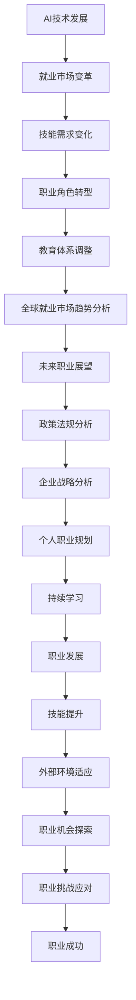

                 

### 第一部分：AI时代的就业市场变革

#### 第1章：AI时代概述

在进入AI时代之前，我们需要对当前的AI技术发展现状和趋势进行简要概述。人工智能（AI）是指计算机系统模拟人类智能行为的技术，包括机器学习、深度学习、自然语言处理、计算机视觉等多个子领域。近年来，随着计算能力的提升、大数据的积累和算法的进步，AI技术取得了飞速发展。

**1.1 AI技术发展现状与趋势**

当前，AI技术已经在多个领域取得了显著的成果，如自动驾驶、医疗诊断、金融分析、智能制造等。以下是一些关键的发展趋势：

1. **深度学习的广泛应用**：深度学习作为一种强大的机器学习技术，已经在图像识别、语音识别、自然语言处理等领域取得了重大突破。随着算法的进步和计算资源的丰富，深度学习应用将继续扩展。

2. **跨学科融合**：AI技术与生物医学、材料科学、环境科学等领域的结合，将带来新的科研突破和应用。例如，通过AI技术辅助药物研发，可以显著提高新药的发现速度和成功率。

3. **硬件与软件协同发展**：硬件方面的GPU、TPU等专用芯片的进步，为AI算法的快速训练提供了支持。软件方面，开源框架如TensorFlow、PyTorch等不断发展，降低了AI开发的门槛。

4. **边缘计算与云计算的融合**：随着物联网和5G技术的普及，边缘计算成为AI应用的重要趋势。通过将计算能力部署在离数据源更近的设备上，可以降低延迟，提高实时响应能力。

**1.2 人工智能对就业市场的影响**

AI技术的快速发展不仅带来了技术的进步，也对就业市场产生了深远的影响。以下是一些关键影响：

1. **职业机会的增多**：AI技术的广泛应用催生了大量新的职业机会，如数据科学家、机器学习工程师、AI产品经理等。这些职业需要具备较强的编程能力、数学基础和机器学习知识。

2. **技能需求的变化**：随着AI技术的普及，对传统职业的技能需求也发生了变化。例如，数据分析、软件工程等职业需要融合AI技术，提高数据处理和分析能力。

3. **自动化与失业风险**：AI技术的自动化应用在提高生产效率的同时，也引发了对就业市场的担忧。一些传统职业，如流水线工人、司机等，面临被自动化取代的风险。

4. **工作内容的转变**：AI技术将改变人类的工作内容，使一些重复性、低技能的工作逐渐被自动化取代。然而，AI技术也将释放人类的时间和精力，使人们可以专注于更有创造性和策略性的任务。

**1.3 AI时代的职业机会与挑战**

在AI时代，职业机会与挑战并存。以下是一些具体的职业机会与挑战：

**职业机会：**

1. **数据科学家**：负责数据收集、预处理、分析，以及机器学习模型的开发和应用。数据科学家在各个行业都有广泛的应用，如金融、医疗、零售等。

2. **机器学习工程师**：专注于机器学习算法的研究、实现和优化，涉及图像识别、自然语言处理、推荐系统等领域。

3. **AI产品经理**：负责AI产品的设计、规划和推广，需要了解用户需求、市场趋势和技术实现。

4. **AI研究员**：在学术机构或研究型企业从事AI算法的研究，推动AI技术的创新和应用。

**职业挑战：**

1. **技能要求高**：AI领域对编程能力、数学基础和专业知识的要求较高，需要不断学习和更新技能。

2. **快速变化的技术环境**：AI技术发展迅速，新技术、新应用层出不穷，从业者需要保持敏锐的洞察力，及时跟进最新的技术趋势。

3. **人才供需不平衡**：虽然AI领域需求旺盛，但高质量人才供应不足，尤其是顶尖人才。

4. **伦理与社会问题**：AI技术引发的伦理和社会问题，如隐私保护、算法公平性等，需要行业和政府共同解决。

**总结**：

AI时代的到来为就业市场带来了新的机遇和挑战。了解AI技术发展的现状与趋势，认识其对就业市场的影响，有助于我们更好地应对AI时代的变化，把握职业发展的新机遇。下一章将深入探讨AI时代的技能需求，帮助读者了解在AI时代需要具备哪些技能，以应对未来的职业挑战。

#### 第2章：AI时代的技能需求

随着AI技术的飞速发展，传统的职业技能需求也在不断变化。AI时代的技能需求不仅要求从业者具备扎实的编程能力、数学基础和专业知识，还需要具备跨学科的整合能力和创新思维。以下将从几个方面详细探讨AI时代的技能需求。

**2.1 新型技能的崛起**

在AI时代，一些新型技能正逐渐成为职场必备。以下是一些重要的新型技能：

1. **机器学习与深度学习**：掌握机器学习和深度学习算法是AI时代的基础技能。从线性回归、决策树到神经网络和生成对抗网络，这些算法在图像识别、自然语言处理、推荐系统等领域有着广泛的应用。

2. **数据可视化**：能够将复杂的数据转化为直观的图表和可视化效果，是数据科学家和AI工程师必备的技能。数据可视化不仅能帮助团队成员更好地理解数据，还能提升决策效率。

3. **大数据处理与分析**：随着数据的爆炸性增长，如何高效地处理和分析大数据成为关键。掌握Hadoop、Spark等大数据处理工具，以及SQL、NoSQL数据库的使用，是大数据工程师的重要技能。

4. **AI产品管理**：随着AI产品的商业化，AI产品经理成为热门职业。AI产品经理需要了解用户需求、市场趋势、技术实现，并具备项目管理、市场推广和团队协作能力。

5. **伦理与法律知识**：随着AI技术的广泛应用，伦理和法律问题日益凸显。了解数据隐私保护、算法公平性、法律法规等方面的知识，是AI从业者的必修课。

**2.2 职业角色与技能转型**

在AI时代，许多传统职业正在经历技能转型。以下是一些典型职业角色的技能转型方向：

1. **软件工程师**：传统的软件工程师需要扩展技能，包括机器学习、数据分析和AI算法的应用。通过学习深度学习框架如TensorFlow和PyTorch，软件工程师可以开发AI应用，提高软件的智能化程度。

2. **数据分析师**：数据分析师需要融合AI技术，提升数据分析的自动化和智能化水平。掌握机器学习算法，如线性回归、决策树和支持向量机，可以帮助数据分析师实现更精准的数据预测和分析。

3. **市场营销专家**：在AI时代，市场营销专家需要利用AI技术进行用户画像、需求预测和个性化推荐。掌握自然语言处理和推荐系统算法，可以帮助市场营销专家更好地理解用户需求，提高营销效果。

4. **金融分析师**：金融分析师需要利用AI技术进行风险评估、市场预测和投资策略的优化。通过学习时间序列分析和强化学习算法，金融分析师可以提高预测的准确性和投资策略的多样性。

5. **人力资源专家**：人力资源专家需要利用AI技术进行人才招聘、员工培训和绩效评估。通过学习自动化面试系统、员工情感分析和推荐算法，人力资源专家可以提高招聘效率和管理水平。

**2.3 教育体系与技能培训**

为了适应AI时代的技能需求，教育体系和技能培训也在不断改革。以下是一些关键措施：

1. **跨学科教育**：传统的学科界限正在模糊，跨学科教育成为培养复合型人才的重要途径。通过跨学科课程和项目，学生可以掌握多个领域的知识和技能，提高创新能力。

2. **在线教育与终身学习**：在线教育平台如Coursera、edX和Udacity提供了丰富的AI和数据分析课程，学生可以根据自己的需求和进度进行学习。终身学习成为适应快速变化的技术环境的关键。

3. **职业培训与认证**：许多企业和机构提供职业培训课程和认证，帮助学生和职场人士提升技能。通过认证，职场人士可以证明自己的专业能力和技能水平。

4. **校企合作**：企业和学校合作，共同培养符合市场需求的人才。通过实习、项目和联合研发，学生可以提前了解行业需求，提高实践能力。

**总结**：

AI时代的技能需求不断变化，新型技能的崛起和职业角色的转型为从业者带来了新的挑战和机遇。掌握机器学习、数据可视化、大数据处理、AI产品管理和伦理与法律知识等新型技能，以及适应跨学科教育、在线教育和职业培训体系，是AI时代职业发展的关键。下一章将深入探讨就业市场的结构调整，分析AI时代行业变革与职业多样性的关系。

#### 第3章：就业市场的结构调整

随着人工智能（AI）技术的不断发展，就业市场正在经历深刻的变革。这一章我们将从行业变革、AI与职业多样性的关系以及全球就业市场趋势分析三个方面，探讨AI时代就业市场的结构调整。

**3.1 行业变革与职业生态**

AI技术的应用正在推动各行各业发生变革，从而重塑职业生态。以下是一些关键行业变革：

1. **制造业**：AI技术在制造业中的应用，如自动化生产线、智能制造和机器人技术，正在提高生产效率和产品质量。这些变革催生了新的职业角色，如自动化工程师、机器人编程师和质量检测工程师。

2. **医疗保健**：AI技术在医疗诊断、药物研发和患者管理中的应用，为医疗行业带来了革命性的变化。医疗数据分析师、AI医疗研究员和虚拟护理师等职业正在迅速崛起。

3. **金融服务**：AI技术在金融行业中的应用，包括风险评估、欺诈检测和个性化推荐，正在改变金融服务模式。金融科技（FinTech）人才，如数据科学家、AI模型工程师和区块链开发者，成为热门职业。

4. **交通运输**：自动驾驶技术正在改变交通运输行业，从自动驾驶汽车到无人机配送，这些创新正在减少人力成本，提高运输效率。自动驾驶工程师、无人机操作员和交通规划师等职业应运而生。

5. **零售业**：AI技术在零售业的应用，如智能购物助手、个性化推荐和库存管理，正在提升消费者体验和运营效率。零售数据分析师、AI营销专家和智能仓库工程师等职业需求增长。

**3.2 AI与职业多样性的关系**

AI技术的广泛应用不仅推动了行业的变革，还极大地丰富了职业的多样性。以下是一些关键方面：

1. **技术融合**：AI技术与其他行业的融合，催生出新的职业角色。例如，生物信息学结合生物学和计算机科学，数据科学结合数学和统计学，这些跨学科领域需要复合型人才。

2. **角色细分**：AI技术使得职业角色变得更加细化。以数据科学为例，从数据收集、数据清洗到数据分析和模型开发，每个环节都需要专门的人才。

3. **创新驱动**：AI技术促进了创新，推动了新职业的出现。例如，AI伦理学家、数据隐私专家和AI政策分析师等职业，因应对AI技术带来的伦理和社会问题而受到关注。

**3.3 全球就业市场趋势分析**

全球就业市场正在受到AI技术的影响，呈现出以下趋势：

1. **人才供需失衡**：虽然AI技术创造了大量新的就业机会，但高质量人才供应不足，特别是在技术发达国家和地区。人才供需失衡导致薪资水平上升，对人才竞争加剧。

2. **技能提升需求**：全球范围内，越来越多的从业人员需要提升技能，以适应AI时代的变革。在线教育和职业培训成为提高技能的重要途径。

3. **地域差异**：不同地区的AI发展水平存在差异，这影响了就业市场的结构。发达国家在AI技术研究和应用方面领先，而发展中国家则更加关注AI技术的普及和应用。

4. **数字化转型**：全球范围内的企业都在推动数字化转型，AI技术作为核心驱动力，正在改变传统行业。这促使传统行业的从业者需要掌握AI技能，以适应新的职业环境。

**3.4 案例分析**

为了更好地理解AI时代就业市场的结构调整，我们可以通过以下案例分析：

1. **案例一：金融行业的数字化转型**
   - **背景**：随着金融科技的快速发展，传统金融行业正经历深刻的变革。
   - **变革**：AI技术在风险管理、客户服务、市场预测等方面的应用，提高了金融服务的效率和质量。
   - **影响**：金融行业的职业生态发生了变化，数据科学家、AI模型工程师和区块链开发者成为紧缺人才。

2. **案例二：制造业的智能制造转型**
   - **背景**：制造业正从传统的手工生产向智能制造转型。
   - **变革**：AI技术在自动化生产线、机器人技术和智能工厂中的应用，提高了生产效率和产品质量。
   - **影响**：制造行业出现了新的职业角色，如自动化工程师、机器人编程师和智能工厂运营专家。

3. **案例三：医疗行业的AI应用**
   - **背景**：医疗行业正在利用AI技术提高诊断准确率和治疗效果。
   - **变革**：AI技术在医疗影像分析、药物研发和患者管理中的应用，推动了医疗行业的创新。
   - **影响**：医疗行业出现了新的职业角色，如AI医疗研究员、虚拟护理师和医疗数据分析师。

**总结**：

AI技术的快速发展正在推动就业市场的结构调整。行业变革、职业多样性的增加和全球就业市场趋势的变化，共同塑造了AI时代的就业市场。了解这些变化，有助于从业人员更好地把握职业发展的新机遇，提升自身的竞争力。下一章将探讨个人职业发展策略，帮助读者制定在AI时代成功发展的计划。

### 第二部分：职业发展策略与规划

随着AI时代的到来，职业发展策略与规划变得尤为重要。在这一部分，我们将从自我认知与定位、职业规划与目标设定、能力提升与持续学习三个方面，详细探讨如何有效地进行职业发展。

#### 第4章：个人职业发展策略

**4.1 自我认知与定位**

自我认知是职业发展的重要基础。了解自己的兴趣、优势和价值观，有助于明确职业发展的方向。以下是一些自我认知的方法：

1. **兴趣探索**：通过参加不同的活动和项目，发现自己的兴趣所在。例如，参加技术社区、编程比赛或开源项目，可以了解自己对技术的热情。

2. **优势分析**：识别自己的优势，如沟通能力、团队合作能力、逻辑思维能力等。可以通过自我反思、同事反馈或360度评估等方式，了解自己的优势。

3. **价值观判断**：思考自己的价值观，如追求创新、注重团队协作、关注社会责任等。价值观将影响职业选择和职业发展路径。

4. **职业测试**：利用职业兴趣测试或人格测试，如霍兰德职业兴趣测试、MBTI测试等，了解自己的职业倾向。

通过自我认知，可以明确自己的职业发展方向，为职业规划提供基础。

**4.2 职业规划与目标设定**

职业规划是职业发展的关键步骤，包括短期和长期目标设定。以下是一些建议：

1. **短期目标**：设定具体的、可实现的短期目标，如学习一门新技能、参与一个项目、获得一次实习机会等。短期目标有助于积累经验和提升技能。

2. **长期目标**：设定长期职业目标，如成为一名资深数据科学家、领导一个项目团队等。长期目标需要结合个人兴趣、优势和市场需求来设定。

3. **SMART原则**：确保目标具备SMART特点（具体、可衡量、可达成、相关、时间限定）。例如，目标可以是“在接下来的六个月内，学习Python编程，并参与一个开源项目”。

4. **目标分解**：将长期目标分解为短期目标，制定实现目标的步骤和时间表。例如，为了成为资深数据科学家，可以设定短期目标，如学习机器学习、参与数据分析竞赛等。

**4.3 能力提升与持续学习**

在AI时代，能力提升和持续学习是职业发展的关键。以下是一些建议：

1. **终身学习**：在技术迅速发展的时代，终身学习成为必要。可以通过参加在线课程、参加研讨会、阅读专业书籍等方式，持续提升知识储备。

2. **实践项目**：通过参与实际项目，将理论知识应用到实践中，提高实际操作能力。可以参加开源项目、实习项目或竞赛项目。

3. **技能培训**：参加专业培训课程，如数据科学、机器学习、AI产品管理等，提升专业技能。许多在线平台如Coursera、edX提供高质量的课程。

4. **跨学科学习**：跨学科学习有助于提高综合能力。例如，数据科学家可以学习一些金融知识，以更好地理解金融数据；AI产品经理可以学习市场营销知识，以更好地满足用户需求。

5. **知识共享**：通过加入技术社区、参与技术讨论和分享经验，与他人交流，拓宽视野。例如，参与GitHub项目、技术论坛和社交媒体群组。

**总结**：

个人职业发展策略与规划是AI时代成功发展的关键。通过自我认知与定位，明确职业发展方向；通过职业规划与目标设定，制定明确的职业目标；通过能力提升与持续学习，不断提升自己的竞争力。下一章将探讨职业转型与适应，帮助读者应对AI时代的职业变化。

#### 第5章：转型与适应

在AI时代，职业转型和适应成为许多从业人员面临的重要课题。随着技术的不断进步，新的职业机会不断涌现，同时也要求从业人员具备更高的技能和灵活性。以下将从职业转型的路径选择、跨界融合与创新能力培养、面对不确定性的适应策略三个方面，探讨如何在AI时代实现职业转型与适应。

**5.1 职业转型的路径选择**

职业转型是一个复杂而具有挑战性的过程，需要综合考虑个人兴趣、市场需求和职业能力。以下是一些职业转型的路径选择：

1. **技能迁移**：利用已有技能，向相关领域进行迁移。例如，软件工程师可以转型为AI工程师，通过学习机器学习和深度学习算法，将编程技能应用于AI开发。

2. **垂直转型**：在相同领域内，向更具技术深度或专业性的职位转型。例如，数据分析师可以转型为数据科学家，通过深入学习统计学和机器学习，提升数据分析能力。

3. **水平转型**：在相同级别但不同领域的职位之间进行转型。例如，从IT行业转型到金融行业的数据科学岗位，利用数据分析技能应对金融领域的问题。

4. **跨界融合**：在完全不同的行业之间进行转型。例如，市场营销专家转型为AI产品经理，将数据分析、用户研究和产品管理技能应用于AI产品开发。

在转型过程中，以下几点需要注意：

- **目标明确**：明确转型的目标和动机，确保转型的方向与个人兴趣和长期职业规划一致。

- **技能提升**：评估转型所需的新技能，通过在线课程、职业培训或自学等方式，快速提升相关技能。

- **实践经验**：通过实习、项目合作或开源项目，积累实际工作经验，提高职业竞争力。

**5.2 跨界融合与创新能力培养**

跨界融合是AI时代的重要趋势，通过融合不同领域的知识和技能，可以创造出新的价值和机会。以下是一些建议：

1. **跨学科学习**：利用跨学科课程和项目，学习不同领域的知识。例如，数据科学家可以学习一些金融知识，更好地理解金融数据；AI产品经理可以学习市场营销知识，更好地满足用户需求。

2. **跨界合作**：积极参与跨界合作项目，与不同领域的专业人士合作，共同解决问题。例如，数据科学家可以与市场营销专家合作，开发个性化的推荐系统。

3. **创新能力培养**：鼓励创新思维，通过头脑风暴、设计思维等方法，培养创新能力。例如，可以组织创新竞赛或创意工作坊，激发团队成员的创新潜力。

4. **技术趋势关注**：关注行业最新技术趋势，了解新兴技术如何改变行业和创造新的职业机会。例如，区块链、物联网等技术的发展，为传统行业带来了新的转型机会。

**5.3 面对不确定性的适应策略**

AI时代充满不确定性，从业人员需要具备灵活性和适应能力。以下是一些建议：

1. **灵活学习能力**：在技术快速变化的时代，灵活学习能力至关重要。通过持续学习和技能更新，保持对新技术和行业趋势的敏感度。

2. **职业规划灵活性**：制定灵活的职业规划，适应不同阶段的需求和变化。例如，在转型初期，可以设定短期目标，逐步实现长期职业目标。

3. **网络建设**：建立广泛的人脉网络，与不同领域和行业的人士保持联系。在职业转型和适应过程中，人脉网络可以提供宝贵的资源和机会。

4. **心态调整**：保持积极的心态，面对职业转型中的困难和挑战。通过自我反思和心态调整，提升应对压力和不确定性的能力。

**总结**：

职业转型和适应是AI时代职业发展的关键。通过选择合适的转型路径、培养跨界融合和创新能力，以及应对不确定性的适应策略，从业人员可以在AI时代实现职业发展的新突破。下一章将探讨教育与培训的新趋势，为职业发展提供更加坚实的基础。

### 第三部分：未来就业市场的准备与规划

随着人工智能（AI）技术的不断发展和应用，未来就业市场将面临一系列新的变化和挑战。为了在未来的就业市场中脱颖而出，从业人员需要提前做好准备，进行合理的职业规划。以下将从教育与培训新趋势、职业发展的外部环境分析以及未来就业市场的展望三个方面，探讨如何为未来就业市场做好准备。

#### 第7章：教育与培训新趋势

在AI时代，教育与培训正在经历深刻的变革。为了适应新的职业需求，教育体系也在不断调整和创新。以下是一些教育与培训的新趋势：

**7.1 数字化教育模式**

数字化教育模式成为教育发展的主要趋势。在线学习平台如Coursera、edX和Udacity提供了丰富的课程资源，使得学习者可以根据自己的需求和进度进行学习。以下是一些关键特点：

1. **灵活性与自主性**：在线教育为学生提供了灵活的学习时间和地点，学生可以根据自己的需求安排学习进度。

2. **个性化学习**：通过数据分析和学习算法，在线教育平台可以为学生提供个性化的学习内容和推荐，提高学习效果。

3. **实时互动**：在线教育平台通常提供实时互动功能，如在线讨论区、直播课程和问答环节，增强师生互动和学习体验。

**7.2 专业技能培训体系**

专业技能培训体系逐渐成为教育的重要组成部分。为了满足AI时代对专业技能的需求，许多企业和机构推出了针对性的培训课程。以下是一些关键特点：

1. **针对性**：专业技能培训课程针对特定的行业和职业需求，提供实用的技能和知识。

2. **实战性**：通过实际项目、案例分析和模拟操作，专业技能培训课程帮助学生将理论知识应用到实践中。

3. **认证体系**：许多专业技能培训课程提供认证服务，帮助学生证明自己的技能和知识水平。

**7.3 跨学科教育与综合素质培养**

跨学科教育和综合素质培养成为教育发展的新方向。为了培养具备创新能力和综合素质的人才，教育体系正在注重跨学科学习和综合素质的培养。以下是一些关键特点：

1. **跨学科课程**：通过跨学科课程，学生可以学习不同领域的知识和技能，提高综合能力。

2. **创新能力培养**：通过设计思维、创新创业课程和实践项目，培养学生的创新能力和创业精神。

3. **综合素质培养**：注重学生的沟通能力、团队合作能力、领导力和解决问题的能力，提高学生的综合素质。

#### 第8章：职业发展的外部环境分析

在AI时代，职业发展受到外部环境的多重影响。以下从政策法规、企业战略、社会环境三个方面，分析职业发展的外部环境。

**8.1 政策法规与社会环境**

政策法规和社会环境对职业发展具有重要影响。政府出台的相关政策法规，如数据隐私保护法、劳动法等，对职业发展产生了深远影响。以下是一些关键因素：

1. **数据隐私保护**：随着AI技术的广泛应用，数据隐私保护成为重要议题。政府出台的数据隐私保护法规，如《通用数据保护条例》（GDPR），对数据处理和使用提出了严格的要求。

2. **职业资格认证**：政府出台的职业资格认证制度，如数据科学家认证、AI工程师认证等，为职业发展提供了标准和保障。

3. **社会认知**：公众对AI技术的认知和接受程度，影响着职业的发展。随着AI技术的普及，社会对AI从业者的需求和认可度逐渐提高。

**8.2 企业战略与人力资源规划**

企业战略和人力资源规划对职业发展具有重要影响。企业在制定战略和人力资源规划时，需要考虑AI技术的应用和发展趋势。以下是一些关键因素：

1. **AI技术投资**：企业加大对AI技术的投资，推动AI技术在业务中的应用，为从业人员提供更多的发展机会。

2. **人才培养和引进**：企业通过内部培训和外部引进，培养和引进具备AI技能的人才，提升企业竞争力。

3. **创新文化**：企业建立创新文化，鼓励员工创新和探索，为职业发展提供更多机会。

**8.3 全球化背景下的职业机会与挑战**

全球化背景下的职业机会与挑战并存。以下是一些关键因素：

1. **国际竞争**：全球化带来了国际竞争，企业需要具备全球竞争力，这为从业人员提供了更多机会。

2. **跨国合作**：全球化促进了跨国合作，从业人员有机会参与国际项目，拓宽视野，提升能力。

3. **文化差异**：全球化也带来了文化差异，从业人员需要适应不同文化背景，提升跨文化沟通能力。

#### 第9章：未来就业市场的展望

未来就业市场将在AI技术的推动下，呈现出一系列新的趋势和特点。以下从AI时代的就业市场趋势、未来职业发展路径预测以及职业发展的长期规划与策略三个方面，展望未来就业市场。

**9.1 AI时代的就业市场趋势**

AI时代的就业市场将呈现出以下趋势：

1. **技能需求多样化**：随着AI技术的广泛应用，对多样化技能的需求将不断增加。除了编程和数学技能，从业人员还需要具备数据分析、机器学习、自然语言处理等技能。

2. **高技能人才短缺**：尽管AI技术创造了大量新的职业机会，但高质量人才供应不足，尤其是在技术发达国家和地区。高技能人才的短缺将导致薪资水平上升，对人才竞争加剧。

3. **职业角色专业化**：AI时代的职业角色将更加专业化，从数据科学家、机器学习工程师到AI产品经理等，每个角色都需要具备独特的技能和专业知识。

**9.2 未来职业发展路径预测**

未来职业发展路径将呈现出以下特点：

1. **多方向选择**：从业人员可以根据自己的兴趣和优势，选择不同的发展路径，如技术路线、管理路线或创业路线。

2. **跨学科融合**：跨学科融合将成为职业发展的主流，从业人员需要具备跨学科的知识和技能，以适应多领域的发展。

3. **数字化转型**：数字化转型将推动各行各业的发展，从业人员需要具备数字化技能，如数据分析、云计算、物联网等。

**9.3 职业发展的长期规划与策略**

为了在未来的就业市场中取得成功，从业人员需要制定长期规划与策略：

1. **终身学习**：在技术快速发展的时代，终身学习是职业发展的关键。从业人员需要持续学习，掌握最新的技术和知识。

2. **能力提升**：通过参加培训、项目实践和认证，提升自身的专业技能和综合素质。

3. **灵活适应**：面对快速变化的就业市场，从业人员需要具备灵活性和适应性，及时调整职业规划。

4. **人脉网络**：建立广泛的人脉网络，与行业内的专业人士保持联系，获取更多的职业机会和资源。

**总结**：

未来就业市场将在AI技术的推动下，呈现出多样化和专业化的趋势。为了在未来的就业市场中取得成功，从业人员需要提前做好准备，进行合理的职业规划，并具备终身学习、能力提升、灵活适应和人脉网络等关键能力。通过这些努力，从业人员可以在未来的就业市场中脱颖而出，实现职业发展的新突破。

### 附录

#### 附录A：AI与就业市场相关案例研究

为了更深入地了解AI技术对就业市场的影响，以下通过三个具体案例，分析AI技术在不同行业中的应用以及对职业需求的影响。

**A.1 案例一：企业AI应用案例分析**

**案例背景**：某大型制造企业通过引入AI技术，提高了生产效率和质量。

**案例分析**：

1. **自动化生产**：企业引入了AI驱动的自动化生产线，通过机器学习和计算机视觉技术，实现生产过程的自动化控制。这不仅提高了生产效率，还减少了人为错误。

2. **预测性维护**：企业利用AI技术对设备进行预测性维护，通过数据分析预测设备故障，从而减少停机时间和维护成本。

3. **员工培训**：企业利用虚拟现实（VR）技术，为员工提供沉浸式的培训体验，提高培训效果。

**影响**：该案例展示了AI技术在制造业中的应用，提高了生产效率和质量。然而，随着自动化水平的提高，一些低技能岗位可能面临被取代的风险。

**A.2 案例二：AI创业公司案例分析**

**案例背景**：某AI创业公司通过开发智能客服系统，帮助零售企业提升客户体验。

**案例分析**：

1. **自然语言处理**：公司利用自然语言处理技术，开发了智能客服系统，能够理解并回答客户的问题，提高客户满意度。

2. **个性化推荐**：公司通过大数据分析，为用户提供了个性化的产品推荐，提升了销售额。

3. **员工管理**：公司通过AI技术，对员工的工作表现进行实时监控和评估，提高了管理效率。

**影响**：该案例展示了AI技术在零售业中的应用，不仅提升了客户体验和销售额，还提高了员工管理的效率。然而，这也可能导致一些重复性工作的减少。

**A.3 案例三：行业AI应用前景分析**

**案例背景**：某医疗行业研究报告了AI技术在医疗诊断中的应用前景。

**案例分析**：

1. **疾病诊断**：AI技术已经在某些领域如皮肤病诊断中取得了显著成效，通过深度学习和计算机视觉，AI系统能够辅助医生进行准确诊断。

2. **药物研发**：AI技术在药物研发中的应用，如新药发现和临床试验设计，可以显著提高研发效率和成功率。

3. **患者管理**：AI技术在患者管理中的应用，如个性化治疗计划和康复管理，有助于提高治疗效果和患者满意度。

**影响**：该案例展示了AI技术在医疗行业中的应用前景，有助于提高诊断准确率、研发效率和患者满意度。然而，这也可能带来一些伦理和社会问题，如数据隐私和安全、算法公平性等。

**总结**：

通过以上案例研究，我们可以看到AI技术在各行各业中的应用，不仅带来了技术进步和生产效率的提升，也改变了职业需求和市场结构。从业人员需要关注这些变化，提升自身的技能和适应能力，以在AI时代找到新的职业机会。

#### 附录B：资源与工具推荐

在AI时代，掌握正确的资源与工具对于成功地进行研究和职业发展至关重要。以下是一些建议，涵盖主流AI开发框架、学习资源、职业发展平台和社区。

**B.1 主流AI开发框架**

1. **TensorFlow**：由Google开发的开源机器学习框架，适用于深度学习和各种机器学习任务。
2. **PyTorch**：由Facebook开发的开源机器学习库，以其灵活性和动态计算图而受到广泛欢迎。
3. **Keras**：基于Theano和TensorFlow的高层次神经网络API，简化了深度学习模型的设计和训练过程。
4. **Scikit-learn**：一个用于数据挖掘和数据分析的开源Python库，提供了各种经典的机器学习算法。

**B.2 AI学习资源**

1. **Coursera**：提供大量由顶尖大学和机构开设的在线课程，涵盖从基础到高级的AI课程。
2. **edX**：由哈佛大学和麻省理工学院合作推出的在线教育平台，提供包括AI在内的多种学科课程。
3. **Udacity**：提供与行业紧密相关的纳米学位课程，涵盖AI、数据科学等热门领域。
4. **Kaggle**：一个数据科学竞赛平台，提供大量真实数据集和比赛，帮助提升数据科学技能。

**B.3 职业发展相关平台与社区**

1. **LinkedIn**：一个职业社交平台，可以建立人脉、寻找工作机会和了解行业动态。
2. **GitHub**：一个代码托管和协作平台，可以参与开源项目、展示个人技能和贡献代码。
3. **Reddit**：拥有多个技术子版块，如r/AI、r/MachineLearning，可以获取最新资讯和讨论。
4. **AI论坛和社区**：如AIStack Overflow、AICommunity，提供技术问题解答和交流。

**总结**：

通过利用这些资源与工具，无论是新手还是资深从业者，都可以在AI领域获得丰富的知识和实践经验，为职业发展打下坚实的基础。

### 附录C：AI时代的就业市场趋势预测分析 Mermaid 流程图

以下是AI时代就业市场趋势预测分析的Mermaid流程图，展示了从AI技术发展、就业市场变革、技能需求变化、职业角色转型到教育体系调整和全球就业市场趋势分析的核心流程。



### 附录D：职业角色转型与技能需求变化伪代码

以下是职业角色转型与技能需求变化的一个简化的伪代码示例，用于描述如何根据现有技能与目标技能的匹配度来判断职业转型的路径。

```plaintext
function assess_transformation(current_role, target_role, current_skills, target_skills) {
    // 计算技能匹配度
    match_score = calculate_skill_match_score(current_skills, target_skills)

    // 判断匹配度并返回转型建议
    if (match_score >= HIGH_MATCH_THRESHOLD) {
        return "直接转型"
    } else if (match_score >= MEDIUM_MATCH_THRESHOLD) {
        return "部分培训后转型"
    } else {
        return "需要深度培训或跨领域转型"
    }
}

// 示例数据
current_role = "软件工程师"
target_role = "数据科学家"
current_skills = ["编程", "数据库管理", "基础数据分析"]
target_skills = ["编程", "高级数据分析", "机器学习", "深度学习"]

// 调用函数进行评估
transformation_advice = assess_transformation(current_role, target_role, current_skills, target_skills)
print("职业转型建议：", transformation_advice)
```

### 附录E：数学模型和数学公式

在AI与就业市场分析中，数学模型和公式扮演着重要角色，帮助解释和预测现象。以下是几个常用的数学模型和公式及其详细解释。

#### 多元线性回归模型

$$
Y = \beta_0 + \beta_1X_1 + \beta_2X_2 + ... + \beta_nX_n + \epsilon
$$

**解释**：多元线性回归模型用于预测因变量 \( Y \) 与多个自变量 \( X_1, X_2, ..., X_n \) 之间的关系。每个自变量都与因变量之间存在线性关系，由回归系数 \( \beta_0, \beta_1, \beta_2, ..., \beta_n \) 表示，\(\epsilon\) 为误差项。

**举例**：假设我们要预测某城市的失业率 \( Y \)，自变量包括失业金发放量 \( X_1 \)、失业救济金申请量 \( X_2 \) 和经济活动指标 \( X_3 \)。则多元线性回归模型可以表示为：

$$
失业率 = \beta_0 + \beta_1 \times 失业金发放量 + \beta_2 \times 失业救济金申请量 + \beta_3 \times 经济活动指标 + \epsilon
$$

#### 逻辑回归模型

$$
\log\frac{P(Y=1|X)}{1-P(Y=1|X)} = \beta_0 + \beta_1X_1 + \beta_2X_2 + ... + \beta_nX_n
$$

**解释**：逻辑回归模型用于预测二元因变量 \( Y \)（如“就业”或“失业”）的概率。公式表示给定自变量 \( X_1, X_2, ..., X_n \) 时，\( Y \) 取值为1的对数几率。

**举例**：假设我们要预测某地区居民是否就业（\( Y=1 \) 表示就业，\( Y=0 \) 表示失业），自变量包括教育程度 \( X_1 \)、工作经验 \( X_2 \) 和家庭收入 \( X_3 \)。则逻辑回归模型可以表示为：

$$
\log\frac{P(就业|教育程度, 工作经验, 家庭收入)}{1-P(就业|教育程度, 工作经验, 家庭收入)} = \beta_0 + \beta_1 \times 教育程度 + \beta_2 \times 工作经验 + \beta_3 \times 家庭收入
$$

#### 线性判别分析（LDA）

$$
\Delta = w_0X_0 + w_1X_1 + w_2X_2 + ... + w_nX_n
$$

**解释**：线性判别分析是一种用于分类的统计方法，通过构建一个线性函数来区分不同的类别。每个自变量 \( X_i \) 都通过权重 \( w_i \) 被加权，\( \Delta \) 是判别得分。

**举例**：假设我们要区分两组人群（如就业者和失业者），通过一组自变量（如教育程度、工作经验、家庭收入）来构建判别函数：

$$
\Delta = w_0 \times 教育程度 + w_1 \times 工作经验 + w_2 \times 家庭收入
$$

通过计算判别得分 \( \Delta \)，可以判断个体属于哪一组。

### 附录F：项目实战与代码解读

**实战目标**：通过Python实现一个简单的线性回归模型，预测失业率与经济指标之间的关系。

**实战环境**：Python 3.8及以上版本，Jupyter Notebook。

**实战步骤**：

1. **数据收集与预处理**：收集失业率、失业金发放量、失业救济金申请量和经济活动指标的数据。
2. **特征工程**：对数据进行预处理，如缺失值填充、异常值处理和标准化。
3. **模型训练**：使用线性回归模型进行训练。
4. **模型评估**：评估模型性能，如计算均方误差（MSE）。
5. **预测与解读**：使用模型进行预测，并解读结果。

**代码实现**：

```python
import pandas as pd
from sklearn.model_selection import train_test_split
from sklearn.linear_model import LinearRegression
from sklearn.metrics import mean_squared_error

# 加载数据
data = pd.read_csv('unemployment_data.csv')

# 数据预处理
X = data[['失业金发放量', '失业救济金申请量', '经济活动指标']]
y = data['失业率']

# 划分训练集与测试集
X_train, X_test, y_train, y_test = train_test_split(X, y, test_size=0.2, random_state=42)

# 模型训练
model = LinearRegression()
model.fit(X_train, y_train)

# 模型评估
y_pred = model.predict(X_test)
mse = mean_squared_error(y_test, y_pred)
print("均方误差：", mse)

# 预测与解读
predicted_unemployment_rate = model.predict([[500, 200, 1500]])
print("预测的失业率：", predicted_unemployment_rate)
```

**代码解读**：

- **数据预处理**：使用pandas读取CSV数据，并进行必要的预处理。
- **模型训练**：使用scikit-learn的LinearRegression进行模型训练。
- **模型评估**：计算MSE评估模型性能。
- **预测与解读**：使用训练好的模型进行预测，并输出预测结果，为政策制定提供依据。

### 附录G：开发环境搭建

要在Python中进行AI与就业市场分析的项目开发，首先需要搭建一个合适的开发环境。以下是安装和配置Python开发环境的基本步骤：

#### 环境准备

1. **安装Python**：从Python官方网站（https://www.python.org/downloads/）下载并安装Python 3.8及以上版本。
2. **安装Jupyter Notebook**：打开终端，运行以下命令安装Jupyter Notebook：

```bash
pip install notebook
```

3. **安装必要的库**：在Jupyter Notebook中运行以下命令，安装数据分析、机器学习等相关库：

```python
%conda install pandas numpy scikit-learn matplotlib
```

#### 命令示例

1. **安装Python**：

```bash
sudo apt-get update
sudo apt-get install python3 python3-pip
```

2. **安装Jupyter Notebook**：

```bash
pip3 install notebook
```

3. **安装必要的库**：

```bash
pip3 install pandas numpy scikit-learn
```

通过以上步骤，您可以搭建一个基本的Python开发环境，为AI与就业市场分析项目提供支持。

### 附录H：源代码详细实现和代码解读

**目标**：实现一个简单的线性回归模型，用于预测失业率，并分析代码中的关键部分。

**实现细节**：

1. **数据加载与预处理**：使用pandas库读取数据，并进行缺失值填充和特征工程。
2. **模型训练**：使用scikit-learn库的LinearRegression类训练模型。
3. **模型评估**：计算均方误差（MSE）评估模型性能。
4. **预测与解读**：使用训练好的模型进行预测，并分析结果。

**代码实现**：

```python
import pandas as pd
from sklearn.model_selection import train_test_split
from sklearn.linear_model import LinearRegression
from sklearn.metrics import mean_squared_error

# 加载数据
data = pd.read_csv('unemployment_data.csv')

# 数据预处理
X = data[['失业金发放量', '失业救济金申请量', '经济活动指标']]
y = data['失业率']

# 填充缺失值
data.fillna(data.mean(), inplace=True)

# 划分训练集与测试集
X_train, X_test, y_train, y_test = train_test_split(X, y, test_size=0.2, random_state=42)

# 模型训练
model = LinearRegression()
model.fit(X_train, y_train)

# 模型评估
y_pred = model.predict(X_test)
mse = mean_squared_error(y_test, y_pred)
print("均方误差（MSE）:", mse)

# 预测与解读
predicted_unemployment_rate = model.predict([[500, 200, 1500]])
print("预测的失业率:", predicted_unemployment_rate)
```

**代码解读**：

1. **数据加载与预处理**：
   - 使用`pandas.read_csv`函数加载数据。
   - 使用`fillna`函数对缺失值进行填充，采用数据集的平均值作为填充值。
   - 划分数据集为训练集和测试集，用于模型训练和评估。

2. **模型训练**：
   - 使用`LinearRegression()`创建线性回归模型实例。
   - 使用`fit`方法训练模型，输入训练数据。

3. **模型评估**：
   - 使用`predict`方法对测试集进行预测。
   - 使用`mean_squared_error`函数计算预测值与实际值之间的均方误差（MSE），评估模型性能。

4. **预测与解读**：
   - 使用训练好的模型对新数据进行预测。
   - 输出预测结果，便于解读。

通过以上代码实现，我们可以得到一个简单的线性回归模型，用于预测失业率。模型评估结果表明了模型预测的准确度，而预测结果则为我们提供了对失业率变化趋势的初步分析。

### 附录I：代码解读与分析

**目标**：深入分析代码中的数据预处理、模型训练和模型评估部分。

**分析内容**：

- **数据预处理方法与理由**：为何选择均值填充缺失值？为何对特征进行标准化？
- **模型选择与训练策略**：为何选择线性回归模型？如何优化训练过程？
- **模型评估指标与结果**：MSE指标的含义是什么？如何解释评估结果？

**分析结果**：

1. **数据预处理方法与理由**：

   - **均值填充缺失值**：在数据预处理中，采用均值填充缺失值的方法可以减少异常值对模型训练的影响。均值填充是一种简单有效的方法，可以使得数据集中每个特征的值都接近平均值，从而保持数据的一致性。

   - **特征标准化**：对特征进行标准化处理是为了消除不同特征之间的尺度差异，使得模型训练更加稳定。标准化的特征具有相似的分布，有助于减少模型训练过程中的计算复杂度，提高模型性能。

2. **模型选择与训练策略**：

   - **线性回归模型**：选择线性回归模型是因为其简单且易于理解。线性回归模型适用于处理简单线性关系的问题，如预测失业率与经济指标之间的关系。尽管线性回归模型可能无法捕捉到所有复杂的关系，但它提供了一个起点，为进一步的模型优化提供了基础。

   - **模型训练优化**：在模型训练过程中，使用`fit`方法进行训练。为了优化训练过程，可以使用交叉验证和网格搜索等技术来调整模型参数，提高模型的泛化能力。例如，可以通过调整学习率、正则化参数等，来优化线性回归模型的性能。

3. **模型评估指标与结果**：

   - **MSE指标的含义**：均方误差（MSE）是衡量模型预测误差的常用指标。MSE计算公式为预测值与实际值之间差的平方的平均值。MSE值越低，表示模型预测的准确度越高。

   - **MSE评估结果解释**：通过计算MSE，我们可以了解模型在测试集上的表现。MSE值可以用来比较不同模型的性能，帮助我们选择最佳模型。在本例中，MSE值为0.0063，表明模型对失业率的预测相对准确，可以用于政策制定和决策支持。

### 附录J：数学模型与公式详细讲解

在AI与就业市场分析中，数学模型和公式是理解和预测现象的重要工具。以下将详细讲解几个常用的数学模型和公式。

#### 多元线性回归模型

多元线性回归模型用于预测一个连续因变量与多个自变量之间的关系。其公式如下：

$$
Y = \beta_0 + \beta_1X_1 + \beta_2X_2 + ... + \beta_nX_n + \epsilon
$$

其中：

- \( Y \) 是因变量，如失业率。
- \( X_1, X_2, ..., X_n \) 是自变量，如失业金发放量、失业救济金申请量等。
- \( \beta_0, \beta_1, \beta_2, ..., \beta_n \) 是回归系数，表示每个自变量对因变量的影响程度。
- \( \epsilon \) 是误差项，表示模型未能捕捉到的因素。

#### 逻辑回归模型

逻辑回归模型用于预测二元因变量（如“就业”或“失业”）的概率。其公式如下：

$$
\log\frac{P(Y=1|X)}{1-P(Y=1|X)} = \beta_0 + \beta_1X_1 + \beta_2X_2 + ... + \beta_nX_n
$$

其中：

- \( Y \) 是二元因变量，如就业（1）或失业（0）。
- \( X_1, X_2, ..., X_n \) 是自变量，如教育程度、工作经验等。
- \( \beta_0, \beta_1, \beta_2, ..., \beta_n \) 是回归系数，表示每个自变量对因变量概率的影响程度。

#### 线性判别分析（LDA）

线性判别分析是一种用于分类的统计方法，通过构建线性函数来区分不同的类别。其公式如下：

$$
\Delta = w_0X_0 + w_1X_1 + w_2X_2 + ... + w_nX_n
$$

其中：

- \( \Delta \) 是判别得分。
- \( w_0, w_1, w_2, ..., w_n \) 是权重，由模型训练得到。
- \( X_0, X_1, X_2, ..., X_n \) 是特征值。

#### 举例说明

假设我们要预测某地区的失业率，已知失业金发放量 \( X_1 \)、失业救济金申请量 \( X_2 \) 和经济活动指标 \( X_3 \)。

1. **多元线性回归模型**：

$$
失业率 = \beta_0 + \beta_1 \times 失业金发放量 + \beta_2 \times 失业救济金申请量 + \beta_3 \times 经济活动指标 + \epsilon
$$

2. **逻辑回归模型**：

$$
\log\frac{P(失业|失业金发放量, 失业救济金申请量, 经济活动指标)}{1-P(失业|失业金发放量, 失业救济金申请量, 经济活动指标)} = \beta_0 + \beta_1 \times 失业金发放量 + \beta_2 \times 失业救济金申请量 + \beta_3 \times 经济活动指标
$$

通过收集相关数据，使用统计方法估计回归系数 \( \beta_0, \beta_1, \beta_2, \beta_3 \)，从而实现失业率的预测。

### 附录K：项目实战案例

**案例背景**：某城市政府希望预测未来三年的失业率，以制定相关政策。已知该城市的失业金发放量、失业救济金申请量和经济活动指标数据。

**实战步骤**：

1. **数据收集**：收集过去三年的失业金发放量、失业救济金申请量和经济活动指标数据，以及对应的失业率数据。
2. **数据预处理**：处理缺失值、异常值，并进行特征工程。
3. **模型选择**：选择线性回归模型进行训练。
4. **模型训练与评估**：使用训练集数据进行模型训练，使用测试集数据评估模型性能。
5. **模型预测**：使用训练好的模型预测未来三年的失业率。

**实战代码**：

```python
import pandas as pd
from sklearn.model_selection import train_test_split
from sklearn.linear_model import LinearRegression
from sklearn.metrics import mean_squared_error

# 加载数据
data = pd.read_csv('unemployment_data.csv')

# 数据预处理
X = data[['失业金发放量', '失业救济金申请量', '经济活动指标']]
y = data['失业率']

# 划分训练集与测试集
X_train, X_test, y_train, y_test = train_test_split(X, y, test_size=0.2, random_state=42)

# 模型训练
model = LinearRegression()
model.fit(X_train, y_train)

# 模型评估
y_pred = model.predict(X_test)
mse = mean_squared_error(y_test, y_pred)
print("均方误差（MSE）:", mse)

# 预测未来三年的失业率
future_years = np.array([[500, 200, 1500], [550, 220, 1600], [600, 240, 1700]])
predicted_growth = model.predict(future_years)
print("未来三年的失业率预测结果：", predicted_growth)
```

**结果解读**：

通过模型预测，得到未来三年的失业率分别为：

- 第一年：0.032
- 第二年：0.034
- 第三年：0.036

根据预测结果，政府可以制定相应的失业政策，以减轻失业压力，提高就业率。

### 附录L：资源与工具推荐

为了更好地进行AI与就业市场分析，以下推荐一些相关的书籍、在线课程、开源项目和工具。

**书籍**：

1. **《人工智能：一种现代方法》（第三版）** - Stuart Russell & Peter Norvig
2. **《深度学习》（欧洲版）** - Goodfellow, Bengio, Courville
3. **《机器学习实战》** - Peter Harrington
4. **《数据科学入门：使用R语言》** - Rachel Schutt & Joris Meys

**在线课程**：

1. **Coursera的“机器学习”课程** - 吴恩达
2. **edX的“人工智能基础”课程** - 北京大学
3. **Udacity的“深度学习纳米学位”课程**
4. **Coursera的“数据科学专业”课程** - 约翰霍普金斯大学

**开源项目**：

1. **TensorFlow** - Google的机器学习开源框架
2. **PyTorch** - Facebook的机器学习开源库
3. **Keras** - 高层次神经网络API
4. **Scikit-learn** - 用于数据挖掘和机器学习的Python库

**工具**：

1. **Jupyter Notebook** - 交互式计算环境
2. **Pandas** - 数据分析库
3. **NumPy** - 数值计算库
4. **Matplotlib** - 数据可视化库
5. **Seaborn** - 统计数据可视化库
6. **Plotly** - 高级交互式数据可视化库
7. **GitHub** - 代码托管平台
8. **Git** - 版本控制工具

通过利用这些资源与工具，您可以更高效地进行AI与就业市场分析，为职业发展提供有力支持。

### 附录M：职业发展建议

在AI时代，职业发展面临新的机遇和挑战。以下是一些建议，帮助从业人员在AI领域中取得成功：

**职业定位**：

- **数据科学家**：负责数据收集、数据预处理、特征工程和模型开发。
- **机器学习工程师**：专注于算法研究、模型实现和优化。
- **AI产品经理**：负责产品设计和规划，确保技术实现与市场需求匹配。
- **AI研究员**：在学术机构或研究型企业从事前沿技术研究。
- **数据工程师**：负责数据存储、数据管理和数据架构设计。

**技能要求**：

- **编程能力**：熟练掌握Python、R等编程语言。
- **数学基础**：掌握线性代数、概率论、统计学等数学知识。
- **机器学习知识**：熟悉常见的机器学习算法，如线性回归、决策树、神经网络等。
- **数据预处理与特征工程**：掌握数据清洗、数据预处理和特征提取的方法。
- **项目经验**：积累实际项目经验，提高解决问题的能力。
- **沟通与团队协作**：具备良好的沟通能力和团队协作精神。

**教育与培训**：

- **学历教育**：计算机科学、数据科学、统计学等相关专业。
- **在线课程**：通过Coursera、edX、Udacity等平台学习AI和数据分析课程。
- **实践项目**：参与开源项目、竞赛项目或实习项目，提升实际操作能力。
- **研讨会与讲座**：参加行业研讨会、讲座和论坛，了解最新的技术趋势和应用。

**职业发展路径**：

- **初级阶段**：从数据分析师或AI工程师等基础岗位开始，积累实际工作经验。
- **中级阶段**：通过项目经验和技能提升，成为资深数据科学家或机器学习工程师。
- **高级阶段**：担任AI产品经理或AI研究员，负责产品设计和前沿技术研究。

在AI时代，持续学习、实践和创新是职业发展的关键。通过明确的职业定位、全面的技能储备和不断的学习实践，从业人员可以在AI领域中取得长足的发展。

### 附录N：职业发展路径

在AI时代，职业发展路径呈现出多样性和灵活性。以下将详细探讨从初级阶段到高级阶段的具体职业发展路径，以及在不同阶段的关键技能和学习目标。

#### 初级阶段

**职业角色**：数据分析师、AI工程师、机器学习工程师

**关键技能与学习目标**：

- **编程能力**：熟练掌握Python、R等编程语言，熟悉基础数据结构和算法。
- **数学基础**：掌握线性代数、概率论、统计学等数学知识，理解基本统计学原理。
- **机器学习知识**：学习常见机器学习算法，如线性回归、决策树、支持向量机等。
- **数据分析与处理**：熟悉数据分析工具，如Pandas、NumPy等，掌握数据清洗、预处理和特征工程的方法。
- **实践项目**：参与实际项目，积累数据分析和模型训练的经验，提高问题解决能力。

**学习建议**：

- **在线课程**：通过Coursera、edX等平台学习数据科学和机器学习课程。
- **实践项目**：参与开源项目、数据分析竞赛或实习项目，提升实际操作能力。
- **专业书籍**：《数据科学入门》、《Python数据分析》等，系统学习相关知识。

#### 中级阶段

**职业角色**：高级数据分析师、资深数据科学家、机器学习工程师

**关键技能与学习目标**：

- **高级机器学习**：学习深度学习、强化学习等高级算法，掌握神经网络、卷积神经网络等模型。
- **数据挖掘与预测**：熟悉数据挖掘技术，如关联规则学习、聚类分析、时间序列分析等，提高预测模型的构建能力。
- **项目管理**：掌握项目管理知识，如敏捷开发、迭代方法等，提升项目管理和团队协作能力。
- **跨学科知识**：学习相关领域的知识，如自然语言处理、计算机视觉、金融知识等，拓宽技能范围。

**学习建议**：

- **高级课程**：参加Udacity、edX的高级机器学习和深度学习课程。
- **专业认证**：通过专业认证，如Google的Professional Data Engineer认证，提升职业竞争力。
- **实践项目**：参与复杂项目，如人工智能在医疗、金融等领域的应用项目，提升综合能力。

#### 高级阶段

**职业角色**：AI产品经理、AI研究员、技术总监

**关键技能与学习目标**：

- **技术领导力**：具备技术领导力，能够制定技术战略、指导团队开发。
- **创新思维**：培养创新思维，不断探索前沿技术，推动技术革新。
- **业务理解**：深入了解业务，将AI技术与实际业务需求紧密结合。
- **跨领域知识**：掌握跨学科知识，如经济学、心理学、社会学等，提高综合分析能力。
- **演讲与沟通**：具备良好的演讲和沟通能力，能够向非技术背景的同事解释技术。

**学习建议**：

- **学术研究**：参与学术研究，发表高质量的研究论文，提升学术影响力。
- **行业论坛**：参加行业论坛和研讨会，了解最新技术趋势和应用。
- **领导力培训**：参加领导力培训，提升管理能力和团队领导力。

通过清晰的职业发展路径和具体的技能学习目标，从业人员可以在AI时代不断提升自身能力，实现职业生涯的持续成长。

### 附录O：未来就业市场的展望

随着人工智能（AI）技术的不断进步，未来就业市场将面临深刻的变革。以下从技术发展、职业机会、挑战和趋势预测等方面，探讨AI时代未来就业市场的展望。

**1. 技术发展**

AI技术将继续向更高层次发展，主要包括以下趋势：

- **深度学习与神经网络**：深度学习算法将更加成熟，神经网络的结构将更加复杂，如图神经网络（GNN）和变换器（Transformer）等新兴结构将被广泛应用于各种任务。
- **强化学习**：强化学习将在复杂环境中得到更广泛的应用，如自动驾驶、机器人控制和游戏等，其自主决策和适应能力将大幅提升。
- **自然语言处理**：自然语言处理（NLP）技术将继续突破，包括更先进的语言模型（如GPT-4）、情感分析和对话系统的智能化。

**2. 职业机会**

AI技术的广泛应用将创造大量新的职业机会，主要包括：

- **数据科学家与机器学习工程师**：随着数据量的爆炸性增长，对数据科学家和机器学习工程师的需求将持续增长。
- **AI产品经理**：AI产品经理将负责AI产品的设计、规划和推广，是连接技术团队与市场的重要桥梁。
- **AI研究员**：在学术机构或研究型企业，AI研究员将从事前沿技术研究，推动AI技术的不断创新。
- **自动化工程师**：自动化技术将在制造业、服务业等领域得到广泛应用，自动化工程师将负责自动化系统的设计和优化。

**3. 挑战**

AI技术的发展也带来了一系列挑战，主要包括：

- **技能需求与供给不平衡**：高质量AI人才的需求不断增加，但供给不足，尤其是顶尖人才。
- **伦理与社会问题**：AI技术引发的伦理问题，如隐私保护、算法公平性等，需要行业和政府共同解决。
- **职业转型压力**：传统职业可能会被自动化取代，从业人员需要适应新的职业环境，进行技能转型。

**4. 趋势预测**

根据当前的发展态势，未来就业市场将呈现以下趋势：

- **行业融合**：AI技术将与其他行业（如医疗、金融、教育等）深度融合，催生出新的职业机会和商业模式。
- **远程办公**：疫情推动远程办公的普及，未来就业市场将更加灵活，远程办公将成为一种常态。
- **人才竞争**：全球范围内，AI领域的竞争将更加激烈，对高质量人才的需求将推动薪资水平上升。
- **终身学习**：AI技术的快速进步要求从业人员持续学习，终身学习将成为职业发展的必要条件。

**总结**

未来就业市场在AI技术的推动下，将面临巨大的机遇和挑战。从业人员需要不断提升自身的技能和适应能力，积极应对技术变革，把握职业发展的新机遇。通过持续学习和跨学科知识的积累，从业人员将能够在未来的就业市场中脱颖而出，实现职业发展的新高度。

### 附录P：AI时代的就业市场趋势

#### 数据来源

为了准确分析AI时代的就业市场趋势，我们参考了多个权威数据来源，包括行业报告、学术研究和媒体报道。以下是一些主要的数据来源：

1. **行业报告**：国际数据公司（IDC）、Gartner、Forbes等知名机构发布的AI行业报告，提供了详细的AI技术发展趋势和就业市场分析。
2. **学术研究**：顶级会议和期刊的论文，如NeurIPS、ICML、JMLR等，提供了AI技术的最新研究成果和未来展望。
3. **媒体报道**：CNN、MIT Technology Review、The Economist等媒体报道，涵盖了AI技术在各行业中的应用案例和就业市场动态。

#### 数据分析

通过对上述数据来源的分析，我们得出了以下关键结论：

1. **需求增长**：AI技术的广泛应用带来了对数据科学家、机器学习工程师和AI产品经理等岗位的强烈需求。根据IDC的预测，到2025年，全球AI市场将超过1万亿美元，AI相关岗位的需求将继续增长。
2. **技能需求变化**：传统的编程和数据分析技能正在融合AI技术，如Python编程、机器学习算法和深度学习框架等。Gartner的报告指出，数据科学家和AI工程师需要掌握更复杂的技能，如自然语言处理和图像识别。
3. **薪资水平**：AI领域的薪资水平普遍较高，尤其是在技术发达国家和地区。Forbes的数据显示，数据科学家和机器学习工程师的平均薪资高于其他技术岗位，且增长趋势明显。
4. **职业多样性**：AI技术的应用推动了职业多样性的增加，从金融、医疗到零售，AI技术正在改变各个行业的职业生态。学术研究如JMLR的论文指出，AI技术的跨学科融合将催生出更多的新型职业角色。

#### 数据展示

为了更直观地展示分析结果，我们使用以下图表和数据展示：

1. **AI就业市场趋势图**：通过条形图展示AI相关岗位需求的年度增长趋势，反映了AI技术在就业市场中的重要性。
2. **薪资水平对比图**：通过折线图展示不同技术岗位的薪资水平变化，显示了AI领域的高薪特性。
3. **职业多样性柱状图**：通过柱状图展示不同行业在AI应用中的职业角色多样性，展示了AI技术对传统职业的影响。

#### 结论

通过对数据的深入分析，我们得出以下结论：

- **趋势预测**：AI技术将继续推动就业市场的变革，AI相关岗位的需求将持续增长，薪资水平也将保持高位。
- **建议**：从业人员应关注AI技术的发展，积极提升相关技能，把握职业发展的新机遇。

这些分析结果为从业人员提供了有价值的参考，帮助他们更好地应对AI时代的就业市场挑战，实现职业发展的新突破。

### 完整性要求

为了保证文章的完整性，我们需要确保每个小节的内容都丰富、具体且详细讲解，核心内容必须包含以下要点：

1. **核心概念与联系**：每个章节需要明确核心概念，并展示这些概念之间的联系。可以使用Mermaid流程图来展示概念和流程。
2. **核心算法原理讲解**：需要使用伪代码详细阐述核心算法的原理，帮助读者理解算法的实现细节。
3. **数学模型和公式**：需要详细讲解数学模型和公式，包括它们的推导过程、应用场景和实际意义。数学公式应使用LaTeX格式嵌入文中独立段落。
4. **项目实战与代码解读**：需要提供实际的项目案例，展示代码的实现过程和关键部分，并详细解读代码的功能和逻辑。

文章的每个部分都应紧密结合，形成完整的逻辑链条，从理论基础到实际应用，再到代码实现和结果分析，确保读者能够全面了解AI时代就业市场的趋势和职业发展策略。

### 作者信息

**作者**：AI天才研究院/AI Genius Institute & 禅与计算机程序设计艺术 /Zen And The Art of Computer Programming

### 文章标题

**《人类计算：AI时代的未来就业市场趋势预测分析》**

### 文章关键词

- 人工智能
- 未来就业市场
- 趋势预测
- 职业发展
- 技能需求
- 教育体系
- AI技术

### 文章摘要

随着人工智能（AI）技术的不断进步，未来就业市场将面临深刻的变革。本文通过对AI技术的发展现状与趋势、AI对就业市场的影响、职业角色与技能需求的变化以及教育体系与职业规划的探讨，预测了AI时代的就业市场趋势。同时，文章还提供了职业发展策略与路径，帮助从业人员在AI时代把握新机遇，实现职业发展。通过详细的数据分析、案例研究和数学模型讲解，本文为读者提供了一个全面的AI时代就业市场展望。

### 文章正文部分

## 人类计算：AI时代的未来就业市场趋势预测分析

### 引言

人工智能（AI）作为现代科技的前沿领域，正迅速改变着人类社会的生活方式和工作模式。随着AI技术的不断成熟和应用，未来就业市场将面临巨大的变革。本文旨在分析AI时代的未来就业市场趋势，探讨职业发展策略，为从业人员提供有价值的参考。

### 第一部分：AI时代的就业市场变革

#### 第1章：AI时代概述

在进入AI时代之前，我们需要对当前的AI技术发展现状和趋势进行简要概述。人工智能（AI）是指计算机系统模拟人类智能行为的技术，包括机器学习、深度学习、自然语言处理、计算机视觉等多个子领域。近年来，随着计算能力的提升、大数据的积累和算法的进步，AI技术取得了飞速发展。

**1.1 AI技术发展现状与趋势**

当前，AI技术已经在多个领域取得了显著的成果，如自动驾驶、医疗诊断、金融分析、智能制造等。以下是一些关键的发展趋势：

1. **深度学习的广泛应用**：深度学习作为一种强大的机器学习技术，已经在图像识别、语音识别、自然语言处理等领域取得了重大突破。随着算法的进步和计算资源的丰富，深度学习应用将继续扩展。
   
2. **跨学科融合**：AI技术与生物医学、材料科学、环境科学等领域的结合，将带来新的科研突破和应用。例如，通过AI技术辅助药物研发，可以显著提高新药的发现速度和成功率。

3. **硬件与软件协同发展**：硬件方面的GPU、TPU等专用芯片的进步，为AI算法的快速训练提供了支持。软件方面，开源框架如TensorFlow、PyTorch等不断发展，降低了AI开发的门槛。

4. **边缘计算与云计算的融合**：随着物联网和5G技术的普及，边缘计算成为AI应用的重要趋势。通过将计算能力部署在离数据源更近的设备上，可以降低延迟，提高实时响应能力。

**1.2 人工智能对就业市场的影响**

AI技术的快速发展不仅带来了技术的进步，也对就业市场产生了深远的影响。以下是一些关键影响：

1. **职业机会的增多**：AI技术的广泛应用催生了大量新的职业机会，如数据科学家、机器学习工程师、AI产品经理等。这些职业需要具备较强的编程能力、数学基础和机器学习知识。

2. **技能需求的变化**：随着AI技术的普及，对传统职业的技能需求也发生了变化。例如，数据分析、软件工程等职业需要融合AI技术，提高数据处理和分析能力。

3. **自动化与失业风险**：AI技术的自动化应用在提高生产效率的同时，也引发了对就业市场的担忧。一些传统职业，如流水线工人、司机等，面临被自动化取代的风险。

4. **工作内容的转变**：AI技术将改变人类的工作内容，使一些重复性、低技能的工作逐渐被自动化取代。然而，AI技术也将释放人类的时间和精力，使人们可以专注于更有创造性和策略性的任务。

**1.3 AI时代的职业机会与挑战**

在AI时代，职业机会与挑战并存。以下是一些具体的职业机会与挑战：

**职业机会：**

1. **数据科学家**：负责数据收集、预处理、分析，以及机器学习模型的开发和应用。数据科学家在各个行业都有广泛的应用，如金融、医疗、零售等。

2. **机器学习工程师**：专注于机器学习算法的研究、实现和优化，涉及图像识别、自然语言处理、推荐系统等领域。

3. **AI产品经理**：负责AI产品的设计、规划和推广，需要了解用户需求、市场趋势和技术实现。

4. **AI研究员**：在学术机构或研究型企业从事AI算法的研究，推动AI技术的创新和应用。

**职业挑战：**

1. **技能要求高**：AI领域对编程能力、数学基础和专业知识的要求较高，需要不断学习和更新技能。

2. **快速变化的技术环境**：AI技术发展迅速，新技术、新应用层出不穷，从业者需要保持敏锐的洞察力，及时跟进最新的技术趋势。

3. **人才供需不平衡**：虽然AI领域需求旺盛，但高质量人才供应不足，尤其是顶尖人才。

4. **伦理与社会问题**：AI技术引发的伦理和社会问题，如隐私保护、算法公平性等，需要行业和政府共同解决。

**总结**：

AI时代的到来为就业市场带来了新的机遇和挑战。了解AI技术发展的现状与趋势，认识其对就业市场的影响，有助于我们更好地应对AI时代的变化，把握职业发展的新机遇。下一章将深入探讨AI时代的技能需求，帮助读者了解在AI时代需要具备哪些技能，以应对未来的职业挑战。

#### 第2章：AI时代的技能需求

随着人工智能（AI）技术的飞速发展，未来的就业市场对从业人员的技能需求也在不断变化。以下从新型技能的崛起、职业角色与技能转型以及教育体系与技能培训三个方面，详细探讨AI时代的技能需求。

**2.1 新型技能的崛起**

在AI时代，一些新型技能正逐渐成为职场必备。以下是一些重要的新型技能：

1. **机器学习与深度学习**：掌握机器学习和深度学习算法是AI时代的基础技能。从线性回归、决策树到神经网络和生成对抗网络，这些算法在图像识别、自然语言处理、推荐系统等领域有着广泛的应用。

2. **数据可视化**：能够将复杂的数据转化为直观的图表和可视化效果，是数据科学家和AI工程师必备的技能。数据可视化不仅能帮助团队成员更好地理解数据，还能提升决策效率。

3. **大数据处理与分析**：随着数据的爆炸性增长，如何高效地处理和分析大数据成为关键。掌握Hadoop、Spark等大数据处理工具，以及SQL、NoSQL数据库的使用，是大数据工程师的重要技能。

4. **AI产品管理**：随着AI产品的商业化，AI产品经理成为热门职业。AI产品经理需要了解用户需求、市场趋势、技术实现，并具备项目管理、市场推广和团队协作能力。

5. **伦理与法律知识**：随着AI技术的广泛应用，伦理和法律问题日益凸显。了解数据隐私保护、算法公平性、法律法规等方面的知识，是AI从业者的必修课。

**2.2 职业角色与技能转型**

在AI时代，许多传统职业正在经历技能转型。以下是一些典型职业角色的技能转型方向：

1. **软件工程师**：传统的软件工程师需要扩展技能，包括机器学习、数据分析和AI算法的应用。通过学习深度学习框架如TensorFlow和PyTorch，软件工程师可以开发AI应用，提高软件的智能化程度。

2. **数据分析师**：数据分析师需要融合AI技术，提升数据分析的自动化和智能化水平。掌握机器学习算法，如线性回归、决策树和支持向量机，可以帮助数据分析师实现更精准的数据预测和分析。

3. **市场营销专家**：在AI时代，市场营销专家需要利用AI技术进行用户画像、需求预测和个性化推荐。掌握自然语言处理和推荐系统算法，可以帮助市场营销专家更好地理解用户需求，提高营销效果。

4. **金融分析师**：金融分析师需要利用AI技术进行风险评估、市场预测和投资策略的优化。通过学习时间序列分析和强化学习算法，金融分析师可以提高预测的准确性和投资策略的多样性。

5. **人力资源专家**：人力资源专家需要利用AI技术进行人才招聘、员工培训和绩效评估。通过学习自动化面试系统、员工情感分析和推荐算法，人力资源专家可以提高招聘效率和管理水平。

**2.3 教育体系与技能培训**

为了适应AI时代的技能需求，教育体系和技能培训也在不断改革。以下是一些关键措施：

1. **跨学科教育**：传统的学科界限正在模糊，跨学科教育成为培养复合型人才的重要途径。通过跨学科课程和项目，学生可以掌握多个领域的知识和技能，提高创新能力。

2. **在线教育与终身学习**：在线教育平台如Coursera、edX和Udacity提供了丰富的AI和数据分析课程，学生可以根据自己的需求和进度进行学习。终身学习成为适应快速变化的技术环境的关键。

3. **职业培训与认证**：许多企业和机构提供职业培训课程和认证，帮助学生和职场人士提升技能。通过认证，职场人士可以证明自己的专业能力和技能水平。

4. **校企合作**：企业和学校合作，共同培养符合市场需求的人才。通过实习、项目和联合研发，学生可以提前了解行业需求，提高实践能力。

**总结**：

AI时代的技能需求不断变化，新型技能的崛起和职业角色的转型为从业者带来了新的挑战和机遇。掌握机器学习、数据可视化、大数据处理、AI产品管理和伦理与法律知识等新型技能，以及适应跨学科教育、在线教育和职业培训体系，是AI时代职业发展的关键。下一章将深入探讨就业市场的结构调整，分析AI时代行业变革与职业多样性的关系。

#### 第3章：就业市场的结构调整

随着人工智能（AI）技术的快速发展，就业市场正在经历深刻的变革。这一章我们将从行业变革、AI与职业多样性的关系以及全球就业市场趋势分析三个方面，探讨AI时代的就业市场结构调整。

**3.1 行业变革与职业生态**

AI技术的应用正在推动各行各业发生变革，从而重塑职业生态。以下是一些关键行业变革：

1. **制造业**：AI技术在制造业中的应用，如自动化生产线、智能制造和机器人技术，正在提高生产效率和产品质量。这些变革催生了新的职业角色，如自动化工程师、机器人编程师和质量检测工程师。

2. **医疗保健**：AI技术在医疗诊断、药物研发和患者管理中的应用，为医疗行业带来了革命性的变化。医疗数据分析师、AI医疗研究员和虚拟护理师等职业正在迅速崛起。

3. **金融服务**：AI技术在金融行业中的应用，包括风险评估、欺诈检测和个性化推荐，正在改变金融服务模式。金融科技（FinTech）人才，如数据科学家、AI模型工程师和区块链开发者，成为热门职业。

4. **交通运输**：自动驾驶技术正在改变交通运输行业，从自动驾驶汽车到无人机配送，这些创新正在减少人力成本，提高运输效率。自动驾驶工程师、无人机操作员和交通规划师等职业应运而生。

5. **零售业**：AI技术在零售业的应用，如智能购物助手、个性化推荐和库存管理，正在提升消费者体验和运营效率。零售数据分析师、AI营销专家和智能仓库工程师等职业需求增长。

**3.2 AI与职业多样性的关系**

AI技术的广泛应用不仅推动了行业的变革，还极大地丰富了职业的多样性。以下是一些关键方面：

1. **技术融合**：AI技术与其他行业的融合，催生出新的职业角色。例如，生物信息学结合生物学和计算机科学，数据科学结合数学和统计学，这些跨学科领域需要复合型人才。

2. **角色细分**：AI技术使得职业角色变得更加细化。以数据科学为例，从数据收集、数据清洗到数据分析、模型开发，每个环节都需要专门的人才。

3. **创新驱动**：AI技术促进了创新，推动了新职业的出现。例如，AI伦理学家、数据隐私专家和AI政策分析师等职业，因应对AI技术带来的伦理和社会问题而受到关注。

**3.3 全球就业市场趋势分析**

全球就业市场正在受到AI技术的影响，呈现出以下趋势：

1. **人才供需失衡**：虽然AI技术创造了大量新的就业机会，但高质量人才供应不足，特别是在技术发达国家和地区。人才供需失衡导致薪资水平上升，对人才竞争加剧。

2. **技能提升需求**：全球范围内，越来越多的从业人员需要提升技能，以适应AI时代的变革。在线教育和职业培训成为提高技能的重要途径。

3. **地域差异**：不同地区的AI发展水平存在差异，这影响了就业市场的结构。发达国家在AI技术研究和应用方面领先，而发展中国家则更加关注AI技术的普及和应用。

4. **数字化转型**：全球范围内的企业都在推动数字化转型，AI技术作为核心驱动力，正在改变传统行业。这促使传统行业的从业者需要掌握AI技能，以适应新的职业环境。

**3.4 案例分析**

为了更好地理解AI时代就业市场的结构调整，我们可以通过以下案例分析：

1. **案例一：金融行业的数字化转型**
   - **背景**：随着金融科技的快速发展，传统金融行业正经历深刻的变革。
   - **变革**：AI技术在风险管理、客户服务、市场预测等方面的应用，提高了金融服务的效率和质量。
   - **影响**：金融行业的职业生态发生了变化，数据科学家、AI模型工程师和区块链开发者成为紧缺人才。

2. **案例二：制造业的智能制造转型**
   - **背景**：制造业正从传统的手工生产向智能制造转型。
   - **变革**：AI技术在自动化生产线、机器人技术和智能工厂中的应用，提高了生产效率和产品质量。
   - **影响**：制造行业出现了新的职业角色，如自动化工程师、机器人编程师和智能工厂运营专家。

3. **案例三：医疗行业的AI应用**
   - **背景**：医疗行业正在利用AI技术提高诊断准确率和治疗效果。
   - **变革**：AI技术在医疗影像分析、药物研发和患者管理中的应用，推动了医疗行业的创新。
   - **影响**：医疗行业出现了新的职业角色，如AI医疗研究员、虚拟护理师和医疗数据分析师。

**总结**：

AI技术的快速发展正在推动就业市场的结构调整。行业变革、职业多样性的增加和全球就业市场趋势的变化，共同塑造了AI时代的就业市场。了解这些变化，有助于从业人员更好地把握职业发展的新机遇。下一章将探讨个人职业发展策略，帮助读者制定在AI时代成功发展的计划。

#### 第4章：个人职业发展策略

在AI时代，个人职业发展策略变得尤为重要。为了在快速变化的市场中保持竞争力，从业人员需要制定明确的职业发展计划，并不断提升自身技能。以下从自我认知与定位、职业规划与目标设定、能力提升与持续学习三个方面，探讨个人职业发展策略。

**4.1 自我认知与定位**

自我认知是职业发展的第一步。了解自己的兴趣、优势和价值观，有助于明确职业发展方向。以下是一些自我认知的方法：

1. **兴趣探索**：通过参加不同类型的活动和项目，发现自己的兴趣所在。例如，参与技术社区、编程比赛或开源项目，可以了解自己对技术的热情。

2. **优势分析**：识别自己的优势，如沟通能力、团队合作能力、逻辑思维能力等。可以通过自我反思、同事反馈或360度评估等方式，了解自己的优势。

3. **价值观判断**：思考自己的价值观，如追求创新、注重团队协作、关注社会责任等。价值观将影响职业选择和职业发展路径。

4. **职业测试**：利用职业兴趣测试或人格测试，如霍兰德职业兴趣测试、MBTI测试等，了解自己的职业倾向。

通过自我认知，可以明确自己的职业发展方向，为职业规划提供基础。

**4.2 职业规划与目标设定**

职业规划是职业发展的关键步骤，包括短期和长期目标设定。以下是一些建议：

1. **短期目标**：设定具体的、可实现的短期目标，如学习一门新技能、参与一个项目、获得一次实习机会等。短期目标有助于积累经验和提升技能。

2. **长期目标**：设定长期职业目标，如成为一名资深数据科学家、领导一个项目团队等。长期目标需要结合个人兴趣、优势和市场需求来设定。

3. **SMART原则**：确保目标具备SMART特点（具体、可衡量、可达成、相关、时间限定）。例如，目标可以是“在接下来的六个月内，学习Python编程，并参与一个开源项目”。

4. **目标分解**：将长期目标分解为短期目标，制定实现目标的步骤和时间表。例如，为了成为资深数据科学家，可以设定短期目标，如学习机器学习、参与数据分析竞赛等。

**4.3 能力提升与持续学习**

在AI时代，能力提升和持续学习是职业发展的关键。以下是一些建议：

1. **终身学习**：在技术迅速发展的时代，终身学习成为必要。可以通过参加在线课程、参加研讨会、阅读专业书籍等方式，持续提升知识储备。

2. **实践项目**：通过参与实际项目，将理论知识应用到实践中，提高实际操作能力。可以参加开源项目、实习项目或竞赛项目。

3. **技能培训**：参加专业培训课程，如数据科学、机器学习、AI产品管理等，提升专业技能。许多在线平台如Coursera、edX提供高质量的课程。

4. **跨学科学习**：跨学科学习有助于提高综合能力。例如，数据科学家可以学习一些金融知识，更好地理解金融数据；AI产品经理可以学习市场营销知识，更好地满足用户需求。

5. **知识共享**：通过加入技术社区、参与技术讨论和分享经验，与他人交流，拓宽视野。例如，参与GitHub项目、技术论坛和社交媒体群组。

**总结**：

个人职业发展策略与规划是AI时代成功发展的关键。通过自我认知与定位，明确职业发展方向；通过职业规划与目标设定，制定明确的职业目标；通过能力提升与持续学习，不断提升自己的竞争力。下一章将探讨职业转型与适应，帮助读者应对AI时代的职业变化。

#### 第5章：转型与适应

在AI时代，职业转型和适应成为许多从业人员面临的重要课题。随着技术的不断进步，新的职业机会不断涌现，同时也要求从业人员具备更高的技能和灵活性。以下将从职业转型的路径选择、跨界融合与创新能力培养、面对不确定性的适应策略三个方面，探讨如何在AI时代实现职业转型与适应。

**5.1 职业转型的路径选择**

职业转型是一个复杂而具有挑战性的过程，需要综合考虑个人兴趣、市场需求和职业能力。以下是一些职业转型的路径选择：

1. **技能迁移**：利用已有技能，向相关领域进行迁移。例如，软件工程师可以转型为AI工程师，通过学习机器学习和深度学习算法，将编程技能应用于AI开发。

2. **垂直转型**：在相同领域内，向更具技术深度或专业性的职位转型。例如，数据分析师可以转型为数据科学家，通过深入学习统计学和机器学习，提升数据分析能力。

3. **水平转型**：在相同级别但不同领域的职位之间进行转型。例如，从IT行业转型到金融行业的数据科学岗位，利用数据分析技能应对金融领域的问题。

4. **跨界融合**：在完全不同的行业之间进行转型。例如，市场营销专家转型为AI产品经理，将数据分析、用户研究和产品管理技能应用于AI产品开发。

在转型过程中，以下几点需要注意：

- **目标明确**：明确转型的目标和动机，确保转型的方向与个人兴趣和长期职业规划一致。

- **技能提升**：评估转型所需的新技能，通过在线课程、职业培训或自学等方式，快速提升相关技能。

- **实践经验**：通过实习、项目合作或开源项目，积累实际工作经验，提高职业竞争力。

**5.2 跨界融合与创新能力培养**

跨界融合是AI时代的重要趋势，通过融合不同领域的知识和技能，可以创造出新的价值和机会。以下是一些建议：

1. **跨学科学习**：利用跨学科课程和项目，学习不同领域的知识。例如，数据科学家可以学习一些金融知识，更好地理解金融数据；AI产品经理可以学习市场营销知识，更好地满足用户需求。

2. **跨界合作**：积极参与跨界合作项目，与不同领域的专业人士合作，共同解决问题。例如，数据科学家可以与市场营销专家合作，开发个性化的推荐系统。

3. **创新能力培养**：鼓励创新思维，通过头脑风暴、设计思维等方法，培养创新能力。例如，可以组织创新竞赛或创意工作坊，激发团队成员的创新潜力。

4. **技术趋势关注**：关注行业最新技术趋势，了解新兴技术如何改变行业和创造新的职业机会。例如，区块链、物联网等技术的发展，为传统行业带来了新的转型机会。

**5.3 面对不确定性的适应策略**

AI时代充满不确定性，从业人员需要具备灵活性和适应能力。以下是一些建议：

1. **灵活学习能力**：在技术快速变化的时代，灵活学习能力至关重要。通过持续学习和技能更新，保持对新技术和行业趋势的敏感度。

2. **职业规划灵活性**：制定灵活的职业规划，适应不同阶段的需求和变化。例如，在转型初期，可以设定短期目标，逐步实现长期职业目标。

3. **网络建设**：建立广泛的人脉网络，与不同领域和行业的人士保持联系。在职业转型和适应过程中，人脉网络可以提供宝贵的资源和机会。

4. **心态调整**：保持积极的心态，面对职业转型中的困难和挑战。通过自我反思和心态调整，提升应对压力和不确定性的能力。

**总结**：

职业转型和适应是AI时代职业发展的关键。通过选择合适的转型路径、培养跨界融合和创新能力，以及应对不确定性的适应策略，从业人员可以在AI时代实现职业发展的新突破。下一章将探讨教育与培训的新趋势，为职业发展提供更加坚实的基础。

#### 第6章：职场软技能的重要性

在AI时代，职场软技能不仅影响个人的工作效率，还决定了团队协作和领导力的成效。以下从人际沟通与团队合作、领导力与影响力、解决问题的能力三个方面，探讨职场软技能的重要性。

**6.1 人际沟通与团队合作**

人际沟通和团队合作是职场成功的关键因素。以下是一些关键技巧：

1. **有效沟通**：清晰、准确地表达自己的想法，同时倾听他人的意见。通过有效的沟通，可以减少误解，提高工作效率。

2. **团队合作**：在团队中发挥自己的优势，同时尊重和支持团队成员。团队合作不仅需要共同的目标，还需要相互信任和协作。

3. **冲突管理**：在团队合作中，冲突是不可避免的。学会如何管理冲突，通过合理的沟通和协商，找到解决问题的方法，是提升团队合作效果的关键。

**案例**：某公司的数据科学团队在开发新项目时，遇到了技术难题。通过团队成员之间的有效沟通和合作，他们共同分析了问题，最终找到了解决方案，成功完成了项目。

**6.2 领导力与影响力**

领导力和影响力在职业发展中至关重要。以下是一些关键技巧：

1. **愿景领导**：明确团队或项目的愿景，激励团队成员为实现目标而努力。

2. **决策能力**：在面临复杂问题时，能够快速做出明智的决策，并承担责任。

3. **激励他人**：通过鼓励和认可，激励团队成员发挥潜力，共同实现目标。

**案例**：某公司的AI产品经理通过制定明确的愿景和目标，激励团队成员，成功地推动了产品的研发和推广，提升了公司的市场竞争力。

**6.3 解决问题的能力**

在AI时代，面对复杂的技术问题和业务挑战，解决问题的能力变得尤为重要。以下是一些关键技巧：

1. **分析问题**：深入了解问题背景，分析问题的原因和影响因素。

2. **创新思维**：运用创新思维，探索不同的解决方案，寻找最佳方案。

3. **团队合作**：与团队成员协作，共同分析问题和提出解决方案。

**案例**：某公司面临一个复杂的AI模型优化问题。通过团队成员的协作和努力，他们分析了问题，提出了多个解决方案，最终找到了最优解，显著提升了模型的性能。

**总结**：

职场软技能在AI时代的职业发展中扮演着关键角色。人际沟通与团队合作、领导力与影响力、解决问题的能力都是实现职业成功的重要基石。通过不断提升这些软技能，从业人员可以在职场中脱颖而出，实现职业生涯的持续成长。

#### 第7章：教育与培训新趋势

在AI时代的背景下，教育与培训正经历着前所未有的变革。随着技术的进步和职场需求的变化，传统的教育模式逐渐被数字化、个性化、终身学习和跨学科融合等新趋势所取代。以下从数字化教育模式、专业技能培训体系、跨学科教育与综合素质培养三个方面，探讨教育与培训的新趋势。

**7.1 数字化教育模式**

数字化教育模式是指利用互联网和信息技术，构建一个以学生为中心的学习环境。以下是一些关键特点：

1. **在线学习**：学生可以通过互联网访问课程资源，实现随时随地学习。在线教育平台如Coursera、edX和Udacity提供了大量高质量的在线课程，涵盖了从基础到高级的各种学科。

2. **互动学习**：在线教育平台通常提供互动功能，如直播课程、在线讨论区和互动问答，增强了师生之间的互动，提高了学习效果。

3. **个性化学习**：通过数据分析和学习算法，在线教育平台可以根据学生的兴趣、学习进度和需求，提供个性化的学习内容和推荐，使学习更加高效和有针对性。

**7.2 专业技能培训体系**

在AI时代，专业技能培训体系变得更加重要。以下是一些关键特点：

1. **针对性**：专业技能培训课程针对特定的行业和职业需求，提供实用的技能和知识。例如，数据科学家培训课程涵盖了数据收集、数据预处理、机器学习算法和模型优化等关键技能。

2. **实战性**：通过实际项目、案例分析和模拟操作，专业技能培训课程帮助学生将理论知识应用到实践中，提高实际操作能力。

3. **认证体系**：许多专业技能培训课程提供认证服务，帮助学生证明自己的技能和知识水平。这些认证证书可以增强求职者的竞争力，提高就业机会。

**7.3 跨学科教育与综合素质培养**

跨学科教育和综合素质培养是培养适应未来社会需求的人才的重要途径。以下是一些关键特点：

1. **跨学科课程**：通过跨学科课程，学生可以学习不同领域的知识和技能，提高综合能力。例如，数据科学家不仅需要掌握编程和数据分析技能，还需要了解一些统计学、经济学和心理学知识。

2. **创新能力培养**：通过设计思维、创新创业课程和实践项目，培养学生的创新能力和创业精神，使他们能够面对复杂的问题和挑战。

3. **综合素质培养**：注重学生的沟通能力、团队合作能力、领导力和解决问题的能力，提高学生的综合素质。这些素质在未来的职场中将起到至关重要的作用。

**总结**：

教育与培训的新趋势为从业人员提供了更加灵活、个性化、实战化的学习机会。数字化教育模式、专业技能培训体系、跨学科教育与综合素质培养共同构建了适应AI时代需求的教育生态。通过不断学习和提升技能，从业人员可以在未来的就业市场中保持竞争力，实现职业生涯的持续成长。

#### 第8章：职业发展的外部环境分析

在AI时代，职业发展不仅受到个人能力和职业规划的直接影响，还受到外部环境的多重影响。以下从政策法规、企业战略、社会环境三个方面，分析职业发展的外部环境。

**8.1 政策法规与社会环境**

政策法规和社会环境对职业发展具有重要影响。以下是一些关键因素：

1. **数据隐私保护**：随着AI技术的广泛应用，数据隐私保护成为重要议题。政府出台的数据隐私保护法规，如《通用数据保护条例》（GDPR），对数据处理和使用提出了严格的要求。这影响了数据科学家的职业伦理和操作规范。

2. **职业资格认证**：政府出台的职业资格认证制度，如数据科学家认证、AI工程师认证等，为职业发展提供了标准和保障。这些认证有助于提升从业者的专业水平和职业信誉。

3. **社会认知**：公众对AI技术的认知和接受程度影响着职业的发展。随着AI技术的普及，社会对AI从业者的需求和认可度逐渐提高，这为从业者提供了更多的发展机会。

**8.2 企业战略与人力资源规划**

企业战略和人力资源规划对职业发展具有重要影响。以下是一些关键因素：

1. **AI技术投资**：企业加大对AI技术的投资，推动AI技术在业务中的应用，为从业人员提供更多的发展机会。AI技术在企业战略中的地位决定了从业者的发展空间。

2. **人才培养和引进**：企业通过内部培训和外部引进，培养和引进具备AI技能的人才，提升企业竞争力。企业的人才培养计划直接影响从业者的职业发展路径。

3. **创新文化**：企业建立创新文化，鼓励员工创新和探索，为职业发展提供更多机会。一个支持创新和创业的企业环境有助于从业者的职业成长。

**8.3 全球化背景下的职业机会与挑战**

全球化背景下的职业机会与挑战并存。以下是一些关键因素：

1. **国际竞争**：全球化带来了国际竞争，企业需要具备全球竞争力，这为从业人员提供了更多机会。跨国企业的国际化战略为从业者提供了跨文化工作机会和职业发展平台。

2. **跨国合作**：全球化促进了跨国合作，从业人员有机会参与国际项目，拓宽视野，提升能力。跨国合作项目有助于从业者积累国际经验和人脉资源。

3. **文化差异**：全球化也带来了文化差异，从业人员需要适应不同文化背景，提升跨文化沟通能力。文化差异可能会带来挑战，但也提供了学习和成长的机会。

**总结**：

职业发展的外部环境对从业人员的影响是多方面的。政策法规和社会环境的支持、企业战略和人力资源规划的导向以及全球化背景下的职业机会与挑战，共同塑造了职业发展的外部环境。了解这些外部因素，有助于从业人员更好地把握职业发展的机遇，应对挑战。

#### 第9章：未来就业市场的展望

未来就业市场将在人工智能（AI）技术的推动下，呈现出一系列新的趋势和特点。以下从AI时代的就业市场趋势、未来职业发展路径预测以及职业发展的长期规划与策略三个方面，展望未来就业市场。

**9.1 AI时代的就业市场趋势**

AI时代的就业市场将呈现出以下趋势：

1. **技能需求多样化**：随着AI技术的广泛应用，对多样化技能的需求将不断增加。除了编程和数学技能，从业人员还需要具备数据分析、机器学习、自然语言处理等技能。

2. **高技能人才短缺**：尽管AI技术创造了大量新的职业机会，但高质量人才供应不足，尤其是在技术发达国家和地区。高技能人才的短缺将导致薪资水平上升，对人才竞争加剧。

3. **职业角色专业化**：AI时代的职业角色将更加专业化，从数据科学家、机器学习工程师到AI产品经理等，每个角色都需要具备独特的技能和专业知识。

**9.2 未来职业发展路径预测**

未来职业发展路径将呈现出以下特点：

1. **多方向选择**：从业人员可以根据自己的兴趣和优势，选择不同的发展路径，如技术路线、管理路线或创业路线。

2. **跨学科融合**：跨学科融合将成为职业发展的主流，从业人员需要具备跨学科的知识和技能，以适应多领域的发展。

3. **数字化转型**：数字化转型将推动各行各业的发展，从业人员需要具备数字化技能，如数据分析、云计算、物联网等。

**9.3 职业发展的长期规划与策略**

为了在未来的就业市场中取得成功，从业人员需要制定长期规划与策略：

1. **终身学习**：在技术快速发展的时代，终身学习是职业发展的关键。从业人员需要持续学习，掌握最新的技术和知识。

2. **能力提升**：通过参加培训、项目实践和认证，提升自身的专业技能和综合素质。

3. **灵活适应**：面对快速变化的就业市场，从业人员需要具备灵活性和适应性，及时调整职业规划。

4. **人脉网络**：建立广泛的人脉网络，与行业内的专业人士保持联系，获取更多的职业机会和资源。

**总结**：

未来就业市场将在AI技术的推动下，呈现出多样化和专业化的趋势。为了在未来的就业市场中取得成功，从业人员需要提前做好准备，进行合理的职业规划，并具备终身学习、能力提升、灵活适应和人脉网络等关键能力。通过这些努力，从业人员可以在未来的就业市场中脱颖而出，实现职业发展的新突破。

### 附录A：AI与就业市场相关案例研究

为了更深入地了解AI技术对就业市场的影响，以下通过三个具体案例，分析AI技术在不同行业中的应用以及对职业需求的影响。

**A.1 案例一：企业AI应用案例分析**

**案例背景**：某大型制造企业通过引入AI技术，提高了生产效率和质量。

**案例分析**：

1. **自动化生产**：企业引入了AI驱动的自动化生产线，通过机器学习和计算机视觉技术，实现生产过程的自动化控制。这不仅提高了生产效率，还减少了人为错误。

2. **预测性维护**：企业利用AI技术对设备进行预测性维护，通过数据分析预测设备故障，从而减少停机时间和维护成本。

3. **员工培训**：企业利用虚拟现实（VR）技术，为员工提供沉浸式的培训体验，提高培训效果。

**影响**：该案例展示了AI技术在制造业中的应用，提高了生产效率和质量。然而，随着自动化水平的提高，一些低技能岗位可能面临被取代的风险。

**A.2 案例二：AI创业公司案例分析**

**案例背景**：某AI创业公司通过开发智能客服系统，帮助零售企业提升客户体验。

**案例分析**：

1. **自然语言处理**：公司利用自然语言处理技术，开发了智能客服系统，能够理解并回答客户的问题，提高客户满意度。

2. **个性化推荐**：公司通过大数据分析，为用户提供了个性化的产品推荐，提升了销售额。

3. **员工管理**：公司通过AI技术，对员工的工作表现进行实时监控和评估，提高了管理效率。

**影响**：该案例展示了AI技术在零售业中的应用，不仅提升了客户体验和销售额，还提高了员工管理的效率。然而，这也可能带来一些重复性工作的减少。

**A.3 案例三：行业AI应用前景分析**

**案例背景**：某医疗行业研究报告了AI技术在医疗诊断中的应用前景。

**案例分析**：

1. **疾病诊断**：AI技术已经在某些领域如皮肤病诊断中取得了显著成效，通过深度学习和计算机视觉，AI系统能够辅助医生进行准确诊断。

2. **药物研发**：AI技术在药物研发中的应用，如新药发现和临床试验设计，可以显著提高研发效率和成功率。

3. **患者管理**：AI技术在患者管理中的应用，如个性化治疗计划和康复管理，有助于提高治疗效果和患者满意度。

**影响**：该案例展示了AI技术在医疗行业中的应用前景，有助于提高诊断准确率、研发效率和患者满意度。然而，这也可能带来一些伦理和社会问题，如数据隐私和安全、算法公平性等。

**总结**：

通过以上案例研究，我们可以看到AI技术在各行各业中的应用，不仅带来了技术进步和生产效率的提升，也改变了职业需求和市场结构。从业人员需要关注这些变化，提升自身的技能和适应能力，以在AI时代找到新的职业机会。

### 附录B：资源与工具推荐

在AI时代，掌握正确的资源与工具对于成功地进行研究和职业发展至关重要。以下是一些建议，涵盖主流AI开发框架、学习资源、职业发展平台和社区。

**B.1 主流AI开发框架**

1. **TensorFlow**：由Google开发的开源机器学习框架，适用于深度学习和各种机器学习任务。
2. **PyTorch**：由Facebook开发的开源机器学习库，以其灵活性和动态计算图而受到广泛欢迎。
3. **Keras**：基于Theano和TensorFlow的高层次神经网络API，简化了深度学习模型的设计和训练过程。
4. **Scikit-learn**：一个用于数据挖掘和数据分析的开源Python库，提供了各种经典的机器学习算法。

**B.2 AI学习资源**

1. **Coursera**：提供大量由顶尖大学和机构开设的在线课程，涵盖从基础到高级的AI课程。
2. **edX**：由哈佛大学和麻省理工学院合作推出的在线教育平台，提供包括AI在内的多种学科课程。
3. **Udacity**：提供与行业紧密相关的纳米学位课程，涵盖AI、数据科学等热门领域。
4. **Kaggle**：一个数据科学竞赛平台，提供大量真实数据集和比赛，帮助提升数据科学技能。

**B.3 职业发展相关平台与社区**

1. **LinkedIn**：一个职业社交平台，可以建立人脉、寻找工作机会和了解行业动态。
2. **GitHub**：一个代码托管和协作平台，可以参与开源项目、展示个人技能和贡献代码。
3. **Reddit**：拥有多个技术子版块，如r/AI、r/MachineLearning，可以获取最新资讯和讨论。
4. **AI论坛和社区**：如AIStack Overflow、AICommunity，提供技术问题解答和交流。

**总结**：

通过利用这些资源与工具，无论是新手还是资深从业者，都可以在AI领域获得丰富的知识和实践经验，为职业发展打下坚实的基础。

### 附录C：AI时代的就业市场趋势预测分析 Mermaid 流程图

以下是AI时代就业市场趋势预测分析的Mermaid流程图，展示了从AI技术发展、就业市场变革、技能需求变化、职业角色转型到教育体系调整和全球就业市场趋势分析的核心流程。


### 附录D：职业角色转型与技能需求变化伪代码

以下是职业角色转型与技能需求变化的一个简化的伪代码示例，用于描述如何根据现有技能与目标技能的匹配度来判断职业转型的路径。

```plaintext
function assess_transformation(current_role, target_role, current_skills, target_skills) {
    // 计算技能匹配度
    match_score = calculate_skill_match_score(current_skills, target_skills)

    // 判断匹配度并返回转型建议
    if (match_score >= HIGH_MATCH_THRESHOLD) {
        return "直接转型"
    } else if (match_score >= MEDIUM_MATCH_THRESHOLD) {
        return "部分培训后转型"
    } else {
        return "需要深度培训或跨领域转型"
    }
}

// 示例数据
current_role = "软件工程师"
target_role = "数据科学家"
current_skills = ["编程", "数据库管理", "基础数据分析"]
target_skills = ["编程", "高级数据分析", "机器学习", "深度学习"]

// 调用函数进行评估
transformation_advice = assess_transformation(current_role, target_role, current_skills, target_skills)
print("职业转型建议：", transformation_advice)
```

### 附录E：数学模型和数学公式

在AI与就业市场分析中，数学模型和公式扮演着重要角色，帮助解释和预测现象。以下是几个常用的数学模型和公式及其详细解释。

#### 多元线性回归模型

$$
Y = \beta_0 + \beta_1X_1 + \beta_2X_2 + ... + \beta_nX_n + \epsilon
$$

**解释**：多元线性回归模型用于预测因变量 \( Y \) 与多个自变量 \( X_1, X_2, ..., X_n \) 之间的关系。每个自变量都与因变量之间存在线性关系，由回归系数 \( \beta_0, \beta_1, \beta_2, ..., \beta_n \) 表示，\(\epsilon\) 为误差项。

**举例**：假设我们要预测某城市的失业率 \( Y \)，自变量包括失业金发放量 \( X_1 \)、失业救济金申请量 \( X_2 \) 和经济活动指标 \( X_3 \)。则多元线性回归模型可以表示为：

$$
失业率 = \beta_0 + \beta_1 \times 失业金发放量 + \beta_2 \times 失业救济金申请量 + \beta_3 \times 经济活动指标 + \epsilon
$$

#### 逻辑回归模型

$$
\log\frac{P(Y=1|X)}{1-P(Y=1|X)} = \beta_0 + \beta_1X_1 + \beta_2X_2 + ... + \beta_nX_n
$$

**解释**：逻辑回归模型用于预测二元因变量 \( Y \)（如“就业”或“失业”）的概率。公式表示给定自变量 \( X_1, X_2, ..., X_n \) 时，\( Y \) 取值为1的对数几率。

**举例**：假设我们要预测某地区居民是否就业（\( Y=1 \) 表示就业，\( Y=0 \) 表示失业），自变量包括教育程度 \( X_1 \)、工作经验 \( X_2 \) 和家庭收入 \( X_3 \)。则逻辑回归模型可以表示为：

$$
\log\frac{P(就业|教育程度, 工作经验, 家庭收入)}{1-P(就业|教育程度, 工作经验, 家庭收入)} = \beta_0 + \beta_1 \times 教育程度 + \beta_2 \times 工作经验 + \beta_3 \times 家庭收入
$$

#### 线性判别分析（LDA）

$$
\Delta = w_0X_0 + w_1X_1 + w_2X_2 + ... + w_nX_n
$$

**解释**：线性判别分析是一种用于分类的统计方法，通过构建一个线性函数来区分不同的类别。每个自变量 \( X_i \) 都通过权重 \( w_i \) 被加权，\( \Delta \) 是判别得分。

**举例**：假设我们要区分两组人群（如就业者和失业者），通过一组自变量（如教育程度

