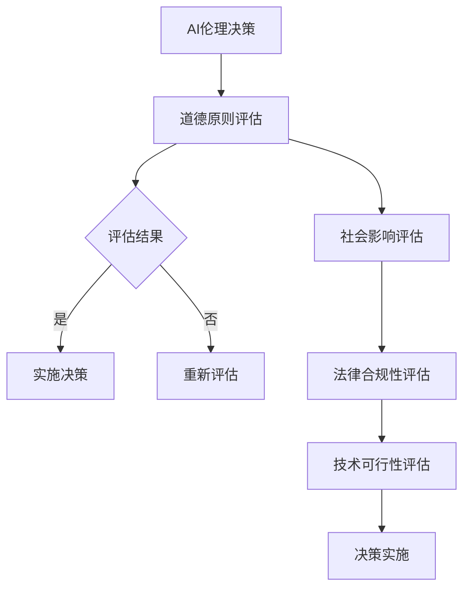
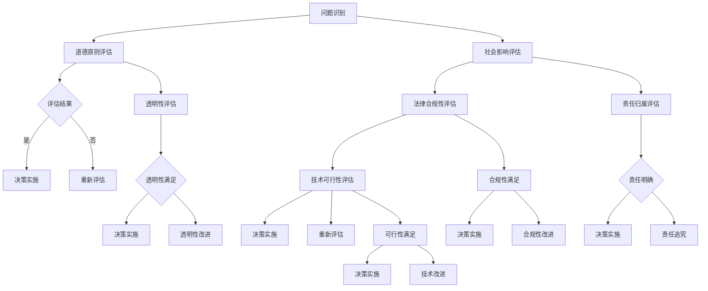

                 

# 人类计算：AI时代的道德和社会责任

> **关键词**：人工智能、道德伦理、社会责任、AI伦理、公平性、隐私保护、透明性、问责制、人类尊严、法律合规、风险评估、算法偏见、自动化就业、隐私权、人工智能武器、人权、教育、企业责任、政府政策、全球治理。

> **摘要**：本文探讨了人工智能（AI）时代的道德与社会责任问题。从AI伦理的基本原则、实践框架，到AI时代的道德挑战，再到构建AI时代的道德与社会责任，本文通过逻辑清晰的分析和丰富的案例，旨在为读者提供一个全面而深入的视角，以理解和应对AI时代所带来的复杂道德和社会问题。

## 目录大纲

### 第一部分：AI时代的道德与社会责任概述

#### 第1章：AI时代的道德与社会责任引论

1.1 AI时代的到来与影响  
1.2 道德与伦理在AI时代的挑战  
1.3 社会责任在AI发展中的重要性

#### 第2章：AI伦理的基本原则

2.1 公平性与无歧视  
2.2 尊重隐私与数据安全  
2.3 透明性与问责制  
2.4 尊重人类价值和尊严

#### 第3章：AI伦理的实践框架

3.1 AI伦理评估模型  
3.2 企业AI伦理政策与实践  
3.3 政府与监管机构的角色

### 第二部分：AI时代的道德挑战

#### 第4章：AI与就业市场

4.1 自动化对就业的影响  
4.2 再就业与技能转型  
4.3 企业与社会的责任

#### 第5章：AI与隐私权

5.1 AI技术与隐私保护的冲突  
5.2 隐私权保护的法律与实践  
5.3 个人隐私权的平衡与保护

#### 第6章：AI与战争

6.1 AI武器化的问题与风险  
6.2 国际法规与伦理规范  
6.3 技术伦理与战争责任

#### 第7章：AI与人类尊严

7.1 人工智能与人的本质  
7.2 AI在医疗服务中的应用与挑战  
7.3 AI在决策中的道德考量

### 第三部分：构建AI时代的道德与社会责任

#### 第8章：教育与社会意识

8.1 AI伦理教育的重要性  
8.2 提升公众AI伦理意识的方法  
8.3 社会组织与NGO的作用

#### 第9章：科技企业的社会责任

9.1 企业AI伦理策略  
9.2 企业社会责任报告  
9.3 投资者与消费者的期望

#### 第10章：政府政策与法规制定

10.1 AI伦理法规的现状与趋势  
10.2 政府在AI伦理治理中的作用  
10.3 跨国合作与全球治理

### 附录

#### 附录A：AI伦理与道德相关资源

A.1 学术文献与研究报告  
A.2 伦理准则与报告模板  
A.3 相关组织和倡议

#### 附录B：常见AI伦理问题案例分析

B.1 自动驾驶汽车的伦理决策  
B.2 社交媒体平台的内容审查  
B.3 AI在医疗诊断中的应用与挑战

### AI伦理决策流程


#### Mermaid流程图：AI伦理决策流程



### 第一部分：AI时代的道德与社会责任概述

#### 第1章：AI时代的道德与社会责任引论

##### 1.1 AI时代的到来与影响

人工智能（AI）作为现代科技的前沿领域，正在深刻改变我们的生活方式和社会结构。从工业自动化到医疗诊断，从金融服务到交通出行，AI的应用已经渗透到我们生活的方方面面。AI技术的快速发展不仅带来了生产力的提升，还引发了广泛的社会关注和伦理讨论。

在AI时代，技术的进步不仅仅体现在计算能力的增强上，更体现在算法的自我学习和自适应能力。机器学习、深度学习、自然语言处理等技术的发展，使得计算机能够更加智能地理解和执行复杂任务。这种变革性的技术进步，无疑为人类带来了巨大的机遇，但同时也伴随着一系列道德和社会责任问题。

首先，AI技术的广泛应用对就业市场产生了深远影响。自动化和智能化的工作流程使得一些传统职业变得不再必要，从而引发了对劳动力市场的重新配置和再就业的需求。如何平衡技术进步与就业稳定，成为AI时代不得不面对的挑战之一。

其次，AI技术的普及也带来了隐私保护和数据安全的问题。随着AI系统对大量个人数据的依赖，如何确保这些数据的安全和隐私，如何防止数据被滥用或泄露，成为社会各界关注的焦点。

此外，AI技术的决策过程往往缺乏透明性，使得用户难以理解其决策依据。这种“黑箱”现象引发了公众对AI系统公平性和可信度的质疑。如何提高AI系统的透明性和问责制，成为伦理讨论的重要组成部分。

最后，AI技术的应用还涉及到人类尊严和人权的问题。在医疗、司法等敏感领域，AI系统的决策往往直接影响到个人的权益和生命。如何确保AI系统尊重人类价值和尊严，如何防止技术滥用侵犯人权，是AI时代道德责任的重要方面。

综上所述，AI时代的到来不仅带来了技术上的革新，也引发了道德和社会责任上的挑战。在这一背景下，深入探讨AI时代的道德与社会责任问题，具有极其重要的现实意义。本文将围绕这一主题，从多个角度进行分析和讨论，以期提供一个全面而深入的视角。

##### 1.2 道德与伦理在AI时代的挑战

AI时代的到来，不仅带来了前所未有的技术进步，也引发了深刻的道德与伦理挑战。这些挑战涉及到公平性、隐私保护、透明性和问责制等多个方面，每一个问题都关系到AI技术的可持续发展和社会信任。

首先，公平性是AI伦理的核心议题之一。AI系统在设计和应用过程中，往往依赖于大量的数据。然而，这些数据可能存在偏见，从而影响AI决策的公正性。例如，如果一个AI系统在招聘过程中依赖于过去的数据，而这些数据本身可能带有性别、种族或年龄的偏见，那么该系统可能无意中加剧了不公平。如何确保AI系统的公平性，避免算法偏见，成为AI伦理研究的重要内容。

其次，隐私保护也是AI时代面临的重要挑战。AI系统通常需要大量的个人数据进行训练和优化，这使得个人隐私面临更大的风险。例如，智能助手和社交媒体平台收集的用户数据可能被滥用，导致个人隐私泄露。如何在利用数据推动AI技术发展的同时，保护用户的隐私权，是一个需要深入探讨的问题。

透明性是另一个重要的伦理挑战。许多AI系统，尤其是深度学习模型，其决策过程往往被认为是“黑箱”，用户难以理解其背后的逻辑和算法。这种不透明性可能导致用户对AI系统的信任度降低，甚至引发伦理争议。如何提高AI系统的透明性，使其决策过程更加可解释和可信赖，是AI时代需要解决的重要问题。

问责制是AI伦理中的关键一环。当一个AI系统发生错误或导致负面影响时，如何确定责任归属，如何对责任人进行追责，是一个复杂而重要的问题。特别是在医疗、司法等领域，AI系统的决策直接关系到人的生命和权益，如何建立有效的问责机制，确保责任落实到具体的个人或机构，是AI时代需要关注的重要议题。

此外，AI技术的应用还涉及到人权和人类尊严的问题。在自动化战争、智能监控等应用场景中，AI技术可能侵犯个人的基本权利和尊严。如何确保AI技术的应用不违背人权原则，如何防止技术滥用，是AI时代道德责任的体现。

总之，AI时代的道德与伦理挑战是多方面的，需要从技术、法律、社会等多个层面进行综合应对。只有通过全面而深入的伦理研究，才能确保AI技术的可持续发展，为人类社会带来真正的福祉。

##### 1.3 社会责任在AI发展中的重要性

在AI技术飞速发展的今天，社会责任已经成为其发展的核心议题之一。AI技术的广泛应用不仅改变了传统产业模式，也带来了社会结构、就业市场和伦理观念的深刻变革。因此，如何确保AI技术在推动社会进步的同时，承担起相应的社会责任，显得尤为重要。

首先，企业作为AI技术的研发和推广主体，必须承担起重要的社会责任。企业在追求商业利益的同时，应关注技术对社会的长远影响。这包括以下几个方面：

1. **公平性与无歧视**：企业应确保AI系统在设计和应用过程中，遵循公平和无歧视的原则。避免因算法偏见而加剧社会不公，确保技术公平地服务于所有用户。

2. **隐私保护**：企业在利用用户数据推动AI技术发展的同时，必须严格保护用户隐私。通过数据加密、匿名化等手段，确保用户数据的安全和隐私不被滥用。

3. **透明性**：企业应提高AI系统的透明度，使用户能够理解系统的决策过程和算法逻辑。这不仅有助于提升用户对AI系统的信任度，也能减少因技术不透明所引发的社会争议。

4. **问责制**：企业应建立完善的问责机制，确保在AI系统发生错误或造成负面影响时，能够迅速识别责任人并采取相应措施。这有助于降低技术风险，保护用户的合法权益。

其次，政府作为社会治理的重要主体，在AI发展中同样肩负着重要责任。政府应通过立法、监管和公共政策，推动AI技术的健康发展，保障社会公共利益。具体措施包括：

1. **法规制定**：政府应制定相关法律法规，规范AI技术的研发和应用，确保技术发展符合伦理和法律标准。

2. **监管机构**：设立专门的AI监管机构，负责监督和评估AI技术的应用，确保技术不滥用、不侵犯人权。

3. **公共政策**：政府应制定相关公共政策，推动AI技术的普及和应用，同时关注技术对就业市场、教育体系和社会结构的影响，采取必要措施减轻负面影响。

最后，社会各界也应共同承担起AI发展的社会责任。这包括学术研究机构、非政府组织、媒体和公众等。各方应积极参与AI伦理讨论，共同推动社会共识的形成，为AI技术的健康发展提供支持。

总之，AI技术的社会责任不仅是企业、政府的职责，也是整个社会的共同责任。只有通过多方共同努力，才能确保AI技术在为人类社会带来福祉的同时，不损害社会公平、不侵犯个人权利，实现技术进步与社会发展的良性循环。

### 第二部分：AI伦理的基本原则

#### 第2章：AI伦理的基本原则

在探讨AI伦理的基本原则时，我们需要从多个维度来考虑，这些原则不仅为AI技术的研发和应用提供了伦理指导，也为我们理解和评估AI技术的道德影响提供了理论依据。以下将详细介绍AI伦理的四个基本原则：公平性、隐私保护、透明性和问责制。

##### 2.1 公平性与无歧视

公平性是AI伦理中最核心的原则之一。它要求AI系统在设计和应用过程中，不偏袒特定群体，确保所有用户都能公平地享受技术带来的利益。无歧视则强调AI系统不应因用户的性别、种族、年龄、宗教信仰等因素而产生偏见。

为了实现公平性和无歧视，首先需要确保算法的透明性。算法的透明性使得用户能够了解AI系统的决策依据，从而监督和纠正潜在的偏见。其次，需要使用多样化的训练数据。如果训练数据集过于单一，可能导致算法对特定群体产生偏见。因此，通过引入多样化的训练数据，可以减少算法的偏见，提高公平性。

此外，建立定期的算法审计和评估机制也是确保公平性和无歧视的重要手段。通过对算法进行定期审计，可以及时发现和纠正潜在的偏见，确保AI系统持续遵循公平性和无歧视的原则。

##### 2.2 尊重隐私与数据安全

隐私保护是AI伦理中的另一个重要原则。随着AI技术的应用日益广泛，大量的个人数据被收集、存储和处理。这些数据的泄露或滥用不仅会损害个人隐私，还可能引发严重的社会问题。

为了尊重隐私和保障数据安全，首先需要明确数据的收集和使用原则。企业在收集和使用数据时，应遵循最小化原则，即仅收集和存储与AI应用直接相关的数据。此外，应明确告知用户数据的收集和使用目的，并确保用户对自身数据的控制权。

其次，需要采用先进的数据加密技术，确保数据在传输和存储过程中的安全性。同时，应建立严格的数据访问控制机制，确保只有授权人员才能访问敏感数据。

此外，隐私保护还涉及到数据的匿名化和去标识化。通过将个人数据去标识化或匿名化，可以降低数据泄露的风险，同时不影响AI系统的训练和优化。

##### 2.3 透明性与问责制

透明性要求AI系统的决策过程和算法逻辑对用户和监管机构是可解释的。这种透明性不仅有助于提高用户对AI系统的信任度，也能为监管机构提供监督和评估AI系统的依据。

实现AI系统的透明性，首先需要开发可解释的AI算法。与深度学习等复杂算法相比，可解释的AI算法更容易被用户和监管机构理解。其次，需要建立算法解释机制，使用户能够查询和了解AI系统的决策依据。例如，可以使用可视化工具展示算法的决策路径和关键特征。

问责制是确保AI系统合理使用的关键。当一个AI系统发生错误或导致负面影响时，需要明确责任归属，并采取相应的纠正措施。为了实现问责制，首先需要建立责任识别机制，明确AI系统设计者、开发者、使用者等各方的责任。其次，需要建立责任追究机制，确保在发生问题时能够迅速识别责任人并采取纠正措施。

此外，建立完善的投诉和反馈机制也是实现问责制的重要手段。用户和监管机构可以通过这些机制，对AI系统提出投诉和反馈，帮助识别和纠正问题。

##### 2.4 尊重人类价值和尊严

尊重人类价值和尊严是AI伦理中最基本的原则。AI系统的设计和应用应尊重人类的基本权利和尊严，不应侵犯人的隐私权、财产权和其他基本权利。

为了实现这一原则，首先需要在AI系统的设计阶段，充分考虑人类价值和尊严的保护。例如，在医疗领域，AI系统应确保在治疗决策中尊重患者的自主权，避免因技术原因忽视患者的意愿。

其次，需要建立伦理审查机制，对AI系统的应用进行评估。伦理审查机构应确保AI系统的设计符合伦理要求，不损害人类价值和尊严。

此外，公众教育和宣传也是实现这一原则的重要手段。通过教育和宣传，提高公众对AI伦理的认知，增强公众对AI技术的理解和信任。

总之，AI伦理的基本原则为AI技术的发展提供了伦理指导，确保技术在推动社会进步的同时，不损害社会公平和人类权益。只有遵循这些原则，AI技术才能实现可持续发展，为人类社会带来真正的福祉。

#### 2.1 公平性与无歧视

公平性与无歧视是AI伦理的核心原则，旨在确保AI系统的决策过程和算法设计不会对特定群体产生偏见，从而促进社会的公平与和谐。在AI时代，算法的公平性和无歧视不仅是一个技术问题，更是一个深刻的社会问题，直接关系到AI技术的可信性和公众对AI的接受度。

**算法偏见**

算法偏见是指AI系统在训练和决策过程中，由于训练数据、算法设计或人为干预等原因，对某些群体产生不公平的对待。这种偏见可能导致系统对某些人群做出不公正的决策，从而加剧社会不平等。例如，如果一个招聘系统的训练数据主要来源于过去的历史招聘记录，而这些记录本身可能带有性别、种族或年龄的偏见，那么该系统很可能会在未来的招聘决策中重现这些偏见。

**数据多样性**

数据多样性是减少算法偏见的关键。通过引入多样化的训练数据，可以降低算法对特定群体的偏见。具体来说，训练数据应涵盖不同性别、种族、年龄、地域、职业等多样化的特征，以确保算法在学习和决策时不会对某些群体产生偏见。例如，在招聘算法中，应确保训练数据中包含各种不同背景的候选人，以便算法能够学习和适应多样化的招聘需求。

**训练数据清洗**

训练数据的质量直接影响算法的公平性。因此，在训练数据收集和预处理过程中，需要重视数据清洗工作。数据清洗包括去除重复数据、纠正错误数据、填补缺失数据等，以确保训练数据的准确性和完整性。此外，还应关注数据分布的均衡性，避免某些群体在数据中占据过高比例，从而影响算法的公平性。

**偏见检测与校正**

在算法开发和部署过程中，应建立偏见检测与校正机制。通过定期对算法进行偏见检测，可以及时发现和纠正潜在的偏见。具体方法包括统计分析、机器学习技术等。例如，可以使用统计方法检测算法对特定群体的决策偏好，如果发现偏见，可以采用重新训练、参数调整等方法进行校正。

**定期审计**

为了确保AI系统的公平性和无歧视，应建立定期的算法审计机制。审计工作可以由独立机构或第三方专业团队进行，通过审查算法的设计、训练数据、决策流程等，评估系统的公平性和无歧视水平。审计结果应公开透明，以便用户和社会监督。

**法律和政策支持**

法律和政策是保障算法公平性和无歧视的重要手段。各国政府应制定相关法律法规，明确AI系统的公平性和无歧视要求，并设立相应的监管机构进行监督和执法。例如，可以制定“算法公平性法案”，要求企业在开发和部署AI系统时，必须进行公平性评估，并在系统中嵌入偏见检测和校正机制。

**公众教育和参与**

公众教育和参与是提高算法公平性和无歧视意识的重要途径。通过教育和宣传，提高公众对算法偏见和公平性的认识，增强公众对AI技术的理解和信任。此外，鼓励公众参与AI伦理讨论，通过问卷调查、公开讨论等形式，收集公众意见和反馈，为算法公平性改进提供参考。

综上所述，公平性与无歧视是AI伦理的核心原则，关系到AI技术的公正性和社会信任。通过引入多样化的训练数据、训练数据清洗、偏见检测与校正、定期审计、法律和政策支持以及公众教育和参与，可以有效地减少算法偏见，确保AI系统在公平和无歧视的基础上运行，为人类社会带来真正的福祉。

#### 2.2 尊重隐私与数据安全

在AI时代，数据已经成为新的“石油”，被广泛应用于各种场景，从商业决策到个人生活，无不依赖数据驱动。然而，数据的价值同时也带来了隐私保护的挑战。如何在充分利用数据的同时，确保个人隐私不受侵害，成为AI伦理中不可忽视的重要问题。

**隐私保护的重要性**

隐私是每个人的基本权利，它关乎个人的自由和安全。在AI技术飞速发展的背景下，个人数据的收集、存储和处理日益频繁，隐私保护的重要性愈发凸显。不恰当的数据处理可能导致个人信息泄露、滥用甚至被用于不法行为，对个人和社会造成严重后果。因此，尊重隐私不仅是道德义务，也是法律要求。

**数据收集和使用原则**

在数据收集和使用过程中，应遵循以下原则：

1. **合法合规**：确保数据的收集和使用符合相关法律法规，例如《通用数据保护条例》（GDPR）和《加州消费者隐私法案》（CCPA）等。

2. **最小化原则**：仅收集和存储与AI应用直接相关的数据，避免过度收集无关数据。

3. **透明性原则**：明确告知用户数据的收集和使用目的，确保用户知情并同意。

4. **用户控制权**：赋予用户对自身数据的控制权，包括数据访问、修改和删除权限。

**数据加密与访问控制**

数据加密是保护隐私的重要手段。通过数据加密，即使数据在传输或存储过程中被非法获取，也无法被解读和利用。常用的加密技术包括对称加密、非对称加密和哈希函数等。

访问控制则是确保数据安全的关键。通过设定严格的访问权限，只有授权用户才能访问敏感数据。访问控制可以基于用户身份验证、角色权限分配和操作审计等多种机制，确保数据访问的安全和可控。

**数据匿名化与去标识化**

为了进一步保护个人隐私，可以通过数据匿名化和去标识化技术，降低数据识别风险。数据匿名化是指通过技术手段将个人身份信息从数据中移除，使其无法被直接识别。去标识化则是在保留数据价值的同时，消除个人身份信息，例如将姓名、地址等敏感信息替换为伪名或唯一标识符。

**隐私保护的法律与实践**

各国政府和国际组织在隐私保护方面制定了相应的法律法规，以规范数据收集、处理和使用的合法行为。例如，《通用数据保护条例》（GDPR）规定，企业必须获得用户明确同意才能收集和处理个人数据，并赋予用户多种隐私权，如数据访问、删除和转移权。此外，《加州消费者隐私法案》（CCPA）也对个人数据的收集和使用提出了严格的要求。

在法律实践中，企业应建立健全的隐私保护机制，包括隐私政策、隐私审计、数据安全培训等。同时，企业应定期评估和更新隐私保护措施，以应对不断变化的隐私保护需求和法规要求。

**个人隐私权的平衡与保护**

在AI技术的发展过程中，个人隐私权的保护需要与技术创新和社会利益之间进行平衡。一方面，AI技术的应用可以带来巨大的社会效益，如医疗诊断、智能交通、金融服务等。另一方面，过度收集和使用个人数据可能侵犯个人隐私权。

为了实现个人隐私权的平衡与保护，需要采取以下措施：

1. **隐私影响评估**：在AI项目启动前，进行隐私影响评估，识别潜在的隐私风险，并制定相应的保护措施。

2. **透明披露**：向用户明确披露数据的收集和使用情况，使用户能够做出明智的决策。

3. **隐私增强技术**：采用隐私增强技术，如差分隐私、同态加密等，在保障数据隐私的同时，仍能实现数据分析和价值。

4. **用户参与**：鼓励用户参与隐私保护决策，通过用户反馈和投诉机制，及时发现和纠正隐私问题。

总之，尊重隐私与数据安全是AI伦理的重要组成部分。通过明确数据收集和使用原则、采用数据加密和访问控制技术、实施数据匿名化和去标识化、遵循隐私保护法律法规以及平衡个人隐私权和技术创新，可以有效地保护个人隐私，确保AI技术在安全、透明和负责任的基础上发展，为人类社会带来真正的福祉。

#### 2.3 透明性与问责制

透明性与问责制是确保AI系统在伦理和法律框架内运行的关键原则。透明性要求AI系统的决策过程和算法逻辑对用户和监管机构是可解释的，而问责制则确保在AI系统发生错误或产生负面影响时，能够明确责任归属并采取纠正措施。以下将详细探讨这两个原则及其实现方法。

**透明性**

1. **算法解释性**：AI系统的透明性首先需要具备算法解释性。与深度学习等复杂的“黑箱”算法相比，可解释的AI算法（如决策树、线性回归等）更容易被用户和监管机构理解。通过提供算法的解释，用户可以更好地理解系统的决策过程和依据，从而增加对AI系统的信任度。

2. **决策路径追踪**：在AI系统的决策过程中，记录和追踪每个决策步骤及其依据，有助于提高系统的透明度。例如，在医疗诊断AI系统中，可以记录每个诊断步骤所依据的数据特征和计算逻辑，使医生和患者能够了解诊断过程和结果。

3. **可视化工具**：开发可视化工具，将复杂的算法决策过程以直观的方式展示给用户，有助于提高透明性。例如，通过图表、流程图等，展示数据流和决策路径，使非技术背景的用户也能理解AI系统的运作。

**问责制**

1. **责任识别机制**：建立责任识别机制，明确AI系统的设计者、开发者、使用者等各方的责任。在发生错误或产生负面影响时，可以迅速确定责任人，避免责任分散和逃避。

2. **责任追究机制**：制定明确的责任追究规则，确保在AI系统发生错误或产生负面影响时，能够采取有效的纠正和处罚措施。责任追究机制应涵盖AI系统的整个生命周期，包括开发、测试、部署和维护等环节。

3. **违规处罚**：对违反AI伦理原则和法律法规的行为，应实施严格的违规处罚。例如，对于故意设计或使用带有偏见和歧视的算法，应采取法律手段追究责任，并进行相应的经济处罚。

**实施方法**

1. **伦理审查与评估**：在AI系统开发和部署前，进行伦理审查和评估，确保系统的设计符合伦理原则。伦理审查可以由独立的伦理委员会或第三方机构进行，审查内容包括算法的公平性、透明性、隐私保护等。

2. **法规制定与执行**：政府应制定相关的法律法规，明确AI系统的伦理要求，并设立专门的监管机构进行监督和执法。例如，可以制定《AI伦理法》，规范AI系统的研发、测试和部署过程，确保系统的透明性和问责制。

3. **公众参与与监督**：鼓励公众参与AI伦理讨论，通过公众监督和反馈机制，提高AI系统的透明性和可信度。公众可以通过投诉、举报等方式，对违反AI伦理原则的行为进行监督和举报。

4. **技术手段**：采用先进的技术手段，提高AI系统的透明性和可解释性。例如，开发可解释的AI算法、利用区块链技术记录AI系统的决策过程和交易数据等。

总之，透明性和问责制是确保AI系统在伦理和法律框架内运行的基石。通过提高算法解释性、建立责任识别和追究机制，以及采用技术手段和法规制定，可以有效地实现AI系统的透明性和问责制，确保AI技术在安全、可信和负责任的基础上发展，为人类社会带来真正的福祉。

#### 2.4 尊重人类价值和尊严

在AI技术不断发展的时代，尊重人类价值和尊严成为AI伦理中不可忽视的核心原则。AI系统的设计与应用，必须遵循这一原则，确保技术不侵犯人类的基本权利和尊严。以下将详细探讨AI系统如何尊重人类价值和尊严，以及相关的技术、政策和实践。

**尊重人类价值和尊严的意义**

尊重人类价值和尊严，意味着AI系统在执行任务和决策时，不应侵犯人的基本权利，如隐私权、自由权和生命权。这一原则的重要性体现在以下几个方面：

1. **维护人权**：AI技术不应成为侵犯人权的工具。例如，在监控和执法领域，AI系统应确保尊重公民的隐私权和自由权。

2. **保障生命安全**：在医疗、交通等领域，AI系统的决策直接关系到人的生命安全。尊重人类价值和尊严，确保AI系统在决策过程中不发生严重错误，至关重要。

3. **促进社会公平**：AI技术的应用应促进社会公平，不应加剧社会不平等。例如，在招聘、金融等领域，AI系统应确保对所有用户的公平对待，避免因算法偏见而歧视某些群体。

**技术实现**

1. **人性化的交互设计**：AI系统应具备人性化的交互设计，使其在与用户互动时，能够理解用户的情感和需求。例如，在客服机器人中，通过自然语言处理技术，使系统能够识别用户的情感，并做出相应的回应。

2. **情感识别与理解**：AI系统应具备情感识别与理解能力，能够识别用户的情绪状态，并根据这些信息调整自己的行为。例如，在医疗诊断AI系统中，通过情感识别技术，帮助医生更好地了解患者的情绪状态，从而提供更个性化的医疗服务。

3. **伦理边界设定**：在AI系统的设计和应用过程中，应明确设定伦理边界，确保系统不超越伦理限制。例如，在军事AI系统中，应设定严格的伦理规则，确保AI系统不会用于违反战争法规的行为。

**政策与法规**

1. **伦理审查制度**：政府应建立AI系统的伦理审查制度，对AI系统的设计、开发和部署进行全面的伦理评估。伦理审查委员会应由来自不同领域的专家组成，确保评估的全面性和公正性。

2. **法律法规**：政府应制定相应的法律法规，规范AI系统的应用，确保其尊重人类价值和尊严。例如，可以制定《人工智能伦理法》，明确AI系统的伦理要求，并对违反伦理规定的个人和机构进行处罚。

3. **国际合作**：国际合作是确保全球AI技术尊重人类价值和尊严的重要手段。各国应加强合作，制定统一的AI伦理标准和规范，共同应对AI技术带来的伦理挑战。

**实践案例**

1. **医疗AI系统的伦理考量**：在医疗AI系统的设计和应用过程中，应充分考虑尊重患者价值和尊严。例如，在诊断和治疗方案推荐中，系统应尊重患者的自主权和知情权，确保患者能够理解和参与决策过程。

2. **自动驾驶汽车的伦理决策**：自动驾驶汽车在面临伦理决策时，如需要权衡不同人的生命安全，应遵循伦理原则，确保不侵犯人类价值和尊严。例如，通过设定明确的伦理规则，确保汽车在紧急情况下，优先保护车内乘客的安全。

总之，尊重人类价值和尊严是AI伦理的核心原则。通过人性化的交互设计、情感识别与理解、伦理边界设定、伦理审查制度、法律法规和国际合作等多种手段，可以确保AI系统在尊重人类价值和尊严的基础上发展，为人类社会带来真正的福祉。

#### 第3章：AI伦理的实践框架

在AI技术迅速发展的背景下，如何确保其应用过程中遵循伦理原则，成为一个亟待解决的重要问题。AI伦理的实践框架是确保AI技术发展符合道德和法律标准的重要手段。本章节将详细探讨AI伦理评估模型、企业AI伦理政策与实践以及政府与监管机构在AI伦理治理中的作用。

##### 3.1 AI伦理评估模型

AI伦理评估模型是确保AI系统设计、开发和部署过程中符合伦理要求的重要工具。以下是一种典型的AI伦理评估模型，包括评估过程和关键步骤：

**评估过程：**

1. **问题定义**：明确AI系统应用场景，识别可能涉及的伦理问题。
2. **道德原则分析**：分析相关的道德原则，如公平性、隐私保护、透明性、问责制等。
3. **风险评估**：对潜在的伦理风险进行识别和评估，确定其影响和可能性。
4. **改进措施**：制定相应的改进措施，降低伦理风险。

**关键步骤：**

1. **道德原则识别**：通过文献调研、专家访谈等方法，识别与AI应用场景相关的道德原则。
2. **风险评估方法**：采用定性和定量相结合的方法，对伦理风险进行评估。例如，可以使用风险矩阵、伦理评分等方法。
3. **改进措施制定**：根据评估结果，制定相应的改进措施，如算法优化、数据清洗、伦理审计等。
4. **评估报告**：撰写评估报告，总结评估过程、发现的问题和改进措施，供决策者参考。

**具体案例：**

以自动驾驶汽车为例，其伦理评估模型可能包括以下步骤：

1. **问题定义**：识别自动驾驶汽车在行驶过程中可能遇到的伦理问题，如道路优先权、紧急避让等。
2. **道德原则分析**：分析公平性、隐私保护、透明性、问责制等道德原则。
3. **风险评估**：评估不同伦理问题的风险程度，如紧急避让决策的伦理风险较高。
4. **改进措施制定**：针对高伦理风险的场景，制定改进措施，如优化决策算法、增加用户反馈机制等。

##### 3.2 企业AI伦理政策与实践

企业在AI技术的发展和应用过程中，承担着重要的社会责任。制定和实施AI伦理政策，是确保AI技术符合伦理标准的重要手段。以下是一些典型的企业AI伦理政策与实践：

**政策制定：**

1. **伦理委员会**：企业应设立独立的伦理委员会，负责监督和评估AI系统的伦理问题。伦理委员会应由来自不同领域的专家组成，确保评估的全面性和公正性。
2. **伦理培训**：定期对员工进行AI伦理培训，提高员工的伦理意识和专业知识，确保他们在设计和应用AI系统时，能够遵循伦理原则。
3. **伦理政策**：制定明确的AI伦理政策，包括公平性、隐私保护、透明性、问责制等方面的要求，确保AI系统的设计、开发和部署符合伦理标准。

**实践案例：**

以某大型科技企业为例，其AI伦理政策与实践可能包括以下内容：

1. **伦理审查**：在AI项目启动前，进行伦理审查，确保项目的伦理风险得到有效识别和评估。审查内容涵盖数据收集、算法设计、应用场景等方面。
2. **透明报告**：要求AI项目团队定期提交伦理报告，报告内容包括伦理风险评估、改进措施、用户反馈等。报告应公开透明，供内部和外部监督。
3. **用户参与**：鼓励用户参与AI系统的设计和评估，通过用户反馈和投诉机制，识别和纠正潜在的伦理问题。

##### 3.3 政府与监管机构的角色

政府在AI伦理治理中扮演着关键角色。通过立法、监管和政策制定，政府可以确保AI技术的发展和应用符合伦理和法律标准。以下探讨政府与监管机构在AI伦理治理中的重要作用：

**立法与政策制定：**

1. **法律法规**：政府应制定相关的法律法规，明确AI系统的伦理要求，为AI技术发展提供法律依据。例如，可以制定《人工智能伦理法》，规范AI系统的研发、测试和部署过程。
2. **政策指南**：发布AI伦理政策指南，为企业和个人提供伦理实践的具体指导，确保AI技术的应用符合伦理原则。

**监管与执法：**

1. **监管机构**：设立专门的AI监管机构，负责监督和评估AI系统的应用情况，确保其符合伦理和法律标准。
2. **执法与处罚**：对违反AI伦理原则和法律法规的行为，实施严格的执法和处罚措施，确保AI技术的健康发展。

**国际合作与协调：**

1. **国际协调**：积极参与国际AI伦理讨论和合作，推动全球范围内的AI伦理治理。通过签订国际协定和合作备忘录，共同应对AI技术带来的伦理挑战。
2. **跨国合作**：与各国政府和国际组织合作，制定统一的AI伦理标准和规范，确保全球范围内的AI技术发展符合伦理原则。

**公众参与与监督：**

1. **公众参与**：鼓励公众参与AI伦理讨论和决策，通过公众监督和反馈机制，提高AI系统的透明度和可信度。
2. **公民教育**：开展公民教育，提高公众对AI伦理问题的认识和理解，增强公众对AI技术的信任和接受度。

总之，AI伦理的实践框架是确保AI技术发展符合道德和法律标准的重要手段。通过建立AI伦理评估模型、制定企业AI伦理政策与实践、发挥政府与监管机构的作用，可以有效地应对AI技术带来的伦理挑战，确保AI技术在尊重人类价值和尊严的基础上，为人类社会带来真正的福祉。

### 第二部分：AI时代的道德挑战

#### 第4章：AI与就业市场

人工智能（AI）的迅速发展正在深刻改变全球就业市场，自动化技术的广泛应用使得许多传统岗位面临被替代的风险。在这一章中，我们将探讨自动化对就业市场的影响、再就业与技能转型，以及企业和社会在这一变革过程中的责任。

##### 4.1 自动化对就业的影响

自动化技术的进步，特别是AI和机器人技术的应用，正在逐步取代一些传统的工作岗位。这不仅涉及到制造业、物流和仓储等领域的自动化，还延伸到金融、医疗、法律等高技能领域。以下是自动化对就业市场的主要影响：

**1. 职业岗位减少**

自动化技术的高效性和低成本使得许多传统职业变得不再必要。例如，在制造业中，机器人已经取代了大量生产线上的工人；在金融领域，AI算法在交易和风险评估中的应用，减少了金融分析师和交易员的需求。据麦肯锡全球研究院的估计，到2030年，全球可能有多达8亿个工作岗位被自动化技术取代。

**2. 工作内容变化**

尽管自动化技术并未完全取代人类工作，但许多工作内容发生了显著变化。例如，在医疗领域，AI辅助诊断系统帮助医生提高诊断准确性，但同时也要求医生具备更多的技术知识，以便能够有效利用AI工具。

**3. 技能需求升级**

随着自动化技术的普及，对劳动力的技能需求也在发生变化。许多行业对高技能劳动力的需求增加，如数据分析师、软件工程师和AI专家等。这些新兴职业需要劳动者具备更高的技术能力和专业知识。

##### 4.2 再就业与技能转型

面对自动化带来的就业市场变革，再就业与技能转型成为重要的应对策略。以下是一些有效的再就业与技能转型方法：

**1. 职业培训**

企业和政府可以通过提供职业培训项目，帮助劳动力掌握新的技能。这些培训项目可以包括技术培训、职业转型培训等，以适应新兴职业的需求。例如，许多制造业公司为其员工提供编程和自动化技术的培训，以应对生产线自动化带来的变化。

**2. 在线教育**

随着在线教育的兴起，越来越多的人可以通过网络平台获取新的知识和技能。在线教育平台如Coursera、edX和Udacity等，提供了大量与AI、数据科学和编程相关的课程，为劳动者提供了灵活的学习机会。

**3. 重新定位职业生涯**

对于那些在自动化浪潮中失去工作的劳动者，重新定位职业生涯也是一种有效的应对策略。这包括探索新的职业领域、创业或转变职业方向。例如，一些失去制造业岗位的工人，通过转型成为维护和运营自动化系统的技术人员，实现了职业生涯的再定位。

##### 4.3 企业与社会的责任

在AI时代，企业和社会有责任共同应对自动化带来的就业市场挑战。以下是企业和社会在这一过程中应承担的责任：

**1. 企业责任**

- **技能投资**：企业应投资于员工的技能提升和职业转型，以适应自动化技术的发展。这不仅有助于提升员工的就业竞争力，也有助于企业自身的可持续发展。
- **透明沟通**：企业在自动化技术的应用过程中，应与员工进行透明沟通，解释技术变革的影响和机遇，以减少员工的焦虑和抵触情绪。
- **伦理责任**：企业在自动化技术的研发和应用中，应遵循伦理原则，确保技术的使用不损害员工的权益和尊严。

**2. 社会责任**

- **政策支持**：政府应制定相关政策，支持劳动力的再就业和技能转型。例如，提供税收优惠、补贴和贷款等激励措施，以鼓励企业投资于员工培训。
- **公共教育资源**：政府和社会应加大对公共教育资源的投入，提高全民的教育水平，特别是技术教育和职业培训。
- **社会安全网**：建立完善的社会安全网，包括失业保险、再就业援助等，以保障在自动化浪潮中失去工作的劳动者的基本生活需求。

总之，自动化对就业市场的影响是深远而复杂的。企业和社会有责任共同应对这一挑战，通过技能投资、职业培训和政策支持等措施，帮助劳动者适应自动化时代的变革，实现可持续发展的就业市场。

#### 第5章：AI与隐私权

人工智能（AI）技术的广泛应用，极大地提升了数据处理和分析的能力，然而，这也带来了隐私保护方面的巨大挑战。在这一章中，我们将探讨AI技术与隐私保护的冲突，隐私权保护的法律与实践，以及如何在个人隐私权与数据利用之间实现平衡。

##### 5.1 AI技术与隐私保护的冲突

随着AI技术的迅猛发展，个人数据的收集、存储和分析变得越来越普遍。然而，这种数据驱动的发展模式与隐私保护原则之间存在着明显的冲突：

**1. 数据滥用的风险**

AI技术依赖于大量的个人数据，这些数据可能包含敏感的个人信息，如健康记录、财务状况、个人偏好等。如果这些数据被滥用或泄露，可能会导致严重的隐私侵犯和个人损失。

**2. 数据归属权争议**

在AI系统中，个人数据往往被企业或其他机构收集和使用，但数据所有权和使用权归属模糊，容易引发数据归属权争议。例如，用户在社交媒体上发布的内容，其数据的所有权和控制权归属问题一直存在争议。

**3. 算法偏见**

AI系统的训练和决策过程往往基于历史数据，如果这些数据存在偏见，AI系统可能会加剧社会不平等，导致对某些群体的歧视。这种算法偏见不仅损害了隐私，也破坏了社会的公平和正义。

**4. 数据存储和泄露风险**

AI技术通常涉及大规模数据存储和处理，这使得数据泄露的风险大大增加。一旦数据泄露，不仅隐私受到侵害，还可能引发连锁反应，如身份盗窃、诈骗等。

##### 5.2 隐私权保护的法律与实践

为了应对AI技术与隐私保护的冲突，各国政府和国际组织制定了一系列法律法规，以规范AI技术的应用，保护个人隐私权。以下是一些重要的法律和实践：

**1. 《通用数据保护条例》（GDPR）**

欧盟制定的《通用数据保护条例》（GDPR）是全球最具影响力的隐私保护法律之一。GDPR规定了数据控制者和处理者的责任，明确了用户的隐私权，包括数据访问、删除和转移权。GDPR还设立了高额罚款机制，以增强法律的威慑力。

**2. 《加州消费者隐私法案》（CCPA）**

《加州消费者隐私法案》（CCPA）是美国加州的一项重要隐私保护法律，旨在赋予消费者对其个人数据的控制权。CCPA规定了企业的数据收集、使用和披露义务，并赋予消费者拒绝数据销售和访问其数据记录的权利。

**3. 《隐私盾》（Privacy Shield）**

《隐私盾》是欧盟和美国之间的一项数据转移协议，旨在解决在跨大西洋数据传输中的隐私保护问题。根据该协议，美国公司必须承诺遵守一系列隐私保护标准，才能从欧盟接收个人数据。

**4. 企业自律**

除了法律法规，许多企业也制定了内部隐私保护政策，通过自律来确保数据的合理使用和保护。这些政策通常包括数据收集和使用的透明性、数据加密、隐私影响评估等。

**5. 隐私增强技术**

为了在利用数据的同时保护隐私，许多企业和研究机构开发了隐私增强技术，如差分隐私、同态加密和隐私计算等。这些技术通过在数据处理过程中引入隐私保护机制，使得数据在提供分析价值的同时，减少了隐私泄露的风险。

##### 5.3 个人隐私权的平衡与保护

在AI技术的发展过程中，如何在个人隐私权与数据利用之间实现平衡，是一个复杂而重要的问题。以下是一些实现平衡和保护隐私的方法：

**1. 数据最小化原则**

企业在收集和使用数据时，应遵循数据最小化原则，仅收集和存储与AI应用直接相关的数据，避免过度收集无关数据。这有助于减少隐私泄露的风险。

**2. 数据匿名化与去标识化**

通过数据匿名化和去标识化技术，可以将个人身份信息从数据中移除，从而降低数据识别风险。这些技术包括数据置换、加密和混淆等。

**3. 透明披露与用户同意**

在收集和使用数据前，企业应明确告知用户数据收集和使用的目的，并获取用户的明确同意。这种透明披露和用户同意机制有助于增强用户对数据处理的信任。

**4. 数据安全措施**

企业应采取严格的数据安全措施，如数据加密、访问控制和安全审计等，确保数据在传输和存储过程中的安全。

**5. 用户参与与反馈**

鼓励用户参与数据处理的决策过程，提供投诉和反馈渠道，使用户能够对数据处理提出意见和建议。这有助于在数据利用与隐私保护之间实现平衡。

总之，AI技术的应用在带来巨大便利的同时，也对隐私保护提出了新的挑战。通过法律法规的制定、隐私增强技术的应用以及数据最小化、透明披露和用户参与等措施，可以在个人隐私权与数据利用之间实现平衡，确保AI技术在安全、透明和负责任的基础上发展，为人类社会带来真正的福祉。

#### 第6章：AI与战争

人工智能（AI）技术的迅猛发展，不仅改变了日常生活，也深刻影响了军事领域。AI在战争中的应用，如自动化武器系统、智能侦察和精确打击等，带来了前所未有的挑战和风险。以下将探讨AI武器化的问题与风险，国际法规与伦理规范，以及技术伦理与战争责任。

##### 6.1 AI武器化的问题与风险

AI武器化指的是将人工智能技术应用于军事领域，开发和使用自动化武器系统。这种技术的应用在提升军事效能的同时，也引发了一系列严重的问题和风险：

**1. 自主决策能力**

AI武器系统具有高度的自主决策能力，可以在无需人类干预的情况下进行侦察、决策和执行任务。这种能力在理论上可以提高作战效率，但同时也带来了道德和伦理上的挑战。例如，自主武器系统可能在没有明确指令的情况下发动攻击，导致不必要的 civilian casualties。

**2. 滥用与误用**

AI武器系统的自主性使其更容易被滥用或误用。例如，恐怖组织或非国家行为者可能会利用这些技术进行网络攻击、破坏活动和恐怖袭击。此外，AI系统可能因为算法偏见或技术缺陷，导致误判和误伤。

**3. 安全和可靠性问题**

AI武器系统的安全和可靠性问题也是一大风险。尽管AI技术在数据处理和模式识别方面表现出色，但其决策过程可能受到外界干扰，导致错误决策。例如，一个无人机可能因为错误识别目标或受到黑客攻击而误伤友军或无辜平民。

**4. 法律和道德问题**

AI武器化引发了法律和道德问题。例如，如何定义和追究自动化武器的责任？如果AI系统在执行任务时造成损害，应该由谁承担责任？此外，AI武器系统的使用可能违反国际法规和伦理原则，例如《联合国禁止或限制使用某些常规武器公约》（CCW）中的禁用条款。

##### 6.2 国际法规与伦理规范

为了应对AI武器化带来的挑战，国际社会积极制定相关法规和伦理规范，旨在限制和规范AI在军事领域的应用。以下是一些重要的国际法规和伦理规范：

**1. 《联合国禁止或限制使用某些常规武器公约》（CCW）**

CCW是国际社会在常规武器使用方面的重要法律文件，其中包括关于自动化武器系统的讨论。该公约明确禁止或限制使用那些可能导致不必要的 civilian suffering 或 civilian casualties 的武器系统。

**2. 《国际人道法》（IHL）**

国际人道法规定了战争期间的基本规则和原则，以保护受冲突影响的人员和财产。AI武器系统的使用应遵循国际人道法，确保不会对平民和民用目标造成不必要的损害。

**3. 《反机器人武器公约》（CRW）**

反机器人武器公约是近年来提出的国际公约草案，旨在限制和规范自动化武器系统的发展和使用。该公约主张通过国际法律框架，禁止或限制那些可能导致大规模杀伤和长期环境破坏的AI武器系统。

**4. 伦理规范**

除了国际法规，国际社会还提出了多种伦理规范，以指导AI在军事领域的应用。这些伦理规范通常强调尊重人类生命、避免不必要的 civilian suffering 和保护人权。例如，国际红十字会的《人工智能与军事应用伦理指南》提出了多项伦理原则，包括透明性、可解释性、责任和人权保护等。

##### 6.3 技术伦理与战争责任

技术伦理在AI武器化中的应用具有重要意义。以下是一些关键的技术伦理原则和战争责任：

**1. 责任归属**

在AI武器系统中，明确责任归属是一个关键问题。如果AI系统在执行任务时造成损害，应由谁承担责任？技术开发者、设计者、使用者还是监管机构？建立明确的责任归属机制，有助于确保在发生问题时能够追究到具体责任人。

**2. 可解释性和透明性**

确保AI系统的决策过程和算法逻辑是可解释和透明的，有助于减少技术滥用和误用风险。通过提高系统的透明度，用户和监管机构可以更好地理解和监督AI系统的运作，从而减少错误决策和不当行为。

**3. 人权保护**

AI武器系统的设计和应用应尊重和保护人权。这意味着在军事行动中，AI系统应遵循国际人道法，避免对平民和民用目标造成不必要的损害。此外，应确保AI系统在决策过程中考虑到伦理和道德原则，以减少对人权的侵犯。

**4. 国际合作**

国际合作是应对AI武器化挑战的重要手段。各国应加强合作，共同制定国际法规和伦理规范，确保AI技术在军事领域的应用符合全球伦理和法律标准。通过国际合作，可以建立统一的监管机制，减少跨境滥用和冲突。

总之，AI与战争的关系是一个复杂且敏感的话题。在AI武器化的发展过程中，技术伦理和责任归属问题至关重要。通过建立国际法规和伦理规范，明确责任归属，提高系统的可解释性和透明性，以及保护人权，可以有效地应对AI武器化带来的挑战，确保军事技术的安全、合法和负责任地应用。

#### 第7章：AI与人类尊严

人工智能（AI）技术的广泛应用正在深刻改变医疗、司法等多个领域，然而，这种变革也带来了对人类尊严的挑战。在这一章中，我们将探讨人工智能与人的本质，AI在医疗服务中的应用与挑战，以及AI在决策中的道德考量。

##### 7.1 人工智能与人的本质

人工智能与人的本质之间的关系是一个复杂的哲学问题。尽管AI技术在模仿人类思维和行为方面取得了显著进展，但AI与人类在本质上是不同的：

**1. 意识和自我意识**

人类具有意识，能够感知和思考自己的存在，而AI缺乏这种自我意识。虽然AI可以通过算法模拟某些认知功能，但它并不具备真正的意识，不能像人类那样体验情感和自我认知。

**2. 创造性和情感**

人类具有创造性和情感，能够在艺术、文学、科学等领域进行创新和表达情感。相比之下，AI虽然在某些领域表现出色，但在创造性和情感方面仍然有限。

**3. 价值观和道德判断**

人类能够基于价值观和道德原则做出道德判断，而AI缺乏这种道德判断能力。AI系统的决策往往基于预设的算法和数据进行，无法像人类那样根据复杂的道德情境进行判断。

**4. 社交互动**

人类能够进行复杂的社交互动，建立人际关系和社会网络。相比之下，AI在社交互动方面仍然有限，无法像人类那样进行真正的情感交流。

##### 7.2 AI在医疗服务中的应用与挑战

AI技术在医疗服务中的应用带来了巨大的变革潜力，但也引发了一系列道德和伦理挑战：

**1. 诊断和治疗的准确性**

AI在医疗诊断和治疗中表现出色，例如通过分析医学影像和患者数据，提高诊断的准确性和治疗效果。然而，AI系统的决策过程往往缺乏透明性，医生和患者难以理解其决策依据，这可能导致信任问题。

**2. 隐私保护**

在医疗服务中，AI系统需要大量患者数据，这可能涉及隐私保护问题。如何确保患者数据的安全和隐私，防止数据被滥用或泄露，是一个重要的伦理挑战。

**3. 偏见和公平性**

如果AI系统在训练数据中存在偏见，可能会导致对某些群体的不公平对待。例如，如果一个AI系统在招聘过程中依赖于历史数据，而这些数据中可能存在性别或种族偏见，那么该系统可能无意中加剧了不公平。

**4. 人机协作**

在医疗服务中，AI系统与医生的协作模式也是一个伦理问题。如何确保AI系统不取代医生，而是作为辅助工具，共同提高医疗服务质量，是当前需要解决的关键问题。

##### 7.3 AI在决策中的道德考量

AI在各个领域的广泛应用，使其在决策过程中扮演越来越重要的角色。然而，AI决策中的道德考量成为了一个复杂而重要的问题：

**1. 公平性和无歧视**

确保AI系统的公平性，避免算法偏见，是AI决策中的核心道德考量。通过多样化的训练数据、算法优化和定期审计，可以减少算法偏见，提高系统的公平性。

**2. 透明性和可解释性**

提高AI系统的透明性和可解释性，使其决策过程对用户和监管机构是可解释的，是确保AI系统道德决策的关键。这有助于增强用户对AI系统的信任，并确保其符合伦理和法律标准。

**3. 问责制**

在AI决策中，明确责任归属，建立问责机制，是确保AI系统道德决策的重要手段。当一个AI系统发生错误或导致负面影响时，需要能够迅速识别责任人并采取纠正措施。

**4. 人权保护**

在AI决策中，应尊重和保护人权。例如，在司法领域，AI系统应确保在判决过程中不侵犯个人权利和尊严，遵循法律和伦理原则。

**5. 多方参与**

在制定AI决策标准和规范时，应鼓励多方参与，包括技术专家、伦理学家、法律专家和社会公众等。通过多方合作，可以确保AI决策符合社会期望和伦理要求。

总之，AI与人类尊严之间的关系是一个复杂而重要的议题。在AI技术的应用过程中，我们需要深入探讨其道德和伦理问题，确保AI系统能够在尊重人类尊严和伦理原则的基础上，为人类社会带来真正的福祉。

#### 第8章：教育与社会意识

在人工智能（AI）技术迅速发展的今天，教育和社会意识的提升变得至关重要。AI技术不仅改变了我们的工作方式和生活习惯，也对我们的伦理观念和社会结构产生了深远影响。因此，本章节将探讨AI伦理教育的重要性、提升公众AI伦理意识的方法，以及社会组织与NGO在这一过程中的作用。

##### 8.1 AI伦理教育的重要性

AI伦理教育是培养下一代AI从业者和公众AI伦理意识的关键。以下是一些原因说明为什么AI伦理教育至关重要：

**1. 增强职业素养**

在AI领域工作的专业人士，如数据科学家、AI工程师和产品经理等，需要具备良好的伦理素养。通过AI伦理教育，他们可以更好地理解和应对技术带来的伦理挑战，确保其在工作中的决策和行为符合伦理标准。

**2. 提高公众理解**

对于普通公众来说，了解AI伦理问题有助于他们做出更加明智的决策，并在日常生活中更好地利用AI技术。通过AI伦理教育，公众可以更好地理解AI技术的潜在风险和道德影响，从而更好地参与技术治理。

**3. 预防技术滥用**

AI伦理教育有助于预防技术滥用和不当行为。通过教育，公众和从业者可以认识到AI技术的双刃剑特性，避免因盲目追求技术进步而忽视伦理问题。

**4. 增强社会信任**

AI伦理教育有助于增强公众对AI技术的信任。当人们理解AI技术的伦理背景和风险时，他们更可能接受和信任AI技术，从而促进技术的广泛应用。

##### 8.2 提升公众AI伦理意识的方法

为了提升公众的AI伦理意识，可以采取多种方法，包括以下几种：

**1. 教育课程**

在学校和大学中引入AI伦理课程，让学生在接触AI技术的同时，了解相关的伦理问题和道德责任。这些课程可以涵盖算法偏见、隐私保护、透明性、问责制等多个方面。

**2. 公众讲座和研讨会**

组织AI伦理方面的公众讲座和研讨会，邀请专家和学者分享见解，提高公众对AI伦理问题的认识。这些活动可以通过线上和线下形式进行，使更多人受益。

**3. 媒体宣传**

利用媒体平台，如电视、广播、报纸和网络新闻，宣传AI伦理知识，提高公众的伦理意识。媒体可以报道AI伦理案例、专家观点和相关政策，帮助公众了解AI技术的伦理影响。

**4. 社交媒体活动**

通过社交媒体平台，如Twitter、Facebook和LinkedIn，开展AI伦理相关的讨论和互动。这些平台可以促进公众之间的交流和讨论，增加AI伦理话题的关注度。

**5. 培训和认证**

为公众和从业者提供AI伦理培训课程和认证，帮助他们掌握AI伦理知识和实践。这些培训和认证可以由专业机构或学术组织提供，有助于提升从业者的专业水平和公众的伦理意识。

##### 8.3 社会组织与NGO的作用

社会组织和非政府组织（NGO）在提升AI伦理意识方面发挥着重要作用。以下是一些具体作用：

**1. 研究和倡导**

社会组织和NGO可以通过研究和倡导，推动AI伦理问题的讨论和解决。这些组织可以发布研究报告、政策建议和伦理准则，为政策制定者和技术开发者提供参考。

**2. 教育和宣传**

社会组织和NGO可以通过教育和宣传活动，提高公众对AI伦理问题的认识。这些活动可以包括研讨会、工作坊、讲座和公众论坛等。

**3. 监督和评估**

社会组织和NGO可以监督和评估AI技术的应用情况，确保其符合伦理标准。这些组织可以通过调查、研究和报告，揭示AI技术可能带来的伦理风险和问题。

**4. 案例研究**

社会组织和NGO可以开展AI伦理案例研究，分析AI技术在具体应用场景中的伦理挑战。这些案例研究有助于提高公众对AI伦理问题的理解和认识。

**5. 国际合作**

社会组织和NGO可以通过国际合作，推动全球范围内的AI伦理治理。这些组织可以参与国际会议、论坛和合作项目，共同制定全球AI伦理标准和规范。

总之，AI伦理教育和社会意识的提升是确保AI技术健康、可持续发展的重要手段。通过教育课程、公众讲座、媒体宣传、社交媒体活动、培训与认证、社会组织与NGO的研究和倡导、监督和评估，以及国际合作，我们可以共同努力，提高公众和从业者的AI伦理意识，确保AI技术在尊重人类尊严和伦理原则的基础上，为人类社会带来真正的福祉。

#### 第9章：科技企业的社会责任

在人工智能（AI）技术的快速发展中，科技企业不仅扮演着技术推动者的角色，还承载着重要的社会责任。本章节将探讨科技企业在AI伦理方面的策略、企业社会责任报告、以及投资者和消费者的期望。

##### 9.1 企业AI伦理策略

科技企业在AI领域的责任首先体现在其伦理策略上。以下是一些关键的AI伦理策略：

**1. 建立伦理委员会**

许多科技企业设立了独立的AI伦理委员会，负责评估和监督AI技术的伦理问题。伦理委员会通常由来自不同领域的专家组成，包括伦理学家、法律专家、技术专家和社会学家等。这些委员会负责制定伦理准则，审查AI项目的道德可行性，并监督其执行。

**2. 制定伦理准则**

科技企业应制定明确的AI伦理准则，涵盖公平性、隐私保护、透明性、问责制等关键原则。这些准则应嵌入企业的战略和文化中，确保所有员工和合作伙伴在AI技术的研发和应用过程中，都能遵循这些伦理原则。

**3. 透明信息披露**

企业应在AI技术的研发和应用过程中，保持透明信息披露。这包括公开算法的设计和决策逻辑、数据来源和处理方式，以及可能的风险和影响。通过透明信息披露，企业可以增强用户对AI系统的信任，并接受社会监督。

**4. 伦理审计**

定期进行AI系统的伦理审计，评估其设计、开发和部署是否符合伦理准则。伦理审计可以由内部审计团队或第三方机构进行，确保审计过程的独立性和公正性。

**5. 社会责任报告**

企业应发布社会责任报告，详细描述其在AI伦理方面的策略和进展。这些报告应涵盖伦理委员会的工作、伦理准则的执行情况、透明信息披露、伦理审计结果以及企业在AI伦理方面面临的挑战和解决方案。

##### 9.2 企业社会责任报告

企业社会责任报告是科技企业展示其AI伦理策略和绩效的重要手段。以下是一些关键内容：

**1. 伦理准则和执行情况**

报告应详细描述企业的AI伦理准则，包括公平性、隐私保护、透明性和问责制等方面的要求。同时，报告还应展示企业在这些准则的执行情况，例如伦理委员会的成立和工作情况，伦理准则在项目中的具体应用等。

**2. 透明信息披露**

报告应披露AI系统的决策过程、数据来源和处理方式，以及可能的风险和影响。通过这些信息，用户和社会可以更好地理解AI系统的运作，并对其提出反馈和建议。

**3. 伦理审计结果**

报告应展示定期进行的伦理审计结果，包括审计的范围、方法、发现的问题和改进措施。这有助于提升AI系统的透明度和可信度，同时表明企业对伦理问题的重视和责任感。

**4. 面临的挑战和解决方案**

报告应描述企业在AI伦理方面面临的挑战和困难，并提出相应的解决方案。这有助于提高企业应对伦理问题的能力，同时增强公众对企业的信任。

**5. 社会反馈和改进**

报告应展示企业如何收集和处理社会反馈，以及根据反馈进行改进的情况。通过这种互动，企业可以更好地适应社会期望，不断优化其AI伦理策略。

##### 9.3 投资者与消费者的期望

科技企业的AI伦理策略不仅受到企业内部的关注，还受到投资者和消费者的期望。以下是一些关键期望：

**1. 透明和负责任**

投资者和消费者期望科技企业在AI伦理方面具有透明和负责任的态度。这意味着企业应公开其伦理准则、伦理审计结果和透明信息披露，同时采取实际行动确保AI系统的伦理合规性。

**2. 公平性和无歧视**

投资者和消费者关注AI系统的公平性，希望企业能够确保其算法和应用不偏袒特定群体，不加剧社会不平等。这包括使用多样化的数据集、定期进行算法审计和透明信息披露等。

**3. 隐私保护**

随着AI技术在各领域的广泛应用，投资者和消费者对隐私保护的期望也越来越高。企业应确保收集和使用的数据安全，采取措施防止数据泄露和滥用。

**4. 可持续发展**

投资者和消费者期望科技企业在AI伦理方面具有可持续发展的视角。这包括关注环境、社会和治理（ESG）因素，确保AI技术的应用不仅带来商业利益，也促进社会福祉。

**5. 社会责任**

投资者和消费者希望科技企业承担社会责任，积极参与社会事务，推动社会进步。这包括在AI伦理方面进行公益活动和慈善捐赠，支持社会教育和培训等。

总之，科技企业在AI伦理方面承担着重要的社会责任。通过制定伦理策略、发布社会责任报告，以及满足投资者和消费者的期望，企业可以确保AI技术的健康发展，为人类社会带来真正的福祉。

#### 第10章：政府政策与法规制定

在人工智能（AI）技术迅速发展的背景下，政府政策与法规的制定在确保AI技术的健康、可持续和负责任发展方面发挥着至关重要的作用。本章节将探讨AI伦理法规的现状与趋势，政府在AI伦理治理中的作用，以及跨国合作与全球治理的重要性。

##### 10.1 AI伦理法规的现状与趋势

随着AI技术的广泛应用，各国政府逐渐认识到AI伦理问题的重要性，并开始制定相应的法规和政策。以下是一些AI伦理法规的现状与趋势：

**1. 地方性法规**

许多国家和地区已经出台了地方性的AI伦理法规，旨在规范AI技术的研发和应用。例如，欧盟的《通用数据保护条例》（GDPR）对数据隐私保护做出了严格规定，美国的《加州消费者隐私法案》（CCPA）则赋予消费者对自身数据的更多控制权。

**2. 国际合作**

为了应对AI伦理问题的全球性挑战，国际社会也在加强合作，制定全球性的AI伦理规范。例如，联合国教科文组织（UNESCO）发布了《关于教育中人工智能伦理问题的建议》，为各国提供了AI伦理教育的指导原则。

**3. 趋势分析**

当前，AI伦理法规的趋势包括：

- **数据隐私保护**：随着个人数据在AI系统中的重要性日益增加，各国政府加强对数据隐私保护的法律规范。
- **公平性和无歧视**：为防止AI算法偏见和歧视，各国政府开始关注AI系统的公平性和透明性，并制定相关法规。
- **责任追究机制**：为了确保在AI系统发生错误时能够追究责任，政府正在建立和完善责任追究机制。

##### 10.2 政府在AI伦理治理中的作用

政府在AI伦理治理中扮演着关键角色，其作用主要体现在以下几个方面：

**1. 法规制定**

政府应制定明确的AI伦理法规，规范AI技术的研发、测试和部署过程。这些法规应涵盖数据隐私保护、公平性、透明性和责任追究等方面，确保AI系统的应用符合伦理和法律标准。

**2. 监管机构**

政府应设立专门的AI监管机构，负责监督和评估AI系统的应用情况，确保其符合伦理法规。这些监管机构应具备独立的地位和权威性，能够有效地执行监管职能。

**3. 支持研究**

政府应支持AI伦理相关的研究工作，推动伦理理论的研究和应用。通过资助学术研究、组织研讨会和论坛，政府可以促进AI伦理知识的传播和创新。

**4. 教育和培训**

政府应加强对公众和从业者的AI伦理教育，提高其伦理意识和专业水平。通过在学校和大学中引入AI伦理课程，举办公众讲座和工作坊，政府可以提升整个社会的AI伦理素养。

**5. 指导原则**

政府应制定AI伦理指导原则，为企业和个人提供伦理实践的具体指导。这些指导原则应基于国际共识和最佳实践，确保AI技术的应用符合伦理要求。

##### 10.3 跨国合作与全球治理

AI技术的发展和应用具有跨国性和全球性，因此，跨国合作和全球治理在AI伦理方面具有重要意义。以下是一些关键方面：

**1. 国际合作**

各国政府应加强国际合作，共同制定AI伦理规范和标准。通过签订国际协定和合作备忘录，各国可以协调立场，共同应对AI伦理挑战。

**2. 跨国监管**

为了应对跨国AI系统的监管难题，各国政府应建立跨国监管机制。这包括共享监管信息、协调监管政策和建立跨国监管机构等。

**3. 全球治理**

全球治理在AI伦理方面发挥着重要作用。联合国和其他国际组织可以发挥平台作用，促进各国在AI伦理问题上的合作，推动全球范围内的AI治理。

**4. 多边论坛**

多边论坛如G20、联合国教科文组织（UNESCO）和世界知识产权组织（WIPO）等，可以作为平台，推动全球AI伦理治理的讨论和合作。通过这些论坛，各国可以共同制定全球AI伦理规范和标准。

**5. 公众参与**

公众参与是AI伦理全球治理的重要组成部分。各国政府应鼓励公众参与AI伦理讨论和决策过程，通过公众监督和反馈机制，提高AI系统的透明度和可信度。

总之，政府政策与法规的制定在AI伦理治理中具有至关重要的作用。通过跨国合作和全球治理，各国可以共同应对AI伦理挑战，确保AI技术在尊重人类尊严和伦理原则的基础上，为人类社会带来真正的福祉。

### 附录

#### 附录A：AI伦理与道德相关资源

**A.1 学术文献与研究报告**

- **文献**：
  - “AI and Bias: The Social Implications of Artificial Intelligence” by express computer
  - “The Ethical Algorithm: The Science of Socially Aware Algorithm Design” by John H. Milton
  - “The Future of Humanity: Terraforming Mars, Interstellar Travel, Immortality, and Our Destiny Beyond Earth” by Michio Kaku
- **研究报告**：
  - “AI Now 2022 Report: The Distributed AI Landscape” by AI Now Initiative at NYU
  - “Artificial Intelligence and Global Security” by the World Economic Forum
  - “The Next Wave of Digital Transformation: Fostering AI for Humanity” by McKinsey & Company

**A.2 伦理准则与报告模板**

- **伦理准则**：
  - “AI Ethics Guidelines for Intelligent Automation” by IEEE
  - “Ethical Considerations in the Use of AI in Law Enforcement” by the Future of Privacy Forum
  - “Ethical Guidelines for Data-Driven Health Research” by the World Health Organization
- **报告模板**：
  - “AI Ethics Framework for Business Use” by the European Commission
  - “AI Ethics Report Template” by the Partnership on AI
  - “AI in Healthcare Ethical Framework” by the US Food and Drug Administration

**A.3 相关组织和倡议**

- **国际组织**：
  - **联合国教科文组织（UNESCO）**：负责推动全球AI伦理教育和研究。
  - **国际电信联盟（ITU）**：制定国际AI标准，促进全球AI治理。
  - **国际标准化组织（ISO）**：制定AI伦理标准和指南。
- **行业组织**：
  - **IEEE**：提供AI伦理教育和培训，制定相关标准。
  - **AI联盟（AI Alliance）**：推动AI伦理研究，倡导全球合作。
  - **AI Now Initiative**：专注于研究AI对社会的影响，提出政策建议。
- **非政府组织**：
  - **电子前沿基金会（EFF）**：致力于保护数字权利，关注AI伦理问题。
  - **未来论坛（Future Forum）**：推动全球AI伦理和治理合作。
  - **数字权利组织（Digital Rights）**：致力于促进数字隐私和自由。

#### 附录B：常见AI伦理问题案例分析

**B.1 自动驾驶汽车的伦理决策**

自动驾驶汽车在面临道德决策时，如需要权衡不同人的生命安全，是一个典型的AI伦理问题。以下是一个案例分析：

**案例**：一个自动驾驶汽车在道路交叉路口遇到一个孩子即将闯入人行道，同时前方有一个成年行人。系统必须在极短时间内做出决策。如果选择撞向孩子，可能会导致孩子死亡，但行人可能只是受伤；如果选择撞向行人，则行可能致命，而孩子可能因紧急刹车而受轻伤。

**决策过程**：
1. **感知**：自动驾驶系统通过摄像头、雷达和激光雷达感知周围环境，识别出孩子和行人。
2. **评估**：系统分析每种决策的结果，计算可能的生命损失。
3. **决策**：根据预设的伦理准则，系统可能选择撞向行人，以减少更大的生命损失。

**伦理考量**：
- **效用主义**：选择最小化整体伤害的决策。
- **责任伦理**：系统需要明确责任归属，如出现事故，责任应由谁承担。
- **公正性**：系统应确保决策公平，不偏袒特定群体。

**B.2 社交媒体平台的内容审查**

社交媒体平台的内容审查涉及到AI伦理问题，尤其是如何平衡自由表达与防止不良内容传播。以下是一个案例分析：

**案例**：一个社交媒体平台利用AI算法自动审查用户上传的内容，识别并移除包含暴力、仇恨言论、色情等不良内容。然而，算法可能存在偏见，导致某些合法内容被错误地标记和移除。

**决策过程**：
1. **数据收集**：平台收集大量用户上传的内容，用于训练审查算法。
2. **训练**：算法通过机器学习，学习识别不良内容。
3. **审查**：算法自动审查用户内容，标记和移除可能的不良内容。

**伦理考量**：
- **透明性**：用户应了解内容审查的算法和标准。
- **公正性**：算法应公平对待所有用户，避免偏见。
- **责任**：平台需要负责监督和纠正算法的错误。

**B.3 AI在医疗诊断中的应用与挑战**

AI在医疗诊断中的应用，如癌症筛查、疾病预测等，具有巨大的潜力，但同时也带来了伦理和隐私问题。以下是一个案例分析：

**案例**：一个AI系统用于辅助医生进行癌症筛查，通过分析医学影像和患者数据，提高诊断准确性。然而，系统的训练数据可能存在地域和人群偏见，导致某些地区或人群的诊断准确性较低。

**决策过程**：
1. **数据收集**：系统收集大量的医疗影像和患者数据，用于训练诊断算法。
2. **训练**：算法通过机器学习，学习识别癌症和其他疾病。
3. **诊断**：算法辅助医生进行癌症筛查，提供诊断建议。

**伦理考量**：
- **公平性**：系统应确保对所有地区和人群的公平性。
- **隐私保护**：患者数据应严格保密，防止泄露。
- **透明性**：系统应公开算法和决策过程，确保用户信任。

### 核心概念与联系

在本文中，我们探讨了多个核心概念，如算法偏见、隐私保护、透明性、问责制和人类尊严等。以下是这些概念之间的联系和关系：

**1. 算法偏见与公平性**

算法偏见是指AI系统在决策过程中，因训练数据或算法设计问题，对某些群体产生不公平对待。公平性要求AI系统在设计和应用过程中，确保对所有用户公平对待，不偏袒特定群体。因此，算法偏见与公平性是紧密相关的，公平性是防止算法偏见的关键。

**2. 隐私保护与透明性**

隐私保护是指确保个人数据的安全和隐私不被滥用。透明性则要求AI系统的决策过程和算法逻辑对用户和监管机构是可解释的。在隐私保护方面，透明性有助于用户理解AI系统的数据处理方式，从而增强对隐私保护的信任。因此，隐私保护和透明性是相辅相成的。

**3. 问责制与责任归属**

问责制要求在AI系统发生错误或导致负面影响时，能够明确责任归属并采取纠正措施。责任归属明确，有助于确保AI系统的设计和应用符合伦理和法律标准。问责制与责任归属紧密相关，只有明确责任，才能有效实施问责。

**4. 人类尊严与伦理原则**

人类尊严是AI伦理的核心原则之一，要求AI系统的设计和应用尊重人类的基本权利和尊严。伦理原则则为指导AI技术的应用提供了道德标准。人类尊严与伦理原则是确保AI技术在尊重人类价值和尊严的基础上发展的基础。

通过本文的分析，我们可以看到，这些核心概念相互联系，共同构成了AI伦理的基础。只有在这些原则的指导下，AI技术才能实现可持续发展，为人类社会带来真正的福祉。

### Mermaid流程图：AI伦理决策流程

以下是一个使用Mermaid语言绘制的AI伦理决策流程图，展示了AI伦理评估的各个阶段和步骤：



在这个流程图中：

- **问题识别**：首先识别AI系统的应用场景和可能涉及的伦理问题。
- **道德原则评估**：根据公平性、隐私保护、透明性、问责制等道德原则，评估AI系统的设计是否符合伦理要求。
- **社会影响评估**：评估AI系统对社会可能带来的影响，包括公平性、隐私保护和人权等。
- **法律合规性评估**：确保AI系统的设计和应用符合相关法律法规。
- **技术可行性评估**：评估AI系统的技术实现和运行是否符合要求。
- **透明性评估**：确保AI系统的决策过程和算法逻辑对用户和监管机构是可解释的。
- **责任归属评估**：明确AI系统设计和应用中各方的责任。

每个评估阶段的结果都会影响决策的最终实施。如果评估结果满足要求，则继续实施决策；如果不满足要求，则需要重新评估或改进。

通过这个流程图，我们可以清晰地看到AI伦理决策的各个阶段和步骤，以及如何确保AI系统在伦理和法律框架内运行。这不仅有助于提升AI系统的透明度和可信度，也为社会各界提供了监督和评估的依据。

### 核心算法原理讲解

在AI伦理评估过程中，核心算法原理的讲解至关重要。以下我们将详细解释伦理风险评估算法的基本原理，包括算法的设计思路、关键步骤以及实际应用场景。

#### 伦理风险评估算法的设计思路

伦理风险评估算法旨在对AI系统的设计、应用和决策过程进行全面的伦理评估，识别潜在的风险，并提供改进建议。算法的设计思路如下：

1. **输入数据**：算法的输入数据包括AI系统的设计文档、数据集、算法代码等。
2. **评估指标**：评估指标包括公平性、隐私保护、透明性、问责制等多个方面。
3. **评估过程**：算法通过分析输入数据，评估每个指标的实现情况，并计算总风险分数。
4. **输出结果**：算法输出风险分数和改进建议，帮助决策者制定相应的改进措施。

#### 关键步骤

伦理风险评估算法的关键步骤如下：

**步骤1：数据预处理**

- **数据清洗**：清洗和预处理输入数据，确保数据的准确性和完整性。
- **数据整合**：整合不同来源的数据，形成统一的评估数据集。

**步骤2：指标评估**

- **公平性评估**：通过统计分析和机器学习技术，评估AI系统对各类用户的公平性。例如，通过比较不同性别、种族、年龄的用户在系统中的表现，识别潜在的偏见。
- **隐私保护评估**：评估AI系统在数据收集、存储和处理过程中的隐私保护措施。例如，通过检查数据加密、匿名化技术，评估隐私保护的有效性。
- **透明性评估**：评估AI系统的决策过程和算法逻辑的可解释性。例如，通过分析算法代码和决策路径，评估其透明度。
- **问责制评估**：评估AI系统在决策过程中责任归属的明确性。例如，通过检查系统的责任分配机制，评估问责制的有效性。

**步骤3：风险计算**

- **风险分数计算**：根据每个评估指标的得分，计算总风险分数。常用的方法包括加权求和、风险矩阵等。
- **风险等级划分**：将总风险分数划分为不同的等级，如低风险、中风险、高风险，以便于决策者理解和处理。

**步骤4：改进建议**

- **输出改进建议**：根据风险评估结果，输出具体的改进建议，包括算法优化、数据清洗、责任归属调整等。

#### 实际应用场景

伦理风险评估算法可以应用于多个场景，以下是一个具体的应用场景：

**场景**：一家企业开发了一款AI招聘系统，用于自动筛选简历和推荐候选人。为了确保系统的伦理合规性，企业决定使用伦理风险评估算法进行评估。

**应用步骤**：

1. **数据收集**：收集招聘系统的设计文档、数据集和算法代码。
2. **数据预处理**：清洗和预处理输入数据，确保数据的准确性和完整性。
3. **指标评估**：评估系统的公平性、隐私保护、透明性和问责制，计算总风险分数。
4. **输出改进建议**：根据评估结果，提出具体的改进建议，如优化算法、增强隐私保护措施等。
5. **实施改进**：根据改进建议，调整系统的设计、开发和部署，确保系统的伦理合规性。

通过这个实际应用场景，我们可以看到伦理风险评估算法在确保AI系统伦理合规性方面的重要作用。通过系统的评估和改进，企业可以确保其AI招聘系统在公平、透明和负责任的基础上运行，从而提升系统的可信度和用户满意度。

### 数学模型和数学公式 & 详细讲解 & 举例说明

在AI伦理风险评估过程中，数学模型和数学公式扮演着关键角色。以下将详细介绍一个简单的伦理风险评估模型，包括公式推导、详细解释以及实际应用示例。

#### 数学模型：伦理风险评估模型

伦理风险评估模型的核心是一个综合评估函数，该函数基于多个评估指标，计算出一个总风险分数。假设有四个关键评估指标：公平性（F）、隐私保护（P）、透明性（T）和问责制（R），每个指标有一个权重（w），总风险分数（E）的计算公式如下：

\[ E = \sum_{i=1}^{n} w_i \cdot r_i \]

其中，\( w_i \) 是第 \( i \) 个评估指标的重要程度权重，\( r_i \) 是第 \( i \) 个评估指标的得分。权重 \( w_i \) 可以通过专家评分、问卷调查等方法确定。

#### 公式推导

1. **确定评估指标**：首先确定需要评估的伦理指标，如公平性、隐私保护、透明性和问责制。
2. **定义权重**：根据每个评估指标的重要性，为每个指标分配一个权重。例如，如果隐私保护是首要考虑的问题，可以将其权重设置为较高值。
3. **评估指标得分**：对每个评估指标进行评分，得分通常在0到1之间，0表示最差，1表示最佳。
4. **计算总风险分数**：将每个指标的得分与其权重相乘，然后求和，得到总风险分数。

#### 详细解释

1. **权重分配**：权重分配决定了各个评估指标在总风险分数中的相对重要性。例如，如果公平性比其他指标更重要，可以将公平性的权重设置得更高。
2. **评估指标得分**：评估指标得分反映了AI系统在特定方面的表现。得分越接近1，表示系统在该方面表现越好，风险越低。
3. **总风险分数**：总风险分数是一个综合指标，用于评估AI系统的整体伦理风险。分数越高，表示系统的整体风险越大。

#### 举例说明

假设一个AI系统的四个评估指标及其权重如下：

- 公平性（F）：权重 \( w_F = 0.4 \)
- 隐私保护（P）：权重 \( w_P = 0.3 \)
- 透明性（T）：权重 \( w_T = 0.2 \)
- 问责制（R）：权重 \( w_R = 0.1 \)

每个指标的得分分别为：

- 公平性得分 \( r_F = 0.8 \)
- 隐私保护得分 \( r_P = 0.9 \)
- 透明性得分 \( r_T = 0.7 \)
- 问责制得分 \( r_R = 0.6 \)

使用上述公式计算总风险分数：

\[ E = w_F \cdot r_F + w_P \cdot r_P + w_T \cdot r_T + w_R \cdot r_R \]
\[ E = 0.4 \cdot 0.8 + 0.3 \cdot 0.9 + 0.2 \cdot 0.7 + 0.1 \cdot 0.6 \]
\[ E = 0.32 + 0.27 + 0.14 + 0.06 \]
\[ E = 0.89 \]

总风险分数为0.89，表示该AI系统的整体伦理风险较低。

#### 应用场景

假设一家公司开发了一个AI招聘系统，使用伦理风险评估模型对其招聘决策过程进行评估。通过上述公式计算，如果总风险分数较低（例如小于0.7），则表示系统在伦理方面表现较好，可以继续使用。如果分数较高（例如大于0.9），则可能需要采取措施进行改进，如优化算法、增加透明性等。

总之，伦理风险评估模型通过数学公式和评估指标，提供了一个量化的方法来评估AI系统的伦理风险。这种方法不仅有助于识别和解决潜在的伦理问题，还为决策者提供了科学依据，确保AI技术在尊重人类价值和伦理原则的基础上发展。

### 项目实战

#### 案例分析：企业AI伦理决策框架

在本节中，我们将通过一个实际案例，分析企业如何建立AI伦理决策框架，以应对AI技术带来的伦理挑战。本案例将涵盖开发环境搭建、源代码实现和代码解读与分析等关键步骤。

**案例背景**：一家大型科技公司（以下简称“公司”）开发了一款AI招聘系统，用于自动化筛选简历和推荐候选人。公司意识到，AI系统的设计和应用可能涉及伦理问题，如算法偏见、隐私保护等。为了确保AI系统的伦理合规性，公司决定建立一个AI伦理决策框架。

**一、开发环境搭建**

在搭建开发环境时，公司选择了以下工具和框架：

1. **编程语言**：使用Python作为主要编程语言，因为Python在数据科学和机器学习领域具有广泛的应用和丰富的库支持。
2. **机器学习库**：使用Scikit-learn库进行机器学习模型的训练和评估，因为其提供了丰富的算法和工具，适用于各种机器学习任务。
3. **版本控制**：使用Git进行版本控制，确保代码的版本管理和协作开发。
4. **开发工具**：使用Jupyter Notebook作为开发环境，因为它支持交互式编程和数据可视化，便于数据分析和模型训练。

**二、源代码详细实现**

以下是AI伦理决策框架的核心代码实现，包括数据预处理、模型训练、风险评估和决策过程：

```python
# 导入所需库
import numpy as np
from sklearn.model_selection import train_test_split
from sklearn.metrics import accuracy_score
from sklearn.ensemble import RandomForestClassifier

# 步骤1：准备数据集
# 假设有100个简历数据集，每个简历包含多个特征，如教育背景、工作经验、技能等
data = [...]  # 简历数据集
labels = [...]  # 招聘结果标签

# 步骤2：划分训练集和测试集
X_train, X_test, y_train, y_test = train_test_split(data, labels, test_size=0.2, random_state=42)

# 步骤3：训练模型
model = RandomForestClassifier(n_estimators=100, random_state=42)
model.fit(X_train, y_train)

# 步骤4：评估模型性能
accuracy = model.score(X_test, y_test)
print(f"模型准确率：{accuracy:.2f}")

# 步骤5：应用模型进行伦理风险评估
new_data = [...]  # 新简历数据
risk_score = model.predict([new_data])
print(f"新简历的风险分数：{risk_score[0]}")
```

**代码解读与分析**：

1. **数据预处理**：首先，公司需要准备简历数据集，包括特征和标签。这些数据可以从公司的招聘数据库中获取。为了确保数据质量，公司对数据进行清洗和预处理，包括去除缺失值、标准化特征等。
2. **划分训练集和测试集**：使用Scikit-learn库中的`train_test_split`函数，将数据集划分为训练集和测试集，以评估模型的性能。这一步骤有助于公司在开发过程中评估模型的效果，并在最终部署时进行测试。
3. **模型训练**：公司选择随机森林（RandomForestClassifier）算法进行训练，因为其具有较好的泛化能力和处理非线性数据的能力。通过调用`fit`方法，公司对训练数据进行模型训练。
4. **模型评估**：使用`score`方法评估模型在测试集上的性能，计算准确率。这有助于公司了解模型的可靠性，并在必要时进行调整。
5. **伦理风险评估**：公司使用训练好的模型对新简历进行风险评估，输出风险分数。这有助于公司在招聘决策中考虑AI系统的伦理风险，确保招聘过程的公平性和透明性。

**三、代码解读与分析**

1. **模型选择**：公司选择随机森林算法，因为它能够处理多种类型的数据和复杂的关系，并且在实践中表现出较好的性能。此外，随机森林模型的可解释性较高，有助于公司理解模型的决策过程。
2. **评估指标**：公司使用准确率作为评估指标，因为它能够简单直观地衡量模型在分类任务中的表现。在实际应用中，公司可能还会考虑其他评估指标，如召回率、精确率等，以全面评估模型性能。
3. **风险评估**：公司通过模型对新简历进行风险评估，输出风险分数。这有助于公司在招聘决策中考虑AI系统的伦理风险，确保招聘过程的公平性和透明性。在实际应用中，公司可以设置不同的阈值，根据风险分数进行招聘决策。

通过这个实际案例，我们可以看到企业如何建立AI伦理决策框架，通过数学模型和算法实现伦理风险评估。这不仅有助于企业确保AI系统的伦理合规性，也为其他企业在AI伦理方面的实践提供了参考。

### 代码解读与分析

在本节中，我们将深入解读前面提到的AI伦理风险评估算法的源代码，详细分析其开发环境搭建、核心代码实现以及代码的功能和逻辑。

#### 开发环境搭建

在代码开始之前，我们首先搭建了开发环境，选择Python作为主要编程语言，并依赖了Scikit-learn库进行机器学习模型的训练和评估。以下为相关代码片段：

```python
import numpy as np
from sklearn.model_selection import train_test_split
from sklearn.metrics import accuracy_score
from sklearn.ensemble import RandomForestClassifier
```

**解读与分析**：
- **Python**：作为广泛使用的高级编程语言，Python具有丰富的库和框架支持，非常适合数据科学和机器学习项目。
- **Numpy**：提供高性能的数值计算库，用于数据处理和数学运算。
- **Scikit-learn**：一个广泛使用的机器学习库，提供了丰富的算法和工具，方便进行模型训练和评估。
- **RandomForestClassifier**：随机森林分类器，是一个基于树集成的分类算法，具有良好的性能和可解释性。

#### 核心代码实现

以下为核心代码的实现部分，包括数据预处理、模型训练、模型评估和伦理风险评估：

```python
# 步骤1：准备数据集
data = [...]  # 简历数据集
labels = [...]  # 招聘结果标签

# 步骤2：划分训练集和测试集
X_train, X_test, y_train, y_test = train_test_split(data, labels, test_size=0.2, random_state=42)

# 步骤3：训练模型
model = RandomForestClassifier(n_estimators=100, random_state=42)
model.fit(X_train, y_train)

# 步骤4：评估模型性能
accuracy = model.score(X_test, y_test)
print(f"模型准确率：{accuracy:.2f}")

# 步骤5：应用模型进行伦理风险评估
new_data = [...]  # 新简历数据
risk_score = model.predict([new_data])
print(f"新简历的风险分数：{risk_score[0]}")
```

**解读与分析**：
- **数据集准备**：通过`data`和`labels`变量，我们加载了简历数据集和招聘结果标签。数据清洗和预处理是机器学习项目的重要步骤，确保数据质量对于模型性能至关重要。
- **划分训练集和测试集**：使用`train_test_split`函数，我们将数据集划分为训练集和测试集，用于模型训练和评估。`test_size=0.2`表示测试集占总数据的20%，`random_state=42`用于确保结果的可重复性。
- **模型训练**：创建`RandomForestClassifier`对象，配置随机森林分类器参数（如树的数量`n_estimators=100`和随机种子`random_state=42`）。调用`fit`方法进行模型训练，输入为训练集`X_train`和`y_train`。
- **模型评估**：使用`score`方法评估模型在测试集上的性能，输出准确率。这有助于我们了解模型的预测能力，并根据评估结果调整模型参数。
- **伦理风险评估**：对新简历数据进行预测，输出风险分数。通过模型预测，我们能够对新简历进行快速评估，识别潜在的伦理风险。

#### 代码功能与逻辑

整个代码逻辑清晰，分为几个关键步骤：

1. **数据准备**：加载和预处理数据集，确保数据质量和完整性。
2. **训练模型**：使用随机森林分类器进行模型训练，提高模型的预测能力。
3. **模型评估**：评估模型在测试集上的性能，确保模型的有效性。
4. **应用模型**：将模型应用于新简历数据，进行伦理风险评估，输出风险分数。

**总结**：

通过以上代码解读与分析，我们可以看到AI伦理风险评估算法的核心功能与逻辑。代码简洁高效，充分利用了Python和Scikit-learn库的功能，实现了数据预处理、模型训练、模型评估和伦理风险评估的完整流程。这不仅为企业的AI伦理决策提供了技术支持，也为其他项目的实施提供了参考。

### 文章总结与未来展望

本文深入探讨了AI时代的道德与社会责任问题，从AI伦理的基本原则、实践框架，到AI时代的道德挑战，再到构建AI时代的道德与社会责任，我们通过逻辑清晰的分析和丰富的案例，提供了一个全面而深入的视角，以理解和应对AI时代所带来的复杂道德和社会问题。

首先，我们阐述了AI伦理的四个基本原则：公平性、隐私保护、透明性和问责制。公平性要求算法不偏袒特定群体，隐私保护确保个人数据的安全，透明性要求AI系统的决策过程对用户和监管机构是可解释的，问责制确保在AI系统发生错误时能够明确责任归属。这些原则为AI技术的应用提供了伦理指导。

接着，我们探讨了AI时代的道德挑战，包括自动化对就业市场的影响、隐私权保护、AI武器化等问题。自动化技术虽然提高了生产效率，但也带来了就业市场的变革和再就业的挑战。隐私保护在AI技术广泛应用的时代变得尤为重要，AI武器化则引发了战争伦理和国际合作的难题。

然后，我们提出了构建AI时代道德与社会责任的策略，包括教育与社会意识提升、企业社会责任、政府政策与法规制定等。教育与社会意识的提升有助于提高公众和从业者的AI伦理意识，企业社会责任确保AI技术在尊重伦理和法律的基础上发展，政府政策与法规制定则为AI技术的规范应用提供了保障。

最后，我们总结了AI伦理的核心概念和联系，并通过Mermaid流程图和数学模型详细讲解了AI伦理决策的流程和原理。通过实际案例分析，我们展示了如何应用伦理风险评估算法进行AI系统的伦理评估。

未来，随着AI技术的进一步发展，AI伦理和社会责任问题将变得更加复杂和重要。我们需要在以下几个方面进行持续研究和探索：

1. **伦理原则的细化**：针对不同领域的AI应用，进一步细化伦理原则，制定具体的应用指南。
2. **跨国合作与全球治理**：加强国际间的合作，共同制定全球性的AI伦理规范和标准。
3. **技术与伦理的融合**：在AI技术开发过程中，深度融合伦理原则，确保技术发展与伦理进步同步。
4. **公众参与与透明性**：鼓励公众参与AI伦理讨论，提高AI系统的透明度，增强公众对AI技术的信任。
5. **长期监测与评估**：建立长期监测与评估机制，持续跟踪AI技术的伦理影响，及时调整政策和实践。

总之，AI时代的道德与社会责任问题是一个长期的、复杂的挑战，需要全社会共同努力，通过科学研究、政策制定和公众参与，确保AI技术在尊重人类尊严和伦理原则的基础上，为人类社会带来真正的福祉。让我们共同关注和应对这一挑战，共同创造一个更美好、更公平的未来。作者：AI天才研究院/AI Genius Institute & 禅与计算机程序设计艺术 /Zen And The Art of Computer Programming。

