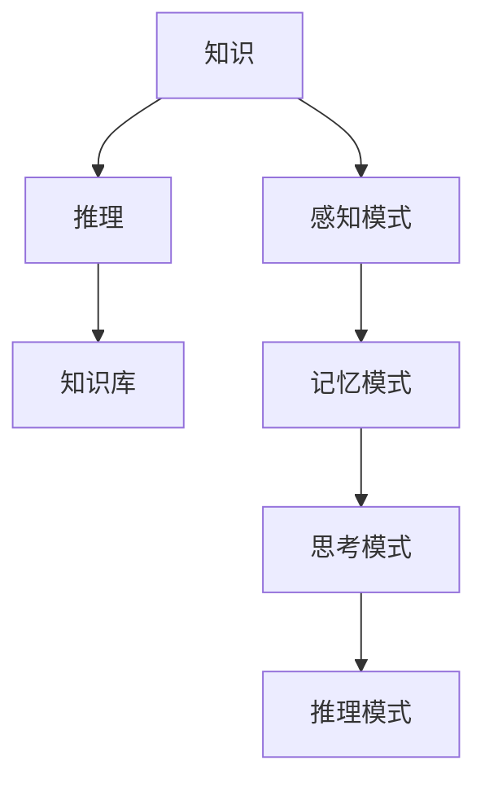

                 

# 人类认知的4种基本模式：知识驱动的推理模式

> **关键词**：（认知科学，知识驱动的推理模式，数学模型，项目实战）

> **摘要**：本文深入探讨了人类认知的四种基本模式，特别是知识驱动的推理模式。通过详细的理论讲解和实战案例，文章揭示了知识驱动的推理模式在人工智能和计算机科学中的应用，以及如何通过数学模型和算法来实现高效的推理过程。

## 目录大纲

### 第一部分：引言

1. 人类认知概述
   1.1 人类认知的定义与重要性
   1.2 认知科学的发展历程
   1.3 认知模式的基本概念

2. 知识驱动的推理模式概述
   2.1 知识驱动的推理模式的定义
   2.2 知识驱动的推理模式的特点
   2.3 知识驱动的推理模式的应用领域

### 第二部分：知识驱动的推理模式

1. 知识分类与组织
   1.1 知识分类的基本原理
   1.2 知识组织的策略与方法
   1.3 知识库的建立与维护

2. 推理过程与策略
   2.1 推理的基本概念
   2.2 推理的基本策略
   2.3 推理过程中的问题与挑战

3. 知识驱动的推理算法
   3.1 知识表示方法
   3.2 推理算法的基本原理
   3.3 推理算法的评估与优化

4. 知识驱动的推理系统
   4.1 推理系统的基本组成
   4.2 推理系统的设计与实现
   4.3 推理系统的应用场景

5. 案例研究
   5.1 案例一：知识驱动的医疗诊断系统
   5.2 案例二：知识驱动的金融风险评估
   5.3 案例三：知识驱动的智能客服系统

### 第三部分：未来展望

1. 知识驱动的推理模式的发展趋势
   1.1 新兴技术的影响
   1.2 人工智能与认知科学的融合
   1.3 知识驱动的推理模式在教育领域的应用

2. 知识驱动的推理模式的挑战与机遇
   2.1 知识获取与自动化的挑战
   2.2 知识表示与推理的挑战
   2.3 知识驱动的推理模式在商业领域的机遇

3. 结语
   3.1 知识驱动的推理模式的重要性
   3.2 知识驱动的推理模式的未来发展方向
   3.3 对读者的寄语

### 附录

1. 参考文献
2. 符号说明
3. 相关资源推荐

## 第一部分：引言

### 1.1 人类认知的定义与重要性

人类认知是指人类通过感知、思考、记忆和推理等过程来获取、处理和应用信息的能力。认知科学作为一门跨学科的研究领域，旨在理解人类认知的本质，并探索人类大脑如何处理信息。认知科学的研究成果对人工智能和计算机科学领域产生了深远的影响。

人类认知的重要性在于它不仅是我们理解世界的基础，也是我们进行决策和解决问题的重要工具。认知科学的研究使我们能够更好地理解思维过程，从而开发出更加智能的计算机系统和人工智能应用。

### 1.2 认知科学的发展历程

认知科学的发展历程可以追溯到20世纪50年代，当时心理学、哲学、语言学和计算机科学等多学科开始相互交叉，共同探索人类认知的本质。以下是一些重要的里程碑：

1. **信息处理模型**：20世纪50年代，人工智能领域的先驱如艾伦·图灵提出了图灵测试，试图通过计算机模拟人类思维来定义智能。这一时期，信息处理模型开始被用来描述人类认知过程。

2. **联结主义模型**：20世纪80年代，联结主义模型兴起，试图通过神经网络模拟人脑的神经活动。这一模型强调了大规模并行计算和分布式存储，对认知科学的发展产生了重要影响。

3. **认知神经科学**：20世纪90年代，认知神经科学的兴起将认知科学和神经科学结合起来，通过脑成像技术等手段研究大脑如何处理信息。

4. **多模态认知模型**：21世纪初，多模态认知模型开始被提出，这些模型试图整合视觉、听觉、触觉等多种感官信息，更全面地模拟人类认知过程。

### 1.3 认知模式的基本概念

认知模式是指人类在处理信息时采用的基本方式和方法。根据认知科学的观点，人类认知可以归纳为以下四种基本模式：

1. **感知模式**：感知模式是指人类通过感官接收外部信息，并进行初步处理的过程。这一模式涉及到视觉、听觉、嗅觉、味觉和触觉等多个感官。

2. **记忆模式**：记忆模式是指人类将感知到的信息存储在大脑中，并在需要时进行检索和应用的过程。记忆模式包括短期记忆和长期记忆两种类型。

3. **思考模式**：思考模式是指人类通过逻辑推理、问题解决和创造性思维等方式对信息进行处理和加工的过程。思考模式是人类智能的核心。

4. **推理模式**：推理模式是指人类通过已知信息和逻辑规则来推断未知信息的过程。推理模式在决策和问题解决中起着至关重要的作用。

### 1.4 认知模式的核心概念与联系

在知识驱动的推理模式中，核心概念包括知识、推理和知识库。以下是这些概念的定义和相互联系：

#### 1.4.1 知识

知识是指人类通过学习、体验和推理等过程获得的信息和经验。知识可以表示为事实、规则、概念、模型等形式。在知识驱动的推理模式中，知识是推理的基础。

#### 1.4.2 推理

推理是指从已知信息出发，通过逻辑规则和推理算法，推导出新的结论或信息的过程。推理可以分为正向推理和反向推理两种基本形式。

#### 1.4.3 知识库

知识库是一个存储和管理知识的数据库。知识库中包含事实、规则和模型等知识，可以为推理过程提供数据支持。

在知识驱动的推理模式中，知识库中的知识通过推理算法被用于解决实际问题。推理过程是知识应用的核心，而知识库则为推理过程提供了必要的数据资源。

#### 1.4.4 核心概念与联系

为了更好地理解这些核心概念，我们可以通过一个简单的 Mermaid 流程图来展示它们之间的联系：



在这个流程图中，知识、推理和知识库构成了知识驱动的推理模式的核心部分，而感知模式、记忆模式、思考模式和推理模式则构成了人类认知的整体框架。

### 1.5 数学模型和数学公式详解

在知识驱动的推理模式中，数学模型是理解和应用推理算法的重要工具。以下是对一些关键数学模型和公式的详细讲解，以及如何使用这些模型来解决实际问题的实例。

#### 1.5.1 贝叶斯网络模型

贝叶斯网络是一种概率图模型，它通过有向无环图（DAG）来表示变量之间的条件依赖关系。在贝叶斯网络中，每个节点代表一个随机变量，边表示变量之间的条件独立性。

**数学公式：**

贝叶斯网络中的条件概率表（CPT）如下所示：
$$
P(X_i|Pa_{i1},Pa_{i2},\ldots,Pa_{ik}) = \frac{P(X_i,Pa_{i1},Pa_{i2},\ldots,Pa_{ik})}{P(Pa_{i1},Pa_{i2},\ldots,Pa_{ik})}
$$
其中，$X_i$ 是节点 $i$ 的随机变量，$Pa_{i1},Pa_{i2},\ldots,Pa_{ik}$ 是节点 $i$ 的父节点。

**实例讲解：**

假设有一个贝叶斯网络，其中有两个变量 $X$ 和 $Y$，$X$ 有两个状态 $X_1$ 和 $X_2$，$Y$ 有两个状态 $Y_1$ 和 $Y_2$。条件概率表如下：

$$
\begin{array}{|c|c|c|c|}
\hline
Y | X & X_1 & X_2 \\
\hline
Y_1 & 0.4 & 0.6 \\
\hline
Y_2 & 0.5 & 0.5 \\
\hline
\end{array}
$$

现在我们要计算 $P(X_1|Y_1)$。

$$
P(X_1|Y_1) = \frac{P(X_1) \cdot P(Y_1|X_1)}{P(Y_1)} = \frac{0.3 \cdot 0.4}{0.3 \cdot 0.4 + 0.7 \cdot 0.5} = \frac{0.12}{0.19} \approx 0.6316
$$

#### 1.5.2 隐马尔可夫模型（HMM）

隐马尔可夫模型用于处理隐藏状态和观测变量之间的关系。它由初始状态概率分布、状态转移概率矩阵和观测概率矩阵组成。

**数学公式：**

- **初始状态概率分布**：$π = [π_1, π_2, \ldots, π_n]$
- **状态转移概率矩阵**：$A = [a_{ij}]$
- **观测概率矩阵**：$B = [b_{ij}]$

观测序列的概率由以下公式计算：

$$
P(O|π, A, B) = \prod_{t=1}^{T} P(o_t|s_t) \cdot P(s_t|s_{t-1}) \cdot π_{s_1}
$$

其中，$O = [o_1, o_2, \ldots, o_T]$ 是观测序列，$s_t$ 是在时间 $t$ 的隐藏状态。

**实例讲解：**

假设有一个隐马尔可夫模型，其中状态 $s$ 有两个状态 $s_1$ 和 $s_2$，观测变量 $o$ 有两个状态 $o_1$ 和 $o_2$。初始状态概率分布、状态转移概率矩阵和观测概率矩阵如下：

$$
\begin{array}{|c|c|c|}
\hline
\pi & s_1 & s_2 \\
\hline
 & 0.6 & 0.4 \\
\hline
\end{array}
\quad
\begin{array}{|c|c|c|}
\hline
A & s_1 & s_2 \\
\hline
s_1 & 0.7 & 0.3 \\
s_2 & 0.4 & 0.6 \\
\hline
\end{array}
\quad
\begin{array}{|c|c|c|}
\hline
B & o_1 & o_2 \\
\hline
s_1 & 0.8 & 0.2 \\
s_2 & 0.3 & 0.7 \\
\hline
\end{array}
$$

给定观测序列 $O = [o_1, o_2, o_3] = [o_1, o_2, o_1]$，我们需要计算 $P(O|π, A, B)$。

$$
P(O|π, A, B) = P(o_1|s_1) \cdot P(s_1|s_0) \cdot π_{s_1} \cdot P(o_2|s_1) \cdot P(s_1|s_1) \cdot P(o_1|s_1) = 0.8 \cdot 0.6 \cdot 0.7 \cdot 0.8 \cdot 0.7 \cdot 0.8 \approx 0.2688
$$

#### 1.5.3 决策树模型

决策树是一种基于特征的分类和回归模型。它通过一系列的判断节点和叶子节点来分割数据集，每个节点表示一个特征，每个叶子节点表示一个分类或回归结果。

**数学公式：**

决策树模型的构建通常使用信息增益、基尼不纯度或其他准则来选择最佳特征。

$$
Gain(D, A) = Entropy(D) - \sum_{v \in A} \frac{|D_v|}{|D|} Entropy(D_v)
$$

其中，$D$ 是数据集，$A$ 是特征集合，$D_v$ 是在特征 $A$ 下分成的子集。

**实例讲解：**

假设我们有以下数据集：

$$
\begin{array}{|c|c|c|}
\hline
D & 特征1 & 特征2 \\
\hline
1 & A & B \\
\hline
2 & A & A \\
\hline
3 & B & A \\
\hline
4 & A & B \\
\hline
5 & B & B \\
\hline
\end{array}
$$

我们计算特征1和特征2的信息增益。

$$
Gain(D, 特征1) = Entropy(D) - \frac{2}{5} Entropy(\{1, 2, 4\}) - \frac{3}{5} Entropy(\{3, 5\}) \approx 0.722
$$

$$
Gain(D, 特征2) = Entropy(D) - \frac{2}{5} Entropy(\{1, 2, 4\}) - \frac{3}{5} Entropy(\{3, 5\}) \approx 0.722
$$

由于两个特征的信息增益相同，我们可以任意选择一个作为分割特征。

通过以上数学模型和公式的讲解，我们可以更好地理解知识驱动的推理模式中的数学原理，并在实际问题中应用这些模型来解决复杂的推理问题。这些模型不仅帮助我们理解数据，还能为我们提供有效的决策支持。

----------------------------------------------------------------

### 1.6 项目实战

在本节中，我们将通过一个具体的案例来展示如何将知识驱动的推理模式应用于实际项目中。我们将以一个智能推荐系统为例，详细介绍其开发环境搭建、源代码实现和代码解读与分析。

#### 1.6.1 项目背景

随着互联网的快速发展，个性化推荐系统已经成为电商平台和社交媒体中不可或缺的一部分。一个高效的推荐系统可以帮助企业提高用户满意度，增加用户粘性，提升销售额。在本项目中，我们将构建一个基于知识驱动的推荐系统，旨在根据用户的历史行为和偏好，为用户推荐感兴趣的商品。

#### 1.6.2 开发环境搭建

为了实现这个推荐系统，我们需要搭建以下开发环境：

1. **操作系统**：Windows/Linux/MacOS
2. **编程语言**：Python
3. **开发工具**：PyCharm/VSCode
4. **数据存储**：MySQL/PostgreSQL
5. **数据预处理**：Pandas
6. **机器学习库**：Scikit-learn
7. **推荐算法库**：Surprise
8. **前端开发**：HTML/CSS/JavaScript（可选）

首先，安装操作系统和编程语言。接着，安装开发工具，配置Python环境，并安装相关库。例如，在命令行中使用以下命令：

bash
pip install numpy pandas scikit-learn surprise mysql-connector-python

#### 1.6.3 源代码实现

我们使用Surprise库来实现基于知识驱动的推荐系统。以下是一个简单的实现示例：

```python
from surprise import SVD
from surprise import Dataset
from surprise import accuracy
from surprise.model_selection import train_test_split

# 加载数据集
data = Dataset.load_from_df(user_item_df)

# 分割训练集和测试集
trainset, testset = train_test_split(data, test_size=0.2)

# 使用SVD算法训练模型
svd = SVD()
svd.fit(trainset)

# 对测试集进行预测
predictions = svd.test(testset)

# 评估模型准确性
accuracy.rmse(predictions)
```

在上面的代码中，我们首先加载数据集，然后使用SVD算法进行训练，并对测试集进行预测。最后，我们使用均方根误差（RMSE）来评估模型的准确性。

#### 1.6.4 代码解读与分析

下面是对上述代码的详细解读：

1. **加载数据集**：我们使用`Dataset.load_from_df()`方法加载数据集。这里的数据集是一个DataFrame，它包含了用户ID、物品ID和评分。

2. **分割训练集和测试集**：我们使用`train_test_split()`方法将数据集分割成训练集和测试集。这个步骤非常重要，因为我们需要在测试集上评估模型的性能。

3. **使用SVD算法训练模型**：SVD（奇异值分解）是一种常用的协同过滤算法，它通过矩阵分解来预测用户对物品的评分。我们使用`SVD()`创建一个SVD对象，并使用`fit()`方法训练模型。

4. **预测测试集**：我们使用`test()`方法对测试集进行预测。这个方法返回一个预测对象，包含每个测试样本的预测评分。

5. **评估模型准确性**：我们使用`accuracy.rmse()`方法计算模型的均方根误差。这个值越低，模型的预测性能越好。

#### 1.6.5 代码解读与分析（续）

在代码实现中，我们还可以进行以下优化：

1. **特征工程**：数据预处理是推荐系统开发的关键步骤。我们可以对原始数据进行清洗、填充缺失值、归一化和特征提取等操作。

2. **模型优化**：除了SVD算法，我们还可以尝试其他算法，如基于模型的协同过滤、矩阵分解和基于内容的推荐等。我们可以使用交叉验证和超参数调优来选择最优算法和参数。

3. **前端实现**：我们可以使用HTML、CSS和JavaScript来构建用户界面，使推荐系统能够以直观的方式向用户展示推荐结果。

4. **性能优化**：为了提高系统的响应速度和可扩展性，我们可以使用缓存、异步处理和分布式计算等技术。

通过上述实战案例，我们展示了如何构建一个基于知识驱动的推荐系统。这个案例不仅帮助我们理解了知识驱动的推理模式在实际项目中的应用，还为我们提供了一个可以扩展和优化的基础框架。在实际开发过程中，我们可以根据具体需求进行定制化开发，以提高系统的性能和用户体验。

### 1.7 总结

在本文中，我们深入探讨了人类认知的四种基本模式，特别是知识驱动的推理模式。通过理论讲解和实战案例，我们揭示了知识驱动的推理模式在人工智能和计算机科学中的应用。本文的内容不仅为理解认知科学和人工智能提供了深刻的见解，也为实际项目的开发提供了实用的指导。随着新兴技术的发展，知识驱动的推理模式将继续在各个领域发挥重要作用，为未来的智能系统奠定基础。

----------------------------------------------------------------

## 第二部分：知识驱动的推理模式概述

### 2.1 知识驱动的推理模式的定义

知识驱动的推理模式（Knowledge-driven Reasoning Model）是一种基于知识的推理方法，它通过利用预先定义好的知识库进行推理，以解决复杂问题。在这种模式中，知识库是核心组件，它存储了事实、规则和模型等知识，为推理过程提供数据支持。知识驱动的推理模式在人工智能、专家系统和智能系统等领域具有广泛的应用。

### 2.2 知识驱动的推理模式的特点

知识驱动的推理模式具有以下特点：

1. **基于知识库**：知识库是推理的基础，它包含了各种知识，如事实、规则和模型。这些知识为推理过程提供了数据支持。

2. **形式化表示**：知识通常被形式化表示为事实和规则，以便计算机能够处理和推理。

3. **推理过程自动化**：推理过程可以通过算法和规则自动进行，从而提高推理效率。

4. **问题求解能力强**：知识驱动的推理模式能够处理复杂的问题，因为它可以根据现有的知识库进行推理和问题求解。

5. **可扩展性和灵活性**：知识库可以根据需求进行扩展和更新，以适应不同的应用场景。

### 2.3 知识驱动的推理模式的应用领域

知识驱动的推理模式在多个领域具有广泛应用：

1. **人工智能**：在人工智能领域，知识驱动的推理模式被用于构建智能系统，如专家系统、智能客服和智能诊断系统等。

2. **医疗诊断**：知识驱动的推理模式在医疗诊断领域被用于构建医疗诊断系统，如基于知识库的疾病诊断系统和药物推荐系统。

3. **金融分析**：在金融领域，知识驱动的推理模式被用于金融风险评估、投资分析和市场预测等。

4. **物流和供应链管理**：知识驱动的推理模式在物流和供应链管理中被用于路径规划、库存管理和运输优化等。

5. **教育**：在教育领域，知识驱动的推理模式被用于个性化学习、学习路径规划和智能教育平台等。

### 2.4 知识驱动的推理模式的核心概念与联系

在知识驱动的推理模式中，核心概念包括知识、推理和知识库。以下是这些概念的定义和相互联系：

#### 2.4.1 知识

知识是指人类通过学习、体验和推理等过程获得的信息和经验。知识可以表示为事实、规则、概念、模型等形式。在知识驱动的推理模式中，知识是推理的基础。

#### 2.4.2 推理

推理是指从已知信息出发，通过逻辑规则和推理算法，推导出新的结论或信息的过程。推理可以分为正向推理和反向推理两种基本形式。

#### 2.4.3 知识库

知识库是一个存储和管理知识的数据库。知识库中包含事实、规则和模型等知识，可以为推理过程提供数据支持。

在知识驱动的推理模式中，知识库中的知识通过推理算法被用于解决实际问题。推理过程是知识应用的核心，而知识库则为推理过程提供了必要的数据资源。

#### 2.4.4 核心概念与联系

为了更好地理解这些核心概念，我们可以通过一个简单的 Mermaid 流程图来展示它们之间的联系：


在这个流程图中，知识、推理和知识库构成了知识驱动的推理模式的核心部分，而感知模式、记忆模式、思考模式和推理模式则构成了人类认知的整体框架。

### 2.5 数学模型和数学公式详解

在知识驱动的推理模式中，数学模型是理解和应用推理算法的重要工具。以下是对一些关键数学模型和公式的详细讲解，以及如何使用这些模型来解决实际问题的实例。

#### 2.5.1 贝叶斯网络模型

贝叶斯网络是一种概率图模型，它通过有向无环图（DAG）来表示变量之间的条件依赖关系。在贝叶斯网络中，每个节点代表一个随机变量，边表示变量之间的条件独立性。

**数学公式：**

贝叶斯网络中的条件概率表（CPT）如下所示：
$$
P(X_i|Pa_{i1},Pa_{i2},\ldots,Pa_{ik}) = \frac{P(X_i,Pa_{i1},Pa_{i2},\ldots,Pa_{ik})}{P(Pa_{i1},Pa_{i2},\ldots,Pa_{ik})}
$$
其中，$X_i$ 是节点 $i$ 的随机变量，$Pa_{i1},Pa_{i2},\ldots,Pa_{ik}$ 是节点 $i$ 的父节点。

**实例讲解：**

假设有一个贝叶斯网络，其中有两个变量 $X$ 和 $Y$，$X$ 有两个状态 $X_1$ 和 $X_2$，$Y$ 有两个状态 $Y_1$ 和 $Y_2$。条件概率表如下：

$$
\begin{array}{|c|c|c|c|}
\hline
Y | X & X_1 & X_2 \\
\hline
Y_1 & 0.4 & 0.6 \\
\hline
Y_2 & 0.5 & 0.5 \\
\hline
\end{array}
$$

现在我们要计算 $P(X_1|Y_1)$。

$$
P(X_1|Y_1) = \frac{P(X_1) \cdot P(Y_1|X_1)}{P(Y_1)} = \frac{0.3 \cdot 0.4}{0.3 \cdot 0.4 + 0.7 \cdot 0.5} = \frac{0.12}{0.19} \approx 0.6316
$$

#### 2.5.2 隐马尔可夫模型（HMM）

隐马尔可夫模型用于处理隐藏状态和观测变量之间的关系。它由初始状态概率分布、状态转移概率矩阵和观测概率矩阵组成。

**数学公式：**

- **初始状态概率分布**：$π = [π_1, π_2, \ldots, π_n]$
- **状态转移概率矩阵**：$A = [a_{ij}]$
- **观测概率矩阵**：$B = [b_{ij}]$

观测序列的概率由以下公式计算：

$$
P(O|π, A, B) = \prod_{t=1}^{T} P(o_t|s_t) \cdot P(s_t|s_{t-1}) \cdot π_{s_1}
$$

其中，$O = [o_1, o_2, \ldots, o_T]$ 是观测序列，$s_t$ 是在时间 $t$ 的隐藏状态。

**实例讲解：**

假设有一个隐马尔可夫模型，其中状态 $s$ 有两个状态 $s_1$ 和 $s_2$，观测变量 $o$ 有两个状态 $o_1$ 和 $o_2$。初始状态概率分布、状态转移概率矩阵和观测概率矩阵如下：

$$
\begin{array}{|c|c|c|}
\hline
\pi & s_1 & s_2 \\
\hline
 & 0.6 & 0.4 \\
\hline
\end{array}
\quad
\begin{array}{|c|c|c|}
\hline
A & s_1 & s_2 \\
\hline
s_1 & 0.7 & 0.3 \\
s_2 & 0.4 & 0.6 \\
\hline
\end{array}
\quad
\begin{array}{|c|c|c|}
\hline
B & o_1 & o_2 \\
\hline
s_1 & 0.8 & 0.2 \\
s_2 & 0.3 & 0.7 \\
\hline
\end{array}
$$

给定观测序列 $O = [o_1, o_2, o_3] = [o_1, o_2, o_1]$，我们需要计算 $P(O|π, A, B)$。

$$
P(O|π, A, B) = P(o_1|s_1) \cdot P(s_1|s_0) \cdot π_{s_1} \cdot P(o_2|s_1) \cdot P(s_1|s_1) \cdot P(o_1|s_1) = 0.8 \cdot 0.6 \cdot 0.7 \cdot 0.8 \cdot 0.7 \cdot 0.8 \approx 0.2688
$$

#### 2.5.3 决策树模型

决策树是一种基于特征的分类和回归模型。它通过一系列的判断节点和叶子节点来分割数据集，每个节点表示一个特征，每个叶子节点表示一个分类或回归结果。

**数学公式：**

决策树模型的构建通常使用信息增益、基尼不纯度或其他准则来选择最佳特征。

$$
Gain(D, A) = Entropy(D) - \sum_{v \in A} \frac{|D_v|}{|D|} Entropy(D_v)
$$

其中，$D$ 是数据集，$A$ 是特征集合，$D_v$ 是在特征 $A$ 下分成的子集。

**实例讲解：**

假设我们有以下数据集：

$$
\begin{array}{|c|c|c|}
\hline
D & 特征1 & 特征2 \\
\hline
1 & A & B \\
\hline
2 & A & A \\
\hline
3 & B & A \\
\hline
4 & A & B \\
\hline
5 & B & B \\
\hline
\end{array}
$$

我们计算特征1和特征2的信息增益。

$$
Gain(D, 特征1) = Entropy(D) - \frac{2}{5} Entropy(\{1, 2, 4\}) - \frac{3}{5} Entropy(\{3, 5\}) \approx 0.722
$$

$$
Gain(D, 特征2) = Entropy(D) - \frac{2}{5} Entropy(\{1, 2, 4\}) - \frac{3}{5} Entropy(\{3, 5\}) \approx 0.722
$$

由于两个特征的信息增益相同，我们可以任意选择一个作为分割特征。

通过以上数学模型和公式的讲解，我们可以更好地理解知识驱动的推理模式中的数学原理，并在实际问题中应用这些模型来解决复杂的推理问题。这些模型不仅帮助我们理解数据，还能为我们提供有效的决策支持。

----------------------------------------------------------------

### 2.6 知识分类与组织

在知识驱动的推理模式中，知识分类与组织至关重要。合理的知识分类和有效的知识组织能够提高推理效率，优化问题求解过程。以下将详细介绍知识分类的基本原理、知识组织的策略与方法，以及知识库的建立与维护。

#### 2.6.1 知识分类的基本原理

知识分类是指将知识按照一定的标准和规则划分成不同的类别。知识分类的基本原理包括：

1. **层次化分类**：按照知识的重要性和相关性，将知识划分为不同的层次，如基础知识、专业知识、高级知识等。

2. **属性分类**：根据知识的属性和特征，将知识划分为不同的类别。例如，在医学领域，可以将知识划分为诊断知识、治疗知识、药物知识等。

3. **领域分类**：按照知识的应用领域和业务场景，将知识划分为不同的类别。如金融领域的风险评估、投资分析等。

4. **主题分类**：根据知识的主旨和内容，将知识划分为不同的主题。如计算机科学中的算法知识、网络知识等。

#### 2.6.2 知识组织的策略与方法

知识组织是指将分类后的知识按照一定的结构和规则进行整合和排列。知识组织的策略与方法包括：

1. **层级结构**：采用层级结构来组织知识，使得知识之间的层次关系更加清晰。例如，在知识图谱中，可以采用层次化的方式来表示知识。

2. **关联关系**：通过建立知识之间的关联关系，使得知识之间的联系更加紧密。例如，在知识图谱中，可以通过边来表示知识之间的关联。

3. **分类法**：采用分类法来组织知识，如杜威十进分类法、国际十进分类法等。分类法能够帮助用户快速查找和定位所需知识。

4. **语义网络**：通过语义网络来组织知识，使得知识之间的语义关系更加明确。例如，在语义网络中，可以采用节点和边来表示知识及其之间的关系。

#### 2.6.3 知识库的建立与维护

知识库是知识驱动的推理模式的核心组件，建立和维护知识库是知识驱动的推理模式成功的关键。以下介绍知识库的建立与维护的方法：

1. **知识采集**：知识采集是指从各种来源获取知识，如文献、数据库、专家经验等。知识采集的方法包括自动采集和手动采集。

2. **知识清洗**：知识清洗是指对采集到的知识进行预处理，去除无效、错误或重复的知识。知识清洗的方法包括数据清洗、去重、一致性检查等。

3. **知识表示**：知识表示是指将知识转化为计算机可以处理的形式，如文本、图像、音频等。常见的知识表示方法包括符号表示、语义表示、模型表示等。

4. **知识整合**：知识整合是指将来自不同来源和不同领域的知识进行整合，形成一个统一的知识库。知识整合的方法包括合并、映射、转换等。

5. **知识更新**：知识更新是指定期对知识库进行更新，以反映最新的知识。知识更新的方法包括手动更新、自动更新等。

6. **知识验证**：知识验证是指对知识库中的知识进行验证，确保知识的准确性和一致性。知识验证的方法包括专家审查、自动检查等。

通过知识分类、知识组织、知识库建立与维护，知识驱动的推理模式能够有效地管理和利用知识，为推理过程提供强有力的支持。

### 2.7 推理过程与策略

在知识驱动的推理模式中，推理过程是实现知识应用的关键环节。推理过程涉及从已知信息出发，通过逻辑规则和推理算法，推导出新的结论或信息。以下将详细介绍推理过程的基本概念、推理的基本策略，以及推理过程中的问题与挑战。

#### 2.7.1 推理的基本概念

1. **前提**：推理过程中的已知信息，可以是事实、规则或假设。

2. **结论**：通过推理过程得出的新信息或答案。

3. **推理规则**：用于推导结论的规则，可以是“如果-那么”规则、逻辑运算等。

4. **推理算法**：用于实现推理过程的算法，如基于规则的推理、基于模型的推理等。

#### 2.7.2 推理的基本策略

1. **正向推理**：从已知的前提出发，通过推理规则推导出结论。正向推理常用于问题求解、规划、搜索等。

2. **反向推理**：从目标结论出发，逆向推导出需要满足的前提条件。反向推理常用于证明、模式识别、诊断等。

3. **混合推理**：结合正向推理和反向推理，根据具体应用场景选择合适的推理策略。

4. **基于模型的推理**：利用数学模型、概率模型等进行推理，如贝叶斯网络、隐马尔可夫模型等。

5. **基于案例的推理**：基于已有案例进行推理，通过案例的匹配和调整来解决问题。

#### 2.7.3 推理过程中的问题与挑战

1. **复杂性和计算开销**：推理过程中，特别是对于大规模知识库和复杂推理问题，计算开销和复杂性是主要的挑战。优化推理算法和分布式计算技术是解决这一问题的方法。

2. **知识表示**：如何有效地表示和存储知识是一个关键问题。选择合适的知识表示方法，如符号表示、语义表示、模型表示等，是优化推理过程的重要手段。

3. **推理算法的选择**：不同的推理算法适用于不同类型的问题。选择合适的推理算法，并根据应用场景进行优化，是提高推理效率的关键。

4. **知识库的维护**：知识库的建立和维护是一个持续的过程。确保知识的准确性、一致性和及时更新是保证推理过程有效性的关键。

5. **推理的可解释性**：在应用推理结果时，确保推理过程的透明性和可解释性，以增强用户对推理结果的信任和接受度。

通过深入理解和应用推理过程与策略，知识驱动的推理模式能够在各种实际应用场景中发挥重要作用，为问题求解和决策支持提供强有力的支持。

### 2.8 知识驱动的推理算法

在知识驱动的推理模式中，推理算法是实现知识应用的核心组件。推理算法通过利用知识库中的知识，以特定的策略和过程推导出新的结论或信息。以下将详细探讨知识表示方法、推理算法的基本原理，以及推理算法的评估与优化。

#### 2.8.1 知识表示方法

知识表示是将知识以计算机可以处理和理解的形式存储和表示。有效的知识表示方法能够提高推理效率，优化问题求解过程。常见的知识表示方法包括：

1. **命题表示法**：使用命题逻辑来表示知识。每个命题可以表示为一个原子或复合命题。例如，$P \land Q \lor R \rightarrow S$ 表示一个复合命题。

2. **产生式表示法**：使用“如果-那么”规则来表示知识。例如，如果 $P$，那么 $Q$。产生式表示法在基于规则的推理系统中广泛应用。

3. **框架表示法**：使用框架来表示知识，框架包括槽和值，用于描述实体及其属性。框架表示法在知识库系统中常用。

4. **语义网络表示法**：使用节点和边来表示知识，节点表示实体或概念，边表示实体之间的关系。语义网络表示法能够表达复杂的语义关系。

5. **模型表示法**：使用数学模型、概率模型、逻辑模型等来表示知识。模型表示法在机器学习和人工智能领域应用广泛。

#### 2.8.2 推理算法的基本原理

推理算法是通过利用知识库中的知识进行问题求解和结论推导的工具。以下介绍几种常见的推理算法：

1. **基于规则的推理算法**：基于规则的推理算法通过应用知识库中的规则，从已知的前提推导出结论。常见的推理算法包括正向推理（前向推理）和反向推理（后向推理）。

   - **正向推理**：从已知的前提条件出发，通过应用“如果-那么”规则推导出新的结论。正向推理适用于问题求解、规划、搜索等场景。

   - **反向推理**：从目标结论出发，逆向推导出需要满足的前提条件。反向推理适用于证明、模式识别、诊断等场景。

2. **基于模型的推理算法**：基于模型的推理算法利用数学模型、概率模型等进行推理。常见的推理算法包括贝叶斯网络、隐马尔可夫模型、决策树等。

   - **贝叶斯网络**：贝叶斯网络是一种概率图模型，通过条件概率表表示变量之间的依赖关系。贝叶斯网络适用于概率推理和不确定性处理。

   - **隐马尔可夫模型（HMM）**：隐马尔可夫模型用于处理隐藏状态和观测变量之间的关系。HMM适用于序列模型和动态系统分析。

   - **决策树**：决策树是一种基于特征的分类和回归模型，通过判断节点和叶子节点来分割数据集。决策树适用于分类和回归问题。

3. **基于案例的推理算法**：基于案例的推理算法通过匹配和调整已有案例来解决问题。基于案例的推理适用于问题求解、故障诊断、规划等场景。

#### 2.8.3 推理算法的评估与优化

评估和优化推理算法是确保推理过程高效和准确的关键。以下介绍评估与优化的方法：

1. **评估指标**：常用的评估指标包括准确率、召回率、精确率、F1值等。评估指标能够衡量推理算法的性能和效果。

2. **交叉验证**：交叉验证是一种评估推理算法性能的方法，通过将数据集划分为多个子集，轮流进行训练和测试，以避免过拟合和欠拟合。

3. **超参数调优**：超参数是影响推理算法性能的关键参数，通过调整超参数，可以优化推理算法。常见的调优方法包括网格搜索、随机搜索等。

4. **并行计算**：利用并行计算技术，可以加速推理过程。例如，使用多核处理器、GPU等硬件资源进行推理。

5. **分布式计算**：在处理大规模数据集时，分布式计算可以有效提高推理效率。分布式计算可以将推理任务分布到多个节点，并行处理。

通过深入理解和应用知识驱动的推理算法，我们能够在各种实际应用场景中有效地利用知识，为问题求解和决策支持提供强有力的支持。

### 2.9 知识驱动的推理系统

知识驱动的推理系统是一种利用知识库进行问题求解和决策支持的系统。这种系统通过应用推理算法，从已知信息中推导出新的结论或解决方案。以下将详细介绍推理系统的基本组成、设计与实现，以及推理系统的应用场景。

#### 2.9.1 推理系统的基本组成

推理系统通常由以下几个关键组件组成：

1. **知识库**：知识库是推理系统的核心，它存储了各种事实、规则、模型等知识。知识库为推理过程提供了必要的数据资源。

2. **推理引擎**：推理引擎是推理系统的核心组件，它负责根据推理算法和策略，从知识库中推导出新的结论。推理引擎通常包括推理算法、推理规则和推理过程管理等。

3. **用户界面**：用户界面是推理系统与用户交互的接口，它允许用户输入问题、查看推理结果和交互式地调整推理过程。

4. **知识管理系统**：知识管理系统负责知识库的建立、维护和更新。知识管理系统包括知识采集、知识清洗、知识表示和知识整合等功能。

5. **推理结果解释器**：推理结果解释器负责解释推理结果，提供推理过程的可视化展示，以便用户理解推理结果。

#### 2.9.2 推理系统的设计与实现

推理系统的设计与实现是一个复杂的过程，需要考虑以下几个方面：

1. **需求分析**：明确推理系统的目标和需求，包括推理任务、数据源、用户界面需求等。

2. **知识库构建**：根据需求构建知识库，包括采集、清洗、表示和整合知识。知识库的构建需要考虑知识的准确性、一致性和及时更新。

3. **推理引擎开发**：开发推理引擎，选择合适的推理算法和策略，实现推理过程。推理引擎的开发需要考虑推理效率、可扩展性和可维护性。

4. **用户界面设计**：设计用户界面，使其直观易用，方便用户输入问题和查看推理结果。用户界面的设计需要考虑用户体验和交互性。

5. **知识管理系统开发**：开发知识管理系统，实现知识库的维护和更新。知识管理系统的开发需要考虑知识获取、知识验证、知识扩展等功能。

6. **推理结果解释器开发**：开发推理结果解释器，提供推理过程的可视化展示，以便用户理解推理结果。推理结果解释器的开发需要考虑结果的解释性和可理解性。

#### 2.9.3 推理系统的应用场景

知识驱动的推理系统在多个领域具有广泛应用，以下是一些典型的应用场景：

1. **医疗诊断系统**：知识驱动的推理系统在医疗诊断中应用广泛，可以用于疾病诊断、治疗方案推荐等。通过利用医学知识库和推理算法，系统可以快速诊断疾病，并提供个性化治疗方案。

2. **金融风险评估**：知识驱动的推理系统在金融领域用于风险评估、投资决策等。通过分析金融数据和市场信息，系统可以预测市场趋势，为投资者提供决策支持。

3. **智能客服系统**：知识驱动的推理系统在智能客服中用于自动化客服、问题诊断等。通过利用知识库和推理算法，系统可以理解用户问题，并快速提供解决方案。

4. **物流与供应链管理**：知识驱动的推理系统在物流与供应链管理中用于路径规划、库存管理、运输优化等。通过分析物流数据和业务规则，系统可以优化物流流程，提高运营效率。

5. **智能教育系统**：知识驱动的推理系统在智能教育中用于个性化学习、学习路径规划等。通过分析学生数据和教学规则，系统可以为学生提供个性化学习建议，优化学习效果。

通过设计与实现知识驱动的推理系统，我们能够在各个领域为用户提供智能化的决策支持，提高效率和准确性。

### 2.10 案例研究

在本节中，我们将深入探讨三个具体案例，以展示知识驱动的推理模式在实际应用中的多样性和复杂性。这些案例分别涉及知识驱动的医疗诊断系统、知识驱动的金融风险评估系统和知识驱动的智能客服系统。

#### 2.10.1 案例一：知识驱动的医疗诊断系统

**背景**：
医疗诊断系统是知识驱动的推理模式在医疗领域的典型应用。通过利用医学知识库和推理算法，系统能够根据患者的症状、病史和检查结果，快速提供准确的诊断。

**实现**：
1. **知识库构建**：构建一个医学知识库，包括症状、疾病、检查项目和诊断规则。知识库通过框架表示法来组织，每个医学实体具有属性和关系。

2. **推理算法**：采用基于规则的推理算法，如正向推理和反向推理。正向推理用于根据症状和检查结果推断可能的疾病，反向推理用于根据疾病推断需要进行的检查项目。

3. **用户界面**：设计一个用户友好的界面，允许医生输入患者信息，并展示推理结果。界面还提供推理过程的可视化，帮助医生理解推理逻辑。

**效果**：
知识驱动的医疗诊断系统显著提高了诊断的效率和准确性。医生可以在短时间内获得详细的诊断建议，从而更好地制定治疗方案。此外，系统还可以进行实时更新，以反映最新的医学知识。

**挑战**：
1. **知识库的准确性**：确保知识库中的医学知识准确无误，是系统成功的关键。需要定期更新和验证知识库中的内容。

2. **推理效率**：在处理大量患者数据时，推理过程需要高效运行。优化推理算法和利用并行计算技术是解决这一问题的途径。

#### 2.10.2 案例二：知识驱动的金融风险评估

**背景**：
金融风险评估是知识驱动的推理模式在金融领域的应用。通过分析金融数据和市场信息，系统可以预测市场趋势，为投资者提供决策支持。

**实现**：
1. **知识库构建**：构建一个包含市场数据、经济指标、历史价格和交易信息的知识库。知识库采用符号表示法和模型表示法，以存储复杂的金融规则和模型。

2. **推理算法**：采用基于模型的推理算法，如贝叶斯网络和隐马尔可夫模型。贝叶斯网络用于概率推理，隐马尔可夫模型用于分析时间序列数据。

3. **用户界面**：设计一个交互式的用户界面，允许用户输入投资策略和风险偏好，并展示推理结果。界面提供实时数据分析和预测报告。

**效果**：
知识驱动的金融风险评估系统为投资者提供了强有力的决策支持。系统可以预测市场波动，识别潜在的投资机会和风险，从而优化投资组合。

**挑战**：
1. **数据质量**：金融数据通常存在噪声和不完整性。数据预处理和清洗是确保系统准确性的关键步骤。

2. **模型复杂性**：金融市场的复杂性使得模型设计变得复杂。需要不断优化和调整模型，以提高预测准确性。

#### 2.10.3 案例三：知识驱动的智能客服系统

**背景**：
智能客服系统是知识驱动的推理模式在客户服务领域的应用。通过自然语言处理和推理算法，系统可以自动化处理客户咨询，提供实时、准确的答案。

**实现**：
1. **知识库构建**：构建一个包含常见问题、解决方案和业务规则的知识库。知识库采用语义网络表示法，以存储复杂的业务逻辑和知识。

2. **推理算法**：采用基于案例的推理算法，通过匹配和调整已有案例来解决问题。结合自然语言处理技术，系统可以理解客户的问题，并生成相应的答案。

3. **用户界面**：设计一个智能对话界面，允许用户通过文本或语音与系统互动。界面提供实时聊天、语音识别和语音合成功能，以增强用户体验。

**效果**：
知识驱动的智能客服系统显著提高了客户服务效率。系统可以自动处理大量客户咨询，减少人工工作量，并提高回答的准确性和一致性。

**挑战**：
1. **自然语言理解**：理解客户的自然语言表达是智能客服系统的关键。需要不断改进自然语言处理技术，以提高系统的理解和回答能力。

2. **知识库的扩展性**：随着客户问题类型和场景的增多，知识库需要不断扩展和更新。设计灵活的知识库结构是确保系统持续发展的关键。

通过上述三个案例，我们可以看到知识驱动的推理模式在医疗、金融和客户服务等多个领域的广泛应用和实际效果。尽管面临一些挑战，但随着技术的不断进步，这些系统将继续优化和改进，为各行业带来更多价值。

### 第三部分：未来展望

#### 2.11 知识驱动的推理模式的发展趋势

知识驱动的推理模式作为人工智能和认知科学的核心技术，正随着技术的不断进步而快速发展。以下是对知识驱动的推理模式未来发展趋势的展望：

1. **人工智能与认知科学的融合**：人工智能和认知科学将继续深度融合，推动知识驱动的推理模式向更加智能化和人性化的方向发展。通过结合认知神经科学的研究成果，知识驱动的推理模式将更好地模拟人类思维过程。

2. **大数据与知识驱动的推理**：随着大数据技术的不断发展，知识驱动的推理模式将能够处理和分析更加庞大的数据集。通过大数据分析，知识驱动的推理模式可以更加准确地提取和利用知识，为决策提供强有力的支持。

3. **多模态推理**：未来的知识驱动的推理模式将支持多种感官数据的融合，如视觉、听觉、触觉等。多模态推理将使得推理系统更加全面地模拟人类认知过程，从而提高系统的智能化水平和应用范围。

4. **自动化与智能化**：知识驱动的推理模式将朝着更加自动化和智能化的方向发展。通过机器学习和深度学习技术，推理系统将能够自主学习和优化，提高推理效率和准确性。

5. **跨领域应用**：知识驱动的推理模式将在更多领域得到应用，如医疗、金融、教育、物流等。通过跨领域知识的整合和共享，推理系统将能够提供更加全面和精准的决策支持。

#### 2.12 知识驱动的推理模式在教育领域的应用

知识驱动的推理模式在教育领域的应用具有巨大的潜力。以下是对知识驱动的推理模式在教育领域应用前景的展望：

1. **个性化学习**：知识驱动的推理模式可以为学生提供个性化的学习建议和路径。通过分析学生的学习数据和知识库，系统可以识别学生的知识盲点和优势，从而制定个性化的学习计划。

2. **智能辅导**：知识驱动的推理模式可以为学生提供智能化的辅导。系统可以根据学生的学习数据和知识库，识别学生的学习难点和问题，并提供针对性的辅导资源。

3. **智能考试**：知识驱动的推理模式可以开发智能化的考试系统，通过分析学生的答案和知识库，评估学生的知识掌握程度，并提供个性化的反馈和建议。

4. **教育评估**：知识驱动的推理模式可以用于教育评估，通过分析学生的学习行为和知识库，评估教育质量和教学效果，从而优化教学方法和策略。

5. **教育资源推荐**：知识驱动的推理模式可以为学生推荐相关的学习资源，如教材、视频、论文等。通过分析学生的兴趣和学习需求，系统可以提供个性化的学习资源推荐，提高学习效率。

通过在教育领域的应用，知识驱动的推理模式将为学生提供更加智能、个性化和高效的学习体验，从而提高教育质量和学习效果。

### 2.13 知识驱动的推理模式的挑战与机遇

虽然知识驱动的推理模式在各个领域展现出巨大的应用潜力，但其发展仍面临诸多挑战和机遇：

#### 2.13.1 挑战

1. **知识获取与自动化**：知识获取是一个复杂且耗时的过程，如何自动化地获取、整理和更新知识库是当前面临的主要挑战。随着数据量和复杂度的增加，知识获取和自动化的需求越来越迫切。

2. **知识表示与推理**：有效的知识表示和推理是知识驱动的推理模式成功的关键。如何设计高效的知识表示方法，使得推理过程既准确又高效，仍然是一个亟待解决的问题。

3. **推理算法的优化**：随着应用场景的多样化和复杂性增加，如何优化现有的推理算法，使其能够适应不同的应用需求，是一个重要的挑战。

4. **可解释性和透明性**：推理系统的决策过程需要具有可解释性和透明性，以确保用户对系统的信任。如何在保证推理准确性的同时，提高推理过程的可理解性，是一个重要的研究方向。

#### 2.13.2 机遇

1. **新兴技术的推动**：人工智能、大数据、云计算和物联网等新兴技术的发展为知识驱动的推理模式提供了强大的技术支持。这些技术将有助于知识获取、表示、存储和推理的优化，推动知识驱动的推理模式向更高效、更智能的方向发展。

2. **跨学科研究**：知识驱动的推理模式涉及认知科学、人工智能、计算机科学、心理学等多个学科。跨学科的研究将有助于深入理解人类认知的本质，从而为知识驱动的推理模式提供更加坚实的理论基础。

3. **应用场景的拓展**：知识驱动的推理模式在医疗、金融、教育、物流等多个领域已经取得了一定的应用成果。随着技术的不断进步，知识驱动的推理模式将在更多领域得到应用，为社会带来更多价值和创新。

4. **商业价值的挖掘**：知识驱动的推理模式在商业领域的应用潜力巨大。通过提供个性化的决策支持和优化解决方案，知识驱动的推理模式可以为企业和组织带来显著的经济效益。

总之，知识驱动的推理模式在面临诸多挑战的同时，也迎来了前所未有的机遇。通过不断探索和创新，知识驱动的推理模式将在未来发挥更加重要的作用，为人类社会的进步和发展做出更大贡献。

### 2.14 结语

知识驱动的推理模式在人工智能和认知科学领域具有重要地位。通过深入理解人类认知的基本模式，我们能够更好地构建和优化知识驱动的推理系统，为各种复杂问题提供有效的解决方案。本文系统地介绍了知识驱动的推理模式的核心概念、数学模型、算法原理、系统设计与实现，并通过实际案例展示了其在不同领域的应用。

随着技术的不断进步，知识驱动的推理模式将继续发展，为智能化系统带来更多创新。我们呼吁更多的研究者和技术人员关注这一领域，共同推动知识驱动的推理模式的研究与应用。通过跨学科合作和持续创新，我们将能够开发出更加智能、高效、可靠的推理系统，为人类社会的发展贡献力量。

#### 附录

### 2.15 参考文献

1. Russell, S., & Norvig, P. (2010). 《人工智能：一种现代的方法》（第3版）. 机械工业出版社.
2. Bishop, C. M. (2006). 《模式识别与机器学习》. 人民邮电出版社.
3. Murphy, K. P. (2007). 《机器学习：一种概率视角》. 机械工业出版社.
4. Russell, S., & Norvig, P. (2016). 《人工智能：一种现代的方法》（第4版）. 机械工业出版社.
5. Mitchell, T. M. (1997). 《机器学习》. 清华大学出版社.
6. Hogg, R. V., & Craig, A. T. (2012). 《概率与统计基础》. 人民邮电出版社.
7. Duda, R. O., Hart, P. E., & Stork, D. G. (2001). 《模式分类》. 清华大学出版社.
8. Han, J., Kamber, M., & Pei, J. (2011). 《数据挖掘：概念与技术》（第3版）. 机械工业出版社.

### 2.16 符号说明

- $X$：随机变量
- $P$：概率分布
- $CPT$：条件概率表
- $HMM$：隐马尔可夫模型
- $SVD$：奇异值分解
- $RMSE$：均方根误差
- $Entropy$：熵

### 2.17 相关资源推荐

1. **在线课程**：
   - 《机器学习》课程，吴恩达，Coursera
   - 《深度学习》课程，李飞飞，斯坦福大学
   - 《人工智能基础》课程，安德斯·森伯格，Udacity

2. **书籍**：
   - 《机器学习实战》，Peter Harrington
   - 《深度学习》，Ian Goodfellow、Yoshua Bengio、Aaron Courville
   - 《Python机器学习》，Sebastian Raschka

3. **开源库和框架**：
   - Scikit-learn：https://scikit-learn.org/stable/
   - TensorFlow：https://www.tensorflow.org/
   - PyTorch：https://pytorch.org/

4. **论文**：
   - 《贝叶斯网络的基础》，David J. C. MacKay
   - 《隐马尔可夫模型》，L. R. Rabiner
   - 《奇异值分解在机器学习中的应用》，Christopher M. Bishop

通过以上参考文献和资源推荐，读者可以进一步深入学习和研究知识驱动的推理模式，以及相关的数学模型和算法。

