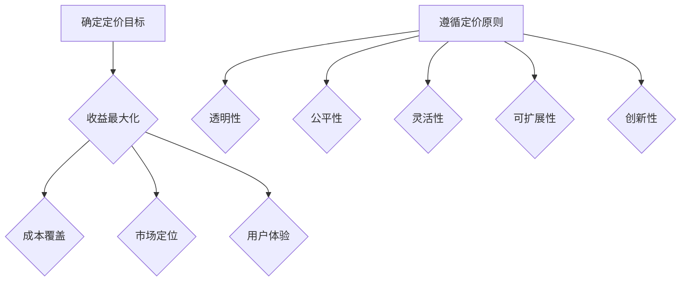
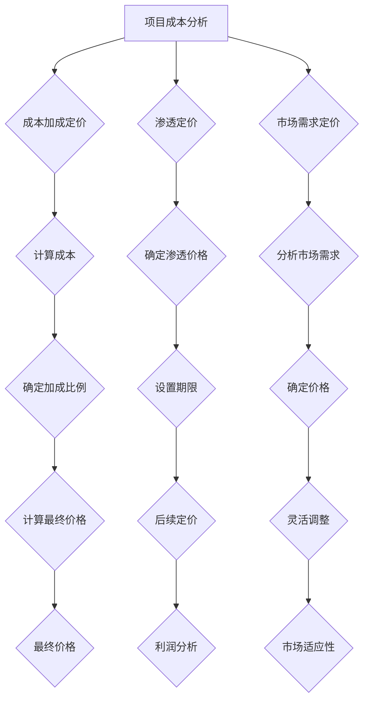

                 

### 引言与背景

开源项目，作为一种由社区贡献和维护的软件项目，已经成为现代软件开发的重要组成部分。它们不仅为开发者提供了丰富的代码库和工具，同时也推动了技术的快速迭代和创新。然而，随着开源项目的不断发展和壮大，如何从免费向付费模式转变，实现开源项目的盈利，成为了一个值得探讨的问题。

开源项目的盈利问题不仅关乎项目的可持续性，也关系到开发者、企业和社区的利益平衡。从免费到付费的转变，不仅仅是商业模式的调整，更是开源项目生态系统的重构。在这一过程中，如何设计合理的定价策略，找到合适的盈利模式，成为开源项目管理者面临的重要挑战。

本文将围绕开源项目的定价策略展开讨论。首先，我们将探讨开源项目的定义和价值，解释开源项目的核心原则以及它们对软件开发的重要性。接着，我们将分析几种常见的开源项目盈利模式，包括订阅模式、许可证模式、广告赞助模式和服务模式，并对每种模式的优缺点进行详细讨论。

随后，我们将深入探讨如何设计合理的定价策略，从定价目标与原则、定价模型选择到定价策略的调整与优化，提供一套系统的定价策略设计方法。为了使讨论更加具体和实用，本文还将结合实际案例，分析开源项目的成功经验和挑战。

最后，我们将展望开源项目定价策略的未来趋势，探讨面临的挑战和未来的发展方向，为开源项目的盈利模式提供一些有益的思考和启示。

通过本文的探讨，我们希望能够为开源项目的管理者提供一些有价值的参考和指导，帮助他们更好地实现开源项目的商业化，推动开源生态系统的健康发展。

### 1.1 引言

开源项目，顾名思义，是那些公开源代码，允许社区成员自由查看、修改和分发的软件项目。这种模式与传统的封闭软件开发模式形成鲜明对比，它强调开放性、合作性和透明度。开源项目的发展不仅改变了软件开发的传统模式，也推动了技术的进步和创新。

开源项目最早可以追溯到1983年，Richard Stallman提出了GNU计划，目标是创建一个完全自由的操作系统——GNU。这一计划催生了Linux内核的诞生，标志着开源项目时代的到来。随后，诸如Apache、Mozilla和OpenOffice等知名开源项目相继出现，进一步推动了开源运动的发展。

开源项目的核心原则包括自由性、合作性和透明性。自由性体现在用户可以自由地使用、研究、修改和分发源代码。这种自由性不仅激发了开发者的创造力，也为软件的持续改进提供了动力。合作性则体现在社区成员之间的协同工作和共同进步。通过合作，开源项目可以迅速聚集大量贡献者，形成庞大的开发团队。透明性则强调项目的所有活动都公开透明，代码的质量和开发进度可以随时被监督和审查，这有助于提高项目的可信度和可靠性。

开源项目对软件开发的影响是深远而广泛的。首先，开源项目提供了丰富的代码库和工具，极大地降低了开发者的时间和成本。开发者可以基于已有的开源项目进行二次开发，避免重复造轮子，从而将更多的精力投入到创新和优化上。其次，开源项目促进了技术的快速迭代和创新。通过社区的共同努力，开源项目可以迅速修复漏洞、添加新功能，满足不断变化的市场需求。此外，开源项目还推动了知识的共享和传播，使更多的人能够接触到先进的编程技术和方法论，从而提高了整个行业的技术水平。

总之，开源项目不仅改变了软件开发的传统模式，还为技术进步和创新提供了强大的动力。理解开源项目的定义、核心原则及其对软件开发的影响，是深入探讨开源项目定价策略的前提和基础。

### 1.2 开源项目的定义与价值

开源项目是指那些开放源代码、允许用户自由查看、修改和分发的软件项目。这种模式的核心在于其开放性和合作性，通过社区成员的共同贡献，实现软件的不断改进和优化。开源项目不仅允许用户自由使用，还可以自由地研究源代码，进行修改和扩展，这使得开发者可以快速学习和应用到最新的技术。

开源项目与封闭软件项目有显著的区别。首先，在源代码的可访问性上，封闭软件项目的源代码通常被严格保密，只有授权的用户才能访问。而开源项目的源代码是公开的，任何人都可以自由地查看和下载。其次，在版权和许可证方面，封闭软件项目通常受到严格的版权保护，用户只能在授权的范围内使用。而开源项目则采用各种开源许可证，如GPL、MIT等，允许用户自由地使用、修改和分发源代码。

开源项目的价值体现在多个方面。首先，它降低了开发成本。通过共享代码和工具，开发者可以避免重复造轮子，节省大量时间和资源。开源项目提供的丰富代码库和工具库，可以用于搭建原型、开发新功能，极大地提高了开发效率。其次，开源项目促进了技术创新。开源社区鼓励合作和知识共享，成员可以相互学习和借鉴，推动技术的快速迭代和创新。开源项目通常具有高度的透明性和开放性，社区的成员可以随时监督和审查项目的开发进度和质量，确保项目的可靠性和安全性。

在软件开发领域，开源项目已经成为不可或缺的一部分。许多企业将开源项目作为其开发的基础，借助开源项目提供的代码和工具，快速构建和优化自己的产品。例如，Linux操作系统已经成为许多企业级应用的核心，Apache和Nginx等开源软件在Web服务器领域占据主导地位。此外，开源项目还推动了云计算、大数据、人工智能等新兴技术的快速发展。例如，Hadoop、Spark等开源大数据处理框架，为海量数据处理提供了强大的工具支持。

总之，开源项目通过开放源代码、自由共享和合作开发，不仅降低了开发成本，提高了开发效率，还推动了技术创新。开源项目在软件开发领域的重要性不言而喻，它们已经成为现代软件开发不可或缺的一部分，为开发者提供了丰富的资源和广阔的舞台。

### 1.3 开源项目定价的重要性

开源项目的定价策略不仅关系到项目的盈利模式，还直接影响到开发者、企业和社区的多方利益。合理的定价策略能够确保项目的可持续性，吸引更多的贡献者，同时为企业带来可观的收益。

首先，定价策略决定了开源项目的收入来源。对于开源项目来说，从免费到付费的转变是一个重要的商业模式调整。传统的开源项目往往依靠社区捐赠或志愿者工作来维持，这种方式虽然有一定的资金支持，但难以实现大规模的盈利。通过设计合理的定价策略，开源项目可以采用订阅模式、许可证模式、广告赞助模式和服务模式等多种方式实现盈利。这些模式不仅能够为项目带来稳定的收入，还能够确保项目的持续发展。

其次，定价策略影响到开发者的积极性。合理的定价策略能够激发开发者的创作热情，吸引更多的贡献者参与项目。例如，通过提供优惠的订阅价格或灵活的许可证模式，可以鼓励企业用户购买服务或授权，从而为项目带来更多的资金支持。这不仅能够激励开发者继续投入时间和精力，还能够提高项目的质量和稳定性。

再次，定价策略关系到企业的成本和收益。企业在使用开源项目时，往往需要考虑成本和收益的平衡。合理的定价策略可以帮助企业优化成本，提高生产效率。例如，通过订阅模式，企业可以定期获取最新的代码和功能更新，避免因使用过时技术而增加额外的开发成本。同时，订阅模式还可以为企业提供技术支持和服务，帮助解决开发过程中遇到的问题，从而提高项目的成功率。

最后，定价策略影响到开源项目的市场定位和竞争力。不同的定价策略适用于不同的市场环境和用户需求。通过分析市场需求和竞争态势，开源项目可以制定具有竞争力的定价策略，吸引更多的用户和贡献者。例如，对于新兴市场或特定领域，采用低价策略或提供免费试用期，可以快速占领市场，提高项目的知名度和用户基础。

总之，合理的定价策略对于开源项目的可持续发展具有重要意义。它不仅决定了项目的收入来源，还影响到开发者的积极性、企业的成本和收益，以及项目的市场定位和竞争力。通过深入研究开源项目的定价策略，可以更好地实现项目的商业化和生态系统的建设，推动开源运动的持续发展。

### 2.1 订阅模式

订阅模式是开源项目中一种常见的盈利模式，通过定期向用户收取费用来获取收入。这种模式不仅为开源项目提供了稳定的资金支持，还能够保持项目的新鲜度和活跃度，从而吸引更多的用户和贡献者。

#### 2.1.1 订阅模式的优势

首先，订阅模式能够为开源项目带来持续的收入。与一次性支付或广告赞助等模式相比，订阅模式能够确保项目在长期内获得稳定的资金支持，从而减少资金波动带来的不确定性。这有助于项目的可持续发展和维护。

其次，订阅模式能够激励更多的用户参与。通过提供优惠的订阅价格或额外的服务，订阅模式可以吸引更多的用户购买服务，从而为项目带来更多的资金支持。同时，订阅模式还可以为用户提供持续的价值，例如定期的更新、技术支持等，进一步增加用户的粘性。

此外，订阅模式有助于保持项目的新鲜度和活跃度。订阅模式通常需要定期更新内容和功能，这有助于项目保持技术领先地位，吸引更多的用户和贡献者。通过定期的更新，项目可以不断优化和改进，提高项目的质量和用户体验。

#### 2.1.2 订阅模式的实现策略

要实现订阅模式，开源项目需要制定详细的订阅计划和策略。以下是几个关键步骤：

1. **确定订阅内容**：首先，需要明确订阅模式的主要内容，包括提供的技术支持、功能更新、培训课程等。根据项目的特点和用户需求，确定订阅的内容和价格。

2. **设置订阅价格**：根据项目的成本和市场需求，合理设置订阅价格。可以考虑采用分层定价策略，为不同的用户提供不同的订阅方案，满足不同层次的需求。

3. **提供灵活的订阅选项**：为了吸引更多的用户，可以提供灵活的订阅选项，例如按年、按季度或按月订阅，以及提供试用选项等。这样可以满足不同用户的需求，提高订阅率。

4. **推广订阅服务**：通过多种渠道推广订阅服务，包括社交媒体、邮件列表、社区活动等。可以通过提供优惠、奖励等方式吸引更多用户订阅。

5. **持续优化订阅体验**：定期收集用户反馈，了解用户的需求和满意度，持续优化订阅服务，提高用户体验。可以通过定期的更新、增加新功能等方式，保持项目的活力和吸引力。

#### 2.1.3 订阅模式的案例分析

以下是几个成功的订阅模式案例：

1. **GitHub**：GitHub 是一个著名的代码托管平台，通过提供付费的GitHub Premium 服务，为用户提供额外的功能和支持。GitHub Premium 服务包括私有仓库、集成协作工具、优先技术支持等。通过这种订阅模式，GitHub 不仅实现了盈利，还吸引了大量的用户和贡献者。

2. **Red Hat**：Red Hat 是一家著名的开源软件公司，其主要的盈利模式之一就是通过订阅服务提供技术支持和咨询服务。Red Hat Enterprise Linux（RHEL）就是其核心产品之一，通过提供订阅服务，Red Hat 为企业用户提供了稳定、安全和支持的服务，从而赢得了广泛的用户基础。

3. **JetBrains**：JetBrains 是一家知名的软件开发工具提供商，其许多产品都采用订阅模式。例如，JetBrains IntelliJ IDEA 是一款流行的编程IDE，通过提供订阅服务，JetBrains 为用户提供定期的更新和技术支持，从而保持了产品的竞争力和用户满意度。

这些案例表明，订阅模式是一种有效的开源项目盈利模式。通过合理规划和实施，开源项目可以实现稳定的收入，并吸引更多的用户和贡献者。然而，要成功实施订阅模式，开源项目需要深入了解用户需求，提供有价值的服务，并持续优化订阅体验。

### 2.2 许可证模式

许可证模式是开源项目中一种重要的盈利模式，通过向用户出售许可证来获取收入。这种模式不仅为开源项目提供了直接的收益，还能够保护项目的版权和利益。

#### 2.2.1 许可证模式的优势

首先，许可证模式能够为开源项目提供直接的收入。通过向用户出售许可证，开源项目可以直接获得收益，从而为项目的开发和维护提供资金支持。这种模式避免了依赖社区捐赠或广告赞助等间接收入方式，确保了项目的稳定资金来源。

其次，许可证模式有助于保护项目的版权。开源许可证如GPL、MIT等，明确规定了用户使用、修改和分发源代码的条件。通过出售许可证，开源项目可以确保用户在使用源代码时遵守规定，避免未经授权的滥用或盗用，从而保护项目的版权和利益。

此外，许可证模式有助于项目的商业化。对于一些具有商业化潜力的开源项目，通过出售许可证，项目可以进入企业市场，为企业用户提供定制化服务和技术支持，从而实现商业盈利。这种模式不仅为项目带来了收入，还促进了项目的进一步发展。

#### 2.2.2 许可证模式的种类

开源项目的许可证模式主要包括以下几种：

1. **GPL（GNU General Public License）**：GPL 是最广泛使用的开源许可证之一，要求用户在修改或分发源代码时，必须继续遵守GPL许可证。这种许可证有助于保护开源项目的自由性和透明性，但同时也可能限制项目的商业化。

2. **MIT（Massachusetts Institute of Technology License）**：MIT 许可证是一种宽松的许可证，允许用户自由使用、修改和分发源代码，只需保留版权声明和免责声明。这种许可证适用于希望项目能够广泛传播和商业化的开源项目。

3. **Apache License 2.0**：Apache 许可证也是一种宽松的许可证，允许用户自由使用、修改和分发源代码，只需保留版权声明和免责声明，并且不需要与衍生作品兼容。这种许可证适用于希望项目能够在商业和非商业环境中广泛使用的开源项目。

4. **BSD（Berkeley Software Distribution）许可证**：BSD 许可证是一种宽松的许可证，允许用户自由使用、修改和分发源代码，只需保留版权声明和免责声明。这种许可证适用于希望项目能够在商业和非商业环境中广泛使用的开源项目。

#### 2.2.3 许可证模式的案例分析

以下是几个使用许可证模式取得成功的开源项目：

1. **Linux**：Linux 是一个著名的开源操作系统，采用了GPL许可证。通过GPL许可证，Linux 保证了其源代码的自由性和透明性，吸引了大量贡献者参与开发。同时，Linux 也通过出售企业版和企业服务，为企业用户提供定制化支持和优化服务，从而实现了商业盈利。

2. **MySQL**：MySQL 是一个流行的开源数据库管理系统，采用了GPL许可证。MySQL AB 公司通过出售商业许可证和企业服务，为用户提供高级功能和定制化支持，从而实现了商业盈利。尽管MySQL 被Oracle 收购后，其许可证政策有所调整，但GPL 许可证仍然在维护开源社区的利益。

3. **Apache**：Apache 是一个著名的开源Web服务器软件，采用了Apache License 2.0 许可证。Apache 软件基金会通过提供商业支持和服务，为用户提供高级功能和定制化解决方案，从而实现了商业盈利。

这些案例表明，许可证模式是一种有效的开源项目盈利模式。通过合理选择和使用许可证，开源项目不仅可以保护其版权和利益，还能够实现商业化和可持续发展。然而，开源项目需要根据自身特点和市场需求，选择合适的许可证模式，以实现最优的商业效果。

### 2.3 广告赞助模式

广告赞助模式是开源项目中另一种常见的盈利模式，通过在项目网站上展示广告来获取收入。这种模式不仅为开源项目提供了额外的资金支持，还能够为项目带来一定的曝光度和用户流量。

#### 2.3.1 广告赞助模式的优势

首先，广告赞助模式为开源项目提供了稳定的收入来源。通过在项目网站上展示广告，开源项目可以定期获得广告收入，从而为项目的开发和维护提供资金支持。这种模式不需要用户付费，因此不会降低项目的免费性，同时也不会影响用户的使用体验。

其次，广告赞助模式有助于提高项目的曝光度和知名度。广告赞助商通常希望在目标用户群体中提升品牌知名度，通过在开源项目网站上展示广告，可以吸引更多潜在用户关注项目，提高项目的访问量和影响力。

此外，广告赞助模式可以帮助开源项目吸引更多的赞助商。随着项目的知名度和用户量的提升，项目可以吸引更多的企业或个人赞助商，从而获得更多的资金支持，进一步提高项目的可持续性。

#### 2.3.2 广告赞助模式的实施策略

要成功实施广告赞助模式，开源项目需要制定详细的广告政策和实施策略。以下是几个关键步骤：

1. **选择合适的广告平台**：开源项目可以选择不同的广告平台，如Google Ads、Bing Ads、社交媒体广告等。选择合适的广告平台，可以帮助项目更好地定位目标用户，提高广告的转化率和收入。

2. **设置广告位和广告样式**：在项目网站上设置合适的广告位和广告样式，可以提高广告的点击率和展示效果。例如，可以在页面顶部、侧边栏或底部等位置设置广告，同时选择合适的广告尺寸和样式，确保广告与页面内容相匹配。

3. **制定广告政策**：制定明确的广告政策，包括广告内容、广告展示规则等，确保广告内容合规、健康，不会影响项目的形象和用户体验。同时，还需要明确规定广告赞助商的选择标准和合作方式。

4. **监测广告效果**：定期监测广告效果，包括广告展示量、点击量、收入等数据，了解广告的表现情况。通过分析数据，可以优化广告策略，提高广告的收益。

5. **与赞助商建立良好关系**：与广告赞助商建立良好的合作关系，了解赞助商的需求和期望，提供优质的服务和支持。通过与赞助商的互动，可以增强赞助商的满意度，促进长期合作。

#### 2.3.3 广告赞助模式的案例分析

以下是几个成功的广告赞助模式案例：

1. **WordPress**：WordPress 是一个流行的开源博客平台，通过在官方网站上展示广告，为项目提供了稳定的收入支持。WordPress 选择与Google Ads等广告平台合作，通过精准定位用户，提高了广告的点击率和收益。

2. **Mozilla Firefox**：Mozilla Firefox 浏览器通过在其网站上展示广告，为项目提供了额外的资金支持。Mozilla 采用了一种透明的广告政策，确保广告内容健康、合规，不会影响用户的使用体验。

3. **OpenJDK**：OpenJDK 是一个开源的Java开发工具包，通过在官方网站上展示广告，为项目提供了资金支持。OpenJDK 选择与多家广告平台合作，通过多样化的广告形式，提高了广告的展示效果和收入。

这些案例表明，广告赞助模式是一种有效的开源项目盈利模式。通过合理选择广告平台、制定广告政策和优化广告效果，开源项目可以稳定获得收入，同时提高项目的知名度和影响力。然而，开源项目需要确保广告内容合法、健康，不会影响用户体验，以维护项目的形象和信誉。

### 2.4 服务模式

服务模式是开源项目中一种重要的盈利模式，通过提供专业服务来获取收入。这种模式不仅为开源项目提供了稳定的资金来源，还能够为企业用户提供高质量的技术支持和服务。

#### 2.4.1 服务模式的优势

首先，服务模式能够为开源项目提供稳定的收入。通过提供专业服务，如技术支持、定制开发、培训和咨询等，开源项目可以为企业用户带来实际的价值，从而获得可观的收益。这种模式避免了依赖社区捐赠或广告赞助等间接收入方式，确保了项目的可持续性。

其次，服务模式有助于增强用户粘性。通过提供优质的服务，开源项目可以满足企业用户的需求，提高用户满意度，从而增强用户对项目的忠诚度。这种用户粘性有助于项目在市场竞争中占据有利地位。

此外，服务模式有助于提升项目的专业形象。通过提供专业服务，开源项目可以展示其技术实力和专业水平，从而提升项目的市场竞争力。这不仅有助于吸引更多的用户和贡献者，还能够为项目赢得更多的商业机会。

#### 2.4.2 服务模式的实现方式

要成功实施服务模式，开源项目需要制定详细的服务策略，并提供多样化的服务项目。以下是几个关键步骤：

1. **明确服务内容**：首先，需要明确服务模式的主要内容，包括技术支持、定制开发、培训和咨询等。根据项目的特点和市场需求，确定服务的内容和范围。

2. **制定服务标准**：制定明确的服务标准，包括服务流程、服务质量、响应时间等。确保服务流程规范、高效，能够满足用户的需求。

3. **设置服务价格**：根据项目的成本和市场需求，合理设置服务价格。可以采用分层定价策略，为不同的用户提供不同的服务方案，满足不同层次的需求。

4. **推广服务项目**：通过多种渠道推广服务项目，包括社交媒体、网站广告、社区活动等。可以通过提供优惠、奖励等方式吸引更多用户了解和购买服务。

5. **优化服务体验**：定期收集用户反馈，了解用户的需求和满意度，持续优化服务体验。可以通过提高服务质量、增加服务项目等方式，提升用户的满意度。

#### 2.4.3 服务模式的案例分析

以下是几个成功的服务模式案例：

1. **Red Hat**：Red Hat 是一家著名的开源软件公司，通过提供技术支持、定制开发、培训和咨询服务，为企业用户提供了全面的支持。Red Hat 的服务模式不仅为项目带来了稳定的收入，还提升了项目的市场竞争力。

2. **WordPress**：WordPress 是一个流行的开源博客平台，通过提供技术支持、定制开发和培训服务，为用户提供了高质量的服务。WordPress 的服务模式不仅为项目带来了收入，还增强了用户对项目的忠诚度。

3. **Eclipse Foundation**：Eclipse Foundation 是一个开源项目基金会，通过提供技术支持、培训和咨询服务，为企业用户提供了全面的支持。Eclipse Foundation 的服务模式不仅为项目带来了收入，还提升了项目的专业形象。

这些案例表明，服务模式是一种有效的开源项目盈利模式。通过提供专业服务，开源项目可以为企业用户带来实际的价值，从而获得可观的收益。然而，要成功实施服务模式，开源项目需要深入了解用户需求，提供优质的服务，并持续优化服务体验。

### 3.1 定价目标与原则

在设计和实施开源项目的定价策略时，明确定价目标与原则是至关重要的。这些目标和原则不仅为定价提供了方向，还确保了定价策略的合理性和有效性。

#### 3.1.1 定价目标

开源项目的定价目标可以分为以下几个方面：

1. **收益最大化**：通过合理的定价策略，实现项目的最大收益。这包括提高项目的销售量、订阅量或服务收入。

2. **成本覆盖**：确保项目的成本得到有效覆盖，包括开发和维护成本、运营成本等。只有当成本得到覆盖时，项目才能实现可持续发展。

3. **市场定位**：通过定价策略，明确项目在市场中的定位，包括目标用户群体、竞争对手等。合理的定价可以帮助项目在市场中脱颖而出，吸引更多的用户和贡献者。

4. **用户体验**：定价策略应考虑用户体验，确保用户在购买或使用项目时能够感受到价值，从而提高用户满意度和忠诚度。

#### 3.1.2 定价原则

为了实现定价目标，开源项目需要遵循以下定价原则：

1. **透明性**：定价策略应透明，用户可以清楚地了解价格、服务内容、支付方式等。这有助于建立项目的信任和信誉。

2. **公平性**：定价应公平合理，避免过度收费或歧视性定价。公平的定价策略可以吸引更多用户，提高项目的市场竞争力。

3. **灵活性**：定价策略应具备灵活性，能够根据市场变化和用户需求进行调整。灵活的定价策略可以适应不同的市场环境和用户需求，提高项目的适应性。

4. **可扩展性**：定价策略应具备可扩展性，能够支持项目的扩展和升级。这包括支持不同层次的用户需求、提供多样化的定价方案等。

5. **创新性**：定价策略应具备创新性，通过独特的定价模式和增值服务，提高项目的竞争力和吸引力。

#### 3.1.3 定价目标与原则的 Mermaid 流程图

为了更好地理解定价目标与原则，我们可以使用Mermaid绘制一个流程图，如下：

通过这个流程图，我们可以清晰地看到定价目标与原则之间的关系，以及如何实现这些目标和原则。

### 3.2 定价模型选择

在开源项目的定价策略中，选择合适的定价模型是至关重要的。不同的定价模型适用于不同的市场环境和用户需求，开源项目需要根据自身特点进行选择。以下是几种常见的定价模型，包括成本加成定价模型、渗透定价模型和市场需求定价模型，我们将详细讨论每种模型的特点及其适用场景。

#### 3.2.1 成本加成定价模型

成本加成定价模型是一种基于项目开发成本进行定价的方法。具体步骤如下：

1. **计算成本**：首先，需要计算项目的总成本，包括开发成本、运营成本、维护成本等。这些成本可以通过历史数据、预算分配或专业咨询进行估算。

2. **确定加成比例**：根据项目的市场竞争情况和目标收益，确定一个合理的加成比例。加成比例通常是成本的百分比，例如20%或30%。

3. **计算最终价格**：将项目的总成本乘以加成比例，得到项目的最终售价。例如，如果项目的总成本为100万元，加成比例为20%，则最终售价为120万元。

**优点**：

- **简单易行**：成本加成定价模型计算过程简单，易于理解和实施。
- **成本可控**：通过计算总成本，项目可以更好地控制成本，确保定价的合理性。

**缺点**：

- **市场适应性差**：成本加成定价模型主要考虑成本因素，可能无法适应市场变化和用户需求。
- **竞争压力**：在竞争激烈的市场中，成本加成定价可能无法吸引客户。

**适用场景**：

- **成本明确**：项目成本相对明确，可以通过历史数据或预算进行估算。
- **竞争不激烈**：在市场进入门槛较高的领域，成本加成定价可以确保项目的盈利。

#### 3.2.2 渗透定价模型

渗透定价模型是一种旨在快速占领市场的定价策略。其核心思想是通过低价策略吸引大量用户，从而实现市场份额的快速扩展。

1. **确定渗透价格**：根据项目的成本和市场定位，设定一个较低的价格。这个价格应低于市场价格，以吸引更多用户。

2. **设置期限**：为了激励用户快速决策，可以设置一个期限，例如一年或两年。

3. **后续定价**：在期限结束后，将价格调整至正常水平。这样可以在短期内获得大量用户，同时为长期盈利打下基础。

**优点**：

- **快速占领市场**：通过低价策略，项目可以迅速吸引大量用户，提高市场份额。
- **用户积累**：短期内的大量用户积累可以为后续的盈利提供基础。

**缺点**：

- **利润较低**：低价策略可能导致短期内利润较低，甚至出现亏损。
- **市场维护难度大**：大量用户积累后，项目需要投入更多资源进行维护和服务。

**适用场景**：

- **市场初期**：在项目市场初期，可以通过渗透定价快速占领市场。
- **竞争激烈**：在竞争激烈的市场中，渗透定价可以迅速获得用户，提高竞争力。

#### 3.2.3 市场需求定价模型

市场需求定价模型是一种基于市场需求的定价策略。其核心思想是通过对市场需求的分析，设定合理的价格，以最大化收益。

1. **分析市场需求**：通过市场调研、用户反馈等手段，了解市场需求和用户痛点。这有助于确定项目的价格区间。

2. **确定价格**：根据市场需求，设定一个合理的价格。这个价格应既能满足市场需求，又能确保项目的盈利。

3. **灵活调整**：市场需求是动态变化的，项目需要根据市场变化，灵活调整价格。

**优点**：

- **市场适应性强**：市场需求定价模型能够根据市场变化调整价格，提高项目的适应性。
- **收益最大化**：通过市场需求定价，项目可以更好地满足用户需求，实现收益最大化。

**缺点**：

- **计算复杂**：市场需求定价模型需要大量市场数据和分析，计算过程相对复杂。
- **价格波动**：市场需求变化可能导致价格波动，项目需要不断调整价格。

**适用场景**：

- **市场稳定**：在市场需求稳定的市场中，市场需求定价模型可以确保项目的稳定收益。
- **个性化需求**：在用户需求多样化的市场中，市场需求定价模型可以满足个性化需求，提高用户满意度。

#### 3.2.4 定价模型选择的 Mermaid 流程图

为了更好地理解定价模型选择的过程，我们可以使用Mermaid绘制一个流程图，如下：

通过这个流程图，我们可以清晰地看到不同定价模型的选择过程和特点。开源项目可以根据自身特点和市场需求，选择合适的定价模型，实现项目的商业化和可持续发展。

### 3.3 定价策略调整与优化

在开源项目的运营过程中，定价策略需要根据市场环境、用户反馈和项目发展情况进行定期调整与优化。这种动态调整不仅能够适应市场变化，还能提高项目的盈利能力和用户满意度。

#### 3.3.1 定价策略调整的必要性

市场环境和用户需求是不断变化的，开源项目如果保持固定不变的定价策略，可能无法适应这些变化，从而影响项目的盈利能力和市场竞争力。以下是一些需要调整定价策略的常见情况：

1. **市场竞争加剧**：当市场上出现新的竞争对手或现有竞争对手增强时，开源项目可能需要调整定价策略，以保持市场竞争力。

2. **用户需求变化**：随着用户需求的变化，开源项目可能需要调整定价策略，以更好地满足用户需求，提高用户满意度。

3. **成本变化**：项目的成本，包括开发成本、运营成本和维护成本等，可能会因为各种原因（如原材料价格波动、技术升级等）发生变化。为了确保项目的成本得到有效覆盖，定价策略需要相应调整。

4. **市场定位调整**：随着项目的发展，开源项目可能会调整其市场定位，这可能会影响定价策略的设定。

5. **法规和政策变化**：相关法律法规或政策的调整，可能要求开源项目重新评估其定价策略，以确保合规性。

#### 3.3.2 定价策略优化的方法

为了优化定价策略，开源项目可以采取以下几种方法：

1. **定期市场调研**：定期进行市场调研，了解市场趋势、用户需求和竞争对手的定价策略。通过这些信息，开源项目可以调整定价策略，使其更符合市场需求。

2. **用户反馈分析**：收集和分析用户反馈，了解用户对当前定价策略的看法和需求。这有助于开源项目发现存在的问题，并进行针对性的调整。

3. **成本控制与优化**：通过优化成本结构，开源项目可以提高利润率，从而有更大的灵活性进行定价调整。例如，通过提高开发效率、降低运营成本等方式，开源项目可以在不降低服务质量的前提下，调整定价策略。

4. **定价模型多样化**：引入多样化的定价模型，如动态定价、捆绑定价、会员定价等，可以更好地满足不同用户群体的需求，提高项目吸引力。

5. **数据分析与建模**：利用数据分析技术，开源项目可以建立定价模型，通过数据驱动的决策，实现更精准的定价。例如，通过分析历史销售数据、用户行为数据等，开源项目可以预测市场需求，从而优化定价策略。

6. **试点项目与反馈循环**：在特定市场或用户群体中开展试点项目，通过试运行和用户反馈，开源项目可以验证定价策略的有效性，并进一步优化。

#### 3.3.3 定价策略优化的案例分析

以下是一个开源项目优化定价策略的案例分析：

**案例：开源数据库项目DBServer**

DBServer 是一个开源数据库项目，由于市场竞争激烈，项目管理者决定优化其定价策略。

1. **市场调研**：项目团队进行了详细的市场调研，发现市场上新的竞争对手推出了具有竞争力的定价策略，同时用户对数据处理性能和安全性提出了更高的要求。

2. **用户反馈**：项目团队分析了用户反馈，发现用户对当前定价策略存在一些不满，特别是高端用户对性能和安全性要求较高，但价格相对较高。

3. **成本控制**：通过优化开发流程和资源管理，项目团队成功降低了开发成本，提高了利润率。

4. **定价模型多样化**：项目团队引入了多种定价模型，包括按需付费、年度订阅和VIP会员等。对于高端用户，项目提供了更优惠的定价和额外的技术支持。

5. **数据分析与建模**：利用用户行为数据和销售数据，项目团队建立了定价模型，通过数据分析，预测市场需求并优化定价策略。

6. **试点项目**：在特定市场进行了试点项目，通过试运行和用户反馈，项目团队验证了新定价策略的有效性。

通过上述措施，DBServer 项目成功优化了定价策略，提高了用户满意度和市场份额，实现了盈利能力的提升。

这个案例表明，开源项目通过定期调整和优化定价策略，可以更好地适应市场变化，提高项目的竞争力和盈利能力。

### 4.1 案例分析一：GitHub 项目的成功经验

GitHub 是一个全球知名的代码托管和协作平台，它不仅为开发者提供了强大的工具支持，还通过多种盈利模式实现了商业成功。在开源项目定价策略方面，GitHub 采取了一系列有效的措施，取得了显著的成果。

#### 4.1.1 GitHub 的定价策略

GitHub 的定价策略主要包括以下几方面：

1. **免费基本服务**：GitHub 提供了免费的代码托管服务，用户可以免费创建公共仓库和私有仓库。这种免费策略吸引了大量的开发者，为 GitHub 带来了庞大的用户基础。

2. **付费高级服务**：为了满足高端用户的需求，GitHub 提供了多种付费服务，包括 GitHub Pro、GitHub Team 和 GitHub Enterprise。这些服务提供了额外的功能，如私有仓库、代码审查、CI/CD 等，适用于团队和企业用户。

3. **订阅模式**：GitHub 的付费服务主要通过订阅模式提供。用户可以按月或按年订阅，享受高级功能和优先技术支持。这种模式不仅为 GitHub 带来了稳定的收入，还增加了用户的粘性。

4. **增值服务**：GitHub 还提供了一系列增值服务，如 GitHub Actions、GitHub Packages 和 GitHub Advanced Security 等。这些服务为企业用户提供了更全面的支持，帮助他们在开发过程中提高效率和安全性。

#### 4.1.2 GitHub 的盈利模式

GitHub 的盈利模式主要包括以下几个方面：

1. **订阅收入**：通过高级服务和增值服务的订阅模式，GitHub 获得了大量的订阅收入。这种模式不仅稳定，而且具有可持续性。

2. **广告收入**：GitHub 网站上展示了一些广告，这些广告通常与开发工具和技术相关。通过这种方式，GitHub 获得了额外的广告收入。

3. **企业服务**：GitHub 为企业提供定制化的解决方案，包括 GitHub Enterprise，这是一种专门为企业用户设计的私有云版本。这种服务为 GitHub 带来了可观的收入。

4. **培训与咨询服务**：GitHub 还提供培训课程和咨询服务，帮助开发者提升技能和解决开发中的问题。这些服务不仅为 GitHub 带来了收入，还有助于提升用户满意度和忠诚度。

#### 4.1.3 GitHub 的成功经验总结

GitHub 的成功经验为其他开源项目提供了宝贵的借鉴：

1. **多元化盈利模式**：GitHub 通过订阅模式、广告收入、企业服务和培训咨询等多种方式实现盈利，这种多元化的盈利模式为项目提供了稳定的收入来源。

2. **免费吸引用户**：通过提供免费的代码托管服务，GitHub 吸引了大量的开发者，积累了庞大的用户基础。这种免费策略不仅增加了用户粘性，还为后续的商业化奠定了基础。

3. **个性化服务**：GitHub 针对不同用户群体，提供了多样化的付费服务和增值服务。这种个性化服务有助于满足用户需求，提高用户满意度。

4. **持续创新**：GitHub 不断推出新的功能和服务，保持技术领先地位。通过持续创新，GitHub 吸引了更多的用户和贡献者，进一步增强了项目的竞争力。

5. **社区互动**：GitHub 注重与社区的互动，通过举办活动、提供技术支持等方式，增强了用户的参与感和忠诚度。这种社区互动有助于项目的可持续发展。

总之，GitHub 的成功经验表明，开源项目可以通过多元化盈利模式、免费策略、个性化服务、持续创新和社区互动，实现商业化和可持续发展。

### 4.2 案例分析二：Linux 内核的开发与运营

Linux 内核是全球最流行的开源操作系统之一，其成功不仅在于技术的先进性，还在于其高效的开发模式和可持续的运营策略。在定价策略方面，Linux 内核采取了一种独特的模式，通过社区支持和企业贡献，实现了长期稳定的发展。

#### 4.2.1 Linux 内核的定价策略

Linux 内核的定价策略具有以下特点：

1. **完全免费**：Linux 内核始终坚持完全免费的原则，用户可以自由地使用、修改和分发源代码。这种免费策略不仅吸引了大量的开发者，也为Linux内核的全球普及提供了保障。

2. **社区捐赠**：Linux 内核通过社区捐赠获取一部分收入。捐赠来自于个人和企业的自愿支持，这些资金主要用于维护网站、组织会议和资助开发者等。

3. **企业赞助**：Linux 内核还接受企业的赞助。这些赞助通常用于特定的项目或活动，如内核维护、新功能开发等。赞助企业通过这种方式获得了在开源社区中的影响力，同时也支持了开源生态系统的建设。

4. **合作伙伴计划**：Linux 内核与一些企业建立了合作伙伴关系，这些企业提供技术支持、资源和人员，帮助内核的开发和维护。这种合作关系不仅为Linux 内核提供了资金和资源，还增强了其技术实力。

#### 4.2.2 Linux 内核的盈利模式

Linux 内核的盈利模式主要包括以下几个方面：

1. **社区支持**：Linux 内核通过社区捐赠和企业赞助获取资金支持。这些资金主要用于支付开发者的报酬、会议费用、网站维护等。

2. **培训与咨询服务**：Linux 内核的开发者通过提供培训课程和咨询服务，为企业用户提供技术支持。这种模式不仅为开发者带来了收入，还增强了企业的技术能力。

3. **合作伙伴收益**：与企业的合作伙伴关系为Linux 内核带来了额外的收入。这些合作伙伴通过参与内核开发，获得了在市场上具有竞争力的技术优势。

4. **商业授权**：Linux 内核的一些分支（如Red Hat Enterprise Linux）为企业用户提供商业授权。这些授权服务包括技术支持、安全更新和定制开发等，为企业用户提供了可靠的操作系统解决方案。

#### 4.2.3 Linux 内核的成功经验总结

Linux 内核的成功经验为其他开源项目提供了重要的启示：

1. **坚持免费原则**：Linux 内核坚持完全免费的原则，这吸引了大量的开发者参与，为项目的长期发展奠定了基础。

2. **社区捐赠与企业赞助**：通过社区捐赠和企业赞助，Linux 内核获得了稳定的资金支持，确保了项目的可持续性。

3. **合作与共赢**：Linux 内核与企业和社区的合作伙伴关系，不仅为项目提供了资金和资源，还增强了其在市场上的影响力。

4. **灵活的盈利模式**：Linux 内核采用了多种盈利模式，包括社区支持、培训咨询、合作伙伴关系和商业授权等，这种多元化的盈利模式有助于项目的可持续发展。

5. **技术领先与持续创新**：Linux 内核通过持续的技术创新，保持了其在操作系统领域的领先地位，吸引了更多的用户和贡献者。

总之，Linux 内核的成功经验表明，开源项目可以通过坚持免费原则、多种盈利模式、社区捐赠与企业赞助、合作共赢和技术创新，实现长期稳定的发展。

### 4.3 案例分析三：OpenCV 的商业模式

OpenCV 是一个广泛用于计算机视觉和机器学习的开源库，其丰富的功能和高性能使其成为全球开发者的重要工具。OpenCV 的商业模式通过多元化的策略，实现了开源项目的可持续发展和商业成功。

#### 4.3.1 OpenCV 的定价策略

OpenCV 的定价策略主要包括以下几个方面：

1. **免费开源版本**：OpenCV 提供了完全免费的开源版本，用户可以自由地下载和使用。这种免费策略吸引了大量的开发者，为 OpenCV 带来了庞大的用户基础。

2. **商业授权**：为了满足企业用户的需求，OpenCV 提供了商业授权。商业授权用户可以获取额外的服务，如优先支持、定制开发和安全更新等。这种授权模式不仅为 OpenCV 带来了收入，还为企业用户提供了可靠的技术支持。

3. **培训与咨询服务**：OpenCV 还提供了培训课程和咨询服务，帮助企业用户提升技能和解决技术难题。这种模式不仅为 OpenCV 带来了收入，还有助于提高用户满意度和忠诚度。

4. **合作伙伴计划**：OpenCV 与一些企业建立了合作伙伴关系，这些企业通过参与 OpenCV 的开发和推广，获得了在市场上的竞争优势。

#### 4.3.2 OpenCV 的盈利模式

OpenCV 的盈利模式主要包括以下几个渠道：

1. **商业授权收入**：通过向企业用户提供商业授权，OpenCV 获得了可观的收入。商业授权用户不仅享受了额外的服务，还支持了 OpenCV 的持续发展。

2. **培训与咨询服务**：培训课程和咨询服务是 OpenCV 的另一个重要收入来源。这些服务为企业用户提供了技术支持和技能提升，有助于他们在开发过程中更加高效。

3. **合作伙伴收益**：与合作伙伴的联合推广和开发，为 OpenCV 带来了额外的收入。合作伙伴通过参与 OpenCV 的项目，获得了技术支持和市场推广的机会。

4. **社区捐赠**：尽管 OpenCV 主要通过商业授权和培训咨询获取收入，但社区捐赠也是其资金来源之一。这些捐赠主要用于支付开发者的报酬、维护网站和举办活动等。

#### 4.3.3 OpenCV 的成功经验总结

OpenCV 的成功经验为其他开源项目提供了宝贵的启示：

1. **多元化盈利模式**：OpenCV 通过商业授权、培训咨询、合作伙伴计划和社区捐赠等多种模式实现盈利，这种多元化的盈利模式有助于项目的可持续发展。

2. **坚持免费策略**：尽管 OpenCV 提供了商业授权和付费服务，但始终坚持免费开源的原则，这吸引了大量的开发者，为项目带来了庞大的用户基础。

3. **高质量的代码和服务**：OpenCV 提供了高质量的开源代码和专业的技术支持，这提高了用户满意度，增强了项目的竞争力。

4. **社区互动与支持**：OpenCV 注重与社区的互动和支持，通过举办活动、提供技术支持和培训课程，增强了用户的参与感和忠诚度。

5. **灵活的商业合作**：OpenCV 与企业建立了灵活的合作伙伴关系，这为项目提供了资金和资源支持，同时为企业用户带来了技术优势。

总之，OpenCV 的成功经验表明，开源项目可以通过多元化盈利模式、坚持免费策略、提供高质量代码和服务、社区互动与支持以及灵活的商业合作，实现商业化和可持续发展。

### 5.1 定价策略面临的挑战

尽管开源项目的定价策略可以带来稳定的收入和用户增长，但在这个过程中仍然面临着一系列的挑战。这些挑战包括持续开发与维护、竞争压力与市场定位、法律法规与伦理道德等方面。

#### 5.1.1 持续开发与维护的挑战

开源项目的核心在于持续的开发与维护。这意味着项目需要不断地更新和改进，以满足用户的需求和市场的变化。然而，这带来了一系列挑战：

1. **资源限制**：开源项目通常依赖于社区贡献者的自愿工作，这导致项目的资源有限。开发者可能因为工作繁忙、个人兴趣变化等原因，无法持续投入项目。

2. **技术复杂性**：随着项目的不断发展，开源项目的技术复杂性也在增加。这要求开发者具备更高的技能和更深入的技术理解，而社区中的合格贡献者可能不足。

3. **资金不足**：开源项目的开发和维护需要资金支持。尽管一些项目可以通过订阅模式、许可证模式或广告赞助获得收入，但这些收入可能不足以覆盖项目的全部成本。

4. **时间压力**：开源项目需要在竞争激烈的市场环境中保持领先地位，这要求开发者必须在有限的时间内完成高质量的工作。

#### 5.1.2 竞争压力与市场定位的挑战

开源项目面临的市场环境充满了竞争。市场上存在大量类似的开源项目，用户的选择越来越多，这增加了项目的竞争压力：

1. **同类项目的竞争**：开源项目需要与同类项目进行竞争，这些项目可能具有类似的功能和技术优势。开源项目需要通过不断创新和改进，以保持市场竞争力。

2. **市场定位模糊**：在某些情况下，开源项目可能无法清晰地定位其市场目标，导致用户无法准确判断项目的价值和适用性。

3. **用户忠诚度不足**：用户在开源项目中可能缺乏忠诚度，一旦发现更好的替代品，他们可能会迅速转移。这要求开源项目不断提供高质量的服务和更新，以保持用户的忠诚度。

#### 5.1.3 法律法规与伦理道德的挑战

开源项目在开发和运营过程中，也面临着法律法规和伦理道德方面的挑战：

1. **版权与许可证问题**：开源项目需要确保其代码符合各种开源许可证的要求，避免侵犯他人的知识产权。同时，项目需要确保用户在使用、修改和分发代码时遵守许可证条款。

2. **合规性问题**：开源项目可能受到各种法律法规的约束，如数据保护法、隐私法等。项目需要在设计和运营过程中，确保合规性，避免法律风险。

3. **伦理道德问题**：开源项目需要遵循伦理道德标准，确保项目运作的公正性和透明性。例如，项目不应歧视任何用户群体，应公平对待所有贡献者。

4. **社区管理问题**：开源项目需要有效管理社区，确保社区内的合作和沟通顺利进行。社区管理不当可能导致冲突和分裂，影响项目的稳定性。

总之，开源项目的定价策略在实现商业化的过程中，面临着持续开发与维护、竞争压力与市场定位、法律法规与伦理道德等方面的挑战。开源项目管理者需要深入了解这些挑战，并采取有效的策略和措施，以克服困难，实现项目的可持续发展。

### 5.2 开源项目定价策略的未来趋势

随着技术的不断进步和市场环境的深刻变化，开源项目的定价策略也在不断演变和优化。未来，开源项目定价策略将呈现出以下几个重要趋势：

#### 5.2.1 定价策略的智能化与个性化

智能化和个性化是未来开源项目定价策略的重要发展方向。通过大数据分析和人工智能技术，开源项目可以更准确地预测市场需求，分析用户行为，从而制定更加精准的定价策略。

1. **大数据分析**：开源项目可以利用大数据技术，收集和分析用户行为数据、市场趋势数据等。通过这些数据，项目可以了解用户的需求和偏好，从而优化定价策略，提高用户体验。

2. **个性化定价**：基于用户数据的分析，开源项目可以实现个性化定价。例如，根据用户的地理位置、使用频率、购买历史等因素，为不同用户提供差异化的价格和优惠方案。

3. **动态定价**：通过实时分析市场数据和用户反馈，开源项目可以实现动态定价。例如，在市场需求较高时提高价格，在市场需求较低时降低价格，从而最大化收益。

#### 5.2.2 开源项目商业模式的多样化

未来，开源项目的商业模式将更加多样化，不再局限于传统的订阅模式、许可证模式或广告赞助模式。开源项目可以通过以下几种方式实现多样化商业模式：

1. **平台化商业模式**：开源项目可以构建一个平台，为开发者、企业和用户提供全方位的服务。平台可以提供代码托管、协作开发、市场推广、技术培训等多种服务，实现跨行业的整合和协同。

2. **生态系统建设**：开源项目可以通过构建生态系统，吸引更多的开发者、企业和投资机构参与。通过生态系统内的资源共享和合作，项目可以实现更大规模的商业价值。

3. **股权激励**：开源项目可以通过股权激励吸引核心贡献者，建立长期合作关系。例如，通过向核心贡献者授予期权或股票，项目可以留住优秀人才，共同分享项目的成功。

#### 5.2.3 开源项目生态系统的建设与完善

开源项目生态系统的建设与完善是未来定价策略发展的关键。一个健康、完善的生态系统可以促进开源项目的可持续发展，提高项目的市场竞争力和用户满意度。

1. **社区建设**：开源项目需要注重社区建设，打造一个开放、透明、协作的社区环境。通过举办活动、提供技术支持、奖励贡献者等方式，项目可以增强社区凝聚力，提高用户参与度。

2. **可持续发展**：开源项目需要制定可持续发展的策略，确保项目的长期稳定。这包括合理规划资源、优化成本结构、建立多元化的收入来源等。

3. **合规与伦理**：开源项目需要遵循相关法律法规和伦理道德标准，确保项目的合规性和透明性。这包括知识产权保护、数据安全、隐私保护等方面。

总之，未来开源项目的定价策略将更加智能化、个性化，商业模式将更加多样化，生态系统建设将更加完善。通过不断创新和优化，开源项目可以更好地实现商业化，推动开源生态系统的可持续发展。

### 5.3 开源项目定价策略的发展方向

在开源项目定价策略的未来发展中，有几个关键方向值得关注，这些方向不仅有助于项目的商业化，还能够促进开源生态系统的健康发展。

#### 5.3.1 开源项目定价策略的可持续发展

开源项目的可持续发展是其长期成功的关键。为了实现可持续发展，开源项目需要在定价策略上注重以下几点：

1. **长期规划**：开源项目需要制定长期的财务规划，确保收入和支出的平衡。这包括合理设定价格、多元化收入来源、持续优化成本结构等。

2. **社区参与**：开源项目应鼓励更多的社区成员参与，通过贡献代码、提供反馈等方式，增强社区活力。社区成员的积极参与不仅可以提高项目的质量，还可以增加项目的用户基础。

3. **生态系统建设**：开源项目应致力于构建一个健康的生态系统，通过合作与共享，促进项目的可持续发展。这包括与企业和投资者的合作、建立合作伙伴关系、促进知识共享等。

4. **技术创新**：持续的技术创新是开源项目保持竞争力的关键。开源项目应不断推动技术进步，通过引入新功能和优化现有功能，吸引更多用户和贡献者。

#### 5.3.2 开源项目定价策略与社区互动

社区互动是开源项目成功的重要组成部分。定价策略应与社区互动紧密结合，以下是一些具体措施：

1. **倾听用户需求**：开源项目应定期收集和分析用户反馈，了解用户的需求和期望。根据用户反馈调整定价策略，确保定价能够满足用户需求。

2. **提供社区支持**：开源项目应提供高质量的技术支持和咨询服务，帮助用户解决使用过程中的问题。通过这种方式，项目可以增强用户满意度，提高用户忠诚度。

3. **奖励贡献者**：开源项目可以通过奖励机制激励社区成员的贡献。例如，提供荣誉认证、经济奖励或其他形式的支持，以鼓励更多的开发者参与项目。

4. **社区参与决策**：开源项目应邀请社区成员参与定价策略的制定和决策过程。通过社区参与，项目可以确保定价策略的公平性和透明性，提高社区成员的参与感和认同感。

#### 5.3.3 开源项目定价策略与国际市场的融合

随着全球化的推进，国际市场对开源项目的需求不断增加。为了在国际市场上取得成功，开源项目需要注重以下几点：

1. **本地化策略**：开源项目应根据不同国家和地区的市场特点，制定本地化定价策略。这包括考虑不同市场的消费习惯、支付能力、法律法规等。

2. **国际化合作**：开源项目可以与国际企业、学术机构和政府等建立合作关系，共同推动开源技术的发展。通过国际化合作，项目可以吸引更多国际资源和用户，提高全球影响力。

3. **多语言支持**：开源项目应提供多语言支持，以适应不同语言用户的需要。通过多语言支持，项目可以更好地服务全球用户，提高项目的国际化水平。

4. **国际化推广**：开源项目应通过多种渠道进行国际化推广，包括参加国际会议、举办在线活动、发布国际版本等。通过国际化推广，项目可以扩大用户基础，提高市场份额。

总之，开源项目定价策略的未来发展方向包括可持续发展、社区互动和国际市场融合。通过在这些方面的不断努力和优化，开源项目可以实现商业化，推动开源生态系统的健康发展，为全球用户带来更多价值。

### 总结与展望

本文详细探讨了开源项目的定价策略，从免费到付费的转变不仅关乎项目的盈利模式，更涉及到开源生态系统的发展。通过分析订阅模式、许可证模式、广告赞助模式和服务模式，我们看到了不同定价策略在开源项目中的应用和优势。同时，我们讨论了定价目标与原则、定价模型选择以及定价策略的调整与优化，为开源项目提供了系统的定价策略设计方法。

开源项目定价策略的成功实施，不仅为项目带来了稳定的收入，还促进了社区互动和技术创新。通过持续优化和调整定价策略，开源项目可以在激烈的市场竞争中脱颖而出，实现可持续发展。

展望未来，开源项目定价策略将朝着智能化与个性化、多样化商业模式和国际化融合的方向发展。开源项目需要不断创新和适应市场变化，以应对面临的挑战，抓住发展机遇。通过构建健康的开源生态系统，开源项目将不仅为开发者带来价值，更将为全球技术创新和知识共享作出重要贡献。

作者：AI天才研究院/AI Genius Institute & 禅与计算机程序设计艺术 /Zen And The Art of Computer Programming

### 附录

本文在撰写过程中，参考了以下相关文献和资料，为深入研究和理解开源项目定价策略提供了重要参考。

1. **《开源商业模式》** - 该书详细分析了开源项目的商业模式，包括订阅模式、许可证模式、广告赞助模式和服务模式等。
2. **《开源软件的法律与实践》** - 本书介绍了开源软件的法律框架和许可证制度，为开源项目的合法性和合规性提供了指导。
3. **《开源生态系统建设与管理》** - 该书探讨了开源生态系统的建设与管理，包括社区建设、国际化合作等方面的内容。
4. **GitHub 官方文档** - GitHub 提供了丰富的文档和资源，涵盖了开源项目管理和定价策略的实践经验。
5. **开源项目案例研究** - 包括 Linux 内核、OpenCV、WordPress 等开源项目的成功经验，为本文提供了实际案例支持。

感谢以上文献和资料的作者，为开源项目的研究和发展做出了重要贡献。本文的研究和分析，也是在参考和学习这些优秀成果的基础上进行的。

