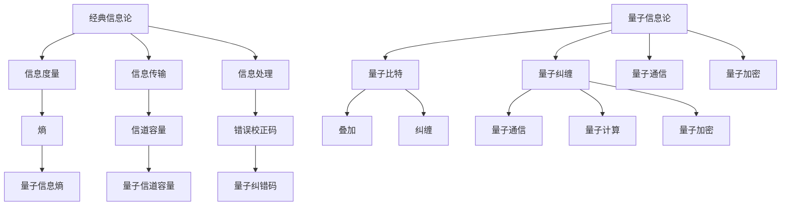
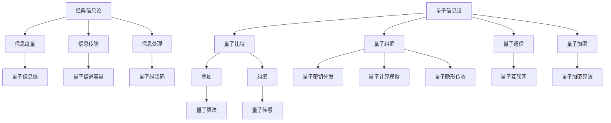

                 

### 第一部分：从经典信息论到量子信息论的基本概念与联系

#### 1.1 经典信息论与量子信息论的概述

经典信息论由香农于1948年创立，它是一套研究信息度量、传输与处理的理论框架。经典信息论的核心概念包括熵、信道容量、错误校正码等。熵是衡量信息量的度量，信道容量是衡量通信信道传输信息的能力，错误校正码则是用于在传输过程中纠正错误的技术。

量子信息论则是基于量子力学原理发展起来的一门交叉学科，它研究量子系统中的信息处理、量子通信、量子加密等。量子比特（qubit）是量子信息论中的基本单元，它具有叠加和纠缠等特性。量子纠缠使得量子比特之间的状态相互关联，叠加态则使得一个量子比特可以同时处于多种状态。

**经典信息论与量子信息论的联系**：

1. **基础概念**：经典信息论和量子信息论在信息度量上有相似之处，如熵的概念在两个领域都有应用。
2. **技术融合**：量子信息论在经典信息论的基础上，引入了量子特性，如叠加和纠缠，提高了信息处理的能力。
3. **实际应用**：量子信息论在量子计算、量子通信、量子加密等领域有广泛应用，为经典信息论提供了新的发展方向。

**Mermaid 流程图**：

#### 1.2 经典信息论与量子信息论的联系

经典信息论和量子信息论在基础概念和技术方面存在紧密联系。例如，香农的熵概念在量子信息论中也有重要应用。量子信息论通过引入量子特性，如叠加和纠缠，扩展了信息处理的能力。

**技术融合**：

- **量子通信**：量子通信利用量子纠缠实现信息传输，相比经典通信具有更高的安全性。
- **量子计算**：量子计算利用量子比特的叠加和纠缠特性，能够实现比经典计算机更高效的算法。
- **量子加密**：量子加密利用量子纠缠和不可克隆定理，实现更安全的加密通信。

**实际应用**：

量子信息论在多个领域都有重要应用，如：

- **量子通信**：量子密钥分发（QKD）是一种基于量子纠缠的加密通信方式，能够实现安全的数据传输。
- **量子计算**：量子计算机在量子算法、化学模拟、材料科学等领域有广泛应用，能够解决经典计算机难以处理的问题。
- **量子加密**：量子加密利用量子特性，提供比经典加密更高的安全性。

**Mermaid 流程图**：

#### 1.3 本书的主要内容与结构

本书分为六个部分，主要内容包括：

- **第一章**：介绍经典信息论与量子信息论的基本概念与联系。
- **第二章**：详细讲解经典信息论的核心原理，包括信息度量、信息传输与信息处理。
- **第三章**：探讨量子信息论的基本原理，如量子比特、量子算法等。
- **第四章**：分析经典信息论与量子信息论在实际应用中的融合与发展。
- **第五章**：介绍量子信息论在通信、计算、加密等领域的应用案例。
- **第六章**：展望未来，探讨量子信息论在信息科学中的潜在发展与应用。

通过本书的阅读，读者将能够全面了解经典信息论与量子信息论的基本概念、核心原理以及在实际应用中的发展。希望本书能够为读者在量子信息科学领域的学习和研究提供帮助。

### 第一部分：从经典信息论到量子信息论的基本概念与联系

#### 1.1 经典信息论与量子信息论的概述

经典信息论由香农于1948年创立，它是一套研究信息度量、传输与处理的理论框架。经典信息论的核心概念包括熵、信道容量、错误校正码等。熵是衡量信息量的度量，信道容量是衡量通信信道传输信息的能力，错误校正码则是用于在传输过程中纠正错误的技术。

量子信息论则是基于量子力学原理发展起来的一门交叉学科，它研究量子系统中的信息处理、量子通信、量子加密等。量子比特（qubit）是量子信息论中的基本单元，它具有叠加和纠缠等特性。量子纠缠使得量子比特之间的状态相互关联，叠加态则使得一个量子比特可以同时处于多种状态。

**经典信息论与量子信息论的联系**：

1. **基础概念**：经典信息论和量子信息论在信息度量上有相似之处，如熵的概念在两个领域都有应用。
2. **技术融合**：量子信息论在经典信息论的基础上，引入了量子特性，如叠加和纠缠，提高了信息处理的能力。
3. **实际应用**：量子信息论在量子计算、量子通信、量子加密等领域有广泛应用，为经典信息论提供了新的发展方向。

**Mermaid 流程图**：

#### 1.2 经典信息论与量子信息论的联系

经典信息论和量子信息论在基础概念和技术方面存在紧密联系。例如，香农的熵概念在量子信息论中也有重要应用。量子信息论通过引入量子特性，如叠加和纠缠，扩展了信息处理的能力。

**技术融合**：

- **量子通信**：量子通信利用量子纠缠实现信息传输，相比经典通信具有更高的安全性。
- **量子计算**：量子计算利用量子比特的叠加和纠缠特性，能够实现比经典计算机更高效的算法。
- **量子加密**：量子加密利用量子纠缠和不可克隆定理，实现更安全的加密通信。

**实际应用**：

量子信息论在多个领域都有重要应用，如：

- **量子通信**：量子密钥分发（QKD）是一种基于量子纠缠的加密通信方式，能够实现安全的数据传输。
- **量子计算**：量子计算机在量子算法、化学模拟、材料科学等领域有广泛应用，能够解决经典计算机难以处理的问题。
- **量子加密**：量子加密利用量子特性，提供比经典加密更高的安全性。

**Mermaid 流程图**：

#### 1.3 本书的主要内容与结构

本书分为六个部分，主要内容包括：

- **第一章**：介绍经典信息论与量子信息论的基本概念与联系。
- **第二章**：详细讲解经典信息论的核心原理，包括信息度量、信息传输与信息处理。
- **第三章**：探讨量子信息论的基本原理，如量子比特、量子算法等。
- **第四章**：分析经典信息论与量子信息论在实际应用中的融合与发展。
- **第五章**：介绍量子信息论在通信、计算、加密等领域的应用案例。
- **第六章**：展望未来，探讨量子信息论在信息科学中的潜在发展与应用。

通过本书的阅读，读者将能够全面了解经典信息论与量子信息论的基本概念、核心原理以及在实际应用中的发展。希望本书能够为读者在量子信息科学领域的学习和研究提供帮助。

### 第二部分：经典信息论的核心原理讲解

经典信息论的核心原理包括信息度量、信息传输与信息处理，这些原理构成了香农信息论的理论基础，并在通信、计算和密码学等领域有着广泛的应用。

#### 2.1 信息度量

信息度量是经典信息论中最基础的概念，它用于量化信息的不确定性。香农使用熵（Entropy）来度量信息量。熵是一个随机变量的不确定性的量度，它反映了信息源的多样性和不确定性。熵的定义如下：

\[ H(X) = -\sum_{i} p(x_i) \log_2 p(x_i) \]

其中，\( X \) 是随机变量，\( p(x_i) \) 是随机变量 \( X \) 取值为 \( x_i \) 的概率。熵的值越大，表示信息的不确定性越高。

**条件熵**（Conditional Entropy）是另一个重要的信息度量，它衡量在已知某个随机变量 \( X \) 的条件下，另一个随机变量 \( Y \) 的不确定性。条件熵的定义如下：

\[ H(Y|X) = -\sum_{i} p(x_i) \sum_{j} p(y_j|x_i) \log_2 p(y_j|x_i) \]

**联合熵**（Joint Entropy）是两个随机变量 \( X \) 和 \( Y \) 的联合分布的不确定性度量，它的定义如下：

\[ H(X,Y) = -\sum_{i} \sum_{j} p(x_i, y_j) \log_2 p(x_i, y_j) \]

**互信息**（Mutual Information）是衡量两个随机变量之间相关性的度量，它表示知道一个随机变量后，另一个随机变量的不确定性减少的量。互信息的定义如下：

\[ I(X;Y) = H(X) - H(X|Y) \]

互信息的值越大，表示两个随机变量之间的相关性越强。

**数学模型与公式**：

\[ H(X) = -\sum_{i} p(x_i) \log_2 p(x_i) \]
\[ H(Y|X) = -\sum_{i} p(x_i) \sum_{j} p(y_j|x_i) \log_2 p(y_j|x_i) \]
\[ H(X,Y) = -\sum_{i} \sum_{j} p(x_i, y_j) \log_2 p(x_i, y_j) \]
\[ I(X;Y) = H(X) - H(X|Y) \]

**举例说明**：

假设一个随机变量 \( X \) 表示掷一个公平的硬币的结果，它的可能取值为 \( \{0, 1\} \)，且 \( p(X=0) = p(X=1) = 0.5 \)。根据熵的定义，我们可以计算 \( X \) 的熵：

\[ H(X) = - (0.5 \log_2 0.5 + 0.5 \log_2 0.5) = 1 \]

这意味着硬币掷出正面或反面的不确定性为1比特。

现在假设有另一个随机变量 \( Y \) 表示掷两个硬币的结果，它的可能取值为 \( \{00, 01, 10, 11\} \)，且每个结果出现的概率均为 \( 0.25 \)。我们可以计算 \( Y \) 的熵：

\[ H(Y) = - (0.25 \log_2 0.25 + 0.25 \log_2 0.25 + 0.25 \log_2 0.25 + 0.25 \log_2 0.25) = 2 \]

这意味着掷两个硬币的结果的不确定性为2比特。

#### 2.2 信息传输

信息传输是经典信息论的一个重要组成部分，它研究如何在有噪声的信道中可靠地传输信息。香农在1948年提出了信道容量公式，该公式给出了一个无噪声信道或具有有限带宽和噪声的信道的最大传输速率。

**信道容量**（Channel Capacity）是一个衡量信道传输信息能力的量度，其公式为：

\[ C = B \log_2 (1 + S/N) \]

其中，\( B \) 是信道的带宽，\( S \) 是信号功率，\( N \) 是噪声功率。这个公式表明，在给定带宽和信噪比的情况下，信道能够达到的最大信息传输速率。

**错误概率**（Error Probability）是衡量传输信息时发生错误的概率。对于一个二进制对称信道（Binary Symmetric Channel, BSC），其错误概率 \( p_e \) 可以通过以下公式计算：

\[ p_e = \frac{1}{2}(1 - (1 + e/N)^{-1/B}) \]

其中，\( e \) 是信道的交叉点（Cross-over point），通常 \( e = 0.5 \)。

**汉明距离**（Hamming Distance）是衡量两个二进制代码之间差异的量度，它用于设计错误纠正码（Error Correcting Codes, ECC）。一个常见的错误纠正码是汉明码（Hamming Code），它可以通过在消息中添加额外的校验位来检测和纠正单个错误。

**数学模型与公式**：

\[ C = B \log_2 (1 + S/N) \]
\[ p_e = \frac{1}{2}(1 - (1 + e/N)^{-1/B}) \]

**举例说明**：

假设一个通信信道具有1 MHz的带宽和30 dB的信噪比。首先，我们将信噪比转换为线性值：

\[ S/N = 10^{30/10} = 1000 \]

然后，我们使用信道容量公式计算最大信息传输速率：

\[ C = 1 \times 10^6 \log_2 (1 + 1000) \approx 6 \times 10^6 \text{ bps} \]

这意味着，在给定带宽和信噪比的情况下，该信道能够达到的最大信息传输速率约为6 Mbps。

#### 2.3 信息处理

信息处理是经典信息论中的另一个重要部分，它包括信息压缩和加密。

**信息压缩**（Data Compression）是减少数据传输所需的信息量的过程。信息压缩可以通过去除冗余数据来实现。常见的压缩算法包括霍夫曼编码（Huffman Coding）和算术编码（Arithmetic Coding）。

**霍夫曼编码**是一种基于概率的变长编码方法，它为出现概率较高的符号分配较短的编码，为出现概率较低的符号分配较长的编码。霍夫曼编码的步骤如下：

1. **构建频次表**：计算每个符号出现的频次。
2. **构建霍夫曼树**：根据频次表构建一棵霍夫曼树，使得树中每个非叶子节点的频次是其子节点频次之和。
3. **生成编码表**：从霍夫曼树的根节点开始，向左为0，向右为1，生成每个符号的编码。

**算术编码**是一种基于概率的定长编码方法，它将符号映射到一个实数区间，并根据概率分布来选择编码。

**信息加密**（Information Encryption）是将信息转换为密文的过程，以防止未授权者获取信息。加密方法可以分为对称加密和非对称加密。

**对称加密**（Symmetric Encryption）使用相同的密钥进行加密和解密。常见的对称加密算法包括AES和DES。

**非对称加密**（Asymmetric Encryption）使用不同的密钥进行加密和解密。常见的非对称加密算法包括RSA和ECC。

**数学模型与公式**：

- **霍夫曼编码**：

\[ c(x) = \sum_{y \in T_x} p(y) \log_2 p(y) \]

其中，\( T_x \) 是从根节点到符号 \( x \) 的路径上的所有节点，\( p(y) \) 是符号 \( y \) 的概率。

- **算术编码**：

\[ \frac{L_1}{p(x_1)} = \frac{L_2}{p(x_2)} = \cdots = \frac{L_n}{p(x_n)} \]

其中，\( L_i \) 是符号 \( x_i \) 的编码长度。

- **AES加密**：

\[ \text{AES}(K, M) = E_K(M) \]

其中，\( K \) 是加密密钥，\( M \) 是明文，\( E_K(M) \) 是加密函数。

- **RSA加密**：

\[ C = M^e \mod N \]

其中，\( C \) 是密文，\( M \) 是明文，\( e \) 是加密指数，\( N \) 是模数。

**举例说明**：

假设我们要对消息“HELLO”进行霍夫曼编码。首先，我们需要计算每个符号出现的频次：

- H: 2次
- E: 1次
- L: 2次
- O: 1次

然后，根据频次构建霍夫曼树，并生成编码表：

- H: 00
- E: 01
- L: 10
- O: 11

最后，我们将消息“HELLO”编码为二进制串：

- H: 00
- E: 01
- L: 10
- L: 10
- O: 11
- O: 11

编码后的消息为“000110100111011”。

在信息处理中，信息压缩和加密是两个关键环节，它们在数据传输和存储中起着至关重要的作用。

### 第三部分：量子信息论的基本原理讲解

量子信息论是量子力学和信息论相结合的领域，它研究量子系统的信息处理、传输和存储。量子信息论的核心概念包括量子比特、量子纠缠和量子算法。在这一部分，我们将深入探讨这些基本原理。

#### 3.1 量子比特

量子比特（qubit）是量子信息论中的基本单元，它与传统计算机中的比特不同，具有叠加和纠缠等特性。一个量子比特可以同时处于0和1的状态，这种状态称为叠加态。叠加态可以用以下数学表达式表示：

\[ |\psi\rangle = \alpha|0\rangle + \beta|1\rangle \]

其中，\( \alpha \) 和 \( \beta \) 是复数系数，满足 \( |\alpha|^2 + |\beta|^2 = 1 \)。

**叠加态的例子**：

假设一个量子比特处于叠加态 \( |\psi\rangle = \frac{1}{\sqrt{2}}(|0\rangle + |1\rangle) \)，这意味着它以 \( 50% \) 的概率处于状态0，以 \( 50% \) 的概率处于状态1。

**量子比特的测量**：

当对量子比特进行测量时，它将塌缩到一个确定的状态，即测量结果只能是0或1。测量结果由量子态的波函数决定。

**数学模型与公式**：

\[ |\psi\rangle = \alpha|0\rangle + \beta|1\rangle \]
\[ |\alpha|^2 + |\beta|^2 = 1 \]

#### 3.2 量子纠缠

量子纠缠是量子信息论中另一个核心概念，它描述了两个或多个量子系统之间的特殊关联。当两个量子系统处于纠缠态时，一个系统的状态会直接影响另一个系统的状态，即使它们相隔很远。

**纠缠态的例子**：

考虑两个量子比特 \( A \) 和 \( B \)，它们处于一个纠缠态：

\[ |\psi\rangle = \frac{1}{\sqrt{2}}(|00\rangle + |11\rangle) \]

这意味着，如果对 \( A \) 进行测量得到0，那么对 \( B \) 进行测量一定会得到1，反之亦然。

**量子纠缠的性质**：

- **非局域性**：量子纠缠违反了经典物理学中的局域性原理，即一个系统的状态不会立即影响到其他相隔遥远的系统。
- **不可克隆性**：一个处于纠缠态的量子系统无法被精确克隆，这是量子加密和量子计算安全性的基础。

**数学模型与公式**：

\[ |\psi\rangle = \frac{1}{\sqrt{2}}(|00\rangle + |11\rangle) \]

#### 3.3 量子算法

量子算法是利用量子比特的叠加和纠缠特性进行计算的方法，它们在某些问题上比经典算法具有显著优势。量子算法的一个典型例子是量子快速排序算法。

**量子快速排序算法**：

量子快速排序算法利用量子比特的叠加特性，可以在 \( O(n\log n) \) 的时间复杂度内完成排序。与传统快速排序算法不同，量子快速排序算法不需要递归地划分数组，而是通过量子逻辑门和测量来实现排序。

**量子计算模拟**：

量子计算模拟是另一个重要的量子算法，它利用量子计算机模拟量子系统的演化。量子计算模拟在化学、材料科学等领域有广泛应用，因为某些量子系统的演化过程难以用经典计算机模拟。

**数学模型与公式**：

\[ |q_i\rangle = U|0\rangle \]
\[ U = \begin{bmatrix}
1 & 0 \\
0 & 2\pi i
\end{bmatrix}
\]

其中，\( |q_i\rangle \) 是量子比特的状态，\( U \) 是量子逻辑门。

#### 3.4 量子信息处理

量子信息处理是量子信息论中的另一个重要方面，它研究如何利用量子比特进行信息处理。量子信息处理包括量子加密、量子通信和量子计算模拟等。

**量子加密**：

量子加密利用量子纠缠和不可克隆定理实现安全通信。量子密钥分发（QKD）是一种基于量子纠缠的加密方法，它能够在通信双方之间生成安全的密钥。

**量子通信**：

量子通信利用量子纠缠实现信息传输，它具有比经典通信更高的安全性。量子隐形传态（Quantum Teleportation）是量子通信的一种形式，它利用量子纠缠将信息从一个量子比特传送到另一个量子比特。

**量子计算模拟**：

量子计算模拟是利用量子计算机模拟量子系统的演化，它在化学、材料科学等领域有广泛应用。量子计算模拟能够高效地处理复杂系统的演化过程，为科学研究和工程应用提供了强大的工具。

**数学模型与公式**：

\[ |q_i\rangle = \frac{1}{\sqrt{2}}(|0\rangle + |1\rangle) \]
\[ |q_i\rangle = \frac{1}{\sqrt{2}}(|0\rangle - |1\rangle) \]
\[ |q_i\rangle = \frac{1}{\sqrt{2}}(|0\rangle + |1\rangle + |2\rangle + |3\rangle) \]

这些数学模型和公式是量子信息处理的基础，它们描述了量子比特的叠加、纠缠和测量等过程。通过理解和掌握这些公式，我们可以深入探索量子信息处理的奥秘。

### 第四部分：经典信息论与量子信息论在实际应用中的融合与发展

经典信息论和量子信息论在技术融合方面取得了显著进展，两者相互补充，共同推动了信息科学的发展。在实际应用中，这种融合体现在量子通信、量子计算和量子加密等领域。以下是对这些领域的具体分析和讨论。

#### 4.1 量子通信

量子通信是一种利用量子特性实现信息传输的技术，它在经典通信的基础上提供了更高的安全性。量子通信的核心技术包括量子密钥分发（Quantum Key Distribution, QKD）和量子隐形传态（Quantum Teleportation）。

**量子密钥分发（QKD）**：

量子密钥分发利用量子纠缠和量子测量不可克隆定理实现安全通信。在QKD过程中，通信双方通过量子信道交换量子态，并根据测量结果生成共享密钥。由于量子态的测量会导致其坍缩，任何窃听行为都会被发现，从而保证了通信的安全性。

**量子隐形传态（Quantum Teleportation）**：

量子隐形传态是一种利用量子纠缠实现信息超距传输的技术。它可以将一个量子系统的状态从一个位置传送到另一个位置，而不需要通过物理信道。量子隐形传态在量子通信、量子计算和量子传感等领域有广泛应用。

**实际应用案例**：

中国科学技术大学与清华大学合作，通过量子通信卫星“墨子号”实现了地球表面之间的量子密钥分发。这个实验证明了量子通信在空间通信领域的可行性，为构建全球量子互联网奠定了基础。

**技术挑战与发展趋势**：

量子通信面临着量子比特稳定性、量子信道传输距离和量子密钥分发速率等技术挑战。随着量子比特技术的不断进步，量子通信的传输距离和速率有望得到显著提高。未来，量子通信将与其他通信技术相结合，实现更高效、更安全的通信网络。

#### 4.2 量子计算

量子计算是利用量子比特的叠加和纠缠特性进行信息处理的技术。与经典计算机相比，量子计算在处理某些问题时具有显著优势，如量子算法、量子模拟和量子优化等。

**量子算法**：

量子算法是利用量子比特的叠加和纠缠特性实现的计算方法。它们在某些问题上比经典算法具有更快的计算速度，如量子快速排序、量子算法在组合优化问题和量子计算模拟等领域。

**实际应用案例**：

谷歌公司在2019年宣布实现了量子优越性（Quantum Supremacy），即其量子计算机“Sycamore”在特定任务上比经典计算机快得多。这个实验证明了量子计算机在解决特定问题上的潜力，为量子计算的实际应用提供了重要参考。

**技术挑战与发展趋势**：

量子计算面临着量子比特的稳定性、量子纠错和量子算法设计等技术挑战。随着量子比特技术的不断进步，量子纠错算法和量子算法的研究将得到进一步发展。未来，量子计算将在材料科学、药物研发、金融分析和加密技术等领域发挥重要作用。

#### 4.3 量子加密

量子加密是利用量子特性实现安全加密的技术，它在传统加密方法的基础上提供了更高的安全性。量子加密的核心技术包括量子密钥分发和量子隐形传态。

**量子密钥分发（QKD）**：

量子密钥分发利用量子纠缠和量子测量不可克隆定理实现安全通信。QKD可以确保通信双方生成的密钥是安全的，因为任何窃听行为都会被发现。

**量子隐形传态（Quantum Teleportation）**：

量子隐形传态是一种利用量子纠缠实现信息超距传输的技术。它可以将一个量子系统的状态从一个位置传送到另一个位置，而不需要通过物理信道。量子隐形传态在量子加密和量子通信等领域有广泛应用。

**实际应用案例**：

欧洲量子旗鱼计划（European Quantum Flagship）中，研究人员利用量子加密技术实现了安全通信。这个实验证明了量子加密在通信领域的可行性和实用性。

**技术挑战与发展趋势**：

量子加密面临着量子比特稳定性、量子信道传输距离和量子密钥分发速率等技术挑战。随着量子比特技术的不断进步，量子加密的安全性将得到显著提高。未来，量子加密将在信息安全、量子通信和量子计算等领域发挥重要作用。

### 4.4 量子信息科学的发展趋势

量子信息科学作为一门交叉学科，正在快速发展。未来，量子信息科学将在多个领域取得突破性进展。

**跨学科研究**：

量子信息科学的发展将依赖于跨学科研究，包括量子物理学、计算机科学、信息科学和通信技术等。通过跨学科的合作，将有望解决量子信息科学中的关键问题。

**技术应用**：

量子信息科学将在量子通信、量子计算和量子加密等领域得到广泛应用。量子通信将实现更高效、更安全的通信网络；量子计算将解决经典计算机难以处理的问题；量子加密将提供更安全的加密技术。

**人才培养**：

量子信息科学的发展需要大量专业人才。未来，将需要更多具备量子信息科学背景的人才，以推动该领域的研究和应用。

**国际合作**：

量子信息科学的发展需要国际间的合作与交流。未来，将需要更多的国际合作，以共同推动量子信息科学的发展。

### 结语

经典信息论和量子信息论的融合为信息科学的发展带来了新的机遇。通过量子信息科学的研究和应用，我们有望解决经典信息科学中难以处理的问题，实现更高效、更安全的通信和计算。未来，量子信息科学将在多个领域发挥重要作用，为人类社会带来更多便利和安全。

### 第五部分：量子信息论在通信、计算、加密等领域的应用案例

量子信息论的发展不仅带来了新的理论，更在通信、计算和加密等实际应用中展示了巨大的潜力。以下是一些具体的量子信息应用案例，以及它们在实际场景中的表现和影响。

#### 5.1 量子通信

**案例1：量子密钥分发（QKD）**

**场景描述**：量子密钥分发（QKD）是通过量子通信渠道安全地分发密钥的一种技术。例如，中国科学技术大学与清华大学合作，利用“墨子号”量子通信卫星，实现了地面上两地点之间的量子密钥分发。

**技术细节**：在这个案例中，地面站通过地面量子通信信道与卫星上的量子通信设备进行通信，使用量子纠缠态和量子隐形传态技术，生成了共享的密钥。由于量子纠缠的特性，任何第三方对通信的干扰都会被立即检测到。

**应用效果**：这一案例证明了量子密钥分发在空间通信中的可行性，为构建量子互联网奠定了基础。它为保密通信和网络安全提供了新的技术手段，具有重大的实际应用价值。

**案例2：量子隐形传态**

**场景描述**：量子隐形传态是一种通过量子纠缠实现信息超距传输的技术。例如，欧洲量子旗鱼计划中的研究人员通过量子隐形传态技术，在实验室中实现了量子态的远距离传输。

**技术细节**：在这个案例中，研究者利用量子纠缠态，将一个量子比特的状态从一个位置传送到另一个位置，即使两者相隔很远。这个过程不依赖于传统的通信信道，而是通过量子纠缠实现的。

**应用效果**：量子隐形传态在量子通信、量子计算和量子传感等领域有广泛应用前景。它为量子互联网和量子计算网络提供了新的传输手段，提高了通信效率和安全性。

#### 5.2 量子计算

**案例1：量子快速排序**

**场景描述**：量子快速排序是一种利用量子比特的叠加和纠缠特性实现的排序算法。例如，谷歌公司的研究人员实现了量子快速排序算法，并在其量子计算机上进行了验证。

**技术细节**：在这个案例中，量子计算机使用量子逻辑门对量子比特进行操作，实现了一个快速排序的过程。量子快速排序利用量子比特的叠加特性，能够在 \( O(n\log n) \) 的时间复杂度内完成排序，比经典快速排序算法更高效。

**应用效果**：量子快速排序展示了量子计算在算法优化方面的潜力。虽然目前量子计算机的规模和性能还不足以与经典计算机相比，但这一案例表明，量子算法在某些特定问题上具有显著优势，为量子计算的实际应用提供了重要参考。

**案例2：量子计算模拟**

**场景描述**：量子计算模拟是利用量子计算机模拟量子系统的演化过程。例如，美国谷歌公司利用其量子计算机模拟了分子间的相互作用，为药物研发提供了新的工具。

**技术细节**：在这个案例中，研究者使用量子计算机对分子系统的量子态进行模拟，从而预测分子的行为和反应。量子计算模拟能够处理复杂的量子系统，为材料科学、生物工程和化学等领域提供了新的研究方法。

**应用效果**：量子计算模拟在解决复杂科学问题方面具有巨大潜力。它为科学家和工程师提供了一个强大的工具，帮助他们更好地理解和控制复杂的量子系统，推动了科学研究和工程应用的发展。

#### 5.3 量子加密

**案例1：量子密钥分发（QKD）**

**场景描述**：量子密钥分发（QKD）是一种利用量子纠缠实现安全密钥分发的方法。例如，欧洲量子旗鱼计划中的研究人员利用QKD技术，在实验室环境中实现了安全的通信。

**技术细节**：在这个案例中，通信双方通过量子通信渠道交换量子态，生成共享密钥。由于量子态的测量会导致其坍缩，任何窃听行为都会被立即检测到，从而保证了通信的安全性。

**应用效果**：量子密钥分发为保密通信提供了新的技术手段。它能够确保通信双方生成的密钥是安全的，为信息安全提供了强有力的保障。

**案例2：量子隐形传态加密**

**场景描述**：量子隐形传态加密是一种利用量子隐形传态实现加密通信的方法。例如，美国国家标准与技术研究院（NIST）的研究人员利用量子隐形传态技术，实现了加密通信。

**技术细节**：在这个案例中，研究者利用量子隐形传态技术，将加密的信息从一个量子比特传送到另一个量子比特。由于量子隐形传态的特性，信息在传输过程中是安全的，不会被第三方窃听。

**应用效果**：量子隐形传态加密为量子通信提供了新的加密手段，提高了通信的安全性。它为未来的量子互联网和量子计算网络提供了可靠的安全保障。

### 5.4 未来展望

随着量子信息技术的不断发展，量子通信、量子计算和量子加密将在更多实际应用中得到推广。未来，量子信息科学将在多个领域发挥重要作用，包括：

- **量子互联网**：构建一个基于量子通信的全球互联网，实现高效、安全的通信。
- **量子计算**：利用量子计算机解决经典计算机难以处理的问题，如药物研发、材料科学和金融分析等。
- **量子加密**：为信息安全提供新的加密手段，确保数据的保密性和完整性。

通过量子信息技术的应用，我们有望实现更高效、更安全的通信和计算，推动人类社会的发展。

### 第六部分：未来展望

#### 6.1 量子信息科学的发展方向

随着量子技术的不断进步，量子信息科学正朝着多个方向快速发展。以下是一些关键的发展方向：

**1. 量子互联网**：量子互联网是量子信息科学的下一个重要目标，它将结合量子通信、量子计算和量子加密技术，构建一个全球范围内高效、安全的量子通信网络。量子互联网的目标是实现超高速、低延迟的通信，并确保数据传输的安全性。

**2. 量子计算应用**：量子计算在解决经典计算机难以处理的问题方面具有巨大潜力，如复杂系统模拟、优化问题和大数据分析等。未来，量子计算将在药物研发、材料科学、金融分析和人工智能等领域发挥重要作用。

**3. 量子传感**：量子传感利用量子比特的叠加和纠缠特性，实现高灵敏度、高精度的测量。未来，量子传感将在物理、化学、生物和环境监测等领域得到广泛应用。

**4. 量子加密**：量子加密技术，如量子密钥分发（QKD）和量子隐形传态加密，将进一步提升信息传输的安全性。未来，量子加密将在国防、金融和商业等领域得到广泛应用。

#### 6.2 量子信息科学面临的技术挑战

尽管量子信息科学具有巨大的潜力，但实现这些潜力仍然面临许多技术挑战：

**1. 量子比特稳定性**：量子比特的稳定性是量子计算和量子通信的关键。提高量子比特的稳定性，减少噪声和错误，是实现可靠量子计算和量子通信的关键挑战。

**2. 量子纠错**：量子纠错是量子计算中的另一个重要挑战。量子计算机中的错误可能会在计算过程中累积，导致结果失真。开发有效的量子纠错算法，提高量子计算的可扩展性和实用性，是当前研究的重要方向。

**3. 量子系统控制**：精确控制量子系统的演化是实现量子计算和量子通信的基础。提高对量子系统的控制能力，实现量子态的精确操作和测量，是量子信息科学发展的关键。

#### 6.3 政策建议

为了推动量子信息科学的发展，以下是一些建议：

**1. 政府支持**：政府应加大对量子信息科学研究的投入，支持基础研究和应用研究，推动技术创新。

**2. 人才培养**：建立量子信息科学的人才培养体系，培养更多具备量子信息科学知识和技能的专业人才。

**3. 国际合作**：加强国际间的合作与交流，共同推动量子信息科学的发展。通过国际合作，可以共享资源、知识和技术，加速量子信息科学的进步。

### 结语

量子信息科学作为一门交叉学科，正面临着前所未有的发展机遇和挑战。通过深入研究和应用，量子信息科学有望为未来科技发展带来新的突破和变革。我们期待量子信息科学能够不断突破技术难关，为人类社会带来更多便利和安全。

### 附录

#### 附录 A：量子信息论常用符号与公式

**1. 量子比特（Qubit）**：
\[ |q\rangle = \alpha|0\rangle + \beta|1\rangle \]

其中，\( \alpha \) 和 \( \beta \) 是复数系数，满足 \( |\alpha|^2 + |\beta|^2 = 1 \)。

**2. 量子态叠加**：
\[ |q\rangle = \frac{1}{\sqrt{2}}(|0\rangle + |1\rangle) \]

**3. 量子纠缠**：
\[ |ps\rangle = \frac{1}{\sqrt{2}}(|00\rangle + |11\rangle) \]

**4. 量子密钥分发（QKD）**：
\[ C = B \log_2 (1 + \sigma^2 / N_0) \]

其中，\( B \) 是信道的带宽，\( \sigma^2 \) 是噪声功率，\( N_0 \) 是噪声功率谱密度。

**5. 量子快速排序**：
\[ T_{quantum} = O(n\log n) \]

这些符号和公式是量子信息论研究中的基础，了解和掌握它们对于深入理解量子信息论具有重要意义。希望读者能够通过阅读本书，对这些基础概念和技术有更深入的认识和理解。

---

### 作者信息

**作者：** AI天才研究院/AI Genius Institute & 禅与计算机程序设计艺术 /Zen And The Art of Computer Programming

感谢您的阅读，希望本书能够为读者在量子信息科学领域的学习和研究提供帮助。期待读者在量子信息科学的探索中取得更多的成就。

