                 

### 第1章: 心理学的起源与发展

#### 1.1 心理学的诞生与早期发展

心理学作为一门科学，其起源可以追溯到19世纪中叶。当时，哲学、生理学、生物学和神经科学等学科的发展为心理学的诞生提供了理论基础和实验手段。心理学最初是作为哲学的一部分存在的，但随着实验方法的引入和科学研究的发展，心理学逐渐从哲学中独立出来，成为一门独立的科学。

**心理学的起源**：

- **19世纪哲学与科学发展的交汇**：在这个时期，科学革命的影响波及各个领域，哲学与科学开始紧密联系，相互影响。哲学家和科学家们开始探讨心灵的本质、意识的起源和认知过程等问题。

- **神经科学、哲学和实验心理学的兴起**：随着神经科学的进步，人们开始理解神经系统对心理过程的影响。哲学领域也出现了对意识和心智的深入探讨。同时，实验心理学的发展为心理研究提供了科学的方法和工具。

**心理学的主要人物**：

- **Wilhelm Wundt**：被称为“心理学之父”，他在1879年在莱比锡大学建立了世界上第一个心理学实验室，标志着心理学作为一门独立学科的诞生。

- **Edward Titchener**：构造主义心理学的代表人物，他强调心理结构的研究，提出了“构造主义心理学”的理论体系。

- **John B. Watson**：行为主义心理学的奠基人，他强调行为是可观察的，并通过实验来研究行为。

**早期发展的特点**：

- **实验方法的应用**：实验方法的引入使得心理学研究变得更为科学和可靠。

- **主观性与客观性的争论**：在早期，心理学研究面临着主观性和客观性的争论。一些学者认为心理学应该研究个体的主观体验，而另一些学者则认为心理学应该采用客观的实验方法来研究行为。

- **心理学的主要流派**：在早期，心理学形成了几个主要的流派，包括构造主义心理学、机能主义心理学和行为主义心理学等。这些流派对心理学的发展产生了深远的影响。

#### 1.2 心理学的主要流派

**构造主义心理学**：

- **核心概念**：构造主义心理学强调心理结构的分析，认为心理学应该研究个体内在的心理结构，如感觉、意象和情感。

- **代表人物**：Wilhelm Wundt和Edward Titchener是构造主义心理学的代表人物。

- **主要理论**：构造主义认为，人的心理活动是由感觉、意象和情感等基本元素构成的，这些元素通过组合和分解来产生复杂的心智活动。

**机能主义心理学**：

- **核心概念**：机能主义心理学关注心理功能的研究，认为心理学应该研究心理过程如何帮助个体适应环境。

- **代表人物**：William James和James Angell是机能主义心理学的代表人物。

- **主要理论**：机能主义认为，心理过程是动态的，不断适应和改变，以帮助个体实现目标和适应环境。

**行为主义心理学**：

- **核心概念**：行为主义心理学强调行为是可观察的，并通过实验来研究行为。

- **代表人物**：John B. Watson和B.F. Skinner是行为主义心理学的代表人物。

- **主要理论**：行为主义认为，行为是后天习得的，通过强化和惩罚来塑造行为。

### Mermaid 流程图

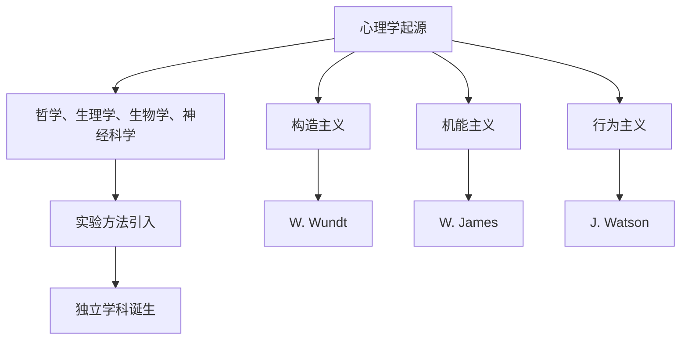

#### 1.1 心理学的诞生与早期发展

心理学作为一门科学，其起源可以追溯到19世纪中叶。当时，哲学、生理学、生物学和神经科学等学科的发展为心理学的诞生提供了理论基础和实验手段。心理学最初是作为哲学的一部分存在的，但随着实验方法的引入和科学研究的发展，心理学逐渐从哲学中独立出来，成为一门独立的科学。

**心理学的起源**：

- **19世纪哲学与科学发展的交汇**：在这个时期，科学革命的影响波及各个领域，哲学与科学开始紧密联系，相互影响。哲学家和科学家们开始探讨心灵的本质、意识的起源和认知过程等问题。

- **神经科学、哲学和实验心理学的兴起**：随着神经科学的进步，人们开始理解神经系统对心理过程的影响。哲学领域也出现了对意识和心智的深入探讨。同时，实验心理学的发展为心理研究提供了科学的方法和工具。

**心理学的主要人物**：

- **Wilhelm Wundt**：被称为“心理学之父”，他在1879年在莱比锡大学建立了世界上第一个心理学实验室，标志着心理学作为一门独立学科的诞生。

- **Edward Titchener**：构造主义心理学的代表人物，他强调心理结构的研究，提出了“构造主义心理学”的理论体系。

- **John B. Watson**：行为主义心理学的奠基人，他强调行为是可观察的，并通过实验来研究行为。

**早期发展的特点**：

- **实验方法的应用**：实验方法的引入使得心理学研究变得更为科学和可靠。

- **主观性与客观性的争论**：在早期，心理学研究面临着主观性和客观性的争论。一些学者认为心理学应该研究个体的主观体验，而另一些学者则认为心理学应该采用客观的实验方法来研究行为。

- **心理学的主要流派**：在早期，心理学形成了几个主要的流派，包括构造主义心理学、机能主义心理学和行为主义心理学等。这些流派对心理学的发展产生了深远的影响。

#### 1.2 心理学的主要流派

**构造主义心理学**：

- **核心概念**：构造主义心理学强调心理结构的分析，认为心理学应该研究个体内在的心理结构，如感觉、意象和情感。

- **代表人物**：Wilhelm Wundt和Edward Titchener是构造主义心理学的代表人物。

- **主要理论**：构造主义认为，人的心理活动是由感觉、意象和情感等基本元素构成的，这些元素通过组合和分解来产生复杂的心智活动。

**机能主义心理学**：

- **核心概念**：机能主义心理学关注心理功能的研究，认为心理学应该研究心理过程如何帮助个体适应环境。

- **代表人物**：William James和James Angell是机能主义心理学的代表人物。

- **主要理论**：机能主义认为，心理过程是动态的，不断适应和改变，以帮助个体实现目标和适应环境。

**行为主义心理学**：

- **核心概念**：行为主义心理学强调行为是可观察的，并通过实验来研究行为。

- **代表人物**：John B. Watson和B.F. Skinner是行为主义心理学的代表人物。

- **主要理论**：行为主义认为，行为是后天习得的，通过强化和惩罚来塑造行为。

### Mermaid 流程图

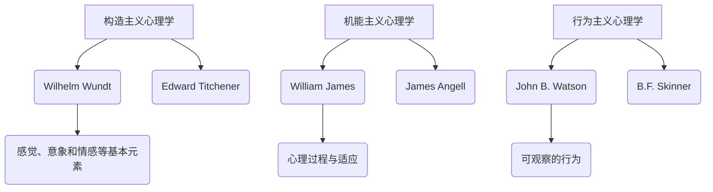

### 第2章: 精神分析与心理动力学

精神分析心理学和心理动力学是心理学中重要的流派，它们对个体心理过程和心理治疗的深入理解做出了重要贡献。在这一章中，我们将探讨精神分析的理论基础、心理动力学的主要代表人物以及这些理论在临床实践中的应用。

#### 2.1 精神分析的理论基础

精神分析心理学由奥地利医生西格蒙德·弗洛伊德（Sigmund Freud）创立，其理论核心包括无意识心理过程、三位一体结构（本我、自我、超我）和心理防御机制。

**弗洛伊德的理论**

- **无意识心理过程**：弗洛伊德认为，人的行为和情感受到无意识心理过程的影响。无意识中的内容通常是无法直接觉察到的，但它对个体的行为和情绪有着深远的影响。

- **三位一体结构**：弗洛伊德将心理结构分为三个部分：本我（id）、自我（ego）和超我（superego）。本我是原始的冲动和欲望，自我是调节本我和外部世界的力量，超我是道德和良心的代表。

- **心理防御机制**：心理防御机制是自我用来应对内在冲突和外部压力的心理策略。常见的防御机制包括压抑、投射、合理化等。

**精神分析的治疗方法**

- **治疗过程**：精神分析治疗是一种长期的治疗过程，治疗师和患者之间建立一种深层的关系。治疗的目标是揭示和解决潜意识冲突，帮助患者理解自己的行为和情绪。

- **梦的解析**：梦是潜意识冲突的象征性表达。弗洛伊德通过解析梦的内容，帮助患者揭示潜意识的愿望和冲突。

- **情感释放与内省**：在精神分析治疗中，患者通过情感释放和内省，逐步揭开潜意识中的冲突，实现心理上的解放。

#### 2.2 心理动力学的主要代表人物

除了弗洛伊德，心理动力学还包括其他重要的代表人物，他们的理论和贡献进一步丰富了心理动力学的理论体系。

**卡尔·荣格**

- **人格理论**：荣格提出人格理论，认为人格包括个人自我和集体无意识。集体无意识中包含人类共有的原型意象。

- **个人神话**：荣格认为，个人神话是个人与集体无意识相联系的桥梁，通过个人神话，个体可以实现自我整合。

- **集体无意识**：荣格提出集体无意识的概念，认为它是人类共同的文化和记忆的仓库，影响个体的行为和情感。

**阿尔弗雷德·阿德勒**

- **个人心理学**：阿德勒创立了个人心理学，强调个体对自我和社会的感知和解释。

- **人生风格**：阿德勒认为，个体在成长过程中形成特定的人生风格，这种风格影响个体的行为和人际关系。

- **社会利益取向**：阿德勒强调个体应该追求社会利益，认为这是实现心理健康和幸福的关键。

#### 2.3 临床应用中的心理动力学

心理动力学理论在临床实践中有着广泛的应用，包括心理治疗、咨询和心理咨询等。

**心理治疗**

- **治疗目标**：心理治疗的目标是解决潜意识冲突，提高个体的心理健康和幸福感。

- **治疗方法**：包括自由联想、梦的解析、情境重建等，旨在揭示潜意识冲突，帮助个体实现心理上的解放。

**咨询**

- **咨询目标**：咨询的目标是帮助个体解决具体问题，提高人际关系和生活质量。

- **咨询方法**：包括心理动力学咨询、认知行为咨询等，通过深入探讨个体的情感和行为，帮助个体找到解决问题的方法。

**心理咨询**

- **心理咨询目标**：心理咨询的目标是提高个体的心理健康水平，预防心理问题的发生。

- **心理咨询方法**：包括心理教育、心理疏导、情感支持等，通过提供心理知识和情感支持，帮助个体应对压力和挑战。

### Mermaid 流�程图

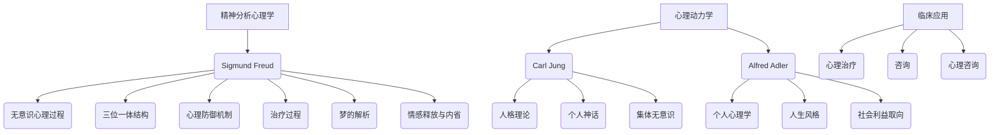

### 第3章: 行为主义心理学

行为主义心理学是20世纪早期发展起来的一种心理学流派，由约翰·B·华生（John B. Watson）创立，其核心理念是强调行为是后天习得的，可以通过实验进行客观研究。行为主义对心理学的发展产生了深远的影响，特别是在临床心理治疗和教育领域。

#### 3.1 行为主义的理论与实验

行为主义的理论基础主要源于对行为的研究，强调环境因素在行为形成中的作用。以下是行为主义的核心理论和相关实验：

**经典条件反射**

- **定义**：经典条件反射是指一个原本引起无条件反应的中性刺激（条件刺激CS），通过与无条件刺激（无条件刺激UCS）的结合，最终也能单独引起无条件反应。

- **实验**：巴甫洛夫（Ivan Pavlov）的经典实验中，他通过铃声作为条件刺激，与食物作为无条件刺激结合，最终使狗听到铃声就会分泌唾液。

**操作条件反射**

- **定义**：操作条件反射是指个体通过操作环境中的某些因素，从而获得积极或消极的后果，进而改变行为概率的过程。

- **实验**：斯金纳（B.F. Skinner）的实验中，通过奖励（正强化）或惩罚（负强化）来改变动物的行为。

**操作性条件作用**

- **定义**：操作性条件作用是指通过强化或惩罚来改变个体行为概率的过程。

- **实验**：斯金纳通过斯金纳箱实验，展示了操作条件反射如何影响动物的行为。

**行为主义的基本原理**

- **行为是后天习得的**：行为主义认为，行为不是遗传的，而是通过环境刺激和个体反应之间的联系习得的。

- **强化原理**：行为主义强调，行为受到正强化时会增加，受到负强化或惩罚时会减少。

- **环境决定论**：行为主义认为，个体的行为主要受到环境因素的影响，而遗传因素的作用相对较小。

#### 3.2 行为主义在临床应用中的体现

行为主义在临床心理治疗中有着广泛的应用，主要包括行为治疗、认知行为疗法（CBT）和暴露疗法等。

**行为治疗**

- **定义**：行为治疗是一种基于行为主义原理的心理治疗方法，通过改变个体的行为模式来改善心理健康。

- **应用**：行为治疗广泛应用于治疗焦虑、抑郁、强迫症等心理障碍。通过逐步暴露和逐步消除恐惧或不良行为，帮助患者建立健康的行为模式。

**认知行为疗法（CBT）**

- **定义**：认知行为疗法是一种结合行为主义和认知心理学的心理治疗方法，旨在改变个体的认知和行为。

- **应用**：CBT广泛应用于治疗焦虑症、抑郁症和创伤后应激障碍（PTSD）等心理障碍。通过识别和改变负面认知模式，帮助患者改善情绪和行为。

**暴露疗法**

- **定义**：暴露疗法是一种通过暴露个体于恐惧或不良情境来减少恐惧反应的治疗方法。

- **应用**：暴露疗法广泛应用于治疗恐惧症、社交焦虑症和创伤后应激障碍。通过逐步暴露，患者逐渐减少对恐惧情境的回避和反应。

**行为干预的策略**

- **自我监控**：通过记录和评估行为，帮助个体识别和改变不良行为模式。

- **行为塑造**：通过正向强化和逐步引导，帮助个体建立健康的行为习惯。

- **强化程序**：通过设置奖励和惩罚机制，激励个体维持或改变行为。

### Mermaid 流程图

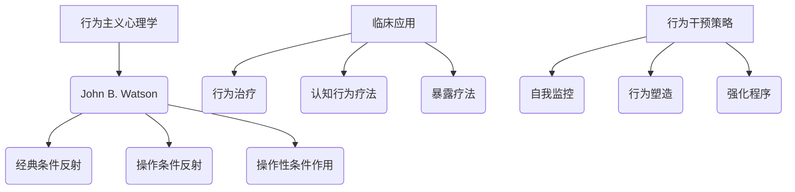

### 第4章: 认知心理学

认知心理学是心理学中的一个重要分支，主要研究人类的感知、记忆、思维、语言等认知过程。与传统的行为主义心理学不同，认知心理学更加关注心理内部的过程，试图揭示人类心智运作的机制。本章将详细介绍认知心理学的核心概念、主要研究方法和认知模型的构建。

#### 4.1 认知心理学的核心概念

认知心理学的核心概念涵盖了人类心理过程的多个方面，以下是一些关键的概念：

**认知过程**

- **感知**：个体对外界信息的接收和理解过程，包括视觉、听觉、触觉等感知方式。
- **记忆**：信息存储和回忆的过程，包括短期记忆和长期记忆。
- **思维**：解决问题的过程，包括逻辑推理、决策制定、问题解决等。
- **语言**：人类使用语言进行沟通和思维的能力。

**认知表征**

- **感觉表征**：感觉信息在大脑中的编码和存储形式，如视觉记忆中的图像编码。
- **记忆表征**：记忆中的信息是如何被组织、存储和提取的，包括语义记忆和情景记忆等。
- **思维表征**：思维过程中的信息组织方式，包括概念、规则、模型等。

**认知控制**

- **注意力**：选择和集中注意力的能力，决定哪些信息进入意识。
- **决策制定**：在多种选择中做出最优决策的过程。
- **执行功能**：控制认知过程的高级功能，如计划、工作记忆、注意力分配等。

#### 4.2 认知心理学的主要研究方法

认知心理学采用了多种研究方法来探究认知过程，以下是一些主要的研究方法：

**实验法**

- **反应时实验**：通过测量个体对刺激的反应时间来研究认知过程的速度和准确性。
- **认知任务**：设计特定的认知任务来研究认知过程的各个方面，如记忆任务、推理任务等。

**认知模型**

- **人工神经网络**：模拟人脑神经网络的结构和功能，用于研究和预测认知过程。
- **生成模型**：用于预测或生成数据的概率模型，如贝叶斯网络。
- **计算模型**：基于数学和计算机科学的方法来模拟认知过程。

**认知心理学的研究流程**

1. **提出研究问题**：确定要研究的认知过程和现象。
2. **建立假设**：根据已有理论和观察提出假设。
3. **设计实验**：设计实验来检验假设，包括选择被试、实验条件等。
4. **收集数据**：进行实验并收集数据。
5. **数据分析**：使用统计学方法分析数据，验证假设。
6. **结论**：根据数据分析结果得出结论。

### Mermaid 流程图

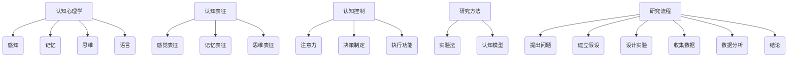

### 第5章: 发展心理学

发展心理学是研究个体从出生到死亡在整个生命历程中的心理发展变化的学科。它涵盖了生理、认知、情感和社会行为等多个方面的变化。在这一章中，我们将探讨个体心理发展的不同阶段及其特点，以及早期教育与家庭环境对个体心理发展的影响。

#### 5.1 个体心理发展的阶段与特点

个体心理发展可以分为以下几个主要阶段：

**婴儿期**

- **0-1岁**：婴儿在这个阶段主要依赖本能反应，如吮吸、啼哭和睡眠。他们开始学习如何控制身体，并逐渐建立起与父母和其他照看者的基本信任关系。

- **特点**：语言和认知能力开始发展，婴儿通过感知运动阶段（0-6个月）和视觉空间能力的发展来探索和理解世界。

**幼儿期**

- **1-3岁**：幼儿在这个阶段开始学习语言和社交技能。他们开始能够模仿他人的行为，并通过游戏和互动来理解社会规则。

- **特点**：语言能力快速发展，幼儿能够理解和使用简单的句子进行沟通。他们也开始形成自我意识和独立性。

**童年期**

- **3-12岁**：童年期是学校教育和知识学习的重要阶段。孩子们在这个阶段发展认知能力、社交技能和道德观念。

- **特点**：认知能力显著提升，孩子们能够进行逻辑推理、解决问题和创造性思维。他们也开始对自己的兴趣和未来职业进行初步探索。

**青少年期**

- **12-20岁**：青少年期是个体经历身体、心理和社会转变的重要阶段。他们开始形成自己的身份和价值观，并努力独立于父母。

- **特点**：情感波动较大，青少年经历情绪上的起伏和自我认同的探索。他们开始建立亲密的人际关系，并面临学业、职业和社交压力。

**成年期**

- **20岁以后**：成年期是个人发展的稳定阶段。个体在职业、家庭和社会角色中逐渐成熟，并继续发展自我认知和人际关系。

- **特点**：成年期分为几个阶段，如青年成年期、中年成年期和老年成年期。每个阶段都有不同的心理和社会挑战。

#### 5.2 早期教育与家庭环境的影响

早期教育和家庭环境对个体心理发展有着深远的影响。以下是一些关键点：

**早期教育的作用**

- **语言能力的发展**：早期教育提供了丰富的语言刺激，有助于儿童语言能力的快速提升。

- **认知能力的发展**：早期教育通过游戏和活动促进儿童的认知发展，如空间感知、问题解决和创造性思维。

- **社会适应能力的培养**：早期教育帮助儿童学习社交技能，如合作、分享和解决冲突。

**家庭环境的影响**

- **父母的教育方式**：父母的教育方式直接影响儿童的心理发展。积极的教育方式，如鼓励和支持，有助于儿童建立自信心和积极的态度。

- **家庭氛围与亲子互动**：和谐的家庭氛围和积极的亲子互动有助于儿童的心理健康。相反，家庭冲突和负面的亲子关系可能导致心理问题。

- **社会经济地位的影响**：社会经济地位影响家庭资源的获取，包括教育资源和医疗服务，从而影响儿童的心理发展。

### Mermaid 流程图

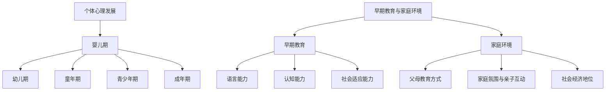

### 第6章: 社会心理学

社会心理学是研究个体在群体和社会环境中的心理过程和行为模式的学科。它涉及多个领域，包括社会认知、社会动机和社会影响。在这一章中，我们将探讨社会心理学的基本概念、社会影响的类型以及人际关系的研究。

#### 6.1 社会心理学的基本概念

社会心理学的基本概念包括以下几个方面：

**社会认知**

- **定义**：社会认知是指个体如何感知、理解、判断和记忆他人以及社会情境。
- **过程**：社会认知包括信息获取、信息加工、信息存储和提取等过程。
- **影响**：社会认知影响个体的行为、情感和决策。

**社会动机**

- **定义**：社会动机是指个体在群体和社会环境中的行为动机，包括社交需要、归属需要、权力需要等。
- **类型**：社会动机可以分为内在动机和外在动机，内在动机来自个体对活动本身的兴趣，而外在动机则来自外部奖励或惩罚。

**社会影响**

- **定义**：社会影响是指个体在群体和社会环境中受到他人行为、态度和情感的影响。
- **类型**：社会影响可以分为从众、权威效应、社会比较等。

**社会心理学的研究**

- **目标**：社会心理学旨在理解个体如何受到社会环境的影响，以及这种影响如何塑造个体的行为和认知。

#### 6.2 社会影响与人际关系的心理学研究

**社会影响的类型**

- **从众行为**：从众是指个体在群体压力下改变自己的行为或观点以符合群体规范。实验研究表明，从众行为受到多种因素的影响，如群体规模、群体一致性和个人自信心。

- **权威效应**：权威效应是指个体对权威人物的言论或行为给予高度信任和遵从。社会心理学研究表明，权威效应受到权威人物的信誉、专业知识和个体自信心的影响。

- **社会比较**：社会比较是指个体通过将自己与他人进行比较来评价自己的能力和价值。社会比较可能产生积极或消极的情感和认知后果，如自尊心提升或降低。

**人际关系的研究**

- **友谊与爱情**：友谊和爱情是人际关系研究的重要领域。研究表明，友谊和爱情对个体的心理健康和生活满意度有重要影响。人际关系的质量影响个体的情感状态和社会支持。

- **信任与背叛**：信任是人际关系中的核心元素，它是建立和维护长期关系的基础。背叛行为会破坏信任，导致关系的破裂。社会心理学研究信任和背叛的机制，以及如何通过沟通和共识来修复和维持信任。

- **人际沟通与冲突解决**：人际沟通是建立和维护人际关系的重要途径。有效的沟通有助于减少误解和冲突，增强关系质量。社会心理学研究沟通技巧、非言语沟通和冲突解决策略。

### Mermaid 流程图

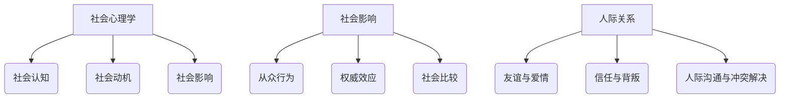

### 第7章: 积极心理学的概念与理论基础

积极心理学是心理学中的一个新兴领域，专注于研究人类的优点、幸福和潜能，旨在提升个体的生活质量和幸福感。与传统的心理学研究关注心理问题不同，积极心理学关注人的内在资源和优势，探索人类如何实现和维持积极状态。在这一章中，我们将探讨积极心理学的定义与目标，以及其主要研究领域。

#### 7.1 积极心理学的定义与目标

**积极心理学的定义**

积极心理学是心理学的一个分支，旨在通过研究人类的优点、幸福和潜能，来促进个体的心理福祉和社会福祉。它不仅关注人类的行为和心理健康问题，更注重挖掘和培养个体的内在优势和潜能。

**积极心理学的目标**

积极心理学的主要目标包括：

- **提升个体的幸福感**：通过研究和应用积极心理学的方法，帮助个体理解和提升自己的幸福感，从而提高生活质量。

- **促进社会福祉**：积极心理学研究如何通过提升个体和集体的积极品质，来促进社会的整体福祉和和谐。

- **探索人类潜能**：积极心理学致力于揭示人类的潜能，研究如何通过教育、培训和其他干预措施，来激发和实现这些潜能。

**积极心理学与传统心理学的区别**

- **研究焦点**：传统心理学主要关注心理问题和心理障碍，而积极心理学则更加关注人类的优点和潜能。

- **研究方法**：传统心理学方法更多是基于问题导向，而积极心理学则采用更多基于优势和发展导向的方法。

- **应用领域**：积极心理学不仅在临床和心理治疗领域有着广泛的应用，还在教育、组织管理和公共政策等领域有着重要的应用价值。

#### 7.2 积极心理学的主要研究领域

积极心理学的研究领域非常广泛，涉及多个学科和领域。以下是积极心理学的主要研究领域：

**幸福心理学**

幸福心理学是积极心理学的一个重要分支，研究幸福的定义、测量和提升策略。幸福心理学探讨如何通过积极的生活方式和心理训练来提高个体的幸福感。

- **幸福的定义与测量**：幸福心理学试图揭示幸福的本质，并开发有效的幸福感测量工具，如主观幸福感量表和生活满意度问卷。

- **提升幸福感的策略**：幸福心理学研究各种提升幸福感的方法，包括积极生活方式、心理训练、社会支持等。

**积极情感与心理健康**

积极情感与心理健康研究关注积极情绪对个体心理健康的影响。研究表明，积极情感有助于提升个体的心理免疫力、增强社会联结和提高创造力。

- **积极情感的类型与作用**：积极情感心理学研究不同类型的积极情感，如喜悦、满足、乐观等，以及这些情感如何影响个体的心理健康。

- **心理健康与积极心理学的联系**：积极心理学研究积极情感和心理健康之间的相互关系，以及如何通过积极心理学的方法来改善心理健康。

**人际关系与积极心理学**

人际关系与积极心理学研究人际关系对个体幸福感和社会福祉的影响。这个领域探讨如何建立积极的人际关系，以及这些关系如何提升个体的幸福感和心理健康。

- **人际关系的心理学研究**：这个领域研究人际关系的发展、维护和破裂，以及如何通过积极心理学的方法来改善人际关系。

- **促进积极人际关系的策略**：积极心理学研究各种促进积极人际关系的策略，包括沟通技巧、信任建设和社会支持等。

**组织心理学与积极心理学**

组织心理学与积极心理学研究如何通过积极心理学的原理和方法来提升组织效能和员工幸福感。这个领域探讨如何建立积极的组织文化，提升员工满意度和创造力。

- **组织行为学中的积极心理学**：这个领域研究如何通过积极心理学的理论和方法来改善组织行为和员工绩效。

- **提升组织效能的积极心理学方法**：积极心理学研究如何通过领导力发展、员工激励和团队合作等策略来提升组织效能。

### Mermaid 流程图

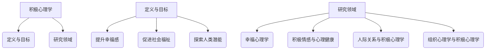

### 第8章: 幸福心理学

幸福心理学是积极心理学的一个重要分支，专注于研究幸福的定义、测量和提升策略。在这一章中，我们将详细探讨幸福的定义与测量方法，以及提升幸福感的有效策略。

#### 8.1 幸福的定义与测量

**幸福的定义**

幸福是一个多维度的概念，通常包括以下几个方面：

- **情感层面**：指的是个体在日常生活中感受到的快乐、满足和愉悦。
- **认知层面**：包括个体对自身生活满意度和生活质量的主观评价。
- **行为层面**：涉及个体在面对挑战和困难时的适应能力，以及其生活目标和价值观的实现。

**幸福测量的方法**

幸福测量的方法多种多样，以下是一些常用的方法：

- **自我报告问卷**：通过问卷形式，直接询问个体对幸福的感受和生活满意度的评价。常见的问卷包括总体幸福感量表（SWLS）、生活质量量表（QLQ）等。

- **客观生活指标**：通过分析个体的生活条件、社会地位、健康状况等客观指标来评估幸福感。例如，收入水平、教育程度、健康状态等。

- **心理生理测量**：通过生理指标，如心率、皮质醇水平等来评估个体的心理状态。例如，研究发现，快乐个体的心率变异性通常较高，表明他们的心理调节能力较强。

**幸福感的提升策略**

提升幸福感的策略可以分为两大类：积极生活方式和心理训练方法。

**积极生活方式**

- **健康饮食**：研究表明，健康的饮食习惯有助于提升幸福感。均衡的饮食可以提供必要的营养，有助于维持身体和心理健康。

- **运动**：定期的体育锻炼可以改善个体的情绪状态，减少焦虑和抑郁。运动还能促进大脑释放内啡肽，提高幸福感。

- **睡眠质量**：充足的睡眠对于维持良好的心理状态至关重要。睡眠不足会导致情绪波动、注意力下降和记忆力减退。

- **社交互动**：积极的社交互动可以增强个体的社会支持网络，提高幸福感。与家人、朋友和同事建立良好的关系有助于应对生活中的挑战。

**心理训练方法**

- **正念冥想**：正念冥想是一种通过专注当下、减少思维杂念的方法。研究表明，正念冥想有助于提高个体的情绪调节能力，减少焦虑和抑郁。

- **情绪调节技巧**：情绪调节技巧包括认知重构、情绪释放和表达等。通过学习这些技巧，个体可以更好地管理和应对负面情绪。

- **积极心理训练**：积极心理训练旨在培养个体的积极心态和乐观态度。通过自我激励、感恩练习和正面思维训练，个体可以提升幸福感。

### Mermaid 流程图

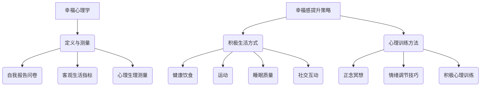

### 第9章: 积极情感与心理健康

积极情感与心理健康研究关注积极情绪对个体心理健康的影响。在这一章中，我们将探讨积极情感的类型与作用，以及心理健康与积极心理学的联系。

#### 9.1 积极情感的类型与作用

积极情感是指那些具有积极性质的情绪体验，如快乐、满足、爱和乐观等。积极情感对个体的心理健康有着诸多积极影响，以下是一些主要类型和作用：

**快乐**

- **定义**：快乐是一种短暂但强烈的积极情绪体验，通常与愉悦的活动和事件相关。
- **作用**：快乐有助于提升个体的情绪状态，增加积极情感体验，从而提高心理健康。

**满足**

- **定义**：满足是一种持续的、相对稳定的积极情感体验，通常与目标实现、需求满足和内心平静相关。
- **作用**：满足感有助于增强个体的自我认同和自我价值感，从而提高心理健康。

**爱**

- **定义**：爱是一种深刻的、持久的积极情感，通常与亲密关系、关爱和支持相关。
- **作用**：爱能够增强个体的社会联结感，提供情感支持，从而有助于提升心理健康。

**乐观**

- **定义**：乐观是一种积极的、对未来持积极态度的情绪状态。
- **作用**：乐观有助于个体更好地应对生活中的挑战，增强心理韧性，从而提高心理健康。

**积极情感的作用**

- **提升心理免疫**：积极情感能够增强个体的心理抵抗力，帮助个体更好地应对压力和挑战。

- **促进社会联结**：积极情感有助于增强个体与他人之间的联系，提高社会支持水平，从而改善心理健康。

- **提高创造力与决策能力**：研究表明，积极情感能够提升个体的创造力和决策能力，有助于在复杂情境中做出更好的决策。

#### 9.2 心理健康与积极心理学的联系

心理健康是指个体在情感、认知和行为上的健康状态，包括良好的适应和功能状态。积极心理学与心理健康之间存在着密切的联系，以下是一些关键点：

**心理健康的定义**

心理健康是指个体在情感、认知和行为上的健康状态，包括良好的适应和功能状态。心理健康不仅涉及个体是否患有心理疾病，还包括个体的整体幸福感、生活满意度和社会适应能力。

**心理健康与积极心理学的联系**

- **积极情感是心理健康的重要指标**：积极情感是心理健康的一个重要组成部分。个体的积极情感水平往往与他们的心理健康状况密切相关。

- **积极心理学的方法提升心理健康**：积极心理学通过研究和应用各种提升幸福感和积极情感的方法，如正念冥想、感恩练习和积极心理训练等，来促进个体的心理健康。

- **心理健康促进积极心理学的目标**：积极心理学的一个核心目标是提升个体的心理健康水平，从而提高生活质量和社会福祉。

**积极心理学在心理健康促进中的应用**

- **情感调节**：积极心理学通过教授个体情感调节技巧，如认知重构和情绪释放，来帮助个体更好地管理负面情绪，提高心理健康。

- **心理训练**：积极心理学通过心理训练方法，如正念冥想和积极心理训练，来增强个体的心理韧性和适应能力，从而提升心理健康。

- **社会支持**：积极心理学强调社会支持对心理健康的重要性，通过建立和加强社会支持网络，来促进个体的心理健康。

### Mermaid 流程图

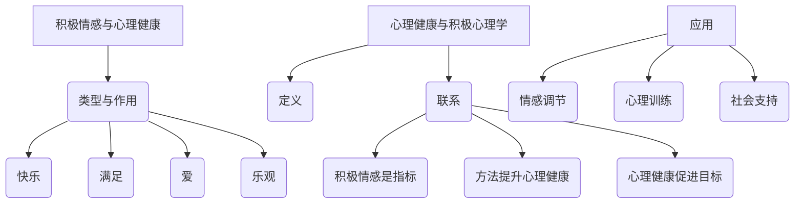

### 第10章: 人际关系与积极心理学

人际关系是心理学研究的一个重要领域，它关注个体在社交互动中的心理过程和行为模式。积极心理学为理解人际关系提供了新的视角和方法，强调积极特质和积极行为在促进人际关系中的作用。在这一章中，我们将探讨人际关系的心理学研究，以及促进积极人际关系的策略。

#### 10.1 人际关系的心理学研究

**人际关系的重要性**

人际关系是人类生活中不可或缺的一部分，对个体的心理健康和生活满意度有着重要影响。良好的人际关系能够提供情感支持、增强社会归属感，并促进个体的整体福祉。

**人际关系的类型**

人际关系可以分为多种类型，包括家庭关系、友谊、同事关系等。每种关系都有其独特的特点和心理机制。

- **家庭关系**：家庭是个人社会化的第一个环境，家庭关系对个体的情感发展和心理健康有着深远影响。
- **友谊**：友谊是建立在信任和共同兴趣基础上的长期关系，对个体的幸福感和社会支持有重要贡献。
- **同事关系**：在职场中，同事关系对工作效率和职业满意度有着直接影响。

**人际关系的心理学研究**

人际关系心理学研究涉及多个方面，包括人际吸引、信任、沟通和冲突解决等。

- **人际吸引**：研究个体如何选择和吸引特定的社交伙伴，以及这些关系如何影响个体的幸福感。
- **信任**：研究个体如何建立和维护信任关系，以及信任对人际关系的重要性。
- **沟通**：研究个体如何通过语言和非语言手段进行有效沟通，以及沟通技巧对人际关系的影响。
- **冲突解决**：研究个体如何识别和解决人际冲突，以及冲突解决策略对人际关系的影响。

#### 10.2 促进积极人际关系的策略

积极人际关系对个体的心理健康和生活满意度有重要影响。以下是一些促进积极人际关系的策略：

**建立信任**

- **诚实与透明**：建立信任的基础是诚实和透明。个体应该诚实地表达自己的想法和感受，避免隐瞒或欺骗。
- **共同目标和价值观**：共同的目标和价值观有助于建立信任。个体应该寻找与自己在这些方面的相似之处。
- **尊重与包容**：尊重他人的观点和感受是建立信任的重要一步。包容不同观点和背景的个体，有助于建立和谐的人际关系。

**改善沟通**

- **倾听与表达**：有效沟通的关键是倾听和表达。倾听他人的观点，并清楚表达自己的想法和感受，有助于减少误解和冲突。
- **非言语沟通技巧**：非言语沟通，如肢体语言、面部表情和姿态，对沟通效果有着重要影响。个体应该注意自己的非言语表达，以增强沟通效果。
- **解决冲突的策略**：面对冲突时，个体应该采取积极解决问题的态度，避免逃避或攻击性回应。有效的冲突解决策略包括主动沟通、妥协和寻求共同利益。

**情感支持**

- **提供情感支持**：在人际关系中，提供情感支持是非常重要的。个体应该愿意倾听他人的烦恼，提供安慰和鼓励。
- **建立互惠关系**：互惠关系是基于相互支持和信任的。个体应该确保自己在他人的生活中扮演一个有价值的角色。
- **共享积极体验**：共享积极体验，如庆祝成就、共同参与活动等，有助于增强人际关系。

### Mermaid 流程图

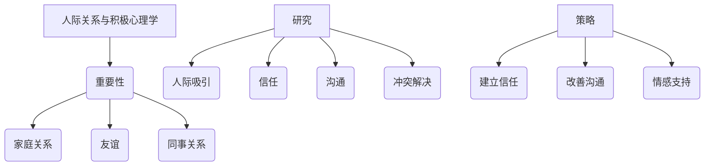

### 第11章: 学校教育与积极心理学

学校教育是个人成长和发展的重要阶段，积极心理学为学校教育提供了新的视角和方法，强调通过培养积极心理品质和提升幸福感来促进学生的全面发展。在这一章中，我们将探讨积极心理学在学校教育中的应用，以及如何通过教师与学生积极心理发展的策略来提升教育效果。

#### 11.1 学校教育中的积极心理学应用

**积极心理学在学校教育中的作用**

积极心理学在学校教育中的应用主要体现在以下几个方面：

- **提升学生幸福感**：通过培养积极心理品质，如乐观、自信和感恩，来提升学生的幸福感，从而提高学习动力和学业表现。
- **培养积极学习态度**：积极心理学提供了一系列方法和策略，如积极情绪调节、目标设定和自我效能感培养，帮助学生在面对学习挑战时保持积极态度。
- **促进学校文化建设**：积极心理学倡导建立积极、包容和支持的学校文化，减少欺凌和冲突，增强学生的归属感和安全感。

**积极心理学在课堂中的应用**

- **情绪管理技巧**：教师可以教授学生情绪管理技巧，如认知重构、情绪调节和放松技巧，帮助学生更好地应对情绪困扰。
- **积极心态的培养**：通过正念练习、感恩活动和积极自我对话，教师可以帮助学生培养积极心态，提高自尊和自我效能感。
- **社交技能的培训**：教师可以设计社交技能培训课程，教授学生如何进行有效沟通、建立友谊和处理冲突。

#### 11.2 教师与学生积极心理发展的策略

**教师的积极心理发展**

- **自我反思与自我提升**：教师应该进行定期自我反思，识别和克服个人问题，不断提升专业能力和心理素养。
- **情绪调节技巧**：教师需要掌握情绪调节技巧，以更好地管理自己的情绪，避免将负面情绪带入课堂。
- **专业成长与持续学习**：教师应积极参与专业培训和学习，不断更新知识和教学策略，以适应学生发展的需求。

**学生的积极心理发展**

- **培养自尊与自信**：教师可以通过表扬和鼓励，帮助学生建立自尊和自信，提高他们在学业和生活中的自我价值感。
- **增强学习动机**：教师可以设置明确的学习目标，提供有挑战性的任务，并给予适时的反馈，以增强学生的学习动机。
- **培养积极的人际关系**：教师可以引导学生建立积极的人际关系，学会合作、沟通和解决冲突，从而提高社会适应能力。

**教师与学生合作**

- **共同目标与价值观**：教师和学生应共同设定学习目标，并明确各自的价值观，以确保教学和学习活动的一致性。
- **互相支持和反馈**：教师应鼓励学生之间的支持和反馈，营造一个积极、互助的学习氛围。
- **个性化教育**：教师应根据学生的个体差异，提供个性化的教育和支持，满足不同学生的需求。

### Mermaid 流程图

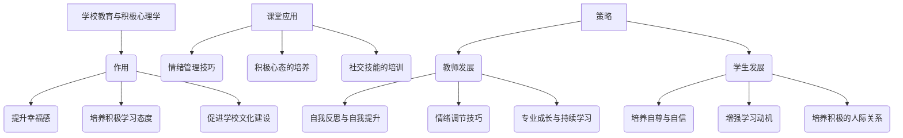

### 第12章: 组织心理学与积极心理学

组织心理学是心理学在组织行为和管理中的应用领域，它关注个体、团队和组织在组织环境中的行为和动力。积极心理学为组织心理学提供了新的视角和方法，通过培养积极心理品质和组织文化来提升组织效能。在这一章中，我们将探讨组织行为学中的积极心理学，以及提升组织效能的积极心理学方法。

#### 12.1 组织行为学中的积极心理学

**组织行为学的定义**

组织行为学是研究个体、团队和组织在组织环境中的行为和动力的学科。它涉及多个方面，包括个体行为、团队过程、组织文化和组织效能。

**积极心理学在组织行为学中的应用**

积极心理学在组织行为学中的应用主要体现在以下几个方面：

- **提升员工幸福感**：通过培养积极心理品质，如乐观、满意和投入，来提升员工的幸福感，从而提高工作效率和组织承诺。
- **增强团队协作与创新能力**：积极心理学提供了一系列方法和策略，如团队建设活动、积极反馈和共同目标，来增强团队协作和创新能力。
- **促进组织文化的建设**：积极心理学倡导建立积极、包容和支持的组织文化，减少负面情绪和行为，提高组织的整体效能。

**积极心理学在组织行为学中的具体应用**

- **积极领导力**：通过培养积极领导力，领导者可以激发员工的积极性和创造力，提升组织的整体效能。
- **员工满意度提升**：通过改善工作环境、提供职业发展机会和建立积极的工作关系，来提升员工的满意度。
- **组织文化塑造**：通过强化组织核心价值观、促进沟通与协作，来塑造积极向上的组织文化。

#### 12.2 提升组织效能的积极心理学方法

提升组织效能是组织管理的核心目标之一，积极心理学提供了一系列方法和策略来实现这一目标。

**积极领导力**

积极领导力是指领导者通过激发和培养员工的积极心理品质，来提升组织效能和员工幸福感。以下是积极领导力的一些关键要素：

- **培养领导者的积极心态**：领导者应该具备积极的心态，以影响和激励团队成员。
- **提升领导者的情绪智力**：领导者需要具备较高的情绪智力，能够理解和管理自己的情绪，以及识别和应对团队成员的情绪。
- **促进积极的团队氛围**：领导者应该创造一个积极的团队氛围，鼓励团队成员分享想法、共同解决问题，并支持彼此的成长。

**员工满意度提升**

员工满意度是衡量组织效能的重要指标之一，通过以下策略可以提升员工满意度：

- **创建支持性工作环境**：组织应该提供安全、健康和支持性的工作环境，确保员工在工作中感到舒适和被尊重。
- **提供职业发展机会**：组织应该为员工提供职业发展机会，包括培训、晋升和跨部门调动等，以满足员工的发展需求。
- **确保工作与个人价值观的匹配**：组织应该确保员工的工作与他们的个人价值观和兴趣相符，从而提高工作满意度和忠诚度。

**组织文化塑造**

组织文化是组织的核心价值观、信念和行为模式的总和，它对员工的行为和工作态度有重要影响。以下是一些塑造积极组织文化的策略：

- **强化组织核心价值观**：组织应该明确和强化核心价值观，确保员工理解并认同这些价值观，并在工作中实践。
- **促进组织内部的沟通与协作**：组织应该鼓励员工之间的沟通与协作，建立开放、透明和信任的组织氛围。
- **建立积极向上的组织氛围**：组织应该通过积极的激励和奖励机制，鼓励员工展现积极行为，建立积极向上的组织氛围。

### Mermaid 流程图

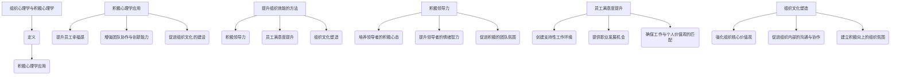

### 第13章: 心理问题的识别与诊断

心理问题的识别与诊断是心理健康服务中的关键步骤，它关系到正确治疗方案的制定和有效干预的进行。在这一章中，我们将探讨心理问题的分类与识别方法，以及心理诊断的方法与技巧。

#### 13.1 心理问题的分类与识别

**心理问题的定义**

心理问题是心理功能紊乱或障碍，影响个体的情感、认知和行为。心理问题可以是短暂的，如焦虑和抑郁，也可以是长期的，如精神分裂症和人格障碍。

**心理问题的分类**

心理问题可以根据不同的标准进行分类，常见的分类方法包括：

- **根据症状特点**：如焦虑障碍、抑郁障碍、人格障碍、精神分裂症等。
- **根据严重程度**：如轻度心理问题、中度心理问题和严重心理问题。
- **根据功能损害程度**：如适应障碍、社会功能受损、工作或学习受影响等。

**心理问题的识别方法**

识别心理问题通常需要以下步骤：

- **自我报告问卷**：通过标准化的问卷，如焦虑自评量表（SAS）和抑郁自评量表（SDS），来评估个体的心理状态。
- **临床访谈**：通过与个体的面对面交流，了解他们的情感、行为和认知状况，以识别潜在的心理问题。
- **生理和心理测试**：通过生理和心理测试，如脑电图（EEG）和心理测量学测试，来评估个体的心理功能。

#### 13.2 心理诊断的方法与技巧

**心理诊断的基本原则**

心理诊断应遵循以下基本原则：

- **全面评估**：在诊断过程中，应综合考虑个体的情感、认知、行为和生理状态。
- **系统性分析**：诊断过程应系统性地分析个体的心理问题，包括问题的起因、发展过程和当前状况。
- **持续性观察**：在诊断过程中，应持续观察个体的行为和情绪变化，以准确评估问题的发展趋势。

**心理诊断的方法**

心理诊断通常采用以下方法：

- **临床诊断**：通过临床访谈和观察，医生可以对个体的心理问题进行初步诊断。
- **诊断性访谈**：深入访谈可以帮助医生了解个体的心理问题，包括其情感、行为和认知状况。
- **心理评估工具**：使用标准化的心理评估工具，如人格测验、情绪测验和认知评估工具，来辅助诊断。

**心理诊断的技巧**

- **倾听与提问**：在诊断过程中，医生应倾听患者的自我描述，并通过提问来深入了解患者的心理状态。
- **情感识别与理解**：医生应具备识别和表达患者情感的能力，以建立信任关系并理解患者的内心体验。
- **综合分析与判断**：在收集到足够的信息后，医生应进行综合分析，并基于临床经验和科学知识做出诊断判断。

### Mermaid 流程图

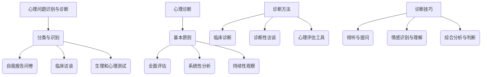

### 第14章: 心理干预的基本原则与策略

心理干预是指通过专业的心理学方法和技巧，帮助个体解决心理问题、提升心理健康水平的过程。在这一章中，我们将探讨心理干预的基本原则和主要策略，包括尊重原则、保密原则、非评判原则、合作原则以及认知行为疗法、情绪调节技巧、心理教育与指导和支持性干预等。

#### 14.1 心理干预的基本原则

**尊重原则**

- **定义**：尊重原则要求心理干预者尊重个体的尊严、价值和自主权，确保干预过程中的平等和尊严。
- **实施**：在心理干预过程中，干预者应尊重个体的选择和决定，避免强制干预，确保个体在治疗过程中感到被尊重和理解。

**保密原则**

- **定义**：保密原则要求干预者对个体在治疗过程中提供的信息保密，保护个体的隐私。
- **实施**：干预者应明确告知个体保密政策，并在治疗过程中严格遵守，避免信息泄露，确保个体的信任。

**非评判原则**

- **定义**：非评判原则要求干预者在干预过程中保持中立，避免主观偏见和评判，尊重个体的独特性和多样性。
- **实施**：干预者应避免对个体的行为、态度和经历进行主观评价，而是通过理解和接纳的态度，帮助个体探索和解决问题。

**合作原则**

- **定义**：合作原则强调干预者与个体之间的合作，共同制定干预计划，共同参与治疗过程。
- **实施**：干预者应与个体建立良好的合作关系，共同设定治疗目标，并在治疗过程中提供支持和指导。

#### 14.2 心理干预的主要策略

**认知行为疗法**

认知行为疗法（CBT）是一种广泛应用于心理干预的方法，通过改变个体的认知和行为来改善心理健康。以下是认知行为疗法的一些关键策略：

- **认知重构**：帮助个体识别和改变消极的思维模式，建立积极的认知框架。
- **行为激活**：通过引导个体参与有意义的活动和任务，提高行为积极性和生活质量。
- **技能训练**：教授个体应对压力、情绪调节和解决问题的技能。

**情绪调节技巧**

情绪调节技巧是指帮助个体识别、理解和调节情绪的方法。以下是一些常见的情绪调节技巧：

- **认知重构**：通过改变对事件的认知评价，减少负面情绪的影响。
- **情绪释放与表达**：鼓励个体通过适当的渠道表达情绪，减少情绪积累。
- **放松训练**：通过深呼吸、冥想和放松练习来缓解紧张和焦虑。

**心理教育与指导**

心理教育与指导是指通过提供心理学知识和技能，帮助个体理解和应对心理问题。以下是心理教育与指导的一些关键点：

- **提供心理学知识**：向个体介绍心理问题的本质、原因和治疗方法。
- **指导心理调适方法**：教授个体如何通过自我调节和应对策略来改善心理健康。

**支持性干预**

支持性干预是指通过提供情感支持和社交支持来帮助个体应对心理问题。以下是支持性干预的一些关键策略：

- **提供情感支持**：倾听个体的感受，给予安慰和鼓励。
- **增强应对能力**：通过技能培训和问题解决指导，提高个体的应对能力。
- **促进社会支持网络**：帮助个体建立和维护良好的社交关系，提供社交支持。

### Mermaid 流程图

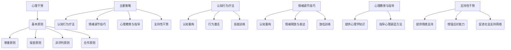

### 第15章: 心理治疗的方法与技术

心理治疗是专业治疗者通过心理干预帮助个体解决心理问题、提升心理健康水平的过程。在这一章中，我们将探讨心理治疗的理论基础、主要方法以及这些方法的实际应用。

#### 15.1 心理治疗的理论基础

**心理治疗的概念**

心理治疗是指通过专业的心理学方法和技术，帮助个体解决心理问题、改善情感状态、提升生活质量和心理功能的系统过程。心理治疗可以是短期的，也可以是长期的，取决于个体的需求和问题的性质。

**心理治疗的理论框架**

心理治疗的理论框架多种多样，不同的理论框架提供了不同的视角和方法。以下是几种主要的心理治疗理论框架：

- **精神分析治疗**：精神分析治疗由西格蒙德·弗洛伊德创立，强调潜意识冲突的解决和无意识过程的影响。治疗过程通常涉及自由联想、梦的解析和情感释放。

- **认知行为治疗**：认知行为治疗（CBT）是一种结构化的治疗方法，强调认知过程和行为对情绪的影响。治疗过程通常涉及认知重构、行为激活和技能训练。

- **人本主义治疗**：人本主义治疗强调个体的自我实现和自我决定。治疗过程通常涉及自我探索、情感表达和关系建立。

- **系统家庭治疗**：系统家庭治疗关注家庭内部的关系动态和互动模式。治疗过程通常涉及家庭沟通、角色分析和家庭重构。

#### 15.2 心理治疗的主要方法

**个体心理治疗**

个体心理治疗是一种针对单个个体的治疗方法，通常在私密的治疗环境中进行。以下是几种常见的个体心理治疗方法：

- **个人心理辅导**：个人心理辅导是一种一对一的治疗方式，治疗师和患者建立治疗关系，探讨患者的情感、行为和认知问题。

- **情感聚焦疗法（EFT）**：情感聚焦疗法是一种以情感为中心的治疗方法，强调情感表达和治疗关系的建设。

- **认知行为治疗（CBT）**：认知行为治疗是一种结构化的治疗方法，通过改变消极的认知和行为模式来改善心理健康。

**团体心理治疗**

团体心理治疗是一种将多个患者聚集在一起的治疗方法，通过团体互动和支持来促进个体的成长和改变。以下是几种常见的团体心理治疗方法：

- **支持性团体治疗**：支持性团体治疗提供一个安全和接纳的环境，患者可以分享自己的经历，获得情感支持和建议。

- **行为团体治疗**：行为团体治疗通过团体活动和行为训练来促进个体行为的改变。

- **心理剧**：心理剧是一种戏剧化的治疗方法，患者通过角色扮演和情境再现来探索和处理内心冲突。

**家庭治疗**

家庭治疗是一种针对整个家庭的治疗方法，旨在改善家庭关系和解决家庭内部的冲突。以下是几种常见的家庭治疗方法：

- **系统家庭治疗**：系统家庭治疗关注家庭内部的互动模式和角色关系，通过家庭沟通、角色分析和家庭重构来解决问题。

- **结构化家庭治疗**：结构化家庭治疗采用结构化的治疗过程，帮助家庭建立健康的互动模式。

- **家庭系统排列**：家庭系统排列是一种通过排列家庭成员的位置和互动来揭示和解决家庭问题的治疗方法。

#### 15.3 心理治疗的实际应用

心理治疗在多个领域有着广泛的应用，以下是一些实际应用案例：

- **抑郁症治疗**：认知行为治疗（CBT）和人际治疗（IPT）是治疗抑郁症的有效方法。治疗师通过帮助患者改变消极的认知和情绪，提升生活质量。

- **焦虑症治疗**：行为疗法、暴露疗法和放松训练是治疗焦虑症的有效方法。治疗师通过逐步暴露患者于恐惧情境，帮助他们减少焦虑。

- **精神分裂症治疗**：精神分析治疗和认知行为治疗（CBT）可以帮助患者管理症状，提高生活质量。

- **婚姻和家庭治疗**：婚姻和家庭治疗可以帮助解决夫妻之间的冲突，改善家庭关系，提高家庭满意度。

### Mermaid 流程图

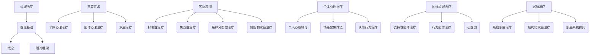

### 第16章: 心理健康促进策略

心理健康促进是指通过多种方法来提高个体的心理健康水平，增强心理韧性，预防心理问题的发生。在这一章中，我们将探讨心理健康促进的定义与目标，以及具体的实践策略。

#### 16.1 心理健康促进的定义与目标

**心理健康的定义**

心理健康是指个体在情感、认知、行为和社交等方面的健康状态，包括良好的适应能力和情感稳定性。

**心理健康促进的定义**

心理健康促进是指通过一系列方法和策略，提高个体的心理健康水平，增强心理韧性，预防心理问题的发生。

**心理健康促进的目标**

心理健康促进的主要目标包括：

- **提高个体的幸福感**：通过促进积极情绪和情感体验，提高个体的生活质量和幸福感。
- **增强心理韧性**：通过培养个体的应对能力和适应能力，增强他们在面对挑战和压力时的心理韧性。
- **预防心理问题**：通过早期干预和预防措施，减少心理问题的发生和发展。

#### 16.2 心理健康促进的实践策略

**生活方式的改变**

生活方式的改变是心理健康促进的重要策略，以下是一些具体的方法：

- **健康饮食**：均衡的饮食可以提供必要的营养，有助于维持身体和心理健康。增加摄入富含Omega-3脂肪酸的食物，如鱼类，有助于改善情绪。

- **定期锻炼**：定期的体育锻炼可以改善个体的情绪状态，减少焦虑和抑郁。运动还能促进大脑释放内啡肽，提高幸福感。

- **充足睡眠**：充足的睡眠对于维持良好的心理状态至关重要。睡眠不足会导致情绪波动、注意力下降和记忆力减退。

- **减少压力**：通过时间管理、放松技巧和压力管理策略，帮助个体减少生活中的压力。

**心理技能培训**

心理技能培训是指通过训练来提高个体的心理素质和应对能力，以下是一些常见的方法：

- **情绪调节技巧**：通过认知重构、情绪释放和表达等方法，帮助个体更好地管理和调节情绪。

- **应对策略**：教授个体如何识别和处理生活中的压力源，提高应对能力。

- **自我认知**：通过自我反思和自我探索，帮助个体更好地理解自己的情感和行为，提高自我认知能力。

**社会支持系统**

社会支持系统是指通过家庭、朋友、社区和专业帮助来提供支持和帮助，以下是一些具体的方法：

- **建立良好的人际关系**：建立和支持性的家庭关系、友谊关系和社交网络，有助于提高个体的心理健康。

- **寻求专业帮助**：当个体遇到心理问题时，寻求专业心理咨询和心理治疗可以帮助他们解决心理困扰。

- **参与社区活动**：参与社区活动和志愿者工作，有助于提高个体的社会归属感和幸福感。

**健康教育**

健康教育是指通过教育和宣传来提高个体对心理健康的认识和重视，以下是一些具体的方法：

- **心理健康知识普及**：通过教育和宣传，提高个体对心理健康问题的认识，了解心理健康促进的方法和策略。

- **心理健康课程**：开展心理健康课程和工作坊，帮助个体学习心理健康知识和技能。

- **心理健康宣传活动**：通过心理健康宣传活动，提高公众对心理健康问题的关注度和支持度。

### Mermaid 流程图

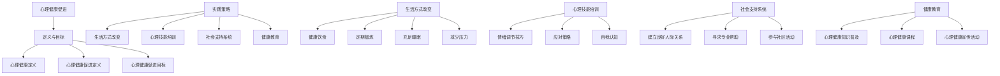

### 第17章: 心理健康的公共管理与政策

心理健康的公共管理是指通过政府和社会组织来制定和实施心理健康政策，以促进公众的心理健康，减少心理问题的发生。在这一章中，我们将探讨心理健康政策的发展历程、主要内容以及心理健康公共卫生管理的任务和策略。

#### 17.1 心理健康政策的发展

**心理健康政策的重要性**

心理健康政策在社会发展中扮演着重要角色。心理健康问题不仅影响个体的生活质量，还对社会经济造成负担。因此，制定和实施有效的心理健康政策对于提高公众心理健康水平、促进社会和谐具有重要意义。

**心理健康政策的发展历程**

- **国际心理健康政策的发展**：20世纪中叶以来，随着世界卫生组织（WHO）等国际组织的推动，全球心理健康政策得到了快速发展。1980年，《世界卫生组织心理健康行动计划》的发布标志着全球心理健康政策的起步。

- **我国心理健康政策的发展**：我国心理健康政策的发展历程可分为几个阶段。1980年代，我国开始关注心理健康问题，制定了一系列相关政策。2000年代，我国发布了《中华人民共和国精神卫生法》，标志着心理健康政策体系的初步建立。

**心理健康政策的主要内容**

心理健康政策的主要内容包括：

- **心理健康服务体系建设**：建立覆盖城乡的基层心理健康服务网络，提高心理健康服务的可及性和质量。

- **心理健康宣传教育**：通过多种渠道开展心理健康知识普及，提高公众心理健康意识和自我保健能力。

- **心理健康问题干预与治疗**：制定和实施心理健康问题预防和干预策略，提供专业的心理治疗和康复服务。

- **心理健康法律法规**：制定和完善心理健康相关法律法规，保障心理健康服务质量和患者权益。

#### 17.2 心理健康公共卫生管理

**公共卫生管理的概念**

公共卫生管理是指通过政府、社会组织和医疗机构等共同合作，采取预防、控制和治疗等措施，维护公众健康，促进社会健康发展的过程。

**心理健康公共卫生管理的任务**

心理健康公共卫生管理的任务包括：

- **心理健康监测与评估**：通过定期监测和评估心理健康状况，了解心理健康问题的分布和趋势，为政策制定提供依据。

- **心理健康问题预防与控制**：开展心理健康问题预防与控制工作，如心理健康教育、心理健康筛查和早期干预。

- **心理健康服务的公平与可及性**：确保心理健康服务的公平性和可及性，特别是为弱势群体提供心理援助。

**心理健康公共卫生管理的策略**

心理健康公共卫生管理策略包括：

- **健康教育宣传**：通过多种渠道开展心理健康知识普及，提高公众心理健康意识和自我保健能力。

- **社区心理支持网络**：建立和完善社区心理支持网络，为居民提供心理健康支持和咨询服务。

- **心理危机干预与应对**：建立心理危机干预机制，为面临心理危机的个体提供及时援助。

- **心理健康服务模式创新**：探索和推广心理健康服务新模式，提高心理健康服务的质量和效率。

### Mermaid 流程图

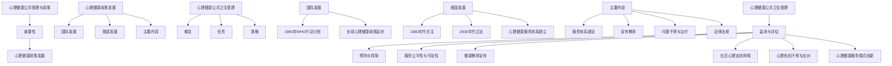

### 第18章: 心理学研究方法概述

心理学研究方法是指用于收集、分析和解释心理学数据的各种技术和策略。有效的心理学研究方法不仅能提高研究的准确性和可靠性，还能推动心理学理论和应用的进步。在这一章中，我们将概述心理学研究的主要方法，包括实验研究、调查研究以及心理学研究方法的发展趋势。

#### 18.1 实验研究的方法与设计

**实验研究的定义**

实验研究是心理学研究中最常用的方法之一，它通过控制变量和操作自变量来观察因变量的变化，从而探讨因果关系。实验研究旨在验证假设，通过系统的操作和控制来减少误差。

**实验研究的设计类型**

- **真实验设计**：在真实验设计中，实验组和控制组被随机分配，以消除选择偏差。这种方法通常用于控制内外部有效因素。

- **非真实验设计**：非真实验设计包括匹配设计和现场实验等，它们可能在某些方面无法完全控制变量，但仍然是有效的心理学研究方法。

- **系统评价与荟萃分析**：系统评价和荟萃分析是通过对多个研究进行综合评估和分析，来提高研究结果的可靠性和有效性。

**实验研究的步骤**

- **提出研究问题**：明确研究目标和要解决的问题。
- **建立假设**：根据已有理论和观察，提出具体的假设。
- **设计实验**：确定实验条件、操作步骤和测量指标。
- **实施实验**：按照设计进行实验操作和数据收集。
- **数据分析**：使用统计学方法分析数据，验证假设。
- **结论**：根据数据分析结果得出结论，并讨论实验的局限性和未来研究方向。

#### 18.2 调查研究的实施与分析

**调查研究的定义**

调查研究是通过问卷、访谈等方式收集信息，了解个体或群体的特征与行为的研究方法。调查研究适用于探索性问题，可以提供大样本的数据，但需要特别注意问卷设计、样本选择和数据完整性。

**调查研究的类型**

- **描述性调查**：描述性调查旨在了解特定群体或现象的特征和现状，如人口统计调查、健康调查等。

- **解释性调查**：解释性调查旨在探讨变量之间的关系，解释现象发生的原因，如因果调查、相关性研究等。

- **实验性调查**：实验性调查结合了实验研究的特点，通过控制变量来研究变量之间的因果关系。

**调查研究的实施步骤**

- **确定研究问题**：明确研究目的和要解决的问题。
- **设计调查问卷**：设计结构化、清晰的问卷，确保问卷的有效性和可靠性。
- **样本选择**：选择具有代表性的样本，确保调查结果的普遍性和可靠性。
- **数据收集**：通过问卷、访谈等方式收集数据，确保数据的完整性和准确性。
- **数据整理**：对收集到的数据进行整理、编码和录入，为数据分析做准备。
- **数据分析**：使用统计学方法对数据进行分析，如描述性统计分析、相关分析和回归分析等。
- **结果报告**：撰写研究报告，总结调查结果，讨论研究的局限性和未来研究方向。

#### 18.3 心理学研究方法的发展趋势

**大数据与心理学研究**

随着大数据技术的发展，心理学研究可以从海量的数据中提取有价值的信息，提高研究的精度和效率。大数据心理学研究通过分析社交媒体、在线行为和生理数据，揭示了人类行为和思维的复杂模式。

**跨学科研究**

心理学研究越来越趋向于与其他学科交叉，如神经科学、计算机科学和社会学等。跨学科研究有助于从多个角度理解人类行为和心理过程，推动心理学理论的创新。

**虚拟现实与心理学研究**

虚拟现实（VR）技术为心理学研究提供了新的工具，可以模拟复杂的情境，研究个体在虚拟环境中的行为和心理反应。VR技术在心理健康治疗、心理训练和认知研究等领域有着广泛的应用。

**人工智能与心理学研究**

人工智能（AI）技术，特别是机器学习和深度学习，正在改变心理学研究的方法。通过AI技术，心理学研究可以从大量数据中快速提取模式，进行复杂的统计分析，从而提高研究的效率和准确性。

### Mermaid 流程图

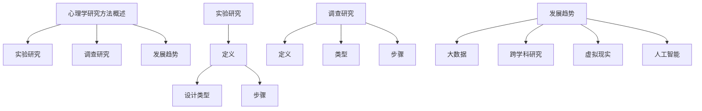

### 第19章: 心理学研究中的伦理问题

心理学研究中的伦理问题是确保研究过程中个体权益和福利的重要保障。在这一章中，我们将探讨心理学研究伦理的基本原则，包括尊重个体自主权、保护隐私和信息安全、以及伦理审查与研究者的责任。

#### 19.1 心理学研究伦理的基本原则

**伦理学的定义**

伦理学是关于道德原则和行为规范的研究，它为心理学研究提供了道德指导和伦理标准。

**心理学研究伦理的基本原则**

- **尊重个体自主权**：尊重个体的自主权是心理学研究伦理的核心原则之一。个体有权知情同意、拒绝参与研究或退出研究，并且其决定应得到尊重。

- **保护隐私与信息安全**：研究过程中，研究者有责任保护参与者的隐私，确保其个人信息不会被泄露或滥用。

- **保证个体福利**：研究应确保参与者的心理健康和身体安全，避免对其造成伤害。

- **公正与公平对待**：研究者应公正地对待所有参与者，避免歧视和偏见。

#### 19.2 伦理审查与研究者的责任

**伦理审查的定义**

伦理审查是指评估心理学研究是否符合伦理标准，保护参与者的权益和福利。伦理审查通常由独立的伦理委员会负责。

**伦理审查的过程**

- **研究计划的提交**：研究者将研究计划提交给伦理委员会进行审查。

- **审查与反馈**：伦理委员会对研究计划进行评估，并提供反馈和建议。

- **持续监督**：研究过程中，伦理委员会会定期监督研究的实施，确保研究符合伦理要求。

**研究者的责任**

- **严格遵守伦理规范**：研究者应遵守伦理规范，确保研究过程的公正性和透明度。

- **确保研究对象知情同意**：研究者应在研究开始前向参与者充分解释研究的目的、过程、潜在风险和收益，并确保参与者知情同意。

- **避免利益冲突**：研究者应避免与研究利益相关方的利益冲突，确保研究的客观性和公正性。

- **妥善处理研究数据**：研究者应妥善保护研究数据，确保其保密性和完整性。

### Mermaid 流程图

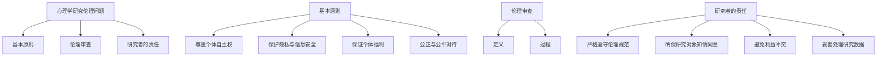

### 第20章: 心理学在现代社会中的应用

心理学在现代社会中的应用范围广泛，涵盖了从心理健康服务到教育、职业发展和组织管理的多个领域。在这一章中，我们将探讨心理学在心理咨询中的应用，以及心理学在教育与职业发展中的应用。

#### 20.1 心理学在心理咨询中的应用

**心理咨询的定义**

心理咨询是指专业心理咨询师通过交谈、访谈等方法，帮助个体解决心理问题、提升心理健康水平的过程。心理咨询可以是个体咨询，也可以是团体咨询。

**心理咨询的类型**

- **个体心理咨询**：针对单个个体进行的心理咨询，旨在解决个体的心理困扰和情感问题。

- **团体心理咨询**：将多个个体聚集在一起进行心理咨询，通过团体互动和支持来促进个体的成长和改变。

**心理咨询的技术**

- **认知行为疗法（CBT）**：认知行为疗法是一种结构化的治疗方法，通过改变个体的认知和行为来改善心理健康。

- **心理动力学疗法**：心理动力学疗法关注个体的潜意识冲突和无意识过程，通过探索和解决潜意识冲突来改善心理健康。

- **人本主义疗法**：人本主义疗法强调个体的自我实现和自我决定，通过自我探索和情感表达来提升心理健康。

**心理咨询的应用**

- **心理健康问题的治疗**：心理咨询可以用于治疗抑郁症、焦虑症、精神分裂症等心理健康问题。

- **情感问题的解决**：心理咨询可以帮助个体处理情感困扰，如失恋、家庭冲突等。

- **职业发展指导**：心理咨询可以提供职业规划和职业发展指导，帮助个体实现职业目标。

#### 20.2 心理学在教育与职业发展中的应用

**教育与职业发展的关系**

教育与职业发展密切相关，良好的教育背景和职业发展机会可以提升个体的生活质量和幸福感。心理学在教育和职业发展中发挥着重要作用，以下是一些具体的应用：

**心理学在教育教学中的应用**

- **学生心理发展与辅导**：通过心理辅导和心理咨询，帮助学生在学业和生活中应对挑战，提升心理健康水平。

- **教师心理健康与成长**：通过心理健康教育和培训，提高教师的专业素养和心理素质，促进教师职业发展。

- **教学策略优化**：心理学研究提供了多种有效的教学策略和方法，如差异化教学、合作学习和项目式学习，以提高教学效果。

**心理学在职业咨询中的应用**

- **职业兴趣与能力评估**：通过心理评估工具，帮助个体了解自己的兴趣、优势和职业倾向，为职业选择提供科学依据。

- **职业发展规划与指导**：通过个性化的职业发展规划和指导，帮助个体制定职业目标和实现路径，提高职业发展成功率。

- **职场心理健康与压力管理**：提供心理健康服务，帮助职场人士应对职场压力，提高工作效率和职业满意度。

### Mermaid 流程图

```mermaid
graph TB
    A[心理学应用] --> B[心理咨询]
    A --> C[教育与职业发展]

    D[心理咨询] --> E[定义]
    D --> F[类型]
    D --> G[技术]
    D --> H[应用]

    I[教育与职业发展] --> J[教育与职业发展关系]
    I --> K[教育教学应用]
    I --> L[职业咨询应用]

    M[心理咨询应用] --> N[心理健康问题治疗]
    M --> O[情感问题解决]
    M --> P[职业发展指导]

    Q[教育与职业发展应用] --> R[学生心理发展与辅导]
    Q --> S[教师心理健康与成长]
    Q --> T[教学策略优化]
    Q --> U[职业兴趣与能力评估]
    Q --> V[职业发展规划与指导]
    Q --> W[职场心理健康与压力管理]
```

### 第21章: 心理学与跨学科研究

心理学与跨学科研究是近年来心理学领域的一个重要发展趋势。随着科学技术的进步，心理学逐渐与其他学科如神经科学、计算机科学、社会学等相结合，形成了一系列跨学科研究领域。在这一章中，我们将探讨心理学与跨学科研究的意义与挑战，以及神经科学、认知科学、心理治疗与人工智能等具体领域的交叉研究。

#### 21.1 心理学与其他学科的交叉研究

**心理学与神经科学的交叉研究**

神经科学是研究神经系统结构和功能的一门学科。心理学与神经科学的交叉研究有助于理解心理过程背后的神经机制。例如，通过脑成像技术（如fMRI、PET）可以观察到大脑活动与心理状态之间的关系。神经心理学是这一交叉领域的代表，它研究心理过程和神经系统损害之间的联系。

**心理学与社会学的交叉研究**

社会学是研究社会行为和社会结构的一门学科。心理学与社会学的交叉研究探讨了个体行为如何受到社会环境的影响。社会心理学是一个典型的交叉领域，它研究个体在社会情境中的心理过程和行为，如社会认同、社会影响和社会比较。

**心理学与计算机科学的交叉研究**

计算机科学为心理学研究提供了新的工具和方法。心理学与计算机科学的交叉研究包括计算心理学、认知建模和虚拟现实技术等。计算心理学利用计算机技术和大数据分析来研究人类认知和心理过程。认知建模通过计算机模型来模拟和理解人类思维过程。虚拟现实技术则为心理学研究提供了新的实验环境和研究方法。

**心理学与生物学的交叉研究**

生物学是研究生命现象和生物系统的一门学科。心理学与生物学的交叉研究有助于揭示心理过程和行为的生物学基础。例如，研究神经递质、基因和脑结构如何影响心理过程。生物心理学是一个典型的交叉领域，它研究心理和行为如何受到生物学因素的影响。

#### 21.2 跨学科研究的意义与挑战

**跨学科研究的意义**

- **提高研究的综合性与深度**：跨学科研究可以整合不同学科的理论和方法，提高研究的综合性和深度，从而更好地理解复杂现象。

- **促进心理学理论的创新**：跨学科研究可以为心理学理论提供新的视角和方法，促进心理学理论的创新和发展。

- **解决复杂现实问题**：许多现实问题涉及多个学科，跨学科研究可以帮助解决这些复杂问题，提供更全面的解决方案。

**跨学科研究的挑战**

- **理论与方法的不同**：不同学科的理论和方法可能存在差异，跨学科研究需要克服这些差异，找到一个共同的语言和框架。

- **跨学科合作与沟通**：跨学科研究需要不同学科背景的学者合作，但跨学科合作和沟通可能面临困难，如专业术语的理解和合作方式的协调。

- **资源与时间的限制**：跨学科研究可能需要更多的资源和时间，包括资金、技术和人力资源，以及长期的跨学科合作和持续的研究投入。

#### 21.3 神经科学、认知科学、心理治疗与人工智能的交叉研究

**神经科学与心理治疗的交叉研究**

神经科学在心理治疗中的应用越来越广泛。例如，通过脑刺激技术（如经颅磁刺激、电刺激）可以影响大脑功能，用于治疗抑郁症、焦虑症等心理障碍。神经科学与心理治疗的交叉研究还探索了神经可塑性、心理创伤和应激反应等领域的治疗策略。

**认知科学与心理治疗的交叉研究**

认知科学关注认知过程和认知机制的运作，为心理治疗提供了新的视角和方法。例如，认知行为疗法（CBT）基于认知科学的原理，通过改变个体的认知错误和行为来治疗心理障碍。认知神经科学则通过脑成像和认知实验来研究认知过程和神经机制。

**人工智能与心理治疗的交叉研究**

人工智能（AI）在心理治疗中的应用正在快速发展。AI技术，如自然语言处理和机器学习，可以用于自动化心理评估、个性化治疗计划和远程心理治疗。AI可以帮助治疗师识别和预测心理障碍，提供个性化的治疗建议和干预方案。

**神经科学、认知科学、心理治疗与人工智能的交叉研究应用**

- **个性化心理治疗**：通过整合神经科学、认知科学和人工智能技术，可以提供个性化的心理治疗方案，提高治疗效果。

- **心理健康监测与预警**：通过AI技术监测个体的心理状态和行为，早期发现心理问题，提供预警和干预。

- **心理健康数据分析**：利用大数据和人工智能技术分析心理健康数据，揭示心理障碍的潜在模式和规律，为心理治疗提供科学依据。

### Mermaid 流程图

```mermaid
graph TB
    A[心理学与跨学科研究] --> B[交叉研究领域]
    A --> C[意义与挑战]
    A --> D[具体应用]

    E[交叉研究领域] --> F[神经科学与心理学]
    E --> G[社会心理学与心理学]
    E --> H[计算机科学与心理学]
    E --> I[生物学与心理学]

    J[意义与挑战] --> K[综合性与深度]
    J --> L[理论创新]
    J --> M[解决复杂问题]
    J --> N[理论与方法差异]
    J --> O[跨学科合作]
    J --> P[资源与时间限制]

    Q[具体应用] --> R[神经科学与心理治疗]
    Q --> S[认知科学与心理治疗]
    Q --> T[人工智能与心理治疗]

    U[个性化心理治疗] --> V[心理健康监测与预警]
    U --> W[心理健康数据分析]
```

### 第22章: 心理学研究与未来的发展

心理学研究作为一门科学，其发展不仅依赖于当前的理论和方法，还必须紧跟科技进步和时代变化的步伐。在这一章中，我们将探讨心理学研究的前沿领域、面临的挑战与机遇，以及未来心理学研究的发展方向。

#### 22.1 心理学研究的前沿领域

**神经科学**

神经科学是心理学研究的前沿领域之一，它致力于揭示大脑的结构和功能如何影响心理过程。随着脑成像技术（如fMRI、PET）和脑刺激技术（如经颅磁刺激、电刺激）的不断发展，神经科学在心理学研究中的应用日益广泛。未来，神经科学将继续探索大脑如何处理情感、记忆、决策等心理过程，以及如何通过神经调控技术改善心理健康。

**认知科学**

认知科学是研究人类认知过程和认知机制的跨学科领域。随着计算模型的进步和大数据分析技术的发展，认知科学在理解人类思维、学习和问题解决等方面取得了重要进展。未来，认知科学将继续探索认知过程背后的神经机制，开发更精确的认知模型，以及利用认知科学原理改善教育、心理治疗和人工智能等领域。

**心理治疗与心理健康**

心理治疗和心理健康是心理学研究的重要领域。随着认知行为疗法、心理动力学和人本主义疗法等传统治疗方法的不断发展，以及新兴技术如虚拟现实和心理训练的应用，心理治疗和心理健康领域正在发生深刻变革。未来，心理学研究将继续探索如何通过个性化的心理治疗和心理健康干预，提高治疗效果和幸福感。

**跨学科研究**

跨学科研究是心理学发展的必然趋势。心理学与其他学科如神经科学、计算机科学、社会学、生物学等的交叉研究，为理解人类行为和心理过程提供了新的视角和方法。未来，跨学科研究将继续深化，推动心理学理论的创新和应用。

**大数据与人工智能**

大数据和人工智能技术的进步为心理学研究提供了新的工具和方法。通过大数据分析，心理学研究可以从海量数据中提取有价值的信息，揭示心理现象的规律。人工智能技术，如机器学习和深度学习，可以用于自动化心理评估、预测心理健康问题等。未来，大数据和人工智能将继续改变心理学研究的范式，提高研究效率和准确性。

#### 22.2 心理学研究面临的挑战与机遇

**挑战**

- **伦理问题**：随着心理学研究方法的进步和应用范围的扩大，伦理问题成为了一个重要的挑战。如何保护研究参与者的权益和隐私，如何确保研究的透明度和公正性，都是需要解决的问题。

- **跨学科合作**：跨学科研究虽然带来了新的机遇，但也带来了跨学科合作和沟通的挑战。不同学科背景的研究者如何协作，如何找到一个共同的框架和语言，都是需要克服的难题。

- **资源与时间限制**：心理学研究需要大量的资源，包括资金、技术和人力资源。同时，研究过程需要长时间的投入和持续的努力。如何有效地管理和利用这些资源，是研究面临的挑战之一。

**机遇**

- **科技进步**：随着科技的进步，心理学研究将获得更多的新工具和方法，如脑成像技术、基因编辑技术、虚拟现实技术等，这些都为心理学研究提供了前所未有的机会。

- **社会需求**：随着社会对心理健康和幸福感的需求不断增加，心理学研究将得到更多的关注和支持。这为心理学研究提供了广阔的发展空间和机遇。

- **跨学科整合**：跨学科整合将推动心理学理论的创新和应用。通过与其他学科的交叉研究，心理学研究将能够更好地理解人类行为和心理过程的复杂性，提供更全面的解决方案。

#### 22.3 未来心理学研究的发展方向

- **个性化研究**：未来心理学研究将更加注重个性化，通过大数据分析和人工智能技术，为个体提供个性化的心理健康评估、诊断和干预方案。

- **预防研究**：未来心理学研究将加强预防研究，探索如何通过早期干预和心理健康促进策略，预防心理问题的发生和发展。

- **文化研究**：未来心理学研究将更加关注文化对心理健康和行为的影响，探索不同文化背景下心理现象的差异和共同点。

- **技术应用**：未来心理学研究将更加依赖新技术，如虚拟现实、人工智能、脑机接口等，开发新的研究方法和干预手段。

- **全球化研究**：未来心理学研究将更加关注全球化背景下的心理健康问题，探索如何在全球范围内提供有效的心理健康服务和支持。

### Mermaid 流程图

```mermaid
graph TB
    A[心理学研究未来发展] --> B[前沿领域]
    A --> C[挑战与机遇]
    A --> D[发展方向]

    E[前沿领域] --> F[神经科学]
    E --> G[认知科学]
    E --> H[心理治疗与心理健康]
    E --> I[跨学科研究]
    E --> J[大数据与人工智能]

    K[挑战与机遇] --> L[伦理问题]
    K --> M[跨学科合作]
    K --> N[资源与时间限制]
    K --> O[科技进步]
    K --> P[社会需求]

    Q[发展方向] --> R[个性化研究]
    Q --> S[预防研究]
    Q --> T[文化研究]
    Q --> U[技术应用]
    Q --> V[全球化研究]
```

