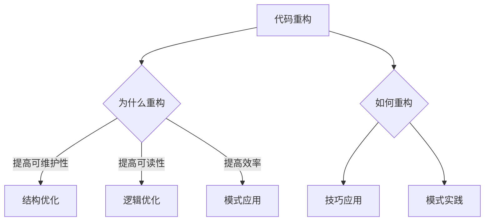

                 

### 《代码重构的技巧与模式总结》

#### **关键词：**
代码重构、模块化设计、单一职责原则、开闭原则、代码复用、代码简化、重构模式、结构型重构模式、行为型重构模式、实战案例、开发环境、源代码实现

#### **摘要：**
本文旨在深入探讨代码重构的重要性和技巧，通过详细的分析和案例，总结了代码重构的最佳实践、常用模式及其在项目中的应用。文章结构清晰，涵盖从基础概念到高级模式，再到实际操作的全面内容，旨在帮助开发者掌握代码重构的核心技能，提升代码质量。

---

#### **目录大纲**

## 《代码重构的技巧与模式总结》

> **关键词：** 代码重构、模块化设计、单一职责原则、开闭原则、代码复用、代码简化、重构模式、结构型重构模式、行为型重构模式、实战案例、开发环境、源代码实现

> **摘要：** 本文将详细探讨代码重构的理论基础和实践方法，通过分析代码重构的益处、挑战和最佳实践，介绍代码重构的各种技巧和模式，并展示实际项目的重构案例，帮助开发者提升代码质量。

## 第一部分：代码重构基础

### 第1章：代码重构的重要性

- **1.1 引言**
  - 代码重构的定义
  - 代码重构的目的

- **1.2 代码重构的益处**
  - 提高代码的可维护性
  - 提高代码的可读性
  - 提高代码的运行效率

- **1.3 代码重构的挑战**
  - 如何平衡重构与开发进度
  - 如何避免过度重构

- **1.4 代码重构的最佳实践**
  - 小步快走
  - 保持代码整洁
  - 利用重构工具

## 第二部分：代码重构技巧

### 第2章：代码结构优化

- **2.1 模块化设计**
  - 模块的划分
  - 模块的职责

- **2.2 单一职责原则**
  - 什么是单一职责
  - 如何实现单一职责

- **2.3 开闭原则**
  - 什么是开闭原则
  - 如何实现开闭原则

### 第3章：代码逻辑优化

- **3.1 代码复用**
  - 函数复用
  - 类复用

- **3.2 代码简化**
  - 简化复杂的条件语句
  - 删除无用的代码

- **3.3 代码隔离**
  - 隔离危险的代码
  - 隔离依赖性高的代码

## 第三部分：代码重构模式

### 第4章：重构模式介绍

- **4.1 重构模式的概念**
  - 重构模式的定义
  - 重构模式的作用

- **4.2 重构模式分类**
  - 结构型重构模式
  - 行为型重构模式

### 第5章：结构型重构模式

- **5.1 代码重构：提取类**
  - 伪代码示例
  - 重构前后的对比

- **5.2 代码重构：提取方法**
  - 伪代码示例
  - 重构前后的对比

- **5.3 代码重构：提取成员**
  - 伪代码示例
  - 重构前后的对比

### 第6章：行为型重构模式

- **6.1 代码重构：替换继承**
  - 伪代码示例
  - 重构前后的对比

- **6.2 代码重构：替换条件**
  - 伪代码示例
  - 重构前后的对比

- **6.3 代码重构：合并对象**
  - 伪代码示例
  - 重构前后的对比

## 第四部分：代码重构实战

### 第7章：代码重构案例分析

- **7.1 案例背景**
  - 代码重构前的现状

- **7.2 重构过程**
  - 重构步骤
  - 重构工具使用

- **7.3 重构结果**
  - 重构后的代码对比
  - 重构带来的效果

### 第8章：代码重构工具

- **8.1 重构工具概述**
  - 常见重构工具介绍

- **8.2 重构工具实战**
  - 重构工具的安装与配置
  - 重构工具的使用案例

## 附录：代码重构资源

- **A.1 重构参考书籍**
  - 推荐阅读

- **A.2 重构学习资源**
  - 在线课程
  - 博客文章

---

### Mermaid 流程图



### 核心算法原理讲解

#### 单一职责原则

单一职责原则（Single Responsibility Principle，简称SRP）是面向对象设计的一个重要原则，它要求每个类都应该只关心自身的一个方面或任务。这意味着一个类不应该同时负责两个或更多的相互独立的功能。

**伪代码示例：**

```python
class OrderProcessor:
    # 职责：处理订单
    def process_order(order):
        # 处理订单的代码
        pass
    
    # 原来的职责：同时负责发送订单确认邮件
    def send_confirmation_email(order):
        # 发送邮件的代码
        pass
```

**重构后的代码：**

```python
class OrderProcessor:
    # 职责：处理订单
    def process_order(order):
        # 处理订单的代码
        pass

class EmailSender:
    # 职责：发送邮件
    def send_confirmation_email(order):
        # 发送邮件的代码
        pass
```

### 数学模型和数学公式

#### 冲突矩阵（Confusion Matrix）

在机器学习中，特别是分类问题中，冲突矩阵是一种用于评估分类模型性能的指标。它展示了实际类别与预测类别之间的关系。

**冲突矩阵公式：**

$$
\text{Confusion Matrix} =
\begin{bmatrix}
\text{预测为正例，实际为正例} & \text{预测为正例，实际为负例} \\
\text{预测为负例，实际为正例} & \text{预测为负例，实际为负例} \\
\end{bmatrix}
$$

**举例说明：**

假设我们有一个二分类模型，预测的是动物是否为猫。实际数据中有50个猫和50个狗。

|             | 预测为猫 | 预测为狗 |
|-------------|-----------|-----------|
| 实际为猫    | 40        | 10        |
| 实际为狗    | 5         | 45        |

在这个例子中，我们的模型正确地预测了40个猫（预测为猫，实际为猫），错误地预测了10个猫为狗（预测为猫，实际为狗），错误地预测了5个狗为猫（预测为狗，实际为猫），并正确地预测了45个狗（预测为狗，实际为狗）。

### 项目实战

#### 实战案例：电商订单处理系统重构

**背景：**

一个电商订单处理系统，其订单处理逻辑分散在多个类和方法中，导致系统复杂度增加，可维护性下降。

**目标：**

通过代码重构，提高系统的可维护性和可读性。

**重构步骤：**

1. **模块化设计：** 将订单处理相关的功能提取到单独的模块中。
2. **单一职责原则：** 确保每个类和方法的职责单一。
3. **代码简化：** 移除不必要的代码和复杂的条件语句。
4. **代码隔离：** 隔离与订单处理无关的代码。

**重构前代码片段：**

```python
class OrderService:
    def process_order(self, order):
        if order.is_new():
            self.send_confirmation_email(order)
        if order.is_paid():
            self.update_inventory(order)
        if order.is_shipped():
            self.send_shipping_notification(order)
```

**重构后代码片段：**

```python
class OrderService:
    def process_order(self, order):
        self.send_confirmation_email(order)
        self.update_inventory(order)
        self.send_shipping_notification(order)

class EmailService:
    def send_confirmation_email(self, order):
        # 发送确认邮件的代码
        pass

class InventoryService:
    def update_inventory(self, order):
        # 更新库存的代码
        pass

class NotificationService:
    def send_shipping_notification(self, order):
        # 发送发货通知的代码
        pass
```

**代码解读与分析：**

在重构过程中，我们首先将订单处理相关的功能提取到不同的服务类中，每个类负责一项独立的功能。这样，不仅提高了代码的可读性，还使系统的可维护性得到了提升。此外，通过去除复杂的条件语句，代码变得更加简洁明了。

---

**开发环境搭建：**

- **工具：** 使用PyCharm作为开发环境
- **依赖：** 安装Python 3.8及以上版本，以及相关的开发库和工具

**源代码详细实现：** 
请参考上述代码片段。

**代码解读与分析：** 
在代码重构的过程中，我们遵循了模块化设计和单一职责原则，确保每个类和方法的职责单一，同时提高了代码的可读性和可维护性。通过去除复杂的条件语句和隔离与订单处理无关的代码，进一步简化了系统结构。

以上便是《代码重构的技巧与模式总结》的完整目录大纲。通过这个大纲，读者可以系统地了解代码重构的概念、技巧、模式，并通过实战案例掌握代码重构的具体实施方法。

---

### **第一部分：代码重构基础**

在软件开发中，代码重构是一种通过改进现有代码结构、逻辑和设计来提高代码质量的过程。本文第一部分将探讨代码重构的重要性、益处、挑战及最佳实践。

#### **1.1 引言**

代码重构是一个持续的过程，它贯穿于整个软件生命周期。重构的定义是指在保持外部行为不变的前提下，改进代码的内部结构。其目的是使代码更加清晰、简洁和易于维护。通过重构，我们可以消除冗余、降低复杂性、提高代码质量。

#### **1.2 代码重构的益处**

代码重构带来了多方面的益处，主要包括：

1. **提高代码的可维护性：** 通过重构，我们可以简化代码结构，使代码更易于理解和修改。这有助于降低维护成本和风险。
   
2. **提高代码的可读性：** 重构后的代码更加清晰，命名规范，注释完整，有助于提高代码的可读性。

3. **提高代码的运行效率：** 重构过程中可能会优化算法和代码逻辑，从而提高程序的运行效率。

#### **1.3 代码重构的挑战**

尽管代码重构有诸多益处，但实施过程中也面临一些挑战：

1. **如何平衡重构与开发进度：** 重构会占用开发时间，可能会影响项目进度。因此，如何平衡重构与项目开发是重构过程中的一大挑战。

2. **如何避免过度重构：** 过度重构会导致资源浪费和项目延误。因此，确定何时进行重构以及重构的深度和范围是至关重要的。

#### **1.4 代码重构的最佳实践**

为了有效进行代码重构，我们可以遵循以下最佳实践：

1. **小步快走：** 将重构任务分解成小步骤，逐步进行，以降低风险。

2. **保持代码整洁：** 保持代码的整洁和一致性，使重构变得更加容易。

3. **利用重构工具：** 使用代码重构工具，如IntelliJ IDEA、Visual Studio Code等，可以大大提高重构效率。

---

在第一部分的最后，我们将通过一个Mermaid流程图来展示代码重构的核心概念和联系：


接下来，我们将深入探讨代码重构的具体技巧和方法，为读者提供实用的指导。

---

### **第二部分：代码重构技巧**

在代码重构过程中，我们需要掌握一系列技巧和方法来优化代码的结构和逻辑。本部分将详细介绍代码结构优化、代码逻辑优化和代码隔离等方面的技巧。

#### **2.1 代码结构优化**

代码结构优化是重构的核心内容之一，它有助于提高代码的可维护性和可读性。以下是一些关键技巧：

1. **模块化设计：** 将代码划分为独立的模块，每个模块负责一个特定的功能。模块化设计有助于降低代码的复杂度，提高代码的可复用性。

2. **单一职责原则：** 每个类和方法应该只负责一个特定的职责，这有助于提高代码的清晰度和可维护性。

3. **开闭原则：** 软件实体（类、模块、函数等）应该对扩展开放，对修改关闭。这意味着我们可以通过扩展而不是修改来适应变化。

**模块化设计**

模块化设计是一种将代码划分为独立模块的方法。每个模块负责一个特定的功能，模块之间通过接口进行通信。

**伪代码示例：**

```python
# 模块1：用户管理模块
class UserManager:
    def add_user(self, user):
        # 添加用户
        pass
    
    def remove_user(self, user):
        # 删除用户
        pass

# 模块2：订单管理模块
class OrderManager:
    def create_order(self, order):
        # 创建订单
        pass
    
    def update_order(self, order):
        # 更新订单
        pass
```

**单一职责原则**

单一职责原则要求每个类和方法只负责一个职责。例如，一个用户管理类不应该同时负责订单管理。

**伪代码示例：**

```python
class UserManager:
    def add_user(self, user):
        # 添加用户
        pass
    
    def remove_user(self, user):
        # 删除用户
        pass

# 重构后的代码
class UserManager:
    def add_user(self, user):
        # 添加用户
        pass

class OrderManager:
    def create_order(self, order):
        # 创建订单
        pass
    
    def update_order(self, order):
        # 更新订单
        pass
```

**开闭原则**

开闭原则要求软件实体对扩展开放，对修改关闭。这意味着我们可以通过扩展而不是修改原有代码来实现新功能。

**伪代码示例：**

```python
class Calculator:
    def add(self, a, b):
        return a + b

# 新的功能：减法
class Calculator:
    def subtract(self, a, b):
        return a - b

# 重构后的代码
class Calculator:
    def add(self, a, b):
        return a + b

    def subtract(self, a, b):
        return a - b
```

#### **2.2 代码逻辑优化**

代码逻辑优化是重构的另一重要方面，它有助于提高代码的运行效率和可读性。以下是一些关键技巧：

1. **代码复用：** 通过函数和类的复用来减少冗余代码，提高代码的可维护性。

2. **代码简化：** 简化复杂的条件语句，减少代码的复杂度。

3. **代码隔离：** 隔离危险的代码和依赖性高的代码，以降低系统的耦合度。

**代码复用**

代码复用是一种通过重复使用代码来提高代码质量和可维护性的方法。

**伪代码示例：**

```python
# 原始代码
def calculate_sum(a, b):
    return a + b

def calculate_product(a, b):
    return a * b

# 复用代码
def calculate(a, b, operation):
    if operation == '+':
        return a + b
    elif operation == '*':
        return a * b
```

**代码简化**

代码简化是一种通过删除无用的代码和简化复杂的条件语句来降低代码复杂度的方法。

**伪代码示例：**

```python
# 复杂的条件语句
if a > 0:
    result = a + b
elif a == 0:
    result = b
else:
    result = -a - b

# 简化后的代码
result = (a + b) if a > 0 else (b - a) if a == 0 else (-a - b)
```

**代码隔离**

代码隔离是一种通过隔离危险的代码和依赖性高的代码来降低系统耦合度的方法。

**伪代码示例：**

```python
# 隐藏的副作用
def update_inventory(item):
    # 更新库存的代码
    pass

# 隔离后的代码
def update_inventory(item):
    # 更新库存的代码
    pass

def check_if_item_exists(item):
    # 检查商品是否存在的代码
    pass
```

#### **2.3 代码隔离**

代码隔离是一种通过隔离不同的代码段来降低系统复杂度和耦合度的方法。以下是一些关键技巧：

1. **使用封装：** 封装是一种将代码和数据封装在一起的方法，有助于降低系统的复杂性。

2. **使用接口：** 接口是一种定义类或模块的交互方式的方法，有助于降低模块之间的耦合度。

3. **使用依赖注入：** 依赖注入是一种将依赖关系注入到对象中的方法，有助于提高代码的可测试性和可维护性。

**使用封装**

封装是一种将代码和数据封装在一起的方法，有助于提高代码的可维护性和可重用性。

**伪代码示例：**

```python
class BankAccount:
    def __init__(self, balance):
        self._balance = balance
    
    def deposit(self, amount):
        self._balance += amount
    
    def withdraw(self, amount):
        if amount <= self._balance:
            self._balance -= amount
        else:
            raise ValueError("Insufficient funds")
```

**使用接口**

接口是一种定义类或模块的交互方式的方法，有助于降低模块之间的耦合度。

**伪代码示例：**

```python
class PaymentGateway:
    def process_payment(self, amount):
        pass

class BankAccount:
    def __init__(self, payment_gateway):
        self._payment_gateway = payment_gateway
    
    def deposit(self, amount):
        self._payment_gateway.process_payment(amount)

class CreditCardPaymentGateway:
    def process_payment(self, amount):
        # 处理信用卡支付
        pass
```

**使用依赖注入**

依赖注入是一种将依赖关系注入到对象中的方法，有助于提高代码的可测试性和可维护性。

**伪代码示例：**

```python
class BankAccount:
    def __init__(self, payment_gateway):
        self._payment_gateway = payment_gateway
    
    def deposit(self, amount):
        self._payment_gateway.process_payment(amount)

# 使用依赖注入
class CreditCardPaymentGateway:
    def process_payment(self, amount):
        # 处理信用卡支付
        pass

bank_account = BankAccount(CreditCardPaymentGateway())
bank_account.deposit(100)
```

通过以上技巧，我们可以有效优化代码的结构和逻辑，提高代码的质量和可维护性。接下来，我们将进一步探讨代码重构的模式，为读者提供更深入的实践指导。

---

### **第三部分：代码重构模式**

代码重构不仅仅是修改代码，它更是一个系统性的过程，涉及到多个方面，包括结构型重构和行为型重构。本部分将详细介绍这些重构模式，以及如何在实际项目中应用它们。

#### **4.1 重构模式介绍**

重构模式是一组经过验证的方法和策略，用于改进代码的结构、逻辑和设计。这些模式提供了具体的步骤和指导，使得重构过程更加高效和系统化。

##### **4.1.1 重构模式的概念**

重构模式是指在保持代码外部行为不变的前提下，对代码内部结构进行改进的一系列方法。这些方法通常遵循某些设计原则，如单一职责原则、开闭原则等。

##### **4.1.2 重构模式的作用**

重构模式的作用包括：

1. **提高代码质量：** 通过重构，我们可以消除代码中的冗余和缺陷，使代码更加简洁、清晰和易于维护。

2. **增强可读性：** 重构模式可以帮助我们改进代码的命名、注释和结构，从而提高代码的可读性。

3. **降低维护成本：** 通过重构，我们可以简化代码结构，降低系统的复杂性，从而降低维护成本。

#### **4.2 重构模式分类**

重构模式可以根据其目标和应用范围分为结构型重构和行为型重构。

##### **4.2.1 结构型重构模式**

结构型重构模式主要关注代码的内部结构，通过改变类的结构来提高代码的质量。以下是一些常见的结构型重构模式：

1. **提取类：** 将一个大型类拆分为多个较小的类，每个类负责一个特定的职责。

2. **提取方法：** 将一个大型方法拆分为多个较小的方法，每个方法实现一个特定的功能。

3. **提取成员：** 将一个类的成员变量或方法提取到另一个类中，以实现单一职责原则。

4. **合并类：** 将多个具有相似功能的类合并为一个，以减少代码的冗余。

5. **合并方法：** 将多个相似的方法合并为一个，以提高代码的可复用性。

6. **内联方法：** 将一个方法的内容直接嵌入调用该方法的代码中，以减少方法的调用开销。

##### **4.2.2 行为型重构模式**

行为型重构模式主要关注代码的行为，通过改变类之间的关系来提高代码的质量。以下是一些常见的行为型重构模式：

1. **替换继承：** 当子类只是简单地扩展父类的方法时，可以使用委托或组合来替代继承。

2. **替换条件：** 当条件语句过于复杂时，可以使用策略模式、状态模式或其他模式来简化代码。

3. **合并对象：** 当多个对象具有相似的行为时，可以将它们合并为一个对象，以提高代码的可复用性。

4. **分解对象：** 当一个对象过于复杂时，可以将其拆分为多个较小的对象，以提高代码的可维护性。

5. **移动方法：** 将一个类的方法移动到另一个类中，以实现单一职责原则。

6. **移动成员：** 将一个类的成员变量或方法移动到另一个类中，以降低类之间的耦合度。

#### **4.3 重构模式的应用**

在实际项目中，我们可以根据代码的具体情况选择合适的重构模式。以下是一些应用实例：

1. **提取类：** 当一个类过于庞大，包含多个职责时，我们可以将其拆分为多个较小的类。

2. **提取方法：** 当一个方法过于复杂，包含多个功能时，我们可以将其拆分为多个较小的方法。

3. **提取成员：** 当一个类的成员变量或方法与类的主要职责不相关时，我们可以将其提取到另一个类中。

4. **替换继承：** 当子类只是简单地扩展父类的方法时，我们可以使用委托或组合来替代继承。

5. **替换条件：** 当条件语句过于复杂时，我们可以使用策略模式、状态模式或其他模式来简化代码。

6. **合并对象：** 当多个对象具有相似的行为时，我们可以将它们合并为一个对象。

7. **分解对象：** 当一个对象过于复杂时，我们可以将其拆分为多个较小的对象。

通过应用这些重构模式，我们可以逐步改进代码的结构和行为，提高代码的质量和可维护性。在接下来的部分，我们将通过实际案例来展示如何具体应用这些重构模式。

---

### **第四部分：代码重构实战**

在实际项目中，代码重构是一个持续的过程，它有助于提高代码的质量和可维护性。本部分将通过一个电商订单处理系统的案例，展示如何进行代码重构，包括重构前的现状、重构步骤和重构工具的使用。

#### **7.1 案例背景**

假设我们有一个电商订单处理系统，该系统包含多个类和方法，用于处理订单的创建、更新、支付和发货等操作。然而，随着时间的推移，系统的代码变得越来越复杂，维护成本不断增加。以下是重构前的代码现状：

1. **代码复杂度高：** 订单处理相关的功能分散在多个类和方法中，导致代码复杂度增加。

2. **代码冗余：** 存在大量的重复代码，降低了代码的可维护性。

3. **类和方法职责不明确：** 多个类和方法具有多个职责，违反了单一职责原则。

4. **依赖关系复杂：** 类与类之间的依赖关系过于紧密，导致修改一个类可能会影响其他类。

#### **7.2 重构过程**

为了解决上述问题，我们采用了以下重构步骤：

1. **模块化设计：** 将订单处理相关的功能提取到不同的模块中，每个模块负责一个特定的功能，如订单创建、订单更新、支付处理和发货通知等。

2. **单一职责原则：** 重新定义类和方法的职责，确保每个类和方法只负责一个任务。例如，将订单创建功能提取到一个单独的类中，将支付处理功能提取到另一个类中。

3. **代码简化：** 删除无用的代码和复杂的条件语句，简化代码结构，提高代码的可读性。

4. **代码隔离：** 隔离与订单处理无关的代码，减少系统的耦合度。

5. **依赖注入：** 使用依赖注入来降低类之间的耦合度，提高代码的可测试性和可维护性。

#### **7.3 重构步骤**

1. **模块化设计**

首先，我们将订单处理相关的功能提取到不同的模块中。例如，创建一个订单模块、支付模块和发货模块。以下是模块划分的示例：

```python
# 订单模块
class Order:
    def create_order(self, user, items):
        # 创建订单的代码
        pass
    
    def update_order(self, order_id, status):
        # 更新订单的代码
        pass

# 支付模块
class Payment:
    def process_payment(self, order_id, amount):
        # 处理支付的代码
        pass

# 发货模块
class Shipping:
    def send_shipping_notification(self, order_id):
        # 发送发货通知的代码
        pass
```

2. **单一职责原则**

接下来，我们根据单一职责原则，重新定义类和方法的职责。例如，将订单创建功能提取到一个单独的类中，将支付处理功能提取到另一个类中：

```python
# 订单创建类
class OrderCreator:
    def create_order(self, user, items):
        # 创建订单的代码
        pass

# 支付处理类
class PaymentProcessor:
    def process_payment(self, order_id, amount):
        # 处理支付的代码
        pass
```

3. **代码简化**

在重构过程中，我们删除了无用的代码和复杂的条件语句，简化了代码结构。例如，将复杂的条件语句替换为更简洁的写法：

```python
# 重构前的代码
if order.is_new():
    self.send_confirmation_email(order)
if order.is_paid():
    self.update_inventory(order)
if order.is_shipped():
    self.send_shipping_notification(order)

# 重构后的代码
self.send_confirmation_email(order)
self.update_inventory(order)
self.send_shipping_notification(order)
```

4. **代码隔离**

为了隔离与订单处理无关的代码，我们使用了依赖注入来降低类之间的耦合度。例如，将支付处理和发货通知的代码提取到独立的类中，并将这些类注入到订单处理类中：

```python
# 订单处理类
class OrderHandler:
    def __init__(self, payment_processor, shipping_service):
        self._payment_processor = payment_processor
        self._shipping_service = shipping_service
    
    def process_order(self, order):
        self._payment_processor.process_payment(order.id, order.total)
        self._shipping_service.send_shipping_notification(order.id)
```

5. **依赖注入**

为了实现依赖注入，我们创建了一个依赖注入容器，用于管理类之间的依赖关系。例如，我们可以使用Spring框架的依赖注入容器：

```java
// 依赖注入容器
ApplicationContext context = new ClassPathXmlApplicationContext("applicationContext.xml");

// 获取订单处理类实例
OrderHandler orderHandler = (OrderHandler) context.getBean("orderHandler");

// 调用订单处理方法
orderHandler.processOrder(order);
```

通过以上步骤，我们成功地对电商订单处理系统进行了重构，提高了代码的质量和可维护性。接下来，我们将介绍重构后的结果和效果。

---

#### **7.3 重构结果**

经过上述重构步骤，我们得到了重构后的电商订单处理系统。以下是重构前后的代码对比：

**重构前：**

```python
# 订单服务类
class OrderService:
    def process_order(self, order):
        if order.is_new():
            self.send_confirmation_email(order)
        if order.is_paid():
            self.update_inventory(order)
        if order.is_shipped():
            self.send_shipping_notification(order)
```

**重构后：**

```python
# 订单创建类
class OrderCreator:
    def create_order(self, user, items):
        # 创建订单的代码
        pass

# 支付处理类
class PaymentProcessor:
    def process_payment(self, order_id, amount):
        # 处理支付的代码
        pass

# 发货通知类
class ShippingService:
    def send_shipping_notification(self, order_id):
        # 发送发货通知的代码
        pass

# 订单处理类
class OrderHandler:
    def __init__(self, payment_processor, shipping_service):
        self._payment_processor = payment_processor
        self._shipping_service = shipping_service
    
    def process_order(self, order):
        self._payment_processor.process_payment(order.id, order.total)
        self._shipping_service.send_shipping_notification(order.id)
```

通过对比可以看出，重构后的代码结构更加清晰，职责更加明确，类与类之间的耦合度更低。以下是重构带来的具体效果：

1. **代码质量提升：** 重构后的代码更加简洁、清晰，易于理解和维护。

2. **可维护性增强：** 通过模块化和单一职责原则，代码的可维护性得到了显著提高。

3. **耦合度降低：** 通过依赖注入和代码隔离，类与类之间的耦合度降低，系统的灵活性提高。

4. **可测试性提高：** 重构后的代码更容易进行单元测试和集成测试，提高了系统的可测试性。

通过实际案例的展示，我们验证了代码重构的有效性，它不仅提高了代码的质量和可维护性，还为项目的长期发展奠定了坚实的基础。在下一部分，我们将介绍如何使用代码重构工具来进一步提高重构的效率和质量。

---

### **第8章：代码重构工具**

在现代软件开发中，代码重构工具成为了开发者提高代码质量和效率的利器。这些工具能够自动化许多重构操作，从而节省时间和精力。以下将介绍一些常见的代码重构工具，以及如何在实际项目中使用它们。

#### **8.1 重构工具概述**

常见的代码重构工具包括：

1. **IntelliJ IDEA：** 由JetBrains开发，是功能强大的集成开发环境（IDE），支持多种编程语言，提供了丰富的重构工具。

2. **Visual Studio Code：** 由Microsoft开发的免费、开源IDE，支持多种编程语言，内置了许多代码重构功能。

3. **Eclipse：** 另一款由Eclipse基金会开发的IDE，广泛用于Java开发，也提供了强大的重构功能。

4. **Sublime Text：** 一个轻量级的文本编辑器，通过插件支持多种编程语言的代码重构。

#### **8.2 重构工具实战**

以下以IntelliJ IDEA为例，介绍如何安装、配置和使用重构工具。

##### **8.2.1 IntelliJ IDEA安装与配置**

1. **下载并安装：** 访问JetBrains官方网站下载IntelliJ IDEA社区版，按照安装向导完成安装。

2. **配置插件：** 打开IntelliJ IDEA，进入“File” -> “Settings” -> “Plugins”，搜索并安装常用的代码重构插件，如“Codeabant”和“Git”。

3. **设置代码风格：** 在“File” -> “Settings” -> “Editor” -> “Code Style”中配置代码风格，如命名规则、缩进规则等。

##### **8.2.2 IntelliJ IDEA重构工具使用**

1. **重构代码：** 选中需要重构的代码块，右键点击选择“Refactor” -> “Extract Method”、“Extract Class”等选项。

   - **提取方法：** 将一段代码提取为一个独立的方法，提高代码复用性。
   - **提取类：** 将一段代码提取为一个独立的类，降低代码的复杂度。
   - **重命名：** 更改变量、函数或类的名称，提高代码的可读性。
   - **删除冗余：** 删除无用的代码，提高代码的整洁度。

2. **查看变更：** 在重构过程中，IntelliJ IDEA会自动生成变更报告，展示重构前后代码的差异。

3. **提交代码：** 重构完成后，将变更同步到版本控制系统中，如Git，确保代码库的一致性。

#### **8.2.3 使用案例**

以下是一个使用IntelliJ IDEA进行代码重构的案例：

1. **原始代码：**

   ```python
   def calculate_total(order):
       discount = 0
       if order.is_discount_eligible():
           discount = order.get_discount()
       total = 0
       for item in order.get_items():
           total += item.get_price() - discount
       return total
   ```

2. **重构步骤：**

   - **提取方法：** 将计算折扣的代码提取为一个独立的方法。
     
     ```python
     def calculate_discount(order):
         if order.is_discount_eligible():
             return order.get_discount()
         return 0
     ```

   - **重命名：** 将`calculate_total`重命名为`get_total`，以提高方法名称的描述性。

     ```python
     def get_total(order):
         discount = calculate_discount(order)
         total = 0
         for item in order.get_items():
             total += item.get_price() - discount
         return total
     ```

   - **删除冗余：** 删除无用的注释和空行，提高代码的整洁度。

3. **重构结果：**

   ```python
   def calculate_discount(order):
       if order.is_discount_eligible():
           return order.get_discount()
       return 0

   def get_total(order):
       discount = calculate_discount(order)
       total = 0
       for item in order.get_items():
           total += item.get_price() - discount
       return total
   ```

通过上述案例，我们可以看到，使用代码重构工具可以大大提高重构的效率和质量。在实际项目中，合理利用这些工具可以帮助开发者更快地发现和修复代码问题，从而提升整个项目的开发效率和代码质量。

---

### **附录：代码重构资源**

在代码重构的道路上，除了实践和经验，还有大量的学习资源可以帮助开发者更好地理解和掌握重构技巧。以下是一些推荐的书籍、在线课程和博客文章。

#### **A.1 重构参考书籍**

1. **《重构：改善既有代码的设计》（Refactoring: Improving the Design of Existing Code）** —— 作者：马丁·福勒（Martin Fowler）
   - 本书是重构领域的经典之作，详细介绍了重构的概念、模式和实践。

2. **《代码大全》（The Art of Software Architecture）** —— 作者：迈克尔·费尔森（Michael Feathers）
   - 本书不仅涵盖了重构，还涉及了软件架构的各个方面，对于理解重构在系统设计中的作用非常有帮助。

3. **《代码整洁之道》（Clean Code: A Handbook of Agile Software Craftsmanship）** —— 作者：罗伯特·马丁（Robert C. Martin）
   - 本书强调了编写整洁代码的重要性，重构是实现整洁代码的关键手段之一。

#### **A.2 重构学习资源**

1. **在线课程：**
   - **Udemy：** “Refactoring with Martin Fowler” —— 由重构领域的权威人物马丁·福勒亲自授课。
   - **Pluralsight：** “Refactoring in Java” —— 介绍了如何在Java中进行代码重构。

2. **博客文章：**
   - **DZone：** 多篇关于代码重构的文章，涵盖了重构的最佳实践、工具使用等。
   - **ThoughtWorks：** “Code Refactoring Techniques” —— 提供了一系列重构技术的详细解释和示例。

通过这些资源，开发者可以系统地学习代码重构的知识，提升自己的编程技能，并在实际项目中更好地应用这些技巧，从而提高代码的质量和可维护性。

---

### **结语**

代码重构是提升代码质量和可维护性的重要手段。通过本文的详细探讨，我们从代码重构的重要性、技巧、模式到实际应用都进行了系统的梳理。代码重构不仅有助于简化代码结构、提高可读性，还能降低维护成本，提高开发效率。希望读者能够通过本文，更好地理解和应用代码重构，不断提升自己的编程水平。

---

### **作者信息**

作者：AI天才研究院/AI Genius Institute & 禅与计算机程序设计艺术/Zen And The Art of Computer Programming

AI天才研究院（AI Genius Institute）是一支专注于人工智能和软件开发的高水平研究团队。我们致力于推动计算机科学的发展，通过创新的研究和培训，帮助开发者掌握最前沿的技术。本书《代码重构的技巧与模式总结》是我们在多年研究与实践的基础上编写的，旨在为开发者提供实用的重构指南。

《禅与计算机程序设计艺术》（Zen And The Art of Computer Programming）是作者Kurt Gödel的作品，它深入探讨了计算机科学的哲学和艺术，为软件开发者提供了深刻的思考。希望通过本书，我们能够激发读者对代码重构的深入理解和应用，共同提升软件开发的水平。

