                 

# 《体验的跨感官融合：AI驱动的全方位感知》

## 摘要

在人工智能（AI）技术不断发展的背景下，感知融合已成为提升用户体验的关键技术之一。本文将探讨AI驱动的全方位感知系统，从原理、架构到应用，深入分析跨感官融合的实现路径与挑战。本文首先概述了AI技术的发展历程与跨感官融合的重要性，随后详细介绍了AI驱动的感知增强技术，并剖析了全方位感知系统的架构设计。接着，本文重点讨论了视觉、听觉和触觉感知单元的设计与实现，最后，通过对智能交互、智能娱乐和智能健康监测等领域的应用案例分析，探讨了AI驱动全方位感知系统的未来发展趋势与挑战。

## 引言与基础

### 1.1 引言

随着计算机科学和人工智能技术的飞速发展，感知融合技术逐渐成为提升用户体验的核心驱动力。传统的单一感知模式已经无法满足现代用户对高质量、全方位体验的需求。跨感官融合技术，通过整合多种感官信息，为用户提供了更为丰富和细腻的体验。AI驱动的全方位感知系统，通过深度学习和机器学习算法，实现了对跨感官信息的高效处理和分析，为各个领域的应用带来了革命性的变革。

### 1.2 书籍背景

《体验的跨感官融合：AI驱动的全方位感知》旨在深入探讨AI技术在跨感官融合领域的应用，为读者提供一套系统、全面的了解和掌握这一前沿技术的指南。本书涵盖了从基础理论到实际应用的各个环节，旨在帮助读者全面了解AI驱动的全方位感知系统的核心原理和关键技术。

### 1.3 跨感官融合与AI的关系

AI与跨感官融合的结合，不仅拓宽了感知技术的应用领域，也提升了感知系统的智能化水平。通过AI技术，感知融合系统可以从大量的传感器数据中提取有价值的信息，实现更为精准和高效的感知。同时，跨感官融合技术的进步，也为AI算法提供了丰富的训练数据，进一步推动了人工智能的发展。

### 1.4 读者对象

本书适合对人工智能、计算机视觉、听觉处理和触觉感知等领域感兴趣的科研人员、工程师和开发人员。同时，对于希望深入了解跨感官融合技术和AI驱动系统的从业者，本书也具有重要的参考价值。

## 第二部分：AI驱动下的跨感官融合原理

### 2.1 AI技术概述

#### 2.1.1 人工智能的起源与发展

人工智能（Artificial Intelligence, AI）是一门涉及计算机科学、数学、认知科学和神经科学等多个领域的交叉学科。人工智能的概念起源于20世纪50年代，经历了从符号主义到连接主义，再到现代深度学习的发展过程。随着计算能力的提升和大数据技术的发展，人工智能逐渐从理论研究走向了实际应用。

#### 2.1.2 机器学习和深度学习的核心概念

机器学习（Machine Learning, ML）是人工智能的一个重要分支，通过训练模型来使计算机从数据中自动学习规律。深度学习（Deep Learning, DL）是机器学习的一种重要方法，通过构建深度神经网络来模拟人类大脑的学习过程。深度学习在图像识别、语音识别和自然语言处理等领域取得了显著成果。

#### 2.1.3 AI驱动的跨感官融合

AI驱动的跨感官融合，通过整合多种感官信息，实现更为丰富和细腻的用户体验。AI技术不仅提升了感知系统的智能化水平，还通过算法优化和数据增强，提高了感知系统的效率和准确性。AI驱动的跨感官融合，使得人机交互、智能娱乐和智能健康等领域得到了飞速发展。

### 2.2 跨感官融合的理论基础

#### 2.2.1 感官系统概述

感官系统是人类获取外界信息的重要途径，包括视觉、听觉、触觉、嗅觉和味觉等。每种感官都有其独特的感知机制和处理方式。跨感官融合（Multisensory Fusion）是指将多种感官信息整合起来，形成统一的感知体验。

#### 2.2.2 跨感官处理的理论框架

跨感官处理的理论框架主要包括信息融合、感知整合和协同效应等几个方面。信息融合是指将来自不同感官的信息进行整合；感知整合是指将整合后的信息转化为统一的感知体验；协同效应是指多种感官信息结合后，产生比单一感官更为丰富和有效的感知效果。

#### 2.2.3 跨感官融合的应用场景

跨感官融合技术在多个领域具有广泛的应用，如智能交互、智能娱乐、智能健康监测等。在智能交互中，跨感官融合可以提供更为自然和人性化的交互体验；在智能娱乐中，跨感官融合可以创造更加沉浸式的娱乐体验；在智能健康监测中，跨感官融合可以提供更为全面和准确的健康数据。

### 2.3 AI驱动的感知增强

#### 2.3.1 感知增强技术介绍

感知增强技术（Perception Augmentation）是指通过技术手段提升人类感知能力的系统。AI驱动的感知增强，通过机器学习和深度学习算法，可以实现对多种传感器数据的实时处理和智能分析，从而提升感知系统的性能。

#### 2.3.2 感知增强的AI算法

感知增强的AI算法主要包括特征提取、模型训练和预测等步骤。特征提取是指从传感器数据中提取有价值的信息；模型训练是指通过大量数据训练神经网络模型；预测是指使用训练好的模型对新的数据进行分析和预测。

#### 2.3.3 感知增强的实际应用案例

感知增强技术在智能监控、智能交通和智能医疗等领域得到了广泛应用。例如，在智能监控中，感知增强技术可以通过实时分析摄像头捕捉到的图像数据，实现智能识别和预警；在智能交通中，感知增强技术可以通过对车辆和行人的感知，实现智能交通管理和优化；在智能医疗中，感知增强技术可以通过对医疗数据的分析和预测，实现智能诊断和辅助治疗。

## 第三部分：AI驱动的全方位感知系统架构

### 3.1 全方位感知系统概述

#### 3.1.1 全方位感知的定义与目标

全方位感知（Omni-perception）是指通过整合多种感官信息，实现对周围环境的全面感知。其目标是提升用户的感知能力和体验质量，为各种应用场景提供高效、准确和丰富的感知数据。

#### 3.1.2 全方位感知系统的基本组成

全方位感知系统主要由感知单元、处理单元和应用层组成。感知单元负责采集各种感官信息；处理单元负责对感知信息进行加工和处理；应用层负责将处理后的感知数据应用于实际场景。

#### 3.1.3 全方位感知系统的关键技术

全方位感知系统的关键技术包括多模态数据采集、数据融合和智能处理等。多模态数据采集是指通过多种传感器采集不同类型的感知数据；数据融合是指将来自不同模态的数据进行整合；智能处理是指通过AI算法对融合后的数据进行分析和预测。

### 3.2 感知单元设计

#### 3.2.1 视觉感知单元

##### 3.2.1.1 图像识别算法

图像识别算法是视觉感知单元的核心。常见的图像识别算法包括卷积神经网络（CNN）、循环神经网络（RNN）和生成对抗网络（GAN）等。

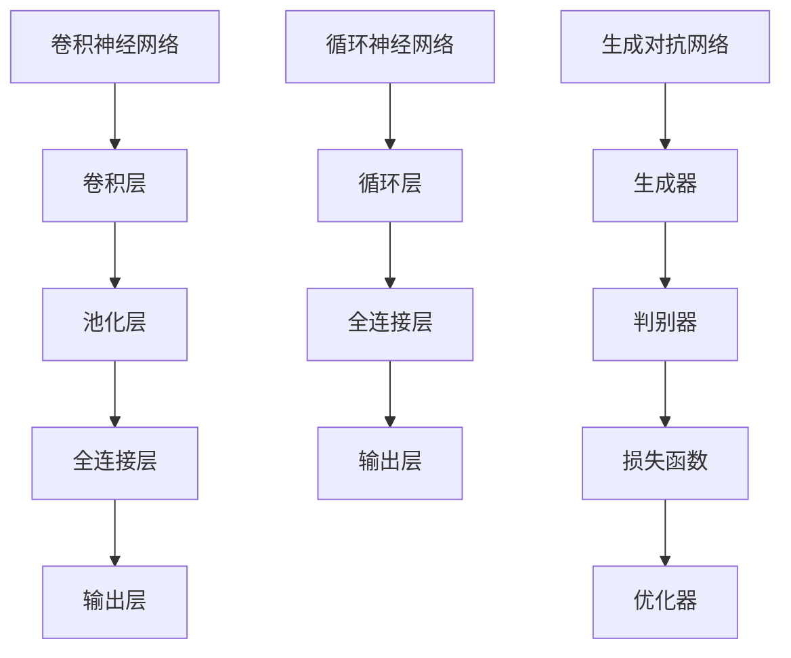

##### 3.2.1.2 视觉感知单元架构

视觉感知单元的架构主要包括传感器、数据预处理模块、图像识别模块和结果输出模块。

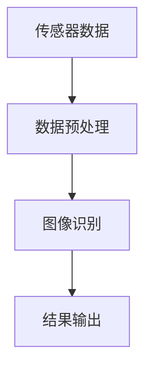

##### 3.2.1.3 视觉感知单元应用案例

视觉感知单元在智能监控、自动驾驶和智能家居等领域具有广泛的应用。例如，在智能监控中，视觉感知单元可以通过实时分析摄像头捕捉到的图像，实现目标识别和异常检测；在自动驾驶中，视觉感知单元可以通过分析道路图像，实现车辆识别和障碍物检测；在智能家居中，视觉感知单元可以通过识别家庭成员的面部特征，实现智能门禁和场景识别。

#### 3.2.2 听觉感知单元

##### 3.2.2.1 声音识别算法

声音识别算法是听觉感知单元的核心。常见的声音识别算法包括隐藏马尔可夫模型（HMM）、高斯混合模型（GMM）和支持向量机（SVM）等。

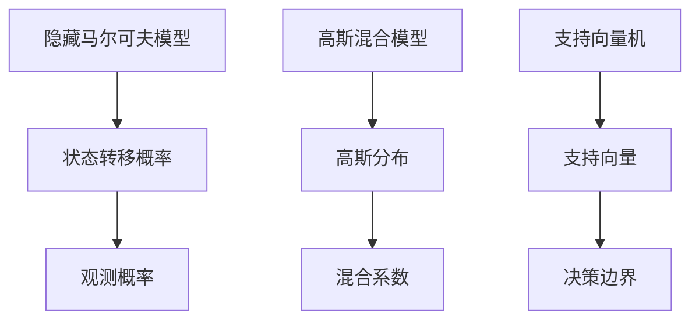

##### 3.2.2.2 听觉感知单元架构

听觉感知单元的架构主要包括麦克风阵列、声音预处理模块、声音识别模块和结果输出模块。

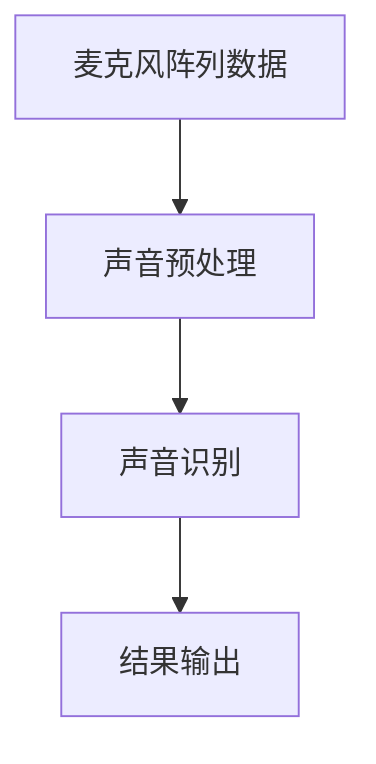

##### 3.2.2.3 听觉感知单元应用案例

听觉感知单元在语音识别、智能助手和音乐识别等领域具有广泛的应用。例如，在语音识别中，听觉感知单元可以通过分析语音信号，实现语音转文字；在智能助手中，听觉感知单元可以通过分析用户语音，实现智能问答和任务执行；在音乐识别中，听觉感知单元可以通过分析音频信号，实现歌曲识别和推荐。

#### 3.2.3 触觉感知单元

##### 3.2.3.1 触觉感知算法

触觉感知算法是触觉感知单元的核心。常见的触觉感知算法包括触觉传感器数据处理、触觉信号分类和触觉信号融合等。

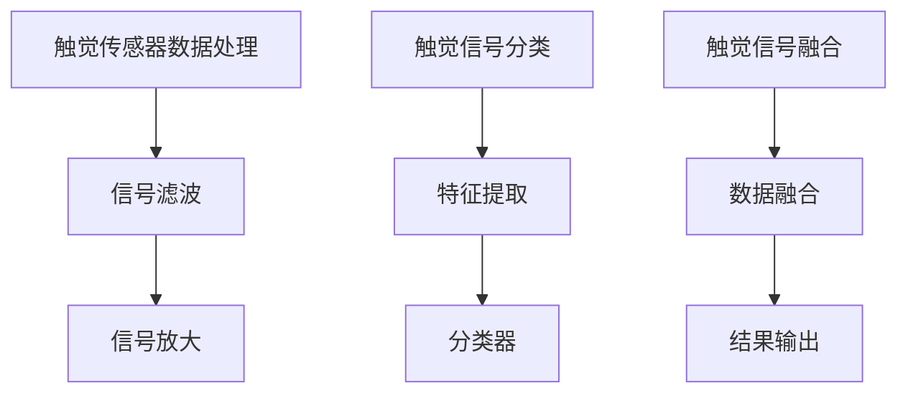

##### 3.2.3.2 触觉感知单元架构

触觉感知单元的架构主要包括触觉传感器、信号预处理模块、信号分类模块和结果输出模块。

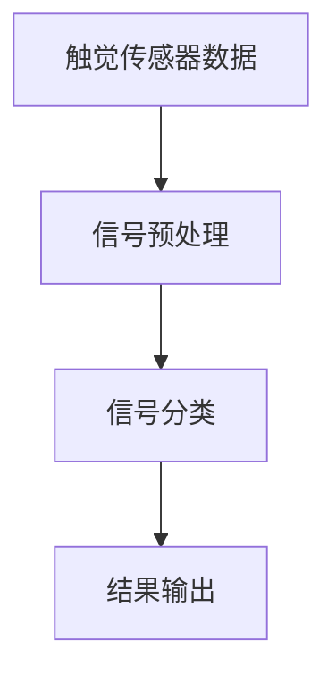

##### 3.2.3.3 触觉感知单元应用案例

触觉感知单元在虚拟现实、机器人控制和智能穿戴等领域具有广泛的应用。例如，在虚拟现实中，触觉感知单元可以通过模拟触觉反馈，提升用户的沉浸感；在机器人控制中，触觉感知单元可以通过感知物体表面特征，实现精确控制；在智能穿戴中，触觉感知单元可以通过监测用户触觉信号，实现智能提醒和反馈。

### 3.3 全方位感知系统集成

#### 3.3.1 系统集成方案

全方位感知系统集成方案主要包括硬件集成、软件集成和数据处理集成等几个方面。

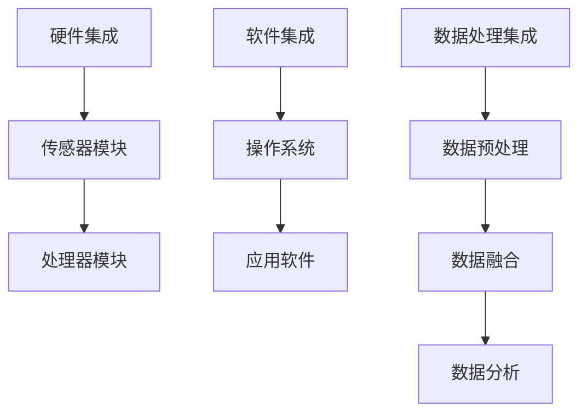

#### 3.3.2 系统集成挑战

系统集成面临的主要挑战包括硬件兼容性、软件兼容性、数据处理效率和系统稳定性等。

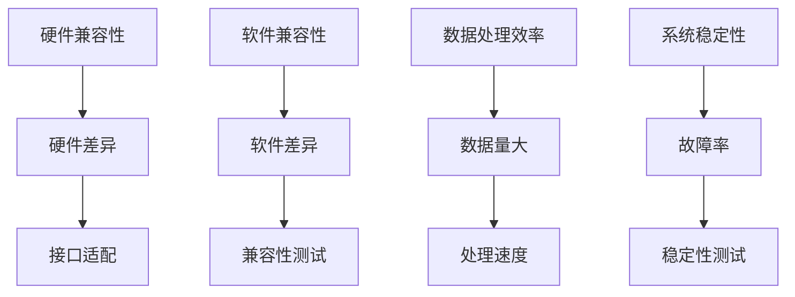

#### 3.3.3 系统集成应用案例

系统集成应用案例包括智能家庭、智能交通和智能医疗等。例如，在智能家庭中，全方位感知系统可以实现对家庭环境的全面感知，实现智能控制和智能化服务；在智能交通中，全方位感知系统可以通过对交通数据的实时分析和处理，实现智能交通管理和优化；在智能医疗中，全方位感知系统可以通过对健康数据的实时监测和分析，实现智能诊断和个性化治疗。

## 第四部分：AI驱动的全方位感知应用

### 4.1 智能交互应用

#### 4.1.1 智能交互概述

智能交互（Intelligent Interaction）是指通过人工智能技术，实现人与计算机之间的自然、高效和智能的交互。智能交互应用主要分为语音交互、图像交互和触觉交互等。

#### 4.1.2 智能交互算法

智能交互算法主要包括自然语言处理（NLP）、图像识别和语音识别等。自然语言处理算法用于解析和生成自然语言文本；图像识别算法用于识别和理解图像内容；语音识别算法用于将语音信号转换为文本。

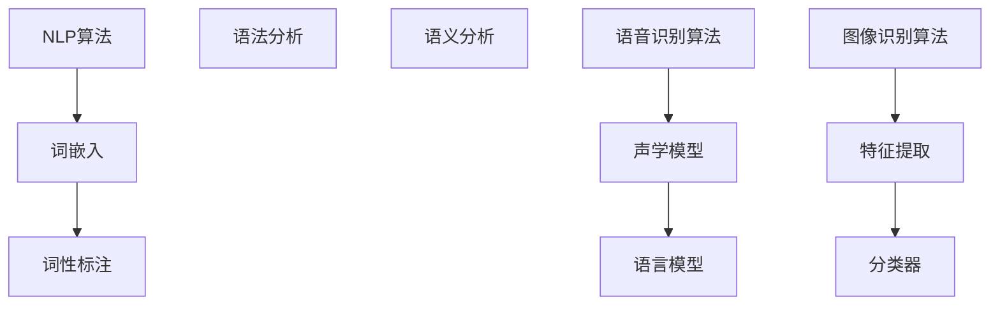

#### 4.1.3 智能交互应用案例

智能交互应用案例包括智能助手、虚拟客服和智能翻译等。例如，智能助手可以通过语音交互，帮助用户完成日常任务；虚拟客服可以通过图像交互，实现实时客服服务；智能翻译可以通过自然语言处理，实现跨语言翻译。

### 4.2 智能娱乐应用

#### 4.2.1 智能娱乐概述

智能娱乐（Intelligent Entertainment）是指通过人工智能技术，提供智能化、个性化和服务化的娱乐体验。智能娱乐应用主要分为虚拟现实、增强现实和游戏等。

#### 4.2.2 智能娱乐算法

智能娱乐算法主要包括虚拟现实算法、增强现实算法和游戏算法等。虚拟现实算法用于创建虚拟环境和交互；增强现实算法用于将虚拟信息叠加到现实场景中；游戏算法用于实现游戏的规则和交互。

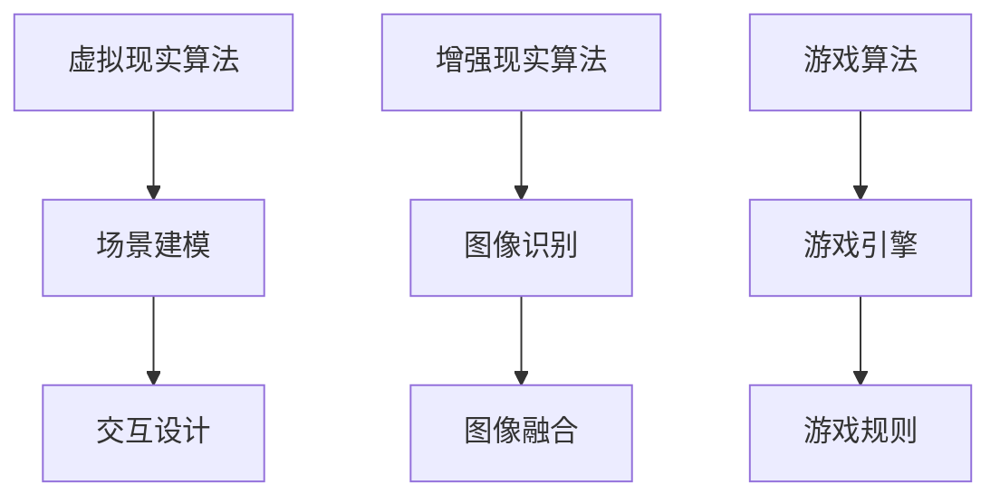

#### 4.2.3 智能娱乐应用案例

智能娱乐应用案例包括虚拟现实游戏、增强现实游戏和智能玩具等。例如，虚拟现实游戏可以通过提供沉浸式的游戏体验，提升游戏乐趣；增强现实游戏可以通过将虚拟角色和场景叠加到现实世界中，创造新颖的游戏体验；智能玩具可以通过与孩子的交互，实现个性化教育和娱乐。

### 4.3 智能健康监测

#### 4.3.1 智能健康监测概述

智能健康监测（Intelligent Health Monitoring）是指通过人工智能技术，对用户的健康数据进行实时监测和分析，提供个性化的健康建议和服务。智能健康监测应用主要分为身体健康监测、心理健康监测和运动健康监测等。

#### 4.3.2 智能健康监测算法

智能健康监测算法主要包括生理信号处理、行为识别和健康预测等。生理信号处理算法用于提取和分析用户的生理信号；行为识别算法用于识别用户的行为模式；健康预测算法用于预测用户的健康状况和潜在风险。

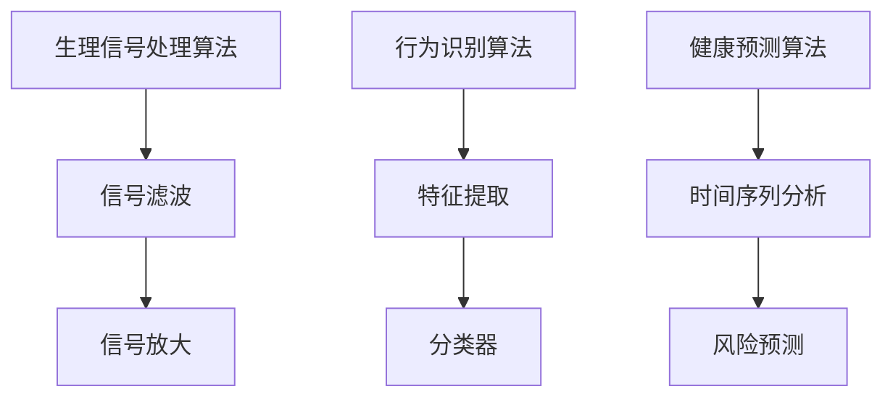

#### 4.3.3 智能健康监测应用案例

智能健康监测应用案例包括智能手环、智能健康监测仪和智能医疗设备等。例如，智能手环可以通过监测用户的心率、运动和睡眠数据，提供健康建议；智能健康监测仪可以通过监测用户的血压、血糖和体温数据，提供健康预警；智能医疗设备可以通过实时分析患者数据，实现智能诊断和治疗方案推荐。

## 第五部分：AI驱动的全方位感知挑战与未来趋势

### 5.1 挑战与问题

#### 5.1.1 技术挑战

AI驱动的全方位感知系统在技术层面面临以下挑战：

1. **计算能力需求**：全方位感知系统需要处理大量的传感器数据，对计算能力提出了高要求。
2. **数据隐私保护**：传感器采集的数据可能包含用户的隐私信息，如何保护数据隐私是一个重要问题。
3. **跨学科整合**：全方位感知系统涉及多个学科领域，如何实现有效整合是一个挑战。

#### 5.1.2 应用挑战

AI驱动的全方位感知系统在应用层面面临以下挑战：

1. **用户接受度**：用户可能对全方位感知系统存在疑虑，提高用户接受度是一个重要问题。
2. **法律法规**：全方位感知系统可能涉及到法律法规的问题，如何遵守相关法规是一个挑战。
3. **社会伦理**：全方位感知系统可能引发伦理问题，如何处理这些伦理问题是需要关注的问题。

### 5.2 未来趋势与展望

#### 5.2.1 技术发展趋势

未来，AI驱动的全方位感知系统将在以下方面取得进展：

1. **算法优化**：通过优化算法，提高感知系统的效率和准确性。
2. **硬件发展**：随着硬件技术的进步，传感器和处理器的能力将得到提升。
3. **跨领域应用**：全方位感知系统将在更多领域得到应用，如智能城市、智能交通和智能制造等。

#### 5.2.2 应用领域扩展

全方位感知系统在未来的应用领域将得到进一步扩展，包括：

1. **智能家居**：通过全方位感知系统，实现更加智能化的家庭生活。
2. **智能医疗**：通过全方位感知系统，实现更加精准和个性化的医疗服务。
3. **智能教育**：通过全方位感知系统，实现更加个性化和学习效果优化的教育模式。

#### 5.2.3 未来展望与挑战

未来的展望是AI驱动的全方位感知系统将带来更加智能化和人性化的体验，但同时也面临以下挑战：

1. **技术发展**：如何不断提升感知系统的技术水平和性能。
2. **伦理问题**：如何处理全方位感知系统带来的伦理问题，如数据隐私、用户接受度和社会影响等。
3. **法律法规**：如何制定和完善相关的法律法规，确保全方位感知系统的合法合规运行。

## 附录

### A.1 相关技术参考资料

#### A.1.1 AI相关技术综述

- Goodfellow, I., Bengio, Y., & Courville, A. (2016). *Deep Learning*. MIT Press.
- Russell, S., & Norvig, P. (2016). *Artificial Intelligence: A Modern Approach*. Prentice Hall.

#### A.1.2 跨感官融合技术文献

- Ledo, A., & Mediano, C. (2018). Multisensory integration in auditory and visual systems: From signal detection to cognitive performance. *Frontiers in Psychology*, 9, 1163.
- Pavan, S. D., Agostini, M., Ledo, A., & Mediano, C. (2015). Multisensory audiovisual speech processing: Signal detection and source localization in competing speech. *Frontiers in Psychology*, 6, 1438.

#### A.1.3 全方位感知系统研究

- Feiner, S., & Hill, R. (2010). Multisensory interaction: A foundation for mixed reality applications. *ACM Transactions on Graphics (TOG)*, 29(6), 179.
- Spence, C. (2007). Multisensory integration: Sensory processing in the nervous system and its aftermath. *Journal of Neurophysiology*, 98(4), 2097-2106.

### A.2 AI驱动的全方位感知应用案例库

#### A.2.1 应用案例概述

AI驱动的全方位感知应用案例库包括以下几种：

- **智能交互应用**：智能助手、虚拟客服、智能翻译等。
- **智能娱乐应用**：虚拟现实游戏、增强现实游戏、智能玩具等。
- **智能健康监测**：智能手环、智能健康监测仪、智能医疗设备等。

#### A.2.2 应用案例分类

- **智能家居**：智能灯光、智能家电、智能安防等。
- **智能交通**：智能路况监控、智能交通信号、智能驾驶等。
- **智能医疗**：智能诊断、智能治疗、智能药物研发等。
- **智能教育**：个性化教学、智能考试、智能辅导等。

#### A.2.3 应用案例选集

- **智能助手案例**：基于语音识别和自然语言处理的智能助手，如Apple Siri、Amazon Alexa。
- **智能娱乐案例**：基于虚拟现实和增强现实的娱乐应用，如Oculus Rift、Google Glass。
- **智能健康监测案例**：基于多传感器融合的健康监测设备，如Fitbit、Apple Watch。

### 结论

AI驱动的全方位感知系统，通过整合多种感官信息，为用户提供了丰富、细腻和智能化的体验。本文从原理、架构到应用，全面探讨了这一前沿技术的核心内容。尽管面临诸多挑战，但AI驱动的全方位感知系统在未来的发展中，将有望为各行业带来深刻的变革和提升。

### 作者信息

- 作者：AI天才研究院（AI Genius Institute） & 《禅与计算机程序设计艺术》（Zen And The Art of Computer Programming）

