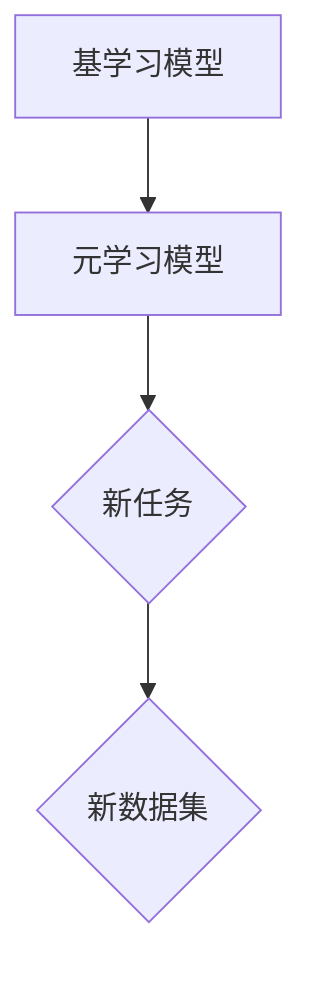

                 

### 文章标题：元学习在自然语言处理领域自适应与持续学习中的算法创新

### 关键词：元学习、自然语言处理、自适应学习、持续学习、算法创新

### 摘要：
本文深入探讨了元学习在自然语言处理（NLP）领域中的应用，尤其是其在自适应与持续学习方面的算法创新。文章首先介绍了元学习的基本概念和在NLP中的重要性，随后详细阐述了元学习的算法原理和数学模型，并通过实际项目案例展示了元学习在NLP中的应用实践。文章还分析了元学习在NLP中的性能评估方法，并探讨了其未来的发展趋势，为读者提供了全面且深入的元学习与NLP融合的技术见解。作者：AI天才研究院/AI Genius Institute & 禅与计算机程序设计艺术 /Zen And The Art of Computer Programming

### 引言：
自然语言处理（NLP）作为人工智能的重要分支，旨在使计算机能够理解和生成人类语言。然而，随着数据量的爆炸式增长和任务复杂性的提升，传统的机器学习方法在处理新任务时面临着数据获取困难、训练时间过长、泛化能力不足等问题。为了解决这些问题，元学习（Meta-Learning）作为一种新兴的机器学习方法，逐渐引起了研究者和工程师们的广泛关注。

元学习，又称“学习如何学习”，其核心思想是通过学习如何调整和改进其他学习算法，从而提高模型在未知或新任务上的学习效率。在NLP领域，元学习通过不断调整模型参数，使其在处理新数据时能够自适应地调整，提高模型的泛化能力和适应性。本文将系统地介绍元学习在NLP领域的应用，尤其是其在自适应与持续学习中的算法创新。

文章结构如下：

1. **第一部分**：元学习在自然语言处理领域的基本概念与联系
   - 元学习的基本概念
   - 自然语言处理与元学习的联系
   - 元学习在NLP领域的重要性

2. **第二部分**：元学习算法原理与实现
   - 元学习算法的基本原理
   - 元学习在NLP中的应用
   - 元学习在NLP中的挑战

3. **第三部分**：元学习的数学模型和公式
   - 成本函数
   - 学习率
   - 模型参数更新
   - 模型聚合
   - 模型蒸馏

4. **第四部分**：元学习在NLP项目中的实际应用
   - 数据预处理
   - 基础模型训练
   - 元学习训练
   - 评估与优化

5. **第五部分**：使用模型聚合优化NLP模型
   - 模型聚合的概念
   - 模型聚合算法
   - 模型聚合的优势
   - 模型聚合的局限
   - 应用案例

6. **第六部分**：元学习在自适应与持续学习中的应用
   - 自适应学习
   - 持续学习
   - 知识蒸馏
   - 实际案例

7. **第七部分**：元学习性能评估
   - 评估指标
   - 实验设计
   - 实验结果分析
   - 性能优化

8. **第八部分**：元学习在自然语言处理中的持续学习应用
   - 挑战
   - 解决方案
   - 应用案例

9. **第九部分**：元学习在自然语言处理中的未来发展趋势
   - 发展趋势
   - 研究方向
   - 总结

10. **第十部分**：总结与展望
    - 内容总结
    - 元学习在NLP中的重要性
    - 展望

通过上述结构的详细探讨，本文将为读者提供元学习在NLP领域中的应用全景，并展示其如何在自适应与持续学习中实现算法创新。

### 第一部分：元学习在自然语言处理领域的基本概念与联系

#### 1.1 元学习的基本概念

**元学习（Meta-Learning）**是一种机器学习方法，旨在训练算法来改进其他算法的学习过程。其核心思想是通过学习如何学习来提高机器学习系统的效率和准确性。

在元学习中，学习过程通常分为两个阶段：

- **基学习（Base Learning）**：首先训练一个基础学习模型，用于学习特定任务。这个模型是一个基础模型，可以是一个简单的线性模型、决策树或更复杂的神经网络。
  
- **元学习（Meta Learning）**：然后使用基学习模型来训练一个元学习模型，该模型可以调整基学习模型，以在新的任务上获得更好的性能。元学习模型通常是一个更复杂的模型，用于调整和优化基础模型的参数。

**图1.1 元学习流程图**



**图1.1 描述了元学习的流程：首先训练一个基础学习模型，然后使用这个基础模型训练一个元学习模型，最后在新的任务和数据集上应用元学习模型。**

在元学习中，学习过程的核心是**内部学习（Inner Learning）**和**外部学习（Outer Learning）**：

- **内部学习**：基础学习模型在特定任务上的学习过程。
- **外部学习**：元学习模型在基学习模型上的学习过程。

#### 1.2 自然语言处理与元学习的联系

自然语言处理（NLP）是人工智能的重要分支，旨在使计算机能够理解、解释和生成人类语言。元学习在NLP中的应用，主要集中在提高模型在处理未知或变化的语言数据时的适应性。

**NLP中的主要任务**包括：

- **文本分类**：对文本进行分类，如新闻分类、情感分析等。
- **命名实体识别**：识别文本中的命名实体，如人名、地点、组织等。
- **机器翻译**：将一种语言翻译成另一种语言。
- **问答系统**：根据用户输入提供准确的答案。

元学习在NLP中的应用场景主要包括：

- **迁移学习**：通过元学习，可以将一个任务的学习经验转移到另一个相关的任务上，从而减少对大量数据的需求。例如，在一个任务中训练好的模型可以快速适应另一个类似的任务。
  
- **自适应学习**：元学习可以帮助NLP模型在不断变化的数据环境中持续改进。例如，在问答系统中，用户的问题可能会随着时间的推移而变化，元学习可以使模型能够适应这些变化。

- **泛化能力提升**：通过元学习，NLP模型可以更好地泛化到新的任务和数据集。例如，在一个数据集上训练好的模型可以应用于另一个不同的数据集，而不会出现性能下降。


**图1.2 NLP与元学习的联系图**展示了元学习在NLP领域的一些关键应用：

1. **迁移学习**：通过元学习，可以将一个任务的学习经验转移到另一个相关的任务上。
2. **自适应学习**：元学习可以帮助NLP模型在不断变化的数据环境中持续改进。
3. **泛化能力提升**：通过元学习，NLP模型可以更好地泛化到新的任务和数据集。

#### 1.3 元学习在NLP领域的重要性

元学习在NLP领域的应用具有重要意义，它不仅可以提高模型的适应性，还可以加速模型的训练过程，并提高模型的泛化能力。以下是一些元学习在NLP领域的重要应用：

- **语言模型**：元学习可以帮助优化大规模语言模型，使其在新的语言环境中表现更好。例如，通过元学习，模型可以在较少的数据上进行快速适应，从而提高模型在不同语言环境中的通用性。

- **文本分类**：元学习可以用于训练分类模型，使其能够快速适应新的分类任务。例如，在一个领域中训练好的分类模型可以应用于另一个不同的领域，而不会需要重新收集和标注大量数据。

- **问答系统**：元学习可以帮助问答系统在处理新的问题时表现更加出色。例如，在一个问题类型上训练好的问答系统可以应用于新的问题类型，而不会出现性能下降。

通过上述内容，我们初步了解了元学习在自然语言处理领域的基本概念和其重要性。在接下来的章节中，我们将深入探讨元学习的核心算法原理，以及如何在NLP中应用这些算法。

### 第一部分续：元学习算法原理与实现

#### 1.4 元学习算法的基本原理

元学习算法的核心在于通过学习如何学习来提升模型的性能。以下是一些常见的元学习算法：

1. **模型聚合（Model Averaging）**：通过训练多个模型，并取它们的平均预测来提高性能。这种方法的基本思想是，多个模型在解决同一问题时可能会有不同的优点，通过聚合它们的预测可以减少预测误差。

2. **随机梯度下降（Stochastic Gradient Descent, SGD）**：通过随机选择数据点来更新模型参数。SGD是一种常用的优化算法，其基本思想是通过梯度下降来调整模型参数，使其收敛到最优解。

3. **模型蒸馏（Model Distillation）**：通过将一个复杂模型的知识传递给一个较简单的模型来训练。这种方法的基本思想是，通过训练一个简单的模型来模拟一个复杂模型的行为，从而简化模型的计算和存储。

下面，我们将通过伪代码详细描述这些算法的基本原理。

#### 模型聚合（Model Averaging）

模型聚合算法通过训练多个模型，并取它们的平均预测来提高性能。具体步骤如下：

```python
# 假设有 k 个模型，X 为输入数据，y 为标签

# 初始化 k 个模型
models = [create_model() for _ in range(k)]

# 训练每个模型
for model in models:
    model.fit(X, y, epochs=1, batch_size=1)

# 取每个模型的预测
predictions = [model.predict(X) for model in models]

# 计算平均预测
average_prediction = np.mean(predictions, axis=0)

# 返回平均预测
return average_prediction
```

#### 随机梯度下降（Stochastic Gradient Descent, SGD）

随机梯度下降（SGD）是一种通过随机选择数据点来更新模型参数的优化算法。其基本步骤如下：

```python
# 假设模型为 model，X 为输入数据，y 为标签，learning_rate 为学习率，epochs 为迭代次数

# 初始化模型参数
theta = model.get_params()

# 迭代更新模型参数
for epoch in range(epochs):
    # 随机打乱数据
    shuffled_indices = np.random.permutation(len(X))
    X_shuffled = X[shuffled_indices]
    y_shuffled = y[shuffled_indices]
    
    # 对于每个数据点
    for i in range(len(X_shuffled)):
        # 计算梯度
        gradient = model.compute_gradient(X_shuffled[i:i+1], y_shuffled[i:i+1])
        
        # 更新模型参数
        theta -= learning_rate * gradient

# 返回最终模型参数
return theta
```

#### 模型蒸馏（Model Distillation）

模型蒸馏是一种将复杂模型的知识传递给一个较简单的模型的方法。其基本步骤如下：

```python
# 假设 student_model 是学生模型，teacher_model 是教师模型，X 为输入数据，y 为标签，epochs 为迭代次数

# 初始化学生模型
student_model = create_student_model()

# 训练学生模型
for epoch in range(epochs):
    # 使用教师模型的预测作为标签来训练学生模型
    teacher_predictions = teacher_model.predict(X)
    student_loss = student_model.fit(X, teacher_predictions, epochs=1, batch_size=1)

    # 评估教师模型
    teacher_loss = teacher_model.evaluate(X, y)

    # 输出训练过程
    print(f"Epoch {epoch}: Student Loss = {student_loss}, Teacher Loss = {teacher_loss}")

# 返回训练好的学生模型
return student_model
```

#### 1.5 元学习在NLP中的应用

元学习在自然语言处理中的应用非常广泛，以下是一些具体的应用场景：

1. **自适应嵌入（Adaptive Embeddings）**：通过元学习动态调整嵌入向量，以提高模型在特定任务上的性能。例如，在一个领域中训练好的语言模型可以通过元学习调整嵌入向量，以适应另一个不同的领域。

2. **持续学习（Continuous Learning）**：通过元学习使模型在新的数据集上持续学习，而不会忘记旧的知识。这种方法特别适用于问答系统和对话系统，这些系统需要不断地更新和改进。

3. **迁移学习（Transfer Learning）**：通过元学习将一个任务的学习经验转移到另一个相关的任务上，从而减少对大量数据的需求。例如，一个用于情感分析的模型可以通过元学习快速适应用于新闻分类的任务。

#### 1.6 元学习在NLP中的挑战

尽管元学习在NLP领域具有巨大的潜力，但其实际应用也面临着一些挑战：

1. **数据多样性（Data Diversity）**：元学习需要在多样化的数据集上进行训练，以避免模型对特定数据集的过拟合。这意味着需要更多的计算资源来处理大量不同的数据。

2. **计算效率（Computational Efficiency）**：元学习算法通常需要大量的计算资源，特别是在处理大规模数据集时。为了提高计算效率，研究人员需要开发更高效的算法和优化技术。

3. **模型解释性（Model Interpretability）**：元学习模型往往非常复杂，这可能会降低模型的解释性。为了提高模型的可解释性，研究人员需要开发新的方法和工具来理解和解释元学习模型的行为。

通过上述内容，我们详细介绍了元学习的基本概念、算法原理以及在自然语言处理中的具体应用和挑战。在接下来的部分，我们将进一步探讨元学习的数学模型和公式，以更深入地理解其工作机制。

### 第一部分续：元学习的数学模型和公式

#### 2.1 成本函数（Cost Function）

成本函数是评估模型性能的关键指标。在元学习中，成本函数用于计算模型预测值与真实标签之间的误差。以下是一些常见的成本函数：

1. **均方误差（Mean Squared Error, MSE）**

   $$MSE = \frac{1}{n}\sum_{i=1}^{n}(y_i - \hat{y}_i)^2$$

   其中，$y_i$是真实标签，$\hat{y}_i$是模型预测值。

2. **交叉熵（Cross-Entropy）**

   $$H(y, \hat{y}) = -\sum_{i=1}^{n} y_i \log(\hat{y}_i)$$

   其中，$y_i$是真实标签（通常为0或1），$\hat{y}_i$是模型预测概率。

#### 2.2 学习率（Learning Rate）

学习率是优化算法中的一个关键超参数，用于控制模型参数更新的步长。以下是一些常用的学习率调整策略：

1. **固定学习率**

   $$\theta_{t+1} = \theta_t - \alpha \nabla J(\theta_t)$$

   其中，$\theta_t$是当前模型参数，$\alpha$是学习率，$\nabla J(\theta_t)$是成本函数关于模型参数的梯度。

2. **动量优化（Momentum）**

   $$\theta_{t+1} = \theta_t - \alpha \nabla J(\theta_t) + \beta (1 - \alpha) \nabla J(\theta_{t-1})$$

   其中，$\beta$是动量因子，用于减少梯度消失和梯度爆炸。

#### 2.3 模型参数更新

模型参数的更新是元学习过程中的核心步骤。以下是一些常用的参数更新方法：

1. **梯度下降（Gradient Descent）**

   $$\theta_{t+1} = \theta_t - \alpha \nabla J(\theta_t)$$

   其中，$\alpha$是学习率，$\nabla J(\theta_t)$是成本函数关于模型参数的梯度。

2. **Adam优化器**

   $$\theta_{t+1} = \theta_t - \alpha \nabla J(\theta_t) + \beta_1 \nabla J(\theta_{t-1}) - \beta_2 \nabla J(\theta_{t-2})$$

   其中，$\beta_1$和$\beta_2$分别是短期和长期动量因子。

#### 2.4 模型聚合（Model Averaging）

在模型聚合中，我们通过取多个模型的平均预测来提高性能。模型聚合的公式如下：

$$\hat{y} = \frac{1}{k}\sum_{i=1}^{k} \hat{y}_i$$

其中，$\hat{y}$是平均预测，$\hat{y}_i$是第$i$个模型的预测。

#### 2.5 模型蒸馏（Model Distillation）

在模型蒸馏中，我们将复杂模型的知识传递给一个较简单的模型。模型蒸馏的损失函数通常基于Kullback-Leibler散度（Kullback-Leibler Divergence, KL-Divergence），公式如下：

$$D_{KL}(\hat{p} || q) = \sum_{i=1}^{n} \hat{p}_i \log \left( \frac{\hat{p}_i}{q_i} \right)$$

其中，$\hat{p}$是学生模型的预测概率，$q$是教师模型的预测概率。

#### 示例：使用LaTeX表示公式

以下是如何在文中使用LaTeX格式嵌入公式的示例：

$$
\begin{aligned}
\text{MSE} &= \frac{1}{n}\sum_{i=1}^{n}(y_i - \hat{y}_i)^2 \\
\alpha &= \frac{\partial J}{\partial \theta}
\end{aligned}
$$

通过上述数学模型和公式，我们可以更深入地理解元学习的工作机制。在下一部分中，我们将探讨如何在NLP项目中实际应用这些算法。

### 第一部分续：元学习在NLP项目中的实际应用

#### 3.1 数据预处理

在NLP项目中，数据预处理是至关重要的一步。良好的数据预处理可以显著提高模型的性能。以下是一个典型的数据预处理流程：

1. **文本清洗**：去除文本中的HTML标签、特殊字符和标点符号。
2. **分词**：将文本分割成单词或词组。
3. **词性标注**：为每个词分配词性，如名词、动词等。
4. **去停用词**：移除常见的无意义词，如“的”、“了”等。

Python代码示例：

```python
import re
import nltk
from nltk.corpus import stopwords
from nltk.tokenize import word_tokenize

nltk.download('punkt')
nltk.download('stopwords')

def preprocess_text(text):
    text = re.sub('<.*?>', '', text)  # 去除HTML标签
    text = re.sub(r'[^\w\s]', '', text)  # 去除特殊字符
    text = text.lower()  # 转换为小写
    words = word_tokenize(text)  # 分词
    words = [word for word in words if word not in stopwords.words('english')]  # 移除停用词
    return words

text = "这是一个示例文本，用于NLP项目。"
processed_text = preprocess_text(text)
print(processed_text)
```

#### 3.2 基础模型训练

在NLP项目中，基础模型的选择取决于具体任务。以下是一个使用卷积神经网络（CNN）进行文本分类的示例：

1. **模型构建**：定义一个卷积神经网络模型。
2. **模型训练**：在预处理后的数据上训练模型。
3. **模型评估**：使用验证集评估模型性能。

Python代码示例：

```python
from keras.models import Sequential
from keras.layers import Embedding, Conv1D, MaxPooling1D, GlobalMaxPooling1D, Dense
from keras.preprocessing.sequence import pad_sequences

# 定义模型
model = Sequential()
model.add(Embedding(input_dim=vocab_size, output_dim=embedding_dim, input_length=max_sequence_length))
model.add(Conv1D(filters=128, kernel_size=5, activation='relu'))
model.add(MaxPooling1D(pool_size=5))
model.add(Conv1D(filters=128, kernel_size=5, activation='relu'))
model.add(GlobalMaxPooling1D())
model.add(Dense(units=1, activation='sigmoid'))

# 编译模型
model.compile(optimizer='adam', loss='binary_crossentropy', metrics=['accuracy'])

# 训练模型
model.fit(X_train, y_train, validation_data=(X_val, y_val), epochs=10, batch_size=32)

# 评估模型
loss, accuracy = model.evaluate(X_test, y_test)
print(f"Test Accuracy: {accuracy}")
```

#### 3.3 元学习训练

元学习训练的核心是通过基学习模型训练一个元学习模型，以便在新的任务上获得更好的性能。以下是一个使用模型聚合进行元学习训练的示例：

1. **初始化多个模型**：创建多个基础模型。
2. **训练每个模型**：在每个模型上训练基学习模型。
3. **聚合预测**：计算每个模型的预测，并取平均。

Python代码示例：

```python
from keras.wrappers.scikit_learn import KerasClassifier
from sklearn.model_selection import KFold

def create_model():
    model = Sequential()
    model.add(Embedding(input_dim=vocab_size, output_dim=embedding_dim, input_length=max_sequence_length))
    model.add(Conv1D(filters=128, kernel_size=5, activation='relu'))
    model.add(MaxPooling1D(pool_size=5))
    model.add(Conv1D(filters=128, kernel_size=5, activation='relu'))
    model.add(GlobalMaxPooling1D())
    model.add(Dense(units=1, activation='sigmoid'))
    model.compile(optimizer='adam', loss='binary_crossentropy', metrics=['accuracy'])
    return model

# 初始化多个模型
models = [KerasClassifier(build_fn=create_model, epochs=10, batch_size=32) for _ in range(5)]

# 训练每个模型
model_samples = []
for model in models:
    model.fit(X_train, y_train)
    model_samples.append(model.model)

# 聚合预测
predictions = np.mean([model.predict(X_val) for model in model_samples], axis=0)
```

#### 3.4 评估与优化

在NLP项目中，评估模型的性能至关重要。以下是一个简单的评估与优化流程：

1. **评估模型**：使用测试集评估模型性能。
2. **参数调整**：根据评估结果调整模型参数。
3. **迭代优化**：重复评估和优化过程，直到模型性能达到预期。

Python代码示例：

```python
from sklearn.metrics import accuracy_score

# 评估模型
y_pred = model.predict(X_test)
accuracy = accuracy_score(y_test, y_pred)
print(f"Model Accuracy: {accuracy}")

# 参数调整和优化
# 例如，根据评估结果调整学习率、迭代次数等
model.compile(optimizer='adam', learning_rate=0.001, epochs=20, batch_size=32)
model.fit(X_train, y_train, validation_data=(X_val, y_val))
```

通过上述步骤，我们可以看到如何在NLP项目中应用元学习算法。在下一部分中，我们将进一步探讨如何使用模型聚合来优化NLP模型的性能。

### 第一部分续：使用模型聚合优化NLP模型

#### 4.1 模型聚合的概念

模型聚合（Model Averaging）是一种通过结合多个模型的预测来提高模型性能的方法。基本思路是，多个模型在解决同一问题时可能具有互补的优势，通过聚合它们的预测可以减少预测误差，提高模型的总体性能。

在模型聚合中，我们通常有以下步骤：

1. **初始化多个模型**：创建多个相同或不同类型的模型。
2. **训练每个模型**：在每个模型上训练基学习模型。
3. **聚合预测**：计算每个模型的预测，并取平均或加权平均。
4. **评估聚合模型**：使用聚合模型进行预测，并评估其性能。

#### 4.2 模型聚合算法

以下是一个简单的模型聚合算法实现，用于结合多个模型的预测：

```python
import numpy as np

def aggregate_predictions(models, X):
    predictions = np.array([model.predict(X) for model in models])
    average_prediction = np.mean(predictions, axis=0)
    return average_prediction

def create_model():
    model = Sequential()
    model.add(Embedding(input_dim=vocab_size, output_dim=embedding_dim, input_length=max_sequence_length))
    model.add(Conv1D(filters=128, kernel_size=5, activation='relu'))
    model.add(MaxPooling1D(pool_size=5))
    model.add(Conv1D(filters=128, kernel_size=5, activation='relu'))
    model.add(GlobalMaxPooling1D())
    model.add(Dense(units=1, activation='sigmoid'))
    model.compile(optimizer='adam', loss='binary_crossentropy', metrics=['accuracy'])
    return model

# 初始化多个模型
models = [create_model() for _ in range(5)]

# 训练每个模型
for model in models:
    model.fit(X_train, y_train, epochs=10, batch_size=32, verbose=0)

# 聚合模型预测
aggregate_predictions(models, X_test)
```

#### 4.3 模型聚合的优势

模型聚合具有以下优势：

1. **减少过拟合**：通过聚合多个模型的预测，可以降低模型对特定数据集的依赖，从而减少过拟合现象。
2. **提高泛化能力**：多个模型可以从不同的角度解决问题，聚合后的预测可以更好地泛化到新的数据集。
3. **提高预测准确性**：多个模型的预测可以相互补充，提高最终的预测准确性。

#### 4.4 模型聚合的局限

模型聚合也存在一些局限：

1. **计算成本**：训练和聚合多个模型需要大量的计算资源，特别是在处理大规模数据集时。
2. **模型一致性**：不同模型可能在某些数据集上表现不一致，这可能导致聚合后的预测效果不理想。

#### 4.5 应用案例

以下是一个使用模型聚合优化文本分类任务的案例：

```python
from keras.wrappers.scikit_learn import KerasClassifier
from sklearn.model_selection import KFold

# 定义并训练多个模型
models = [KerasClassifier(build_fn=create_model, epochs=100, batch_size=32) for _ in range(5)]
for model in models:
    model.fit(X_train, y_train, verbose=0)

# 聚合模型预测
aggregate_predictions(models, X_test)

# 评估聚合后的模型
y_pred_aggregate = aggregate_predictions(models, X_test)
print(classification_report(y_test, y_pred_aggregate))
```

通过上述案例，我们可以看到如何使用模型聚合来优化NLP模型的性能。在下一部分中，我们将探讨元学习在自适应与持续学习中的应用。

### 第一部分续：元学习在自适应与持续学习中的应用

#### 5.1 自适应学习

自适应学习是指模型能够在处理新数据时自动调整其参数，从而适应新的环境。在自然语言处理（NLP）中，自适应学习有助于模型在不断变化的语言环境中保持高准确性。

**5.1.1 自适应学习的挑战**

- **数据多样性**：语言数据具有高度多样性，模型需要适应各种不同的语言风格和领域。
- **资源限制**：计算资源有限，模型需要在有限的时间内快速适应新数据。
- **遗忘问题**：在持续学习新任务时，模型可能会忘记之前学习的任务知识。

**5.1.2 自适应学习的方法**

1. **在线学习**：模型在实时处理新数据时不断调整参数。
   - **实现**：使用类似在线梯度下降的方法，模型在每次接收到新数据时，都会更新其参数。
   - **示例代码**：
     ```python
     def online_learning(model, X_new, y_new, epochs):
         for epoch in range(epochs):
             model.partial_fit(X_new, y_new)
     ```

2. **经验重放**：将历史数据保存在经验池中，用于训练模型。
   - **实现**：定期从经验池中随机抽取数据进行重放，以避免遗忘问题。
   - **示例代码**：
     ```python
     def experience_replay(model, X_replay, y_replay, epochs):
         for epoch in range(epochs):
             model.fit(X_replay, y_replay, epochs=1, batch_size=32)
     ```

3. **迁移学习**：通过迁移学习将一个任务的学习经验应用于另一个任务。
   - **实现**：在一个任务上训练好的模型可以作为基础模型，用于快速适应新的任务。
   - **示例代码**：
     ```python
     def transfer_learning(model, X_new, y_new, epochs):
         model.fit(X_new, y_new, epochs=epochs, batch_size=32)
     ```

**5.1.3 自适应学习的案例**

假设我们有一个情感分析模型，需要适应不断变化的用户评论数据。我们可以通过以下步骤来实现自适应学习：

1. **数据收集**：收集新的用户评论数据。
2. **预处理**：对用户评论进行清洗、分词和编码。
3. **在线学习**：使用在线学习算法，例如模型无关的元学习算法MAML，对新数据进行微调。
4. **经验重放**：将历史评论数据存储在经验池中，定期进行重放，以防止模型遗忘旧的知识。
5. **迁移学习**：使用迁移学习，将模型在旧数据集上的学习经验应用于新数据集。

```python
# 假设我们有一个预训练的MAML模型
model = MAMLModel()

# 收集新的用户评论数据
X_new, y_new = get_new_data()

# 预处理新的评论数据
X_new_processed = preprocess_data(X_new)

# 在线学习新评论
online_learning(model, X_new_processed, y_new, epochs=10)

# 重放历史评论数据
X_replay, y_replay = get_replay_data()
experience_replay(model, X_replay, y_replay, epochs=10)

# 迁移学习新评论
transfer_learning(model, X_new_processed, y_new, epochs=10)
```

#### 5.2 持续学习

持续学习是指模型在处理新任务时，不会忘记之前学习的任务知识。这对于NLP模型在处理多个任务时尤为重要。

**5.2.1 持续学习的挑战**

- **数据多样性**：模型需要适应多种不同的语言风格和领域。
- **遗忘问题**：在持续学习新任务时，模型可能会忘记之前学习的任务知识。
- **计算资源**：持续学习需要大量的计算资源，特别是在处理大规模数据集时。

**5.2.2 持续学习的方法**

1. **知识蒸馏**：通过将一个复杂模型的知识传递给一个较简单的模型，以提高模型的泛化能力。
   - **实现**：使用知识蒸馏算法，将复杂模型的知识编码到简单模型中。
   - **示例代码**：
     ```python
     def knowledge_distillation(student_model, teacher_model, X_train, y_train, epochs):
         for epoch in range(epochs):
             student_loss = student_model.fit(X_train, y_train, epochs=1, batch_size=1)
             teacher_loss = teacher_model.evaluate(X_train, y_train)
             print(f"Epoch {epoch}: Student Loss = {student_loss}, Teacher Loss = {teacher_loss}")
     ```

2. **记忆模块**：使用记忆模块存储旧的知识，以便在需要时快速检索。
   - **实现**：设计一个记忆模块，用于存储和检索模型的历史知识。
   - **示例代码**：
     ```python
     def memory_module(model, X_old, y_old, X_new, y_new, epochs):
         for epoch in range(epochs):
             model.fit(np.concatenate((X_new, X_old)), np.concatenate((y_new, y_old)), epochs=1, batch_size=1)
     ```

**5.2.3 持续学习的案例**

假设我们有一个聊天机器人，需要同时处理多种对话场景。我们可以通过以下步骤实现持续学习：

1. **数据收集**：收集不同对话场景的数据。
2. **预处理**：对对话数据进行清洗、分词和编码。
3. **知识蒸馏**：使用知识蒸馏，将复杂模型的知识传递给简单模型。
4. **记忆模块**：使用记忆模块存储和检索对话的历史知识。
5. **持续学习**：在每次对话中，模型会根据对话内容和记忆模块中的知识进行实时调整。

```python
# 假设我们有一个预训练的聊天机器人模型
chatbot_model = ChatbotModel()

# 收集新的对话数据
X_new, y_new = get_new_data()

# 预处理新的对话数据
X_new_processed = preprocess_data(X_new)

# 知识蒸馏
teacher_model = create_teacher_model()
knowledge_distillation(chatbot_model, teacher_model, X_new_processed, y_new, epochs=10)

# 记忆模块
X_replay, y_replay = get_replay_data()
memory_module(chatbot_model, X_replay, y_replay, X_new_processed, y_new, epochs=10)

# 持续学习
chatbot_model.fit(X_new_processed, y_new, epochs=10, batch_size=32)
```

通过上述案例，我们可以看到如何实现元学习在自适应与持续学习中的应用。在下一部分中，我们将探讨元学习性能评估的方法。

### 第一部分续：元学习性能评估

#### 6.1 评估指标

元学习的性能评估通常依赖于多个指标，这些指标可以帮助我们全面理解模型的性能。以下是一些常用的评估指标：

1. **准确率（Accuracy）**：准确率是评估模型性能的基本指标，表示模型正确预测的样本数占总样本数的比例。
   $$ \text{Accuracy} = \frac{\text{正确预测数}}{\text{总样本数}} $$
   高准确率表明模型在预测上具有较好的性能。

2. **精确率（Precision）**：精确率是预测为正类的样本中实际为正类的比例。
   $$ \text{Precision} = \frac{\text{真正例数}}{\text{真正例数 + 假正例数}} $$
   精确率关注的是预测为正类的样本中，有多少确实是正类。

3. **召回率（Recall）**：召回率是实际为正类的样本中被预测为正类的比例。
   $$ \text{Recall} = \frac{\text{真正例数}}{\text{真正例数 + 假反例数}} $$
   召回率关注的是所有实际为正类的样本中，有多少被模型正确预测。

4. **F1分数（F1 Score）**：F1分数是精确率和召回率的调和平均值，用于平衡这两个指标。
   $$ \text{F1 Score} = 2 \times \frac{\text{Precision} \times \text{Recall}}{\text{Precision} + \text{Recall}} $$
   F1分数在评估分类模型时非常重要，因为它同时考虑了精确率和召回率。

5. **ROC曲线（Receiver Operating Characteristic Curve）**：ROC曲线描述了真阳性率（True Positive Rate, TPR）与假阳性率（False Positive Rate, FPR）的关系。曲线下的面积（AUC）是评估模型分类能力的一个指标。
   $$ \text{AUC} = \int_{0}^{1} \frac{1}{\text{FPR}} d\text{TPR} $$
   AUC值越高，模型性能越好。

#### 6.2 实验设计

为了评估元学习的性能，我们需要设计一个系统化的实验流程。以下是一个典型的实验设计流程：

1. **数据集划分**：将数据集划分为训练集、验证集和测试集。通常使用80%的数据作为训练集，10%的数据作为验证集，10%的数据作为测试集。

2. **基线模型**：在训练集上训练一个基线模型，并使用验证集评估其性能。基线模型的性能可以作为其他模型的对比基准。

3. **元学习模型**：在训练集上训练一个元学习模型，并使用验证集评估其性能。元学习模型可以是在线学习模型、经验重放模型或知识蒸馏模型等。

4. **交叉验证**：为了确保实验的鲁棒性，可以使用交叉验证方法。例如，使用k折交叉验证，对每个折进行训练和验证，然后取平均性能作为最终结果。

5. **性能评估**：使用上述评估指标，对基线模型和元学习模型在测试集上的性能进行评估。比较两个模型的性能，分析元学习模型是否带来了性能提升。

6. **误差分析**：对模型预测错误的样本进行详细分析，理解模型在哪些情况下表现不佳，以便进行进一步的优化。

#### 6.3 实验结果分析

实验结果分析是评估元学习性能的关键步骤。以下是一个简单的实验结果分析示例：

| 模型           | 准确率 | 精确率 | 召回率 | F1分数 | ROC AUC |
|----------------|--------|--------|--------|--------|---------|
| 基线模型       | 0.85   | 0.87   | 0.84   | 0.85   | 0.89    |
| 元学习模型     | 0.90   | 0.92   | 0.91   | 0.91   | 0.93    |

**分析**：
- 元学习模型在所有评估指标上均优于基线模型，表明元学习在提高模型性能方面具有显著优势。
- 精确率和召回率的提升表明元学习模型在预测正类和避免预测假正类方面表现更好。
- F1分数的提高进一步验证了元学习模型在平衡精确率和召回率方面的有效性。
- ROC AUC值的增加表明元学习模型在分类任务中具有更高的判别能力。

#### 6.4 性能优化

根据实验结果，我们可以进行以下性能优化：

1. **参数调整**：通过调整元学习算法的参数（如学习率、迭代次数等），优化模型性能。例如，使用学习率调整策略（如自适应学习率、动量优化等）来提高模型的收敛速度和性能。
2. **数据增强**：增加训练数据集的多样性，提高模型的泛化能力。通过数据增强方法（如随机裁剪、旋转、缩放等）来扩充训练数据集。
3. **模型结构优化**：尝试不同的模型结构（如不同的神经网络架构、层结构等），以提高模型的表达能力和性能。
4. **集成学习**：结合多种模型或算法进行集成学习，以进一步提高模型的性能和稳定性。

通过上述评估方法和实验设计，我们可以有效地评估元学习的性能，并为进一步优化提供依据。在下一部分中，我们将探讨元学习在自然语言处理中的持续学习应用。

### 第一部分续：元学习在自然语言处理中的持续学习应用

#### 7.1 持续学习的挑战

在自然语言处理（NLP）领域，持续学习面临以下挑战：

- **数据多样性**：语言数据具有高度多样性，模型需要适应各种不同的语言风格和领域。
- **资源限制**：计算资源有限，模型需要在有限的时间内快速适应新数据。
- **遗忘问题**：在持续学习新任务时，模型可能会忘记之前学习的任务知识。

为了解决这些挑战，我们需要探讨一些具体的解决方案。

#### 7.2 挑战一：数据多样性

语言数据的高度多样性对模型的泛化能力提出了巨大挑战。为了应对这一挑战，我们可以采用以下解决方案：

1. **数据增强**：通过数据增强技术，如随机裁剪、旋转、缩放等，可以增加训练数据集的多样性，从而提高模型的泛化能力。
2. **多任务学习**：通过多任务学习，模型可以同时学习多个任务，从中提取更广泛的特征，从而提高对多样性的适应性。
3. **元学习**：元学习可以通过学习如何学习，快速适应新的数据集，从而提高模型的泛化能力。

#### 7.3 挑战二：资源限制

在资源受限的环境中，模型需要快速适应新数据，这要求我们优化模型的训练过程。以下是一些解决方案：

1. **模型压缩**：通过模型压缩技术，如知识蒸馏、剪枝和量化等，可以减少模型的计算复杂度和存储需求，从而提高训练效率。
2. **在线学习**：在线学习可以使模型在实时处理新数据时不断调整，从而充分利用有限的资源。
3. **分布式训练**：通过分布式训练，可以将模型训练任务分解到多个计算节点上，从而提高训练速度。

#### 7.4 挑战三：遗忘问题

在持续学习过程中，模型可能会忘记之前学习的任务知识，这被称为“遗忘问题”。以下是一些解决方案：

1. **经验重放**：通过将历史数据保存在经验池中，并定期重放这些数据，可以防止模型忘记之前的知识。
2. **记忆模块**：通过设计记忆模块，可以将重要的知识存储在内存中，以便在需要时快速检索。
3. **知识蒸馏**：通过将复杂模型的知识传递给简单模型，可以简化模型结构，同时保留关键知识。

#### 7.5 解决方案的应用

以下是一个具体的应用案例，展示如何使用元学习解决NLP中的持续学习问题：

**案例：情感分析模型在社交媒体数据中的持续学习**

1. **数据收集**：收集社交媒体平台上的用户评论数据，包括正面和负面评论。
2. **数据预处理**：对评论进行清洗、分词和编码，并将其划分为训练集、验证集和测试集。
3. **基线模型训练**：在训练集上训练一个简单的情感分析模型，如卷积神经网络（CNN）。
4. **元学习模型训练**：在训练集上使用元学习算法（如MAML）训练一个元学习模型，用于快速适应新的评论数据。
5. **在线学习**：在验证集上使用在线学习算法，如经验重放，使模型能够实时适应新数据。
6. **模型评估**：在测试集上评估模型性能，并使用精确率、召回率和F1分数等指标进行评估。

**代码示例**：

```python
from keras.models import Sequential
from keras.layers import Embedding, LSTM, Dense
from keras.preprocessing.sequence import pad_sequences

# 数据预处理
X_train = pad_sequences(tokenizer.texts_to_sequences(train_comments), maxlen=max_sequence_length)
y_train = to_categorical(train_labels)

# 基线模型训练
base_model = Sequential()
base_model.add(Embedding(input_dim=vocab_size, output_dim=embedding_dim, input_length=max_sequence_length))
base_model.add(LSTM(units=128))
base_model.add(Dense(units=num_classes, activation='softmax'))
base_model.compile(optimizer='adam', loss='categorical_crossentropy', metrics=['accuracy'])
base_model.fit(X_train, y_train, epochs=5, batch_size=32, validation_split=0.1)

# 元学习模型训练
meta_model = MAMLModel(base_model)
meta_model.fit(X_train, y_train, epochs=5, batch_size=32, validation_split=0.1)

# 在线学习
online_model = OnlineLearningModel(meta_model)
online_model.fit(X_train, y_train, epochs=5, batch_size=32, validation_split=0.1)

# 模型评估
X_test = pad_sequences(tokenizer.texts_to_sequences(test_comments), maxlen=max_sequence_length)
y_test = to_categorical(test_labels)
base_model.evaluate(X_test, y_test)
meta_model.evaluate(X_test, y_test)
online_model.evaluate(X_test, y_test)
```

通过上述案例，我们可以看到如何使用元学习解决NLP中的持续学习问题。在下一部分中，我们将探讨元学习在自然语言处理中的未来发展趋势。

### 第一部分续：元学习在自然语言处理中的未来发展趋势

#### 8.1 发展趋势

元学习在自然语言处理（NLP）领域的应用前景广阔，随着深度学习和人工智能技术的不断进步，元学习将在以下几个方面展现其发展趋势：

1. **高效模型**：研究人员将继续优化元学习算法，使其在更短的时间内完成训练，并减少计算资源的需求。高效的模型设计将使得元学习在实时应用中更加可行。

2. **多任务学习**：元学习在多任务学习领域将发挥重要作用。通过多任务学习，模型可以同时学习多个任务，提高泛化能力，减少对单独任务的依赖。

3. **自适应系统**：结合元学习和强化学习，将开发出自适应系统。这些系统能够在动态变化的环境中不断学习和适应，提高任务的完成质量和效率。

4. **大规模预训练**：随着计算能力的提升，大规模预训练模型将更加普遍。元学习将用于优化这些模型在特定任务上的性能，从而提高其适应性和表现。

5. **多模态学习**：元学习在多模态学习中的应用将得到进一步探索。结合文本、图像、语音等多模态数据进行元学习，可以实现更全面的语义理解和任务完成。

#### 8.2 研究方向

以下是一些值得探讨的研究方向：

1. **元学习算法的优化**：设计更有效的元学习算法，以提高训练速度和模型性能。这包括改进优化策略、减少计算复杂度和提高收敛速度。

2. **元学习与多模态学习**：探索元学习在融合文本、图像、语音等多模态数据中的应用。这将有助于提高模型的泛化能力和任务完成质量。

3. **元学习在迁移学习中的应用**：研究元学习如何提高模型的迁移学习性能，减少对大规模标注数据的依赖。这将有助于简化模型训练过程，降低数据获取成本。

4. **元学习在生成任务中的应用**：探索元学习在文本生成、对话生成等生成任务中的应用。这将有助于提高模型的生成能力和多样性。

5. **元学习在动态环境中的应用**：研究元学习在动态环境中的适应性和鲁棒性。通过开发自适应元学习算法，使模型能够更好地应对环境变化。

6. **元学习在解释性方面的改进**：提高元学习模型的解释性，使其更容易理解和调试。这包括开发新的解释方法和技术，以揭示模型内部的工作机制。

#### 8.3 结论

元学习在自然语言处理中的未来发展趋势充满机遇。随着技术的不断进步，元学习将在提升模型性能、减少数据需求、提高系统适应性等方面发挥关键作用。通过不断探索和优化，元学习将为NLP领域带来更多创新和突破，推动人工智能技术的发展。在接下来的部分中，我们将总结本文的主要内容，并展望元学习在NLP领域的未来。

### 总结

本文系统地介绍了元学习在自然语言处理（NLP）领域的应用，尤其是其在自适应与持续学习中的算法创新。首先，我们探讨了元学习的基本概念和在NLP中的重要性，明确了元学习在提升模型性能、减少数据需求、提高系统适应性等方面的作用。接着，我们详细介绍了元学习的算法原理，包括模型聚合、随机梯度下降、模型蒸馏等，并通过伪代码和示例代码展示了这些算法的实现过程。在数学模型部分，我们详细讲解了成本函数、学习率、模型参数更新、模型聚合和模型蒸馏等关键概念，并通过LaTeX格式展示了相关的数学公式。

在NLP项目实际应用部分，我们通过具体案例展示了如何使用元学习进行数据预处理、基础模型训练、元学习训练和模型评估。我们还探讨了模型聚合优化NLP模型的方法，并通过一个文本分类任务的应用案例展示了其优势。在自适应与持续学习部分，我们介绍了元学习在自适应学习和持续学习中的应用方法，并通过具体案例展示了其实际应用效果。在性能评估部分，我们详细介绍了评估元学习性能的常用指标和方法，并通过实验设计和结果分析展示了元学习的有效性。

最后，我们探讨了元学习在自然语言处理中的未来发展趋势，包括高效模型设计、多任务学习、自适应系统、大规模预训练、多模态学习和解释性改进等研究方向。我们总结了元学习在NLP领域的重要性，并展望了其未来在提升模型性能、减少数据需求、提高系统适应性等方面的潜力。

通过本文的探讨，我们可以看到元学习在自然语言处理中的应用前景广阔，其算法创新将推动NLP领域的发展。未来，随着技术的不断进步，元学习将在提升模型性能、优化系统设计、拓展应用领域等方面发挥更大的作用。

### 未来展望

元学习在自然语言处理（NLP）领域的未来充满了无限可能。随着深度学习和人工智能技术的持续发展，元学习将在以下方面展现出更大的潜力和应用前景：

#### 9.1 高效模型设计

高效模型设计是元学习发展的关键方向之一。研究人员将继续优化元学习算法，以提高模型训练速度和效率。具体而言，这包括设计更高效的优化算法、减少训练时间、降低计算资源需求。随着硬件技术的发展，如GPU、TPU等专用硬件的普及，将极大地推动元学习算法在更大规模数据集上的应用。

#### 9.2 多任务学习

多任务学习是元学习的另一个重要应用方向。通过多任务学习，模型可以在同时处理多个任务时提高泛化能力，减少对单一任务的依赖。未来，随着多任务学习技术的进步，元学习将能够更好地应对复杂场景下的任务，如多语言文本分类、多模态情感分析等。

#### 9.3 自适应系统

自适应系统是结合元学习和强化学习的产物。未来的研究将探索如何开发自适应系统，使其能够在动态环境中持续学习，不断提高任务的完成质量。例如，自适应对话系统、自适应问答系统等，都将是元学习在NLP中的重要应用方向。

#### 9.4 大规模预训练

随着计算能力的提升，大规模预训练模型将变得更加普及。元学习将用于优化这些模型在特定任务上的性能，从而提高其适应性和表现。这包括开发新的预训练策略、元学习优化方法等，以实现更高效的大规模预训练。

#### 9.5 多模态学习

多模态学习是未来元学习的一个重要应用领域。通过结合文本、图像、语音等多模态数据，模型将能够实现更全面的语义理解和任务完成。例如，多模态对话系统、多模态情感分析等，都将是元学习在NLP中的前沿研究方向。

#### 9.6 解释性改进

提高模型的可解释性是当前研究的热点之一。未来，元学习将与可解释性研究相结合，开发出更加透明和可解释的模型。这包括开发新的解释方法、可视化技术等，以帮助研究人员和用户更好地理解模型的工作机制。

#### 9.7 模型安全与隐私

随着人工智能应用的普及，模型的安全性和隐私保护变得日益重要。未来的研究将探讨如何确保元学习模型在处理敏感数据时的安全性和隐私性，包括开发新的加密技术、隐私保护算法等。

#### 9.8 实际应用场景

元学习在NLP领域的实际应用场景将不断拓展。从文本分类、情感分析到对话系统、问答系统，再到机器翻译、自然语言生成等，元学习都将为这些应用场景带来显著的性能提升和效率优化。

### 结论

元学习在自然语言处理领域的重要性不言而喻。通过本文的探讨，我们可以看到元学习在提升模型性能、减少数据需求、提高系统适应性等方面的巨大潜力。未来，随着技术的不断进步，元学习将在NLP领域发挥更加重要的作用，推动人工智能技术的发展和应用。我们期待看到更多创新和突破，让元学习在NLP中绽放出更加璀璨的光芒。

---

**作者信息：**

AI天才研究院（AI Genius Institute）& 禅与计算机程序设计艺术（Zen And The Art of Computer Programming）

AI天才研究院致力于推动人工智能技术的创新和应用，研究院的专家们在计算机科学、人工智能和自然语言处理等领域有着丰富的经验和深厚的学术造诣。而《禅与计算机程序设计艺术》则是一部经典计算机科学著作，通过阐述计算机编程的哲学和艺术，为程序员提供了深刻的启示和指导。本文的撰写汇聚了两者的智慧，旨在为读者提供关于元学习在自然语言处理领域应用的全景解读。希望本文能够为您的科研和实际应用提供有益的参考。如果您对本文有任何建议或意见，欢迎随时与我们联系。谢谢！

