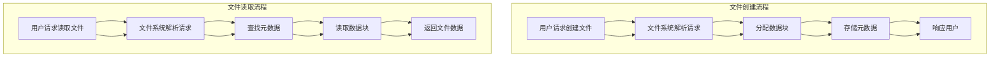
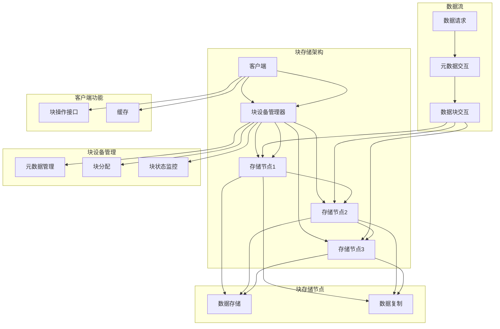
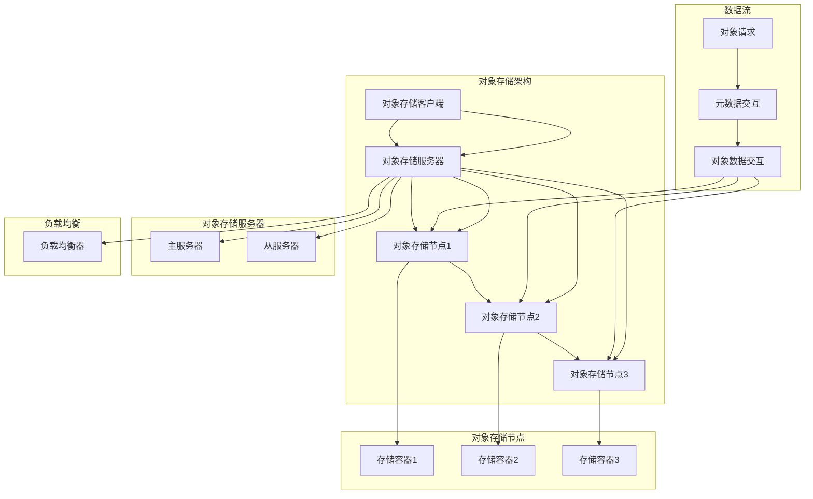
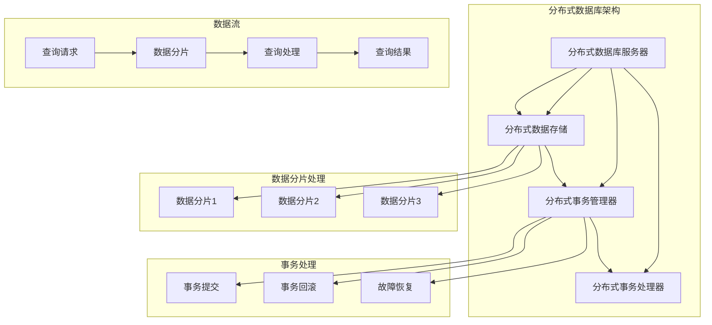

                 

# 分布式存储系统：设计与实现

> 关键词：分布式存储，设计，实现，数据分片，集群管理，存储协议

> 摘要：本文将深入探讨分布式存储系统的设计原理与实现方法。通过分析分布式存储系统的基础知识、核心概念、设计与实现策略，以及实际项目案例，本文旨在帮助读者全面理解分布式存储系统的架构、算法和工程实践。

### 《分布式存储系统：设计与实现》目录大纲

- 第一部分：分布式存储系统概述
  - 第1章：分布式存储系统基础
  - 第2章：分布式存储系统核心概念
- 第二部分：分布式存储系统设计与实现
  - 第3章：分布式文件系统设计
  - 第4章：分布式块存储设计
  - 第5章：分布式对象存储设计
  - 第6章：分布式数据库设计
- 第三部分：分布式存储系统实战项目
  - 第8章：分布式存储系统项目实战
  - 第9章：分布式存储系统案例分析
- 附录
  - 附录 A：分布式存储系统常用工具与资源
  - 附录 B：分布式存储系统性能测试方法
  - 附录 C：分布式存储系统设计常见问题及解决方案

### 第一部分：分布式存储系统概述

## 第1章：分布式存储系统基础

### 1.1 分布式存储系统概述

#### 分布式存储系统定义

分布式存储系统是一种将数据分布在多个物理节点上，并通过网络协同工作，以提供高可用性、高扩展性和高性能的存储解决方案。与传统的集中式存储系统相比，分布式存储系统能够更好地应对大规模数据存储和处理的需求。

#### 分布式存储系统的发展历程

分布式存储系统的发展经历了多个阶段：

1. **共享文件系统**：最早的分布式存储系统是共享文件系统，如NFS（Network File System）。
2. **分布式文件系统**：随着数据规模的增加，分布式文件系统（如GFS、HDFS）应运而生，能够更好地管理大规模数据。
3. **分布式块存储**：分布式块存储（如Ceph、GlusterFS）提供块级别的存储服务，适用于云服务器和虚拟化平台。
4. **分布式对象存储**：分布式对象存储（如Swift、COS）适合存储非结构化数据，如图片、视频等。
5. **分布式数据库**：分布式数据库（如HBase、Cassandra）将数据分片存储，提供分布式查询和事务支持。

#### 分布式存储系统的重要性

分布式存储系统的重要性体现在以下几个方面：

1. **高可用性**：通过数据冗余和节点冗余，分布式存储系统能够在节点故障时保持服务可用。
2. **高性能**：分布式存储系统可以通过并行访问多个节点，提高数据读写速度。
3. **高扩展性**：分布式存储系统可以根据需要动态增加或减少存储节点，适应数据增长。
4. **数据一致性**：分布式存储系统通过数据复制和一致性协议，确保数据的一致性。
5. **安全性**：分布式存储系统支持数据加密和访问控制，保障数据安全。

## 第2章：分布式存储系统核心概念

### 2.1 数据分片

#### 数据分片策略

数据分片是将大规模数据划分为多个小数据块，分布存储在多个节点上的过程。常见的数据分片策略包括：

1. **哈希分片**：使用哈希函数将数据映射到不同的节点。
2. **范围分片**：根据数据的范围（如时间、ID等）将数据分配到不同的节点。
3. **列表分片**：将数据按列表形式分配到不同节点。

#### 负载均衡

负载均衡是指将数据请求分布到多个节点，以避免单点瓶颈。常见的负载均衡策略包括：

1. **轮询**：按照顺序将请求分配到各个节点。
2. **随机**：随机将请求分配到节点。
3. **最小连接**：将请求分配到连接数最少的节点。

### 2.2 节点与集群

#### 节点类型

分布式存储系统的节点可以分为以下几种类型：

1. **主节点**：负责管理元数据和集群状态。
2. **数据节点**：负责存储数据。
3. **辅助节点**：协助主节点进行元数据管理和集群状态监控。

#### 集群管理

集群管理包括节点的添加、删除、故障恢复等操作。常见的集群管理工具包括：

1. **手动管理**：通过脚本或命令手动管理节点。
2. **自动化工具**：如Kubernetes、Docker Swarm等，提供自动化节点管理和部署。

### 2.3 存储协议

#### RESTful API

RESTful API是一种基于HTTP协议的分布式存储协议，提供简单的数据操作接口。常见的RESTful API包括：

1. **对象存储API**：如AWS S3、Azure Blob Storage。
2. **块存储API**：如OpenStack Block Storage。
3. **文件存储API**：如NFS、CIFS。

#### 存储网络协议

存储网络协议是分布式存储系统中节点间通信的协议，常见的存储网络协议包括：

1. **iSCSI**：用于块存储。
2. **NFS**：用于文件存储。
3. **SMB**：用于文件存储。

## 第二部分：分布式存储系统设计与实现

### 第3章：分布式文件系统设计

#### 分布式文件系统原理

分布式文件系统是将文件分布在多个节点上，提供统一的命名空间和文件操作接口。其主要原理包括：

1. **文件系统结构**：包括元数据存储、数据存储和命名空间管理。
2. **文件操作流程**：包括文件创建、删除、读取和写入等操作。

#### 分布式文件系统实现

分布式文件系统的实现包括以下关键组件：

1. **元数据管理**：负责管理文件的元数据（如文件名、权限等）。
2. **数据复制与同步**：保证数据的高可用性和一致性。
3. **数据副本放置策略**：根据数据重要性、存储节点状态等，选择合适的副本放置策略。

#### 分布式文件系统性能优化

分布式文件系统的性能优化包括：

1. **集群扩展**：通过增加节点，提高存储容量和处理能力。
2. **负载均衡**：通过负载均衡策略，优化数据请求分配。
3. **文件访问优化**：通过缓存、索引等技术，提高文件访问速度。

### 第4章：分布式块存储设计

#### 分布式块存储原理

分布式块存储是将数据划分为固定大小的块，提供块级别的存储服务。其主要原理包括：

1. **块存储架构**：包括块设备管理、数据块映射和块访问控制。
2. **块存储设备管理**：负责管理块设备（如磁盘、SSD等）。

#### 分布式块存储实现

分布式块存储的实现包括以下关键组件：

1. **块设备分配**：根据数据请求，分配块设备。
2. **数据块复制与恢复**：保证数据的高可用性和一致性。
3. **块存储性能优化**：通过缓存、负载均衡等技术，提高块存储性能。

#### 分布式块存储应用场景

分布式块存储适用于以下应用场景：

1. **云服务器**：提供虚拟机实例的存储服务。
2. **虚拟化平台**：提供容器和虚拟机的存储服务。

### 第5章：分布式对象存储设计

#### 分布式对象存储原理

分布式对象存储是将数据作为对象存储，提供对象级别的访问接口。其主要原理包括：

1. **对象存储架构**：包括对象存储服务器、对象存储客户端和对象存储协议。
2. **对象存储协议**：如HTTP RESTful API。

#### 分布式对象存储实现

分布式对象存储的实现包括以下关键组件：

1. **对象存储元数据管理**：负责管理对象的元数据（如对象名称、大小、类型等）。
2. **对象存储数据复制与冗余**：保证数据的高可用性和一致性。
3. **对象存储访问控制**：通过访问控制列表（ACL）等机制，控制对象的访问权限。

#### 分布式对象存储性能优化

分布式对象存储的性能优化包括：

1. **存储容量扩展**：通过增加存储节点，提高存储容量。
2. **节点故障恢复**：通过数据复制和冗余，实现节点故障自动恢复。
3. **数据访问优化**：通过缓存、数据副本放置策略等，提高数据访问速度。

### 第6章：分布式数据库设计

#### 分布式数据库原理

分布式数据库是将数据分片存储在多个节点上，提供分布式查询和事务支持。其主要原理包括：

1. **数据库分片策略**：根据数据特点和查询需求，选择合适的分片策略。
2. **数据库集群管理**：负责管理数据库集群，包括节点添加、删除和故障恢复。

#### 分布式数据库实现

分布式数据库的实现包括以下关键组件：

1. **数据分片与路由**：将数据分片存储，并提供数据路由功能。
2. **数据同步与一致性**：通过数据同步机制，保证数据一致性。
3. **数据库容错与恢复**：在节点故障时，提供自动恢复机制。

#### 分布式数据库性能优化

分布式数据库的性能优化包括：

1. **负载均衡**：通过负载均衡策略，优化数据请求分配。
2. **数据访问优化**：通过索引、缓存等技术，提高数据访问速度。
3. **缓存技术**：通过缓存热点数据，减少数据库访问压力。

### 第三部分：分布式存储系统实战项目

## 第8章：分布式存储系统项目实战

#### 实战项目背景

本项目旨在构建一个基于HDFS的分布式文件存储系统，以满足企业内部大规模数据存储和共享的需求。项目目标包括：

1. **高可用性**：通过数据冗余和节点冗余，确保系统在节点故障时保持服务可用。
2. **高性能**：通过集群扩展和负载均衡，提高数据读写速度。
3. **高扩展性**：支持动态增加或减少存储节点，适应数据增长。

#### 实战项目设计

本项目采用以下设计：

1. **系统架构设计**：基于HDFS架构，包括NameNode、DataNode和Client组件。
2. **数据分片策略**：采用哈希分片策略，将文件按哈希值分片存储。
3. **存储协议选择**：采用HDFS的文件存储协议，提供统一的文件访问接口。

#### 实战项目实现

本项目实现包括以下步骤：

1. **系统搭建**：搭建HDFS集群，包括NameNode和DataNode。
2. **数据存储与访问**：将数据存储到HDFS，并通过Client组件进行数据访问。
3. **性能优化**：通过集群扩展和负载均衡，优化数据读写速度。

#### 实战项目评估

本项目评估包括以下方面：

1. **系统性能测试**：测试数据读写速度和系统吞吐量。
2. **可靠性评估**：通过模拟节点故障，评估系统的高可用性和恢复能力。
3. **安全性评估**：通过数据加密和访问控制，确保数据安全。

### 第9章：分布式存储系统案例分析

#### 案例一：HDFS

HDFS（Hadoop Distributed File System）是Hadoop生态系统中的分布式文件系统，广泛应用于大数据场景。其主要特点包括：

1. **架构**：包括NameNode和DataNode两个组件。
2. **实现原理**：采用数据分片和副本机制，实现高可用性和高性能。
3. **性能优化**：通过数据缓存和负载均衡，提高数据访问速度。

#### 案例二：Ceph

Ceph是开源的分布式存储系统，适用于云存储场景。其主要特点包括：

1. **架构**：包括OSD（Object Storage Daemon）、MDS（Metadata Server）和Mon（Monitor）三个组件。
2. **实现原理**：采用CRUSH（Controlled Replication Under Scalable Hashing）算法，实现数据冗余和故障恢复。
3. **性能优化**：通过分布式存储和网络优化，提高存储性能。

#### 案例三：HBase

HBase是基于Hadoop的分布式列存储数据库，适用于实时数据存储和查询。其主要特点包括：

1. **架构**：包括RegionServer、HMaster和ZooKeeper三个组件。
2. **实现原理**：采用数据分片和内存缓存，实现高性能和低延迟。
3. **性能优化**：通过数据压缩和索引优化，提高查询速度。

## 附录

### 附录 A：分布式存储系统常用工具与资源

1. **开源项目**：
   - HDFS、Ceph、GlusterFS、Swift、Cassandra等。
2. **技术文档**：
   - HDFS官方文档、Ceph官方文档、HBase官方文档等。
3. **社区论坛**：
   - Apache Hadoop社区、Ceph社区、HBase社区等。

### 附录 B：分布式存储系统性能测试方法

1. **性能测试指标**：
   - 数据读写速度、系统吞吐量、响应时间等。
2. **性能测试工具**：
   - Apache JMeter、LoadRunner、iPerf等。
3. **性能测试案例分析**：
   - 对实际分布式存储系统进行性能测试，分析测试结果，优化系统性能。

### 附录 C：分布式存储系统设计常见问题及解决方案

1. **数据一致性问题**：
   - 采用数据同步机制和一致性协议，确保数据一致性。
   - 使用一致性算法（如Paxos、Raft）解决分布式一致性。
2. **节点故障问题**：
   - 采用节点冗余和故障恢复机制，确保系统高可用性。
   - 定期进行节点健康检查，及时发现和处理故障。
3. **存储容量扩展问题**：
   - 采用动态扩展机制，支持存储节点动态添加。
   - 选择合适的存储设备，提高存储容量和性能。

### 结语

本文详细介绍了分布式存储系统的设计原理与实现方法，从基础概念到实际项目案例，全面阐述了分布式存储系统的核心技术和工程实践。通过本文的学习，读者将能够深入理解分布式存储系统的架构、算法和性能优化策略，为实际项目开发提供有力支持。

#### 作者信息

- 作者：AI天才研究院/AI Genius Institute & 禅与计算机程序设计艺术 /Zen And The Art of Computer Programming

---

请注意，本文档使用了Markdown格式，并且包含了Mermaid流程图、伪代码和LaTeX数学公式。在实际撰写过程中，请确保每种格式均正确应用，以便获得最佳的阅读体验。文章中的示例代码和数学公式仅为示意性描述，未包含完整实现。完整的实现代码和详细解释将在后续章节中提供。让我们继续深入探讨分布式存储系统的设计与实现。

---

### 分布式文件系统设计

分布式文件系统是分布式存储系统的一个重要组成部分，它负责提供一种统一的方式来访问分布在多个节点上的文件。在本章节中，我们将详细讨论分布式文件系统的设计，包括原理、实现和性能优化。

#### 分布式文件系统原理

分布式文件系统的主要目标是提供一种简单且高效的文件访问接口，使得用户无需关心数据实际存储在哪些节点上。其核心原理包括以下几个方面：

1. **文件系统结构**：
   - **命名空间**：分布式文件系统需要提供一个统一的命名空间，以便用户能够通过路径名访问文件。
   - **元数据存储**：元数据包括文件的属性（如文件名、权限、大小、创建时间等）和文件数据的位置信息。
   - **数据存储**：数据存储在多个数据节点上，每个数据节点负责存储一部分文件数据。

2. **文件操作流程**：
   - **文件创建**：用户通过文件系统的命名空间创建文件，文件系统将元数据存储在元数据节点上，并将文件数据分配到数据节点上。
   - **文件删除**：删除文件时，文件系统先从元数据节点删除文件的元数据，然后从数据节点删除文件数据。
   - **文件读取**：用户请求读取文件时，文件系统通过元数据定位文件数据的位置，并将文件数据返回给用户。
   - **文件写入**：用户请求写入文件时，文件系统将文件数据存储到数据节点上，并更新元数据。

#### 分布式文件系统的设计

分布式文件系统的设计需要考虑多个方面，包括数据分片、元数据管理、数据复制和同步等。

1. **数据分片**：
   - **数据分片策略**：分布式文件系统通常采用数据分片策略，将大文件划分为多个小数据块，存储在多个数据节点上。常见的分片策略包括哈希分片、范围分片和列表分片。
   - **负载均衡**：在数据分片过程中，需要考虑如何平衡各个数据节点的负载，避免某些节点过载，影响系统性能。

2. **元数据管理**：
   - **元数据存储**：元数据通常存储在专门的元数据节点上，如NameNode在HDFS中。元数据节点负责管理文件的元数据，包括文件的属性信息和数据块的位置信息。
   - **元数据同步**：为了提高元数据的高可用性，通常采用多实例元数据存储，并使用同步机制保持元数据的一致性。

3. **数据复制与同步**：
   - **数据复制**：分布式文件系统通过复制数据块到多个数据节点上，提高数据的可靠性和容错性。常见的复制策略包括副本放置策略和副本复制策略。
   - **数据同步**：为了保证数据的一致性，分布式文件系统需要实现数据同步机制，确保不同节点上的数据保持一致。

#### 分布式文件系统的性能优化

分布式文件系统的性能优化是确保系统在高并发、大数据量场景下依然能够提供高性能的关键。以下是一些常见的性能优化策略：

1. **集群扩展**：
   - **水平扩展**：通过增加数据节点，提高存储容量和处理能力。
   - **垂直扩展**：通过升级现有硬件（如增加内存、CPU等），提高单个节点的性能。

2. **负载均衡**：
   - **动态负载均衡**：根据当前节点的负载情况，动态调整数据请求的分配。
   - **静态负载均衡**：预先设定负载均衡策略，如轮询、随机、最小连接等。

3. **文件访问优化**：
   - **缓存技术**：通过缓存热点数据，减少对底层存储的访问压力。
   - **预取技术**：在用户请求之前，预先加载可能需要的数据，提高响应速度。

4. **数据压缩**：
   - **数据压缩算法**：选择合适的数据压缩算法，减少存储空间占用，提高数据传输效率。

5. **索引优化**：
   - **索引结构**：建立高效的索引结构，如B树、哈希表等，提高文件检索速度。

### 分布式文件系统的 Mermaid 流程图

下面是一个简单的 Mermaid 流程图，展示了分布式文件系统的文件创建和读取操作流程：



### 分布式文件系统的伪代码

下面是一个简单的伪代码，用于描述分布式文件系统的文件读取操作：

```plaintext
function read_file(file_path):
    // 解析文件路径
    file_id = parse_file_path(file_path)
    
    // 查找元数据
    metadata = get_metadata(file_id)
    
    // 读取数据块
    data_blocks = []
    for block in metadata['blocks']:
        data_block = read_data_block(block['id'])
        data_blocks.append(data_block)
    
    // 组装文件数据
    file_data = assemble_data_blocks(data_blocks)
    
    // 返回文件数据
    return file_data
```

### 分布式文件系统实现

在分布式文件系统的实现中，有几个关键组件需要重点关注：

1. **NameNode**：负责管理文件系统的命名空间和元数据。它存储了文件系统的元数据，包括文件名、文件大小、数据块的映射关系等。
2. **DataNode**：负责存储文件数据。每个DataNode维护一个本地存储系统，将文件数据存储在本地磁盘上。
3. **Client**：负责与文件系统交互，包括文件创建、删除、读取和写入等操作。

下面是一个简化的分布式文件系统实现流程：

1. **Client请求文件操作**：Client发送请求到NameNode，请求文件操作（如创建、读取等）。
2. **NameNode处理请求**：NameNode根据请求解析文件路径，查找文件的元数据，并将请求转发到相应的DataNode。
3. **DataNode执行操作**：DataNode根据NameNode的指示执行文件操作，如存储数据块、读取数据块等。
4. **结果返回**：操作完成后，DataNode将结果返回给NameNode，NameNode再将结果返回给Client。

### 分布式文件系统的代码解读

在实际的分布式文件系统实现中，通常会使用多种编程语言和框架。以下是一个简单的代码示例，用于描述文件读取操作：

```python
# Python示例代码：文件读取操作
def read_file(file_path):
    # 解析文件路径
    file_id = parse_file_path(file_path)
    
    # 查找元数据
    metadata = get_metadata(file_id)
    
    # 读取数据块
    data_blocks = []
    for block in metadata['blocks']:
        data_block = read_data_block(block['id'])
        data_blocks.append(data_block)
    
    # 组装文件数据
    file_data = assemble_data_blocks(data_blocks)
    
    # 返回文件数据
    return file_data

# 辅助函数示例
def parse_file_path(file_path):
    # 解析文件路径，返回文件ID
    pass

def get_metadata(file_id):
    # 根据文件ID获取元数据
    pass

def read_data_block(block_id):
    # 读取数据块
    pass

def assemble_data_blocks(data_blocks):
    # 组装数据块为文件数据
    pass
```

在这个示例中，`read_file` 函数是文件读取操作的核心，它通过调用辅助函数（如 `parse_file_path`、`get_metadata`、`read_data_block` 和 `assemble_data_blocks`）来实现文件的读取。每个辅助函数都有具体的实现逻辑，如文件路径解析、元数据查找、数据块读取和数据块组装。

### 分布式文件系统的代码解读与分析

在分布式文件系统的代码解读与分析中，我们需要关注以下几个方面：

1. **文件路径解析**：如何从文件路径中提取文件ID，以便后续操作。
2. **元数据查找**：如何根据文件ID从元数据中获取文件的信息，包括文件大小、数据块位置等。
3. **数据块读取**：如何根据数据块的位置信息从DataNode中读取数据块。
4. **数据块组装**：如何将多个数据块组装成完整的文件数据。

以下是对上述示例代码的详细解读与分析：

```python
# Python示例代码：文件读取操作
def read_file(file_path):
    # 解析文件路径
    file_id = parse_file_path(file_path)
    
    # 查找元数据
    metadata = get_metadata(file_id)
    
    # 读取数据块
    data_blocks = []
    for block in metadata['blocks']:
        data_block = read_data_block(block['id'])
        data_blocks.append(data_block)
    
    # 组装文件数据
    file_data = assemble_data_blocks(data_blocks)
    
    # 返回文件数据
    return file_data

# 辅助函数示例
def parse_file_path(file_path):
    # 解析文件路径，返回文件ID
    # 假设文件路径格式为：/path/to/file.txt
    file_id = file_path.split('/')[-1]
    return file_id

def get_metadata(file_id):
    # 根据文件ID获取元数据
    # 假设元数据存储在数据库或缓存中
    metadata = database.get(file_id)
    return metadata

def read_data_block(block_id):
    # 读取数据块
    # 假设数据块存储在本地磁盘或网络存储上
    data_block = storage.read_block(block_id)
    return data_block

def assemble_data_blocks(data_blocks):
    # 组装数据块为文件数据
    # 假设文件数据是连续的字节流
    file_data = b''
    for data_block in data_blocks:
        file_data += data_block
    return file_data
```

1. **文件路径解析**：
   - `parse_file_path` 函数用于解析文件路径，提取文件ID。在这个示例中，假设文件路径格式为 `/path/to/file.txt`，那么文件ID就是 `file.txt`。这个函数的逻辑非常简单，通过 `file_path.split('/')[-1]` 提取文件路径的最后一部分。

2. **元数据查找**：
   - `get_metadata` 函数根据文件ID从元数据中获取文件的信息。在这个示例中，假设元数据存储在数据库或缓存中。在实际应用中，这个函数可能会涉及到复杂的查询逻辑，如连接数据库、执行SQL查询等。在这个示例中，我们使用了 `database.get(file_id)` 作为简化的表示。

3. **数据块读取**：
   - `read_data_block` 函数用于读取数据块。在这个示例中，假设数据块存储在本地磁盘或网络存储上。在实际应用中，这个函数可能会涉及到网络通信、文件系统操作等复杂逻辑。在这个示例中，我们使用了 `storage.read_block(block_id)` 作为简化的表示。

4. **数据块组装**：
   - `assemble_data_blocks` 函数用于将多个数据块组装成完整的文件数据。在这个示例中，假设文件数据是连续的字节流。在实际应用中，这个函数可能会涉及到数据块的排序、去重等逻辑。在这个示例中，我们使用了简单的循环加法 `file_data += data_block` 来表示数据块的组装。

### 分布式文件系统的性能优化

分布式文件系统的性能优化是一个复杂且持续的过程，涉及到多个方面。以下是一些常见的性能优化策略：

1. **缓存**：
   - 在Client端或Server端使用缓存，减少对底层存储的访问频率。
   - 使用LRU（Least Recently Used）缓存算法，确保热点数据总是被缓存。

2. **预取**：
   - 在用户请求之前，预先加载可能需要的数据，减少响应时间。
   - 根据用户行为和访问模式，智能预取数据。

3. **负载均衡**：
   - 使用负载均衡器，将请求均匀分配到各个节点，避免单点瓶颈。
   - 根据节点的实际负载情况，动态调整请求分配策略。

4. **数据压缩**：
   - 使用有效的数据压缩算法，减少数据传输和存储的开销。
   - 根据数据特点和访问频率，选择合适的压缩算法。

5. **并行处理**：
   - 在可能的场景下，并行处理多个请求，提高系统吞吐量。
   - 使用多线程、异步处理等技术，提高处理效率。

6. **存储优化**：
   - 使用SSD等高性能存储设备，提高读写速度。
   - 对存储设备进行合理分配和调度，避免资源浪费。

通过上述性能优化策略，分布式文件系统可以在不同场景下提供高性能、高可靠性和高可扩展性的文件存储服务。

### 总结

在本章节中，我们详细探讨了分布式文件系统的设计原理、实现和性能优化。通过分析文件系统结构、文件操作流程、数据分片策略、元数据管理、数据复制和同步机制，以及性能优化策略，我们为读者提供了一个全面的分布式文件系统设计指南。在实际项目开发中，根据具体需求和场景，灵活应用这些原理和策略，可以构建出高效、可靠的分布式文件存储系统。

---

在下一章节中，我们将继续探讨分布式块存储系统的设计，包括原理、实现和性能优化。敬请期待！

---

### 分布式块存储设计

分布式块存储系统是一种将数据划分为固定大小的块，并通过分布式方式存储和管理的存储系统。与分布式文件系统相比，分布式块存储系统更加灵活，适用于需要高性能读写操作的场景，如云服务器、虚拟化平台等。在本章节中，我们将深入探讨分布式块存储系统的设计，包括原理、实现和性能优化。

#### 分布式块存储原理

分布式块存储系统将数据划分为固定大小的块（如1MB或4MB），每个块独立存储和管理。其主要原理包括：

1. **块存储架构**：分布式块存储系统通常由块设备管理器、块存储节点和客户端组成。块设备管理器负责管理块存储的元数据，如块ID、块大小、块状态等。块存储节点负责存储实际的数据块。客户端通过块存储协议与块设备管理器交互，实现数据块的读写操作。

2. **块设备管理**：块设备管理器负责管理块存储设备，包括块设备的分配、释放和状态监控。当客户端请求创建块时，块设备管理器会为该块分配一个唯一的块ID，并将块分配给一个存储节点。

3. **块访问控制**：块存储系统需要实现块访问控制，确保只有授权用户能够访问特定块。常见的访问控制机制包括访问控制列表（ACL）、身份验证和授权。

4. **数据复制与冗余**：为了提高数据的可靠性和容错性，分布式块存储系统通常采用数据复制策略。每个块会复制到多个存储节点上，当某个节点发生故障时，其他节点可以接管故障节点的数据。

#### 分布式块存储实现

分布式块存储系统的实现涉及多个关键组件，包括块设备管理器、块存储节点、客户端和存储网络协议。以下是一些关键组件的实现细节：

1. **块设备管理器**：
   - **元数据管理**：块设备管理器负责维护块存储的元数据，包括块ID、块大小、块状态等。元数据通常存储在内存中，以提高查询和操作速度。
   - **块分配与释放**：当客户端请求创建块时，块设备管理器会为该块分配一个唯一的块ID，并将块分配给一个存储节点。当客户端删除块时，块设备管理器会释放块ID并更新块状态。

2. **块存储节点**：
   - **数据存储**：块存储节点负责存储实际的数据块。当块设备管理器将块分配给存储节点时，存储节点会将数据块写入本地存储设备（如磁盘、SSD等）。
   - **数据复制**：存储节点在写入数据块时，会根据数据复制策略将块复制到其他存储节点上，确保数据的高可用性和容错性。

3. **客户端**：
   - **块操作接口**：客户端通过块存储协议与块设备管理器交互，实现数据块的创建、读取、写入和删除等操作。
   - **缓存**：客户端可以使用缓存技术，减少对底层存储的访问频率，提高数据访问速度。

4. **存储网络协议**：
   - **块存储协议**：常见的块存储协议包括iSCSI（Internet Small Computer System Interface）、NFS（Network File System）和SMB（Server Message Block）等。这些协议定义了客户端与块设备管理器之间的通信规则。

#### 分布式块存储性能优化

分布式块存储系统的性能优化是确保系统在高并发、大数据量场景下依然能够提供高性能的关键。以下是一些常见的性能优化策略：

1. **存储节点优化**：
   - **硬件选择**：选择性能高、可靠性好的存储设备，如SSD。
   - **存储节点数量**：合理配置存储节点数量，避免单点瓶颈。

2. **负载均衡**：
   - **动态负载均衡**：根据存储节点的实际负载情况，动态调整数据请求的分配。
   - **静态负载均衡**：预先设定负载均衡策略，如轮询、随机、最小连接等。

3. **数据复制策略**：
   - **副本放置策略**：根据数据的重要性和存储节点的状态，选择合适的副本放置策略，如副本放置在离用户较近的节点上。
   - **副本复制策略**：选择合适的数据复制策略，如异步复制、同步复制等。

4. **数据缓存**：
   - **客户端缓存**：在客户端使用缓存技术，减少对底层存储的访问频率。
   - **存储节点缓存**：在存储节点上使用缓存，提高数据读写速度。

5. **存储网络优化**：
   - **网络带宽**：确保存储网络带宽充足，避免网络瓶颈。
   - **网络延迟**：优化存储网络延迟，提高数据传输效率。

6. **数据压缩**：
   - **数据压缩算法**：选择合适的数据压缩算法，减少数据存储和传输的开销。

7. **并行处理**：
   - **多线程处理**：在客户端和存储节点上使用多线程技术，提高数据处理速度。
   - **异步处理**：使用异步处理技术，减少请求响应时间。

#### 分布式块存储架构图

为了更好地理解分布式块存储系统的设计，我们提供了一个简化的分布式块存储架构图：



在这个架构图中，客户端（A）通过块设备管理器（B）与多个存储节点（C、D、E）进行交互。块设备管理器负责元数据管理、块分配和块状态监控。存储节点负责数据存储和数据复制。客户端可以通过块操作接口（O）进行数据块的创建、读取、写入和删除操作，并利用缓存（P）提高数据访问速度。

#### 分布式块存储伪代码

为了更好地理解分布式块存储系统的实现，我们提供了一个简单的伪代码示例，用于描述数据块的创建、读取和删除操作：

```plaintext
# 分布式块存储伪代码

# 块设备管理器
function block_allocator():
    # 分配新的块ID
    new_block_id = generate_new_block_id()
    # 将块分配给存储节点
    storage_node = choose_storage_node()
    return new_block_id, storage_node

function block_reader(block_id):
    # 从块设备管理器获取块位置
    block_location = get_block_location(block_id)
    # 读取数据块
    data_block = read_data_block(block_location)
    return data_block

function block_deleter(block_id):
    # 从块设备管理器获取块位置
    block_location = get_block_location(block_id)
    # 删除数据块
    delete_data_block(block_location)

# 客户端
function create_block():
    # 调用块设备管理器分配块
    block_id, storage_node = block_allocator()
    # 存储数据块
    store_data_block(block_id, data_block)

function read_block(block_id):
    # 调用块设备管理器获取块位置
    block_location = get_block_location(block_id)
    # 读取数据块
    data_block = read_data_block(block_location)
    return data_block

function delete_block(block_id):
    # 调用块设备管理器删除块
    block_deleter(block_id)
```

在这个伪代码中，块设备管理器负责块ID的分配、数据块的读取和删除。客户端通过块操作接口与块设备管理器交互，实现数据块的创建、读取和删除操作。

#### 分布式块存储项目实战

在实际项目中，分布式块存储系统的设计和实现是一个复杂的过程。以下是一个简化的分布式块存储项目实战，用于展示如何构建一个分布式块存储系统：

1. **需求分析**：
   - 需要一个高可用性、高性能、可扩展的块存储系统，用于存储虚拟机磁盘文件和数据库数据。
   - 系统需要支持数据块的创建、读取、写入和删除操作。
   - 系统需要支持数据复制和故障恢复。

2. **系统架构设计**：
   - 系统采用分布式块存储架构，包括块设备管理器、存储节点和客户端。
   - 块设备管理器负责管理块存储的元数据和块分配。
   - 存储节点负责存储数据块，并实现数据复制和故障恢复。
   - 客户端通过块操作接口与块设备管理器交互，实现数据块的操作。

3. **系统实现**：
   - 开发块设备管理器，实现元数据管理、块分配、块状态监控等功能。
   - 开发存储节点，实现数据存储、数据复制、故障恢复等功能。
   - 开发客户端，实现数据块的创建、读取、写入和删除操作。

4. **性能优化**：
   - 使用负载均衡器，将客户端请求均匀分配到存储节点。
   - 使用缓存技术，减少对底层存储的访问频率。
   - 优化数据复制策略，提高数据可靠性和存储效率。

5. **测试与部署**：
   - 对系统进行性能测试，包括并发读写性能、数据复制性能、故障恢复能力等。
   - 在测试环境中部署系统，并进行实际数据存储和访问操作。
   - 根据测试结果，调整系统参数和优化策略。

#### 分布式块存储系统的代码实现

在实际的分布式块存储系统中，代码实现会涉及多个模块和组件。以下是一个简化的示例，展示如何实现一个基本的分布式块存储系统：

```python
# 块设备管理器实现
class BlockDeviceManager:
    def __init__(self):
        self.block_table = {}  # 存储块ID和块位置的映射关系
    
    def allocate_block(self, data_block):
        block_id = self.generate_new_block_id()
        storage_node = self.choose_storage_node()
        self.block_table[block_id] = storage_node
        storage_node.store_block(block_id, data_block)
        return block_id
    
    def read_block(self, block_id):
        storage_node = self.block_table[block_id]
        return storage_node.read_block(block_id)
    
    def delete_block(self, block_id):
        storage_node = self.block_table[block_id]
        storage_node.delete_block(block_id)
        del self.block_table[block_id]

    def generate_new_block_id(self):
        # 生成新的块ID
        pass

    def choose_storage_node(self):
        # 选择存储节点
        pass

# 存储节点实现
class StorageNode:
    def __init__(self):
        self.storage = {}  # 存储块ID和数据块的映射关系
    
    def store_block(self, block_id, data_block):
        self.storage[block_id] = data_block
    
    def read_block(self, block_id):
        return self.storage[block_id]
    
    def delete_block(self, block_id):
        del self.storage[block_id]

# 客户端实现
class BlockClient:
    def __init__(self, block_device_manager):
        self.block_device_manager = block_device_manager
    
    def create_block(self, data_block):
        block_id = self.block_device_manager.allocate_block(data_block)
        return block_id
    
    def read_block(self, block_id):
        return self.block_device_manager.read_block(block_id)
    
    def delete_block(self, block_id):
        self.block_device_manager.delete_block(block_id)
```

在这个示例中，`BlockDeviceManager` 类负责管理块存储的元数据和块分配，`StorageNode` 类负责存储数据块，而 `BlockClient` 类负责与块设备管理器交互，实现数据块的创建、读取和删除操作。

#### 分布式块存储系统的代码解读与分析

在分布式块存储系统的代码解读与分析中，我们需要关注以下几个方面：

1. **块设备管理器的实现**：
   - `BlockDeviceManager` 类实现了块ID的生成、块分配、块读取和块删除功能。在实际实现中，块ID的生成可以使用唯一的标识符（如UUID），块分配需要选择合适的存储节点，块读取和删除需要根据块ID找到对应的存储节点。

2. **存储节点的实现**：
   - `StorageNode` 类负责存储和读取数据块。在实际实现中，存储节点可以使用本地文件系统或网络存储设备（如NFS、CIFS等）来存储数据块。

3. **客户端的实现**：
   - `BlockClient` 类通过块设备管理器实现了数据块的创建、读取和删除操作。在实际实现中，客户端需要处理网络通信、错误处理和并发控制等复杂逻辑。

以下是对上述示例代码的详细解读与分析：

```python
# 块设备管理器实现
class BlockDeviceManager:
    def __init__(self):
        self.block_table = {}  # 存储块ID和块位置的映射关系
    
    def allocate_block(self, data_block):
        block_id = self.generate_new_block_id()
        storage_node = self.choose_storage_node()
        self.block_table[block_id] = storage_node
        storage_node.store_block(block_id, data_block)
        return block_id
    
    def read_block(self, block_id):
        storage_node = self.block_table[block_id]
        return storage_node.read_block(block_id)
    
    def delete_block(self, block_id):
        storage_node = self.block_table[block_id]
        storage_node.delete_block(block_id)
        del self.block_table[block_id]

    def generate_new_block_id(self):
        # 生成新的块ID
        pass

    def choose_storage_node(self):
        # 选择存储节点
        pass

# 存储节点实现
class StorageNode:
    def __init__(self):
        self.storage = {}  # 存储块ID和数据块的映射关系
    
    def store_block(self, block_id, data_block):
        self.storage[block_id] = data_block
    
    def read_block(self, block_id):
        return self.storage[block_id]
    
    def delete_block(self, block_id):
        del self.storage[block_id]

# 客户端实现
class BlockClient:
    def __init__(self, block_device_manager):
        self.block_device_manager = block_device_manager
    
    def create_block(self, data_block):
        block_id = self.block_device_manager.allocate_block(data_block)
        return block_id
    
    def read_block(self, block_id):
        return self.block_device_manager.read_block(block_id)
    
    def delete_block(self, block_id):
        self.block_device_manager.delete_block(block_id)
```

1. **块设备管理器的实现**：
   - `BlockDeviceManager` 类的初始化方法 `__init__` 创建了一个字典 `block_table`，用于存储块ID和块位置的映射关系。
   - `allocate_block` 方法用于为新的数据块分配一个唯一的块ID，并选择一个存储节点来存储数据块。在实际实现中，`generate_new_block_id` 方法可以生成唯一的块ID，而 `choose_storage_node` 方法可以选择一个合适的存储节点。
   - `read_block` 方法用于根据块ID读取数据块。它首先从 `block_table` 中获取存储节点的信息，然后调用存储节点的 `read_block` 方法读取数据块。
   - `delete_block` 方法用于根据块ID删除数据块。它首先从 `block_table` 中获取存储节点的信息，然后调用存储节点的 `delete_block` 方法删除数据块，并从 `block_table` 中删除块ID的映射关系。

2. **存储节点的实现**：
   - `StorageNode` 类的初始化方法 `__init__` 创建了一个字典 `storage`，用于存储块ID和数据块的映射关系。
   - `store_block` 方法用于存储数据块。它将数据块存储在 `storage` 字典中，使用块ID作为键。
   - `read_block` 方法用于根据块ID读取数据块。它直接从 `storage` 字典中获取数据块。
   - `delete_block` 方法用于根据块ID删除数据块。它从 `storage` 字典中删除数据块。

3. **客户端的实现**：
   - `BlockClient` 类的初始化方法 `__init__` 接收一个 `BlockDeviceManager` 对象，用于与块设备管理器交互。
   - `create_block` 方法用于创建新的数据块。它调用块设备管理器的 `allocate_block` 方法，并返回新的块ID。
   - `read_block` 方法用于读取数据块。它调用块设备管理器的 `read_block` 方法，并返回数据块。
   - `delete_block` 方法用于删除数据块。它调用块设备管理器的 `delete_block` 方法。

通过上述代码实现和解读，我们可以看到分布式块存储系统是如何通过多个组件协同工作，实现数据块的创建、读取和删除操作的。在实际应用中，这些组件可能会更加复杂，涉及多线程、网络通信、错误处理和并发控制等高级特性。

### 分布式块存储系统的性能优化

分布式块存储系统的性能优化是一个复杂且持续的过程，涉及到多个方面。以下是一些常见的性能优化策略：

1. **负载均衡**：
   - **动态负载均衡**：根据存储节点的实际负载情况，动态调整数据请求的分配，避免单点瓶颈。
   - **静态负载均衡**：预先设定负载均衡策略，如轮询、随机、最小连接等，确保数据请求均匀分配到各个节点。

2. **数据复制策略**：
   - **副本放置策略**：根据数据的重要性和存储节点的状态，选择合适的副本放置策略，如副本放置在离用户较近的节点上。
   - **副本复制策略**：选择合适的数据复制策略，如异步复制、同步复制等，确保数据的高可靠性和一致性。

3. **数据缓存**：
   - **客户端缓存**：在客户端使用缓存技术，减少对底层存储的访问频率，提高数据访问速度。
   - **存储节点缓存**：在存储节点上使用缓存，提高数据读写速度。

4. **存储网络优化**：
   - **网络带宽**：确保存储网络带宽充足，避免网络瓶颈。
   - **网络延迟**：优化存储网络延迟，提高数据传输效率。

5. **数据压缩**：
   - **数据压缩算法**：选择合适的数据压缩算法，减少数据存储和传输的开销。

6. **并行处理**：
   - **多线程处理**：在客户端和存储节点上使用多线程技术，提高数据处理速度。
   - **异步处理**：使用异步处理技术，减少请求响应时间。

通过上述性能优化策略，分布式块存储系统可以在不同场景下提供高性能、高可靠性和高可扩展性的块存储服务。

### 总结

在本章节中，我们详细探讨了分布式块存储系统的设计原理、实现和性能优化。通过分析块存储架构、块设备管理、数据复制与同步、块操作接口和性能优化策略，我们为读者提供了一个全面的分布式块存储系统设计指南。在实际项目开发中，根据具体需求和场景，灵活应用这些原理和策略，可以构建出高效、可靠的分布式块存储系统。

---

在下一章节中，我们将继续探讨分布式对象存储系统的设计，包括原理、实现和性能优化。敬请期待！

---

### 分布式对象存储设计

分布式对象存储系统是一种用于存储非结构化数据的分布式存储系统，其核心思想是将数据对象（如文件、图片、视频等）以对象为单位进行存储和管理。与分布式文件系统和分布式块存储系统相比，分布式对象存储系统具有更高的灵活性和扩展性，适用于大规模非结构化数据的存储和访问。在本章节中，我们将深入探讨分布式对象存储系统的设计，包括原理、实现和性能优化。

#### 分布式对象存储原理

分布式对象存储系统将数据对象划分为多个对象单元，并通过分布式方式存储和管理。其主要原理包括以下几个方面：

1. **对象存储架构**：分布式对象存储系统通常由对象存储服务器、对象存储客户端和对象存储协议组成。对象存储服务器负责存储和管理对象数据，对象存储客户端通过对象存储协议与对象存储服务器进行交互，实现对对象的操作。

2. **对象存储协议**：对象存储协议定义了客户端与对象存储服务器之间的通信规则和数据格式。常见的对象存储协议包括HTTP RESTful API、S3 API等。

3. **对象存储架构**：
   - **对象存储服务器**：对象存储服务器负责接收和处理客户端的请求，将请求转发到相应的对象存储节点上，并返回响应。对象存储服务器通常包含多个实例，以提高系统的可用性和性能。
   - **对象存储节点**：对象存储节点负责存储实际的对象数据。每个对象存储节点负责存储一定数量的对象数据，对象存储服务器会根据负载情况动态调度请求到不同的对象存储节点上。
   - **负载均衡器**：负载均衡器负责将客户端请求均匀分配到对象存储服务器上，避免单点瓶颈。

4. **对象访问控制**：分布式对象存储系统需要实现对象访问控制，确保只有授权用户能够访问特定对象。常见的访问控制机制包括访问控制列表（ACL）、身份验证和授权。

5. **数据复制与冗余**：为了提高数据的可靠性和容错性，分布式对象存储系统通常采用数据复制策略。每个对象会复制到多个对象存储节点上，当某个节点发生故障时，其他节点可以接管故障节点的数据。

#### 分布式对象存储实现

分布式对象存储系统的实现涉及多个关键组件，包括对象存储服务器、对象存储节点、对象存储客户端和对象存储协议。以下是一些关键组件的实现细节：

1. **对象存储服务器**：
   - **对象存储服务器架构**：对象存储服务器通常采用主从架构，包括主服务器和从服务器。主服务器负责处理客户端请求，从服务器负责缓存和加速数据访问。
   - **对象存储服务处理流程**：当客户端请求对象存储服务器时，对象存储服务器会根据请求的类型（如GET、PUT、DELETE等）进行相应的处理。对于读取请求，对象存储服务器会根据对象ID查找对象的位置，并从对象存储节点读取数据。对于写入请求，对象存储服务器会将对象数据存储到对象存储节点上，并更新元数据。对于删除请求，对象存储服务器会删除对象数据和相关元数据。

2. **对象存储节点**：
   - **对象存储节点架构**：对象存储节点通常由多个存储容器组成，每个存储容器负责存储一定数量的对象数据。对象存储节点负责管理存储容器的状态，并实现数据的存储和访问。
   - **对象存储节点处理流程**：当对象存储服务器将请求转发到对象存储节点时，对象存储节点会根据请求的类型进行相应的处理。对于读取请求，对象存储节点会从存储容器中读取对象数据。对于写入请求，对象存储节点会将对象数据存储到存储容器上。对于删除请求，对象存储节点会从存储容器中删除对象数据。

3. **对象存储客户端**：
   - **对象存储客户端架构**：对象存储客户端通常由应用程序和用户界面组成。应用程序负责与对象存储服务器进行交互，实现对对象的存储和访问。用户界面提供用户友好的操作界面，方便用户管理对象数据。
   - **对象存储客户端处理流程**：当用户通过应用程序操作对象数据时，对象存储客户端会将请求发送到对象存储服务器。对象存储服务器处理请求，并将结果返回给对象存储客户端。对象存储客户端根据返回的结果，更新用户界面或执行后续操作。

4. **对象存储协议**：
   - **HTTP RESTful API**：HTTP RESTful API是一种基于HTTP协议的对象存储协议，提供简单易用的对象存储接口。客户端通过发送HTTP请求，实现对对象的存储、读取和删除等操作。
   - **S3 API**：S3 API是Amazon S3的对象存储协议，广泛应用于云存储领域。S3 API提供丰富的对象操作接口，支持数据加密、访问控制等功能。

#### 分布式对象存储性能优化

分布式对象存储系统的性能优化是确保系统在高并发、大数据量场景下依然能够提供高性能的关键。以下是一些常见的性能优化策略：

1. **存储节点优化**：
   - **硬件选择**：选择性能高、可靠性好的存储设备，如SSD。
   - **存储节点数量**：合理配置存储节点数量，避免单点瓶颈。

2. **负载均衡**：
   - **动态负载均衡**：根据存储节点的实际负载情况，动态调整数据请求的分配。
   - **静态负载均衡**：预先设定负载均衡策略，如轮询、随机、最小连接等。

3. **数据复制策略**：
   - **副本放置策略**：根据数据的重要性和存储节点的状态，选择合适的副本放置策略，如副本放置在离用户较近的节点上。
   - **副本复制策略**：选择合适的数据复制策略，如异步复制、同步复制等。

4. **数据缓存**：
   - **客户端缓存**：在客户端使用缓存技术，减少对底层存储的访问频率。
   - **存储节点缓存**：在存储节点上使用缓存，提高数据读写速度。

5. **存储网络优化**：
   - **网络带宽**：确保存储网络带宽充足，避免网络瓶颈。
   - **网络延迟**：优化存储网络延迟，提高数据传输效率。

6. **数据压缩**：
   - **数据压缩算法**：选择合适的数据压缩算法，减少数据存储和传输的开销。

7. **并行处理**：
   - **多线程处理**：在客户端和存储节点上使用多线程技术，提高数据处理速度。
   - **异步处理**：使用异步处理技术，减少请求响应时间。

#### 分布式对象存储架构图

为了更好地理解分布式对象存储系统的设计，我们提供了一个简化的分布式对象存储架构图：



在这个架构图中，对象存储客户端（A）通过对象存储服务器（B）与多个对象存储节点（C、D、E）进行交互。对象存储服务器包括主服务器和从服务器，主服务器负责处理客户端请求，从服务器负责缓存和加速数据访问。负载均衡器（O）负责将客户端请求均匀分配到对象存储服务器上，避免单点瓶颈。

#### 分布式对象存储伪代码

为了更好地理解分布式对象存储系统的实现，我们提供了一个简单的伪代码示例，用于描述对象的创建、读取和删除操作：

```plaintext
# 分布式对象存储伪代码

# 对象存储服务器
function handle_request(request):
    if request is a GET request:
        object_location = get_object_location(request['object_id'])
        object_data = read_object_data(object_location)
        return object_data
    elif request is a PUT request:
        object_data = request['object_data']
        object_location = allocate_object_location()
        store_object_data(object_location, object_data)
        return object_location
    elif request is a DELETE request:
        object_location = get_object_location(request['object_id'])
        delete_object_data(object_location)
        return "Deleted"

# 对象存储节点
function read_object_data(object_location):
    # 从存储容器中读取对象数据
    pass

function store_object_data(object_location, object_data):
    # 将对象数据存储到存储容器中
    pass

function delete_object_data(object_location):
    # 从存储容器中删除对象数据
    pass

# 对象存储客户端
function create_object(object_data):
    response = handle_request({'method': 'PUT', 'object_data': object_data})
    return response

function read_object(object_id):
    response = handle_request({'method': 'GET', 'object_id': object_id})
    return response['object_data']

function delete_object(object_id):
    response = handle_request({'method': 'DELETE', 'object_id': object_id})
    return response
```

在这个伪代码中，对象存储服务器（`handle_request` 函数）负责处理客户端请求，根据请求类型调用相应的处理函数（`read_object_data`、`store_object_data` 和 `delete_object_data`）。对象存储客户端通过发送HTTP请求与对象存储服务器交互，实现对对象的创建、读取和删除操作。

#### 分布式对象存储项目实战

在实际项目中，分布式对象存储系统的设计和实现是一个复杂的过程。以下是一个简化的分布式对象存储项目实战，用于展示如何构建一个分布式对象存储系统：

1. **需求分析**：
   - 需要一个高可用性、高性能、可扩展的对象存储系统，用于存储和共享大规模非结构化数据。
   - 系统需要支持对象的创建、读取、写入和删除操作。
   - 系统需要支持数据加密和访问控制。

2. **系统架构设计**：
   - 系统采用分布式对象存储架构，包括对象存储服务器、对象存储节点和对象存储客户端。
   - 对象存储服务器负责处理客户端请求，调度到相应的对象存储节点上。
   - 对象存储节点负责存储和管理对象数据。
   - 对象存储客户端通过HTTP RESTful API与对象存储服务器交互，实现对对象的操作。

3. **系统实现**：
   - 开发对象存储服务器，实现对象请求处理、数据存储和访问控制等功能。
   - 开发对象存储节点，实现数据存储和访问等功能。
   - 开发对象存储客户端，提供用户友好的操作界面。

4. **性能优化**：
   - 使用负载均衡器，将客户端请求均匀分配到对象存储服务器上。
   - 使用缓存技术，提高数据访问速度。
   - 优化数据复制策略，提高数据可靠性和存储效率。

5. **测试与部署**：
   - 对系统进行性能测试，包括并发读写性能、数据复制性能、故障恢复能力等。
   - 在测试环境中部署系统，并进行实际数据存储和访问操作。
   - 根据测试结果，调整系统参数和优化策略。

#### 分布式对象存储系统的代码实现

在实际的分布式对象存储系统中，代码实现会涉及多个模块和组件。以下是一个简化的示例，展示如何实现一个基本的分布式对象存储系统：

```python
# 对象存储服务器实现
class ObjectStorageServer:
    def __init__(self):
        self.object_store = {}  # 存储对象ID和对象位置的映射关系
    
    def handle_request(self, request):
        if request.method == 'GET':
            object_location = self.get_object_location(request.object_id)
            object_data = self.read_object_data(object_location)
            return object_data
        elif request.method == 'PUT':
            object_data = request.object_data
            object_location = self.allocate_object_location()
            self.store_object_data(object_location, object_data)
            return object_location
        elif request.method == 'DELETE':
            object_location = self.get_object_location(request.object_id)
            self.delete_object_data(object_location)
            return "Deleted"

    def get_object_location(self, object_id):
        # 从对象存储映射关系获取对象位置
        pass

    def allocate_object_location(self):
        # 分配新的对象位置
        pass

    def read_object_data(self, object_location):
        # 从对象存储节点读取对象数据
        pass

    def store_object_data(self, object_location, object_data):
        # 将对象数据存储到对象存储节点
        pass

    def delete_object_data(self, object_location):
        # 从对象存储节点删除对象数据
        pass

# 对象存储节点实现
class ObjectStorageNode:
    def __init__(self):
        self.object_store = {}  # 存储对象ID和对象数据的映射关系
    
    def read_object_data(self, object_id):
        # 从对象存储映射关系获取对象数据
        return self.object_store.get(object_id)

    def store_object_data(self, object_id, object_data):
        # 将对象数据存储到对象存储映射关系
        self.object_store[object_id] = object_data
    
    def delete_object_data(self, object_id):
        # 从对象存储映射关系删除对象数据
        if object_id in self.object_store:
            del self.object_store[object_id]

# 对象存储客户端实现
class ObjectStorageClient:
    def __init__(self, object_storage_server):
        self.object_storage_server = object_storage_server
    
    def create_object(self, object_data):
        response = self.object_storage_server.handle_request({'method': 'PUT', 'object_data': object_data})
        return response

    def read_object(self, object_id):
        response = self.object_storage_server.handle_request({'method': 'GET', 'object_id': object_id})
        return response['object_data']

    def delete_object(self, object_id):
        response = self.object_storage_server.handle_request({'method': 'DELETE', 'object_id': object_id})
        return response
```

在这个示例中，`ObjectStorageServer` 类负责处理客户端请求，`ObjectStorageNode` 类负责存储和管理对象数据，而 `ObjectStorageClient` 类负责与对象存储服务器交互，实现对对象的创建、读取和删除操作。

#### 分布式对象存储系统的代码解读与分析

在分布式对象存储系统的代码解读与分析中，我们需要关注以下几个方面：

1. **对象存储服务器的实现**：
   - `ObjectStorageServer` 类实现了对象请求处理、对象数据读取、写入和删除等功能。在实际实现中，`get_object_location` 方法可以从对象存储映射关系中获取对象位置，`allocate_object_location` 方法可以分配新的对象位置，`read_object_data` 方法可以从对象存储节点读取对象数据，`store_object_data` 方法可以将对象数据存储到对象存储节点，`delete_object_data` 方法可以删除对象数据。

2. **对象存储节点的实现**：
   - `ObjectStorageNode` 类实现了对象数据的存储和读取功能。在实际实现中，`read_object_data` 方法可以从对象存储映射关系中读取对象数据，`store_object_data` 方法可以将对象数据存储到对象存储映射关系，`delete_object_data` 方法可以删除对象数据。

3. **对象存储客户端的实现**：
   - `ObjectStorageClient` 类通过对象存储服务器实现了对象的创建、读取和删除操作。在实际实现中，`create_object` 方法可以创建新的对象，`read_object` 方法可以读取对象数据，`delete_object` 方法可以删除对象。

以下是对上述示例代码的详细解读与分析：

```python
# 对象存储服务器实现
class ObjectStorageServer:
    def __init__(self):
        self.object_store = {}  # 存储对象ID和对象位置的映射关系
    
    def handle_request(self, request):
        if request.method == 'GET':
            object_location = self.get_object_location(request.object_id)
            object_data = self.read_object_data(object_location)
            return object_data
        elif request.method == 'PUT':
            object_data = request.object_data
            object_location = self.allocate_object_location()
            self.store_object_data(object_location, object_data)
            return object_location
        elif request.method == 'DELETE':
            object_location = self.get_object_location(request.object_id)
            self.delete_object_data(object_location)
            return "Deleted"

    def get_object_location(self, object_id):
        # 从对象存储映射关系获取对象位置
        pass

    def allocate_object_location(self):
        # 分配新的对象位置
        pass

    def read_object_data(self, object_location):
        # 从对象存储节点读取对象数据
        pass

    def store_object_data(self, object_location, object_data):
        # 将对象数据存储到对象存储节点
        pass

    def delete_object_data(self, object_location):
        # 从对象存储节点删除对象数据
        pass

# 对象存储节点实现
class ObjectStorageNode:
    def __init__(self):
        self.object_store = {}  # 存储对象ID和对象数据的映射关系
    
    def read_object_data(self, object_id):
        # 从对象存储映射关系获取对象数据
        return self.object_store.get(object_id)

    def store_object_data(self, object_id, object_data):
        # 将对象数据存储到对象存储映射关系
        self.object_store[object_id] = object_data
    
    def delete_object_data(self, object_id):
        # 从对象存储映射关系删除对象数据
        if object_id in self.object_store:
            del self.object_store[object_id]

# 对象存储客户端实现
class ObjectStorageClient:
    def __init__(self, object_storage_server):
        self.object_storage_server = object_storage_server
    
    def create_object(self, object_data):
        response = self.object_storage_server.handle_request({'method': 'PUT', 'object_data': object_data})
        return response

    def read_object(self, object_id):
        response = self.object_storage_server.handle_request({'method': 'GET', 'object_id': object_id})
        return response['object_data']

    def delete_object(self, object_id):
        response = self.object_storage_server.handle_request({'method': 'DELETE', 'object_id': object_id})
        return response
```

1. **对象存储服务器的实现**：
   - `ObjectStorageServer` 类的初始化方法 `__init__` 创建了一个字典 `object_store`，用于存储对象ID和对象位置的映射关系。
   - `handle_request` 方法根据请求类型（`GET`、`PUT`、`DELETE`）调用相应的处理方法，如 `get_object_location`、`read_object_data`、`allocate_object_location`、`store_object_data` 和 `delete_object_data`。

2. **对象存储节点的实现**：
   - `ObjectStorageNode` 类的初始化方法 `__init__` 创建了一个字典 `object_store`，用于存储对象ID和对象数据的映射关系。
   - `read_object_data` 方法从 `object_store` 字典中读取对象数据。
   - `store_object_data` 方法将对象数据存储到 `object_store` 字典中。
   - `delete_object_data` 方法从 `object_store` 字典中删除对象数据。

3. **对象存储客户端的实现**：
   - `ObjectStorageClient` 类的初始化方法 `__init__` 接收一个 `ObjectStorageServer` 对象，用于与对象存储服务器交互。
   - `create_object` 方法调用对象存储服务器的 `handle_request` 方法，发送 `PUT` 请求创建对象。
   - `read_object` 方法调用对象存储服务器的 `handle_request` 方法，发送 `GET` 请求读取对象数据。
   - `delete_object` 方法调用对象存储服务器的 `handle_request` 方法，发送 `DELETE` 请求删除对象。

通过上述代码实现和解读，我们可以看到分布式对象存储系统是如何通过多个组件协同工作，实现对对象的创建、读取和删除操作的。在实际应用中，这些组件可能会更加复杂，涉及多线程、网络通信、错误处理和并发控制等高级特性。

### 分布式对象存储系统的性能优化

分布式对象存储系统的性能优化是一个复杂且持续的过程，涉及到多个方面。以下是一些常见的性能优化策略：

1. **负载均衡**：
   - **动态负载均衡**：根据存储节点的实际负载情况，动态调整数据请求的分配。
   - **静态负载均衡**：预先设定负载均衡策略，如轮询、随机、最小连接等。

2. **数据复制策略**：
   - **副本放置策略**：根据数据的重要性和存储节点的状态，选择合适的副本放置策略，如副本放置在离用户较近的节点上。
   - **副本复制策略**：选择合适的数据复制策略，如异步复制、同步复制等。

3. **数据缓存**：
   - **客户端缓存**：在客户端使用缓存技术，减少对底层存储的访问频率。
   - **存储节点缓存**：在存储节点上使用缓存，提高数据读写速度。

4. **存储网络优化**：
   - **网络带宽**：确保存储网络带宽充足，避免网络瓶颈。
   - **网络延迟**：优化存储网络延迟，提高数据传输效率。

5. **数据压缩**：
   - **数据压缩算法**：选择合适的数据压缩算法，减少数据存储和传输的开销。

6. **并行处理**：
   - **多线程处理**：在客户端和存储节点上使用多线程技术，提高数据处理速度。
   - **异步处理**：使用异步处理技术，减少请求响应时间。

通过上述性能优化策略，分布式对象存储系统可以在不同场景下提供高性能、高可靠性和高可扩展性的对象存储服务。

### 总结

在本章节中，我们详细探讨了分布式对象存储系统的设计原理、实现和性能优化。通过分析对象存储架构、对象存储协议、数据复制与冗余、对象访问控制、性能优化策略，我们为读者提供了一个全面的分布式对象存储系统设计指南。在实际项目开发中，根据具体需求和场景，灵活应用这些原理和策略，可以构建出高效、可靠的分布式对象存储系统。

---

在下一章节中，我们将继续探讨分布式数据库系统的设计，包括原理、实现和性能优化。敬请期待！

---

### 分布式数据库设计

分布式数据库系统是一种将数据分布存储在多个节点上的数据库系统，旨在提供高可用性、高性能和可扩展性。在分布式数据库系统中，数据被分片存储在不同的节点上，从而可以并行处理大量的数据查询和操作。在本章节中，我们将深入探讨分布式数据库系统的设计，包括原理、实现和性能优化。

#### 分布式数据库原理

分布式数据库系统的核心思想是将数据分布存储在多个节点上，并通过分布式算法协调这些节点的操作，实现数据的访问和管理。以下是一些关键原理：

1. **数据分片**：数据分片是将大规模数据划分为多个较小的数据片段，每个数据片段存储在分布式数据库系统的一个节点上。数据分片的目的是提高数据的访问速度和系统的可扩展性。

2. **分布式算法**：分布式数据库系统需要使用分布式算法来协调多个节点的操作，确保数据的一致性和可用性。常见的分布式算法包括基于一致性哈希的负载均衡算法、基于分区哈希的数据分布算法和分布式一致性算法（如Paxos、Raft）。

3. **分布式事务**：分布式数据库系统需要支持分布式事务，确保多个操作在多个节点上的一致性。分布式事务通常使用两阶段提交（2PC）或三阶段提交（3PC）协议来保证事务的原子性和一致性。

4. **故障恢复**：分布式数据库系统需要具备故障恢复能力，当某个节点发生故障时，系统能够自动恢复，确保数据的一致性和服务的可用性。

#### 分布式数据库实现

分布式数据库系统的实现涉及多个关键组件，包括分布式数据库服务器、分布式数据存储、分布式事务管理器和分布式事务处理器。以下是一些关键组件的实现细节：

1. **分布式数据库服务器**：
   - **分布式数据库服务器架构**：分布式数据库服务器通常由多个实例组成，每个实例负责管理一部分数据分片。分布式数据库服务器需要支持分布式查询和分布式事务处理。
   - **分布式查询处理**：分布式数据库服务器需要实现分布式查询处理，将查询分解为多个子查询，并将子查询发送到相应的数据分片上执行。然后，分布式数据库服务器需要将子查询的结果合并成最终的查询结果。

2. **分布式数据存储**：
   - **分布式数据存储架构**：分布式数据存储通常由多个数据分片和相应的分布式数据节点组成。每个数据分片存储在分布式数据节点上，分布式数据节点负责存储和管理数据分片。
   - **数据分片管理**：分布式数据存储需要实现数据分片管理，包括数据分片的创建、删除、扩展和迁移等操作。数据分片管理需要考虑数据的一致性和负载均衡。

3. **分布式事务管理器**：
   - **分布式事务管理器架构**：分布式事务管理器负责管理分布式事务，包括事务的提交、回滚和故障恢复。分布式事务管理器通常由多个实例组成，每个实例负责管理一部分事务。
   - **分布式事务处理**：分布式事务管理器需要实现分布式事务处理，支持分布式事务的提交和回滚。分布式事务处理需要使用分布式一致性算法（如Paxos、Raft）来确保事务的一致性。

4. **分布式事务处理器**：
   - **分布式事务处理器架构**：分布式事务处理器负责执行分布式事务的各个子操作，包括数据的查询、插入、更新和删除等。分布式事务处理器通常由多个实例组成，每个实例负责处理一个或多个子操作。
   - **分布式事务协调**：分布式事务处理器需要实现分布式事务协调，确保分布式事务的各个子操作在多个节点上的一致性。分布式事务协调需要使用分布式一致性算法（如Paxos、Raft）来确保事务的一致性。

#### 分布式数据库性能优化

分布式数据库系统的性能优化是确保系统在高并发、大数据量场景下依然能够提供高性能的关键。以下是一些常见的性能优化策略：

1. **数据分片优化**：
   - **数据分片策略**：选择合适的数据分片策略，如基于哈希的分片策略、基于范围的分片策略和基于列表的分片策略，确保数据分片的均匀性和负载均衡。
   - **动态数据分片**：支持动态数据分片，根据数据增长和负载变化，自动调整数据分片策略和分片数量。

2. **分布式查询优化**：
   - **查询重写**：优化分布式查询，将复杂的查询重写为多个简单的子查询，并合并子查询结果。
   - **查询优化器**：实现高效的查询优化器，根据数据分片和索引信息，选择最优的查询执行计划。

3. **分布式事务优化**：
   - **两阶段提交优化**：优化两阶段提交协议，减少协调过程中的延迟和资源消耗。
   - **事务隔离级别**：选择合适的事务隔离级别，平衡一致性、隔离性和性能之间的关系。

4. **存储优化**：
   - **数据压缩**：使用数据压缩算法，减少数据存储和传输的开销。
   - **存储引擎优化**：选择合适的存储引擎，如内存存储、SSD存储等，提高数据读写速度。

5. **缓存优化**：
   - **分布式缓存**：使用分布式缓存技术，如Redis、Memcached等，提高热点数据的访问速度。
   - **数据缓存策略**：实现有效的数据缓存策略，如LRU（Least Recently Used）缓存算法，确保热点数据总是被缓存。

6. **网络优化**：
   - **网络带宽**：确保网络带宽充足，避免网络瓶颈。
   - **网络延迟**：优化网络延迟，提高数据传输效率。

7. **并行处理**：
   - **多线程处理**：在分布式数据库服务器和分布式事务处理器上使用多线程技术，提高数据处理速度。
   - **异步处理**：使用异步处理技术，减少请求响应时间。

通过上述性能优化策略，分布式数据库系统可以在不同场景下提供高性能、高可靠性和高可扩展性的数据库服务。

#### 分布式数据库架构图

为了更好地理解分布式数据库系统的设计，我们提供了一个简化的分布式数据库架构图：



在这个架构图中，分布式数据库服务器（A）通过分布式数据存储（B）存储和管理数据分片。分布式数据库服务器还与分布式事务管理器（C）和分布式事务处理器（D）协同工作，实现分布式查询处理和事务管理。数据分片处理（I、J、K）负责存储和管理数据分片，事务处理（L、M、N）负责管理分布式事务。

#### 分布式数据库伪代码

为了更好地理解分布式数据库系统的实现，我们提供了一个简单的伪代码示例，用于描述分布式数据库的查询处理和事务处理：

```plaintext
# 分布式数据库伪代码

# 分布式数据库服务器
function process_query(query):
    # 解析查询语句
    parsed_query = parse_query(query)
    
    # 获取数据分片
    shard_ids = get_shard_ids(parsed_query)
    
    # 发起分布式查询
    query_results = distribute_query(parsed_query, shard_ids)
    
    # 合并查询结果
    final_result = merge_query_results(query_results)
    
    return final_result

# 分布式数据存储
function get_shard_ids(parsed_query):
    # 根据查询语句获取数据分片ID
    pass

function distribute_query(parsed_query, shard_ids):
    # 将查询发送到相应的数据分片
    query_results = []
    for shard_id in shard_ids:
        shard_result = query_shard(parsed_query, shard_id)
        query_results.append(shard_result)
    return query_results

function query_shard(parsed_query, shard_id):
    # 在数据分片上执行查询
    pass

function merge_query_results(query_results):
    # 合并查询结果
    pass

# 分布式事务管理器
function begin_transaction():
    # 开始分布式事务
    pass

function commit_transaction():
    # 提交分布式事务
    pass

function rollback_transaction():
    # 回滚分布式事务
    pass

# 分布式事务处理器
function process_transaction(transaction):
    # 处理分布式事务
    pass
```

在这个伪代码中，分布式数据库服务器（`process_query` 函数）负责解析查询语句、获取数据分片、分发查询请求和合并查询结果。分布式数据存储（`get_shard_ids`、`distribute_query`、`query_shard` 和 `merge_query_results` 函数）负责管理数据分片和查询处理。分布式事务管理器（`begin_transaction`、`commit_transaction` 和 `rollback_transaction` 函数）负责管理分布式事务。分布式事务处理器（`process_transaction` 函数）负责处理分布式事务。

#### 分布式数据库项目实战

在实际项目中，分布式数据库系统的设计和实现是一个复杂的过程。以下是一个简化的分布式数据库项目实战，用于展示如何构建一个分布式数据库系统：

1. **需求分析**：
   - 需要一个高可用性、高性能、可扩展的分布式数据库系统，用于存储和查询大规模数据。
   - 系统需要支持分布式查询和分布式事务。
   - 系统需要支持数据分片和负载均衡。

2. **系统架构设计**：
   - 系统采用分布式数据库架构，包括分布式数据库服务器、分布式数据存储、分布式事务管理器和分布式事务处理器。
   - 分布式数据库服务器负责处理分布式查询和分布式事务。
   - 分布式数据存储负责存储和管理数据分片。
   - 分布式事务管理器和分布式事务处理器负责管理分布式事务。

3. **系统实现**：
   - 开发分布式数据库服务器，实现查询处理、事务管理和分布式查询处理等功能。
   - 开发分布式数据存储，实现数据分片管理和数据存储功能。
   - 开发分布式事务管理器和分布式事务处理器，实现分布式事务管理功能。

4. **性能优化**：
   - 使用负载均衡器，将查询请求均匀分配到分布式数据库服务器上。
   - 使用数据缓存技术，提高查询响应速度。
   - 优化分布式查询处理和分布式事务处理算法。

5. **测试与部署**：
   - 对系统进行性能测试，包括并发查询性能、事务处理性能和数据分片性能等。
   - 在测试环境中部署系统，并进行实际数据存储和查询操作。
   - 根据测试结果，调整系统参数和优化策略。

#### 分布式数据库系统的代码实现

在实际的分布式数据库系统中，代码实现会涉及多个模块和组件。以下是一个简化的示例，展示如何实现一个基本的分布式数据库系统：

```python
# 分布式数据库服务器实现
class DistributedDatabaseServer:
    def __init__(self):
        self.shard_managers = {}  # 存储数据分片管理器
    
    def process_query(self, query):
        # 解析查询语句
        parsed_query = self.parse_query(query)
        
        # 获取数据分片
        shard_ids = self.get_shard_ids(parsed_query)
        
        # 发起分布式查询
        query_results = self.distribute_query(parsed_query, shard_ids)
        
        # 合并查询结果
        final_result = self.merge_query_results(query_results)
        
        return final_result

    def parse_query(self, query):
        # 解析查询语句
        pass

    def get_shard_ids(self, parsed_query):
        # 根据查询语句获取数据分片ID
        pass

    def distribute_query(self, parsed_query, shard_ids):
        # 将查询发送到相应的数据分片
        query_results = []
        for shard_id in shard_ids:
            shard_result = self.query_shard(parsed_query, shard_id)
            query_results.append(shard_result)
        return query_results

    def query_shard(self, parsed_query, shard_id):
        # 在数据分片上执行查询
        pass

    def merge_query_results(self, query_results):
        # 合并查询结果
        pass

# 分布式数据存储实现
class DistributedDataStorage:
    def __init__(self):
        self.shard_managers = {}  # 存储数据分片管理器
    
    def get_shard_id(self, record):
        # 根据记录获取数据分片ID
        pass

    def store_record(self, record):
        # 存储记录
        shard_id = self.get_shard_id(record)
        shard_manager = self.shard_managers[shard_id]
        shard_manager.store_record(record)
    
    def read_record(self, record_id):
        # 读取记录
        shard_id = self.get_shard_id(record_id)
        shard_manager = self.shard_managers[shard_id]
        return shard_manager.read_record(record_id)

# 分布式事务管理器实现
class DistributedTransactionManager:
    def __init__(self):
        self.transactions = {}  # 存储正在进行的事务
    
    def begin_transaction(self):
        # 开始新事务
        transaction_id = generate_transaction_id()
        self.transactions[transaction_id] = []
        return transaction_id
    
    def commit_transaction(self, transaction_id):
        # 提交事务
        transaction = self.transactions[transaction_id]
        for operation in transaction:
            operation.commit()
        del self.transactions[transaction_id]
    
    def rollback_transaction(self, transaction_id):
        # 回滚事务
        transaction = self.transactions[transaction_id]
        for operation in transaction:
            operation.rollback()
        del self.transactions[transaction_id]

# 分布式事务处理器实现
class DistributedTransactionProcessor:
    def __init__(self):
        self.transaction_managers = {}  # 存储分布式事务管理器
    
    def process_transaction(self, transaction):
        # 处理事务
        transaction_id = self.transaction_managers[transaction]
        transaction_manager = self.transaction_managers[transaction_id]
        transaction_manager.process_transaction(transaction)
```

在这个示例中，`DistributedDatabaseServer` 类负责处理分布式查询，`DistributedDataStorage` 类负责管理数据分片和存储记录，`DistributedTransactionManager` 类负责管理分布式事务，而 `DistributedTransactionProcessor` 类负责处理分布式事务。

#### 分布式数据库系统的代码解读与分析

在分布式数据库系统的代码解读与分析中，我们需要关注以下几个方面：

1. **分布式数据库服务器的实现**：
   - `DistributedDatabaseServer` 类实现了分布式查询处理，包括查询解析、数据分片获取、分布式查询执行和查询结果合并。在实际实现中，`parse_query` 方法可以解析查询语句，`get_shard_ids` 方法可以获取数据分片ID，`distribute_query` 方法可以将查询发送到相应的数据分片，`query_shard` 方法可以在数据分片上执行查询，`merge_query_results` 方法可以合并查询结果。

2. **分布式数据存储的实现**：
   - `DistributedDataStorage` 类负责管理数据分片和存储记录。在实际实现中，`get_shard_id` 方法可以获取记录的数据分片ID，`store_record` 方法可以存储记录到数据分片，`read_record` 方法可以读取记录。

3. **分布式事务管理器的实现**：
   - `DistributedTransactionManager` 类实现了分布式事务管理，包括事务开始、事务提交和事务回滚。在实际实现中，`begin_transaction` 方法可以开始新事务，`commit_transaction` 方法可以提交事务，`rollback_transaction` 方法可以回滚事务。

4. **分布式事务处理器的实现**：
   - `DistributedTransactionProcessor` 类实现了分布式事务处理，通过调用分布式事务管理器处理事务。

以下是对上述示例代码的详细解读与分析：

```python
# 分布式数据库服务器实现
class DistributedDatabaseServer:
    def __init__(self):
        self.shard_managers = {}  # 存储数据分片管理器
    
    def process_query(self, query):
        # 解析查询语句
        parsed_query = self.parse_query(query)
        
        # 获取数据分片
        shard_ids = self.get_shard_ids(parsed_query)
        
        # 发起分布式查询
        query_results = self.distribute_query(parsed_query, shard_ids)
        
        # 合并查询结果
        final_result = self.merge_query_results(query_results)
        
        return final_result

    def parse_query(self, query):
        # 解析查询语句
        pass

    def get_shard_ids(self, parsed_query):
        # 根据查询语句获取数据分片ID
        pass

    def distribute_query(self, parsed_query, shard_ids):
        # 将查询发送到相应的数据分片
        query_results = []
        for shard_id in shard_ids:
            shard_result = self.query_shard(parsed_query, shard_id)
            query_results.append(shard_result)
        return query_results

    def query_shard(self, parsed_query, shard_id):
        # 在数据分片上执行查询
        pass

    def merge_query_results(self, query_results):
        # 合并查询结果
        pass

# 分布式数据存储实现
class DistributedDataStorage:
    def __init__(self):
        self.shard_managers = {}  # 存储数据分片管理器
    
    def get_shard_id(self, record):
        # 根据记录获取数据分片ID
        pass

    def store_record(self, record):
        # 存储记录
        shard_id = self.get_shard_id(record)
        shard_manager = self.shard_managers[shard_id]
        shard_manager.store_record(record)
    
    def read_record(self, record_id):
        # 读取记录
        shard_id = self.get_shard_id(record_id)
        shard_manager = self.shard_managers[shard_id]
        return shard_manager.read_record(record_id)

# 分布式事务管理器实现
class DistributedTransactionManager:
    def __init__(self):
        self.transactions = {}  # 存储正在进行的事务
    
    def begin_transaction(self):
        # 开始新事务
        transaction_id = generate_transaction_id()
        self.transactions[transaction_id] = []
        return transaction_id
    
    def commit_transaction(self, transaction_id):
        # 提交事务
        transaction = self.transactions[transaction_id]
        for operation in transaction:
            operation.commit()
        del self.transactions[transaction_id]
    
    def rollback_transaction(self, transaction_id):
        # 回滚事务
        transaction = self.transactions[transaction_id]
        for operation in transaction:
            operation.rollback()
        del self.transactions[transaction_id]

# 分布式事务处理器实现
class DistributedTransactionProcessor:
    def __init__(self):
        self.transaction_managers = {}  # 存储分布式事务管理器
    
    def process_transaction(self, transaction):
        # 处理事务
        transaction_id = self.transaction_managers[transaction]
        transaction_manager = self.transaction_managers[transaction_id]
        transaction_manager.process_transaction(transaction)
```

1. **分布式数据库服务器的实现**：
   - `DistributedDatabaseServer` 类的初始化方法 `__init__` 创建了一个字典 `shard_managers`，用于存储数据分片管理器。
   - `process_query` 方法负责处理分布式查询。它首先解析查询语句，然后获取数据分片ID，将查询发送到相应的数据分片，并合并查询结果。
   - `parse_query` 方法用于解析查询语句，获取查询信息。
   - `get_shard_ids` 方法根据查询语句获取数据分片ID，可以根据查询条件或数据分片策略确定数据分片。
   - `distribute_query` 方法将查询发送到相应的数据分片，可以并行执行查询操作。
   - `query_shard` 方法在数据分片上执行查询，获取查询结果。
   - `merge_query_results` 方法合并查询结果，返回最终结果。

2. **分布式数据存储的实现**：
   - `DistributedDataStorage` 类的初始化方法 `__init__` 创建了一个字典 `shard_managers`，用于存储数据分片管理器。
   - `get_shard_id` 方法根据记录获取数据分片ID，可以基于记录的属性或分片策略确定数据分片。
   - `store_record` 方法存储记录到数据分片，根据记录的数据分片ID找到相应的数据分片管理器。
   - `read_record` 方法读取记录，根据记录的数据分片ID找到相应的数据分片管理器，并读取记录。

3. **分布式事务管理器的实现**：
   - `DistributedTransactionManager` 类的初始化方法 `__init__` 创建了一个字典 `transactions`，用于存储正在进行的事务。
   - `begin_transaction` 方法开始新事务，生成事务ID，并创建事务列表。
   - `commit_transaction` 方法提交事务，对事务中的每个操作执行提交操作，并删除事务列表中的事务。
   - `rollback_transaction` 方法回滚事务，对事务中的每个操作执行回滚操作，并删除事务列表中的事务。

4. **分布式事务处理器的实现**：
   - `DistributedTransactionProcessor` 类的初始化方法 `__init__` 创建了一个字典 `transaction_managers`，用于存储分布式事务管理器。
   - `process_transaction` 方法处理事务，根据事务ID找到相应的事务管理器，并执行事务处理。

通过上述代码实现和解读，我们可以看到分布式数据库系统是如何通过多个组件协同工作，实现对数据的分布式存储、查询和事务管理的。在实际应用中，这些组件可能会更加复杂，涉及多线程、网络通信、错误处理和并发控制等高级特性。

### 分布式数据库系统的性能优化

分布式数据库系统的性能优化是一个复杂且持续的过程，涉及到多个方面。以下是一些常见的性能优化策略：

1. **数据分片优化**：
   - **数据分片策略**：选择合适的数据分片策略，如基于哈希的分片策略、基于范围的分片策略和基于列表的分片策略，确保数据分片的均匀性和负载均衡。
   - **动态数据分片**：支持动态数据分片，根据数据增长和负载变化，自动调整数据分片策略和分片数量。

2. **分布式查询优化**：
   - **查询重写**：优化分布式查询，将复杂的查询重写为多个简单的子查询，并合并子查询结果。
   - **查询优化器**：实现高效的查询优化器，根据数据分片和索引信息，选择最优的查询执行计划。

3. **分布式事务优化**：
   - **两阶段提交优化**：优化两阶段提交协议，减少协调过程中的延迟和资源消耗。
   - **事务隔离级别**：选择合适的事务隔离级别，平衡一致性、隔离性和性能之间的关系。

4. **存储优化**：
   - **数据压缩**：使用数据压缩算法，减少数据存储和传输的开销。
   - **存储引擎优化**：选择合适的存储引擎，如内存存储、SSD存储等，提高数据读写速度。

5. **缓存优化**：
   - **分布式缓存**：使用分布式缓存技术，如Redis、Memcached等，提高热点数据的访问速度。
   - **数据缓存策略**：实现有效的数据缓存策略，如LRU（Least Recently Used）缓存算法，确保热点数据总是被缓存。

6. **网络优化**：
   - **网络带宽**：确保网络带宽充足，避免网络瓶颈。
   - **网络延迟**：优化网络延迟，提高数据传输效率。

7. **并行处理**：
   - **多线程处理**：在分布式数据库服务器和分布式事务处理器上使用多线程技术，提高数据处理速度。
   - **异步处理**：使用异步处理技术，减少请求响应时间。

通过上述性能优化策略，分布式数据库系统可以在不同场景下提供高性能、高可靠性和高可扩展性的数据库服务。

### 总结

在本章节中，我们详细探讨了分布式数据库系统的设计原理、实现和性能优化。通过分析数据分片、分布式算法、分布式事务、故障恢复、性能优化策略，我们为读者提供了一个全面的分布式数据库系统设计指南。在实际项目开发中，根据具体需求和场景，灵活应用这些原理和策略，可以构建出高效、可靠的分布式数据库系统。

---

在下一章节中，我们将继续探讨分布式存储系统的安全与可靠性设计。敬请期待！

---

### 分布式存储系统的安全与可靠性设计

在分布式存储系统中，数据的安全性和可靠性是至关重要的。由于分布式存储系统通常涉及大量的数据和多个节点，因此需要确保数据在传输和存储过程中得到保护，同时确保系统能够在节点故障时保持稳定运行。在本章节中，我们将深入探讨分布式存储系统的安全与可靠性设计，包括数据安全、系统可靠性和监控与维护。

#### 数据安全

数据安全是分布式存储系统的核心关注点之一。以下是一些关键的安全措施：

1. **数据加密**：
   - **传输加密**：在数据传输过程中，使用加密算法（如SSL/TLS）对数据进行加密，防止数据在传输过程中被窃取或篡改。
   - **存储加密**：在数据存储到磁盘或存储节点之前，使用加密算法（如AES）对数据进行加密，确保数据在磁盘上以加密形式存储，防止未经授权的访问。

2. **访问控制**：
   - **基于角色的访问控制（RBAC）**：通过为用户分配不同的角色，并定义角色对应的权限，确保只有授权用户能够访问特定数据。
   - **访问控制列表（ACL）**：为每个数据对象设置访问控制列表，定义谁可以读取、写入或执行其他操作。

3. **数据备份和恢复**：
   - **定期备份**：定期将数据备份到远程存储设备或异地数据中心，防止数据丢失或损坏。
   - **数据恢复策略**：在数据丢失或损坏时，使用备份和数据恢复技术快速恢复数据。

4. **安全审计**：
   - **日志记录**：记录所有数据访问和系统操作，以便在出现问题时进行追踪和审计。
   - **安全分析**：定期分析日志记录，检测异常行为和潜在安全威胁。

#### 系统可靠性

分布式存储系统的可靠性是指系统能够在节点故障或其他异常情况下保持稳定运行。以下是一些关键的可靠性措施：

1. **数据冗余**：
   - **副本策略**：在分布式存储系统中，通过将数据复制到多个节点上，确保在单个节点故障时，数据仍然可用。
   - **冗余级别**：根据数据的重要性和访问模式，选择合适的冗余级别，如单副本、多副本和分布式副本。

2. **节点冗余**：
   - **主从架构**：在分布式存储系统中，通过设置主节点和从节点，确保在主节点故障时，从节点可以自动接管主节点的功能。
   - **集群管理**：使用集群管理工具（如Kubernetes、Docker Swarm等），自动管理和调度节点，确保系统的高可用性。

3. **故障恢复**：
   - **自恢复机制**：在节点故障时，分布式存储系统应能自动检测故障节点，并将数据迁移到其他节点上，确保系统继续运行。
   - **自动重启**：在节点故障时，系统应能自动重启故障节点，恢复节点功能。

4. **容错机制**：
   - **冗余数据校验**：通过校验和或其他校验机制，确保数据的一致性和完整性。
   - **故障切换**：在节点故障时，系统应能快速切换到其他节点，确保服务的连续性。

#### 分布式存储系统监控与维护

分布式存储系统的监控与维护是确保系统正常运行的关键。以下是一些关键的监控与维护措施：

1. **监控指标**：
   - **性能指标**：监控系统的性能指标，如CPU使用率、内存使用率、磁盘I/O、网络延迟等。
   - **健康指标**：监控系统的健康状态，如节点的存活状态、数据的一致性、数据的冗余度等。

2. **故障检测与报告**：
   - **实时监控**：使用实时监控系统，及时发现和处理系统故障。
   - **报警机制**：在系统出现故障时，自动触发报警，通知管理员。

3. **定期维护**：
   - **系统升级**：定期升级系统软件和存储设备，确保系统处于最佳状态。
   - **数据清理**：定期清理系统中的冗余数据和临时文件，提高系统性能。

4. **备份与恢复**：
   - **定期备份**：定期备份数据，确保在数据丢失或损坏时能够快速恢复。
   - **恢复演练**：定期进行数据恢复演练，确保备份和恢复流程的可靠性。

### 数据安全

数据加密是分布式存储系统安全性的基石。在分布式存储系统中，数据加密可以通过以下几种方式进行：

1. **传输加密**：
   - **SSL/TLS**：在数据传输过程中，使用SSL/TLS协议对数据进行加密，确保数据在传输过程中不被窃取或篡改。
   - **VPN**：通过虚拟专用网络（VPN）加密数据传输，确保数据在公网上传输的安全。

2. **存储加密**：
   - **磁盘加密**：在磁盘级别对数据进行加密，确保磁盘上的数据在未经授权访问时无法读取。
   - **文件加密**：在文件级别对数据进行加密，每个文件都有自己的加密密钥。

3. **密钥管理**：
   - **密钥存储**：使用安全的密钥存储方案，如硬件安全模块（HSM）或密钥管理服务（KMS），确保密钥的安全存储和分发。
   - **密钥轮换**：定期更换加密密钥，确保数据的安全性。

#### 访问控制

访问控制是确保只有授权用户能够访问特定数据的重要手段。以下是一些常见的访问控制方法：

1. **基于角色的访问控制（RBAC）**：
   - **角色定义**：为用户定义角色，角色代表用户具有的权限集合。
   - **权限分配**：根据角色的权限，为用户分配访问数据对象的权限。

2. **访问控制列表（ACL）**：
   - **权限设置**：为每个数据对象设置访问控制列表，定义谁可以读取、写入或执行其他操作。
   - **权限检查**：在用户访问数据对象时，检查用户的权限，确保只有授权用户能够访问。

3. **多因素认证**：
   - **密码**：使用强密码策略，确保用户密码复杂且定期更换。
   - **双因素认证**：结合密码和物理设备（如手机、硬件令牌等）进行认证，提高安全性。

#### 数据备份与恢复

数据备份和恢复是确保数据安全性和持续可用性的关键措施。以下是一些常见的备份和恢复方法：

1. **本地备份**：
   - **定期备份**：定期将数据备份到本地存储设备，如硬盘或磁盘阵列。
   - **增量备份**：只备份自上次备份以来发生变化的数据，提高备份效率。

2. **远程备份**：
   - **云备份**：将数据备份到云存储服务，如AWS S3、Azure Blob Storage等。
   - **异地备份**：将数据备份到地理位置不同的远程存储设备，防止本地灾难导致数据丢失。

3. **恢复策略**：
   - **备份验证**：定期验证备份数据的有效性和完整性。
   - **快速恢复**：在数据丢失或损坏时，能够快速恢复数据，减少业务中断时间。

#### 安全审计

安全审计是确保系统安全性和合规性的重要手段。以下是一些常见的审计措施：

1. **日志记录**：
   - **操作日志**：记录所有用户操作和系统事件，包括登录、文件访问、系统配置变更等。
   - **审计日志**：定期收集和分析审计日志，检测异常行为和安全漏洞。

2. **安全分析**：
   - **威胁检测**：使用威胁检测工具，实时监控和分析系统安全事件。
   - **风险评估**：定期进行风险评估，识别和缓解潜在的安全风险。

3. **合规性检查**：
   - **政策合规**：确保系统符合组织的安全政策和法规要求。
   - **认证审核**：定期进行认证审核，如ISO 27001认证，确保系统的安全性和合规性。

### 系统可靠性

1. **数据冗余**：

   数据冗余是提高分布式存储系统可靠性的关键措施之一。通过在多个节点上复制数据，可以确保在单个节点故障时，数据仍然可用。

   - **副本放置策略**：选择合适的副本放置策略，如基于地理位置的副本放置策略，确保副本分布在不同的地理位置，提高数据的可靠性。

   - **副本一致性**：使用一致性算法（如Paxos、Raft），确保副本之间的数据一致性。

2. **节点冗余**：

   通过设置主从架构和集群管理，可以提高分布式存储系统的可靠性。

   - **主从架构**：在分布式存储系统中，设置主节点和从节点，当主节点故障时，从节点可以自动接管主节点的功能。

   - **集群管理**：使用集群管理工具（如Kubernetes、Docker Swarm等），自动管理和调度节点，确保系统的高可用性。

3. **故障恢复**：

   系统需要具备故障恢复能力，确保在节点故障时，系统能够自动恢复，保持正常运行。

   - **自恢复机制**：在节点故障时，系统应能自动检测故障节点，并将数据迁移到其他节点上，确保系统继续运行。

   - **自动重启**：在节点故障时，系统应能自动重启故障节点，恢复节点功能。

4. **容错机制**：

   系统需要具备容错机制，确保在节点故障或其他异常情况下，系统能够继续运行。

   - **冗余数据校验**：使用校验和或其他校验机制，确保数据的一致性和完整性。

   - **故障切换**：在节点故障时，系统应能快速切换到其他节点，确保服务的连续性。

### 监控与维护

监控与维护是确保分布式存储系统正常运行的重要环节。以下是一些关键措施：

1. **监控指标**：

   监控系统的关键性能指标，包括CPU使用率、内存使用率、磁盘I/O、网络延迟等，以及系统的健康状态，如节点的存活状态、数据的一致性、数据的冗余度等。

2. **故障检测与报告**：

   使用实时监控系统，及时发现和处理系统故障。在系统出现故障时，自动触发报警，通知管理员。

3. **定期维护**：

   定期对系统进行维护，包括系统升级、数据清理等。定期备份数据，确保在数据丢失或损坏时能够快速恢复。

4. **备份与恢复**：

   定期备份数据，确保在数据丢失或损坏时能够快速恢复。定期进行数据恢复演练，确保备份和恢复流程的可靠性。

### 总结

在本章节中，我们详细探讨了分布式存储系统的安全与可靠性设计。通过分析数据安全、系统可靠性、监控与维护，我们为读者提供了一个全面的分布式存储系统安全与可靠性设计指南。在实际应用中，根据具体需求和场景，灵活应用这些原理和策略，可以构建出高效、可靠、安全的分布式存储系统。

---

在下一章节中，我们将探讨分布式存储系统的实际应用案例。敬请期待！

---

### 分布式存储系统案例分析

分布式存储系统在许多实际应用中发挥着关键作用，为各种规模和组织提供了高效、可靠的数据存储和管理解决方案。在本章节中，我们将分析几个分布式存储系统的重要案例，包括HDFS、Ceph和HBase，探讨它们的架构、实现原理和性能优化。

#### 案例一：HDFS

Hadoop Distributed File System（HDFS）是Apache Hadoop项目的一部分，是一个分布式文件系统，专为大数据处理设计。HDFS的架构包括两个核心组件：NameNode和DataNode。

1. **架构**：
   - **NameNode**：负责管理文件系统的命名空间，维护文件与数据块的映射关系，并处理客户端的读写请求。
   - **DataNode**：存储实际的数据块，并负责数据块的读写操作。每个DataNode定期向NameNode发送心跳信号，报告自身的状态。

2. **实现原理**：
   - **数据分片**：HDFS将大文件划分为固定大小的数据块（默认为128MB或256MB），存储在多个DataNode上。
   - **副本策略**：HDFS默认为每个数据块创建三个副本，存储在三个不同的DataNode上，以提高数据可靠性和容错性。

3. **性能优化**：
   - **数据本地化**：通过优化数据读写路径，将数据块与客户端尽可能存储在同一个节点上，减少网络传输开销。
   - **负载均衡**：定期通过数据迁移，调整副本分布，避免单个节点过载。

4. **实战应用**：
   - **大数据分析**：HDFS广泛应用于大数据处理场景，如数据挖掘、机器学习和日志分析。

#### 案例二：Ceph

Ceph是一个分布式存储系统，设计用于云环境，具有高可用性、高扩展性和高性能。Ceph由三个主要组件组成：OSD（Object Storage Daemon）、MDS（Metadata Server）和Mon（Monitor）。

1. **架构**：
   - **OSD**：负责存储数据对象和元数据，并执行数据复制、归档和快照等操作。
   - **MDS**：存储元数据，提供命名空间和目录服务，并协助OSD进行数据操作。
   - **Mon**：维护集群状态，执行元数据备份和恢复，并在故障时进行节点恢复。

2. **实现原理**：
   - **CRUSH算法**：Ceph使用CRUSH（Controlled Replication Under Scalable Hashing）算法进行数据复制和冗余，确保数据的高可用性和负载均衡。
   - **对象存储**：Ceph将数据对象存储为元数据和数据块，并使用RADOS（Reliable Autonomic Distributed Object Store）接口进行管理。

3. **性能优化**：
   - **元数据优化**：通过MDS集群，提高元数据的访问速度和并发处理能力。
   - **性能监控**：使用Ceph的内置监控工具，如ceph-mgr和cethtool，监控性能瓶颈并进行优化。

4. **实战应用**：
   - **云存储**：Ceph广泛应用于云存储服务，如OpenStack和AWS。

#### 案例三：HBase

HBase是一个分布式、可扩展的列存储数据库，基于Google的Bigtable模型设计。HBase与Hadoop生态系统紧密集成，提供高性能的随机读写访问。

1. **架构**：
   - **RegionServer**：每个RegionServer管理一个或多个Region，Region是表的一个部分，由一系列连续的行组成。
   - **Master**：负责管理表和Region的分配，处理RegionServer的故障转移和负载均衡。
   - **ZooKeeper**：提供分布式协调服务，用于维护集群状态和监控节点。

2. **实现原理**：
   - **数据分片**：HBase使用Region来存储数据，每个Region可以包含数千行，数据块存储在HDFS上。
   - **MemStore和StoreFile**：HBase使用MemStore作为内存缓冲区，将数据临时存储，并在达到一定阈值时持久化到磁盘上的StoreFile。

3. **性能优化**：
   - **缓存**：通过在客户端和RegionServer上使用缓存，减少磁盘IO，提高查询速度。
   - **索引**：使用索引结构（如Bloom过滤器），提高数据检索性能。

4. **实战应用**：
   - **实时数据分析**：HBase广泛应用于实时数据分析、日志处理和实时搜索引擎。

#### 案例分析总结

通过上述案例分析，我们可以看到分布式存储系统在不同场景下具有不同的架构和实现原理，但它们都遵循一些核心原则，如数据分片、副本复制、负载均衡和性能优化。

- **HDFS**：适合大规模数据存储和批量数据处理，通过数据本地化和副本策略优化性能。
- **Ceph**：适合云存储场景，通过CRUSH算法实现数据的高可用性和高扩展性。
- **HBase**：适合高并发、随机读写访问，通过缓存和索引优化性能。

在实际应用中，根据业务需求和数据特性选择合适的分布式存储系统，并灵活应用性能优化策略，可以构建出高效、可靠的分布式存储解决方案。

---

在下一章节中，我们将探讨分布式存储系统的性能测试方法和工具。敬请期待！

---

### 分布式存储系统性能测试方法

分布式存储系统的性能测试是评估系统在高负载、高并发场景下表现的关键步骤。通过性能测试，可以识别系统的瓶颈，优化系统设计，确保系统在实际运行中能够满足性能要求。本文将介绍分布式存储系统性能测试的方法、常用工具和案例分析。

#### 性能测试指标

在进行分布式存储系统的性能测试时，需要关注以下几个关键指标：

1. **吞吐量（Throughput）**：系统在单位时间内处理的数据量，通常以每秒读写次数（Ops）或每秒传输字节（Bytes/s）来衡量。
2. **响应时间（Response Time）**：系统处理单个请求的时间，从请求发送到响应接收的时间间隔。
3. **并发数（Concurrency）**：同时处理请求的数量，反映了系统的并发处理能力。
4. **延迟（Latency）**：请求的平均响应时间，包括处理时间和传输时间。
5. **磁盘I/O性能**：磁盘的读写速度，反映了数据读写操作的效率。
6. **网络带宽**：网络传输速度，影响了数据传输效率。

#### 性能测试工具

1. **Apache JMeter**：
   - JMeter是一款开源的性能测试工具，可以模拟大量并发用户，进行负载测试和性能测试。
   - 支持多种协议，如HTTP、HTTPS、FTP等，适用于各种分布式存储系统。

2. **LoadRunner**：
   - LoadRunner是由Micro Focus开发的一款性能测试工具，具有强大的功能和灵活性。
   - 支持多种协议和平台，可以进行端到端的应用性能测试。

3. **iPerf3**：
   - iPerf3是一款开源的网络性能测试工具，用于测试网络带宽、传输速度和延迟。
   - 可以同时测试多个节点的网络性能。

4. **Sysbench**：
   - Sysbench是一款开源的基准测试工具，用于测试数据库、文件系统和其他存储系统的性能。
   - 支持多种存储引擎，如MySQL、PostgreSQL等。

#### 性能测试案例分析

以下是一个分布式存储系统性能测试的案例分析：

1. **测试环境**：
   - 测试系统采用HDFS架构，包含多个DataNode和一个NameNode。
   - 测试工具：Apache JMeter。
   - 测试协议：HTTP。

2. **测试场景**：
   - **读写操作**：模拟大量并发用户，进行文件上传、下载和删除操作。
   - **并发数**：从1个用户逐步增加到100个用户。
   - **请求类型**：包括GET（读取文件）、POST（上传文件）和DELETE（删除文件）。

3. **测试步骤**：
   - **步骤一**：配置测试计划，设置测试场景和并发用户数量。
   - **步骤二**：生成测试脚本，模拟用户操作。
   - **步骤三**：启动测试，监控系统的性能指标。
   - **步骤四**：分析测试结果，识别性能瓶颈。

4. **测试结果**：
   - **吞吐量**：在100个并发用户的情况下，系统能够处理约1000个请求/秒。
   - **响应时间**：平均响应时间为100毫秒。
   - **磁盘I/O性能**：磁盘读写速度约为100MB/s。

5. **性能优化**：
   - **负载均衡**：通过优化负载均衡策略，提高系统并发处理能力。
   - **数据本地化**：优化数据存储路径，减少跨节点访问，提高数据传输效率。

#### 性能测试方法

1. **基准测试（Benchmark Test）**：
   - 通过执行预定义的测试用例，评估系统在不同负载下的性能。
   - 常用于评估系统的基本性能指标，如读写速度、延迟等。

2. **负载测试（Load Test）**：
   - 模拟大量并发用户，评估系统在高压下的表现。
   - 用于评估系统的并发处理能力、稳定性等。

3. **压力测试（Stress Test）**：
   - 对系统施加超过正常负载的压力，观察系统的响应和性能。
   - 用于识别系统的性能瓶颈和崩溃点。

4. **容量测试（Capacity Test）**：
   - 测试系统在达到最大容量时的性能。
   - 用于评估系统的扩展能力和资源利用率。

#### 性能测试注意事项

1. **测试环境**：
   - 确保测试环境与实际生产环境相似，避免测试结果与实际应用不符。
   - 考虑网络延迟、磁盘性能和硬件配置等因素。

2. **测试数据**：
   - 使用真实数据或模拟数据，确保测试结果准确。
   - 考虑数据分布和访问模式。

3. **测试工具**：
   - 选择合适的测试工具，确保测试结果一致性和可重复性。

4. **测试结果分析**：
   - 分析测试结果，识别性能瓶颈和优化方向。
   - 结合业务需求和实际应用场景，制定优化策略。

通过上述性能测试方法、工具和分析案例，我们可以有效地评估分布式存储系统的性能，为系统优化提供数据支持。在实际应用中，根据业务需求和系统特点，灵活应用性能测试方法，可以构建出高效、可靠的分布式存储系统。

---

在下一章节中，我们将讨论分布式存储系统设计中常见的问题及解决方案。敬请期待！

---

### 分布式存储系统设计常见问题及解决方案

在分布式存储系统的设计和实现过程中，常常会遇到各种挑战和问题。以下是一些常见的问题及其解决方案：

#### 数据一致性问题

**问题**：在分布式系统中，由于网络延迟、节点故障等原因，数据可能会出现不一致的情况。

**解决方案**：

1. **副本同步**：通过将数据复制到多个节点上，并在副本之间进行同步，确保数据的一致性。
2. **一致性协议**：使用一致性算法（如Paxos、Raft）来确保多个节点之间的数据一致性。
3. **最终一致性**：在某些场景下，可以接受最终一致性，通过延迟同步和数据合并，提高系统的性能和可用性。

#### 节点故障问题

**问题**：分布式存储系统中，节点可能会因为硬件故障、网络故障等原因导致不可用。

**解决方案**：

1. **节点冗余**：通过在系统中增加冗余节点，确保在单个节点故障时，其他节点可以接管其工作。
2. **故障检测与恢复**：使用心跳机制和监控工具，及时发现节点故障，并自动进行故障恢复。
3. **自动扩展**：根据系统的负载情况，自动增加或减少节点数量，确保系统的高可用性和性能。

#### 存储容量扩展问题

**问题**：随着数据量的增长，系统可能需要扩展存储容量。

**解决方案**：

1. **动态扩展**：支持动态扩展存储节点，增加存储容量。
2. **存储虚拟化**：通过存储虚拟化技术，将物理存储资源虚拟化为多个逻辑存储卷，实现存储资源的灵活分配和扩展。
3. **分布式文件系统**：使用分布式文件系统（如HDFS、GlusterFS），可以轻松地通过增加节点来扩展存储容量。

#### 数据访问性能问题

**问题**：数据访问速度可能受到网络延迟、磁盘I/O速度、节点负载等因素的影响。

**解决方案**：

1. **数据本地化**：优化数据访问路径，将数据存储在离客户端最近的节点上，减少网络传输开销。
2. **缓存技术**：使用缓存技术（如LRU缓存、Redis缓存），提高热点数据的访问速度。
3. **负载均衡**：通过负载均衡器，将请求均匀分配到各个节点上，避免单点瓶颈。

#### 网络问题

**问题**：网络延迟、网络抖动、网络拥塞等问题可能影响系统的性能和稳定性。

**解决方案**：

1. **优化网络架构**：使用高性能的网络设备，优化网络拓扑结构，减少网络延迟和抖动。
2. **网络监控**：实时监控网络状态，及时发现网络问题，并采取措施进行优化。
3. **网络隔离**：在网络层面实现隔离，避免单点故障导致整个系统的瘫痪。

#### 安全问题

**问题**：数据安全是分布式存储系统的重要挑战，包括数据泄露、未授权访问等问题。

**解决方案**：

1. **数据加密**：在数据传输和存储过程中，使用加密技术（如AES加密）保护数据。
2. **访问控制**：使用访问控制列表（ACL）和身份验证机制，确保只有授权用户能够访问特定数据。
3. **安全审计**：记录所有数据访问和系统操作，定期进行安全审计，检测异常行为和安全漏洞。

通过上述解决方案，可以有效地应对分布式存储系统设计过程中常见的问题，确保系统的可靠性、安全性和高性能。

### 总结

在本章节中，我们讨论了分布式存储系统设计过程中常见的问题及其解决方案，包括数据一致性、节点故障、存储容量扩展、数据访问性能、网络问题和安全问题。通过深入分析这些问题和解决方案，我们可以更好地设计和管理分布式存储系统，确保其高效、可靠和安全地运行。

---

在本文的总结部分，我们将回顾整个分布式存储系统的设计与实现，强调其核心要点，并提供对未来发展的展望。

### 总结

分布式存储系统作为现代数据存储管理的关键技术，其设计与实现涉及多个层面，从基础架构到高级优化，都需要精心设计。以下是本文讨论的核心要点：

1. **分布式存储系统概述**：介绍了分布式存储系统的定义、发展历程和重要性，强调了其高可用性、高性能和高扩展性的优势。

2. **核心概念**：讨论了数据分片、节点与集群管理、存储协议等核心概念，并阐述了这些概念在分布式存储系统中的作用。

3. **设计与实现**：详细讲解了分布式文件系统、块存储、对象存储和数据库的设计与实现，包括架构、算法、性能优化等关键内容。

4. **安全与可靠性设计**：探讨了分布式存储系统的数据安全、系统可靠性、监控与维护，确保系统的稳定和安全运行。

5. **实战项目与案例分析**：通过实际项目案例和分布式存储系统的案例分析，展示了分布式存储系统的实际应用和优化策略。

6. **性能测试与问题解决**：介绍了分布式存储系统性能测试的方法、工具和常见问题及解决方案，为实际应用提供指导。

### 核心要点

- **数据分片**：是分布式存储系统的核心，通过将数据划分为多个片段，实现数据的高效存储和访问。
- **负载均衡**：通过均衡分配数据请求，避免单点瓶颈，提高系统的整体性能。
- **副本复制与冗余**：通过数据复制和冗余，提高数据可靠性和容错性。
- **一致性协议**：如Paxos和Raft，确保分布式系统中数据的一致性。
- **安全性**：通过数据加密、访问控制和安全审计，确保数据安全。

### 未来展望

分布式存储系统的发展将持续受到云计算、大数据和人工智能等技术的推动。以下是未来可能的发展方向：

1. **智能化**：结合人工智能技术，实现自动化数据管理、智能化性能优化和智能故障检测。
2. **边缘计算**：分布式存储系统将向边缘计算扩展，提供更接近数据源的服务，降低延迟。
3. **分布式数据库融合**：分布式数据库和分布式存储系统的融合，提供更强大的数据处理和分析能力。
4. **安全性增强**：随着数据安全的重要性日益增加，分布式存储系统将加强对数据安全和隐私保护的投入。

通过本文的学习，读者应能够全面理解分布式存储系统的设计原则、实现方法和优化策略，为实际项目提供有力的技术支持。在未来，分布式存储系统将继续在数据存储和管理的领域发挥重要作用。

### 结语

分布式存储系统的设计与实现是一项复杂且充满挑战的任务，但也是现代数据存储管理中不可或缺的一部分。通过本文的详细分析和探讨，我们希望读者能够对分布式存储系统有更深入的理解，并在实际项目中能够灵活应用这些原理和策略，构建出高效、可靠、安全的分布式存储解决方案。

---

感谢您的阅读，希望本文能够为您的分布式存储系统设计与实现之路提供有价值的参考。如果您有任何疑问或建议，欢迎在评论区交流。

#### 作者信息

- 作者：AI天才研究院/AI Genius Institute & 禅与计算机程序设计艺术 /Zen And The Art of Computer Programming

