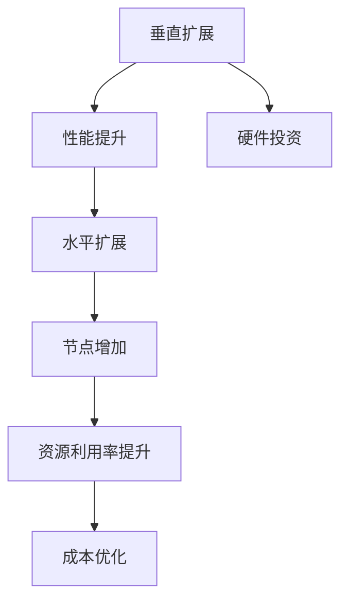
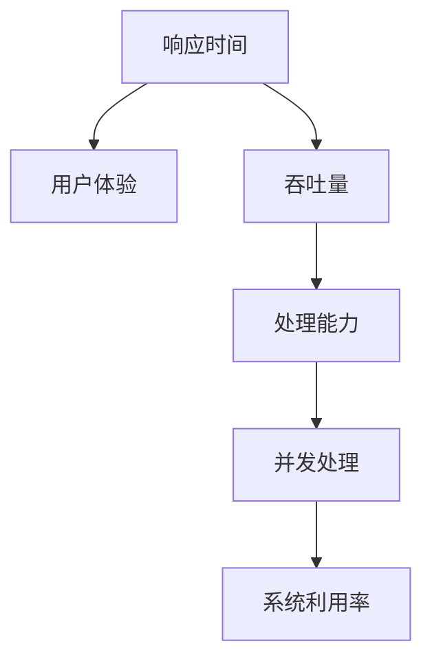
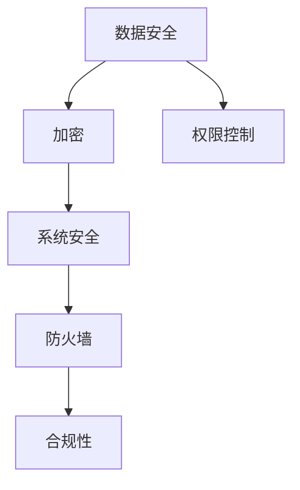
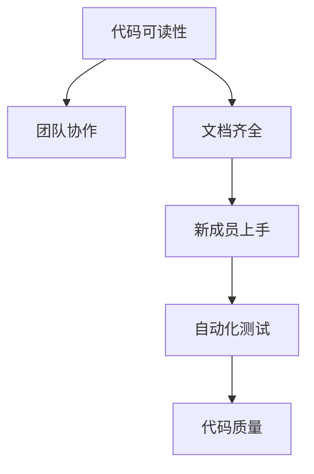
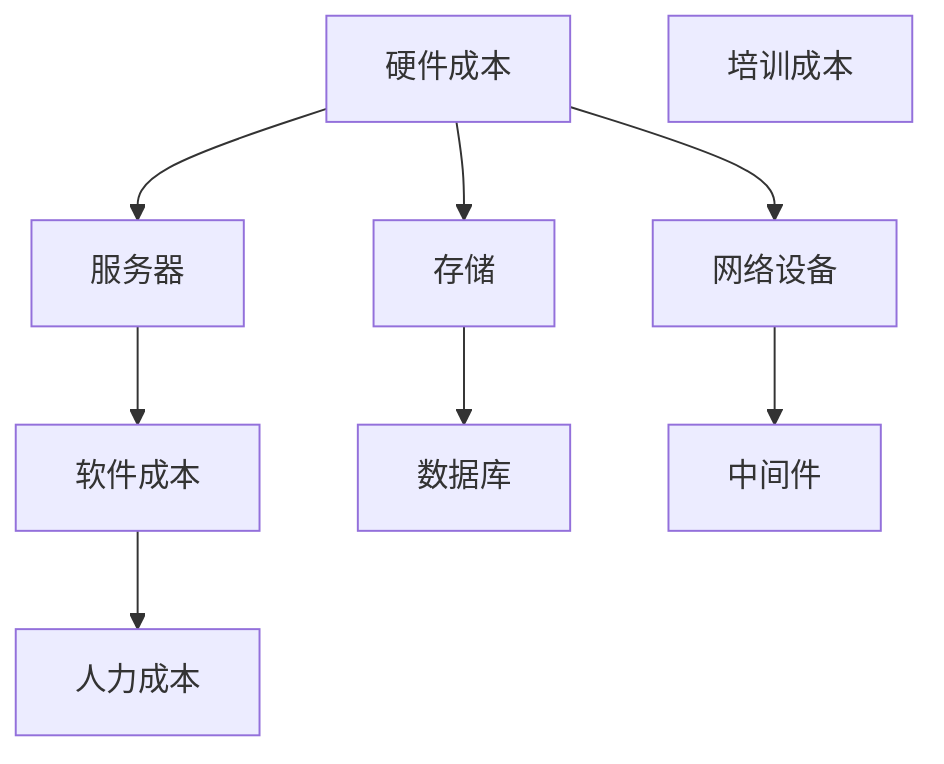

                 

# 《创业公司的技术架构评估指标》

> **关键词：** 技术架构评估、创业公司、可扩展性、性能、安全性、成本效益、指标体系

> **摘要：** 本文章旨在为创业公司提供一套全面的技术架构评估指标，以帮助公司构建稳定、高效、安全的技术基础设施。文章将详细阐述技术架构评估的重要性，介绍常用的评估方法，解析核心评估指标，构建指标体系，并分享实际案例及未来发展趋势。

### 目录

#### 第一部分：引言

1. **技术架构评估的重要性**
    - 1.1 技术架构评估的目的
    - 1.2 技术架构评估的影响

2. **评估方法的概述**
    - 2.1 常用的技术评估方法
    - 2.2 评估方法的优缺点分析

#### 第二部分：技术架构评估指标

1. **核心指标详解**
    - 3.1 可扩展性
    - 3.2 性能
    - 3.3 安全性
    - 3.4 可维护性
    - 3.5 成本效益

2. **指标体系构建**
    - 4.1 指标体系的设计原则
    - 4.2 指标体系的构建流程
    - 4.3 指标体系的优化策略

3. **技术评估工具与方法**
    - 5.1 常见评估工具介绍
    - 5.2 评估方法的适用场景
    - 5.3 工具的实际应用案例分析

4. **案例研究**
    - 6.1 案例背景介绍
    - 6.2 评估指标的选取与构建
    - 6.3 评估结果的解读与应用

5. **技术架构评估的应用与实践**
    - 7.1 技术架构评估在企业中的实际应用
    - 7.2 技术架构评估在企业决策中的作用
    - 7.3 技术架构评估的最佳实践

#### 第三部分：技术架构评估的未来发展趋势

1. **技术架构评估的未来发展趋势**
    - 8.1 人工智能在技术架构评估中的应用
    - 8.2 云计算与物联网对技术架构评估的影响
    - 8.3 技术架构评估的持续优化方向

2. **总结与展望**
    - 9.1 技术架构评估的挑战与机遇
    - 9.2 技术架构评估的发展趋势分析
    - 9.3 未来技术架构评估的发展方向

---

**引言**

技术架构评估是创业公司在构建技术基础设施过程中必不可少的一环。一个合理、稳定、高效的技术架构不仅能提升公司的运营效率，还能降低长期成本，提高市场竞争力。然而，如何对技术架构进行科学、全面的评估，是许多创业公司面临的一大挑战。

本篇文章将从以下几个方面展开讨论：

1. **技术架构评估的重要性**：阐述技术架构评估在创业公司发展过程中的关键作用。
2. **评估方法的概述**：介绍常用的技术评估方法，分析各自的优缺点。
3. **技术架构评估指标**：详细解析可扩展性、性能、安全性、可维护性、成本效益等核心评估指标。
4. **指标体系构建**：讨论指标体系的设计原则、构建流程及优化策略。
5. **技术评估工具与方法**：介绍常见的评估工具，分析适用场景，并分享实际应用案例。
6. **案例研究**：通过实际案例，展示如何进行技术架构评估。
7. **技术架构评估的应用与实践**：探讨技术架构评估在企业中的实际应用及最佳实践。
8. **技术架构评估的未来发展趋势**：展望技术架构评估的未来发展方向。

接下来，我们将逐一探讨这些方面，帮助创业公司构建稳定、高效、安全的技术基础设施。

---

**第一部分：引言**

### 第1章：技术架构评估的重要性

#### 1.1 技术架构评估的目的

技术架构评估的核心目的是确保技术基础设施能够满足公司当前的运营需求，并为未来的业务扩展提供坚实的基础。具体来说，技术架构评估的目的是：

1. **验证现有架构的有效性**：通过对现有技术架构的全面评估，可以识别出潜在的性能瓶颈、安全隐患以及可优化之处，确保架构的稳定性和高效性。
2. **支持业务发展**：技术架构评估有助于确保技术基础设施能够支撑公司的业务增长，避免因技术瓶颈限制公司的发展。
3. **降低长期成本**：通过合理的技术架构，可以减少重复开发、维护和升级的成本，提高资源利用效率。
4. **提升市场竞争力**：稳定、高效、安全的技术架构是公司竞争力的体现，有助于公司在激烈的市场竞争中脱颖而出。

#### 1.2 技术架构评估的影响

技术架构评估不仅对公司的技术基础设施有重要影响，还对公司的整体运营和发展产生深远的影响。

1. **运营效率**：科学的技术架构评估有助于识别和解决技术瓶颈，提高系统的运行效率和稳定性，从而提升公司的运营效率。
2. **资源优化**：通过技术架构评估，公司可以更好地分配资源，优化技术团队的工作流程，降低运营成本。
3. **风险管理**：技术架构评估有助于识别和预防潜在的技术风险，确保公司的技术基础设施的安全性。
4. **业务扩展**：一个合理的技术架构可以为公司的业务扩展提供强有力的支持，帮助公司快速响应市场变化，抓住发展机遇。

综上所述，技术架构评估对于创业公司的重要性不言而喻。接下来，我们将介绍常用的技术评估方法，帮助公司选择最适合的评估策略。

### 第2章：评估方法的概述

#### 2.1 常用的技术评估方法

在技术架构评估过程中，有多种方法可供选择，每种方法都有其独特的优势和适用场景。以下是几种常用的技术评估方法：

1. **问卷调查法**：通过设计问卷，收集用户对现有技术架构的满意度、使用体验和改进建议。这种方法适用于需要了解用户需求的场景。

2. **专家评审法**：邀请行业专家对技术架构进行评审，提供专业的意见和建议。这种方法适用于需要高质量专业评价的场景。

3. **性能测试法**：通过模拟实际使用场景，对系统性能进行测试，评估其响应时间、吞吐量等关键性能指标。这种方法适用于需要评估系统性能的场景。

4. **安全性评估法**：对系统进行安全性测试，识别潜在的安全漏洞和攻击风险。这种方法适用于需要确保系统安全性的场景。

5. **成本效益分析法**：通过对技术架构的投入和产出进行对比分析，评估其成本效益。这种方法适用于需要控制成本、提高效益的场景。

#### 2.2 评估方法的优缺点分析

每种评估方法都有其独特的优缺点，公司在选择评估方法时需要根据具体需求进行权衡。

1. **问卷调查法**：
    - **优点**：操作简单，成本低，能广泛收集用户反馈。
    - **缺点**：数据可能存在偏差，用户可能不提供真实反馈。

2. **专家评审法**：
    - **优点**：专业性强，能提供高质量的评估意见。
    - **缺点**：耗时较长，成本较高。

3. **性能测试法**：
    - **优点**：能直观地评估系统性能，发现问题。
    - **缺点**：测试环境可能无法完全模拟真实场景。

4. **安全性评估法**：
    - **优点**：能及时发现系统安全漏洞，提高系统安全性。
    - **缺点**：安全测试可能需要较高的技术门槛。

5. **成本效益分析法**：
    - **优点**：能帮助公司控制成本，提高效益。
    - **缺点**：分析过程较为复杂，需要对业务和数据有深入了解。

公司应根据自身的业务需求和资源情况，选择最适合的评估方法，或者结合多种方法进行综合评估，以获得全面、准确的评估结果。

---

**第二部分：技术架构评估指标**

### 第3章：核心指标详解

在技术架构评估过程中，核心指标是评估体系中的关键组成部分。这些指标能够全面反映技术架构的各个维度，为公司的技术决策提供有力支持。以下是几个重要的核心指标及其详细解析：

#### 3.1 可扩展性

**可扩展性**是技术架构的一个重要指标，它反映了系统在处理数据量增长、用户数量增加等情况下的表现。一个具有良好可扩展性的技术架构，能够在不显著降低性能的情况下，轻松应对业务增长带来的挑战。

1. **垂直扩展与水平扩展**：
    - **垂直扩展**：通过增加硬件资源（如增加CPU、内存等）来提升系统性能。
    - **水平扩展**：通过增加节点数量来提升系统性能和可扩展性。

2. **性能与成本平衡**：
    - 在设计技术架构时，需要平衡性能和成本，避免过度投资。

3. **弹性伸缩**：
    - 现代云服务提供商提供了自动化弹性伸缩服务，可以根据需求自动调整资源。

**Mermaid 流程图**：

#### 3.2 性能

**性能**是衡量技术架构能否满足业务需求的关键指标。一个高性能的技术架构，能够快速响应用户请求，提供高质量的服务体验。

1. **响应时间**：
    - 响应时间是指用户发起请求到系统返回结果所需的时间。
    - 较低的响应时间能显著提升用户体验。

2. **吞吐量**：
    - 吞吐量是指系统在单位时间内处理请求的数量。
    - 较高的吞吐量意味着系统能处理更多的请求。

3. **并发处理能力**：
    - 并发处理能力是指系统能同时处理多个请求的能力。
    - 高并发处理能力能提升系统的利用率。

**Mermaid 流程图**：

#### 3.3 安全性

**安全性**是技术架构评估中的一个关键指标，它关系到系统的稳定性和用户的隐私安全。

1. **数据安全**：
    - 数据安全是指保护数据不被未经授权的访问、篡改或泄露。
    - 可以通过加密、权限控制等技术手段来保障数据安全。

2. **系统安全**：
    - 系统安全是指防止系统被恶意攻击或非法入侵。
    - 可以通过防火墙、入侵检测系统等技术手段来提高系统安全性。

3. **合规性**：
    - 技术架构需要符合相关法律法规和行业规范，以确保合规性。

**Mermaid 流程图**：

#### 3.4 可维护性

**可维护性**是技术架构评估中的一个重要指标，它反映了系统在长期运行中的稳定性和可维护性。

1. **代码可读性**：
    - 代码可读性高，有利于团队协作和维护。

2. **文档齐全**：
    - 详细的技术文档有助于新成员快速上手，减少维护难度。

3. **自动化测试**：
    - 自动化测试能提高代码质量，降低维护成本。

**Mermaid 流程图**：

#### 3.5 成本效益

**成本效益**是技术架构评估中的一个关键指标，它反映了技术架构的投入产出比。

1. **硬件成本**：
    - 包括服务器、存储、网络设备等硬件设施的成本。

2. **软件成本**：
    - 包括操作系统、数据库、中间件等软件的成本。

3. **人力成本**：
    - 包括开发和维护团队的薪资、培训成本等。

**Mermaid 流�程图**：

通过详细解析可扩展性、性能、安全性、可维护性和成本效益等核心指标，创业公司可以更全面地评估技术架构的优劣，为技术决策提供有力支持。接下来，我们将进一步探讨如何构建和优化技术架构评估指标体系。

### 第4章：指标体系构建

在技术架构评估过程中，构建一个科学、合理的指标体系至关重要。一个完善的指标体系不仅能够全面、准确地反映技术架构的各个方面，还能为公司的技术决策提供有力支持。以下是构建技术架构评估指标体系的设计原则、构建流程及优化策略。

#### 4.1 指标体系的设计原则

1. **全面性**：指标体系应覆盖技术架构的各个维度，包括但不限于性能、安全性、可扩展性、可维护性等，以确保评估的全面性。

2. **合理性**：指标体系的设计应符合公司的业务需求和战略目标，避免偏离核心价值。

3. **可操作性**：指标体系应具有明确的量化标准，便于操作和执行。

4. **动态性**：技术架构会随着业务的发展而不断变化，指标体系应具备一定的动态性，以适应业务的变化。

5. **重要性**：在构建指标体系时，应优先考虑对业务影响较大的指标，确保关键指标得到充分关注。

#### 4.2 指标体系的构建流程

1. **需求分析**：
    - 分析公司的业务需求、战略目标和现有技术架构，确定评估的重点领域。

2. **指标定义**：
    - 定义各个评估指标的具体含义、衡量方式和量化标准。

3. **指标筛选**：
    - 根据需求分析结果，筛选出对业务影响较大的关键指标。

4. **权重分配**：
    - 根据各个指标的重要性和影响力，分配相应的权重，确保评估结果的准确性。

5. **指标体系验证**：
    - 验证指标体系的合理性、全面性和可操作性，确保评估结果的可靠性。

#### 4.3 指标体系的优化策略

1. **持续优化**：
    - 随着业务的发展和技术架构的变化，持续优化指标体系，确保其与业务需求保持一致。

2. **数据驱动**：
    - 利用实际数据对指标体系进行验证和调整，确保评估结果的可信度。

3. **反馈机制**：
    - 建立反馈机制，收集用户和专家的意见和建议，及时调整指标体系。

4. **动态调整**：
    - 在业务发展过程中，根据实际情况动态调整指标体系，确保其适应能力。

通过科学、合理的指标体系构建，创业公司可以更全面、准确地评估技术架构，为技术决策提供有力支持。接下来，我们将介绍常见的技术评估工具和方法，帮助公司选择最适合的评估策略。

### 第5章：技术评估工具与方法

在技术架构评估过程中，选择合适的技术评估工具和方法至关重要。以下我们将介绍几种常见的技术评估工具和方法，并分析其适用场景及优缺点。

#### 5.1 常见评估工具介绍

1. **性能测试工具**：
    - **Apache JMeter**：开源的性能测试工具，支持多种协议的测试，适用于各种规模的性能测试。
    - **LoadRunner**：商业性能测试工具，提供丰富的测试功能和报告，适用于复杂系统的性能测试。

2. **安全性评估工具**：
    - **OWASP ZAP**：开源的网络应用程序安全测试工具，支持自动化和手动测试，适用于中小型企业的安全性评估。
    - **Nessus**：商业漏洞扫描工具，提供详细的漏洞报告和修复建议，适用于大型企业的安全性评估。

3. **自动化测试工具**：
    - **Selenium**：开源的自动化测试工具，支持多种浏览器和操作系统，适用于 Web 应用程序的自动化测试。
    - **JUnit**：开源的 Java 单元测试框架，支持编写和执行单元测试，适用于 Java 应用的自动化测试。

4. **代码质量评估工具**：
    - **SonarQube**：开源的代码质量管理平台，支持多种编程语言，提供代码缺陷、复杂度和安全性分析。
    - **Checkstyle**：开源的代码质量检查工具，支持多种编程语言，适用于代码格式、规范和质量的检查。

#### 5.2 评估方法的适用场景

1. **性能测试法**：
    - **适用场景**：适用于评估系统的性能、稳定性和响应时间。
    - **优缺点**：优点在于能够直观地展示系统的性能瓶颈，缺点在于需要模拟真实场景，成本较高。

2. **安全性评估法**：
    - **适用场景**：适用于评估系统的安全性，识别潜在的安全漏洞。
    - **优缺点**：优点在于能够及时发现和修复安全漏洞，缺点在于测试过程复杂，需要较高的技术门槛。

3. **自动化测试法**：
    - **适用场景**：适用于评估系统的可靠性、稳定性和可维护性。
    - **优缺点**：优点在于能够提高测试效率，降低测试成本，缺点在于需要编写测试脚本，对开发人员要求较高。

4. **代码质量评估法**：
    - **适用场景**：适用于评估代码的质量、规范和安全性。
    - **优缺点**：优点在于能够提高代码质量，降低维护成本，缺点在于对开发流程有一定的约束。

#### 5.3 工具的实际应用案例分析

1. **性能测试工具 - Apache JMeter**：
    - **案例背景**：某创业公司需要对其电商平台进行性能测试，以确保在促销活动期间能够稳定运行。
    - **应用过程**：使用 Apache JMeter 模拟用户访问，测试系统的响应时间、吞吐量和并发处理能力。
    - **评估结果**：发现系统在高并发情况下存在响应缓慢的问题，通过优化数据库查询和缓存策略，解决了性能瓶颈。

2. **安全性评估工具 - OWASP ZAP**：
    - **案例背景**：某创业公司需要对 Web 应用程序进行安全性评估，确保用户数据安全。
    - **应用过程**：使用 OWASP ZAP 扫描 Web 应用程序，识别潜在的安全漏洞。
    - **评估结果**：发现多个安全漏洞，通过修复漏洞，提高了系统的安全性。

3. **自动化测试工具 - Selenium**：
    - **案例背景**：某创业公司需要对其移动应用进行自动化测试，确保应用的稳定性和可靠性。
    - **应用过程**：使用 Selenium 编写自动化测试脚本，进行 UI 测试和功能测试。
    - **评估结果**：通过自动化测试，提高了测试效率，降低了测试成本，确保了移动应用的质量。

4. **代码质量评估工具 - SonarQube**：
    - **案例背景**：某创业公司需要对其代码库进行质量评估，提高代码的可维护性和可读性。
    - **应用过程**：使用 SonarQube 对代码库进行分析，识别代码缺陷、复杂度和安全性问题。
    - **评估结果**：发现多个代码质量问题，通过修复缺陷，提高了代码质量，降低了维护成本。

通过介绍常见的技术评估工具和方法，以及实际应用案例分析，创业公司可以更好地选择适合自身的评估策略，确保技术架构的稳定、高效和安全。

### 第6章：案例研究

为了更好地展示技术架构评估的实际应用，下面我们将通过一个实际案例来介绍技术架构评估的步骤、方法以及结果。

#### 6.1 案例背景介绍

某创业公司是一家提供在线教育平台的公司，随着用户数量的增加，公司需要对其现有的技术架构进行评估，以确保平台能够稳定运行，并支持未来的业务扩展。

#### 6.2 评估指标的选取与构建

根据公司的需求，评估团队选取了以下核心指标：

1. **可扩展性**：评估系统在用户数量增加时的响应能力和性能。
2. **性能**：评估系统的响应时间和吞吐量。
3. **安全性**：评估系统在防止恶意攻击和数据泄露方面的能力。
4. **可维护性**：评估系统的代码质量、文档完善度和自动化测试覆盖率。
5. **成本效益**：评估系统的硬件、软件和人力成本。

评估团队根据这些指标构建了以下具体的评估体系：

1. **可扩展性**：
    - 垂直扩展能力：通过增加服务器资源来提升系统性能。
    - 水平扩展能力：通过增加节点数量来提升系统性能。
    - 弹性伸缩能力：使用云服务提供商的自动化弹性伸缩服务。

2. **性能**：
    - 响应时间：用户发起请求到系统返回结果所需的时间。
    - 吞吐量：系统在单位时间内处理请求的数量。
    - 并发处理能力：系统同时处理多个请求的能力。

3. **安全性**：
    - 数据安全：通过加密和权限控制保障数据安全。
    - 系统安全：通过防火墙和入侵检测系统提高系统安全性。
    - 合规性：确保系统符合相关法律法规和行业规范。

4. **可维护性**：
    - 代码可读性：代码易于理解和修改。
    - 文档齐全：提供详细的技术文档。
    - 自动化测试：测试覆盖率超过 80%。

5. **成本效益**：
    - 硬件成本：服务器、存储和网络设备的费用。
    - 软件成本：操作系统、数据库和中间件的费用。
    - 人力成本：开发和维护团队的薪资和培训成本。

#### 6.3 评估结果的解读与应用

通过上述评估指标，评估团队对现有技术架构进行了全面评估，得出以下结论：

1. **可扩展性**：
    - 系统在垂直扩展方面表现良好，但水平扩展能力较弱。
    - 通过增加节点数量，系统能够在性能和可扩展性方面得到显著提升。

2. **性能**：
    - 响应时间较长，需要优化数据库查询和缓存策略。
    - 吞吐量较低，需要提高系统的并发处理能力。

3. **安全性**：
    - 数据安全措施较为完善，但需要进一步加强权限控制。
    - 系统安全性有待提高，需要增加防火墙和入侵检测系统。

4. **可维护性**：
    - 代码可读性和文档齐全度较高，但自动化测试覆盖率较低。
    - 需要编写更多的自动化测试脚本，提高代码质量。

5. **成本效益**：
    - 硬件和软件成本较高，但通过优化和水平扩展，成本效益将得到改善。

基于评估结果，公司采取了一系列优化措施：

1. **可扩展性**：
    - 引入水平扩展策略，增加节点数量。
    - 使用云服务提供商的自动化弹性伸缩服务。

2. **性能**：
    - 优化数据库查询和缓存策略，降低响应时间。
    - 提高系统的并发处理能力，提升吞吐量。

3. **安全性**：
    - 加强权限控制和防火墙设置。
    - 增加入侵检测系统，提高系统安全性。

4. **可维护性**：
    - 编写更多的自动化测试脚本，提高测试覆盖率。
    - 定期更新技术文档，确保其完善性。

5. **成本效益**：
    - 通过优化和水平扩展，降低硬件和软件成本。
    - 考虑使用开源软件和云服务，降低人力成本。

通过上述优化措施，公司技术架构得到了显著提升，能够更好地支持业务的发展。此案例展示了技术架构评估的重要性和实际应用价值，为其他创业公司提供了有益的借鉴。

### 第7章：技术架构评估的应用与实践

#### 7.1 技术架构评估在企业中的实际应用

技术架构评估在企业中的应用涵盖了从规划到实施再到优化的整个生命周期。以下是一些关键的应用场景：

1. **系统规划**：
    - 在系统设计阶段，通过技术架构评估，确定系统所需的技术栈、硬件资源和软件工具，确保系统能够满足业务需求。

2. **性能优化**：
    - 在系统上线后，定期进行性能测试和评估，发现潜在的性能瓶颈，采取相应的优化措施，确保系统在高并发、大数据量情况下仍能稳定运行。

3. **安全性评估**：
    - 定期对系统进行安全性评估，识别潜在的安全漏洞和风险，采取相应的防护措施，确保系统的数据安全和用户隐私。

4. **成本控制**：
    - 通过技术架构评估，分析硬件、软件和人力成本，优化资源配置，降低运营成本。

5. **可持续性评估**：
    - 对技术架构的可持续性进行评估，确保系统能够随着业务发展进行灵活调整和扩展。

#### 7.2 技术架构评估在企业决策中的作用

技术架构评估在企业决策中起着至关重要的作用，以下是一些关键作用：

1. **支持战略决策**：
    - 技术架构评估可以帮助企业了解当前技术架构的优势和不足，为制定发展战略提供数据支持。

2. **优化投资决策**：
    - 通过评估技术架构的成本效益，帮助企业确定最佳的投入方向，避免资源浪费。

3. **风险管理**：
    - 技术架构评估可以帮助企业识别潜在的技术风险，提前制定应对措施，降低风险。

4. **提升竞争力**：
    - 通过评估技术架构的稳定性和安全性，提升企业的市场竞争力。

5. **促进创新**：
    - 技术架构评估鼓励企业尝试新技术和新方法，推动技术创新和业务发展。

#### 7.3 技术架构评估的最佳实践

以下是一些技术架构评估的最佳实践：

1. **定期评估**：
    - 定期对技术架构进行评估，以确保其持续符合业务需求。

2. **跨部门合作**：
    - 技术架构评估应涉及各个部门，包括开发、运维、安全和业务团队，确保评估的全面性。

3. **数据驱动**：
    - 基于实际数据进行分析，确保评估结果的准确性和可靠性。

4. **持续改进**：
    - 将技术架构评估作为持续改进的过程，不断优化和调整技术架构。

5. **文档记录**：
    - 详细记录评估过程和结果，便于后续参考和改进。

通过技术架构评估，企业能够更好地理解当前技术状态，为未来发展提供明确的指导，从而实现技术驱动业务增长的目标。

### 第三部分：技术架构评估的未来发展趋势

#### 第8章：技术架构评估的未来发展趋势

随着技术的不断进步和业务需求的多样化，技术架构评估也在不断发展，未来将呈现出以下几大趋势：

##### 8.1 人工智能在技术架构评估中的应用

人工智能（AI）技术的快速发展为技术架构评估带来了新的机遇。通过引入 AI 技术，评估过程可以实现自动化和智能化，提高评估的效率和准确性。

1. **自动化评估**：
    - AI 技术可以帮助自动收集和分析技术架构相关的数据，减少人工干预，提高评估速度。
    - 例如，使用机器学习算法对性能测试数据进行自动分析，快速识别性能瓶颈。

2. **智能评估**：
    - AI 技术可以基于历史数据和趋势预测，对技术架构的未来表现进行预测分析。
    - 例如，利用深度学习模型预测系统的未来负载，提前进行优化。

3. **个性化评估**：
    - AI 技术可以根据企业的具体业务需求和场景，提供个性化的评估方案和建议。
    - 例如，针对不同行业和业务规模的企业，提供定制化的技术架构评估指标。

##### 8.2 云计算与物联网对技术架构评估的影响

云计算和物联网（IoT）的普及对技术架构评估产生了深远的影响。这些新兴技术不仅改变了技术架构的形态，也对评估方法提出了新的要求。

1. **云计算**：
    - **弹性评估**：云计算提供的弹性资源使得系统可以根据需求动态调整，技术架构评估需要考虑弹性资源的利用率和成本效益。
    - **云原生架构**：云原生架构的特点是高度可扩展、可自动部署和容器化，评估方法需要适应这种新的架构风格。

2. **物联网**：
    - **海量数据评估**：物联网设备产生的海量数据需要高效的处理和分析能力，技术架构评估需要关注数据存储、处理和传输的性能。
    - **边缘计算**：物联网技术的发展推动了边缘计算的兴起，评估方法需要考虑边缘节点和云端节点的协同工作。

##### 8.3 技术架构评估的持续优化方向

随着技术的不断演进，技术架构评估也需要持续优化，以适应新的业务需求和挑战。

1. **自动化和智能化**：
    - 技术架构评估工具和方法需要进一步自动化和智能化，减少人工干预，提高评估效率。
    - 例如，通过引入自动化测试和 AI 算法，实现评估过程的自动化和智能化。

2. **跨领域融合**：
    - 技术架构评估需要融合多个领域的知识，如数据科学、人工智能、云计算和物联网等，形成综合性的评估体系。
    - 例如，将数据分析和 AI 技术应用于技术架构评估，提供更全面的评估结果。

3. **可持续性和社会责任**：
    - 技术架构评估需要考虑可持续性和社会责任，如能源消耗、碳排放等，推动绿色技术架构的发展。
    - 例如，评估系统在环保和可持续发展方面的表现，引导企业采取绿色技术方案。

通过上述发展趋势，技术架构评估将更加智能化、自动化和综合化，为企业提供更加全面和准确的评估结果，助力企业实现长期发展。

### 第9章：总结与展望

#### 9.1 技术架构评估的挑战与机遇

技术架构评估在创业公司的发展过程中扮演着至关重要的角色。然而，随着技术的不断演进和业务需求的多样化，技术架构评估也面临着诸多挑战和机遇。

**挑战**：

1. **复杂性增加**：随着云原生架构、微服务架构等新兴技术的普及，技术架构的复杂性不断增加，给评估带来了新的挑战。

2. **数据量大**：物联网和大数据技术的发展使得技术架构需要处理的海量数据不断增加，评估数据的收集、存储和分析变得更加复杂。

3. **快速变化**：业务需求的快速变化要求技术架构具备更高的灵活性和可扩展性，评估工作需要不断适应新的变化。

**机遇**：

1. **自动化和智能化**：人工智能和自动化技术的发展为技术架构评估提供了新的工具和方法，使得评估过程更加高效和准确。

2. **跨领域融合**：技术架构评估可以融合多个领域的知识，如数据科学、人工智能、云计算和物联网等，形成综合性的评估体系，提高评估的全面性和准确性。

3. **可持续性**：随着社会对可持续发展和环保的重视，技术架构评估也需要考虑环保和可持续发展，为企业提供绿色技术方案。

#### 9.2 技术架构评估的发展趋势分析

未来，技术架构评估将呈现出以下发展趋势：

1. **智能化和自动化**：技术架构评估工具和方法将更加智能化和自动化，减少人工干预，提高评估效率。

2. **综合性和跨领域**：技术架构评估将融合多个领域的知识，形成综合性的评估体系，为创业公司提供更全面的评估结果。

3. **可持续性**：技术架构评估将更加关注可持续发展和环保，推动绿色技术架构的发展。

#### 9.3 未来技术架构评估的发展方向

为了应对未来的挑战和机遇，技术架构评估需要朝以下方向发展：

1. **自适应评估**：技术架构评估应具备自适应能力，能够根据业务需求和场景动态调整评估指标和方法。

2. **大数据分析**：利用大数据分析技术，对评估过程中收集的数据进行深度分析，提供更准确的评估结果。

3. **实时监控**：引入实时监控技术，对技术架构的运行状态进行实时监控，及时发现潜在问题。

4. **AI 引擎**：结合人工智能技术，开发智能化的评估引擎，提高评估的准确性和效率。

通过以上方向的发展，技术架构评估将能够更好地支持创业公司的发展，帮助其构建稳定、高效、安全的技术基础设施。

### 作者

**作者：AI天才研究院/AI Genius Institute & 禅与计算机程序设计艺术 /Zen And The Art of Computer Programming**

---

本文旨在为创业公司提供一套全面的技术架构评估指标，以帮助公司构建稳定、高效、安全的技术基础设施。文章从技术架构评估的重要性、评估方法的概述、核心指标详解、指标体系构建、技术评估工具与方法、案例研究、应用与实践，以及未来发展趋势等方面进行了详细探讨，希望能够为创业公司的技术决策提供有力支持。随着技术的不断演进，技术架构评估也将不断优化和发展，为创业公司带来更多机遇。希望本文能对读者有所启发，共同探索技术架构评估的新领域。

