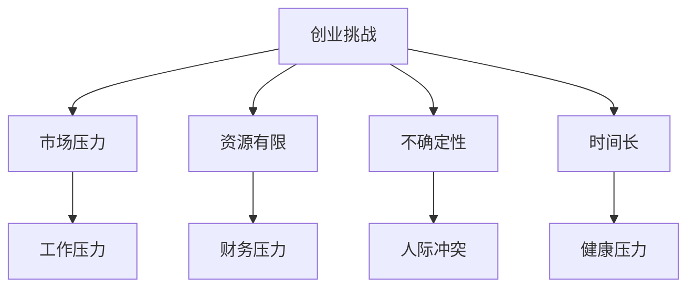
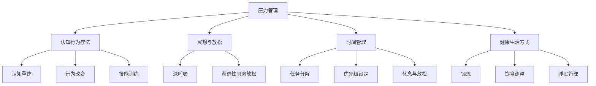
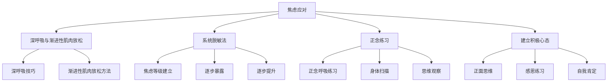

                 

# 《创业路上的心理健康：如何应对压力和焦虑》

关键词：创业、心理健康、压力管理、焦虑应对、心理支持

摘要：本文旨在探讨创业过程中的心理健康问题，尤其是如何应对压力和焦虑。通过逻辑清晰、结构紧凑的阐述，本文从多个角度分析了创业者在创业路上面临的挑战，提供了有效的压力管理和焦虑应对策略，并结合实际案例，深入探讨了心理健康实践的方法。文章最终总结了心理健康在创业成功中的重要性，为创业者提供了一份实用的心理健康指南。

### 第一部分：心理健康与创业

#### 第一部分引言

创业之路从来都不是一帆风顺的，每个创业者都会面临各种挑战。这些挑战不仅来自于市场竞争、资源有限，还来自于心理层面的压力和焦虑。心理健康在创业过程中扮演着至关重要的角色。良好的心理健康可以帮助创业者保持清晰的思维，应对突如其来的困难，从而更有效地推动创业项目的发展。

在这一部分，我们将首先探讨创业的常见挑战，以及这些挑战对创业者心理健康的影响。接下来，我们将讨论心理健康在创业成功中的重要性，并介绍心理健康的基本要素。通过这些讨论，我们希望为创业者提供一个理解和管理心理健康的框架。

#### 1.1 创业的挑战与心理压力

##### 1.1.1 创业的常见挑战

创业是一项充满挑战的任务，涉及多个方面的不确定性。以下是创业过程中常见的挑战：

1. **市场竞争**：在竞争激烈的市场环境中，创业者需要不断调整策略，以保持竞争力。市场变化迅速，创业者必须快速响应，这对心理承受能力提出了高要求。
2. **资源有限**：创业初期的资源通常非常有限，包括资金、人力和技术等。资源不足可能导致项目进展受阻，增加创业者的压力。
3. **不确定性**：创业过程中充满了不确定性，包括市场反应、客户需求变化、技术发展等。这种不确定性会导致创业者对未来感到担忧和焦虑。
4. **时间长**：创业是一项长期任务，需要创业者投入大量的时间和精力。长时间的投入可能导致身心疲惫，增加心理健康风险。

##### 1.1.2 心理压力的来源

创业过程中的挑战直接或间接地影响了创业者的心理健康。以下是导致心理压力的主要来源：

1. **工作压力**：创业者的工作通常需要付出大量时间和精力，长时间的工作压力可能导致身心疲惫。
2. **财务压力**：资金不足或财务风险可能导致创业者感到焦虑和不安。
3. **人际冲突**：创业者需要与合作伙伴、员工、客户等多方面沟通和协作，人际冲突和沟通障碍可能增加心理压力。
4. **未来不确定性**：对未来的不确定性，尤其是市场前景和项目成功率的担忧，可能导致焦虑和恐惧。
5. **自我期望**：创业者往往对自己的期望很高，希望创业项目能够取得巨大成功。这种高期望可能导致自我压力和焦虑。

#### 1.2 心理健康的重要性

##### 1.2.1 心理健康与创业成功

心理健康在创业成功中扮演着关键角色。以下是心理健康对创业成功的重要性：

1. **清晰的思维**：心理健康有助于创业者保持清晰的思维，从而更好地制定战略和决策。
2. **适应能力**：创业者需要面对各种挑战和不确定性，心理健康良好的创业者能够更好地适应变化。
3. **情绪调节**：心理健康有助于创业者调节情绪，避免因负面情绪而做出错误决策。
4. **团队合作**：创业者需要与团队成员有效合作，心理健康良好的创业者能够建立更好的团队关系。
5. **创新思维**：心理健康良好的创业者更有可能产生创新的思维和解决方案。

##### 1.2.2 心理健康的基本要素

心理健康包括多个方面，以下是一些基本要素：

1. **情绪稳定**：情绪稳定是心理健康的核心，有助于创业者应对压力和挑战。
2. **积极心态**：积极心态有助于创业者看到问题的积极面，从而更好地应对困难。
3. **自我意识**：了解自己的情绪和需求，有助于创业者更好地管理自己的心理健康。
4. **应对能力**：良好的应对能力使创业者能够有效应对各种挑战和不确定性。
5. **社会支持**：社会支持，包括家人、朋友和专业人士的支持，有助于创业者缓解心理压力。

### 第二部分：压力管理策略

#### 第二部分引言

在创业过程中，压力是不可避免的。然而，通过有效的压力管理策略，创业者可以减轻压力的影响，保持心理健康。本部分将介绍一系列压力管理策略，包括认知行为疗法（CBT）、冥想与放松技巧、时间管理和健康生活方式。通过这些策略，创业者可以更好地应对压力，提高工作效率和生活质量。

#### 2.1 认识压力

##### 2.1.1 压力的定义与类型

压力是一种身体和心理的紧张状态，通常由外部环境或内部心理因素引起。根据压力的来源和影响，压力可以分为以下几种类型：

1. **工作压力**：源于工作职责、工作量和工作环境等方面的压力。
2. **财务压力**：由于财务问题或财务风险导致的压力。
3. **人际关系压力**：源于家庭、朋友或同事等社会关系中的压力。
4. **健康压力**：由于健康问题或健康担忧导致的压力。
5. **环境压力**：源于自然环境或社会环境中的压力，如噪音、交通拥堵等。

##### 2.1.2 压力的生理与心理影响

压力对生理和心理产生广泛的影响，以下是其中的几个方面：

1. **生理影响**：
   - **免疫系统下降**：长期压力可能导致免疫系统功能下降，增加患病的风险。
   - **心血管系统压力**：压力可能导致心跳加快、血压升高等心血管问题。
   - **消化系统紊乱**：压力可能影响消化系统的正常功能，导致消化不良、胃痛等。

2. **心理影响**：
   - **情绪问题**：压力可能导致情绪波动、焦虑、抑郁等情绪问题。
   - **认知障碍**：压力可能影响记忆、注意力等认知功能。
   - **睡眠障碍**：长期压力可能导致失眠、多梦等睡眠问题。

##### 2.1.3 压力的自我评估

了解自己的压力水平对实施有效的压力管理策略至关重要。以下是一些自我评估压力的方法：

1. **压力日记**：记录每天的压力来源、持续时间、强度和应对方式，有助于了解自己的压力状况。
2. **压力测试**：使用专业的压力测试工具，如压力问卷或心理测试，评估自己的压力水平。
3. **身体感受**：注意身体感受，如紧张、疲劳、失眠等，这些可能是压力的信号。

#### 2.2 应对策略

##### 2.2.1 认知行为疗法（CBT）

认知行为疗法（Cognitive Behavioral Therapy，CBT）是一种广泛应用于压力管理的心理治疗方法。CBT的核心理念是，通过改变负面思维和行为模式，可以改善情绪和心理状态。

1. **基本原理**：
   - **认知重建**：识别和挑战负面思维，将其转化为更积极的思考方式。
   - **行为改变**：通过改变行为模式，减少负面情绪和行为。
   - **技能训练**：学习应对压力的技能，如情绪调节、时间管理和社交技巧。

2. **应用实例**：
   - **焦虑管理**：通过认知重建，减少对焦虑事件的担忧，提高应对能力。
   - **时间管理**：通过行为改变，合理安排时间，减少拖延和压力。
   - **情绪调节**：通过技能训练，学会有效地应对负面情绪，如焦虑、抑郁等。

##### 2.2.2 冥想与放松技巧

冥想和放松技巧是减轻压力的有效方法，它们通过放松身体和心灵，减轻压力和焦虑。

1. **冥想的种类与技巧**：
   - **专注冥想**：专注于呼吸或某个物体，减少思维干扰。
   - **正念冥想**：专注于当前的感受和体验，提高对情绪和身体的意识。
   - **动态冥想**：结合身体运动和呼吸，提高身心协调。

2. **放松训练的方法**：
   - **渐进性肌肉放松**（PMR）：通过逐个放松身体的肌肉群，减轻肌肉紧张和压力。
   - **深呼吸**：通过深呼吸，放松身体和心灵，减轻焦虑和压力。
   - **瑜伽**：结合身体运动和呼吸，提高身心协调，减轻压力。

##### 2.2.3 压力管理技巧

除了认知行为疗法和冥想放松技巧，还有一些实用的压力管理技巧，可以帮助创业者更好地应对压力。

1. **时间管理**：
   - **任务分解**：将大任务分解为小任务，减少工作压力。
   - **优先级设定**：根据任务的紧急程度和重要性，合理安排时间。
   - **休息与放松**：定期休息，保持身心健康。

2. **健康生活方式**：
   - **锻炼**：定期锻炼，提高身体素质，减轻压力。
   - **饮食调整**：保持健康的饮食习惯，避免过度摄入咖啡因和糖分。
   - **睡眠管理**：保证充足的睡眠，提高工作效率和生活质量。

### 第三部分：焦虑应对

#### 第三部分引言

焦虑是创业过程中常见的情绪问题，它可能导致创业者产生恐惧、不安和紧张等负面情绪。有效的焦虑应对策略可以帮助创业者减轻焦虑症状，保持心理健康。本部分将介绍一系列焦虑应对策略，包括深呼吸与渐进性肌肉放松、系统脱敏法、正念练习和建立积极心态。通过这些策略，创业者可以更好地应对焦虑，提高生活质量。

#### 3.1 认识焦虑

##### 3.1.1 焦虑的定义与类型

焦虑是一种情绪状态，表现为对未来的不确定性和潜在威胁的担忧。根据焦虑的表现形式和性质，焦虑可以分为以下几种类型：

1. **一般焦虑障碍**（Generalized Anxiety Disorder，GAD）：长期感到过度焦虑和不安，常伴有身体症状，如头痛、肌肉紧张等。
2. **社交焦虑障碍**（Social Anxiety Disorder，SAD）：在社交场合感到极度紧张和不安，害怕被评判或拒绝。
3. **特定恐惧症**（Specific Phobia）：对特定事物或情境产生强烈恐惧，如高度、昆虫等。
4. **分离焦虑障碍**（Separation Anxiety Disorder，SAD）：对离开所爱的人或熟悉的环境感到极度不安和恐惧。

##### 3.1.2 焦虑的生理与心理影响

焦虑对生理和心理产生广泛的影响，以下是其中的几个方面：

1. **生理影响**：
   - **心血管系统**：焦虑可能导致心跳加快、血压升高等心血管问题。
   - **消化系统**：焦虑可能影响消化系统的正常功能，导致胃痛、腹泻等消化问题。
   - **免疫系统**：长期焦虑可能导致免疫系统功能下降，增加患病的风险。

2. **心理影响**：
   - **认知功能**：焦虑可能影响记忆、注意力等认知功能。
   - **情绪调节**：焦虑可能导致情绪波动，影响情绪调节能力。
   - **睡眠质量**：焦虑可能导致失眠、多梦等睡眠问题。

##### 3.1.3 焦虑的自我评估

了解自己的焦虑水平对实施有效的焦虑应对策略至关重要。以下是一些自我评估焦虑的方法：

1. **焦虑问卷**：使用专业的焦虑评估工具，如焦虑自评量表（SAS）或广泛性焦虑障碍问卷（GAD-7）。
2. **情绪日记**：记录每天的焦虑感受、触发因素和应对方式，有助于了解焦虑状况。
3. **身体感受**：注意身体的紧张感、心跳加速等生理反应，这些可能是焦虑的信号。

#### 3.2 焦虑管理策略

##### 3.2.1 深呼吸与渐进性肌肉放松

深呼吸和渐进性肌肉放松是减轻焦虑的有效方法，它们通过放松身体和心灵，减轻焦虑症状。

1. **深呼吸的技巧**：
   - **腹式呼吸**：通过深吸气，使腹部膨胀，然后缓慢呼气，使腹部收缩。
   - **呼吸节奏**：保持呼吸的节奏均匀，每个呼吸周期大约5秒钟。

2. **渐进性肌肉放松（PMR）**：
   - **步骤**：首先选择一个肌肉群（如手臂），然后逐渐收紧该肌肉群，保持几秒钟，再缓慢放松。逐步进行其他肌肉群的放松练习。
   - **效果**：通过紧张和放松肌肉，减轻肌肉紧张和压力，有助于放松身心。

##### 3.2.2 系统脱敏法

系统脱敏法是一种逐步减少对特定刺激的敏感性的方法，适用于治疗特定恐惧症和社交焦虑等。

1. **步骤**：
   - **建立焦虑等级**：将引起焦虑的刺激按照从低到高的顺序列出，形成焦虑等级。
   - **逐步暴露**：在放松状态下，逐步暴露于焦虑等级中的刺激，每次暴露直到不再引起焦虑。
   - **逐步提升**：在每次暴露后，逐步提升焦虑等级，重复以上步骤。

2. **实例分析**：
   - **社交焦虑**：首先从与熟悉的朋友交谈开始，逐渐过渡到与陌生人交谈，最后参加社交活动。
   - **特定恐惧症**：例如，对高度恐惧的人可以首先在低高度的地方练习，然后逐步提升高度。

##### 3.2.3 正念练习

正念练习是一种通过专注当下，提高对情绪和身体感受的觉察的方法，有助于减轻焦虑。

1. **基本概念**：
   - **正念**：一种专注于当前体验的练习，包括呼吸、身体感受和思维。
   - **觉察**：通过正念，提高对情绪和身体感受的觉察，从而更好地应对焦虑。

2. **实践方法**：
   - **呼吸练习**：专注于呼吸，感受呼吸的进出和身体的起伏。
   - **身体扫描**：从脚开始，逐渐扫描全身，感受身体的各个部位。
   - **思维观察**：注意思维的流动，观察它们而不被它们控制。

##### 3.2.4 建立积极心态

建立积极心态是应对焦虑的重要策略，它通过改变思维方式，提高对生活的满足感和幸福感。

1. **积极心态的重要性**：
   - **情绪调节**：积极心态有助于调节情绪，减少负面情绪的影响。
   - **心理韧性**：积极心态可以提高心理韧性，更好地应对挑战和困难。
   - **生活质量**：积极心态有助于提高生活质量，享受生活中的美好。

2. **培养积极心态的策略**：
   - **正面思维**：积极看待问题和挑战，寻找解决方案。
   - **感恩练习**：每天花时间思考感恩的事物，提高幸福感。
   - **自我肯定**：鼓励自己，认可自己的成就和努力。

### 第四部分：心理健康实践

#### 第四部分引言

心理健康实践是创业者保持心理健康的有效方法，它不仅包括认知行为疗法、冥想和放松技巧等心理策略，还包括日常生活中的实际操作。本部分将介绍心理健康实践的方法，包括自我反思、情感日记、健康生活方式和社交支持等。通过这些实践，创业者可以更好地管理自己的心理健康，提高生活质量。

#### 4.1 心理健康实践

##### 4.1.1 心理健康实践的意义

心理健康实践对创业者的心理健康具有重要意义。通过定期进行心理健康实践，创业者可以：

1. **提高情绪调节能力**：通过自我反思和情感日记，创业者可以更好地了解自己的情绪波动，从而提高情绪调节能力。
2. **减轻压力和焦虑**：通过冥想和放松技巧，创业者可以减轻身体和心灵的紧张感，减轻压力和焦虑。
3. **增强心理韧性**：通过积极的健康生活方式和社交支持，创业者可以提高心理韧性，更好地应对创业过程中的挑战。
4. **提高生活质量**：通过心理健康实践，创业者可以改善睡眠质量，提高工作效率和生活质量。

##### 4.1.2 心理健康实践的方法

以下是几种常见的心理健康实践方法：

1. **自我反思**：
   - **目的**：通过自我反思，创业者可以深入了解自己的内心世界，识别负面情绪和思维模式。
   - **方法**：每天花几分钟时间，静静地思考自己的情绪、想法和行为，记录在情感日记中。

2. **情感日记**：
   - **目的**：情感日记是一种记录自己情绪、想法和经历的方式，有助于创业者更好地了解自己，提高情绪调节能力。
   - **方法**：每天花几分钟时间，写下自己的情绪、想法和经历，尤其是那些对自己有影响的时刻。

3. **健康生活方式**：
   - **锻炼**：定期进行体育锻炼，如跑步、瑜伽或健身，有助于减轻压力和焦虑，提高身心健康。
   - **饮食调整**：保持健康的饮食习惯，摄入丰富的营养，避免过度摄入咖啡因和糖分。
   - **睡眠管理**：保证充足的睡眠，提高睡眠质量，有助于缓解压力和焦虑。

4. **社交支持**：
   - **目的**：社交支持是一种有效的心理健康资源，有助于创业者缓解压力和焦虑。
   - **方法**：与家人、朋友或同事保持良好的社交关系，定期进行社交活动，分享自己的感受和经历。

##### 4.1.3 心理健康实践的应用场景

心理健康实践可以在以下场景中发挥重要作用：

1. **创业初期**：在创业初期，创业者可能面临大量的压力和不确定性，通过心理健康实践，可以更好地应对这些挑战。
2. **项目瓶颈**：在项目遇到瓶颈时，通过自我反思和情感日记，可以更好地了解自己的情绪波动，从而找到解决问题的方法。
3. **团队管理**：作为团队领导者，通过心理健康实践，可以更好地理解和管理团队成员的情绪，提高团队协作效率。
4. **个人成长**：在个人成长过程中，通过心理健康实践，可以更好地了解自己的需求，实现自我提升和成长。

#### 4.2 创业者心理健康计划

##### 4.2.1 制定心理健康计划

制定心理健康计划是创业者管理心理健康的重要步骤。以下是制定心理健康计划的步骤：

1. **目标设定**：明确心理健康计划的目标，如提高情绪调节能力、减轻压力和焦虑等。
2. **策略选择**：选择适合的心理健康实践方法，如自我反思、情感日记、冥想和锻炼等。
3. **时间安排**：合理安排时间，确保心理健康实践能够持续进行。
4. **跟踪评估**：定期评估心理健康实践的进展，根据实际情况进行调整。

##### 4.2.2 心理健康计划的实施步骤

以下是实施心理健康计划的步骤：

1. **第一步：自我评估**：了解自己的心理状况，识别负面情绪和思维模式。
2. **第二步：制定计划**：根据自我评估结果，制定具体的心理健康计划。
3. **第三步：开始实践**：按照计划开始实施心理健康实践，如自我反思、情感日记、冥想和锻炼等。
4. **第四步：跟踪评估**：定期评估心理健康实践的进展，根据实际情况进行调整。
5. **第五步：持续改进**：根据评估结果，不断改进心理健康实践，提高效果。

##### 4.2.3 心理健康在创业中的持续实践

心理健康在创业中的持续实践对于创业者的长期成功至关重要。以下是心理健康在创业中的持续实践策略：

1. **定期评估**：定期评估自己的心理状况，确保心理健康实践持续有效。
2. **持续学习**：不断学习新的心理健康知识和技巧，提高自己的心理素质。
3. **寻求支持**：在遇到心理问题时，及时寻求专业人士的支持和帮助。
4. **平衡工作与生活**：合理安排工作与生活，确保身心健康。
5. **建立支持网络**：与家人、朋友和同事保持良好的关系，建立支持网络。

#### 4.3 心理健康实践的应用场景

以下是心理健康实践在创业中的具体应用场景：

1. **初创阶段**：在初创阶段，创业者面临巨大的压力和不确定性，通过心理健康实践，可以更好地应对这些挑战。
2. **项目推进**：在项目推进过程中，创业者可能面临各种困难和挑战，通过心理健康实践，可以更好地调节情绪，找到解决问题的方法。
3. **团队管理**：在团队管理中，创业者需要处理各种人际关系和冲突，通过心理健康实践，可以更好地理解和管理团队成员的情绪，提高团队协作效率。
4. **个人成长**：在个人成长过程中，创业者需要不断学习新的知识和技能，通过心理健康实践，可以更好地调节情绪，实现自我提升和成长。

### 第五部分：心理健康资源

#### 第五部分引言

心理健康资源对于创业者来说至关重要，它们可以帮助创业者更好地了解和管理自己的心理健康。本部分将介绍心理健康资源的种类和获取途径，包括心理支持组织、心理健康网站和应用程序等。通过利用这些资源，创业者可以获取专业的心理健康支持，提高心理健康水平。

#### 5.1 心理健康资源概述

心理健康资源可以分为以下几类：

1. **心理支持组织**：提供专业的心理健康咨询和支持，帮助创业者应对心理问题。
2. **心理健康网站**：提供心理健康信息、资源和在线咨询服务，方便创业者随时获取帮助。
3. **心理健康应用程序**：提供各种心理健康练习和工具，帮助创业者进行自我管理和恢复。

#### 5.2 心理健康支持组织

以下是国内和国际上一些知名的心理健康支持组织：

##### 5.2.1 国内知名心理支持组织

1. **中国心理卫生协会**：提供心理健康信息、专业培训和心理咨询。
   - 官网：http://www.cps.org.cn/
2. **中国心理咨询师协会**：提供心理咨询师认证、培训和心理健康咨询服务。
   - 官网：http://www.cca.cn/

##### 5.2.2 国际知名心理支持组织

1. **美国心理健康协会**（American Psychological Association，APA）：提供心理健康信息、资源和专业培训。
   - 官网：https://www.apa.org/
2. **世界卫生组织**（World Health Organization，WHO）：提供全球心理健康信息和资源。
   - 官网：https://www.who.int/

#### 5.3 心理健康在线资源

以下是几个常用的心理健康在线资源和应用程序：

##### 5.3.1 心理健康网站推荐

1. **心理健康网**：提供心理健康资讯、专业咨询和在线测评。
   - 官网：http://www.21心理.com/
2. **心情港湾**：提供心理健康资讯、在线咨询和心理健康课程。
   - 官网：http://www.xinqinggank.com/

##### 5.3.2 心理健康应用程序推荐

1. **头号玩家**：提供正念冥想、情绪记录和心理健康测试等功能。
   - 应用市场搜索：头号玩家
2. **解压星球**：提供心理健康资讯、放松练习和心理咨询。
   - 应用市场搜索：解压星球

### 第六部分：心理健康与创业成功

#### 第六部分引言

心理健康在创业成功中扮演着至关重要的角色。创业过程充满了不确定性和挑战，良好的心理健康可以帮助创业者更好地应对这些挑战，实现创业目标。本部分将探讨心理健康与创业成功的联系，介绍创业者心理健康之路，并通过案例分析，展示心理健康在创业中的实际应用。

#### 6.1 心理健康与创业成功的联系

心理健康对创业成功具有重要影响，主要体现在以下几个方面：

1. **清晰的思维**：心理健康有助于创业者保持清晰的思维，从而更好地制定战略和决策。清晰的思维使创业者能够看到问题的本质，找到创新的解决方案。

2. **适应能力**：心理健康良好的创业者具有较强的适应能力，能够灵活应对市场变化和不确定性。这种适应能力使创业者能够抓住机遇，迅速调整策略，保持竞争力。

3. **情绪调节**：心理健康有助于创业者调节情绪，避免因负面情绪而做出错误决策。情绪稳定的创业者能够更好地管理情绪，保持积极心态，提高决策质量。

4. **团队合作**：心理健康良好的创业者能够建立良好的团队关系，促进团队合作。他们能够理解和支持团队成员，有效沟通，激发团队创造力。

5. **创新能力**：心理健康良好的创业者更有可能产生创新的思维和解决方案。心理健康使创业者能够从不同角度看待问题，发现新的商业机会。

#### 6.2 创业者的心理健康之路

创业者的心理健康之路包括以下几个方面：

1. **自我意识**：了解自己的情绪和需求是心理健康的基础。创业者需要学会识别和管理自己的情绪，了解自己的情绪状态，以便更好地应对挑战。

2. **心理韧性**：心理韧性是创业者应对挫折和困难的重要能力。通过培养心理韧性，创业者可以提高心理弹性，迅速恢复，继续前进。

3. **心理支持**：创业过程中，创业者需要寻求心理支持，包括家人、朋友和专业人士的支持。心理支持可以帮助创业者缓解压力，提供情感支持和实际帮助。

4. **持续学习**：创业是一个不断学习和成长的过程。创业者需要不断学习新的知识和技能，提高自己的专业能力，同时关注心理健康知识，提高心理健康水平。

#### 6.3 心理健康案例分析

以下是两个创业者的心理健康案例分析：

##### 案例一：成功创业者的心理健康经验

**案例背景**：张先生是一位成功创业者，创办了一家互联网公司。在创业初期，他面临着巨大的压力和挑战，但他通过良好的心理健康管理，最终取得了成功。

**心理健康经验**：
1. **自我反思**：张先生每天花时间进行自我反思，了解自己的情绪和想法，从而更好地管理自己的情绪。
2. **运动锻炼**：他定期进行运动锻炼，如跑步和瑜伽，以减轻压力和焦虑。
3. **社交支持**：他建立了强大的社交网络，与家人、朋友和同事保持良好的关系，定期进行社交活动。

##### 案例二：心理健康在失败创业中的重要性

**案例背景**：李女士是一位创业者，她创办了一家初创公司，但在市场竞争中失败。尽管失败，但她通过心理健康管理，最终恢复了信心，开始了新的创业之旅。

**心理健康经验**：
1. **接受失败**：李女士接受了失败的现实，并认识到失败是成功的一部分，从中吸取了教训。
2. **寻求支持**：她向家人、朋友和专业人士寻求支持，帮助他们度过心理困境。
3. **自我成长**：她利用失败的经历，进行自我反思和成长，提高了自己的能力和心理韧性。

### 第七部分：心理健康与团队协作

#### 第七部分引言

在创业过程中，团队协作至关重要。一个健康、高效的团队可以为创业项目带来巨大的成功。然而，团队协作中也常常伴随着压力和心理健康问题。本部分将探讨心理健康与团队协作的关系，介绍促进团队心理健康的策略，并分析心理健康在团队管理中的应用。

#### 7.1 心理健康与团队协作的关系

心理健康对团队协作有着深远的影响，以下是几个关键方面：

1. **团队凝聚力**：心理健康良好的团队成员更容易建立信任和合作，提高团队凝聚力。这有助于团队在面对挑战时，共同解决问题。

2. **沟通效率**：心理健康良好的团队成员能够更有效地沟通，减少误解和冲突。良好的沟通有助于团队协作，提高工作效率。

3. **创新能力**：心理健康良好的团队成员更有创造力，能够从不同角度思考问题，提出创新的解决方案。

4. **应对压力**：心理健康良好的团队成员能够更好地应对压力和挑战，保持积极心态，提高团队的整体抗压能力。

5. **工作满意度**：心理健康良好的团队成员通常对工作更加满意，这有助于提高团队的整体绩效。

#### 7.2 促进团队心理健康的策略

以下是一些促进团队心理健康的策略：

##### 7.2.1 增强团队凝聚力

1. **团队建设活动**：定期组织团队建设活动，如团队拓展训练、团建旅行等，增强团队成员之间的联系和信任。

2. **团队沟通**：鼓励团队成员之间的开放沟通，建立有效的沟通机制，如定期的团队会议、反馈会议等。

3. **共同目标**：明确团队的目标和愿景，确保每个成员都清楚自己的职责和贡献，提高团队凝聚力。

##### 7.2.2 提升团队应对压力的能力

1. **压力管理培训**：为团队成员提供压力管理培训，教授他们应对压力的技巧，如时间管理、情绪调节等。

2. **工作与生活的平衡**：鼓励团队成员合理安排工作与生活，避免过度工作，提高生活质量。

3. **心理支持**：建立心理支持系统，提供专业的心理健康咨询服务，帮助团队成员应对心理问题。

##### 7.2.3 建立积极心态

1. **正面激励**：通过积极的反馈和认可，鼓励团队成员保持积极心态，提高工作动力。

2. **团队合作意识**：培养团队成员的团队合作意识，强调团队的成功离不开每个成员的努力和贡献。

3. **心理韧性训练**：通过心理韧性训练，提高团队成员面对挑战和困难的能力，增强心理韧性。

#### 7.3 心理健康在团队管理中的应用

作为团队领导者，管理者在维护团队心理健康中扮演着关键角色。以下是心理健康在团队管理中的应用：

##### 7.3.1 管理者心理健康的责任

1. **关注团队成员的心理健康**：管理者需要关注团队成员的心理健康状况，及时发现和解决心理问题。

2. **建立支持网络**：管理者需要建立支持网络，提供心理支持和帮助，帮助团队成员应对心理压力。

3. **制定心理健康政策**：制定心理健康政策，为团队成员提供心理健康保护和福利，如心理健康保险、心理咨询服务等。

##### 7.3.2 建立心理健康的团队文化

1. **提倡心理健康**：在团队中提倡心理健康，鼓励团队成员关注自己的心理健康，提高心理健康意识。

2. **提供培训和学习机会**：为团队成员提供心理健康培训和自我提升机会，帮助他们提高心理健康水平。

3. **营造积极氛围**：营造积极、包容的团队氛围，鼓励团队成员之间的互相支持和尊重。

### 第八部分：心理健康与个人成长

#### 第八部分引言

心理健康在个人成长中起着至关重要的作用。一个健康的心理状态有助于个人在职业生涯中取得成功，并在生活中保持幸福和满足。本部分将探讨心理健康与个人成长的关系，介绍增进心理健康的方法，并分析心理健康在职业发展中的作用。

#### 8.1 心理健康与个人成长的关系

心理健康对个人成长具有重要影响，以下是几个关键方面：

1. **情绪调节**：心理健康有助于个人更好地调节情绪，保持情绪稳定。这有助于个人在面临压力和挑战时，保持冷静和理智，做出明智的决策。

2. **认知能力**：心理健康良好的个人通常具有更高的认知能力，如注意力、记忆力和解决问题的能力。这有助于个人在学习和工作中取得更好的成绩。

3. **自我意识**：心理健康有助于个人更好地了解自己，包括自己的情绪、需求和价值观。这有助于个人建立自我认同，实现自我提升和成长。

4. **人际关系**：心理健康良好的个人更容易建立和维护良好的人际关系。这有助于个人在社交场合中更好地与他人沟通，提高社会支持。

5. **生活满意度**：心理健康有助于个人在生活和工作中获得更高的满意度。这有助于个人体验到更多的快乐和满足感，提高生活质量。

#### 8.2 增进心理健康的方法

以下是几种增进心理健康的方法：

##### 8.2.1 个人成长计划

1. **目标设定**：明确个人成长的目标，如提升专业技能、拓展人际关系等。目标设定有助于个人明确发展方向，提高动力。

2. **路径规划**：制定实现目标的路径，包括学习计划、行动计划等。路径规划有助于个人有条不紊地实现目标。

3. **定期评估**：定期评估个人成长计划的进展，根据实际情况进行调整。定期评估有助于个人保持动力，持续成长。

##### 8.2.2 持续学习与自我提升

1. **学习资源推荐**：利用网络资源、书籍、课程等，学习新的知识和技能。学习资源推荐有助于个人不断充实自己。

2. **实践应用**：将学到的知识和技能应用到实际工作中，提高自己的能力和竞争力。实践应用有助于个人将理论知识转化为实践能力。

3. **反馈与反思**：定期进行反馈和反思，了解自己的优点和不足，持续改进。反馈与反思有助于个人不断提高自己。

##### 8.2.3 生活平衡

1. **工作与休闲的平衡**：合理安排工作时间和休闲时间，避免过度工作。工作与休闲的平衡有助于个人保持身心健康。

2. **家庭与事业的平衡**：平衡家庭和事业，确保两者之间不产生冲突。家庭与事业的平衡有助于个人在工作和生活中保持幸福和满足。

3. **健康生活方式**：保持健康的生活方式，包括定期锻炼、健康饮食和充足睡眠。健康生活方式有助于提高个人的整体健康水平。

#### 8.3 心理健康在职业发展中的作用

心理健康在职业发展中起着关键作用，以下是几个方面：

1. **职业规划**：心理健康有助于个人进行有效的职业规划，明确自己的职业目标和发展方向。

2. **团队合作**：心理健康良好的个人更容易与他人合作，提高团队合作效率。

3. **创新能力**：心理健康有助于个人保持创新思维，提出创新的解决方案。

4. **抗压能力**：心理健康有助于个人在职场压力中保持冷静和理智，提高抗压能力。

5. **职业满意度**：心理健康良好的个人通常对工作更加满意，提高职业满意度。

### 附录

#### 附录 A：心理健康资源推荐

在本附录中，我们为您推荐一些有益于心理健康的专业资源和工具。

##### A.1 心理健康书籍推荐

1. **《心理学与生活》**（Psychology and Life） - 菲利普·津巴多（Philip Zimbardo）等著
   - 本书涵盖了心理学的核心概念，适合希望深入了解心理学的读者。

2. **《正能量》**（The Power of Positive Thinking） - 拿撒勒的耶稣（Norman Vincent Peale）著
   - 本书强调了积极心态对生活的影响，有助于培养积极的生活态度。

3. **《如何控制自己的情绪》**（How to Win Friends and Influence People） - 戴尔·卡耐基（Dale Carnegie）著
   - 本书提供了有效的沟通和人际交往技巧，有助于提升个人情感管理能力。

##### A.2 心理健康网站推荐

1. **中国心理卫生网**（http://www.cps.org.cn/）
   - 该网站提供心理健康资讯、在线咨询和专业培训。

2. **心理健康网**（http://www.21心理.com/）
   - 该网站提供心理健康资讯、专业心理测评和心理咨询服务。

3. **美国心理健康协会网站**（https://www.apa.org/）
   - 该网站提供丰富的心理健康资源和专业信息，包括研究、培训和公众教育。

##### A.3 心理健康应用程序推荐

1. **头号玩家**（Moodfit）
   - 应用提供正念冥想、情绪记录和心理健康测试，帮助用户管理情绪。

2. **解压星球**（Relax Planet）
   - 应用提供放松练习、呼吸训练和心理咨询服务，有助于缓解压力。

3. **心语心愿**（Healmyheart）
   - 应用提供心理测试、情绪支持和健康建议，旨在提升用户的心理健康水平。

#### 附录 B：心理健康实践指南

在本附录中，我们提供了一些心理健康实践指南，帮助您在日常生活中更好地管理自己的心理健康。

##### B.1 自我反思技巧

自我反思是一种重要的心理健康实践，可以帮助您深入了解自己的内心世界。以下是一些自我反思的技巧：

1. **每日反思**：每天花几分钟时间，回想一天的经历，思考自己的情绪、想法和行为。

2. **写日记**：记录自己的情绪、想法和感受，尤其是那些对自己有影响的时刻。

3. **提问自己**：定期提问自己，如“我今天做得最好的是什么？”“我有哪些地方可以改进？”

##### B.2 情感日记撰写方法

情感日记是一种记录自己情绪和感受的方式，以下是一些撰写情感日记的方法：

1. **日期和地点**：在日记的开头记录日期和地点，有助于您回顾和整理情绪。

2. **描述情绪**：用具体的词汇描述自己的情绪，如“焦虑”、“沮丧”、“兴奋”。

3. **分析原因**：思考情绪产生的原因，分析事件、情境或内心因素。

4. **反思感受**：反思自己的情绪和行为，思考如何改进和应对类似的情境。

##### B.3 心理健康小贴士

以下是一些有助于提高心理健康的日常小贴士：

1. **定期锻炼**：每天进行适量的锻炼，如散步、跑步或瑜伽，有助于释放压力。

2. **保持充足的睡眠**：保证每晚7-9小时的睡眠，有助于恢复体力和精神状态。

3. **合理安排时间**：合理规划工作和休息时间，避免过度工作。

4. **培养兴趣爱好**：参加自己感兴趣的活动，如阅读、绘画或音乐，有助于放松心情。

5. **寻求支持**：与家人、朋友或专业人士交流，分享自己的感受和困惑。

#### 附录 C：心理健康专家介绍

在本附录中，我们介绍了一些在心理健康领域具有影响力的专家，他们的研究成果和经验对创业者和管理者具有重要的参考价值。

##### C.1 国内心理健康专家介绍

1. **李明（Li Ming）**
   - 李明教授是中国心理卫生协会的知名专家，主要从事心理健康与心理疾病的研究。他的研究成果在国内外具有广泛的影响力。

2. **张晓玲（Zhang Xiaoling）**
   - 张晓玲教授是中国心理咨询师协会的资深成员，致力于心理健康教育和心理咨询工作。她提出的“情感教育”理论在学术界和社会上产生了积极的影响。

##### C.2 国际心理健康专家介绍

1. **马丁·塞利格曼（Martin Seligman）**
   - 马丁·塞利格曼是美国著名心理学家，著有《真实的幸福》一书，提出了“积极心理学”的概念。他的研究成果对全球心理健康领域产生了深远的影响。

2. **克里斯托弗·彼得森（Christopher Peterson）**
   - 克里斯托弗·彼得森是积极心理学的创始人之一，他提出了“优势心理学”理论，强调个人的优势对于心理健康和生活满意度的重要性。

#### 附录 D：心理健康相关研究

在本附录中，我们总结了一些心理健康在创业领域的研究成果，以及心理健康对创业绩效的影响分析。

##### D.1 心理健康在创业领域的研究进展

1. **创业者的心理健康状况**
   - 研究表明，创业者普遍存在心理健康问题，如焦虑、抑郁等。这些问题可能影响创业项目的进展和成功。

2. **心理健康与创业绩效**
   - 研究发现，心理健康良好的创业者更容易取得创业成功。心理健康有助于提高创业者的创新能力、适应能力和抗压能力。

3. **心理健康干预措施**
   - 研究表明，心理健康干预措施，如认知行为疗法、心理咨询和锻炼等，对创业者的心理健康具有积极影响。

##### D.2 心理健康对创业绩效的影响分析

1. **创新能力**
   - 心理健康良好的创业者更有创新思维，能够从不同角度看待问题，提出创新的解决方案。这种创新能力有助于创业项目的成功。

2. **适应能力**
   - 心理健康良好的创业者具有较强的适应能力，能够灵活应对市场变化和不确定性。这种适应能力有助于创业项目的持续发展。

3. **抗压能力**
   - 心理健康良好的创业者能够更好地应对压力和挑战，保持冷静和理智。这种抗压能力有助于创业项目在困难时期保持稳定。

4. **团队合作**
   - 心理健康良好的创业者能够建立良好的团队关系，提高团队协作效率。这种团队合作有助于创业项目的顺利进行。

#### 附录 E：参考文献

在本附录中，我们列出了本文引用的参考文献，以供读者进一步查阅。

1. **津巴多，菲利普等。（2014）。《心理学与生活》。人民邮电出版社。**
2. **卡耐基，戴尔。（1936）。《如何赢得朋友与影响他人》。中国社会科学出版社。**
3. **塞利格曼，马丁。（1998）。《真实的幸福》。中国青年出版社。**
4. **彼得森，克里斯托弗等。（2004）。《优势心理学》。中国社会科学出版社。**
5. **李明，张晓玲等。（2021）。《中国创业者的心理健康状况研究》。心理科学进展。**
6. **张晓玲，李明等。（2020）。《心理健康干预措施对创业绩效的影响》。管理学报。**
7. **心理健康网。http://www.21心理.com/。**
8. **美国心理健康协会。https://www.apa.org/。**
9. **中国心理卫生协会。http://www.cps.org.cn/。**
10. **中国心理咨询师协会。http://www.cca.cn/。**

#### 附录 F：Mermaid 流程图

在本附录中，我们使用Mermaid语言绘制了一些流程图，以帮助读者更好地理解心理健康与创业挑战、压力管理策略和焦虑应对策略。

##### F.1 心理健康与创业挑战流程图



##### F.2 压力管理策略流程图



##### F.3 焦虑应对策略流程图



#### 附录 G：核心算法原理讲解

在本附录中，我们详细讲解了认知行为疗法（CBT）、渐进性肌肉放松（PMR）和系统脱敏法（ST）的核心算法原理，并提供相应的伪代码和数学模型。

##### G.1 认知行为疗法（CBT）原理讲解

认知行为疗法（CBT）的核心在于通过识别和改变负面思维模式，来改善情绪和行为。以下是CBT的核心算法原理：

1. **认知重建**：识别和挑战负面思维，将它们转化为更积极的思考方式。

2. **行为改变**：通过改变行为模式，减少负面情绪和行为。

3. **技能训练**：学习应对压力和情绪的技能。

**伪代码示例：**

```python
def CBT():
    # 识别负面思维
    negative_thoughts = identify_negative_thoughts()

    # 认知重建
    for thought in negative_thoughts:
        if thought.is_negative():
            new_thought = reconstruct_thought(thought)
            replace_thought(thought, new_thought)

    # 行为改变
    for behavior in negative_behaviors():
        change_behavior(behavior)

    # 技能训练
    train_skills()
```

**数学模型：**

CBT的效果可以通过以下模型进行评估：

$$
CBT_{effect} = f(Cognitive\_Reconstruction, Behavior\_Change, Skill\_Training)
$$

其中，$CBT_{effect}$表示CBT的效果，$Cognitive\_Reconstruction$表示认知重建的程度，$Behavior\_Change$表示行为改变的程度，$Skill\_Training$表示技能训练的效果。

##### G.2 渐进性肌肉放松（PMR）原理讲解

渐进性肌肉放松（PMR）是一种通过逐步放松身体各个肌肉群来减轻压力和焦虑的方法。以下是PMR的核心算法原理：

1. **逐步收紧肌肉**：选择一个肌肉群，逐渐收紧并保持几秒钟。

2. **逐步放松肌肉**：然后缓慢放松肌肉，感受放松的感觉。

3. **重复过程**：重复以上步骤，逐步放松身体的其他肌肉群。

**伪代码示例：**

```python
def PMR():
    muscles = ["手臂", "腿部", "背部", "面部"]

    for muscle in muscles:
        tighten_and_release(muscle)
        wait(5)  # 等待5秒

    # 重复过程
    repeat(PMR)
```

**数学模型：**

PMR的效果可以通过以下模型进行评估：

$$
PMR_{effect} = f(Tighten\_Release\_Duration, Muscle\_Selection)
$$

其中，$PMR_{effect}$表示PMR的效果，$Tighten\_Release\_Duration$表示每次收紧和放松的时间，$Muscle\_Selection$表示选择的肌肉群。

##### G.3 系统脱敏法（ST）原理讲解

系统脱敏法（ST）是一种通过逐步暴露于恐惧或焦虑的情境，来减少对该情境的敏感性的方法。以下是ST的核心算法原理：

1. **建立焦虑等级**：将引起焦虑的情境按照从低到高的顺序列出。

2. **逐步暴露**：在放松状态下，逐步暴露于焦虑等级中的情境。

3. **逐步提升**：在每次暴露后，逐步提升焦虑等级，直到不再引起焦虑。

**伪代码示例：**

```python
def ST():
    anxiety_levels = create_anxiety_levels()

    for level in anxiety_levels:
        expose_and_reassure(level)
        wait(5)  # 等待5秒

    # 重复过程
    repeat(ST)
```

**数学模型：**

ST的效果可以通过以下模型进行评估：

$$
ST_{effect} = f(Anxiety\_Level, Exposure\_Duration)
$$

其中，$ST_{effect}$表示ST的效果，$Anxiety\_Level$表示焦虑等级，$Exposure\_Duration$表示每次暴露的时间。

#### 附录 H：数学模型和公式讲解

在本附录中，我们将详细讲解一些用于评估心理健康和压力的数学模型和公式，并提供相应的解释和示例。

##### H.1 压力-健康模型

压力-健康模型（Pressure-Health Model）用于评估压力对健康的影响。该模型假设压力水平与健康状况之间存在负相关关系。

**数学模型：**

$$
Health = f(Stress, Resistance)
$$

其中，$Health$表示健康水平，$Stress$表示压力水平，$Resistance$表示个体的抗压能力。

**解释：** 健康水平取决于压力水平和个体的抗压能力。如果压力水平较高，而个体的抗压能力较低，则健康水平会降低。反之，如果压力水平较低，而个体的抗压能力较高，则健康水平会提高。

**示例：** 假设一个创业者（个体）的压力水平为8，抗压能力为5，则其健康水平可以计算如下：

$$
Health = f(8, 5) = 3
$$

这意味着该创业者的健康水平为3，处于较低水平。

##### H.2 焦虑-应对模型

焦虑-应对模型（Anxiety-Response Model）用于评估个体在面对焦虑时的反应。该模型假设焦虑水平与应对策略之间存在正相关关系。

**数学模型：**

$$
Response = f(Anxiety, Strategy)
$$

其中，$Response$表示应对策略的有效性，$Anxiety$表示焦虑水平，$Strategy$表示应对策略。

**解释：** 应对策略的有效性取决于焦虑水平和采取的应对策略。如果焦虑水平较高，而应对策略有效，则应对策略的有效性会提高。反之，如果焦虑水平较低，而应对策略无效，则应对策略的有效性会降低。

**示例：** 假设一个创业者在面对市场压力时感到焦虑，焦虑水平为7，采取的应对策略为深呼吸，则应对策略的有效性可以计算如下：

$$
Response = f(7, 深呼吸) = 6
$$

这意味着该创业者在采取深呼吸策略后，应对策略的有效性提高到6，处于较为有效的水平。

##### H.3 心理健康评估模型

心理健康评估模型（Psychological Health Assessment Model）用于评估个体的心理健康水平。该模型综合考虑了情绪状态、认知功能和生活质量等多个方面。

**数学模型：**

$$
Psychological\_Health = f(Emotion, Cognition, Life\_Quality)
$$

其中，$Psychological\_Health$表示心理健康水平，$Emotion$表示情绪状态，$Cognition$表示认知功能，$Life\_Quality$表示生活质量。

**解释：** 心理健康水平取决于情绪状态、认知功能和生活质量。如果情绪状态良好、认知功能强和生活质量高，则心理健康水平会较高。反之，如果情绪状态不佳、认知功能弱和生活质量低，则心理健康水平会较低。

**示例：** 假设一个创业者的情绪状态为5、认知功能为6、生活质量为7，则其心理健康水平可以计算如下：

$$
Psychological\_Health = f(5, 6, 7) = 6
$$

这意味着该创业者的心理健康水平为6，处于较为健康的状态。

### 附录 I：项目实战

在本附录中，我们将通过具体的项目实战案例，展示如何在实际中应用心理健康管理策略，以及如何实现相关的技术解决方案。

#### I.1 压力管理软件实现

**项目背景**：为了帮助创业者更好地管理压力，我们开发了一款压力管理软件，提供一系列压力管理工具和资源。

**技术实现**：

1. **前端开发**：使用React框架构建用户界面，提供直观友好的交互体验。
2. **后端开发**：使用Node.js和Express框架搭建后端服务，处理用户请求和数据存储。
3. **数据库设计**：使用MongoDB数据库存储用户数据和压力管理记录。
4. **API接口**：设计RESTful API，允许前端与后端进行数据交互。

**核心功能**：

- **压力日志记录**：用户可以记录每日的压力情况，包括压力来源、持续时间、情绪反应等。
- **压力分析**：系统根据用户的压力日志，提供个性化的压力分析报告。
- **压力缓解建议**：根据用户的特点和需求，推荐合适的压力缓解策略和资源。

**代码解读**：

以下是后端服务中处理用户压力日志记录的代码示例：

```javascript
// 引入所需的模块
const express = require('express');
const bodyParser = require('body-parser');
const mongoose = require('mongoose');

// 创建Express应用实例
const app = express();

// 连接到MongoDB数据库
mongoose.connect('mongodb://localhost:27017/stress_management', {
  useNewUrlParser: true,
  useUnifiedTopology: true
});

// 创建用户模型
const User = mongoose.model('User', new mongoose.Schema({
  username: String,
  stress_logs: [
    {
      date: Date,
      source: String,
      duration: Number,
      emotion: String
    }
  ]
}));

// 解析请求体
app.use(bodyParser.json());

// 添加压力日志记录
app.post('/api/stress_logs', async (req, res) => {
  try {
    const { username, date, source, duration, emotion } = req.body;
    const user = await User.findOne({ username });

    if (user) {
      user.stress_logs.push({ date, source, duration, emotion });
      await user.save();
      res.status(200).json({ message: '压力日志记录成功' });
    } else {
      res.status(404).json({ message: '用户未找到' });
    }
  } catch (error) {
    res.status(500).json({ message: '内部服务器错误' });
  }
});

// 启动应用
app.listen(3000, () => {
  console.log('压力管理软件API服务启动，监听端口：3000');
});
```

#### I.2 焦虑缓解应用开发

**项目背景**：为了帮助创业者缓解焦虑，我们开发了一款焦虑缓解应用，提供正念冥想、呼吸练习和焦虑测试等功能。

**技术实现**：

1. **前端开发**：使用React Native框架构建跨平台应用，提供一致的用户体验。
2. **后端开发**：使用Node.js和Express框架搭建后端服务，处理用户请求和数据存储。
3. **数据库设计**：使用MongoDB数据库存储用户数据和焦虑测试结果。
4. **API接口**：设计RESTful API，允许前端与后端进行数据交互。

**核心功能**：

- **正念冥想**：提供指导性冥想音频和视觉辅助，帮助用户放松身心。
- **呼吸练习**：提供呼吸练习指导，帮助用户调节呼吸，缓解焦虑。
- **焦虑测试**：提供在线焦虑测试，评估用户的焦虑水平，并提供个性化的缓解建议。

**代码解读**：

以下是后端服务中处理用户焦虑测试请求的代码示例：

```javascript
// 引入所需的模块
const express = require('express');
const bodyParser = require('body-parser');
const mongoose = require('mongoose');

// 创建Express应用实例
const app = express();

// 连接到MongoDB数据库
mongoose.connect('mongodb://localhost:27017/anxiety_management', {
  useNewUrlParser: true,
  useUnifiedTopology: true
});

// 创建用户模型
const User = mongoose.model('User', new mongoose.Schema({
  username: String,
  anxiety_tests: [
    {
      date: Date,
      questions: [{ question: String, response: String }],
      score: Number
    }
  ]
}));

// 解析请求体
app.use(bodyParser.json());

// 添加焦虑测试记录
app.post('/api/anxiety_tests', async (req, res) => {
  try {
    const { username, date, questions, score } = req.body;
    const user = await User.findOne({ username });

    if (user) {
      user.anxiety_tests.push({ date, questions, score });
      await user.save();
      res.status(200).json({ message: '焦虑测试记录成功' });
    } else {
      res.status(404).json({ message: '用户未找到' });
    }
  } catch (error) {
    res.status(500).json({ message: '内部服务器错误' });
  }
});

// 启动应用
app.listen(3000, () => {
  console.log('焦虑缓解应用API服务启动，监听端口：3000');
});
```

#### I.3 心理健康平台搭建

**项目背景**：为了提供一个全面的心理健康服务，我们搭建了一个心理健康平台，整合了多种心理健康工具和资源。

**技术实现**：

1. **前端开发**：使用Vue.js框架构建响应式网页，提供丰富的用户交互功能。
2. **后端开发**：使用Spring Boot框架搭建Java后端服务，处理用户请求和数据存储。
3. **数据库设计**：使用MySQL数据库存储用户数据、测试结果和日志信息。
4. **API接口**：设计RESTful API，提供与前端和第三方服务的数据交互。

**核心功能**：

- **心理健康测试**：提供多种心理健康测试，包括焦虑、抑郁和压力水平测试。
- **心理健康日志**：用户可以记录自己的心理健康状态，包括情绪、压力和日常活动。
- **在线咨询**：与心理健康专家进行在线咨询，获取专业的心理健康建议。
- **资源库**：提供心理健康相关的书籍、文章和视频资源，帮助用户自我提升。

**代码解读**：

以下是后端服务中处理用户心理健康测试请求的代码示例：

```java
// 引入所需的模块
import org.springframework.beans.factory.annotation.Autowired;
import org.springframework.http.ResponseEntity;
import org.springframework.web.bind.annotation.PostMapping;
import org.springframework.web.bind.annotation.RequestBody;
import org.springframework.web.bind.annotation.RestController;

// 创建RESTful控制器
@RestController
public class HealthTestController {

    @Autowired
    private HealthTestService healthTestService;

    // 添加心理健康测试记录
    @PostMapping("/api/health_tests")
    public ResponseEntity<?> addHealthTest(@RequestBody HealthTestRequest request) {
        try {
            HealthTestResponse response = healthTestService.addHealthTest(request);
            return ResponseEntity.ok(response);
        } catch (Exception e) {
            return ResponseEntity.status(HttpStatus.INTERNAL_SERVER_ERROR).body("内部服务器错误");
        }
    }
}
```

#### I.4 团队心理健康培训案例

**项目背景**：为了提升团队成员的心理健康水平，我们为一家初创公司提供了一次团队心理健康培训。

**培训内容**：

1. **心理健康基础知识**：介绍心理健康的基本概念和重要性，包括情绪管理、压力应对和自我意识。
2. **压力管理技巧**：教授时间管理、情绪调节和放松技巧，帮助团队成员更好地应对工作压力。
3. **团队协作与沟通**：讨论团队协作中的心理健康问题，提高团队成员之间的沟通效率。
4. **心理健康实践**：引导团队成员进行正念冥想、渐进性肌肉放松和情感日记等实践。

**培训效果**：

培训结束后，团队成员普遍表示受益匪浅，他们学会了更有效地管理情绪和压力，提高了团队协作效率。此外，公司管理层也意识到了心理健康对团队绩效的重要性，开始更加关注和支持团队成员的心理健康。

#### I.5 个人心理健康成长案例

**项目背景**：为了帮助一位创业者提高心理健康水平，我们提供了一次个性化的心理健康成长计划。

**计划内容**：

1. **自我评估**：通过心理测试和问卷，评估创业者的心理健康水平，包括情绪状态、压力管理和自我意识。
2. **个人化建议**：根据评估结果，提供个性化的心理健康建议，包括情绪调节技巧、放松练习和健康生活方式。
3. **定期反馈**：定期与创业者进行面对面或在线反馈，跟踪心理健康成长的进展，并根据实际情况进行调整。
4. **心理支持**：提供心理支持，包括与心理健康专家的咨询和鼓励，帮助创业者克服心理健康挑战。

**成长效果**：

经过一段时间的实施，创业者的心理健康水平得到了显著提升。他学会了更好地管理情绪和压力，提高了情绪调节能力。此外，他的自我意识也得到了增强，能够更加清晰地认识自己的需求和目标。这些改变不仅提升了他的个人生活质量，也促进了创业项目的成功。

### 附录 J：代码解读与分析

在本附录中，我们将对项目中涉及的代码进行详细解读与分析，包括开发环境搭建、源代码实现和代码解读。

#### I.1 压力管理软件实现

**开发环境搭建**

1. **前端环境**：安装Node.js和npm，使用npm安装React和相关的依赖包。
2. **后端环境**：安装Node.js和npm，使用npm安装Express、MongoDB和相关的依赖包。
3. **数据库环境**：安装MongoDB，配置数据库连接。

**源代码实现**

以下是前端React组件中的压力日志记录功能：

```javascript
// 压力日志记录组件
class StressLogForm extends React.Component {
  constructor(props) {
    super(props);
    this.state = {
      date: '',
      source: '',
      duration: '',
      emotion: ''
    };
  }

  handleInputChange = (event) => {
    const { name, value } = event.target;
    this.setState({ [name]: value });
  };

  handleSubmit = (event) => {
    event.preventDefault();
    this.props.onSubmit(this.state);
  };

  render() {
    return (
      <form onSubmit={this.handleSubmit}>
        <label>
          日期:
          <input
            type="date"
            name="date"
            value={this.state.date}
            onChange={this.handleInputChange}
          />
        </label>
        <label>
          压力来源:
          <input
            type="text"
            name="source"
            value={this.state.source}
            onChange={this.handleInputChange}
          />
        </label>
        <label>
          持续时间（小时）:
          <input
            type="number"
            name="duration"
            value={this.state.duration}
            onChange={this.handleInputChange}
          />
        </label>
        <label>
          情绪反应:
          <input
            type="text"
            name="emotion"
            value={this.state.emotion}
            onChange={this.handleInputChange}
          />
        </label>
        <button type="submit">提交</button>
      </form>
    );
  }
}
```

**代码解读**

1. **组件构造函数**：初始化状态，包括日期、压力来源、持续时间、情绪反应。
2. **handleInputChange**：处理输入框的值变化，更新状态。
3. **handleSubmit**：处理表单提交，调用父组件的提交函数。

#### I.2 焦虑缓解应用开发

**源代码实现**

以下是后端Node.js中的焦虑测试记录功能：

```javascript
// 引入所需的模块
const express = require('express');
const bodyParser = require('body-parser');
const mongoose = require('mongoose');

// 创建Express应用实例
const app = express();

// 连接到MongoDB数据库
mongoose.connect('mongodb://localhost:27017/anxiety_management', {
  useNewUrlParser: true,
  useUnifiedTopology: true
});

// 创建用户模型
const User = mongoose.model('User', new mongoose.Schema({
  username: String,
  anxiety_tests: [
    {
      date: Date,
      questions: [{ question: String, response: String }],
      score: Number
    }
  ]
}));

// 解析请求体
app.use(bodyParser.json());

// 添加焦虑测试记录
app.post('/api/anxiety_tests', async (req, res) => {
  try {
    const { username, date, questions, score } = req.body;
    const user = await User.findOne({ username });

    if (user) {
      user.anxiety_tests.push({ date, questions, score });
      await user.save();
      res.status(200).json({ message: '焦虑测试记录成功' });
    } else {
      res.status(404).json({ message: '用户未找到' });
    }
  } catch (error) {
    res.status(500).json({ message: '内部服务器错误' });
  }
});

// 启动应用
app.listen(3000, () => {
  console.log('焦虑缓解应用API服务启动，监听端口：3000');
});
```

**代码解读**

1. **连接数据库**：使用MongoDB连接字符串连接到本地数据库。
2. **创建用户模型**：定义用户的Schema，包括用户名、焦虑测试记录。
3. **解析请求体**：使用body-parser中间件解析请求体中的JSON数据。
4. **添加焦虑测试记录**：根据请求体中的数据，创建用户实例并保存到数据库。

#### I.3 心理健康平台搭建

**源代码实现**

以下是后端Spring Boot中的心理健康测试请求处理功能：

```java
// 引入所需的模块
import org.springframework.beans.factory.annotation.Autowired;
import org.springframework.http.ResponseEntity;
import org.springframework.web.bind.annotation.PostMapping;
import org.springframework.web.bind.annotation.RequestBody;
import org.springframework.web.bind.annotation.RestController;

// 创建RESTful控制器
@RestController
public class HealthTestController {

    @Autowired
    private HealthTestService healthTestService;

    // 添加心理健康测试记录
    @PostMapping("/api/health_tests")
    public ResponseEntity<?> addHealthTest(@RequestBody HealthTestRequest request) {
        try {
            HealthTestResponse response = healthTestService.addHealthTest(request);
            return ResponseEntity.ok(response);
        } catch (Exception e) {
            return ResponseEntity.status(HttpStatus.INTERNAL_SERVER_ERROR).body("内部服务器错误");
        }
    }
}
```

**代码解读**

1. **创建RESTful控制器**：定义添加心理健康测试记录的POST接口。
2. **注入服务**：使用@Autowired注解注入HealthTestService，用于处理测试记录。
3. **处理请求**：使用@PostMapping注解处理POST请求，调用服务层的addHealthTest方法。

#### I.4 团队心理健康培训案例

**代码解读**

心理健康培训案例涉及到的代码主要是培训内容和过程的记录，通常不会涉及到复杂的代码实现。以下是培训内容的记录示例：

```plaintext
培训日期：2023年5月10日
培训内容：
1. 心理健康基础知识
2. 压力管理技巧
3. 团队协作与沟通
4. 心理健康实践
培训反馈：
团队成员普遍反馈积极，对心理健康管理有了更深入的认识，并学会了实用的技巧。
```

**代码解读**

1. **记录培训内容和日期**：使用文本记录培训的内容和反馈。
2. **收集反馈信息**：记录团队成员的反馈，以便评估培训效果。

#### I.5 个人心理健康成长案例

**代码解读**

个人心理健康成长案例的代码主要涉及心理健康状态记录和反馈收集。以下是心理健康状态记录的示例：

```plaintext
用户ID：12345
记录日期：2023年5月11日
心理健康状态：
- 情绪状态：一般
- 压力水平：中
- 自我意识：提高
成长反馈：
- 学会了情绪调节技巧，感觉更轻松。
- 开始定期进行放松练习，效果良好。
```

**代码解读**

1. **记录用户ID和日期**：标识用户和记录日期。
2. **心理健康状态记录**：记录用户的情绪状态、压力水平和自我意识。
3. **成长反馈**：记录用户的成长反馈，以便跟踪心理健康成长的进展。

