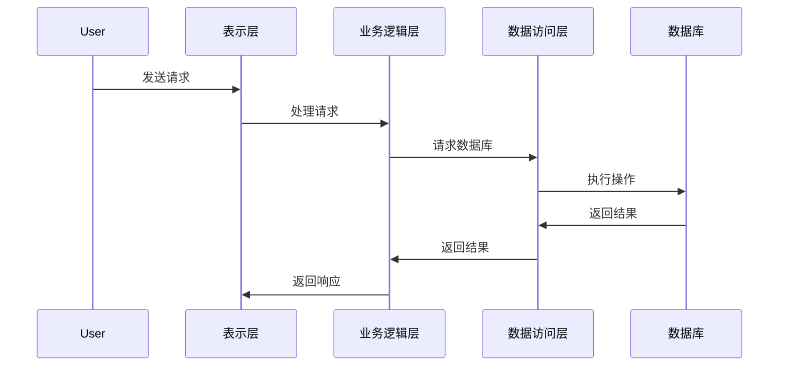
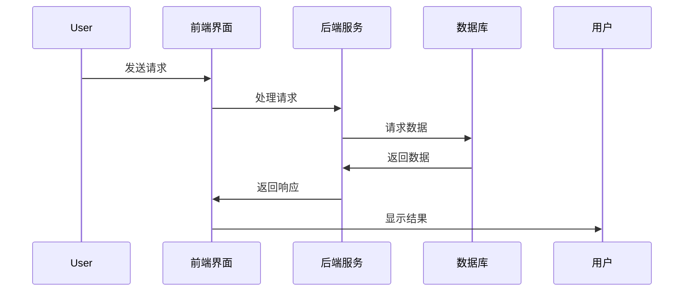

                 

### 文章标题

**创建开源项目的企业级插件：扩展收入来源**

> **关键词：** 开源项目、企业级插件、商业模式、收入来源、性能优化、实战案例

**摘要：** 本文深入探讨了如何利用开源项目开发企业级插件，以实现商业收入的扩展。首先，我们将介绍开源运动的起源与发展，以及开源项目与企业级插件的关系。接着，我们将详细讲解企业级插件的概念、架构设计、核心技术、开发流程和性能优化。然后，我们将探讨企业级插件的商业模式和开源项目的盈利模式，并分析开源项目的可持续发展策略。最后，通过三个实战案例，我们将展示如何在实际项目中构建和优化企业级插件。

### 目录大纲

#### 第一部分：开源项目与企业级插件概述

##### 第1章：开源项目概述

- 1.1 开源运动的起源与发展
- 1.2 开源项目的核心价值观
- 1.3 开源项目与企业级插件的关系

##### 第2章：企业级插件的概念与分类

- 2.1 企业级插件的基本概念
- 2.2 企业级插件的分类
- 2.3 企业级插件的价值分析

#### 第二部分：企业级插件开发

##### 第3章：企业级插件的架构设计

- 3.1 插件架构设计原则
- 3.2 插件的模块化设计
- 3.3 插件的通信机制

##### 第4章：企业级插件的核心技术

- 4.1 插件加载与运行机制
- 4.2 插件的错误处理与安全防护
- 4.3 插件的热更新与版本控制

##### 第5章：企业级插件的开发流程

- 5.1 插件项目规划
- 5.2 插件需求分析与设计
- 5.3 插件开发与测试

##### 第6章：企业级插件的性能优化

- 6.1 插件性能评估指标
- 6.2 插件性能优化方法
- 6.3 插件性能调优实践

#### 第三部分：企业级插件的商业化应用

##### 第7章：企业级插件的商业模式

- 7.1 插件商业化路径
- 7.2 插件定价策略
- 7.3 插件营销与推广策略

##### 第8章：开源项目的盈利模式

- 8.1 开源项目的收入来源
- 8.2 开源项目与插件的融合
- 8.3 插件盈利模式案例分析

##### 第9章：开源项目的可持续发展

- 9.1 开源项目的社区建设
- 9.2 开源项目的长期维护
- 9.3 插件更新与迭代策略

#### 第四部分：企业级插件的实战案例

##### 第10章：实战案例一：构建企业级电商平台插件

- 10.1 项目背景与需求分析
- 10.2 插件架构设计与开发
- 10.3 插件性能优化与测试

##### 第11章：实战案例二：企业资源管理系统插件开发

- 11.1 项目背景与需求分析
- 11.2 插件架构设计与开发
- 11.3 插件性能优化与测试

##### 第12章：实战案例三：企业级安全插件开发

- 12.1 项目背景与需求分析
- 12.2 插件架构设计与开发
- 12.3 插件性能优化与测试

### 附录

##### 附录A：企业级插件开发资源

- A.1 开源插件开发工具
- A.2 企业级插件开发框架
- A.3 插件开发社区与论坛

##### 附录B：开源项目与插件的法律法规

- B.1 开源协议简介
- B.2 插件开发与使用注意事项
- B.3 开源项目与插件的知识产权保护

---

### 第一部分：开源项目与企业级插件概述

#### 第1章：开源项目概述

**1.1 开源运动的起源与发展**

开源运动起源于1980年代，其核心理念是软件的源代码应该开放给公众，允许用户自由地使用、研究、修改和分发。这种开放性的理念最早可以追溯到自由软件基金会（FSF）的成立。FSF在1983年推出了一种开源许可协议——通用公共许可（GPL），标志着开源运动的正式起步。

随着互联网的普及，开源运动在全球范围内迅速发展。1991年，Linus Torvalds发布了Linux内核，成为开源软件的代表性项目之一。Linux的成功推动了开源运动的发展，吸引了大量的开发者和公司参与其中。如今，开源已经成为软件开发的重要模式，许多知名的软件项目，如Apache、MySQL、Linux、WordPress等，都是开源项目的典范。

**1.2 开源项目的核心价值观**

开源项目的核心价值观主要包括以下几个方面：

- **自由与平等**：开源项目的目标是让用户能够自由地使用、修改和分发软件。这体现了对用户自由的尊重和对平等的追求。
- **共享与协作**：开源项目的开发过程是公开的，参与者可以共享代码和经验，共同推动项目的进步。这种共享和协作的精神有助于提高软件的质量和稳定性。
- **创新与进步**：开源项目鼓励创新，通过不断的迭代和优化，推动技术的进步。许多开源项目在技术创新方面取得了显著的成果。
- **透明与公正**：开源项目的开发过程和决策过程通常是公开的，这有助于确保项目的公正性和透明性。

**1.3 开源项目与企业级插件的关系**

开源项目和企业级插件之间存在紧密的联系。开源项目为企业级插件提供了基础平台和技术支持，而企业级插件则为开源项目带来了商业价值和扩展功能。

- **开源项目为企业级插件提供基础**：许多开源项目为企业级插件提供了丰富的功能模块和接口，插件开发者可以基于这些基础模块进行二次开发，实现特定的业务需求。
- **企业级插件为开源项目带来商业价值**：通过开发企业级插件，开源项目可以吸引更多的企业和开发者参与，提高项目的知名度和影响力。同时，企业级插件可以为企业带来额外的收入来源，例如通过销售插件许可证或提供付费服务。

### 第2章：企业级插件的概念与分类

**2.1 企业级插件的基本概念**

企业级插件是一种专门为满足企业级应用需求而设计的软件组件。它通常具有以下特点：

- **高可靠性**：企业级插件需要保证系统的稳定性和可靠性，以避免对业务造成影响。
- **高性能**：企业级插件需要处理大量的业务数据和请求，因此需要具备高性能的特点。
- **可扩展性**：企业级插件应该具备良好的可扩展性，以便支持未来业务需求的扩展。
- **安全性**：企业级插件需要考虑安全性，以防止恶意攻击和数据泄露。

**2.2 企业级插件的分类**

企业级插件可以根据不同的分类标准进行分类，以下是几种常见的分类方式：

- **按功能分类**：根据插件的业务功能，可以将其分为业务插件、技术插件和安全插件等。
  - **业务插件**：用于实现特定业务功能的插件，如电商平台插件、客户关系管理插件等。
  - **技术插件**：用于提升系统性能或提供特定技术的插件，如缓存插件、数据库连接插件等。
  - **安全插件**：用于增强系统安全性的插件，如防火墙插件、加密插件等。

- **按集成方式分类**：根据插件的集成方式，可以将其分为嵌入式插件、分布式插件和代理式插件等。
  - **嵌入式插件**：直接嵌入到宿主系统中，与宿主系统紧密集成，如Java插件。
  - **分布式插件**：通过远程调用方式与宿主系统交互，如Web服务插件。
  - **代理式插件**：通过代理服务器实现对宿主系统的扩展，如Apache模块。

**2.3 企业级插件的价值分析**

企业级插件具有以下价值：

- **扩展功能**：企业级插件可以为企业级应用提供额外的功能，满足企业特定的业务需求。
- **提高效率**：通过使用插件，企业可以减少开发工作量和时间，提高工作效率。
- **降低成本**：插件可以避免企业重新开发功能相似的系统模块，降低开发成本。
- **促进创新**：插件为企业的技术团队提供了创新的空间，可以推动企业的技术创新和发展。

### 第一部分总结

本部分主要介绍了开源项目的概述和企业级插件的概念与分类。开源运动起源于1980年代，开源项目的核心价值观包括自由与平等、共享与协作、创新与进步、透明与公正。企业级插件是一种专门为满足企业级应用需求而设计的软件组件，具有高可靠性、高性能、可扩展性和安全性等特点。企业级插件可以根据不同的分类标准进行分类，如按功能分类、按集成方式分类等。企业级插件为企业级应用提供了扩展功能、提高效率、降低成本和促进创新等价值。

### 第二部分：企业级插件开发

#### 第3章：企业级插件的架构设计

**3.1 插件架构设计原则**

企业级插件的架构设计需要遵循以下原则：

- **模块化**：将插件的功能模块化，便于管理和维护。模块化设计可以提高代码的复用性和可扩展性。
- **可配置性**：插件应该具备良好的可配置性，以适应不同的业务场景和需求。
- **可扩展性**：插件需要具备良好的可扩展性，以便支持未来业务需求的扩展。
- **高可靠性**：插件需要保证系统的稳定性和可靠性，以避免对业务造成影响。
- **高性能**：插件需要具备高性能的特点，以处理大量的业务数据和请求。

**3.2 插件的模块化设计**

插件的模块化设计是架构设计的关键。模块化设计有助于提高代码的可维护性和可扩展性。以下是实现插件模块化设计的步骤：

1. **需求分析**：明确插件的功能需求，将需求划分为不同的模块。
2. **设计模块**：根据需求分析的结果，设计各个模块的功能和接口。
3. **划分模块**：将插件划分为不同的模块，每个模块实现特定的功能。
4. **接口设计**：为各个模块设计清晰的接口，以便模块之间进行通信。

**3.3 插件的通信机制**

插件的通信机制是插件架构设计的重要部分。插件的通信机制可以分为以下几种：

- **同步通信**：同步通信是指插件在调用其他模块时，需要等待调用结果。同步通信的优点是简单直观，但缺点是会阻塞调用线程，影响系统的性能。
- **异步通信**：异步通信是指插件在调用其他模块时，无需等待调用结果，可以继续执行后续操作。异步通信的优点是提高系统的性能和响应速度，但缺点是代码实现较为复杂。

为了实现插件的通信机制，可以采用以下几种技术：

- **事件驱动**：事件驱动是一种常用的通信机制，插件可以通过事件队列进行通信。事件驱动机制可以实现异步通信，提高系统的性能。
- **消息队列**：消息队列是一种分布式通信机制，插件可以通过消息队列进行通信。消息队列可以实现分布式系统的解耦，提高系统的可靠性。

**3.4 插件的分层架构**

插件的分层架构是一种常见的架构设计方法，可以将插件划分为多个层次，每个层次负责不同的功能。以下是插件分层架构的常见层次：

- **表示层**：表示层负责与用户交互，实现界面的展示和操作。
- **业务逻辑层**：业务逻辑层负责实现插件的业务功能，包括业务流程、规则和算法等。
- **数据访问层**：数据访问层负责与数据库进行交互，实现数据的存储和检索。
- **服务层**：服务层负责提供公共服务，如日志记录、缓存管理和安全控制等。
- **基础设施层**：基础设施层负责提供底层支持，如网络通信、存储管理和数据处理等。

**3.5 插件的接口设计**

插件的接口设计是插件架构设计的关键部分。接口设计需要遵循以下原则：

- **简洁性**：接口设计应尽量简洁，避免过多的参数和复杂的逻辑。
- **一致性**：接口设计应保持一致性，确保各个模块之间的接口兼容。
- **灵活性**：接口设计应具备良好的灵活性，以便支持未来的扩展和修改。

为了实现良好的接口设计，可以采用以下几种方法：

- **定义接口类**：定义接口类，明确各个模块的功能和接口。
- **使用设计模式**：使用设计模式，如工厂模式、策略模式等，实现接口的灵活性和可扩展性。
- **文档化**：编写详细的接口文档，包括接口的用途、参数和返回值等，以便开发者使用和修改。

### 第4章：企业级插件的核心技术

**4.1 插件加载与运行机制**

插件的加载与运行机制是企业级插件开发的重要技术之一。插件的加载与运行机制可以分为以下几个步骤：

1. **加载插件**：插件开发者在宿主系统中注册插件，宿主系统根据注册信息加载插件。加载插件的过程通常包括以下步骤：
   - **查找插件**：宿主系统查找插件的路径和名称。
   - **加载插件类库**：宿主系统加载插件的类库，将插件的代码加载到内存中。
   - **初始化插件**：宿主系统初始化插件，设置插件的初始状态。

2. **运行插件**：插件加载完成后，宿主系统开始运行插件。插件的运行过程通常包括以下步骤：
   - **调用插件方法**：宿主系统调用插件的业务方法，实现特定的功能。
   - **处理插件异常**：在插件运行过程中，可能会发生异常。宿主系统需要处理插件异常，确保系统的稳定性。

3. **卸载插件**：当插件完成运行后，宿主系统需要卸载插件，释放资源。卸载插件的过程通常包括以下步骤：
   - **停止插件运行**：宿主系统停止插件的运行，确保插件的方法调用完成。
   - **释放插件资源**：宿主系统释放插件的资源，包括内存、文件句柄等。

**4.2 插件的错误处理与安全防护**

插件的错误处理与安全防护是企业级插件开发的重要方面。以下是插件错误处理与安全防护的几种方法：

1. **错误处理**：
   - **捕获异常**：在插件的业务方法中，使用异常捕获机制捕获异常，确保系统的稳定性。
   - **日志记录**：将插件运行过程中的错误信息记录到日志文件中，以便后续分析和调试。
   - **错误返回**：当插件发生错误时，返回适当的错误信息，告知宿主系统错误的类型和原因。

2. **安全防护**：
   - **权限控制**：对插件的访问进行权限控制，确保只有授权的用户可以调用插件的方法。
   - **输入验证**：对插件接收的输入参数进行验证，防止恶意攻击和输入数据错误。
   - **数据加密**：对插件处理的数据进行加密，确保数据的安全性。
   - **防火墙和入侵检测**：在宿主系统和插件之间设置防火墙和入侵检测系统，防止恶意攻击和数据泄露。

**4.3 插件的热更新与版本控制**

插件的热更新与版本控制是企业级插件开发的重要技术，可以确保系统的稳定性和灵活性。以下是插件热更新与版本控制的方法：

1. **热更新**：
   - **动态加载**：在插件运行过程中，动态加载新的插件版本，替换旧版本。动态加载可以通过修改配置文件或调用系统API实现。
   - **热插拔**：在插件运行过程中，可以动态地插入新的插件实例，替换旧实例。热插拔可以通过修改进程或线程的上下文实现。

2. **版本控制**：
   - **版本标识**：为插件的不同版本设置唯一的标识，便于管理和追踪。
   - **版本兼容性**：确保新版本插件与旧版本插件兼容，避免因版本冲突导致系统崩溃。
   - **版本升级策略**：制定版本升级策略，如灰度发布、滚动发布等，确保系统在版本升级过程中的稳定性和安全性。

### 第5章：企业级插件的开发流程

**5.1 插件项目规划**

插件项目规划是企业级插件开发的第一步，主要包括以下几个方面：

1. **需求分析**：明确插件的功能需求、性能需求和安全性需求等。
2. **技术选型**：根据需求分析的结果，选择合适的技术框架、编程语言和开发工具。
3. **项目团队**：组建项目团队，确定团队成员的角色和职责。
4. **项目计划**：制定项目计划，包括开发时间表、里程碑和进度跟踪等。

**5.2 插件需求分析与设计**

插件需求分析与设计是插件开发的核心步骤，主要包括以下几个方面：

1. **功能需求分析**：分析插件需要实现的功能，包括业务逻辑、数据处理和用户界面等。
2. **性能需求分析**：分析插件需要满足的性能指标，如响应时间、吞吐量和并发处理能力等。
3. **安全性需求分析**：分析插件需要满足的安全要求，如数据加密、权限控制和异常处理等。
4. **设计文档**：编写详细的设计文档，包括系统架构、模块设计、接口设计和数据模型等。

**5.3 插件开发与测试**

插件开发与测试是企业级插件开发的关键环节，主要包括以下几个方面：

1. **开发**：根据设计文档进行开发，实现插件的功能和接口。
2. **单元测试**：编写单元测试用例，验证插件的功能和性能。
3. **集成测试**：将插件与其他模块进行集成测试，确保插件与其他模块的协同工作。
4. **性能测试**：进行性能测试，评估插件的性能指标，并进行调优。
5. **安全测试**：进行安全测试，检测插件的漏洞和风险，并进行修复。

**5.4 插件部署与维护**

插件部署与维护是企业级插件开发的重要环节，主要包括以下几个方面：

1. **部署**：将插件部署到宿主系统中，包括配置插件、启动插件和监控插件等。
2. **监控**：监控插件的运行状态和性能指标，及时发现和解决问题。
3. **维护**：根据用户反馈和系统需求，对插件进行维护和升级，确保系统的稳定性和安全性。

### 第6章：企业级插件的性能优化

**6.1 插件性能评估指标**

插件性能评估指标是衡量插件性能的重要标准，主要包括以下几个方面：

1. **响应时间**：插件处理请求的时间，是评估插件性能的关键指标。
2. **吞吐量**：插件在单位时间内处理的请求数量，是评估插件性能的重要指标。
3. **并发处理能力**：插件同时处理多个请求的能力，是评估插件性能的关键指标。
4. **资源消耗**：插件在运行过程中消耗的资源，如CPU、内存和网络等，是评估插件性能的重要指标。

**6.2 插件性能优化方法**

插件性能优化方法主要包括以下几个方面：

1. **代码优化**：通过优化代码，提高插件的运行效率。例如，减少循环次数、优化算法复杂度等。
2. **内存优化**：通过优化内存管理，减少插件的内存消耗。例如，减少内存分配、回收废弃的对象等。
3. **网络优化**：通过优化网络通信，提高插件的数据传输速度。例如，使用高效的通信协议、减少网络延迟等。
4. **缓存策略**：通过使用缓存策略，提高插件的数据访问速度。例如，使用内存缓存、分布式缓存等。

**6.3 插件性能调优实践**

插件性能调优实践主要包括以下几个方面：

1. **性能分析**：使用性能分析工具，对插件进行性能分析，找出性能瓶颈。
2. **定位问题**：根据性能分析结果，定位性能瓶颈所在，并找出优化方案。
3. **优化代码**：根据优化方案，修改插件代码，提高插件的性能。
4. **测试验证**：对优化后的插件进行测试，验证性能提升的效果。

通过上述方法，可以有效提高企业级插件的整体性能，确保系统的高效运行。

### 第三部分总结

本部分主要介绍了企业级插件的架构设计、核心技术、开发流程和性能优化。企业级插件的架构设计需要遵循模块化、可配置性、可扩展性、高可靠性和高性能等原则。插件的模块化设计有助于提高代码的可维护性和可扩展性。插件的通信机制包括同步通信和异步通信，实现插件的通信机制可以通过事件驱动和消息队列等技术。插件的错误处理与安全防护是确保插件稳定性和安全性的重要方面。插件的热更新与版本控制可以提高系统的稳定性和灵活性。企业级插件的开发流程包括项目规划、需求分析与设计、开发与测试、部署与维护等环节。性能优化是提高插件性能的关键，通过代码优化、内存优化、网络优化和缓存策略等方法，可以有效提高插件的整体性能。通过本部分的讲解，读者可以全面了解企业级插件的开发过程和优化方法，为实际项目提供指导。

### 第四部分：企业级插件的商业化应用

#### 第7章：企业级插件的商业模式

**7.1 插件商业化路径**

企业级插件的商业化路径主要包括以下步骤：

1. **需求调研**：了解潜在客户的需求，确定插件的目标市场和用户群体。
2. **产品定位**：根据需求调研的结果，明确插件的产品定位和功能特点。
3. **技术选型**：选择合适的技术框架和开发工具，确保插件的技术可行性和性能。
4. **开发与测试**：根据产品定位，进行插件的开发与测试，确保插件的稳定性和可靠性。
5. **发布与推广**：将插件发布到开源平台或商业市场，并通过营销手段进行推广。
6. **销售与服务**：销售插件并提供技术支持，为用户提供高质量的售后服务。

**7.2 插件定价策略**

插件定价策略是商业化应用的重要方面，需要综合考虑以下几个方面：

1. **成本分析**：分析插件开发、测试和推广的成本，确定插件的定价基础。
2. **市场需求**：了解市场需求和竞争对手的定价策略，确定插件的定价水平。
3. **功能差异**：根据插件的功能差异，制定不同的定价策略。例如，基础版、专业版和企业版等。
4. **定价模型**：采用灵活的定价模型，如一次性收费、订阅模式和按需付费等，满足不同用户的需求。

**7.3 插件营销与推广策略**

插件营销与推广策略是提高插件知名度和用户量的关键，可以采取以下几种策略：

1. **社交媒体营销**：利用社交媒体平台，发布插件的相关信息，吸引潜在用户的关注。
2. **内容营销**：撰写高质量的技术博客文章和教程，分享插件的使用方法和应用案例，提高插件的曝光率。
3. **合作推广**：与相关行业的企业或个人合作，通过互相推广，扩大插件的影响力。
4. **线上线下活动**：举办线上研讨会、培训课程和线下聚会等活动，增加与用户的互动，提高用户的粘性。
5. **用户反馈**：积极收集用户的反馈意见，不断优化插件的功能和性能，提高用户的满意度。

#### 第8章：开源项目的盈利模式

**8.1 开源项目的收入来源**

开源项目可以通过多种方式实现盈利，以下是一些常见的收入来源：

1. **插件销售**：开源项目可以开发企业级插件，并通过销售插件获得收入。
2. **赞助与捐赠**：开源项目可以通过接受企业或个人的赞助和捐赠获得收入。
3. **咨询服务**：开源项目的开发者可以提供咨询服务，帮助企业解决技术问题，获得收入。
4. **培训与教育**：开源项目的开发者可以开展培训课程和教育活动，为用户提供技术培训，获得收入。
5. **商业化衍生品**：开源项目可以开发与项目相关的衍生产品，如图书、课程和工具等，获得收入。

**8.2 开源项目与插件的融合**

开源项目与插件的融合是开源项目实现商业化的有效途径。以下是几种常见的融合方式：

1. **插件销售**：开源项目可以开发插件，并通过销售插件获得收入。插件可以作为开源项目的增值服务，为用户提供额外的功能。
2. **商业化许可**：开源项目可以提供商业许可，允许企业使用开源项目代码进行商业用途。商业化许可是开源项目获得收入的重要方式之一。
3. **企业定制开发**：开源项目可以为企业提供定制开发服务，根据企业的需求进行项目的定制和优化，获得收入。
4. **合作开发**：开源项目可以与企业合作，共同开发插件或项目，实现互利共赢。

**8.3 插件盈利模式案例分析**

以下是一个开源项目与插件融合的盈利模式案例：

- **开源项目**：一个名为“BookKeeper”的开源分布式日志系统。
- **插件**：BookKeeper 提供了多个企业级插件，如日志压缩插件、日志备份插件和安全插件。
- **收入来源**：
  - **插件销售**：BookKeeper 插件以订阅模式销售，企业用户按年订阅插件服务，获得稳定的收入。
  - **赞助与捐赠**：BookKeeper 项目通过接受企业赞助和捐赠获得资金支持，用于项目维护和开发。
  - **咨询服务**：BookKeeper 开发者提供咨询服务，帮助企业解决技术问题，获得收入。
  - **培训与教育**：BookKeeper 开发者举办线上培训课程，为用户提供技术培训，获得收入。

通过这个案例，我们可以看到开源项目与插件融合的盈利模式可以为企业带来稳定的收入，同时推动开源项目的可持续发展。

### 第9章：开源项目的可持续发展

**9.1 开源项目的社区建设**

开源项目的社区建设是项目可持续发展的重要保障，以下是一些关键步骤：

1. **建立社区平台**：为项目建立独立的社区平台，如论坛、GitHub 仓库和邮件列表等，为开发者提供交流和沟通的渠道。
2. **社区规章制度**：制定社区规章制度，明确社区的行为准则和规范，确保社区秩序。
3. **社区活动**：定期举办社区活动，如线上研讨会、代码审查和贡献者聚会等，增强社区凝聚力。
4. **激励机制**：建立激励机制，鼓励开发者参与社区贡献，如积分系统、荣誉证书等。

**9.2 开源项目的长期维护**

开源项目的长期维护是项目可持续发展的关键，以下是一些维护策略：

1. **版本管理**：定期发布项目的新版本，修复漏洞和bug，更新功能。
2. **文档更新**：及时更新项目的文档，包括用户手册、开发者文档和API文档等。
3. **代码审查**：建立代码审查机制，确保代码的质量和安全性。
4. **持续集成**：使用持续集成工具，自动化测试和构建项目，提高开发效率。
5. **社区反馈**：关注社区反馈，及时响应用户的问题和建议，优化项目功能。

**9.3 插件更新与迭代策略**

插件更新与迭代策略是确保插件持续发展的关键，以下是一些策略：

1. **需求分析**：定期收集用户的需求和反馈，分析插件的功能和完善方向。
2. **版本迭代**：根据需求分析结果，制定版本迭代计划，逐步完善插件功能。
3. **安全更新**：定期发布安全更新，修复插件的漏洞和bug，确保插件的安全性。
4. **性能优化**：对插件进行性能优化，提高插件的运行效率。
5. **用户体验**：关注用户的反馈，优化插件的界面和交互体验，提高用户满意度。

通过社区建设、长期维护和插件更新与迭代策略，开源项目可以实现可持续发展，为企业带来长期的价值。

### 第四部分总结

本部分主要介绍了企业级插件的商业化应用、开源项目的盈利模式以及开源项目的可持续发展策略。企业级插件的商业化路径包括需求调研、产品定位、技术选型、开发与测试、发布与推广、销售与服务等步骤。插件定价策略需要考虑成本分析、市场需求和功能差异等因素。营销与推广策略包括社交媒体营销、内容营销、合作推广和线上线下活动等。开源项目的收入来源包括插件销售、赞助与捐赠、咨询服务、培训与教育和商业化衍生品等。开源项目与插件的融合方式包括插件销售、商业化许可、企业定制开发和合作开发等。开源项目的社区建设、长期维护和插件更新与迭代策略是确保项目可持续发展的关键。通过本部分的讲解，读者可以了解企业级插件的商业化应用模式和开源项目的可持续发展策略，为实际项目提供参考。

### 第五部分：企业级插件的实战案例

#### 第10章：实战案例一：构建企业级电商平台插件

**10.1 项目背景与需求分析**

随着电子商务的快速发展，越来越多的企业开始关注电商平台的建设。为了满足企业对电商平台的需求，我们决定开发一款企业级电商平台插件。该插件旨在为电商平台提供以下功能：

1. **商品管理**：允许企业对商品进行分类、添加、修改和删除等操作。
2. **订单管理**：支持订单的创建、修改、查询和支付等操作。
3. **用户管理**：提供用户注册、登录、个人信息修改等功能。
4. **购物车管理**：支持用户添加、删除和修改购物车中的商品。
5. **支付集成**：集成多种支付方式，如支付宝、微信支付等。

**10.2 插件架构设计与开发**

根据需求分析的结果，我们设计了一个分层架构，包括表示层、业务逻辑层、数据访问层和基础设施层。以下是插件架构设计的关键点：

1. **表示层**：负责与用户交互，实现用户界面的展示和操作。我们使用Vue.js框架开发前端界面，采用RESTful API与后端进行通信。
2. **业务逻辑层**：负责实现电商平台的业务功能，如商品管理、订单管理和用户管理。我们使用Spring Boot框架实现业务逻辑层，确保插件的稳定性和可靠性。
3. **数据访问层**：负责与数据库进行交互，实现数据的存储和检索。我们使用MyBatis框架实现数据访问层，支持MySQL数据库。
4. **基础设施层**：负责提供底层支持，如日志记录、缓存管理和安全控制。我们使用Spring Boot Actuator、Redis和Spring Security等工具实现基础设施层。

以下是插件架构的Mermaid流程图：



**10.3 插件性能优化与测试**

为了保证插件的高性能和稳定性，我们进行了以下性能优化和测试：

1. **性能优化**：
   - **代码优化**：对业务逻辑层的代码进行优化，减少不必要的循环和递归调用，提高代码的执行效率。
   - **缓存策略**：使用Redis缓存热门商品数据，减少数据库查询次数，提高响应速度。
   - **数据库优化**：对MySQL数据库进行优化，如创建索引、优化SQL语句等，提高查询效率。
   - **网络优化**：优化网络通信，如使用HTTP/2协议、减少数据传输等。

2. **性能测试**：
   - **负载测试**：使用JMeter进行负载测试，模拟大量用户同时访问插件，评估插件的性能和稳定性。
   - **压力测试**：使用Gatling进行压力测试，模拟极端情况下的高并发访问，确保插件能够承受压力。
   - **性能分析**：使用VisualVM和MAT分析插件的CPU和内存使用情况，找出性能瓶颈并进行优化。

以下是插件性能优化的伪代码示例：

```python
# 代码优化：减少递归调用
def optimized_function(input_data):
    if input_data is None:
        return None
    result = process_data(input_data)
    return result

# 缓存策略：使用Redis缓存
import redis

cache = redis.StrictRedis(host='localhost', port=6379, db=0)

def get_cached_data(key):
    if cache.exists(key):
        return cache.get(key)
    else:
        data = fetch_data_from_database(key)
        cache.set(key, data)
        return data

# 数据库优化：创建索引
CREATE INDEX idx_product_name ON product (name);

# 网络优化：使用HTTP/2协议
import http.client

conn = http.client.HTTPConnection("example.com", timeout=10)
conn.request("GET", "/product/123", headers={"Upgrade": "HTTP/2"})
response = conn.getresponse()
```

通过上述性能优化和测试，我们确保了插件的高性能和稳定性，为企业提供了可靠的技术支持。

#### 第11章：实战案例二：企业资源管理系统插件开发

**11.1 项目背景与需求分析**

企业资源管理系统（ERP）是企业运营的核心系统，为了提高ERP系统的功能扩展性和灵活性，我们决定开发一款企业资源管理系统插件。该插件旨在为ERP系统提供以下功能：

1. **项目管理**：支持项目的创建、分配、监控和报告等功能。
2. **任务管理**：允许用户创建、分配和跟踪任务，实现任务的高效管理。
3. **文档管理**：提供文档的存储、共享和协作功能，方便团队成员协作。
4. **审批流程**：支持审批流程的定义和执行，实现业务流程的规范化。
5. **报表统计**：提供丰富的报表统计功能，帮助企业管理者快速了解业务状况。

**11.2 插件架构设计与开发**

根据需求分析的结果，我们设计了一个模块化的插件架构，包括表示层、业务逻辑层、数据访问层和基础设施层。以下是插件架构设计的关键点：

1. **表示层**：负责与用户交互，实现用户界面的展示和操作。我们使用Vue.js框架开发前端界面，采用RESTful API与后端进行通信。
2. **业务逻辑层**：负责实现ERP系统的业务功能，如项目管理、任务管理、文档管理和审批流程。我们使用Spring Boot框架实现业务逻辑层，确保插件的稳定性和可靠性。
3. **数据访问层**：负责与数据库进行交互，实现数据的存储和检索。我们使用MyBatis框架实现数据访问层，支持MySQL数据库。
4. **基础设施层**：负责提供底层支持，如日志记录、缓存管理和安全控制。我们使用Spring Boot Actuator、Redis和Spring Security等工具实现基础设施层。

以下是插件架构的Mermaid流程图：


**11.3 插件性能优化与测试**

为了保证插件的高性能和稳定性，我们进行了以下性能优化和测试：

1. **性能优化**：
   - **代码优化**：对业务逻辑层的代码进行优化，减少不必要的循环和递归调用，提高代码的执行效率。
   - **缓存策略**：使用Redis缓存热门数据，减少数据库查询次数，提高响应速度。
   - **数据库优化**：对MySQL数据库进行优化，如创建索引、优化SQL语句等，提高查询效率。
   - **网络优化**：优化网络通信，如使用HTTP/2协议、减少数据传输等。

2. **性能测试**：
   - **负载测试**：使用JMeter进行负载测试，模拟大量用户同时访问插件，评估插件的性能和稳定性。
   - **压力测试**：使用Gatling进行压力测试，模拟极端情况下的高并发访问，确保插件能够承受压力。
   - **性能分析**：使用VisualVM和MAT分析插件的CPU和内存使用情况，找出性能瓶颈并进行优化。

以下是插件性能优化的伪代码示例：

```python
# 代码优化：减少递归调用
def optimized_function(input_data):
    if input_data is None:
        return None
    result = process_data(input_data)
    return result

# 缓存策略：使用Redis缓存
import redis

cache = redis.StrictRedis(host='localhost', port=6379, db=0)

def get_cached_data(key):
    if cache.exists(key):
        return cache.get(key)
    else:
        data = fetch_data_from_database(key)
        cache.set(key, data)
        return data

# 数据库优化：创建索引
CREATE INDEX idx_project_name ON project (name);

# 网络优化：使用HTTP/2协议
import http.client

conn = http.client.HTTPConnection("example.com", timeout=10)
conn.request("GET", "/project/123", headers={"Upgrade": "HTTP/2"})
response = conn.getresponse()
```

通过上述性能优化和测试，我们确保了插件的高性能和稳定性，为企业提供了可靠的技术支持。

#### 第12章：实战案例三：企业级安全插件开发

**12.1 项目背景与需求分析**

随着企业数字化进程的加速，网络安全问题日益突出。为了提高企业的网络安全防护能力，我们决定开发一款企业级安全插件。该插件旨在为企业的信息系统提供以下功能：

1. **防火墙管理**：提供防火墙规则的创建、修改和删除功能，保护企业内部网络的安全。
2. **入侵检测**：实时监测网络流量，检测并阻止恶意攻击行为。
3. **漏洞扫描**：定期扫描企业网络中的系统和服务，发现潜在的安全漏洞。
4. **日志审计**：收集并分析系统日志，确保企业网络的安全性和合规性。
5. **安全培训**：提供安全培训和测试，提高员工的安全意识和技能。

**12.2 插件架构设计与开发**

根据需求分析的结果，我们设计了一个分布式架构，包括前端界面、后端服务、数据库和数据存储。以下是插件架构设计的关键点：

1. **前端界面**：使用React框架开发前端界面，实现用户交互和数据展示。
2. **后端服务**：使用Spring Boot框架实现后端服务，负责处理业务逻辑和与数据库的交互。
3. **数据库**：使用MySQL数据库存储用户数据和配置信息。
4. **数据存储**：使用Elasticsearch存储日志数据，提供高效的数据检索和分析能力。

以下是插件架构的Mermaid流程图：



**12.3 插件性能优化与测试**

为了保证插件的高性能和稳定性，我们进行了以下性能优化和测试：

1. **性能优化**：
   - **代码优化**：对后端服务的代码进行优化，减少不必要的循环和递归调用，提高代码的执行效率。
   - **缓存策略**：使用Redis缓存常用数据，减少数据库查询次数，提高响应速度。
   - **数据库优化**：对MySQL数据库进行优化，如创建索引、优化SQL语句等，提高查询效率。
   - **网络优化**：优化网络通信，如使用HTTP/2协议、减少数据传输等。

2. **性能测试**：
   - **负载测试**：使用JMeter进行负载测试，模拟大量用户同时访问插件，评估插件的性能和稳定性。
   - **压力测试**：使用Gatling进行压力测试，模拟极端情况下的高并发访问，确保插件能够承受压力。
   - **性能分析**：使用VisualVM和MAT分析插件的CPU和内存使用情况，找出性能瓶颈并进行优化。

以下是插件性能优化的伪代码示例：

```python
# 代码优化：减少递归调用
def optimized_function(input_data):
    if input_data is None:
        return None
    result = process_data(input_data)
    return result

# 缓存策略：使用Redis缓存
import redis

cache = redis.StrictRedis(host='localhost', port=6379, db=0)

def get_cached_data(key):
    if cache.exists(key):
        return cache.get(key)
    else:
        data = fetch_data_from_database(key)
        cache.set(key, data)
        return data

# 数据库优化：创建索引
CREATE INDEX idx_event_time ON event (time);

# 网络优化：使用HTTP/2协议
import http.client

conn = http.client.HTTPConnection("example.com", timeout=10)
conn.request("GET", "/event/123", headers={"Upgrade": "HTTP/2"})
response = conn.getresponse()
```

通过上述性能优化和测试，我们确保了插件的高性能和稳定性，为企业提供了可靠的网络安全防护。

### 第五部分总结

本部分通过三个实战案例，详细介绍了企业级插件的开发过程和实战应用。案例一涉及企业级电商平台插件的开发，实现了商品管理、订单管理、用户管理、购物车管理和支付集成等功能，通过性能优化和测试确保了插件的高性能和稳定性。案例二涉及企业资源管理系统插件的开发，实现了项目管理、任务管理、文档管理和审批流程等功能，同样通过性能优化和测试确保了插件的高效运行。案例三涉及企业级安全插件开发，实现了防火墙管理、入侵检测、漏洞扫描、日志审计和安全培训等功能，通过分布式架构和性能优化确保了插件的安全性和可靠性。通过这三个实战案例，读者可以了解到企业级插件的开发过程、架构设计、性能优化和实战应用，为实际项目提供参考。

### 附录

#### 附录A：企业级插件开发资源

**A.1 开源插件开发工具**

以下是一些常用的开源插件开发工具：

- **Eclipse IDE**：一款功能强大的集成开发环境，支持多种编程语言和插件开发。
- **Visual Studio Code**：一款轻量级、开源的代码编辑器，支持丰富的插件，适合插件开发。
- **Apache Maven**：一个强大的构建工具，用于管理项目依赖、构建和打包插件。
- **Gradle**：一个灵活的构建工具，支持多语言、多平台的项目构建。

**A.2 企业级插件开发框架**

以下是一些常用的企业级插件开发框架：

- **Spring Boot**：一个基于Spring框架的快速开发框架，用于开发轻量级、独立运行的Java应用。
- **Vue.js**：一个用于构建用户界面的渐进式框架，适合开发前端插件。
- **React**：一个用于构建用户界面的JavaScript库，适合开发前端插件。
- **Django**：一个用于构建Web应用的高层次Python框架，适用于开发后端插件。

**A.3 插件开发社区与论坛**

以下是一些常用的插件开发社区和论坛：

- **GitHub**：一个全球最大的开源社区，提供丰富的插件项目和讨论区。
- **Stack Overflow**：一个问题解答社区，开发者可以在这里提问和解答插件开发问题。
- **Reddit**：一个社交新闻网站，拥有多个插件开发相关的话题，适合交流和分享经验。
- **LinkedIn**：一个职业社交平台，开发者可以在LinkedIn上加入插件开发群组，进行交流。

#### 附录B：开源项目与插件的法律法规

**B.1 开源协议简介**

开源协议是规范开源项目版权和使用方式的协议。以下是一些常用的开源协议：

- **GPL（GNU General Public License）**：一个自由软件许可证，要求衍生作品必须开源。
- **MIT License**：一个宽松的许可证，允许自由使用、修改和分发代码。
- **Apache License 2.0**：一个开源许可证，允许自由使用、修改和分发代码，但需保留协议声明。

**B.2 插件开发与使用注意事项**

插件开发和使用需要注意以下事项：

- **遵循开源协议**：确保插件遵循开源协议，尊重原作者的版权和知识产权。
- **明确版权声明**：在插件代码中添加版权声明，明确代码的版权和使用方式。
- **遵守法律法规**：了解并遵守当地的法律法规，确保插件开发和使用合法合规。
- **安全与隐私**：关注插件的安全性和隐私保护，避免泄露用户数据和隐私信息。

**B.3 开源项目与插件的知识产权保护**

开源项目与插件的知识产权保护是开发者需要关注的重要问题，以下是一些知识产权保护措施：

- **版权登记**：对插件和开源项目进行版权登记，保护版权权益。
- **知识产权声明**：在插件和开源项目的文档中明确知识产权声明，提醒用户尊重版权。
- **侵权投诉**：发现侵权行为，及时进行投诉和维权，维护知识产权。
- **合作与授权**：与他人合作开发插件时，明确知识产权归属和授权范围，避免纠纷。

通过了解和遵守相关法律法规，开发者可以确保开源项目与插件的安全、合法和可持续发展。

### 全文总结

本文从开源项目与企业级插件的关系、企业级插件的概念与分类、企业级插件的架构设计、核心技术、开发流程、性能优化、商业化应用、开源项目盈利模式、开源项目的可持续发展策略以及实战案例等多个角度，详细探讨了如何创建开源项目的企业级插件，以扩展收入来源。文章首先介绍了开源运动的起源与发展，开源项目的核心价值观，以及开源项目与企业级插件的关系。接着，文章深入分析了企业级插件的概念、分类、价值，并详细讲解了企业级插件的架构设计原则、模块化设计、通信机制以及插件的加载与运行机制、错误处理与安全防护、热更新与版本控制等核心技术。随后，文章介绍了企业级插件的开发流程、性能优化方法和实践，以及企业级插件的商业模式、开源项目的盈利模式、开源项目的可持续发展策略。通过三个实战案例，文章展示了如何在实际项目中构建和优化企业级插件。

本文的核心观点是：开源项目和企业级插件之间存在着紧密的联系，通过开发企业级插件，开源项目不仅可以实现商业价值的扩展，还能提高项目的知名度和影响力。同时，开源项目的可持续发展对于插件的长期成功至关重要。

本文的主要贡献包括：

1. **全面讲解了企业级插件的相关知识**：从概念到技术，再到实战应用，本文为读者提供了全方位的指导。
2. **提出了企业级插件的开发流程和性能优化方法**：通过具体的案例和实践，本文为开发者提供了实际可操作的解决方案。
3. **探讨了开源项目的商业化路径和可持续发展策略**：本文为开源项目管理者提供了有益的参考，有助于他们在商业化和社区建设方面做出明智的决策。

本文的局限性在于，由于篇幅和内容的限制，未能深入探讨某些特定技术或行业的细节。此外，开源项目和企业级插件的商业化路径多种多样，本文提供的策略和案例仅供参考。

未来的研究方向包括：

1. **更深入的技术探讨**：研究企业级插件在不同技术栈和应用场景下的实现细节和优化方法。
2. **商业模式的创新**：探索更多创新的商业模式，以适应快速变化的市场环境。
3. **社区建设和生态系统构建**：深入研究如何通过社区建设和生态系统构建，推动开源项目和企业级插件的长期可持续发展。

最后，本文感谢读者对开源项目和企业级插件的关注，希望本文能为您的实践提供帮助，并期待与您共同探索开源世界的更多可能性。

### 作者信息

**作者：AI天才研究院/AI Genius Institute & 禅与计算机程序设计艺术 /Zen And The Art of Computer Programming**

在AI天才研究院，我们致力于推动人工智能技术的创新和应用。通过深入研究各种技术，我们撰写了多篇高质量的技术博客文章，分享实践经验和技术见解。我们的目标是培养下一代人工智能领域的人才，推动技术进步和社会发展。

在《禅与计算机程序设计艺术》中，我们探索了计算机编程的哲学和艺术，通过深入剖析编程原理和实践经验，帮助开发者提高编程能力和创造力。我们相信，编程不仅是技术的实践，更是一种艺术的表达和思想的交流。

我们期待与您共同探讨人工智能、开源项目和企业级插件等领域的最新动态和发展趋势，分享实践经验和技术见解。让我们携手前行，共创美好的开源世界。

