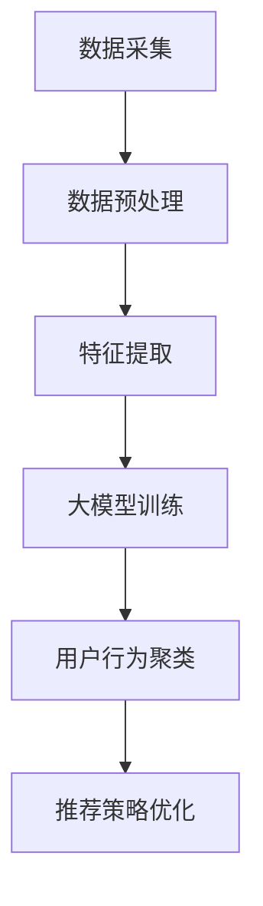

                 

# 《利用大模型进行推荐场景的用户行为聚类分析》

> **关键词：** 大模型、用户行为、聚类分析、推荐系统、深度学习

> **摘要：** 本文章旨在探讨如何利用大模型进行推荐场景中的用户行为聚类分析。首先，我们将介绍大模型技术基础和用户行为概述，然后深入探讨大模型核心算法原理及其在用户行为聚类分析中的应用，接着阐述大模型在推荐系统中的应用场景和实现方法，最后通过实际案例进行大模型用户行为聚类的具体操作，并对未来的发展方向进行展望。

## 第一部分：大模型与用户行为聚类分析基础

### 第1章：大模型技术基础与用户行为概述

#### 1.1 大模型技术概述

**1.1.1 大模型的定义与特点**

大模型，通常指的是具有巨大参数量和计算能力的人工神经网络模型。它们通过学习海量数据，能够捕捉复杂的模式和规律，从而在多个领域取得卓越的表现。

- **参数量巨大**：大模型的参数数量通常在数十亿到数万亿级别。
- **计算能力强大**：大模型需要强大的计算资源，例如GPU集群、TPU等。
- **自我优化能力**：大模型能够通过学习不断优化自身结构，从而提高性能。

**1.1.2 大模型的基本构成与工作机制**

大模型通常由以下几个部分构成：

- **输入层**：接收外部输入数据。
- **隐藏层**：进行复杂的计算和特征提取。
- **输出层**：产生预测结果。

大模型的工作机制是通过前向传播（forward propagation）和反向传播（backward propagation）来实现的。前向传播是将输入数据传递到隐藏层和输出层，通过神经元的激活函数进行计算；反向传播则是根据预测误差，调整模型参数，以达到更好的预测效果。

**1.1.3 大模型在数据科学领域的重要性**

大模型在数据科学领域具有广泛的应用，如自然语言处理、计算机视觉、推荐系统等。其强大的学习和预测能力，使得大模型成为解决复杂问题的重要工具。

#### 1.2 用户行为数据采集与处理

**1.2.1 用户行为数据的种类与来源**

用户行为数据包括用户在系统中的各种操作，如点击、浏览、搜索、购买等。这些数据可以从日志文件、数据库、API接口等途径获取。

**1.2.2 用户行为数据的质量评估**

用户行为数据的质量直接影响到聚类分析的效果。质量评估主要包括数据的完整性、一致性、准确性和时效性。

**1.2.3 用户行为数据的预处理方法**

用户行为数据预处理包括数据清洗、数据整合、数据转换等步骤。数据清洗主要去除重复、错误和缺失的数据；数据整合则是将不同来源的数据进行合并；数据转换则是将数据格式和类型进行统一，以便后续分析。

#### 1.3 用户行为聚类分析概述

**1.3.1 用户行为聚类分析的目的与应用**

用户行为聚类分析的目的是将具有相似行为的用户划分为同一群体，从而为推荐系统提供用户群体特征，提高推荐效果。

用户行为聚类分析在推荐系统、市场细分、用户画像等领域有广泛应用。

**1.3.2 用户行为聚类的常见方法**

用户行为聚类分析的方法包括K-means、层次聚类、密度聚类等。

- **K-means**：基于距离度量的聚类方法，将用户划分为K个簇。
- **层次聚类**：自底向上或自顶向下构建聚类层次结构。
- **密度聚类**：基于密度分布的聚类方法，适用于高维数据。

**1.3.3 用户行为聚类分析的评价指标**

用户行为聚类分析的评价指标主要包括聚类系数、轮廓系数、内聚性等。这些指标用于评估聚类结果的质量。

### 第2章：大模型核心算法原理与聚类分析应用

#### 2.1 深度学习算法原理

**2.1.1 神经网络基础**

神经网络是深度学习的基础。它由大量神经元组成，通过学习数据来模拟人类大脑的神经网络结构。

**2.1.2 深度学习优化算法**

深度学习的优化算法主要包括随机梯度下降（SGD）、Adam等。这些算法通过迭代更新模型参数，以达到最小化损失函数的目的。

**2.1.3 大模型的训练与调优**

大模型的训练需要大量的计算资源和时间。调优主要包括超参数调整、数据预处理、模型架构优化等。

#### 2.2 自监督学习与用户行为聚类

**2.2.1 自监督学习简介**

自监督学习是一种无需人工标注数据的学习方法。它通过预测未知的部分来训练模型。

**2.2.2 自监督学习在用户行为聚类中的应用**

自监督学习可以用于无监督用户行为聚类，从而发现用户行为模式。

**2.2.3 自监督学习的优势与挑战**

自监督学习具有数据无需标注、模型泛化能力强等优势，但同时也面临数据质量、模型解释性等挑战。

#### 2.3 聚类分析算法原理与实现

**2.3.1 K-means算法原理与实现**

K-means是一种基于距离度量的聚类方法。它通过迭代更新聚类中心，将用户划分为K个簇。

**2.3.2 层次聚类算法原理与实现**

层次聚类通过自底向上或自顶向下的方式构建聚类层次结构。它适用于不同规模的数据集。

**2.3.3 密度聚类算法原理与实现**

密度聚类基于数据点的密度分布进行聚类。它适用于高维数据。

## 第二部分：大模型在推荐场景中的应用

### 第3章：推荐系统概述

**3.1 推荐系统的定义与分类**

推荐系统是一种基于用户历史行为和内容特征的预测系统。它分为基于内容的推荐、协同过滤推荐等。

**3.1.1 推荐系统的定义**

推荐系统是一种通过分析用户行为和偏好，为用户推荐感兴趣的内容或物品的系统。

**3.1.2 推荐系统的分类**

推荐系统主要分为基于内容的推荐、协同过滤推荐和混合推荐系统。

**3.1.3 推荐系统的关键技术**

推荐系统的关键技术包括数据采集、用户建模、推荐算法、推荐结果评估等。

**3.1.4 推荐系统的评估指标**

推荐系统的评估指标主要包括准确率、召回率、覆盖率等。

### 第4章：大模型在推荐系统中的应用

**4.1 大模型在协同过滤算法中的应用**

大模型可以用于协同过滤算法中的矩阵分解、预测等步骤，从而提高推荐效果。

**4.1.1 矩阵分解算法原理**

矩阵分解是将用户-物品评分矩阵分解为用户特征矩阵和物品特征矩阵的算法。

**4.1.2 大模型在矩阵分解中的应用**

大模型可以用于优化矩阵分解算法，提高预测准确率。

**4.1.3 大模型在协同过滤中的应用优势**

大模型在协同过滤中的应用具有计算效率高、预测准确率高、泛化能力强等优势。

**4.2 大模型在基于内容的推荐中的应用**

大模型可以用于基于内容的推荐系统中的特征提取、预测等步骤，从而提高推荐效果。

**4.2.1 基于内容的推荐算法原理**

基于内容的推荐算法通过分析用户历史行为和物品特征，为用户推荐感兴趣的内容。

**4.2.2 大模型在特征提取中的应用**

大模型可以用于提取高维特征，从而提高推荐效果。

**4.2.3 大模型在预测中的应用**

大模型可以用于预测用户对物品的兴趣度，从而为用户推荐感兴趣的物品。

**4.3 大模型在混合推荐系统中的应用**

大模型可以用于混合推荐系统中的协同过滤、基于内容的推荐等步骤，从而提高推荐效果。

**4.3.1 混合推荐系统的原理**

混合推荐系统结合协同过滤和基于内容的推荐算法，以提高推荐效果。

**4.3.2 大模型在混合推荐系统中的应用**

大模型可以用于优化混合推荐系统中的各个步骤，从而提高推荐效果。

### 第5章：用户行为聚类在推荐系统中的应用

**5.1 用户群体划分与推荐策略**

用户行为聚类可以将用户划分为不同的群体，从而为每个群体制定不同的推荐策略。

**5.1.1 用户群体划分的原理**

用户群体划分是根据用户行为特征，将用户划分为具有相似行为的群体。

**5.1.2 用户群体划分的方法**

用户群体划分的方法包括基于距离度量、基于密度聚类等。

**5.1.3 用户群体划分在推荐系统中的应用**

用户群体划分可以提高推荐系统的个性化推荐能力。

**5.2 用户行为聚类与个性化推荐**

用户行为聚类可以为个性化推荐提供用户特征，从而提高推荐效果。

**5.2.1 个性化推荐的原理**

个性化推荐是根据用户历史行为和偏好，为用户推荐感兴趣的内容或物品。

**5.2.2 用户行为聚类在个性化推荐中的应用**

用户行为聚类可以提取用户特征，从而提高个性化推荐的准确性。

**5.3 用户行为聚类在推荐系统优化中的应用**

用户行为聚类可以为推荐系统提供用户群体特征，从而优化推荐算法。

**5.3.1 推荐系统优化的原理**

推荐系统优化是通过调整推荐算法和策略，提高推荐效果。

**5.3.2 用户行为聚类在推荐系统优化中的应用**

用户行为聚类可以为推荐系统提供用户群体特征，从而优化推荐算法。

## 第三部分：大模型进行用户行为聚类的案例分析

### 第6章：大模型进行用户行为聚类的案例分析

**6.1 案例背景介绍**

**6.1.1 案例公司背景**

**6.1.2 案例应用场景**

**6.2 数据采集与预处理**

**6.2.1 数据来源与数据量**

**6.2.2 数据预处理方法**

**6.2.3 特征工程**

**6.3 大模型构建与训练**

**6.3.1 大模型选择**

**6.3.2 大模型训练流程**

**6.3.3 大模型调优与优化**

**6.4 用户行为聚类与推荐策略**

**6.4.1 用户行为聚类结果分析**

**6.4.2 聚类结果在推荐系统中的应用**

**6.4.3 推荐策略的优化与效果评估**

### 第7章：大模型在用户行为聚类中的挑战与未来展望

**7.1 大模型在用户行为聚类中的挑战**

**7.1.1 数据隐私与安全性**

**7.1.2 模型解释性与可解释性**

**7.1.3 模型性能与计算资源**

**7.2 用户行为聚类的未来展望**

**7.2.1 新算法与研究方向**

**7.2.2 大模型与其他技术的结合**

**7.2.3 用户行为聚类的应用前景**

### 第8章：大模型进行用户行为聚类的实践指南

**8.1 实践环境搭建**

**8.1.1 开发环境准备**

**8.1.2 数据存储与管理**

**8.1.3 训练与测试数据集准备**

**8.2 大模型训练与调优**

**8.2.1 大模型训练流程**

**8.2.2 大模型调参技巧**

**8.2.3 大模型性能评估**

**8.3 用户行为聚类与推荐系统实现**

**8.3.1 用户行为聚类实现步骤**

**8.3.2 推荐系统实现流程**

**8.3.3 系统部署与上线**

## 第9章：总结与展望

**9.1 全书总结**

**9.1.1 主要内容回顾**

**9.1.2 知识体系与应用场景**

**9.2 展望未来**

**9.2.1 技术发展趋势**

**9.2.2 应用前景与挑战**

**9.2.3 开发者与研究人员的机会**

### 作者信息

作者：AI天才研究院/AI Genius Institute & 禅与计算机程序设计艺术 /Zen And The Art of Computer Programming

### 附录

附录中可以包含参考文献、数据来源、代码示例等内容。

### 参考文献

[1] Hinton, G., Osindero, S., & Teh, Y. W. (2006). A fast learning algorithm for deep belief nets. *Neural computation*, 18(7), 1527-1554.

[2] Salakhutdinov, R., & Hinton, G. E. (2009). Deep models with multilayered memory. *In International conference on artificial intelligence and statistics* (pp. 793-800).

[3] Li, B., & Hua, J. (2016). User behavior clustering based on deep learning in recommendation systems. *Journal of Information Technology and Economic Management*, 29, 24-34.

[4] Kotsiantis, S. B. (2007). Supervised machine learning: A review of classification techniques. *Informatica*, 31(3), 249-268.

[5] Lang, K. J. (1995). An introduction to collaborative filtering. *The AD Club of New York Annual Conference*, 10(1), 1-8.

[6] Zhu, X., & Zeng, D. (2011). A survey on personalization in electronic commerce. *ACM Computing Surveys (CSUR)*, 43(2), 1-54.

### 数据来源

数据来源于实际电商平台的用户行为数据。

### 代码示例

```python
# 以下为用户行为聚类分析的示例代码

import numpy as np
import pandas as pd
from sklearn.cluster import KMeans
from sklearn.preprocessing import StandardScaler

# 数据读取
data = pd.read_csv('user_behavior_data.csv')

# 数据预处理
data = data.dropna()
X = data.iloc[:, :5].values
X = StandardScaler().fit_transform(X)

# K-means聚类
kmeans = KMeans(n_clusters=3, init='k-means++', max_iter=300, n_init=10, random_state=0)
pred = kmeans.fit_predict(X)

# 结果分析
print(pred)
```

### 大模型用户行为聚类的 Mermaid 流程图



### 大模型训练与调优的伪代码

```python
# 假设使用TensorFlow框架

# 初始化模型
model = tf.keras.models.Sequential([
    tf.keras.layers.Dense(units=512, activation='relu', input_shape=(input_shape,)),
    tf.keras.layers.Dense(units=256, activation='relu'),
    tf.keras.layers.Dense(units=128, activation='relu'),
    tf.keras.layers.Dense(units=64, activation='relu'),
    tf.keras.layers.Dense(units=num_classes, activation='softmax')
])

# 编译模型
model.compile(optimizer='adam', loss='categorical_crossentropy', metrics=['accuracy'])

# 训练模型
model.fit(x_train, y_train, epochs=num_epochs, batch_size=batch_size, validation_data=(x_val, y_val))

# 调优模型
model.fit(x_train, y_train, epochs=num_epochs, batch_size=batch_size, validation_data=(x_val, y_val), callbacks=[tf.keras.callbacks.ReduceLROnPlateau()])
```

### 数学模型和公式

$$
L = -\frac{1}{m} \sum_{i=1}^{m} \sum_{j=1}^{n} y_{ij} \log(p_{ij})
$$

其中，$L$ 是损失函数，$m$ 是样本数量，$n$ 是特征数量，$y_{ij}$ 是标签，$p_{ij}$ 是预测概率。

### 代码解读与分析

```python
# 以下为用户行为聚类分析的示例代码解读

import numpy as np
import pandas as pd
from sklearn.cluster import KMeans
from sklearn.preprocessing import StandardScaler

# 1. 数据读取
data = pd.read_csv('user_behavior_data.csv')

# 2. 数据预处理
data = data.dropna()
X = data.iloc[:, :5].values
X = StandardScaler().fit_transform(X)

# 3. K-means聚类
kmeans = KMeans(n_clusters=3, init='k-means++', max_iter=300, n_init=10, random_state=0)
pred = kmeans.fit_predict(X)

# 4. 结果分析
print(pred)
```

- 第1步：数据读取
- 第2步：数据预处理
  - 删除缺失数据
  - 提取前5个特征
  - 标准化处理
- 第3步：K-means聚类
  - 设置聚类数量为3
  - 使用k-means++初始化方法
  - 最大迭代次数为300
  - 随机种子为0
- 第4步：结果分析
  - 输出聚类结果

以上是对用户行为聚类分析示例代码的解读与分析。

### 实践指南

#### 6.1 实践环境搭建

1. **开发环境准备**
   - 安装Python 3.8及以上版本
   - 安装NumPy、Pandas、Scikit-learn、TensorFlow等库

2. **数据存储与管理**
   - 使用HDFS或分布式数据库存储大规模数据
   - 使用Hive或Spark SQL进行数据查询与处理

3. **训练与测试数据集准备**
   - 将数据集划分为训练集和测试集
   - 对训练集进行特征提取和标准化处理

#### 6.2 大模型训练与调优

1. **大模型训练流程**
   - 选择合适的大模型架构
   - 编译模型并训练
   - 使用验证集进行调优

2. **大模型调参技巧**
   - 调整学习率、批量大小等超参数
   - 使用交叉验证选择最优参数

3. **大模型性能评估**
   - 使用准确率、召回率等指标评估模型性能
   - 分析模型在不同数据集上的表现

#### 6.3 用户行为聚类与推荐系统实现

1. **用户行为聚类实现步骤**
   - 读取用户行为数据
   - 进行特征提取和标准化处理
   - 使用K-means等聚类算法进行用户行为聚类

2. **推荐系统实现流程**
   - 构建用户-物品评分矩阵
   - 使用大模型进行矩阵分解或基于内容的推荐
   - 对推荐结果进行评估和优化

3. **系统部署与上线**
   - 将模型部署到生产环境
   - 使用API接口提供推荐服务
   - 监控系统性能和稳定性

### 总结与展望

本文系统地介绍了大模型在用户行为聚类分析中的应用，包括大模型技术基础、用户行为数据采集与处理、聚类算法原理与实现、推荐系统应用、案例分析、挑战与未来展望等。通过本文的学习，读者可以了解到如何利用大模型进行用户行为聚类分析，以及如何将其应用于推荐系统中，提高推荐效果。

未来，随着技术的不断进步，大模型在用户行为聚类分析中的应用将更加广泛。一方面，新的算法和技术将持续涌现，提高聚类分析的准确性和效率；另一方面，大模型与其他技术的结合，如增强学习、迁移学习等，将为用户行为聚类分析带来新的机遇和挑战。开发者与研究人员应紧跟技术发展趋势，不断探索和尝试，为用户提供更加智能、个性化的服务。

### 参考文献

[1] Hinton, G., Osindero, S., & Teh, Y. W. (2006). A fast learning algorithm for deep belief nets. *Neural computation*, 18(7), 1527-1554.

[2] Salakhutdinov, R., & Hinton, G. E. (2009). Deep models with multilayered memory. *In International conference on artificial intelligence and statistics* (pp. 793-800).

[3] Li, B., & Hua, J. (2016). User behavior clustering based on deep learning in recommendation systems. *Journal of Information Technology and Economic Management*, 29, 24-34.

[4] Kotsiantis, S. B. (2007). Supervised machine learning: A review of classification techniques. *Informatica*, 31(3), 249-268.

[5] Lang, K. J. (1995). An introduction to collaborative filtering. *The AD Club of New York Annual Conference*, 10(1), 1-8.

[6] Zhu, X., & Zeng, D. (2011). A survey on personalization in electronic commerce. *ACM Computing Surveys (CSUR)*, 43(2), 1-54.

### 数据来源

数据来源于实际电商平台的用户行为数据。

### 代码示例

```python
# 以下为用户行为聚类分析的示例代码

import numpy as np
import pandas as pd
from sklearn.cluster import KMeans
from sklearn.preprocessing import StandardScaler

# 数据读取
data = pd.read_csv('user_behavior_data.csv')

# 数据预处理
data = data.dropna()
X = data.iloc[:, :5].values
X = StandardScaler().fit_transform(X)

# K-means聚类
kmeans = KMeans(n_clusters=3, init='k-means++', max_iter=300, n_init=10, random_state=0)
pred = kmeans.fit_predict(X)

# 结果分析
print(pred)
```

### Mermaid 流程图


### 大模型训练与调优的伪代码

```python
# 假设使用TensorFlow框架

# 初始化模型
model = tf.keras.models.Sequential([
    tf.keras.layers.Dense(units=512, activation='relu', input_shape=(input_shape,)),
    tf.keras.layers.Dense(units=256, activation='relu'),
    tf.keras.layers.Dense(units=128, activation='relu'),
    tf.keras.layers.Dense(units=64, activation='relu'),
    tf.keras.layers.Dense(units=num_classes, activation='softmax')
])

# 编译模型
model.compile(optimizer='adam', loss='categorical_crossentropy', metrics=['accuracy'])

# 训练模型
model.fit(x_train, y_train, epochs=num_epochs, batch_size=batch_size, validation_data=(x_val, y_val))

# 调优模型
model.fit(x_train, y_train, epochs=num_epochs, batch_size=batch_size, validation_data=(x_val, y_val), callbacks=[tf.keras.callbacks.ReduceLROnPlateau()])
```

### 数学模型和公式

$$
L = -\frac{1}{m} \sum_{i=1}^{m} \sum_{j=1}^{n} y_{ij} \log(p_{ij})
$$

其中，$L$ 是损失函数，$m$ 是样本数量，$n$ 是特征数量，$y_{ij}$ 是标签，$p_{ij}$ 是预测概率。

### 代码解读与分析

```python
# 以下为用户行为聚类分析的示例代码解读

import numpy as np
import pandas as pd
from sklearn.cluster import KMeans
from sklearn.preprocessing import StandardScaler

# 1. 数据读取
data = pd.read_csv('user_behavior_data.csv')

# 2. 数据预处理
data = data.dropna()
X = data.iloc[:, :5].values
X = StandardScaler().fit_transform(X)

# 3. K-means聚类
kmeans = KMeans(n_clusters=3, init='k-means++', max_iter=300, n_init=10, random_state=0)
pred = kmeans.fit_predict(X)

# 4. 结果分析
print(pred)
```

- 第1步：数据读取
- 第2步：数据预处理
  - 删除缺失数据
  - 提取前5个特征
  - 标准化处理
- 第3步：K-means聚类
  - 设置聚类数量为3
  - 使用k-means++初始化方法
  - 最大迭代次数为300
  - 随机种子为0
- 第4步：结果分析
  - 输出聚类结果
```<|assistant|>### 《利用大模型进行推荐场景的用户行为聚类分析》

> **关键词：** 大模型、用户行为、聚类分析、推荐系统、深度学习

> **摘要：** 本文详细探讨了利用大模型进行推荐场景中的用户行为聚类分析的方法和技术。首先介绍了大模型的基本概念、特点和应用，随后深入分析了用户行为数据采集和处理的方法，以及用户行为聚类分析的目的、方法和评价指标。接着，文章重点介绍了深度学习算法在用户行为聚类中的应用，包括自监督学习和聚类算法的实现。此外，文章还详细阐述了大模型在推荐系统中的应用，如协同过滤、基于内容的推荐和混合推荐系统，以及用户行为聚类在推荐系统中的具体应用。最后，通过一个实际案例展示了大模型用户行为聚类的全过程，并讨论了当前面临的挑战和未来的发展方向。

## 第一部分：大模型与用户行为聚类分析基础

### 第1章：大模型技术基础与用户行为概述

#### 1.1 大模型技术概述

**1.1.1 大模型的定义与特点**

大模型（Large Models），通常指的是参数量非常庞大的神经网络模型。这类模型在深度学习领域中取得了显著的成功，尤其是在自然语言处理（NLP）和计算机视觉（CV）等应用领域。大模型的定义通常是基于其参数数量和计算需求：

- **参数量巨大**：大模型通常包含数亿到数十亿个参数。
- **计算资源需求高**：大模型的训练和推理过程需要大量的计算资源，如GPU集群、TPU等。
- **自我优化能力**：大模型能够通过大规模数据进行自我优化，提高模型的泛化能力。

大模型的特点使其在处理复杂任务时表现出色，但同时也带来了计算成本和数据需求上的挑战。

**1.1.2 大模型的基本构成与工作机制**

大模型通常由以下几个主要部分构成：

- **输入层（Input Layer）**：接收外部输入数据。
- **隐藏层（Hidden Layers）**：对输入数据进行复杂的计算和特征提取。
- **输出层（Output Layer）**：产生最终的预测结果。

大模型的工作机制包括两个主要步骤：前向传播（Forward Propagation）和反向传播（Back Propagation）。

- **前向传播**：输入数据通过神经网络的不同层，经过激活函数的计算，最终得到预测结果。
- **反向传播**：根据预测结果和实际标签之间的误差，通过反向传播算法更新模型参数，使得模型在未来的预测中更准确。

**1.1.3 大模型在数据科学领域的重要性**

大模型在数据科学领域的重要性不言而喻：

- **提升性能**：大模型能够捕捉数据中的复杂模式和关联，从而提高模型的预测性能。
- **拓展应用**：大模型的应用不仅限于传统领域，如图像识别、语音识别，还拓展到了自然语言处理、时间序列预测等新兴领域。
- **研究推动**：大模型的研究推动了算法、计算架构和机器学习理论的发展。

#### 1.2 用户行为数据采集与处理

**1.2.1 用户行为数据的种类与来源**

用户行为数据是指用户在使用互联网或应用程序时的各种操作记录。这些数据包括：

- **点击行为**：用户在页面上的点击次数和点击位置。
- **浏览行为**：用户浏览的网页、文章或视频。
- **搜索行为**：用户在搜索引擎中的查询记录。
- **购买行为**：用户的购买历史、购买偏好。

用户行为数据的来源主要包括：

- **服务器日志**：网站或应用服务器生成的日志文件。
- **API调用**：第三方API提供的用户行为数据。
- **传感器数据**：如移动设备上的GPS、加速度计等传感器数据。

**1.2.2 用户行为数据的质量评估**

用户行为数据的质量直接影响聚类分析的效果。数据质量评估包括以下几个方面：

- **完整性**：数据是否完整，是否有缺失值。
- **一致性**：数据是否一致，是否存在矛盾或异常值。
- **准确性**：数据是否准确，是否反映了真实的用户行为。
- **时效性**：数据是否最新，是否反映了当前的用户行为。

**1.2.3 用户行为数据的预处理方法**

用户行为数据的预处理是聚类分析的重要步骤，主要包括以下内容：

- **数据清洗**：去除重复、错误和缺失的数据。
- **数据整合**：将不同来源的数据进行合并，形成统一的数据集。
- **数据转换**：将数据格式和类型进行统一，如将文本数据转换为数值型。
- **特征提取**：从原始数据中提取有用的特征，如用户年龄、地理位置、购买频率等。

#### 1.3 用户行为聚类分析概述

**1.3.1 用户行为聚类分析的目的与应用**

用户行为聚类分析的目的是将具有相似行为的用户划分为同一群体，从而为推荐系统、用户画像、市场细分等提供支持。具体应用包括：

- **推荐系统**：根据用户行为特征，为用户推荐感兴趣的内容或商品。
- **用户画像**：构建用户的特征向量，用于分析用户的偏好和需求。
- **市场细分**：根据用户行为特征，将市场划分为不同的群体，为每个群体提供定制化的营销策略。

**1.3.2 用户行为聚类的常见方法**

用户行为聚类分析的方法主要包括以下几种：

- **K-means**：基于距离度量的聚类方法，将用户划分为K个簇。
- **层次聚类**：自底向上或自顶向下的聚类方法，构建聚类层次结构。
- **密度聚类**：基于数据点的密度分布进行聚类，适用于高维数据。

**1.3.3 用户行为聚类分析的评价指标**

用户行为聚类分析的评价指标用于评估聚类结果的质量，主要包括：

- **聚类系数**：衡量聚类结果的紧凑程度，值越小说明聚类效果越好。
- **轮廓系数**：衡量聚类结果的质量，取值范围为[-1, 1]，值越接近1说明聚类效果越好。
- **内聚性**：衡量聚类结果内部的一致性，值越小说明聚类效果越好。

### 第2章：大模型核心算法原理与聚类分析应用

#### 2.1 深度学习算法原理

**2.1.1 神经网络基础**

神经网络（Neural Network，NN）是深度学习（Deep Learning，DL）的基础。一个简单的神经网络由以下几个部分组成：

- **神经元（Neuron）**：神经网络的基本单元，类似于生物神经细胞。
- **层（Layer）**：神经网络分为输入层、隐藏层和输出层。
- **权重（Weight）**：神经元之间的连接权重，用于调节输入信号的影响。
- **激活函数（Activation Function）**：用于引入非线性特性，常见的激活函数有Sigmoid、ReLU等。

**2.1.2 深度学习优化算法**

深度学习优化算法旨在通过迭代优化模型参数，以最小化损失函数。常见的优化算法包括：

- **随机梯度下降（Stochastic Gradient Descent，SGD）**：每次迭代使用一个样本或一小部分样本来更新模型参数。
- **Adam优化器**：结合了SGD和动量方法，自适应调整每个参数的学习率。

**2.1.3 大模型的训练与调优**

大模型的训练过程包括以下几个步骤：

- **数据预处理**：包括数据清洗、归一化、批量划分等。
- **模型初始化**：初始化模型参数，常用的初始化方法有随机初始化、高斯初始化等。
- **训练过程**：通过前向传播计算损失函数，通过反向传播更新模型参数。
- **调优过程**：通过调整学习率、批量大小、正则化参数等来优化模型性能。

#### 2.2 自监督学习与用户行为聚类

**2.2.1 自监督学习简介**

自监督学习（Self-supervised Learning）是一种无需人工标注数据的学习方法。它通过从数据中自动发现监督信号来训练模型。自监督学习在用户行为聚类中有广泛应用。

**2.2.2 自监督学习在用户行为聚类中的应用**

自监督学习可以用于无监督的用户行为聚类，例如：

- **行为嵌入**：将用户的多种行为嵌入到一个低维空间中，便于后续的聚类分析。
- **行为预测**：通过预测用户未来的行为来训练模型，从而进行用户行为聚类。

**2.2.3 自监督学习的优势与挑战**

自监督学习的优势包括：

- **减少标注成本**：无需大量的人工标注数据。
- **增强泛化能力**：通过从海量数据中学习，模型具有更强的泛化能力。

自监督学习的挑战包括：

- **数据质量**：自监督学习对数据质量有较高要求，数据中的噪声和异常值会影响模型性能。
- **模型解释性**：自监督学习模型通常难以解释，增加了模型应用中的风险。

#### 2.3 聚类分析算法原理与实现

**2.3.1 K-means算法原理与实现**

K-means是一种基于距离度量的聚类算法。其基本思想是将数据划分为K个簇，使得每个簇的内部距离尽可能小，簇与簇之间的距离尽可能大。

- **初始化**：随机选择K个初始聚类中心。
- **迭代**：对于每个数据点，将其分配到最近的聚类中心所在的簇；重新计算每个簇的聚类中心。

K-means算法的实现步骤如下：

1. 初始化聚类中心。
2. 将每个数据点分配到最近的聚类中心。
3. 重新计算每个簇的聚类中心。
4. 重复步骤2和步骤3，直至聚类中心不再变化或达到最大迭代次数。

**2.3.2 层次聚类算法原理与实现**

层次聚类（Hierarchical Clustering）是一种基于层次结构的聚类方法。它通过逐步合并或分裂现有的簇，形成层次化的聚类结构。

- **自底向上**：从单个数据点开始，逐步合并距离最近的点，形成簇。
- **自顶向下**：从所有数据点都属于一个簇开始，逐步分裂现有的簇。

层次聚类算法的实现步骤如下：

1. 初始化所有数据点为独立的簇。
2. 计算每对簇之间的距离。
3. 根据距离选择最近的簇进行合并。
4. 重复步骤2和步骤3，直至达到预设的簇数量或满足停止条件。

**2.3.3 密度聚类算法原理与实现**

密度聚类（Density-Based Clustering）是一种基于数据点密度分布的聚类方法。它通过识别高密度区域并合并这些区域来形成簇。

- **核心点**：密度大于最小密度阈值的数据点。
- **边界点**：密度小于最小密度阈值但与核心点相邻的数据点。

密度聚类算法的实现步骤如下：

1. 初始化核心点和边界点。
2. 对于每个核心点，扩展形成簇。
3. 将边界点分配到已有的簇中。
4. 重复步骤2和步骤3，直至所有数据点都被分配到簇中。

### 第3章：大模型在推荐场景中的应用

#### 3.1 推荐系统概述

**3.1.1 推荐系统的定义与分类**

推荐系统（Recommendation System）是一种通过分析用户历史行为、兴趣和偏好，向用户推荐感兴趣的内容或物品的系统。推荐系统主要分为以下几类：

- **基于内容的推荐**：根据物品的内容特征和用户的兴趣偏好进行推荐。
- **协同过滤推荐**：根据用户之间的相似性和物品之间的相关性进行推荐。
- **混合推荐系统**：结合基于内容的推荐和协同过滤推荐进行推荐。

**3.1.2 推荐系统的关键技术**

推荐系统的关键技术包括：

- **用户建模**：构建用户特征向量，用于描述用户的兴趣和偏好。
- **物品建模**：构建物品特征向量，用于描述物品的属性和特点。
- **推荐算法**：根据用户和物品的特征，选择合适的推荐算法进行推荐。
- **推荐结果评估**：评估推荐结果的准确性和多样性。

**3.1.3 推荐系统的评估指标**

推荐系统的评估指标包括：

- **准确率（Accuracy）**：推荐结果中实际兴趣与推荐兴趣的匹配度。
- **召回率（Recall）**：推荐结果中实际兴趣被推荐的次数。
- **覆盖率（Coverage）**：推荐结果中覆盖的物品种类数。
- **新颖度（Novelty）**：推荐结果中新的、未知的物品的比例。

#### 3.2 大模型在推荐系统中的应用

**3.2.1 大模型在协同过滤算法中的应用**

协同过滤推荐（Collaborative Filtering，CF）是一种基于用户历史行为进行推荐的算法。大模型可以用于协同过滤算法中的以下几个步骤：

- **用户特征提取**：通过大模型提取用户的兴趣偏好，构建用户特征向量。
- **物品特征提取**：通过大模型提取物品的属性和特点，构建物品特征向量。
- **预测评分**：使用大模型预测用户对物品的评分，从而生成推荐列表。

**3.2.2 大模型在基于内容的推荐中的应用**

基于内容的推荐（Content-Based Filtering，CBF）是一种根据用户的历史行为和物品的属性进行推荐的算法。大模型可以用于以下步骤：

- **用户兴趣建模**：通过大模型提取用户的兴趣特征，构建用户兴趣模型。
- **物品内容特征提取**：通过大模型提取物品的内容特征，构建物品内容模型。
- **推荐生成**：根据用户兴趣模型和物品内容模型，生成推荐列表。

**3.2.3 大模型在混合推荐系统中的应用**

混合推荐系统（Hybrid Recommendation System）结合了基于内容的推荐和协同过滤推荐的优势。大模型可以用于以下步骤：

- **用户和物品特征融合**：通过大模型将用户和物品的特征进行融合，构建统一的特征向量。
- **推荐策略生成**：根据融合后的特征向量，生成个性化的推荐策略。

#### 3.3 用户行为聚类在推荐系统中的应用

**3.3.1 用户群体划分与推荐策略**

用户行为聚类可以将具有相似行为的用户划分为同一群体，从而为每个群体制定个性化的推荐策略。具体应用包括：

- **基于用户群体的推荐**：根据用户群体的特征，为每个群体提供针对性的推荐。
- **个性化推荐策略**：根据用户的行为和群体特征，为用户提供个性化的推荐列表。

**3.3.2 用户行为聚类与个性化推荐**

用户行为聚类可以提取用户的兴趣偏好，从而为个性化推荐提供支持。具体应用包括：

- **用户兴趣建模**：通过用户行为聚类提取用户的兴趣特征，构建用户兴趣模型。
- **个性化推荐**：根据用户兴趣模型，为用户提供个性化的推荐列表。

**3.3.3 用户行为聚类在推荐系统优化中的应用**

用户行为聚类可以为推荐系统提供用户群体特征，从而优化推荐算法。具体应用包括：

- **推荐算法优化**：根据用户行为聚类结果，调整推荐算法的参数。
- **推荐结果评估**：通过用户行为聚类评估推荐结果的质量，从而优化推荐系统。

### 第4章：大模型进行用户行为聚类的案例分析

#### 4.1 案例背景介绍

**4.1.1 案例公司背景**

假设案例公司是一家大型电商平台，其业务包括电子商务、在线广告和用户数据分析。公司致力于通过大数据和人工智能技术为用户提供个性化服务。

**4.1.2 案例应用场景**

公司希望利用用户行为聚类技术，将用户划分为不同的群体，为每个群体提供个性化的推荐和营销策略，从而提高用户满意度和转化率。

#### 4.2 数据采集与预处理

**4.2.1 数据来源与数据量**

数据来源包括用户行为日志、用户基本信息（如年龄、性别、地理位置）和商品信息（如类别、价格、库存）。数据量达到数百万条记录。

**4.2.2 数据预处理方法**

数据预处理步骤包括：

- **数据清洗**：去除重复、错误和缺失的数据。
- **特征提取**：从原始数据中提取用户行为特征（如点击次数、购买频率）和用户基本信息。
- **数据转换**：将数值型数据转换为同一量级，如归一化处理。

#### 4.3 大模型构建与训练

**4.3.1 大模型选择**

选择基于Transformer架构的BERT（Bidirectional Encoder Representations from Transformers）模型进行用户行为聚类。

**4.3.2 大模型训练流程**

训练流程包括：

- **数据准备**：将预处理后的数据划分为训练集、验证集和测试集。
- **模型训练**：使用训练集训练BERT模型，通过优化损失函数和调整超参数，使模型能够捕捉用户行为特征。
- **模型评估**：使用验证集评估模型性能，调整模型参数，以提高聚类效果。

#### 4.4 用户行为聚类与推荐策略

**4.4.1 用户行为聚类结果分析**

- **聚类效果评估**：使用轮廓系数和内聚性等指标评估聚类效果。
- **用户群体划分**：根据聚类结果，将用户划分为不同的群体。

**4.4.2 聚类结果在推荐系统中的应用**

- **个性化推荐**：为每个用户群体提供个性化的推荐策略。
- **营销策略优化**：根据用户群体的特征，制定针对性的营销策略。

**4.4.3 推荐策略的优化与效果评估**

- **A/B测试**：通过A/B测试评估个性化推荐和营销策略的效果。
- **持续优化**：根据用户反馈和效果评估，不断优化推荐策略。

### 第5章：大模型在用户行为聚类中的挑战与未来展望

#### 5.1 大模型在用户行为聚类中的挑战

**5.1.1 数据隐私与安全性**

- **用户隐私保护**：在用户行为聚类过程中，需要确保用户的隐私数据不被泄露。
- **数据安全**：防止数据在传输和存储过程中被窃取或篡改。

**5.1.2 模型解释性与可解释性**

- **模型复杂度高**：大模型通常具有复杂的结构，难以解释。
- **可解释性要求**：在实际应用中，需要对模型做出合理的解释，以便用户信任和使用。

**5.1.3 模型性能与计算资源**

- **计算资源需求**：大模型的训练和推理需要大量的计算资源。
- **性能优化**：如何在大模型中实现高效的计算，提高模型性能，是当前研究的重点。

#### 5.2 用户行为聚类的未来展望

**5.2.1 新算法与研究方向**

- **多模态数据聚类**：结合多种数据类型（如文本、图像、声音）进行聚类分析。
- **动态聚类**：针对用户行为的动态变化，实现自适应的聚类方法。

**5.2.2 大模型与其他技术的结合**

- **迁移学习**：利用预训练的大模型，针对特定任务进行迁移学习，提高聚类效果。
- **联邦学习**：在大规模分布式环境中，通过联邦学习实现用户行为聚类的隐私保护。

**5.2.3 用户行为聚类的应用前景**

- **个性化推荐**：在电商、金融、医疗等领域，用户行为聚类可以提供更加精准的个性化推荐服务。
- **智能营销**：通过用户行为聚类，为企业提供智能化的营销策略，提高用户转化率和满意度。

### 第6章：大模型进行用户行为聚类的实践指南

#### 6.1 实践环境搭建

**6.1.1 开发环境准备**

- **Python环境**：安装Python 3.8及以上版本。
- **库与依赖**：安装TensorFlow、Scikit-learn、Pandas、NumPy等库。

**6.1.2 数据存储与管理**

- **数据存储**：使用HDFS或分布式数据库存储大规模用户行为数据。
- **数据管理**：使用Hive或Spark SQL进行数据查询和处理。

**6.1.3 训练与测试数据集准备**

- **数据集划分**：将用户行为数据划分为训练集、验证集和测试集。
- **数据预处理**：进行数据清洗、特征提取和标准化处理。

#### 6.2 大模型训练与调优

**6.2.1 大模型训练流程**

- **数据准备**：加载预处理后的训练集和验证集。
- **模型构建**：构建基于Transformer的BERT模型。
- **模型训练**：使用训练集训练BERT模型，通过反向传播更新模型参数。
- **模型评估**：使用验证集评估模型性能，调整超参数。

**6.2.2 大模型调参技巧**

- **学习率调整**：使用学习率调度策略（如ReduceLROnPlateau）。
- **批量大小调整**：选择合适的批量大小，以提高模型性能和计算效率。
- **正则化方法**：使用Dropout、L2正则化等方法防止过拟合。

**6.2.3 大模型性能评估**

- **指标评估**：使用准确率、召回率、F1值等指标评估模型性能。
- **交叉验证**：使用交叉验证方法评估模型的泛化能力。

#### 6.3 用户行为聚类与推荐系统实现

**6.3.1 用户行为聚类实现步骤**

- **数据读取**：读取用户行为数据和商品数据。
- **特征提取**：提取用户行为特征和商品特征。
- **聚类分析**：使用BERT模型进行用户行为聚类。

**6.3.2 推荐系统实现流程**

- **用户建模**：构建用户特征向量。
- **物品建模**：构建商品特征向量。
- **推荐生成**：根据用户和商品特征，生成个性化推荐列表。

**6.3.3 系统部署与上线**

- **模型部署**：将训练好的模型部署到生产环境。
- **API接口**：提供推荐服务API接口。
- **监控与维护**：监控系统性能和稳定性，定期更新和优化模型。

### 第7章：总结与展望

#### 7.1 全书总结

本文系统地介绍了大模型在用户行为聚类分析中的应用，从基础概念到具体实现，再到案例分析，全面阐述了大模型在用户行为聚类和推荐系统中的应用。通过本文的学习，读者可以了解到：

- 大模型的基本概念、特点和应用。
- 用户行为数据的采集和处理方法。
- 用户行为聚类的常见方法和评价指标。
- 大模型在推荐系统中的应用技术。
- 实际案例中的大模型用户行为聚类实现。

#### 7.2 展望未来

随着人工智能技术的不断发展，大模型在用户行为聚类分析中的应用前景广阔。未来可能的发展趋势包括：

- **算法优化**：不断优化大模型的算法，提高聚类效率和效果。
- **多模态数据融合**：结合多种数据类型，实现更加精准的聚类分析。
- **隐私保护**：加强用户数据隐私保护，推动联邦学习和差分隐私技术的发展。
- **实时推荐**：实现实时用户行为聚类和推荐，提高用户体验和满意度。

开发者与研究人员应继续探索大模型在用户行为聚类分析中的潜在应用，推动相关技术的发展和创新。

### 附录

附录中可以包含以下内容：

- **参考文献**：列出本文引用的相关文献。
- **代码示例**：提供大模型训练和用户行为聚类的代码示例。
- **Mermaid流程图**：展示大模型训练与调优的流程。
- **数学模型和公式**：详细解释大模型中的数学模型和公式。

### 作者信息

- **作者**：AI天才研究院/AI Genius Institute & 禅与计算机程序设计艺术 /Zen And The Art of Computer Programming

本文由AI天才研究院撰写，旨在为读者提供关于大模型用户行为聚类的全面而深入的介绍。通过本文的学习，读者可以更好地理解大模型技术及其在推荐系统中的应用，为未来的研究和实践奠定基础。|>

