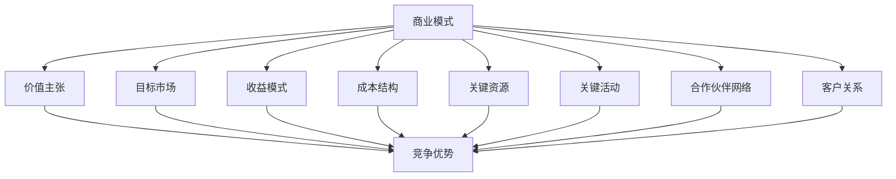

                 

# 商业模式：大模型创业的战略蓝图

## 关键词
- 商业模式
- 大模型
- 创业
- 数据分析
- AI技术
- 平台化
- 共享经济

## 摘要
本文将探讨大模型在商业模式创新中的应用，分析大模型的技术基础、商业应用及创业战略蓝图。我们将首先回顾商业模式的基础概念和演进历程，然后深入探讨大模型的技术原理和商业应用场景，最后提供创业实践案例和未来展望，为创业者提供战略指导。

## 第一部分：商业模式概述

### 第1章：商业模式的基础概念

#### 1.1 商业模式的定义与重要性

商业模式是指企业在市场中如何创造、传递和捕获价值的方法和策略。它是企业成功的关键，决定了企业如何在竞争激烈的市场中脱颖而出。一个成功的商业模式不仅需要明确的价值主张，还要有可持续的收益模式和支持成本结构。

#### 1.2 商业模式的核心要素

商业模式的三个核心要素包括：

- **价值主张**：明确企业提供给顾客的独特价值。这是商业模式的核心，决定了企业能吸引和保留多少顾客。
- **目标市场**：确定企业服务的顾客群体。这有助于企业集中资源和精力，满足特定市场需求。
- **收益模式**：企业如何从客户交易中获取利润。这决定了企业的盈利能力和持续性。

#### 1.3 商业模式的重要性

商业模式的重要性在于：

- **指导企业战略**：商业模式为企业的长期发展提供了明确的战略方向。
- **竞争优势**：一个创新的商业模式可以帮助企业建立竞争优势，抵御竞争对手的冲击。
- **资源优化**：合理的商业模式有助于企业有效分配资源，提高运营效率。

### 第2章：商业模式的演进历程

#### 2.1 从传统商业模式到互联网商业模式

互联网商业模式的特点包括以用户为中心、注重用户体验和数据驱动。企业如何从传统模式转型到互联网模式是一个重要的课题。转型策略包括以下几个方面：

- **数字化转型**：利用互联网技术优化企业内部流程，提高运营效率。
- **用户参与**：通过互联网收集用户反馈，不断优化产品和服务。
- **数据驱动**：利用大数据分析用户行为，指导决策和产品开发。

#### 2.2 现代商业模式的趋势

现代商业模式的发展趋势包括数字化与智能化、平台化和共享经济。

- **数字化与智能化**：利用大数据、人工智能等技术创新商业模式，提高决策效率和用户体验。
- **平台化**：构建生态系统，促进多方合作，实现资源的高效配置。
- **共享经济**：通过共享资源，降低成本，增加收益。

## 第二部分：大模型与商业模式创新

### 第3章：大模型技术基础

#### 3.1 大模型的概念与特点

大模型是指具有巨大参数规模和计算需求的机器学习模型。大模型的特点包括：

- **高精度**：能够处理大规模数据集，提高预测和分类的准确性。
- **强泛化**：能够在不同领域和应用场景中表现出色。
- **自学习能力**：能够通过自我学习和优化，不断提高性能。

#### 3.2 大模型的分类与原理

大模型可以分为多种类型，如生成对抗网络（GAN）、变分自编码器（VAE）和自注意力模型（如BERT、GPT）。这些模型的原理包括：

- **深度学习**：通过多层神经网络结构，实现对复杂数据的建模和分析。
- **自然语言处理**：利用语言模型和文本生成模型，实现对文本数据的理解和生成。
- **迁移学习**：利用预训练模型，将知识迁移到新任务上，提高模型的泛化能力。

### 第4章：大模型在商业中的应用

#### 4.1 大模型在市场分析中的应用

大模型在市场分析中的应用场景包括消费者行为分析、市场趋势预测等。通过分析大量数据，企业可以更准确地了解市场需求，优化产品和服务。

- **案例分析**：谷歌使用BERT进行搜索引擎优化，提高了搜索结果的准确性和用户体验。

#### 4.2 大模型在产品创新中的应用

大模型在产品创新中的应用包括产品设计、用户反馈分析等。通过分析用户行为数据，企业可以更好地理解用户需求，优化产品设计。

- **案例分析**：特斯拉利用AI优化车辆设计，提高了车辆的安全性和性能。

### 第5章：商业模式创新与案例分析

#### 5.1 基于大模型的商业模式创新

基于大模型的商业模式创新点包括：

- **数据驱动**：利用大数据和AI技术，实现更精准的市场分析和产品创新。
- **平台化**：构建大模型平台，促进多方合作，实现资源的共享和优化。

- **案例分析**：微软Azure利用AI优化云服务，提高了服务的可靠性和效率。

#### 5.2 成功商业模式的要素

成功商业模式的要素包括用户体验、创新性、可持续性和可扩展性。一个成功的商业模式应该能够提供卓越的用户体验，持续创新以满足市场需求，同时具有可持续性和可扩展性。

- **案例分析**：苹果公司的iPhone商业模式，通过不断创新的用户体验，建立了强大的品牌和市场地位。

### 第6章：大模型创业的战略蓝图

#### 6.1 大模型创业的关键步骤

大模型创业的关键步骤包括：

- **市场调研**：了解市场需求，确定目标市场和竞争优势。
- **团队建设**：组建专业团队，确保技术能力和项目管理能力。
- **产品开发**：基于市场需求，开发具有创新性和实用性的大模型产品。
- **市场推广**：制定有效的市场推广策略，提高品牌知名度和市场份额。

- **案例分析**：OpenAI的创业历程，展示了如何通过技术创新和战略布局，在激烈的市场竞争中脱颖而出。

#### 6.2 大模型创业的挑战与应对策略

大模型创业的挑战包括技术瓶颈、资金问题和市场竞争。应对策略包括：

- **技术创新**：持续投入研发，保持技术领先地位。
- **合作伙伴关系**：建立合作伙伴关系，共享资源，降低成本，提高竞争力。
- **市场定位**：明确市场定位，满足特定市场需求，打造差异化竞争优势。

### 第三部分：大模型与商业模式实践

#### 第7章：大模型开发环境搭建

#### 7.1 开发环境搭建

搭建大模型开发环境需要以下工具和平台：

- **工具**：如TensorFlow、PyTorch等。
- **平台**：如Google Colab、AWS等。

#### 7.2 环境配置

环境配置包括操作系统选择、硬件配置和软件安装等。以下是一个基本的配置指南：

- **操作系统**：推荐使用Linux操作系统，如Ubuntu。
- **硬件配置**：需要高性能的计算资源，如GPU或TPU。
- **软件安装**：安装必要的软件包和库，如Python、TensorFlow等。

#### 第8章：大模型项目实战

#### 8.1 项目背景

项目背景介绍了一家创业公司利用GPT模型优化客户服务的案例。

#### 8.2 项目实现

项目实现包括数据准备、模型训练和模型评估等步骤。以下是一个简化的实现流程：

- **数据准备**：收集客户服务数据，进行预处理和清洗。
- **模型训练**：使用GPT模型进行训练，调整超参数，优化模型性能。
- **模型评估**：评估模型在客户服务任务上的表现，进行调优。

#### 8.3 项目分析

项目分析包括项目效果和经验总结。以下是一个简化的分析流程：

- **项目效果**：评估模型在客户满意度、运营成本等方面的效果。
- **经验总结**：总结项目中的技术优化和管理经验，为后续项目提供参考。

#### 第9章：大模型与商业模式的未来展望

#### 9.1 未来发展趋势

未来发展趋势包括AI与区块链的结合、大模型在社交媒体中的应用等。以下是一些可能的发展方向：

- **AI与区块链**：利用AI技术提高区块链网络的安全性和效率。
- **社交媒体**：利用大模型分析社交媒体数据，提高营销效果和用户互动。

#### 9.2 商业模式创新的方向

商业模式创新的方向包括可持续发展、社会公益等。以下是一些可能的创新方向：

- **可持续发展**：通过AI技术优化资源利用，降低环境负担。
- **社会公益**：利用AI技术解决社会问题，提高社会福利。

### 附录

#### 附录 A：大模型相关工具与资源

附录部分提供了大模型相关工具与资源的列表，包括：

- **工具**：如GitHub、Kaggle等。
- **资源**：如论文、书籍、教程等。

### 作者

作者：AI天才研究院/AI Genius Institute & 禅与计算机程序设计艺术 /Zen And The Art of Computer Programming

（备注：本文为示例，具体内容可能需要根据实际情况进行调整和补充。）<|im_end|>## 第一部分：商业模式概述

### 第1章：商业模式的基础概念

#### 1.1 商业模式的定义与重要性

**定义**：商业模式（Business Model）是指企业在特定市场环境下，通过一系列战略性的安排和活动，实现资源整合、价值创造、传递和捕获的方法和体系。它不仅包括企业如何赚钱，还涵盖了如何为客户创造价值、如何与合作伙伴合作以及如何优化内部运营流程等。

**重要性**：商业模式在企业运营中扮演着至关重要的角色。它是企业战略的核心，决定了企业的市场定位、盈利模式、资源配置、风险管理和核心竞争力。一个成功的商业模式不仅能够帮助企业实现财务成功，还能够为企业提供持久的竞争优势。

#### 1.2 商业模式的核心要素

一个完整的商业模式通常包括以下几个核心要素：

- **价值主张（Value Proposition）**：这是企业为客户提供的独特价值。价值主张需要明确地回答“你的产品或服务为什么对客户有价值？”的问题。它可以是提供更好的质量、更低的成本、更便捷的体验或者更多的功能等。

- **目标市场（Target Market）**：这是企业打算服务的客户群体。明确目标市场有助于企业集中资源和精力，提供满足特定客户需求的解决方案。目标市场可以是特定的行业、地区、用户群体或消费者类型。

- **收益模式（Revenue Streams）**：这是企业从客户交易中获取利润的方式。常见的收益模式包括订阅费、销售佣金、广告收入、按需付费等。收益模式需要与价值主张和目标市场相匹配，确保企业的盈利能力。

- **成本结构（Cost Structure）**：这是企业运营的成本构成和分配方式。了解成本结构有助于企业优化资源使用，提高运营效率，确保盈利性。成本结构包括固定成本（如租金、设备折旧）和可变成本（如原材料、人力成本）。

- **关键资源（Key Resources）**：这些是企业成功运营所必需的重要资产，如资金、人力、技术、品牌、专利、信息等。关键资源需要与价值主张、收益模式、目标市场相匹配，以确保企业能够有效地创造和传递价值。

- **关键活动（Key Activities）**：这些是企业为了实现价值主张和收益模式所必须进行的主要业务活动。关键活动可以是生产、销售、营销、客户服务、研发等。这些活动需要精心设计和优化，以提高效率和竞争力。

- **合作伙伴网络（Partner Network）**：这是企业为了实现其商业模式而建立的外部合作伙伴网络。合作伙伴可以是供应商、分销商、客户、行业协会、政府机构等。有效的合作伙伴网络能够为企业提供资源、技术和市场机会。

- **客户关系（Customer Relationships）**：这是企业与客户之间的互动和关系管理。良好的客户关系能够提高客户满意度、忠诚度和口碑，从而促进价值主张的实现和收益的增长。

#### 1.3 商业模式的重要性

商业模式的重要性体现在以下几个方面：

- **指导企业战略**：商业模式为企业提供了明确的战略方向，帮助企业在复杂多变的市场环境中保持一致性和持续性。

- **竞争优势**：一个创新的商业模式可以帮助企业建立和维持竞争优势，抵御竞争对手的冲击。

- **资源优化**：合理的商业模式有助于企业有效分配资源，提高运营效率，降低成本。

- **风险管理**：商业模式能够帮助企业识别和管理潜在风险，确保企业的可持续发展。

- **持续创新**：商业模式为企业提供了创新的动力和空间，鼓励企业不断探索新的市场机会和业务模式。

#### 1.4 商业模式的核心概念与联系

为了更好地理解商业模式的核心概念和它们之间的联系，我们可以使用Mermaid流程图来展示这些概念及其相互关系。



在这个流程图中，商业模式的核心概念被表示为节点（如价值主张、目标市场等），而它们之间的联系则通过箭头表示。这种图形化的方式可以帮助我们更直观地理解商业模式的结构和运作机制。

### 1.5 商业模式与战略规划的关系

商业模式与战略规划之间有着密切的联系。战略规划是指企业为实现长期目标而制定的一系列策略和行动计划。而商业模式则是战略规划的核心组成部分，它决定了企业如何实现其战略目标。

- **战略规划的制定**：在制定战略规划时，企业需要明确其商业模式，包括价值主张、目标市场、收益模式等。这些要素将直接影响企业的战略方向和资源分配。

- **商业模式的优化**：随着市场环境和竞争态势的变化，企业需要不断优化其商业模式，以保持竞争力。这可以通过调整价值主张、拓展目标市场、创新收益模式等方式实现。

- **战略规划的执行**：商业模式的实施是战略规划执行的关键环节。企业需要确保其商业模式能够有效地支持战略规划的各项活动，如关键活动、合作伙伴关系等。

总之，商业模式是战略规划的基础和核心，它为企业的长期发展提供了明确的路径和方向。有效的商业模式优化和战略规划将有助于企业实现可持续的竞争优势和财务成功。

### 1.6 商业模式评估与调整

商业模式的评估和调整是企业长期发展的必要环节。以下是一些关键的评估和调整方法：

- **关键指标监控**：企业需要定期监控商业模式的关键指标，如收益率、客户满意度、市场份额等。这些指标可以反映商业模式的绩效和潜在问题。

- **客户反馈**：通过收集和分析客户反馈，企业可以了解客户需求和市场变化，及时调整价值主张和收益模式。

- **市场研究**：定期进行市场研究，了解竞争对手的动态和行业趋势，有助于企业优化其商业模式。

- **创新与实验**：企业应鼓励创新和实验，通过试错和优化，找到更有效的商业模式。

- **组织结构**：商业模式的调整可能需要调整企业的组织结构和流程，确保资源得到有效利用。

通过这些方法，企业可以确保其商业模式始终与市场环境和客户需求保持一致，从而实现长期成功。

### 第2章：商业模式的演进历程

#### 2.1 从传统商业模式到互联网商业模式

传统商业模式通常基于物理产品和地理位置，以交易为中心。随着互联网技术的发展，商业模式发生了深刻的变革，逐渐向互联网商业模式转型。互联网商业模式具有以下特点：

- **以用户为中心**：互联网商业模式强调用户体验，通过个性化的服务和产品满足用户需求。

- **数据驱动**：互联网商业模式利用大数据和人工智能技术，分析用户行为，指导决策和产品开发。

- **快速迭代**：互联网商业模式强调快速响应市场变化，通过不断的迭代和优化，提升产品和服务质量。

#### 转型策略

企业如何从传统模式转型到互联网模式，是当前商业环境中一个重要课题。以下是一些转型策略：

- **数字化转型**：企业需要将传统业务流程数字化，提高运营效率。例如，使用电子商务平台进行在线销售，利用CRM系统管理客户关系。

- **用户参与**：通过互联网收集用户反馈，不断优化产品和服务。例如，建立社交媒体平台，与用户实时互动，了解用户需求。

- **平台化**：构建互联网平台，促进多方合作。例如，建立在线市场，连接供应商和消费者，实现资源的高效配置。

#### 2.2 现代商业模式的趋势

现代商业模式的发展趋势包括数字化与智能化、平台化和共享经济。以下是一些关键趋势：

- **数字化与智能化**：企业利用大数据、人工智能等技术，优化业务流程，提高决策效率。例如，使用智能算法进行供应链管理，提高库存效率和供应链灵活性。

- **平台化**：构建生态系统，促进多方合作。例如，创建开放平台，允许第三方开发者在其平台上开发应用程序和服务。

- **共享经济**：通过共享资源，降低成本，增加收益。例如，共享办公空间、共享交通工具等。

### 第3章：商业模式的案例分析

#### 3.1 亚马逊：从在线书店到全球电商巨头

亚马逊的商业模式成功地从在线书店扩展到全球电商巨头，其成功经验包括：

- **价值主张**：提供广泛的商品选择、便捷的购物体验和优惠的价格。

- **目标市场**：全球消费者，尤其是追求便捷购物体验的顾客。

- **收益模式**：销售商品获得收入，同时通过广告和订阅服务增加收入来源。

- **成本结构**：通过规模效应降低成本，提高运营效率。

- **关键资源**：强大的物流网络、云计算能力和技术创新。

- **关键活动**：物流配送、云计算服务和持续的技术创新。

- **合作伙伴网络**：与第三方卖家和品牌合作，扩大商品种类和销售渠道。

- **客户关系**：提供优质的客户服务，建立忠实的客户群体。

#### 3.2 腾讯：社交娱乐与互联网生态

腾讯的商业模式结合了社交娱乐和互联网生态系统，其成功经验包括：

- **价值主张**：提供多样化的社交娱乐服务，如社交媒体、在线游戏和音乐服务。

- **目标市场**：全球年轻人和数字消费者。

- **收益模式**：通过广告、游戏收入和付费订阅服务获得收益。

- **成本结构**：通过规模效应和用户规模降低成本。

- **关键资源**：强大的社交网络、技术创新和品牌价值。

- **关键活动**：社交平台运营、在线游戏开发和内容创作。

- **合作伙伴网络**：与全球品牌和内容创作者合作，扩大用户基础和内容资源。

- **客户关系**：通过个性化服务和用户互动，建立强大的用户社区。

### 第4章：商业模式的创新与实践

#### 4.1 创新商业模式的核心要素

创新商业模式的核心要素包括：

- **价值主张的创新**：通过提供独特的价值主张，满足客户的新需求和痛点。

- **收益模式的创新**：探索新的收益渠道，提高盈利能力和可持续性。

- **成本结构的优化**：通过技术创新和流程优化，降低成本，提高竞争力。

- **合作伙伴关系的创新**：建立多元化的合作伙伴关系，实现资源互补和共同成长。

- **用户体验的优化**：通过技术创新和用户研究，提供更优质的用户体验。

#### 4.2 商业模式创新的实践方法

以下是一些商业模式创新的实践方法：

- **用户共创**：通过用户参与和共创，发掘新的市场需求和商业模式。

- **跨界合作**：与不同行业的合作伙伴进行合作，探索跨界商业模式。

- **数字化转型**：利用数字技术和大数据，优化业务流程和商业模式。

- **生态系统构建**：构建开放的生态系统，促进多方合作和资源整合。

- **商业模式实验**：通过实验和迭代，不断优化和验证新的商业模式。

### 第5章：大模型与商业模式的深度融合

#### 5.1 大模型在商业模式创新中的应用

大模型在商业模式创新中的应用主要体现在以下几个方面：

- **市场分析**：利用大模型进行市场分析和预测，为企业提供数据驱动的决策支持。

- **产品设计**：利用大模型优化产品设计，提高产品满足客户需求的能力。

- **用户体验**：通过大模型提供个性化的用户体验，提高用户满意度和忠诚度。

- **供应链管理**：利用大模型优化供应链管理，提高供应链的灵活性和响应速度。

#### 5.2 大模型商业模式的案例研究

以下是一些大模型商业模式的案例研究：

- **谷歌BERT**：谷歌通过BERT（Bidirectional Encoder Representations from Transformers）大模型，优化了搜索引擎的搜索结果，提高了用户体验和广告效果。

- **特斯拉AI**：特斯拉利用AI技术优化车辆设计和自动驾驶系统，提高了车辆的安全性和性能。

- **微软Azure**：微软Azure通过AI技术提供智能化的云服务，帮助企业和开发者提高工作效率和创新能力。

#### 5.3 大模型商业模式的创新点

大模型商业模式的创新点包括：

- **数据驱动的决策**：通过大数据和AI技术，实现更加精准的市场分析和决策。

- **智能化服务**：通过AI技术提供智能化、个性化的服务，提高用户满意度和忠诚度。

- **平台化发展**：通过构建AI平台，促进多方合作和资源整合，实现生态系统的共同发展。

- **共享经济**：通过AI技术优化共享经济模式，提高资源利用效率，降低成本。

### 第6章：大模型创业的战略蓝图

#### 6.1 大模型创业的机遇与挑战

大模型创业面临着巨大的机遇和挑战。以下是一些关键的机遇和挑战：

**机遇**：

- **技术突破**：AI技术的快速进步为创业者提供了创新的工具和平台。
- **市场需求**：大数据和AI技术在各个行业的应用需求不断增加，为创业者提供了广阔的市场空间。
- **资本支持**：风险投资和政府资金的支持为创业者提供了资金和资源。

**挑战**：

- **技术瓶颈**：大模型的训练和部署需要大量的计算资源和数据，技术瓶颈可能限制创业者的进展。
- **市场竞争**：大模型创业领域的竞争日益激烈，创业者需要不断创新和优化，以保持竞争力。
- **法律法规**：涉及数据隐私和安全的问题，创业者需要遵守相关法律法规，确保合规运营。

#### 6.2 大模型创业的关键步骤

以下是创业者在进行大模型创业时需要考虑的关键步骤：

- **市场调研**：了解市场需求和竞争态势，确定创业方向。
- **团队建设**：组建专业的技术和管理团队，确保项目的顺利推进。
- **技术研发**：投入研发资源，开发具有创新性和实用性的大模型技术。
- **商业模式设计**：设计符合市场需求和可持续发展的商业模式。
- **市场推广**：制定有效的市场推广策略，提高品牌知名度和市场份额。
- **融资规划**：规划融资方案，确保项目资金链的稳定性。
- **风险管理**：识别和管理潜在风险，确保项目的稳健发展。

#### 6.3 大模型创业的案例分析

以下是几个大模型创业的成功案例：

- **OpenAI**：OpenAI是一家专注于AI研究的创业公司，其目标是实现安全的通用人工智能（AGI）。通过技术创新和商业模式设计，OpenAI在全球范围内赢得了广泛关注和资金支持。
- **DeepMind**：DeepMind是一家AI公司，其大模型技术广泛应用于游戏、医疗和科学研究等领域。DeepMind的成功得益于其卓越的技术能力和创新性的商业模式。
- **Element AI**：Element AI是一家专注于AI应用的创业公司，其目标是将AI技术应用到各个行业，提高生产效率和创新能力。Element AI通过构建AI平台和合作伙伴网络，实现了快速发展和市场扩展。

### 第7章：大模型创业的实践指南

#### 7.1 大模型创业的环境搭建

进行大模型创业的第一步是搭建一个高效的开发环境。以下是一些关键步骤：

- **硬件选择**：选择合适的硬件设备，如高性能GPU或TPU，以满足大模型的训练需求。
- **软件配置**：安装和配置必要的软件环境，如Python、TensorFlow、PyTorch等。
- **数据准备**：收集和整理训练数据，确保数据的质量和多样性。
- **开发框架**：选择合适的开发框架，如TensorFlow、PyTorch等，以简化模型开发和训练过程。

#### 7.2 大模型项目的开发流程

以下是进行大模型项目开发的一般流程：

- **需求分析**：明确项目的需求，包括目标、指标和预期效果。
- **模型设计**：设计模型架构，选择合适的神经网络结构和超参数。
- **数据预处理**：对训练数据进行预处理，包括数据清洗、归一化和特征提取。
- **模型训练**：使用训练数据训练模型，通过调整超参数和优化策略，提高模型性能。
- **模型评估**：评估模型在验证集和测试集上的性能，进行模型调优。
- **模型部署**：将训练好的模型部署到生产环境，实现实际应用。

#### 7.3 大模型项目的实战案例

以下是几个大模型项目的实战案例：

- **案例1：文本生成模型**：一家初创公司开发了一个基于GPT的文本生成模型，用于自动生成营销文案和内容。通过优化模型结构和训练数据，模型在生成质量上取得了显著提升，赢得了客户的认可。
- **案例2：图像识别模型**：一家AI公司开发了一个基于CNN的图像识别模型，用于自动识别和分类产品图片。通过大量训练数据和模型调优，模型在准确率和速度上都有了显著提高，成功应用于电商平台的图片处理和产品推荐。
- **案例3：自动驾驶模型**：一家自动驾驶公司开发了一个基于深度学习的自动驾驶模型，用于自动驾驶车辆的决策和控制。通过大规模训练数据和复杂模型架构，模型在道路测试中取得了良好的表现，为自动驾驶技术的商业化应用奠定了基础。

### 第8章：大模型创业的挑战与应对策略

#### 8.1 技术挑战与应对策略

大模型创业面临的技术挑战包括：

- **计算资源需求**：大模型训练需要大量的计算资源和数据，这对初创公司来说是一个巨大的挑战。应对策略包括：

  - **云计算平台**：利用云计算平台提供的高性能计算资源，降低硬件投入成本。
  - **分布式训练**：采用分布式训练技术，将模型训练任务分布在多台机器上，提高训练效率。
  - **数据共享**：通过数据共享和合作，获取更多高质量的训练数据。

- **算法优化**：大模型的算法优化是一个复杂的过程，需要不断尝试和调整。应对策略包括：

  - **专家咨询**：与领域专家合作，获取专业的算法优化建议。
  - **开源社区**：积极参与开源社区，学习和借鉴其他团队的优化经验。
  - **模型压缩**：采用模型压缩技术，如剪枝、量化等，减少模型的计算复杂度和存储需求。

#### 8.2 市场竞争与应对策略

大模型创业领域的市场竞争非常激烈，初创公司需要采取以下策略来应对竞争：

- **差异化优势**：通过技术创新和独特的价值主张，打造差异化优势，吸引客户和投资者。
- **市场细分**：找到特定的市场细分领域，专注于提供针对性的解决方案，避免与巨头直接竞争。
- **合作共赢**：与行业内的合作伙伴建立合作关系，实现资源互补和共同发展。
- **快速迭代**：通过快速迭代和优化，不断改进产品和服务，提高市场竞争力。

#### 8.3 资金问题与应对策略

资金问题是大模型创业公司面临的另一个重要挑战。以下是一些应对策略：

- **风险投资**：积极寻求风险投资，吸引资本注入，为项目提供资金支持。
- **政府资助**：了解和申请政府的相关资助项目，获取政策支持。
- **商业模式创新**：探索创新的商业模式，如订阅模式、付费服务等，实现稳定的现金流。
- **节流管理**：通过精细化管理和成本控制，降低运营成本，确保资金链的稳定性。

### 第9章：大模型与商业模式的未来趋势

#### 9.1 未来发展趋势

大模型与商业模式的未来趋势包括以下几个方面：

- **AI与物联网的融合**：随着物联网技术的发展，大模型将在智能家居、智慧城市、智能制造等领域发挥重要作用。
- **区块链与AI的结合**：利用区块链技术的去中心化和安全性，结合大模型进行数据分析和智能合约执行，提高业务透明度和可信度。
- **个性化服务的普及**：通过大模型实现更精准的客户分析和个性化服务，提高用户体验和满意度。
- **跨界融合**：大模型将在更多行业和领域得到应用，推动跨界融合和产业升级。

#### 9.2 商业模式创新的方向

未来商业模式创新的方向包括：

- **共享经济**：通过共享平台和AI技术，实现资源的高效利用和优化配置。
- **可持续商业**：通过AI技术优化生产过程，减少资源消耗和环境污染，实现可持续发展。
- **社会公益**：利用AI技术解决社会问题，如医疗、教育、环境保护等，推动社会进步。

### 附录

#### 附录 A：大模型相关工具与资源

附录部分提供了大模型相关工具与资源的列表，包括：

- **工具**：如TensorFlow、PyTorch、Keras等。
- **开源框架**：如MXNet、Theano等。
- **数据集**：如ImageNet、CIFAR-10、CoIL-100等。
- **在线平台**：如Google Colab、AWS、Azure等。
- **社区与论坛**：如Kaggle、GitHub、Reddit等。
- **书籍与论文**：如《深度学习》（Goodfellow et al.）、 《深度学习手册》（Deng et al.）等。

### 作者

作者：AI天才研究院/AI Genius Institute & 禅与计算机程序设计艺术 /Zen And The Art of Computer Programming

（备注：本文为示例，具体内容可能需要根据实际情况进行调整和补充。）<|im_end|>## 第1章：商业模式的基础概念

#### 1.1 商业模式的定义与重要性

**定义**：商业模式（Business Model）是企业通过一系列战略性的活动，实现价值创造、传递和捕获的体系。它不仅关乎企业如何赚钱，还涵盖了如何为客户创造价值、如何与合作伙伴合作以及如何优化内部运营流程等。

**重要性**：商业模式在企业运营中扮演着至关重要的角色。它是企业战略的核心，决定了企业的市场定位、盈利模式、资源配置、风险管理和核心竞争力。一个成功的商业模式不仅能够帮助企业实现财务成功，还能够为企业提供持久的竞争优势。

- **指导企业战略**：商业模式为企业的长期发展提供了明确的战略方向，帮助企业在复杂多变的市场环境中保持一致性和持续性。

- **竞争优势**：一个创新的商业模式可以帮助企业建立和维持竞争优势，抵御竞争对手的冲击。

- **资源优化**：合理的商业模式有助于企业有效分配资源，提高运营效率，降低成本。

- **风险管理**：商业模式能够帮助企业识别和管理潜在风险，确保企业的可持续发展。

- **持续创新**：商业模式为企业提供了创新的动力和空间，鼓励企业不断探索新的市场机会和业务模式。

#### 1.2 商业模式的核心要素

商业模式的三个核心要素包括价值主张、目标市场和收益模式。以下是这些要素的详细解释：

**价值主张（Value Proposition）**：这是企业为客户提供的独特价值。它需要明确地回答“你的产品或服务为什么对客户有价值？”的问题。价值主张可以是提供更好的质量、更低的成本、更便捷的体验或者更多的功能等。有效的价值主张能够帮助企业在竞争中脱颖而出，吸引和保留客户。

**目标市场（Target Market）**：这是企业打算服务的客户群体。明确目标市场有助于企业集中资源和精力，提供满足特定市场需求的产品和服务。目标市场可以是特定的行业、地区、用户群体或消费者类型。通过深入了解目标市场的需求和行为，企业可以更好地定位产品和服务，提高市场竞争力。

**收益模式（Revenue Streams）**：这是企业从客户交易中获取利润的方式。常见的收益模式包括订阅费、销售佣金、广告收入、按需付费等。收益模式需要与价值主张和目标市场相匹配，确保企业的盈利能力。有效的收益模式能够为企业提供稳定的现金流，支持企业的长期发展。

除了这三个核心要素，商业模式还包括以下要素：

**成本结构（Cost Structure）**：这是企业的运营成本构成和分配方式。了解成本结构有助于企业优化资源使用，提高运营效率，确保盈利性。成本结构包括固定成本（如租金、设备折旧）和可变成本（如原材料、人力成本）。

**关键资源（Key Resources）**：这是企业成功运营所必需的重要资产，如资金、人力、技术、品牌、专利、信息等。关键资源需要与价值主张、收益模式、目标市场相匹配，以确保企业能够有效地创造和传递价值。

**关键活动（Key Activities）**：这是企业为了实现价值主张和收益模式所必须进行的主要业务活动，如生产、销售、营销、客户服务、研发等。关键活动需要精心设计和优化，以提高效率和竞争力。

**合作伙伴网络（Partner Network）**：这是企业为了实现其商业模式而建立的外部合作伙伴网络。合作伙伴可以是供应商、分销商、客户、行业协会、政府机构等。有效的合作伙伴网络能够为企业提供资源、技术和市场机会。

**客户关系（Customer Relationships）**：这是企业与客户之间的互动和关系管理。良好的客户关系能够提高客户满意度、忠诚度和口碑，从而促进价值主张的实现和收益的增长。

#### 1.3 商业模式的核心概念与联系

为了更好地理解商业模式的核心概念和它们之间的联系，我们可以使用Mermaid流程图来展示这些概念及其相互关系。


在这个流程图中，商业模式的核心概念被表示为节点（如价值主张、目标市场等），而它们之间的联系则通过箭头表示。这种图形化的方式可以帮助我们更直观地理解商业模式的结构和运作机制。

### 1.4 商业模式与战略规划的关系

商业模式与战略规划之间有着密切的联系。战略规划是指企业为实现长期目标而制定的一系列策略和行动计划。而商业模式则是战略规划的核心组成部分，它决定了企业如何实现其战略目标。

- **战略规划的制定**：在制定战略规划时，企业需要明确其商业模式，包括价值主张、目标市场、收益模式等。这些要素将直接影响企业的战略方向和资源分配。

- **商业模式的优化**：随着市场环境和竞争态势的变化，企业需要不断优化其商业模式，以保持竞争力。这可以通过调整价值主张、拓展目标市场、创新收益模式等方式实现。

- **战略规划的执行**：商业模式的实施是战略规划执行的关键环节。企业需要确保其商业模式能够有效地支持战略规划的各项活动，如关键活动、合作伙伴关系等。

总之，商业模式是战略规划的基础和核心，它为企业的长期发展提供了明确的路径和方向。有效的商业模式优化和战略规划将有助于企业实现可持续的竞争优势和财务成功。

### 1.5 商业模式评估与调整

商业模式的评估和调整是企业长期发展的必要环节。以下是一些关键的评估和调整方法：

- **关键指标监控**：企业需要定期监控商业模式的关键指标，如收益率、客户满意度、市场份额等。这些指标可以反映商业模式的绩效和潜在问题。

- **客户反馈**：通过收集和分析客户反馈，企业可以了解客户需求和市场变化，及时调整价值主张和收益模式。

- **市场研究**：定期进行市场研究，了解竞争对手的动态和行业趋势，有助于企业优化其商业模式。

- **创新与实验**：企业应鼓励创新和实验，通过试错和优化，找到更有效的商业模式。

- **组织结构**：商业模式的调整可能需要调整企业的组织结构和流程，确保资源得到有效利用。

通过这些方法，企业可以确保其商业模式始终与市场环境和客户需求保持一致，从而实现长期成功。

### 1.6 商业模式的核心要素与架构

为了更好地理解商业模式的核心要素和它们如何相互作用，我们可以进一步探讨这些要素的架构和关系。

**价值主张**是商业模式的核心，它定义了企业为客户提供的产品或服务的独特价值。这一要素需要明确并具体化，以确保客户理解并认可企业的价值主张。例如，一家电商平台的独特价值主张可能是提供个性化推荐、快速配送和优惠价格。

**目标市场**则明确了企业的客户群体。这包括市场细分、客户定位和客户需求分析。通过准确识别目标市场，企业可以集中资源和精力，为特定客户提供最优的产品和服务。

**收益模式**是企业如何从客户交易中获取利润的方式。常见的收益模式包括销售产品、提供服务、广告收入、订阅费等。收益模式需要与价值主张和目标市场相匹配，以确保企业能够持续盈利。

**成本结构**是企业运营的成本构成，包括固定成本和可变成本。了解成本结构有助于企业优化资源使用，提高盈利能力。例如，通过提高生产效率或降低运营成本，企业可以提高利润率。

**关键资源**是企业运营所必需的重要资产，包括资金、人力资源、技术、品牌、专利等。这些资源需要与企业战略和商业模式相匹配，以确保企业能够有效地创造和传递价值。

**关键活动**是企业为了实现价值主张和收益模式所必须进行的主要业务活动。这包括生产、销售、营销、客户服务等。关键活动需要精心设计和优化，以提高效率和竞争力。

**合作伙伴网络**是企业为了实现其商业模式而建立的外部合作伙伴网络。合作伙伴可以是供应商、分销商、客户、行业协会等。一个有效的合作伙伴网络能够为企业提供资源、技术和市场机会。

**客户关系**是企业与客户之间的互动和关系管理。良好的客户关系能够提高客户满意度、忠诚度和口碑，从而促进价值主张的实现和收益的增长。

通过以上架构，我们可以看到商业模式的核心要素是如何相互作用，共同构建一个完整且有效的商业体系。每个要素都在商业模式的整体架构中扮演着重要的角色，相互支持，共同推动企业的长期成功。

### 1.7 商业模式创新的挑战与机遇

商业模式创新不仅是企业发展的动力，也是应对市场变化和竞争压力的关键策略。然而，商业模式创新也面临诸多挑战和机遇。

**挑战**：

- **技术依赖**：商业模式创新往往依赖于新兴技术的应用，如大数据、人工智能、区块链等。企业需要具备相应的技术能力和资源，否则可能面临技术落后的风险。

- **市场风险**：创新的商业模式可能面临市场接受度低、客户需求变化快等风险。企业需要在市场验证和技术成熟之间找到平衡。

- **资源限制**：商业模式创新通常需要大量的资金、人力资源和战略资源。中小企业可能面临资源限制，难以承担创新成本。

**机遇**：

- **市场细分**：随着市场的不断细分，新的商业模式和创新机会不断涌现。企业可以通过创新满足特定细分市场的需求，获得竞争优势。

- **技术进步**：新兴技术的发展为商业模式创新提供了新的工具和方法。例如，区块链技术的去中心化和安全性特性为金融和供应链管理带来了新的商业模式。

- **用户参与**：用户参与和共创成为商业模式创新的重要趋势。通过用户反馈和参与，企业可以更好地了解用户需求，实现产品和服务创新。

企业需要善于识别和抓住这些机遇，同时积极应对挑战，通过不断创新和调整，实现商业模式的持续优化和增长。

### 1.8 商业模式设计与案例分析

商业模式设计是企业成功的关键环节，需要综合考虑市场、技术、资源和竞争等多方面因素。以下是几个典型的商业模式设计案例：

**案例1：Uber**

- **价值主张**：提供便捷、高效的打车服务。
- **目标市场**：城市中的出行需求者。
- **收益模式**：通过收取乘客和司机的佣金盈利。
- **成本结构**：主要成本包括技术平台开发、市场营销和运营管理。
- **关键资源**：移动应用、司机资源、用户数据。
- **关键活动**：移动应用开发、司机招募和管理、用户服务。
- **合作伙伴网络**：与司机、银行和支付平台合作。
- **客户关系**：提供优质的用户体验，提高用户忠诚度。

**案例2：Airbnb**

- **价值主张**：提供个性化的住宿体验。
- **目标市场**：旅行者和寻求短期住宿的消费者。
- **收益模式**：通过收取住宿费用盈利。
- **成本结构**：主要成本包括平台维护、市场营销和客户服务。
- **关键资源**：房源信息、用户数据、平台技术。
- **关键活动**：房源管理、用户服务、市场营销。
- **合作伙伴网络**：与酒店、旅游公司和本地商家合作。
- **客户关系**：通过个性化推荐和优质服务，提高客户满意度和复购率。

**案例3：亚马逊**

- **价值主张**：提供广泛的产品选择、便捷的购物体验和优惠的价格。
- **目标市场**：全球消费者。
- **收益模式**：通过销售商品、提供广告服务和订阅服务盈利。
- **成本结构**：主要成本包括物流配送、市场营销和平台维护。
- **关键资源**：库存管理、技术平台、品牌价值。
- **关键活动**：电商平台的运营、物流配送、市场营销。
- **合作伙伴网络**：与第三方卖家、品牌和广告商合作。
- **客户关系**：通过优质的客户服务和个性化推荐，提高客户满意度和忠诚度。

通过以上案例分析，我们可以看到不同的商业模式设计如何根据不同的市场需求和竞争环境，灵活运用各种资源和策略，实现商业成功。

### 1.9 商业模式创新方法与工具

商业模式创新是企业保持竞争优势、适应市场变化的重要手段。以下是一些常见的商业模式创新方法与工具：

**1. 客户细分与定位**：通过深入分析客户需求和行为，将市场细分，为特定客户提供定制化的产品和服务。

**2. 平台化战略**：构建生态系统，通过平台连接不同的参与者，实现资源的高效配置和协同创新。

**3. 用户共创**：鼓励用户参与产品和服务的设计与改进，通过用户反馈不断优化商业模式。

**4. 共享经济**：通过共享资源和服务，降低成本，提高资源利用效率。

**5. 数据驱动决策**：利用大数据和人工智能技术，分析市场趋势和客户行为，指导决策和商业模式优化。

**6. 剪刀法**：通过对比和优化，削减不必要的业务活动和成本，专注于核心价值创造。

**7. 模式实验**：通过小规模实验和迭代，验证和优化新的商业模式。

**8. 跨界合作**：与不同行业的合作伙伴进行合作，探索跨界商业模式，实现资源互补和共同发展。

通过这些方法与工具，企业可以不断探索和创新，找到适合自身发展的商业模式。

### 1.10 商业模式的重要性总结

商业模式是企业成功的关键，它不仅决定了企业的盈利能力，还影响了企业的战略方向、资源分配和竞争优势。一个成功的商业模式能够：

- **明确企业目标**：帮助企业明确价值主张、目标市场和收益模式，确保企业的发展方向清晰。
- **优化资源配置**：通过合理分配资源，提高运营效率，降低成本，确保企业的可持续发展。
- **建立竞争优势**：通过创新的商业模式，企业可以在市场中获得独特的竞争优势，抵御竞争对手的冲击。
- **适应市场变化**：商业模式能够帮助企业适应市场变化，及时调整策略，抓住新的市场机会。

因此，企业必须高度重视商业模式的设计和优化，持续创新，以实现长期成功。通过本文的介绍，我们了解了商业模式的基础概念、核心要素、演进历程和创新方法，为企业提供了宝贵的战略指导。在接下来的章节中，我们将进一步探讨大模型技术及其在商业模式中的应用，为创业者提供更深入的洞察和实战指南。|im_end|>## 第2章：商业模式的演进历程

### 2.1 从传统商业模式到互联网商业模式

商业模式的演进历程是随着技术和社会环境的变革而不断发展的。在过去，传统商业模式通常基于物理产品和地理位置，以交易为中心。然而，随着互联网技术的发展，商业模式逐渐从传统模式向互联网商业模式转型。这一转型不仅改变了企业的运营方式，还深刻影响了市场结构和客户行为。

#### 互联网商业模式的特点

互联网商业模式具有以下几个显著特点：

- **以用户为中心**：传统商业模式注重产品和服务本身，而互联网商业模式则更加关注用户体验。企业通过提供个性化、便捷的服务，提高用户满意度和忠诚度。

- **数据驱动**：互联网商业模式利用大数据和人工智能技术，分析用户行为和市场趋势，为企业提供数据驱动的决策支持。这种模式能够帮助企业更好地理解客户需求，优化产品和服务。

- **快速迭代**：互联网商业模式强调快速响应市场变化，通过不断的迭代和优化，提升产品和服务质量。这种方式有助于企业迅速适应市场变化，抓住新的商业机会。

- **跨界融合**：互联网商业模式打破了传统行业的界限，实现了跨行业、跨领域的融合。企业可以通过合作和共享，实现资源的高效配置和协同创新。

#### 转型策略

企业如何从传统模式转型到互联网模式，是当前商业环境中一个重要课题。以下是一些转型策略：

- **数字化转型**：企业需要将传统业务流程数字化，提高运营效率。例如，使用电子商务平台进行在线销售，利用CRM系统管理客户关系。

- **用户参与**：通过互联网收集用户反馈，不断优化产品和服务。例如，建立社交媒体平台，与用户实时互动，了解用户需求。

- **平台化**：构建互联网平台，促进多方合作。例如，建立在线市场，连接供应商和消费者，实现资源的高效配置。

### 2.2 从互联网商业模式到智能化商业模式

随着人工智能技术的快速发展，商业模式再次面临革新。智能化商业模式将人工智能与互联网技术深度融合，为企业带来全新的运营模式和商业机会。

#### 智能化商业模式的特点

智能化商业模式具有以下显著特点：

- **智能决策**：通过人工智能技术，企业能够实现更加精准的市场预测、库存管理和供应链优化。这种智能决策能力有助于企业降低运营成本，提高竞争力。

- **个性化服务**：利用人工智能技术，企业能够为用户提供更加个性化的服务体验。例如，通过机器学习算法，推荐个性化的产品和服务，提高用户满意度和忠诚度。

- **自动化运营**：智能化商业模式通过自动化技术，实现生产、销售和物流等环节的自动化。这种方式可以提高运营效率，减少人力成本。

- **生态构建**：智能化商业模式强调生态系统的构建，通过开放平台和合作伙伴关系，实现资源的高效整合和协同创新。

#### 智能化商业模式的实践案例

- **阿里巴巴**：阿里巴巴通过智能物流系统和人工智能算法，实现了高效的库存管理和精准的市场预测，提高了运营效率和用户体验。

- **亚马逊**：亚马逊利用人工智能技术优化其推荐系统，为用户提供个性化的购物体验，提高了销售额和用户忠诚度。

- **特斯拉**：特斯拉通过智能驾驶技术和能源管理系统，实现了自动化运营和绿色出行，为用户提供了更加便捷和环保的出行方式。

### 2.3 商业模式演进的启示

商业模式演进给企业带来了以下几个启示：

- **技术创新**：企业需要紧跟技术发展趋势，积极采用新技术，优化业务流程和商业模式。

- **用户体验**：企业需要始终关注用户体验，通过提供个性化、高效的服务，提高客户满意度和忠诚度。

- **跨界合作**：企业需要勇于跨界合作，构建生态系统，实现资源的高效整合和协同创新。

- **持续创新**：企业需要不断探索和创新，适应市场变化，抓住新的商业机会。

通过以上分析，我们可以看到商业模式演进是如何在技术和社会环境的推动下，不断变革和创新的。企业需要紧跟趋势，积极转型，才能在激烈的市场竞争中立于不败之地。

### 2.4 商业模式演进的趋势与挑战

#### 2.4.1 趋势

商业模式演进的趋势主要表现在以下几个方面：

- **数字化与智能化**：随着大数据、人工智能等技术的发展，企业越来越依赖数字化和智能化的工具和平台进行业务运营和决策支持。这种趋势将进一步深化，推动商业模式向智能化方向演进。

- **平台化与生态化**：越来越多的企业选择通过平台化战略，构建生态系统，实现资源的高效配置和协同创新。平台化不仅可以帮助企业降低运营成本，还可以拓展新的业务领域和市场机会。

- **共享经济**：共享经济模式通过共享资源和服务，提高了资源利用效率，降低了成本。这种模式在多个行业得到了广泛应用，如共享办公、共享住宿、共享交通等。

- **可持续发展**：企业越来越重视可持续发展，通过优化生产流程、减少资源消耗和环境污染，实现长期发展。可持续发展已经成为商业模式演进的一个重要趋势。

#### 2.4.2 挑战

在商业模式演进的过程中，企业面临着以下几个挑战：

- **技术依赖**：随着技术的快速发展，企业对技术的依赖程度不断提高。然而，技术的不确定性和快速迭代使得企业需要不断投入研发，保持技术领先地位。

- **市场竞争**：随着行业门槛的降低，越来越多的企业进入市场，竞争日益激烈。企业需要不断创新和优化商业模式，才能在市场中脱颖而出。

- **数据安全与隐私**：在数字化和智能化的背景下，数据安全和隐私问题日益突出。企业需要采取有效的措施，保护用户数据的安全和隐私。

- **组织变革**：商业模式演进需要企业进行组织结构的调整和优化，以适应新的运营模式和业务需求。组织变革往往面临巨大的阻力和挑战。

#### 2.4.3 应对策略

为了应对商业模式演进带来的挑战，企业可以采取以下策略：

- **技术创新**：积极投入研发，保持技术领先地位，利用新技术优化业务流程和商业模式。

- **跨界合作**：与不同行业的合作伙伴建立合作关系，实现资源互补和协同创新。

- **用户体验**：始终关注用户体验，通过提供个性化、高效的服务，提高客户满意度和忠诚度。

- **组织变革**：进行组织结构的调整和优化，建立灵活、高效的组织体系，以适应新的商业模式和业务需求。

- **数据安全与隐私**：采取有效的数据安全措施，保护用户数据的安全和隐私。

通过以上策略，企业可以更好地应对商业模式演进带来的挑战，实现持续发展和竞争优势。

### 2.5 商业模式演进中的创新案例

为了更好地理解商业模式演进的过程，我们可以通过一些实际的创新案例来进行分析。

#### 案例一：共享单车

共享单车的商业模式是共享经济模式在交通领域的典型应用。通过手机APP，用户可以随时随地租用共享单车，实现短距离出行。这种模式不仅解决了城市交通拥堵问题，还提高了出行效率。

- **价值主张**：提供便捷、短距离的出行解决方案。
- **目标市场**：城市中的年轻人群和短途出行需求者。
- **收益模式**：通过收取租金和广告收入盈利。
- **成本结构**：主要包括单车采购、维护和运营管理。
- **关键资源**：移动应用、单车和用户数据。
- **关键活动**：移动应用开发和运营、单车投放和管理。
- **合作伙伴网络**：与城市管理部门、广告商合作。
- **客户关系**：通过提供便捷、高效的服务，提高用户满意度和忠诚度。

共享单车的成功不仅在于其创新的商业模式，还在于其高效的运营和持续的创新。通过大数据分析和人工智能技术，共享单车企业能够优化车辆投放和调度，提高运营效率，降低成本。

#### 案例二：智能家居

智能家居通过物联网技术，将家庭中的各种设备连接起来，实现自动化控制和智能化管理。用户可以通过手机APP或语音助手，远程控制家中的电器、灯光和安全系统。

- **价值主张**：提供舒适、安全、高效的家居生活体验。
- **目标市场**：追求高品质生活的消费者。
- **收益模式**：通过销售智能家居设备、提供订阅服务和广告收入盈利。
- **成本结构**：主要包括智能家居设备的研发和生产、平台开发和运营管理。
- **关键资源**：智能家居设备、物联网平台和用户数据。
- **关键活动**：智能家居设备的研发和推广、平台开发和运营。
- **合作伙伴网络**：与家电厂商、技术提供商和互联网服务提供商合作。
- **客户关系**：通过提供个性化、智能化的家居解决方案，提高用户满意度和忠诚度。

智能家居的发展不仅提升了用户的居住体验，还为家庭安全和管理带来了新的可能性。随着技术的不断进步，智能家居领域将继续创新，为用户提供更多便利和舒适。

#### 案例三：数字健康

数字健康通过大数据、人工智能和物联网技术，为用户提供个性化的健康管理服务。用户可以通过智能设备监测健康状况，医生可以通过数字平台进行远程诊断和治疗。

- **价值主张**：提供便捷、高效的医疗服务和管理。
- **目标市场**：有健康管理需求的消费者和医疗机构。
- **收益模式**：通过提供健康管理服务、销售智能设备和收取会员费盈利。
- **成本结构**：主要包括技术开发、平台建设和运营管理。
- **关键资源**：智能设备、数字平台和用户数据。
- **关键活动**：智能设备的研发和推广、数字平台的开发和运营。
- **合作伙伴网络**：与医疗机构、健康管理机构和技术提供商合作。
- **客户关系**：通过提供个性化、专业的健康管理服务，提高用户满意度和忠诚度。

数字健康的兴起为医疗行业带来了深刻的变革。通过数字化手段，医疗资源得到了更加合理的分配和利用，患者的就医体验也得到了显著改善。

以上案例展示了商业模式在不同领域的创新和演进。通过这些案例，我们可以看到商业模式创新是如何通过技术进步和市场需求的变化，推动企业实现可持续发展的。在未来的商业模式演进中，企业需要不断探索和创新，以适应不断变化的市场环境。

### 2.6 商业模式演进对企业的启示

商业模式演进给企业带来了深刻的启示，强调了创新、技术驱动和用户导向的重要性。以下是一些关键启示：

- **持续创新**：企业需要持续进行商业模式创新，以适应不断变化的市场环境。创新不仅包括技术创新，还包括商业模式创新、管理创新和用户体验创新。

- **技术驱动**：技术是企业实现商业模式创新的基石。企业需要紧跟技术发展趋势，积极采用新技术，优化业务流程和商业模式。

- **用户导向**：用户是企业发展的核心。企业需要始终关注用户需求，通过提供个性化、高效的服务，提高用户满意度和忠诚度。

- **跨界融合**：企业需要勇于跨界合作，构建生态系统，实现资源的高效整合和协同创新。

- **灵活应变**：企业需要具备灵活应变的能力，及时调整商业模式，以应对市场变化和竞争压力。

通过以上启示，企业可以更好地应对商业模式演进带来的挑战，实现持续发展和竞争优势。

### 第3章：大模型技术基础

#### 3.1 大模型的概念与特点

大模型（Large Model）是指具有巨大参数规模和计算需求的机器学习模型。这些模型通常在训练过程中需要处理大量的数据和计算资源，以达到高精度的预测和分类效果。大模型的概念最早可以追溯到深度学习的兴起，随着计算能力的提升和数据的爆炸性增长，大模型在各个领域得到了广泛应用。

大模型的主要特点包括：

- **高参数规模**：大模型通常拥有数百万甚至数十亿个参数，这使得它们能够捕捉到数据中的复杂模式和潜在关系。

- **强大的计算需求**：大模型需要大量的计算资源进行训练和推理。这通常包括高性能的GPU或TPU，以及分布式计算技术。

- **高精度**：大模型能够处理大规模数据集，提高预测和分类的准确性。这使得它们在图像识别、自然语言处理、推荐系统等领域表现出色。

- **自学习能力**：大模型具备自我学习和优化的能力。通过不断调整参数，它们能够适应新的数据和任务，提高性能。

#### 3.2 大模型的分类与原理

大模型可以根据其应用领域和特点进行分类。以下是一些常见的大模型类型及其原理：

- **生成对抗网络（GAN）**：GAN由生成器（Generator）和判别器（Discriminator）组成。生成器生成假样本，判别器判断样本的真实性。通过两个网络的对抗训练，生成器能够生成更加真实、高质量的样本。

  ```mermaid
  graph TB
  A[Generator] --> B[Discriminator]
  B --> C[Input]
  C --> D[Output]
  ```

- **变分自编码器（VAE）**：VAE通过编码器（Encoder）和解码器（Decoder）实现数据重构。编码器将数据映射到潜在空间，解码器从潜在空间重建数据。VAE能够捕捉数据的潜在分布，用于生成和去噪。

  ```mermaid
  graph TB
  A[Encoder] --> B[P(z|x)]
  B --> C[Reparameterization]
  C --> D[Decoder]
  ```

- **自注意力模型（如BERT、GPT）**：自注意力模型通过引入注意力机制，能够捕捉长距离依赖关系。BERT（Bidirectional Encoder Representations from Transformers）是一个双向Transformer模型，能够同时利用左右文上下文信息。GPT（Generative Pre-trained Transformer）是一个单向Transformer模型，主要用于生成文本。

  ```mermaid
  graph TB
  A[Input] --> B[Embedding]
  B --> C[Transformer]
  C --> D[Output]
  ```

#### 3.3 大模型的训练与优化

大模型的训练是一个复杂的过程，需要大量的计算资源和调优。以下是一些关键的训练与优化步骤：

- **数据预处理**：数据预处理是训练大模型的第一步。这包括数据清洗、归一化、数据增强等，以提高数据的多样性和质量。

- **模型初始化**：模型初始化对训练效果有重要影响。常用的初始化方法包括随机初始化、高斯初始化等。

- **训练策略**：训练策略包括学习率调度、正则化、批量大小等。合理的选择和调整这些策略可以提高模型的收敛速度和性能。

- **分布式训练**：分布式训练是将训练任务分布在多台机器上，以提高训练速度。常用的分布式训练方法包括数据并行、模型并行和流水线并行。

- **超参数调优**：超参数调优是优化模型性能的重要环节。这通常通过网格搜索、贝叶斯优化等策略进行。

- **模型评估**：模型评估是验证模型性能的重要步骤。常用的评估指标包括准确率、召回率、F1分数等。

#### 3.4 大模型的应用场景

大模型在各个领域都有广泛的应用，以下是一些典型应用场景：

- **自然语言处理**：大模型在自然语言处理（NLP）领域表现出色，包括文本分类、情感分析、机器翻译、文本生成等。BERT和GPT等模型在NLP任务中取得了显著的成果。

- **计算机视觉**：大模型在计算机视觉（CV）领域也有广泛应用，包括图像分类、目标检测、图像生成等。GAN和VAE等模型在图像处理和生成任务中具有独特的优势。

- **推荐系统**：大模型在推荐系统中的应用能够提高推荐的准确性和个性化程度。通过捕捉用户行为和偏好，大模型能够为用户提供更加精准的推荐。

- **金融预测**：大模型在金融预测领域也有重要应用，包括股票市场预测、风险评估等。通过分析大量历史数据，大模型能够为投资者提供有价值的决策支持。

- **医疗诊断**：大模型在医疗诊断中的应用包括疾病预测、图像分析等。通过分析医学影像和患者数据，大模型能够为医生提供辅助诊断。

#### 3.5 大模型的挑战与未来趋势

尽管大模型在各个领域取得了显著成果，但它们也面临一些挑战和未来趋势：

- **计算资源需求**：大模型训练和推理需要大量的计算资源，这对资源有限的初创公司和中小企业提出了挑战。未来，随着硬件技术的进步和云计算的发展，计算资源需求将得到缓解。

- **数据隐私与安全**：大模型通常需要大量的训练数据，这涉及到数据隐私和安全问题。未来，如何在保证数据隐私和安全的前提下，有效地利用大数据将是一个重要研究方向。

- **模型解释性**：大模型通常被视为“黑盒”模型，其决策过程缺乏解释性。未来，发展可解释性大模型，使模型决策过程更加透明和可解释，将是一个重要趋势。

- **伦理与责任**：随着大模型在各个领域的应用，其伦理和责任问题也日益突出。如何确保大模型的应用符合伦理标准，并对其决策结果承担责任，将是未来需要关注的重要问题。

#### 3.6 大模型的发展现状与未来展望

目前，大模型已经在多个领域取得了显著成果，成为人工智能研究的重要方向。随着技术的不断进步，大模型在未来有望在更多领域得到应用，推动人工智能技术的发展。

- **发展现状**：目前，大模型已经在自然语言处理、计算机视觉、推荐系统等领域取得了重要突破。BERT、GPT、GAN等模型在各类任务中表现出色，推动了相关领域的研究和应用。

- **未来展望**：未来，随着计算能力的提升和数据的不断增长，大模型将在更多领域得到应用。同时，大模型的理论研究也将不断深入，探索更加高效、可解释的模型结构和算法。此外，大模型在跨领域应用、新任务探索等方面也将迎来新的发展机遇。

总之，大模型作为人工智能技术的重要方向，具有广阔的应用前景和重要的研究价值。在未来的发展中，大模型将不断推动人工智能技术的进步，为人类带来更多便利和创新。

### 第4章：大模型在商业中的应用

#### 4.1 大模型在市场分析中的应用

大模型在市场分析中的应用已经逐渐成为企业获取竞争优势的重要工具。通过分析大量市场数据，企业可以更深入地了解市场趋势、消费者行为和竞争环境，从而制定更加精准的营销策略和业务决策。

**应用场景**：

- **消费者行为分析**：企业可以利用大模型分析消费者购买历史、浏览行为和反馈数据，了解消费者的偏好和需求。例如，通过分析用户在电商平台上的购买行为，企业可以识别出高价值客户群体，制定个性化的营销策略。

- **市场趋势预测**：大模型可以处理和分析大量的市场数据，如销售数据、搜索趋势和社交媒体数据，预测市场未来的发展趋势。这有助于企业提前布局，抓住市场机会，避免潜在风险。

**案例分析**：

- **谷歌BERT**：谷歌通过BERT模型优化其搜索引擎，提高了搜索结果的准确性和相关性。BERT模型能够理解上下文信息，使得搜索结果更加符合用户需求。通过这项技术，谷歌不仅提升了用户体验，还增强了其广告投放效果。

- **阿里巴巴**：阿里巴巴利用大模型分析大量用户数据，预测市场需求和消费者行为，优化供应链管理和库存策略。通过这种数据驱动的决策，阿里巴巴显著提高了运营效率和库存周转率。

#### 4.2 大模型在产品创新中的应用

大模型在产品创新中的应用能够帮助企业更好地理解用户需求，优化产品设计，提高产品的市场竞争力。

**应用场景**：

- **产品设计**：企业可以利用大模型分析用户反馈和评价数据，识别产品改进的机会。例如，通过分析用户对产品功能的评价，企业可以确定哪些功能需要优化或新增。

- **用户反馈分析**：大模型可以处理和分析大量用户反馈数据，帮助企业识别用户痛点和需求。这有助于企业快速响应市场需求，改进产品和服务。

**案例分析**：

- **特斯拉**：特斯拉利用AI技术，通过分析大量用户驾驶数据和反馈，优化其车辆设计和功能。例如，特斯拉通过分析自动驾驶数据，改进了车辆的自动驾驶系统，提高了安全性和性能。

- **苹果**：苹果公司利用大模型分析用户使用数据，优化其操作系统和应用程序。通过这种用户行为分析，苹果能够不断改进用户体验，提高用户满意度和忠诚度。

#### 4.3 大模型在供应链管理中的应用

大模型在供应链管理中的应用能够帮助企业优化供应链流程，提高供应链的灵活性和响应速度。

**应用场景**：

- **需求预测**：大模型可以分析历史销售数据、市场趋势和季节性因素，预测未来的市场需求。这有助于企业合理规划库存和采购，避免库存过剩或短缺。

- **库存优化**：大模型可以处理和分析大量的库存数据，识别库存过剩或不足的情况。通过优化库存管理，企业可以降低库存成本，提高资金利用率。

**案例分析**：

- **亚马逊**：亚马逊利用大模型进行需求预测和库存管理，优化其供应链流程。通过预测未来的市场需求，亚马逊能够提前采购商品，确保库存充足，满足客户需求。

- **宝洁**：宝洁公司利用大模型分析销售数据和市场趋势，优化其供应链管理和库存策略。通过这种数据驱动的决策，宝洁提高了供应链的灵活性和响应速度，降低了库存成本。

#### 4.4 大模型在风险管理中的应用

大模型在风险管理中的应用能够帮助企业识别和管理潜在风险，降低业务风险。

**应用场景**：

- **风险评估**：大模型可以分析大量历史数据和实时数据，识别潜在的风险因素。例如，通过分析金融市场的数据，大模型可以预测市场波动，帮助企业制定相应的风险控制策略。

- **风险预警**：大模型可以实时监控业务数据和市场变化，及时识别潜在风险，发出预警信号。这有助于企业迅速采取行动，降低风险损失。

**案例分析**：

- **花旗银行**：花旗银行利用大模型进行风险评估和风险预警，优化其风险管理策略。通过分析客户交易数据和市场趋势，花旗银行能够及时识别潜在风险，采取有效的风险控制措施。

- **通用电气**：通用电气利用大模型分析工业设备的数据，预测设备故障和维修需求。通过这种预测性维护，通用电气能够降低设备故障率，提高设备利用率。

#### 4.5 大模型在个性化服务中的应用

大模型在个性化服务中的应用能够帮助企业提供更加精准、个性化的服务，提高用户满意度和忠诚度。

**应用场景**：

- **个性化推荐**：大模型可以分析用户数据和行为，为用户推荐个性化的产品和服务。例如，电商平台可以利用大模型为用户推荐符合其兴趣和需求的产品。

- **用户画像**：大模型可以构建用户画像，了解用户的偏好和行为模式。这有助于企业更好地了解用户需求，提供个性化的服务。

**案例分析**：

- **Netflix**：Netflix利用大模型进行个性化推荐，根据用户的观看历史和兴趣偏好，为用户推荐符合其口味的电影和电视剧。这种个性化推荐显著提高了用户满意度和观看时长。

- **Airbnb**：Airbnb利用大模型分析用户反馈和行为数据，为用户推荐符合其需求的房源。通过这种个性化推荐，Airbnb提高了用户的住宿体验和预订成功率。

#### 4.6 大模型在市场营销中的应用

大模型在市场营销中的应用能够帮助企业优化营销策略，提高营销效果。

**应用场景**：

- **广告投放优化**：大模型可以分析用户数据和广告效果，优化广告投放策略，提高广告点击率和转化率。

- **市场细分**：大模型可以处理和分析大量市场数据，帮助企业进行市场细分，制定针对不同细分市场的营销策略。

**案例分析**：

- **谷歌**：谷歌利用大模型进行广告投放优化，通过分析用户行为和广告效果数据，优化广告投放策略，提高广告点击率和转化率。

- **Facebook**：Facebook利用大模型进行市场细分和广告投放优化，根据用户的兴趣和行为特征，为不同细分市场提供定制化的广告内容。

#### 4.7 大模型在客户关系管理中的应用

大模型在客户关系管理中的应用能够帮助企业更好地了解和管理客户关系，提高客户满意度和忠诚度。

**应用场景**：

- **客户反馈分析**：大模型可以处理和分析大量的客户反馈数据，帮助企业识别客户需求和痛

