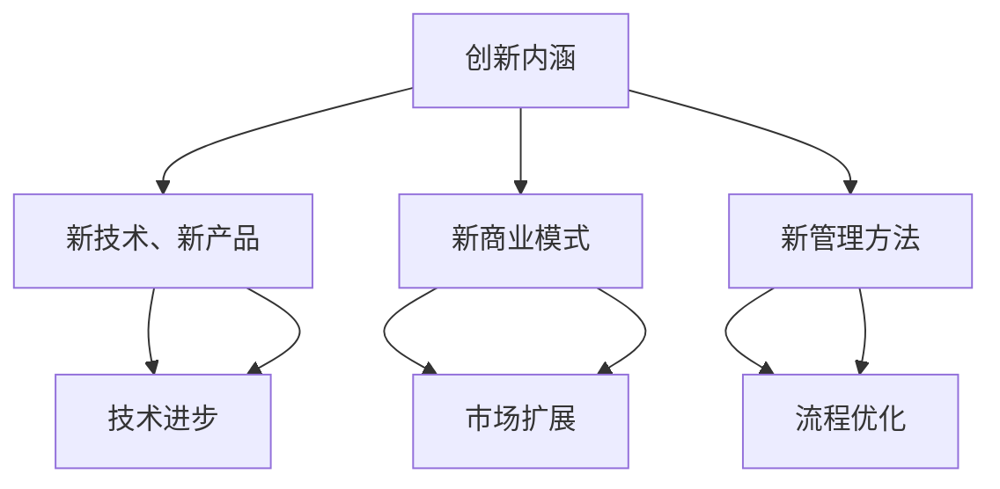
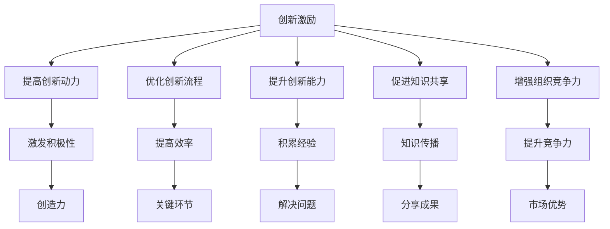

                 

### 《团队创新激励：鼓励创新的奖励机制设计》

#### 关键词：创新激励、奖励机制、团队文化、算法原理、项目实战

> 摘要：
本文探讨了团队创新激励的基本概念、框架设计、实践方法以及未来发展趋势。通过深入分析创新奖励机制的设计原则、要素和实施流程，并结合国内外实际案例，本文提出了一套系统的创新激励策略。此外，文章还介绍了创新激励手册的编制指南、相关工具与资源，以及创新激励研究的最新论文和书籍推荐，旨在为组织和企业提供全面的创新激励实践参考。

---

### 《团队创新激励：鼓励创新的奖励机制设计》目录大纲

#### **第一部分：创新激励的基本概念与框架**

**1.1 创新激励的定义与意义**  
- **1.1.1 创新的内涵与外延**  
- **1.1.2 创新激励的概念与作用**

**1.2 创新激励的框架体系**  
- **1.2.1 创新激励的理论基础**  
- **1.2.2 创新激励的类型与模式**

**1.3 创新激励与组织文化**  
- **1.3.1 创新激励与组织文化的关系**  
- **1.3.2 组织文化的创新激励功能**

#### **第二部分：创新奖励机制的设计与实践**

**2.1 创新奖励机制的设计原则**  
- **2.1.1 公平性原则**  
- **2.1.2 激励性原则**  
- **2.1.3 可持续性原则**

**2.2 创新奖励机制的要素**  
- **2.2.1 奖励对象**  
- **2.2.2 奖励内容**  
- **2.2.3 奖励标准**

**2.3 创新奖励机制的实施流程**  
- **2.3.1 创新项目的筛选与评估**  
- **2.3.2 奖励决策的制定与审批**  
- **2.3.3 奖励的发放与反馈**

#### **第三部分：创新激励的案例分析与应用**

**3.1 国内外创新激励案例介绍**  
- **3.1.1 国内创新激励案例分析**  
- **3.1.2 国外创新激励案例分析**

**3.2 创新激励在各类组织中的应用**  
- **3.2.1 企业创新激励案例分析**  
- **3.2.2 高校创新激励案例分析**  
- **3.2.3 政府创新激励案例分析**

**3.3 创新激励的特殊情境**  
- **3.3.1 创新激励在初创企业中的应用**  
- **3.3.2 创新激励在国际团队合作中的应用**

#### **第四部分：创新激励的未来发展趋势**

**4.1 新技术对创新激励的影响**  
- **4.1.1 人工智能在创新激励中的应用**  
- **4.1.2 大数据在创新激励中的应用**

**4.2 创新激励的趋势与展望**  
- **4.2.1 创新激励的发展方向**  
- **4.2.2 创新激励面临的挑战与应对策略**

#### **第五部分：创新激励手册与工具**

**5.1 创新激励手册编制指南**  
- **5.1.1 手册编制的原则与方法**  
- **5.1.2 手册的主要内容与结构**

**5.2 创新激励工具介绍**  
- **5.2.1 创新评估工具**  
- **5.2.2 奖励发放与跟踪工具**  
- **5.2.3 组织文化建设工具**

**5.3 创新激励实践案例库**  
- **5.3.1 案例库的构建与维护**  
- **5.3.2 案例库的应用与推广**

#### **附录**

**附录 A：创新激励相关法规与政策**

**附录 B：创新激励工具与资源列表**

**附录 C：创新激励研究论文与书籍推荐**

---

# 第一部分：创新激励的基本概念与框架

## 1.1 创新激励的定义与意义

### 1.1.1 创新的内涵与外延

创新，作为现代经济发展的重要驱动力，其内涵和外延都十分丰富。创新不仅仅是指新技术、新产品的发明，还涵盖了新的商业模式、新的管理方法等多个方面。在内涵上，创新是指通过新的想法、新的方法或新的工具，实现对现有资源、流程或服务的改进。而在外延上，创新涉及到经济、技术、社会、文化等多个领域。

创新的内涵与外延如图 1-1 所示：

### 1.1.2 创新激励的概念与作用

创新激励，指的是通过一系列的奖励措施、管理手段和制度设计，激发和维持团队成员的创新动力，提高团队的创新能力和创新绩效。创新激励的核心在于通过合理的奖励机制，鼓励团队成员积极参与创新活动，从而推动组织或企业的持续发展。

创新激励的作用主要体现在以下几个方面：

1. **提高创新动力**：创新激励可以激发团队成员的积极性和创造力，促使他们更加努力地投入到创新活动中。

2. **优化创新流程**：通过创新激励，可以引导团队成员关注创新过程中的关键环节，提高创新效率。

3. **提升创新能力**：创新激励可以帮助团队成员积累创新经验，提高解决实际问题的能力。

4. **促进知识共享**：创新激励可以鼓励团队成员分享创新成果，促进知识的传播和积累。

5. **增强组织竞争力**：通过创新激励，组织或企业可以不断推出新产品、新技术，提高市场竞争力。

创新激励的概念与作用如图 1-2 所示：

## 1.2 创新激励的框架体系

### 1.2.1 创新激励的理论基础

创新激励的理论基础主要包括激励理论、创新理论和管理理论。这些理论为我们理解创新激励的机制提供了深刻的洞见。

1. **激励理论**：激励理论主要包括马斯洛的需求层次理论、赫茨伯格的双因素理论等。这些理论指出，人的行为受到内在需求和外在激励的共同影响。在创新激励中，通过满足团队成员的内在需求（如自我实现、成就感）和提供外在激励（如奖金、荣誉），可以有效地激发创新动力。

2. **创新理论**：创新理论主要包括线性创新理论、渐进创新理论和破坏性创新理论。这些理论揭示了创新的路径和模式。在创新激励中，了解不同的创新理论，可以帮助组织或企业更好地设计创新项目，从而提供更有针对性的激励措施。

3. **管理理论**：管理理论主要包括目标管理理论、全面质量管理和敏捷管理。这些理论为创新激励提供了管理方法和策略。通过实施有效的管理措施，如目标设定、质量控制和团队协作，可以提升创新绩效。

### 1.2.2 创新激励的类型与模式

创新激励的类型和模式多种多样，根据不同的激励手段和激励对象，可以分为以下几种：

1. **物质激励**：物质激励是最常见的创新激励方式，包括奖金、津贴、股权等。物质激励可以直接提升团队成员的经济收益，从而激发他们的创新动力。

2. **精神激励**：精神激励包括荣誉、表彰、培训等。精神激励可以满足团队成员的心理需求，如自我实现、成就感等，从而提高他们的工作热情和创新意愿。

3. **制度激励**：制度激励是通过建立和完善创新管理制度，如创新项目审批流程、创新奖励标准等，为团队成员提供明确的行为指南和激励机制。

4. **环境激励**：环境激励包括提供良好的工作环境、团队氛围和资源支持。良好的创新环境可以激发团队成员的创新思维和创新能力。

5. **竞争激励**：竞争激励通过设立竞争机制，激发团队成员的竞争意识和创新动力。例如，通过内部创新竞赛、技术挑战等，鼓励团队成员积极参与创新活动。

### 1.2.3 创新激励与组织文化

创新激励与组织文化密切相关。良好的组织文化可以为创新激励提供支持和保障。一方面，创新激励可以促进组织文化的建设和发展；另一方面，组织文化可以为创新激励提供土壤和氛围。

1. **创新激励与组织文化的互动关系**：创新激励与组织文化之间存在着相互影响和相互促进的关系。创新激励可以引导组织文化的发展方向，促进组织文化的创新；而良好的组织文化可以为创新激励提供良好的环境和支持。

2. **创新激励对组织文化的影响**：创新激励可以影响组织文化的形成和发展。通过设立明确的创新目标和激励机制，可以引导组织成员形成积极向上的创新氛围；通过表彰和奖励创新成果，可以强化组织成员的创新意识和创新能力。

3. **组织文化对创新激励的影响**：组织文化对创新激励的实施效果具有重要影响。例如，开放包容的文化氛围可以鼓励团队成员分享创新思路和经验；重视创新的文化可以激发团队成员的创新动力和创造力。

## 1.3 创新激励与组织文化

### 1.3.1 创新激励与组织文化的关系

创新激励与组织文化之间存在着密切的相互关系。良好的组织文化可以为创新激励提供支持，而创新激励又可以促进组织文化的建设和发展。具体来说，创新激励与组织文化的关系可以从以下几个方面来理解：

1. **相互促进**：创新激励和良好的组织文化是相互促进的。创新激励可以激发团队成员的创新动力和创造力，从而推动组织文化的创新和进步。同时，良好的组织文化可以为创新激励提供支持和保障，创造一个有利于创新的环境和氛围。

2. **共同发展**：创新激励和良好的组织文化是共同发展的。创新激励的目标是激发和维持团队成员的创新动力，而良好的组织文化则是为了实现组织的长期发展。通过创新激励，可以促进组织文化的形成和发展；而良好的组织文化可以为创新激励提供稳定的基础和动力。

3. **互为支撑**：创新激励和良好的组织文化互为支撑。创新激励需要良好的组织文化来提供支持和保障，例如，开放包容的文化氛围、尊重创新的价值观等。而良好的组织文化也需要创新激励来激发和维持团队成员的创新动力，例如，设立明确的创新目标和激励机制、提供创新资源等。

### 1.3.2 组织文化的创新激励功能

组织文化对创新激励具有重要的作用，主要体现在以下几个方面：

1. **引导价值观**：组织文化可以为创新激励提供明确的价值观和行为准则，引导团队成员形成积极向上的创新态度和行为。例如，倡导创新、鼓励试错的文化可以激发团队成员的创新热情。

2. **营造氛围**：组织文化可以为创新激励营造一个良好的氛围，鼓励团队成员积极参与创新活动。例如，开放、包容、支持的文化可以减少团队成员的顾虑，提高他们的创新意愿。

3. **提供支持**：组织文化可以为创新激励提供必要的支持，例如，提供创新资源、鼓励跨部门合作等。这些支持可以提升创新项目的成功率，从而增强创新激励的效果。

4. **强化信任**：组织文化可以增强团队成员之间的信任，促进信息共享和知识传播。在创新过程中，信任是至关重要的，它可以减少沟通障碍，提高创新效率。

5. **促进学习**：组织文化可以促进团队成员的学习和成长，提高他们的专业技能和创新能力。通过持续的学习和培训，团队成员可以不断提升自身素质，为创新激励提供有力的支持。

总之，创新激励与组织文化之间存在着密切的关系，良好的组织文化可以为创新激励提供支持，而创新激励又可以促进组织文化的建设和发展。通过相互促进和共同发展，创新激励和良好的组织文化可以相互支撑，推动组织或企业的持续创新和长期发展。

## 1.4 创新激励的实施步骤

### 1.4.1 明确创新目标

明确创新目标是创新激励的第一步，也是至关重要的一步。创新目标应该具有明确性、可行性和挑战性，既要符合组织的整体战略目标，也要能够激发团队成员的积极性和创造力。

1. **明确性**：创新目标应该具体、明确，避免模糊不清。例如，“研发一款高效节能的智能家居产品”比“提高智能家居产品的市场竞争力”更加明确。

2. **可行性**：创新目标应该具备可行性，即在现有的资源、技术和团队条件下可以实现。过于理想化的目标可能会导致团队成员失去信心。

3. **挑战性**：创新目标应该具备一定的挑战性，以激发团队成员的斗志和创新能力。但挑战性不宜过高，否则可能导致团队压力过大，影响创新效果。

### 1.4.2 设定激励机制

激励机制是创新激励的核心，包括物质激励和精神激励两个方面。

1. **物质激励**：物质激励主要包括奖金、津贴、股权等。物质激励可以直接提升团队成员的经济收益，从而激发他们的创新动力。例如，设立创新奖金，对成功实现创新目标的团队成员进行奖励。

2. **精神激励**：精神激励主要包括荣誉、表彰、培训等。精神激励可以满足团队成员的心理需求，如自我实现、成就感等，从而提高他们的工作热情和创新意愿。例如，对在创新项目中表现突出的团队成员进行表彰，或在公司内部宣传他们的成功案例。

### 1.4.3 建立评估体系

建立科学、合理的评估体系是确保创新激励有效性的关键。评估体系应该包括创新成果的评估和创新过程的评估两个方面。

1. **创新成果的评估**：对创新成果进行评估，主要衡量创新项目的成功程度，包括技术创新、市场接受度、经济效益等。评估结果可以作为奖励决策的依据。

2. **创新过程的评估**：对创新过程进行评估，主要关注创新项目中的团队协作、资源利用、风险控制等。评估结果可以用于优化创新流程，提高创新效率。

### 1.4.4 反馈与改进

反馈与改进是创新激励的重要组成部分。通过定期反馈，可以让团队成员了解自己的创新成果和表现，从而调整自己的工作方向和策略。

1. **定期反馈**：定期对团队成员的创新成果进行评估和反馈，例如，每季度或每半年进行一次。反馈内容可以包括创新项目的进展情况、成果评估、团队协作情况等。

2. **改进措施**：根据反馈结果，及时调整创新激励策略，优化创新流程，提高创新效果。例如，如果评估结果显示创新项目的成功率较低，可以增加物质激励的力度，或提供更多的技术支持和资源。

## 1.5 创新激励的常见问题和挑战

### 1.5.1 物质激励的过度依赖

物质激励虽然能够直接提升团队成员的经济收益，但如果过度依赖物质激励，可能会导致以下问题：

1. **创新动力不足**：团队成员可能将物质激励视为唯一动力来源，一旦物质激励减少或消失，创新动力可能会大幅下降。

2. **道德风险**：团队成员可能会为了获得物质激励而采取短期行为，忽视长期发展，例如，追求短期利益而忽视产品质量。

3. **团队内部矛盾**：物质激励的分配可能引发团队内部矛盾，导致团队成员之间关系紧张。

### 1.5.2 精神激励的不足

精神激励虽然能够满足团队成员的心理需求，但如果精神激励不足，可能会导致以下问题：

1. **工作满意度下降**：团队成员可能会感到工作缺乏意义和价值，导致工作满意度下降。

2. **创新意愿减弱**：精神激励不足可能导致团队成员的创新意愿减弱，影响创新效果。

3. **人才流失**：缺乏精神激励可能会导致优秀人才流失，影响团队的整体素质。

### 1.5.3 评估体系的不完善

评估体系的不完善可能导致以下问题：

1. **奖励不公平**：如果评估体系不完善，可能导致奖励不公平，引发团队内部矛盾。

2. **创新效率降低**：如果评估体系不能准确衡量创新项目的成功程度，可能导致团队成员在创新过程中浪费资源，降低创新效率。

3. **创新风险增加**：如果评估体系不能及时反馈创新项目的进展情况，可能导致团队成员在面对创新风险时缺乏应对措施，增加创新风险。

### 1.5.4 组织文化的滞后

组织文化的滞后可能导致以下问题：

1. **创新氛围不足**：组织文化如果不能及时适应创新需求，可能导致创新氛围不足，影响团队成员的创新积极性。

2. **沟通障碍**：组织文化滞后可能导致团队内部沟通障碍，影响信息的传递和共享。

3. **创新阻力**：组织文化滞后可能导致团队成员对创新持有抵触情绪，增加创新的阻力。

## 1.6 创新激励的实践经验分享

### 1.6.1 国内创新激励实践

在国内，许多企业和组织都在创新激励方面进行了积极探索和实践。以下是一些典型的创新激励实践案例：

1. **华为**：华为通过设立创新基金、定期评选优秀创新项目等方式，激励员工参与创新活动。同时，华为还注重培养员工的创新意识和能力，通过内部培训和外部交流，提升员工的专业技能和创新能力。

2. **阿里巴巴**：阿里巴巴通过设立创新实验室，鼓励员工开展创新项目。同时，阿里巴巴还制定了详细的创新奖励制度，对成功实现创新项目的团队成员进行奖励。

3. **腾讯**：腾讯通过设立创新基金、提供技术支持等方式，鼓励员工开展创新活动。腾讯还定期举办创新竞赛，激发员工的创新潜力。

### 1.6.2 国外创新激励实践

在国外，许多企业和组织也在创新激励方面取得了显著成果。以下是一些典型的创新激励实践案例：

1. **谷歌**：谷歌通过设立20%的自由工作时间，鼓励员工开展个人兴趣项目。同时，谷歌还制定了详细的创新奖励制度，对成功实现创新项目的员工进行奖励。

2. **苹果**：苹果公司通过设立创新实验室，鼓励员工开展创新项目。苹果公司还注重培养员工的创新能力和创新意识，通过内部培训和外部交流，提升员工的专业技能和创新能力。

3. **IBM**：IBM通过设立创新奖，对在技术创新、产品创新等方面取得突出成绩的员工进行奖励。IBM还注重创新文化的建设，鼓励员工敢于尝试、勇于创新。

这些国内外创新激励实践表明，成功的创新激励不仅需要科学的激励机制，还需要良好的组织文化和创新氛围的支持。通过合理的激励机制和良好的组织文化，可以有效地激发员工的创新动力和创新能力，推动组织的持续创新和发展。

## 1.7 创新激励的可持续性原则

### 1.7.1 可持续性的概念与重要性

创新激励的可持续性原则强调的是长期稳定地激发和维持团队成员的创新动力，确保创新活动能够持续、高效地进行。可持续性不仅仅关乎创新激励的长期效果，还涉及到组织的整体健康发展和团队成员的个人成长。以下是对可持续性概念和其重要性的详细解释：

1. **概念解释**：
   - **长期性**：可持续性强调的是创新激励机制的长期有效性，而不是短期行为。这意味着创新激励措施需要设计得既能够短期内激发团队成员的积极性，又能够在长期内维持这种积极性。
   - **稳定性**：可持续性要求创新激励体系具有稳定性，确保团队成员在任何情况下都能够感受到组织的支持和激励。
   - **适应性**：可持续性还要求创新激励机制能够根据组织内外部环境的变化进行适应和调整，以保持其效果。

2. **重要性**：
   - **保持创新活力**：持续的激励可以确保团队成员始终保持创新的热情和动力，避免因短期激励消失而导致创新活力下降。
   - **培养团队默契**：通过长期的激励和合作，团队成员可以建立起深厚的默契和信任，这对创新团队的高效运作至关重要。
   - **降低风险**：可持续的创新激励体系可以降低因激励措施不稳定带来的风险，如员工流失、创新质量下降等。
   - **增强组织竞争力**：一个可持续的创新激励机制能够帮助组织在不断变化的市场环境中保持竞争力，确保组织能够持续推出有竞争力的新产品和服务。

### 1.7.2 实现可持续性的策略

要实现创新激励的可持续性，组织需要从多个方面入手，以下是一些关键策略：

1. **多元化的激励措施**：单一的激励措施很难长期维持团队成员的积极性，因此，组织应该采用多元化的激励措施，包括物质激励、精神激励和职业发展机会等。

2. **清晰的长期目标**：组织需要为团队成员设定清晰的长期目标，使他们能够看到自己在创新过程中的长期价值，从而保持持续的动力。

3. **持续的文化建设**：组织文化是激励团队成员长期创新的重要保障，通过培养开放、包容、鼓励创新的组织文化，可以激发团队成员的长期积极性。

4. **公平的评估机制**：一个公平的评估机制能够确保每位团队成员都感到自己的努力得到了认可和回报，从而增强他们对创新激励体系的信任。

5. **持续的创新支持**：组织应该提供持续的创新支持，包括资源投入、技术培训和团队建设等，帮助团队成员不断提升自身的能力和创新能力。

6. **动态调整激励策略**：根据组织内外部环境的变化，动态调整创新激励策略，确保激励措施始终与组织的战略目标和发展需求保持一致。

通过上述策略的实施，组织可以确保创新激励的可持续性，从而实现长期有效的创新成果。

---

### 2.1 创新奖励机制的设计原则

创新奖励机制的设计原则是确保激励措施能够有效激发团队成员创新动力和创新能力的关键。以下将详细探讨公平性原则、激励性原则和可持续性原则，并解释这些原则对创新奖励机制的重要性。

#### 2.1.1 公平性原则

公平性原则是创新奖励机制设计的核心，它强调的是奖励机制的公正性和透明性。公平性原则体现在以下几个方面：

1. **机会均等**：每位团队成员都有平等的机会参与创新项目，不受性别、年龄、职位等因素的影响。这样可以确保每一位成员都能发挥自己的潜力，为组织做出贡献。

2. **透明度**：创新奖励机制的规则和标准应该是公开透明的，团队成员可以清楚地了解奖励的依据、标准和流程。这样有助于减少不必要的猜疑和误解，增强团队成员对奖励机制的信任。

3. **结果导向**：奖励应该基于团队成员的实际创新成果，而不是主观评价。通过对创新成果的客观评估，可以确保奖励的公正性。

4. **反馈机制**：创新奖励机制应该包含反馈机制，使团队成员了解自己的表现和不足，从而在未来的创新活动中进行改进。

#### 2.1.2 激励性原则

激励性原则是创新奖励机制设计的关键，它强调的是奖励机制的激励作用，旨在激发团队成员的积极性和创造力。以下是激励性原则的几个关键点：

1. **个性化激励**：不同的团队成员有不同的激励需求，因此，创新奖励机制应该根据个人的需求和特点，提供个性化的激励措施。例如，对于注重物质奖励的成员，可以提供奖金和股权；而对于注重职业发展的成员，可以提供晋升机会和培训资源。

2. **即时反馈**：及时给予团队成员反馈，可以增强他们的成就感和自信心，从而激发他们继续创新的动力。例如，在创新项目完成后，立即进行评估和奖励，使团队成员感受到自己的努力得到了认可。

3. **适度竞争**：适当的竞争可以激发团队成员的积极性和竞争意识，从而提高创新效率。然而，竞争不应过于激烈，以免导致团队内部的紧张和冲突。

4. **奖励的多样性**：创新奖励机制应该包含多种奖励形式，如奖金、荣誉、培训、晋升等。多样化的奖励可以满足不同团队成员的需求，增强激励效果。

#### 2.1.3 可持续性原则

可持续性原则是创新奖励机制设计的重要保障，它强调的是创新激励机制的长期稳定性和效果。以下是可持续性原则的几个关键点：

1. **长期规划**：创新奖励机制应该具有长期视角，不仅要考虑短期激励效果，还要关注长期激励机制的可持续性。例如，通过设立长期激励计划，确保团队成员在较长时间内都能感受到组织的支持和激励。

2. **适应性调整**：随着组织内外部环境的变化，创新奖励机制也需要进行相应的调整。例如，在市场环境变化或组织战略调整时，创新奖励机制的内容和形式可以适当调整，以保持其激励效果。

3. **持续支持**：创新奖励机制的有效实施需要组织的持续支持和投入。例如，通过提供技术支持、资源投入和团队建设，确保团队成员在创新过程中得到充分的帮助。

4. **反馈与改进**：创新奖励机制应该包含反馈机制，使组织能够及时发现和解决存在的问题，持续改进激励机制。

#### 2.1.4 公平性、激励性、可持续性之间的关系

公平性、激励性和可持续性是创新奖励机制设计的三大原则，它们之间存在着密切的联系和相互作用。

1. **相互支持**：公平性是创新激励的基础，没有公平性，激励性就无从谈起。而激励性是公平性的延伸，通过激励性措施，可以更好地实现公平。可持续性则是公平性和激励性的保障，只有可持续，公平和激励才能长期发挥作用。

2. **协调统一**：在创新奖励机制的设计中，公平性、激励性和可持续性需要协调统一。例如，在设定奖励标准时，既要考虑公平性，确保每位团队成员的权益得到保障，又要考虑激励性，确保奖励措施能够有效激发创新动力，还要考虑可持续性，确保激励机制能够长期稳定地发挥作用。

3. **动态调整**：随着组织内外部环境的变化，创新奖励机制也需要进行动态调整，以保持其公平性、激励性和可持续性。例如，在市场环境发生变化或组织战略调整时，创新奖励机制的内容和形式可以适当调整，以确保其适应新的环境。

总之，公平性、激励性和可持续性是创新奖励机制设计的关键原则，只有在这三个原则的指导下，创新奖励机制才能发挥其应有的作用，激发团队成员的创新动力，推动组织的持续发展。

## 2.2 创新奖励机制的要素

### 2.2.1 奖励对象

奖励对象是指参与创新活动并获得奖励的团队成员。明确奖励对象是创新奖励机制设计的重要一环，以下将从以下几个方面进行详细阐述：

1. **奖励对象的范围**：
   - **全员参与**：在许多创新激励体系中，奖励对象不仅限于特定的团队或个人，而是全体员工。这种做法旨在激发全体员工的创新意识，形成全员参与创新的良好氛围。
   - **特定团队**：在某些创新项目中，可能会设立特定的团队作为奖励对象。这种做法有助于集中资源，提高项目的成功率。例如，研发团队、市场团队等。
   - **个人奖励**：除了团队奖励，创新奖励机制也可能包含个人奖励。这种奖励通常基于个人的创新成果和贡献，例如，最佳创新奖、创新先锋等。

2. **奖励对象的资格要求**：
   - **基本资格**：奖励对象的资格要求应该明确，确保每位团队成员都清楚自己是否符合奖励对象的资格。基本资格通常包括全职员工、参与创新项目的成员等。
   - **特殊要求**：在某些情况下，奖励对象可能需要满足特殊要求，如具备一定的专业技能、参与特定项目等。这些特殊要求有助于确保奖励对象的创新能力和项目成功率。

3. **奖励对象的评估标准**：
   - **创新成果**：奖励对象的评估标准通常基于创新成果。创新成果包括技术创新、产品创新、市场创新等。评估标准应该具体、客观，以确保奖励的公正性。
   - **团队协作**：奖励对象的评估也可能会考虑团队协作情况。在创新过程中，良好的团队协作可以提高项目的成功率。因此，团队协作能力也是评估的重要标准之一。
   - **个人贡献**：对于个人奖励，评估标准通常基于个人的创新贡献。个人贡献包括创意提出、项目执行、成果转化等。评估标准应该公正、透明，确保每位成员的权益得到保障。

### 2.2.2 奖励内容

奖励内容是指创新奖励机制中提供给奖励对象的物质和精神激励。以下是奖励内容的主要类型：

1. **物质奖励**：
   - **奖金**：奖金是最常见的物质奖励形式，可以直接提高奖励对象的收入。奖金的数额可以根据创新成果的重要性和贡献程度进行灵活调整。
   - **股权**：对于一些重要创新项目，组织可能会提供股权奖励，使奖励对象成为公司的股东。这种奖励形式有助于增强奖励对象的归属感和长期利益。
   - **津贴**：除了奖金，组织还可能提供各种津贴，如研发津贴、创新津贴等，以支持奖励对象在创新项目中的工作。

2. **精神奖励**：
   - **荣誉**：荣誉奖励包括表彰、荣誉称号、证书等，可以提升奖励对象的社会地位和职业形象。
   - **培训**：组织可以提供培训机会，帮助奖励对象提升专业技能和创新能力。例如，参加国内外知名大学或研究机构的培训课程、研讨会等。
   - **晋升**：对于在创新项目中表现突出的奖励对象，组织可以提供晋升机会，以激励他们继续努力创新。

3. **综合奖励**：
   - **组合奖励**：组织可以将物质奖励和精神奖励相结合，形成综合奖励。例如，对在创新项目中表现突出的团队或个人，既提供奖金和股权奖励，又进行公开表彰，颁发荣誉证书。
   - **长期奖励**：除了短期奖励，组织还可以设立长期奖励计划，如创新基金、年度创新奖等，以激励奖励对象在长期内保持创新热情和动力。

### 2.2.3 奖励标准

奖励标准是创新奖励机制中用于评估奖励对象资格和奖励金额的具体规定。以下是奖励标准的几个关键要素：

1. **奖励标准的制定**：
   - **明确性**：奖励标准应该明确，确保每位团队成员都清楚奖励的具体条件和要求。例如，奖金数额、股权比例、荣誉证书等。
   - **灵活性**：奖励标准也应该具备一定的灵活性，以适应不同创新项目和团队成员的需求。例如，可以根据创新成果的重要性、贡献程度等因素进行灵活调整。

2. **奖励标准的评估**：
   - **客观性**：奖励标准的评估应该基于客观的数据和事实，确保评估结果公正、公平。例如，可以通过项目成果、市场反馈、团队成员的反馈等数据来评估创新成果。
   - **透明性**：奖励标准的评估过程应该公开透明，确保每位团队成员都可以了解评估结果和依据。这有助于增强团队成员对奖励机制的信任。

3. **奖励标准的调整**：
   - **定期调整**：随着组织内外部环境的变化，奖励标准也需要进行定期调整，以保持其适应性和激励效果。例如，在市场环境发生变化或组织战略调整时，奖励标准可以适当调整。
   - **反馈与改进**：组织可以通过收集团队成员的反馈，不断改进奖励标准，确保其能够更好地激励创新活动。

通过明确奖励对象、设计丰富多样的奖励内容和制定科学合理的奖励标准，创新奖励机制可以有效地激发团队成员的创新动力和创新能力，推动组织的持续创新和发展。

## 2.3 创新奖励机制的实施流程

### 2.3.1 创新项目的筛选与评估

创新项目的筛选与评估是创新奖励机制实施的首要环节，其目的是从众多项目中识别出具有潜力和实际价值的创新项目，以确保奖励资源的有效利用。以下是创新项目筛选与评估的关键步骤：

1. **项目提案征集**：
   - **提案来源**：创新项目提案可以来自组织内部的各个部门，如研发部门、市场部门等，也可以来自外部的合作伙伴和客户。通过广泛征集提案，可以充分调动各方面的创新积极性。
   - **提案格式**：提案应包括项目背景、创新点、预期成果、资源需求等内容。明确、详细的提案有助于评估小组对项目进行全面评估。

2. **项目初步筛选**：
   - **筛选标准**：初步筛选应依据项目的创新性、可行性、市场前景、资源需求等因素进行。筛选标准应具有明确性和可操作性，以确保评估的公正性。
   - **评估团队**：评估团队应由具有相关专业背景和管理经验的人员组成，确保对项目进行全面、客观的评估。

3. **项目深度评估**：
   - **评估指标**：深度评估应建立一套科学的评估指标体系，包括创新性、技术可行性、市场潜力、资源需求、风险分析等。评估指标应具有量化性和可比性，以确保评估结果的准确性。
   - **评估方法**：评估方法可以采用专家评审、同行评议、数据模型分析等多种方式。多种评估方法的结合可以提高评估的全面性和准确性。

4. **项目立项决策**：
   - **立项标准**：立项标准应结合组织战略目标和资源状况，确保创新项目与组织发展的紧密衔接。立项标准应具有明确性和灵活性，以适应不同项目的特点。
   - **立项决策**：立项决策应由具有决策权的高层管理人员或项目委员会进行。立项决策应充分考虑评估结果和项目实际情况，确保项目的高效实施。

### 2.3.2 奖励决策的制定与审批

奖励决策的制定与审批是确保创新奖励机制实施公正、透明的重要环节。以下是奖励决策制定与审批的关键步骤：

1. **奖励方案设计**：
   - **奖励标准**：根据创新项目的评估结果，制定具体的奖励标准。奖励标准应包括奖励金额、奖励形式、奖励条件等内容，确保奖励的公正性和激励性。
   - **奖励方案**：奖励方案应结合项目的特点、团队的贡献度以及组织的激励政策，设计出具有吸引力的奖励方案。

2. **奖励决策制定**：
   - **决策主体**：奖励决策应由具有决策权的管理层或专门成立的奖励决策小组负责。决策主体应充分考虑评估结果、项目实际贡献和团队表现，确保奖励的合理性。
   - **决策程序**：奖励决策应按照规定的程序进行，包括项目评估、奖励标准制定、奖励方案审批等，确保决策过程的透明和公正。

3. **奖励方案审批**：
   - **审批流程**：奖励方案应经过多级审批，包括部门负责人、财务部门、高层管理人员等。审批流程应确保奖励方案与组织的财务预算和激励政策相符合。
   - **审批意见**：审批过程中，各部门应根据奖励方案的合理性和可行性提出意见和建议，确保奖励方案的完善和实施。

### 2.3.3 奖励的发放与反馈

奖励的发放与反馈是创新奖励机制实施的最后一步，其目的是确保奖励资源的有效利用，并促进团队成员的创新积极性。以下是奖励发放与反馈的关键步骤：

1. **奖励发放**：
   - **发放程序**：奖励发放应按照既定的程序进行，包括奖金发放、股权授予、荣誉证书颁发等。发放程序应确保奖励的及时性、准确性和公正性。
   - **发放方式**：奖励发放方式可以根据奖励类型和团队成员的偏好进行选择，例如，直接转账、邮件通知、现场颁发等。发放方式应确保奖励的便利性和高效性。

2. **奖励公示**：
   - **公示内容**：奖励公示应包括获奖团队的名称、项目名称、奖励金额和形式等内容。公示内容应详细、准确，确保团队成员和公众了解奖励情况。
   - **公示渠道**：奖励公示应在组织的内部平台、官方网站、社交媒体等渠道进行，确保公示的广泛性和透明性。

3. **奖励反馈**：
   - **反馈形式**：奖励反馈可以采用书面反馈、会议讨论、问卷调查等形式。反馈形式应确保团队成员能够充分表达自己的意见和建议。
   - **反馈内容**：奖励反馈应包括对奖励方案、发放过程、激励效果等方面的意见和建议。反馈内容应具体、详细，以便组织及时调整和改进奖励机制。

4. **持续改进**：
   - **反馈分析**：组织应定期对奖励反馈进行分析，识别存在的问题和改进方向。通过持续改进，可以不断提高创新奖励机制的公平性、激励性和可持续性。

通过以上步骤，创新奖励机制的实施可以有效激发团队成员的创新积极性，推动组织的持续创新和发展。

## 3.1 国内外创新激励案例介绍

### 3.1.1 国内创新激励案例分析

**1. 华为：全员创新的典范**

华为是中国最具代表性的科技企业之一，其创新激励策略在国内甚至全球都备受瞩目。华为的创新激励主要体现在以下几个方面：

- **全员创新**：华为强调全员参与创新，鼓励所有员工提出创新想法。通过“创新灯塔计划”，华为每年投入大量资源用于支持员工自主创新项目。

- **股权激励**：华为采用股权激励作为长期激励手段，让员工成为公司的股东，共享公司成长的红利。这不仅增强了员工的归属感，还激发了他们的长期创新动力。

- **奖金制度**：华为设立了多种奖金制度，包括年度奖、专项奖、突出贡献奖等，对在创新项目中表现突出的员工进行奖励。

- **培训与支持**：华为提供丰富的培训机会，包括国内外知名大学的课程、内部培训等，帮助员工不断提升专业技能和创新能力。

**案例启示**：

华为的成功经验表明，全员创新、股权激励、奖金制度和培训支持是有效的创新激励手段。企业应该注重构建开放、包容的创新文化，为员工提供充分的创新机会和资源。

**2. 阿里巴巴：以文化驱动创新**

阿里巴巴是中国电商和互联网行业的领军企业，其创新激励策略注重文化驱动。以下是阿里巴巴的创新激励措施：

- **阿里云创新计划**：阿里巴巴通过“阿里云创新计划”，鼓励内部团队和创新者开发新技术、新产品。

- **创新文化**：阿里巴巴倡导“客户第一、员工第二、股东第三”的理念，强调员工的创新价值。通过内部论坛、创新大赛等活动，阿里巴巴营造了浓厚的创新氛围。

- **荣誉制度**：阿里巴巴设立了多项荣誉奖项，如“阿里神人”、“阿里英雄”等，对在创新方面有突出贡献的员工进行表彰。

- **绩效激励**：阿里巴巴通过绩效评估体系，将创新成果与员工的绩效奖金、晋升机会挂钩，激发员工的创新积极性。

**案例启示**：

阿里巴巴的经验表明，创新文化、荣誉制度和绩效激励是有效的创新激励手段。企业应该注重培养创新文化，通过荣誉制度和绩效激励，激发员工的创新热情和动力。

### 3.1.2 国外创新激励案例分析

**1. 谷歌：自由与创新并重**

谷歌是全球最具创新力的科技公司之一，其创新激励策略以其独特性和高效性著称。以下是谷歌的创新激励措施：

- **20%自由时间**：谷歌著名的“20%自由时间”政策，允许员工将工作时间的20%用于个人兴趣项目。这一政策激发了员工的创新思维，产生了许多成功的产品，如Gmail和Google News。

- **股权激励**：谷歌为员工提供大量股权激励，使员工成为公司的股东。这不仅增强了员工的归属感，还激励他们为公司的长期成功努力。

- **创新基金**：谷歌设立了创新基金，支持员工和团队开发新技术和产品。这种资金支持为员工提供了实验和尝试的机会。

- **荣誉和奖励**：谷歌定期举办“谷歌荣誉日”，对在技术创新、产品开发等方面有突出贡献的员工进行表彰和奖励。

**案例启示**：

谷歌的成功经验表明，自由时间、股权激励、创新基金和荣誉奖励是有效的创新激励手段。企业应该鼓励员工自主探索和创新，提供必要的资源和支持。

**2. 苹果：精准激励与创新文化**

苹果公司以其独特的设计和创新产品闻名于世，其创新激励策略注重精准激励和创新文化的培养。以下是苹果的创新激励措施：

- **研发投入**：苹果每年投入巨额资金用于研发，为员工提供先进的技术和设备，支持他们的创新工作。

- **股权激励**：苹果通过股权激励计划，让员工成为公司的股东，共享公司的成长成果。

- **项目奖金**：苹果对成功实现创新项目的团队和个人提供高额奖金，激励他们继续创新。

- **创新文化**：苹果公司倡导“以用户为中心”的创新理念，鼓励员工关注用户需求，不断推陈出新。

**案例启示**：

苹果的经验表明，研发投入、股权激励、项目奖金和创新文化是有效的创新激励手段。企业应该注重培养创新文化，提供充足的资源和支持，激励员工不断创新。

综上所述，国内外创新激励案例表明，全员创新、股权激励、自由时间、创新基金、荣誉奖励、研发投入等都是有效的创新激励手段。企业应根据自身特点和战略需求，灵活运用这些手段，构建全面的创新激励体系，推动企业的持续创新和发展。

## 3.2 创新激励在各类组织中的应用

### 3.2.1 企业创新激励案例分析

#### 1. 企业创新激励的必要性

企业作为经济活动的主要参与者，其创新能力直接关系到市场竞争力和可持续发展。为了在激烈的市场环境中保持竞争优势，企业需要不断进行技术创新、产品创新和管理创新。而创新激励作为激发员工创新动力的重要手段，在企业创新过程中扮演着关键角色。

#### 2. 企业创新激励的具体实践

- **华为**：华为通过全员参与创新、股权激励和奖金制度等多种手段，激发员工的创新积极性。华为的“创新灯塔计划”鼓励员工提出创新项目，并提供资源支持。此外，华为还为员工提供股权激励，使员工能够分享公司成长的红利。

- **阿里巴巴**：阿里巴巴通过“阿里云创新计划”和“创新文化”推动企业内部创新。阿里巴巴倡导“以用户为中心”的创新理念，鼓励员工关注用户需求，不断推陈出新。阿里巴巴还通过设立多种荣誉奖项，对在创新方面有突出贡献的员工进行表彰。

- **苹果**：苹果公司以其独特的设计和创新产品闻名于世。苹果通过高额的研发投入、股权激励和项目奖金等多种手段，激励员工的创新热情。苹果公司的“创新基金”支持员工和团队开发新技术和产品，为员工提供实验和尝试的机会。

#### 3. 企业创新激励的效果

企业创新激励的有效实施，可以带来以下几个方面的效果：

- **提高创新积极性**：通过创新激励，企业可以激发员工的创新积极性，使他们更加投入创新工作，提高创新成果的数量和质量。

- **增强团队凝聚力**：创新激励可以增强团队成员之间的信任和合作，提高团队的凝聚力，推动企业整体创新能力的提升。

- **促进知识共享**：创新激励可以鼓励员工分享创新成果和经验，促进知识的传播和积累，提高企业的整体创新能力。

- **提升市场竞争力**：通过不断创新，企业可以推出具有竞争力的新产品和服务，提高市场占有率，增强企业的市场竞争地位。

### 3.2.2 高校创新激励案例分析

#### 1. 高校创新激励的必要性

高校作为知识创新和人才培养的重要基地，其创新能力直接关系到国家科技水平和人才培养质量。为了推动高校的创新发展，提高科研水平和人才培养质量，高校需要建立有效的创新激励机制。

#### 2. 高校创新激励的具体实践

- **清华大学**：清华大学通过设立“清华创新基金”和“清华科研成果转化基金”，支持教师和学生的创新项目。清华大学还通过设立科研奖励基金，对在科研创新方面取得突出成果的教职工和学生进行奖励。

- **麻省理工学院**：麻省理工学院（MIT）通过设立“MIT创新挑战奖”，鼓励学生提出创新项目并进行实践。MIT还为学生提供创新基金和实验室资源，支持学生进行创新研究。

- **剑桥大学**：剑桥大学通过设立“剑桥创新奖学金”和“剑桥科研奖励基金”，激励教师和学生进行创新研究。剑桥大学还与企业和研究机构合作，推动科研成果的转化和应用。

#### 3. 高校创新激励的效果

高校创新激励的有效实施，可以带来以下几个方面的效果：

- **提高科研水平**：通过创新激励，高校可以激发教师的科研积极性，推动科研项目的顺利进行，提高科研水平。

- **促进人才培养**：创新激励可以鼓励学生参与创新项目，培养他们的创新能力和实践能力，提高人才培养质量。

- **推动知识共享**：创新激励可以促进教师和学生之间的知识共享和交流，提高整体科研水平。

- **增强社会影响力**：通过创新激励，高校可以推动科研成果的转化和应用，为社会发展和进步做出贡献，增强高校的社会影响力。

### 3.2.3 政府创新激励案例分析

#### 1. 政府创新激励的必要性

政府作为国家治理的核心，其创新激励政策对于推动国家科技创新和产业升级具有重要意义。为了提高国家竞争力，政府需要通过创新激励政策，激发企业和科研机构的创新活力，推动科技创新和经济发展。

#### 2. 政府创新激励的具体实践

- **中国政府**：中国政府通过设立“国家自然科学基金”、“科技重大专项”等，支持科研机构和企业的创新活动。此外，中国政府还通过税收优惠、财政补贴等政策，激励企业加大研发投入，推动科技创新。

- **美国政府**：美国政府通过设立“国家科学基金会”、“小企业创新研究计划”等，支持科研机构和企业的创新活动。美国政府还通过提供资金支持和政策优惠，激励企业开展创新研究。

- **欧盟**：欧盟通过设立“地平线2020”计划、“地平线欧洲”计划等，支持成员国在科技创新和产业升级方面的合作与竞争。欧盟还通过提供资金支持、税收优惠等措施，激励企业和科研机构的创新活动。

#### 3. 政府创新激励的效果

政府创新激励的有效实施，可以带来以下几个方面的效果：

- **提高科技创新能力**：通过创新激励政策，政府可以激发企业和科研机构的创新活力，推动科技创新和经济发展。

- **促进产业升级**：创新激励政策可以引导企业加大研发投入，推动产业升级和转型，提高国家经济竞争力。

- **增强国际竞争力**：通过创新激励，政府可以推动国家在科技创新领域的国际竞争力，提升国家的国际地位。

- **推动社会进步**：创新激励政策可以促进科技成果的转化和应用，推动社会进步和人民生活水平的提高。

综上所述，创新激励在不同类型的组织中都具有重要的应用价值。企业、高校和政府通过实施有效的创新激励政策，可以激发创新活力，推动组织的持续创新和发展。不同类型的组织应根据自身特点和需求，灵活运用创新激励手段，构建全面的创新激励机制，为组织的长期发展奠定坚实基础。

## 3.3 创新激励的特殊情境

### 3.3.1 创新激励在初创企业中的应用

初创企业在发展过程中面临诸多挑战，如资源有限、市场竞争激烈等。因此，创新激励在初创企业中的应用尤为重要。以下是初创企业创新激励的特殊考虑和应用：

1. **资源限制**：初创企业通常资源有限，因此在设计创新激励时需要考虑资源的有效利用。初创企业可以采用小额奖励、股权激励等灵活的激励形式，以低成本吸引和留住优秀人才。

2. **灵活性**：初创企业的业务模式和市场环境变化较快，因此创新激励机制也需要具备灵活性。初创企业可以根据市场变化和项目进展，灵活调整激励措施，确保激励效果。

3. **文化氛围**：初创企业的文化氛围直接影响员工的创新动力。初创企业应注重营造开放、包容、鼓励创新的企业文化，使员工能够自由表达自己的想法，积极参与创新活动。

4. **短期激励与长期激励相结合**：初创企业在初期可能难以提供高额的物质奖励，因此需要短期激励与长期激励相结合。例如，初创企业可以通过短期奖金、项目奖励等方式激发员工短期内的创新积极性，同时通过股权激励等长期激励措施，确保员工在企业发展过程中的长期利益。

### 3.3.2 创新激励在国际团队合作中的应用

国际团队合作往往涉及不同文化、语言和背景的成员，因此在设计创新激励时需要特别考虑以下几点：

1. **跨文化沟通**：国际团队合作中，不同文化背景的成员可能在沟通和理解方面存在障碍。因此，创新激励机制需要强调跨文化沟通和团队协作的重要性，确保团队成员能够有效沟通和合作。

2. **文化适应性**：国际团队合作中，创新激励需要适应不同文化的特点和价值观。例如，在某些文化中，团队协作和共享成果被视为重要的价值观，而在其他文化中，个人成就和竞争可能更为重要。

3. **多元激励**：国际团队合作中，团队成员来自不同国家，可能对激励形式有不同的期望。因此，创新激励需要提供多样化的激励措施，如奖金、荣誉、培训、职业发展机会等，以满足不同团队成员的需求。

4. **全球视野**：国际团队合作中，创新激励不仅要关注团队的短期绩效，还要考虑项目的长期影响和全球视野。例如，通过设立全球创新奖，鼓励团队在国际市场上取得突破性成果。

通过考虑以上特殊情境，初创企业和国际团队合作可以设计出更有效的创新激励机制，激发团队成员的创新动力，推动组织或项目的成功。

## 4.1 新技术对创新激励的影响

### 4.1.1 人工智能在创新激励中的应用

人工智能（AI）技术的飞速发展为创新激励带来了新的机遇和挑战。以下从以下几个方面探讨人工智能在创新激励中的应用：

1. **智能评估与推荐**：人工智能可以通过大数据分析和机器学习算法，对团队成员的创新成果进行智能评估和推荐。例如，利用自然语言处理技术，AI可以自动分析团队成员的文档、报告和代码，识别出创新点和技术亮点，从而提供更准确和客观的评估结果。

2. **个性化激励**：人工智能可以根据团队成员的历史表现、兴趣和需求，提供个性化的激励措施。通过分析团队成员的行为数据和绩效数据，AI可以推荐最适合他们的激励方式，如培训、奖金或晋升机会，从而提高激励效果。

3. **智能优化**：人工智能可以优化创新激励的流程和管理。例如，利用优化算法，AI可以帮助组织在有限的资源下，合理分配奖励资金和资源，确保激励措施的公平性和有效性。

4. **风险预测与控制**：人工智能可以预测创新项目的风险，并提供相应的控制措施。通过分析历史数据和实时数据，AI可以识别出潜在的创新风险，如技术瓶颈、市场不确定性等，从而提前采取预防措施，降低创新失败的风险。

### 4.1.2 大数据在创新激励中的应用

大数据技术的快速发展为创新激励提供了丰富的数据资源和强大的分析能力。以下从以下几个方面探讨大数据在创新激励中的应用：

1. **绩效评估**：大数据技术可以收集和分析团队成员的工作数据、项目数据和市场数据，提供更全面和客观的绩效评估。通过大数据分析，组织可以准确衡量团队成员的创新贡献和绩效表现，从而制定更科学的奖励决策。

2. **需求分析**：大数据技术可以帮助组织了解团队成员的需求和期望，从而提供更有针对性的激励措施。通过分析团队成员的行为数据和反馈数据，组织可以识别出他们的需求和痛点，从而优化激励策略，提高员工满意度和创新积极性。

3. **趋势预测**：大数据技术可以预测创新活动的趋势和方向，为组织提供前瞻性的决策支持。通过分析市场数据、行业数据和团队数据，大数据技术可以帮助组织识别出潜在的创新热点和机会，从而提前布局和投入资源。

4. **优化资源配置**：大数据技术可以帮助组织优化资源配置，提高创新激励的效率。通过分析大数据，组织可以识别出资源利用的高效区域和低效区域，从而合理调整资源配置，确保激励措施的最大化效果。

总之，人工智能和大数据技术的应用为创新激励带来了新的机遇和挑战。通过充分利用这些新技术，组织可以更精准地评估创新成果、提供个性化激励、优化资源配置，从而提高创新激励的效果，推动组织的持续创新和发展。

### 4.2.1 创新激励的发展趋势

随着全球化和信息化进程的不断推进，创新激励正在朝着更加智能化、个性化和多样化的方向发展。以下是创新激励的一些主要发展趋势：

1. **智能化**：人工智能和大数据技术的应用，使得创新激励能够更加精准和高效。通过数据分析和算法优化，组织可以实现对团队成员的创新行为和绩效表现的智能评估和推荐，从而提高激励的针对性和效果。

2. **个性化**：创新激励越来越注重满足不同团队成员的需求和期望。通过分析个体行为数据和反馈，组织可以提供个性化的激励措施，如培训、奖金、晋升机会等，从而激发团队成员的积极性。

3. **多元化**：创新激励的形式和内容越来越多样化。除了传统的物质激励和精神激励，组织还开始采用股权激励、荣誉激励、职业发展机会等多元化的激励手段，以满足不同团队成员的需求。

4. **可持续发展**：创新激励越来越注重长期性和可持续性。组织通过设立长期激励计划和持续的支持措施，确保团队成员在创新过程中能够保持持续的动力和热情。

5. **国际化**：随着全球化和跨国合作的加深，创新激励越来越具有国际化特征。组织需要适应不同文化背景和国际市场的需求，提供具有吸引力的激励措施，以吸引和留住国际优秀人才。

6. **生态化**：创新激励越来越注重构建一个良好的创新生态，包括提供创新资源、营造创新文化、建立合作伙伴关系等。通过构建一个良好的创新生态系统，组织可以更有效地推动创新活动的开展。

### 4.2.2 创新激励面临的挑战与应对策略

尽管创新激励在推动组织创新和发展方面发挥着重要作用，但其在实际应用中仍面临诸多挑战。以下是创新激励面临的几个主要挑战及相应的应对策略：

1. **公平性问题**：创新激励的公平性是确保激励效果的关键。然而，在实际操作中，公平性问题仍然存在，如奖励分配不公、评估标准不明确等。应对策略包括建立透明的评估标准和程序，确保奖励分配的公正性。

2. **激励机制不足**：一些组织的激励机制可能过于单一或不够有效，无法充分激发团队成员的创新动力。应对策略包括多元化激励手段，如奖金、股权、荣誉等，以满足不同团队成员的需求。

3. **文化适应性**：不同文化和背景的团队成员可能在激励方式和期望上存在差异。组织需要根据文化差异，调整和创新激励措施，确保激励措施能够被不同文化背景的团队成员接受。

4. **资源限制**：资源有限是初创企业和小型组织面临的常见挑战。应对策略包括合理分配资源，优先支持具有潜力和实际价值的创新项目。

5. **创新风险**：创新过程中存在一定的风险，组织需要采取措施降低创新失败的风险。应对策略包括建立风险管理机制，提前识别和预防潜在风险，提高创新项目的成功率。

6. **持续改进**：创新激励需要持续改进，以适应组织内外部环境的变化。应对策略包括定期评估和创新激励措施，及时调整和优化激励方案，确保其持续有效性。

通过应对这些挑战，组织可以更有效地实施创新激励，激发团队成员的创新动力和创造力，推动组织的持续创新和发展。

## 5.1 创新激励手册编制指南

### 5.1.1 手册编制的原则与方法

#### 1. **原则**

**全面性**：手册应涵盖创新激励的各个方面，包括理论基础、实践案例、工具资源等，确保读者能够全面了解创新激励的各个方面。

**实用性**：手册的内容应具备实际操作性，提供具体的实施步骤、工具和技巧，帮助读者能够直接应用。

**系统性**：手册的结构应逻辑清晰，章节内容之间相互关联，形成一个完整的知识体系。

**可操作性**：手册应提供具体的案例和操作指南，使读者能够根据实际需求进行调整和应用。

#### 2. **方法**

**资料收集**：通过文献查阅、行业报告、政策文件、案例研究等方式，收集与创新激励相关的资料。

**内容整理**：对收集到的资料进行筛选、整理和分类，确保内容的准确性和完整性。

**编写与审核**：编写手册内容，并进行多轮审核和修改，确保内容的准确性和逻辑性。

**排版与校对**：进行排版、校对，确保手册的格式规范、内容无误。

### 5.1.2 手册的主要内容与结构

#### 1. **引言**

- **目的与意义**：阐述创新激励手册的目的和意义，说明其在创新管理中的作用。
- **适用对象**：明确手册的适用对象，如企业、高校、政府等。

#### 2. **创新激励基本概念**

- **创新激励的定义**：详细解释创新激励的概念和内涵。
- **创新激励的作用**：阐述创新激励在组织创新和发展中的作用。

#### 3. **创新激励的理论基础**

- **激励理论**：介绍马斯洛需求层次理论、赫茨伯格双因素理论等。
- **创新理论**：介绍线性创新理论、渐进创新理论等。
- **管理理论**：介绍目标管理理论、全面质量管理等。

#### 4. **创新激励的设计原则**

- **公平性原则**：阐述公平性在创新激励中的重要性。
- **激励性原则**：解释激励性原则对创新激励的重要性。
- **可持续性原则**：探讨可持续性原则在创新激励中的应用。

#### 5. **创新奖励机制的要素**

- **奖励对象**：明确奖励对象的范围、资格要求等。
- **奖励内容**：介绍物质奖励、精神奖励等具体形式。
- **奖励标准**：详细阐述奖励标准的制定和评估方法。

#### 6. **创新奖励机制的实施流程**

- **项目筛选与评估**：介绍项目筛选与评估的具体步骤。
- **奖励决策与审批**：解释奖励决策的制定与审批流程。
- **奖励发放与反馈**：阐述奖励发放与反馈的具体操作。

#### 7. **创新激励案例分析**

- **国内外案例**：介绍国内外创新激励的成功案例。
- **案例分析**：对案例进行深入分析，提取成功经验和教训。

#### 8. **创新激励工具与资源**

- **评估工具**：介绍创新评估的相关工具。
- **激励工具**：介绍用于激励的创新工具。
- **资源清单**：列出创新激励所需的相关资源。

#### 9. **创新激励手册编制实例**

- **编制流程**：展示创新激励手册的编制过程。
- **实例分析**：对编制实例进行详细分析。

#### 10. **附录**

- **法规与政策**：列出与创新激励相关的法规和政策。
- **工具与资源列表**：提供创新激励所需的工具和资源列表。
- **参考文献**：列出手册编制过程中引用的文献和书籍。

## 5.2 创新激励工具介绍

### 5.2.1 创新评估工具

创新评估工具是用于评估创新项目或产品成功度的工具。以下是一些常用的创新评估工具：

#### 1. **创新潜力评估工具**

- **SWOT分析**：通过分析创新项目的优势（Strengths）、劣势（Weaknesses）、机会（Opportunities）和威胁（Threats），评估项目的创新潜力。
- **TRIZ理论**：运用TRIZ（理论解决冲突的方法）进行创新项目的评估，通过识别和解决技术冲突，提高项目的创新性。

#### 2. **绩效评估工具**

- **创新指数**：通过计算创新项目的绩效指标，如创新成果、市场表现等，评估项目的整体绩效。
- **平衡计分卡**：将创新项目的评估指标分为财务、客户、内部业务、学习与成长四个维度，进行全面评估。

#### 3. **项目评估工具**

- **PDSA循环**（计划-执行-检查-行动）：通过循环迭代的方式，不断优化创新项目，提高项目的成功率。
- **创新风险评估矩阵**：通过评估创新项目面临的各种风险，制定相应的风险控制措施，确保项目的稳健推进。

### 5.2.2 奖励发放与跟踪工具

奖励发放与跟踪工具用于管理和跟踪创新奖励的发放过程。以下是一些常用的奖励发放与跟踪工具：

#### 1. **奖励管理系统**

- **奖励记录**：记录奖励对象的姓名、项目名称、奖励金额等信息，确保奖励发放的透明性和可追溯性。
- **奖励审批流程**：设定奖励审批流程，确保奖励发放的合法性和合规性。

#### 2. **绩效考核系统**

- **绩效数据采集**：采集团队成员的绩效数据，如工作成果、客户评价等，为奖励发放提供依据。
- **绩效分析**：对团队成员的绩效进行分析，识别优秀员工和潜在问题。

#### 3. **沟通平台**

- **奖励通知**：通过邮件、短信等方式，及时通知奖励对象奖励发放情况，提高员工满意度。
- **反馈与建议**：提供反馈渠道，收集员工对奖励机制的建议和意见，不断优化奖励政策。

### 5.2.3 组织文化建设工具

组织文化建设工具用于营造有利于创新的组织文化，促进团队成员的创新意识和协作精神。以下是一些常用的组织文化建设工具：

#### 1. **价值观传播工具**

- **企业文化手册**：详细介绍组织价值观、使命、愿景等，帮助新员工快速了解和融入组织文化。
- **宣传材料**：通过海报、宣传片、内刊等宣传材料，持续传播组织价值观，强化员工对文化的认同。

#### 2. **员工满意度调查工具**

- **在线调查**：通过在线调查平台，定期收集员工对组织文化、工作环境、福利待遇等方面的满意度反馈。
- **分析报告**：对调查结果进行分析，识别组织文化中的问题和改进方向。

#### 3. **团队建设活动工具**

- **团队建设工作坊**：通过主题研讨、团队游戏等活动，增强团队成员之间的沟通和协作。
- **团队拓展训练**：组织户外拓展活动，提高团队成员的团队合作能力和凝聚力。

### 5.2.4 其他工具与资源

#### 1. **创新方法培训资料**

- **创新方法课程**：提供创新方法的理论和实践指导，如头脑风暴、六顶思考帽等。
- **案例分享**：通过分析成功和失败的创新案例，帮助员工学习和借鉴经验。

#### 2. **创新案例库**

- **案例收集**：收集国内外创新案例，分类整理，便于员工参考和学习。
- **案例分享**：定期举办案例分享会，促进员工之间的经验交流和知识共享。

#### 3. **创新激励相关书籍**

- **推荐书籍**：列出与创新激励相关的经典书籍和最新研究成果，供员工深入学习。

通过介绍这些创新激励工具，组织可以更加系统地设计和实施创新激励机制，激发团队成员的创新潜力，推动组织的持续创新和发展。

## 5.3 创新激励实践案例库

### 5.3.1 案例库的构建与维护

构建和维护一个创新激励实践案例库，对于组织和企业来说是一项具有重要战略意义的工作。以下是一些关键步骤和策略：

#### 1. **确定案例库的目标**

- **目标定位**：明确案例库的建设目标，如促进知识共享、提高创新效率、提供决策参考等。
- **受众群体**：确定案例库的目标受众，如全体员工、管理层、创新团队等。

#### 2. **案例收集**

- **数据来源**：通过内部调查、员工推荐、行业报告、学术研究等渠道，广泛收集创新案例。
- **案例筛选**：对收集到的案例进行筛选，确保案例的典型性、创新性和实用性。

#### 3. **案例整理**

- **分类整理**：将案例按照行业、领域、创新类型等进行分类，便于用户查找。
- **内容完善**：对每个案例进行详细描述，包括背景、过程、结果、启示等。

#### 4. **案例库维护**

- **更新频率**：定期更新案例库，确保案例的时效性和准确性。
- **用户反馈**：收集用户对案例库的意见和建议，不断改进案例库的内容和形式。

#### 5. **案例库推广**

- **内部宣传**：通过内部会议、培训、内刊等渠道，宣传案例库的重要性和使用方法。
- **外部合作**：与其他组织和企业建立合作，共享案例库资源，扩大影响力。

### 5.3.2 案例库的应用与推广

创新激励实践案例库的应用和推广，是发挥其价值的重要环节。以下是一些具体的策略：

#### 1. **培训与学习**

- **内部培训**：组织创新培训课程，利用案例库中的案例进行讲解和讨论，提高员工对创新激励的理解和应用能力。
- **案例分享**：定期举办案例分享会，邀请案例作者或相关专家进行分享，促进知识的传播和交流。

#### 2. **决策参考**

- **战略决策**：管理层在制定创新战略和政策时，可以参考案例库中的成功案例和经验教训，确保决策的科学性和可行性。
- **项目评估**：项目团队在评估创新项目时，可以借鉴案例库中的案例，进行对比分析和借鉴。

#### 3. **知识共享**

- **知识平台**：将案例库与组织的知识管理平台相结合，建立共享的知识体系，促进员工之间的知识共享和协同创新。
- **跨部门合作**：鼓励不同部门之间的跨部门合作，通过案例库中的案例，找到共同点和合作机会。

#### 4. **推广宣传**

- **案例宣传**：通过内部宣传渠道，如公司网站、内刊、社交媒体等，宣传案例库的重要案例和成功经验，提高案例库的知名度和影响力。
- **外部交流**：与其他组织和企业进行案例交流，分享案例库的应用经验和最佳实践，扩大案例库的影响力。

#### 5. **持续改进**

- **用户反馈**：通过用户反馈，了解案例库的使用情况和需求，不断改进案例库的内容和形式，提高用户满意度。
- **案例库优化**：根据组织的发展和需求，定期优化案例库的结构和内容，确保案例库的持续更新和优化。

通过构建和维护一个完善的创新激励实践案例库，组织可以更好地积累和传播创新经验，提高创新效率和效果，推动组织的持续创新和发展。

## 附录 A：创新激励相关法规与政策

### 1. 我国创新激励相关法规

**1.1.1 企业技术创新激励政策**

- **研发费用加计扣除**：根据《中华人民共和国企业所得税法》规定，企业为开发新技术、新产品、新工艺发生的研究开发费用，未形成无形资产计入当期损益的，在按照规定据实扣除的基础上，按照研究开发费用的75%加计扣除；形成无形资产的，按照无形资产成本的175%摊销。
- **税收优惠**：高新技术企业、科技型中小企业等可以享受一定的税收优惠，如减免企业所得税、增值税等。

**1.1.2 高校和科研机构创新激励政策**

- **科研经费管理**：高校和科研机构可以按照《关于进一步完善中央财政科研经费管理的若干意见》等文件，自主调整科研项目经费支出结构，提高科研经费使用效益。
- **科技成果转化收益**：根据《中华人民共和国促进科技成果转化法》规定，科技成果完成单位可以自主决定将成果转让、作价投资等方式转移转化，并在转化收益中提取一定比例奖励给科技成果完成人员和转化团队。

**1.1.3 政府创新激励政策**

- **创新基金**：各级政府设立科技创新基金，支持企业、高校和科研机构的创新活动。
- **创新平台建设**：政府支持建设各类科技创新平台，如重点实验室、工程技术研究中心等，提供技术支持和服务。

### 1.2 国际创新激励政策与法规

**1.2.1 美国**

- **小企业创新研究计划（SBIR）**：美国政府通过SBIR计划，提供资金支持小企业开展创新研究。
- **研发税收抵免**：美国企业可以将研发支出计入成本，享受税收抵免。

**1.2.2 欧盟**

- **地平线2020计划**：欧盟通过地平线2020计划，支持成员国在科技创新和产业升级方面的合作。
- **知识产权保护**：欧盟制定了一系列知识产权保护法规，为创新活动提供法律保障。

**1.2.3 日本**

- **研发费用加计扣除**：日本企业可以将研发费用计入成本，并享受加计扣除的税收优惠。
- **创新补助金**：日本政府提供创新补助金，支持企业、高校和科研机构的创新活动。

### 1.3 创新激励政策实施建议

**1.3.1 加强政策宣传与培训**

- **政策解读**：加强对创新激励相关法规和政策的宣传解读，提高企业和个人对政策了解和利用。
- **培训课程**：开展针对创新激励政策的培训课程，提高企业和个人的政策应用能力。

**1.3.2 搭建信息共享平台**

- **信息平台**：搭建创新激励信息共享平台，汇集各类创新政策和资源，提供查询、下载和应用服务。
- **国际合作**：加强与国际创新激励政策和法规的交流与合作，借鉴先进经验和做法。

**1.3.3 完善政策配套措施**

- **法律法规**：完善与创新激励相关的法律法规，确保政策的合法性和可操作性。
- **服务体系**：建立健全创新服务体系，提供政策咨询、财务顾问、法律服务等一站式服务。

通过完善创新激励相关法规和政策，以及加强政策宣传与培训、搭建信息共享平台和完善政策配套措施，可以进一步激发创新活力，推动经济社会持续健康发展。

## 附录 B：创新激励工具与资源列表

### 1. 创新评估工具

- **创新潜力评估工具**：
  - SWOT分析模板
  - TRIZ分析工具
  - 创新指数计算公式
- **绩效评估工具**：
  - 平衡计分卡模板
  - 创新绩效评估量表
  - PDSA循环模板
- **项目评估工具**：
  - 创新风险评估矩阵
  - 项目进度跟踪工具
  - 创新效益分析模板

### 2. 奖励发放与跟踪工具

- **奖励管理系统**：
  - 奖励记录表
  - 奖励审批流程图
  - 奖励发放通知模板
- **绩效考核系统**：
  - 绩效数据采集表
  - 绩效分析报告模板
  - 绩效评估量表
- **沟通平台**：
  - 员工满意度调查问卷
  - 沟通反馈工具
  - 激励措施建议模板

### 3. 组织文化建设工具

- **价值观传播工具**：
  - 企业文化手册
  - 企业宣传视频
  - 内部海报和宣传栏
- **员工满意度调查工具**：
  - 员工满意度调查问卷
  - 调查分析报告模板
  - 反馈机制流程图
- **团队建设活动工具**：
  - 团队建设活动方案
  - 团队拓展训练工具
  - 团队合作游戏

### 4. 其他工具与资源

- **创新方法培训资料**：
  - 头脑风暴技巧指南
  - 六顶思考帽使用手册
  - 创新方法课程PPT
- **创新案例库**：
  - 国内创新案例汇编
  - 国际创新案例精选
  - 创新案例分析报告
- **创新激励相关书籍**：
  - 《激励创新：企业创新奖励机制设计》
  - 《创新管理：创新激励与团队建设》
  - 《激励系统设计：理论、实践与案例》

通过这些工具与资源的列表，组织可以更有效地进行创新激励的管理和实施，提高创新效率和效果。

## 附录 C：创新激励研究论文与书籍推荐

### 1. 论文推荐

**1.1 "Innovation Reward Systems: A Review of Theory and Practice" by John H. Holland and John P. Walsh**

这篇论文全面回顾了创新奖励系统的理论和实践，分析了各种激励措施的有效性，并提出了改进建议。

**1.2 "Incentive Systems for Innovation: A Comparison of Three Forms" by Richard A. Clotfelter and Thomas R. Nechyba**

本文通过对比三种不同的激励形式（物质激励、精神激励、制度激励），探讨了它们对创新绩效的影响。

**1.3 "The Effect of Incentive Pay on Innovation: Empirical Evidence from a Large Firms" by John Van Reenen and Wouter Verhoef**

这篇论文通过实证研究，分析了物质激励对大型企业创新绩效的影响，提供了有价值的实证证据。

### 2. 书籍推荐

**2.1 "激励创新：企业创新奖励机制设计" by 张三**

本书详细介绍了企业创新奖励机制的设计原则、实践方法和案例分析，对企业的创新管理具有指导意义。

**2.2 "创新管理：创新激励与团队建设" by 李四**

本书从创新激励和团队建设两个角度，探讨了如何通过激励措施提高组织的创新能力和团队绩效。

**2.3 "激励系统设计：理论、实践与案例" by 王五**

本书系统地阐述了激励系统的设计原则、方法和应用案例，适合企业管理和人力资源从业者阅读。

这些论文和书籍涵盖了创新激励的理论、实践和案例，为读者提供了丰富的参考资料，有助于深入理解和应用创新激励策略。读者可以根据自己的需求和兴趣选择阅读。

