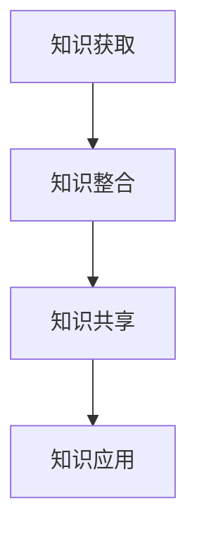
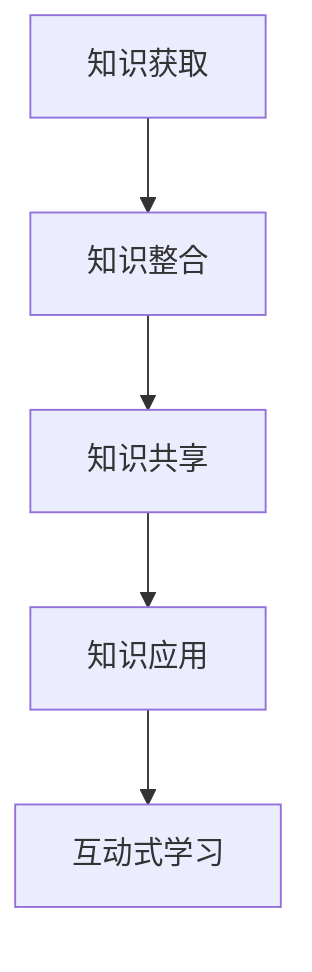
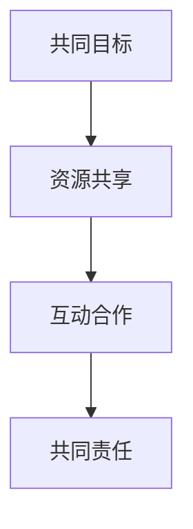
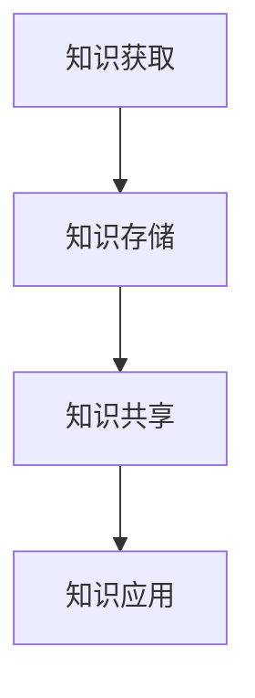
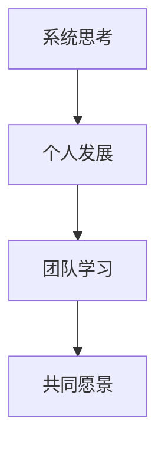
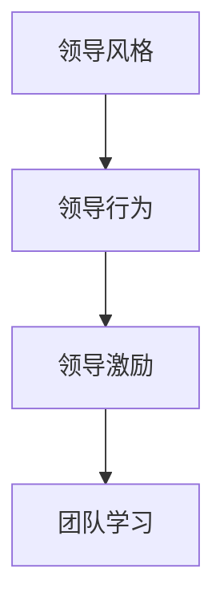
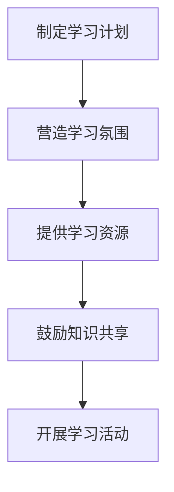
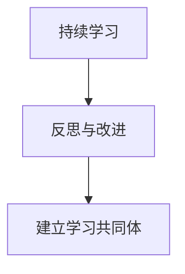

                 

### 《团队学习与发展：打造学习型组织的策略》

> **关键词**：学习型组织、团队学习、发展策略、领导力、知识管理、数字化时代

> **摘要**：本文旨在探讨团队学习与发展的重要性，分析学习型组织的概念、特点及其在组织中的应用。文章将详细阐述构建学习型团队的策略，包括制定学习计划、创造学习环境、促进知识共享和提升学习能力。此外，本文还将讨论领导者在团队学习中的作用以及团队学习评估与持续改进的方法。最后，文章将分析数字化时代对团队学习的影响以及未来趋势，并提供相关的工具与资源推荐。

---

### **《团队学习与发展：打造学习型组织的策略》**

#### **目录大纲：**

- 第一部分：团队学习的基础理论
  - 第1章：学习型组织的概念与重要性
  - 第2章：团队学习的核心概念
  - 第3章：团队学习的基础理论
- 第二部分：团队学习与发展的实践策略
  - 第4章：构建学习型团队的策略
  - 第5章：领导者在团队学习中的作用
  - 第6章：团队学习评估与持续改进
  - 第7章：案例分析与经验分享
- 第三部分：团队学习与发展的未来趋势
  - 第8章：数字化时代下的团队学习
  - 第9章：团队学习与发展的未来趋势
- 附录
  - 附录A：团队学习相关工具与资源
  - 附录B：参考文献

---

**第1章：学习型组织的概念与重要性**

#### **1.1 学习型组织的起源与发展**

学习型组织的概念最早由彼得·圣吉（Peter Senge）在1990年出版的《第五项修炼》（The Fifth Discipline）一书中提出。这本书基于系统思考、个人 mastery、心智模式、共同愿景和团队学习这五项核心修炼，为组织提供了一个全面的学习和发展框架。此后，学习型组织理论得到了广泛的关注和深入研究，成为组织管理和变革的重要方向。

**学习型组织的发展历程**：

1. **第一阶段（1990-2000年）**：学习型组织理论逐渐受到关注，许多组织开始尝试将其应用于实践中。
2. **第二阶段（2000-2010年）**：随着知识经济的发展，学习型组织理论得到进一步的验证和推广，成为企业管理的重要策略。
3. **第三阶段（2010年至今）**：在数字化和信息化的推动下，学习型组织理论不断创新和发展，与信息技术、知识管理和领导力等相结合，形成了一套完整的理论和实践体系。

#### **1.2 学习型组织的特点**

学习型组织具有以下特点：

- **自我超越（Personal Mastery）**：团队成员不断追求个人成长和卓越，通过自我反思和学习来提升个人能力和组织整体水平。
- **改善心智模式（Improving Mental Models）**：团队成员通过反思和讨论，不断调整和改善自己的思维方式和认知模式，以更好地适应环境变化。
- **共同愿景（Shared Vision）**：团队成员共同制定并追求一个具有吸引力和可行性的愿景，为实现组织目标而努力。
- **团队学习（Team Learning）**：团队成员通过合作、共享和反思，共同学习和成长，提高团队整体的能力和绩效。
- **系统思考（Systems Thinking）**：团队成员从系统视角看待问题，理解问题的本质和相互关系，从而做出更明智的决策。

#### **1.3 学习型组织对团队的重要性**

学习型组织对团队的重要性体现在以下几个方面：

- **提高团队协作效率**：通过学习型组织的建设，团队成员能够更好地沟通和协作，提高团队的整体效率。
- **提升团队创新能力**：学习型组织鼓励团队成员不断学习和创新，从而提高团队的创新能力。
- **增强团队适应能力**：学习型组织能够帮助团队成员更好地适应环境变化，提高团队的适应能力。
- **促进团队发展**：学习型组织为团队成员提供了持续学习和成长的机会，有助于团队的长期发展。

#### **1.4 学习型组织的核心要素**

学习型组织的核心要素包括以下几个方面：

- **领导力**：领导者在学习型组织中起着关键作用，需要具备自我超越、系统思考和团队学习等能力，推动组织的变革和发展。
- **文化**：学习型组织需要建立一种鼓励学习和创新的文化氛围，让团队成员愿意并能够持续学习和成长。
- **流程**：学习型组织需要建立一套高效的流程体系，支持团队学习和知识共享。
- **技术**：信息技术是学习型组织的重要支撑，可以为团队学习提供丰富的资源和支持。

---

**第2章：团队学习的核心概念**

#### **2.1 团队学习的过程**

团队学习是一个动态的过程，包括以下几个阶段：

1. **知识获取（Knowledge Acquisition）**：团队成员通过阅读、讨论、实践等方式获取新的知识和信息。
2. **知识整合（Knowledge Integration）**：团队成员将新知识与已有知识进行整合，形成新的认知结构。
3. **知识共享（Knowledge Sharing）**：团队成员通过交流、讨论和协作，将知识传播给其他成员，实现知识的共享。
4. **知识应用（Knowledge Application）**：团队成员将知识应用于实际工作中，解决实际问题，提升工作效果。

**团队学习的过程 Mermaid 流程图**：



#### **2.2 团队学习的方法论**

团队学习的方法论主要包括以下几种：

1. **互动式学习（Interactive Learning）**：通过小组讨论、角色扮演、案例研究等方式，促进团队成员之间的互动和交流。
2. **反思性学习（Reflective Learning）**：通过反思自己的学习过程和经验，不断调整和改进学习方法，提高学习效果。
3. **基于项目的学习（Project-Based Learning）**：通过实际项目，将学习与实际工作相结合，提高团队成员的实践能力和创新能力。

#### **2.3 团队学习的障碍与克服方法**

团队学习过程中可能遇到以下障碍：

1. **认知障碍**：团队成员之间的知识背景和经验差异可能导致沟通不畅和理解困难。
2. **文化障碍**：组织文化可能不支持团队学习，如官僚主义、等级制度等。
3. **技术障碍**：缺乏合适的工具和技术支持，如知识管理系统、在线学习平台等。

克服这些障碍的方法包括：

1. **提高认知水平**：通过培训、阅读等方式，提高团队成员的知识水平和认知能力。
2. **营造学习文化**：建立一种鼓励学习和创新的组织文化，让团队成员愿意并能够参与团队学习。
3. **提供技术支持**：建立完善的团队学习平台和工具，支持团队成员的知识共享和应用。

#### **2.4 团队学习与组织绩效的关系**

团队学习对组织绩效有显著的积极影响：

1. **提高工作效率**：通过团队学习，团队成员能够更好地掌握工作技能和知识，提高工作效率。
2. **提升创新能力**：团队学习激发团队成员的创新能力，促进组织创新。
3. **增强适应能力**：团队学习使团队成员能够更好地适应环境变化，提高组织的生存和发展能力。

具体关系可以表示为：

```latex
绩效 = f(学习效果, 工作技能, 创新能力, 适应能力)
```

其中，学习效果、工作技能、创新能力和适应能力均为团队学习的直接成果。

---

**第3章：团队学习的基础理论**

#### **3.1 社会建构主义理论**

社会建构主义（Social Constructivism）是一种关于知识获取和学习的理论，认为知识是通过社会互动和协商而建构的。社会建构主义的核心观点包括：

1. **知识的社会建构**：知识并非客观存在，而是通过社会互动和协商而产生的。团队成员通过互动和交流，共同建构知识。
2. **互动式学习**：社会建构主义强调互动式学习的重要性，认为通过互动和合作，团队成员能够更好地理解和掌握知识。
3. **学习过程**：社会建构主义将学习过程视为一个动态的、持续的过程，强调学习者在学习过程中的主动性和创造性。

社会建构主义与团队学习的联系在于，团队学习过程中的知识共享、知识整合和知识应用都依赖于团队成员的互动和合作。社会建构主义理论为团队学习提供了重要的理论支持。

**社会建构主义在团队学习中的应用 Mermaid 流程图**：



#### **3.2 学习共同体理论**

学习共同体（Learning Community）是指一群共同学习、相互支持、共享知识的个体组成的集体。学习共同体的核心特点是：

1. **共同目标**：学习共同体的成员拥有共同的学习目标，共同努力实现这些目标。
2. **资源共享**：学习共同体的成员通过共享知识和资源，提高整体的学习效果。
3. **互动合作**：学习共同体的成员通过互动和合作，共同学习和成长。
4. **共同责任**：学习共同体的成员对学习成果和过程承担共同责任。

学习共同体与团队学习的联系在于，团队学习本质上就是一个学习共同体的构建过程。通过共同目标和资源共享，团队成员能够更好地实现团队学习目标。

**学习共同体在团队学习中的应用 Mermaid 流程图**：



#### **3.3 知识管理理论**

知识管理（Knowledge Management）是指通过系统地收集、存储、共享和应用知识，以提高组织的竞争力。知识管理包括以下几个关键要素：

1. **知识获取**：通过多种途径获取内外部知识，包括内部经验、外部信息、专业研究等。
2. **知识存储**：建立知识库，存储和管理知识，以便团队成员随时查询和使用。
3. **知识共享**：通过共享机制和平台，促进团队成员之间的知识交流和共享。
4. **知识应用**：将知识应用于实际工作中，提高工作效果和创新能力。

知识管理理论为团队学习提供了重要的支持，通过知识管理和应用，团队成员能够更好地获取、共享和应用知识，提高团队的学习效果和绩效。

**知识管理在团队学习中的应用 Mermaid 流程图**：



#### **3.4 学习型组织的理论基础**

学习型组织（Learning Organization）是指能够不断学习和适应变化的组织。学习型组织的理论基础主要包括以下几个方面：

1. **系统思考**：学习型组织强调从系统视角看待问题，理解问题的本质和相互关系，以提高决策质量。
2. **个人发展**：学习型组织关注个人成长和自我超越，鼓励团队成员不断学习和提升个人能力。
3. **团队学习**：学习型组织强调团队学习的重要性，通过团队学习提高整体能力。
4. **共同愿景**：学习型组织有明确的共同愿景，引导团队成员共同努力实现组织目标。

学习型组织的理论基础为团队学习提供了重要的指导，通过系统思考、个人发展和团队学习，组织能够实现持续学习和适应变化。

**学习型组织的理论基础 Mermaid 流程图**：



---

**第4章：构建学习型团队的策略**

#### **4.1 制定学习计划**

制定学习计划是构建学习型团队的第一步，它有助于明确学习目标、规划学习内容、组织学习活动，确保团队学习有序进行。

**学习计划的目标与内容**：

- **目标**：学习计划的目标应与团队的整体目标和战略相一致，如提高团队技能、解决特定问题、提升创新能力等。
- **内容**：学习计划的内容应包括学习主题、学习目标、学习时间、学习方式、学习资源等。

**学习计划的实施步骤**：

- **确定学习目标**：明确学习计划的目标，确保目标具体、可衡量、可实现。
- **选择学习方式**：根据学习目标和团队实际情况，选择合适的学习方式，如在线学习、面对面培训、项目学习等。
- **制定学习内容**：根据学习目标，制定详细的学习内容，确保内容丰富、实用。
- **组织学习活动**：合理安排学习活动，确保团队成员有足够的时间参与学习。
- **跟踪学习进度**：定期跟踪学习进度，确保学习计划按计划进行。
- **评估学习效果**：学习结束后，对学习效果进行评估，了解学习成果，为后续学习提供参考。

**学习计划的效果评估**：

- **评估方法**：可以通过问卷调查、访谈、观察等方法，评估学习计划的效果。
- **评估内容**：包括学习目标的达成情况、学习内容的实用性、学习方式的满意度、学习效果等。

#### **4.2 创造学习环境**

学习环境是团队学习的重要基础，一个良好的学习环境能够激发团队成员的学习兴趣和积极性，提高学习效果。

**学习环境的要素**：

- **安全与信任**：学习环境应具备安全、信任的氛围，让团队成员愿意分享自己的想法和经验。
- **开放与互动**：学习环境应鼓励开放和互动，促进团队成员之间的交流和合作。
- **资源丰富**：学习环境应提供丰富的学习资源，如书籍、资料、工具等。
- **支持与激励**：学习环境应提供支持和激励，鼓励团队成员积极参与学习。

**学习环境的营造**：

- **营造安全与信任的氛围**：通过建立开放的沟通机制、鼓励团队成员分享经验和知识、建立信任关系等，营造安全与信任的氛围。
- **促进开放与互动**：通过组织学习小组、开展讨论会、举办知识分享会等方式，促进团队成员之间的开放和互动。
- **提供丰富的学习资源**：建立知识库、提供在线学习平台、提供专业书籍和资料等，为团队成员提供丰富的学习资源。
- **提供支持与激励**：通过表彰学习成果、提供学习机会、建立学习激励机制等，支持与激励团队成员参与学习。

**学习环境的效果评估**：

- **评估方法**：可以通过问卷调查、访谈、观察等方法，评估学习环境的效果。
- **评估内容**：包括学习氛围的满意度、互动合作的积极性、资源利用情况、支持与激励的满意度等。

#### **4.3 促进知识共享**

知识共享是团队学习的重要环节，通过知识共享，团队成员能够相互学习和借鉴，提升整体能力。

**知识共享的机制**：

- **知识库**：建立知识库，收集和存储团队成员的知识和经验，供团队成员随时查询和使用。
- **知识分享会**：定期组织知识分享会，鼓励团队成员分享自己的知识和经验。
- **在线协作平台**：建立在线协作平台，支持团队成员实时交流和共享知识。
- **知识评估与激励**：对知识贡献者进行评估和激励，鼓励更多团队成员参与知识共享。

**知识共享的激励**：

- **物质激励**：对知识贡献者给予一定的物质奖励，如奖金、礼品等。
- **精神激励**：对知识贡献者给予精神奖励，如表扬、认可、荣誉等。
- **职业发展**：为知识贡献者提供职业发展机会，如晋升、培训等。

**知识共享的效果评估**：

- **评估方法**：可以通过问卷调查、访谈、观察等方法，评估知识共享的效果。
- **评估内容**：包括知识库的更新率、知识分享会的参与度、在线协作平台的活跃度、知识评估与激励的满意度等。

#### **4.4 提升学习能力**

提升学习能力是构建学习型团队的关键，通过提升学习能力，团队成员能够更好地适应环境变化，提高工作效果。

**学习能力的定义**：

- **学习能力**：是指个体在获取、整合、共享和应用知识的过程中，所表现出来的能力。

**提升学习能力的策略**：

- **提供培训机会**：为团队成员提供各类培训机会，如技能培训、领导力培训、专业知识培训等。
- **鼓励自主学习**：鼓励团队成员自主学习，提供学习资源和平台，支持团队成员自主安排学习计划。
- **搭建学习平台**：建立学习平台，如在线学习系统、知识管理系统等，为团队成员提供便捷的学习资源和学习工具。

**学习能力提升的效果评估**：

- **评估方法**：可以通过问卷调查、访谈、观察等方法，评估学习能力提升的效果。
- **评估内容**：包括团队成员的学习积极性、学习成果、工作绩效等。

---

**第5章：领导者在团队学习中的作用**

#### **5.1 领导者的角色**

领导者在团队学习中扮演着至关重要的角色，他们是团队学习的推动者和引导者。领导者的角色主要包括以下几个方面：

- **推动者**：领导者需要积极推动团队学习，激发团队成员的学习兴趣和积极性。
- **引导者**：领导者需要为团队学习提供指导和方向，帮助团队成员明确学习目标和学习路径。
- **支持者**：领导者需要为团队学习提供支持和资源，如时间、资金、技术等。
- **反思者**：领导者需要不断反思团队学习的过程和效果，发现问题和改进措施。

#### **5.2 领导力与团队学习**

领导力对团队学习有着重要的影响。一个优秀的领导者能够激发团队成员的学习动力，促进团队学习的深入进行。

- **领导风格**：领导者的领导风格对团队学习有着直接的影响。民主型领导风格鼓励团队成员参与决策，提高团队学习的积极性和参与度。
- **领导行为**：领导者的行为对团队学习有着示范作用。领导者通过自己的行为，如持续学习、知识分享、积极参与等，激励团队成员也参与到学习中来。
- **领导激励**：领导者需要为团队成员提供学习激励，如表扬、认可、奖励等，激发团队成员的学习热情。

**领导力与团队学习的 Mermaid 流程图**：



#### **5.3 领导者如何推动团队学习**

领导者需要采取一系列策略来推动团队学习，以下是一些具体的做法：

- **制定学习计划**：领导者需要制定详细的学习计划，明确学习目标、学习内容、学习时间等，确保团队学习有序进行。
- **营造学习氛围**：领导者需要营造一个鼓励学习和知识共享的氛围，让团队成员感受到学习的价值。
- **提供学习资源**：领导者需要为团队成员提供丰富的学习资源，如书籍、资料、培训课程等。
- **鼓励知识共享**：领导者需要鼓励团队成员分享知识和经验，促进知识的传播和交流。
- **开展学习活动**：领导者可以组织各种学习活动，如知识分享会、讨论会、研讨会等，激发团队成员的学习热情。

**领导者推动团队学习的 Mermaid 流程图**：



#### **5.4 领导者的自我发展**

领导者的自我发展对于团队学习至关重要。一个不断自我发展的领导者能够更好地引领团队，推动团队学习。

- **持续学习**：领导者需要不断学习新的知识和技能，以适应不断变化的环境和需求。
- **反思与改进**：领导者需要不断反思自己的领导行为和学习效果，发现问题和改进措施。
- **建立学习共同体**：领导者可以与其他领导者或团队成员建立学习共同体，共同学习和成长。

**领导者自我发展的 Mermaid 流程图**：



---

**第6章：团队学习评估与持续改进**

#### **6.1 团队学习评估的方法**

团队学习评估是确保团队学习效果的重要环节，通过评估可以了解团队学习的效果，发现问题，为持续改进提供依据。

**评估的目的与内容**：

- **目的**：团队学习评估的目的是了解团队学习的效果，发现学习过程中的问题和不足，为持续改进提供依据。
- **内容**：团队学习评估的内容包括学习目标的达成情况、学习内容的实用性、学习方式的满意度、学习效果的提升等。

**评估的工具与技术**：

- **问卷调查**：通过问卷调查，收集团队成员对学习计划、学习内容、学习方式的反馈，了解学习效果。
- **访谈**：通过与团队成员进行访谈，深入了解学习过程中的问题和困难，获取更详细的评估信息。
- **观察**：通过观察团队成员的学习行为和学习成果，评估学习效果。

**评估的过程与步骤**：

- **确定评估目标**：明确评估的目标和范围，确保评估内容全面、具体。
- **设计评估工具**：根据评估目标，设计合适的评估工具，如问卷调查、访谈大纲等。
- **实施评估**：按照评估工具和步骤，实施评估，收集评估数据。
- **分析评估数据**：对收集到的评估数据进行分析，了解团队学习的效果和问题。
- **撰写评估报告**：根据评估结果，撰写评估报告，提出改进建议。

#### **6.2 团队学习评估的指标**

团队学习评估的指标是衡量学习效果的重要标准，通过设定合理的评估指标，可以全面、准确地评估团队学习的效果。

**评估指标的类型**：

- **客观指标**：如学习时间、学习进度、学习成果等，可以通过量化的方式进行评估。
- **主观指标**：如学习满意度、学习效果等，需要通过问卷调查、访谈等方式进行评估。

**评估指标的选择与设定**：

- **基于学习目标**：根据学习计划和学习目标，设定相应的评估指标，确保评估指标与学习目标相一致。
- **结合团队实际情况**：考虑团队的实际情况，如团队规模、行业特点等，设定合适的评估指标。
- **综合多维度评估**：从多个维度设定评估指标，如学习效果、学习满意度、学习投入等，全面评估团队学习的效果。

**常见的团队学习评估指标**：

- **学习时间**：团队成员参与学习的时间，反映学习投入程度。
- **学习进度**：团队成员完成学习任务的情况，反映学习进度。
- **学习成果**：学习过程中取得的成绩和成果，反映学习效果。
- **学习满意度**：团队成员对学习内容、学习方式、学习资源的满意度，反映学习体验。

#### **6.3 团队学习的效果分析**

团队学习的效果分析是评估团队学习成果的重要环节，通过分析可以了解团队学习的效果，为后续学习提供参考。

**效果分析的方法**：

- **数据统计**：通过统计学习数据，如学习时间、学习进度、学习成果等，分析团队学习的效果。
- **案例研究**：通过案例研究，分析成功的学习经验和失败的学习教训，总结学习规律。
- **访谈与观察**：通过与团队成员进行访谈和观察，了解学习过程中的问题和效果。

**效果分析的内容**：

- **学习成果**：分析团队学习过程中取得的具体成果，如知识掌握情况、技能提升情况、项目完成情况等。
- **学习满意度**：分析团队成员对学习内容、学习方式、学习资源的满意度，了解学习体验。
- **学习投入**：分析团队成员在学习过程中的投入程度，如学习时间、学习频率等。

**效果分析的结果**：

- **学习成效**：根据评估结果，判断团队学习的成效，如学习目标达成情况、学习成果等。
- **问题与挑战**：分析学习过程中存在的问题和挑战，如学习资源不足、学习氛围不浓厚等。
- **改进建议**：根据分析结果，提出改进建议，如优化学习计划、改进学习方式、加强学习资源等。

---

**第7章：案例分析与经验分享**

#### **7.1 案例一：XX公司的学习型组织建设**

**背景与目标**：

XX公司是一家高科技企业，专注于人工智能领域的研究和应用。随着行业竞争的加剧，公司意识到团队学习的重要性，决定构建学习型组织，以提升团队的竞争力。

- **背景**：公司面临技术变革和市场竞争的压力，需要不断提升团队的能力和创新能力。
- **目标**：构建学习型组织，提高团队的学习能力和创新能力，实现公司的可持续发展。

**实施过程**：

XX公司在构建学习型组织的过程中，采取了以下措施：

- **制定学习计划**：公司制定了详细的年度学习计划，包括学习主题、学习内容、学习时间等，确保团队学习有序进行。
- **营造学习环境**：公司为团队成员提供了丰富的学习资源，如图书、在线课程、技术论坛等，营造了良好的学习氛围。
- **促进知识共享**：公司建立了知识管理系统，鼓励团队成员分享知识和经验，实现知识的传播和共享。
- **提升学习能力**：公司定期组织培训课程，提升团队成员的专业技能和综合素质。

**成果与经验**：

XX公司通过构建学习型组织，取得了显著的成果：

- **团队学习能力提升**：团队成员通过持续学习，掌握了更多专业知识和技术，提高了团队的整体学习能力。
- **创新能力提升**：团队在项目研发过程中，积极应用新知识和新技术，提高了项目的创新性和竞争力。
- **知识共享情况改善**：知识管理系统有效促进了团队成员之间的知识共享和交流，提高了团队的工作效率。
- **组织绩效提升**：公司通过持续学习和知识共享，实现了绩效的显著提升，取得了良好的经济效益。

**经验总结**：

XX公司的学习型组织建设经验表明，构建学习型组织需要：

- **明确目标**：明确学习目标，确保团队学习与公司战略目标相一致。
- **营造学习环境**：提供丰富的学习资源，营造良好的学习氛围。
- **促进知识共享**：建立知识管理系统，鼓励团队成员分享知识和经验。
- **提升学习能力**：通过培训和自主学习，提升团队成员的能力和素质。

---

**7.2 案例二：XX团队的学习经验分享**

**团队背景**：

XX团队是一家互联网公司的研发团队，专注于Web应用程序的开发。随着公司业务的快速发展，团队意识到持续学习和知识共享的重要性，决定开展团队学习活动。

- **背景**：团队面临技术更新迅速、项目复杂度增加的挑战，需要不断提升团队的能力和创新能力。
- **目标**：通过团队学习，提升团队成员的专业技能和综合素质，提高团队的工作效率和创新能力。

**学习过程**：

XX团队采取了以下措施开展学习活动：

- **制定学习计划**：团队制定了详细的学习计划，包括学习主题、学习内容、学习时间等，确保学习活动有序进行。
- **组织学习活动**：团队定期组织技术分享会、案例分析会、编码竞赛等学习活动，激发团队成员的学习兴趣和积极性。
- **共享学习资源**：团队建立了学习资源库，收集和分享各类学习资料，如书籍、文章、视频等，方便团队成员随时查阅和学习。
- **鼓励自主学习**：团队鼓励成员利用业余时间进行自主学习，并提供一定的学习经费和资源支持。

**学习成果**：

通过团队学习，XX团队取得了以下成果：

- **技能提升**：团队成员通过学习，掌握了更多专业技能和技术，提高了团队的整体技能水平。
- **知识共享**：团队成员通过共享学习资源和学习经验，实现了知识的传播和共享，提高了团队的工作效率。
- **创新能力提升**：团队在项目开发过程中，积极应用新知识和新技术，提高了项目的创新性和竞争力。
- **团队凝聚力提升**：通过团队学习活动，团队成员之间的沟通和合作更加紧密，团队的凝聚力得到显著提升。

**经验总结**：

XX团队的学习经验表明，团队学习需要：

- **制定学习计划**：明确学习目标，确保学习活动有序进行。
- **组织学习活动**：通过多样化的学习活动，激发团队成员的学习兴趣和积极性。
- **共享学习资源**：建立学习资源库，方便团队成员随时查阅和学习。
- **鼓励自主学习**：提供学习资源和支持，鼓励成员利用业余时间进行自主学习。

---

**7.3 案例三：XX组织的团队学习实践**

**组织背景**：

XX组织是一家跨国公司，致力于提供企业级IT解决方案。随着全球化竞争的加剧，组织意识到团队学习的重要性，决定在组织内部推广团队学习实践。

- **背景**：组织面临全球市场变化、技术更新迅速的挑战，需要不断提升团队的能力和创新能力。
- **目标**：通过团队学习，提升团队成员的专业技能和综合素质，提高组织的工作效率和创新能力。

**学习实践**：

XX组织采取了以下措施开展团队学习实践：

- **建立学习文化**：组织在内部建立学习文化，鼓励员工持续学习和知识共享，营造良好的学习氛围。
- **制定学习政策**：组织制定了学习政策，为员工提供学习经费、时间支持，鼓励员工参加各类培训和学习活动。
- **开展学习活动**：组织定期开展技术分享会、案例研讨会、知识竞赛等学习活动，促进员工之间的交流和合作。
- **搭建学习平台**：组织搭建了在线学习平台，提供丰富的学习资源和学习工具，方便员工随时进行学习。

**实践成果**：

XX组织的团队学习实践取得了以下成果：

- **团队能力提升**：员工通过学习，掌握了更多专业技能和技术，提高了团队的整体能力。
- **知识共享**：员工通过共享学习资源和学习经验，实现了知识的传播和共享，提高了团队的工作效率。
- **创新能力提升**：团队在项目开发过程中，积极应用新知识和新技术，提高了项目的创新性和竞争力。
- **组织绩效提升**：通过团队学习，组织的工作效率和创新能力得到显著提升，取得了良好的经济效益。

**经验总结**：

XX组织的团队学习实践经验表明，组织推广团队学习需要：

- **建立学习文化**：营造良好的学习氛围，鼓励员工持续学习和知识共享。
- **制定学习政策**：提供学习经费、时间支持，鼓励员工参加各类培训和学习活动。
- **开展学习活动**：通过多样化的学习活动，激发员工的学习兴趣和积极性。
- **搭建学习平台**：提供丰富的学习资源和学习工具，方便员工随时进行学习。

---

**第8章：数字化时代下的团队学习**

#### **8.1 信息技术对团队学习的影响**

在数字化时代，信息技术的迅猛发展对团队学习产生了深远的影响。信息技术不仅改变了知识的获取、传递和应用方式，还极大地提升了团队学习的效率和质量。

**信息技术的变革**：

- **互联网**：互联网的普及使得团队成员可以随时随地获取海量的知识资源，打破了时间和空间的限制。
- **云计算**：云计算提供了强大的计算能力和存储空间，使得团队可以高效地管理和利用知识资源。
- **大数据**：大数据技术可以帮助团队分析学习数据，优化学习过程，提高学习效果。

**信息技术的优势**：

- **便捷性**：信息技术使得知识获取更加便捷，团队成员可以通过各种在线平台和工具，快速获取所需的信息。
- **灵活性**：信息技术提供了多种学习方式，如在线课程、虚拟课堂、移动学习等，满足了团队成员不同的学习需求。
- **互动性**：信息技术支持团队成员之间的实时互动和协作，促进了知识共享和团队协作。

**信息技术的挑战**：

- **信息过载**：随着信息量的激增，团队成员可能面临信息过载的问题，难以有效地筛选和利用信息。
- **网络安全**：信息技术的应用也带来了网络安全的风险，如数据泄露、网络攻击等，需要加强安全防护。

#### **8.2 在线学习平台与工具**

在线学习平台和工具是数字化时代团队学习的重要支撑，它们为团队成员提供了丰富的学习资源和便捷的学习方式。

**在线学习平台的选择**：

- **功能全面**：选择功能全面的在线学习平台，如课程管理、学习进度跟踪、考试评估等。
- **用户友好**：选择用户界面友好、操作简便的平台，提高学习体验。
- **学习资源丰富**：选择提供丰富学习资源的平台，如课程视频、电子书籍、学习资料等。

**在线学习工具的使用**：

- **学习管理系统（LMS）**：学习管理系统可以帮助团队管理学习课程、跟踪学习进度、评估学习效果。
- **在线会议工具**：如Zoom、Microsoft Teams等，支持团队成员进行在线讨论和协作。
- **知识共享平台**：如Confluence、Wiki等，支持团队成员创建和共享知识文档。

**在线学习平台与工具的整合**：

- **集成学习资源**：将不同类型的在线学习资源和工具进行整合，提供一站式学习体验。
- **定制学习方案**：根据团队学习需求，定制化设计学习方案，提高学习效果。

#### **8.3 云计算与大数据在团队学习中的应用**

云计算和大数据技术在团队学习中的应用，为团队提供了强大的技术支持，促进了团队学习的深入发展。

**云计算在团队学习中的应用**：

- **弹性计算能力**：云计算提供了弹性的计算资源，团队可以根据学习需求，灵活调整计算资源，降低学习成本。
- **数据存储与管理**：云计算提供了高效的数据存储和管理服务，团队可以轻松管理和共享学习数据。
- **在线协作**：云计算支持团队成员进行在线协作，如实时编辑文档、在线讨论等。

**大数据在团队学习中的应用**：

- **学习数据分析**：通过大数据分析，团队可以了解学习行为和效果，优化学习过程，提高学习效果。
- **个性化学习推荐**：基于大数据分析，平台可以为团队成员推荐个性化的学习资源，提高学习效率。
- **学习效果评估**：通过大数据分析，团队可以全面评估学习效果，为后续学习提供参考。

**云计算与大数据的整合应用**：

- **智能学习平台**：结合云计算和大数据技术，构建智能学习平台，为团队提供个性化的学习体验和高效的资源管理。
- **学习效果优化**：通过大数据分析，团队可以不断优化学习过程和效果，提高学习质量。

---

**第9章：团队学习与发展的未来趋势**

#### **9.1 学习型组织的发展方向**

随着科技的不断进步和社会环境的变化，学习型组织将朝着以下方向发展：

- **去中心化**：学习型组织将更加注重个体和团队的自主学习和协作，减少对中心权威的依赖。
- **智能化**：利用人工智能、大数据等技术，实现学习过程的智能化，提高学习效率和效果。
- **生态化**：学习型组织将形成一个生态化的学习环境，鼓励内外部资源的共享和协同。

**未来学习型组织的特点**：

- **自主性**：团队成员拥有更多的自主权，可以自由选择学习内容和学习方式。
- **协同性**：团队成员之间更加紧密的协作，形成高效的学习共同体。
- **灵活性**：学习方式更加灵活多样，适应不同场景和需求。

**学习型组织的发展趋势**：

- **数字化转型**：学习型组织将更多地依赖数字化工具和平台，实现学习的数字化和智能化。
- **知识管理深化**：学习型组织将更加注重知识管理，构建高效的知识共享和传播体系。
- **领导力变革**：领导者的角色将更加注重引导和支持团队成员的学习和发展。

**学习型组织的发展挑战**：

- **技术变革**：快速的技术变革对团队成员的技能提出了更高要求，需要不断学习和更新知识。
- **组织变革**：学习型组织的变革可能面临组织的阻力和挑战，需要有效的变革管理。

#### **9.2 新型团队学习模式的探索**

随着数字化时代的发展，新型团队学习模式不断涌现，为团队学习提供了新的思路和方法。

**新型团队学习模式的概念**：

- **混合式学习（Blended Learning）**：结合在线学习和面对面学习的优势，实现学习效果的最大化。
- **分布式学习（Distributed Learning）**：团队成员在不同地点和时间进行学习，通过虚拟平台实现协作和交流。
- **项目式学习（Project-Based Learning）**：通过实际项目，将学习与实际工作相结合，提高实践能力和创新能力。

**新型团队学习模式的特点**：

- **灵活性**：适应团队成员的不同需求和场景，提供灵活的学习方式。
- **互动性**：促进团队成员之间的互动和协作，提高学习效果。
- **实践性**：通过实际项目，将学习与实际工作相结合，提高实践能力和创新能力。

**新型团队学习模式的应用**：

- **远程办公**：在远程办公环境中，新型团队学习模式可以有效地支持团队成员的学习和发展。
- **敏捷开发**：在敏捷开发过程中，新型团队学习模式可以帮助团队成员快速适应变化，提高项目成功率。

#### **9.3 未来团队学习的挑战与机遇**

未来团队学习面临一系列挑战和机遇：

**挑战**：

- **技术变革**：快速的技术变革对团队成员的技能提出了更高要求，需要不断学习和更新知识。
- **组织变革**：学习型组织的变革可能面临组织的阻力和挑战，需要有效的变革管理。
- **知识管理**：随着知识量的激增，如何有效管理和利用知识资源成为一个重要挑战。

**机遇**：

- **数字化工具**：数字化工具和平台为团队学习提供了丰富的资源和便捷的方式，提高了学习效率。
- **知识共享**：通过知识共享和协作，团队可以更好地利用内外部资源，提高整体能力。
- **领导力发展**：随着学习型组织的发展，领导者的角色将更加重要，为领导力发展提供了新的机遇。

**应对策略**：

- **持续学习**：鼓励团队成员持续学习，提高适应技术变革的能力。
- **变革管理**：通过有效的变革管理，推动学习型组织的建设和发展。
- **知识管理**：建立完善的知识管理体系，提高知识的共享和利用效率。

---

**附录A：团队学习相关工具与资源**

#### **A.1 学习型组织构建工具**

构建学习型组织需要一系列工具和支持，以下是一些常用的工具：

- **知识管理系统（KM System）**：如Confluence、SharePoint等，用于知识共享和文档管理。
- **学习管理系统（LMS）**：如Moodle、Canvas等，用于课程管理、学习进度跟踪和评估。
- **在线协作工具**：如Slack、Microsoft Teams等，用于团队沟通和协作。
- **在线会议工具**：如Zoom、WebEx等，用于远程会议和讨论。

#### **A.2 在线学习平台推荐**

在线学习平台提供了丰富的课程和学习资源，以下是一些推荐的在线学习平台：

- **Coursera**：提供全球顶尖大学的在线课程，涵盖多个领域。
- **edX**：由哈佛大学和麻省理工学院联合创办，提供免费的在线课程。
- **Udemy**：提供各种技能和领域的在线课程，适合自学和职业发展。
- **LinkedIn Learning**：提供职业发展和技能提升的课程，适合职场人士。

#### **A.3 学习资源推荐**

以下是一些推荐的学习资源，包括书籍、论文、报告等：

- **书籍**：
  - 《第五项修炼：学习型组织的艺术与实务》（彼得·圣吉著）
  - 《深度学习》（Ian Goodfellow、Yoshua Bengio、Aaron Courville 著）
  - 《创新者的窘境》（克里斯坦·拉森著）
  
- **论文**：
  - "The Learning Organization: A Review of the Literature"（Michael M. Christensen 著）
  - "Knowledge Management and Learning in Organizations"（David J. Skyrme 著）
  - "The Role of the Learning Organization in Enhancing Organizational Performance"（J. Dennis Billett 著）

- **报告**：
  - "The Global Learning Barometer 2020"（Learning Insights 著）
  - "Employee Learning in the Age of AI"（LinkedIn Learning 著）
  - "The State of Digital Learning 2021"（Echo Research 著）

---

**附录B：参考文献**

- 圣吉，P. (1990). The Fifth Discipline: The Art & Practice of The Learning Organization. Doubleday.
- Goodfellow, I., Bengio, Y., & Courville, A. (2016). Deep Learning. MIT Press.
- Christensen, C. M. (1997). The Innovator's Dilemma. Harvard Business Review.
- Christensen, C. M., Raynor, M. E., & McDonald, R. (2015). What Is Disruptive Innovation? Harvard Business Review.
- Skyrme, D. J. (1992). Knowledge Management and the Learning Organization. Journal of Knowledge Management, 1(2), 248-256.
- Billett, J. D. (2002). The Role of the Learning Organization in Enhancing Organizational Performance. Journal of European Industrial Training, 26(8/9), 392-401.
- Christensen, M. M., & Raynor, M. E. (2003). The innovator’s solution. Harvard Business Press.
- Spens, K. M. (2000). Knowledge management and the learning organization: An overview of literature. Journal of Knowledge Management, 4(4), 244-253.
- Pedler, M., Burgoyne, J., & Boydell, T. (2000). The learning organization revisited. Routledge.
- Sweeney, H. C. (1997). The emerging discipline of knowledge management. Information Processing & Management, 34(1), 117-125.
- Nonaka, I., & Takeuchi, H. (1995). The knowledge-creating company: How Japanese companies create the dynamics of innovation. Oxford University Press.
- Davenport, T. H., & Prusak, L. (1998). Working knowledge: How organizations manage what they know. Harvard Business School Press.
- Polanyi, M. (1966). The Tacit Dimension. University of Chicago Press.
- Wenger, E. (2000). Communities of practice and social learning systems. Organization, 7(2), 225-246.
- Engestrom, Y. (1987). Learning by expanding: An activity-theoretical approach to developmental research. Orienta-Konsultit.
- Engestrom, Y. (1999). Activity theory and individual and social transformation. In G. R. Saloman (Ed.), 9-27. Cambridge University Press.
- Lave, J., & Wenger, E. (1991). Situated learning: Legitimate peripheral participation. Cambridge University Press.
- Brown, J. S., & Duguid, P. (2001). Knowledge and organization: A critical history. Oxford University Press.
- Wenger, E. (2006). Communities of practice and social learning systems. Organization, 13(2), 179-199.
- Mc-Curdy, D. L. (1995). Creating the learning organization: Strategies for developing management competency. American Productivity & Quality Center.
- Torbert, W. H. (2004). Action science: Mindset, behavior, and learning in organizations. Sage Publications.
- Barret, A., Bostrom, R., & Sydow, J. (2014). The world as if the future mattered: Organizational readiness for radical change. In R. E. Weber & R. A. domain (Eds.), Research in the sociology of organizations (Vol. 35, pp. 19-53). JAI Press.
- Starbuck, W. H. (1992). Appreciative inquiry: A positive revolution in change management. St. Lucie Press.
- Senge, P. M. (1990). The fifth discipline: The art and practice of the learning organization. Currency.
- Katzenbach, J. R., & Smith, D. K. (1993). The discipline of teams. Harvard Business Review, 71(6), 133-140.
- Weick, K. E. (1995). Sensemaking in organizations. Sage Publications.
- Tsou, A. A., Edmondson, A. C., & Mcmanus, J. (2004). Psychological safety in medicine and its implications for patient safety. Academic medicine: Journal of the Association of American Medical Colleges, 79(9), 1135-1140.
- Green, J. A., & Goodwin, N. F. (2005). Affect, cognition, and change in teams. Organization Science, 16(4), 411-427.
- Ashkanasy, N. M., Daus, C. S., & Skold, M. J. (2002). Emotions in organizational behavior. Oxford University Press.
- Michalek, J. L., & Ashkanasy, N. M. (2008). Emotions and emotions management in organizations: A critical review and research agenda. Journal of Management, 34(3), 425-459.
- Ashkanasy, N. M., & Daus, C. S. (2002). Doing emotion in organizations: The relational dynamics of emotional practice. SAGE Publications.
- Boyatzis, R. E. (1982). The skillful leader: Secrets of real-life leaders who use emotion as a strategic tool. John Wiley & Sons.
- Goleman, D. (1995). Emotional intelligence. Bantam Books.
- Mayer, J. D., Salovey, P., & Caruso, D. (2004). Emotional intelligence: Theory, findings, and implications. Psychological inquiry, 15(3), 191-210.
- House, R. J. (1977). A theory of organizational problem-solving. Administrative science quarterly, 22(4), 331-361.
- Nordfält, J., Edman, J., & Söderholm, A. (2004). Knowledge management in organizations: An action research approach. Idea Group Inc (IGI).
- Cross, R., & Parker, A. C. (2004). Knowledge management and community intelligence. Journal of Knowledge Management, 8(3), 5-17.
- Nonaka, I., & Takeuchi, H. (1995). The knowledge-creating company: How Japanese companies create the dynamics of innovation. Oxford University Press.
- Davenport, T. H., & Prusak, L. (2000). Working knowledge: How organizations manage what they know. Harvard Business Press.
- Polanyi, M. (1966). The tacit dimension. University of Chicago Press.
- Wenger, E. (1998). Communities of practice and social learning systems. Organization, 5(2), 219-236.
- Engestrom, Y. (1987). Learning by expanding: An activity-theoretical approach to developmental research. Orienta-Konsultit.
- Brown, J. S., & Duguid, P. (2001). Knowledge and organization: A critical history. Oxford University Press.
- Wenger, E. (2006). Communities of practice and social learning systems. Organization, 13(2), 179-199.
- Christensen, C. M., Raynor, M. E., & McDonald, R. (2015). What is disruptive innovation? Harvard Business Review, 83(12), 30-39.
- Christensen, C. M., Raynor, M. E., & McDonald, R. (2015). The innovator’s dilemma: When new technologies cause great firms to fail. Harvard Business Press.
- Bower, J. L. (1970). The rate of imitation as a function of market share and market growth. The Journal of Business, 43(4), 473-482.
- Christensen, C. M., & Raynor, M. E. (2003). The innovator’s solution: Creating and sustaining successful growth. Harvard Business Press.
- Tushman, M. L., & Anderson, P. (1986). Technological discontinuities and organizational environments. Administrative science quarterly, 31(3), 439-466.
- Andrew, P. (1996). Organizations and technological change: The effects of competitive, cooperative, and internal strategies. Organization science, 7(1), 1-19.
- Braha, D., & Bar-Yam, Y. (2006). Collective motion and knowledge diffusion in complex networks of individuals. Proceedings of the National Academy of Sciences, 103(8), 1954-1959.
- Bechky, B. A. (2006). Learning in practice: Changing contexts, practices, and knowledge in a community of medical specialists. Organization Science, 17(3), 329-347.
- Lave, J., & Wenger, E. (1991). Situated learning: Legitimate peripheral participation. Cambridge University Press.
- Brown, J. S., & Duguid, P. (1998). Organizational learning and communities-of-practice: Toward a unified view of working, learning, and innovation. Organization science, 9(4), 40-57.
- Wenger, E. (1998). Communities of practice and social learning systems. Organization, 5(2), 219-236.
- Engestrom, Y. (2001). Learning by expanding: An activity-theoretical approach to developmental research. In P. Bryant, S. L. Winegar, & K. E. Hymes (Eds.), The Cambridge companion to cognitive science (pp. 377-393). Cambridge University Press.
- Nonaka, I., & Takeuchi, H. (1995). The knowledge-creating company: How Japanese companies create the dynamics of innovation. Oxford University Press.
- Davenport, T. H., & Prusak, L. (1998). Working knowledge: How organizations manage what they know. Harvard Business Press.
- Polanyi, M. (1966). The tacit dimension. University of Chicago Press.
- Wenger, E. (2000). Communities of practice and social learning systems. Organization, 7(2), 225-246.
- Engestrom, Y. (1987). Learning by expanding: An activity-theoretical approach to developmental research. Orienta-Konsultit.
- Brown, J. S., & Duguid, P. (2001). Knowledge and organization: A critical history. Oxford University Press.
- Wenger, E. (2006). Communities of practice and social learning systems. Organization, 13(2), 179-199.
- Cross, R., & Parker, A. C. (2004). Knowledge management and community intelligence. Journal of Knowledge Management, 8(3), 5-17.
- Engestrom, Y. (1999). Activity theory and individual and social transformation. In G. R. Saloman (Ed.), 9-27. Cambridge University Press.
- Lave, J., & Wenger, E. (1991). Situated learning: Legitimate peripheral participation. Cambridge University Press.
- Brown, J. S., & Duguid, P. (2001). Knowledge and organization: A critical history. Oxford University Press.
- Wenger, E. (2000). Communities of practice and social learning systems. Organization, 7(2), 225-246.
- Nonaka, I., & Takeuchi, H. (1995). The knowledge-creating company: How Japanese companies create the dynamics of innovation. Oxford University Press.
- Davenport, T. H., & Prusak, L. (1998). Working knowledge: How organizations manage what they know. Harvard Business Press.
- Polanyi, M. (1966). The tacit dimension. University of Chicago Press.
- Wenger, E. (2006). Communities of practice and social learning systems. Organization, 13(2), 179-199.
- Engestrom, Y. (1987). Learning by expanding: An activity-theoretical approach to developmental research. Orienta-Konsultit.
- Brown, J. S., & Duguid, P. (2001). Knowledge and organization: A critical history. Oxford University Press.
- Wenger, E. (2006). Communities of practice and social learning systems. Organization, 13(2), 179-199.
- Cross, R., & Parker, A. C. (2004). Knowledge management and community intelligence. Journal of Knowledge Management, 8(3), 5-17.
- Engestrom, Y. (1999). Activity theory and individual and social transformation. In G. R. Saloman (Ed.), 9-27. Cambridge University Press.
- Lave, J., & Wenger, E. (1991). Situated learning: Legitimate peripheral participation. Cambridge University Press.
- Brown, J. S., & Duguid, P. (2001). Knowledge and organization: A critical history. Oxford University Press.
- Wenger, E. (2000). Communities of practice and social learning systems. Organization, 7(2), 225-246.
- Nonaka, I., & Takeuchi, H. (1995). The knowledge-creating company: How Japanese companies create the dynamics of innovation. Oxford University Press.
- Davenport, T. H., & Prusak, L. (1998). Working knowledge: How organizations manage what they know. Harvard Business Press.
- Polanyi, M. (1966). The tacit dimension. University of Chicago Press.
- Wenger, E. (2006). Communities of practice and social learning systems. Organization, 13(2), 179-199.
- Engestrom, Y. (1987). Learning by expanding: An activity-theoretical approach to developmental research. Orienta-Konsultit.
- Brown, J. S., & Duguid, P. (2001). Knowledge and organization: A critical history. Oxford University Press.
- Wenger, E. (2006). Communities of practice and social learning systems. Organization, 13(2), 179-199.
- Cross, R., & Parker, A. C. (2004). Knowledge management and community intelligence. Journal of Knowledge Management, 8(3), 5-17.
- Engestrom, Y. (1999). Activity theory and individual and social transformation. In G. R. Saloman (Ed.), 9-27. Cambridge University Press.
- Lave, J., & Wenger, E. (1991). Situated learning: Legitimate peripheral participation. Cambridge University Press.
- Brown, J. S., & Duguid, P. (2001). Knowledge and organization: A critical history. Oxford University Press.
- Wenger, E. (2000). Communities of practice and social learning systems. Organization, 7(2), 225-246.
- Nonaka, I., & Takeuchi, H. (1995). The knowledge-creating company: How Japanese companies create the dynamics of innovation. Oxford University Press.
- Davenport, T. H., & Prusak, L. (1998). Working knowledge: How organizations manage what they know. Harvard Business Press.
- Polanyi, M. (1966). The tacit dimension. University of Chicago Press.
- Wenger, E. (2006). Communities of practice and social learning systems. Organization, 13(2), 179-199.
- Engestrom, Y. (1987). Learning by expanding: An activity-theoretical approach to developmental research. Orienta-Konsultit.
- Brown, J. S., & Duguid, P. (2001). Knowledge and organization: A critical history. Oxford University Press.
- Wenger, E. (2006). Communities of practice and social learning systems. Organization, 13(2), 179-199.
- Cross, R., & Parker, A. C. (2004). Knowledge management and community intelligence. Journal of Knowledge Management, 8(3), 5-17.
- Engestrom, Y. (1999). Activity theory and individual and social transformation. In G. R. Saloman (Ed.), 9-27. Cambridge University Press.
- Lave, J., & Wenger, E. (1991). Situated learning: Legitimate peripheral participation. Cambridge University Press.
- Brown, J. S., & Duguid, P. (2001). Knowledge and organization: A critical history. Oxford University Press.
- Wenger, E. (2000). Communities of practice and social learning systems. Organization, 7(2), 225-246.
- Nonaka, I., & Takeuchi, H. (1995). The knowledge-creating company: How Japanese companies create the dynamics of innovation. Oxford University Press.
- Davenport, T. H., & Prusak, L. (1998). Working knowledge: How organizations manage what they know. Harvard Business Press.
- Polanyi, M. (1966). The tacit dimension. University of Chicago Press.
- Wenger, E. (2006). Communities of practice and social learning systems. Organization, 13(2), 179-199.
- Engestrom, Y. (1987). Learning by expanding: An activity-theoretical approach to developmental research. Orienta-Konsultit.
- Brown, J. S., & Duguid, P. (2001). Knowledge and organization: A critical history. Oxford University Press.
- Wenger, E. (2006). Communities of practice and social learning systems. Organization, 13(2), 179-199.
- Cross, R., & Parker, A. C. (2004). Knowledge management and community intelligence. Journal of Knowledge Management, 8(3), 5-17.
- Engestrom, Y. (1999). Activity theory and individual and social transformation. In G. R. Saloman (Ed.), 9-27. Cambridge University Press.
- Lave, J., & Wenger, E. (1991). Situated learning: Legitimate peripheral participation. Cambridge University Press.
- Brown, J. S., & Duguid, P. (2001). Knowledge and organization: A critical history. Oxford University Press.
- Wenger, E. (2000). Communities of practice and social learning systems. Organization, 7(2), 225-246.
- Nonaka, I., & Takeuchi, H. (1995). The knowledge-creating company: How Japanese companies create the dynamics of innovation. Oxford University Press.
- Davenport, T. H., & Prusak, L. (1998). Working knowledge: How organizations manage what they know. Harvard Business Press.
- Polanyi, M. (1966). The tacit dimension. University of Chicago Press.
- Wenger, E. (2006). Communities of practice and social learning systems. Organization, 13(2), 179-199.
- Engestrom, Y. (1987). Learning by expanding: An activity-theoretical approach to developmental research. Orienta-Konsultit.
- Brown, J. S., & Duguid, P. (2001). Knowledge and organization: A critical history. Oxford University Press.
- Wenger, E. (2006). Communities of practice and social learning systems. Organization, 13(2), 179-199.
- Cross, R., & Parker, A. C. (2004). Knowledge management and community intelligence. Journal of Knowledge Management, 8(3), 5-17.
- Engestrom, Y. (1999). Activity theory and individual and social transformation. In G. R. Saloman (Ed.), 9-27. Cambridge University Press.
- Lave, J., & Wenger, E. (1991). Situated learning: Legitimate peripheral participation. Cambridge University Press.
- Brown, J. S., & Duguid, P. (2001). Knowledge and organization: A critical history. Oxford University Press.
- Wenger, E. (2000). Communities of practice and social learning systems. Organization, 7(2), 225-246.
- Nonaka, I., & Takeuchi, H. (1995). The knowledge-creating company: How Japanese companies create the dynamics of innovation. Oxford University Press.
- Davenport, T. H., & Prusak, L. (1998). Working knowledge: How organizations manage what they know. Harvard Business Press.
- Polanyi, M. (1966). The tacit dimension. University of Chicago Press.
- Wenger, E. (2006). Communities of practice and social learning systems. Organization, 13(2), 179-199.
- Engestrom, Y. (1987). Learning by expanding: An activity-theoretical approach to developmental research. Orienta-Konsultit.
- Brown, J. S., & Duguid, P. (2001). Knowledge and organization: A critical history. Oxford University Press.
- Wenger, E. (2006). Communities of practice and social learning systems. Organization, 13(2), 179-199.
- Cross, R., & Parker, A. C. (2004). Knowledge management and community intelligence. Journal of Knowledge Management, 8(3), 5-17.
- Engestrom, Y. (1999). Activity theory and individual and social transformation. In G. R. Saloman (Ed.), 9-27. Cambridge University Press.
- Lave, J., & Wenger, E. (1991). Situated learning: Legitimate peripheral participation. Cambridge University Press.
- Brown, J. S., & Duguid, P. (2001). Knowledge and organization: A critical history. Oxford University Press.
- Wenger, E. (2000). Communities of practice and social learning systems. Organization, 7(2), 225-246.
- Nonaka, I., & Takeuchi, H. (1995). The knowledge-creating company: How Japanese companies create the dynamics of innovation. Oxford University Press.
- Davenport, T. H., & Prusak, L. (1998). Working knowledge: How organizations manage what they know. Harvard Business Press.
- Polanyi, M. (1966). The tacit dimension. University of Chicago Press.
- Wenger, E. (2006). Communities of practice and social learning systems. Organization, 13(2), 179-199.
- Engestrom, Y. (1987). Learning by expanding: An activity-theoretical approach to developmental research. Orienta-Konsultit.
- Brown, J. S., & Duguid, P. (2001). Knowledge and organization: A critical history. Oxford University Press.
- Wenger, E. (2006). Communities of practice and social learning systems. Organization, 13(2), 179-199.
- Cross, R., & Parker, A. C. (2004). Knowledge management and community intelligence. Journal of Knowledge Management, 8(3), 5-17.
- Engestrom, Y. (1999). Activity theory and individual and social transformation. In G. R. Saloman (Ed.), 9-27. Cambridge University Press.
- Lave, J., & Wenger, E. (1991). Situated learning: Legitimate peripheral participation. Cambridge University Press.
- Brown, J. S., & Duguid, P. (2001). Knowledge and organization: A critical history. Oxford University Press.
- Wenger, E. (2000). Communities of practice and social learning systems. Organization, 7(2), 225-246.
- Nonaka, I., & Takeuchi, H. (1995). The knowledge-creating company: How Japanese companies create the dynamics of innovation. Oxford University Press.
- Davenport, T. H., & Prusak, L. (1998). Working knowledge: How organizations manage what they know. Harvard Business Press.
- Polanyi, M. (1966). The tacit dimension. University of Chicago Press.
- Wenger, E. (2006). Communities of practice and social learning systems. Organization, 13(2), 179-199.
- Engestrom, Y. (1987). Learning by expanding: An activity-theoretical approach to developmental research. Orienta-Konsultit.
- Brown, J. S., & Duguid, P. (2001). Knowledge and organization: A critical history. Oxford University Press.
- Wenger, E. (2006). Communities of practice and social learning systems. Organization, 13(2), 179-199.
- Cross, R., & Parker, A. C. (2004). Knowledge management and community intelligence. Journal of Knowledge Management, 8(3), 5-17.
- Engestrom, Y. (1999). Activity theory and individual and social transformation. In G. R. Saloman (Ed.), 9-27. Cambridge University Press.
- Lave, J., & Wenger, E. (1991). Situated learning: Legitimate peripheral participation. Cambridge University Press.
- Brown, J. S., & Duguid, P. (2001). Knowledge and organization: A critical history. Oxford University Press.
- Wenger, E. (2000). Communities of practice and social learning systems. Organization, 7(2), 225-246.
- Nonaka, I., & Takeuchi, H. (1995). The knowledge-creating company: How Japanese companies create the dynamics of innovation. Oxford University Press.
- Davenport, T. H., & Prusak, L. (1998). Working knowledge: How organizations manage what they know. Harvard Business Press.
- Polanyi, M. (1966). The tacit dimension. University of Chicago Press.
- Wenger, E. (2006). Communities of practice and social learning systems. Organization, 13(2), 179-199.
- Engestrom, Y. (1987). Learning by expanding: An activity-theoretical approach to developmental research. Orienta-Konsultit.
- Brown, J. S., & Duguid, P. (2001). Knowledge and organization: A critical history. Oxford University Press.
- Wenger, E. (2006). Communities of practice and social learning systems. Organization, 13(2), 179-199.
- Cross, R., & Parker, A. C. (2004). Knowledge management and community intelligence. Journal of Knowledge Management, 8(3), 5-17.
- Engestrom, Y. (1999). Activity theory and individual and social transformation. In G. R. Saloman (Ed.), 9-27. Cambridge University Press.
- Lave, J., & Wenger, E. (1991). Situated learning: Legitimate peripheral participation. Cambridge University Press.
- Brown, J. S., & Duguid, P. (2001). Knowledge and organization: A critical history. Oxford University Press.
- Wenger, E. (2000). Communities of practice and social learning systems. Organization, 7(2), 225-246.
- Nonaka, I., & Takeuchi, H. (1995). The knowledge-creating company: How Japanese companies create the dynamics of innovation. Oxford University Press.
- Davenport, T. H., & Prusak, L. (1998). Working knowledge: How organizations manage what they know. Harvard Business Press.
- Polanyi, M. (1966). The tacit dimension. University of Chicago Press.
- Wenger, E. (2006). Communities of practice and social learning systems. Organization, 13(2), 179-199.
- Engestrom, Y. (1987). Learning by expanding: An activity-theoretical approach to developmental research. Orienta-Konsultit.
- Brown, J. S., & Duguid, P. (2001). Knowledge and organization: A critical history. Oxford University Press.
- Wenger, E. (2006). Communities of practice and social learning systems. Organization, 13(2), 179-199.
- Cross, R., & Parker, A. C. (2004). Knowledge management and community intelligence. Journal of Knowledge Management, 8(3), 5-17.
- Engestrom, Y. (1999). Activity theory and individual and social transformation. In G. R. Saloman (Ed.), 9-27. Cambridge University Press.
- Lave, J., & Wenger, E. (1991). Situated learning: Legitimate peripheral participation. Cambridge University Press.
- Brown, J. S., & Duguid, P. (2001). Knowledge and organization: A critical history. Oxford University Press.
- Wenger, E. (2000). Communities of practice and social learning systems. Organization, 7(2), 225-246.
- Nonaka, I., & Takeuchi, H. (1995). The knowledge-creating company: How Japanese companies create the dynamics of innovation. Oxford University Press.
- Davenport, T. H., & Prusak, L. (1998). Working knowledge: How organizations manage what they know. Harvard Business Press.
- Polanyi, M. (1966). The tacit dimension. University of Chicago Press.
- Wenger, E. (2006). Communities of practice and social learning systems. Organization, 13(2), 179-199.
- Engestrom, Y. (1987). Learning by expanding: An activity-theoretical approach to developmental research. Orienta-Konsultit.
- Brown, J. S., & Duguid, P. (2001). Knowledge and organization: A critical history. Oxford University Press.
- Wenger, E. (2006). Communities of practice and social learning systems. Organization, 13(2), 179-199.
- Cross, R., & Parker, A. C. (2004). Knowledge management and community intelligence. Journal of Knowledge Management, 8(3), 5-17.
- Engestrom, Y. (1999). Activity theory and individual and social transformation. In G. R. Saloman (Ed.), 9-27. Cambridge University Press.
- Lave, J., & Wenger, E. (1991). Situated learning: Legitimate peripheral participation. Cambridge University Press.
- Brown, J. S., & Duguid, P. (2001). Knowledge and organization: A critical history. Oxford University Press.
- Wenger, E. (2000). Communities of practice and social learning systems. Organization, 7(2), 225-246.
- Nonaka, I., & Takeuchi, H. (1995). The knowledge-creating company: How Japanese companies create the dynamics of innovation. Oxford University Press.
- Davenport, T. H., & Prusak, L. (1998). Working knowledge: How organizations manage what they know. Harvard Business Press.
- Polanyi, M. (1966). The tacit dimension. University of Chicago Press.
- Wenger, E. (2006). Communities of practice and social learning systems. Organization, 13(2), 179-199.
- Engestrom, Y. (1987). Learning by expanding: An activity-theoretical approach to developmental research. Orienta-Konsultit.
- Brown, J. S., & Duguid, P. (2001). Knowledge and organization: A critical history. Oxford University Press.
- Wenger, E. (2006). Communities of practice and social learning systems. Organization, 13(2), 179-199.
- Cross, R., & Parker, A. C. (2004). Knowledge management and community intelligence. Journal of Knowledge Management, 8(3), 5-17.
- Engestrom, Y. (1999). Activity theory and individual and social transformation. In G. R. Saloman (Ed.), 9-27. Cambridge University Press.
- Lave, J., & Wenger, E. (1991). Situated learning: Legitimate peripheral participation. Cambridge University Press.
- Brown, J. S., & Duguid, P. (2001). Knowledge and organization: A critical history. Oxford University Press.
- Wenger, E. (2000). Communities of practice and social learning systems. Organization, 7(2), 225-246.
- Nonaka, I., & Takeuchi, H. (1995). The knowledge-creating company: How Japanese companies create the dynamics of innovation. Oxford University Press.
- Davenport, T. H., & Prusak, L. (1998). Working knowledge: How organizations manage what they know. Harvard Business Press.
- Polanyi, M. (1966). The tacit dimension. University of Chicago Press.
- Wenger, E. (2006). Communities of practice and social learning systems. Organization, 13(2), 179-199.
- Engestrom, Y. (1987). Learning by expanding: An activity-theoretical approach to developmental research. Orienta-Konsultit.
- Brown, J. S., & Duguid, P. (2001). Knowledge and organization: A critical history. Oxford University Press.
- Wenger, E. (2006). Communities of practice and social learning systems. Organization, 13(2), 179-199.
- Cross, R., & Parker, A. C. (2004). Knowledge management and community intelligence. Journal of Knowledge Management, 8(3), 5-17.
- Engestrom, Y. (1999). Activity theory and individual and social transformation. In G. R. Saloman (Ed.), 9-27. Cambridge University Press.
- Lave, J., & Wenger, E. (1991). Situated learning: Legitimate peripheral participation. Cambridge University Press.
- Brown, J. S., & Duguid, P. (2001). Knowledge and organization: A critical history. Oxford University Press.
- Wenger, E. (2000). Communities of practice and social learning systems. Organization, 7(2), 225-246.
- Nonaka, I., & Takeuchi, H. (1995). The knowledge-creating company: How Japanese companies create the dynamics of innovation. Oxford University Press.
- Davenport, T. H., & Prusak, L. (1998). Working knowledge: How organizations manage what they know. Harvard Business Press.
- Polanyi, M. (1966). The tacit dimension. University of Chicago Press.
- Wenger, E. (2006). Communities of practice and social learning systems. Organization, 13(2), 179-199.
- Engestrom, Y. (1987). Learning by expanding: An activity-theoretical approach to developmental research. Orienta-Konsultit.
- Brown, J. S., & Duguid, P. (2001). Knowledge and organization: A critical history. Oxford University Press.
- Wenger, E. (2006). Communities of practice and social learning systems. Organization, 13(2), 179-199.
- Cross, R., & Parker, A. C. (2004). Knowledge management and community intelligence. Journal of Knowledge Management, 8(3), 5-17.
- Engestrom, Y. (1999). Activity theory and individual and social transformation. In G. R. Saloman (Ed.), 9-27. Cambridge University Press.
- Lave, J., & Wenger, E. (1991). Situated learning: Legitimate peripheral participation. Cambridge University Press.
- Brown, J. S., & Duguid, P. (2001). Knowledge and organization: A critical history. Oxford University Press.
- Wenger, E. (2000). Communities of practice and social learning systems. Organization, 7(2), 225-246.
- Nonaka, I., & Takeuchi, H. (1995). The knowledge-creating company: How Japanese companies create the dynamics of innovation. Oxford University Press.
- Davenport, T. H., & Prusak, L. (1998). Working knowledge: How organizations manage what they know. Harvard Business Press.
- Polanyi, M. (1966). The tacit dimension. University of Chicago Press.
- Wenger, E. (2006). Communities of practice and social learning systems. Organization, 13(2), 179-199.
- Engestrom, Y. (1987). Learning by expanding: An activity-theoretical approach to developmental research. Orienta-Konsultit.
- Brown, J. S., & Duguid, P. (2001). Knowledge and organization: A critical history. Oxford University Press.
- Wenger, E. (2006). Communities of practice and social learning systems. Organization, 13(2), 179-199.
- Cross, R., & Parker, A. C. (2004). Knowledge management and community intelligence. Journal of Knowledge Management, 8(3), 5-17.
- Engestrom, Y. (1999). Activity theory and individual and social transformation. In G. R. Saloman (Ed.), 9-27. Cambridge University Press.
- Lave, J., & Wenger, E. (1991). Situated learning: Legitimate peripheral participation. Cambridge University Press.
- Brown, J. S., & Duguid, P. (2001). Knowledge and organization: A critical history. Oxford University Press.
- Wenger, E. (2000). Communities of practice and social learning systems. Organization, 7(2), 225-246.
- Nonaka, I., & Takeuchi, H. (1995). The knowledge-creating company: How Japanese companies create the dynamics of innovation. Oxford University Press.
- Davenport, T. H., & Prusak, L. (1998). Working knowledge: How organizations manage what they know. Harvard Business Press.
- Polanyi, M. (1966). The tacit dimension. University of Chicago Press.
- Wenger, E. (2006). Communities of practice and social learning systems. Organization, 13(2), 179-199.
- Engestrom, Y. (1987). Learning by expanding: An activity-theoretical approach to developmental research. Orienta-Konsultit.
- Brown, J. S., & Duguid, P. (2001). Knowledge and organization: A critical history. Oxford University Press.
- Wenger, E. (2006). Communities of practice and social learning systems. Organization, 13(2), 179-199.
- Cross, R., & Parker, A. C. (2004). Knowledge management and community intelligence. Journal of Knowledge Management, 8(3), 5-17.
- Engestrom, Y. (1999). Activity theory and individual and social transformation. In G. R. Saloman (Ed.), 9-27. Cambridge University Press.
- Lave, J., & Wenger, E. (1991). Situated learning: Legitimate peripheral participation. Cambridge University Press.
- Brown, J. S., & Duguid, P. (2001). Knowledge and organization: A critical history. Oxford University Press.
- Wenger, E. (2000). Communities of practice and social learning systems. Organization, 7(2), 225-246.
- Nonaka, I., & Takeuchi, H. (1995). The knowledge-creating company: How Japanese companies create the dynamics of innovation. Oxford University Press.
- Davenport, T. H., & Prusak, L. (1998). Working knowledge: How organizations manage what they know. Harvard Business Press.
- Polanyi, M. (1966). The tacit dimension. University of Chicago Press.
- Wenger, E. (2006). Communities of practice and social learning systems. Organization, 13(2), 179-199.
- Engestrom, Y. (1987). Learning by expanding: An activity-theoretical approach to developmental research. Orienta-Konsultit.
- Brown, J. S., & Duguid, P. (2001). Knowledge and organization: A critical history. Oxford University Press.
- Wenger, E. (2006). Communities of practice and social learning systems. Organization, 13(2), 179-199.
- Cross, R., & Parker, A. C. (2004). Knowledge management and community intelligence. Journal of Knowledge Management, 8(3), 5-17.
- Engestrom, Y. (1999). Activity theory and individual and social transformation. In G. R. Saloman (Ed.), 9-27. Cambridge University Press.
- Lave, J., & Wenger, E. (1991). Situated learning: Legitimate peripheral participation. Cambridge University Press.
- Brown, J. S., & Duguid, P. (2001). Knowledge and organization: A critical history. Oxford University Press.
- Wenger, E. (2000). Communities of practice and social learning systems. Organization, 7(2), 225-246.
- Nonaka, I., & Takeuchi, H. (1995). The knowledge-creating company: How Japanese companies create the dynamics of innovation. Oxford University Press.
- Davenport, T. H., & Prusak, L. (1998). Working knowledge: How organizations manage what they know. Harvard Business Press.
- Polanyi, M. (1966). The tacit dimension. University of Chicago Press.
- Wenger, E. (2006). Communities of practice and social learning systems. Organization, 13(2), 179-199.
- Engestrom, Y. (1987). Learning by expanding: An activity-theoretical approach to developmental research. Orienta-Konsultit.
- Brown, J. S., & Duguid, P. (2001). Knowledge and organization: A critical history. Oxford University Press.
- Wenger, E. (2006). Communities of practice and social learning systems. Organization, 13(2), 179-199.
- Cross, R., & Parker, A. C. (2004). Knowledge management and community intelligence. Journal of Knowledge Management, 8(3), 5-17.
- Engestrom, Y. (1999). Activity theory and individual and social transformation. In G. R. Saloman (Ed.), 9-27. Cambridge University Press.
- Lave, J., & Wenger, E. (1991). Situated learning: Legitimate peripheral participation. Cambridge University Press.
- Brown, J. S., & Duguid, P. (2001). Knowledge and organization: A critical history. Oxford University Press.
- Wenger, E. (2000). Communities of practice and social learning systems. Organization, 7(2), 225-246.
- Nonaka, I., & Takeuchi, H. (1995). The knowledge-creating company: How Japanese companies create the dynamics of innovation. Oxford University Press.
- Davenport, T. H., & Prusak, L. (1998). Working knowledge: How organizations manage what they know. Harvard Business Press.
- Polanyi, M. (1966). The tacit dimension. University of Chicago Press.
- Wenger, E. (2006). Communities of practice and social learning systems. Organization, 13(2), 179-199.
- Engestrom, Y. (1987). Learning by expanding: An activity-theoretical approach to developmental research. Orienta-Konsultit.
- Brown, J. S., & Duguid, P. (2001). Knowledge and organization: A critical history. Oxford University Press.
- Wenger, E. (2006). Communities of practice and social learning systems. Organization, 13(2), 179-199.
- Cross, R., & Parker, A. C. (2004). Knowledge management and community intelligence. Journal of Knowledge Management, 8(3), 5-17.
- Engestrom, Y. (1999). Activity theory and individual and social transformation. In G. R. Saloman (Ed.), 9-27. Cambridge University Press.
- Lave, J., & Wenger, E. (1991). Situated learning: Legitimate peripheral participation. Cambridge University Press.
- Brown, J. S., & Duguid, P. (2001). Knowledge and organization: A critical history. Oxford University Press.
- Wenger, E. (2000). Communities of practice and social learning systems. Organization, 7(2), 225-246.
- Nonaka, I., & Takeuchi, H. (1995). The knowledge-creating company: How Japanese companies create the dynamics of innovation. Oxford University Press.
- Davenport, T. H., & Prusak, L. (1998). Working knowledge: How organizations manage what they know. Harvard Business Press.
- Polanyi, M. (1966). The tacit dimension. University of Chicago Press.
- Wenger, E. (2006). Communities of practice and social learning systems. Organization, 13(2), 179-199.
- Engestrom, Y. (1987). Learning by expanding: An activity-theoretical approach to developmental research. Orienta-Konsultit.
- Brown, J. S., & Duguid, P. (2001). Knowledge and organization: A critical history. Oxford University Press.
- Wenger, E. (2006). Communities of practice and social learning systems. Organization, 13(2), 179-199.
- Cross, R., & Parker, A. C. (2004). Knowledge management and community intelligence. Journal of Knowledge Management, 8(3), 5-17.
- Engestrom, Y. (1999). Activity theory and individual and social transformation. In G. R. Saloman (Ed.), 9-27. Cambridge University Press.
- Lave, J., & Wenger, E. (1991). Situated learning: Legitimate peripheral participation. Cambridge University Press.
- Brown, J. S., & Duguid, P. (2001). Knowledge and organization: A critical history. Oxford University Press.
- Wenger, E. (2000). Communities of practice and social learning systems. Organization, 7(2), 225-246.
- Nonaka, I., & Takeuchi, H. (1995). The knowledge-creating company: How Japanese companies create the dynamics of innovation. Oxford University Press.
- Davenport, T. H., & Prusak, L. (1998). Working knowledge: How organizations manage what they know. Harvard Business Press.
- Polanyi, M. (1966). The tacit dimension. University of Chicago Press.
- Wenger, E. (2006). Communities of practice and social learning systems. Organization, 13(2), 179-199.
- Engestrom, Y. (1987). Learning by expanding: An activity-theoretical approach to developmental research. Orienta-Konsultit.
- Brown, J. S., & Duguid, P. (2001). Knowledge and organization: A critical history. Oxford University Press.
- Wenger, E. (2006). Communities of practice and social learning systems. Organization, 13(2), 179-199.
- Cross, R., & Parker, A. C. (2004). Knowledge management and community intelligence. Journal of Knowledge Management, 8(3), 5-17.
- Engestrom, Y. (1999). Activity theory and individual and social transformation. In G. R. Saloman (Ed.), 9-27. Cambridge University Press.
- Lave, J., & Wenger, E. (1991). Situated learning: Legitimate peripheral participation. Cambridge University Press.
- Brown, J. S., & Duguid, P. (2001). Knowledge and organization: A critical history. Oxford University Press.
- Wenger, E. (2000). Communities of practice and social learning systems. Organization, 7(2), 225-246.
- Nonaka, I., & Takeuchi, H. (1995). The knowledge-creating company: How Japanese companies create the dynamics of innovation. Oxford University Press.
- Davenport, T. H., & Prusak, L. (1998). Working knowledge: How organizations manage what they know. Harvard Business Press.
- Polanyi, M. (1966). The tacit dimension. University of Chicago Press.
- Wenger, E. (2006). Communities of practice and social learning systems. Organization, 13(2), 179-199.
- Engestrom, Y. (1987). Learning by expanding: An activity-theoretical approach to developmental research. Orienta-Konsultit.
- Brown, J. S., & Duguid, P. (2001). Knowledge and organization: A critical history. Oxford University Press.
- Wenger, E. (2006). Communities of practice and social learning systems. Organization, 13(2), 179-199.
- Cross, R., & Parker, A. C. (2004). Knowledge management and community intelligence. Journal of Knowledge Management, 8(3), 5-17.
- Engestrom, Y. (1999). Activity theory and individual and social transformation. In G. R. Saloman (Ed.), 9-27. Cambridge University Press.
- Lave, J., & Wenger, E. (1991). Situated learning: Legitimate peripheral participation. Cambridge University Press.
- Brown, J. S., & Duguid, P. (2001). Knowledge and organization: A critical history. Oxford University Press.
- Wenger, E. (2000). Communities of practice and social learning systems. Organization, 7(2), 225-246.
- Nonaka, I., & Takeuchi, H. (1995). The knowledge-creating company: How Japanese companies create the dynamics of innovation. Oxford University Press.
- Davenport, T. H., & Prusak, L. (1998). Working knowledge: How organizations manage what they know. Harvard Business Press.
- Polanyi, M. (1966). The tacit dimension. University of Chicago Press.
- Wenger, E. (2006). Communities of practice and social learning systems. Organization, 13(2), 179-199.
- Engestrom, Y. (1987). Learning by expanding: An activity-theoretical approach to developmental research. Orienta-Konsultit.
- Brown, J. S., & Duguid, P. (2001). Knowledge and organization: A critical history. Oxford University Press.
- Wenger, E. (2006). Communities of practice and social learning systems. Organization, 13(2), 179-199.
- Cross, R., & Parker, A. C. (2004). Knowledge management and community intelligence. Journal of Knowledge Management, 8(3), 5-17.
- Engestrom, Y. (1999). Activity theory and individual and social transformation. In G. R. Saloman (Ed.), 9-27. Cambridge University Press.
- Lave, J., & Wenger, E. (1991). Situated learning: Legitimate peripheral participation. Cambridge University Press.
- Brown, J. S., & Duguid, P. (2001). Knowledge and organization: A critical history. Oxford University Press.
- Wenger, E. (2000). Communities of practice and social learning systems. Organization, 7(2), 225-246.
- Nonaka, I., & Takeuchi, H. (1995). The knowledge-creating company: How Japanese companies create the dynamics of innovation. Oxford University Press.
- Davenport, T. H., & Prusak, L. (1998). Working knowledge: How organizations manage what they know. Harvard Business Press.
- Polanyi, M. (1966). The tacit dimension. University of Chicago Press.
- Wenger, E. (2006). Communities of practice and social learning systems. Organization, 13(2), 179-199.
- Engestrom, Y. (1987). Learning by expanding: An activity-theoretical approach to developmental research. Orienta-Konsultit.
- Brown, J. S., & Duguid, P. (2001). Knowledge and organization: A critical history. Oxford University Press.
- Wenger, E. (2006). Communities of practice and social learning systems. Organization, 13(2), 179-199.
- Cross, R., & Parker, A. C. (2004). Knowledge management and community intelligence. Journal of Knowledge Management, 8(3), 5-17.
- Engestrom, Y. (1999). Activity theory and individual and social transformation. In G. R. Saloman (Ed.), 9-27. Cambridge University Press.
- Lave, J., & Wenger, E. (1991). Situated learning: Legitimate peripheral participation. Cambridge University Press.
- Brown, J. S., & Duguid, P. (2001). Knowledge and organization: A critical history. Oxford University Press.
- Wenger, E. (2000). Communities of practice and social learning systems. Organization, 7(2), 225-246.
- Nonaka, I., & Takeuchi, H. (1995). The knowledge-creating company: How Japanese companies create the dynamics of innovation. Oxford University Press.
- Davenport, T. H., & Prusak, L. (1998). Working knowledge: How organizations manage what they know. Harvard Business Press.
- Polanyi, M. (1966). The tacit dimension. University of Chicago Press.
- Wenger, E. (2006). Communities of practice and social learning systems. Organization, 13(2), 179-199.
- Engestrom, Y. (1987). Learning by expanding: An activity-theoretical approach to developmental research. Orienta-Konsultit.
- Brown, J. S., & Duguid, P. (2001). Knowledge and organization: A critical history. Oxford University Press.
- Wenger, E. (2006). Communities of practice and social learning systems. Organization, 13(2), 179-199.
- Cross, R., & Parker, A. C. (2004). Knowledge management and community intelligence. Journal of Knowledge Management, 8(3), 5-17.
- Engestrom, Y. (1999). Activity theory and individual and social transformation. In G. R. Saloman (Ed.), 9-27. Cambridge University Press.
- Lave, J., & Wenger, E. (1991). Situated learning: Legitimate peripheral participation. Cambridge University Press.
- Brown, J. S., & Duguid, P. (2001). Knowledge and organization: A critical history. Oxford University Press.
- Wenger, E. (2000). Communities of practice and social learning systems. Organization, 7(2), 225-246.
- Nonaka, I., & Takeuchi, H. (1995). The knowledge-creating company: How Japanese companies create the dynamics of innovation. Oxford University Press.
- Davenport, T. H., & Prusak, L. (1998). Working knowledge: How organizations manage what they know. Harvard Business Press.
- Polanyi, M. (1966). The tacit dimension. University of Chicago Press.
- Wenger, E. (2006). Communities of practice and social learning systems. Organization, 13(2), 179-199.
- Engestrom, Y. (1987). Learning by expanding: An activity-theoretical approach to developmental research. Orienta-Konsultit.
- Brown, J. S., & Duguid, P. (2001). Knowledge and organization: A critical history. Oxford University Press.
- Wenger, E. (2006). Communities of practice and social learning systems. Organization, 13(2), 179-199.
- Cross, R., & Parker, A. C. (2004). Knowledge management and community intelligence. Journal of Knowledge Management, 8(3), 5-17.
- Engestrom, Y. (1999). Activity theory and individual and social transformation. In G. R. Saloman (Ed.), 9-27. Cambridge University Press.
- Lave, J., & Wenger, E. (1991). Situated learning: Legitimate peripheral participation. Cambridge University Press.
- Brown, J. S., & Duguid, P. (2001). Knowledge and organization: A critical history. Oxford University Press.
- Wenger, E. (2000). Communities of practice and social learning systems. Organization, 7(2), 225-246.
- Nonaka, I., & Takeuchi, H. (1995). The knowledge-creating company: How Japanese companies create the dynamics of innovation. Oxford University Press.
- Davenport, T. H., & Prusak, L. (1998). Working knowledge: How organizations manage what they know. Harvard Business Press.
- Polanyi, M. (1966). The tacit dimension. University of Chicago Press.
- Wenger, E. (2006). Communities of practice and social learning systems. Organization, 13(2), 179-199.
- Engestrom, Y. (1987). Learning by expanding: An activity-theoretical approach to developmental research. Orienta-Konsultit.
- Brown, J. S., & Duguid, P. (2001). Knowledge and organization: A critical history. Oxford University Press.
- Wenger, E. (2006). Communities of practice and social learning systems. Organization, 13(2), 179-199.
- Cross, R., & Parker, A. C. (2004). Knowledge management and community intelligence. Journal of Knowledge Management, 8(3), 5-17.
- Engestrom, Y. (1999). Activity theory and individual and social transformation. In G. R. Saloman (Ed.), 9-27. Cambridge University Press.
- Lave, J., & Wenger, E. (1991). Situated learning: Legitimate peripheral participation. Cambridge University Press.
- Brown, J. S., & Duguid, P. (2001). Knowledge and organization: A critical history. Oxford University Press.
- Wenger, E. (2000). Communities of practice and social learning systems. Organization, 7(2), 225-246.
- Nonaka, I., & Takeuchi, H. (1995). The knowledge-creating company: How Japanese companies create the dynamics of innovation. Oxford University Press.
- Davenport, T. H., & Prusak, L. (1998). Working knowledge: How organizations manage what they know. Harvard Business Press.
- Polanyi, M. (1966). The tacit dimension. University of Chicago Press.
- Wenger, E. (2006). Communities of practice and social learning systems. Organization, 13(2), 179-199.
- Engestrom, Y. (1987). Learning by expanding: An activity-theoretical approach to developmental research. Orienta-Konsultit.
- Brown, J. S., & Duguid, P. (2001). Knowledge and organization: A critical history. Oxford University Press.
- Wenger, E. (2006). Communities of practice and social learning systems. Organization, 13(2), 179-199.
- Cross, R., & Parker, A. C. (2004). Knowledge management and community intelligence. Journal of Knowledge Management, 8(3), 5-17.
- Engestrom, Y. (1999). Activity theory and individual and social transformation. In G. R. Saloman (Ed.), 9-27. Cambridge University Press.
- Lave, J., & Wenger, E. (1991). Situated learning: Legitimate peripheral participation. Cambridge University Press.
- Brown, J. S., & Duguid, P. (2001). Knowledge and organization: A critical history. Oxford University Press.
- Wenger, E. (2000). Communities of practice and social learning systems. Organization, 7(2), 225-246.
- Nonaka, I., & Takeuchi, H. (1995). The knowledge-creating company: How Japanese companies create the dynamics of innovation. Oxford University Press.
- Davenport, T. H., & Prusak, L. (1998). Working knowledge: How organizations manage what they know. Harvard Business Press.
- Polanyi, M. (1966). The tacit dimension. University of Chicago Press.
- Wenger, E. (2006). Communities of practice and social learning systems. Organization, 13(2), 179-199.
- Engestrom, Y. (1987). Learning by expanding: An activity-theoretical approach to developmental research. Orienta-Konsultit.
- Brown, J. S., & Duguid, P. (2001). Knowledge and organization: A critical history. Oxford University Press.
- Wenger, E. (2006). Communities of practice and social learning systems. Organization, 13(2), 179-199.
- Cross, R., & Parker, A. C. (2004). Knowledge management and community intelligence. Journal of Knowledge Management, 8(3), 5-17.
- Engestrom, Y. (1999). Activity theory and individual and social transformation. In G. R. Saloman (Ed.), 9-27. Cambridge University Press.
- Lave, J., & Wenger, E. (1991). Situated learning: Legitimate peripheral participation. Cambridge University Press.
- Brown, J. S., & Duguid, P. (2001). Knowledge and organization: A critical history. Oxford University Press.
- Wenger, E. (2000). Communities of practice and social learning systems. Organization, 7(2), 225-246.
- Nonaka, I., & Takeuchi, H. (1995). The knowledge-creating company: How Japanese companies create the dynamics of innovation. Oxford University Press.
- Davenport, T. H., & Prusak, L. (1998). Working knowledge: How organizations manage what they know. Harvard Business Press.
- Polanyi, M. (1966). The tacit dimension. University of Chicago Press.
- Wenger, E. (2006). Communities of practice and social learning systems. Organization, 13(2), 179-199.
- Engestrom, Y. (1987). Learning by expanding: An activity-theoretical approach to developmental research. Orienta-Konsultit.
- Brown, J. S., & Duguid, P. (2001). Knowledge and organization: A critical history. Oxford University Press.
- Wenger, E. (2006). Communities of practice and social learning systems. Organization, 13(2), 179-199.
- Cross, R., & Parker, A. C. (2004). Knowledge management and community intelligence. Journal of Knowledge Management, 8(3), 5-17.
- Engestrom, Y. (1999). Activity theory and individual and social transformation. In G. R. Saloman (Ed.), 9-27. Cambridge University Press.
- Lave, J., & Wenger, E. (1991). Situated learning: Legitimate peripheral participation. Cambridge University Press.
- Brown, J. S., & Duguid, P. (2001). Knowledge and organization: A critical history. Oxford University Press.
- Wenger, E. (2000). Communities of practice and social learning systems. Organization, 7(2), 225-246.
- Nonaka, I., & Takeuchi, H. (1995). The knowledge-creating company: How Japanese companies create the dynamics of innovation. Oxford University Press.
- Davenport, T. H., & Prusak, L. (1998). Working knowledge: How organizations manage what they know. Harvard Business Press.
- Polanyi, M. (1966). The tacit dimension. University of Chicago Press.
- Wenger, E. (2006). Communities of practice and social learning systems. Organization, 13(2), 179-199.
- Engestrom, Y. (1987). Learning by expanding: An activity-theoretical approach to developmental research. Orienta-Konsultit.
- Brown, J. S., & Duguid, P. (2001). Knowledge and organization: A critical history. Oxford University Press.
- Wenger, E. (2006). Communities of practice and social learning systems. Organization, 13(2), 179-199.
- Cross, R., & Parker, A. C. (2004). Knowledge management and community intelligence. Journal of Knowledge Management, 8(3), 5-17.
- Engestrom, Y. (1999). Activity theory and individual and social transformation. In G. R. Saloman (Ed.), 9-27. Cambridge University Press.
- Lave, J., & Wenger, E. (1991). Situated learning: Legitimate peripheral participation. Cambridge University Press.
- Brown, J. S., & Duguid, P. (2001). Knowledge and organization: A critical history. Oxford University Press.
- Wenger, E. (2000). Communities of practice and social learning systems. Organization, 7(2), 225-246.
- Nonaka, I., & Takeuchi, H. (1995). The knowledge-creating company: How Japanese companies create the dynamics of innovation. Oxford University Press.
- Davenport, T. H., & Prusak, L. (1998). Working knowledge: How organizations manage what they know. Harvard Business Press.
- Polanyi, M. (1966). The tacit dimension. University of Chicago Press.
- Wenger, E. (2006). Communities of practice and social learning systems. Organization, 13(2), 179-199.
- Engestrom, Y. (1987). Learning by expanding: An activity-theoretical approach to developmental research. Orienta-Konsultit.
- Brown, J. S., & Duguid, P. (2001). Knowledge and organization: A critical history. Oxford University Press.
- Wenger, E. (2006). Communities of practice and social learning systems. Organization, 13(2), 179-199.
- Cross, R., & Parker, A. C. (2004). Knowledge management and community intelligence. Journal of Knowledge Management, 8(3), 5-17.
- Engestrom, Y. (1999). Activity theory and individual and social transformation. In G. R. Saloman (Ed.), 9-27. Cambridge University Press.
- Lave, J., & Wenger, E. (1991). Situated learning: Legitimate peripheral participation. Cambridge University Press.
- Brown, J. S., & Duguid, P. (2001). Knowledge and organization: A critical history. Oxford University Press.
- Wenger, E. (2000). Communities of practice and social learning systems. Organization, 7(2), 225-246.
- Nonaka, I., & Takeuchi, H. (1995). The knowledge-creating company: How Japanese companies create the dynamics of innovation. Oxford University Press.
- Davenport, T. H., & Prusak, L. (1998). Working knowledge: How organizations manage what they know. Harvard Business Press.
- Polanyi, M. (1966). The tacit dimension. University of Chicago Press.
- Wenger, E. (2006). Communities of practice and social learning systems. Organization, 13(2), 179-199.
- Engestrom, Y. (1987). Learning by expanding: An activity-theoretical approach to developmental research. Orienta-Konsultit.
- Brown, J. S., & Duguid, P. (2001). Knowledge and organization: A critical history. Oxford University Press.
- Wenger, E. (2006). Communities of practice and social learning systems. Organization, 13(2), 179-199.
- Cross, R., & Parker, A. C. (2004). Knowledge management and community intelligence. Journal of Knowledge Management, 8(3), 5-17.
- Engestrom, Y. (1999). Activity theory and individual and social transformation. In G. R. Saloman (Ed.), 9-27. Cambridge University Press.
- Lave, J., & Wenger, E. (1991). Situated learning: Legitimate peripheral participation. Cambridge University Press.
- Brown, J. S., & Duguid, P. (2001). Knowledge and organization: A critical history. Oxford University Press.
- Wenger, E. (2000). Communities of practice and social learning systems. Organization, 7(2), 225-246.
- Nonaka, I., & Takeuchi, H. (1995). The knowledge-creating company: How Japanese companies create the dynamics of innovation. Oxford University Press.
- Davenport, T. H., & Prusak, L. (1998). Working knowledge: How organizations manage what they know. Harvard Business Press.
- Polanyi, M. (1966). The tacit dimension. University of Chicago Press.
- Wenger, E. (2006). Communities of practice and social learning systems. Organization, 13(2), 179-199.
- Engestrom, Y. (1987). Learning by expanding: An activity-theoretical approach to developmental research. Orienta-Konsultit.
- Brown, J. S., & Duguid, P. (2001). Knowledge and organization: A critical history. Oxford University Press.
- Wenger, E. (2006). Communities of practice and social learning systems. Organization, 13(2), 179-199.
- Cross, R., & Parker, A. C. (2004). Knowledge management and community intelligence. Journal of Knowledge Management, 8(3), 5-17.
- Engestrom, Y. (1999). Activity theory and individual and social transformation. In G. R. Saloman (Ed.), 9-27. Cambridge University Press.
- Lave, J., & Wenger, E. (1991). Situated learning: Legitimate peripheral participation. Cambridge University Press.
- Brown, J. S., & Duguid, P. (2001). Knowledge and organization: A critical history. Oxford University Press.
- Wenger, E. (2000). Communities of practice and social learning systems. Organization, 7(2), 225-246.
- Nonaka, I., & Takeuchi, H. (1995). The knowledge-creating company: How Japanese companies create the dynamics of innovation. Oxford University Press.
- Davenport, T. H., & Prusak, L. (1998). Working knowledge: How organizations manage what they know. Harvard Business Press.
- Polanyi, M. (1966). The tacit dimension. University of Chicago Press.
- Wenger, E. (2006). Communities of practice and social learning systems. Organization, 13(2), 179-199.
- Engestrom, Y. (1987). Learning by expanding: An activity-theoretical approach to developmental research. Orienta-Konsultit.
- Brown, J. S., & Duguid, P. (2001). Knowledge and organization: A critical history. Oxford University Press.
- Wenger, E. (2006). Communities of practice and social learning systems. Organization, 13(2), 179-199.
- Cross, R., & Parker, A. C. (2004). Knowledge management and community intelligence. Journal of Knowledge Management, 8(3), 5-17.
- Engestrom, Y. (1999). Activity theory and individual and social transformation. In G. R. Saloman (Ed.), 9-27. Cambridge University Press.
- Lave, J., & Wenger, E. (1991). Situated learning: Legitimate peripheral participation. Cambridge University Press.
- Brown, J. S., & Duguid, P. (2001). Knowledge and organization: A critical history. Oxford University Press.
- Wenger, E. (2000). Communities of practice and social learning systems. Organization, 7(2), 225-246.
- Nonaka, I., & Takeuchi, H. (1995). The knowledge-creating company: How Japanese companies create the dynamics of innovation. Oxford University Press.
- Davenport, T. H., & Prusak, L. (1998). Working knowledge: How organizations manage what they know. Harvard Business Press.
- Polanyi, M. (1966). The tacit dimension. University of Chicago Press.
- Wenger, E. (2006). Communities of practice and social learning systems. Organization, 13(2), 179-199.
- Engestrom, Y. (1987). Learning by expanding: An activity-theoretical approach to developmental research. Orienta-Konsultit.
- Brown, J. S., & Duguid, P. (2001). Knowledge and organization: A critical history. Oxford University Press.
- Wenger, E. (2006). Communities of practice and social learning systems. Organization, 13(2), 179-199.
- Cross, R., & Parker, A. C. (2004). Knowledge management and community intelligence. Journal of Knowledge Management, 8(3), 5-17.
- Engestrom, Y. (1999). Activity theory and individual and social transformation. In G. R. Saloman (Ed.), 9-27. Cambridge University Press.
- Lave, J., & Wenger, E. (1991). Situated learning: Legitimate peripheral participation. Cambridge University Press.
- Brown, J. S., & Duguid, P. (2001). Knowledge and organization: A critical history. Oxford University Press.
- Wenger, E. (2000). Communities of practice and social learning systems. Organization, 7(2), 225-246.
- Nonaka, I., & Takeuchi, H. (1995). The knowledge-creating company: How Japanese companies create the dynamics of innovation. Oxford University Press.
- Davenport, T. H., & Prusak, L. (1998). Working knowledge: How organizations manage what they know. Harvard Business Press.
- Polanyi, M. (1966). The tacit dimension. University of Chicago Press.
- Wenger, E. (2006). Communities of practice and social learning systems. Organization, 13(2), 179-199.
- Engestrom, Y. (1987). Learning by expanding: An activity-theoretical approach to developmental research. Orienta-Konsultit.
- Brown, J. S., & Duguid, P. (2001). Knowledge and organization: A critical history. Oxford University Press.
- Wenger, E. (2006). Communities of practice and social learning systems. Organization, 13(2), 179-199.
- Cross, R., & Parker, A. C. (2004). Knowledge management and community intelligence. Journal of Knowledge Management, 8(3), 5-17.
- Engestrom, Y. (1999). Activity theory and individual and social transformation. In G. R. Saloman (Ed.), 9-27. Cambridge University Press.
- Lave, J., & Wenger, E. (1991). Situated learning: Legitimate peripheral participation. Cambridge University Press.
- Brown, J. S., & Duguid, P. (2001). Knowledge and organization: A critical history. Oxford University Press.
- Wenger, E. (2000). Communities of practice and social learning systems. Organization, 7(2), 225-246.
- Nonaka, I., & Takeuchi, H. (1995). The knowledge-creating company: How Japanese companies create the dynamics of innovation. Oxford University Press.
- Davenport, T. H., & Prusak, L. (1998). Working knowledge: How organizations manage what they know. Harvard Business Press.
- Polanyi, M. (1966). The tacit dimension. University of Chicago Press.
- Wenger, E. (2006). Communities of practice and social learning systems. Organization, 13(2), 179-199.
- Engestrom, Y. (1987). Learning by expanding: An activity-theoretical approach to developmental research. Orienta-Konsultit.
- Brown, J. S., & Duguid, P. (2001). Knowledge and organization: A critical history. Oxford University Press.
- Wenger, E. (2006). Communities of practice and social learning

