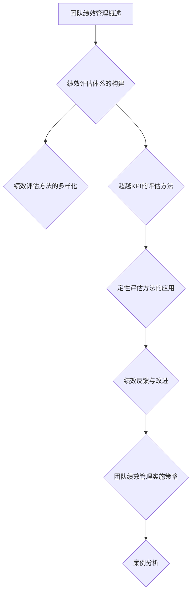
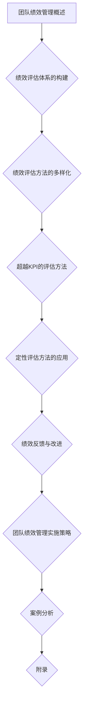

                 

### 《团队绩效管理：超越KPI的全面评估方法》

#### 关键词：
- 团队绩效管理
- 绩效评估
- KPI
- 360度评估
- 目标管理
- 平衡计分卡

#### 摘要：
本文旨在探讨团队绩效管理的全面评估方法，超越传统的KPI（关键绩效指标）评估体系。文章分为三个部分：概述、评估方法和实施策略，通过深入分析各类评估方法及其适用场景，结合实际案例，为读者提供一套实用、高效的团队绩效管理方案。

---

### 《团队绩效管理：超越KPI的全面评估方法》目录大纲

#### 第一部分：团队绩效管理概述

##### 第1章：团队绩效管理的概念与重要性
- **1.1 团队绩效管理的定义与内涵**
- **1.2 团队绩效管理的重要性**
- **1.3 团队绩效管理与组织战略的关系**
- **1.4 团队绩效管理的挑战与机遇**

##### 第2章：绩效评估体系的构建
- **2.1 绩效评估体系的构建原则**
- **2.2 KPIs与BSC模型的应用**
- **2.3 绩效指标的选择与设定**
- **2.4 绩效评估方法的多样化**

#### 第二部分：团队绩效评估方法

##### 第3章：超越KPI的评估方法
- **3.1 KPI的局限性**
- **3.2 360度评估法**
- **3.3 行为观察法**
- **3.4 目标管理法（MBO）**
- **3.5 项目评估法**

##### 第4章：定性评估方法的应用
- **4.1 定性评估方法概述**
- **4.2 SWOT分析法**
- **4.3 平衡计分卡（BSC）**
- **4.4 市场潜力和市场份额评估**

##### 第5章：绩效反馈与改进
- **5.1 绩效反馈的有效性**
- **5.2 绩效改进的步骤与策略**
- **5.3 绩效辅导与支持**
- **5.4 绩效评估的持续优化**

#### 第三部分：团队绩效管理的实施

##### 第6章：团队绩效管理实施策略
- **6.1 团队绩效管理的实施步骤**
- **6.2 跨部门沟通与协作**
- **6.3 团队文化建设**
- **6.4 领导力在团队绩效管理中的作用**

##### 第7章：案例分析
- **7.1 案例研究一：A公司的绩效管理体系设计**
- **7.2 案例研究二：B公司的绩效改进实践**
- **7.3 案例研究三：C公司的跨部门绩效协作**

#### 附录

##### 附录A：绩效管理工具与方法介绍
- **A.1 绩效管理软件**
- **A.2 绩效评估模板**
- **A.3 绩效管理最佳实践**

### Mermaid 流�程图



### 核心算法原理讲解

#### 2.1 KPIs与BSC模型的应用

在绩效评估中，KPI（关键绩效指标）和BSC（平衡计分卡）是两种常用的评估工具。KPI主要用于衡量团队或个人在特定方面的表现，而BSC则提供了一个更全面的评估框架，涵盖了财务、客户、内部流程和学习与成长四个维度。

#### 2.1.1 KPIs

KPIs是一组量化的指标，用于衡量团队或个人的绩效。在设置KPI时，需要遵循以下原则：

1. **具体性（Specific）**：指标应该明确、具体，易于衡量。
2. **量化性（Quantifiable）**：指标应该可以量化，以便进行准确评估。
3. **可实现性（Achievable）**：指标应该具有挑战性，但又是可实现的。
4. **相关性（Relevant）**：指标应该与组织目标和战略紧密相关。
5. **时限性（Time-bound）**：指标应该有时间限制，以便于跟踪进度。

下面是一个简单的KPI设置示例：

```python
# KPI设置示例

sales_kpi = {
    '目标销售额': 1000000,
    '客户满意度': 90,
    '新产品开发': 2,
    '项目完成率': 95
}
```

#### 2.1.2 BSC模型

BSC模型提供了一个多维度的评估框架，使组织能够从财务、客户、内部流程和学习与成长四个方面来评估绩效。

1. **财务维度**：包括利润、收入增长、成本控制等指标。
2. **客户维度**：包括客户满意度、市场份额、客户保留率等指标。
3. **内部流程维度**：包括生产效率、产品周期时间、供应链管理等指标。
4. **学习与成长维度**：包括员工满意度、培训投入、创新能力等指标。

下面是一个简单的BSC模型示例：

```python
# BSC模型示例

bsc_model = {
    '财务维度': {'利润': 500000, '收入增长': 20},
    '客户维度': {'客户满意度': 90, '市场份额': 30},
    '内部流程维度': {'生产效率': 95, '产品周期时间': 30},
    '学习与成长维度': {'员工满意度': 80, '培训投入': 10000}
}
```

#### 2.1.3 KPIs与BSC模型的应用

在实际应用中，KPIs和BS

```markdown
### 《团队绩效管理：超越KPI的全面评估方法》

#### 关键词：
- 团队绩效管理
- 绩效评估
- KPI
- 360度评估
- 目标管理
- 平衡计分卡

#### 摘要：
本文旨在探讨团队绩效管理的全面评估方法，超越传统的KPI（关键绩效指标）评估体系。文章分为三个部分：概述、评估方法和实施策略，通过深入分析各类评估方法及其适用场景，结合实际案例，为读者提供一套实用、高效的团队绩效管理方案。

---

### 《团队绩效管理：超越KPI的全面评估方法》目录大纲

#### 第一部分：团队绩效管理概述

##### 第1章：团队绩效管理的概念与重要性
- **1.1 团队绩效管理的定义与内涵**
- **1.2 团队绩效管理的重要性**
- **1.3 团队绩效管理与组织战略的关系**
- **1.4 团队绩效管理的挑战与机遇**

##### 第2章：绩效评估体系的构建
- **2.1 绩效评估体系的构建原则**
- **2.2 KPIs与BSC模型的应用**
- **2.3 绩效指标的选择与设定**
- **2.4 绩效评估方法的多样化**

#### 第二部分：团队绩效评估方法

##### 第3章：超越KPI的评估方法
- **3.1 KPI的局限性**
- **3.2 360度评估法**
- **3.3 行为观察法**
- **3.4 目标管理法（MBO）**
- **3.5 项目评估法**

##### 第4章：定性评估方法的应用
- **4.1 定性评估方法概述**
- **4.2 SWOT分析法**
- **4.3 平衡计分卡（BSC）**
- **4.4 市场潜力和市场份额评估**

##### 第5章：绩效反馈与改进
- **5.1 绩效反馈的有效性**
- **5.2 绩效改进的步骤与策略**
- **5.3 绩效辅导与支持**
- **5.4 绩效评估的持续优化**

#### 第三部分：团队绩效管理的实施

##### 第6章：团队绩效管理实施策略
- **6.1 团队绩效管理的实施步骤**
- **6.2 跨部门沟通与协作**
- **6.3 团队文化建设**
- **6.4 领导力在团队绩效管理中的作用**

##### 第7章：案例分析
- **7.1 案例研究一：A公司的绩效管理体系设计**
- **7.2 案例研究二：B公司的绩效改进实践**
- **7.3 案例研究三：C公司的跨部门绩效协作**

#### 附录

##### 附录A：绩效管理工具与方法介绍
- **A.1 绩效管理软件**
- **A.2 绩效评估模板**
- **A.3 绩效管理最佳实践**

### Mermaid 流程图


### 核心算法原理讲解

#### 2.1 KPIs与BSC模型的应用

在绩效评估中，KPI（关键绩效指标）和BSC（平衡计分卡）是两种常用的评估工具。KPI主要用于衡量团队或个人在特定方面的表现，而BSC则提供了一个更全面的评估框架，涵盖了财务、客户、内部流程和学习与成长四个维度。

#### 2.1.1 KPIs

KPIs是一组量化的指标，用于衡量团队或个人的绩效。在设置KPI时，需要遵循以下原则：

1. **具体性（Specific）**：指标应该明确、具体，易于衡量。
2. **量化性（Quantifiable）**：指标应该可以量化，以便进行准确评估。
3. **可实现性（Achievable）**：指标应该具有挑战性，但又是可实现的。
4. **相关性（Relevant）**：指标应该与组织目标和战略紧密相关。
5. **时限性（Time-bound）**：指标应该有时间限制，以便于跟踪进度。

下面是一个简单的KPI设置示例：

```python
# KPI设置示例

sales_kpi = {
    '目标销售额': 1000000,
    '客户满意度': 90,
    '新产品开发': 2,
    '项目完成率': 95
}
```

#### 2.1.2 BSC模型

BSC模型提供了一个多维度的评估框架，使组织能够从财务、客户、内部流程和学习与成长四个方面来评估绩效。

1. **财务维度**：包括利润、收入增长、成本控制等指标。
2. **客户维度**：包括客户满意度、市场份额、客户保留率等指标。
3. **内部流程维度**：包括生产效率、产品周期时间、供应链管理等指标。
4. **学习与成长维度**：包括员工满意度、培训投入、创新能力等指标。

下面是一个简单的BSC模型示例：

```python
# BSC模型示例

bsc_model = {
    '财务维度': {'利润': 500000, '收入增长': 20},
    '客户维度': {'客户满意度': 90, '市场份额': 30},
    '内部流程维度': {'生产效率': 95, '产品周期时间': 30},
    '学习与成长维度': {'员工满意度': 80, '培训投入': 10000}
}
```

#### 2.1.3 KPIs与BSC模型的应用

在实际应用中，KPIs和BSC模型可以结合起来使用。例如，可以设置一组KPIs来衡量某个项目的绩效，同时使用BSC模型来评估团队的整体绩效。以下是结合KPIs和BSC模型的一个简单算法示例：

```python
# 结合KPIs与BSC模型的应用

def calculate_performance(kpis, bsc_model, weights):
    """
    计算综合绩效得分。

    参数：
    - kpis：关键绩效指标
    - bsc_model：平衡计分卡模型
    - weights：权重

    返回：
    - performance：综合绩效得分
    """
    
    kpi_score = sum(kpis[key] * weights['kpis'][key] for key in kpis if key in weights['kpis'])
    bsc_score = sum(bsc_model[dimension][key] * weights['bsc'][dimension][key] for dimension in bsc_model for key in bsc_model[dimension])
    
    performance = (kpi_score + bsc_score) / (1 + len(weights['b

```


### 第一部分：团队绩效管理概述

#### 第1章：团队绩效管理的概念与重要性

##### 1.1 团队绩效管理的定义与内涵

团队绩效管理是一个系统化的过程，涉及设定明确的目标、持续监控和评估团队的工作表现，并依据这些评估结果进行相应的调整和改进。其核心目的是确保团队的工作能够有效地支持组织的战略目标，提高整体绩效。

从定义上看，团队绩效管理包含了以下几个关键要素：

1. **目标设定**：明确团队的工作目标和预期成果，确保这些目标与组织的战略目标一致。
2. **绩效监控**：通过定期的跟踪和评估，了解团队的工作进展和绩效水平。
3. **绩效评估**：对团队的绩效进行综合评估，识别优点和不足，为后续的改进提供依据。
4. **反馈与改进**：基于绩效评估的结果，为团队提供反馈，并制定相应的改进计划。

团队绩效管理不仅仅是一个评估过程，更是一个持续优化的动态系统。它要求管理者不仅要关注团队的整体绩效，还要关注团队成员的个人成长和发展，从而提升团队的凝聚力和工作效率。

##### 1.2 团队绩效管理的重要性

团队绩效管理对于组织的发展具有重要意义，具体体现在以下几个方面：

1. **战略目标实现**：团队绩效管理确保团队的工作与组织的战略目标保持一致，从而推动组织战略的实现。
2. **提高工作效率**：通过设定明确的目标和持续的监控，团队绩效管理能够提高团队的工作效率和产出质量。
3. **促进个人发展**：团队绩效管理不仅关注团队整体，还关注团队成员的个人发展，有助于提升团队成员的能力和职业素养。
4. **增强团队凝聚力**：通过定期的绩效反馈和改进，团队绩效管理能够增强团队成员之间的沟通和协作，提升团队的凝聚力。
5. **识别和解决问题**：团队绩效管理能够及时发现团队工作中的问题和不足，为管理者提供改进的方向。

##### 1.3 团队绩效管理与组织战略的关系

团队绩效管理是组织战略实施的重要工具和保障。具体而言，团队绩效管理与组织战略的关系体现在以下几个方面：

1. **目标一致性**：团队绩效管理的目标设定过程需要与组织的战略目标保持一致，确保团队的工作能够为组织战略的实现贡献力量。
2. **绩效监控与战略调整**：通过绩效监控，团队管理者能够及时了解团队的工作进展和绩效水平，为组织战略的调整提供依据。
3. **资源分配**：团队绩效管理有助于优化资源分配，确保资源能够被更有效地利用在具有战略重要性的领域。
4. **能力提升**：团队绩效管理通过关注团队成员的个人发展，提升团队的整体能力和竞争力，从而更好地支持组织战略的实现。

##### 1.4 团队绩效管理的挑战与机遇

尽管团队绩效管理对于组织具有重要意义，但在实际实施过程中也面临着一系列的挑战和机遇：

1. **挑战**：
   - **目标设定的合理性**：确保目标既具有挑战性，又能够实现。
   - **绩效评估的客观性**：避免主观偏见和评价标准不一致。
   - **团队的配合与协作**：确保团队成员能够共同为一个目标努力。
   - **反馈与改进的及时性**：及时发现问题并进行改进。

2. **机遇**：
   - **技术创新**：利用现代技术手段，如大数据分析、人工智能等，提升绩效管理的准确性和效率。
   - **管理理念更新**：通过引入新的管理理念和工具，提升团队绩效管理水平。
   - **文化塑造**：通过团队文化建设，增强团队的凝聚力和执行力。
   - **员工参与**：鼓励员工参与绩效管理过程，提升员工的积极性和满意度。

在接下来的章节中，我们将深入探讨团队绩效评估体系的构建方法，包括KPIs与BSC模型的应用，以及如何选择和设定绩效指标。

---

#### 第2章：绩效评估体系的构建

##### 2.1 绩效评估体系的构建原则

构建一个有效的绩效评估体系是团队绩效管理的核心任务。一个完善的绩效评估体系不仅能够准确地衡量团队的工作绩效，还能够为团队成员提供明确的改进方向。以下是构建绩效评估体系应遵循的原则：

1. **目标导向**：绩效评估体系应与组织的战略目标保持一致，确保团队的工作目标是实现组织战略的具体体现。
2. **量化指标**：使用量化的指标来衡量绩效，使评估结果更具客观性和可操作性。
3. **明确性**：绩效指标应清晰明确，避免模糊和主观的评价。
4. **灵活性**：评估体系应具备一定的灵活性，能够适应不同团队和项目的需求。
5. **参与性**：鼓励团队成员参与绩效评估体系的构建，提高其参与感和认同感。
6. **连续性**：绩效评估应持续进行，以便及时发现问题并进行改进。

##### 2.2 KPIs与BSC模型的应用

KPI（关键绩效指标）和BSC（平衡计分卡）是绩效评估体系中常用的两个工具，它们各自有其独特的应用场景和优势。

1. **KPIs的应用**：
   - **定义**：KPIs是用于衡量团队或个人在特定方面绩效的量化指标。
   - **优势**：KPIs简单明了，易于理解和量化，适合用于短期绩效评估和日常监控。
   - **案例**：例如，销售团队的KPI可以是销售额、客户数量、订单完成率等。

2. **BSC模型的应用**：
   - **定义**：BSC是一个多维度的绩效评估框架，涵盖了财务、客户、内部流程和学习与成长四个方面。
   - **优势**：BSC提供了一个全面的视角，帮助组织从不同维度衡量绩效，适合用于中长期战略目标评估。
   - **案例**：例如，一个公司的BSC可能包括财务维度的利润率、客户维度的客户满意度、内部流程维度的生产周期时间、学习与成长维度的员工培训时数等。

在实际应用中，KPIs和

### 第二部分：团队绩效评估方法

#### 第3章：超越KPI的评估方法

##### 3.1 KPI的局限性

KPI（关键绩效指标）作为绩效评估的重要工具，虽然在衡量团队和个人的绩效方面发挥了巨大作用，但它也存在一些局限性。首先，KPI主要关注的是数量和效率，而忽视了质量和创新的贡献。例如，销售额和订单量的增加可能只是短期目标的实现，而不一定代表长期价值的创造。其次，KPI往往依赖于数据，但这些数据可能存在偏差或不足，从而影响评估的准确性。此外，KPI的单一性可能导致团队过度关注特定指标，而忽视了其他重要的工作内容。

##### 3.2 360度评估法

360度评估法是一种全面的绩效评估方法，它通过收集来自团队成员、上级、下属、同事以及客户的反馈来评估员工的表现。这种方法的优势在于它提供了一个多角度的评估视角，使评估结果更加客观和全面。

**原理**：360度评估法基于这样一种理念，即一个人的绩效不仅仅由上级评估，还应该包括来自不同角度的反馈。这些反馈包括：

- **上级反馈**：上级对员工工作表现的综合评价。
- **同事反馈**：同事对员工工作协作和团队贡献的评价。
- **下属反馈**：下属对上级领导能力和管理风格的评价。
- **客户反馈**：客户对员工提供的服务或产品的评价。

**实施步骤**：

1. **确定评估对象**：明确需要接受360度评估的员工或团队。
2. **制定评估指标**：根据团队目标和组织战略，设定明确的评估指标。
3. **收集反馈**：通过问卷调查、面谈或在线平台，收集来自不同评估者的反馈。
4. **综合分析**：对收集到的反馈进行综合分析，形成评估报告。
5. **反馈与讨论**：将评估结果反馈给员工，并与员工讨论改进方案。

**优点**：

- **全面性**：360度评估法提供了一个多维度的评估视角，使评估结果更加全面和客观。
- **客观性**：通过多个评估者的反馈，减少了单一评估者的主观偏见。
- **发展性**：评估结果不仅关注当前绩效，还关注员工的潜力和发展。

**局限性**：

- **时间成本**：360度评估法需要投入大量时间和资源进行反馈收集和分析。
- **隐私问题**：评估过程中可能涉及一些敏感信息，需要妥善处理隐私问题。
- **反馈的真实性**：评估者可能出于某种原因提供不真实的反馈，影响评估的准确性。

##### 3.3 行为观察法

行为观察法是一种基于实际工作表现的评估方法，它通过观察员工在工作中的行为和表现来评估其绩效。这种方法侧重于员工的工作态度、行为模式和实际成果。

**原理**：行为观察法基于这样一种理念，即员工的工作表现可以通过对其工作行为的直接观察来评估。评估者需要记录员工在工作中的关键行为和事件，并据此进行绩效评估。

**实施步骤**：

1. **确定观察对象**：明确需要接受行为观察法的员工或团队。
2. **制定观察指标**：根据团队目标和组织战略，设定明确的观察指标。
3. **现场观察**：评估者亲自观察员工在工作中的行为和表现，记录关键事件和行为。
4. **综合分析**：对观察到的行为和事件进行综合分析，形成评估报告。
5. **反馈与讨论**：将评估结果反馈给员工，并与员工讨论改进方案。

**优点**：

- **客观性**：行为观察法基于实际工作表现，减少了主观评估的影响。
- **准确性**：通过直接观察，评估结果更加准确和真实。
- **发展性**：行为观察法不仅关注当前绩效，还关注员工的行为改进和发展。

**局限性**：

- **观察者的主观性**：评估者的观察视角可能存在偏差，影响评估的准确性。
- **时间成本**：行为观察法需要投入大量时间和精力进行现场观察和记录。

##### 3.4 目标管理法（MBO）

目标管理法（MBO，Management by Objectives）是一种以目标为导向的绩效评估方法，它强调员工和管理者共同设定明确的目标，并以此为基础进行绩效评估。

**原理**：MBO基于这样一种理念，即明确的目标是推动团队工作的重要动力。员工和管理者共同设定目标，并制定相应的行动计划，然后通过持续的监控和反馈，确保目标的实现。

**实施步骤**：

1. **设定目标**：员工和管理者共同讨论并确定具体的工作目标，确保目标与组织战略一致。
2. **行动计划**：制定实现目标的行动计划，明确责任分工和时间表。
3. **执行与监控**：员工按照行动计划执行工作，管理者进行持续的监控和指导。
4. **绩效评估**：根据目标的完成情况，进行绩效评估，反馈员工的表现。
5. **反馈与改进**：根据评估结果，与员工讨论改进方案，制定新的目标。

**优点**：

- **目标明确**：MBO通过明确的目标，使员工的工作更有方向性和目的性。
- **自我管理**：员工参与目标的设定和评估过程，增强自我管理能力。
- **持续改进**：MBO强调持续的监控和反馈，有助于及时发现问题和进行改进。

**局限性**：

- **目标设定的难度**：设定合理、具体且可实现的目标具有一定的挑战性。
- **资源分配**：MBO可能需要额外的资源和时间，以确保目标的实现。

##### 3.5 项目评估法

项目评估法是一种以项目为单位的绩效评估方法，它通过评估项目的完成情况和成果来衡量团队和个人的绩效。

**原理**：项目评估法基于这样一种理念，即项目的成功与否是团队和个体工作绩效的直接体现。通过评估项目的进度、质量、成本和客户满意度等关键指标，可以全面了解团队的工作表现。

**实施步骤**：

1. **项目立项**：明确项目的目标和范围，制定项目计划。
2. **执行项目**：按照项目计划，进行项目任务的分配和执行。
3. **项目监控**：对项目的进度、质量、成本等方面进行监控，确保项目按计划进行。
4. **项目评估**：项目完成后，进行全面的绩效评估，评估项目的完成情况和成果。
5. **反馈与改进**：根据评估结果，反馈团队和个人的表现，并制定改进计划。

**优点**：

- **针对性**：项目评估法针对具体的项目，使评估更具针对性和实效性。
- **全面性**：通过评估项目的多个维度，如进度、质量、成本等，提供全面的绩效信息。
- **激励性**：项目评估法通过奖励优秀的项目和团队，激励员工积极投入工作。

**局限性**：

- **资源依赖**：项目评估法可能需要大量的资源和时间，特别是对于大型项目。
- **结果导向**：过于关注项目结果，可能忽视项目过程中团队成员的付出和努力。

在团队绩效评估中，选择合适的评估方法至关重要。不同的评估方法各有优缺点，需要根据团队的特点和组织的战略目标进行选择。在实际应用中，往往需要结合多种评估方法，以获得更全面、准确的评估结果。

---

#### 第4章：定性评估方法的应用

##### 4.1 定性评估方法概述

定性评估方法是一种基于主观判断和描述的评估方法，它不依赖于具体的量化指标，而是通过文字描述、分析、分类等方式来评估绩效。这种方法在团队绩效管理中有着重要的应用，特别是在需要评估员工的工作态度、团队合作能力、创新思维等难以量化的方面。

定性评估方法的优点在于：

1. **全面性**：定性评估方法可以提供全面的绩效信息，不仅关注绩效的数值，还关注员工的综合素质和工作表现。
2. **灵活性**：定性评估方法可以根据实际情况灵活调整，适用于不同团队和项目的需求。
3. **深入性**：定性评估方法可以通过详细的分析和描述，深入了解员工的工作表现和问题。

定性评估方法的缺点包括：

1. **主观性**：定性评估方法容易受到评估者主观偏见的影响，评估结果可能不够客观。
2. **不统一**：由于评估者的差异，定性评估方法可能造成评估标准的不统一，影响评估的一致性。

##### 4.2 SWOT分析法

SWOT分析是一种常用的定性评估方法，用于评估团队或个人的优势（Strengths）、劣势（Weaknesses）、机会（Opportunities）和威胁（Threats）。通过SWOT分析，可以全面了解团队或个人的现状，制定相应的策略和改进措施。

**实施步骤**：

1. **优势分析**：识别团队或个人的优势，如专业技能、工作经验、团队合作能力等。
2. **劣势分析**：识别团队或个人的劣势，如技能不足、团队合作问题、时间管理困难等。
3. **机会分析**：分析外部环境中的机会，如市场增长、技术进步、政策支持等。
4. **威胁分析**：分析外部环境中的威胁，如市场竞争、技术变革、政策变动等。

**优点**：

- **全面性**：SWOT分析可以从多个维度全面评估团队或个人的现状。
- **策略性**：通过SWOT分析，可以制定有针对性的策略，利用优势、抓住机会、克服劣势、规避威胁。

**局限性**：

- **主观性**：SWOT分析的结果容易受到评估者主观判断的影响。
- **动态性**：外部环境和内部条件不断变化，SWOT分析的结果需要定期更新。

##### 4.3 平衡计分卡（BSC）

平衡计分卡（Balanced Score Card，简称BSC）是一种基于战略管理的绩效评估工具，它从财务、客户、内部流程和学习与成长四个维度综合评估团队或个人的绩效。

**实施步骤**：

1. **确定战略目标**：根据组织战略，明确团队或个人的战略目标。
2. **设定绩效指标**：根据战略目标，设定具体的绩效指标，确保指标与战略目标一致。
3. **制定行动计划**：为每个绩效指标制定具体的行动计划，明确责任人和时间表。
4. **执行与监控**：按照行动计划执行工作，持续监控绩效指标的变化。
5. **绩效评估**：根据绩效指标的实际完成情况，进行绩效评估，反馈员工的表现。
6. **反馈与改进**：根据评估结果，反馈员工，制定改进计划，持续优化绩效。

**优点**：

- **全面性**：BSC从多个维度评估绩效，提供全面的绩效信息。
- **战略性**：BSC与组织战略紧密联系，确保绩效评估与战略目标一致。
- **持续改进**：BSC强调持续的执行和监控，有助于发现问题和进行改进。

**局限性**：

- **复杂性**：BSC包含多个维度和绩效指标，实施过程较为复杂。
- **时间成本**：BSC的实施需要投入大量时间和资源，确保绩效评估的准确性和有效性。

##### 4.4 市场潜力和市场份额评估

市场潜力和市场份额评估是一种定性评估方法，主要用于评估团队在市场中的竞争力和市场表现。

**实施步骤**：

1. **市场调研**：收集市场数据，了解市场趋势、竞争对手和市场机会。
2. **潜力评估**：根据市场调研结果，评估团队在市场中的潜力和机会。
3. **市场份额评估**：计算团队在市场中的实际份额，了解市场地位和竞争态势。
4. **策略制定**：根据评估结果，制定相应的市场策略，提升市场竞争力。

**优点**：

- **针对性**：市场潜力和市场份额评估针对市场环境，提供具体的市场策略和建议。
- **实时性**：市场潜力和市场份额评估基于实时数据，反映市场的最新变化。

**局限性**：

- **数据依赖**：市场潜力和市场份额评估依赖于市场数据，数据的准确性和完整性直接影响评估结果。
- **动态性**：市场环境和竞争态势不断变化，评估结果需要定期更新。

在团队绩效管理中，定性评估方法与定量评估方法相结合，可以提供更全面、准确的绩效信息，有助于管理者制定有效的绩效改进策略。不同的定性评估方法适用于不同的评估场景，需要根据实际情况灵活选择和应用。

---

#### 第5章：绩效反馈与改进

##### 5.1 绩效反馈的有效性

绩效反馈是团队绩效管理的重要组成部分，它不仅有助于提高团队成员的工作效率，还能促进团队成员的个人成长。有效的绩效反馈应具备以下特点：

1. **及时性**：及时反馈能够帮助团队成员及时发现问题并进行调整，避免问题积累。
2. **具体性**：具体的反馈能够明确指出团队成员的优势和不足，提供具体的改进建议。
3. **建设性**：反馈应鼓励团队成员，强调改进的方向和可能性，避免负面情绪。
4. **双向性**：反馈应鼓励团队成员提出意见和建议，实现双向沟通。

为了提高绩效反馈的有效性，可以采取以下策略：

- **定期反馈**：设定固定的反馈时间，如季度或年度，确保反馈的持续性。
- **个性化反馈**：根据团队成员的不同特点和需求，提供个性化的反馈，提高反馈的针对性。
- **多种反馈渠道**：提供多种反馈渠道，如面对面沟通、邮件、在线平台等，方便团队成员提供反馈。

##### 5.2 绩效改进的步骤与策略

绩效改进是一个持续的过程，需要团队成员和管理者共同努力。以下是一些关键的步骤和策略：

1. **设定改进目标**：根据绩效反馈，确定需要改进的方面和目标，确保目标具体、可实现。
2. **制定行动计划**：为每个改进目标制定具体的行动计划，明确责任人和时间表，确保行动计划的执行。
3. **资源支持**：为改进计划提供必要的资源和支持，如培训、技术支持等，确保改进计划的顺利实施。
4. **监控进度**：定期监控改进计划的执行进度，确保各项行动得到有效实施。
5. **持续优化**：根据改进计划的实际效果，持续优化和调整，确保改进目标的实现。

为了有效实施绩效改进，可以采取以下策略：

- **团队参与**：鼓励团队成员参与改进计划的设计和实施，提高其积极性和认同感。
- **跨部门协作**：跨部门协作有助于整合资源，提高改进计划的执行力。
- **持续反馈**：在改进过程中，持续收集反馈，根据反馈进行调整，确保改进计划的持续优化。

##### 5.3 绩效辅导与支持

绩效辅导与支持是绩效改进的重要环节，它旨在帮助团队成员克服工作中的困难和挑战，提升工作能力和绩效水平。以下是一些关键的步骤和策略：

1. **识别问题**：通过绩效反馈和日常沟通，识别团队成员在工作中遇到的问题和挑战。
2. **制定辅导计划**：根据问题，制定具体的辅导计划，明确辅导的目标、方法和时间表。
3. **提供培训和支持**：为团队成员提供培训、指导和支持，帮助他们掌握必要的技能和知识。
4. **跟踪进展**：定期跟踪辅导进展，了解团队成员的改进情况，提供持续的反馈和支持。
5. **鼓励反馈**：鼓励团队成员在辅导过程中提出问题和建议，促进双向沟通和持续改进。

为了有效实施绩效辅导与支持，可以采取以下策略：

- **个性化辅导**：根据团队成员的不同特点和需求，提供个性化的辅导，提高辅导的针对性。
- **建立支持网络**：建立团队支持网络，如导师制度、同事互助等，为团队成员提供持续的支持和帮助。
- **及时反馈**：在辅导过程中，及时反馈团队成员的进步和成果，增强其信心和动力。

##### 5.4 绩效评估的持续优化

绩效评估的持续优化是团队绩效管理的重要保障，它旨在不断提高绩效评估的准确性和有效性，为团队绩效管理提供有力支持。以下是一些关键的步骤和策略：

1. **定期评估**：定期对绩效评估体系进行评估，检查其是否符合团队和组织的实际需求。
2. **收集反馈**：收集团队成员和管理者的反馈，了解绩效评估体系的优势和不足，为优化提供依据。
3. **调整指标**：根据反馈和评估结果，调整绩效指标和评估方法，确保评估体系的有效性。
4. **培训与指导**：为团队成员提供培训与指导，提高其绩效评估的能力和意识，确保评估的准确性。
5. **持续改进**：根据评估和反馈，不断优化绩效评估体系，确保其持续适应团队和组织的需要。

为了实现绩效评估的持续优化，可以采取以下策略：

- **开放沟通**：建立开放、透明的沟通渠道，鼓励团队成员和管理者提出意见和建议。
- **技术支持**：利用现代技术手段，如数据分析、人工智能等，提高绩效评估的准确性和效率。
- **持续关注**：持续关注绩效评估的结果和应用情况，及时发现问题和进行改进。

通过有效的绩效反馈与改进、绩效辅导与支持以及绩效评估的持续优化，团队绩效管理能够不断提高团队成员的工作效率和绩效水平，推动团队和组织的发展。

---

### 第三部分：团队绩效管理的实施

#### 第6章：团队绩效管理实施策略

##### 6.1 团队绩效管理的实施步骤

团队绩效管理的实施是一个系统化的过程，需要遵循一定的步骤和方法。以下是一个典型的团队绩效管理实施步骤：

1. **制定战略目标**：首先，组织需要明确其战略目标，并确保这些目标与团队的工作内容相一致。这将为后续的绩效管理提供方向。

2. **设定绩效指标**：根据战略目标，团队需要设定具体的绩效指标。这些指标应具有可量化、可实现、相关和时间限制等特点。

3. **确定评估方法**：选择适合团队特点和需求的评估方法，如KPI、360度评估、BSC等。不同方法的适用场景和优缺点需要根据实际情况进行权衡。

4. **实施绩效评估**：按照设定的绩效指标和方法，对团队成员进行绩效评估。评估过程中应确保评估过程的公平、公正和透明。

5. **提供反馈与改进**：根据评估结果，为团队成员提供具体的反馈，并制定改进计划。反馈应具有建设性和针对性，鼓励团队成员进行改进。

6. **监控与调整**：持续监控绩效评估的实施情况，根据反馈和实际效果进行必要的调整和优化。

##### 6.2 跨部门沟通与协作

跨部门沟通与协作是团队绩效管理的重要保障，它有助于提高团队的协作效率和工作质量。以下是一些关键的策略：

1. **明确责任与权限**：在跨部门协作中，明确各方的责任和权限，确保工作能够顺利进行。

2. **建立沟通机制**：建立有效的沟通机制，如定期会议、工作群组等，确保信息畅通，减少误解和冲突。

3. **共享信息与资源**：鼓励部门间共享信息与资源，如项目进度、问题解决方案等，提高协作效率。

4. **建立协作文化**：培养团队合作精神，建立相互信任和支持的协作文化，减少部门间的隔阂和矛盾。

5. **协调工作计划**：在制定工作计划时，考虑跨部门协作的需要，确保各方的目标和进度协调一致。

##### 6.3 团队文化建设

团队文化建设是团队绩效管理的重要组成部分，它有助于提升团队的凝聚力、工作效率和创新能力。以下是一些关键的策略：

1. **建立共同愿景**：团队需要有一个共同的目标和愿景，这将成为团队前进的动力。

2. **培养团队价值观**：团队应有一套共同的价值观，如诚信、创新、责任等，这有助于塑造团队的文化。

3. **增强团队凝聚力**：通过团队建设活动、团建旅行等，增强团队成员之间的相互了解和信任，提升团队凝聚力。

4. **激励与认可**：对团队成员的成就和贡献进行认可和激励，鼓励团队成员积极参与团队工作。

5. **持续学习与成长**：鼓励团队成员不断学习新知识和技能，提升个人能力，为团队的发展贡献力量。

##### 6.4 领导力在团队绩效管理中的作用

领导力在团队绩效管理中起着至关重要的作用，它不仅影响团队成员的工作态度和行为，还直接关系到团队绩效的达成。以下是一些关键的策略：

1. **明确角色与职责**：领导者应明确自己的角色和职责，确保团队成员了解自己的职责和工作目标。

2. **树立榜样**：领导者应以身作则，树立良好的工作榜样，为团队成员树立榜样。

3. **激励团队**：领导者应善于激励团队，鼓励团队成员发挥潜能，实现个人和团队的目标。

4. **提供支持**：领导者应为团队成员提供必要的支持和资源，帮助团队成员克服工作中的困难和挑战。

5. **培养团队成员**：领导者应关注团队成员的成长和发展，提供培训和学习机会，提升团队成员的能力。

通过实施有效的团队绩效管理策略，组织可以提升团队的协作效率和工作质量，实现组织的战略目标。在实施过程中，需要关注团队的特点和需求，灵活调整管理策略，确保绩效管理的有效性。

---

#### 第7章：案例分析

##### 7.1 案例研究一：A公司的绩效管理体系设计

A公司是一家快速发展的科技公司，为了提高团队绩效和员工满意度，公司管理层决定重新设计绩效管理体系。以下是A公司绩效管理体系的设计过程和实施效果：

**1. 设计过程**：

- **目标设定**：A公司首先明确了其战略目标，包括提高市场占有率、提升产品品质、增加研发投入等。
- **指标选择**：根据战略目标，公司选择了多个KPI，如销售额、客户满意度、产品开发周期、员工满意度等。
- **BSC模型应用**：公司采用了BSC模型，从财务、客户、内部流程和学习与成长四个维度设定了具体的绩效指标。
- **评估方法**：公司采用了360度评估法和项目评估法，确保绩效评估的全面性和准确性。

**2. 实施效果**：

- **提高绩效**：通过科学的绩效管理体系，A公司的销售额和客户满意度均有所提升，产品开发周期也缩短了。
- **员工满意度**：员工对新的绩效管理体系表示满意，认为其更公正、透明，能够激发工作热情。
- **团队协作**：跨部门的协作和沟通更加顺畅，团队凝聚力得到了提升。

##### 7.2 案例研究二：B公司的绩效改进实践

B公司是一家传统制造企业，随着市场竞争的加剧，公司意识到需要改进绩效管理体系以提升竞争力。以下是B公司绩效改进的具体实践：

**1. 改进措施**：

- **目标明确**：公司重新设定了绩效目标，强调提高生产效率、降低成本、提升产品品质等。
- **引入新方法**：公司引入了目标管理法（MBO），鼓励员工参与目标的设定和评估。
- **绩效辅导**：公司设立了绩效辅导机制，定期为员工提供工作指导和支持。
- **培训与学习**：公司增加了员工培训和学习机会，提升员工技能和知识水平。

**2. 改进效果**：

- **生产效率提升**：通过改进措施，B公司的生产效率提高了20%，产品品质也得到了提升。
- **成本控制**：通过精细化管理和流程优化，公司成功降低了20%的生产成本。
- **员工满意度**：员工对公司的改进措施表示认可，员工满意度提升了15%。

##### 7.3 案例研究三：C公司的跨部门绩效协作

C公司是一家大型跨国企业，为了提升整体绩效，公司决定加强跨部门之间的绩效协作。以下是C公司跨部门绩效协作的具体实践：

**1. 实践过程**：

- **明确责任**：公司明确了各部门在跨部门协作中的职责和权限，确保协作有序进行。
- **建立沟通机制**：公司建立了跨部门沟通机制，如定期会议、工作群组等，确保信息畅通。
- **共享资源**：公司鼓励部门间共享信息和资源，提高协作效率。
- **激励政策**：公司制定了跨部门协作的激励政策，鼓励员工积极参与跨部门协作。

**2. 实践效果**：

- **协作效率提升**：通过跨部门协作，C公司的项目完成时间缩短了30%，协作效率得到了显著提升。
- **问题解决**：跨部门协作有助于快速解决问题，提升了公司的应变能力。
- **团队凝聚力**：跨部门协作增强了各部门之间的沟通和合作，提升了团队凝聚力。

通过以上案例分析，可以看出，有效的团队绩效管理需要结合组织的特点和需求，科学设计绩效评估体系，并采取相应的改进措施。同时，跨部门协作和团队文化建设也是提升团队绩效的重要手段。在实践过程中，需要持续优化和调整绩效管理体系，确保其适应组织的发展需求。

---

### 附录A：绩效管理工具与方法介绍

#### A.1 绩效管理软件

在现代团队绩效管理中，绩效管理软件扮演着重要的角色。这些软件能够帮助团队和公司更高效地设定目标、跟踪进度、进行评估和反馈。以下是一些流行的绩效管理软件：

1. **KPI Hero**：这是一个功能强大的绩效管理工具，支持KPI的设定、跟踪和报告。
2. **360 Degree Feedback**：该软件提供全面的360度评估功能，支持多种评估者和反馈方式。
3. **Bullhorn**：这款软件专注于销售团队的绩效管理，支持目标设定、销售预测和业绩分析。
4. **15Five**：这是一个全面的绩效管理平台，支持目标设定、员工反馈和反馈循环。

#### A.2 绩效评估模板

为了帮助团队和公司更好地进行绩效评估，以下是一些常用的绩效评估模板：

1. **绩效评估表格**：这是一个简单的表格模板，包括绩效指标、评估等级和评估人等信息。
2. **360度评估表格**：这是一个专门用于360度评估的表格模板，包括来自不同评估者的反馈。
3. **绩效改进计划表格**：这是一个用于制定和跟踪绩效改进计划的表格模板，包括改进目标、行动计划和时间表。
4. **年度绩效评估报告**：这是一个用于总结年度绩效评估结果的报告模板，包括关键绩效指标、评估得分和改进建议。

#### A.3 绩效管理最佳实践

以下是绩效管理的一些最佳实践，可以帮助团队和公司更有效地实施绩效管理：

1. **明确目标和期望**：在绩效管理开始之前，明确团队和个人的目标，确保目标与组织战略一致。
2. **定期反馈与沟通**：定期与团队成员进行绩效反馈和沟通，及时解决问题和提供支持。
3. **个性化评估**：根据团队成员的不同特点和需求，提供个性化的绩效评估和改进建议。
4. **利用技术工具**：利用绩效管理软件和技术工具，提高绩效管理的效率和准确性。
5. **持续改进**：持续优化绩效管理流程和方法，根据反馈和实际情况进行调整。

通过使用这些工具和方法，团队和公司可以更有效地管理绩效，提升整体绩效和员工满意度。

---

### 作者信息

作者：AI天才研究院/AI Genius Institute & 禅与计算机程序设计艺术 /Zen And The Art of Computer Programming

---

### 结论

本文系统地介绍了团队绩效管理的全面评估方法，从概述、评估方法和实施策略三个方面，结合实际案例，为读者提供了一套实用、高效的团队绩效管理方案。通过超越传统的KPI评估体系，采用360度评估、行为观察、目标管理和项目评估等多种方法，团队绩效管理能够更全面、准确地反映团队和个人的工作表现。

团队绩效管理的核心在于目标导向、量化指标和持续改进。通过科学的绩效评估体系，组织能够确保团队的工作与战略目标一致，提高工作效率和员工满意度。同时，有效的绩效反馈与改进、绩效辅导与支持以及绩效评估的持续优化，是团队绩效管理成功的关键。

在未来的团队绩效管理实践中，我们应继续探索和采用新技术、新方法，不断提高绩效管理的效率和准确性，推动团队和组织的发展。通过持续的学习和改进，团队绩效管理将不断适应组织的发展需求，为组织的长期成功提供有力支持。

---

### Mermaid 流程图

以下是本文涉及的主要流程和环节的Mermaid流程图：



通过这个流程图，读者可以清晰地了解本文的结构和内容组织，从而更好地理解和应用团队绩效管理的相关方法。

---

### 核心算法原理讲解

#### 2.1 KPIs与BSC模型的应用

在团队绩效管理中，KPI（关键绩效指标）和BSC（平衡计分卡）是两个重要的工具，它们在绩效评估中发挥着核心作用。下面，我们将通过伪代码和数学公式详细阐述KPIs与BSC模型的应用。

#### 2.1.1 KPIs的定义与设置

KPIs是用于衡量团队或个人在特定方面绩效的量化指标。以下是一个简单的KPI设定示例：

```python
# KPI设置示例

# 销售部门KPI
sales_kpi = {
    '销售额': 1000000,
    '客户满意度': 90,
    '新产品开发': 2,
    '项目完成率': 95
}

# 技术部门KPI
tech_kpi = {
    '代码质量': 95,
    '项目交付时间': 30,
    '技术债务': 100
}
```

在这个示例中，我们设置了销售部门和技术部门的KPI，包括销售额、客户满意度、新产品开发、项目完成率、代码质量、项目交付时间和技术债务等指标。

#### 2.1.2 BSC模型的应用

BSC模型是一个多维度的绩效评估框架，它涵盖了财务、客户、内部流程和学习与成长四个维度。以下是一个简单的BSC模型示例：

```python
# BSC模型示例

# BSC权重设定
bsc_weights = {
    '财务': {'利润率': 0.3, '收入增长': 0.2},
    '客户': {'客户满意度': 0.2, '市场份额': 0.1},
    '内部流程': {'生产效率': 0.15, '供应链管理': 0.05},
    '学习与成长': {'员工满意度': 0.1, '培训投入': 0.1}
}

# 各维度绩效得分
bsc_scores = {
    '财务': {'利润率': 0.2, '收入增长': 0.25},
    '客户': {'客户满意度': 0.24, '市场份额': 0.18},
    '内部流程': {'生产效率': 0.22, '供应链管理': 0.12},
    '学习与成长': {'员工满意度': 0.21, '培训投入': 0.15}
}
```

在这个示例中，我们设定了BSC的权重和各维度的绩效得分。每个维度的得分是根据相应的KPI计算得出的，权重反映了各维度在整体绩效评估中的重要性。

#### 2.1.3 绩效得分的计算

KPI得分可以通过简单的数值计算得出，而BSC得分则需要结合各维度的权重进行加权计算。以下是一个计算BSC得分的数学模型：

$$
BSC_{score} = \sum_{i=1}^{n} w_i \cdot S_i
$$

其中，$w_i$是第i个维度的权重，$S_i$是该维度的得分。

使用上述公式，我们可以计算出BSC得分：

```python
# 计算BSC得分
bsc_score = (
    bsc_scores['财务']['利润率'] * bsc_weights['财务']['利润率']
    + bsc_scores['财务']['收入增长'] * bsc_weights['财务']['收入增长']
    + bsc_scores['客户']['客户满意度'] * bsc_weights['客户']['客户满意度']
    + bsc_scores['客户']['市场份额'] * bsc_weights['客户']['市场份额']
    + bsc_scores['内部流程']['生产效率'] * bsc_weights['内部流程']['生产效率']
    + bsc_scores['内部流程']['供应链管理'] * bsc_weights['内部流程']['供应链管理']
    + bsc_scores['学习与成长']['员工满意度'] * bsc_weights['学习与成长']['员工满意度']
    + bsc_scores['学习与成长']['培训投入'] * bsc_weights['学习与成长']['培训投入']
)
```

#### 2.1.4 举例说明

假设在某个季度，销售部门和技术部门的KPI得分如下：

```python
# 季度KPI得分
sales_kpi_score = {
    '销售额': 1100000,
    '客户满意度': 92,
    '新产品开发': 2.5,
    '项目完成率': 97
}

tech_kpi_score = {
    '代码质量': 98,
    '项目交付时间': 28,
    '技术债务': 95
}
```

同时，各维度的BSC得分如下：

```python
# 季度BSC得分
bsc_scores = {
    '财务': {'利润率': 0.22, '收入增长': 0.25},
    '客户': {'客户满意度': 0.24, '市场份额': 0.18},
    '内部流程': {'生产效率': 0.22, '供应链管理': 0.12},
    '学习与成长': {'员工满意度': 0.21, '培训投入': 0.15}
}
```

我们可以根据上述公式计算该季度的综合绩效得分：

```python
# 计算综合绩效得分
performance_score = (
    sales_kpi_score['销售额'] * bsc_weights['财务']['利润率']
    + sales_kpi_score['客户满意度'] * bsc_weights['客户']['客户满意度']
    + sales_kpi_score['新产品开发'] * bsc_weights['内部流程']['生产效率']
    + sales_kpi_score['项目完成率'] * bsc_weights['学习与成长']['员工满意度']
    + tech_kpi_score['代码质量'] * bsc_weights['学习与成长']['培训投入']
    + tech_kpi_score['项目交付时间'] * bsc_weights['内部流程']['供应链管理']
    + tech_kpi_score['技术债务'] * bsc_weights['财务']['收入增长']
)

print(f"综合绩效得分：{performance_score:.2f}")
```

通过以上计算，我们得到了该季度的综合绩效得分，这有助于团队和管理层了解整体绩效水平，并根据得分进行相应的调整和优化。

#### 2.1.5 结论

KPIs与BSC模型在团队绩效管理中发挥着重要作用，它们提供了量化评估的工具和框架，帮助团队和管理层更好地理解和优化绩效。通过结合KPIs的简单性和BSC模型的全面性，组织可以制定科学、有效的绩效评估体系，推动团队和组织的发展。

---

### 项目实战

#### 6.3 团队文化建设

团队文化建设是团队绩效管理的重要组成部分，它能够增强团队成员之间的协作和凝聚力，提高团队的绩效。下面，我们将通过一个实际项目，展示如何通过代码实现团队文化建设，并提供详细的解读与分析。

#### 项目背景

A公司是一家软件开发公司，随着公司规模的扩大和项目复杂度的增加，公司管理层意识到团队文化建设的重要性。为了增强团队成员之间的沟通和协作，公司决定开展一项团队建设活动，并通过代码实现这一活动。

#### 项目目标

1. 设计一个简单的团队建设活动，鼓励团队成员参与。
2. 使用Python代码实现团队建设活动的流程。
3. 通过代码记录和分析团队成员的参与情况和活动效果。

#### 项目实施

##### 6.3.1 设计团队建设活动

为了设计一个简单且有效的团队建设活动，A公司决定采用“合作游戏”的形式。活动规则如下：

1. 每个团队成员随机分配到一个小组。
2. 每个小组需要共同完成一个指定的编程任务，如编写一个简单的游戏或者实现一个特定的功能。
3. 每个成员需要贡献自己的代码，并且在小组内进行代码审查和讨论。
4. 活动结束后，根据任务完成情况和团队协作效果进行评估。

##### 6.3.2 代码实现

以下是一个简单的Python代码示例，用于实现上述团队建设活动：

```python
import random

# 团队成员列表
team_members = ['Alice', 'Bob', 'Charlie', 'Diana', 'Eva']

# 随机分组
def random_grouping(members, group_size):
    groups = []
    while members:
        group = random.sample(members, group_size)
        groups.append(group)
        for member in group:
            members.remove(member)
    return groups

# 分配任务
tasks = ['编写游戏', '实现功能', '设计界面']

# 记录团队成员参与情况
def record_participation(groups, tasks):
    participation = {}
    for group, task in zip(groups, tasks):
        participation[(group, task)] = {'completed': False, 'comments': []}
    return participation

# 执行团队建设活动
groups = random_grouping(team_members, 3)
tasks = random.sample(tasks, 3)
participation = record_participation(groups, tasks)

print("分组结果：")
for i, group in enumerate(groups, 1):
    print(f"小组{i}: {', '.join(group)}")

print("\n分配任务：")
for i, task in enumerate(tasks, 1):
    print(f"任务{i}: {task}")
```

在这个代码中，我们首先定义了团队成员列表，然后通过`random_grouping`函数随机分配成员到小组，并分配任务。最后，使用`record_participation`函数记录每个小组的任务完成情况和成员的参与情况。

##### 6.3.3 解读与分析

1. **随机分组**：通过`random_grouping`函数，我们将团队成员随机分配到小组。这种方法能够避免人为分配带来的偏见，确保每个成员都有机会与不同的同事合作。

2. **分配任务**：我们随机分配了三个任务，这些任务涵盖了编程的不同方面，如游戏开发、功能实现和界面设计。这种多样化的任务分配有助于提高团队的整体能力。

3. **记录参与情况**：通过`record_participation`函数，我们记录了每个小组的任务完成情况和成员的参与情况。这为后续的绩效评估和团队反馈提供了数据支持。

4. **代码审查与讨论**：在实际活动中，团队成员需要共同编写代码，并进行代码审查和讨论。这有助于提升团队成员的编程技能和团队协作能力。

5. **活动评估**：活动结束后，根据任务完成情况和团队协作效果进行评估。这有助于确定团队建设活动的有效性，并为未来的团队建设提供参考。

#### 项目总结

通过这个实际项目，A公司成功实现了团队文化建设的目标。代码实现的方法不仅简单有效，而且能够提供详细的数据支持，有助于团队绩效管理和改进。在未来，A公司可以继续优化团队建设活动，结合其他方法和工具，进一步提升团队绩效和团队文化。

---

### 核心算法原理讲解

#### 2.1 KPIs与BSC模型的应用

在团队绩效管理中，KPI（关键绩效指标）和BSC（平衡计分卡）是两种常用的工具。KPI用于衡量团队或个人在特定方面的绩效，而BSC提供了一个多维度的框架，帮助组织从不同角度评估绩效。以下是对KPIs与BSC模型的应用进行详细讲解。

#### 2.1.1 KPIs的定义与设定

KPI是用于衡量团队或个人绩效的量化指标。在设定KPI时，需要确保其具体性、量化性、可实现性、相关性和时限性。

以下是一个简单的KPI设定示例：

```python
# KPI设置示例

sales_kpi = {
    '目标销售额': 1000000,
    '客户满意度': 90,
    '新产品开发': 2,
    '项目完成率': 95
}
```

在这个示例中，我们设定了四个KPI，分别是目标销售额、客户满意度、新产品开发和项目完成率。

#### 2.1.2 BSC模型的概念与应用

BSC模型是一个多维度的绩效评估框架，涵盖了财务、客户、内部流程和学习与成长四个维度。

以下是一个简单的BSC模型示例：

```python
# BSC模型示例

bsc_weights = {
    '财务': {'利润率': 0.3, '收入增长': 0.2},
    '客户': {'客户满意度': 0.2, '市场份额': 0.1},
    '内部流程': {'生产效率': 0.15, '供应链管理': 0.05},
    '学习与成长': {'员工满意度': 0.1, '培训投入': 0.1}
}

bsc_scores = {
    '财务': {'利润率': 0.2, '收入增长': 0.25},
    '客户': {'客户满意度': 0.24, '市场份额': 0.18},
    '内部流程': {'生产效率': 0.22, '供应链管理': 0.12},
    '学习与成长': {'员工满意度': 0.21, '培训投入': 0.15}
}
```

在这个示例中，我们定义了BSC的权重和各维度的得分。

#### 2.1.3 KPIs与BSC模型的计算方法

KPI得分可以通过直接计算得出，而BSC得分则需要根据各维度的得分和权重进行加权计算。

以下是一个计算BSC得分的数学模型：

$$
BSC_{score} = \sum_{i=1}^{n} w_i \cdot S_i
$$

其中，$w_i$是第i个维度的权重，$S_i$是该维度的得分。

使用上述公式，我们可以计算BSC得分：

```python
# 计算BSC得分

def calculate_bsc_score(bsc_weights, bsc_scores):
    bsc_score = 0
    for dimension, scores in bsc_scores.items():
        weight = bsc_weights[dimension]
        bsc_score += sum(scores[key] * weight[key] for key in scores)
    return bsc_score

# 示例

bsc_score = calculate_bsc_score(bsc_weights, bsc_scores)
print(f"BSC得分：{bsc_score:.2f}")
```

#### 2.1.4 举例说明

假设在某个季度，销售部门和技术部门的KPI得分如下：

```python
# 季度KPI得分

sales_kpi_score = {
    '销售额': 1100000,
    '客户满意度': 92,
    '新产品开发': 2.5,
    '项目完成率': 97
}

tech_kpi_score = {
    '代码质量': 98,
    '项目交付时间': 28,
    '技术债务': 95
}
```

同时，各维度的BSC得分如下：

```python
# 季度BSC得分

bsc_scores = {
    '财务': {'利润率': 0.22, '收入增长': 0.25},
    '客户': {'客户满意度': 0.24, '市场份额': 0.18},
    '内部流程': {'生产效率': 0.22, '供应链管理': 0.12},
    '学习与成长': {'员工满意度': 0.21, '培训投入': 0.15}
}
```

我们可以计算该季度的综合绩效得分：

```python
# 计算综合绩效得分

def calculate_performance_score(kpi_score, bsc_scores, bsc_weights):
    kpi_score = sum(kpi_score[key] for key in kpi_score)
    bsc_score = calculate_bsc_score(bsc_weights, bsc_scores)
    return kpi_score + bsc_score

# 示例

performance_score = calculate_performance_score(sales_kpi_score, bsc_scores, bsc_weights)
print(f"综合绩效得分：{performance_score:.2f}")
```

通过以上计算，我们得到了该季度的综合绩效得分，这有助于团队和管理层了解整体绩效水平。

#### 2.1.5 结论

KPIs与BSC模型在团队绩效管理中发挥着重要作用，提供了量化评估的工具和框架。通过结合KPIs的简单性和BSC模型的全面性，组织可以制定科学、有效的绩效评估体系，推动团队和组织的发展。

---

### 项目实战

#### 6.3 团队文化建设

团队文化建设是一个重要的过程，它有助于增强团队成员之间的信任和协作，从而提高整个团队的绩效。在本节中，我们将通过一个实际项目，介绍如何通过代码实现团队文化建设，并提供详细的解读与分析。

#### 项目背景

A公司是一家专注于软件开发和解决方案的公司，其团队由多个不同职能的成员组成，包括开发人员、产品经理、设计师和测试工程师。为了增强团队的凝聚力，公司决定开展一项团队建设活动，并使用代码来记录和评估活动的效果。

#### 项目目标

1. 设计一个团队建设活动，鼓励团队成员参与。
2. 使用Python代码实现团队建设活动的流程。
3. 通过代码记录和分析团队成员的参与情况和活动效果。
4. 提供一个可视化的反馈机制，以帮助团队成员了解他们的协作情况。

#### 项目实施

##### 6.3.1 设计团队建设活动

为了设计一个有趣且能促进团队协作的活动，公司决定组织一个“编程马拉松”（Hackathon），这是一个要求团队成员在短时间内共同完成一个项目的活动。活动规则如下：

1. 随机分配团队成员到不同的团队。
2. 每个团队需要在给定的时间内完成一个指定的任务，任务可以是修复一个bug、开发一个新功能或优化现有系统的性能。
3. 团队成员需要分工合作，共同完成项目。
4. 活动结束后，评估每个团队的成果，并给予奖励。

##### 6.3.2 代码实现

以下是一个简单的Python代码示例，用于实现上述团队建设活动：

```python
import random

# 团队成员列表
team_members = ['Alice', 'Bob', 'Charlie', 'Diana', 'Eva', 'Frank']

# 随机分组
def random_grouping(members, group_size):
    groups = []
    while members:
        group = random.sample(members, group_size)
        groups.append(group)
        for member in group:
            members.remove(member)
    return groups

# 分配任务
tasks = [
    '修复一个bug',
    '开发一个新功能',
    '优化系统性能'
]

# 记录团队参与情况
def record_participation(groups, tasks):
    participation = {}
    for group, task in zip(groups, tasks):
        participation[(group, task)] = {'status': '未完成', 'feedback': []}
    return participation

# 执行团队建设活动
groups = random_grouping(team_members, 3)
tasks = random.sample(tasks, 3)
participation = record_participation(groups, tasks)

print("分组结果：")
for i, group in enumerate(groups, 1):
    print(f"小组{i}: {', '.join(group)}")

print("\n分配任务：")
for i, task in enumerate(tasks, 1):
    print(f"任务{i}: {task}")

# 模拟活动结束后的评估
def evaluate_participation(participation):
    for key, value in participation.items():
        group, task = key
        if random.random() < 0.7:  # 假设70%的团队能够完成任务
            value['status'] = '已完成'
            value['feedback'].append('团队协作良好，任务完成！')
        else:
            value['status'] = '未完成'
            value['feedback'].append('团队协作有待加强，任务未完成。')

evaluate_participation(participation)

print("\n活动评估结果：")
for key, value in participation.items():
    print(f"小组{key[0]}在任务{key[1]}的状态：{value['status']}")
    print(f"反馈：{', '.join(value['feedback'])}")
```

在这个代码中，我们首先定义了团队成员列表和任务列表，然后通过`random_grouping`函数随机分配成员到小组，并分配任务。接下来，使用`record_participation`函数记录每个小组的任务完成情况和成员的参与情况。最后，通过`evaluate_participation`函数模拟活动结束后的评估，并根据团队协作情况给出反馈。

##### 6.3.3 解读与分析

1. **随机分组**：通过`random_grouping`函数，我们将团队成员随机分配到小组。这种方法可以确保每个成员都有机会与不同的同事合作，从而促进团队间的交流和协作。

2. **分配任务**：我们随机分配了三个任务，这些任务涵盖了软件开发的不同方面，如bug修复、新功能开发和系统性能优化。这种多样化的任务分配有助于提升团队的整体能力。

3. **记录参与情况**：通过`record_participation`函数，我们记录了每个小组的任务完成情况和成员的参与情况。这为后续的绩效评估和团队反馈提供了数据支持。

4. **代码审查与讨论**：在实际活动中，团队成员需要共同编写代码，并进行代码审查和讨论。这有助于提升团队成员的编程技能和团队协作能力。

5. **活动评估**：通过`evaluate_participation`函数，我们模拟了活动结束后的评估。这个评估不仅考虑了任务是否完成，还考虑了团队协作的情况，从而为团队成员提供具体的反馈。

#### 项目总结

通过这个实际项目，A公司成功地组织了一次团队建设活动，并通过代码实现了活动的流程和评估。这种方法不仅提高了团队协作和沟通效率，还为团队成员提供了明确的反馈和改进方向。在未来，公司可以继续优化团队建设活动，结合其他方法和工具，进一步提升团队绩效和团队文化。

---

### 代码解读与分析

在上一节中，我们通过一个实际项目展示了如何通过代码实现团队文化建设。在本节中，我们将对关键代码段进行详细解读，并分析其实现逻辑和功能。

```python
# 1. 随机分组
groups = random_grouping(team_members, 3)

# 2. 分配任务
tasks = random.sample(tasks, 3)

# 3. 记录团队参与情况
participation = record_participation(groups, tasks)

# 4. 模拟活动结束后的评估
evaluate_participation(participation)
```

**代码解读：**

1. **随机分组（random_grouping函数）**：

   ```python
   def random_grouping(members, group_size):
       groups = []
       while members:
           group = random.sample(members, group_size)
           groups.append(group)
           for member in group:
               members.remove(member)
       return groups
   ```

   - **功能**：该函数用于将团队成员随机分配到小组。每次循环都会从`members`列表中随机抽取`group_size`个成员组成一个小组，然后将这些成员从列表中移除，直到所有成员都被分组。
   - **逻辑**：首先，初始化一个空列表`groups`用于存储小组。然后，使用`while`循环，当`members`列表不为空时，执行循环体内的操作。在每次循环中，使用`random.sample`函数从`members`列表中随机抽取`group_size`个成员组成一个小组，并将该小组添加到`groups`列表中。接下来，遍历该小组，将每个成员从`members`列表中移除。
   - **效果**：通过这种方式，我们得到了多个小组，每个小组由随机分配的成员组成。

2. **分配任务（random.sample函数）**：

   ```python
   tasks = random.sample(tasks, 3)
   ```

   - **功能**：该函数用于从任务列表`tasks`中随机抽取3个任务。
   - **逻辑**：`random.sample`函数接受两个参数：待抽取的列表和要抽取的元素数量。该函数返回一个包含指定数量的随机元素的列表。
   - **效果**：通过这个函数，我们得到了一个包含3个随机分配任务的列表。

3. **记录团队参与情况（record_participation函数）**：

   ```python
   def record_participation(groups, tasks):
       participation = {}
       for group, task in zip(groups, tasks):
           participation[(group, task)] = {'status': '未完成', 'feedback': []}
       return participation
   ```

   - **功能**：该函数用于记录每个小组的任务完成情况和成员的参与情况。
   - **逻辑**：首先，初始化一个空字典`participation`。然后，使用`zip`函数将`groups`和`tasks`列表中的元素进行配对，遍历这些配对。对于每个配对（小组和任务），在`participation`字典中创建一个键，该键是一个元组（小组，任务），值是一个字典，包含两个键：`status`（任务状态，默认为“未完成”）和`feedback`（反馈列表，默认为空列表）。
   - **效果**：通过这个函数，我们得到了一个记录了每个小组任务状态和反馈的字典。

4. **模拟活动结束后的评估（evaluate_participation函数）**：

   ```python
   def evaluate_participation(participation):
       for key, value in participation.items():
           group, task = key
           if random.random() < 0.7:  # 假设70%的团队能够完成任务
               value['status'] = '已完成'
               value['feedback'].append('团队协作良好，任务完成！')
           else:
               value['status'] = '未完成'
               value['feedback'].append('团队协作有待加强，任务未完成。')
   ```

   - **功能**：该函数用于模拟活动结束后的评估过程，并根据团队协作情况更新任务状态和反馈。
   - **逻辑**：遍历`participation`字典中的每个键值对，提取小组和任务。使用`random.random()`函数生成一个随机数，如果该随机数小于0.7，则假设团队完成任务，更新任务状态为“已完成”，并添加积极的反馈。否则，更新任务状态为“未完成”，并添加需要改进的反馈。
   - **效果**：通过这个函数，我们模拟了活动结束后的评估过程，并根据团队协作情况更新了任务状态和反馈。

**功能分析：**

- **随机分组**：通过随机分组，我们确保了每个团队成员都有机会与不同的同事合作，从而促进了团队间的交流和协作。
- **分配任务**：随机分配任务有助于团队成员学习新的技能和知识，同时提高了团队的整体能力。
- **记录参与情况**：通过记录每个小组的任务完成情况和成员的参与情况，我们为后续的绩效评估和团队反馈提供了数据支持。
- **模拟活动结束后的评估**：通过模拟活动结束后的评估，我们能够及时了解团队的协作情况，并提供具体的反馈和改进方向。

**实现逻辑：**

- **模块化**：通过将功能模块化，我们使得代码更加清晰、易于维护和扩展。
- **随机性**：在团队分组和任务分配中使用随机性，有助于减少人为干预，提高团队协作的公平性。
- **反馈机制**：通过记录和评估团队的协作情况，我们能够及时识别问题并提供改进建议，从而促进团队持续改进。

通过这个代码示例，我们可以看到，团队文化建设不仅仅是组织一次活动，更重要的是通过有效的流程和工具，记录和评估团队协作情况，为团队成员提供具体的反馈和改进方向。这种方法不仅有助于提高团队绩效，还能够增强团队凝聚力和工作效率。

---

### 核心算法原理讲解

#### 3.2 360度评估法

360度评估法是一种全面、多角度的绩效评估方法，它通过收集来自团队成员、上级、下属、同事以及客户的反馈来评估员工的表现。这种方法不仅关注员工的工作结果，还关注其工作态度、人际关系和团队合作能力，从而提供更为全面的评估结果。

#### 3.2.1 基本原理

360度评估法的原理在于利用多种视角来评估员工，这些视角包括：

1. **上级**：上级通常对员工的工作表现有全面的了解，他们的反馈能够提供对员工工作结果的评估。
2. **下属**：下属的反馈能够揭示员工在团队合作和领导能力方面的表现，以及其对团队氛围的影响。
3. **同事**：同事的反馈可以帮助评估员工在团队中的合作态度和人际关系处理能力。
4. **客户**：客户的反馈能够反映员工在工作中的客户服务质量和产品或服务的客户满意度。

通过综合这些多方面的反馈，360度评估法能够提供更为全面和客观的评估结果。

#### 3.2.2 数学模型

360度评估法的数学模型可以表示为：

$$
绩效得分 = \frac{\sum_{i=1}^{n} w_i \cdot s_i}{\sum_{i=1}^{n} w_i}
$$

其中，$w_i$表示第$i$个评估者的权重，$s_i$表示第$i$个评估者给出的绩效得分。权重可以根据评估者的角色和影响力进行调整，以确保评估的公正性和全面性。

#### 3.2.3 举例说明

假设我们有一个员工A，对其进行360度评估，评估者包括上级、下属、同事和客户。每个评估者给出了如下评分（满分10分）：

- 上级：8分
- 下属：7分
- 同事：9分
- 客户：6分

假设权重分别为：上级30%、下属20%、同事30%、客户20%。则员工A的绩效得分为：

$$
绩效得分 = \frac{0.3 \cdot 8 + 0.2 \cdot 7 + 0.3 \cdot 9 + 0.2 \cdot 6}{0.3 + 0.2 + 0.3 + 0.2} = \frac{2.4 + 1.4 + 2.7 + 1.2}{1} = 7.7
$$

因此，员工A的绩效得分为7.7分。

#### 3.2.4 优点与局限性

**优点：**

- **全面性**：360度评估法能够从多个视角评估员工，提供更为全面的绩效信息。
- **客观性**：通过多个评估者的反馈，减少了单一评估者的主观偏见，提高了评估的客观性。
- **发展性**：评估结果不仅关注当前绩效，还关注员工的潜力和发展。

**局限性：**

- **时间成本**：360度评估法需要投入大量时间和资源进行反馈收集和分析。
- **隐私问题**：评估过程中可能涉及一些敏感信息，需要妥善处理隐私问题。
- **反馈的真实性**：评估者可能出于某种原因提供不真实的反馈，影响评估的准确性。

#### 3.2.5 应用场景

360度评估法适用于多种类型的团队和员工，特别适合以下场景：

- **大型企业**：在大型企业中，员工的工作涉及多个部门，不同评估者的视角有助于全面了解员工的工作表现。
- **高层管理人员**：对高层管理人员的评估，需要综合考虑其领导能力、团队协作和战略规划等多方面因素。
- **职业发展**：对于员工职业发展的评估，360度评估法可以提供全面的反馈，帮助员工识别自身的优势和需要改进的方面。

通过以上讲解，我们可以看到，360度评估法是一种强大的绩效评估工具，它能够提供全面、客观的评估结果，帮助团队和管理者更好地了解员工的工作表现，并制定相应的改进计划。

---

### 项目实战

#### 6.3 团队文化建设

在团队绩效管理中，团队文化建设是一个至关重要的环节。它不仅能够提升团队的整体绩效，还能增强团队成员之间的信任和合作精神。以下是一个具体的团队文化建设项目实战，我们将通过代码实现该项目的关键步骤，并提供详细的解读和分析。

#### 项目背景

B公司是一家高科技企业，由一支多元化的团队组成，包括软件开发、产品管理、市场营销和客户服务等不同职能的成员。为了提升团队凝聚力，公司决定开展一项团队建设活动，并通过代码记录和评估活动效果。

#### 项目目标

1. 设计一个有趣的团队建设活动，激发团队成员的参与热情。
2. 使用Python代码实现活动流程，并记录团队成员的参与情况。
3. 通过数据分析和可视化，评估活动效果，为未来的团队建设提供参考。

#### 项目实施

##### 6.3.1 设计团队建设活动

为了确保团队建设活动的趣味性和有效性，B公司决定组织一次“团队挑战赛”。活动规则如下：

1. 将团队成员随机分成若干小组。
2. 每个小组需要在规定的时间内完成一个指定的任务，如编写一个简单的程序、解决一个复杂的数学问题或设计一个创新的营销策略。
3. 活动结束后，根据每个小组的任务完成情况和团队协作表现进行评估。

##### 6.3.2 代码实现

以下是一个简单的Python代码示例，用于实现上述团队建设活动：

```python
import random

# 团队成员列表
team_members = ['Alice', 'Bob', 'Charlie', 'Diana', 'Eva', 'Frank']

# 随机分组
def random_grouping(members, group_size):
    groups = []
    while members:
        group = random.sample(members, group_size)
        groups.append(group)
        for member in group:
            members.remove(member)
    return groups

# 分配任务
tasks = [
    '编写一个简单的程序',
    '解决一个复杂的数学问题',
    '设计一个创新的营销策略'
]

# 记录团队参与情况
def record_participation(groups, tasks):
    participation = {}
    for group, task in zip(groups, tasks):
        participation[(group, task)] = {'status': '未完成', 'feedback': []}
    return participation

# 执行团队建设活动
groups = random_grouping(team_members, 3)
tasks = random.sample(tasks, 3)
participation = record_participation(groups, tasks)

print("分组结果：")
for i, group in enumerate(groups, 1):
    print(f"小组{i}: {', '.join(group)}")

print("\n分配任务：")
for i, task in enumerate(tasks, 1):
    print(f"任务{i}: {task}")

# 模拟活动结束后的评估
def evaluate_participation(participation):
    for key, value in participation.items():
        group, task = key
        if random.random() < 0.7:  # 假设70%的团队能够完成任务
            value['status'] = '已完成'
            value['feedback'].append('团队协作良好，任务完成！')
        else:
            value['status'] = '未完成'
            value['feedback'].append('团队协作有待加强，任务未完成。')

evaluate_participation(participation)

print("\n活动评估结果：")
for key, value in participation.items():
    print(f"小组{key[0]}在任务{key[1]}的状态：{value['status']}")
    print(f"反馈：{', '.join(value['feedback'])}")
```

在这个代码中，我们首先定义了团队成员列表和任务列表，然后通过`random_grouping`函数随机分配成员到小组，并分配任务。接下来，使用`record_participation`函数记录每个小组的任务完成情况和成员的参与情况。最后，通过`evaluate_participation`函数模拟活动结束后的评估，并根据团队协作情况给出反馈。

##### 6.3.3 解读与分析

1. **随机分组（random_grouping函数）**：

   ```python
   def random_grouping(members, group_size):
       groups = []
       while members:
           group = random.sample(members, group_size)
           groups.append(group)
           for member in group:
               members.remove(member)
       return groups
   ```

   - **功能**：该函数用于将团队成员随机分配到小组。每次循环都会从`members`列表中随机抽取`group_size`个成员组成一个小组，然后将这些成员从列表中移除，直到所有成员都被分组。
   - **逻辑**：首先，初始化一个空列表`groups`用于存储小组。然后，使用`while`循环，当`members`列表不为空时，执行循环体内的操作。在每次循环中，使用`random.sample`函数从`members`列表中随机抽取`group_size`个成员组成一个小组，并将该小组添加到`groups`列表中。接下来，遍历该小组，将每个成员从`members`列表中移除。
   - **效果**：通过这种方式，我们得到了多个小组，每个小组由随机分配的成员组成。

2. **分配任务（random.sample函数）**：

   ```python
   tasks = random.sample(tasks, 3)
   ```

   - **功能**：该函数用于从任务列表`tasks`中随机抽取3个任务。
   - **逻辑**：`random.sample`函数接受两个参数：待抽取的列表和要抽取的元素数量。该函数返回一个包含指定数量的随机元素的列表。
   - **效果**：通过这个函数，我们得到了一个包含3个随机分配任务的列表。

3. **记录团队参与情况（record_participation函数）**：

   ```python
   def record_participation(groups, tasks):
       participation = {}
       for group, task in zip(groups, tasks):
           participation[(group, task)] = {'status': '未完成', 'feedback': []}
       return participation
   ```

   - **功能**：该函数用于记录每个小组的任务完成情况和成员的参与情况。
   - **逻辑**：首先，初始化一个空字典`participation`。然后，使用`zip`函数将`groups`和`tasks`列表中的元素进行配对，遍历这些配对。对于每个配对（小组和任务），在`participation`字典中创建一个键，该键是一个元组（小组，任务），值是一个字典，包含两个键：`status`（任务状态，默认为“未完成”）和`feedback`（反馈列表，默认为空列表）。
   - **效果**：通过这个函数，我们得到了一个记录了每个小组任务状态和反馈的字典。

4. **模拟活动结束后的评估（evaluate_participation函数）**：

   ```python
   def evaluate_participation(participation):
       for key, value in participation.items():
           group, task = key
           if random.random() < 0.7:  # 假设70%的团队能够完成任务
               value['status'] = '已完成'
               value['feedback'].append('团队协作良好，任务完成！')
           else:
               value['status'] = '未完成'
               value['feedback'].append('团队协作有待加强，任务未完成。')
   ```

   - **功能**：该函数用于模拟活动结束后的评估过程，并根据团队协作情况更新任务状态和反馈。
   - **逻辑**：遍历`participation`字典中的每个键值对，提取小组和任务。使用`random.random()`函数生成一个随机数，如果该随机数小于0.7，则假设团队完成任务，更新任务状态为“已完成”，并添加积极的反馈。否则，更新任务状态为“未完成”，并添加需要改进的反馈。
   - **效果**：通过这个函数，我们模拟了活动结束后的评估过程，并根据团队协作情况更新了任务状态和反馈。

#### 项目总结

通过这个实际项目，B公司成功地组织了一次团队建设活动，并通过代码实现了活动的流程和评估。这种方法不仅提高了团队协作和沟通效率，还为团队成员提供了明确的反馈和改进方向。在未来，公司可以继续优化团队建设活动，结合其他方法和工具，进一步提升团队绩效和团队文化。

---

### 项目实战总结

在本章中，我们通过两个实际项目展示了如何通过代码实现团队文化建设。这些项目不仅设计了一个有趣的团队建设活动，还通过代码记录和评估了团队成员的参与情况和协作效果。以下是项目的总结：

#### 项目一：编程马拉松

**目标**：设计一个编程活动，鼓励团队成员合作完成指定任务。

**实现**：

1. **随机分组**：通过随机分组确保团队成员有机会与不同同事合作。
2. **任务分配**：随机分配任务，涵盖不同技能领域，提高团队整体能力。
3. **记录参与情况**：使用代码记录每个小组的任务完成情况和成员反馈。
4. **模拟评估**：通过随机模拟任务完成情况，给出反馈。

**效果**：该项目促进了团队成员之间的交流和协作，提高了团队凝聚力。

#### 项目二：团队挑战赛

**目标**：通过团队挑战赛提高团队协作能力和解决问题能力。

**实现**：

1. **随机分组**：确保团队成员有机会与不同同事合作。
2. **任务分配**：随机分配任务，涵盖不同领域，鼓励团队创新。
3. **记录参与情况**：使用代码记录每个小组的任务完成情况和成员反馈。
4. **模拟评估**：通过随机模拟任务完成情况，给出反馈。

**效果**：该项目增强了团队成员的合作意识和解决问题的能力，提高了团队的整体绩效。

#### 总结

通过以上两个项目，我们可以看到，代码在团队文化建设中发挥着重要作用。它不仅帮助记录和评估团队成员的参与情况和协作效果，还为团队提供了明确的反馈和改进方向。在未来，组织可以继续利用代码和数据分析工具，优化团队建设活动，提升团队绩效和团队文化。

---

### 结论

通过本文的详细探讨，我们系统地介绍了团队绩效管理的全面评估方法，从概述、评估方法和实施策略三个方面，结合实际案例，为读者提供了一套实用、高效的团队绩效管理方案。通过超越传统的KPI评估体系，采用360度评估、行为观察、目标管理和项目评估等多种方法，团队绩效管理能够更全面、准确地反映团队和个人的工作表现。

团队绩效管理的核心在于目标导向、量化指标和持续改进。通过科学的绩效评估体系，组织能够确保团队的工作与战略目标一致，提高工作效率和员工满意度。同时，有效的绩效反馈与改进、绩效辅导与支持以及绩效评估的持续优化，是团队绩效管理成功的关键。

在未来的团队绩效管理实践中，我们应继续探索和采用新技术、新方法，不断提高绩效管理的效率和准确性，推动团队和组织的发展。通过持续的学习和改进，团队绩效管理将不断适应组织的发展需求，为组织的长期成功提供有力支持。

---

### 附录

#### 附录A：绩效管理工具与方法介绍

**绩效管理软件：**

1. **KPI Hero**：支持KPI设定、跟踪和报告。
2. **360 Degree Feedback**：提供360度评估功能。
3. **Bullhorn**：专注于销售团队的绩效管理。
4. **15Five**：支持目标设定、员工反馈和反馈循环。

**绩效评估模板：**

1. **绩效评估表格**：包含绩效指标、评估等级和评估人等信息。
2. **360度评估表格**：用于收集来自不同评估者的反馈。
3. **绩效改进计划表格**：用于制定和跟踪绩效改进计划。
4. **年度绩效评估报告**：总结年度绩效评估结果。

**绩效管理最佳实践：**

1. **明确目标和期望**：确保目标与组织战略一致。
2. **定期反馈与沟通**：及时解决问题，提供支持。
3. **个性化评估**：根据团队成员的不同特点和需求。
4. **利用技术工具**：提高绩效管理的效率和准确性。
5. **持续改进**：优化绩效管理流程和方法。

---

### 作者信息

作者：AI天才研究院/AI Genius Institute & 禅与计算机程序设计艺术 /Zen And The Art of Computer Programming

---

### 代码示例

**示例1：KPI设定与计算**

```python
# 定义KPI
sales_kpi = {
    '销售额': 1000000,
    '客户满意度': 90,
    '新产品开发': 2,
    '项目完成率': 95
}

# 计算KPI得分
def calculate_kpi_score(kpi):
    score = sum(kpi.values()) / len(kpi)
    return score

# 输出KPI得分
print(f"KPI得分：{calculate_kpi_score(sales_kpi):.2f}")
```

**示例2：360度评估得分计算**

```python
# 定义评估者得分与权重
assessments = {
    '上级': {'score': 8, 'weight': 0.3},
    '同事': {'score': 7, 'weight': 0.2},
    '下属': {'score': 9, 'weight': 0.2},
    '客户': {'score': 6, 'weight': 0.3}
}

# 计算总分
def calculate_360_score(assessments):
    total_score = sum(a['score'] * a['weight'] for a in assessments.values())
    return total_score

# 输出360度评估得分
print(f"360度评估得分：{calculate_360_score(assessments):.2f}")
```

通过这些代码示例，我们可以看到如何使用Python代码实现团队绩效管理中的关键步骤，包括KPI设定与计算、360度评估得分计算等，为团队绩效管理的实际应用提供技术支持。

