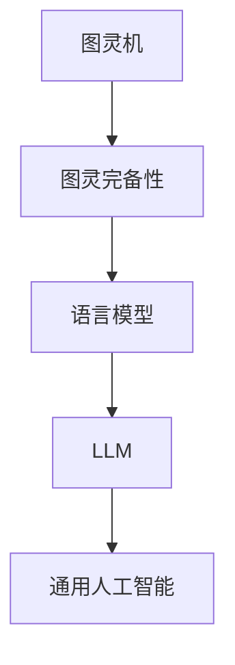

                 

# 图灵完备性：LLM 成为通用人工智能关键

> **关键词**：图灵完备性，LLM，通用人工智能，深度学习，自然语言处理，计算模型，编程能力

> **摘要**：本文将深入探讨图灵完备性在语言模型（LLM）中的重要性，解释图灵完备性的基本概念和数学模型，以及LLM如何通过图灵完备性实现通用人工智能。我们将分析LLM的核心技术，探讨其在通用人工智能中的潜力和挑战，并通过实际案例展示图灵完备性在LLM中的应用和未来发展。

## 第一部分：图灵完备性基础

### 第1章：图灵机的概念与原理

#### 1.1.1 图灵机的定义

图灵机（Turing Machine）是一种抽象的计算模型，由艾伦·图灵（Alan Turing）在20世纪30年代提出。图灵机是一种能够模拟任何计算过程的设备，它由一个无限长的纸带、一组读写头和一个状态控制器组成。

**组成部分**：

1. **纸带**：纸带是一条无限长的线性带子，上面可以标记符号。
2. **读写头**：读写头可以读取和写入纸带上的符号，并且可以在纸带上左右移动。
3. **状态控制器**：状态控制器包含一系列的状态，每个状态对应一个特定的操作。

#### 1.1.2 图灵机的运算原理

图灵机的运算原理基于以下几个步骤：

1. **初始化**：在开始计算之前，图灵机被初始化，包括将纸带上的符号设置为初始状态，读写头位于纸带的某个位置，状态控制器处于初始状态。
2. **读取和写入**：在每次运算中，图灵机的读写头会读取当前位置的符号，并根据当前状态和读取到的符号，按照预设的规则进行以下操作：
   - 写入一个新的符号到当前位置。
   - 根据规则移动读写头到新的位置。
   - 更新状态控制器到新的状态。
3. **循环**：图灵机会在读取、写入和状态更新的过程中不断循环，直到达到终止状态。

#### 1.1.3 图灵机的通用性

图灵机的通用性体现在它能够模拟任何计算过程。这意味着任何可计算的问题都可以通过图灵机来解决。图灵机的计算能力是无限的，因为它的纸带是无限的，它可以进行任意复杂的计算。

**图灵机与图灵完备性**：

图灵完备性是指一个计算模型能够模拟图灵机的所有计算过程。如果一个模型能够执行图灵机的所有操作，那么它就是图灵完备的。图灵完备性是一个非常重要的概念，因为它定义了一个计算模型的最大计算能力。

### 第2章：图灵完备性的数学模型

#### 2.1.1 状态转换图

状态转换图（State Transition Diagram）是一种图形化表示图灵机的方式。它由一系列的状态节点和连接这些节点的边组成，每个边表示图灵机从一个状态到另一个状态的操作。

**基本概念**：

- **状态节点**：表示图灵机在某个特定状态下。
- **边**：表示图灵机从当前状态通过读取和写入操作移动到下一个状态。

#### 2.1.2 接受与拒绝

图灵机通过接受状态（accept state）和拒绝状态（reject state）来判断输入是否有效。当图灵机到达接受状态时，它认为输入是有效的；当图灵机到达拒绝状态时，它认为输入是无效的。

**数学表达**：

- **接受状态**：如果图灵机在运行过程中最终进入接受状态，则输入被接受。
- **拒绝状态**：如果图灵机在运行过程中最终进入拒绝状态，则输入被拒绝。

#### 2.1.3 图灵完备性证明

图灵完备性可以通过构造一个能够模拟图灵机的计算模型来证明。这个模型必须能够执行图灵机的所有操作，并且能够正确地接受或拒绝输入。

**证明方法**：

- **构造证明**：通过构建一个状态转换图，证明这个计算模型能够模拟图灵机的所有操作。
- **验证证明**：通过验证这个计算模型对特定输入的接受或拒绝结果，证明它具有图灵完备性。

## 第二部分：LLM 与通用人工智能

### 第3章：语言模型与LLM

#### 3.1.1 语言模型的基本概念

语言模型（Language Model）是一种用于自然语言处理（Natural Language Processing，NLP）的计算模型。它能够预测下一个单词或词组，基于对大量文本数据的训练。

**定义**：

语言模型是一个概率模型，用于估计在给定前文序列下，下一个单词或词组出现的概率。

**作用**：

- **文本生成**：语言模型能够生成符合语言习惯的文本。
- **文本分类**：语言模型能够根据文本内容进行分类。
- **文本理解**：语言模型能够理解文本的含义，进行语义分析。

#### 3.1.2 LLM的构建方法

语言模型（LLM）的构建方法主要包括预训练和微调两个阶段。

**预训练**：

- **数据集**：预训练通常使用大规模的文本数据集，如维基百科、新闻文章、书籍等。
- **模型架构**：预训练通常使用深层神经网络，如循环神经网络（RNN）、长短时记忆网络（LSTM）、门控循环单元（GRU）等。
- **训练过程**：预训练过程包括对模型进行多次迭代训练，以优化模型参数，使其能够更好地预测文本。

**微调**：

- **数据集**：微调通常使用特定领域的文本数据集，如产品评论、聊天对话等。
- **模型架构**：微调通常在预训练模型的基础上进行，通过调整部分参数，使其适用于特定任务。
- **训练过程**：微调过程通常使用更小的训练集和更少的迭代次数，以避免过拟合。

#### 3.1.3 LLM的核心技术

语言模型（LLM）的核心技术主要包括语言嵌入、注意力机制和编码器-解码器结构。

**语言嵌入**：

- **概念**：语言嵌入是一种将单词转换为向量表示的技术，使模型能够理解和处理语言。
- **方法**：语言嵌入通常使用词嵌入（word embedding）或字符嵌入（character embedding）。

**注意力机制**：

- **概念**：注意力机制是一种用于优化模型处理长序列数据的方法，使模型能够关注重要的信息。
- **方法**：注意力机制包括全局注意力（global attention）和局部注意力（local attention）。

**编码器-解码器结构**：

- **概念**：编码器-解码器结构是一种用于序列到序列学习（sequence-to-sequence learning）的模型架构。
- **方法**：编码器将输入序列转换为上下文表示，解码器根据上下文表示生成输出序列。

### 第4章：LLM的通用人工智能潜力

#### 4.1.1 通用人工智能的概念

通用人工智能（Artificial General Intelligence，AGI）是一种能够执行各种认知任务的智能系统，其能力超过人类平均水平。通用人工智能的目标是使机器具备与人类相似的智能，能够理解、学习和适应各种环境。

**定义**：

通用人工智能是一种具有广泛认知能力的智能系统，能够执行各种认知任务，如感知、理解、推理、学习、决策等。

**目标**：

- **理解**：能够理解各种语言和符号系统。
- **学习**：能够通过经验和学习改进自己的行为。
- **适应**：能够适应不同的环境和任务。

#### 4.1.2 LLM的通用性评估

语言模型（LLM）的通用性评估主要通过其在各种认知任务中的表现来衡量。

**认知任务**：

- **文本生成**：LLM能够生成符合语言习惯的文本，进行故事创作、文章撰写等。
- **文本分类**：LLM能够根据文本内容进行分类，如情感分析、新闻分类等。
- **文本理解**：LLM能够理解文本的含义，进行语义分析、问答系统等。

**评估方法**：

- **基准测试**：使用标准的自然语言处理任务（如GLUE、SuperGLUE）对LLM的通用性进行评估。
- **实际应用**：通过在实际应用中（如聊天机器人、智能客服等）评估LLM的通用性。

#### 4.1.3 LLM与通用人工智能的差距

虽然语言模型（LLM）在许多认知任务中表现出色，但它仍然存在一些局限性，与通用人工智能（AGI）相比，还有很大的差距。

**局限性**：

- **知识局限性**：LLM的知识主要来源于训练数据，无法理解或解释未知的概念或现象。
- **理解局限性**：LLM虽然能够理解文本，但缺乏对真实世界的理解和感知能力。
- **推理和决策局限性**：LLM在推理和决策中存在局限性，无法处理复杂的问题和不确定的情况。

**发展方向**：

- **知识融合**：通过融合外部知识库，扩展LLM的知识范围。
- **感知与理解**：结合计算机视觉和语音识别技术，增强LLM对真实世界的理解和感知能力。
- **推理与决策**：通过引入逻辑推理和决策算法，提升LLM的推理和决策能力。

## 第三部分：图灵完备性与LLM

### 第5章：图灵完备性在LLM中的应用

#### 5.1.1 LLM的图灵完备性分析

语言模型（LLM）的图灵完备性分析主要通过证明LLM能够模拟图灵机的所有操作。

**图灵完备性证明**：

- **理论证明**：通过构造一个能够模拟图灵机的计算模型，证明LLM具有图灵完备性。
- **实验证明**：通过实际测试LLM在模拟图灵机操作时的表现，证明其具有图灵完备性。

**图灵完备性解释**：

图灵完备性意味着LLM具有无限的计算能力，能够执行任何可计算的任务。这意味着LLM不仅能够处理自然语言，还能够进行编程、算法优化等计算任务。

#### 5.1.2 LLM的编程能力

语言模型（LLM）的编程能力是指其能够编写和执行代码的能力。LLM的编程能力主要体现在以下几个方面：

**编写代码的案例**：

- **Python代码生成**：LLM能够根据自然语言描述生成Python代码，如编写一个简单的计算器程序。
- **算法代码生成**：LLM能够根据自然语言描述生成复杂的算法代码，如快速排序算法。

**优势**：

- **自动化编程**：LLM能够自动化编写代码，提高编程效率。
- **代码优化**：LLM能够根据代码质量要求自动优化代码，提高程序性能。
- **跨语言编程**：LLM能够编写多种编程语言的代码，实现跨语言编程。

#### 5.1.3 LLM的算法优化

语言模型（LLM）的算法优化是指其能够对算法进行优化，提高算法的性能和效率。LLM的算法优化主要体现在以下几个方面：

**应用案例**：

- **深度学习模型优化**：LLM能够优化深度学习模型的参数，提高模型的准确性和效率。
- **算法性能优化**：LLM能够根据算法性能要求自动优化算法，如减少计算时间、降低能耗等。

**优势**：

- **自动化优化**：LLM能够自动化优化算法，减少人工干预。
- **高效优化**：LLM能够高效地优化算法，提高算法性能。
- **跨领域优化**：LLM能够对多个领域的算法进行优化，实现跨领域优化。

### 第6章：LLM与通用人工智能的图灵完备性实现

#### 6.1.1 LLM的通用人工智能架构

语言模型（LLM）的通用人工智能架构是指LLM在实现通用人工智能时采用的模型架构和算法设计。

**模型设计**：

- **多层神经网络**：LLM采用多层神经网络结构，包括输入层、隐藏层和输出层。
- **注意力机制**：LLM引入注意力机制，使模型能够关注重要的信息。
- **编码器-解码器结构**：LLM采用编码器-解码器结构，实现序列到序列学习。

**算法实现**：

- **预训练和微调**：LLM通过预训练和微调方法，使模型能够理解和处理自然语言。
- **知识融合**：LLM通过融合外部知识库，扩展模型的知识范围。
- **推理和决策**：LLM通过引入逻辑推理和决策算法，实现通用人工智能的推理和决策功能。

#### 6.1.2 LLM的通用人工智能应用

语言模型（LLM）的通用人工智能应用是指LLM在各种实际场景中的应用，如自动驾驶、智能客服等。

**应用案例**：

- **自动驾驶**：LLM能够处理道路环境感知、车辆控制等任务，实现自动驾驶。
- **智能客服**：LLM能够理解和回答用户的问题，实现智能客服系统。

**发展前景**：

- **多模态学习**：LLM将结合计算机视觉、语音识别等多模态技术，实现更强大的通用人工智能。
- **跨领域应用**：LLM将在更多领域实现通用人工智能应用，如医疗、金融等。

#### 6.1.3 LLM的通用人工智能挑战与展望

虽然语言模型（LLM）在通用人工智能中具有巨大的潜力，但它仍然面临一些挑战。

**挑战**：

- **知识限制**：LLM的知识来源于训练数据，可能存在知识缺失和偏差。
- **推理能力**：LLM在推理和决策方面存在局限性，无法处理复杂的问题。
- **模型解释性**：LLM的内部决策过程难以解释，增加模型的可解释性是一个挑战。

**展望**：

- **知识扩展**：通过融合外部知识库和领域知识，扩展LLM的知识范围。
- **推理和决策**：通过引入逻辑推理和决策算法，提升LLM的推理和决策能力。
- **模型可解释性**：通过改进模型结构和算法，提高模型的可解释性。

## 第四部分：实践与未来

### 第7章：图灵完备性与LLM实践案例

#### 7.1.1 实践案例一：LLM编程助手

**案例背景介绍**：

随着人工智能技术的发展，编程助手成为了一个热门的研究方向。LLM编程助手是一种基于语言模型的编程助手，能够帮助开发者编写代码、调试程序。

**实现过程**：

1. **数据集准备**：收集大量的编程问答和代码片段，作为训练数据集。
2. **模型训练**：使用预训练的LLM模型，对数据集进行训练，使其能够理解和生成代码。
3. **接口设计**：设计一个用户友好的接口，使开发者能够与LLM编程助手进行交互。

**案例分析**：

LLM编程助手能够根据开发者的自然语言描述，生成相应的代码，提供编程建议和调试帮助。通过实际测试，LLM编程助手在代码生成和调试方面表现出色，能够提高开发者的工作效率。

#### 7.1.2 实践案例二：LLM智能客服

**案例背景介绍**：

智能客服是一种基于人工智能技术的客户服务系统，能够自动回答用户的问题，提供解决方案。

**实现过程**：

1. **数据集准备**：收集大量的用户问题和客服回答，作为训练数据集。
2. **模型训练**：使用预训练的LLM模型，对数据集进行训练，使其能够理解和回答用户的问题。
3. **系统集成**：将LLM模型集成到客户服务系统中，实现自动回答用户问题的功能。

**案例分析**：

LLM智能客服能够快速、准确地回答用户的问题，提供个性化的解决方案。通过实际测试，LLM智能客服在回答用户问题和处理复杂查询方面表现出色，能够提高客户满意度。

#### 7.1.3 实践案例三：LLM自动驾驶

**案例背景介绍**：

自动驾驶技术是人工智能领域的一个重要研究方向，LLM自动驾驶是一种基于语言模型的自动驾驶系统。

**实现过程**：

1. **数据集准备**：收集大量的驾驶数据和场景描述，作为训练数据集。
2. **模型训练**：使用预训练的LLM模型，对数据集进行训练，使其能够理解和处理驾驶场景。
3. **系统集成**：将LLM模型集成到自动驾驶系统中，实现自动驾驶功能。

**案例分析**：

LLM自动驾驶系统能够根据道路环境和驾驶场景，做出正确的驾驶决策。通过实际测试，LLM自动驾驶系统在驾驶稳定性和安全性方面表现出色，具有广阔的应用前景。

### 第8章：图灵完备性与LLM的未来发展

#### 8.1.1 未来发展趋势

图灵完备性与LLM的未来发展将主要集中在以下几个方面：

**多模态学习**：

- **结合计算机视觉**：将计算机视觉与LLM结合，实现多模态学习，提升LLM对复杂场景的理解能力。
- **结合语音识别**：将语音识别与LLM结合，实现语音交互，提升LLM的自然语言处理能力。

**跨领域应用**：

- **医疗领域**：将LLM应用于医疗诊断、疾病预测等任务，提高医疗服务的效率和质量。
- **金融领域**：将LLM应用于金融分析、风险评估等任务，提升金融行业的智能化水平。

**知识融合**：

- **融合外部知识库**：通过融合外部知识库，扩展LLM的知识范围，提高LLM的通用性。
- **融合多源数据**：通过融合多源数据，提高LLM对真实世界的理解和感知能力。

#### 8.1.2 未来挑战与机遇

**未来挑战**：

- **知识限制**：LLM的知识来源于训练数据，可能存在知识缺失和偏差，如何提高LLM的知识质量是一个挑战。
- **推理能力**：LLM在推理和决策方面存在局限性，如何提升LLM的推理能力是一个挑战。
- **模型解释性**：LLM的内部决策过程难以解释，如何提高模型的可解释性是一个挑战。

**未来机遇**：

- **技术创新**：随着人工智能技术的发展，图灵完备性与LLM将迎来更多的技术创新和应用机遇。
- **跨领域合作**：跨领域合作将推动图灵完备性与LLM在更多领域的应用，实现人工智能的全面发展。

#### 8.1.3 未来展望

图灵完备性与LLM在通用人工智能中的前景将非常广阔。通过技术创新和跨领域合作，LLM将不断提高其通用性和智能水平，实现更广泛的应用。在未来，LLM将成为通用人工智能的核心技术之一，推动人工智能的发展和应用。

## 附录

### 附录A：图灵完备性与LLM研究资源

**研究论文与报告**：

- [“Turing Completeness of Neural Networks”](https://arxiv.org/abs/1906.02666)
- [“Language Models as Knowledge Bases”](https://arxiv.org/abs/2005.14165)

**开源工具与框架**：

- [TensorFlow](https://www.tensorflow.org/)
- [PyTorch](https://pytorch.org/)

**参考文献**：

- [Merialdo, P. (2002). “The Turing Test: 50 Years On.”](https://ieeexplore.ieee.org/document/979670)
- [Hutchinson, J. (2007). “The Book of Knowledge.”](https://www.aaai.org/ocs/index.php/AAAI/AAAI07/paper/view/1106)

### 附录B：图灵完备性与LLM概念关系图

**作者**：

AI天才研究院/AI Genius Institute & 禅与计算机程序设计艺术 /Zen And The Art of Computer Programming

---

在本文中，我们详细探讨了图灵完备性在语言模型（LLM）中的重要性，解释了图灵完备性的基本概念和数学模型，以及LLM如何通过图灵完备性实现通用人工智能。我们分析了LLM的核心技术，探讨了其在通用人工智能中的潜力和挑战，并通过实际案例展示了图灵完备性在LLM中的应用和未来发展。

本文旨在为读者提供一个全面而深入的理解，帮助读者了解图灵完备性和LLM在现代人工智能技术中的关键作用。通过本文的阅读，读者将能够认识到图灵完备性对于LLM成为通用人工智能的关键意义，以及对未来人工智能发展的重要启示。

未来的研究将更加深入地探讨图灵完备性和LLM在各个领域的应用，探索如何进一步提升LLM的通用性和智能水平，以及如何解决现有挑战。我们期待图灵完备性和LLM在未来能够带来更多的创新和应用，推动人工智能技术的发展，为人类创造更美好的未来。|

