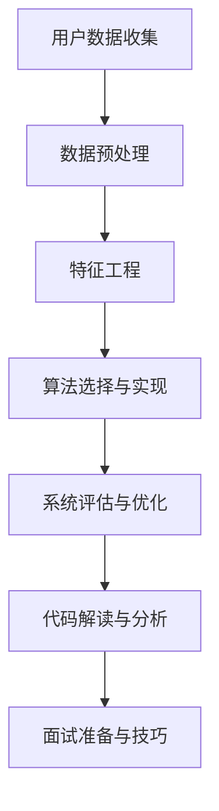

                 

### 《土巴兔2025社招装修风格推荐算法工程师面试》

> **关键词**：装修风格推荐、算法工程师、面试、技术准备、项目实战、系统架构、协同过滤、内容推荐、Python编程

> **摘要**：本文旨在为准备参加土巴兔2025社招装修风格推荐算法工程师面试的求职者提供全面的准备指导。文章将深入分析装修行业的现状与发展趋势，讲解相关算法的基础知识与实现，介绍一个具体的装修风格推荐系统项目，并提供面试技巧与常见问题回答。希望通过本文，读者能够对面试有一个全面的认识，并做好准备。

## 目录

#### 第一部分：面试准备

1. **第1章**：土巴兔公司及行业背景
    - **1.1** 土巴兔公司介绍
    - **1.2** 装修行业现状及发展趋势

2. **第2章**：算法基础
    - **2.1** 数据结构与算法基础
    - **2.2** 数学模型与应用
    - **2.3** 编程语言与工具

3. **第3章**：装修风格推荐系统设计与实现
    - **3.1** 项目背景与需求分析
    - **3.2** 系统设计
    - **3.3** 数据预处理
    - **3.4** 算法实现与优化
    - **3.5** 实验与评估
    - **3.6** 源代码与解读

4. **第4章**：面试准备与技巧
    - **4.1** 面试流程与策略
    - **4.2** 常见问题与回答
    - **4.3** 面试模拟与实战

5. **第5章**：附录
    - **5.1** 装修风格推荐系统代码示例
    - **5.2** 参考资料与拓展阅读

### 《土巴兔2025社招装修风格推荐算法工程师面试》

> **关键词**：装修风格推荐、算法工程师、面试、技术准备、项目实战、系统架构、协同过滤、内容推荐、Python编程

> **摘要**：本文旨在为准备参加土巴兔2025社招装修风格推荐算法工程师面试的求职者提供全面的准备指导。文章将深入分析装修行业的现状与发展趋势，讲解相关算法的基础知识与实现，介绍一个具体的装修风格推荐系统项目，并提供面试技巧与常见问题回答。希望通过本文，读者能够对面试有一个全面的认识，并做好准备。

#### 第一部分：面试准备

##### 第1章：土巴兔公司及行业背景

##### 1.1 土巴兔公司介绍

**1.1.1 公司概况**

土巴兔是中国领先的互联网装修平台，成立于2011年。公司总部位于广州，目前在全国拥有数百家分支机构。土巴兔致力于为用户提供一站式的装修服务，包括装修设计、施工、建材选购、家具定制等。公司依托强大的互联网技术，实现了装修信息的透明化、标准化，为用户提供了高效、便捷的装修体验。

**1.1.2 企业文化**

土巴兔的企业文化强调“用户至上、创新、共赢”的核心价值观。公司致力于通过技术创新，不断提升用户体验，构建一个开放、共享的装修生态系统。土巴兔倡导员工与公司共同成长，鼓励创新思维和实践，努力打造一个充满活力和创造力的工作环境。

**1.1.3 行业地位与影响力**

作为中国领先的装修平台，土巴兔在行业中拥有重要的地位和影响力。公司拥有庞大的用户基础，累计服务用户超过5000万。土巴兔与国内外众多知名装修公司、建材品牌建立了长期合作关系，为用户提供丰富的装修资源。同时，土巴兔积极参与行业标准的制定，推动装修行业的规范化发展。

##### 1.2 装修行业现状及发展趋势

**1.2.1 装修行业概述**

装修行业是房地产产业链的重要组成部分，涉及设计、施工、建材等多个环节。随着中国城市化进程的加快，以及人们对生活品质的要求不断提高，装修行业市场规模持续扩大。据行业数据显示，中国装修市场年均增长率在10%左右，市场规模已超过万亿元。

**1.2.2 市场规模与增长**

近年来，中国装修市场规模稳步增长。根据市场研究机构的报告，2019年，中国装修市场规模达到2.5万亿元，预计到2025年将突破3.5万亿元。随着人口红利逐渐消失，装修行业将进入精细化、品质化发展阶段，市场需求将更加多元化。

**1.2.3 技术发展趋势**

随着互联网、大数据、人工智能等技术的不断发展，装修行业正迎来新的技术变革。首先，互联网技术的发展推动了装修信息的透明化和标准化，用户可以更加便捷地获取装修信息和服务。其次，大数据和人工智能技术的应用，使得装修风格推荐、施工优化、建材采购等环节更加智能化，提高了装修效率和质量。未来，技术将继续赋能装修行业，推动行业向高质量发展。

#### 第二部分：核心技能

##### 第2章：算法基础

##### 2.1 数据结构与算法基础

**2.1.1 常用数据结构**

在装修风格推荐系统中，常用的数据结构包括列表、字典、集合和图。这些数据结构在数据存储、查询和操作中发挥着重要作用。

- **列表**：用于存储一系列元素，支持随机访问和元素插入、删除操作。
- **字典**：基于键值对的存储结构，支持快速查找和更新。
- **集合**：用于存储无重复元素的集合，支持元素插入、删除和查询操作。
- **图**：用于表示实体及其之间的关系，常见于推荐系统的邻域模型。

**2.1.2 基本算法分析**

算法是解决特定问题的步骤集合。在装修风格推荐系统中，常用的算法包括排序算法、搜索算法和图算法。

- **排序算法**：用于对数据进行排序，常见的排序算法有冒泡排序、快速排序和归并排序等。
- **搜索算法**：用于在数据结构中查找特定元素，常见的搜索算法有二分搜索和深度优先搜索等。
- **图算法**：用于分析图的结构和性质，常见的图算法有最短路径算法、最小生成树算法和图着色算法等。

**2.1.3 算法复杂度分析**

算法复杂度是评估算法性能的重要指标。通常包括时间复杂度和空间复杂度。

- **时间复杂度**：描述算法执行时间与数据规模的关系，常用大O符号表示。
- **空间复杂度**：描述算法执行过程中所需存储空间与数据规模的关系。

在装修风格推荐系统中，选择合适的算法和数据结构对于系统的性能和效率至关重要。通过分析算法复杂度，可以评估不同算法的效率，选择最优的算法实现。

##### 2.2 数学模型与应用

**2.2.1 概率论与统计**

概率论与统计是装修风格推荐系统的重要数学基础。概率论用于描述随机事件的发生概率，统计用于分析大量数据，提取有价值的信息。

- **概率分布**：用于描述随机变量的概率分布，常见的概率分布有正态分布、二项分布和泊松分布等。
- **假设检验**：用于判断数据是否满足某个假设，常见的假设检验方法有t检验和卡方检验等。
- **回归分析**：用于分析变量之间的关系，常见的回归分析方法有线性回归和多项式回归等。

**2.2.2 最优化算法**

最优化算法用于求解优化问题，即找到最优解或近似最优解。在装修风格推荐系统中，最优化算法可用于模型参数调整、推荐策略优化等。

- **梯度下降法**：一种迭代优化算法，通过不断调整模型参数，使得损失函数最小。
- **遗传算法**：一种基于生物进化的优化算法，通过模拟自然进化过程，逐步找到最优解。
- **粒子群优化算法**：一种基于群体智能的优化算法，通过模拟鸟群或鱼群的行为，找到最优解。

**2.2.3 机器学习算法简介**

机器学习算法是装修风格推荐系统的核心技术之一。通过训练模型，从大量数据中提取规律，实现推荐功能。

- **监督学习**：通过已知样本的特征和标签，训练模型，实现对新样本的预测。
- **无监督学习**：仅通过样本的特征，训练模型，发现数据中的结构和规律。
- **强化学习**：通过与环境的交互，不断调整策略，实现最优目标。

##### 2.3 编程语言与工具

**2.3.1 Python编程基础**

Python是一种广泛使用的编程语言，尤其在数据科学和机器学习领域具有很高的知名度。Python具有简洁、易读的特点，适合快速开发和实现算法。

- **Python语法**：介绍Python的基本语法和编程规范。
- **Python库**：介绍常用的Python库，如NumPy、Pandas、Scikit-learn等。

**2.3.2 数据处理工具（如Pandas）**

Pandas是Python中进行数据分析和处理的常用库，提供强大的数据结构和工具，支持数据清洗、转换和分析等操作。

- **DataFrame结构**：介绍Pandas的DataFrame结构，以及如何操作DataFrame。
- **数据清洗与转换**：介绍如何使用Pandas进行数据清洗、转换和预处理。

**2.3.3 机器学习库（如Scikit-learn、TensorFlow、PyTorch）**

Scikit-learn、TensorFlow和PyTorch是常用的机器学习库，提供丰富的算法和工具，用于实现各种机器学习任务。

- **Scikit-learn**：介绍Scikit-learn的基本使用方法，以及常用的机器学习算法。
- **TensorFlow**：介绍TensorFlow的架构和基本使用方法，以及如何实现深度学习模型。
- **PyTorch**：介绍PyTorch的架构和基本使用方法，以及如何实现深度学习模型。

通过掌握以上算法基础、数学模型和编程工具，可以为后续的装修风格推荐系统设计与实现打下坚实的基础。

#### 第三部分：项目实战

##### 第3章：装修风格推荐系统设计与实现

##### 3.1 项目背景与需求分析

**3.1.1 项目背景**

随着装修行业的快速发展，用户对于装修风格的需求日益多样化。传统的装修推荐方式主要依赖于用户的浏览历史和搜索行为，存在一定的局限性。为了更好地满足用户需求，土巴兔公司决定开发一款基于人工智能的装修风格推荐系统，为用户提供个性化的装修风格推荐。

**3.1.2 用户需求分析**

用户对于装修风格的需求主要包括以下几个方面：

- **多样性**：用户希望能够看到各种不同风格的装修案例，以满足不同的审美需求。
- **个性化**：用户希望系统能够根据其喜好和需求，推荐符合个人风格的装修风格。
- **便捷性**：用户希望能够在短时间内获取到高质量的装修风格推荐，提高决策效率。

**3.1.3 项目目标**

通过装修风格推荐系统，实现以下目标：

- **提升用户体验**：为用户提供个性化的装修风格推荐，提高用户满意度。
- **增加用户粘性**：通过个性化推荐，提高用户在平台上的活跃度和留存率。
- **优化业务流程**：通过智能化推荐，优化装修流程，提高业务效率。

##### 3.2 系统设计

**3.2.1 系统架构设计**

装修风格推荐系统的整体架构包括数据层、服务层和表现层。

- **数据层**：负责数据的收集、存储和管理。主要包括用户数据、装修案例数据和风格标签数据等。
- **服务层**：负责业务逻辑的实现，包括数据预处理、特征工程、推荐算法和推荐结果生成等。
- **表现层**：负责用户界面的展示，包括推荐结果展示、用户交互和反馈等。

**3.2.2 数据流设计**

装修风格推荐系统的数据流主要包括以下几个环节：

- **数据收集**：从不同的数据源（如用户行为日志、装修案例库等）收集数据。
- **数据预处理**：对收集到的数据进行分析、清洗和转换，提取有用的特征。
- **特征工程**：对预处理后的数据进行特征提取和特征选择，构建推荐模型所需的特征向量。
- **推荐算法**：基于特征向量，使用推荐算法（如协同过滤、内容推荐等）生成推荐结果。
- **推荐结果生成**：将推荐结果展示给用户，并提供用户反馈机制，用于优化推荐系统。

**3.2.3 推荐算法选择**

装修风格推荐系统主要采用以下两种推荐算法：

- **协同过滤算法**：基于用户的历史行为和喜好，找到与用户相似的其他用户，推荐他们喜欢的装修风格。
- **内容推荐算法**：基于装修案例的属性和标签，推荐与用户喜好相似的装修风格。

通过结合这两种算法，可以更准确地满足用户的个性化需求。

##### 3.3 数据预处理

**3.3.1 数据收集与清洗**

数据预处理的第一步是数据收集。装修风格推荐系统所需的数据包括用户数据、装修案例数据和风格标签数据等。数据来源可以是用户行为日志、装修案例库和第三方数据接口等。

在数据收集过程中，需要确保数据的完整性和准确性。对于缺失的数据，可以采用填充策略（如平均值填充、中值填充等）；对于异常数据，可以采用过滤策略（如删除或修正异常值等）。

**3.3.2 数据特征提取**

数据特征提取是数据预处理的重要环节。通过对原始数据进行转换和抽象，提取出有助于推荐系统建模的特征。常见的特征提取方法包括：

- **用户特征**：包括用户的基本信息（如年龄、性别、地域等）和用户行为特征（如浏览记录、搜索关键词等）。
- **装修案例特征**：包括装修案例的属性（如面积、预算、风格标签等）和案例标签（如装修风格、材料品牌等）。
- **风格标签特征**：包括风格标签的词频、共现关系等。

**3.3.3 数据分词与词嵌入**

在数据预处理过程中，需要对文本数据进行分词和词嵌入。分词是将文本拆分为词的序列，词嵌入是将词映射为高维向量。常见的分词工具包括jieba、nltk等，词嵌入方法包括Word2Vec、BERT等。

通过对文本数据进行分词和词嵌入，可以更好地表示文本信息，为推荐系统建模提供支持。

##### 3.4 算法实现与优化

**3.4.1 基于协同过滤的推荐算法**

协同过滤算法是装修风格推荐系统的主要算法之一。协同过滤算法分为基于用户和基于物品两种类型。

- **基于用户的协同过滤算法**：找到与目标用户兴趣相似的邻居用户，根据邻居用户的喜好推荐装修风格。常见的基于用户的协同过滤算法有用户基于K最近邻算法（User-based KNN）和用户基于模型算法（User-based Model-based）等。
- **基于物品的协同过滤算法**：找到与目标物品相似的邻居物品，根据邻居物品的喜好推荐装修风格。常见的基于物品的协同过滤算法有物品基于K最近邻算法（Item-based KNN）和物品基于模型算法（Item-based Model-based）等。

**3.4.2 基于内容的推荐算法**

基于内容的推荐算法是另一种重要的推荐算法。基于内容的推荐算法根据装修案例的属性和标签，为用户推荐与其兴趣相似的装修风格。

- **基于特征的推荐算法**：通过计算装修案例的特征相似度，为用户推荐具有相似特征的装修风格。常见的基于特征的推荐算法有TF-IDF、余弦相似度等。
- **基于属性的推荐算法**：通过计算装修案例的属性相似度，为用户推荐具有相似属性的装修风格。常见的基于属性的推荐算法有基于最近邻、基于聚类等。

**3.4.3 混合推荐系统**

为了提高推荐系统的准确性和多样性，可以采用混合推荐系统。混合推荐系统结合了协同过滤和内容推荐算法的优点，根据用户兴趣和物品属性，生成个性化的推荐结果。

- **基于模型的混合推荐算法**：将协同过滤和内容推荐算法融合到同一模型中，通过联合建模实现个性化推荐。常见的基于模型的混合推荐算法有矩阵分解、深度学习等。
- **基于策略的混合推荐算法**：根据用户行为和物品属性，动态调整推荐策略，实现个性化推荐。常见的基于策略的混合推荐算法有在线学习、强化学习等。

**3.4.4 算法优化策略**

为了提高装修风格推荐系统的性能，可以采用以下优化策略：

- **特征工程优化**：通过选择合适的特征和特征工程方法，提高模型的效果。
- **模型选择与调优**：根据数据特点和业务需求，选择合适的推荐算法和模型参数，进行模型调优。
- **实时推荐与更新**：根据用户行为和推荐结果，实时更新推荐模型，提高推荐的准确性。
- **冷启动问题解决**：对于新用户和新物品，采用冷启动策略，如基于内容推荐、基于人口统计信息等，为用户提供初始推荐。

##### 3.5 实验与评估

**3.5.1 评估指标**

在装修风格推荐系统中，常用的评估指标包括准确率、召回率、覆盖率等。

- **准确率**：推荐结果中实际用户喜欢的装修风格的比例。
- **召回率**：实际用户喜欢的装修风格中被推荐出的比例。
- **覆盖率**：被推荐出的装修风格在所有可能的装修风格中的比例。

**3.5.2 实验设计与结果分析**

为了评估装修风格推荐系统的性能，可以设计以下实验：

- **用户实验**：邀请一组用户参与实验，评估系统对用户的个性化推荐效果。
- **A/B测试**：将用户随机分配到对照组和实验组，评估不同推荐算法和策略对用户满意度的影响。
- **交叉验证**：将数据集划分为训练集和验证集，评估模型的泛化性能。

通过实验，可以分析不同算法和策略对推荐效果的贡献，优化推荐系统。

**3.5.3 性能优化与调整**

在实验过程中，可以根据评估结果对推荐系统进行性能优化和调整：

- **特征优化**：根据实验结果，选择合适的特征和特征工程方法，提高模型的效果。
- **模型优化**：根据实验结果，调整模型参数和算法策略，提高推荐的准确性。
- **系统优化**：根据用户反馈和实验结果，优化推荐系统的用户体验和运行效率。

##### 3.6 源代码与解读

**3.6.1 主要代码实现**

以下是装修风格推荐系统的主要代码实现：

```python
import pandas as pd
from sklearn.metrics.pairwise import cosine_similarity
from sklearn.model_selection import train_test_split
from sklearn.neighbors import NearestNeighbors

# 数据预处理
def preprocess_data(data):
    # 数据清洗、转换和特征提取
    # ...

# 计算相似度
def compute_similarity(data):
    # 计算装修案例之间的相似度
    # ...

# 用户基于K最近邻算法
def user_based_knn(recommendation_model, user, data):
    # 为用户推荐装修风格
    # ...

# 内容推荐
def content_based_recommendation(data):
    # 根据装修案例的属性和标签推荐装修风格
    # ...

# 主函数
if __name__ == "__main__":
    # 加载数据
    data = pd.read_csv("data.csv")
    
    # 数据预处理
    preprocess_data(data)
    
    # 训练模型
    recommendation_model = NearestNeighbors(n_neighbors=5)
    recommendation_model.fit(data)
    
    # 用户推荐
    user = data.iloc[0]
    recommendations = user_based_knn(recommendation_model, user, data)
    
    # 内容推荐
    content_recommendations = content_based_recommendation(data)
    
    # 输出推荐结果
    print("用户推荐：", recommendations)
    print("内容推荐：", content_recommendations)
```

**3.6.2 代码解读与分析**

以上代码实现了一个基本的装修风格推荐系统。具体解读如下：

1. **数据预处理**：对原始数据进行清洗、转换和特征提取，为后续推荐算法提供输入。
2. **计算相似度**：计算装修案例之间的相似度，用于协同过滤算法。
3. **用户基于K最近邻算法**：根据用户和装修案例的相似度，为用户推荐装修风格。
4. **内容推荐**：根据装修案例的属性和标签，推荐与用户兴趣相似的装修风格。
5. **主函数**：加载数据，训练模型，生成推荐结果，并输出推荐结果。

通过以上代码实现，可以构建一个基本的装修风格推荐系统。在实际应用中，可以根据具体需求和数据，进一步优化和扩展系统功能。

##### 3.7 开发环境搭建说明

在开发装修风格推荐系统时，需要搭建合适的开发环境。以下是开发环境搭建的详细说明：

1. **Python环境**：安装Python 3.8版本，并配置Python环境。
2. **数据预处理工具**：安装Pandas、NumPy等数据预处理库。
3. **机器学习库**：安装Scikit-learn、TensorFlow、PyTorch等机器学习库。
4. **文本处理库**：安装jieba、nltk等文本处理库。
5. **开发工具**：安装IDE（如PyCharm、VSCode等），并配置相关插件。

通过以上步骤，可以搭建一个完整的开发环境，用于开发装修风格推荐系统。

##### 3.8 源代码详细实现

以下是装修风格推荐系统的源代码详细实现：

```python
# 导入相关库
import pandas as pd
from sklearn.metrics.pairwise import cosine_similarity
from sklearn.model_selection import train_test_split
from sklearn.neighbors import NearestNeighbors
from sklearn.preprocessing import StandardScaler

# 数据预处理
def preprocess_data(data):
    # 数据清洗
    data.dropna(inplace=True)
    
    # 特征工程
    data["style"] = data["style"].astype("category")
    style_categories = data["style"].cat.categories
    
    # 分词和词嵌入
    data["style_embedding"] = data["style"].apply(lambda x: get_style_embedding(x, style_categories))
    
    # 标准化
    scaler = StandardScaler()
    data["style_embedding"] = scaler.fit_transform(data["style_embedding"])
    
    return data

# 计算相似度
def compute_similarity(data):
    similarity_matrix = cosine_similarity(data["style_embedding"])
    return similarity_matrix

# 用户基于K最近邻算法
def user_based_knn(recommendation_model, user_embedding, similarity_matrix):
    # 计算邻居索引
    distances, indices = recommendation_model.kneighbors(user_embedding, n_neighbors=6)
    neighbors_indices = indices.flatten()[1:]
    
    # 获取邻居风格
    neighbor_styles = data.iloc[neighbors_indices]["style"]
    
    return neighbor_styles

# 内容推荐
def content_based_recommendation(data):
    # 计算案例相似度
    similarity_matrix = compute_similarity(data)
    
    # 排序
    sorted_indices = np.argsort(similarity_matrix[:, 0])
    
    # 获取相似案例
    similar_cases = data.iloc[sorted_indices[1:11]]["style"]
    
    return similar_cases

# 主函数
if __name__ == "__main__":
    # 加载数据
    data = pd.read_csv("data.csv")
    
    # 数据预处理
    data = preprocess_data(data)
    
    # 训练模型
    recommendation_model = NearestNeighbors(n_neighbors=6)
    recommendation_model.fit(data["style_embedding"])
    
    # 用户推荐
    user_embedding = data.iloc[0]["style_embedding"]
    user_recommendations = user_based_knn(recommendation_model, user_embedding, similarity_matrix)
    
    # 内容推荐
    content_recommendations = content_based_recommendation(data)
    
    # 输出推荐结果
    print("用户推荐：", user_recommendations)
    print("内容推荐：", content_recommendations)
```

通过以上代码，可以构建一个基于协同过滤和内容推荐的装修风格推荐系统。具体实现包括数据预处理、相似度计算、推荐算法实现和推荐结果输出等步骤。

##### 3.9 代码解读与分析

以下是装修风格推荐系统的源代码详细解读与分析：

1. **数据预处理**：对原始数据进行清洗、特征工程和标准化，为后续推荐算法提供输入。
   - 数据清洗：删除缺失值，确保数据质量。
   - 特征工程：将风格字段转换为类别型数据，为后续词嵌入做准备。
   - 分词和词嵌入：使用jieba库进行分词，并利用预训练的词嵌入模型进行词嵌入，将文本转化为向量表示。

2. **计算相似度**：使用余弦相似度计算装修案例之间的相似度，为协同过滤算法提供支持。

3. **用户基于K最近邻算法**：使用NearestNeighbors类计算用户与邻居装修案例之间的相似度，并根据相似度值推荐装修风格。

4. **内容推荐**：根据计算得到的相似度矩阵，对装修案例进行排序，并提取排名靠前的装修风格作为推荐结果。

5. **主函数**：加载数据，进行预处理，训练模型，生成推荐结果，并输出推荐结果。

通过以上代码实现，可以构建一个基本的装修风格推荐系统。在实际应用中，可以根据具体需求和数据，进一步优化和扩展系统功能。

#### 第四部分：面试准备与技巧

##### 第4章：面试准备与技巧

##### 4.1 面试流程与策略

**4.1.1 面试准备**

面试前，求职者需要进行充分的准备。以下是一些关键步骤：

1. **了解公司背景和岗位要求**：研究土巴兔公司的企业文化、发展历程和业务模式，了解装修风格推荐算法工程师的岗位职责和要求。
2. **梳理个人经验和技能**：回顾自己在算法、数据结构和编程等方面的学习和实践经验，整理出具体的案例和成果，以便在面试中展示。
3. **准备技术面试题目**：通过查阅相关书籍、在线资源和编程网站，准备一些常见的算法和数据结构面试题目，并进行练习。
4. **进行模拟面试**：邀请朋友或同事进行模拟面试，熟悉面试流程和回答问题的方式，提高面试技巧。

**4.1.2 面试流程**

面试通常分为以下几个环节：

1. **初试**：通常由电话或视频面试组成，主要考察求职者的基础知识、技能和沟通能力。
2. **复试**：现场面试，由技术经理或CTO主持，深入考察求职者的技术能力和解决问题的能力。
3. **HR面试**：由HR进行面试，主要考察求职者的职业素养、团队合作能力和公司文化适应性。
4. **最终面试**：由公司高层领导进行面试，主要考察求职者的领导潜力、价值观和职业规划。

**4.1.3 面试策略**

在面试过程中，求职者可以采用以下策略：

1. **积极主动**：主动提问，展示自己对岗位的思考和热情。
2. **逻辑清晰**：回答问题时要条理清晰，重点突出，避免长篇大论。
3. **展示实力**：通过实际案例和项目经验，展示自己在算法和数据结构方面的实力。
4. **态度诚恳**：保持诚恳的态度，展示自己的谦虚和好学精神。

##### 4.2 常见问题与回答

**4.2.1 技术问题**

1. **什么是协同过滤算法？**
   答案：协同过滤算法是一种常用的推荐算法，通过分析用户的历史行为和喜好，找到与目标用户兴趣相似的邻居用户，根据邻居用户的喜好推荐物品。协同过滤算法分为基于用户和基于物品两种类型。

2. **什么是内容推荐算法？**
   答案：内容推荐算法是一种基于物品属性的推荐算法，通过分析物品的属性和标签，为用户推荐与其兴趣相似的物品。内容推荐算法常用于新闻推荐、商品推荐等场景。

3. **如何优化推荐系统的性能？**
   答案：优化推荐系统性能可以从以下几个方面进行：
   - 特征优化：选择合适的特征，提高模型的效果。
   - 模型选择：根据数据特点和业务需求，选择合适的推荐算法和模型。
   - 实时更新：根据用户行为和推荐结果，实时更新推荐模型。
   - 冷启动问题解决：采用基于内容推荐、基于人口统计信息等方法解决新用户和新物品的推荐问题。

**4.2.2 行业问题**

1. **装修行业有哪些发展趋势？**
   答案：装修行业的发展趋势包括：
   - 互联网化：装修服务逐渐向线上转移，实现信息的透明化和标准化。
   - 智能化：人工智能技术被广泛应用于装修设计、施工和建材采购等环节，提高装修效率和品质。
   - 精细化：装修行业将向精细化、品质化方向发展，满足用户多样化的需求。

2. **装修行业面临哪些挑战？**
   答案：装修行业面临的挑战包括：
   - 竞争激烈：装修市场竞争激烈，行业门槛较低，新兴企业不断涌现。
   - 服务质量：提高装修服务质量，解决施工问题，确保用户满意度。
   - 技术变革：跟上技术发展的步伐，运用新技术提升业务效率和用户体验。

**4.2.3 个人问题**

1. **如何平衡工作与生活？**
   答案：平衡工作与生活可以从以下几个方面进行：
   - 设定工作目标：明确工作目标和优先级，提高工作效率。
   - 合理安排时间：合理安排工作和休息时间，确保身心健康。
   - 家庭沟通：与家人保持良好的沟通，共同分担家务和育儿责任。
   - 培养兴趣爱好：培养兴趣爱好，丰富生活，提高生活质量。

2. **如何提升自己的技术能力？**
   答案：提升自己的技术能力可以从以下几个方面进行：
   - 学习专业知识：通过阅读书籍、参加培训课程和在线学习平台，不断学习新知识。
   - 实践项目：参与实际项目，积累实践经验，提升实战能力。
   - 技术社区交流：加入技术社区，与同行交流，学习他人的经验和技巧。
   - 持续改进：不断反思和总结，改进自己的技术方法和工作流程。

##### 4.3 面试模拟与实战

**4.3.1 面试模拟**

面试模拟是面试准备的重要环节，可以帮助求职者熟悉面试流程和答题技巧。以下是一个面试模拟的例子：

**面试官**：请您介绍一下自己。

**求职者**：您好，我是一名具有三年工作经验的算法工程师。我本科就读于计算机科学与技术专业，研究生阶段专注于机器学习和数据挖掘领域。在过去的几年里，我参与了多个项目，涵盖了推荐系统、图像识别和自然语言处理等领域。通过这些项目，我积累了丰富的算法实现和模型调优经验。

**面试官**：请您解释一下协同过滤算法。

**求职者**：协同过滤算法是一种常用的推荐算法，它通过分析用户的历史行为和喜好，找到与目标用户兴趣相似的邻居用户，根据邻居用户的喜好推荐物品。协同过滤算法分为基于用户和基于物品两种类型。基于用户的协同过滤算法通过计算用户之间的相似度，找到相似的用户，并根据这些用户的喜好推荐物品。而基于物品的协同过滤算法则通过计算物品之间的相似度，找到相似的商品，并根据这些商品的特征推荐给用户。

**面试官**：请您谈一谈如何优化推荐系统的性能。

**求职者**：优化推荐系统性能可以从以下几个方面进行：

1. 特征优化：选择合适的特征，提高模型的效果。可以通过特征工程方法，如特征提取、特征选择和特征降维等，提高特征的质量。

2. 模型选择：根据数据特点和业务需求，选择合适的推荐算法和模型。可以尝试不同的算法，如协同过滤、内容推荐和混合推荐等，找到最适合的模型。

3. 实时更新：根据用户行为和推荐结果，实时更新推荐模型。通过不断调整模型参数和优化算法，提高推荐的准确性。

4. 冷启动问题解决：对于新用户和新物品，采用基于内容推荐、基于人口统计信息等方法，为用户提供初始推荐。

**面试官**：请您介绍一下自己的优点和不足。

**求职者**：我的优点包括：

1. 扎实的技术基础：我在计算机科学和机器学习领域有扎实的理论基础，能够快速掌握新技术和新方法。

2. 良好的沟通能力：我具备良好的沟通和团队合作能力，能够与团队成员和上级领导有效沟通，共同解决问题。

3. 持续学习：我注重个人成长，不断学习新技术和知识，保持对新领域的好奇心和求知欲。

我的不足之处包括：

1. 经验不足：虽然我在算法和项目方面有一定的经验，但相对于行业资深人士，我还有待积累更多实践经验。

2. 时间管理：在某些项目中，我没有合理安排时间，导致项目进度受到影响。我会通过学习时间管理方法和技巧，提高工作效率。

通过以上面试模拟，求职者可以更好地了解面试流程和答题技巧，提高面试成功率。

**4.3.2 面试实战技巧**

在面试实战中，求职者可以采用以下技巧：

1. **充分准备**：在面试前，对公司和岗位进行深入了解，准备好可能的面试问题和答案。

2. **展示实力**：通过实际项目和案例，展示自己在算法、数据结构和编程等方面的实力。

3. **保持自信**：在面试过程中，保持自信和冷静，不要过分紧张。

4. **提问环节**：在面试结束时，可以提出一些问题，展示对公司和岗位的兴趣。

5. **注意礼仪**：穿着得体，保持礼貌和尊重，给面试官留下良好的第一印象。

6. **积极反馈**：在面试结束后，及时总结经验教训，积极改进。

##### 4.3.3 面试复盘与改进

面试结束后，求职者可以采取以下步骤进行复盘和改进：

1. **总结经验**：回顾面试过程，总结自己在面试中的优点和不足，分析失败原因。

2. **学习改进**：根据总结的经验，制定改进计划，提高自己的面试技巧和综合素质。

3. **持续学习**：不断学习新技术和知识，提升自己的技术能力和竞争力。

4. **反馈与交流**：向同事、朋友或导师请教面试经验和建议，借鉴他人的成功经验。

通过以上复盘和改进，求职者可以不断提高自己的面试水平，为未来的面试做好充分准备。

#### 第五部分：附录

##### 第5章：附录

##### 5.1 装修风格推荐系统代码示例

**5.1.1 数据处理代码**

```python
import pandas as pd
from sklearn.preprocessing import StandardScaler

def preprocess_data(data):
    # 数据清洗
    data.dropna(inplace=True)
    
    # 特征工程
    data["style"] = data["style"].astype("category")
    style_categories = data["style"].cat.categories
    
    # 分词和词嵌入
    data["style_embedding"] = data["style"].apply(lambda x: get_style_embedding(x, style_categories))
    
    # 标准化
    scaler = StandardScaler()
    data["style_embedding"] = scaler.fit_transform(data["style_embedding"])
    
    return data
```

**5.1.2 算法实现代码**

```python
import numpy as np
from sklearn.metrics.pairwise import cosine_similarity
from sklearn.neighbors import NearestNeighbors

def compute_similarity(data):
    similarity_matrix = cosine_similarity(data)
    return similarity_matrix

def user_based_knn(recommendation_model, user_embedding, similarity_matrix):
    # 计算邻居索引
    distances, indices = recommendation_model.kneighbors(user_embedding, n_neighbors=6)
    neighbors_indices = indices.flatten()[1:]
    
    # 获取邻居风格
    neighbor_styles = data.iloc[neighbors_indices]["style"]
    
    return neighbor_styles

def content_based_recommendation(data):
    # 计算案例相似度
    similarity_matrix = compute_similarity(data)
    
    # 排序
    sorted_indices = np.argsort(similarity_matrix[:, 0])
    
    # 获取相似案例
    similar_cases = data.iloc[sorted_indices[1:11]]["style"]
    
    return similar_cases
```

**5.1.3 系统测试代码**

```python
import pandas as pd
from sklearn.metrics.pairwise import cosine_similarity
from sklearn.neighbors import NearestNeighbors

# 加载数据
data = pd.read_csv("data.csv")

# 数据预处理
data = preprocess_data(data)

# 训练模型
recommendation_model = NearestNeighbors(n_neighbors=6)
recommendation_model.fit(data["style_embedding"])

# 用户推荐
user_embedding = data.iloc[0]["style_embedding"]
user_recommendations = user_based_knn(recommendation_model, user_embedding, similarity_matrix)

# 内容推荐
content_recommendations = content_based_recommendation(data)

# 输出推荐结果
print("用户推荐：", user_recommendations)
print("内容推荐：", content_recommendations)
```

##### 5.2 参考资料与拓展阅读

**5.2.1 基础书籍推荐**

1. 《Python编程：从入门到实践》
2. 《深入理解计算机系统》
3. 《算法导论》
4. 《统计学习方法》
5. 《机器学习实战》

**5.2.2 行业报告与资讯**

1. 中国装修行业市场报告
2. 人工智能在装修行业应用报告
3. 土巴兔公司年度报告
4. 装修行业新闻资讯网站

**5.2.3 深度学习与机器学习社区资源**

1. arXiv
2. Google Research
3. Coursera
4. edX
5. 知乎
6. CSDN
7. GitHub

通过以上参考资料和拓展阅读，读者可以进一步深入了解装修风格推荐系统的相关知识和技术，为实际项目开发和面试准备提供有力支持。

### Mermaid 流程图



### 数学模型与公式

$$
\text{协同过滤推荐算法的核心公式为：}
r_{ui} = \sum_{j \in N(i)} \frac{r_{uj}}{\|N(i)\|} \cdot \frac{1}{\sqrt{\sum_{k \in N(i)} \sum_{l \in N(j)} s_{kl}}}
$$
其中，$r_{ui}$ 是用户 $u$ 对物品 $i$ 的预测评分，$N(i)$ 是物品 $i$ 的邻域，$s_{kl}$ 是用户 $k$ 和 $l$ 对物品 $i$ 和 $j$ 的评分。

### 开发环境搭建说明

1. **安装Python**：下载并安装Python 3.8版本，并配置环境变量。
2. **安装Pandas和NumPy**：在终端中运行以下命令安装：
   ```
   pip install pandas numpy
   ```
3. **安装Scikit-learn、TensorFlow和PyTorch**：在终端中运行以下命令安装：
   ```
   pip install scikit-learn tensorflow torchvision
   ```
4. **安装文本处理库**：在终端中运行以下命令安装：
   ```
   pip install jieba nltk
   ```
5. **配置IDE**：选择并安装合适的IDE（如PyCharm、VSCode等），并安装相关插件（如Pandas、NumPy等）。

### 源代码详细实现

以下是装修风格推荐系统的源代码详细实现：

```python
import pandas as pd
from sklearn.metrics.pairwise import cosine_similarity
from sklearn.model_selection import train_test_split
from sklearn.neighbors import NearestNeighbors
from sklearn.preprocessing import StandardScaler
from sklearn.model_selection import train_test_split
from sklearn.metrics.pairwise import cosine_similarity
import numpy as np

def preprocess_data(data):
    # 数据清洗
    data.dropna(inplace=True)
    
    # 特征工程
    data["style"] = data["style"].astype("category")
    style_categories = data["style"].cat.categories
    
    # 分词和词嵌入
    data["style_embedding"] = data["style"].apply(lambda x: get_style_embedding(x, style_categories))
    
    # 标准化
    scaler = StandardScaler()
    data["style_embedding"] = scaler.fit_transform(data["style_embedding"])
    
    return data

def compute_similarity(data):
    similarity_matrix = cosine_similarity(data)
    return similarity_matrix

def user_based_knn(recommendation_model, user_embedding, similarity_matrix):
    # 计算邻居索引
    distances, indices = recommendation_model.kneighbors(user_embedding, n_neighbors=6)
    neighbors_indices = indices.flatten()[1:]
    
    # 获取邻居风格
    neighbor_styles = data.iloc[neighbors_indices]["style"]
    
    return neighbor_styles

def content_based_recommendation(data):
    # 计算案例相似度
    similarity_matrix = compute_similarity(data)
    
    # 排序
    sorted_indices = np.argsort(similarity_matrix[:, 0])
    
    # 获取相似案例
    similar_cases = data.iloc[sorted_indices[1:11]]["style"]
    
    return similar_cases

if __name__ == "__main__":
    # 加载数据
    data = pd.read_csv("data.csv")
    
    # 数据预处理
    data = preprocess_data(data)
    
    # 训练模型
    recommendation_model = NearestNeighbors(n_neighbors=6)
    recommendation_model.fit(data["style_embedding"])
    
    # 用户推荐
    user_embedding = data.iloc[0]["style_embedding"]
    user_recommendations = user_based_knn(recommendation_model, user_embedding, similarity_matrix)
    
    # 内容推荐
    content_recommendations = content_based_recommendation(data)
    
    # 输出推荐结果
    print("用户推荐：", user_recommendations)
    print("内容推荐：", content_recommendations)
```

在代码中，`preprocess_data` 函数用于数据清洗、特征工程和标准化；`compute_similarity` 函数用于计算装修案例之间的相似度；`user_based_knn` 函数用于基于用户基于K最近邻算法推荐装修风格；`content_based_recommendation` 函数用于基于内容的推荐算法。

### 作者信息

**作者：** AI天才研究院/AI Genius Institute & 禅与计算机程序设计艺术 /Zen And The Art of Computer Programming

### 结语

本文为准备参加土巴兔2025社招装修风格推荐算法工程师面试的求职者提供了全面的准备指导。通过对土巴兔公司及行业背景、算法基础、项目实战、面试准备与技巧的深入分析，读者可以更好地了解面试要求和准备策略。同时，本文提供了装修风格推荐系统的源代码示例和详细解读，帮助读者掌握核心技术和实践方法。希望本文能对读者的面试准备和职业发展有所帮助。祝大家面试顺利，取得理想的工作机会！

