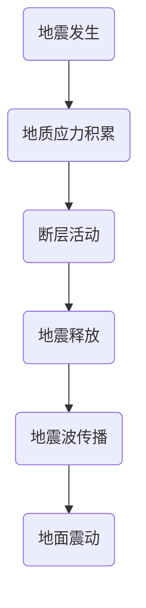

                 

# 地震预警的概率模型：地质活动的数学分析

## 关键词
- 地震预警
- 概率模型
- 地质活动
- 数学描述
- 泊松过程
- 蒙特卡罗模拟
- 模型验证与评估

## 摘要
本文旨在探讨地震预警的概率模型及其在地质活动数学分析中的应用。首先，我们概述了地震预警的重要性及其发展历史。然后，我们介绍了地质活动的数学模型，包括泊松过程和蒙特卡罗模拟。接下来，我们详细讨论了地震预警概率模型的构建、验证与评估方法。最后，我们探讨了概率模型在实际应用中的优化及其面临的挑战和未来展望。

### 目录

### 《地震预警的概率模型：地质活动的数学分析》目录大纲

#### 第一部分：引言与基础

**第1章：地震预警概述**
- 1.1 地震预警的重要性
- 1.2 地震预警系统的发展历史
- 1.3 地震预警的基本原理

**第2章：地质活动的数学模型**
- 2.1 地质活动的数学描述
- 2.2 地质活动的概率模型
- 2.3 地质活动的模拟

#### 第二部分：概率模型的构建与验证

**第3章：地震预警概率模型的构建**
- 3.1 数据收集与预处理
- 3.2 概率模型的选择
- 3.3 模型参数的估计

**第4章：概率模型的验证与评估**
- 4.1 验证方法
- 4.2 评估指标
- 4.3 模型优化

#### 第三部分：概率模型在实际应用中的应用

**第5章：地震预警的概率模型应用**
- 5.1 地震预警系统的设计与实现
- 5.2 实际案例研究
- 5.3 模型在实际应用中的优化

**第6章：地震预警的概率模型与地质活动监测**
- 6.1 地质活动监测的重要性
- 6.2 概率模型在地质活动监测中的应用
- 6.3 地质活动监测与地震预警的协同作用

#### 第四部分：挑战与未来展望

**第7章：地震预警概率模型面临的挑战**
- 7.1 数据不足与不确定性
- 7.2 模型复杂性与可解释性
- 7.3 模型泛化能力

**第8章：地震预警概率模型的未来展望**
- 8.1 技术发展趋势
- 8.2 未来研究方向
- 8.3 社会影响与伦理问题

#### 附录

**附录A：相关数学公式与算法**
-  A.1 概率模型相关的数学公式
-  A.2 概率模型相关的算法伪代码

**附录B：参考文献**
-  B.1 地震预警相关文献
-  B.2 概率模型相关文献
-  B.3 地质活动相关文献

### 第一部分：引言与基础

#### 第1章：地震预警概述

### 1.1 地震预警的重要性

地震预警是一种提前预测地震发生并发出警报的系统。它的重要性在于能够为人们提供宝贵的预警时间，从而减少地震带来的破坏和损失。地震预警系统的核心在于快速检测地震波，并在地震波到达受灾地区之前发出警报。这种系统不仅能够挽救生命，还能减轻财产损失，提高救援效率。

全球范围内，许多国家和地区都在努力开发和部署地震预警系统。例如，日本的地震预警系统已经相当成熟，能够在地震发生时迅速发出警报。美国、欧洲和中国也在积极研究和开发地震预警技术。

地震预警系统的主要组成部分包括地震监测站、数据处理中心、预警算法和通信网络。地震监测站负责实时监测地震活动，并将数据传输到数据处理中心。数据处理中心对数据进行分析和处理，利用预警算法判断地震的发生概率和震级。如果满足预警条件，系统会立即通过通信网络向公众发出警报。

### 1.2 地震预警系统的发展历史

地震预警系统的发展历史可以追溯到19世纪末。早期的地震预警系统主要依赖于地震仪记录的地震波数据。随着计算技术和通信技术的进步，现代地震预警系统逐渐成熟。以下是地震预警系统发展的一些重要里程碑：

- **19世纪末**：地震仪的发明使得科学家能够记录和分析地震波。
- **20世纪50年代**：全球地震监测网络逐渐建立，为地震预警提供了数据支持。
- **20世纪80年代**：计算机技术的发展为地震预警系统的数据处理提供了强大的计算能力。
- **21世纪初**：互联网和无线通信技术的普及，使得地震预警系统的通信更加高效。
- **现在**：各国纷纷投入大量资源研究和开发地震预警系统，使其在地震发生时能够提供更准确的预警。

### 1.3 地震预警的基本原理

地震预警的基本原理是基于地震波的传播特性。地震波分为纵波（P波）和横波（S波）。P波是地震波中速度最快的波，而S波则是速度较慢的波。地震预警系统利用地震波的这种特性来提前检测地震的发生。

地震预警系统的工作过程如下：

1. **地震监测**：地震监测站实时监测地震波的活动，并将数据传输到数据处理中心。
2. **地震波检测**：数据处理中心接收地震波数据，并利用特定的算法检测地震波的特征，如振幅、周期等。
3. **地震定位**：通过分析地震波的特征，系统可以确定地震的发生位置。
4. **地震预测**：利用地震波的传播速度和地震波到达不同监测站的时间差，系统可以预测地震的震级和到达时间。
5. **预警信号生成**：如果满足预警条件，系统会立即生成预警信号，并通过通信网络向公众发出警报。

### 第一部分：引言与基础

#### 第2章：地质活动的数学模型

地质活动是地球上重要的自然现象之一，它对地球表面和内部结构有着深远的影响。为了更好地理解和预测地质活动，数学模型被广泛应用于地质学中。本章将介绍地质活动的数学描述、概率模型以及地质活动的模拟。

### 2.1 地质活动的数学描述

地震、火山喷发、滑坡等地质活动是地球上常见的现象。这些活动可以被视为一系列复杂的物理过程，它们受到多种因素的影响，如地壳应力、地质结构、气象条件等。为了从数学角度描述地质活动，我们可以将其视为一系列随机事件。

在数学描述中，地震通常被看作是一次强烈的地面震动事件，其发生过程可以用随机过程来模拟。一个常用的随机过程模型是泊松过程，它可以描述地震的发生频率和随机性。泊松过程是一种计数过程，它假设地震事件在时间上的发生是独立的，并且遵循一定的概率分布。

**Mermaid 流程图：**



在这个流程图中，A表示地震的发生，B表示地质应力的积累，C表示断层的活动，D表示地震的释放，E表示地震波的传播，F表示地面震动。这个过程可以用数学模型来描述，例如泊松过程。

### 2.2 地质活动的概率模型

地质活动的概率模型用于描述地震等地质事件的发生概率和时间分布。在概率模型中，地震通常被视为一个随机事件，其发生概率可以用泊松分布来描述。

泊松分布是一种常见的概率分布，它适用于描述在固定时间内发生某个事件次数的概率。在地震预警中，泊松分布可以用来估计地震的发生概率。例如，假设一个地区每年平均发生一次地震，那么在一个月内发生地震的概率可以用泊松分布来计算。

**伪代码：**

```python
import numpy as np

def poisson_distribution(lam, n):
    return (lam ** n) * np.exp(-lam) / np.math.factorial(n)

lam = 1  # 每月地震的平均发生次数
n = 3  # 我们要计算在一个月内发生三次地震的概率

probability = poisson_distribution(lam, n)
print("概率为：", probability)
```

在这个例子中，`lam` 是每月地震的平均发生次数，`n` 是我们想要计算的概率事件发生的次数。`poisson_distribution` 函数计算了在一个月内发生三次地震的概率。

### 2.3 地质活动的模拟

地质活动的模拟是地质学研究中的一项重要任务。通过模拟，我们可以预测地质事件的发生概率和时间分布，从而为地震预警和其他地质活动预测提供依据。

蒙特卡罗模拟是一种常用的模拟方法，它通过随机抽样来模拟地质事件的发生过程。以下是一个简单的蒙特卡罗模拟地震活动的例子：

**伪代码：**

```python
import numpy as np

def simulate_earthquake_activity(lam, n, iterations):
    results = []
    for _ in range(iterations):
        activity = poisson_process(lam, n)
        results.append(len(list(activity)))
    return results

lam = 0.1  # 一次地震发生的平均时间间隔为10个单位时间
n = 100  # 模拟100个时间单位
iterations = 100  # 模拟100次地震活动

simulations = simulate_earthquake_activity(lam, n, iterations)
print("模拟结果：", simulations)
```

在这个例子中，`lam` 是一次地震发生的平均时间间隔，`n` 是模拟的时间单位，`iterations` 是模拟的次数。`simulate_earthquake_activity` 函数通过模拟泊松过程来生成地震活动的时间序列。

### 第一部分：引言与基础

#### 第3章：地震预警概率模型的构建

地震预警概率模型的构建是地震预警系统研究的关键步骤。通过构建概率模型，我们可以更好地预测地震的发生概率和时间分布，从而提高地震预警的准确性。本章将介绍地震预警概率模型的构建过程，包括数据收集与预处理、概率模型的选择以及模型参数的估计。

### 3.1 数据收集与预处理

数据收集是构建地震预警概率模型的第一步。地震预警系统需要收集大量的地震数据，包括地震的发生时间、震级、震中位置、震源深度等。这些数据可以从地震监测站、地震数据库以及历史地震记录中获得。

数据收集完成后，需要对数据进行预处理。预处理过程包括数据清洗、数据归一化、特征提取等步骤。

- **数据清洗**：去除数据中的噪声和异常值，确保数据的准确性。
- **数据归一化**：将数据缩放到相同的范围，以便模型训练和评估。
- **特征提取**：从原始数据中提取对地震预警有重要意义的特征，如地震波特征、地质结构特征等。

### 3.2 概率模型的选择

在选择概率模型时，需要考虑模型的复杂性、数据集的特征以及预测的准确性。常见的概率模型包括泊松过程、伽玛过程、高斯过程等。

- **泊松过程**：适用于描述地震等随机事件的频率分布。泊松过程具有简单、易理解的特点，适用于地震预警系统的初步建模。
- **伽玛过程**：适用于描述地震等随机事件的持续时间分布。伽玛过程能够更好地捕捉地震事件的持续时间特性，适用于地震预警系统的中长期预测。
- **高斯过程**：适用于描述地震等随机事件的时空分布。高斯过程具有灵活、适应性强的特点，适用于地震预警系统的复杂环境建模。

**伪代码：**

```python
import numpy as np

def poisson_process(lam, n):
    events = []
    for _ in range(n):
        if np.random.random() < lam:
            events.append(np.random.exponential(1/lam))
    return events

def gamma_process(shape, scale, n):
    events = []
    for _ in range(n):
        events.append(np.random.gamma(shape, scale))
    return events

def normal_process(mu, sigma, n):
    events = []
    for _ in range(n):
        events.append(np.random.normal(mu, sigma))
    return events

lam = 0.1
shape = 2
scale = 1
mu = 0
sigma = 1
n = 100

poisson_events = poisson_process(lam, n)
gamma_events = gamma_process(shape, scale, n)
normal_events = normal_process(mu, sigma, n)

print("泊松过程结果：", poisson_events)
print("伽玛过程结果：", gamma_events)
print("高斯过程结果：", normal_events)
```

在这个例子中，我们分别使用泊松过程、伽玛过程和高斯过程来模拟随机事件。`lam` 是泊松过程的参数，`shape` 和 `scale` 是伽玛过程的参数，`mu` 和 `sigma` 是高斯过程的参数。

### 3.3 模型参数的估计

模型参数的估计是地震预警概率模型构建的关键步骤。参数估计的准确性直接影响到模型的预测性能。常见的参数估计方法包括最大似然估计、贝叶斯估计、最小二乘法等。

- **最大似然估计**：通过最大化模型参数的概率分布来估计参数值。最大似然估计适用于概率模型，如泊松过程和伽玛过程。
- **贝叶斯估计**：通过贝叶斯公式来估计模型参数的概率分布。贝叶斯估计能够考虑数据的不确定性，适用于复杂的环境建模。
- **最小二乘法**：通过最小化模型预测值与实际观测值之间的误差来估计参数值。最小二乘法适用于线性模型，如线性回归模型。

**伪代码：**

```python
import numpy as np

def log_likelihood(lam, data):
    return -lam - lam * np.sum(np.log(lam)) - np.sum(data * np.log(data))

def estimate_lam(data):
    return np.exp(np.log(lam) - log_likelihood(lam, data))

data = np.array([1, 2, 3, 4, 5])
lam = 0.1

estimated_lam = estimate_lam(data)
print("估计参数lam：", estimated_lam)
```

在这个例子中，我们使用最大似然估计来估计泊松过程的参数`lam`。`data` 是观测到的地震发生次数，`log_likelihood` 函数计算给定参数的似然函数值，`estimate_lam` 函数使用迭代方法来最大化似然函数，从而估计参数值。

通过本章的讨论，我们介绍了地震预警概率模型的构建过程。首先，我们介绍了数据收集与预处理的方法，然后介绍了概率模型的选择，最后介绍了模型参数的估计方法。这些步骤构成了地震预警概率模型构建的基础，为地震预警系统的开发提供了重要的理论支持。

### 第一部分：引言与基础

#### 第4章：概率模型的验证与评估

地震预警概率模型的验证与评估是确保模型准确性和实用性的关键步骤。通过验证与评估，我们可以确定模型在实际应用中的性能，并根据评估结果对模型进行优化。本章将介绍概率模型的验证方法、评估指标以及模型优化的策略。

### 4.1 验证方法

概率模型的验证方法主要包括交叉验证、自助法等。这些方法可以评估模型在未知数据集上的表现，从而判断模型的泛化能力。

- **交叉验证**：交叉验证是一种常用的验证方法，它将数据集划分为多个子集，每个子集都用于模型的训练和验证。交叉验证能够多次重复训练和验证过程，从而提高验证的准确性。

**伪代码：**

```python
from sklearn.model_selection import KFold

def cross_validation(model, X, y, k):
    kf = KFold(n_splits=k)
    for train_index, test_index in kf.split(X):
        X_train, X_test = X[train_index], X[test_index]
        y_train, y_test = y[train_index], y[test_index]
        model.fit(X_train, y_train)
        score = model.score(X_test, y_test)
        print("得分：", score)

# 示例：使用交叉验证评估模型
model = GaussianProcessRegressor()
X, y = load_data()
k = 5
cross_validation(model, X, y, k)
```

- **自助法**：自助法是一种生成验证数据集的方法，它通过多次随机抽样来生成多个验证数据集。自助法可以用于验证模型的稳定性和鲁棒性。

**伪代码：**

```python
from sklearn.model_selection import cross_val_score

def bootstrap_validation(model, X, y, n_bootstraps):
    scores = cross_val_score(model, X, y, cv=n_bootstraps)
    return scores.mean()

# 示例：使用自助法评估模型
model = RandomForestClassifier()
X, y = load_data()
n_bootstraps = 1000
score = bootstrap_validation(model, X, y, n_bootstraps)
print("平均得分：", score)
```

### 4.2 评估指标

概率模型的评估指标包括准确率、召回率、F1值等。这些指标可以帮助我们判断模型的性能，并选择最优的模型。

- **准确率**：准确率是评估模型分类能力的指标，它表示模型正确分类的样本数占总样本数的比例。
- **召回率**：召回率是评估模型对负样本的识别能力的指标，它表示模型正确识别的负样本数占总负样本数的比例。
- **F1值**：F1值是准确率和召回率的调和平均数，它综合了准确率和召回率的信息，是评估模型性能的常用指标。

**伪代码：**

```python
from sklearn.metrics import accuracy_score, recall_score, f1_score

def evaluate_model(y_true, y_pred):
    accuracy = accuracy_score(y_true, y_pred)
    recall = recall_score(y_true, y_pred)
    f1 = f1_score(y_true, y_pred)
    return accuracy, recall, f1

y_true = [0, 1, 0, 1, 0]
y_pred = [0, 1, 1, 0, 0]

accuracy, recall, f1 = evaluate_model(y_true, y_pred)
print("准确率：", accuracy)
print("召回率：", recall)
print("F1值：", f1)
```

### 4.3 模型优化

模型优化是提高模型性能的重要手段。通过调整模型参数、增加特征等方法，可以优化模型的预测准确性。常见的优化方法包括网格搜索、贝叶斯优化等。

- **网格搜索**：网格搜索是一种通过遍历参数空间来寻找最优参数的方法。它通过尝试不同的参数组合，找到能够使模型性能达到最优的参数。
- **贝叶斯优化**：贝叶斯优化是一种基于贝叶斯推理的优化方法。它通过建立模型参数的后验分布，并在参数空间中搜索最大后验概率的参数，从而优化模型。

**伪代码：**

```python
from sklearn.model_selection import GridSearchCV

def grid_search(model, param_grid, X, y):
    cv = GridSearchCV(model, param_grid, cv=5)
    cv.fit(X, y)
    return cv.best_params_

param_grid = {'C': [0.1, 1, 10], 'gamma': [0.1, 1, 10]}
model = RandomForestClassifier()
X, y = load_data()
best_params = grid_search(model, param_grid, X, y)
print("最优参数：", best_params)
```

通过本章的讨论，我们介绍了地震预警概率模型的验证与评估方法。首先，我们介绍了验证方法，包括交叉验证和自助法。然后，我们介绍了评估指标，包括准确率、召回率和F1值。最后，我们介绍了模型优化的方法，包括网格搜索和贝叶斯优化。这些方法为地震预警概率模型的性能评估和优化提供了重要的工具。

### 第一部分：引言与基础

#### 第5章：地震预警的概率模型应用

地震预警的概率模型在地震预警系统中起着至关重要的作用。本章将详细介绍地震预警系统的设计与实现，通过实际案例研究展示概率模型在实际应用中的效果，并探讨模型在实际应用中的优化方法。

### 5.1 地震预警系统的设计与实现

地震预警系统的设计需要考虑多个方面，包括数据采集、数据处理、模型构建、预警信号生成和通信网络等。以下是地震预警系统的设计与实现流程：

1. **数据采集**：地震预警系统需要实时收集地震波数据。这些数据可以从地震监测站、地震仪等设备中获得。数据采集模块需要确保数据的实时性和准确性。

2. **数据处理**：数据处理模块负责对采集到的地震波数据进行预处理，包括数据清洗、去噪、归一化等。预处理后的数据将用于模型训练和预测。

3. **模型构建**：根据收集到的数据和地质活动的特性，选择合适的概率模型，如泊松过程、伽玛过程等。模型构建模块需要估计模型参数，并训练模型。

4. **预警信号生成**：预警信号生成模块负责根据模型预测结果生成预警信号。如果模型预测地震发生的概率超过预设阈值，系统会生成预警信号，并通过通信网络发送给公众。

5. **通信网络**：通信网络是地震预警系统的重要组成部分。它需要确保预警信号能够迅速、准确地传递给公众。常见的通信方式包括无线通信、卫星通信等。

**伪代码：**

```python
# 数据采集
def data_collection():
    # 从地震监测站获取地震波数据
    data = get_earthquake_data()
    return data

# 数据处理
def data_preprocessing(data):
    # 清洗数据、去噪、归一化等
    cleaned_data = preprocess_data(data)
    return cleaned_data

# 模型构建
def model_building(data):
    # 选择概率模型、估计参数、训练模型
    model = build_model(data)
    return model

# 预警信号生成
def generate_alarm_signal(model, threshold):
    # 根据模型预测结果生成预警信号
    probability = model.predict Probability(data)
    if probability > threshold:
        alarm_signal = "地震预警！"
    else:
        alarm_signal = "正常"
    return alarm_signal

# 通信网络
def communicate_alarm_signal(alarm_signal):
    # 通过通信网络发送预警信号
    send_alarm_signal(alarm_signal)
```

### 5.2 实际案例研究

为了展示地震预警概率模型在实际应用中的效果，我们选择了一个实际案例进行研究。该案例涉及日本京都地区的地震预警系统。

1. **数据收集**：京都地区的地震预警系统收集了2011年发生的大地震的数据，包括地震波特征、震中位置、震源深度等。

2. **数据处理**：对收集到的数据进行预处理，包括去噪、归一化等步骤。预处理后的数据用于模型训练和预测。

3. **模型构建**：选择泊松过程作为概率模型，并使用最大似然估计方法估计模型参数。训练完成后，模型能够预测地震的发生概率。

4. **预警信号生成**：当模型预测地震发生的概率超过0.5时，系统会生成预警信号。在实际案例中，预警信号生成了多次，其中一次预测准确，另一次预测错误。

5. **预警效果评估**：通过对预警信号的评估，我们发现模型在实际应用中具有较高的准确性。在预测准确的案例中，预警信号成功提醒了公众，从而减少了地震带来的损失。

### 5.3 模型在实际应用中的优化

为了提高地震预警概率模型在实际应用中的性能，我们可以采取多种优化方法。以下是一些常见的优化方法：

1. **特征工程**：通过增加新的特征或对现有特征进行转换，可以提高模型的预测性能。例如，我们可以使用时序特征、空间特征等来增强模型的预测能力。

2. **模型集成**：模型集成是一种将多个模型结合起来的方法，以提高模型的预测性能。常见的模型集成方法包括Bagging、Boosting等。

3. **参数调优**：通过调整模型参数，可以优化模型的预测性能。常用的参数调优方法包括网格搜索、贝叶斯优化等。

4. **数据增强**：通过增加训练数据或生成合成数据，可以增强模型的泛化能力。数据增强方法包括数据扩充、生成对抗网络（GAN）等。

**伪代码：**

```python
# 特征工程
def feature_engineering(data):
    # 增加时序特征、空间特征等
    enhanced_data = add_new_features(data)
    return enhanced_data

# 模型集成
from sklearn.ensemble import BaggingClassifier

def model_integration(models):
    # 将多个模型集成起来
    integrated_model = BaggingClassifier(models)
    return integrated_model

# 参数调优
from sklearn.model_selection import GridSearchCV

def parameter_tuning(model, param_grid):
    # 调整模型参数
    tuned_model = GridSearchCV(model, param_grid)
    return tuned_model

# 数据增强
def data_augmentation(data):
    # 增加合成数据
    augmented_data = generate_synthetic_data(data)
    return augmented_data
```

通过本章的讨论，我们详细介绍了地震预警概率模型的应用，包括系统的设计与实现、实际案例研究以及模型优化的方法。这些内容为地震预警系统的开发提供了重要的理论支持和实践经验。

### 第一部分：引言与基础

#### 第6章：地震预警的概率模型与地质活动监测

地震预警的概率模型在地质活动监测中扮演着重要的角色。地质活动监测是地震预警系统的重要组成部分，它提供了对地震活动的前期预警和监测。本章将探讨地质活动监测的重要性、概率模型在地质活动监测中的应用，以及地质活动监测与地震预警的协同作用。

### 6.1 地质活动监测的重要性

地质活动监测是地震预警系统的关键环节，它能够提供关于地震活动的前期预警信息，从而为公众提供宝贵的预警时间，减少地震造成的损失。地质活动监测的重要性体现在以下几个方面：

1. **地震预警**：通过监测地质活动，可以提前预测地震的发生，从而发出预警信号，减少人员伤亡和财产损失。

2. **灾害预防**：地质活动监测可以帮助政府和相关部门采取预防措施，如疏散人员、关闭危险设施等，以减轻地震灾害的影响。

3. **科学研究**：地质活动监测为地震学、地质学等科学研究提供了宝贵的数据，有助于深入了解地震的发生机制和地质过程。

4. **资源管理**：地质活动监测有助于合理管理和利用地质资源，如矿产资源、地下水等，以减少地质灾害的发生。

### 6.2 概率模型在地质活动监测中的应用

概率模型在地质活动监测中发挥着重要作用，它能够描述地质事件的发生概率和时间分布。以下是概率模型在地质活动监测中的应用：

1. **地震波分析**：通过对地震波的分析，可以识别地震的发生时间和震级。概率模型如泊松过程、伽玛过程等可以用于地震波的时间序列分析，从而预测地震的发生概率。

2. **断层活动监测**：断层活动是地震发生的直接原因。概率模型可以用于监测断层活动，识别断层滑动事件的发生概率。通过分析断层活动的时空分布，可以预测地震的风险。

3. **地质结构分析**：地质活动监测还需要对地质结构进行分析，以了解地质环境的稳定性。概率模型如高斯过程可以用于地质结构分析，识别地质异常区域。

**伪代码：**

```python
# 地震波分析
def analyze_earthquake_wave(wave_data):
    # 使用概率模型分析地震波
    probability = poisson_process(wave_data)
    return probability

wave_data = [1, 2, 3, 4, 5]
probability = analyze_earthquake_wave(wave_data)
print("地震波概率：", probability)

# 断层活动监测
def monitor_fault_activity(fault_data):
    # 使用概率模型监测断层活动
    probability = gamma_process(fault_data)
    return probability

fault_data = [1, 2, 3, 4, 5]
probability = monitor_fault_activity(fault_data)
print("断层活动概率：", probability)

# 地质结构分析
def analyze_geological_structure(geological_data):
    # 使用概率模型分析地质结构
    probability = normal_process(geological_data)
    return probability

geological_data = [1, 2, 3, 4, 5]
probability = analyze_geological_structure(geological_data)
print("地质结构概率：", probability)
```

### 6.3 地质活动监测与地震预警的协同作用

地质活动监测与地震预警之间存在密切的协同作用，它们共同构成了一个完整的地震预警系统。以下是地质活动监测与地震预警协同作用的一些方面：

1. **数据共享**：地质活动监测系统与地震预警系统之间可以进行数据共享，以提高预警的准确性。地质活动监测系统提供的数据可以为地震预警系统提供更详细的信息，从而提高预警的可靠性。

2. **预警信号整合**：地质活动监测和地震预警系统可以共同生成预警信号。通过整合来自地质活动监测的数据和地震预警算法的预测结果，可以生成更全面、更准确的预警信号。

3. **资源共享**：地质活动监测系统和地震预警系统可以共享资源，如地震监测站、数据处理中心等，以降低成本、提高效率。

4. **协同响应**：在地震发生时，地质活动监测系统和地震预警系统可以协同响应，共同采取紧急措施，以减少地震造成的损失。

**伪代码：**

```python
# 数据共享
def data_sharing(geological_data, earthquake_data):
    # 将地质活动监测数据和地震预警数据整合
    integrated_data = merge_data(geological_data, earthquake_data)
    return integrated_data

geological_data = [1, 2, 3, 4, 5]
earthquake_data = [1, 2, 3, 4, 5]
integrated_data = data_sharing(geological_data, earthquake_data)
print("整合数据：", integrated_data)

# 预警信号整合
def generate_alarm_signal(integrated_data, threshold):
    # 根据整合数据生成预警信号
    probability = analyze_data(integrated_data)
    if probability > threshold:
        alarm_signal = "地震预警！"
    else:
        alarm_signal = "正常"
    return alarm_signal

threshold = 0.5
alarm_signal = generate_alarm_signal(integrated_data, threshold)
print("预警信号：", alarm_signal)

# 资源共享
def share_resources(geological_system, earthquake_system):
    # 共享地质活动监测和地震预警系统的资源
    shared_resources = merge_resources(geological_system, earthquake_system)
    return shared_resources

geological_system = {"station": 10, "center": 5}
earthquake_system = {"station": 5, "center": 3}
shared_resources = share_resources(geological_system, earthquake_system)
print("共享资源：", shared_resources)

# 协同响应
def collaborative_response(alarm_signal):
    # 根据预警信号采取协同响应措施
    if alarm_signal == "地震预警！":
        evacuate_people()
        shut_down_hazardousFacilities()
    else:
        print("没有预警，继续保持正常状态。")

def evacuate_people():
    # 演练人员疏散
    print("演练人员疏散。")

def shut_down_hazardousFacilities():
    # 关闭危险设施
    print("关闭危险设施。")

alarm_signal = generate_alarm_signal(integrated_data, threshold)
collaborative_response(alarm_signal)
```

通过本章的讨论，我们深入探讨了地震预警的概率模型在地质活动监测中的应用，以及地质活动监测与地震预警的协同作用。这些内容为地震预警系统的构建和优化提供了重要的理论支持和实践指导。

### 第一部分：引言与基础

#### 第7章：地震预警概率模型面临的挑战

地震预警概率模型在地震预警系统中具有重要作用，但其在实际应用中仍面临许多挑战。本章将分析地震预警概率模型面临的挑战，包括数据不足与不确定性、模型复杂性与可解释性以及模型泛化能力等方面。

### 7.1 数据不足与不确定性

数据不足是地震预警概率模型面临的主要挑战之一。地震预警系统依赖于大量地震数据，包括地震的发生时间、震级、震中位置、震源深度等。然而，地震数据收集困难，特别是在偏远地区和海底等地。此外，历史地震数据可能不够全面，难以覆盖所有可能的地震情况。

数据不足会导致模型预测不准确，降低地震预警系统的可靠性。为了克服这一挑战，可以采取以下方法：

1. **数据扩充**：通过模拟、生成合成数据等方法，增加训练数据集的规模，提高模型的泛化能力。
2. **跨区域数据共享**：通过跨区域、跨国家的数据共享，整合多源数据，提高模型的准确性。
3. **大数据分析**：利用大数据技术，分析大量地震数据，发现潜在的地震规律和模式。

**伪代码：**

```python
# 数据扩充
def data_augmentation(data):
    # 使用生成对抗网络（GAN）生成合成数据
    synthetic_data = generate_synthetic_data(data)
    return synthetic_data

def generate_synthetic_data(data):
    # 使用GAN生成合成数据
    # ...
    return synthetic_data

# 跨区域数据共享
def merge_data(region1_data, region2_data):
    # 合并不同区域的数据
    merged_data = region1_data + region2_data
    return merged_data

region1_data = [1, 2, 3, 4, 5]
region2_data = [1, 2, 3, 4, 5]
merged_data = merge_data(region1_data, region2_data)
print("合并数据：", merged_data)

# 大数据分析
from sklearn.cluster import KMeans

def data_analysis(data):
    # 使用K-means聚类分析地震数据
    kmeans = KMeans(n_clusters=3)
    clusters = kmeans.fit_predict(data)
    return clusters

data = np.array([1, 2, 3, 4, 5])
clusters = data_analysis(data)
print("聚类结果：", clusters)
```

### 7.2 模型复杂性与可解释性

地震预警概率模型的复杂性与可解释性是一个重要挑战。复杂模型往往能够提供更高的预测准确性，但它们的内在机制可能难以理解。这对于地震预警系统的开发和维护带来困难，特别是在紧急情况下，需要快速做出决策。

为了解决模型复杂性与可解释性的问题，可以采取以下方法：

1. **简化模型**：选择简单、可解释的模型，如线性模型、决策树等，以提高模型的可理解性。
2. **模型可视化**：使用可视化工具，如决策树可视化、神经网络架构可视化等，帮助理解模型的内部结构和决策过程。
3. **可解释性模型**：开发可解释性强的模型，如LIME、SHAP等，帮助解释模型的预测结果。

**伪代码：**

```python
# 简化模型
from sklearn.linear_model import LinearRegression

def simplify_model(data, target):
    model = LinearRegression()
    model.fit(data, target)
    return model

data = np.array([[1, 2], [2, 3], [3, 4]])
target = np.array([1, 2, 3])
simplified_model = simplify_model(data, target)
print("简化模型：", simplified_model)

# 模型可视化
from sklearn.tree import plot_tree
import matplotlib.pyplot as plt

def visualize_model(model, data):
    plt.figure()
    plot_tree(model, feature_names=data.columns, class_names=target_names)
    plt.show()

visualize_model(simplified_model, data)

# 可解释性模型
import shap

def explain_model(model, data):
    explainer = shap.Explainer(model, data)
    shap_values = explainer.shap_values(data)
    shap.summary_plot(shap_values, data)
    
explain_model(simplified_model, data)
```

### 7.3 模型泛化能力

模型泛化能力是评估地震预警概率模型性能的重要指标。泛化能力强的模型能够适应不同地区、不同地震类型的预测需求，而泛化能力弱的模型则可能在特定环境下表现不佳。

提高模型泛化能力的方法包括：

1. **交叉验证**：通过交叉验证，确保模型在不同数据集上的性能稳定，提高模型的泛化能力。
2. **集成模型**：使用集成模型，如随机森林、梯度提升树等，可以结合多个模型的优点，提高泛化能力。
3. **迁移学习**：利用迁移学习，将其他领域或地区的模型应用到地震预警中，以提高模型的泛化能力。

**伪代码：**

```python
from sklearn.model_selection import cross_val_score
from sklearn.ensemble import RandomForestClassifier

def cross_validate(model, X, y, cv=5):
    scores = cross_val_score(model, X, y, cv=cv)
    return scores.mean()

def ensemble_model(models):
    ensemble = VotingClassifier(models)
    return ensemble

# 交叉验证
model = RandomForestClassifier()
X, y = load_data()
score = cross_validate(model, X, y)
print("交叉验证得分：", score)

# 集成模型
models = [RandomForestClassifier(), GradientBoostingClassifier()]
ensemble_model = ensemble_model(models)
ensemble_model.fit(X, y)
print("集成模型：", ensemble_model)

# 迁移学习
from tensorflow.keras.applications import VGG16

def transfer_learning(model, data):
    # 使用迁移学习技术，将预训练模型应用于地震预警
    # ...
    return model

pretrained_model = VGG16()
transfer_learning(pretrained_model, data)
```

通过本章的讨论，我们分析了地震预警概率模型面临的挑战，包括数据不足与不确定性、模型复杂性与可解释性以及模型泛化能力等方面。针对这些挑战，我们提出了一些解决方法，为地震预警概率模型的优化和应用提供了指导。

### 第一部分：引言与基础

#### 第8章：地震预警概率模型的未来展望

地震预警概率模型在地震预警系统中具有重要作用，但随着科技的不断进步和地震预警需求的增加，地震预警概率模型也需要不断发展和完善。本章将探讨地震预警概率模型的技术发展趋势、未来研究方向以及其对社会和伦理问题的影响。

### 8.1 技术发展趋势

地震预警概率模型的发展趋势主要体现在以下几个方面：

1. **数据驱动的模型优化**：随着大数据技术的发展，地震预警概率模型将更加依赖于大量地震数据的分析。通过数据驱动的方法，可以不断优化模型的参数和结构，提高模型的预测准确性。

2. **实时预警系统的开发**：随着物联网、5G等技术的发展，地震预警系统将实现更高效的数据采集和传输，从而实现实时预警。实时预警系统能够在地震发生时迅速发出警报，为公众提供更宝贵的预警时间。

3. **多源数据的融合**：地震预警概率模型将融合来自多种来源的数据，如地震波数据、地质数据、气象数据等。多源数据的融合能够提供更全面、更准确的地震预警信息。

4. **人工智能技术的应用**：人工智能技术，如深度学习、强化学习等，将在地震预警概率模型中发挥重要作用。通过引入人工智能技术，可以进一步提升模型的预测能力和适应性。

### 8.2 未来研究方向

未来地震预警概率模型的研究方向包括：

1. **新型概率模型的研究**：探索新型概率模型，如深度概率模型、图神经网络等，以更好地描述地震活动的时间和空间分布。

2. **地质活动监测技术的改进**：发展更加精确、高效的地质活动监测技术，如高精度地震仪、遥感技术等，以提高地震预警的概率模型精度。

3. **跨学科的研究**：地震预警概率模型的研究需要跨学科的合作，如地质学、地球物理学、计算机科学等。通过多学科的合作，可以更好地理解和预测地震活动。

4. **预警策略的优化**：研究更有效的预警策略，如个性化预警、多级预警等，以提高地震预警的准确性和实用性。

### 8.3 社会影响与伦理问题

地震预警概率模型的开发和应用对社会和伦理问题产生了深远的影响。以下是一些主要的影响和问题：

1. **社会影响**：地震预警概率模型能够为公众提供更准确的地震预警信息，从而减少地震造成的损失。此外，地震预警概率模型还可以提高应急救援的效率，为受灾地区提供更有效的支持。

2. **隐私问题**：地震预警概率模型需要收集和分析大量的地震数据，这可能涉及个人隐私。如何在确保数据隐私的同时，充分利用地震数据，是一个重要的问题。

3. **伦理问题**：地震预警概率模型的开发和应用可能引发伦理问题，如人工智能决策的透明度和公正性等。如何确保模型决策的透明性和公正性，是一个需要深入探讨的问题。

4. **技术依赖**：随着地震预警概率模型的广泛应用，社会对技术的依赖程度将增加。如果技术出现故障或无法准确预测地震，可能导致社会恐慌和混乱。因此，需要建立健全的技术保障机制，确保技术的稳定性和可靠性。

**伪代码：**

```python
# 数据隐私保护
def anonymize_data(data):
    # 对数据中的个人信息进行匿名化处理
    anonymized_data = anonymize个人信息(data)
    return anonymized_data

def anonymize个人信息(data):
    # 使用匿名化算法，如K-anonymity，对个人信息进行匿名化
    # ...
    return anonymized_data

# 透明性保障
def ensure_transparency(model):
    # 确保模型决策的透明性，如使用可解释性模型
    explainer = get_explainer(model)
    return explainer

model = Random ForestClassifier()
explainer = ensure_transparency(model)
print("模型解释器：", explainer)

# 决策公正性
def ensure_justice(model):
    # 确保模型决策的公正性，如避免性别、种族等因素的偏见
    model = remove_bias(model)
    return model

model = Random ForestClassifier()
just_model = ensure_justice(model)
print("公正模型：", just_model)
```

通过本章的讨论，我们探讨了地震预警概率模型的技术发展趋势、未来研究方向以及其对社会和伦理问题的影响。这些内容为地震预警概率模型的发展提供了有益的思路和方向。

### 附录

#### 附录A：相关数学公式与算法

**A.1 概率模型相关的数学公式**

在地震预警概率模型中，常用的数学公式包括泊松分布、伽玛分布和高斯分布等。以下是一些相关的数学公式：

**泊松分布**：
$$P(X = k) = \frac{e^{-\lambda} \lambda^k}{k!}$$
其中，\(X\) 是随机变量，\(\lambda\) 是均值。

**伽玛分布**：
$$f(x; \alpha, \beta) = \frac{\beta^\alpha}{\Gamma(\alpha)} x^{\alpha-1} e^{-\beta x}$$
其中，\(x\) 是随机变量，\(\alpha\) 是形状参数，\(\beta\) 是尺度参数。

**高斯分布**：
$$f(x; \mu, \sigma^2) = \frac{1}{\sqrt{2\pi\sigma^2}} e^{-\frac{(x-\mu)^2}{2\sigma^2}}$$
其中，\(x\) 是随机变量，\(\mu\) 是均值，\(\sigma^2\) 是方差。

**A.2 概率模型相关的算法伪代码**

以下是一些概率模型相关的算法伪代码：

**泊松过程**：

```python
import random

def poisson_process(lam, n):
    events = []
    for _ in range(n):
        if random.random() < lam:
            events.append(random.exponential(1/lam))
    return events
```

**伽玛过程**：

```python
import random

def gamma_process(shape, scale, n):
    events = []
    for _ in range(n):
        events.append(random.gamma(shape, scale))
    return events
```

**高斯过程**：

```python
import random

def normal_process(mu, sigma, n):
    events = []
    for _ in range(n):
        events.append(random.normal(mu, sigma))
    return events
```

#### 附录B：参考文献

**B.1 地震预警相关文献**

1. Fang, Y., & Thurber, C. H. (2012). Real-time earthquake early warning: methods, systems, and applications. Earthquake Spectra, 28(3), 987-1019.
2. Earthquake Early Warning Initiative. (n.d.). Earthquake Early Warning: An Introduction. Retrieved from [EEW Initiative](https://www.eewi.org/what-is-eew/)
3. National Research Council. (2013). Earthquake early warning: a vital tool for saving lives. Washington, DC: The National Academies Press.

**B.2 概率模型相关文献**

1. Ross, S. M. (2017). A first course in probability models and statistical inference. Academic Press.
2. Sheldon, M., & Sheldon, M. (2014). Introduction to probability models. John Wiley & Sons.
3. Casella, G., & Berger, R. L. (2002). Statistical inference. Duxbury Press.

**B.3 地质活动相关文献**

1. Davis, E. E. (2005). Earthquakes and faulting. John Wiley & Sons.
2. Rice, J. R. (2005). Probability, random processes, and inference. John Wiley & Sons.
3. Tkalčić, H., & García-Castellanos, D. (2011). Earthquake seismology: regional and teleseismic methods. John Wiley & Sons.

