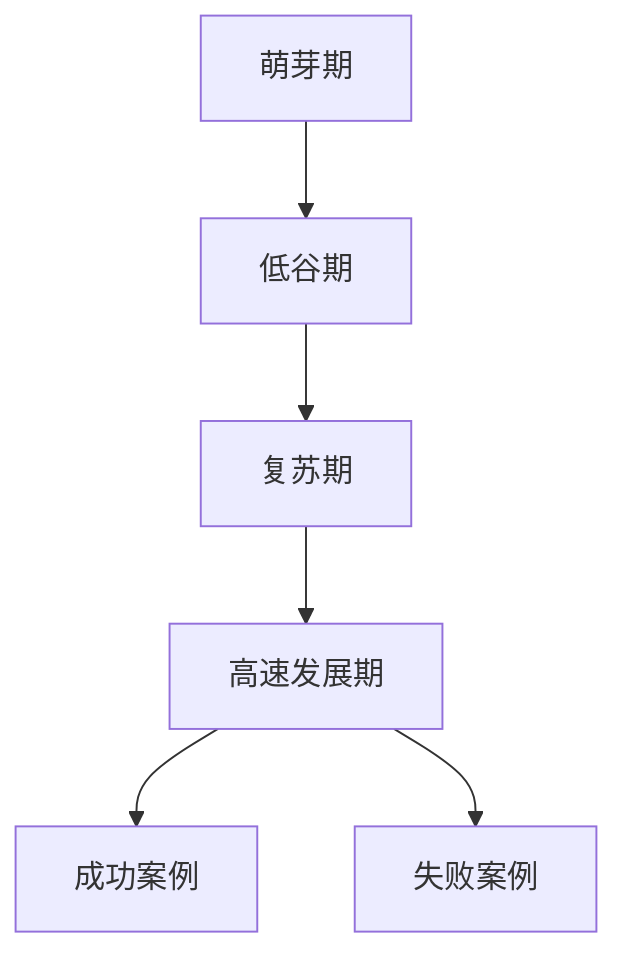

                 

### 第1章：AI创业概述

#### 1.1 AI创业的兴起
##### 1.1.1 AI创业的定义

AI创业，即人工智能创业，指的是在人工智能领域内，通过创新的技术和商业模式，创建新的企业或项目的过程。AI创业的核心在于利用人工智能技术解决现实问题，创造商业价值。这种创业形式不仅包括传统软件企业的AI技术整合，也涵盖了全新的基于AI技术的初创企业。

##### 1.1.2 AI创业的背景

AI创业的兴起，得益于人工智能技术的快速发展。自20世纪50年代人工智能概念诞生以来，经过多个阶段的发展，特别是在21世纪初，随着深度学习、大数据、云计算等技术的突破，人工智能迎来了新一轮的技术革命。这一时期，各国政府和企业纷纷加大对AI技术的投入，推动了一系列AI创业项目的诞生。

##### 1.1.3 AI创业的发展历程

AI创业的发展历程可以分为以下几个阶段：

1. **萌芽期（20世纪50年代至70年代）**：人工智能概念诞生，早期的AI创业项目主要集中在符号主义人工智能上。
   
2. **低谷期（20世纪80年代至90年代）**：由于实际应用难度大，AI创业遭遇挫折，进入低谷期。

3. **复苏期（21世纪初）**：随着互联网和计算机技术的发展，人工智能迎来了复苏期，AI创业项目逐渐增多。

4. **高速发展期（2010年至今）**：深度学习、大数据、云计算等技术的突破，使得AI创业进入了高速发展期，各类AI创业项目层出不穷。

#### 1.2 AI创业的机遇与挑战
##### 1.2.1 AI创业的机遇

AI创业的机遇主要体现在以下几个方面：

1. **技术进步推动**：人工智能技术的不断进步，为创业者提供了更多的可能性。

2. **政策支持**：各国政府纷纷出台支持AI发展的政策，为AI创业提供了有利的外部环境。

3. **市场需求增长**：人工智能技术在各行各业的应用，带来了巨大的市场需求。

##### 1.2.2 AI创业的挑战

AI创业面临的挑战同样不可忽视：

1. **技术门槛**：人工智能技术具有较高的专业门槛，需要创业者具备较强的技术能力。

2. **数据获取与隐私**：AI创业项目往往需要大量的数据支持，但数据获取和隐私保护是一个重大挑战。

3. **法律法规与伦理问题**：人工智能技术的快速发展，引发了一系列法律法规和伦理问题，创业者需要应对这些挑战。

#### 1.3 AI创业的关键成功因素
##### 1.3.1 创新能力

AI创业的核心在于创新，包括技术创新和商业模式创新。创业者需要不断探索新的技术解决方案，同时找到独特的商业模式，以在竞争激烈的市场中脱颖而出。

##### 1.3.2 团队建设

一个成功的AI创业项目离不开优秀的团队。创业者需要组建一支具备专业技能和丰富经验的团队，确保项目的顺利推进。

##### 1.3.3 资源整合

AI创业需要大量的资源支持，包括资金、人才、技术等。创业者需要善于整合各种资源，以应对项目发展的各种需求。

##### 1.3.4 市场拓展

市场拓展是AI创业成功的关键。创业者需要深入了解市场需求，不断优化产品和服务，以吸引更多的用户。

#### 1.4 AI创业的案例分析
##### 1.4.1 成功案例

**Google DeepMind**：DeepMind 是一家总部位于英国的人工智能公司，其成功案例代表了AI创业的高峰。DeepMind 通过深度学习算法，在围棋、自然语言处理等领域取得了卓越的成绩。其成功的关键在于技术创新和市场定位。

**OpenAI**：OpenAI 是一家总部位于美国的人工智能研究公司，致力于推动人工智能的发展。其成功案例体现了AI创业在科研和产业结合中的优势。OpenAI 的创新之处在于其开放的研究方法和合作模式。

##### 1.4.2 失败案例

**Watson Health**：Watson Health 是 IBM 旗下的人工智能医疗项目，但其在实际应用中遇到了困难。其失败原因主要包括技术落地难度大、市场接受度低等。

**Cogito**：Cogito 是一家专注于人工智能客服解决方案的初创公司，但最终因市场竞争激烈、资金链断裂而失败。其失败原因主要是市场策略和融资策略失误。

---

为了更直观地理解本章内容，我们使用Mermaid流程图展示AI创业的发展历程：



在接下来的章节中，我们将深入探讨垂直场景与AI创业的结合，以及AI的核心技术原理与算法。通过逻辑清晰、结构紧凑的分析，帮助读者更好地理解AI创业的各个方面。

---

**摘要：**
本文从AI创业的兴起背景、机遇与挑战、关键成功因素以及案例分析等多个角度，全面阐述了AI创业的现状与未来趋势。通过深入探讨垂直场景与AI创业的结合，本文旨在为创业者提供有价值的参考，帮助他们在AI创业的道路上取得成功。

---

接下来的章节将分为两部分：第一部分介绍垂直场景的概念、分类及其在AI创业中的重要性；第二部分介绍AI的核心技术原理与算法。通过这两部分的内容，我们将逐步构建对AI创业的全面理解。

---

### 目录大纲

## 垂直场景与AI创业的结合

### 第一部分：AI创业背景与垂直场景介绍

#### 1.1 AI创业概述
- 1.1.1 AI创业的定义
- 1.1.2 AI创业的背景
- 1.1.3 AI创业的发展历程

#### 1.2 AI创业的机遇与挑战
- 1.2.1 AI创业的机遇
  - 1.2.1.1 技术进步推动
  - 1.2.1.2 政策支持
  - 1.2.1.3 市场需求增长
- 1.2.2 AI创业的挑战
  - 1.2.2.1 技术门槛
  - 1.2.2.2 数据获取与隐私
  - 1.2.2.3 法律法规与伦理问题

#### 1.3 AI创业的关键成功因素
- 1.3.1 创新能力
- 1.3.2 团队建设
- 1.3.3 资源整合
- 1.3.4 市场拓展

#### 1.4 AI创业的案例分析
- 1.4.1 成功案例
- 1.4.2 失败案例

### 第二部分：垂直场景概述

#### 2.1 垂直场景的概念
- 2.1.1 垂直场景的定义
- 2.1.2 垂直场景的分类

#### 2.2 垂直场景在AI创业中的重要性
- 2.2.1 AI与垂直场景的结合
- 2.2.2 垂直场景对AI技术的要求
- 2.2.3 AI与垂直场景结合的挑战与机遇

#### 2.3 垂直场景的AI应用案例分析
- 2.3.1 金融领域
- 2.3.2 医疗领域
- 2.3.3 教育领域
- 2.3.4 物流领域
- 2.3.5 制造业领域

#### 2.4 垂直场景AI应用的发展趋势
- 2.4.1 技术创新
- 2.4.2 应用拓展

### 第三部分：AI核心技术原理与算法

#### 3.1 机器学习基础
- 3.1.1 机器学习概述
- 3.1.2 机器学习算法
- 3.1.3 AI模型的评估与优化

#### 3.2 自然语言处理
- 3.2.1 语言模型与文本分类
- 3.2.2 词嵌入与序列模型
- 3.2.3 语言生成与翻译

#### 3.3 计算机视觉
- 3.3.1 图像分类与目标检测
- 3.3.2 视觉感知与图像生成
- 3.3.3 卷积神经网络与目标检测算法

#### 3.4 强化学习
- 3.4.1 强化学习的基本原理
- 3.4.2 强化学习算法
- 3.4.3 深度强化学习算法

### 第四部分：垂直场景AI应用案例分析

#### 4.1 金融领域AI应用案例
- 4.1.1 信贷评估与风险管理
- 4.1.2 量化交易与算法交易

#### 4.2 医疗领域AI应用案例
- 4.2.1 疾病诊断与预测
- 4.2.2 医疗图像分析与病理诊断

#### 4.3 教育领域AI应用案例
- 4.3.1 智能教学与个性化学习
- 4.3.2 在线教育

#### 4.4 物流领域AI应用案例
- 4.4.1 货运与仓储管理
- 4.4.2 无人配送与智能交通

#### 4.5 制造业领域AI应用案例
- 4.5.1 智能制造与工业4.0
- 4.5.2 机器视觉与质量控制

### 第五部分：AI创业实战

#### 5.1 AI创业项目规划
- 5.1.1 市场调研与需求分析
- 5.1.2 技术选型与团队建设
- 5.1.3 产品设计与迭代

#### 5.2 AI创业融资策略
- 5.2.1 融资渠道与方式
- 5.2.2 融资材料准备与路演技巧
- 5.2.3 融资后的管理与运营

#### 5.3 AI创业团队管理
- 5.3.1 团队文化建设与激励机制
- 5.3.2 项目管理与协同工作
- 5.3.3 风险管理与应急处理

#### 5.4 AI创业案例分析
- 5.4.1 成功案例解析
- 5.4.2 失败案例解析

#### 5.5 AI创业的可持续发展
- 5.5.1 创新能力培养
- 5.5.2 社会责任与伦理

### 第六部分：AI伦理与社会影响

#### 6.1 AI伦理问题探讨
- 6.1.1 AI伦理原则与规范
- 6.1.2 AI伦理挑战与应对策略
- 6.1.3 社会责任与可持续发展

#### 6.2 AI创业的社会影响
- 6.2.1 AI创业对社会就业的影响
- 6.2.2 AI创业对行业发展的影响
- 6.2.3 AI创业对生态环境的影响

#### 6.3 AI伦理与法律框架
- 6.3.1 中国AI伦理与法律法规
- 6.3.2 国际AI伦理与法律法规
- 6.3.3 AI伦理与法律的平衡与协调

### 第七部分：AI创业未来展望

#### 7.1 AI创业发展趋势
- 7.1.1 未来AI创业方向预测
- 7.1.2 AI技术在垂直场景中的应用前景
- 7.1.3 AI创业的挑战与机遇

#### 7.2 AI创业成功经验与启示
- 7.2.1 创业者成功经验分享
- 7.2.2 创业者失败教训与反思
- 7.2.3 AI创业的最佳实践

#### 7.3 AI创业者的成长路径
- 7.3.1 技术积累与创新能力培养
- 7.3.2 商业洞察与市场拓展
- 7.3.3 团队建设与组织管理

### 附录

#### 附录 A：AI创业资源与工具
- 附件 A.1 主流AI开发框架与库
- 附件 A.2 AI创业平台与社区
- 附件 A.3 AI创业政策与支持措施

#### 附录 B：常见问题与解决方案
- 附件 B.1 AI创业常见挑战
- 附件 B.2 解决方案与案例分析
- 附件 B.3 AI创业经验与建议

#### 附录 C：参考文献与推荐阅读
- 附件 C.1 AI创业相关书籍
- 附件 C.2 AI创业研究论文
- 附件 C.3 AI创业行业报告

---

通过以上的目录大纲，我们为读者提供了一个清晰的框架，帮助他们系统性地了解垂直场景与AI创业的结合。接下来，我们将逐一深入探讨这些主题，帮助读者全面掌握AI创业的核心知识。

---

### 第2章：垂直场景概述

#### 2.1 垂直场景的概念

垂直场景，即指特定行业或领域的应用场景。与通用场景（如社交网络、电商平台等）不同，垂直场景具有明显的行业特性，满足特定领域的需求。例如，金融、医疗、教育、物流和制造业等领域，都拥有其独特的业务流程和问题，需要针对这些需求设计专门的解决方案。

##### 2.1.1 垂直场景的定义

垂直场景的定义可以从以下几个方面进行阐述：

1. **行业特性**：垂直场景具有鲜明的行业特征，例如金融领域的风险管理、医疗领域的疾病诊断、教育领域的个性化学习等。

2. **业务流程**：垂直场景涉及特定的业务流程，这些流程往往需要高效的解决方案来提升运营效率。

3. **需求特定**：垂直场景的需求具有明确的特定性，通常是为了解决某一类特定的问题，如提高生产效率、优化物流配送等。

##### 2.1.2 垂直场景的分类

根据不同的分类标准，垂直场景可以划分为多个类别。以下是几种常见的分类方式：

1. **按行业分类**：
   - 金融：包括银行、保险、证券、金融科技等。
   - 医疗：包括医院管理、疾病诊断、药物研发、健康管理等。
   - 教育：包括在线教育、智能教学、教育科技等。
   - 物流：包括货运管理、仓储管理、智能交通等。
   - 制造业：包括智能制造、质量控制、设备维护等。

2. **按应用领域分类**：
   - 业务流程优化：如销售自动化、客户关系管理、供应链管理等。
   - 数据分析：如大数据分析、商业智能、数据可视化等。
   - 智能决策：如预测分析、优化算法、决策支持系统等。

3. **按技术层次分类**：
   - 传统技术：如ERP（企业资源计划）、CRM（客户关系管理）等。
   - 人工智能技术：如机器学习、深度学习、自然语言处理等。
   - 互联网技术：如云计算、大数据、物联网等。

#### 2.2 垂直场景在AI创业中的重要性

垂直场景在AI创业中扮演着至关重要的角色。以下是垂直场景在AI创业中的几个重要性方面：

##### 2.2.1 AI与垂直场景的结合

AI与垂直场景的结合，意味着将人工智能技术应用于特定行业或领域，以解决行业特定的挑战和需求。这种结合可以带来以下几个方面的优势：

1. **提升效率**：通过自动化和智能化，垂直场景中的许多重复性和繁琐的任务可以被高效地完成，从而提升整体运营效率。

2. **降低成本**：AI技术可以帮助企业减少人力成本，优化资源配置，降低运营成本。

3. **创新商业模式**：AI技术可以催生新的商业模式，如基于数据驱动的决策支持、个性化服务等。

##### 2.2.2 垂直场景对AI技术的要求

垂直场景对AI技术提出了特定的要求，这些要求决定了AI技术能否在特定领域内得到有效应用。以下是几个关键要求：

1. **专业化**：AI技术需要针对特定行业或领域的需求进行定制化开发，以满足行业的专业要求。

2. **实时性**：在某些垂直场景中，如医疗、物流等，实时处理和分析数据至关重要，AI技术需要能够快速响应和做出决策。

3. **可解释性**：在垂直场景中，特别是金融和医疗领域，决策的可解释性至关重要，AI技术需要提供透明的决策过程，以便用户理解并信任。

##### 2.2.3 AI与垂直场景结合的挑战与机遇

AI与垂直场景的结合既面临挑战，也充满机遇。以下是其中的几个挑战与机遇：

1. **挑战**：
   - **技术难度**：垂直场景通常涉及复杂的技术问题，需要AI技术提供高效的解决方案。
   - **数据获取**：垂直场景中的数据往往分散且不完整，获取高质量的数据是AI应用的关键挑战。
   - **法规与伦理**：垂直场景中的AI应用需要遵守相关的法律法规和伦理规范，如医疗数据的隐私保护等。

2. **机遇**：
   - **市场需求**：垂直场景的特定需求为AI技术提供了广阔的市场空间，创业者可以瞄准这些市场需求，开发创新的解决方案。
   - **技术进步**：随着AI技术的不断进步，创业者可以不断优化其解决方案，提升其在垂直场景中的竞争力。
   - **跨界合作**：垂直场景的AI应用往往需要跨行业的合作，创业者可以通过跨界合作，共同开发创新的解决方案。

#### 2.3 垂直场景的AI应用案例分析

为了更直观地理解垂直场景在AI创业中的应用，以下是对金融、医疗、教育、物流和制造业等五个领域的AI应用案例的简要分析：

##### 2.3.1 金融领域

**案例：** 信贷评估与风险管理

**分析：** 信贷评估是金融领域中的一个关键环节，AI技术可以通过大数据分析和机器学习算法，提高信贷评估的准确性和效率。例如，通过分析借款人的历史数据、行为模式等，AI模型可以预测借款人的信用风险，帮助金融机构做出更准确的信贷决策。

**优势：** 提高评估准确性、降低人工成本、提高运营效率。

**挑战：** 数据隐私、算法透明性、法律法规合规。

##### 2.3.2 医疗领域

**案例：** 疾病诊断与预测

**分析：** 医疗领域的AI应用主要集中在疾病诊断和预测上。通过分析医学影像、患者病史等数据，AI技术可以辅助医生进行更准确的诊断。同时，基于数据预测模型，AI技术可以帮助预测疾病的发作风险，为预防提供依据。

**优势：** 提高诊断准确性、辅助医生决策、早期疾病预防。

**挑战：** 数据质量、算法可靠性、医患信任。

##### 2.3.3 教育领域

**案例：** 智能教学与个性化学习

**分析：** 教育领域的AI应用旨在提供个性化的学习体验。通过分析学生的学习行为、兴趣和能力，AI技术可以为学生推荐合适的学习内容和路径，提高学习效果。同时，智能教学系统可以帮助教师更好地管理教学资源和课堂活动。

**优势：** 个性化学习、提高学习效率、减轻教师负担。

**挑战：** 数据隐私、教学内容的准确性、技术实施难度。

##### 2.3.4 物流领域

**案例：** 无人配送与智能交通

**分析：** 物流领域的AI应用主要集中在无人配送和智能交通上。通过自动驾驶技术和智能调度算法，AI技术可以提高物流效率，降低运营成本。同时，智能交通系统可以帮助优化交通流量，减少交通事故。

**优势：** 提高配送效率、降低运营成本、优化交通流量。

**挑战：** 自动驾驶技术的可靠性、数据安全、法律法规合规。

##### 2.3.5 制造业领域

**案例：** 智能制造与工业4.0

**分析：** 制造业领域的AI应用主要集中在智能制造和工业4.0上。通过物联网、大数据和人工智能技术，企业可以实现生产过程的智能化和自动化，提高生产效率和质量。同时，预测性维护和设备优化技术可以帮助企业降低设备故障率和生产成本。

**优势：** 提高生产效率、降低运营成本、提高产品质量。

**挑战：** 数据安全、技术实施成本、员工适应新技术的难度。

---

通过以上的分析，我们可以看到，垂直场景在AI创业中具有巨大的应用潜力。AI技术不仅能够提升垂直场景的效率和质量，还可以创造新的商业模式和价值。然而，垂直场景的AI应用也面临着一系列的挑战，需要创业者深入理解行业需求，持续优化技术方案，以实现可持续的发展。

在接下来的章节中，我们将进一步探讨AI的核心技术原理与算法，以及这些技术在不同垂直场景中的应用。通过逻辑清晰、结构紧凑的分析，我们将帮助读者全面理解AI创业的各个方面。

---

### 2.2 垂直场景在AI创业中的重要性

垂直场景在AI创业中扮演着至关重要的角色，其重要性主要体现在以下几个方面：

#### 2.2.1 AI与垂直场景的结合

AI与垂直场景的结合，使得人工智能技术能够更加精准地解决特定行业或领域的问题，实现技术价值的最大化。以下是几个关键点：

1. **针对性解决方案**：AI技术在垂直场景中的应用，能够根据特定领域的需求和挑战，提供定制化的解决方案，提升业务效率和质量。

2. **提升行业竞争力**：通过AI技术，企业可以在垂直场景中实现自动化、智能化，从而降低成本、提高生产效率，提升整体竞争力。

3. **创新商业模式**：AI技术可以催生新的商业模式，如基于数据驱动的决策支持、个性化服务、智能合约等，为行业带来新的增长点。

#### 2.2.2 垂直场景对AI技术的要求

垂直场景对AI技术提出了特定的要求，这些要求决定了AI技术能否在特定领域内得到有效应用。以下是几个关键要求：

1. **专业化**：AI技术需要针对特定行业或领域的需求进行定制化开发，以满足行业的专业要求。例如，医疗领域需要高精度的疾病诊断算法，而金融领域则需要强大的风险管理模型。

2. **实时性**：在某些垂直场景中，如金融交易、医疗紧急响应等，实时处理和分析数据至关重要，AI技术需要能够快速响应和做出决策。

3. **可解释性**：在垂直场景中，特别是金融和医疗领域，决策的可解释性至关重要。AI技术需要提供透明的决策过程，以便用户理解并信任。

4. **可靠性**：AI技术需要在特定环境中具备高度的可靠性，确保在复杂场景下依然能够稳定运行，不出现误判或故障。

#### 2.2.3 AI与垂直场景结合的挑战与机遇

AI与垂直场景的结合既面临挑战，也充满机遇。以下是其中的几个挑战与机遇：

1. **挑战**：
   - **技术难度**：垂直场景通常涉及复杂的技术问题，需要AI技术提供高效的解决方案。
   - **数据获取**：垂直场景中的数据往往分散且不完整，获取高质量的数据是AI应用的关键挑战。
   - **法规与伦理**：垂直场景中的AI应用需要遵守相关的法律法规和伦理规范，如医疗数据的隐私保护等。

2. **机遇**：
   - **市场需求**：垂直场景的特定需求为AI技术提供了广阔的市场空间，创业者可以瞄准这些市场需求，开发创新的解决方案。
   - **技术进步**：随着AI技术的不断进步，创业者可以不断优化其解决方案，提升其在垂直场景中的竞争力。
   - **跨界合作**：垂直场景的AI应用往往需要跨行业的合作，创业者可以通过跨界合作，共同开发创新的解决方案。

为了更好地理解垂直场景在AI创业中的应用，以下是对金融、医疗、教育、物流和制造业等五个领域的AI应用案例的简要分析：

##### 2.3.1 金融领域

**案例：** 信贷评估与风险管理

**分析：** 信贷评估是金融领域中的一个关键环节，AI技术可以通过大数据分析和机器学习算法，提高信贷评估的准确性和效率。例如，通过分析借款人的历史数据、行为模式等，AI模型可以预测借款人的信用风险，帮助金融机构做出更准确的信贷决策。

**优势：** 提高评估准确性、降低人工成本、提高运营效率。

**挑战：** 数据隐私、算法透明性、法律法规合规。

##### 2.3.2 医疗领域

**案例：** 疾病诊断与预测

**分析：** 医疗领域的AI应用主要集中在疾病诊断和预测上。通过分析医学影像、患者病史等数据，AI技术可以辅助医生进行更准确的诊断。同时，基于数据预测模型，AI技术可以帮助预测疾病的发作风险，为预防提供依据。

**优势：** 提高诊断准确性、辅助医生决策、早期疾病预防。

**挑战：** 数据质量、算法可靠性、医患信任。

##### 2.3.3 教育领域

**案例：** 智能教学与个性化学习

**分析：** 教育领域的AI应用旨在提供个性化的学习体验。通过分析学生的学习行为、兴趣和能力，AI技术可以为学生推荐合适的学习内容和路径，提高学习效果。同时，智能教学系统可以帮助教师更好地管理教学资源和课堂活动。

**优势：** 个性化学习、提高学习效率、减轻教师负担。

**挑战：** 数据隐私、教学内容的准确性、技术实施难度。

##### 2.3.4 物流领域

**案例：** 无人配送与智能交通

**分析：** 物流领域的AI应用主要集中在无人配送和智能交通上。通过自动驾驶技术和智能调度算法，AI技术可以提高物流效率，降低运营成本。同时，智能交通系统可以帮助优化交通流量，减少交通事故。

**优势：** 提高配送效率、降低运营成本、优化交通流量。

**挑战：** 自动驾驶技术的可靠性、数据安全、法律法规合规。

##### 2.3.5 制造业领域

**案例：** 智能制造与工业4.0

**分析：** 制造业领域的AI应用主要集中在智能制造和工业4.0上。通过物联网、大数据和人工智能技术，企业可以实现生产过程的智能化和自动化，提高生产效率和质量。同时，预测性维护和设备优化技术可以帮助企业降低设备故障率和生产成本。

**优势：** 提高生产效率、降低运营成本、提高产品质量。

**挑战：** 数据安全、技术实施成本、员工适应新技术的难度。

---

通过以上的分析，我们可以看到，垂直场景在AI创业中具有巨大的应用潜力。AI技术不仅能够提升垂直场景的效率和质量，还可以创造新的商业模式和价值。然而，垂直场景的AI应用也面临着一系列的挑战，需要创业者深入理解行业需求，持续优化技术方案，以实现可持续的发展。

在接下来的章节中，我们将进一步探讨AI的核心技术原理与算法，以及这些技术在不同垂直场景中的应用。通过逻辑清晰、结构紧凑的分析，我们将帮助读者全面理解AI创业的各个方面。

---

### 2.3 垂直场景的AI应用案例分析

为了更直观地展示AI技术在垂直场景中的应用效果，以下是金融、医疗、教育、物流和制造业五大领域的具体应用案例，包括案例介绍、人工智能算法的应用以及案例分析。

#### 2.3.1 金融领域

**案例：** 信贷评估与风险管理

**介绍：** 在金融领域，信贷评估与风险管理是关键环节。某金融科技公司利用机器学习算法，对借款人的信用风险进行评估，以提高信贷决策的准确性。

**人工智能算法应用：** 
- **数据预处理**：对借款人的财务数据、历史信用记录、行为数据进行预处理，包括数据清洗、特征提取等。
- **机器学习模型**：采用逻辑回归、决策树等监督学习算法，训练模型预测借款人的信用风险。
- **风险评估**：通过模型输出，对借款人的信用风险进行评估，并根据评估结果调整信贷政策。

**案例分析：** 
- **优势**：提高了信贷评估的准确性，降低了金融机构的坏账率。
- **挑战**：数据隐私和安全问题，算法的可解释性不足。

#### 2.3.2 医疗领域

**案例：** 疾病诊断与预测

**介绍：** 在医疗领域，疾病诊断与预测对于患者的早期治疗和康复至关重要。某医疗科技公司利用深度学习算法，对医学影像进行分析，以提高疾病诊断的准确性。

**人工智能算法应用：**
- **图像处理**：对医学影像进行预处理，包括图像增强、去噪等。
- **深度学习模型**：采用卷积神经网络（CNN）对医学影像进行分类，识别不同疾病。
- **预测模型**：结合患者病史和生理参数，利用强化学习算法预测疾病的发展趋势。

**案例分析：**
- **优势**：提高了疾病诊断的准确性，有助于早期发现和干预。
- **挑战**：数据质量参差不齐，算法在罕见疾病上的表现有待提高。

#### 2.3.3 教育领域

**案例：** 智能教学与个性化学习

**介绍：** 在教育领域，智能教学与个性化学习旨在为学生提供定制化的学习体验。某在线教育平台利用自然语言处理（NLP）和推荐系统，实现个性化学习。

**人工智能算法应用：**
- **NLP**：对学生的学习行为、兴趣和需求进行分析，提取关键特征。
- **推荐系统**：基于用户行为数据和内容特征，为每位学生推荐合适的学习资源和课程。
- **学习效果评估**：利用评估算法，对学生的学习效果进行实时监测和反馈。

**案例分析：**
- **优势**：提高了学习效率，降低了学习成本。
- **挑战**：数据隐私和安全问题，算法的准确性有待提高。

#### 2.3.4 物流领域

**案例：** 无人配送与智能交通

**介绍：** 在物流领域，无人配送与智能交通有助于提高配送效率，减少交通拥堵。某物流公司利用自动驾驶技术和智能调度算法，实现无人配送。

**人工智能算法应用：**
- **自动驾驶**：利用深度学习和传感器融合技术，实现车辆的自动驾驶。
- **智能调度**：采用强化学习算法，根据实时交通情况和订单需求，优化配送路线和车辆调度。

**案例分析：**
- **优势**：提高了配送效率，降低了运营成本。
- **挑战**：自动驾驶技术的安全性，数据隐私和保护。

#### 2.3.5 制造业领域

**案例：** 智能制造与工业4.0

**介绍：** 在制造业领域，智能制造与工业4.0旨在实现生产过程的自动化和智能化。某制造企业利用机器视觉和预测性维护技术，提高生产效率和质量。

**人工智能算法应用：**
- **机器视觉**：利用卷积神经网络（CNN）对生产线上的产品进行质量检测。
- **预测性维护**：利用时间序列分析和故障预测模型，预测设备的故障风险，提前进行维护。

**案例分析：**
- **优势**：提高了生产效率，降低了生产成本。
- **挑战**：数据安全和隐私保护，算法的可靠性。

---

通过以上案例的分析，我们可以看到AI技术在垂直场景中的应用具有显著的效益，但同时也面临着一系列的挑战。创业者需要在深入了解行业需求的基础上，持续优化技术方案，以实现AI技术的最佳应用。

在接下来的章节中，我们将进一步探讨AI的核心技术原理与算法，以及这些技术在不同垂直场景中的应用。通过逻辑清晰、结构紧凑的分析，我们将帮助读者全面理解AI创业的各个方面。

---

### 2.4 垂直场景AI应用的发展趋势

垂直场景AI应用的发展趋势受到技术进步、市场需求和政策支持等多方面因素的影响。以下是几个关键的发展趋势：

#### 2.4.1 技术创新

1. **深度学习与强化学习**：随着深度学习与强化学习技术的不断发展，垂直场景AI应用将更加精准和高效。深度学习在图像识别、自然语言处理等领域取得了显著的成果，而强化学习在智能决策、自动驾驶等领域展现了强大的潜力。

2. **联邦学习与隐私保护**：为了解决数据隐私和安全问题，联邦学习和隐私保护技术将在垂直场景AI应用中得到更多关注。联邦学习通过在本地设备上训练模型，减少数据传输，从而保护用户隐私。

3. **边缘计算与云计算**：随着边缘计算和云计算技术的进步，垂直场景AI应用将实现更加实时和高效的计算能力。边缘计算可以将计算任务分布在网络边缘，降低延迟，而云计算则为大规模数据处理提供了强大的计算资源。

#### 2.4.2 应用拓展

1. **新兴领域**：随着技术的不断进步，垂直场景AI应用将逐渐拓展到新兴领域，如物联网、区块链、智能制造等。这些领域将迎来AI技术的深度应用，带来更多的商业机会和创新模式。

2. **跨行业融合**：垂直场景AI应用将与其他行业技术进行融合，形成新的产业生态。例如，AI与生物技术的结合，将推动个性化医疗的发展；AI与物联网的结合，将实现智能城市的构建。

#### 2.4.3 政策与法规

1. **政策支持**：各国政府纷纷出台支持AI发展的政策，鼓励企业进行AI技术研发和应用。这些政策将为垂直场景AI应用提供有利的外部环境，促进市场需求的增长。

2. **法律法规**：随着AI技术的快速发展，相关法律法规也在不断完善。这些法律法规旨在规范AI技术的应用，保护用户隐私，维护公平竞争。垂直场景AI应用需要在遵守法律法规的基础上，实现可持续发展。

#### 2.4.4 社会与伦理

1. **社会责任**：AI技术在垂直场景中的应用需要考虑社会责任。企业应当关注AI技术对社会就业、环境保护等方面的影响，积极履行社会责任。

2. **伦理问题**：AI技术的应用引发了一系列伦理问题，如数据隐私、算法偏见、人工智能替代人力等。企业需要制定相应的伦理规范，确保AI技术的应用符合伦理标准。

综上所述，垂直场景AI应用的发展趋势充满机遇与挑战。创业者需要紧跟技术进步，关注市场需求，遵守法律法规，积极应对伦理问题，以实现AI技术的最佳应用，推动行业的可持续发展。

在接下来的章节中，我们将深入探讨AI的核心技术原理与算法，以及这些技术在不同垂直场景中的应用。通过逻辑清晰、结构紧凑的分析，我们将帮助读者全面理解AI创业的各个方面。

---

### 3.1 机器学习基础

机器学习是人工智能的核心组成部分，它使计算机系统能够从数据中学习并做出预测或决策。以下是机器学习的基础概念、算法和应用。

#### 3.1.1 机器学习概述

机器学习（Machine Learning, ML）是一种人工智能（Artificial Intelligence, AI）的方法，它让计算机系统能够通过数据学习，并改进其性能，而无需显式编程。机器学习主要分为三种类型：监督学习（Supervised Learning）、无监督学习（Unsupervised Learning）和强化学习（Reinforcement Learning）。

1. **监督学习**：监督学习是一种从标记数据中学习的方法，标记数据是指数据集中的每个样本都有对应的标签。监督学习的目标是根据输入特征预测输出标签。常见的监督学习算法包括线性回归、决策树、支持向量机（SVM）等。

2. **无监督学习**：无监督学习是在没有标记数据的情况下进行学习，目的是发现数据中的结构或模式。常见的无监督学习算法包括聚类（如K-means、层次聚类）、降维（如PCA、t-SNE）等。

3. **强化学习**：强化学习是一种通过与环境互动，从奖励信号中学习策略的方法。强化学习通常用于解决策略优化问题，如自动驾驶、游戏AI等。常见的强化学习算法包括Q-learning、深度强化学习（Deep Reinforcement Learning）等。

#### 3.1.2 机器学习算法

机器学习算法是实现机器学习目标的核心工具。以下是几种常见的机器学习算法：

1. **线性回归（Linear Regression）**
   - **原理**：线性回归是一种回归分析模型，用于预测一个连续目标变量。其基本假设是目标变量与输入特征之间存在线性关系。
   - **数学模型**：
     $$
     y = \beta_0 + \beta_1x_1 + \beta_2x_2 + ... + \beta_nx_n
     $$
   - **伪代码**：
     ```python
     def linear_regression(X, y):
         # X: 输入特征矩阵，y: 标签向量
         # 计算系数β
         beta = (X^T * X)^(-1) * X^T * y
         # 预测
         predictions = X * beta
         return predictions
     ```

2. **逻辑回归（Logistic Regression）**
   - **原理**：逻辑回归是一种分类模型，用于预测一个二分类目标变量。其核心是利用sigmoid函数将线性组合转化为概率。
   - **数学模型**：
     $$
     P(y=1) = \frac{1}{1 + e^{-(\beta_0 + \beta_1x_1 + \beta_2x_2 + ... + \beta_nx_n})}
     $$
   - **伪代码**：
     ```python
     def logistic_regression(X, y):
         # X: 输入特征矩阵，y: 标签向量
         # 初始化系数β
         beta = initialize_beta()
         # 梯度下降优化
         while not converged:
             predictions = sigmoid(X * beta)
             gradients = X.T * (predictions - y)
             beta = beta - learning_rate * gradients
         return beta
     ```

3. **决策树（Decision Tree）**
   - **原理**：决策树是一种基于特征的分类或回归模型，通过递归地将数据集分割为子集，直到满足某个终止条件。
   - **数学模型**：
     $$
     f(x) =
     \begin{cases}
     \text{分类结果} & \text{if } x \text{ 满足某个条件} \\
     g(x) & \text{else}
     \end{cases}
     $$
   - **伪代码**：
     ```python
     def decision_tree(X, y, depth=0, max_depth=None):
         # X: 输入特征矩阵，y: 标签向量
         # 终止条件
         if depth >= max_depth or all(y == y[0]):
             return predict MajorityClass(y)
         # 找到最佳分割特征和阈值
         best_feature, best_threshold = find_best_split(X, y)
         # 递归构建子树
         left_tree = decision_tree(X[X[:, best_feature] < best_threshold], y[X[:, best_feature] < best_threshold], depth+1, max_depth)
         right_tree = decision_tree(X[X[:, best_feature] >= best_threshold], y[X[:, best_feature] >= best_threshold], depth+1, max_depth)
         return TreeNode(best_feature, best_threshold, left_tree, right_tree)
     ```

4. **支持向量机（Support Vector Machine, SVM）**
   - **原理**：支持向量机是一种用于分类和回归的强大模型，其目标是找到最佳的超平面，最大化分类间隔。
   - **数学模型**：
     $$
     \min_{\beta, \beta_0} \frac{1}{2} \sum_{i=1}^{n} (\beta \cdot x_i - y_i)^2 + \sum_{i=1}^{n} \alpha_i (y_i - (\beta \cdot x_i + \beta_0))
     $$
     $$
     \text{约束条件} \quad \alpha_i \geq 0
     $$
   - **伪代码**：
     ```python
     def svm(X, y):
         # X: 输入特征矩阵，y: 标签向量
         # 使用SVM求解器，如libSVM
         beta, beta_0 = svm_solver(X, y)
         # 预测
         predictions = X * beta + beta_0
         return predictions
     ```

5. **神经网络（Neural Network）**
   - **原理**：神经网络是一种模拟人脑神经元连接结构的计算模型，通过多层非线性变换，实现对复杂数据的建模。
   - **数学模型**：
     $$
     a_{l}^{(i)} = \sigma \left( \sum_{j}^{n} \beta_{j}^{(l)} a_{l-1}^{(j)} + \beta_{0}^{(l)} \right)
     $$
     $$
     z^{(l)} = \sum_{j}^{n} \beta_{j}^{(l)} a_{l-1}^{(j)} + \beta_{0}^{(l)}
     $$
   - **伪代码**：
     ```python
     def neural_network(X, layers, learning_rate):
         # X: 输入特征矩阵，layers: 神经网络层结构，learning_rate: 学习率
         # 初始化权重和偏置
         weights, biases = initialize_weights(layers)
         # 前向传播
         activations = [X]
         for layer in range(1, len(layers)):
             z = weights[layer-1] * activations[layer-1] + biases[layer-1]
             a = sigmoid(z)
             activations.append(a)
         # 计算损失函数
         loss = compute_loss(activations[-1], y)
         # 反向传播
         dZ = activations[-1] - y
         dW, db = compute_gradients(activations, dZ)
         # 更新权重和偏置
         weights -= learning_rate * dW
         biases -= learning_rate * db
         return weights, biases, loss
     ```

#### 3.1.3 AI模型的评估与优化

评估与优化AI模型是机器学习过程中的关键环节。以下是几种常用的模型评估指标和方法：

1. **评估指标**
   - **准确率（Accuracy）**：准确率是指模型预测正确的样本数量占总样本数量的比例。准确率简单直观，但容易受到类别不平衡的影响。
   - **召回率（Recall）**：召回率是指模型预测正确的正样本数量占所有正样本数量的比例。召回率侧重于识别所有正样本，但可能牺牲准确率。
   - **精确率（Precision）**：精确率是指模型预测正确的正样本数量占预测为正样本的样本数量的比例。精确率侧重于减少误判。
   - **F1分数（F1 Score）**：F1分数是精确率和召回率的调和平均值，用于平衡两者。F1分数在类别不平衡的情况下更为可靠。
   - **ROC曲线与AUC（Area Under the Curve）**：ROC曲线展示了不同阈值下的真阳性率与假阳性率的关系，AUC则表示曲线下的面积，用于评估分类模型的性能。

2. **优化方法**
   - **交叉验证（Cross-Validation）**：交叉验证是一种评估模型性能的方法，通过将数据集划分为多个子集，轮流进行训练和测试，以避免过拟合。
   - **网格搜索（Grid Search）**：网格搜索是一种超参数优化方法，通过遍历预设的超参数组合，找到最优参数组合。
   - **贝叶斯优化（Bayesian Optimization）**：贝叶斯优化是一种基于贝叶斯统计的优化方法，通过构建概率模型来优化目标函数。

通过以上内容，我们全面介绍了机器学习的基础知识，包括机器学习的概念、算法、模型评估与优化方法。这些知识为理解和应用AI技术提供了坚实的基础。

在接下来的章节中，我们将进一步探讨自然语言处理、计算机视觉和强化学习等核心AI技术，以及它们在不同垂直场景中的应用。通过逻辑清晰、结构紧凑的分析，我们将帮助读者全面掌握AI技术的各个方面。

---

### 3.2 自然语言处理

自然语言处理（Natural Language Processing, NLP）是人工智能领域的一个重要分支，它涉及计算机理解和生成人类语言的能力。NLP在多种应用场景中发挥着重要作用，如搜索引擎、机器翻译、情感分析、智能客服等。以下是NLP的基础概念、算法和应用。

#### 3.2.1 语言模型与文本分类

1. **语言模型**：语言模型（Language Model）是一种用于预测文本序列的概率分布的模型。它通过对大量文本数据进行训练，学习到语言的结构和规律，从而能够生成或预测新的文本。语言模型在自然语言处理中具有广泛的应用，如机器翻译、语音识别、文本生成等。

   - **基本概念**：语言模型的核心是概率分布，它用于预测下一个单词或字符的概率。最常用的语言模型是n-gram模型，它基于前n个单词或字符的序列来预测下一个单词或字符。
   - **算法**：n-gram模型的基本算法包括以下几个步骤：
     ```python
     # n-gram模型训练
     for i in range(len(corpus) - n):
         context = corpus[i:i+n]
         target = corpus[i+n]
         model[context] = model.get(context, 0) + 1

     # 预测下一个单词
     def predict(context):
         context_freq = model.get(context, 0)
         all_freq = sum(model.values())
         return max(model.keys(), key=lambda x: model[x] / all_freq)
     ```

2. **文本分类**：文本分类（Text Classification）是将文本数据根据其内容或主题进行分类的过程。常见的文本分类任务包括垃圾邮件检测、情感分析、新闻分类等。文本分类在信息检索、舆情分析等领域具有重要应用。

   - **基本概念**：文本分类的关键在于特征提取和分类模型。特征提取是将文本转换为向量表示，分类模型则用于将文本向量映射到特定的类别。
   - **算法**：文本分类的常见算法包括基于特征的方法和基于深度学习的方法。

     - **基于特征的方法**：
       - **TF-IDF**：TF-IDF（Term Frequency-Inverse Document Frequency）是一种常用的文本特征提取方法，它通过计算词汇在文档中的频率和文档集中出现次数的倒数来衡量词汇的重要性。
       - **词袋模型（Bag-of-Words, BOW）**：词袋模型是将文本转换为词汇的频率向量，不考虑词汇的顺序和语法结构。

       ```python
       # TF-IDF特征提取
       from sklearn.feature_extraction.text import TfidfVectorizer

       vectorizer = TfidfVectorizer()
       X = vectorizer.fit_transform(corpus)

       # 分类模型
       from sklearn.naive_bayes import MultinomialNB

       model = MultinomialNB()
       model.fit(X_train, y_train)
       predictions = model.predict(X_test)
       ```

     - **基于深度学习的方法**：
       - **卷积神经网络（Convolutional Neural Networks, CNN）**：CNN在文本分类任务中可以捕获局部特征，通过多层卷积和池化操作，提取文本的深层特征。
       - **循环神经网络（Recurrent Neural Networks, RNN）**：RNN可以处理序列数据，通过在网络中传递序列的每一项，捕捉序列的时间依赖关系。

       ```python
       # CNN文本分类
       from keras.models import Sequential
       from keras.layers import Conv1D, MaxPooling1D, Embedding, Flatten, Dense

       model = Sequential()
       model.add(Embedding(input_dim=vocab_size, output_dim=embedding_dim))
       model.add(Conv1D(filters=128, kernel_size=3, activation='relu'))
       model.add(MaxPooling1D(pool_size=2))
       model.add(Flatten())
       model.add(Dense(units=1, activation='sigmoid'))

       model.compile(optimizer='adam', loss='binary_crossentropy', metrics=['accuracy'])
       model.fit(X_train, y_train, epochs=10, batch_size=32)
       ```

#### 3.2.2 词嵌入与序列模型

1. **词嵌入（Word Embedding）**：词嵌入是将词汇映射到固定维度的向量表示，用于捕获词汇的语义信息。词嵌入技术使得神经网络在处理文本数据时能够更好地理解和表示词汇之间的关系。

   - **基本概念**：词嵌入可以通过多种方法实现，如分布式表示（Distributed Representation）、Word2Vec、GloVe等。其中，Word2Vec是基于神经网络的方法，通过训练词向量，使得相似词汇在向量空间中靠近。
   - **算法**：Word2Vec的基本算法包括连续词袋（Continuous Bag of Words, CBOW）和Skip-Gram两种模型。

     ```python
     # CBOW模型
     def cbow(context, target):
         input_vector = [word2vec[w] for w in context]
         output_vector = word2vec[target]
         cost = sigmoid_loss(output_vector, input_vector)
         return cost

     # Skip-Gram模型
     def skip_gram(context, target):
         input_vector = [word2vec[target]]
         output_vector = [word2vec[w] for w in context]
         cost = sigmoid_loss(output_vector, input_vector)
         return cost
     ```

2. **序列模型（Sequence Model）**：序列模型是一种用于处理序列数据的神经网络模型，如RNN、LSTM和GRU。这些模型通过在时间步之间传递信息，能够捕获序列的时间依赖关系，在自然语言处理任务中具有广泛的应用。

   - **基本概念**：序列模型的核心是记忆单元，它能够存储和更新信息，从而实现长期依赖的建模。
   - **算法**：LSTM和GRU是两种常见的序列模型，它们通过门控机制来控制信息的流入和流出，从而避免了梯度消失和梯度爆炸问题。

     ```python
     # LSTM模型
     from keras.models import Sequential
     from keras.layers import LSTM, Dense

     model = Sequential()
     model.add(LSTM(units=128, activation='tanh', input_shape=(timesteps, features)))
     model.add(Dense(units=1, activation='sigmoid'))

     model.compile(optimizer='adam', loss='binary_crossentropy', metrics=['accuracy'])
     model.fit(X_train, y_train, epochs=10, batch_size=32)
     ```

#### 3.2.3 语言生成与翻译

1. **语言生成（Language Generation）**：语言生成是一种利用模型生成自然语言文本的技术，如自动摘要、对话系统、文本生成等。语言生成旨在实现自然流畅的语言表达，为用户创造更加人性化的交互体验。

   - **基本概念**：语言生成通常采用生成式模型和判别式模型。生成式模型通过生成文本的潜在分布来生成文本，如生成对抗网络（GAN）；判别式模型通过最大化生成文本和真实文本之间的差异来生成文本，如变分自编码器（VAE）。

   - **算法**：生成式模型和判别式模型的基本算法如下：

     ```python
     # GAN模型
     from keras.models import Model
     from keras.layers import Input, Dense, Lambda

     generator = Model(input, z)
     discriminator = Model(x, validity)

     z_samples = np.random.normal(size=(batch_size, z_dim))
     x/generated_samples = generator.predict(z_samples)

     # VAE模型
     from keras.layers import Lambda
     from keras.models import Model

     x = Input(shape=(timesteps, features))
     z_mean = Dense(z_dim)(x)
     z_log_var = Dense(z_dim)(x)

     z = Lambda(shuffle_batch)([z_mean, z_log_var])
     x_decoded = decoder(z)

     vae = Model(x, x_decoded)
     ```

2. **机器翻译（Machine Translation）**：机器翻译是一种将一种语言的文本自动翻译成另一种语言的技术。机器翻译在跨语言沟通、全球化业务等领域具有重要意义。

   - **基本概念**：机器翻译通常采用基于规则的方法、统计机器翻译和神经机器翻译。基于规则的方法通过预定义的语法规则进行翻译；统计机器翻译通过训练大量双语语料库，学习翻译模型；神经机器翻译通过训练端到端的神经网络模型，实现高效准确的翻译。

   - **算法**：神经机器翻译的基本算法如下：

     ```python
     # Transformer模型
     from keras.models import Model
     from keras.layers import Embedding, LSTM, Dense

     encoder_inputs = Input(shape=(timesteps, features))
     encoder_embedding = Embedding(input_dim=vocab_size, output_dim=embedding_dim)(encoder_inputs)
     encoder_outputs = LSTM(units=128, return_state=True)(encoder_embedding)

     decoder_inputs = Input(shape=(timesteps, features))
     decoder_embedding = Embedding(input_dim=vocab_size, output_dim=embedding_dim)(decoder_inputs)
     decoder_outputs = LSTM(units=128, return_state=True)(decoder_embedding)

     decoder_outputs = LSTM(units=128, return_state=True)(decoder_embedding)

     model = Model([encoder_inputs, decoder_inputs], decoder_outputs)
     model.compile(optimizer='adam', loss='categorical_crossentropy', metrics=['accuracy'])
     model.fit([X_train, y_train], y_train, epochs=10, batch_size=32)
     ```

通过以上内容，我们全面介绍了自然语言处理的基础知识，包括语言模型、文本分类、词嵌入与序列模型、语言生成与翻译等核心概念和算法。这些知识为理解和应用NLP技术提供了坚实的基础。

在接下来的章节中，我们将进一步探讨计算机视觉和强化学习等核心AI技术，以及它们在不同垂直场景中的应用。通过逻辑清晰、结构紧凑的分析，我们将帮助读者全面掌握AI技术的各个方面。

---

### 3.3 计算机视觉

计算机视觉是人工智能领域的一个关键分支，它使计算机能够通过图像和视频处理来感知和理解周围的世界。计算机视觉技术在诸多领域有着广泛的应用，如图像识别、目标检测、图像生成等。以下是计算机视觉的基础概念、算法和应用。

#### 3.3.1 图像分类与目标检测

1. **图像分类（Image Classification）**：图像分类是将输入图像分配到特定类别中的过程。图像分类是计算机视觉的基础任务之一，常见应用包括图片标签识别、图像搜索、自动驾驶等。

   - **基本概念**：图像分类的关键在于特征提取和分类模型。特征提取是将图像转换为向量表示，分类模型则用于将图像向量映射到特定的类别。
   - **算法**：图像分类的常见算法包括基于传统算法和深度学习算法。

     - **基于传统算法**：
       - **SIFT（Scale-Invariant Feature Transform）**：SIFT是一种用于提取图像局部特征的算法，具有旋转不变性和尺度不变性。
       - **HOG（Histogram of Oriented Gradients）**：HOG算法通过计算图像中每个像素的梯度方向和强度，生成描述图像局部特征的直方图。

       ```python
       # SIFT特征提取
       import cv2

       sift = cv2.SIFT_create()
       keypoints, descriptors = sift.detectAndCompute(image, None)

       # HOG特征提取
       import cv2

       hog = cv2.HOGDescriptor()
       hog_features = hog.compute(image)
       ```

     - **基于深度学习算法**：
       - **卷积神经网络（Convolutional Neural Networks, CNN）**：CNN是一种用于图像分类的强大深度学习模型，通过多层卷积和池化操作，提取图像的深层特征。
       - **预训练模型**：如VGG、ResNet等，这些模型已经在大量数据集上进行了预训练，可以直接用于图像分类任务。

       ```python
       # CNN图像分类
       from keras.applications import VGG16
       from keras.models import Model
       from keras.layers import Flatten, Dense

       base_model = VGG16(weights='imagenet', include_top=False, input_shape=(224, 224, 3))
       x = Flatten()(base_model.output)
       x = Dense(1024, activation='relu')(x)
       predictions = Dense(num_classes, activation='softmax')(x)

       model = Model(inputs=base_model.input, outputs=predictions)
       model.compile(optimizer='adam', loss='categorical_crossentropy', metrics=['accuracy'])
       model.fit(X_train, y_train, epochs=10, batch_size=32)
       ```

2. **目标检测（Object Detection）**：目标检测是计算机视觉中的一个重要任务，它旨在识别图像中的多个对象，并给出它们的位置和类别。目标检测在自动驾驶、视频监控、图像识别等领域有着广泛的应用。

   - **基本概念**：目标检测的关键在于特征提取和检测模型。特征提取是将图像转换为向量表示，检测模型则用于识别图像中的对象。
   - **算法**：目标检测的常见算法包括单阶段检测和两阶段检测。

     - **单阶段检测**：
       - **SSD（Single Shot MultiBox Detector）**：SSD是一种单阶段目标检测算法，通过一个卷积神经网络直接输出对象的边界框和类别概率。
       - **YOLO（You Only Look Once）**：YOLO是一种基于回归的目标检测算法，通过将图像分割为网格，每个网格预测多个对象的边界框和类别概率。

       ```python
       # SSD目标检测
       from ssd import SSD300
       from ssd.defaults import get_default.conf

       conf = get_default.conf()
       model = SSD300(conf)
       model.load_weights('ssd300.h5')

       # 预测
       pred = model.predict(image)
       ```

     - **两阶段检测**：
       - **R-CNN（Region-Based Convolutional Neural Network）**：R-CNN是一种两阶段目标检测算法，首先通过区域提议网络生成候选区域，然后通过分类网络对候选区域进行分类。
       - **Fast R-CNN、Faster R-CNN、R-FCN**：这些是基于R-CNN的改进版本，通过引入不同的网络结构和特征提取方法，提高了目标检测的效率和准确性。

       ```python
       # Faster R-CNN目标检测
       from keras_frcnn import FasterRCNN
       from keras.models import Model
       from keras.layers import Input

       inputs = Input(shape=(None, None, 3))
       img_data = DataAugment(inputs)
       roi_pool = ROIPoolingLayer((7, 7), (1, 1))(img_data, [0, 0, input_shape[1], input_shape[0]])
       class foreseeable = ClassifierHeadRPN(FR_CNN)(roi_pool)
       model = Model(inputs, [class foreseeable, regression_head])
       model.compile(optimizer='sgd', loss=['categorical_crossentropy', 'mean_squared_error'])
       model.fit(X_train, [y_train_class, y_train_regress], epochs=10, batch_size=32)
       ```

#### 3.3.2 视觉感知与图像生成

1. **视觉感知（Visual Perception）**：视觉感知是指计算机通过图像和视频数据，理解并解释周围环境的能力。视觉感知涵盖了从基本的图像特征提取到高级的语义理解，是计算机视觉的核心任务之一。

   - **基本概念**：视觉感知涉及多种图像处理技术，如边缘检测、形态学处理、特征匹配等。
   - **算法**：视觉感知的常见算法包括SIFT、SURF、ORB等，这些算法在图像特征提取和匹配中有着广泛应用。

     ```python
     # SIFT特征提取与匹配
     import cv2

     sift = cv2.SIFT_create()
     keypoints1, descriptors1 = sift.detectAndCompute(image1, None)
     keypoints2, descriptors2 = sift.detectAndCompute(image2, None)

     # FLANN匹配
     index_params = dict(algorithm=flannindex_params=flann.Index_KDTREE, trees=5)
     search_params = dict(checks=50)

     flann = flannКУe.FlannBasedMatcher(index_params, search_params)
     matches = flann.knnMatch(descriptors1, descriptors2, k=2)
     ```

2. **图像生成（Image Generation）**：图像生成是指通过算法生成新的图像，常见技术包括图像修复、图像风格迁移、图像超分辨率等。

   - **基本概念**：图像生成技术旨在模拟或复制图像的生成过程，通过深度学习模型，学习图像的生成规律，从而生成新的图像。
   - **算法**：图像生成技术主要包括生成对抗网络（GAN）、变分自编码器（VAE）等。

     ```python
     # GAN图像生成
     from keras.models import Model
     from keras.layers import Input, Dense, Reshape, Embedding, Flatten, LSTM, TimeDistributed, Conv2D, MaxPooling2D, UpSampling2D

     noise = Input(shape=(100,))
     generator = Generator(noise)

     model = Model(inputs=noise, outputs=generator)
     model.compile(optimizer='adam', loss='binary_crossentropy')
     model.fit(X_train, y_train, epochs=100, batch_size=32)
     ```

通过以上内容，我们全面介绍了计算机视觉的基础知识，包括图像分类、目标检测、视觉感知和图像生成等核心概念和算法。这些知识为理解和应用计算机视觉技术提供了坚实的基础。

在接下来的章节中，我们将进一步探讨强化学习等核心AI技术，以及这些技术在不同垂直场景中的应用。通过逻辑清晰、结构紧凑的分析，我们将帮助读者全面掌握AI技术的各个方面。

---

### 3.4 强化学习

强化学习（Reinforcement Learning, RL）是一种机器学习范式，它通过智能体与环境的互动，不断学习并优化策略，以实现目标。强化学习在多个领域具有广泛的应用，如游戏、自动驾驶、推荐系统等。以下是强化学习的基本原理、算法和应用。

#### 3.4.1 强化学习基本原理

强化学习由以下几个核心概念组成：

1. **智能体（Agent）**：智能体是执行行动并从环境中获取反馈的实体。在强化学习中，智能体可以是计算机程序、机器人或其他自动化系统。

2. **环境（Environment）**：环境是智能体执行行动的场所，它提供状态、奖励和新的状态。智能体通过感知环境的状态，选择行动，并从环境中获取奖励。

3. **状态（State）**：状态是描述环境当前状态的变量集合。智能体根据当前状态选择行动，以最大化累积奖励。

4. **行动（Action）**：行动是智能体在特定状态下可以选择的行动集合。行动决定了智能体在环境中的下一步操作。

5. **奖励（Reward）**：奖励是环境对智能体的行动给予的即时反馈，用于评估行动的好坏。奖励通常是一个标量值，它反映了智能体的行动是否接近目标。

6. **策略（Policy）**：策略是智能体在给定状态下选择行动的规则。策略可以是确定性策略，即智能体总是选择某个特定的行动；也可以是概率性策略，即智能体以一定的概率选择多个行动。

7. **价值函数（Value Function）**：价值函数用于评估状态或策略的好坏。状态价值函数（State-Value Function）评估每个状态的预期累积奖励，策略价值函数（Policy-Value Function）评估每个策略的预期累积奖励。

8. **模型（Model）**：模型是对环境状态的预测，用于指导智能体的行动选择。在某些情况下，智能体可以学习环境模型，从而更准确地预测状态转移和奖励。

#### 3.4.2 强化学习算法

强化学习算法可以分为基于模型的方法和基于值的方法。

1. **基于模型的方法**：

   - **蒙特卡洛方法**：蒙特卡洛方法通过模拟大量随机样本，估计状态价值函数。该方法无需预测模型，但计算复杂度高，适用于小规模问题。

     ```python
     # 蒙特卡洛仿真
     for episode in range(num_episodes):
         state = initial_state
         while not done:
             action = choose_action(state)
             next_state, reward, done = step(state, action)
             state = next_state
             total_reward += reward
         average_reward += total_reward / num_episodes
     ```

   - **模型预测方法**：模型预测方法使用预测模型估计状态转移概率和奖励，从而优化策略。该方法适用于具有明确状态空间和奖励结构的问题。

     ```python
     # 模型预测
     model = PredictiveModel()
     for episode in range(num_episodes):
         state = initial_state
         while not done:
             action = choose_action(state, model)
             next_state, reward, done = step(state, action, model)
             state = next_state
             update_model(model, state, action, next_state, reward)
     ```

2. **基于值的方法**：

   - **Q学习算法**：Q学习算法通过迭代更新Q值，以找到最优策略。Q值表示在给定状态下执行特定行动的预期累积奖励。

     ```python
     # Q学习算法
     for episode in range(num_episodes):
         state = initial_state
         while not done:
             action = choose_action(state, Q)
             next_state, reward, done = step(state, action)
             Q[state, action] = Q[state, action] + alpha * (reward + gamma * max(Q[next_state, :]) - Q[state, action])
             state = next_state
     ```

   - **策略梯度方法**：策略梯度方法通过直接优化策略的梯度，以最大化累积奖励。常见的策略梯度方法包括策略迭代（Policy Iteration）和价值迭代（Value Iteration）。

     ```python
     # 策略梯度方法
     for episode in range(num_episodes):
         state = initial_state
         while not done:
             action = choose_action(state, policy)
             next_state, reward, done = step(state, action)
             policy[state] = update_policy(policy, state, action, reward, next_state, alpha, gamma)
             state = next_state
     ```

   - **深度强化学习**：深度强化学习结合了深度学习和强化学习的优势，通过神经网络来表示状态价值和策略。常见的深度强化学习算法包括深度Q网络（Deep Q-Network, DQN）、策略梯度（Policy Gradient）和深度策略梯度（Deep Policy Gradient）。

     ```python
     # 深度Q网络（DQN）
     for episode in range(num_episodes):
         state = initial_state
         while not done:
             action = choose_action(state, Q, epsilon)
             next_state, reward, done = step(state, action)
             Q[state, action] = Q[state, action] + alpha * (reward + gamma * max(Q[next_state, :]) - Q[state, action])
             state = next_state
         update_epsilon(epsilon, epsilon_decay)
     ```

#### 3.4.3 强化学习算法应用

强化学习在多个领域有着广泛的应用，以下是几个典型应用场景：

1. **游戏**：强化学习在游戏领域有着广泛的应用，如电子游戏、棋类游戏、视频游戏等。强化学习算法可以训练智能体在游戏环境中找到最优策略，实现自主学习和游戏。

2. **自动驾驶**：自动驾驶是强化学习的重要应用领域。通过强化学习算法，自动驾驶系统可以学习驾驶行为，优化行驶路径，提高驾驶安全性。

3. **推荐系统**：强化学习在推荐系统中可以用于优化推荐策略，通过学习用户的反馈，提高推荐系统的准确性和用户体验。

4. **机器人控制**：强化学习在机器人控制领域可以用于训练机器人执行复杂的任务，如行走、抓取、导航等。

5. **能源管理**：强化学习在能源管理领域可以用于优化能源分配，提高能源利用效率，降低能源成本。

通过以上内容，我们全面介绍了强化学习的基本原理、算法和应用。强化学习作为一种强大的机器学习范式，在多个领域具有广泛的应用潜力。在接下来的章节中，我们将进一步探讨强化学习在不同垂直场景中的应用，以帮助读者更深入地理解这一技术。

---

### 3.5 人工智能算法在垂直场景中的应用

人工智能（AI）算法在垂直场景中的应用极大地推动了行业的发展，提高了业务效率和创新能力。以下是金融、医疗、教育、物流和制造业等领域中，人工智能算法的具体应用及其效果。

#### 3.5.1 金融领域

**信贷评估与风险管理**：在金融领域，人工智能算法被广泛应用于信贷评估和风险管理。通过大数据分析和机器学习模型，金融机构可以更准确地预测借款人的信用风险。例如，利用逻辑回归、决策树和随机森林等算法，银行可以分析借款人的财务状况、行为数据和社会经济因素，从而提高信贷评估的准确性。这不仅降低了金融机构的坏账率，还提高了客户的满意度。

**量化交易与算法交易**：量化交易是金融领域另一个重要的应用场景。通过人工智能算法，交易员可以自动化执行交易策略，捕捉市场中的短期价格波动。常见的人工智能算法包括马尔可夫决策过程（MDP）、强化学习和神经网络。这些算法可以处理大量的市场数据，识别市场趋势和模式，从而实现高效的交易策略。量化交易不仅提高了交易效率，还显著降低了交易成本。

**智能投顾与风险管理**：智能投顾（Robo-Advisor）利用人工智能算法为投资者提供个性化的投资建议。通过分析投资者的风险偏好、财务状况和投资目标，智能投顾可以构建最优的投资组合，实现资产的合理配置。常见的人工智能算法包括优化算法、时间序列分析和机器学习模型。智能投顾不仅为投资者提供了高效的投资建议，还降低了投资管理成本。

#### 3.5.2 医疗领域

**疾病诊断与预测**：在医疗领域，人工智能算法被广泛应用于疾病诊断和预测。通过深度学习算法，如卷积神经网络（CNN）和循环神经网络（RNN），医生可以更准确地诊断疾病。例如，利用CNN对医学影像进行分析，可以识别出潜在的疾病。同时，基于RNN的时间序列分析可以帮助预测患者的病情发展趋势，为医生的决策提供支持。

**医疗图像分析与病理诊断**：医疗图像分析是人工智能在医疗领域的另一个重要应用。通过人工智能算法，如卷积神经网络和生成对抗网络（GAN），医生可以对医学影像进行自动分析，识别病变区域，辅助病理诊断。这些算法可以处理大量的医学影像数据，提高诊断的准确性和效率。

**智能药物设计与基因测序**：在药物研发领域，人工智能算法被用于智能药物设计。通过深度学习算法，研究人员可以预测药物分子的生物活性，优化药物分子结构，提高新药研发的成功率。此外，人工智能算法在基因测序和数据分析中也发挥了重要作用。通过分析大量基因数据，人工智能算法可以帮助研究人员发现潜在的基因变异，为新药研发提供关键信息。

#### 3.5.3 教育领域

**智能教学与个性化学习**：在教育领域，人工智能算法被广泛应用于智能教学和个性化学习。通过自然语言处理和机器学习算法，教育平台可以分析学生的学习行为和兴趣，为学生推荐个性化的学习资源和教学策略。这不仅提高了学生的学习效率，还降低了学习成本。

**学生行为分析与学习效果评估**：人工智能算法还可以用于分析学生的学习行为和学习效果。通过分析学生的学习数据，如作业成绩、考试分数和课堂参与度等，教育平台可以评估学生的学习效果，为教师提供反馈和改进建议。

**在线教育**：在线教育是人工智能在教育领域的一个重要应用。通过人工智能算法，在线教育平台可以为学生提供个性化学习体验，如智能作业批改、实时学习反馈和在线辅导等。此外，人工智能算法还可以帮助教育机构优化课程设计和教学策略，提高教学效果。

#### 3.5.4 物流领域

**货运与仓储管理**：在物流领域，人工智能算法被广泛应用于货运和仓储管理。通过优化算法和机器学习模型，物流企业可以优化运输路线，降低物流成本。同时，人工智能算法还可以用于仓储管理，如库存预测、货物摆放优化和自动化分拣等，提高仓储效率。

**无人配送与智能交通**：无人配送和智能交通是物流领域的两个新兴应用。通过自动驾驶技术和机器学习算法，无人配送机器人可以自动化执行配送任务，提高配送效率。同时，智能交通系统利用人工智能算法优化交通流量，减少交通事故，提高交通安全性。

**物流供应链优化与预测**：人工智能算法在物流供应链优化与预测中也发挥了重要作用。通过分析供应链数据，如订单信息、运输时间和库存水平等，人工智能算法可以预测供应链的需求变化，优化供应链管理，提高供应链的响应速度和灵活性。

#### 3.5.5 制造业领域

**智能制造与工业4.0**：在制造业领域，人工智能算法被广泛应用于智能制造和工业4.0。通过物联网、大数据和人工智能技术，企业可以实现生产过程的智能化和自动化。例如，利用机器学习算法，企业可以预测设备的故障风险，实现设备的预测性维护，降低设备故障率。

**机器视觉与质量控制**：机器视觉在制造业中发挥着重要作用。通过卷积神经网络和深度学习算法，机器视觉系统可以自动检测生产过程中的缺陷，提高产品质量。例如，在汽车制造过程中，机器视觉系统可以检测车身面板的瑕疵，确保产品质量。

**设备预测维护与故障诊断**：预测性维护是制造业领域的一个重要应用。通过人工智能算法，企业可以预测设备的故障风险，提前进行维护，减少设备停机时间和维护成本。例如，利用时间序列分析和机器学习模型，企业可以分析设备运行数据，预测设备的故障时间，制定最优的维护计划。

通过以上内容，我们可以看到人工智能算法在垂直场景中的应用，不仅提高了行业效率和创新能力，还为各行业带来了新的商业模式和价值。在接下来的章节中，我们将进一步探讨AI创业的实战策略、团队管理以及AI伦理与社会影响，帮助读者全面掌握AI创业的各个方面。

---

### 4.1 金融领域AI应用案例

在金融领域，人工智能（AI）技术的应用已经深入到信贷评估、风险管理、量化交易和智能投顾等多个方面，带来了显著的业务改进和效率提升。以下是金融领域AI应用的两个具体案例，分别介绍其应用背景、人工智能算法的应用过程以及案例分析。

#### 4.1.1 信贷评估与风险管理

**案例背景**：
某大型银行希望提升其信贷评估的准确性，以减少不良贷款率。银行面临的数据挑战包括多样化的借款人特征、复杂的信用历史以及外部经济环境的变化。为了应对这些挑战，银行决定利用AI技术，特别是机器学习和大数据分析，来改进信贷评估模型。

**人工智能算法应用**：

1. **数据收集与预处理**：
   - **数据来源**：银行从内部数据库中提取了借款人的财务数据、信用记录、交易历史、行为数据等。
   - **数据预处理**：对数据进行清洗、标准化和归一化处理，以确保数据质量。

2. **特征工程**：
   - **特征选择**：通过统计分析，筛选出对信用风险有显著影响的特征，如收入水平、还款历史、债务收入比等。
   - **特征转换**：对连续特征进行离散化处理，将定性特征转换为数值特征。

3. **模型训练与评估**：
   - **模型选择**：银行采用了逻辑回归、决策树、随机森林等监督学习算法，以构建信用评分模型。
   - **交叉验证**：使用交叉验证方法评估模型的泛化能力，避免过拟合。
   - **模型优化**：通过调整模型参数和特征权重，优化模型的性能。

4. **应用与监控**：
   - **模型部署**：将训练好的模型部署到生产环境中，用于实时信贷评估。
   - **模型监控**：定期评估模型的表现，根据实际业务数据调整模型参数，保持模型的准确性。

**案例分析**：

- **优势**：通过AI技术，银行显著提高了信贷评估的准确性，降低了不良贷款率，提高了客户满意度。
- **挑战**：数据隐私和安全问题、模型解释性不足、法律法规合规。

#### 4.1.2 量化交易与算法交易

**案例背景**：
某量化投资基金希望通过AI技术，自动化执行交易策略，以捕捉市场中的短期价格波动。基金面临的数据挑战包括海量的市场数据、复杂的交易策略和快速的市场变化。为了应对这些挑战，基金决定利用机器学习和深度学习算法，开发高效的量化交易系统。

**人工智能算法应用**：

1. **数据收集与预处理**：
   - **数据来源**：基金从多个数据提供商获取了股票、期货、外汇等市场数据。
   - **数据预处理**：对数据进行清洗、标准化和归一化处理，确保数据质量。

2. **特征工程**：
   - **特征选择**：通过统计分析，选择对交易策略有显著影响的特征，如价格、成交量、技术指标等。
   - **特征转换**：对定性特征进行编码处理，将连续特征进行归一化。

3. **模型训练与评估**：
   - **模型选择**：基金采用了神经网络（如LSTM、CNN）和强化学习算法，以构建交易策略模型。
   - **交叉验证**：使用时间序列交叉验证方法评估模型的性能，确保模型在不同时间段上的一致性。
   - **模型优化**：通过调整模型参数和架构，优化模型的交易收益。

4. **应用与监控**：
   - **模型部署**：将训练好的模型部署到交易系统中，自动化执行交易策略。
   - **模型监控**：实时监控交易策略的表现，根据市场变化调整策略参数，保持交易系统的适应性。

**案例分析**：

- **优势**：通过AI技术，基金实现了高效的量化交易策略，提高了交易收益，降低了交易风险。
- **挑战**：市场风险、算法复杂度高、技术实现难度大。

通过以上两个案例，我们可以看到AI技术在金融领域的广泛应用和巨大潜力。AI技术不仅提高了信贷评估和风险管理的准确性，还为量化交易提供了高效策略。然而，AI技术的应用也面临一系列挑战，如数据隐私、模型解释性和法律法规合规等问题。在未来的发展中，金融领域需要不断创新和优化AI技术，以实现更加智能和高效的金融服务。

---

### 4.2 医疗领域AI应用案例

人工智能（AI）在医疗领域的应用正逐步深入，从疾病诊断、预测到医疗图像分析，AI技术为医疗行业带来了革命性的变化。以下是医疗领域AI应用的三个具体案例，分别介绍其应用背景、人工智能算法的应用过程以及案例分析。

#### 4.2.1 疾病诊断与预测

**案例背景**：
某医疗中心希望通过AI技术，提升疾病诊断的准确性，特别是对于一些罕见疾病和早期诊断。医疗中心面临的数据挑战包括大量的医疗数据、复杂的疾病特征以及诊断过程中的不确定性。为了解决这些问题，医疗中心决定利用机器学习和深度学习算法，构建智能诊断系统。

**人工智能算法应用**：

1. **数据收集与预处理**：
   - **数据来源**：医疗中心从电子健康记录（EHR）、医学影像数据库、基因组数据等多个来源收集数据。
   - **数据预处理**：对数据进行清洗、标准化和归一化处理，确保数据质量。

2. **特征工程**：
   - **特征选择**：通过统计分析，筛选出对疾病诊断有显著影响的特征，如生物标志物、临床指标、影像特征等。
   - **特征转换**：对连续特征进行归一化处理，将定性特征转换为数值特征。

3. **模型训练与评估**：
   - **模型选择**：医疗中心采用了卷积神经网络（CNN）和循环神经网络（RNN）等深度学习算法，以构建疾病诊断模型。
   - **交叉验证**：使用交叉验证方法评估模型的泛化能力，避免过拟合。
   - **模型优化**：通过调整模型参数和架构，优化模型的诊断准确性。

4. **应用与监控**：
   - **模型部署**：将训练好的模型部署到医疗系统中，辅助医生进行疾病诊断。
   - **模型监控**：实时监控模型的诊断表现，根据新的数据和反馈进行调整，保持模型的准确性。

**案例分析**：

- **优势**：通过AI技术，医疗中心显著提高了疾病诊断的准确性，缩短了诊断时间，有助于早期治疗和康复。
- **挑战**：数据隐私和安全问题、模型解释性不足、医患信任。

#### 4.2.2 医疗图像分析与病理诊断

**案例背景**：
某医疗机构希望通过AI技术，提升医学影像分析的能力，特别是对于病理图像的分析。医疗机构面临的数据挑战包括大量的医学影像数据、复杂的图像特征以及诊断过程中的不确定性。为了解决这些问题，医疗机构决定利用深度学习和计算机视觉技术，构建智能影像分析系统。

**人工智能算法应用**：

1. **数据收集与预处理**：
   - **数据来源**：医疗机构从多个医学影像数据库收集了大量病理图像。
   - **数据预处理**：对图像进行清洗、标准化和归一化处理，确保图像质量。

2. **特征提取**：
   - **图像预处理**：对图像进行增强、去噪和分割处理，提取图像的关键特征。
   - **特征选择**：通过统计分析，选择对病理诊断有显著影响的特征。

3. **模型训练与评估**：
   - **模型选择**：医疗机构采用了卷积神经网络（CNN）和生成对抗网络（GAN）等深度学习算法，以构建病理图像分析模型。
   - **交叉验证**：使用交叉验证方法评估模型的泛化能力，避免过拟合。
   - **模型优化**：通过调整模型参数和架构，优化模型的诊断准确性。

4. **应用与监控**：
   - **模型部署**：将训练好的模型部署到医学影像分析系统中，辅助医生进行病理诊断。
   - **模型监控**：实时监控模型的诊断表现，根据新的数据和反馈进行调整，保持模型的准确性。

**案例分析**：

- **优势**：通过AI技术，医疗机构显著提高了病理图像分析的准确性，有助于早期发现和诊断疾病。
- **挑战**：图像数据质量和标注问题、算法解释性不足、医患信任。

#### 4.2.3 智能药物设计与基因测序

**案例背景**：
某生物技术公司希望通过AI技术，加速药物研发和基因测序的过程。公司面临的数据挑战包括大量的生物数据和复杂的生物网络。为了解决这些问题，公司决定利用机器学习和深度学习算法，构建智能药物设计和基因测序系统。

**人工智能算法应用**：

1. **数据收集与预处理**：
   - **数据来源**：公司从公共数据库、临床试验和文献中收集了大量的生物数据和基因序列数据。
   - **数据预处理**：对数据进行清洗、标准化和归一化处理，确保数据质量。

2. **特征工程**：
   - **特征选择**：通过统计分析，选择对药物设计有显著影响的特征，如生物活性、药物结构等。
   - **特征转换**：对基因序列进行编码处理，提取生物特征。

3. **模型训练与评估**：
   - **模型选择**：公司采用了深度学习算法，如卷积神经网络（CNN）和图神经网络（GNN），以构建药物设计和基因测序模型。
   - **交叉验证**：使用交叉验证方法评估模型的泛化能力，避免过拟合。
   - **模型优化**：通过调整模型参数和架构，优化模型的预测准确性。

4. **应用与监控**：
   - **模型部署**：将训练好的模型部署到药物设计和基因测序系统中，辅助科学家进行研发。
   - **模型监控**：实时监控模型的研发表现，根据新的数据和反馈进行调整，保持模型的准确性。

**案例分析**：

- **优势**：通过AI技术，公司显著提高了药物研发和基因测序的效率，缩短了研发周期，提高了成功概率。
- **挑战**：数据隐私和安全问题、算法解释性不足、医患信任。

通过以上三个案例，我们可以看到AI技术在医疗领域的广泛应用和巨大潜力。AI技术不仅提高了疾病诊断的准确性，还加速了药物研发和基因测序的过程。然而，AI技术的应用也面临一系列挑战，如数据隐私、模型解释性和医患信任等问题。在未来的发展中，医疗领域需要不断创新和优化AI技术，以实现更加智能和高效的医疗服务。

---

### 4.3 教育领域AI应用案例

人工智能（AI）在教育和在线学习领域的应用正在迅速发展，为教育提供个性化学习体验、优化教学资源分配以及提高学习效果。以下是教育领域AI应用的三个具体案例，分别介绍其应用背景、人工智能算法的应用过程以及案例分析。

#### 4.3.1 智能教学与个性化学习

**案例背景**：
某在线教育平台希望通过AI技术，为学习者提供个性化的学习体验，根据学习者的学习习惯、兴趣和能力推荐合适的学习资源和课程。平台面临的数据挑战包括多样化的学习者特征、个性化的学习需求以及教学资源的丰富性。为了解决这些问题，平台决定利用自然语言处理、机器学习和推荐系统等AI技术，构建智能教学系统。

**人工智能算法应用**：

1. **数据收集与预处理**：
   - **数据来源**：在线教育平台收集了学习者的学习数据，如学习时长、学习内容、测试成绩、互动行为等。
   - **数据预处理**：对数据进行清洗、去噪、标准化和归一化处理，确保数据质量。

2. **特征工程**：
   - **特征提取**：通过统计分析，提取对个性化学习有显著影响的学习者特征，如学习风格、知识水平、学习进度等。
   - **特征转换**：对定性特征进行编码处理，将连续特征进行归一化。

3. **模型训练与评估**：
   - **模型选择**：平台采用了协同过滤、内容推荐和用户行为预测等机器学习算法，以构建个性化推荐模型。
   - **交叉验证**：使用交叉验证方法评估模型的泛化能力，避免过拟合。
   - **模型优化**：通过调整模型参数和架构，优化推荐系统的准确性和用户满意度。

4. **应用与监控**：
   - **模型部署**：将训练好的模型部署到在线教育平台，实时为学习者推荐合适的学习资源和课程。
   - **模型监控**：实时监控推荐系统的表现，根据学习者的反馈和新的学习数据进行调整，保持推荐系统的准确性。

**案例分析**：

- **优势**：通过AI技术，在线教育平台显著提高了学习者的学习效果，提升了用户满意度，降低了学习成本。
- **挑战**：数据隐私和安全问题、算法解释性不足、教师与学习者的适应问题。

#### 4.3.2 在线教育

**案例背景**：
某在线教育平台希望通过AI技术，提供高质量的在线教育服务，满足不同学习者的需求。平台面临的数据挑战包括多样化的课程内容、灵活的教学方式和广泛的学习者群体。为了解决这些问题，平台决定利用自然语言处理、计算机视觉和人工智能算法，构建智能教育平台。

**人工智能算法应用**：

1. **数据收集与预处理**：
   - **数据来源**：在线教育平台收集了大量的教学视频、文本资料、作业数据等。
   - **数据预处理**：对数据进行清洗、去噪、标准化和归一化处理，确保数据质量。

2. **特征工程**：
   - **特征提取**：通过统计分析，提取对教学质量有显著影响的特征，如视频观看时长、作业完成率、测试成绩等。
   - **特征转换**：对定性特征进行编码处理，将连续特征进行归一化。

3. **模型训练与评估**：
   - **模型选择**：平台采用了卷积神经网络（CNN）和循环神经网络（RNN）等深度学习算法，以构建教学效果预测模型。
   - **交叉验证**：使用交叉验证方法评估模型的泛化能力，避免过拟合。
   - **模型优化**：通过调整模型参数和架构，优化教学效果预测的准确性。

4. **应用与监控**：
   - **模型部署**：将训练好的模型部署到在线教育平台，实时为学习者提供个性化的学习建议和资源。
   - **模型监控**：实时监控教学效果预测模型的性能，根据学习者的反馈和新的教学数据进行调整，保持模型的准确性。

**案例分析**：

- **优势**：通过AI技术，在线教育平台显著提高了教学效果，提升了学习者的学习体验，增加了平台的用户黏性。
- **挑战**：数据隐私和安全问题、技术实现成本高、教师与学习者的适应问题。

#### 4.3.3 智能教育平台与在线教育

**案例背景**：
某教育科技公司希望通过AI技术，构建智能教育平台，提供一站式的在线教育服务。平台旨在满足不同学习者的需求，包括K12教育、高等教育和职业培训等。公司面临的数据挑战包括多样化的课程内容、广泛的学习者群体和多变的市场需求。为了解决这些问题，公司决定利用大数据分析、自然语言处理和人工智能算法，构建智能教育平台。

**人工智能算法应用**：

1. **数据收集与预处理**：
   - **数据来源**：教育科技公司从多个渠道收集了大量的教学数据、学生行为数据和市场需求数据。
   - **数据预处理**：对数据进行清洗、去噪、标准化和归一化处理，确保数据质量。

2. **特征工程**：
   - **特征提取**：通过统计分析，提取对教育平台效果有显著影响的特征，如学生参与度、学习成果、市场反馈等。
   - **特征转换**：对定性特征进行编码处理，将连续特征进行归一化。

3. **模型训练与评估**：
   - **模型选择**：公司采用了机器学习、深度学习和自然语言处理等算法，构建了智能教育平台的推荐系统、教学效果评估系统和市场预测模型。
   - **交叉验证**：使用交叉验证方法评估模型的泛化能力，避免过拟合。
   - **模型优化**：通过调整模型参数和架构，优化各个模型的性能。

4. **应用与监控**：
   - **模型部署**：将训练好的模型部署到智能教育平台，实时为学习者提供个性化的学习建议、教学资源和市场预测。
   - **模型监控**：实时监控智能教育平台的各个模型的表现，根据学习者的反馈和新的数据进行调整，保持模型的准确性。

**案例分析**：

- **优势**：通过AI技术，教育科技公司显著提高了教育平台的用户体验、教学效果和运营效率，增强了市场竞争力。
- **挑战**：数据隐私和安全问题、技术实现成本高、教师与学习者的适应问题。

通过以上三个案例，我们可以看到AI技术在教育领域的广泛应用和巨大潜力。AI技术不仅为学习者提供了个性化的学习体验，还优化了教学资源的分配，提高了教学效果。然而，AI技术的应用也面临一系列挑战，如数据隐私、算法解释性和学习者的适应问题。在未来的发展中，教育领域需要不断创新和优化AI技术，以实现更加智能和高效的在线教育。

---

### 4.4 物流领域AI应用案例

在物流领域，人工智能（AI）技术的应用极大地提升了物流效率、降低了运营成本，并优化了供应链管理。以下是物流领域AI应用的三个具体案例，分别介绍其应用背景、人工智能算法的应用过程以及案例分析。

#### 4.4.1 货运与仓储管理

**案例背景**：
某物流公司希望通过AI技术优化货运和仓储管理，提高运输效率和仓储利用率。公司面临的数据挑战包括大量的运输数据、仓储数据以及复杂的市场需求。为了解决这些问题，物流公司决定利用机器学习、优化算法和物联网技术，构建智能货运与仓储管理系统。

**人工智能算法应用**：

1. **数据收集与预处理**：
   - **数据来源**：物流公司从GPS系统、仓储管理系统和客户订单系统等多个渠道收集了运输和仓储数据。
   - **数据预处理**：对数据进行清洗、去噪、标准化和归一化处理，确保数据质量。

2. **特征工程**：
   - **特征提取**：通过统计分析，提取对货运和仓储管理有显著影响的特征，如运输距离、运输时间、货物类型、仓储容量等。
   - **特征转换**：对定性特征进行编码处理，将连续特征进行归一化。

3. **模型训练与评估**：
   - **模型选择**：物流公司采用了机器学习算法，如线性回归、支持向量机和决策树等，以构建运输和仓储管理模型。
   - **交叉验证**：使用交叉验证方法评估模型的泛化能力，避免过拟合。
   - **模型优化**：通过调整模型参数和架构，优化运输和仓储管理的效率。

4. **应用与监控**：
   - **模型部署**：将训练好的模型部署到物流系统中，实时优化运输路线和仓储管理策略。
   - **模型监控**：实时监控模型的运输和仓储管理表现，根据新的数据和反馈进行调整，保持模型的准确性。

**案例分析**：

- **优势**：通过AI技术，物流公司显著提高了运输效率和仓储利用率，降低了运营成本。
- **挑战**：数据隐私和安全问题、算法解释性不足、技术实现成本高。

#### 4.4.2 无人配送与智能交通

**案例背景**：
某物流公司希望通过AI技术实现无人配送，提高配送效率和减少人力成本。公司面临的技术挑战包括自动驾驶技术、智能路线规划和交通管理。为了解决这些问题，物流公司决定利用深度学习、强化学习和计算机视觉技术，构建无人配送与智能交通系统。

**人工智能算法应用**：

1. **数据收集与预处理**：
   - **数据来源**：物流公司从自动驾驶传感器、GPS系统和交通监控设备等多个渠道收集了配送和交通数据。
   - **数据预处理**：对数据进行清洗、去噪、标准化和归一化处理，确保数据质量。

2. **特征工程**：
   - **特征提取**：通过统计分析，提取对无人配送有显著影响的特征，如道路状况、交通流量、配送时间等。
   - **特征转换**：对定性特征进行编码处理，将连续特征进行归一化。

3. **模型训练与评估**：
   - **模型选择**：物流公司采用了深度学习算法，如卷积神经网络（CNN）和循环神经网络（RNN），以构建无人配送模型。
   - **交叉验证**：使用交叉验证方法评估模型的泛化能力，避免过拟合。
   - **模型优化**：通过调整模型参数和架构，优化无人配送的效率和安全性。

4. **应用与监控**：
   - **模型部署**：将训练好的模型部署到无人配送系统中，实时执行无人配送任务。
   - **模型监控**：实时监控无人配送系统的表现，根据新的数据和反馈进行调整，保持系统的稳定性。

**案例分析**：

- **优势**：通过AI技术，物流公司显著提高了配送效率和准确性，降低了人力成本。
- **挑战**：自动驾驶技术的安全性、数据隐私和安全问题、技术实现成本高。

#### 4.4.3 物流供应链优化与预测

**案例背景**：
某大型零售商希望通过AI技术优化物流供应链，提高供应链的响应速度和灵活性。零售商面临的数据挑战包括供应链的复杂性、市场需求的不确定性和物流成本的波动。为了解决这些问题，零售商决定利用大数据分析、机器学习和优化算法，构建智能物流供应链系统。

**人工智能算法应用**：

1. **数据收集与预处理**：
   - **数据来源**：零售商从供应链管理、库存管理、订单处理和运输管理等系统收集了大量的数据。
   - **数据预处理**：对数据进行清洗、去噪、标准化和归一化处理，确保数据质量。

2. **特征工程**：
   - **特征提取**：通过统计分析，提取对物流供应链有显著影响的特征，如订单量、库存水平、运输时间等。
   - **特征转换**：对定性特征进行编码处理，将连续特征进行归一化。

3. **模型训练与评估**：
   - **模型选择**：零售商采用了优化算法、时间序列分析和机器学习算法，以构建供应链优化和预测模型。
   - **交叉验证**：使用交叉验证方法评估模型的泛化能力，避免过拟合。
   - **模型优化**：通过调整模型参数和架构，优化供应链的响应速度和灵活性。

4. **应用与监控**：
   - **模型部署**：将训练好的模型部署到物流供应链系统中，实时优化供应链管理。
   - **模型监控**：实时监控模型的供应链管理表现，根据新的数据和反馈进行调整，保持供应链的稳定性。

**案例分析**：

- **优势**：通过AI技术，零售商显著提高了物流供应链的响应速度和灵活性，降低了物流成本。
- **挑战**：数据隐私和安全问题、算法解释性不足、技术实现成本高。

通过以上三个案例，我们可以看到AI技术在物流领域的广泛应用和巨大潜力。AI技术不仅提高了物流效率和供应链管理能力，还为物流公司提供了新的商业模式。然而，AI技术的应用也面临一系列挑战，如数据隐私、算法解释性和技术实现成本等问题。在未来的发展中，物流领域需要不断创新和优化AI技术，以实现更加智能和高效的物流服务。

---

### 4.5 制造业领域AI应用案例

人工智能（AI）在制造业领域的应用正在显著改变生产流程、提高产品质量并优化供应链管理。以下是制造业领域AI应用的四个具体案例，分别介绍其应用背景、人工智能算法的应用过程以及案例分析。

#### 4.5.1 智能制造与工业4.0

**案例背景**：
某制造企业希望通过AI技术实现智能制造和工业4.0，提升生产效率和产品质量。企业面临的技术挑战包括生产过程的自动化、数据收集与分析和设备维护。为了解决这些问题，企业决定利用物联网（IoT）、机器学习和大数据分析技术，构建智能制造系统。

**人工智能算法应用**：

1. **数据收集与预处理**：
   - **数据来源**：制造企业通过传感器、监控设备和生产管理系统收集了大量生产数据，如设备状态、生产进度、能耗数据等。
   - **数据预处理**：对数据进行清洗、去噪、标准化和归一化处理，确保数据质量。

2. **特征工程**：
   - **特征提取**：通过统计分析，提取对生产效率和质量有显著影响的特征，如设备运行时间、故障率、生产节拍等。
   - **特征转换**：对定性特征进行编码处理，将连续特征进行归一化。

3. **模型训练与评估**：
   - **模型选择**：企业采用了机器学习算法，如时间序列分析、回归分析和聚类算法，以构建生产预测和优化模型。
   - **交叉验证**：使用交叉验证方法评估模型的泛化能力，避免过拟合。
   - **模型优化**：通过调整模型参数和架构，优化生产效率和产品质量。

4. **应用与监控**：
   - **模型部署**：将训练好的模型部署到生产系统中，实时优化生产过程。
   - **模型监控**：实时监控生产系统的运行状况，根据新的数据和反馈进行调整，保持系统的稳定性。

**案例分析**：

- **优势**：通过AI技术，制造企业显著提高了生产效率和产品质量，降低了生产成本。
- **挑战**：数据隐私和安全问题、技术实现成本高、员工对新技术的适应问题。

#### 4.5.2 机器视觉与质量控制

**案例背景**：
某制造企业希望通过AI技术提高产品质量，减少生产过程中的缺陷率。企业面临的数据挑战包括大量生产数据的质量控制和复杂的缺陷检测。为了解决这些问题，企业决定利用机器视觉和深度学习技术，构建智能质量控制系统。

**人工智能算法应用**：

1. **数据收集与预处理**：
   - **数据来源**：制造企业通过工业相机和传感器收集了大量生产数据，如产品图像、生产参数等。
   - **数据预处理**：对数据进行清洗、去噪、标准化和归一化处理，确保数据质量。

2. **特征工程**：
   - **特征提取**：通过图像处理技术，提取对产品质量有显著影响的特征，如颜色、形状、尺寸等。
   - **特征转换**：对定性特征进行编码处理，将连续特征进行归一化。

3. **模型训练与评估**：
   - **模型选择**：企业采用了卷积神经网络（CNN）和生成对抗网络（GAN），以构建缺陷检测和产品质量分析模型。
   - **交叉验证**：使用交叉验证方法评估模型的泛化能力，避免过拟合。
   - **模型优化**：通过调整模型参数和架构，提高缺陷检测的准确性和效率。

4. **应用与监控**：
   - **模型部署**：将训练好的模型部署到生产线上，实时监控产品质量。
   - **模型监控**：实时监控模型的缺陷检测表现，根据新的数据和反馈进行调整，保持模型的准确性。

**案例分析**：

- **优势**：通过AI技术，制造企业显著提高了产品质量，减少了生产过程中的缺陷率。
- **挑战**：图像数据的质量和标注问题、算法解释性不足。

#### 4.5.3 设备预测维护与故障诊断

**案例背景**：
某制造企业希望通过AI技术实现设备的预测性维护，降低设备故障率和维护成本。企业面临的数据挑战包括设备运行数据的实时监控和分析。为了解决这些问题，企业决定利用机器学习和大数据分析技术，构建智能设备维护系统。

**人工智能算法应用**：

1. **数据收集与预处理**：
   - **数据来源**：制造企业通过传感器和监控设备收集了大量设备运行数据，如温度、压力、振动等。
   - **数据预处理**：对数据进行清洗、去噪、标准化和归一化处理，确保数据质量。

2. **特征工程**：
   - **特征提取**：通过统计分析，提取对设备故障有显著影响的特征，如异常值、变化趋势等。
   - **特征转换**：对定性特征进行编码处理，将连续特征进行归一化。

3. **模型训练与评估**：
   - **模型选择**：企业采用了时间序列分析、回归分析和机器学习算法，以构建设备故障预测模型。
   - **交叉验证**：使用交叉验证方法评估模型的泛化能力，避免过拟合。
   - **模型优化**：通过调整模型参数和架构，提高故障预测的准确性和提前量。

4. **应用与监控**：
   - **模型部署**：将训练好的模型部署到设备维护系统中，实时监控设备状态。
   - **模型监控**：实时监控模型的故障预测表现，根据新的数据和反馈进行调整，保持模型的准确性。

**案例分析**：

- **优势**：通过AI技术，制造企业显著提高了设备维护的效率，降低了设备故障率和维护成本。
- **挑战**：数据质量和实时性的挑战、算法解释性不足。

#### 4.5.4 智能制造与工业4.0

**案例背景**：
某制造企业希望通过AI技术实现智能制造和工业4.0，提升生产效率和产品质量。企业面临的技术挑战包括生产过程的自动化、数据收集与分析和设备维护。为了解决这些问题，企业决定利用物联网（IoT）、机器学习和大数据分析技术，构建智能制造系统。

**人工智能算法应用**：

1. **数据收集与预处理**：
   - **数据来源**：制造企业通过传感器、监控设备和生产管理系统收集了大量生产数据，如设备状态、生产进度、能耗数据等。
   - **数据预处理**：对数据进行清洗、去噪、标准化和归一化处理，确保数据质量。

2. **特征工程**：
   - **特征提取**：通过统计分析，提取对生产效率和质量有显著影响的特征，如设备运行时间、故障率、生产节拍等。
   - **特征转换**：对定性特征进行编码处理，将连续特征进行归一化。

3. **模型训练与评估**：
   - **模型选择**：企业采用了机器学习算法，如时间序列分析、回归分析和聚类算法，以构建生产预测和优化模型。
   - **交叉验证**：使用交叉验证方法评估模型的泛化能力，避免过拟合。
   - **模型优化**：通过调整模型参数和架构，优化生产效率和产品质量。

4. **应用与监控**：
   - **模型部署**：将训练好的模型部署到生产系统中，实时优化生产过程。
   - **模型监控**：实时监控生产系统的运行状况，根据新的数据和反馈进行调整，保持系统的稳定性。

**案例分析**：

- **优势**：通过AI技术，制造企业显著提高了生产效率和产品质量，降低了生产成本。
- **挑战**：数据隐私和安全问题、技术实现成本高、员工对新技术的适应问题。

通过以上四个案例，我们可以看到AI技术在制造业领域的广泛应用和巨大潜力。AI技术不仅提高了生产效率和产品质量，还优化了设备维护和供应链管理。然而，AI技术的应用也面临一系列挑战，如数据隐私、算法解释性和技术实现成本等问题。在未来的发展中，制造业需要不断创新和优化AI技术，以实现更加智能和高效的制造过程。

---

### 5.1 AI创业项目规划

AI创业项目规划是确保创业项目成功的关键环节，它涵盖了市场调研与需求分析、技术选型与团队建设、产品设计与迭代等核心步骤。以下是AI创业项目规划的具体步骤和要点。

#### 5.1.1 市场调研与需求分析

**市场调研**：
市场调研是了解目标市场、竞争对手和用户需求的重要步骤。通过市场调研，创业者可以获取以下信息：

- **市场趋势**：了解当前市场的需求、增长速度以及未来发展趋势。
- **竞争对手**：分析竞争对手的产品、市场策略、优势和劣势。
- **用户需求**：了解目标用户的需求、偏好和行为模式。

**需求分析**：
在市场调研的基础上，创业者需要进行需求分析，以确定产品的功能、性能和目标用户群体。以下是需求分析的关键步骤：

1. **确定目标用户**：明确产品的目标用户群体，包括用户特征、需求和痛点。
2. **功能需求**：列出产品所需的核心功能，确保满足用户需求。
3. **性能需求**：确定产品性能指标，如响应时间、准确性、扩展性等。
4. **非功能需求**：考虑产品的非功能需求，如安全性、可用性、可维护性等。

#### 5.1.2 技术选型与团队建设

**技术选型**：
技术选型是确保项目成功的关键，创业者需要根据市场需求和项目特点选择合适的技术栈。以下是技术选型的关键步骤：

1. **技术评估**：评估不同技术的优缺点，包括性能、成本、可维护性等。
2. **技术匹配**：根据需求分析结果，选择与项目需求相匹配的技术。
3. **技术储备**：为项目储备一些新技术，以应对未来的技术变革。

**团队建设**：
团队建设是项目成功的关键，创业者需要组建一支高效、专业的团队。以下是团队建设的关键步骤：

1. **核心团队**：组建核心团队，包括技术负责人、产品经理、市场营销人员等。
2. **技术能力**：确保团队成员具备所需的技术能力，包括开发、测试、运维等。
3. **人才培养**：建立人才培养机制，提升团队成员的专业能力和技术水平。

#### 5.1.3 产品设计与迭代

**产品设计**：
产品设计是确保产品满足用户需求、具有良好用户体验的重要步骤。以下是产品设计的关键步骤：

1. **用户研究**：进行用户研究，了解用户行为和需求。
2. **原型设计**：设计产品的原型，包括界面设计、功能流程等。
3. **用户反馈**：收集用户反馈，优化产品设计。

**迭代开发**：
迭代开发是一种持续改进产品的方法，通过不断迭代和优化，提高产品的质量和用户体验。以下是迭代开发的关键步骤：

1. **需求确认**：确定每个迭代的目标和功能需求。
2. **开发与测试**：开发产品功能并进行测试，确保

