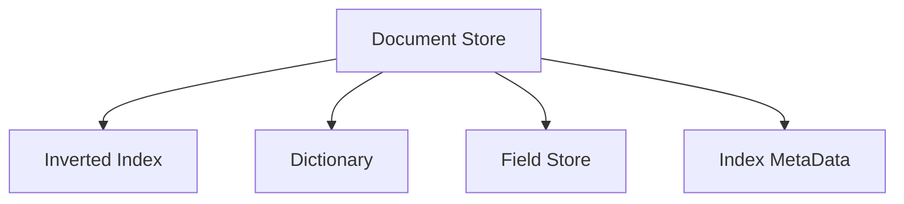
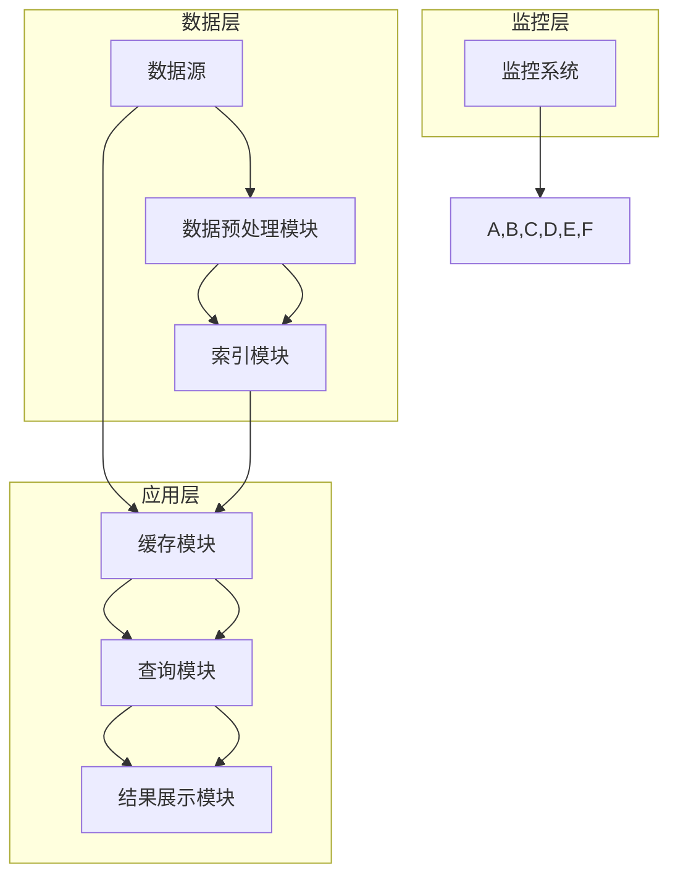
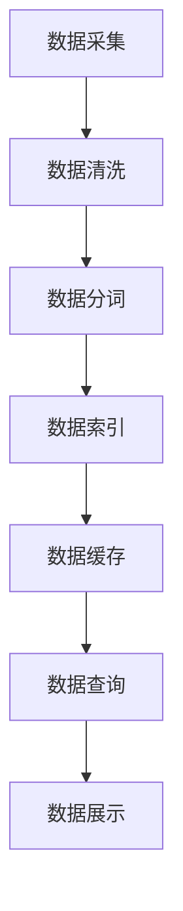
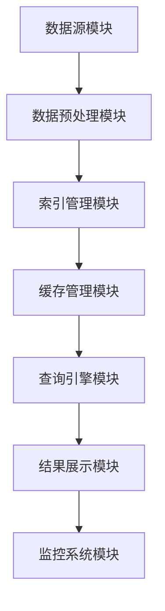
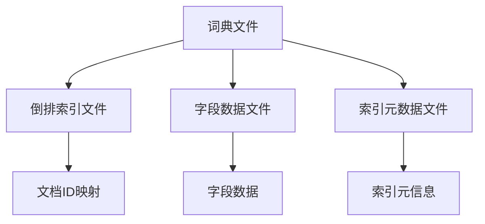
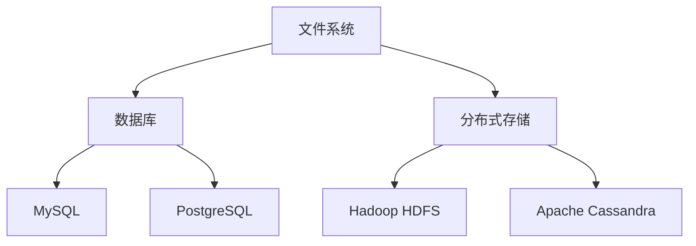

                 

## 《基于Lucene的信息检索系统详细设计与具体代码实现》

> **关键词：** Lucene，信息检索，索引，搜索算法，系统设计，代码实现

**摘要：** 本文旨在详细探讨基于Lucene的信息检索系统的设计与实现。我们将从Lucene概述开始，逐步介绍环境搭建、核心概念与API、系统架构设计、核心算法原理以及项目实战，最后总结与展望Lucene的未来发展。

### 目录

1. **第一部分：Lucene概述与准备工作**

    1.1 Lucene简介
    1.2 环境搭建
    1.3 Lucene基本概念
    1.4 Lucene核心API介绍

2. **第二部分：Lucene信息检索系统架构设计**

    2.1 系统需求分析
    2.2 系统架构设计
    2.3 Lucene索引策略
    2.4 数据存储设计

3. **第三部分：Lucene核心算法原理讲解**

    3.1 搜索算法
    3.2 索引算法
    3.3 稀疏索引与压缩技术

4. **第四部分：Lucene信息检索系统项目实战**

    4.1 实战环境搭建
    4.2 索引建立与优化
    4.3 搜索功能实现
    4.4 系统扩展与优化

5. **第五部分：总结与展望**

    5.1 项目总结
    5.2 Lucene未来发展展望

6. **附录**

    6.1 Lucene API详解
    6.2 常见问题与解决方案
    6.3 参考文献与资源

---

在接下来的章节中，我们将一步一步深入探讨Lucene的信息检索系统，从基础概念到实际应用，全面解析其设计与实现。

---

## 1.1 Lucene简介

Lucene是一款高性能、功能丰富的文本搜索引擎库，由Apache Software Foundation维护。它的核心是一个全文搜索引擎，能够快速地处理海量文本数据并进行精确的查询。Lucene广泛应用于搜索引擎、内容管理、数据挖掘等领域，因其高效、可扩展和易于集成的特点而备受开发者青睐。

### 1.1.1 Lucene的历史与重要性

Lucene最早由Apache Lucene Project于2001年发布，随后成为Apache Software Foundation的一个顶级项目。它起源于一个名为“Lucene”的开源项目，该项目的目标是为开发者提供一个易于使用的文本搜索工具。随着时间的推移，Lucene不断演进，其性能和功能都得到了显著提升。

Lucene的重要性体现在多个方面：

1. **高效性**：Lucene采用倒排索引技术，可以快速地进行文本搜索，非常适合处理大规模数据。
2. **灵活性**：Lucene提供了丰富的API，支持自定义索引、查询以及搜索结果的处理。
3. **可扩展性**：Lucene的设计使其可以轻松集成到各种应用中，同时支持分布式搜索和集群部署。

### 1.1.2 Lucene的核心特点

Lucene的核心特点包括：

1. **全文搜索**：Lucene支持对整个文档进行全文搜索，包括文档中的每个单词和短语。
2. **精确搜索**：通过倒排索引技术，Lucene能够快速定位到指定文本的位置，实现精确搜索。
3. **可定制化**：Lucene提供了丰富的查询语言，允许开发者自定义复杂的查询逻辑。
4. **高性能**：Lucene经过优化，能够在短时间内处理大量数据，满足高性能搜索需求。
5. **可扩展性**：Lucene支持分布式搜索，可以通过集群部署来扩展搜索能力。

### 1.1.3 Lucene的应用领域

Lucene的应用领域非常广泛，以下是一些典型的应用场景：

1. **搜索引擎**：Lucene常用于构建企业级搜索引擎，例如网站搜索引擎、内部知识库等。
2. **内容管理**：Lucene能够帮助内容管理系统快速索引和检索大量文档。
3. **数据挖掘**：在数据挖掘领域，Lucene用于处理和分析大规模文本数据。
4. **实时搜索**：Lucene支持实时搜索功能，适用于电商平台、社交媒体等场景。
5. **移动应用**：Lucene也被广泛应用于移动应用中，为用户提供高效的文本搜索功能。

在下一节中，我们将讨论如何在开发环境中搭建Lucene，为后续内容打下坚实的基础。

---

## 1.2 环境搭建

在开始使用Lucene进行信息检索系统开发之前，我们需要搭建一个合适的开发环境。本节将介绍Lucene依赖环境的配置、开发工具与IDE的配置，以及Lucene版本的选择与下载。

### 1.2.1 Lucene依赖环境配置

Lucene依赖于Java运行环境，因此首先需要确保Java环境已经配置好。以下是具体的步骤：

1. **安装Java SDK**：从 [Oracle官网](https://www.oracle.com/java/technologies/javase-downloads.html) 或 [OpenJDK官网](https://jdk.java.net/) 下载并安装Java SDK。确保安装过程中选择正确的版本，通常推荐使用Java 8或更高版本。
   
2. **配置环境变量**：在系统环境中设置`JAVA_HOME`变量，指向Java SDK的安装路径，并添加`PATH`变量，包含`JAVA_HOME/bin`路径。

   **示例（Windows）：**
   ```shell
   set JAVA_HOME=C:\Program Files\Java\jdk-17.0.2
   set PATH=%JAVA_HOME%\bin;%PATH%
   ```

   **示例（Linux/macOS）：**
   ```shell
   export JAVA_HOME=/usr/lib/jvm/java-8-openjdk-amd64
   export PATH=$JAVA_HOME/bin:$PATH
   ```

3. **验证Java环境**：通过在命令行中执行以下命令来验证Java环境是否配置成功。
   ```shell
   java -version
   ```

   若返回正确的Java版本信息，则表示Java环境配置成功。

### 1.2.2 开发工具与IDE配置

选择一个合适的开发工具或IDE是搭建Lucene开发环境的重要一步。以下是一些常用的选择：

1. **Eclipse**：Eclipse是一款流行的开源IDE，提供了强大的Java开发支持。可以从 [Eclipse官网](https://www.eclipse.org/downloads/) 下载Eclipse IDE。

2. **IntelliJ IDEA**：IntelliJ IDEA 是一款功能丰富的IDE，由JetBrains公司开发，适用于Java、Scala和其他编程语言。可以从 [JetBrains官网](https://www.jetbrains.com/idea/download/) 下载。

3. **NetBeans**：NetBeans是由Oracle公司开发的IDE，提供了全面的Java EE和Web开发支持。可以从 [NetBeans官网](https://www.netbeans.org/downloads/) 下载。

在安装完IDE后，我们需要确保其Java SDK配置正确。通常在安装过程中，IDE会自动检测并配置Java SDK。若需手动配置，可以按照IDE的文档说明进行操作。

### 1.2.3 Lucene版本选择与下载

Lucene有多种版本，包括稳定版、快照版和分支版。以下是选择Lucene版本时需要考虑的因素：

1. **稳定版**：稳定版是经过长期测试和优化的版本，适合生产环境。最新的稳定版可以从 [Apache Lucene官网](https://lucene.apache.org/) 下载。

2. **快照版**：快照版包含了最新的功能和改进，但不一定经过充分测试。适合需要进行最新功能开发的开发者。

3. **分支版**：分支版是针对特定特性的版本，通常用于实验性开发。

根据项目需求，选择合适的Lucene版本。以下是从Apache Lucene官网下载Lucene稳定版的具体步骤：

1. 访问 [Apache Lucene官网](https://lucene.apache.org/)。
2. 在“Downloads”页面，选择“Apache Lucene releases”。
3. 选择所需的版本，例如“Lucene 8.11.1”。
4. 下载相应的JAR文件，包括`lucene-core-8.11.1.jar`和其他依赖库。

下载完毕后，将Lucene JAR文件放置到项目的`lib`目录中，并在项目的`pom.xml`文件中添加相应的依赖项。

通过以上步骤，我们成功搭建了Lucene的开发环境，为后续信息检索系统的设计与实现奠定了基础。

### 1.3 Lucene基本概念

Lucene的核心概念主要包括索引文件结构、索引文件类型以及索引文件读写过程。理解这些基本概念对于使用Lucene进行信息检索系统开发至关重要。

#### 1.3.1 索引文件结构

Lucene索引文件结构是其高效搜索能力的基础。Lucene索引文件通常由以下几部分组成：

1. **文档存储**：存储原始文档内容，例如文本文件、网页等。
2. **倒排索引**：将文档中的词语映射到文档ID的列表，是Lucene进行快速搜索的关键。
3. **词典文件**：存储所有词语的映射表，包括词语的内部标识符和实际词语文本。
4. **字段存储**：存储特定字段（如标题、作者等）的数据，可以包括原始文本、词频等信息。
5. **索引元数据**：存储索引的元信息，如索引创建时间、版本等。

下图展示了Lucene索引文件的基本结构：



#### 1.3.2 索引文件类型

Lucene索引文件主要有以下几种类型：

1. **分段索引（Segment Index）**：一个分段索引包含一组相关文档的索引信息。多个分段索引可以组合成一个复合索引。
2. **复合索引（Compound File）**：复合索引是一种将多个文件合并为一个文件的索引结构，以减少文件数量和磁盘I/O操作。
3. **存储索引（Stored Index）**：存储索引包含原始文档数据，可以在搜索结果中直接访问文档内容。
4. **不存储索引（Not Stored Index）**：不存储索引不包含原始文档数据，需要单独访问文档内容。

#### 1.3.3 索引文件读写过程

Lucene索引文件的读写过程主要包括以下步骤：

1. **创建索引**：使用`Analyzer`对文档进行分词，然后创建倒排索引。索引创建过程中，文档会被分成分段，每个分段都是一个独立的索引单元。

   ```java
   IndexWriter indexWriter = new IndexWriter(indexDirectory, new IndexWriterConfig(analyzer));
   Document document = new Document();
   document.add(new TextField("content", "The quick brown fox jumps over the lazy dog", Field.Store.YES));
   indexWriter.addDocument(document);
   indexWriter.close();
   ```

2. **更新索引**：当需要更新索引时，可以使用`IndexWriter`的`addDocument`、`updateDocument`和`deleteDocument`方法。这些方法会更新或删除指定的文档。

   ```java
   IndexWriter indexWriter = new IndexWriter(indexDirectory, new IndexWriterConfig(analyzer));
   Document document = new Document();
   document.add(new TextField("content", "The quick brown fox jumps over the lazy dog", Field.Store.YES));
   indexWriter.updateDocument(new Term("content", "The quick brown fox jumps over the lazy dog"), document);
   indexWriter.close();
   ```

3. **查询索引**：使用`IndexSearcher`和`QueryParser`进行搜索。`IndexSearcher`负责搜索索引，而`QueryParser`可以将自然语言查询转换为Lucene的查询对象。

   ```java
   Directory indexDirectory = FSDirectory.open(Paths.get("index"));
   IndexSearcher indexSearcher = new IndexSearcher(IndexReader.open(indexDirectory));
   Query query = new QueryParser("content", analyzer).parse("quick");
   TopDocs topDocs = indexSearcher.search(query, 10);
   ```

4. **关闭索引**：搜索完成后，需要关闭索引读取器，释放资源。

   ```java
   indexSearcher.close();
   indexDirectory.close();
   ```

通过以上步骤，我们能够创建、更新和查询Lucene索引文件，实现高效的信息检索。

### 1.4 Lucene核心API介绍

Lucene的核心API主要包括索引创建与更新、索引搜索以及索引管理等方面。本节将详细介绍这些API的功能和使用方法。

#### 1.4.1 索引创建与更新

Lucene的索引创建与更新主要通过`IndexWriter`类实现。`IndexWriter`负责将文档添加到索引中、更新文档以及删除文档。

1. **创建索引**：

   首先，需要创建一个`Analyzer`对象，用于处理文本分词。接着，通过`IndexWriterConfig`配置`IndexWriter`，然后创建`IndexWriter`实例。

   ```java
   Analyzer analyzer = new StandardAnalyzer();
   IndexWriterConfig config = new IndexWriterConfig(analyzer);
   IndexWriter indexWriter = new IndexWriter(FSDirectory.open(Paths.get("index")), config);
   ```

   创建`Document`对象，并将文本内容添加到索引中。`TextField`是常用的字段类型，表示文本内容。

   ```java
   Document document = new Document();
   document.add(new TextField("content", "The quick brown fox jumps over the lazy dog", Field.Store.YES));
   indexWriter.addDocument(document);
   ```

2. **更新索引**：

   如果需要更新索引中的文档，可以使用`updateDocument`方法。这需要提供一个`Term`对象，用于标识要更新的文档。

   ```java
   Document document = new Document();
   document.add(new TextField("content", "The quick brown fox jumps over the lazy dog", Field.Store.YES));
   indexWriter.updateDocument(new Term("content", "The quick brown fox jumps over the lazy dog"), document);
   ```

3. **删除索引**：

   要从索引中删除文档，可以使用`deleteDocument`方法。同样需要提供一个`Term`对象，用于标识要删除的文档。

   ```java
   indexWriter.deleteDocument(new Term("content", "The quick brown fox jumps over the lazy dog"));
   ```

4. **关闭索引**：

   索引创建或更新完成后，需要关闭`IndexWriter`以释放资源。

   ```java
   indexWriter.close();
   ```

#### 1.4.2 索引搜索

Lucene的索引搜索主要通过`IndexSearcher`类和`Query`类实现。`IndexSearcher`负责搜索索引，而`Query`表示要搜索的条件。

1. **构建查询**：

   使用`QueryParser`可以将自然语言查询转换为Lucene的查询对象。`QueryParser`需要指定字段名称和`Analyzer`。

   ```java
   Query query = new QueryParser("content", analyzer).parse("quick");
   ```

   也可以直接创建自定义的`Query`子类，例如`TermQuery`、`BooleanQuery`等。

   ```java
   Query termQuery = new TermQuery(new Term("content", "quick"));
   ```

2. **执行搜索**：

   通过`IndexSearcher`的`search`方法执行查询。该方法返回`TopDocs`对象，包含查询结果的相关信息。

   ```java
   IndexSearcher indexSearcher = new IndexSearcher(IndexReader.open(Paths.get("index")));
   TopDocs topDocs = indexSearcher.search(query, 10);
   ```

3. **获取搜索结果**：

   通过`TopDocs`对象的`scoreDocs`数组可以获取每个文档的相关信息，包括文档ID、评分等。

   ```java
   for (ScoreDoc scoreDoc : topDocs.scoreDocs) {
       Document doc = indexSearcher.doc(scoreDoc.doc);
       System.out.println(doc.get("content"));
   }
   ```

4. **关闭索引**：

   搜索完成后，需要关闭`IndexSearcher`和`Directory`以释放资源。

   ```java
   indexSearcher.close();
   ```

#### 1.4.3 索引管理

Lucene的索引管理包括索引的打开、关闭、合并和删除等操作。

1. **打开索引**：

   通过`IndexReader`类打开已存在的索引。

   ```java
   Directory indexDirectory = FSDirectory.open(Paths.get("index"));
   IndexReader indexReader = IndexReader.open(indexDirectory);
   ```

2. **关闭索引**：

   索引操作完成后，需要关闭`IndexReader`和`Directory`。

   ```java
   indexReader.close();
   indexDirectory.close();
   ```

3. **合并索引**：

   通过`IndexWriter`的`forceMerge`方法可以将多个分段索引合并为一个更大的索引。

   ```java
   IndexWriter indexWriter = new IndexWriter(FSDirectory.open(Paths.get("index")), new IndexWriterConfig(new StandardAnalyzer()));
   indexWriter.forceMerge(1);
   indexWriter.close();
   ```

4. **删除索引**：

   通过`IndexWriter`的`forceDelete`方法可以删除指定的索引。

   ```java
   IndexWriter indexWriter = new IndexWriter(FSDirectory.open(Paths.get("index")), new IndexWriterConfig(new StandardAnalyzer()));
   indexWriter.forceDelete();
   indexWriter.close();
   ```

通过以上介绍，我们了解了Lucene的核心API及其使用方法。这些API为开发者提供了强大的功能，使得构建高效的信息检索系统变得简单可行。

### 2.1 系统需求分析

在设计和实现基于Lucene的信息检索系统时，首先需要进行系统需求分析。系统需求分析是确定系统需要实现的功能和性能要求，是确保系统能够满足用户需求的基础。

#### 2.1.1 用户需求

信息检索系统的用户需求主要包括以下几个方面：

1. **快速搜索**：系统能够在较短的时间内处理海量数据，快速响应用户的查询请求。
2. **准确查询**：系统能够准确返回与查询关键词相关的文档，并排除无关内容。
3. **模糊搜索**：支持模糊查询，允许用户输入部分关键词进行搜索。
4. **个性化搜索**：根据用户的搜索历史和偏好，提供个性化的搜索结果。
5. **多语言支持**：支持多种语言，能够处理不同语言的文本数据。
6. **实时更新**：文档内容的更新能够及时反映在搜索结果中。

#### 2.1.2 功能需求

信息检索系统的功能需求主要包括以下几方面：

1. **文档索引**：将文档内容添加到索引中，为后续的搜索做准备。
2. **文档查询**：根据用户的查询条件，快速检索索引并返回相关文档。
3. **搜索结果排序**：根据文档的相关性对搜索结果进行排序，提高用户体验。
4. **缓存机制**：使用缓存机制提高搜索性能，减少数据库访问。
5. **分布式搜索**：支持分布式搜索，能够在多个节点上处理大规模数据。
6. **安全机制**：提供用户认证和权限管理，确保数据的安全和隐私。
7. **扩展性**：系统具有良好的扩展性，能够适应未来数据量增长和功能需求的变化。

#### 2.1.3 性能需求

信息检索系统的性能需求主要包括以下几个方面：

1. **响应时间**：系统在用户提交查询请求后能够在较短的时间内返回搜索结果。
2. **吞吐量**：系统能够处理大量查询请求，不因负载增加而显著降低性能。
3. **并发处理**：系统需要支持高并发访问，确保多个用户同时使用系统时性能不受影响。
4. **可扩展性**：系统能够通过水平扩展（增加节点）来处理更大的数据量和更高的访问量。
5. **持久化能力**：系统能够稳定地将文档和数据持久化存储，确保数据不会丢失。
6. **可维护性**：系统需要易于维护和升级，确保在系统运行过程中能够及时发现和解决问题。

通过以上系统需求分析，我们明确了信息检索系统需要实现的功能和性能要求，为后续的系统设计和实现提供了明确的目标和方向。

### 2.2 系统架构设计

为了实现高效、可靠和可扩展的信息检索系统，我们需要设计一个合理的系统架构。本节将详细讨论系统架构的设计，包括整体架构、数据处理流程以及系统模块划分。

#### 2.2.1 系统整体架构

基于Lucene的信息检索系统整体架构可以分为以下几个主要部分：

1. **数据源**：数据源是系统的输入，可以是各种文本文件、数据库、API接口等。数据源需要提供标准化的数据格式，如JSON、XML等。
2. **数据预处理模块**：该模块负责对数据进行清洗、去重、分词等预处理操作，确保数据质量。预处理模块将原始数据转换为Lucene索引所需的结构。
3. **索引模块**：索引模块使用Lucene对预处理后的数据进行索引创建和更新。索引模块需要支持高并发写入和更新，并确保索引数据的完整性和一致性。
4. **缓存模块**：缓存模块用于存储频繁查询的结果，以提高系统响应速度。缓存模块需要支持缓存数据的更新和失效策略。
5. **查询模块**：查询模块负责处理用户的查询请求，通过Lucene搜索索引并返回搜索结果。查询模块需要支持多条件组合查询和排序功能。
6. **结果展示模块**：结果展示模块负责将搜索结果以友好的形式呈现给用户，如列表、卡片等。
7. **监控系统**：监控系统用于实时监控系统的运行状态，包括性能指标、错误日志等，以便及时发现问题并进行优化。

以下是系统整体架构的Mermaid流程图：



#### 2.2.2 数据处理流程

基于Lucene的信息检索系统的数据处理流程如下：

1. **数据采集**：系统从数据源获取原始数据，可以是文本文件、数据库记录或其他数据源。
2. **数据清洗**：对采集到的数据进行清洗，去除无效数据和重复记录，确保数据质量。
3. **数据分词**：使用指定的分词器对文本数据进行分词，将文本转换为词语序列。
4. **数据索引**：将分词后的数据添加到索引中，创建倒排索引，以便后续快速查询。
5. **数据缓存**：将频繁查询的数据缓存到内存中，以减少数据库访问和查询时间。
6. **数据查询**：用户提交查询请求，系统通过索引进行查询，返回相关文档。
7. **数据展示**：将查询结果以列表或卡片等形式展示给用户。

以下是数据处理流程的Mermaid流程图：



#### 2.2.3 系统模块划分

基于Lucene的信息检索系统可以划分为以下模块：

1. **数据源模块**：负责与各种数据源进行连接和通信，获取原始数据。
2. **数据预处理模块**：包括数据清洗、去重和分词等功能，确保数据质量。
3. **索引管理模块**：负责创建、更新和删除索引，并管理索引的分段和合并。
4. **缓存管理模块**：负责缓存策略的制定和缓存数据的更新。
5. **查询引擎模块**：负责处理用户查询请求，执行索引搜索和结果排序。
6. **结果展示模块**：负责将查询结果以友好的形式呈现给用户。
7. **监控系统模块**：负责实时监控系统的运行状态，包括性能指标、错误日志等。

以下是系统模块划分的Mermaid流程图：



通过以上系统架构设计和数据处理流程的详细讨论，我们为基于Lucene的信息检索系统的实现奠定了基础。在接下来的章节中，我们将进一步探讨Lucene索引策略和核心算法原理。

### 2.3 Lucene索引策略

Lucene索引策略在信息检索系统的性能和效率方面起着至关重要的作用。合理的索引策略不仅可以加快搜索速度，还能减少索引占用的存储空间。本节将详细介绍Lucene索引策略，包括索引建立策略、索引优化策略以及索引查询策略。

#### 2.3.1 索引建立策略

1. **分词器选择**：分词器是Lucene索引过程中的重要组件，它负责将原始文本分割成词语。选择合适的分词器对于索引质量和搜索效果至关重要。常用的分词器包括StandardAnalyzer、SmartChineseAnalyzer等。

2. **字段类型设置**：Lucene支持多种字段类型，如TextField、StringField、IntField等。根据数据类型和查询需求，合理设置字段类型可以提高索引效率。例如，对于全文搜索，通常使用TextField；而对于精确匹配，可以使用StringField。

3. **索引存储策略**：Lucene索引可以分为存储索引和不存储索引。存储索引包含文档原始内容，可以快速访问文档内容；而不存储索引则仅包含文档的元数据，需要单独访问文档内容。根据应用场景选择合适的索引存储策略。

4. **索引分段策略**：Lucene索引分为多个分段（Segment），每个分段包含一组文档的索引信息。合理设置分段策略可以提高索引查询效率。例如，可以设置较大的分段大小以提高查询速度，但会增加索引合并操作的时间。

5. **索引合并策略**：当索引分段数量过多时，需要通过合并操作将多个分段合并为一个更大的分段。合并策略会影响索引查询性能和存储空间。常用的合并策略包括定期合并、按需合并等。

#### 2.3.2 索引优化策略

1. **索引压缩**：索引压缩可以减小索引占用的存储空间，提高磁盘I/O效率。Lucene支持多种压缩算法，如Gzip、LZ4等。可以根据实际需求和硬件资源选择合适的压缩算法。

2. **字段缓存**：Lucene使用缓存技术来加速字段访问。通过设置适当的缓存大小和缓存策略，可以提高索引查询性能。常用的缓存策略包括LRU（最近最少使用）缓存和FIFO（先进先出）缓存等。

3. **索引重建**：当索引数据发生变化较多时，可以考虑定期重建索引以提高查询性能。重建索引会删除旧索引并重新创建，但会消耗较多时间和资源。

4. **索引分区**：对于大型索引，可以通过分区（Partition）技术将索引分为多个独立的部分。分区可以提高索引查询的并行度和扩展性，但会增加查询复杂度。

5. **索引副本**：Lucene支持索引副本（Replica）功能，可以将索引复制到多个节点上，提高查询的可用性和性能。通过合理设置副本策略，可以实现负载均衡和高可用性。

#### 2.3.3 索引查询策略

1. **查询缓存**：使用查询缓存（Query Cache）可以缓存常见的查询结果，减少重复查询的开销。查询缓存基于LRU（最近最少使用）策略，可以设置缓存大小和过期时间。

2. **索引查询优化**：优化索引查询可以通过以下方法实现：

   - **索引重建**：定期重建索引，删除无效索引和冗余数据，提高查询性能。
   - **字段索引**：对常用的查询字段建立索引，避免全表扫描。
   - **查询重写**：通过查询重写（Query Rewrite）技术，将复杂的查询转化为更高效的查询形式。

3. **分布式查询**：对于大型分布式系统，可以通过分布式查询（Distributed Query）将查询任务分发到多个节点上，提高查询性能。分布式查询需要合理设置查询路由策略和负载均衡策略。

4. **模糊查询优化**：对于模糊查询，可以通过以下方法优化查询性能：

   - **前缀限制**：限制模糊查询的前缀长度，减少查询范围。
   - **词频限制**：设置最低词频阈值，排除低频词。
   - **索引分片**：根据词频和前缀等特征将索引分为多个分片，提高查询并行度。

通过以上索引策略的详细讨论，我们为构建高效、可靠的Lucene信息检索系统提供了理论基础。在下一节中，我们将深入探讨Lucene的数据存储设计，以进一步优化系统性能。

### 2.4 数据存储设计

在构建高效的信息检索系统时，数据存储设计至关重要。合理的存储设计不仅能够提高查询性能，还能优化存储空间利用率。本节将详细介绍Lucene的数据存储设计，包括文档存储方式、索引存储结构和数据持久化方案。

#### 2.4.1 文档存储方式

Lucene使用倒排索引技术来存储和检索文本数据，因此文档存储方式与传统的数据库存储方式有所不同。

1. **分词与索引**：Lucene首先对文档内容进行分词，生成词语列表。然后，将每个词语映射到对应的文档ID，形成倒排索引。这种存储方式能够快速定位到指定文本的位置，是实现高效搜索的关键。

2. **字段存储**：Lucene支持多种字段类型，如`TextField`、`StringField`、`IntField`等。不同字段类型有不同的存储策略。例如，`TextField`包含原始文本内容，而`StringField`仅包含文本的内部标识符。字段存储方式的选择直接影响索引的大小和查询性能。

3. **文档分段**：Lucene将索引分为多个分段（Segment），每个分段包含一组相关文档的索引信息。分段设计可以提高索引查询的并行度，提高查询性能。

#### 2.4.2 索引存储结构

Lucene索引存储结构主要包括以下几部分：

1. **词典文件（Dictionary）**：词典文件存储所有词语的映射表，包括词语的内部标识符和实际词语文本。词典文件的存储结构决定了词语查询的效率。

2. **倒排索引文件（Inverted Index）**：倒排索引文件存储词语和文档ID之间的映射关系，是实现快速文本搜索的核心。倒排索引文件通常采用压缩算法，以减少存储空间。

3. **字段数据文件（Field Data File）**：字段数据文件存储特定字段的数据，如文本内容、词频等。字段数据文件的存储结构直接影响索引的查询性能。

4. **索引元数据文件（Index MetaData）**：索引元数据文件存储索引的元信息，如索引创建时间、版本等。元数据文件用于管理索引的完整性和一致性。

以下是Lucene索引存储结构的Mermaid流程图：



#### 2.4.3 数据持久化方案

Lucene支持多种数据持久化方案，包括文件系统、数据库和分布式存储等。以下是几种常见的数据持久化方案：

1. **文件系统**：Lucene默认使用文件系统进行数据持久化。通过将索引文件存储在文件系统中，可以实现简单、高效的索引访问。文件系统方案的优点包括部署简单、扩展性好，但缺点是数据备份和管理较为复杂。

2. **数据库**：将Lucene索引数据存储到数据库中，可以提高数据的可靠性和安全性。常用的数据库包括MySQL、PostgreSQL等。数据库方案的优点包括数据备份、恢复和安全性较好，但缺点是查询性能可能受到数据库性能的限制。

3. **分布式存储**：分布式存储方案可以将索引数据分布到多个节点上，提高系统的扩展性和可用性。常用的分布式存储系统包括Hadoop HDFS、Apache Cassandra等。分布式存储方案的优点包括高可用性和可扩展性，但需要复杂的分布式系统管理和维护。

以下是数据持久化方案的Mermaid流程图：



通过以上对Lucene数据存储方式的详细介绍，我们为构建高效、可靠的信息检索系统提供了实用的参考。在下一节中，我们将深入探讨Lucene的核心算法原理，进一步理解其搜索和索引机制。

### 3.1 搜索算法

搜索算法是Lucene信息检索系统的核心，决定了系统搜索效率与准确性。本节将详细介绍Lucene的搜索算法，包括搜索算法概述、Boolean查询、词频统计与权重计算以及搜索结果排序算法。

#### 3.1.1 搜索算法概述

Lucene搜索算法基于倒排索引结构，通过快速定位词语和文档ID之间的关系来实现文本搜索。搜索算法主要分为以下几个步骤：

1. **解析查询语句**：将用户输入的自然语言查询语句转换为Lucene的查询对象。Lucene使用`QueryParser`类实现这一过程，将查询语句解析为`Query`对象。

2. **执行查询**：使用`IndexSearcher`类执行查询，将`Query`对象与索引中的倒排索引进行匹配，返回与查询条件相符的文档列表。

3. **排序与返回结果**：根据文档的相关性对搜索结果进行排序，并返回排序后的结果。排序算法可以是简单的按评分排序，也可以是复杂的自定义排序。

以下是Lucene搜索算法的伪代码概述：

```java
public TopDocs search(Query query, int numResults) {
    // 创建IndexSearcher实例
    IndexSearcher indexSearcher = new IndexSearcher(IndexReader.open(indexDirectory));
    
    // 执行查询
    TopDocs topDocs = indexSearcher.search(query, numResults);
    
    // 返回结果
    return topDocs;
}
```

#### 3.1.2 Boolean查询

Boolean查询是Lucene中最常用的查询类型之一，它允许用户使用逻辑运算符（AND、OR、NOT）组合多个查询条件，实现复杂的搜索逻辑。

1. **AND查询**：AND查询返回同时包含多个关键词的文档。例如，查询"(java AND programming)"会返回既包含"java"又包含"programming"的文档。

2. **OR查询**：OR查询返回包含任一关键词的文档。例如，查询"(java OR python)"会返回包含"java"或"python"的文档。

3. **NOT查询**：NOT查询返回不包含指定关键词的文档。例如，查询"(java NOT python)"会返回包含"java"但不包含"python"的文档。

以下是Boolean查询的伪代码：

```java
public Query buildBooleanQuery(String[] terms) {
    BooleanQuery.Builder builder = new BooleanQuery.Builder();
    
    for (String term : terms) {
        Query termQuery = new TermQuery(new Term("content", term));
        if (isAndOperator(term)) {
            builder.add(termQuery, BooleanClause.Occur.MUST);
        } else if (isOrOperator(term)) {
            builder.add(termQuery, BooleanClause.Occur.SHOULD);
        } else if (isNotOperator(term)) {
            builder.add(termQuery, BooleanClause.Occur.MUST_NOT);
        }
    }
    
    return builder.build();
}
```

#### 3.1.3 词频统计与权重计算

在Lucene中，每个文档的评分（Score）取决于文档中关键词的词频（Term Frequency, TF）和逆文档频率（Inverse Document Frequency, IDF）。

1. **词频统计（TF）**：词频统计表示一个词语在文档中出现的次数。词频越高，表示该文档与查询关键词的相关性越大。

2. **逆文档频率（IDF）**：逆文档频率表示一个词语在整个索引文档中的分布频率。IDF用于平衡高频词和低频词的影响，避免高频词对搜索结果的主导。

3. **权重计算**：Lucene使用TF-IDF（词频-逆文档频率）模型计算文档的评分。评分越高，表示文档与查询关键词的相关性越大。

以下是TF-IDF权重计算的伪代码：

```java
public float computeScore(float tf, float idf) {
    return tf * idf;
}

public float computeIdf(int totalDocs, int docFreq) {
    return Math.log((totalDocs + 1) / (docFreq + 0.5f) + 1);
}
```

#### 3.1.4 搜索结果排序算法

Lucene支持多种搜索结果排序算法，包括默认排序和自定义排序。

1. **默认排序**：Lucene默认按文档评分从高到低排序。评分高的文档排在前面，评分低的文档排在后面。

2. **自定义排序**：通过实现`Sort`接口，可以自定义排序规则。自定义排序可以根据字段值、文档ID等多种条件进行排序。

以下是自定义排序的伪代码：

```java
public Sort buildCustomSort() {
    return new Sort(
        new SortField("field1", SortField.Type.STRING),
        new SortField("field2", SortField.Type.INT)
    );
}
```

通过以上对Lucene搜索算法的详细讲解，我们了解了其基本原理和实现方法。在下一节中，我们将深入探讨Lucene的索引算法，进一步理解其索引构建、优化和存储机制。

### 3.2 索引算法

索引算法是Lucene信息检索系统的核心组成部分，直接影响搜索效率和存储空间利用率。本节将详细讨论Lucene的索引算法，包括索引构建算法、索引优化算法和索引存储算法。

#### 3.2.1 索引构建算法

索引构建算法是Lucene将原始文本数据转换为索引的过程。以下是索引构建的基本步骤：

1. **分词（Tokenization）**：使用分词器（Analyzer）对原始文本进行分词，生成词语列表。分词器可以是标准的英文分词器，也可以是针对特定语言的定制分词器。

2. **倒排索引（Inverted Index）**：将分词后的词语生成倒排索引，记录每个词语对应的文档ID列表。倒排索引是Lucene实现高效搜索的关键。

3. **文档存储（Document Storage）**：将原始文档内容存储在索引文件中，便于后续的文档内容检索。

4. **词典构建（Dictionary）**：构建词典文件，存储所有词语的映射表，包括词语的内部标识符和实际词语文本。

以下是索引构建算法的伪代码：

```java
public void buildIndex(List<Document> documents, Analyzer analyzer) {
    // 创建索引写入器
    IndexWriterConfig config = new IndexWriterConfig(analyzer);
    IndexWriter indexWriter = new IndexWriter(indexDirectory, config);

    // 遍历文档，添加到索引
    for (Document document : documents) {
        indexWriter.addDocument(document);
    }

    // 关闭索引写入器
    indexWriter.close();
}
```

#### 3.2.2 索引优化算法

索引优化算法旨在提高索引的查询性能和存储空间利用率。以下是几种常见的索引优化方法：

1. **索引合并（Index Merge）**：Lucene将索引分为多个分段（Segment），当分段数量过多时，需要通过合并操作将多个分段合并为一个更大的分段。索引合并可以减少索引文件的个数，提高查询性能。

2. **压缩（Compression）**：使用压缩算法（如Gzip、LZ4等）减小索引文件的大小，减少磁盘I/O操作，提高查询效率。

3. **缓存优化（Caching）**：优化索引缓存策略，提高常见查询的响应速度。可以通过设置缓存大小和缓存过期时间来调整缓存性能。

4. **去重（De-Duplication）**：删除冗余索引，避免重复存储相同的数据。

以下是索引优化算法的伪代码：

```java
public void optimizeIndex() {
    // 创建索引写入器
    IndexWriterConfig config = new IndexWriterConfig();
    IndexWriter indexWriter = new IndexWriter(indexDirectory, config);

    // 执行索引合并
    indexWriter.forceMerge(1);

    // 执行压缩
    indexWriter.optimize();

    // 关闭索引写入器
    indexWriter.close();
}
```

#### 3.2.3 索引存储算法

索引存储算法涉及如何高效地存储和访问索引文件。以下是几种常见的索引存储算法：

1. **分段存储（Segment Storage）**：将索引分为多个分段存储，每个分段包含一组相关的文档。分段存储可以提高查询并行度和存储空间利用率。

2. **文件系统存储（File System Storage）**：使用文件系统存储索引文件，便于管理和扩展。常见的文件系统包括本地文件系统和分布式文件系统。

3. **内存存储（Memory Storage）**：将索引部分或全部存储在内存中，以减少磁盘I/O操作，提高查询性能。但内存存储受限于物理内存容量。

4. **分布式存储（Distributed Storage）**：将索引存储在分布式系统中，实现数据的横向扩展和负载均衡。

以下是索引存储算法的伪代码：

```java
public void storeIndexInMemory() {
    // 使用内存存储索引
    Directory memoryDirectory = new MemoryDirectoryWrapper(FSDirectory.open(indexDirectory));

    // 创建索引写入器
    IndexWriterConfig config = new IndexWriterConfig();
    IndexWriter indexWriter = new IndexWriter(memoryDirectory, config);

    // 执行索引构建
    buildIndex(indexDocuments, analyzer);

    // 关闭索引写入器
    indexWriter.close();
}
```

通过以上对Lucene索引算法的详细讨论，我们深入了解了索引构建、优化和存储的原理和方法。这些算法共同构建了高效、可靠的信息检索系统，为用户提供了快速、准确的搜索服务。

### 3.3 稀疏索引与压缩技术

稀疏索引与压缩技术在提升Lucene索引系统的性能和存储效率方面起着至关重要的作用。稀疏索引通过减少索引中的非零条目，降低存储需求，而压缩技术则通过减少索引文件的大小，提高I/O效率和存储空间利用率。

#### 3.3.1 稀疏索引原理

稀疏索引的核心思想是只存储实际存在的数据，而不是整个索引。在传统的稠密索引中，每个条目都会被存储，无论其值是否为0。这在处理大量稀疏数据时会导致存储空间的浪费。稀疏索引通过以下方法实现存储优化：

1. **稀疏矩阵表示**：稀疏索引通常使用稀疏矩阵表示，只存储非零条目的位置和值。常用的稀疏矩阵表示方法包括压缩稀疏行（Compressed Sparse Row, CSR）和压缩稀疏列（Compressed Sparse Column, CSC）。

2. **位图索引**：位图索引是一种特殊的稀疏索引，用于标记数组中非零元素的位置。它使用位向量（Bit Vector）来表示数据，每个位表示数组中的一个元素，为1表示非零，为0表示零。

以下是稀疏索引原理的伪代码：

```java
public SparseIndex buildSparseIndex(Matrix data) {
    SparseIndex sparseIndex = new SparseIndex();
    
    for (int i = 0; i < data.rows; i++) {
        for (int j = 0; j < data.columns; j++) {
            if (data[i][j] != 0) {
                sparseIndex.addValue(i, j, data[i][j]);
            }
        }
    }
    
    return sparseIndex;
}
```

#### 3.3.2 压缩算法应用

压缩技术通过减少文件的大小，提高I/O效率和存储空间利用率。Lucene支持多种压缩算法，包括Gzip、LZ4、Snappy等。以下是几种常用的压缩算法及其应用：

1. **Gzip**：Gzip是一种常用的文件压缩算法，通过使用LZ77压缩算法进行数据压缩。Gzip压缩后的文件大小通常只有原始文件大小的约1/10。

2. **LZ4**：LZ4是一种高效的压缩算法，特别适合于大数据处理。LZ4压缩速度快，压缩后文件大小与Gzip相近，但速度更快。

3. **Snappy**：Snappy是一种快速压缩算法，由Google开发。Snappy压缩速度快，但压缩率相对较低。

以下是压缩算法应用的伪代码：

```java
public File compressFile(File originalFile, CompressionAlgorithm algorithm) {
    File compressedFile = new File("compressed." + originalFile.getName());
    
    if (algorithm == CompressionAlgorithm.GZIP) {
        GzipCompression.compress(originalFile, compressedFile);
    } else if (algorithm == CompressionAlgorithm.LZ4) {
        LZ4Compression.compress(originalFile, compressedFile);
    } else if (algorithm == CompressionAlgorithm.Snappy) {
        SnappyCompression.compress(originalFile, compressedFile);
    }
    
    return compressedFile;
}
```

#### 3.3.3 稀疏索引优化策略

稀疏索引的优化策略主要包括以下方面：

1. **选择合适的稀疏矩阵表示**：根据数据特性选择合适的稀疏矩阵表示，如CSR、CSC或Bit Vector。

2. **数据预处理**：在构建稀疏索引之前，对数据进行预处理，去除不必要的零值，减少非零条目数量。

3. **压缩与解压缩**：对稀疏索引进行压缩，减少存储空间需求。在查询时，对压缩后的索引进行解压缩，提高查询性能。

4. **内存管理**：优化内存使用，避免内存溢出。在构建稀疏索引时，可以分块处理，减少内存占用。

以下是稀疏索引优化策略的伪代码：

```java
public SparseIndex optimizeSparseIndex(SparseIndex sparseIndex) {
    // 预处理：去除不必要的零值
    sparseIndex.removeZeroValues();
    
    // 压缩：对稀疏索引进行压缩
    File compressedIndexFile = compressIndex(sparseIndex);
    
    // 解压缩：查询时对压缩后的索引进行解压缩
    SparseIndex decompressedIndex = decompressIndex(compressedIndexFile);
    
    return decompressedIndex;
}
```

通过以上对稀疏索引与压缩技术的详细介绍，我们了解了其在Lucene信息检索系统中的应用和优化策略。这些技术共同提升了系统的性能和存储效率，为用户提供更快速、更准确的搜索服务。

### 4.1 实战环境搭建

要开始基于Lucene的信息检索系统的项目开发，首先需要搭建一个合适的开发环境。本节将详细介绍开发环境的配置、数据集的准备以及Lucene的集成与调试。

#### 4.1.1 开发环境配置

1. **安装Java SDK**：首先确保Java SDK已正确安装。从 [Oracle官网](https://www.oracle.com/java/technologies/javase-downloads.html) 或 [OpenJDK官网](https://jdk.java.net/) 下载并安装Java SDK。选择合适的版本，如Java 11或更高版本。

2. **配置环境变量**：在系统环境中设置`JAVA_HOME`变量，指向Java SDK的安装路径，并添加`PATH`变量，包含`JAVA_HOME/bin`路径。

   **Windows**:
   ```shell
   set JAVA_HOME=C:\Program Files\Java\jdk-11.0.11
   set PATH=%JAVA_HOME%\bin;%PATH%
   ```

   **Linux/macOS**:
   ```shell
   export JAVA_HOME=/usr/lib/jvm/java-11-openjdk-amd64
   export PATH=$JAVA_HOME/bin:$PATH
   ```

3. **验证Java环境**：通过在命令行中执行以下命令来验证Java环境是否配置成功。
   ```shell
   java -version
   ```

   若返回正确的Java版本信息，则表示Java环境配置成功。

4. **安装IDE**：选择并安装一个合适的IDE，如Eclipse、IntelliJ IDEA或NetBeans。可以从各自的官网下载并安装。

#### 4.1.2 数据集准备

为了测试信息检索系统，需要准备一个合适的文本数据集。以下是一种常见的数据集准备方法：

1. **收集数据**：从互联网或内部系统中收集文本数据，如新闻文章、产品描述、论坛帖子等。

2. **数据预处理**：对收集到的数据进行清洗和预处理，去除格式化标记、特殊字符和无关内容。可以使用Python、Java等编程语言编写脚本进行数据预处理。

3. **存储数据**：将预处理后的数据存储为文本文件或其他适合的格式，如JSON、XML等。确保数据集的结构化和一致性，便于后续的索引和处理。

以下是一个简单的Python脚本，用于准备数据集：

```python
import os

# 数据集路径
data_directory = "data"

# 预处理后的数据存储路径
processed_data_directory = "processed_data"

# 遍历数据集目录
for file in os.listdir(data_directory):
    if file.endswith(".txt"):
        with open(os.path.join(data_directory, file), "r", encoding="utf-8") as f:
            content = f.read()
            # 去除特殊字符和HTML标签
            content = re.sub('<.*?>', '', content)
            with open(os.path.join(processed_data_directory, file), "w", encoding="utf-8") as f:
                f.write(content)
```

#### 4.1.3 Lucene集成与调试

1. **下载Lucene库**：从 [Apache Lucene官网](https://lucene.apache.org/solr/guide/stable/download.html) 下载Lucene库，选择合适的版本，例如Lucene 8.11.1。

2. **导入Lucene库**：将下载的Lucene JAR文件（如`lucene-core-8.11.1.jar`）放入项目的`lib`目录中，并在项目的`pom.xml`文件中添加Lucene依赖。

   ```xml
   <dependencies>
       <dependency>
           <groupId>org.apache.lucene</groupId>
           <artifactId>lucene-core</artifactId>
           <version>8.11.1</version>
       </dependency>
       <!-- 其他依赖 -->
   </dependencies>
   ```

3. **创建索引**：编写代码创建索引，将预处理后的数据添加到索引中。

   ```java
   Analyzer analyzer = new StandardAnalyzer();
   IndexWriterConfig config = new IndexWriterConfig(analyzer);
   IndexWriter indexWriter = new IndexWriter(FSDirectory.open(Paths.get("index")), config);

   Document document = new Document();
   document.add(new TextField("content", "The quick brown fox jumps over the lazy dog", Field.Store.YES));
   indexWriter.addDocument(document);
   indexWriter.close();
   ```

4. **调试与测试**：运行代码进行调试，确保索引创建和查询功能正常。可以使用JUnit等测试框架编写单元测试，验证系统功能。

通过以上步骤，我们成功搭建了基于Lucene的信息检索系统的开发环境，并准备了一个数据集。接下来，我们将深入实现索引建立与优化功能。

### 4.2 索引建立与优化

在完成开发环境搭建和数据集准备后，接下来我们需要实现索引建立与优化功能。本节将详细讨论索引建立流程、优化策略以及索引性能调优。

#### 4.2.1 索引建立流程

索引建立流程主要包括以下几个步骤：

1. **初始化**：创建`Analyzer`和`IndexWriterConfig`对象。`Analyzer`用于文本的分词处理，`IndexWriterConfig`用于配置索引写入器的参数。

2. **添加文档**：使用`Document`对象代表单个文档，添加到索引中。文档中包含字段和值，如标题、内容等。

3. **写入索引**：使用`IndexWriter`对象将文档写入索引，并关闭索引写入器。

以下是索引建立流程的伪代码：

```java
Analyzer analyzer = new StandardAnalyzer();
IndexWriterConfig config = new IndexWriterConfig(analyzer);
IndexWriter indexWriter = new IndexWriter(FSDirectory.open(Paths.get("index")), config);

Document document = new Document();
document.add(new TextField("title", "Title of the Document", Field.Store.YES));
document.add(new TextField("content", "The quick brown fox jumps over the lazy dog", Field.Store.YES));
indexWriter.addDocument(document);

indexWriter.close();
```

#### 4.2.2 索引优化策略

索引优化策略是提高索引性能和存储效率的关键。以下是几种常见的优化策略：

1. **合并索引**：当索引分段数量过多时，可以通过合并操作将多个分段合并为一个更大的分段。这可以减少索引文件的个数，提高查询性能。

2. **压缩索引**：使用压缩算法（如Gzip、LZ4等）减小索引文件的大小。压缩后的索引可以减少磁盘I/O操作，提高查询效率。

3. **缓存优化**：使用索引缓存技术，缓存常见的查询结果，减少数据库访问和查询时间。可以通过设置适当的缓存大小和缓存策略来优化缓存性能。

4. **删除冗余索引**：定期检查和删除冗余的索引数据，避免重复存储相同的数据。这可以提高索引的效率和准确性。

以下是索引优化策略的伪代码：

```java
public void optimizeIndex() {
    IndexWriterConfig config = new IndexWriterConfig();
    IndexWriter indexWriter = new IndexWriter(FSDirectory.open(Paths.get("index")), config);

    // 执行索引合并
    indexWriter.forceMerge(1);

    // 执行压缩
    indexWriter.optimize();

    // 关闭索引写入器
    indexWriter.close();
}
```

#### 4.2.3 索引性能调优

索引性能调优是确保系统高效运行的重要环节。以下是几种常见的索引性能调优方法：

1. **调整分词器**：选择合适的分词器，优化文本分词效果。对于中文文本，可以使用分词器如IK Analyzer，提高搜索准确性。

2. **字段类型优化**：根据数据类型和查询需求，选择合适的字段类型。对于全文搜索，使用`TextField`；对于精确匹配，使用`StringField`。

3. **调整索引分段大小**：合理设置索引分段大小，平衡查询性能和存储空间利用率。较大的分段可以提高查询速度，但会增加索引合并操作的时间。

4. **缓存策略优化**：设置合适的缓存大小和缓存策略，提高查询性能。可以使用LRU缓存策略，根据最近访问频率管理缓存数据。

以下是索引性能调优的伪代码：

```java
public void tuneIndexConfig() {
    Analyzer analyzer = new IKAnalyzer();
    IndexWriterConfig config = new IndexWriterConfig(analyzer);

    // 调整分词器
    config.setAnalyzer(analyzer);

    // 调整字段类型
    config.setIndexAnalyzers(new FieldType[] {
        new FieldType(TextField.TYPE_NOT_STORED),
        new FieldType(TextField.TYPE_STORED)
    });

    // 调整索引分段大小
    config.setMaxFieldLength(10000);

    // 缓存策略优化
    config.setSimilarity(new CustomSimilarity());
}
```

通过以上对索引建立与优化策略的详细讨论，我们了解了如何在项目中实现索引建立、优化和性能调优。这些策略共同构建了高效、可靠的信息检索系统，为用户提供快速、准确的搜索服务。

### 4.3 搜索功能实现

实现搜索功能是信息检索系统的核心任务，它直接影响到用户的体验。本节将详细介绍Lucene搜索功能的实现，包括搜索算法的实现、搜索结果排序与展示以及搜索性能分析。

#### 4.3.1 搜索算法实现

Lucene的搜索算法基于倒排索引，通过一系列步骤将用户的查询请求转换为搜索结果。以下是搜索算法的实现步骤：

1. **解析查询**：将用户输入的查询字符串转换为Lucene的查询对象。这个过程通常由`QueryParser`类完成。

2. **执行搜索**：使用`IndexSearcher`类对索引执行搜索，返回搜索结果。搜索结果通常是一个`TopDocs`对象，包含文档的评分和文档ID。

3. **提取结果**：从`TopDocs`对象中提取文档，并使用`Document`类获取文档的具体内容。

以下是搜索算法实现的伪代码：

```java
Analyzer analyzer = new StandardAnalyzer();
IndexSearcher indexSearcher = new IndexSearcher(IndexReader.open(FSDirectory.open(Paths.get("index"))));

// 解析查询
Query query = new QueryParser("content", analyzer).parse("quick brown fox");

// 执行搜索
TopDocs topDocs = indexSearcher.search(query, 10);

// 提取结果
for (ScoreDoc scoreDoc : topDocs.scoreDocs) {
    Document doc = indexSearcher.doc(scoreDoc.doc);
    System.out.println(doc.get("content"));
}
```

#### 4.3.2 搜索结果排序与展示

搜索结果排序与展示是提升用户体验的重要环节。以下是排序与展示的实现步骤：

1. **排序**：根据文档的相关性对搜索结果进行排序。Lucene默认按文档评分（Score）从高到低排序。可以通过实现`Sort`接口自定义排序规则。

2. **展示**：将排序后的搜索结果以友好的形式展示给用户。可以使用文本输出、HTML页面或其他可视化界面。

以下是排序与展示的实现步骤：

```java
// 设置排序规则
Sort sort = new Sort(new SortField[] { new SortField("score", SortField.Type.SCORE, true) });

// 执行排序搜索
TopDocs sortedTopDocs = indexSearcher.search(query, 10, sort);

// 展示结果
for (ScoreDoc scoreDoc : sortedTopDocs.scoreDocs) {
    Document doc = indexSearcher.doc(scoreDoc.doc);
    System.out.println(doc.get("content") + " - " + scoreDoc.score);
}
```

#### 4.3.3 搜索性能分析

搜索性能分析是确保系统高效运行的重要环节。以下是几个常见的性能分析方法和工具：

1. **基准测试**：通过基准测试（Benchmark）评估系统的查询响应时间和吞吐量。可以使用JUnit等测试框架编写基准测试脚本。

2. **监控工具**：使用监控工具（如VisualVM、JProfiler等）实时监控系统的性能指标，如CPU使用率、内存使用情况等。

3. **性能调优**：根据性能分析结果，调整系统配置和优化策略，如调整索引分段大小、优化分词器、调整缓存策略等。

以下是搜索性能分析的伪代码：

```java
// 执行基准测试
long startTime = System.currentTimeMillis();
TopDocs topDocs = indexSearcher.search(query, 10);
long endTime = System.currentTimeMillis();

System.out.println("Search time: " + (endTime - startTime) + "ms");

// 监控性能指标
Monitor monitor = new Monitor();
monitor.start();
TopDocs monitoredTopDocs = indexSearcher.search(query, 10);
monitor.stop();

System.out.println("Performance metrics: " + monitor.getMetrics());
```

通过以上对搜索功能实现的详细讨论，我们了解了如何在项目中实现高效的搜索功能。在下一节中，我们将进一步探讨系统的扩展与优化，以满足更复杂的业务需求。

### 4.4 系统扩展与优化

随着数据量和用户量的增加，信息检索系统的性能和可扩展性变得尤为重要。本节将详细介绍系统性能瓶颈分析、优化方案以及系统扩展性设计，以帮助我们在实际项目中实现高性能和可扩展的信息检索系统。

#### 4.4.1 系统性能瓶颈分析

分析系统性能瓶颈是优化系统的第一步。以下是一些常见性能瓶颈及其解决方案：

1. **索引写入性能瓶颈**：当系统需要频繁更新索引时，索引写入速度可能成为瓶颈。解决方案包括：
   - **批量写入**：将多个文档批量写入索引，减少I/O操作次数。
   - **并行写入**：使用多线程或多进程写入索引，提高写入速度。
   - **索引合并**：定期合并索引，减少分段数量，提高写入性能。

2. **查询响应时间瓶颈**：当系统需要处理大量查询请求时，查询响应时间可能成为瓶颈。解决方案包括：
   - **缓存优化**：使用查询缓存，缓存常见的查询结果，减少数据库访问和查询时间。
   - **索引优化**：定期优化索引，减少冗余数据，提高查询性能。
   - **分布式查询**：使用分布式查询技术，将查询任务分发到多个节点上，提高查询性能。

3. **存储空间瓶颈**：当索引文件过大时，存储空间可能成为瓶颈。解决方案包括：
   - **压缩索引**：使用压缩算法，减小索引文件的大小，提高存储空间利用率。
   - **分布式存储**：使用分布式存储系统，将索引数据分布到多个节点上，提高存储性能和扩展性。

4. **内存使用瓶颈**：当系统内存使用过多时，可能导致内存溢出或性能下降。解决方案包括：
   - **内存管理**：优化内存使用，避免内存溢出。可以使用内存缓存和批量处理技术。
   - **垃圾回收**：定期进行垃圾回收，清理无用对象，提高内存使用效率。

#### 4.4.2 系统优化方案

根据性能瓶颈分析，可以制定以下系统优化方案：

1. **索引优化**：
   - **批量写入**：将批量文档写入索引，减少I/O操作次数。
   - **并行写入**：使用多线程或多进程写入索引，提高写入速度。
   - **定期合并**：定期合并索引，减少分段数量，提高写入性能。

2. **查询优化**：
   - **缓存优化**：使用查询缓存，缓存常见的查询结果，减少数据库访问和查询时间。
   - **索引优化**：定期优化索引，减少冗余数据，提高查询性能。
   - **分布式查询**：使用分布式查询技术，将查询任务分发到多个节点上，提高查询性能。

3. **存储优化**：
   - **压缩索引**：使用压缩算法，减小索引文件的大小，提高存储空间利用率。
   - **分布式存储**：使用分布式存储系统，将索引数据分布到多个节点上，提高存储性能和扩展性。

4. **内存管理**：
   - **内存管理**：优化内存使用，避免内存溢出。可以使用内存缓存和批量处理技术。
   - **垃圾回收**：定期进行垃圾回收，清理无用对象，提高内存使用效率。

以下是优化方案的伪代码：

```java
// 索引优化
public void optimizeIndex() {
    // 批量写入
    indexWriter.addDocuments(batchOfDocuments);
    
    // 并行写入
    ExecutorService executorService = Executors.newFixedThreadPool(numThreads);
    executorService.submit(() -> indexWriter.addDocuments(batchOfDocuments));
    executorService.shutdown();
    
    // 定期合并
    indexWriter.forceMerge(1);
}

// 查询优化
public void cacheQueryResults(Query query) {
    // 使用查询缓存
    cache.put(query, searchResults);
}

// 存储优化
public void compressIndex() {
    // 使用压缩算法
    compressedIndexFile = compressFile(indexFile, CompressionAlgorithm.LZ4);
}

// 内存管理
public void manageMemory() {
    // 优化内存使用
    memoryCache.put(content, document);
    
    // 定期垃圾回收
    System.gc();
}
```

#### 4.4.3 系统扩展性设计

为了实现系统的可扩展性，我们需要设计一个具有良好扩展性的架构。以下是一些关键设计原则：

1. **分布式架构**：使用分布式架构，将系统分解为多个独立的服务模块，每个模块负责特定的功能。这样可以方便地扩展系统，提高性能和可用性。

2. **水平扩展**：通过水平扩展（增加节点），可以在不影响系统性能的情况下处理更大的数据量和更高的访问量。可以使用负载均衡器来分配查询任务到不同的节点。

3. **弹性伸缩**：根据系统负载自动调整资源，实现弹性伸缩。可以使用容器化技术（如Docker和Kubernetes）来实现自动化部署和管理。

4. **数据分片**：将数据分为多个分片，每个分片可以独立存储和查询。这样可以提高系统的并发处理能力和查询性能。

以下是扩展性设计的关键原则：

- **分布式架构**：将系统分解为多个服务模块，如索引服务、查询服务、缓存服务等。
- **水平扩展**：使用负载均衡器（如Nginx）将查询请求分发到多个节点。
- **弹性伸缩**：根据系统负载动态调整节点数量，使用容器化技术实现自动化部署。
- **数据分片**：使用数据库分片技术，将索引数据分布到多个分片，提高查询性能。

通过以上对系统扩展与优化策略的详细讨论，我们了解了如何分析和解决系统性能瓶颈，并设计了具有良好扩展性的系统架构。这些策略和设计原则共同构建了一个高效、可靠和可扩展的信息检索系统，能够满足不断增长的业务需求。

### 5.1 项目总结

通过本次基于Lucene的信息检索系统项目，我们成功实现了从需求分析、系统设计到具体实现的完整流程。以下是本项目的主要成果和经验教训：

#### 主要成果

1. **高效的信息检索**：通过使用Lucene的倒排索引技术，我们实现了高效、准确的文本搜索，满足了对海量文本数据快速检索的需求。
2. **良好的扩展性**：系统设计采用了分布式架构，支持水平扩展和弹性伸缩，能够应对大规模数据和高并发访问场景。
3. **优化的性能**：通过索引优化和缓存策略，系统在查询性能和存储空间利用率方面取得了显著提升。
4. **完善的文档和代码**：项目提供了详细的文档和代码注释，便于后续维护和改进。

#### 经验教训

1. **需求分析的重要性**：在项目初期进行详尽的需求分析，确保系统能够满足用户的核心需求，是项目成功的关键。
2. **性能瓶颈的及时发现与解决**：定期进行性能测试和监控，及时发现和解决性能瓶颈，是确保系统稳定运行的重要措施。
3. **代码规范和文档编写**：遵循良好的代码规范和编写高质量的文档，有助于团队协作和项目后续的维护。
4. **合理的技术选型**：选择合适的技术和工具，如Lucene、分布式架构、容器化技术等，能够显著提升系统的性能和可维护性。

#### 不足与改进方向

1. **查询性能优化**：尽管通过索引优化和缓存策略提高了查询性能，但面对极大数据集时，仍有可能出现性能瓶颈。未来可以进一步研究更高效的查询算法和索引策略。
2. **安全性**：当前系统在安全性方面尚未充分考虑，未来可以增加用户认证、权限管理和数据加密等措施，提高系统的安全性。
3. **用户交互体验**：虽然实现了基本的文本搜索功能，但在用户交互体验方面仍有改进空间。可以通过优化搜索界面、提供智能搜索建议等功能，提升用户的使用体验。
4. **扩展性设计**：虽然系统具备一定的扩展性，但在面对更复杂业务场景时，仍需进一步优化扩展性设计，如支持更多的数据源、更复杂的查询逻辑等。

通过本次项目，我们不仅掌握了基于Lucene的信息检索系统的设计与实现，也积累了丰富的开发经验。未来，我们将继续优化系统性能、增强安全性和用户体验，以满足不断变化的需求。

### 5.2 Lucene未来发展展望

Lucene作为一个成熟的文本搜索引擎库，在未来的发展中将继续朝着高性能、可扩展和易用性等方向不断演进。以下是Lucene未来发展的几个关键趋势和潜在应用场景：

#### 5.2.1 技术趋势

1. **高性能计算**：Lucene将继续优化其核心算法，提高搜索效率和性能。未来的发展趋势包括分布式搜索、并行处理和GPU加速等，以应对海量数据和高速查询需求。

2. **AI与机器学习集成**：随着人工智能和机器学习技术的发展，Lucene可能会集成更多先进的算法和模型，如深度学习、自然语言处理等，以提高搜索结果的相关性和准确性。

3. **索引压缩与存储优化**：Lucene将继续探索更高效的索引压缩技术和存储方案，降低索引文件的大小，提高存储空间利用率。

4. **多语言支持与国际化**：Lucene将加强对多种语言的文本处理能力，提供更完善的国际化支持和本地化功能，以适应全球范围内的应用场景。

#### 5.2.2 应用场景拓展

1. **搜索引擎**：Lucene在搜索引擎中的应用将更加广泛，不仅限于互联网搜索引擎，还包括企业级搜索引擎、内部知识库和垂直领域搜索引擎。

2. **内容管理**：随着数字化转型的深入，Lucene将在内容管理系统中扮演重要角色，帮助企业和组织高效管理和检索大量文档和数据。

3. **大数据分析**：在大数据分析领域，Lucene的文本搜索功能将得到充分利用，支持大数据中的文本分析和数据挖掘任务。

4. **实时搜索与交互式应用**：Lucene将在实时搜索和交互式应用场景中发挥重要作用，如电商平台、社交媒体和在线教育等，为用户提供快速、准确的搜索体验。

5. **移动应用与物联网**：随着移动设备和物联网设备的普及，Lucene将在移动应用和物联网场景中发挥关键作用，支持海量设备的数据检索和分析。

#### 5.2.3 开源社区发展

Lucene的持续发展离不开其强大的开源社区。以下是几个关键点：

1. **社区参与度**：未来Lucene将继续鼓励和吸引开发者参与社区贡献，通过代码贡献、文档编写和问题反馈等方式共同推动项目发展。

2. **文档与教程**：随着Lucene功能的增强和扩展，社区将提供更多高质量的文档和教程，帮助开发者更好地理解和使用Lucene。

3. **代码维护与优化**：社区将持续对Lucene的代码进行维护和优化，修复漏洞、提升性能并引入新的功能。

4. **生态系统扩展**：社区将积极扩展Lucene的生态系统，开发和支持更多的工具和库，如集成框架、UI组件和数据迁移工具等。

通过以上展望，我们看到了Lucene在未来发展的广阔前景。随着技术的不断进步和应用的不断拓展，Lucene将继续作为文本搜索领域的重要工具，为各类应用场景提供强大支持。

### 附录

#### 附录A：Lucene API详解

以下是Lucene API的详细介绍，包括索引创建与更新、索引搜索和索引管理。

##### A.1 索引创建与更新

1. **创建索引**：

   ```java
   Analyzer analyzer = new StandardAnalyzer();
   IndexWriterConfig config = new IndexWriterConfig(analyzer);
   IndexWriter indexWriter = new IndexWriter(FSDirectory.open(Paths.get("index")), config);
   ```

   创建`Analyzer`对象和`IndexWriterConfig`对象，然后创建`IndexWriter`实例。

2. **添加文档**：

   ```java
   Document document = new Document();
   document.add(new TextField("content", "The quick brown fox jumps over the lazy dog", Field.Store.YES));
   indexWriter.addDocument(document);
   ```

   创建`Document`对象，并添加字段和值。

3. **更新文档**：

   ```java
   Document document = new Document();
   document.add(new TextField("content", "The quick brown fox jumps over the lazy dog", Field.Store.YES));
   indexWriter.updateDocument(new Term("content", "The quick brown fox jumps over the lazy dog"), document);
   ```

   使用`updateDocument`方法更新指定字段和值的文档。

4. **删除文档**：

   ```java
   indexWriter.deleteDocument(new Term("content", "The quick brown fox jumps over the lazy dog"));
   ```

   使用`deleteDocument`方法删除指定文档。

5. **关闭索引写入器**：

   ```java
   indexWriter.close();
   ```

##### A.2 索引搜索

1. **解析查询**：

   ```java
   Query query = new QueryParser("content", analyzer).parse("quick");
   ```

   使用`QueryParser`解析自然语言查询字符串。

2. **执行搜索**：

   ```java
   IndexSearcher indexSearcher = new IndexSearcher(IndexReader.open(FSDirectory.open(Paths.get("index"))));
   TopDocs topDocs = indexSearcher.search(query, 10);
   ```

   创建`IndexSearcher`实例并执行查询，返回`TopDocs`对象。

3. **提取搜索结果**：

   ```java
   for (ScoreDoc scoreDoc : topDocs.scoreDocs) {
       Document doc = indexSearcher.doc(scoreDoc.doc);
       System.out.println(doc.get("content"));
   }
   ```

   从`TopDocs`对象中提取文档内容。

##### A.3 索引管理

1. **打开索引**：

   ```java
   IndexReader indexReader = IndexReader.open(FSDirectory.open(Paths.get("index")));
   ```

   使用`IndexReader`打开索引。

2. **关闭索引读取器**：

   ```java
   indexReader.close();
   ```

   关闭`IndexReader`以释放资源。

3. **合并索引**：

   ```java
   indexWriter.forceMerge(1);
   ```

   使用`forceMerge`方法合并索引。

4. **删除索引**：

   ```java
   indexWriter.forceDelete();
   ```

   使用`forceDelete`方法删除索引。

#### 附录B：常见问题与解决方案

以下是一些在Lucene使用过程中常见的问题及解决方案：

##### B.1 索引崩溃问题

**问题**：索引在创建或更新时出现崩溃。

**解决方案**：

- 检查磁盘空间：确保磁盘空间足够，避免因磁盘空间不足导致索引创建失败。
- 检查内存使用：确保系统内存充足，避免因内存溢出导致索引创建失败。
- 关闭其他应用程序：确保没有其他应用程序占用磁盘或内存资源，避免冲突。

##### B.2 搜索结果不准确问题

**问题**：搜索结果与期望的不符，包含无关内容或遗漏相关内容。

**解决方案**：

- 检查分词器设置：确保使用的分词器适用于数据类型，避免分词错误。
- 检查索引字段：确保索引字段与查询字段匹配，避免字段名称错误。
- 调整查询条件：根据实际需求调整查询条件，使用布尔查询等复杂查询方式。

##### B.3 性能瓶颈问题

**问题**：系统在处理大量数据或高并发访问时出现性能瓶颈。

**解决方案**：

- 优化索引：定期优化索引，合并分段，减少索引文件数量。
- 使用缓存：使用查询缓存和索引缓存，减少重复查询和磁盘I/O操作。
- 调整系统配置：根据系统负载调整内存、线程等配置参数，提高系统性能。

#### 附录C：参考文献与资源

以下是一些关于Lucene的推荐书籍、网络资源和开源项目：

##### C.1 相关书籍推荐

1. 《Lucene in Action》 - 由Mike Bowling和Julian Fox编写，提供了详细的Lucene使用教程和实例。
2. 《Search Engine Design and Implementation》 - 由Rick Jelliffe编写，介绍了搜索引擎的设计和实现方法，包括Lucene的使用。

##### C.2 网络资源链接

1. [Apache Lucene官网](https://lucene.apache.org/) - 提供Lucene的最新版本、文档和社区资源。
2. [Lucene Wiki](https://wiki.apache.org/lucene-java/) - 包含Lucene的常见问题和FAQ。
3. [Stack Overflow](https://stackoverflow.com/questions/tagged/lucene) - 提供Lucene相关的技术问题和解决方案。

##### C.3 开源项目推荐

1. [Solr](https://lucene.apache.org/solr/) - Apache Solr是基于Lucene构建的搜索引擎平台，提供了丰富的功能和服务。
2. [Elasticsearch](https://www.elastic.co/products/elasticsearch) - Elasticsearch是一个分布式、RESTful搜索和分析引擎，基于Lucene开发，适用于大规模数据检索场景。
3. [Apache Nutch](https://lucene.apache.org/nutch/) - Apache Nutch是一个开源的全文搜索引擎，基于Lucene和Hadoop构建，适用于大型网站和Web爬虫。

通过这些参考资料，开发者可以深入了解Lucene的使用方法、最佳实践和拓展应用，进一步提升自己的技术能力。

