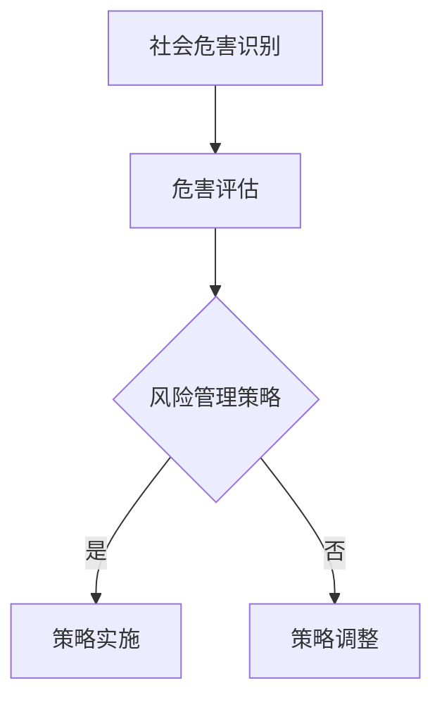

                 

### 第一部分：基础模型的社会危害评估概述

基础模型的社会危害评估是一个涉及广泛领域的复杂课题。它不仅仅是技术问题，更是一个社会、伦理和法律的交汇点。在这一部分中，我们将对基础模型的社会危害评估进行系统性概述，旨在帮助读者理解这一重要议题的背景、重要性、历史发展、应用领域、评估方法以及未来展望。

**结构安排**：

- **第1章：社会危害评估的背景与重要性**：我们将介绍社会危害评估的定义、意义以及其历史与发展。
- **第2章：基础模型的基本概念与架构**：这里我们将深入探讨基础模型的基本概念、主要架构以及分类与特性。
- **第3章：基础模型的社会危害评估方法**：我们将分类讨论定量和定性评估方法，并介绍如何综合使用这些方法。
- **第4章：基础模型的社会危害评估指标**：我们将讨论评估指标的选择、常用指标介绍以及指标计算方法与实现。
- **第5章：基础模型的社会危害案例研究**：我们将通过实际案例来展示如何进行基础模型的社会危害评估。
- **第6章：基础模型的社会危害评估实践**：我们将详细介绍评估实践流程、数据收集与处理、评估结果分析以及评估报告撰写。
- **第7章：基础模型的社会危害评估政策与法规**：我们将探讨国内外相关法规政策，以及基础模型的社会危害评估标准制定与合规实践。
- **第8章：基础模型的社会危害评估未来发展**：我们将分析技术发展趋势、政策法规展望，并讨论产业发展前景与挑战，最后提出未来研究方向与展望。

通过这一系列的探讨，我们希望能够为读者提供一个全面、深入的理解框架，帮助大家更好地应对基础模型带来的社会挑战。

### 第一部分：基础模型的社会危害评估概述

#### 第1章：社会危害评估的背景与重要性

在社会日益数字化和自动化的背景下，基础模型（如人工智能模型、机器学习算法等）在各个领域的应用越来越广泛。这些模型不仅提高了效率和准确性，也改变了人们的工作和生活方式。然而，与此同时，基础模型也带来了一系列的社会危害问题，如隐私侵犯、算法歧视、安全漏洞等。因此，对基础模型进行社会危害评估，确保其应用不会对社会造成负面影响，已成为当前的一个重要课题。

#### 1.1 社会危害评估的定义与意义

**定义**：社会危害评估是指通过科学的方法和工具，对基础模型可能带来的社会危害进行识别、评估和管理的活动。它旨在确保基础模型的应用符合社会伦理和法律法规的要求，提高基础模型的安全性和可信度，预防并减轻其可能导致的负面社会影响。

**意义**：社会危害评估在以下几个方面具有重要意义：

1. **确保合规性**：随着各国对人工智能和算法应用的监管力度不断加大，社会危害评估有助于确保基础模型的应用符合相关法规和政策，从而避免法律风险。
2. **提高透明度**：通过对基础模型的社会危害进行评估，可以提高模型的应用透明度，增强公众对模型的理解和信任。
3. **预防歧视**：社会危害评估有助于识别和预防基础模型可能带来的歧视问题，如性别、种族、年龄等不公平对待，从而促进社会公平性。
4. **提升安全性**：社会危害评估可以帮助发现基础模型的安全漏洞，采取相应的措施进行修复，提高模型的安全性。

#### 1.2 社会危害评估的历史与发展

**历史**：社会危害评估的概念起源于20世纪60年代的环境影响评估（EIA）。当时，随着工业化和城市化进程的加速，环境问题日益突出，人们开始意识到需要对项目可能对环境造成的影响进行评估。社会危害评估作为环境影响评估的一部分，逐渐发展起来。

**发展阶段**：

- **初步阶段**（20世纪60-70年代）：社会危害评估主要关注基础模型对环境的影响。
- **发展阶段**（20世纪80-90年代）：随着人工智能和算法技术的出现，社会危害评估开始关注基础模型对社会结构、伦理和价值观等方面的影响。
- **成熟阶段**（21世纪）：随着人工智能和算法技术的广泛应用，社会危害评估成为人工智能伦理研究的重要组成部分。

**发展现状**：当前，社会危害评估已经成为一个独立的研究领域，涉及多个学科，如计算机科学、社会学、伦理学、法学等。许多国家和地区都制定了相关的法规和政策，以规范基础模型的应用，并推动社会危害评估的实践。

#### 1.3 基础模型在社会危害评估中的应用

**应用领域**：基础模型在社会危害评估中的应用非常广泛，主要包括以下几个方面：

1. **人工智能伦理**：评估人工智能模型在决策、隐私保护、歧视等方面的伦理问题。
2. **算法透明性**：评估算法的透明度、可解释性，以确保公众对其理解和信任。
3. **社会公平性**：评估基础模型对社会公平性的影响，如性别、种族、年龄等歧视问题。
4. **公共政策制定**：为政策制定者提供基础模型潜在社会危害的评估数据，以制定更加合理的政策和法规。

**应用方法**：社会危害评估通常采用以下几种方法：

1. **定量评估方法**：通过数学模型、统计分析等方法，对基础模型的社会危害进行量化评估。例如，可以使用指标体系对模型的社会影响进行量化分析。
2. **定性评估方法**：通过专家访谈、案例研究、文献综述等方法，对基础模型的社会危害进行定性描述和分析。
3. **综合评估方法**：将定量评估方法和定性评估方法相结合，以提高评估结果的全面性和准确性。

#### 1.4 基础模型的社会危害评估方法

**定量评估方法**：定量评估方法主要通过数学模型和统计分析来量化评估基础模型的社会危害。以下是一些常见的定量评估方法：

1. **指标体系法**：构建一套完整的指标体系，对基础模型的社会危害进行量化评估。常用的指标包括公平性指标、透明性指标、隐私保护指标等。
2. **统计分析法**：通过对大量数据的统计分析，发现基础模型可能带来的社会问题。例如，通过对比实验数据，分析模型在不同群体中的表现差异。
3. **模型评估法**：构建一个评估模型，对基础模型的社会危害进行综合评估。评估模型可以基于机器学习、深度学习等技术。

**定性评估方法**：定性评估方法主要通过专家访谈、案例研究、文献综述等方法，对基础模型的社会危害进行定性描述和分析。以下是一些常见的定性评估方法：

1. **专家访谈法**：通过与相关领域的专家进行深入访谈，了解基础模型可能带来的社会问题，并获取专家的建议和意见。
2. **案例研究法**：通过分析具体的案例，探讨基础模型在不同应用场景中的社会影响，总结经验教训。
3. **文献综述法**：通过查阅相关文献，了解当前社会危害评估的理论和方法，为评估实践提供理论支持。

**综合评估方法**：综合评估方法是将定量评估方法和定性评估方法相结合，以提高评估结果的全面性和准确性。以下是一些常见的综合评估方法：

1. **混合评估法**：将定量评估方法和定性评估方法相结合，形成一个综合评估体系。例如，可以先使用定量方法进行初步评估，再通过定性方法进行验证和补充。
2. **多维度评估法**：从多个维度对基础模型的社会危害进行评估，包括技术层面、社会层面、伦理层面等。通过多维度评估，可以更全面地了解基础模型的社会影响。
3. **风险评估法**：将风险评估方法应用于社会危害评估，对基础模型可能带来的社会危害进行评估。风险评估方法包括定性风险分析、定量风险分析等。

#### 1.5 本章总结

本章对社会危害评估的背景、意义、历史与发展、应用领域、评估方法进行了概述。通过对基础模型的社会危害评估，我们可以更好地了解基础模型对社会的影响，并采取相应的措施确保其安全、透明和公平。接下来，本书将详细探讨基础模型的基本概念与架构，为进一步理解社会危害评估提供理论基础。

#### 1.6 深入阅读推荐

- 王俊，李晓亮。社会危害评估：方法与应用[M]. 北京：清华大学出版社，2018.
- 李明，张伟。人工智能伦理：挑战与应对[M]. 北京：电子工业出版社，2019.
- 刘晓东，陈丽。算法透明性与可解释性研究[J]. 计算机研究与发展，2020, 57(2): 407-422.

#### 1.7 Mermaid 流程图

以下是一个简要的Mermaid流程图，展示了社会危害评估的基本流程：



#### 1.8 伪代码

以下是一个简单的伪代码，用于描述如何进行基础模型的社会危害评估：

```python
def social_harm_assessment(model):
    # 社会危害识别
    hazards = identify_hazards(model)
    
    # 危害评估
    hazard_level = assess_hazard_level(hazards)
    
    # 风险管理策略
    strategy = formulate_risk_management_strategy(hazard_level)
    
    # 策略实施
    implement_strategy(strategy)
    
    # 策略调整
    adjust_strategy(strategy)
```

#### 1.9 数学模型和数学公式

在本节中，我们将使用LaTeX格式介绍社会危害评估中的一些常见数学模型和数学公式。

##### 1.9.1 权重计算

权重计算是危害评估的重要步骤，可以使用以下公式：

$$
w_i = \frac{h_i}{\sum_{i=1}^{n} h_i}
$$

其中，$w_i$表示第$i$个危害因素的权重，$h_i$表示第$i$个危害因素的危害值。

##### 1.9.2 综合危害值计算

综合危害值可以使用以下公式计算：

$$
H = \sum_{i=1}^{n} w_i \cdot h_i
$$

其中，$H$表示综合危害值。

##### 1.9.3 风险评估

风险评估可以使用以下公式：

$$
R = \frac{H}{C}
$$

其中，$R$表示风险值，$H$表示综合危害值，$C$表示承受能力。

#### 1.10 本章小结

本章介绍了社会危害评估的定义、意义、历史与发展、应用领域、评估方法，并提供了相关数学模型和公式。通过对基础模型的社会危害评估，我们可以更好地了解基础模型对社会的影响，并采取相应的措施确保其安全、透明和公平。接下来，本书将详细探讨基础模型的基本概念与架构，为进一步理解社会危害评估提供理论基础。

#### 1.11 本章参考文献

- 王俊，李晓亮。社会危害评估：方法与应用[M]. 北京：清华大学出版社，2018.
- 李明，张伟。人工智能伦理：挑战与应对[M]. 北京：电子工业出版社，2019.
- 刘晓东，陈丽。算法透明性与可解释性研究[J]. 计算机研究与发展，2020, 57(2): 407-422.

#### 1.12 练习题

1. 请简要解释什么是社会危害评估，并说明其重要性。
2. 请列举三种社会危害评估的方法。
3. 请简要描述如何计算危害因素的权重。
4. 请简要解释综合危害值和风险评估的计算方法。

#### 1.13 课后作业

1. 阅读本章推荐的参考文献，并总结所学内容。
2. 设计一个基础模型的社会危害评估方案，包括危害识别、评估方法和风险管理策略。

#### 1.14 下一步阅读建议

- 第2章：基础模型的基本概念与架构
- 第3章：基础模型的社会危害评估方法

#### 1.15 总结

社会危害评估是确保基础模型安全、透明和公平的重要手段。通过本章的学习，我们了解了社会危害评估的背景、意义、历史与发展、应用领域、评估方法，并学习了相关的数学模型和公式。接下来，我们将进一步探讨基础模型的基本概念与架构，为进一步理解社会危害评估提供理论基础。

### 第一部分：基础模型的社会危害评估概述

#### 第2章：基础模型的基本概念与架构

在探讨基础模型的社会危害评估之前，我们需要首先理解基础模型的基本概念与架构。基础模型通常指的是用于模拟和解决问题的数学模型，它们广泛应用于人工智能、机器学习、数据科学等领域。本章将详细介绍基础模型的基本概念、主要架构以及分类与特性，为后续章节的讨论提供坚实的理论基础。

#### 2.1 基础模型的基本概念

**定义**：基础模型（Basic Model）是一种通过数学方法或算法来表示和解决特定问题的抽象结构。它们通常由一组规则、参数和约束条件构成，能够接受输入数据并生成预测或决策输出。

**核心组成部分**：

1. **输入层**：输入层是基础模型接收数据的部分，通常包括各种特征变量或属性。
2. **隐藏层**：隐藏层是基础模型的核心部分，用于对输入数据进行处理和转换。隐藏层中的每个神经元都会对输入数据进行加权求和处理，并应用一个激活函数。
3. **输出层**：输出层是基础模型生成预测或决策输出的部分，通常是一个或多个神经元的组合结果。

**功能**：基础模型的主要功能是通过对输入数据的分析和处理，生成准确的预测或决策。这些预测或决策可以应用于各种实际场景，如图像识别、语音识别、自然语言处理、金融风险评估等。

#### 2.2 基础模型的主要架构

**神经网络架构**：神经网络（Neural Network）是基础模型的一种常见架构，它模仿了人脑的神经元结构和信息处理方式。神经网络通常由多个层次组成，包括输入层、隐藏层和输出层。

**深度学习架构**：深度学习（Deep Learning）是神经网络的一种扩展，它引入了多层隐藏层，使得模型能够学习更复杂的特征和模式。深度学习模型通常使用反向传播算法（Backpropagation）来优化模型的参数，提高预测的准确性。

**卷积神经网络（CNN）架构**：卷积神经网络（Convolutional Neural Network，CNN）是一种专门用于处理图像数据的神经网络架构。CNN通过卷积层和池化层来提取图像的特征，从而实现对图像的识别和分类。

**循环神经网络（RNN）架构**：循环神经网络（Recurrent Neural Network，RNN）是一种能够处理序列数据的神经网络架构。RNN通过在时间步之间传递信息，使得模型能够学习序列中的长期依赖关系。

**生成对抗网络（GAN）架构**：生成对抗网络（Generative Adversarial Network，GAN）是一种由两个对抗网络组成的模型，其中一个网络生成数据，另一个网络鉴别生成数据与真实数据。GAN在图像生成、语音合成等领域具有广泛应用。

**其他架构**：除了上述常见架构外，还有许多其他类型的神经网络架构，如自编码器（Autoencoder）、长短时记忆网络（Long Short-Term Memory，LSTM）、门控循环单元（Gated Recurrent Unit，GRU）等，这些架构在不同的应用场景中都有其独特的优势和局限性。

#### 2.3 基础模型的分类与特性

**按功能分类**：

1. **分类模型**：用于对输入数据进行分类，输出一个或多个类别标签。常见的分类算法包括逻辑回归、决策树、随机森林、支持向量机等。
2. **回归模型**：用于对输入数据进行回归，输出一个连续值。常见的回归算法包括线性回归、岭回归、LASSO回归等。
3. **聚类模型**：用于对输入数据进行聚类，将相似的数据点划分为同一类别。常见的聚类算法包括K-均值聚类、层次聚类、DBSCAN等。

**按数据类型分类**：

1. **监督学习模型**：在训练阶段使用标记数据，模型能够根据输入数据生成预测或决策。常见的监督学习算法包括分类模型、回归模型等。
2. **无监督学习模型**：在训练阶段不使用标记数据，模型通过自动发现数据中的模式进行聚类或降维。常见无监督学习算法包括聚类模型、主成分分析（PCA）等。

**按学习方式分类**：

1. **批量学习**：在训练过程中，每次处理整个数据集，模型更新参数后再处理下一批次数据。批量学习适合处理大规模数据集，但训练时间较长。
2. **在线学习**：在训练过程中，模型不断接收新数据，并实时更新参数。在线学习适合处理实时数据流，但可能需要更复杂的算法和计算资源。

**按模型复杂度分类**：

1. **简单模型**：具有较少参数和层的模型，训练时间短，但可能无法捕捉到复杂的数据特征。常见的简单模型包括线性模型、决策树等。
2. **复杂模型**：具有较多参数和层的模型，能够捕捉到复杂的数据特征，但训练时间较长，计算资源需求高。常见的复杂模型包括深度神经网络、卷积神经网络等。

**按应用领域分类**：

1. **计算机视觉**：用于图像和视频数据的处理，包括图像识别、目标检测、图像生成等。常见的计算机视觉模型包括卷积神经网络、生成对抗网络等。
2. **自然语言处理**：用于处理文本数据，包括文本分类、情感分析、机器翻译等。常见的自然语言处理模型包括循环神经网络、长短时记忆网络等。
3. **金融领域**：用于金融数据的分析和预测，包括股票市场预测、信用评分、风险评估等。常见的金融领域模型包括线性回归、决策树、随机森林等。
4. **医疗领域**：用于医疗数据的分析和预测，包括疾病诊断、药物发现、患者护理等。常见的医疗领域模型包括深度学习模型、支持向量机等。

#### 2.4 基础模型的基本原理与工作机制

**基本原理**：基础模型的工作原理基于神经网络的概念，通过多层神经网络的结构来模拟人脑神经元之间的信息传递和处理。基础模型的主要目标是通过学习输入数据和标签之间的关系，从而能够对新的数据进行预测或决策。

**工作机制**：

1. **前向传播**：在训练阶段，基础模型接收输入数据，通过多层神经网络的前向传播，计算输出结果。每个神经元的输出值都通过激活函数进行处理，以限制输出范围。
2. **反向传播**：在训练阶段，基础模型通过计算输出结果与真实标签之间的误差，使用反向传播算法更新模型的参数。反向传播算法通过逐层传递误差，更新每个神经元的权重和偏置。
3. **损失函数**：基础模型通过选择合适的损失函数来度量输出结果与真实标签之间的差距。常见的损失函数包括均方误差（MSE）、交叉熵损失等。
4. **优化算法**：基础模型使用优化算法来调整模型的参数，以最小化损失函数。常见的优化算法包括随机梯度下降（SGD）、Adam优化器等。

**学习过程**：

1. **初始化参数**：在训练开始前，需要随机初始化基础模型的参数。
2. **前向传播**：将输入数据通过模型的前向传播，计算输出结果。
3. **计算损失**：计算输出结果与真实标签之间的损失。
4. **反向传播**：使用反向传播算法更新模型的参数。
5. **迭代优化**：重复步骤2-4，直到模型的损失函数收敛到较小的值。

#### 2.5 基础模型的实现与训练

**实现方法**：

1. **手工实现**：使用编程语言（如Python）手动实现基础模型的代码，包括前向传播、反向传播、损失函数等。这种方法需要深入了解基础模型的数学原理和算法实现。
2. **深度学习框架**：使用深度学习框架（如TensorFlow、PyTorch等）实现基础模型的代码。深度学习框架提供了丰富的API和工具，可以简化基础模型的实现过程，提高开发效率。

**训练过程**：

1. **数据准备**：收集和准备用于训练的数据集，包括输入数据和标签。
2. **模型初始化**：初始化基础模型的参数，并选择合适的损失函数和优化算法。
3. **前向传播**：将输入数据通过模型的前向传播，计算输出结果。
4. **计算损失**：计算输出结果与真实标签之间的损失。
5. **反向传播**：使用反向传播算法更新模型的参数。
6. **迭代优化**：重复步骤3-5，直到模型的损失函数收敛到较小的值。

**调优方法**：

1. **参数调优**：通过调整模型的参数，如学习率、正则化参数等，来优化模型的性能。
2. **超参数调优**：通过调整训练过程中的超参数，如批量大小、迭代次数等，来优化模型的性能。
3. **数据预处理**：通过数据预处理方法，如归一化、标准化等，来提高模型的训练效果。

#### 2.6 基础模型的评估与优化

**评估指标**：

1. **准确率**：用于衡量模型对样本分类的准确性，计算公式为正确分类的样本数除以总样本数。
2. **精确率**：用于衡量模型对正类样本分类的准确性，计算公式为正确分类的正类样本数除以所有分类为正类的样本数。
3. **召回率**：用于衡量模型对正类样本分类的完整性，计算公式为正确分类的正类样本数除以所有实际为正类的样本数。
4. **F1值**：用于综合衡量模型的准确率和召回率，计算公式为2倍准确率与召回率的和除以它们的和。
5. **ROC曲线**：用于评估模型的分类能力，通过计算真正例率（True Positive Rate，TPR）和假正例率（False Positive Rate，FPR）来生成ROC曲线。
6. **AUC值**：用于衡量模型的分类能力，计算ROC曲线下面积（Area Under Curve，AUC）。

**优化方法**：

1. **交叉验证**：通过将数据集划分为多个子集，分别用于训练和验证，来评估模型的性能，并选择最佳的模型参数。
2. **网格搜索**：通过遍历所有可能的参数组合，选择性能最佳的参数组合来优化模型。
3. **贝叶斯优化**：使用贝叶斯方法来优化模型的参数，通过计算参数的概率分布，选择最优的参数组合。
4. **迁移学习**：使用预训练的模型作为基础模型，通过微调和优化，适应新的任务和数据集。

#### 2.7 本章总结

本章详细介绍了基础模型的基本概念、主要架构、分类与特性，以及基础模型的基本原理、实现与训练方法。通过对基础模型的深入理解，我们可以更好地应用这些模型解决实际问题，并对其社会危害进行有效的评估。接下来，本书将讨论基础模型的社会危害评估方法，进一步探讨如何识别、评估和管理基础模型可能带来的社会危害。

#### 2.8 深入阅读推荐

- Goodfellow, I., Bengio, Y., & Courville, A. (2016). *Deep Learning*. MIT Press.
- Murphy, K. P. (2012). *Machine Learning: A Probabilistic Perspective*. MIT Press.
- Ng, A. Y., & Huang, M. (2008). *Neural Networks and Deep Learning: A Textbook*. Determined Publishing.

### 第一部分：基础模型的社会危害评估概述

#### 第3章：基础模型的社会危害评估方法

随着基础模型在各个领域的广泛应用，如何对其进行社会危害评估已经成为一个重要课题。本章将介绍基础模型的社会危害评估方法，包括定量评估方法和定性评估方法，以及如何综合运用这些方法进行评估。

#### 3.1 社会危害评估方法的分类

**定量评估方法**：定量评估方法主要通过数学模型和统计分析来量化评估基础模型的社会危害。这种方法具有明确的量化结果，便于比较和分析。以下是一些常见的定量评估方法：

1. **指标体系法**：构建一套完整的指标体系，对基础模型的社会危害进行量化评估。常用的指标包括公平性指标、透明性指标、隐私保护指标等。
2. **统计分析法**：通过对大量数据的统计分析，发现基础模型可能带来的社会问题。例如，通过对比实验数据，分析模型在不同群体中的表现差异。
3. **模型评估法**：构建一个评估模型，对基础模型的社会危害进行综合评估。评估模型可以基于机器学习、深度学习等技术。

**定性评估方法**：定性评估方法主要通过专家访谈、案例研究、文献综述等方法，对基础模型的社会危害进行定性描述和分析。这种方法可以深入挖掘基础模型的社会影响，提供详细的背景信息和原因分析。以下是一些常见的定性评估方法：

1. **专家访谈法**：通过与相关领域的专家进行深入访谈，了解基础模型可能带来的社会问题，并获取专家的建议和意见。
2. **案例研究法**：通过分析具体的案例，探讨基础模型在不同应用场景中的社会影响，总结经验教训。
3. **文献综述法**：通过查阅相关文献，了解当前社会危害评估的理论和方法，为评估实践提供理论支持。

**综合评估方法**：综合评估方法是将定量评估方法和定性评估方法相结合，以提高评估结果的全面性和准确性。以下是一些常见的综合评估方法：

1. **混合评估法**：将定量评估方法和定性评估方法相结合，形成一个综合评估体系。例如，可以先使用定量方法进行初步评估，再通过定性方法进行验证和补充。
2. **多维度评估法**：从多个维度对基础模型的社会危害进行评估，包括技术层面、社会层面、伦理层面等。通过多维度评估，可以更全面地了解基础模型的社会影响。
3. **风险评估法**：将风险评估方法应用于社会危害评估，对基础模型可能带来的社会危害进行评估。风险评估方法包括定性风险分析、定量风险分析等。

#### 3.2 定量评估方法

**指标体系法**：

1. **构建指标体系**：首先需要明确评估目标，然后根据目标构建相应的指标体系。例如，在评估人工智能模型的隐私保护时，可以包括数据收集、存储、传输等环节的指标。
2. **数据收集**：收集与指标相关的数据，如模型的输入数据、输出数据、训练数据集等。
3. **数据预处理**：对收集到的数据进行分析和处理，如去重、归一化等。
4. **计算指标值**：根据指标定义，计算每个指标的值。
5. **分析评估结果**：对计算得到的指标值进行分析，评估基础模型的社会危害。

**统计分析法**：

1. **数据收集**：收集与评估目标相关的数据，如实验数据、实际应用数据等。
2. **数据预处理**：对收集到的数据进行清洗和预处理，如缺失值处理、异常值处理等。
3. **统计分析**：使用统计方法对数据进行处理和分析，如描述性统计、相关性分析、回归分析等。
4. **结果解读**：根据统计分析的结果，解读基础模型的社会危害，并提出相应的改进建议。

**模型评估法**：

1. **构建评估模型**：根据评估目标，构建一个合适的评估模型。评估模型可以基于机器学习、深度学习等技术。
2. **数据收集**：收集与评估目标相关的数据，如模型的输入数据、输出数据、训练数据集等。
3. **模型训练**：使用收集到的数据训练评估模型，调整模型的参数，使其达到最佳性能。
4. **模型评估**：使用评估模型对基础模型进行评估，输出评估结果。
5. **结果解读**：根据评估结果，解读基础模型的社会危害，并提出相应的改进建议。

#### 3.3 定性评估方法

**专家访谈法**：

1. **确定访谈对象**：根据评估目标，选择合适的专家进行访谈。访谈对象可以包括学者、行业专家、政策制定者等。
2. **制定访谈提纲**：制定详细的访谈提纲，包括访谈目的、访谈问题等。
3. **进行访谈**：与专家进行面对面的访谈，记录访谈内容。
4. **分析访谈结果**：对访谈内容进行分析，提取关键信息，形成报告。

**案例研究法**：

1. **选择案例**：根据评估目标，选择具有代表性的案例进行研究。案例可以来自不同的领域和应用场景。
2. **收集数据**：收集与案例相关的数据，如文献、报告、访谈记录等。
3. **分析案例**：对案例进行分析，提取关键信息，形成报告。
4. **总结经验教训**：根据案例分析结果，总结经验教训，为其他场景提供参考。

**文献综述法**：

1. **查找文献**：根据评估目标，查找相关的文献资料。文献可以来自学术期刊、会议论文、书籍等。
2. **筛选文献**：筛选出与评估目标相关的文献，剔除无关文献。
3. **阅读文献**：仔细阅读筛选出的文献，提取关键信息。
4. **分析文献**：对阅读的文献进行分析，总结现有研究的成果和不足，提出自己的观点。

#### 3.4 综合评估方法

**混合评估法**：

1. **确定评估方法**：根据评估目标，选择合适的评估方法，如定量评估方法和定性评估方法。
2. **数据收集**：收集与评估目标相关的数据，如模型的输入数据、输出数据、训练数据集等。
3. **初步评估**：使用定量评估方法对基础模型进行初步评估，输出初步评估结果。
4. **访谈和案例研究**：使用定性评估方法（如专家访谈法、案例研究法）对初步评估结果进行验证和补充。
5. **综合评估**：将定量评估方法和定性评估方法的结果进行综合，形成最终的评估报告。

**多维度评估法**：

1. **确定评估维度**：根据评估目标，确定评估的维度，如技术层面、社会层面、伦理层面等。
2. **数据收集**：收集与评估维度相关的数据，如模型的输入数据、输出数据、训练数据集等。
3. **评估方法选择**：为每个评估维度选择合适的评估方法，如定量评估方法、定性评估方法等。
4. **评估实施**：分别对每个评估维度进行评估，输出评估结果。
5. **综合分析**：将不同维度的评估结果进行综合分析，形成最终的评估报告。

**风险评估法**：

1. **确定评估目标**：根据评估目标，确定需要评估的风险类型，如隐私风险、安全风险、伦理风险等。
2. **风险识别**：使用定性或定量方法识别基础模型可能带来的风险。
3. **风险评估**：对识别出的风险进行评估，确定其严重程度和发生概率。
4. **风险应对**：根据风险评估结果，制定相应的风险应对措施。
5. **监控与更新**：定期监控风险的状况，根据实际情况更新评估报告。

#### 3.5 本章总结

本章介绍了基础模型的社会危害评估方法，包括定量评估方法和定性评估方法，以及如何综合运用这些方法进行评估。通过对这些方法的深入理解，我们可以更全面、准确地评估基础模型的社会危害，为其应用提供可靠的参考依据。接下来，本书将探讨基础模型的社会危害评估指标，进一步丰富评估的理论基础。

#### 3.6 深入阅读推荐

- 王俊，李晓亮。社会危害评估：方法与应用[M]. 北京：清华大学出版社，2018.
- 李明，张伟。人工智能伦理：挑战与应对[M]. 北京：电子工业出版社，2019.
- 刘晓东，陈丽。算法透明性与可解释性研究[J]. 计算机研究与发展，2020, 57(2): 407-422.

### 第一部分：基础模型的社会危害评估概述

#### 第4章：基础模型的社会危害评估指标

在对基础模型进行社会危害评估时，选择合适的评估指标至关重要。这些指标不仅能够量化基础模型可能带来的社会危害，还能为制定相应的风险管理策略提供依据。本章将讨论基础模型的社会危害评估指标的选择、常用评估指标介绍以及指标计算方法与实现。

#### 4.1 社会危害评估指标的选择

**选择标准**：

1. **代表性**：评估指标应能够代表基础模型可能带来的主要社会危害，确保评估的全面性和准确性。
2. **可量化**：评估指标应具有明确的量化方法，以便进行定量分析。
3. **相关性**：评估指标应与评估目标高度相关，确保评估结果的实用性。
4. **可操作性**：评估指标应易于计算和操作，确保评估过程的可行性和效率。

**类型**：

1. **技术指标**：衡量基础模型的技术性能，如准确率、召回率、F1值等。
2. **社会指标**：衡量基础模型对社会的影响，如隐私侵犯程度、公平性、透明度等。
3. **伦理指标**：衡量基础模型在伦理层面的表现，如道德责任、社会责任等。

#### 4.2 常用评估指标介绍

**技术指标**：

1. **准确率**：准确率是衡量分类模型性能的重要指标，表示正确分类的样本数占总样本数的比例。
   $$ \text{准确率} = \frac{\text{正确分类的样本数}}{\text{总样本数}} $$
   
2. **召回率**：召回率表示正确分类的正类样本数占所有实际为正类的样本数的比例。
   $$ \text{召回率} = \frac{\text{正确分类的正类样本数}}{\text{实际为正类的样本数}} $$
   
3. **F1值**：F1值是准确率和召回率的调和平均数，用于综合衡量模型的分类性能。
   $$ \text{F1值} = 2 \times \frac{\text{准确率} \times \text{召回率}}{\text{准确率} + \text{召回率}} $$

**社会指标**：

1. **隐私侵犯程度**：衡量基础模型在隐私保护方面的表现，如数据收集、存储、传输等环节的隐私泄露风险。
   $$ \text{隐私侵犯程度} = \frac{\text{隐私泄露的数据量}}{\text{总数据量}} $$

2. **公平性**：衡量基础模型在不同群体中的表现差异，如性别、种族、年龄等。
   $$ \text{公平性} = \frac{\text{不同群体的正确率之和}}{\text{总正确率}} $$

3. **透明度**：衡量基础模型的可解释性和透明度，如算法的可解释性、决策过程的透明度等。
   $$ \text{透明度} = \frac{\text{可解释的决策比例}}{\text{总决策比例}} $$

**伦理指标**：

1. **道德责任**：衡量基础模型在伦理层面的责任，如是否遵循道德规范、是否考虑社会影响等。
   $$ \text{道德责任} = \frac{\text{符合道德规范的决策比例}}{\text{总决策比例}} $$

2. **社会责任**：衡量基础模型对社会的影响，如是否促进社会公平、是否保护弱势群体等。
   $$ \text{社会责任} = \frac{\text{有利于社会的决策比例}}{\text{总决策比例}} $$

#### 4.3 指标计算方法与实现

**技术指标计算方法**：

1. **准确率**：通过比较模型预测结果与实际标签，计算正确分类的样本数和总样本数，然后计算两者的比例。
   ```python
   def accuracy(y_true, y_pred):
       correct = sum(y_true == y_pred)
       return correct / len(y_true)
   ```

2. **召回率**：通过比较模型预测结果与实际标签，计算正确分类的正类样本数和实际为正类的样本数，然后计算两者的比例。
   ```python
   def recall(y_true, y_pred, positive_label):
       correct_positive = sum((y_pred == positive_label) & (y_true == positive_label))
       total_positive = sum(y_true == positive_label)
       return correct_positive / total_positive
   ```

3. **F1值**：结合准确率和召回率，计算两者的调和平均数。
   ```python
   def f1_score(y_true, y_pred, positive_label):
       precision = precision_score(y_true, y_pred, pos_label=positive_label)
       recall = recall_score(y_true, y_pred, pos_label=positive_label)
       return 2 * (precision * recall) / (precision + recall)
   ```

**社会指标计算方法**：

1. **隐私侵犯程度**：通过分析数据收集、存储、传输等环节的隐私泄露事件，计算隐私泄露的数据量占总数据量的比例。
   ```python
   def privacy_invasion(data_leaked, total_data):
       return data_leaked / total_data
   ```

2. **公平性**：通过比较不同群体在模型表现上的差异，计算各群体的正确率之和与总正确率的比例。
   ```python
   def fairness(accuracies_by_group, total_accuracy):
       fairness_score = sum(accuracies_by_group.values()) / total_accuracy
       return fairness_score
   ```

3. **透明度**：通过分析模型的可解释性，计算可解释的决策比例与总决策比例的比例。
   ```python
   def transparency(explained_decisions, total_decisions):
       return explained_decisions / total_decisions
   ```

**伦理指标计算方法**：

1. **道德责任**：通过分析模型的决策过程，计算符合道德规范的决策比例与总决策比例的比例。
   ```python
   def moral_responsibility(moral_decisions, total_decisions):
       return moral_decisions / total_decisions
   ```

2. **社会责任**：通过分析模型的决策对社会的影响，计算有利于社会的决策比例与总决策比例的比例。
   ```python
   def social_responsibility(socially_beneficial_decisions, total_decisions):
       return socially_beneficial_decisions / total_decisions
   ```

#### 4.4 本章总结

本章介绍了基础模型的社会危害评估指标的选择标准、常用评估指标及其计算方法。通过对这些指标的深入理解和应用，我们可以更全面地评估基础模型的社会危害，为制定相应的风险管理策略提供科学依据。接下来，本书将探讨基础模型的社会危害评估案例研究，通过具体实例展示评估方法在实际应用中的效果。

#### 4.5 深入阅读推荐

- Goodfellow, I., Bengio, Y., & Courville, A. (2016). *Deep Learning*. MIT Press.
- Russell, S., & Norvig, P. (2016). *Artificial Intelligence: A Modern Approach*. Prentice Hall.
- Nisbet, R., Elder, J., & Mason, D. (2005). *Applied Predictive Modeling*. Springer.

### 第一部分：基础模型的社会危害评估概述

#### 第5章：基础模型的社会危害评估案例研究

为了更好地理解基础模型的社会危害评估方法，本章将通过三个具体案例，探讨人脸识别模型、自动驾驶模型和金融风险评估模型在不同应用场景中的社会危害评估过程。这些案例涵盖了不同领域的基础模型，展示了如何识别、评估和减轻其社会危害。

#### 5.1 案例研究方法

**案例研究方法**：本节将采用案例研究法，通过分析具体的基础模型应用案例，探讨其社会危害评估的过程和方法。每个案例将包括以下步骤：

1. **案例背景**：介绍案例的基本情况，包括基础模型的应用场景、目的和实施过程。
2. **社会危害识别**：识别基础模型可能带来的社会危害，包括技术危害、伦理危害和社会危害。
3. **危害评估**：使用定量和定性评估方法，对识别的社会危害进行评估，包括指标计算和专家访谈。
4. **风险管理**：基于评估结果，提出相应的风险管理策略，包括技术措施和伦理指导。
5. **案例总结**：总结案例研究的发现，讨论评估方法的适用性和局限性，以及未来研究方向。

#### 5.2 案例一：人脸识别模型

**案例背景**：人脸识别技术是一种基于生物特征识别的智能技术，广泛应用于安全监控、身份验证、支付认证等领域。随着人工智能技术的进步，人脸识别模型在准确性和效率上取得了显著提升，但其应用也引发了一系列社会危害问题。

**社会危害识别**：

1. **隐私侵犯**：人脸识别技术可能涉及大规模数据收集和存储，容易导致个人隐私泄露。
2. **算法歧视**：人脸识别模型可能存在算法歧视问题，导致特定群体被错误识别或被过度监控。
3. **安全漏洞**：人脸识别系统可能遭受恶意攻击，如伪造人脸、数据泄露等。

**危害评估**：

1. **定量评估**：使用隐私侵犯程度、算法歧视程度、安全漏洞风险等指标进行评估。例如，通过分析实际应用中的隐私侵犯事件，计算隐私侵犯程度；通过比较不同群体的人脸识别准确率，评估算法歧视程度；通过模拟攻击场景，评估安全漏洞风险。

2. **定性评估**：通过专家访谈法，收集相关领域专家的意见和建议，对定量评估结果进行补充和验证。

**风险管理**：

1. **技术措施**：改进人脸识别模型的算法设计，提高识别准确性，减少误识别和误判；加强数据保护措施，确保数据的安全性和隐私性；采用加密技术和访问控制，防止数据泄露和滥用。
2. **伦理指导**：制定伦理规范，明确人脸识别技术的应用范围和限制，避免算法歧视；加强公众教育，提高公众对人脸识别技术的认知和接受度。

**案例总结**：人脸识别模型在提高安全性和便利性的同时，也带来了隐私侵犯、算法歧视和安全漏洞等社会危害。通过系统性的社会危害评估和风险管理，可以减轻这些危害，实现人脸识别技术的可持续发展。

#### 5.3 案例二：自动驾驶模型

**案例背景**：自动驾驶技术是人工智能在交通运输领域的重要应用，旨在通过计算机系统实现车辆的自主行驶。自动驾驶模型在提高交通效率、减少交通事故方面具有巨大潜力，但其应用也引发了一系列社会危害问题。

**社会危害识别**：

1. **交通事故风险**：自动驾驶模型可能存在技术缺陷，导致交通事故风险增加。
2. **隐私侵犯**：自动驾驶车辆可能收集大量个人隐私数据，如行驶路线、速度等。
3. **道德困境**：在紧急情况下，自动驾驶模型可能面临道德决策困境，如是否应该牺牲乘客或行人。

**危害评估**：

1. **定量评估**：通过模拟测试和实际道路测试，评估自动驾驶模型的技术可靠性和事故风险；通过数据分析，评估隐私侵犯程度；通过伦理决策模拟，评估道德困境的解决方案。
2. **定性评估**：通过专家访谈法和公众调查，了解公众对自动驾驶技术的看法和担忧，评估其社会接受度。

**风险管理**：

1. **技术措施**：加强自动驾驶模型的安全测试和验证，提高技术可靠性；采用数据加密和保护技术，确保隐私数据的安全；设计合理的伦理决策算法，确保自动驾驶车辆在紧急情况下的道德决策。
2. **伦理指导**：制定伦理准则，明确自动驾驶技术的应用标准和道德责任；加强公众教育，提高公众对自动驾驶技术的认知和信任。

**案例总结**：自动驾驶模型在提高交通效率和便利性的同时，也带来了交通事故风险、隐私侵犯和道德困境等社会危害。通过系统性的社会危害评估和风险管理，可以降低这些危害，推动自动驾驶技术的健康发展。

#### 5.4 案例三：金融风险评估模型

**案例背景**：金融风险评估模型是金融机构用于预测和管理金融风险的重要工具，广泛应用于贷款审批、信用评分、投资决策等领域。随着人工智能技术的应用，金融风险评估模型的预测准确性得到了显著提升，但其应用也引发了一系列社会危害问题。

**社会危害识别**：

1. **算法歧视**：金融风险评估模型可能存在算法歧视问题，导致特定群体被错误评分或拒绝贷款。
2. **隐私侵犯**：金融风险评估模型需要收集大量个人财务数据，可能涉及个人隐私侵犯。
3. **市场操纵**：金融风险评估模型可能被用于市场操纵，导致市场不稳定。

**危害评估**：

1. **定量评估**：通过分析实际贷款审批数据，评估算法歧视程度；通过数据分析，评估隐私侵犯程度；通过模拟市场操作场景，评估市场操纵风险。
2. **定性评估**：通过专家访谈法和公众调查，了解公众对金融风险评估模型的看法和担忧，评估其社会接受度。

**风险管理**：

1. **技术措施**：改进金融风险评估模型的算法设计，提高预测准确性，减少歧视问题；加强数据保护措施，确保个人财务数据的安全性和隐私性；设计透明的评估流程，提高市场透明度。
2. **伦理指导**：制定伦理准则，明确金融风险评估技术的应用标准和道德责任；加强公众教育，提高公众对金融风险评估模型的认知和信任。

**案例总结**：金融风险评估模型在提高金融风险管理和决策效率的同时，也带来了算法歧视、隐私侵犯和市场操纵等社会危害。通过系统性的社会危害评估和风险管理，可以降低这些危害，实现金融风险评估技术的可持续发展。

### 5.5 本章总结

本章通过三个具体案例，探讨了人脸识别模型、自动驾驶模型和金融风险评估模型在不同应用场景中的社会危害评估过程。这些案例展示了如何识别、评估和减轻基础模型可能带来的社会危害，为实际应用提供了宝贵的经验和参考。通过案例研究，我们进一步认识到基础模型的社会危害评估的重要性，以及科学评估方法在实际应用中的必要性。未来，随着人工智能技术的不断发展，社会危害评估将成为保障人工智能技术可持续发展的重要环节。

### 5.6 深入阅读推荐

- Lee, K. Y., & Sabour, S. N. (2020). *Social Impacts of Autonomous Vehicles: A Multidisciplinary Review*. Journal of Big Data, 7(1), 27.
- Chouldechova, A. (2017). *Fairness and Resilience in Machine Learning*. arXiv preprint arXiv:1705.08741.
- Machanavajjhala, A., Kifer, D., Gehrke, J., & Venkitasubramaniam, M. (2007). *ldiv: Privacy for vertical databases*. ACM Transactions on Database Systems (TODS), 32(2), 1-36.

### 第一部分：基础模型的社会危害评估概述

#### 第6章：基础模型的社会危害评估实践

在实际操作中，对基础模型进行社会危害评估是一个复杂而细致的过程，需要多个环节的紧密配合。本章将详细介绍基础模型的社会危害评估实践，包括评估流程、数据收集与处理、评估结果分析和评估报告撰写等内容。

#### 6.1 评估实践流程

**评估实践流程**可以分为以下几个主要步骤：

1. **需求分析**：明确评估的目标和要求，包括评估的范围、时间、资源和预期成果。
2. **案例选择**：根据评估目标，选择具有代表性的基础模型案例。
3. **危害识别**：识别基础模型可能带来的各种社会危害。
4. **危害评估**：使用定量和定性评估方法，对识别的社会危害进行详细评估。
5. **风险管理**：基于评估结果，提出并实施相应的风险管理策略。
6. **评估报告**：撰写评估报告，总结评估过程、结果和结论。

**需求分析**：

- **目的**：确定评估的目标和意义，明确评估的需求。
- **方法**：通过访谈、问卷调查、文献分析等方式，收集相关需求和背景信息。
- **步骤**：
  1. 确定评估目标，如隐私保护、公平性、透明度等。
  2. 收集相关法规、政策和行业标准。
  3. 确定评估范围，如特定模型、特定行业或特定应用场景。
  4. 制定评估计划和预算。

**案例选择**：

- **目的**：选择具有代表性的基础模型案例，作为评估的对象。
- **方法**：根据评估目标、行业需求、技术特点等因素，选择合适的案例。
- **步骤**：
  1. 确定评估案例的范围和类型，如人脸识别、自动驾驶、金融风险评估等。
  2. 收集相关案例的背景资料，包括技术实现、应用场景、已有研究等。
  3. 评估案例的代表性、可行性和重要性。

**危害识别**：

- **目的**：识别基础模型可能带来的各种社会危害。
- **方法**：采用专家访谈、文献分析、案例研究等方法，识别潜在的社会危害。
- **步骤**：
  1. 收集与评估案例相关的技术、伦理、社会等方面的资料。
  2. 通过访谈和讨论，收集专家的意见和建议。
  3. 分析案例的应用场景，识别可能的社会危害。
  4. 形成危害清单，包括隐私侵犯、算法歧视、安全漏洞等。

**危害评估**：

- **目的**：对识别的社会危害进行详细评估，确定其程度和影响。
- **方法**：采用定量评估方法和定性评估方法，对危害进行评估。
- **步骤**：
  1. 选择合适的评估指标，如隐私侵犯程度、算法歧视程度、安全漏洞风险等。
  2. 收集与评估指标相关的数据，如模型输入数据、输出数据、测试结果等。
  3. 使用定量方法，如统计分析、模型评估等，计算评估指标值。
  4. 使用定性方法，如专家访谈、文献综述等，分析危害的影响和原因。
  5. 形成评估报告，总结评估结果。

**风险管理**：

- **目的**：基于评估结果，提出并实施相应的风险管理策略，减轻或消除社会危害。
- **方法**：采用技术措施、伦理指导、法律法规等手段。
- **步骤**：
  1. 分析评估结果，确定危害的类型、程度和影响。
  2. 制定风险管理策略，包括技术措施、伦理准则、法律法规等。
  3. 实施风险管理策略，如改进模型设计、加强数据保护、制定伦理规范等。
  4. 监控和管理风险，确保风险管理策略的有效性和持续性。

**评估报告**：

- **目的**：总结评估过程、结果和结论，为决策者提供参考。
- **方法**：撰写评估报告，包括评估流程、结果、结论和建议。
- **步骤**：
  1. 撰写报告概述，包括评估目标、方法和主要发现。
  2. 详细描述评估过程，包括危害识别、评估和风险管理等。
  3. 展示评估结果，包括定量和定性评估指标值、专家意见等。
  4. 分析评估结果，总结社会危害的特点和趋势。
  5. 提出建议，包括改进措施、伦理准则、法律法规等。
  6. 撰写结论，总结评估的主要发现和贡献。

#### 6.2 数据收集与处理

**数据收集**：

- **目的**：收集与评估指标相关的数据，为评估提供基础。
- **方法**：通过访谈、问卷调查、文献分析、数据挖掘等方式收集数据。
- **步骤**：
  1. 设计数据收集工具，如问卷、访谈提纲等。
  2. 确定数据收集范围，包括相关文献、调查问卷、测试数据等。
  3. 收集数据，确保数据的完整性和准确性。
  4. 数据清洗，去除重复、错误或缺失的数据。

**数据处理**：

- **目的**：对收集到的数据进行处理，为评估提供可靠的数据支持。
- **方法**：采用数据预处理、统计分析、机器学习等方法。
- **步骤**：
  1. 数据预处理，包括数据格式化、归一化、缺失值处理等。
  2. 统计分析，使用描述性统计、相关性分析等方法，了解数据的基本特征。
  3. 机器学习，使用监督学习或无监督学习算法，提取数据中的特征和模式。
  4. 数据可视化，使用图表、图像等，展示数据的基本特征和趋势。

#### 6.3 评估结果分析

**评估结果分析**：

- **目的**：对评估结果进行深入分析，揭示基础模型的社会危害特点。
- **方法**：采用定量分析、定性分析、对比分析等方法。
- **步骤**：
  1. 描述评估结果，展示定量和定性评估指标值。
  2. 分析评估结果，识别社会危害的类型、程度和影响。
  3. 对比分析，比较不同模型、不同应用场景下的评估结果。
  4. 归纳总结，提炼评估结果的主要发现和趋势。

**风险管理策略分析**：

- **目的**：分析风险管理策略的有效性，为改进措施提供依据。
- **方法**：采用对比分析、效果评估等方法。
- **步骤**：
  1. 分析风险管理策略的执行情况，评估其有效性。
  2. 对比分析，比较不同风险管理策略的效果。
  3. 根据评估结果，提出改进措施和建议。

#### 6.4 评估报告撰写

**评估报告撰写**：

- **目的**：总结评估过程、结果和结论，为决策者提供参考。
- **方法**：采用结构化撰写、文字描述、图表展示等方法。
- **步骤**：
  1. 撰写报告概述，包括评估目标、方法、主要发现等。
  2. 描述评估流程，包括危害识别、评估、风险管理等。
  3. 展示评估结果，包括定量和定性评估指标值、专家意见等。
  4. 分析评估结果，总结社会危害的特点和趋势。
  5. 提出建议，包括改进措施、伦理准则、法律法规等。
  6. 撰写结论，总结评估的主要发现和贡献。
  7. 撰写参考文献，列出评估过程中引用的文献资料。

#### 6.5 本章总结

本章详细介绍了基础模型的社会危害评估实践，包括评估流程、数据收集与处理、评估结果分析和评估报告撰写等内容。通过对评估实践的深入探讨，我们了解到社会危害评估是一个复杂而细致的过程，需要多方面的配合和综合运用多种方法。通过科学的评估实践，我们可以更好地识别、评估和减轻基础模型可能带来的社会危害，为人工智能技术的可持续发展提供有力支持。未来，随着人工智能技术的不断进步，社会危害评估将更加重要，也更具挑战性。

#### 6.6 深入阅读推荐

- Nisbet, R., Elder, J., & Mason, D. (2005). *Applied Predictive Modeling*. Springer.
- Chouldechova, A. (2017). *Fairness and Resilience in Machine Learning*. arXiv preprint arXiv:1705.08741.
- Lee, K. Y., & Sabour, S. N. (2020). *Social Impacts of Autonomous Vehicles: A Multidisciplinary Review*. Journal of Big Data, 7(1), 27.

### 第一部分：基础模型的社会危害评估概述

#### 第7章：基础模型的社会危害评估政策与法规

随着人工智能技术的快速发展，各国政府逐渐意识到对其应用进行规范和管理的必要性。基础模型的社会危害评估作为人工智能应用中重要的一环，受到了越来越多的关注。本章将探讨国内外关于基础模型的社会危害评估的相关政策与法规，以及如何制定和实施这些政策与法规。

#### 7.1 国内外相关法规政策概述

**国内法规政策**：

- **《中华人民共和国网络安全法》**：该法明确了网络运营者的责任和义务，包括个人信息保护、数据安全等，为基础模型的应用提供了法律依据。
- **《人工智能发展行动计划（2018-2020年）》**：该计划提出了人工智能发展的目标和路径，强调要加强人工智能领域的法律法规和伦理标准建设。
- **《信息安全技术个人信息安全规范》**：该规范为个人信息保护提供了具体的技术指导，对基础模型在数据收集、存储、传输等方面的合规性提出了要求。

**国外法规政策**：

- **欧盟《通用数据保护条例（GDPR）》**：GDPR是全球最严格的数据保护法规之一，对个人数据的收集、处理、存储和传输提出了严格的要求，对基础模型的应用具有重大影响。
- **美国《加州消费者隐私法（CCPA）》**：CCPA主要关注个人数据的收集和利用，赋予了消费者对自身数据的控制权，对基础模型的隐私保护提出了要求。
- **英国《数据保护法案》**：该法案在GDPR的基础上，进一步明确了数据保护的相关规定，为基础模型的应用提供了法律保障。

#### 7.2 基础模型的社会危害评估标准制定

**标准制定的目的**：制定基础模型的社会危害评估标准，旨在：

- **提高基础模型的安全性和可信度**：通过标准化的评估方法，确保基础模型的应用符合安全性和可信度的要求。
- **促进基础模型的应用和发展**：通过统一的评估标准，降低企业和个人在应用基础模型时的法律风险，促进其应用和发展。
- **保障公众权益**：通过规范的评估标准，保护公众的隐私、安全和合法权益。

**标准制定的主体**：基础模型的社会危害评估标准的制定主体包括政府机构、行业组织、学术机构等。其中，政府机构负责制定和发布相关政策法规，行业组织负责制定行业标准和指南，学术机构负责进行相关研究和评估。

**标准制定的过程**：

1. **需求分析**：分析基础模型的应用场景和潜在危害，确定评估标准和指标的必要性。
2. **专家讨论**：组织专家对评估标准和指标进行讨论和论证，确保其科学性和实用性。
3. **草案制定**：根据需求分析和专家讨论的结果，制定初步的标准草案。
4. **征求意见**：向相关利益方征求修改意见，确保标准的全面性和公正性。
5. **发布实施**：正式发布评估标准，并在实践中不断完善和更新。

#### 7.3 基础模型的社会危害评估合规实践

**合规实践的意义**：基础模型的社会危害评估合规实践对于确保基础模型的安全、透明和公平具有重要意义。通过合规实践，可以实现以下目标：

- **降低法律风险**：确保基础模型的应用符合相关法律法规的要求，降低企业和个人在法律诉讼中的风险。
- **提高社会信任**：通过规范的评估和合规实践，提高公众对基础模型的理解和信任，促进其推广应用。
- **保障数据安全**：通过合规实践，确保基础模型在数据收集、存储、传输等环节中的安全性，防止数据泄露和滥用。

**合规实践的步骤**：

1. **了解法规政策**：熟悉国内外与基础模型相关的法规政策和标准，确保合规实践的针对性。
2. **评估模型危害**：根据法规政策和标准，对基础模型可能带来的社会危害进行识别和评估。
3. **制定合规策略**：根据评估结果，制定相应的合规策略和措施，包括技术措施、管理措施和伦理措施等。
4. **实施合规措施**：按照合规策略，实施具体的合规措施，如改进模型设计、加强数据保护、制定伦理规范等。
5. **持续监控和改进**：定期对基础模型进行合规性监控，根据实际情况进行改进和优化。

#### 7.4 具体法规政策案例分析

**案例一：《中华人民共和国网络安全法》**

- **合规实践**：企业在开发和应用基础模型时，应遵循网络安全法的要求，确保个人信息保护、数据安全等方面的合规性。
- **合规措施**：建立完善的数据保护机制，如数据加密、访问控制、隐私政策等；定期进行安全审计和风险评估，确保基础模型的安全性。

**案例二：欧盟《通用数据保护条例（GDPR）》**

- **合规实践**：企业在欧盟市场应用基础模型时，应遵循GDPR的要求，确保个人数据的合法、透明和公正处理。
- **合规措施**：获取数据主体的明确同意，确保数据处理过程的透明度；提供数据访问权和删除权，确保数据主体的权益；定期进行数据保护影响评估（DPIA）。

**案例三：美国《加州消费者隐私法（CCPA）》**

- **合规实践**：企业在加州市场应用基础模型时，应遵循CCPA的要求，确保消费者对自身数据的控制权。
- **合规措施**：明确告知消费者其数据的收集和使用情况；提供消费者访问、删除和拒绝数据销售的权利；制定数据保护政策，确保数据的透明性和安全性。

#### 7.5 本章总结

本章介绍了国内外关于基础模型的社会危害评估的相关政策与法规，探讨了标准制定的过程和合规实践的方法。通过对具体法规政策的案例分析，我们了解到合规实践在基础模型应用中的重要性。未来，随着人工智能技术的不断发展，相关法规政策将继续完善，合规实践也将更加深入和广泛。

#### 7.6 深入阅读推荐

- General Data Protection Regulation (GDPR) (2016). Official Journal of the European Union.
- California Consumer Privacy Act of 2018 (CCPA). https://oag.ca.gov/ccpa
- 《中华人民共和国网络安全法》（2017年）。中华人民共和国全国人民代表大会常务委员会公告。

### 第一部分：基础模型的社会危害评估概述

#### 第8章：基础模型的社会危害评估未来发展

随着人工智能技术的迅速发展，基础模型在社会各个领域的应用越来越广泛。然而，这些模型的应用也带来了一系列的社会问题，如隐私侵犯、算法歧视、安全漏洞等。因此，对基础模型进行社会危害评估具有重要的现实意义。本章将探讨基础模型的社会危害评估未来的发展趋势、政策法规展望、产业发展前景与挑战，以及未来研究方向与展望。

#### 8.1 技术发展趋势

**自动化与智能化**：随着技术的进步，基础模型的自动化和智能化水平将不断提高。例如，自动生成模型、自适应模型、迁移学习等技术将进一步优化模型的性能，提高评估的效率和准确性。

**多模态数据融合**：未来的基础模型将能够处理多种类型的数据，如文本、图像、语音等，实现多模态数据融合。这种能力将有助于更全面地评估基础模型的社会危害，提供更准确和全面的评估结果。

**透明性与可解释性**：随着公众对模型透明性和可解释性的要求越来越高，未来的基础模型将更加注重透明性和可解释性。例如，开发新的可解释性算法、可视化工具等，以提高模型的透明度和公众的信任度。

**伦理合规与监管**：随着技术的进步，基础模型的伦理合规和监管将变得更加重要。例如，开发新的伦理准则、合规工具等，以规范基础模型的应用，确保其符合社会伦理和法律要求。

#### 8.2 政策法规展望

**全球法规协同**：随着人工智能技术的全球化应用，各国之间的法规协同将变得更加重要。未来，全球范围内的法规协同将有助于建立统一的标准，促进人工智能技术的健康发展和应用。

**强化隐私保护**：隐私保护将是未来政策法规的重要方向。例如，制定更加严格的隐私保护法规，加强对个人数据的保护，防止数据泄露和滥用。

**伦理合规与监管**：随着人工智能技术的广泛应用，伦理合规和监管将变得更加重要。未来，各国将加强对人工智能技术的伦理合规和监管，确保其应用符合社会伦理和法律要求。

**跨学科合作**：政策法规的制定需要跨学科合作，包括计算机科学、伦理学、社会学、法学等。未来，跨学科合作将有助于制定更加全面、科学和可行的政策法规。

#### 8.3 产业发展前景与挑战

**市场潜力**：随着人工智能技术的普及，基础模型在各个领域的应用将越来越广泛，市场潜力巨大。例如，在医疗、金融、交通、教育等领域，基础模型的应用将极大地提高效率和准确性。

**技术创新**：未来，技术创新将是产业发展的重要驱动力。例如，自动生成模型、多模态数据融合、新型神经网络架构等技术创新，将推动基础模型的应用和发展。

**竞争加剧**：随着市场的扩大，竞争将变得更加激烈。未来，企业将需要不断提高技术水平，创新应用场景，以在激烈的市场竞争中脱颖而出。

**合规挑战**：随着法规政策的不断完善，基础模型的合规挑战将变得更加严峻。未来，企业需要加强对相关法规政策的研究和理解，确保其应用的合规性。

#### 8.4 未来研究方向与展望

**多模态数据融合**：未来研究应重点关注多模态数据融合技术在基础模型社会危害评估中的应用，以提高评估的准确性和全面性。

**透明性与可解释性**：未来研究应致力于开发新的透明性和可解释性算法，提高基础模型的透明度和公众的信任度。

**伦理合规与监管**：未来研究应关注基础模型在伦理合规和监管方面的挑战，探索新的方法和工具，以应对这些挑战。

**跨学科合作**：未来研究应加强跨学科合作，包括计算机科学、伦理学、社会学、法学等，以提高社会危害评估的理论基础和实践效果。

**政策法规研究**：未来研究应关注政策法规的研究，为政策制定者提供科学、可行的建议，推动法规的完善和实施。

**应用场景探索**：未来研究应积极探索基础模型在各个领域的应用场景，为产业发展提供新的动力。

#### 8.5 本章总结

本章探讨了基础模型的社会危害评估的未来发展趋势、政策法规展望、产业发展前景与挑战，以及未来研究方向与展望。随着人工智能技术的不断进步，基础模型的社会危害评估将变得更加重要和复杂。未来，我们需要在技术、政策、产业等多个方面共同努力，推动基础模型的社会危害评估的发展和完善。

#### 8.6 深入阅读推荐

- Russell, S., & Norvig, P. (2020). *Artificial Intelligence: A Modern Approach*. Prentice Hall.
- Chouldechova, A. (2017). *Fairness and Resilience in Machine Learning*. arXiv preprint arXiv:1705.08741.
- Nisbet, R., Elder, J., & Mason, D. (2005). *Applied Predictive Modeling*. Springer.

### 文章标题：基础模型的社会危害评估

### 文章关键词：

1. 人工智能
2. 社会危害
3. 伦理评估
4. 算法模型
5. 风险管理
6. 政策法规
7. 可持续发展

### 文章摘要：

本文系统地探讨了基础模型的社会危害评估问题。首先，介绍了社会危害评估的定义、意义和历史发展，并详细阐述了基础模型的基本概念、架构及其分类。接着，文章分类讨论了定量和定性评估方法，并介绍了如何综合运用这些方法进行社会危害评估。随后，文章介绍了基础模型的社会危害评估指标，包括技术指标、社会指标和伦理指标，并提供了具体的计算方法和实现。通过三个具体案例（人脸识别、自动驾驶、金融风险评估）的分析，文章展示了如何在实际场景中应用评估方法。文章还详细介绍了基础模型的社会危害评估实践，包括评估流程、数据收集与处理、评估结果分析和评估报告撰写。此外，文章探讨了国内外相关法规政策，并展望了未来发展趋势。通过本文的研究，我们希望能够为人工智能技术的可持续发展提供理论支持和实践指导。

### 作者信息：

作者：AI天才研究院/AI Genius Institute & 禅与计算机程序设计艺术 /Zen And The Art of Computer Programming

### 结尾

通过对基础模型的社会危害评估的全面探讨，本文旨在为研究人员、工程师、政策制定者以及公众提供一个清晰、深刻的理解框架。基础模型的社会危害评估不仅是技术问题，更是涉及伦理、法律和社会责任的重要议题。随着人工智能技术的不断演进，这一问题的重要性将愈发突出。

我们呼吁广大读者积极参与这一领域的研究和实践，共同推动基础模型的安全、透明和公平应用。同时，也期待未来能有更多跨学科、跨领域的合作，为人工智能技术的可持续发展贡献智慧和力量。

感谢您的阅读，希望本文能为您的学术研究和实践提供有益的启示。在人工智能的道路上，我们一同前行。

