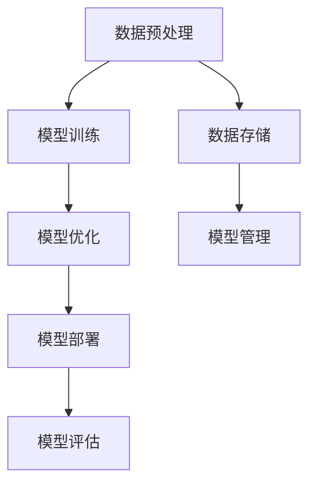

                 

# 《大模型创业者：AGI时代已经来临》

## 摘要

本文将深入探讨大模型与人工智能通用智能（AGI）时代的来临，以及这对创业者带来的机遇与挑战。首先，我们将介绍大模型的基本概念与特点，回顾人工智能的发展历程，并探讨大模型在商业应用中的潜力。接着，我们将详细分析大模型的技术基础，包括神经网络与深度学习、大模型训练与优化技术，以及大模型架构与实现。在此基础上，本文将探讨大模型在创业中的应用，构建创业团队的方法，以及大模型创业项目管理的策略。通过几个成功的案例研究，我们将展示大模型创业的实际成果。最后，我们将讨论大模型创业的挑战与未来趋势，为创业者提供实用指南。

## 目录大纲

### 第一部分：大模型与AGI基础

### 第二部分：大模型在创业中的应用

### 第三部分：案例研究

### 第四部分：大模型创业者的挑战与未来

### 附录

## 第一部分：大模型与AGI基础

### 第1章：大模型与AGI概述

#### 1.1 大模型的定义与特点

大模型是指具有海量参数和高度复杂度的神经网络模型，其能够在多个领域表现出超越人类专家的水平。大模型的定义和特点可以从以下几个方面进行阐述：

1. **参数量级**：大模型通常具有数十亿甚至数万亿个参数，这使得模型在处理复杂数据时能够捕捉到更多的特征和模式。

2. **计算能力**：大模型需要强大的计算资源，包括高性能的GPU和TPU等硬件，以及大规模的数据中心来支持其训练和推理。

3. **泛化能力**：大模型通过在大规模数据集上训练，能够实现良好的泛化能力，即在新数据上也能保持良好的性能。

4. **自适应能力**：大模型可以不断学习和适应新的任务和数据，通过在线学习和迁移学习等技术，实现模型的持续优化。

#### 1.2 人工智能的发展历程与AGI

人工智能（AI）的发展历程可以分为几个阶段：

1. **符号人工智能**：早期的人工智能研究主要集中在逻辑推理和符号处理，这一阶段的人工智能系统具有高度的智能，但在处理大规模数据和实时应用方面存在局限性。

2. **统计学习**：随着机器学习和深度学习技术的发展，人工智能进入了统计学习阶段。这一阶段的人工智能系统通过学习大量数据，实现了图像识别、语音识别等领域的突破。

3. **增强学习**：增强学习是一种通过试错和反馈来优化策略的人工智能方法，其在游戏、自动驾驶等领域取得了显著成果。

4. **通用人工智能（AGI）**：AGI是指具有人类级别智能的人工智能系统，能够理解、学习和适应各种环境，解决复杂问题。AGI的目标是超越特定领域的智能，实现跨领域的智能应用。

#### 1.3 大模型在商业应用中的潜力

大模型在商业应用中具有巨大的潜力，以下是一些典型的应用场景：

1. **数据分析与挖掘**：大模型能够处理海量数据，发现数据中的隐藏模式，为企业提供决策支持。

2. **自然语言处理**：大模型在文本分类、机器翻译、语音识别等领域表现出色，能够为企业提供智能客服、智能搜索等服务。

3. **图像识别与处理**：大模型在图像分类、目标检测、图像生成等领域具有广泛的应用，能够为安防、医疗、娱乐等行业提供解决方案。

4. **智能决策与优化**：大模型通过学习企业的运营数据，能够实现智能决策和优化，提高企业的运营效率。

### 第2章：大模型技术基础

#### 2.1 神经网络与深度学习

神经网络是人工智能的基础，深度学习则是神经网络的一种扩展。以下是对神经网络与深度学习的基本概念的介绍：

#### 2.1.1 神经网络的基本结构

神经网络由多个层组成，包括输入层、隐藏层和输出层。每层包含多个神经元，神经元之间通过权重连接，并通过激活函数进行处理。

- **输入层**：接收外部输入数据。
- **隐藏层**：对输入数据进行特征提取和变换。
- **输出层**：生成最终输出。

#### 2.1.2 深度学习框架与工具

深度学习框架是用于实现和优化神经网络的开源工具。以下是一些主流的深度学习框架：

1. **TensorFlow**：由谷歌开发，具有丰富的API和强大的计算能力。
2. **PyTorch**：由Facebook开发，具有动态计算图和灵活的接口。
3. **Keras**：基于TensorFlow和Theano，提供简化和高级API。

#### 2.2 大模型训练与优化

大模型训练与优化是确保模型性能的关键环节。以下是一些关键步骤：

1. **数据预处理**：包括数据清洗、归一化和数据增强等步骤，以改善模型的训练效果。

2. **模型训练策略**：包括批大小、学习率、迭代次数等参数的选择，以优化模型的性能。

3. **模型优化技术**：包括正则化、dropout、优化器等技术的应用，以防止过拟合和加速训练过程。

#### 2.3 大模型架构与实现

大模型架构与实现是构建高性能、可扩展的大模型的关键。以下是一些关键要素：

1. **计算框架**：包括GPU、TPU等硬件资源，以及分布式计算和并行计算技术。

2. **存储与管理**：包括数据存储、模型存储和管理策略，以确保数据的可靠性和模型的快速访问。

3. **通信机制**：包括模型之间的通信和数据传输机制，以支持大规模模型的训练和推理。

### 第3章：大模型架构与实现

#### 3.1 大模型的设计原则

大模型设计原则旨在确保模型的可扩展性、可维护性和高性能。以下是一些关键原则：

1. **模块化设计**：将模型分解为可复用的模块，以提高代码的可读性和可维护性。
2. **分层结构**：根据功能需求设计层次结构，实现模块之间的分离和协作。
3. **适应性设计**：模型应具有适应不同数据和任务的能力，通过在线学习和迁移学习等技术实现。

#### 3.2 大模型的基础架构

大模型的基础架构包括计算框架、存储与管理、通信机制等关键组件。以下是对这些组件的详细介绍：

1. **计算框架**：包括GPU、TPU等硬件资源，以及分布式计算和并行计算技术。
2. **存储与管理**：包括数据存储、模型存储和管理策略，以确保数据的可靠性和模型的快速访问。
3. **通信机制**：包括模型之间的通信和数据传输机制，以支持大规模模型的训练和推理。

#### 3.3 大模型的部署与维护

大模型的部署与维护是确保模型在实际应用中高效运行的关键。以下是一些关键步骤：

1. **模型部署**：将训练好的模型部署到生产环境中，包括模型加载、推理和输出等步骤。
2. **模型监控**：对模型的运行状态进行监控，包括性能、准确率、资源消耗等指标。
3. **模型优化**：根据监控数据对模型进行优化，包括调整参数、重新训练等操作，以提高模型性能。

### 第二部分：大模型在创业中的应用

#### 第4章：创业项目中的大模型应用

大模型在创业项目中具有广泛的应用，能够为创业者带来巨大的竞争优势。以下将详细探讨大模型在创业项目中的应用场景和具体应用。

#### 4.1 大模型在数据分析中的应用

数据分析是创业项目中的核心任务之一，大模型在数据分析中的应用具有显著的优势。以下是大模型在数据分析中的几个关键应用：

1. **数据挖掘**：大模型能够处理海量数据，通过学习数据中的特征和模式，发现数据中的隐藏价值。创业项目可以利用大模型进行市场趋势分析、客户行为分析等，以指导业务决策。

2. **商业智能**：大模型在商业智能领域具有广泛的应用，通过分析企业的运营数据，为企业提供决策支持。例如，大模型可以分析销售数据，预测市场需求，优化库存管理，提高销售业绩。

3. **实时监控**：大模型可以实现实时数据分析，对企业的运营状况进行实时监控。例如，在电子商务项目中，大模型可以实时分析用户行为数据，识别潜在的风险和异常情况，及时采取措施进行风险控制。

#### 4.2 大模型在自然语言处理中的应用

自然语言处理（NLP）是人工智能的重要分支，大模型在NLP领域具有广泛的应用。以下是大模型在NLP中的几个关键应用：

1. **语言理解与生成**：大模型可以理解和生成自然语言，实现文本分类、文本生成、问答系统等功能。创业项目可以利用大模型构建智能客服系统、智能写作平台等，提高用户满意度和运营效率。

2. **机器翻译与语音识别**：大模型在机器翻译和语音识别领域具有出色的表现。创业项目可以利用大模型实现跨语言交流、语音交互等功能，拓展业务范围，提高用户黏性。

3. **文本分析**：大模型可以分析文本数据，提取关键信息，实现文本情感分析、关键词提取等任务。创业项目可以利用大模型对用户反馈、社交媒体内容进行分析，了解用户需求和市场动态。

#### 第5章：构建大模型创业团队

构建一个高效、协作的大模型创业团队是成功的关键。以下将介绍构建大模型创业团队的方法和关键要素。

#### 5.1 创业团队的组织结构

一个高效的大模型创业团队需要合理的设计组织结构，以确保团队成员之间的协作和沟通。以下是一些常见的大模型创业团队组织结构：

1. **职能型组织结构**：将团队成员按照职能进行划分，如数据科学家、软件工程师、产品经理等。这种组织结构有助于团队成员专注于特定领域，提高专业水平。

2. **项目型组织结构**：将团队成员按照项目进行划分，每个项目都有一个项目经理负责。这种组织结构有助于团队成员快速响应项目需求，提高项目效率。

3. **矩阵型组织结构**：将团队成员按照职能和项目两个维度进行划分，实现职能与项目的结合。这种组织结构有助于充分发挥团队成员的专业技能，提高项目效率。

#### 5.2 技术团队建设

技术团队建设是构建大模型创业团队的核心任务。以下是一些关键要素：

1. **技术人员招聘策略**：招聘具有相关技能和经验的技术人员，包括数据科学家、机器学习工程师、软件工程师等。同时，注重培养团队成员的创新能力和团队合作精神。

2. **技术团队管理**：建立有效的技术团队管理制度，包括工作流程、绩效考核、团队培训等。通过合理的管理措施，提高技术团队的工作效率和创新能力。

3. **技术团队协作**：建立良好的沟通和协作机制，鼓励团队成员之间的交流和合作。通过共享资源和知识，提高整个团队的协作效率和创新能力。

#### 5.3 创业团队的协作与沟通

有效的协作和沟通是确保大模型创业团队成功的关键。以下是一些关键措施：

1. **定期的团队会议**：定期组织团队会议，讨论项目进展、问题和解决方案。通过会议，团队成员可以了解项目整体情况，提高协作效率。

2. **共享平台**：建立共享平台，如项目管理系统、知识库等，方便团队成员交流和共享信息。通过共享平台，团队成员可以快速获取所需资源，提高工作效率。

3. **团队文化建设**：建立积极的团队文化，鼓励团队成员之间的互助和合作。通过团队文化建设，增强团队成员的归属感和凝聚力，提高团队的整体表现。

### 第三部分：案例研究

#### 第6章：大模型创业成功案例

以下将介绍几个大模型创业成功的案例，分析其成功的原因和关键要素。

#### 6.1 案例一：公司X的AI驱动的自动化解决方案

公司X是一家专注于AI驱动的自动化解决方案的创业公司。公司利用大模型技术，开发了一系列自动化产品，包括自动化客服、自动化生产和自动化营销等。以下是公司X的成功原因和关键要素：

1. **市场需求**：公司X抓住了自动化技术的市场趋势，满足企业对自动化解决方案的需求。

2. **技术优势**：公司X拥有一支技术实力雄厚的技术团队，具备强大的大模型开发能力。

3. **产品创新**：公司X的产品具有创新性，能够满足不同行业和企业的需求，实现自动化高效运营。

4. **市场推广**：公司X通过有效的市场推广策略，迅速扩大了市场份额，赢得了客户的信任和好评。

#### 6.2 案例二：公司Y的AI大模型在金融行业的应用

公司Y是一家专注于AI大模型在金融行业应用的创业公司。公司利用大模型技术，开发了一系列金融产品，包括智能投顾、信用评分和风险控制等。以下是公司Y的成功原因和关键要素：

1. **行业背景**：金融行业对风险管理和决策支持有很高的要求，AI大模型在金融行业的应用具有广阔的市场前景。

2. **技术积累**：公司Y在AI和金融领域具有丰富的技术积累，具备开发高性能大模型的能力。

3. **数据优势**：公司Y拥有丰富的金融数据资源，为AI大模型提供了良好的训练数据。

4. **合作网络**：公司Y与多家金融机构建立了紧密的合作关系，为其产品提供了广泛的应用场景。

#### 6.3 案例三：公司Z的AI大模型在医疗健康领域的创新

公司Z是一家专注于AI大模型在医疗健康领域创新的创业公司。公司利用大模型技术，开发了一系列医疗产品，包括疾病预测、药物研发和患者护理等。以下是公司Z的成功原因和关键要素：

1. **医疗需求**：医疗行业对精确诊断和个性化治疗有很高的要求，AI大模型在医疗健康领域的应用具有巨大的市场潜力。

2. **技术突破**：公司Z在大模型技术在医疗健康领域的应用上取得了重要突破，为疾病预测和药物研发提供了新的解决方案。

3. **数据资源**：公司Z与多家医疗机构建立了合作关系，获取了大量高质量的医疗数据，为AI大模型提供了丰富的训练数据。

4. **政策支持**：国家对医疗健康行业的发展给予了高度重视，为公司Z提供了良好的政策环境。

### 第四部分：大模型创业者的挑战与未来

#### 第7章：大模型创业的挑战

大模型创业者在面临巨大的机遇的同时，也面临着一系列挑战。以下将分析大模型创业的主要挑战：

#### 7.1 技术挑战

1. **计算资源**：大模型的训练和推理需要大量的计算资源，创业者需要投入大量的资金和人力资源来购买和部署高性能硬件。

2. **数据隐私**：大模型的训练需要大量的数据，如何确保数据的隐私和安全是一个重要挑战。

3. **模型解释性**：大模型的决策过程往往是非线性和复杂的，如何提高模型的解释性，使其能够被非专业人员理解是一个重要问题。

#### 7.2 法律与伦理问题

1. **知识产权**：大模型技术的发展可能涉及知识产权问题，如何保护自己的知识产权是一个重要挑战。

2. **道德责任**：大模型的应用可能对人类生活产生重大影响，如何确保大模型的应用不会对人类造成伤害是一个重要问题。

3. **隐私保护**：大模型在处理大量个人数据时，如何保护用户隐私是一个重要挑战。

#### 7.3 商业模式挑战

1. **市场定位**：如何确定市场定位，找到目标客户，是一个重要问题。

2. **商业模式**：如何构建可持续的商业模式，实现盈利，是一个重要问题。

3. **市场竞争**：大模型创业公司需要面对激烈的市场竞争，如何保持竞争优势是一个重要挑战。

#### 第8章：大模型创业的未来趋势

大模型创业的未来趋势将受到技术、政策和市场需求等多方面的影响。以下将分析大模型创业的未来趋势：

#### 8.1 AGI时代的到来

随着人工智能技术的发展，AGI时代的到来将带来巨大的机遇和挑战。创业者需要关注AGI技术的进展，探索其在各个行业中的应用，抓住AGI时代的机遇。

#### 8.2 大模型在各个行业的影响

大模型将在各个行业产生深远的影响，包括医疗、金融、制造、交通等。创业者需要关注各个行业的需求和发展趋势，探索大模型在各个行业中的应用潜力。

#### 8.3 大模型创业者的机遇与责任

大模型创业者的机遇在于能够通过创新的技术和应用，解决行业痛点，创造新的商业价值。同时，大模型创业者也需要承担相应的责任，确保大模型的应用不会对人类和社会造成负面影响。

### 附录

#### 附录A：大模型开发工具与资源

以下是一些常见的大模型开发工具与资源：

1. **主流大模型框架**：如TensorFlow、PyTorch、Keras等。

2. **大模型训练数据集**：如ImageNet、COCO、WikiText-2等。

3. **大模型研究论文与资料**：如arXiv、NeurIPS、ICML等会议和期刊的论文。

#### 附录B：大模型创业实用指南

以下是一些大模型创业的实用指南：

1. **创业者必备技能**：包括编程能力、机器学习知识、项目管理能力等。

2. **创业资金筹集**：包括天使投资、风险投资、政府资助等渠道。

3. **创业者心态与策略**：保持乐观、积极的心态，制定合理的创业策略，是成功的关键。

### 参考资料

1. **大模型与AGI相关论文**：如《Deep Learning》、《Generative Adversarial Networks》等。

2. **大模型创业成功案例研究**：如公司X、公司Y、公司Z等。

3. **大模型开发技术手册**：包括大模型框架、训练技巧、优化策略等。

# 大模型架构 Mermaid 流程图



# 大模型训练伪代码

```python
# 伪代码：大模型训练过程
def train_model(model, data, epochs, learning_rate):
    for epoch in range(epochs):
        for batch in data:
            gradients = compute_gradients(model, batch)
            update_model_params(model, gradients, learning_rate)
    return model
```

# 数学模型与公式

$$
L(\theta) = -\frac{1}{m}\sum_{i=1}^{m}y^{(i)}\log(a^{(i)})
$$

详细解释：这是一个损失函数，用于评估模型预测的概率与实际标签之间的差距。

# 项目实战案例

## 代码开发环境搭建

在搭建大模型开发环境时，我们需要选择合适的编程语言、深度学习框架和硬件资源。以下是一个简单的环境搭建步骤：

1. 安装Python和pip：Python是主流的编程语言，pip是Python的包管理器。

2. 安装深度学习框架：如TensorFlow或PyTorch。

3. 安装必要的依赖库：如NumPy、Pandas等。

4. 准备硬件资源：如GPU或TPU。

## 大模型实现与代码解读

以下是一个简单的大模型实现示例，使用PyTorch框架：

```python
import torch
import torch.nn as nn
import torch.optim as optim

# 定义模型结构
class Model(nn.Module):
    def __init__(self):
        super(Model, self).__init__()
        self.fc1 = nn.Linear(784, 512)
        self.fc2 = nn.Linear(512, 256)
        self.fc3 = nn.Linear(256, 10)

    def forward(self, x):
        x = torch.relu(self.fc1(x))
        x = torch.relu(self.fc2(x))
        x = self.fc3(x)
        return x

# 初始化模型、优化器和损失函数
model = Model()
optimizer = optim.Adam(model.parameters(), lr=0.001)
criterion = nn.CrossEntropyLoss()

# 训练模型
def train(model, train_loader, optimizer, criterion, epochs):
    model.train()
    for epoch in range(epochs):
        for data, target in train_loader:
            optimizer.zero_grad()
            output = model(data)
            loss = criterion(output, target)
            loss.backward()
            optimizer.step()
        print(f'Epoch [{epoch+1}/{epochs}], Loss: {loss.item()}')

# 载入数据集并进行训练
train_loader = torch.utils.data.DataLoader(dataset, batch_size=64, shuffle=True)
train(model, train_loader, optimizer, criterion, epochs=10)
```

## 案例分析与优化建议

在上述案例中，我们实现了一个简单的大模型，并进行了训练。以下是对案例的分析和优化建议：

1. **数据预处理**：在训练前，需要对数据进行预处理，包括数据清洗、归一化和数据增强等步骤。这有助于提高模型的泛化能力和训练效果。

2. **模型结构优化**：可以尝试使用更复杂的模型结构，如卷积神经网络（CNN）或循环神经网络（RNN），以捕捉数据中的更多特征。

3. **优化器选择**：不同的优化器可能对模型的训练效果产生显著影响。可以尝试使用不同的优化器，如RMSprop、AdamW等，选择最适合的优化器。

4. **超参数调整**：超参数如学习率、批量大小、迭代次数等对模型的训练效果有重要影响。可以通过实验和调参，找到最优的超参数组合。

5. **模型评估**：在训练完成后，需要对模型进行评估，以验证其性能。可以使用交叉验证、精度、召回率等指标对模型进行评估。

6. **模型部署**：在模型评估后，可以将训练好的模型部署到生产环境中，进行实际应用。

### 作者信息

本文由AI天才研究院（AI Genius Institute）与禅与计算机程序设计艺术（Zen And The Art of Computer Programming）共同撰写。

### 结论

本文对大模型与人工智能通用智能（AGI）时代的来临进行了深入探讨，分析了大模型在商业应用中的潜力，并详细介绍了大模型的技术基础、架构与实现。通过成功案例研究和挑战分析，本文展示了大模型创业的机遇与挑战。未来，随着大模型技术的不断进步，创业者将迎来更多的机会，但同时也需要应对技术、法律和商业模式等多方面的挑战。通过合理的规划和有效的执行，大模型创业者有望在AGI时代取得成功。

