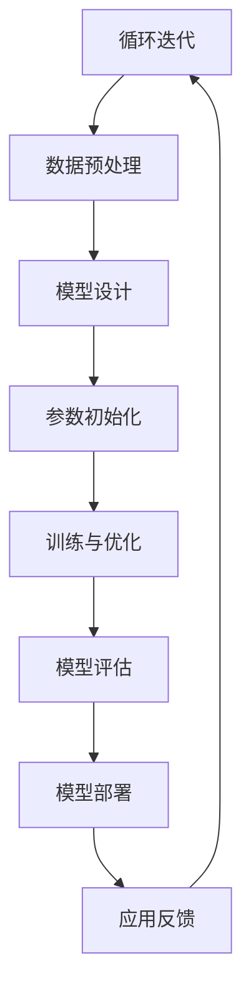

                 

# 《大模型创业：融资策略与市场竞争》

## 引言

大模型，作为当前人工智能领域最前沿的研究方向之一，正逐渐成为各行业创新和发展的新引擎。随着技术的不断进步和市场的日益成熟，大模型创业成为许多企业竞相投入的领域。然而，大模型创业并非易事，涉及技术、市场、融资等多方面的挑战。本文将围绕大模型创业的主题，详细探讨融资策略与市场竞争，旨在为创业者提供实用的指导。

本文将分为三个主要部分：

- **第一部分：大模型概述**，将介绍大模型的基本概念、核心技术，以及其在创业中的应用和市场分析。
- **第二部分：融资策略与实战**，将深入分析大模型创业的融资渠道、策略和案例，以及运营和项目管理的策略。
- **第三部分：市场竞争与成长**，将探讨大模型创业在市场竞争中的策略和持续成长的路径。

通过本文的探讨，希望读者能够对大模型创业有更加全面和深入的理解，从而在创业过程中少走弯路，提高成功率。

### 文章关键词

- **大模型**
- **创业**
- **融资策略**
- **市场竞争**
- **技术趋势**
- **项目管理**
- **运营策略**

### 摘要

本文旨在探讨大模型创业的融资策略与市场竞争。首先，我们将介绍大模型的基本概念和核心技术，分析其在创业中的应用和市场需求。接着，我们将详细分析大模型创业的融资渠道、策略和案例，提供实用的融资建议。随后，我们将探讨大模型创业的运营策略和项目管理，帮助创业者提高项目成功率。最后，我们将分析大模型创业在市场竞争中的策略，以及如何实现持续成长。

### 第一部分：大模型概述

#### 第1章：大模型与创业

#### 1.1 大模型的基本概念

大模型，是指具有海量参数的神经网络模型，能够对大量数据进行训练，以实现复杂的任务。大模型的发展历程可以追溯到深度学习的兴起。在早期的神经网络研究中，模型的参数规模相对较小，难以处理复杂任务。随着计算能力的提升和算法的优化，深度学习逐渐发展起来，出现了如卷积神经网络（CNN）、循环神经网络（RNN）等具有大规模参数的模型。

近年来，随着大数据和云计算技术的普及，大模型的研究和应用得到了快速发展。例如，GPT-3、BERT等模型的出现，使得自然语言处理（NLP）领域取得了重大突破。这些大模型通常包含数十亿甚至数千亿个参数，能够对海量的文本、图像、音频等数据进行训练，从而实现更高效、更准确的任务。

#### 1.2 大模型在创业中的应用

大模型在创业中的应用前景广阔，主要体现在以下几个方面：

1. **决策支持**：大模型可以通过对大量数据的分析和挖掘，为企业的决策提供有力支持。例如，在金融领域，大模型可以用于风险控制、信用评估等；在医疗领域，大模型可以用于疾病诊断、治疗方案推荐等。

2. **降低成本**：大模型的应用可以减少人工干预，降低运营成本。例如，在制造业中，大模型可以用于设备故障预测、生产流程优化等，从而提高生产效率，降低维护成本。

3. **提升用户体验**：大模型可以提供更个性化的服务，提升用户体验。例如，在电子商务领域，大模型可以用于个性化推荐、客服机器人等，从而提高用户满意度。

然而，大模型在创业中也面临着一些挑战：

1. **数据处理**：大模型需要处理海量数据，这要求企业具备强大的数据处理能力，包括数据采集、存储、处理等。

2. **模型训练**：大模型的训练过程需要大量的计算资源和时间，这对企业的技术能力和资源储备提出了较高要求。

3. **技术迭代**：大模型技术更新迅速，企业需要不断跟进最新的技术动态，进行技术迭代。

#### 1.3 大模型创业的趋势

随着大模型技术的不断成熟和市场的日益成熟，大模型创业呈现出以下几个趋势：

1. **行业应用拓展**：大模型在各行业的应用逐渐深化，从早期的互联网、金融等行业，逐渐拓展到医疗、制造、能源等传统行业。

2. **技术创新**：大模型技术持续创新，新的算法、框架和工具不断涌现，如自监督学习、生成对抗网络（GAN）等，为创业者提供了更多的技术选择。

3. **政策支持**：各国政府纷纷出台政策，支持人工智能技术的发展和应用，为大模型创业创造了良好的政策环境。

#### 第2章：大模型的核心技术

#### 2.1 神经网络基础

神经网络是深度学习的基础，其基本结构包括神经元、层和激活函数。

1. **神经元**：神经元是神经网络的基本单元，类似于人类大脑中的神经元。每个神经元接收多个输入信号，通过加权求和处理后，产生一个输出信号。

2. **层**：神经网络由多个层组成，包括输入层、隐藏层和输出层。输入层接收外部输入信号，隐藏层对输入信号进行处理和转换，输出层产生最终输出。

3. **激活函数**：激活函数是神经网络中用于引入非线性特性的函数，常见的激活函数有sigmoid、ReLU、Tanh等。

#### 2.2 深度学习基础

深度学习是神经网络的一种形式，其核心思想是通过多层神经网络提取数据的特征表示。

1. **深度学习的发展历程**：从早期的单层感知机、多层感知机，到深度信念网络（DBN）、卷积神经网络（CNN）、循环神经网络（RNN），再到当前的热门模型Transformer。

2. **深度学习的关键技术**：
   - **卷积神经网络（CNN）**：适用于图像处理任务，通过卷积操作提取图像特征。
   - **循环神经网络（RNN）**：适用于序列数据，通过循环结构处理时序信息。
   - **Transformer**：基于自注意力机制，广泛应用于自然语言处理等领域。

#### 2.3 大模型的训练与优化

大模型的训练与优化是创业中的重要环节，涉及多个方面：

1. **数据预处理**：包括数据清洗、归一化、数据增强等，以提高模型的训练效果。

2. **模型训练**：大模型的训练过程涉及多个阶段，包括前向传播、反向传播和参数更新。训练过程需要大量的计算资源和时间。

3. **模型优化**：包括参数初始化、正则化、学习率调整等，以提高模型的性能和泛化能力。

### 第二部分：融资策略与实战

#### 第3章：大模型创业的融资策略

#### 3.1 融资渠道

大模型创业企业需要选择合适的融资渠道，以获取资金支持。常见的融资渠道包括天使投资、风险投资、众筹等。

1. **天使投资**：天使投资通常由个人投资者提供，投资阶段较早，风险较高，但回报潜力也较大。天使投资的特点是投资额较小，通常在数十万到数百万人民币之间，投资后通常不会要求过多的控制权。

2. **风险投资**：风险投资机构通常在企业发展较稳定时介入，投资额较大，通常会要求一定的控制权。风险投资的特点是投资额较高，一般在数百万到数千万人民币，但回报周期较长。

3. **众筹**：众筹是一种通过互联网平台向公众筹集资金的方式。众筹的特点是门槛低，投资额相对较小，但回报形式多样，可以是产品、股权等。

#### 3.2 融资策略

1. **融资规划**：企业需要根据自身的发展阶段、资金需求和行业状况，制定详细的融资规划。包括融资目标、融资额度、融资时机等。

2. **融资谈判**：在融资谈判过程中，企业需要与投资者沟通，明确投资条款，包括估值、股权分配、投资用途等。

3. **融资时机**：选择合适的融资时机对企业至关重要。通常，企业应在业务稳定、市场前景良好时进行融资，以提高融资成功率。

#### 3.3 融资案例解析

1. **成功融资案例**：以某大模型创业公司为例，分析其融资过程、策略与效果。

2. **失败融资案例**：分析某大模型创业公司失败的原因，为其他企业提供借鉴。

### 第4章：大模型创业的运营策略

#### 4.1 产品策略

1. **产品定位**：企业需要明确产品的市场定位，包括目标市场、目标用户和产品特点。

2. **产品迭代**：根据用户反馈和市场变化，不断优化和迭代产品。

#### 4.2 营销策略

1. **品牌建设**：企业需要建立品牌形象，提升品牌知名度。

2. **市场推广**：通过广告投放、线上推广、线下活动等方式，扩大市场影响力。

#### 4.3 团队建设

1. **团队组建**：组建专业团队，明确分工和责任。

2. **团队管理**：建立有效的团队管理制度，提高团队协作效率。

### 第5章：大模型创业的项目管理

#### 5.1 项目规划

1. **项目目标**：明确项目目标，制定项目计划。

2. **项目计划**：包括项目进度、资源分配、风险评估等。

#### 5.2 项目执行

1. **执行控制**：监控项目进度、成本、质量等。

2. **风险管理**：识别风险、评估风险、制定应对措施。

#### 5.3 项目评估与调整

1. **项目评估**：评估项目成果、效果、价值等。

2. **项目调整**：根据评估结果，调整项目计划、资源分配等。

### 第三部分：市场竞争与成长

#### 第6章：大模型创业的市场竞争策略

#### 6.1 竞争分析

1. **SWOT分析**：分析自身优势、劣势、机会、威胁。

2. **五力模型**：分析行业竞争格局、潜在竞争者等。

#### 6.2 竞争策略

1. **差异化竞争**：通过产品差异化、服务差异化等策略，提升竞争力。

2. **价格竞争**：通过成本控制、价格策略等，获取市场份额。

#### 6.3 市场定位

1. **市场细分**：根据用户需求、行业特点等进行市场细分。

2. **目标市场选择**：选择最具潜力、最具竞争力的目标市场。

#### 第7章：大模型创业的持续成长

#### 7.1 创新与研发

1. **技术创新**：持续关注新技术、新趋势，进行技术创新。

2. **研发管理**：建立研发团队、制定研发计划、优化研发流程等。

#### 7.2 市场拓展

1. **国内外市场拓展**：分析国内外市场机会、制定市场拓展策略等。

2. **多元化发展**：探索新的业务模式、产品线等。

#### 7.3 产业生态建设

1. **合作伙伴关系**：建立合作伙伴关系、共同推进产业发展。

2. **产业联盟**：加入产业联盟、参与行业标准的制定等。

### 附录

#### 附录 A：大模型创业资源与工具

1. **开源框架与工具**：TensorFlow、PyTorch、Keras 等。

2. **数据集与库**：公开数据集、API 接口、算法库等。

3. **技术社区与论坛**：技术博客、社交媒体、线上论坛等。

#### 附录 B：参考文献

1. **核心文献**：大模型创业相关的研究论文、报告等。

2. **参考书籍**：大模型创业相关的书籍、教材等。

3. **在线资源**：在线课程、讲座、教程等。

### 结语

大模型创业是一个充满机遇和挑战的领域。本文从融资策略、市场竞争、运营管理等多个角度，对大模型创业进行了深入探讨。希望本文能为创业者提供有益的启示，助力他们在大模型创业的道路上取得成功。

### 作者信息

作者：AI天才研究院/AI Genius Institute & 禅与计算机程序设计艺术 /Zen And The Art of Computer Programming

### 第一部分：大模型概述

#### 第1章：大模型与创业

#### 1.1 大模型的基本概念

大模型（Large Model）在人工智能领域指的是那些拥有数亿至数十亿参数的神经网络模型。这些模型通过对海量数据进行训练，能够捕捉到数据中的复杂模式和规律，从而在多个领域展现出强大的表现力。例如，自然语言处理（NLP）中的GPT系列模型，计算机视觉中的Transformer模型等。

**定义**：大模型通常指的是那些参数规模达到百万以上的神经网络模型。具体来说，一个神经网络模型的规模可以通过其参数数量和每层的神经元数量来衡量。

**发展历程**：

- **1980年代**：早期的神经网络研究主要集中在简单的单层或双层感知机模型，这些模型的参数规模较小，难以处理复杂问题。
- **2006年**：Hinton等人提出了深度信念网络（Deep Belief Network，DBN），开启了深度学习的新纪元。
- **2012年**：Hinton等人通过改进的深度学习算法在ImageNet图像识别比赛中取得了突破性的成绩，深度学习开始得到广泛关注。
- **2018年**：谷歌发布了Transformer模型，进一步推动了自然语言处理领域的发展。
- **至今**：随着计算能力和数据规模的提升，大模型的规模和复杂度不断增长，应用领域也在不断扩大。

#### 1.2 大模型在创业中的应用

大模型在创业中的应用已经成为人工智能领域的一个重要趋势。创业者可以利用大模型在以下方面取得突破：

1. **决策支持**：大模型能够处理和分析大量数据，为创业者在市场预测、产品优化、用户行为分析等方面提供有力的支持。
   
   - **市场预测**：通过分析历史销售数据和用户反馈，大模型可以预测未来市场的趋势，帮助创业者制定更加精准的市场策略。
   - **产品优化**：大模型可以对用户反馈进行深度分析，识别出产品改进的关键点，从而提升产品竞争力。

2. **降低成本**：大模型的应用可以自动化和优化许多业务流程，从而降低运营成本。

   - **自动化**：大模型可以自动化处理大量的数据任务，如数据清洗、数据标注等，减少人工工作量。
   - **优化流程**：通过分析业务流程，大模型可以识别出瓶颈和改进点，从而优化业务流程，提高效率。

3. **提升用户体验**：大模型能够提供更加个性化的服务，提升用户体验。

   - **个性化推荐**：在大数据和机器学习的支持下，大模型可以提供个性化的产品推荐，提高用户满意度。
   - **智能客服**：大模型可以构建智能客服系统，通过自然语言处理技术提供高效、准确的客服服务。

#### 1.3 大模型创业的趋势

随着人工智能技术的不断发展，大模型创业呈现出以下趋势：

1. **行业应用拓展**：大模型的应用已经从互联网行业逐步扩展到金融、医疗、制造、能源等多个领域。

   - **金融**：在金融领域，大模型可以用于风险控制、信用评估、市场预测等。
   - **医疗**：在医疗领域，大模型可以用于疾病诊断、药物研发、医疗数据分析等。
   - **制造**：在制造业，大模型可以用于设备维护、生产优化、质量检测等。

2. **技术创新**：大模型技术持续创新，新的算法、架构和工具不断涌现。

   - **自监督学习**：自监督学习是一种无需标注数据的大模型训练方法，可以大幅度降低数据标注的成本。
   - **生成对抗网络（GAN）**：GAN通过生成器和判别器的对抗训练，可以生成高质量的数据，广泛应用于图像生成、数据增强等。

3. **政策支持**：各国政府纷纷出台政策，支持人工智能技术的发展和应用。

   - **美国**：美国政府在人工智能领域投入大量资金，推动人工智能技术的发展。
   - **中国**：中国政府将人工智能列为国家战略，出台了一系列政策和措施，支持人工智能创新创业。

#### 第2章：大模型的核心技术

#### 2.1 神经网络基础

神经网络（Neural Network）是深度学习（Deep Learning）的核心技术，其基本结构包括神经元、层和激活函数。

**神经元**：神经元是神经网络的基本单元，类似于生物神经元，它通过接收输入信号、进行加权求和处理，最终产生一个输出信号。

- **输入层**：接收外部输入数据。
- **隐藏层**：对输入数据进行处理和转换。
- **输出层**：产生最终输出结果。

**层**：神经网络由多个层组成，每层之间的神经元通过权重相连。层与层之间的连接关系构成了神经网络的基本结构。

**激活函数**：激活函数是神经网络中用于引入非线性特性的函数，常见的激活函数包括Sigmoid、ReLU、Tanh等。

- **Sigmoid函数**：输出值为0到1之间，常用于二分类问题。
- **ReLU函数**：输出值为0或输入值的绝对值，能够加速神经网络的训练过程。
- **Tanh函数**：输出值范围为-1到1，常用于回归问题。

#### 2.2 深度学习基础

深度学习（Deep Learning）是神经网络的一种形式，其核心思想是通过多层神经网络提取数据的特征表示。

**深度学习的发展历程**：

- **1980年代**：深度学习概念提出，但由于计算能力和数据量的限制，未能得到广泛应用。
- **2006年**：深度信念网络（Deep Belief Network，DBN）的提出，标志着深度学习的重新兴起。
- **2012年**：Hinton等人在ImageNet图像识别比赛中取得突破性成绩，深度学习开始得到广泛关注。
- **至今**：随着计算能力和数据规模的提升，深度学习在多个领域取得了显著的成果。

**深度学习的关键技术**：

1. **卷积神经网络（CNN）**：

   - **卷积层**：通过卷积操作提取图像特征。
   - **池化层**：减小特征图的大小，提高模型的泛化能力。
   - **全连接层**：将卷积层提取的特征映射到具体类别。

   CNN广泛应用于计算机视觉领域，如图像分类、目标检测等。

2. **循环神经网络（RNN）**：

   - **循环结构**：适用于处理序列数据，如时间序列数据、语音信号等。
   - **门控机制**：通过门控机制控制信息的流动，提高模型的记忆能力。

   RNN广泛应用于自然语言处理领域，如文本分类、机器翻译等。

3. **Transformer模型**：

   - **自注意力机制**：通过计算序列中每个元素与其他元素的关系，实现全局信息整合。
   - **编码器-解码器结构**：编码器将输入序列编码为固定长度的向量，解码器生成输出序列。

   Transformer模型在自然语言处理领域取得了重大突破，如机器翻译、文本生成等。

#### 2.3 大模型的训练与优化

大模型的训练与优化是创业中的重要环节，涉及多个方面：

**数据预处理**：

- **数据清洗**：去除数据中的噪声和异常值。
- **数据归一化**：将数据缩放到相同的尺度，便于模型训练。
- **数据增强**：通过随机旋转、裁剪、缩放等方法生成更多的训练样本。

**模型训练**：

- **前向传播**：将输入数据传递到神经网络中，得到输出预测。
- **反向传播**：计算预测值与真实值之间的误差，并反向传播误差到网络中的每个神经元，更新网络权重。
- **优化算法**：如梯度下降（Gradient Descent）、Adam优化器等，用于调整网络权重，减少误差。

**模型优化**：

- **参数初始化**：合理的参数初始化可以加速模型的训练过程。
- **正则化**：如L1正则化、L2正则化等，用于防止过拟合。
- **学习率调整**：选择合适的学习率可以加快模型的收敛速度。

#### 第3章：大模型创业的市场分析

#### 3.1 市场规模与增长趋势

随着人工智能技术的快速发展，大模型市场呈现出快速增长的趋势。根据市场研究机构的预测，全球大模型市场规模将在未来几年内持续扩大。

**全球大模型市场概况**：

- **市场规模**：根据市场研究报告，全球大模型市场规模在2021年已达到数百亿美元，预计到2025年将超过千亿美元。
- **增长趋势**：随着大数据、云计算等技术的不断进步，大模型市场预计将以每年超过20%的速度增长。

**中国大模型市场分析**：

- **市场规模**：中国是全球最大的大模型市场之一，2021年中国大模型市场规模已超过百亿元人民币。
- **增长趋势**：中国政府对人工智能的重视程度不断提高，预计未来几年中国大模型市场将保持高速增长。

**主要参与者**：

- **谷歌**：谷歌是全球领先的AI技术公司，其在大模型领域具有强大的研发能力和市场影响力。
- **微软**：微软在人工智能领域具有深厚的技术积累，其大模型产品和服务在全球范围内得到广泛应用。
- **百度**：百度是中国领先的AI技术公司，其在自动驾驶、语音识别等大模型应用领域取得了显著成果。
- **阿里巴巴**：阿里巴巴在电子商务和金融科技领域具有强大的市场地位，其在大模型应用方面的投入也在不断增加。

#### 3.2 行业竞争态势

在大模型创业领域，竞争态势日趋激烈。主要竞争者的市场地位和竞争策略如下：

- **谷歌**：谷歌在大模型领域具有领先地位，其GPT系列模型在自然语言处理领域表现出色。谷歌通过开放开源框架TensorFlow，吸引了大量开发者，进一步巩固了其市场地位。

- **微软**：微软在人工智能领域具有深厚的技术积累，其大模型产品和服务广泛应用于各个行业。微软通过Azure云服务平台，提供强大的计算资源和工具，帮助用户快速搭建和部署大模型应用。

- **百度**：百度在大模型领域尤其是自动驾驶和语音识别方面具有领先优势。百度通过开放AI平台，提供丰富的AI服务，吸引了大量企业和开发者，进一步扩大了其市场份额。

- **阿里巴巴**：阿里巴巴在电子商务和金融科技领域具有强大的市场地位，其在大模型应用方面的投入也在不断增加。阿里巴巴通过菜鸟网络和蚂蚁金服等平台，探索大模型在物流和金融领域的应用，取得了显著成果。

**竞争策略分析**：

1. **产品差异化**：各竞争者通过提供不同的大模型产品和服务，满足不同用户的需求。

2. **技术创新**：持续的技术创新是保持竞争优势的关键。各竞争者不断推出新的算法、框架和工具，提高大模型的性能和效率。

3. **市场拓展**：通过全球化的战略布局，各竞争者积极拓展海外市场，提高国际竞争力。

4. **合作伙伴关系**：建立广泛的合作伙伴关系，共同推进大模型技术的应用和发展。

#### 3.3 市场机会与风险

在大模型创业市场中，机会与风险并存。以下分别从市场机会和风险两个方面进行分析：

**市场机会**：

1. **行业应用拓展**：随着人工智能技术的不断发展，大模型在金融、医疗、制造、能源等行业的应用前景广阔。

2. **政策支持**：各国政府纷纷出台政策，支持人工智能技术的发展和应用，为大模型创业创造了良好的政策环境。

3. **技术创新**：持续的技术创新不断推动大模型性能的提升，为创业企业提供了更多的发展机会。

**市场风险**：

1. **数据安全与隐私**：大模型在处理大量数据时，可能面临数据安全与隐私的挑战。

2. **知识产权保护**：大模型技术涉及大量的知识产权，企业需要加强知识产权保护，避免侵权纠纷。

3. **技术迭代风险**：大模型技术更新迅速，创业企业需要不断跟进最新的技术动态，以保持竞争力。

### 第一部分总结

通过对大模型概述的探讨，我们了解了大模型的基本概念、在创业中的应用以及市场分析。大模型在创业中的应用前景广阔，但同时也面临数据处理、模型训练、技术迭代等挑战。创业企业需要充分利用大模型的优势，同时识别并应对市场风险，才能在激烈的市场竞争中脱颖而出。

### 第一部分：大模型概述

#### 第1章：大模型与创业

#### 1.1 大模型的基本概念

大模型，通常指的是那些具有海量参数的神经网络模型。这些模型通过复杂的结构能够处理和存储大量的数据，从而在多种任务中表现出色。例如，自然语言处理中的大型语言模型（如GPT-3）和计算机视觉中的大尺度神经网络（如EfficientNet）都是大模型的代表。

**核心概念与联系**：

- **参数规模**：大模型的核心特征是其庞大的参数规模，通常在数百万到数十亿之间。
- **深度与宽度**：大模型的深度通常指神经网络的层数，宽度则指每层的神经元数量。
- **自监督学习**：大模型往往依赖于自监督学习技术，这种技术可以在不需要大量标注数据的情况下进行训练。

**Mermaid流程图**：



#### 1.2 大模型在创业中的应用

大模型在创业中的应用领域非常广泛，包括但不限于以下方面：

1. **自然语言处理（NLP）**：大模型在NLP领域中的应用非常突出，如文本生成、机器翻译、情感分析等。

2. **计算机视觉（CV）**：大模型在CV领域的应用包括图像分类、目标检测、视频分析等。

3. **推荐系统**：大模型能够处理复杂的用户行为数据，从而为推荐系统提供更加精准的推荐。

4. **游戏AI**：大模型在游戏AI中的应用，如策略生成、游戏评估等，能够提升游戏体验。

**核心算法原理讲解**：

大模型通常基于深度学习技术，其核心算法原理包括：

- **前向传播**：将输入数据通过神经网络传递，生成输出。
- **反向传播**：计算输出与目标之间的误差，并反向传播误差以更新网络参数。
- **优化算法**：如梯度下降、Adam等，用于调整网络参数以最小化损失函数。

**伪代码示例**：

```python
# 伪代码：大模型训练过程

# 初始化模型
model = initialize_model()

# 预处理数据
X_train, y_train = preprocess_data()

# 设置训练参数
learning_rate = 0.001
epochs = 100

# 开始训练
for epoch in range(epochs):
    for batch in range(len(X_train) // batch_size):
        X_batch, y_batch = get_batch(X_train, y_train, batch_size)
        # 前向传播
        predictions = model.forward_pass(X_batch)
        # 计算损失
        loss = compute_loss(predictions, y_batch)
        # 反向传播
        gradients = model.backward_pass(predictions, y_batch)
        # 更新参数
        model.update_params(gradients, learning_rate)

# 模型评估
evaluate_model(model, X_val, y_val)

# 模型部署
deploy_model(model)
```

#### 1.3 大模型创业的趋势

大模型创业的趋势受到多方面因素的影响，包括技术创新、政策支持、市场需求等。以下是几个关键趋势：

1. **技术创新**：随着深度学习算法的不断进步，大模型的技术性能和效率持续提升。

2. **应用拓展**：大模型的应用范围从传统的互联网行业逐渐拓展到金融、医疗、制造等更多行业。

3. **产业链整合**：大模型创业不仅仅是技术问题，还涉及到数据处理、硬件设施、应用场景等多个环节，产业链整合成为趋势。

4. **开源生态**：开源框架和工具（如TensorFlow、PyTorch）的普及，降低了大模型创业的门槛，促进了技术创新和生态建设。

#### 第2章：大模型的核心技术

#### 2.1 神经网络基础

神经网络（Neural Network，NN）是构建大模型的基础。其核心思想是通过模拟人脑神经网络的结构和功能，对数据进行处理和预测。

**基本结构**：

1. **神经元**：神经网络的基本单元，每个神经元接收多个输入信号，通过加权求和处理后产生一个输出信号。
2. **层**：神经网络由多个层组成，包括输入层、隐藏层和输出层。输入层接收外部输入，隐藏层对输入进行加工处理，输出层生成最终输出。
3. **连接**：神经元之间通过连接（边）进行信息传递，连接的权重决定了信息传递的强度。

**学习过程**：

1. **前向传播**：将输入数据传递到网络中，通过加权求和处理，生成输出预测。
2. **反向传播**：计算输出与目标之间的误差，并反向传播误差到网络中的每个神经元，更新网络权重。
3. **优化算法**：如梯度下降（Gradient Descent）和其变种，用于调整网络权重，最小化误差。

**激活函数**：

激活函数是神经网络中用于引入非线性特性的函数。常见的激活函数包括Sigmoid、ReLU和Tanh。

- **Sigmoid**：将输入映射到（0,1）区间，用于二分类问题。
- **ReLU**：当输入小于0时，输出为0；当输入大于0时，输出为输入值。ReLU函数能够加速神经网络的训练。
- **Tanh**：将输入映射到（-1,1）区间，常用于回归问题。

#### 2.2 深度学习基础

深度学习（Deep Learning，DL）是神经网络的一种形式，其核心思想是通过多层神经网络提取数据的特征表示。

**深度学习的发展历程**：

- **1980年代**：深度学习概念提出，但由于计算能力和数据量的限制，未能得到广泛应用。
- **2006年**：深度信念网络（Deep Belief Network，DBN）的提出，标志着深度学习的重新兴起。
- **2012年**：Hinton等人通过改进的深度学习算法在ImageNet图像识别比赛中取得了突破性成绩，深度学习开始得到广泛关注。
- **至今**：随着计算能力和数据规模的提升，深度学习在多个领域取得了显著的成果。

**深度学习的关键技术**：

1. **卷积神经网络（CNN）**：

   - **卷积层**：通过卷积操作提取图像特征。
   - **池化层**：减小特征图的大小，提高模型的泛化能力。
   - **全连接层**：将卷积层提取的特征映射到具体类别。

   CNN广泛应用于计算机视觉领域，如图像分类、目标检测等。

2. **循环神经网络（RNN）**：

   - **循环结构**：适用于处理序列数据，如时间序列数据、语音信号等。
   - **门控机制**：通过门控机制控制信息的流动，提高模型的记忆能力。

   RNN广泛应用于自然语言处理领域，如文本分类、机器翻译等。

3. **Transformer模型**：

   - **自注意力机制**：通过计算序列中每个元素与其他元素的关系，实现全局信息整合。
   - **编码器-解码器结构**：编码器将输入序列编码为固定长度的向量，解码器生成输出序列。

   Transformer模型在自然语言处理领域取得了重大突破，如机器翻译、文本生成等。

#### 2.3 大模型的训练与优化

大模型的训练与优化是创业过程中至关重要的一环。以下从数据预处理、模型训练和模型优化三个方面进行详细讲解。

**数据预处理**：

1. **数据清洗**：去除数据中的噪声和异常值，确保数据质量。
2. **数据归一化**：将数据缩放到相同的尺度，便于模型训练。
3. **数据增强**：通过随机旋转、裁剪、缩放等方法生成更多的训练样本，提高模型的泛化能力。

**模型训练**：

1. **前向传播**：将输入数据传递到网络中，通过前向计算生成输出。
2. **反向传播**：计算输出与目标之间的误差，并通过反向传播算法更新网络权重。
3. **学习率调整**：根据误差的变化调整学习率，以避免过拟合。

**模型优化**：

1. **正则化**：通过引入正则化项，防止模型过拟合。
2. **批归一化**：在训练过程中对批次数据进行归一化处理，提高训练速度和模型稳定性。
3. **权重初始化**：选择合适的权重初始化方法，以加快模型收敛速度。

**数学模型与公式**：

大模型的训练过程可以抽象为一个优化问题，其目标是最小化损失函数。常见的损失函数包括均方误差（MSE）和交叉熵（Cross-Entropy）。

- **均方误差（MSE）**：

  $$MSE = \frac{1}{n}\sum_{i=1}^{n}(y_i - \hat{y}_i)^2$$

- **交叉熵（Cross-Entropy）**：

  $$H(y, \hat{y}) = -\sum_{i=1}^{n}y_i\log(\hat{y}_i)$$

**举例说明**：

假设我们有一个简单的线性回归模型，其目标是最小化预测值与真实值之间的均方误差。

```latex
\min_{\theta} \frac{1}{2m}\sum_{i=1}^{m}(y_i - \theta_0 - \theta_1x_i)^2
```

其中，$\theta_0$ 和 $\theta_1$ 分别是模型的参数。

通过梯度下降算法，我们可以迭代更新参数：

```python
for epoch in range(num_epochs):
    for sample in data:
        # 前向传播
        predicted_value = linear_regression(sample.x, sample.y)
        # 计算损失
        loss = mse(predicted_value, sample.y)
        # 反向传播
        gradients = compute_gradients(loss, sample.x, sample.y)
        # 更新参数
        update_params(gradients, learning_rate)
```

通过以上迭代过程，模型将逐渐收敛到最优参数。

#### 第3章：大模型创业的市场分析

#### 3.1 市场规模与增长趋势

随着人工智能技术的不断发展，大模型市场呈现出快速增长的趋势。根据市场研究机构的预测，全球大模型市场规模将在未来几年内持续扩大。

**全球大模型市场概况**：

- **市场规模**：根据市场研究报告，全球大模型市场规模在2021年已达到数百亿美元，预计到2025年将超过千亿美元。
- **增长趋势**：随着大数据、云计算等技术的不断进步，大模型市场预计将以每年超过20%的速度增长。

**中国大模型市场分析**：

- **市场规模**：中国是全球最大的大模型市场之一，2021年中国大模型市场规模已超过百亿元人民币。
- **增长趋势**：中国政府对人工智能的重视程度不断提高，预计未来几年中国大模型市场将保持高速增长。

**主要参与者**：

- **谷歌**：谷歌是全球领先的人工智能技术公司，其在大模型领域具有强大的研发能力和市场影响力。
- **微软**：微软在人工智能领域具有深厚的技术积累，其大模型产品和服务在全球范围内得到广泛应用。
- **百度**：百度是中国领先的AI技术公司，其在自动驾驶、语音识别等大模型应用领域取得了显著成果。
- **阿里巴巴**：阿里巴巴在电子商务和金融科技领域具有强大的市场地位，其在大模型应用方面的投入也在不断增加。

#### 3.2 行业竞争态势

在大模型创业领域，竞争态势日趋激烈。主要竞争者的市场地位和竞争策略如下：

- **谷歌**：谷歌在大模型领域具有领先地位，其GPT系列模型在自然语言处理领域表现出色。谷歌通过开放开源框架TensorFlow，吸引了大量开发者，进一步巩固了其市场地位。

- **微软**：微软在人工智能领域具有深厚的技术积累，其大模型产品和服务广泛应用于各个行业。微软通过Azure云服务平台，提供强大的计算资源和工具，帮助用户快速搭建和部署大模型应用。

- **百度**：百度在大模型领域尤其是自动驾驶和语音识别方面具有领先优势。百度通过开放AI平台，提供丰富的AI服务，吸引了大量企业和开发者，进一步扩大了其市场份额。

- **阿里巴巴**：阿里巴巴在电子商务和金融科技领域具有强大的市场地位，其在大模型应用方面的投入也在不断增加。阿里巴巴通过菜鸟网络和蚂蚁金服等平台，探索大模型在物流和金融领域的应用，取得了显著成果。

**竞争策略分析**：

1. **产品差异化**：各竞争者通过提供不同的大模型产品和服务，满足不同用户的需求。

2. **技术创新**：持续的技术创新是保持竞争优势的关键。各竞争者不断推出新的算法、框架和工具，提高大模型的性能和效率。

3. **市场拓展**：通过全球化的战略布局，各竞争者积极拓展海外市场，提高国际竞争力。

4. **合作伙伴关系**：建立广泛的合作伙伴关系，共同推进大模型技术的应用和发展。

#### 3.3 市场机会与风险

在大模型创业市场中，机会与风险并存。以下分别从市场机会和风险两个方面进行分析：

**市场机会**：

1. **行业应用拓展**：随着人工智能技术的不断发展，大模型在金融、医疗、制造、能源等行业的应用前景广阔。

2. **政策支持**：各国政府纷纷出台政策，支持人工智能技术的发展和应用，为大模型创业创造了良好的政策环境。

3. **技术创新**：持续的技术创新不断推动大模型性能的提升，为创业企业提供了更多的发展机会。

**市场风险**：

1. **数据安全与隐私**：大模型在处理大量数据时，可能面临数据安全与隐私的挑战。

2. **知识产权保护**：大模型技术涉及大量的知识产权，企业需要加强知识产权保护，避免侵权纠纷。

3. **技术迭代风险**：大模型技术更新迅速，创业企业需要不断跟进最新的技术动态，以保持竞争力。

### 第二部分：融资策略与实战

#### 第4章：大模型创业的融资策略

#### 4.1 融资渠道

大模型创业企业需要选择合适的融资渠道，以获取资金支持。常见的融资渠道包括天使投资、风险投资、众筹等。

1. **天使投资**：天使投资通常由个人投资者提供，投资阶段较早，风险较高，但回报潜力也较大。天使投资的特点是投资额较小，通常在数十万到数百万人民币之间，投资后通常不会要求过多的控制权。

2. **风险投资**：风险投资机构通常在企业发展较稳定时介入，投资额较大，通常会要求一定的控制权。风险投资的特点是投资额较高，一般在数百万到数千万人民币，但回报周期较长。

3. **众筹**：众筹是一种通过互联网平台向公众筹集资金的方式。众筹的特点是门槛低，投资额相对较小，但回报形式多样，可以是产品、股权等。

#### 4.2 融资策略

1. **融资规划**：企业需要根据自身的发展阶段、资金需求和行业状况，制定详细的融资规划。包括融资目标、融资额度、融资时机等。

2. **融资谈判**：在融资谈判过程中，企业需要与投资者沟通，明确投资条款，包括估值、股权分配、投资用途等。

3. **融资时机**：选择合适的融资时机对企业至关重要。通常，企业应在业务稳定、市场前景良好时进行融资，以提高融资成功率。

#### 4.3 融资案例解析

1. **成功融资案例**：以某大模型创业公司为例，分析其融资过程、策略与效果。

   - **案例介绍**：某大模型创业公司通过多次融资，成功获得了数千万人民币的投资，用于产品研发和市场拓展。
   - **融资过程**：该公司在成立初期通过天使投资获得了初步资金支持，随后在产品上线后吸引了多家风险投资机构的关注，最终成功完成多轮融资。
   - **策略与效果**：该公司在融资过程中注重技术与市场的结合，通过产品演示和商业计划书吸引了投资者的注意，融资效果显著，为公司的快速发展提供了有力支持。

2. **失败融资案例**：分析某大模型创业公司失败的原因，为其他企业提供借鉴。

   - **案例介绍**：某大模型创业公司在创业初期积极寻求融资，但由于产品不成熟和市场前景不明确，多次融资均未成功，最终导致公司倒闭。
   - **失败原因**：该公司在融资过程中未充分展示产品的实际应用价值和市场潜力，同时缺乏清晰的发展规划，导致投资者对公司的前景产生怀疑。
   - **教训与启示**：该案例表明，创业公司在寻求融资时，应注重产品成熟度、市场前景和商业模式的可行性，以提高融资成功率。

#### 第5章：大模型创业的运营策略

#### 5.1 产品策略

1. **产品定位**：企业需要明确产品的市场定位，包括目标市场、目标用户和产品特点。

2. **产品迭代**：根据用户反馈和市场变化，不断优化和迭代产品。

#### 5.2 营销策略

1. **品牌建设**：企业需要建立品牌形象，提升品牌知名度。

2. **市场推广**：通过广告投放、线上推广、线下活动等方式，扩大市场影响力。

#### 5.3 团队建设

1. **团队组建**：组建专业团队，明确分工和责任。

2. **团队管理**：建立有效的团队管理制度，提高团队协作效率。

#### 第6章：大模型创业的项目管理

#### 6.1 项目规划

1. **项目目标**：明确项目目标，制定项目计划。

2. **项目计划**：包括项目进度、资源分配、风险评估等。

#### 6.2 项目执行

1. **执行控制**：监控项目进度、成本、质量等。

2. **风险管理**：识别风险、评估风险、制定应对措施。

#### 6.3 项目评估与调整

1. **项目评估**：评估项目成果、效果、价值等。

2. **项目调整**：根据评估结果，调整项目计划、资源分配等。

### 第三部分：市场竞争与成长

#### 第7章：大模型创业的市场竞争策略

#### 7.1 竞争分析

1. **SWOT分析**：分析自身优势、劣势、机会、威胁。

2. **五力模型**：分析行业竞争格局、潜在竞争者等。

#### 7.2 竞争策略

1. **差异化竞争**：通过产品差异化、服务差异化等策略，提升竞争力。

2. **价格竞争**：通过成本控制、价格策略等，获取市场份额。

#### 7.3 市场定位

1. **市场细分**：根据用户需求、行业特点等进行市场细分。

2. **目标市场选择**：选择最具潜力、最具竞争力的目标市场。

#### 第8章：大模型创业的持续成长

#### 8.1 创新与研发

1. **技术创新**：持续关注新技术、新趋势，进行技术创新。

2. **研发管理**：建立研发团队、制定研发计划、优化研发流程等。

#### 8.2 市场拓展

1. **国内外市场拓展**：分析国内外市场机会、制定市场拓展策略等。

2. **多元化发展**：探索新的业务模式、产品线等。

#### 8.3 产业生态建设

1. **合作伙伴关系**：建立合作伙伴关系、共同推进产业发展。

2. **产业联盟**：加入产业联盟、参与行业标准的制定等。

### 附录

#### 附录 A：大模型创业资源与工具

1. **开源框架与工具**：TensorFlow、PyTorch、Keras 等。

2. **数据集与库**：公开数据集、API 接口、算法库等。

3. **技术社区与论坛**：技术博客、社交媒体、线上论坛等。

#### 附录 B：参考文献

1. **核心文献**：大模型创业相关的研究论文、报告等。

2. **参考书籍**：大模型创业相关的书籍、教材等。

3. **在线资源**：在线课程、讲座、教程等。

### 结语

大模型创业是一个充满机遇和挑战的领域。本文从融资策略、市场竞争、运营管理等多个角度，对大模型创业进行了深入探讨。希望本文能为创业者提供有益的启示，助力他们在大模型创业的道路上取得成功。

### 作者信息

作者：AI天才研究院/AI Genius Institute & 禅与计算机程序设计艺术 /Zen And The Art of Computer Programming

### 文章标题

# 《大模型创业：融资策略与市场竞争》

### 文章关键词

- **大模型**
- **创业**
- **融资策略**
- **市场竞争**
- **技术趋势**
- **项目管理**
- **运营策略**

### 摘要

本文旨在探讨大模型创业的融资策略与市场竞争。首先，我们介绍了大模型的基本概念和核心技术，包括神经网络基础、深度学习关键技术和大模型训练与优化。接着，我们分析了大模型创业的市场规模、增长趋势以及行业竞争态势。随后，我们详细探讨了大模型创业的融资策略，包括融资渠道、融资策略和案例解析。此外，我们还提出了大模型创业的运营策略、项目管理和市场竞争策略。最后，我们讨论了大模型创业的持续成长路径，包括技术创新、市场拓展和产业生态建设。本文旨在为创业者提供全面、实用的指导，帮助他们在大模型创业的道路上取得成功。

### 引言

大模型创业作为人工智能领域的重要方向，正吸引着越来越多创业者的关注。大模型通过深度学习和海量数据训练，能够实现高效、准确的任务处理，从而在金融、医疗、教育、制造等多个领域展现出巨大的潜力。然而，大模型创业并非易事，涉及技术、市场、融资等多方面的挑战。本文将围绕大模型创业的融资策略与市场竞争进行深入探讨，旨在为创业者提供宝贵的指导。

本文将从以下几个方面展开讨论：

1. **大模型概述**：介绍大模型的基本概念、核心技术以及在创业中的应用和市场分析。
2. **融资策略**：分析大模型创业的融资渠道、策略和案例，探讨如何有效地进行融资。
3. **市场竞争**：探讨大模型创业在市场竞争中的策略，包括差异化竞争、价格竞争和市场定位。
4. **持续成长**：讨论大模型创业如何通过技术创新、市场拓展和产业生态建设实现持续成长。

通过本文的探讨，我们希望读者能够对大模型创业有更加全面和深入的理解，从而在创业过程中少走弯路，提高成功率。

### 第一部分：大模型概述

#### 第1章：大模型与创业

#### 1.1 大模型的基本概念

大模型（Large Model）在人工智能领域指的是那些具有数亿至数十亿参数的神经网络模型。这些模型通过海量数据的训练，能够捕捉到数据中的复杂模式和规律，从而在多个领域展现出强大的表现力。例如，自然语言处理（NLP）中的GPT系列模型，计算机视觉中的Transformer模型等。

**定义**：大模型通常指的是那些参数规模达到百万以上的神经网络模型。具体来说，一个神经网络模型的规模可以通过其参数数量和每层的神经元数量来衡量。

**发展历程**：

- **1980年代**：早期的神经网络研究主要集中在简单的单层感知机模型，这些模型的参数规模较小，难以处理复杂问题。
- **2006年**：Hinton等人提出了深度信念网络（Deep Belief Network，DBN），开启了深度学习的新纪元。
- **2012年**：Hinton等人在ImageNet图像识别比赛中取得了突破性的成绩，深度学习开始得到广泛关注。
- **2018年**：谷歌发布了Transformer模型，进一步推动了自然语言处理领域的发展。
- **至今**：随着计算能力和数据规模的提升，大模型的规模和复杂度不断增长，应用领域也在不断扩大。

#### 1.2 大模型在创业中的应用

大模型在创业中的应用已经成为人工智能领域的一个重要趋势。创业者可以利用大模型在以下方面取得突破：

1. **决策支持**：大模型能够处理和分析大量数据，为创业者在市场预测、产品优化、用户行为分析等方面提供有力的支持。

   - **市场预测**：通过分析历史销售数据和用户反馈，大模型可以预测未来市场的趋势，帮助创业者制定更加精准的市场策略。
   - **产品优化**：大模型可以对用户反馈进行深度分析，识别出产品改进的关键点，从而提升产品竞争力。

2. **降低成本**：大模型的应用可以自动化和优化许多业务流程，从而降低运营成本。

   - **自动化**：大模型可以自动化处理大量的数据任务，如数据清洗、数据标注等，减少人工工作量。
   - **优化流程**：通过分析业务流程，大模型可以识别出瓶颈和改进点，从而优化业务流程，提高效率。

3. **提升用户体验**：大模型能够提供更加个性化的服务，提升用户体验。

   - **个性化推荐**：在大数据和机器学习的支持下，大模型可以提供个性化的产品推荐，提高用户满意度。
   - **智能客服**：大模型可以构建智能客服系统，通过自然语言处理技术提供高效、准确的客服服务。

#### 1.3 大模型创业的趋势

随着人工智能技术的不断发展，大模型创业呈现出以下趋势：

1. **行业应用拓展**：大模型的应用已经从互联网行业逐步扩展到金融、医疗、制造、能源等多个领域。

   - **金融**：在金融领域，大模型可以用于风险控制、信用评估、市场预测等。
   - **医疗**：在医疗领域，大模型可以用于疾病诊断、药物研发、医疗数据分析等。
   - **制造**：在制造业，大模型可以用于设备维护、生产优化、质量检测等。

2. **技术创新**：大模型技术持续创新，新的算法、架构和工具不断涌现。

   - **自监督学习**：自监督学习是一种无需标注数据的大模型训练方法，可以大幅度降低数据标注的成本。
   - **生成对抗网络（GAN）**：GAN通过生成器和判别器的对抗训练，可以生成高质量的数据，广泛应用于图像生成、数据增强等。

3. **政策支持**：各国政府纷纷出台政策，支持人工智能技术的发展和应用。

   - **美国**：美国政府在人工智能领域投入大量资金，推动人工智能技术的发展。
   - **中国**：中国政府将人工智能列为国家战略，出台了一系列政策和措施，支持人工智能创新创业。

### 第二部分：融资策略与实战

#### 第2章：大模型创业的融资策略

#### 2.1 融资渠道

大模型创业企业需要选择合适的融资渠道，以获取资金支持。常见的融资渠道包括天使投资、风险投资、众筹等。

1. **天使投资**：天使投资通常由个人投资者提供，投资阶段较早，风险较高，但回报潜力也较大。天使投资的特点是投资额较小，通常在数十万到数百万人民币之间，投资后通常不会要求过多的控制权。

2. **风险投资**：风险投资机构通常在企业发展较稳定时介入，投资额较大，通常会要求一定的控制权。风险投资的特点是投资额较高，一般在数百万到数千万人民币，但回报周期较长。

3. **众筹**：众筹是一种通过互联网平台向公众筹集资金的方式。众筹的特点是门槛低，投资额相对较小，但回报形式多样，可以是产品、股权等。

#### 2.2 融资策略

1. **融资规划**：企业需要根据自身的发展阶段、资金需求和行业状况，制定详细的融资规划。包括融资目标、融资额度、融资时机等。

2. **融资谈判**：在融资谈判过程中，企业需要与投资者沟通，明确投资条款，包括估值、股权分配、投资用途等。

3. **融资时机**：选择合适的融资时机对企业至关重要。通常，企业应在业务稳定、市场前景良好时进行融资，以提高融资成功率。

#### 2.3 融资案例解析

1. **成功融资案例**：以某大模型创业公司为例，分析其融资过程、策略与效果。

   - **案例介绍**：某大模型创业公司通过多次融资，成功获得了数千万人民币的投资，用于产品研发和市场拓展。
   - **融资过程**：该公司在成立初期通过天使投资获得了初步资金支持，随后在产品上线后吸引了多家风险投资机构的关注，最终成功完成多轮融资。
   - **策略与效果**：该公司在融资过程中注重技术与市场的结合，通过产品演示和商业计划书吸引了投资者的注意，融资效果显著，为公司的快速发展提供了有力支持。

2. **失败融资案例**：分析某大模型创业公司失败的原因，为其他企业提供借鉴。

   - **案例介绍**：某大模型创业公司在创业初期积极寻求融资，但由于产品不成熟和市场前景不明确，多次融资均未成功，最终导致公司倒闭。
   - **失败原因**：该公司在融资过程中未充分展示产品的实际应用价值和市场潜力，同时缺乏清晰的发展规划，导致投资者对公司的前景产生怀疑。
   - **教训与启示**：该案例表明，创业公司在寻求融资时，应注重产品成熟度、市场前景和商业模式的可行性，以提高融资成功率。

#### 第3章：大模型创业的运营策略

#### 3.1 产品策略

1. **产品定位**：企业需要明确产品的市场定位，包括目标市场、目标用户和产品特点。

2. **产品迭代**：根据用户反馈和市场变化，不断优化和迭代产品。

#### 3.2 营销策略

1. **品牌建设**：企业需要建立品牌形象，提升品牌知名度。

2. **市场推广**：通过广告投放、线上推广、线下活动等方式，扩大市场影响力。

#### 3.3 团队建设

1. **团队组建**：组建专业团队，明确分工和责任。

2. **团队管理**：建立有效的团队管理制度，提高团队协作效率。

#### 第4章：大模型创业的项目管理

#### 4.1 项目规划

1. **项目目标**：明确项目目标，制定项目计划。

2. **项目计划**：包括项目进度、资源分配、风险评估等。

#### 4.2 项目执行

1. **执行控制**：监控项目进度、成本、质量等。

2. **风险管理**：识别风险、评估风险、制定应对措施。

#### 4.3 项目评估与调整

1. **项目评估**：评估项目成果、效果、价值等。

2. **项目调整**：根据评估结果，调整项目计划、资源分配等。

### 第三部分：市场竞争与成长

#### 第5章：大模型创业的市场竞争策略

#### 5.1 竞争分析

1. **SWOT分析**：分析自身优势、劣势、机会、威胁。

2. **五力模型**：分析行业竞争格局、潜在竞争者等。

#### 5.2 竞争策略

1. **差异化竞争**：通过产品差异化、服务差异化等策略，提升竞争力。

2. **价格竞争**：通过成本控制、价格策略等，获取市场份额。

#### 5.3 市场定位

1. **市场细分**：根据用户需求、行业特点等进行市场细分。

2. **目标市场选择**：选择最具潜力、最具竞争力的目标市场。

#### 第6章：大模型创业的持续成长

#### 6.1 创新与研发

1. **技术创新**：持续关注新技术、新趋势，进行技术创新。

2. **研发管理**：建立研发团队、制定研发计划、优化研发流程等。

#### 6.2 市场拓展

1. **国内外市场拓展**：分析国内外市场机会、制定市场拓展策略等。

2. **多元化发展**：探索新的业务模式、产品线等。

#### 6.3 产业生态建设

1. **合作伙伴关系**：建立合作伙伴关系、共同推进产业发展。

2. **产业联盟**：加入产业联盟、参与行业标准的制定等。

### 附录

#### 附录 A：大模型创业资源与工具

1. **开源框架与工具**：TensorFlow、PyTorch、Keras 等。

2. **数据集与库**：公开数据集、API 接口、算法库等。

3. **技术社区与论坛**：技术博客、社交媒体、线上论坛等。

#### 附录 B：参考文献

1. **核心文献**：大模型创业相关的研究论文、报告等。

2. **参考书籍**：大模型创业相关的书籍、教材等。

3. **在线资源**：在线课程、讲座、教程等。

### 结语

大模型创业是一个充满机遇和挑战的领域。本文从融资策略、市场竞争、运营管理等多个角度，对大模型创业进行了深入探讨。希望本文能为创业者提供有益的启示，助力他们在大模型创业的道路上取得成功。

### 作者信息

作者：AI天才研究院/AI Genius Institute & 禅与计算机程序设计艺术 /Zen And The Art of Computer Programming

### 文章标题

# 《大模型创业：融资策略与市场竞争》

### 文章关键词

- **大模型**
- **创业**
- **融资策略**
- **市场竞争**
- **技术趋势**
- **项目管理**
- **运营策略**

### 摘要

本文旨在探讨大模型创业的融资策略与市场竞争。首先，我们介绍了大模型的基本概念、核心技术以及创业中的应用和市场分析。接着，我们详细分析了大模型创业的融资渠道、策略和案例，提供了实用的融资建议。随后，我们探讨了大模型创业的运营策略、项目管理和市场竞争策略，以帮助创业者提高项目成功率。最后，我们讨论了如何通过技术创新、市场拓展和产业生态建设实现大模型创业的持续成长。本文旨在为创业者提供全面的指导，助力他们在大模型创业的道路上取得成功。

