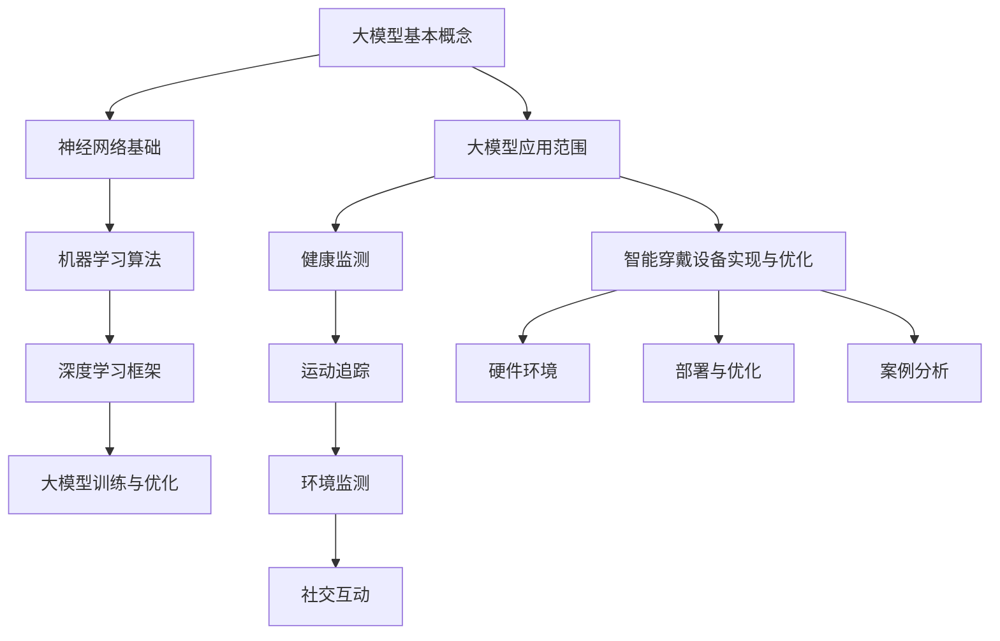
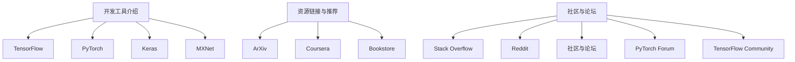

                 

### 《大模型在智能穿戴设备中的应用》

> **关键词**：大模型，智能穿戴设备，健康监测，运动追踪，环境监测，社交互动，神经网络，机器学习，深度学习框架，数据处理，硬件环境，优化

> **摘要**：本文将深入探讨大模型在智能穿戴设备中的应用。首先，我们将介绍大模型的基础概念和核心技术，然后详细阐述大模型在智能穿戴设备中的应用，包括健康监测、运动追踪、环境监测和社交互动。接着，我们将探讨如何在大模型与智能穿戴设备中实现与优化，并提供相关案例分析。最后，我们将展望大模型在智能穿戴设备中的未来发展趋势和面临的挑战。

<|assistant|>#### 第一部分：大模型技术基础

##### 第1章：大模型基本概念与架构

###### 1.1 大模型的定义与类型

大模型（Large Models）是指具有数十亿到数千亿参数规模的深度学习模型。它们通常用于处理复杂的数据集，如图像、文本和语音。大模型的类型主要包括：

- **Transformer模型**：基于自注意力机制，广泛用于自然语言处理、图像识别等领域。
- **GAN（生成对抗网络）**：由生成器和判别器组成，用于图像生成、图像修复等。
- **变分自编码器（VAE）**：用于数据生成和降维。
- **循环神经网络（RNN）**：用于序列数据，如时间序列分析、语音识别等。

###### 1.2 大模型的发展历程

大模型的发展经历了几个阶段：

- **早期阶段**：以2000年左右基于神经网络的语音识别和图像识别系统为标志。
- **深度学习阶段**：以2012年AlexNet在ImageNet竞赛中的突破性成果为标志，深度学习成为主流。
- **大模型阶段**：以2018年GPT-3发布为代表，标志着大规模模型的发展。

###### 1.3 大模型的架构原理

大模型的核心架构包括：

- **神经网络**：由多层神经元组成，用于学习和预测。
- **参数**：神经网络中的权重和偏置，用于调整模型。
- **优化算法**：如梯度下降、Adam等，用于调整参数。
- **训练数据**：用于训练模型的输入和输出。

###### 1.4 大模型的应用范围

大模型的应用范围广泛，包括：

- **自然语言处理**：文本分类、机器翻译、情感分析等。
- **计算机视觉**：图像分类、目标检测、人脸识别等。
- **语音识别**：语音转文字、语音合成等。
- **推荐系统**：个性化推荐、广告投放等。

##### 第2章：大模型核心技术

###### 2.1 神经网络基础

神经网络（Neural Networks）是深度学习的核心，由多层神经元组成，用于模拟人脑神经元的工作方式。其核心概念包括：

- **神经元**：模拟生物神经元，用于处理输入信息。
- **层**：神经网络由输入层、隐藏层和输出层组成。
- **激活函数**：用于引入非线性，常见的有Sigmoid、ReLU等。

###### 2.2 机器学习算法

机器学习算法是深度学习的基础，包括监督学习、无监督学习和强化学习。其核心算法包括：

- **线性回归**：用于预测连续值。
- **逻辑回归**：用于预测离散值。
- **支持向量机（SVM）**：用于分类和回归。
- **决策树**：用于分类和回归。

###### 2.3 深度学习框架

深度学习框架是用于构建和训练深度学习模型的工具，如TensorFlow、PyTorch等。其核心功能包括：

- **数据流图**：用于表示模型结构。
- **自动微分**：用于计算梯度。
- **优化器**：用于调整模型参数。

###### 2.4 大模型的训练与优化

大模型的训练与优化是深度学习的重要环节，包括：

- **数据预处理**：包括数据清洗、归一化、扩充等。
- **模型选择**：根据任务选择合适的模型。
- **训练过程**：包括前向传播、反向传播和参数更新。
- **优化策略**：包括批量大小、学习率调整等。

##### 第3章：大模型数据处理

###### 3.1 数据采集与预处理

数据采集与预处理是深度学习的基础，包括：

- **数据采集**：从各种来源获取数据，如公开数据集、传感器数据等。
- **数据清洗**：去除无效、错误的数据。
- **数据归一化**：将数据缩放到相同的范围。
- **数据扩充**：通过旋转、翻转、裁剪等操作增加数据量。

###### 3.2 特征提取与降维

特征提取与降维是深度学习的重要环节，包括：

- **特征提取**：从原始数据中提取有用的信息。
- **降维**：将高维数据转换为低维数据，减少计算量。
- **主成分分析（PCA）**：用于降维。
- **自动编码器（Autoencoder）**：用于特征提取。

###### 3.3 数据增强

数据增强是提高模型性能的重要手段，包括：

- **随机裁剪**：随机裁剪图像的一部分。
- **随机旋转**：随机旋转图像。
- **色彩变换**：随机改变图像的色彩。
- **噪声注入**：在图像中注入噪声。

###### 3.4 数据隐私保护

数据隐私保护是深度学习中的重要问题，包括：

- **数据加密**：对数据进行加密处理。
- **隐私保护机制**：如差分隐私、联邦学习等。
- **数据去识别化**：去除或修改个人信息。

##### 第4章：智能穿戴设备概述

###### 4.1 智能穿戴设备发展历程

智能穿戴设备的发展历程包括：

- **早期阶段**：以手表、手环等简单设备为主。
- **成长阶段**：以智能手机和移动互联网的发展为推动，智能穿戴设备逐渐普及。
- **成熟阶段**：以健康监测、运动追踪等为核心功能，智能穿戴设备成为日常生活的一部分。

###### 4.2 智能穿戴设备分类

智能穿戴设备可以按照功能进行分类，包括：

- **健康监测类**：如智能手表、健康手环等，用于监测心率、血压、睡眠等。
- **运动追踪类**：如智能手环、智能手表等，用于记录运动数据、分析运动模式等。
- **环境监测类**：如智能眼镜、智能头盔等，用于监测环境参数、提供辅助决策等。
- **社交互动类**：如智能耳机、智能手表等，用于语音交互、消息推送等。

###### 4.3 智能穿戴设备发展趋势

智能穿戴设备的发展趋势包括：

- **功能多样化**：从单一功能向多功能集成发展。
- **智能化**：通过大数据和人工智能技术提供更加智能的体验。
- **个性化**：根据用户需求提供个性化的服务。
- **可穿戴化**：从传统的衣物、配饰等向更加隐蔽、舒适的方向发展。

##### 第5章：大模型在智能穿戴设备中的应用

###### 5.1 大模型在健康监测中的应用

大模型在健康监测中的应用主要包括：

- **疾病预测**：通过分析健康数据预测疾病风险。
- **健康评估**：对用户健康状况进行评估。
- **个性化建议**：根据用户健康状况提供个性化的健康建议。

###### 5.2 大模型在运动追踪中的应用

大模型在运动追踪中的应用主要包括：

- **运动分析**：对用户运动数据进行分析，提供运动建议。
- **运动模式识别**：识别用户运动模式，提供个性化运动方案。
- **运动损伤预测**：通过数据分析预测运动损伤风险。

###### 5.3 大模型在环境监测中的应用

大模型在环境监测中的应用主要包括：

- **环境参数监测**：监测环境参数，如空气质量、温度、湿度等。
- **环境变化预测**：预测环境变化，提供预警。
- **环境保护建议**：根据环境数据提供环境保护建议。

###### 5.4 大模型在社交互动中的应用

大模型在社交互动中的应用主要包括：

- **语音交互**：实现智能语音助手功能。
- **消息推送**：根据用户行为和偏好推送消息。
- **社交网络分析**：分析社交网络，提供社交建议。

##### 第6章：大模型在智能穿戴设备中的实现与优化

###### 6.1 智能穿戴设备的硬件环境

智能穿戴设备的硬件环境主要包括：

- **处理器**：如ARM处理器、DSP等。
- **存储器**：如闪存、内存等。
- **传感器**：如心率传感器、加速度传感器等。
- **通信模块**：如蓝牙、Wi-Fi等。

###### 6.2 大模型在智能穿戴设备中的部署

大模型在智能穿戴设备中的部署主要包括：

- **模型压缩**：将大模型压缩到适合嵌入式设备的规模。
- **模型量化**：将模型的参数和权重量化，降低计算量。
- **模型部署**：将模型部署到智能穿戴设备上，包括编译、链接等。

###### 6.3 大模型在智能穿戴设备中的优化

大模型在智能穿戴设备中的优化主要包括：

- **算法优化**：优化模型算法，提高计算效率和准确性。
- **硬件优化**：优化硬件设计，提高计算性能。
- **能耗优化**：优化能耗管理，延长设备使用寿命。

###### 6.4 大模型在智能穿戴设备中的案例分析

大模型在智能穿戴设备中的案例分析包括：

- **案例一**：某智能手表的健康监测系统。
- **案例二**：某智能手环的运动追踪系统。
- **案例三**：某智能眼镜的环境监测系统。

##### 第7章：大模型在智能穿戴设备中的未来发展趋势

###### 7.1 技术创新与突破

大模型在智能穿戴设备中的未来发展趋势包括：

- **技术创新**：如量子计算、脑机接口等。
- **突破性应用**：如智能穿戴设备在医疗、工业、军事等领域的应用。

###### 7.2 应用领域拓展

大模型在智能穿戴设备中的应用领域将不断拓展，包括：

- **健康监测**：如心理健康、慢性病管理等。
- **运动追踪**：如运动康复、健身指导等。
- **环境监测**：如智慧城市、农业等。

###### 7.3 社会与伦理挑战

大模型在智能穿戴设备中的应用将面临社会与伦理挑战，包括：

- **数据隐私**：如何保护用户数据隐私。
- **伦理道德**：如何处理数据安全和用户隐私等。

##### 第8章：大模型在智能穿戴设备中的挑战与解决方案

###### 8.1 数据隐私与安全

大模型在智能穿戴设备中的挑战包括：

- **数据隐私**：如何保护用户数据隐私。
- **安全**：如何防止数据泄露和恶意攻击。

解决方案包括：

- **加密技术**：如对称加密、非对称加密等。
- **隐私保护机制**：如差分隐私、联邦学习等。
- **安全协议**：如SSL/TLS等。

###### 8.2 硬件资源限制

大模型在智能穿戴设备中的挑战包括：

- **计算资源**：如何降低计算资源需求。
- **存储资源**：如何降低存储资源需求。

解决方案包括：

- **模型压缩**：如剪枝、量化等。
- **数据流处理**：如分布式计算、流计算等。
- **能耗优化**：如能效优化、低功耗设计等。

###### 8.3 软件优化与更新

大模型在智能穿戴设备中的挑战包括：

- **软件优化**：如何提高软件性能和可靠性。
- **软件更新**：如何快速、安全地更新软件。

解决方案包括：

- **自动化测试**：如单元测试、集成测试等。
- **持续集成**：如Git、Jenkins等。
- **云服务**：如云存储、云计算等。

###### 8.4 跨学科合作与人才培养

大模型在智能穿戴设备中的应用需要跨学科合作，包括：

- **计算机科学**：如人工智能、机器学习等。
- **生物医学**：如健康监测、运动追踪等。
- **电子工程**：如硬件设计、传感器技术等。

人才培养包括：

- **学术教育**：如高校课程、研究生课程等。
- **职业教育**：如企业培训、在线教育等。
- **科研合作**：如产学研合作、国际交流等。

##### 附录 A：大模型开发工具与资源

###### A.1 开发工具介绍

大模型开发常用的工具包括：

- **TensorFlow**：谷歌开发的深度学习框架。
- **PyTorch**：Facebook开发的深度学习框架。
- **Keras**：Python的深度学习库。
- **MXNet**：Apache基金会开发的深度学习框架。

###### A.2 资源链接与推荐

大模型开发相关的资源链接与推荐包括：

- **GitHub**：大量的开源代码和项目。
- **ArXiv**：最新的科研论文。
- **Coursera**：在线课程资源。
- **Bookstore**：深度学习相关的书籍。

###### A.3 社区与论坛

大模型开发相关的社区与论坛包括：

- **TensorFlow Community**：TensorFlow的官方社区。
- **PyTorch Forum**：PyTorch的官方论坛。
- **Reddit**：关于深度学习的讨论区。
- **Stack Overflow**：编程问题解决社区。

### Mermaid 流程图

<|assistant|>### 附录

#### 附录 A：大模型开发工具与资源

##### A.1 开发工具介绍

1. **TensorFlow**：由谷歌开发，支持多种编程语言（如Python、C++等），是深度学习领域最常用的框架之一。

2. **PyTorch**：由Facebook开发，以其灵活性和动态计算图而著称，尤其适用于研究和原型开发。

3. **Keras**：一个高级神经网络API，以Python编写，能够以TensorFlow和Theano为后端运行。

4. **MXNet**：Apache基金会旗下开源项目，支持多种编程语言，具有良好的性能和灵活性。

##### A.2 资源链接与推荐

1. **GitHub**：[TensorFlow](https://github.com/tensorflow/tensorflow)、[PyTorch](https://github.com/pytorch/pytorch)、[Keras](https://github.com/keras-team/keras)、[MXNet](https://github.com/dmlc/mxnet)

2. **ArXiv**：[深度学习论文](https://arxiv.org/list/cs/LCC)

3. **Coursera**：[深度学习课程](https://www.coursera.org/courses?query=deep+learning)

4. **Bookstore**：[深度学习书籍](https://www.amazon.com/s?k=deep+learning+books&ref=nb_sb_noss_2)

##### A.3 社区与论坛

1. **TensorFlow Community**：[TensorFlow官方社区](https://www.tensorflow.org/community)

2. **PyTorch Forum**：[PyTorch官方论坛](https://discuss.pytorch.org/)

3. **Reddit**：[深度学习讨论区](https://www.reddit.com/r/deeplearning/)

4. **Stack Overflow**：[编程问题解决社区](https://stackoverflow.com/questions/tagged/deep-learning)

### Mermaid 流程图

---

**作者**：AI天才研究院/AI Genius Institute & 禅与计算机程序设计艺术 /Zen And The Art of Computer Programming

