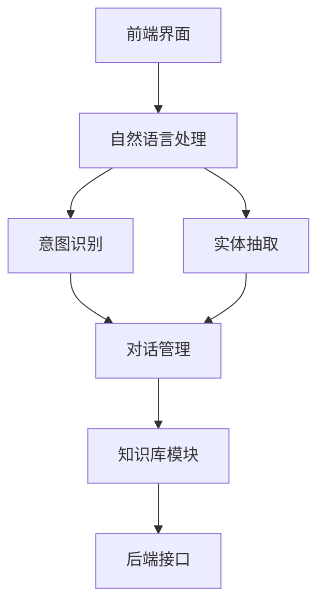

                 

### 引言

在当今数字时代，人工智能（AI）技术的迅猛发展正深刻改变着各行各业。法律服务作为社会运转的重要一环，自然也难以逃脱这一变革的浪潮。大模型（Large Models），如GPT、BERT等，凭借其强大的自然语言处理（NLP）能力，已经在多个领域展示了其应用价值。本文旨在探讨大模型在法律服务领域的应用探索，通过系统性地分析大模型在法律服务中的应用基础、技术基础以及实际应用案例，为读者提供一份全面、深入的技术指南。

本文结构如下：

- **第一部分：大模型在法律服务领域的应用概述**
  - 第1章：大模型在法律服务领域的应用基础
  - 第2章：自然语言处理与法律文本分析
  - 第3章：智能合同审查与自动化审核
  - 第4章：法律咨询智能助手
  - 第5章：案件预测与风险评估
  - 第6章：区块链技术在法律服务中的应用
  - 第7章：未来展望与挑战

- **第二部分：大模型技术基础**
  - 第8章：大模型架构与训练方法
  - 第9章：大规模数据处理与优化
  - 第10章：大模型在法律文本处理中的挑战与解决方案

- **第三部分：大模型在法律服务中的应用**
  - 第11章：大模型在法律文本分类中的应用
  - 第12章：大模型在法律文本情感分析中的应用
  - 第13章：大模型在智能合同审查中的应用
  - 第14章：大模型在法律咨询中的应用
  - 第15章：大模型在案件预测与风险评估中的应用

- **第四部分：大模型在法律服务中的未来展望**
  - 第16章：大模型在法律服务中的发展趋势
  - 第17章：大模型在法律服务中的技术挑战
  - 第18章：大模型在法律服务中的伦理问题与解决方案

通过以上内容的详细探讨，本文希望读者能够全面了解大模型在法律服务领域的前沿应用，并为其未来的发展提供一些有价值的思考和参考。

关键词：大模型、人工智能、法律服务、自然语言处理、智能合同审查、法律咨询、案件预测、区块链技术

摘要：本文系统地探讨了大模型在法律服务领域的应用探索。从应用概述、技术基础到实际应用案例，全面分析了大模型在法律文本分析、智能合同审查、法律咨询、案件预测等领域的应用价值。同时，讨论了大模型在法律服务中面临的技术挑战和伦理问题，并对其未来发展进行了展望。通过本文的研究，希望为法律服务业的数字化转型提供一些有益的思路和解决方案。

### 第一部分：大模型在法律服务领域的应用概述

#### 第1章：大模型在法律服务领域的应用基础

在法律服务领域，大模型的应用正在迅速扩展，它们通过处理和分析大量的法律文本数据，为法律专业人士提供强大的支持。本章节将探讨大模型在法律服务领域的基础概念、核心需求以及应用场景，从而为后续章节的深入探讨奠定基础。

##### 1.1 大模型的定义与应用

**核心概念与联系**

首先，我们需要明确大模型的基本概念。大模型通常指的是参数量庞大的神经网络模型，如GPT（Generative Pre-trained Transformer）、BERT（Bidirectional Encoder Representations from Transformers）等。这些模型通过在大规模数据集上进行预训练，可以学习到丰富的语言知识，并在此基础上进行下游任务的细粒度调整。

大模型在法律服务中的应用基础在于其强大的自然语言处理能力。法律文本具有复杂性高、词汇量大、语境依赖强等特点，传统的自然语言处理方法往往难以胜任。而大模型，尤其是预训练模型，通过大规模数据的学习，能够更好地理解法律文本中的语义和逻辑关系。

**大模型的定义**

大模型通常是指那些具有数十亿甚至千亿参数的神经网络模型。这些模型通过深度学习算法，可以从大量文本数据中学习到丰富的语言模式和结构信息。例如，GPT-3模型拥有1750亿个参数，能够生成高质量的自然语言文本。

**大模型的类型和特点**

1. **预训练模型**：如GPT、BERT等，通过在大规模语料库上进行预训练，学习到通用语言表征。
2. **微调模型**：在预训练模型的基础上，针对特定任务进行微调，以适应特定领域的需求。
3. **迁移学习模型**：利用预训练模型在法律领域的性能，通过少量标注数据实现任务迁移。

**大模型在法律服务中的应用**

大模型在法律服务中的应用场景广泛，包括但不限于：

- **合同审查**：通过分析合同文本，自动识别合同中的潜在风险点。
- **法律咨询**：提供智能化的法律咨询服务，解答用户常见法律问题。
- **案件预测**：基于历史案件数据和文本，预测未来案件的走向和结果。
- **文本分类与情感分析**：对法律文本进行分类和情感分析，辅助法律决策。

##### 1.2 法律服务的核心需求

**法律文本分析**

法律文本分析是法律服务中的重要组成部分。它包括文本分类、情感分析、关键词提取、实体识别等多个子任务。大模型在这方面的应用，极大地提升了法律文本处理的效率和质量。

- **文本分类**：对法律文本进行分类，如合同、判决书、法律意见书等。
- **情感分析**：分析法律文本中的情感倾向，如积极、消极、中性等。
- **关键词提取**：从法律文本中提取关键术语和概念。
- **实体识别**：识别法律文本中的人名、地名、机构名等实体。

**智能合同审查**

智能合同审查是法律服务中的一个关键应用。大模型可以通过分析合同文本，自动识别合同中的关键条款、潜在风险以及条款之间的逻辑关系。

- **合同要素分析**：分析合同中的各种要素，如条款、金额、期限、违约责任等。
- **风险识别**：自动识别合同中的潜在风险，如合同条款不完整、术语模糊等。
- **条款优化**：根据合同条款的合理性和风险，提出优化建议。

**法律咨询**

法律咨询是法律服务的核心之一。大模型可以通过分析用户提问，提供智能化的法律咨询服务。

- **常见问题解答**：自动回答用户常见的法律问题。
- **法律建议**：基于用户的具体情况，提供法律建议和解决方案。
- **案例参考**：根据用户的提问，提供相关案例和法律条文。

**案件预测与风险评估**

案件预测和风险评估是法律工作中的一项重要任务。大模型可以通过分析历史案件数据和文本，预测未来案件的走向和结果，提供风险评估报告。

- **案件趋势分析**：分析历史案件数据，预测未来案件的发展趋势。
- **风险评估**：根据案件数据和文本，评估案件的潜在风险和影响。
- **决策支持**：为法律专业人士提供决策支持，辅助案件处理。

##### 1.3 大模型在法律服务中的应用场景

**智能合同审查**

智能合同审查是法律服务中的一项重要应用。大模型可以通过分析合同文本，自动识别合同中的关键条款、潜在风险以及条款之间的逻辑关系。

- **合同要素分析**：大模型可以分析合同中的各种要素，如条款、金额、期限、违约责任等，确保合同内容完整、合理。
- **风险识别**：大模型可以自动识别合同中的潜在风险，如合同条款不完整、术语模糊等，并提供风险预警。
- **条款优化**：大模型可以根据合同条款的合理性和风险，提出优化建议，帮助法律专业人士更好地处理合同。

**法律咨询**

法律咨询是法律服务的核心之一。大模型可以通过分析用户提问，提供智能化的法律咨询服务。

- **常见问题解答**：大模型可以自动回答用户常见的法律问题，如合同纠纷、劳动争议、知识产权等。
- **法律建议**：大模型可以基于用户的具体情况，提供法律建议和解决方案，帮助用户更好地处理法律问题。
- **案例参考**：大模型可以根据用户的提问，提供相关案例和法律条文，帮助用户更好地理解法律问题。

**案件预测与风险评估**

案件预测和风险评估是法律工作中的一项重要任务。大模型可以通过分析历史案件数据和文本，预测未来案件的走向和结果，提供风险评估报告。

- **案件趋势分析**：大模型可以分析历史案件数据，预测未来案件的发展趋势，帮助法律专业人士更好地应对可能的风险。
- **风险评估**：大模型可以根据案件数据和文本，评估案件的潜在风险和影响，提供风险评估报告，为法律专业人士提供决策支持。
- **决策支持**：大模型可以基于案件数据和文本，为法律专业人士提供决策支持，辅助案件处理。

**法律研究**

大模型在法律研究中的应用也非常广泛。通过分析大量法律文献和数据，大模型可以提供快速、准确的法律信息检索和知识图谱构建。

- **法律信息检索**：大模型可以快速检索相关的法律条文、案例和文献，帮助法律专业人士更高效地进行法律研究。
- **知识图谱构建**：大模型可以通过对法律文本的语义分析，构建法律知识图谱，为法律专业人士提供直观、清晰的法律知识结构。

**法律文档自动生成**

大模型还可以用于法律文档的自动生成，如合同、判决书、法律意见书等。通过训练大模型，可以自动生成高质量的法律文档，节省法律专业人士的时间和精力。

- **合同生成**：大模型可以根据用户的需求，自动生成合同文本，包括合同条款、违约责任等。
- **判决书生成**：大模型可以根据案件数据和法律条文，自动生成判决书，提高审判效率和准确性。
- **法律意见书生成**：大模型可以根据用户的需求，自动生成法律意见书，为法律专业人士提供参考。

**法律文档分类与标注**

大模型还可以用于法律文档的分类与标注，如对法律文本进行分类、标注关键词和实体等。

- **文本分类**：大模型可以对法律文本进行分类，如合同文本、判决书文本等，为法律文档的管理和检索提供支持。
- **关键词标注**：大模型可以对法律文本中的关键词进行标注，帮助法律专业人士快速识别和理解法律文本。
- **实体识别**：大模型可以对法律文本中的实体进行识别，如人名、地名、机构名等，为法律文档的自动分析和检索提供支持。

**智能法律问答**

大模型可以用于智能法律问答系统，为用户提供实时、个性化的法律咨询服务。

- **智能问答**：大模型可以理解用户的提问，并提供准确、详细的回答。
- **个性化服务**：大模型可以根据用户的需求和情况，提供个性化的法律建议和服务。
- **实时更新**：大模型可以实时更新法律知识和法规变化，为用户提供最新、最准确的法律信息。

**案件预测**

大模型可以用于案件预测，通过对历史案件数据和文本的分析，预测未来案件的走向和结果。

- **趋势预测**：大模型可以分析历史案件数据，预测未来案件的发展趋势，帮助法律专业人士做出更准确的判断。
- **结果预测**：大模型可以根据案件数据和文本，预测案件的结果，为法律专业人士提供决策支持。
- **风险评估**：大模型可以评估案件的潜在风险和影响，为法律专业人士提供风险评估报告。

**智能合同管理**

大模型可以用于智能合同管理，通过对合同数据的分析和处理，提高合同管理的效率和准确性。

- **合同分析**：大模型可以对合同文本进行分析，提取合同的关键条款和要素，帮助法律专业人士更好地理解和管理合同。
- **合同优化**：大模型可以根据合同条款的合理性和风险，提出优化建议，帮助法律专业人士更好地管理合同。
- **合同监控**：大模型可以监控合同执行过程中的关键指标和风险，及时发现和解决潜在问题。

**法律文档自动化处理**

大模型可以用于法律文档的自动化处理，如合同审查、法律意见书生成、判决书生成等。

- **合同审查**：大模型可以对合同文本进行审查，识别合同中的潜在风险和问题，提供审查报告。
- **法律意见书生成**：大模型可以根据用户的需求，自动生成法律意见书，为法律专业人士提供参考。
- **判决书生成**：大模型可以根据案件数据和法律条文，自动生成判决书，提高审判效率和准确性。

**法律知识图谱构建**

大模型可以用于法律知识图谱的构建，通过对法律文本的语义分析，构建法律知识图谱，为法律研究和应用提供支持。

- **知识提取**：大模型可以从法律文本中提取知识，构建法律知识图谱。
- **知识融合**：大模型可以将不同来源的法律知识进行融合，构建一个统一的法律知识体系。
- **知识查询**：大模型可以支持法律知识的查询和检索，为法律专业人士提供便捷的法律知识服务。

##### 1.4 大模型在法律服务中的优势与挑战

**优势**

1. **高效处理大量法律文本**：大模型可以快速处理大量法律文本，提高法律工作的效率。
2. **提升法律服务的质量**：通过精准的法律分析，大模型可以提升法律服务的准确性，减少人为错误。
3. **智能化服务**：大模型可以提供智能化的法律咨询服务，满足用户的个性化需求。

**挑战**

1. **数据隐私与安全**：大模型处理大量数据，需要确保数据的安全和隐私。
2. **法律合规问题**：大模型在应用中需要符合相关法律法规，避免法律风险。
3. **算法透明性和可解释性**：大模型决策过程复杂，需要提高算法的透明性和可解释性，以增强法律人士的信任。

通过对大模型在法律服务领域的应用基础进行详细探讨，我们可以更好地理解大模型在这一领域的潜力与挑战。在接下来的章节中，我们将进一步深入探讨大模型的技术基础和实际应用案例，以期为法律服务行业的数字化转型提供有力的支持。

#### 第2章：自然语言处理与法律文本分析

在法律服务领域，自然语言处理（NLP）技术的应用日益广泛。NLP作为人工智能的核心技术之一，能够帮助法律专业人士更高效地处理和分析大量法律文本数据。本章将详细介绍NLP的基础算法、文本分类与情感分析，并探讨这些技术在法律文本分析中的具体应用。

##### 2.1 自然语言处理基础

**核心算法原理讲解**

自然语言处理涉及多种基础算法，其中一些关键算法包括词嵌入（Word Embedding）、序列模型（Sequence Model）和注意力机制（Attention Mechanism）。以下将简要介绍这些算法的基本原理和应用。

1. **词嵌入（Word Embedding）**

词嵌入是将词汇映射到固定维度的向量空间的过程。Word2Vec和BERT是常用的词嵌入算法。

- **Word2Vec**：Word2Vec通过预测词的上下文词来学习词汇的嵌入向量。它有两种变体：连续词袋（CBOW）和Skip-Gram。

  ```python
  # CBOW算法伪代码
  function CBOW(context, target_word):
      inputs = [embed(word) for word in context]
      outputs = embed(target_word)
      model = neural_network(inputs, outputs)
      return model
  ```

- **BERT**：BERT通过同时预测单词的前后文来学习词汇的嵌入向量，具有更强的语义理解能力。

  ```python
  # BERT算法伪代码
  function BERT(sentence):
      inputs = [embed(word) for word in sentence]
      outputs = [embed(word) for word in sentence]
      model = neural_network(inputs, outputs)
      return model
  ```

2. **序列模型（Sequence Model）**

序列模型用于处理序列数据，如文本序列。长短期记忆网络（LSTM）和门控循环单元（GRU）是常用的序列模型。

- **LSTM**：LSTM通过引入记忆单元来学习长期依赖信息。

  ```python
  # LSTM算法伪代码
  function LSTM(input_sequence):
      hidden_state = initial_state
      for input in input_sequence:
          hidden_state = LSTM_cell(input, hidden_state)
      return hidden_state
  ```

- **GRU**：GRU简化了LSTM的结构，在处理长时间序列时更加高效。

  ```python
  # GRU算法伪代码
  function GRU(input_sequence):
      hidden_state = initial_state
      for input in input_sequence:
          hidden_state = GRU_cell(input, hidden_state)
      return hidden_state
  ```

3. **注意力机制（Attention Mechanism）**

注意力机制是一种用于捕捉序列中关键信息的技术，广泛应用于机器翻译、文本摘要等任务。

- **注意力计算**：注意力机制通过计算每个输入序列元素的权重来生成加权表示。

  ```python
  # 注意力计算伪代码
  function Attention(input_sequence, query):
      attention_weights = [score(input, query) for input in input_sequence]
      weighted_input = [input * weight for input, weight in zip(input_sequence, attention_weights)]
      return weighted_input
  ```

**数学模型和数学公式**

1. **词嵌入的数学模型**

词嵌入可以通过神经网络模型进行学习，常用的模型包括CBOW和Skip-Gram。

- **CBOW的数学模型**：

  $$\text{output} = \text{softmax}(\text{W}[\text{context}_1, \text{context}_2, \ldots, \text{context}_C] \cdot \text{b})$$

  其中，$\text{context}_i$表示上下文词的嵌入向量，$W$是权重矩阵，$b$是偏置项。

2. **文本分类的损失函数**

在文本分类任务中，常用的损失函数是交叉熵损失函数。

- **交叉熵损失函数**：

  $$\text{Loss} = -\sum_{i} y_i \cdot \log(\hat{y}_i)$$

  其中，$y_i$是真实标签，$\hat{y}_i$是模型预测的概率分布。

**文本分类与情感分析**

文本分类和情感分析是NLP中常见的任务，广泛应用于法律文本处理。

- **文本分类**：文本分类是将文本数据分为预定义的类别。常见的算法包括朴素贝叶斯、支持向量机（SVM）和深度学习模型。

  - **朴素贝叶斯**：基于贝叶斯定理，通过词的频率和条件概率进行分类。

    $$P(\text{class} | \text{word}) = \frac{P(\text{word} | \text{class}) \cdot P(\text{class})}{P(\text{word})}$$

  - **支持向量机**：通过最大化分类边界，将文本数据分为不同的类别。

    $$\text{maximize} \ \sum_{i=1}^n (\text{w} \cdot \text{x}_i - \text{b})^2$$

  - **深度学习模型**：如卷积神经网络（CNN）和循环神经网络（RNN）等，通过学习文本的特征表示进行分类。

    $$\text{output} = \text{softmax}(\text{W} \cdot \text{h} + \text{b})$$

- **情感分析**：情感分析是通过分析文本的情感倾向，判断文本是正面、负面还是中性。

  - **基于词典的方法**：通过查找文本中情感词汇的词典，判断情感倾向。

    $$\text{sentiment} = \sum_{i} \text{weight}_i \cdot \text{word}_i$$

  - **基于机器学习的方法**：通过训练分类模型，如SVM或深度学习模型，对文本进行情感分类。

    $$\text{output} = \text{softmax}(\text{W} \cdot \text{h} + \text{b})$$

**文本分类与情感分析在法律文本分析中的应用**

法律文本分析中的文本分类和情感分析具有重要作用，可用于法律文本的自动分类、合同条款的情感分析等。

- **法律文本分类**：通过对法律文本进行分类，可以将法律文档分为合同、判决书、法律意见书等类别，便于管理和检索。

  - **案例**：使用深度学习模型对法律文档进行分类，可以提高分类的准确性和效率。

    $$\text{output} = \text{softmax}(\text{W} \cdot \text{h} + \text{b})$$

- **合同条款情感分析**：通过对合同条款进行情感分析，可以识别合同条款的积极或消极倾向，帮助法律专业人士评估合同的风险。

  - **案例**：使用基于BERT的模型对合同条款进行情感分析，可以准确识别条款的情感倾向。

    $$\text{output} = \text{softmax}(\text{W} \cdot \text{h} + \text{b})$$

##### 2.2 法律文本分析算法

法律文本具有复杂的结构、丰富的语义信息和特定的术语。因此，针对法律文本的NLP算法需要具备较强的语义理解能力和特定的处理策略。

**关键词提取**

关键词提取是从法律文本中提取出重要的词汇和短语，用于后续的分析和处理。常见的关键词提取方法包括：

- **基于词典的方法**：通过查找预定义的法律术语词典，提取文本中的关键词。

  $$\text{keywords} = \{\text{word} | \text{word} \in \text{dictionary}\}$$

- **基于统计的方法**：通过计算词频、互信息等统计指标，提取高频且具有高相关性的关键词。

  $$\text{MI}(\text{word}_i, \text{word}_j) = \frac{P(\text{word}_i \cap \text{word}_j) \cdot P(\text{word}_i) \cdot P(\text{word}_j)}{P(\text{word}_i) \cdot P(\text{word}_j)}$$

- **基于深度学习的方法**：使用神经网络模型，通过学习文本的特征表示，提取关键词。

  $$\text{output} = \text{softmax}(\text{W} \cdot \text{h} + \text{b})$$

**实体识别**

实体识别是从法律文本中识别出具有特定意义和关系的实体，如人名、地名、机构名等。常见的方法包括：

- **基于规则的方法**：通过编写具体的规则和模式，识别文本中的实体。

  ```regex
  # 匹配人名
  ([A-Z][a-z]+) (\w+)
  ```

- **基于统计的方法**：通过统计模型，如条件随机场（CRF），识别文本中的实体。

  $$P(\text{entity}_i | \text{context}) = \frac{1}{Z} \exp(\theta \cdot \text{context})$$

- **基于深度学习的方法**：使用神经网络模型，通过学习文本的特征表示，识别实体。

  $$\text{output} = \text{softmax}(\text{W} \cdot \text{h} + \text{b})$$

**关系提取**

关系提取是从法律文本中识别出实体之间的语义关系，如合同中的违约责任、判决书中的判决依据等。常见的方法包括：

- **基于规则的方法**：通过编写具体的规则和模式，识别文本中的关系。

  ```regex
  # 匹配合同条款关系
  ([\w\s]+) \-\> ([\w\s]+)
  ```

- **基于统计的方法**：通过统计模型，如条件随机场（CRF），识别文本中的关系。

  $$P(\text{relation}_i | \text{context}) = \frac{1}{Z} \exp(\theta \cdot \text{context})$$

- **基于深度学习的方法**：使用神经网络模型，通过学习文本的特征表示，识别关系。

  $$\text{output} = \text{softmax}(\text{W} \cdot \text{h} + \text{b})$$

##### 2.3 法律文本分类与情感分析的应用场景

**合同文本分类**

合同文本分类是法律文本分析中的常见任务，通过对合同文本进行分类，可以方便地管理和检索合同文档。

- **应用场景**：企业法律部门可以使用文本分类模型，将合同文本分为采购合同、租赁合同、劳动合同等类别，便于管理和归档。

  ```python
  # 合同文本分类示例
  import tensorflow as tf
  from tensorflow.keras.models import Sequential
  from tensorflow.keras.layers import Embedding, LSTM, Dense

  model = Sequential()
  model.add(Embedding(vocabulary_size, embedding_dim))
  model.add(LSTM(128))
  model.add(Dense(num_classes, activation='softmax'))

  model.compile(optimizer='adam', loss='categorical_crossentropy', metrics=['accuracy'])
  model.fit(X_train, y_train, epochs=10, batch_size=32)
  ```

**合同条款情感分析**

合同条款情感分析可以帮助法律专业人士识别合同条款的积极或消极倾向，从而评估合同的风险。

- **应用场景**：律师事务所可以使用情感分析模型，对合同条款进行情感分析，识别条款中的潜在风险。

  ```python
  # 合同条款情感分析示例
  import tensorflow as tf
  from tensorflow.keras.models import Sequential
  from tensorflow.keras.layers import Embedding, LSTM, Dense

  model = Sequential()
  model.add(Embedding(vocabulary_size, embedding_dim))
  model.add(LSTM(128))
  model.add(Dense(1, activation='sigmoid'))

  model.compile(optimizer='adam', loss='binary_crossentropy', metrics=['accuracy'])
  model.fit(X_train, y_train, epochs=10, batch_size=32)
  ```

**判决书文本分类与情感分析**

判决书文本分类与情感分析可以帮助法律专业人士快速理解判决书的类别和倾向，从而为案件分析提供支持。

- **应用场景**：法院和法律研究机构可以使用文本分类与情感分析模型，对判决书进行分类和情感分析，为案件研究和决策提供支持。

  ```python
  # 判决书文本分类与情感分析示例
  import tensorflow as tf
  from tensorflow.keras.models import Sequential
  from tensorflow.keras.layers import Embedding, LSTM, Dense

  model = Sequential()
  model.add(Embedding(vocabulary_size, embedding_dim))
  model.add(LSTM(128))
  model.add(Dense(num_classes, activation='softmax'))

  model.compile(optimizer='adam', loss='categorical_crossentropy', metrics=['accuracy'])
  model.fit(X_train, y_train, epochs=10, batch_size=32)

  # 情感分析
  model = Sequential()
  model.add(Embedding(vocabulary_size, embedding_dim))
  model.add(LSTM(128))
  model.add(Dense(1, activation='sigmoid'))

  model.compile(optimizer='adam', loss='binary_crossentropy', metrics=['accuracy'])
  model.fit(X_train, y_train, epochs=10, batch_size=32)
  ```

通过以上内容，我们可以看到自然语言处理与法律文本分析在法律服务领域的重要性和应用价值。在下一章中，我们将进一步探讨大模型在智能合同审查与自动化审核中的应用，以期为法律服务提供更加高效和智能的解决方案。

#### 第3章：智能合同审查与自动化审核

智能合同审查与自动化审核是法律服务中的一项重要应用，通过利用大模型的自然语言处理能力，可以显著提高合同审查的效率和质量。本章将详细介绍智能合同审查的原理、实现方法以及其在实际应用中的效果。

##### 3.1 智能合同审查的原理

**核心算法原理讲解**

智能合同审查的核心在于利用大模型对合同文本进行分析和识别，从而自动识别合同中的关键条款、潜在风险以及条款之间的逻辑关系。以下是智能合同审查中的几个关键算法：

1. **文本分类算法**

文本分类算法用于将合同文本分为不同的类别，如租赁合同、劳动合同、采购合同等。常用的算法包括朴素贝叶斯、支持向量机（SVM）和深度学习模型。

- **朴素贝叶斯**：基于贝叶斯定理，通过词的频率和条件概率进行分类。

  $$P(\text{class} | \text{word}) = \frac{P(\text{word} | \text{class}) \cdot P(\text{class})}{P(\text{word})}$$

- **支持向量机**：通过最大化分类边界，将文本数据分为不同的类别。

  $$\text{maximize} \ \sum_{i=1}^n (\text{w} \cdot \text{x}_i - \text{b})^2$$

- **深度学习模型**：如卷积神经网络（CNN）和循环神经网络（RNN）等，通过学习文本的特征表示进行分类。

  $$\text{output} = \text{softmax}(\text{W} \cdot \text{h} + \text{b})$$

2. **文本分类与情感分析**

文本分类与情感分析用于识别合同条款的情感倾向，如积极、消极或中性。这有助于法律专业人士快速了解合同条款的倾向，从而更好地评估合同的风险。

- **情感分析**：通过分析合同条款中的词汇和语法结构，判断情感倾向。

  $$\text{output} = \text{softmax}(\text{W} \cdot \text{h} + \text{b})$$

3. **关键词提取与实体识别**

关键词提取与实体识别用于提取合同文本中的关键信息，如人名、地名、机构名等。这些信息对于后续的合同审查和风险评估至关重要。

- **关键词提取**：通过计算词频、互信息等统计指标，提取文本中的高频关键词。

  $$\text{MI}(\text{word}_i, \text{word}_j) = \frac{P(\text{word}_i \cap \text{word}_j) \cdot P(\text{word}_i) \cdot P(\text{word}_j)}{P(\text{word}_i) \cdot P(\text{word}_j)}$$

- **实体识别**：通过使用命名实体识别（NER）算法，从文本中识别出特定类型的实体。

  $$\text{output} = \text{softmax}(\text{W} \cdot \text{h} + \text{b})$$

**数学模型和数学公式**

1. **词嵌入的数学模型**

词嵌入是将词汇映射到固定维度的向量空间，常用的模型包括Word2Vec和BERT。

- **Word2Vec的数学模型**：

  $$\text{output} = \text{softmax}(\text{W}[\text{context}_1, \text{context}_2, \ldots, \text{context}_C] \cdot \text{b})$$

  其中，$\text{context}_i$表示上下文词的嵌入向量，$W$是权重矩阵，$b$是偏置项。

2. **文本分类的损失函数**

在文本分类任务中，常用的损失函数是交叉熵损失函数。

- **交叉熵损失函数**：

  $$\text{Loss} = -\sum_{i} y_i \cdot \log(\hat{y}_i)$$

  其中，$y_i$是真实标签，$\hat{y}_i$是模型预测的概率分布。

##### 3.2 智能合同审查的实现方法

**开发环境搭建**

为了实现智能合同审查，首先需要搭建一个适合的开发环境。以下是搭建智能合同审查开发环境的基本步骤：

1. **硬件环境**：

   - **计算资源**：由于智能合同审查涉及大规模数据处理和模型训练，需要具备较强的计算能力。推荐使用GPU加速计算，如NVIDIA Tesla V100等。
   - **存储空间**：需要足够的存储空间来存储训练数据和模型文件，推荐使用SSD硬盘。

2. **软件环境**：

   - **操作系统**：推荐使用Linux系统，如Ubuntu 18.04。
   - **编程语言**：Python是智能合同审查开发的主要编程语言，推荐使用Anaconda环境管理器来安装和管理Python及其相关库。
   - **深度学习框架**：TensorFlow和PyTorch是常用的深度学习框架，推荐根据个人偏好选择其中一个。
   - **文本处理库**：NLTK和SpaCy是常用的文本处理库，用于文本预处理和实体识别。

3. **数据准备**

   - **数据来源**：收集大量的合同文本数据，包括各类合同样本，如租赁合同、劳动合同、采购合同等。
   - **数据清洗**：对收集到的合同文本进行清洗，去除无关信息，如格式化文本、去除停用词等。
   - **数据标注**：对合同文本进行标注，标记出合同中的关键条款、风险点等。

**数据预处理**

数据预处理是智能合同审查中至关重要的一步，主要包括文本清洗、分词、词嵌入等。

1. **文本清洗**

   - **去除格式化标记**：去除合同文本中的HTML标签、换行符等格式化标记。
   - **去除停用词**：去除常见的无意义的停用词，如“的”、“了”、“在”等。

2. **分词**

   - **中文分词**：使用中文分词工具，如jieba分词，将文本分割成词语序列。
   - **词性标注**：对每个词语进行词性标注，用于后续的实体识别和文本分类。

3. **词嵌入**

   - **预训练词嵌入**：使用预训练的词嵌入模型，如Word2Vec、BERT，将词语映射到高维向量空间。
   - **自定义词嵌入**：对于特定的合同术语，可以自定义词嵌入向量。

**模型训练**

在数据预处理完成后，接下来是模型训练。以下是智能合同审查模型的训练过程：

1. **文本分类模型**

   - **数据准备**：将合同文本分为训练集和测试集，确保数据分布均衡。
   - **模型架构**：构建文本分类模型，如卷积神经网络（CNN）、循环神经网络（RNN）或BERT模型。
   - **模型训练**：使用训练集对模型进行训练，通过反向传播算法和优化器（如Adam）调整模型参数。
   - **模型评估**：使用测试集对模型进行评估，计算分类准确率、召回率等指标。

2. **文本分类与情感分析模型**

   - **数据准备**：将合同条款分为正面、负面和中性标签。
   - **模型架构**：构建文本分类与情感分析模型，如二元分类模型或多标签分类模型。
   - **模型训练**：使用训练集对模型进行训练，通过反向传播算法和优化器调整模型参数。
   - **模型评估**：使用测试集对模型进行评估，计算分类准确率、召回率等指标。

3. **关键词提取与实体识别模型**

   - **数据准备**：收集大量的法律术语和实体标注数据。
   - **模型架构**：构建关键词提取与实体识别模型，如循环神经网络（RNN）、长短期记忆网络（LSTM）或基于BERT的模型。
   - **模型训练**：使用训练集对模型进行训练，通过反向传播算法和优化器调整模型参数。
   - **模型评估**：使用测试集对模型进行评估，计算关键词提取准确率和实体识别准确率等指标。

**代码解读与分析**

以下是一个简单的智能合同审查模型实现示例，包括文本预处理、模型训练和评估：

```python
import tensorflow as tf
from tensorflow.keras.preprocessing.text import Tokenizer
from tensorflow.keras.preprocessing.sequence import pad_sequences
from tensorflow.keras.models import Sequential
from tensorflow.keras.layers import Embedding, LSTM, Dense, EmbeddingLayer

# 文本预处理
tokenizer = Tokenizer(num_words=10000)
tokenizer.fit_on_texts(contract_texts)
X = tokenizer.texts_to_sequences(contract_texts)
X = pad_sequences(X, maxlen=100)

# 构建模型
model = Sequential()
model.add(Embedding(10000, 64, input_length=100))
model.add(LSTM(128))
model.add(Dense(1, activation='sigmoid'))

# 编译模型
model.compile(optimizer='adam', loss='binary_crossentropy', metrics=['accuracy'])

# 训练模型
model.fit(X, labels, epochs=10, batch_size=32)

# 评估模型
evaluation = model.evaluate(X, labels)
print(f"Accuracy: {evaluation[1]}")
```

通过以上示例，我们可以看到智能合同审查的核心步骤和实现方法。在实际应用中，智能合同审查系统可以进一步优化和改进，以提高审查效率和准确性。

##### 3.3 智能合同审查的应用案例

**智能合同审查系统**

智能合同审查系统是一个基于大模型和NLP技术的合同审查工具，能够自动分析合同文本，识别关键条款和潜在风险。以下是智能合同审查系统的实际应用案例：

1. **企业合同管理**

   - **应用场景**：某企业需要管理大量的合同，包括采购合同、销售合同、租赁合同等。
   - **系统功能**：智能合同审查系统可以对合同进行自动分类、关键词提取和风险识别。
   - **效果**：通过智能合同审查系统，企业可以快速识别合同中的关键条款和潜在风险，提高合同管理的效率和准确性。

2. **法律咨询服务**

   - **应用场景**：某律师事务所提供法律咨询服务，需要快速分析用户提交的合同文本。
   - **系统功能**：智能合同审查系统可以为用户提供合同条款的详细解读、风险提示和法律建议。
   - **效果**：通过智能合同审查系统，律师事务所可以提供更加精准和高效的法律咨询服务，提高客户满意度。

3. **法院案件审理**

   - **应用场景**：法院在审理合同纠纷案件时，需要对合同文本进行深入分析。
   - **系统功能**：智能合同审查系统可以帮助法官快速识别合同中的关键条款和纠纷点，辅助案件审理。
   - **效果**：通过智能合同审查系统，法院可以更加高效地审理合同纠纷案件，提高司法效率。

**代码解读与分析**

以下是一个简单的智能合同审查系统的实现示例，包括合同文本预处理、模型训练和风险识别：

```python
import tensorflow as tf
from tensorflow.keras.preprocessing.text import Tokenizer
from tensorflow.keras.preprocessing.sequence import pad_sequences
from tensorflow.keras.models import Sequential
from tensorflow.keras.layers import Embedding, LSTM, Dense, EmbeddingLayer

# 合同文本预处理
tokenizer = Tokenizer(num_words=10000)
tokenizer.fit_on_texts(contract_texts)
X = tokenizer.texts_to_sequences(contract_texts)
X = pad_sequences(X, maxlen=100)

# 构建模型
model = Sequential()
model.add(Embedding(10000, 64, input_length=100))
model.add(LSTM(128))
model.add(Dense(1, activation='sigmoid'))

# 编译模型
model.compile(optimizer='adam', loss='binary_crossentropy', metrics=['accuracy'])

# 训练模型
model.fit(X, contract_labels, epochs=10, batch_size=32)

# 风险识别
risk_scores = model.predict(X)
for i, score in enumerate(risk_scores):
    if score > 0.5:
        print(f"Contract {i+1} has high risk.")
    else:
        print(f"Contract {i+1} has low risk.")
```

通过以上示例，我们可以看到智能合同审查系统的核心功能和技术实现。在实际应用中，智能合同审查系统可以根据具体需求进行优化和扩展，以提供更加全面和智能的合同审查服务。

##### 3.4 智能合同审查的优化与改进

智能合同审查系统在应用过程中，可以通过以下方式进一步优化和改进，以提高审查效率和准确性：

1. **数据增强**：通过增加训练数据量和引入数据增强技术，可以提升模型的泛化能力和准确性。
2. **多模态学习**：结合文本、图像、音频等多模态数据，可以提供更全面和细致的法律分析。
3. **持续学习**：利用持续学习技术，模型可以不断更新和优化，以适应不断变化的法律环境和需求。
4. **算法优化**：通过优化模型结构和训练策略，可以提升模型的训练效率和性能。

通过以上优化和改进措施，智能合同审查系统可以更好地满足法律服务的需求，提高合同审查的效率和质量。

#### 第4章：法律咨询智能助手

法律咨询智能助手是法律服务领域的一项重要创新，通过利用大模型和自然语言处理技术，可以提供高效、精准的法律咨询服务。本章将详细探讨法律咨询智能助手的架构、核心算法原理以及其在实际应用中的案例和代码实现。

##### 4.1 法律咨询智能助手的架构

**核心算法原理讲解**

法律咨询智能助手的核心在于对话系统的构建，该系统需要具备以下关键模块：

1. **意图识别（Intent Recognition）**：意图识别是理解用户输入并确定用户需求的关键步骤。通过分析用户提问的语义，智能助手可以识别用户的意图。

2. **实体抽取（Entity Extraction）**：实体抽取是从用户提问中提取关键信息，如人名、地名、机构名等。这些实体信息对于后续的法律咨询至关重要。

3. **对话管理（Dialogue Management）**：对话管理是确保对话流畅和连贯的重要模块。它负责管理对话流程，根据用户的提问和系统的回答，调整对话方向和内容。

4. **知识库管理（Knowledge Base Management）**：知识库管理是存储和管理法律知识和法规信息的模块。法律咨询智能助手通过查询知识库，为用户提供准确的答案和建议。

**法律咨询智能助手的架构**

法律咨询智能助手的典型架构包括以下几部分：

1. **前端界面**：用户通过网页、移动应用等前端界面与智能助手进行交互。

2. **自然语言处理（NLP）模块**：该模块负责处理用户输入，包括分词、词性标注、句法分析等，为后续的意图识别和实体抽取提供基础。

3. **意图识别模块**：利用机器学习模型，如循环神经网络（RNN）或变换器（Transformer），对用户提问进行意图识别。

4. **实体抽取模块**：通过实体识别算法，从用户提问中提取关键实体信息。

5. **对话管理模块**：负责管理对话流程，根据用户的提问和系统的回答，调整对话方向和内容。

6. **知识库模块**：存储和管理法律知识和法规信息，为智能助手提供查询和回答问题的依据。

7. **后端接口**：提供与外部系统（如法律数据库、法规库等）的接口，以获取和更新知识库信息。

**Mermaid 流程图**

以下是法律咨询智能助手的基本架构流程图：



通过以上架构，法律咨询智能助手可以高效地处理用户提问，提供精准的法律咨询服务。

##### 4.2 核心算法原理讲解

**意图识别**

意图识别是法律咨询智能助手的第一个关键步骤。其目的是理解用户的提问，并确定用户希望得到哪种类型的法律帮助。常见的意图识别算法包括：

1. **朴素贝叶斯（Naive Bayes）**：朴素贝叶斯是一种基于贝叶斯定理的简单分类算法，适用于处理稀疏数据。

   $$P(\text{intent} | \text{words}) = \frac{P(\text{words} | \text{intent}) \cdot P(\text{intent})}{P(\text{words})}$$

2. **支持向量机（SVM）**：支持向量机通过最大化分类边界，将不同意图进行分类。

   $$\text{maximize} \ \sum_{i=1}^n (\text{w} \cdot \text{x}_i - \text{b})^2$$

3. **深度学习模型**：如卷积神经网络（CNN）和循环神经网络（RNN）等，通过学习文本的特征表示，进行意图分类。

   ```python
   # RNN意图识别示例
   model = Sequential()
   model.add(Embedding(vocabulary_size, embedding_dim))
   model.add(LSTM(128))
   model.add(Dense(num_classes, activation='softmax'))
   model.compile(optimizer='adam', loss='categorical_crossentropy', metrics=['accuracy'])
   model.fit(X_train, y_train, epochs=10, batch_size=32)
   ```

**实体抽取**

实体抽取是从用户提问中提取关键信息的过程，如人名、地名、机构名等。常见的实体抽取算法包括：

1. **基于规则的方法**：通过编写具体的规则和模式，从文本中识别实体。

   ```regex
   # 匹配人名
   ([A-Z][a-z]+) (\w+)
   ```

2. **基于统计的方法**：如条件随机场（CRF），通过计算条件概率，识别文本中的实体。

   $$P(\text{entity}_i | \text{context}) = \frac{1}{Z} \exp(\theta \cdot \text{context})$$

3. **基于深度学习的方法**：如长短期记忆网络（LSTM）和基于BERT的模型，通过学习文本的特征表示，进行实体抽取。

   ```python
   # BERT实体抽取示例
   from transformers import BertTokenizer, BertForTokenClassification
   tokenizer = BertTokenizer.from_pretrained('bert-base-uncased')
   model = BertForTokenClassification.from_pretrained('bert-base-uncased')
   inputs = tokenizer("John Smith was arrested for theft.", return_tensors="pt")
   outputs = model(**inputs)
   predictions = outputs.logits.argmax(-1)
   print(predictions)
   ```

**对话管理**

对话管理是确保对话流畅和连贯的关键步骤。其目的是根据用户的提问和系统的回答，调整对话的方向和内容。常见的对话管理算法包括：

1. **基于模板的方法**：通过预定义的对话模板，根据用户的输入，选择相应的回答。

2. **基于机器学习的方法**：如决策树、马尔可夫决策过程（MDP）等，通过学习对话数据，优化对话策略。

3. **基于Transformer的方法**：如BERT、GPT等，通过学习大量的对话数据，进行对话生成。

   ```python
   # GPT对话管理示例
   from transformers import Conversation, GPT2LMHeadModel
   conversation = Conversation()
   model = GPT2LMHeadModel.from_pretrained('gpt2')
   conversation.add_user("User")
   conversation.add_system(model)
   for line in conversation.run("User: What are the penalties for theft in California?"):
       print(line)
   ```

**知识库管理**

知识库管理是法律咨询智能助手的重要组成部分，其目的是存储和管理法律知识和法规信息。常见的知识库管理方法包括：

1. **基于关系数据库的方法**：将法律知识存储在关系数据库中，通过SQL查询进行检索和更新。

2. **基于图数据库的方法**：将法律知识存储在图数据库中，通过图结构进行高效检索和推理。

3. **基于自然语言处理的方法**：通过文本挖掘和知识图谱构建，从大量法律文本中提取知识，构建法律知识库。

##### 4.3 法律咨询智能助手的实现

**开发环境搭建**

为了实现法律咨询智能助手，需要搭建一个适合的开发环境。以下是搭建法律咨询智能助手开发环境的基本步骤：

1. **硬件环境**：推荐使用具有GPU的计算机或服务器，以便进行模型训练和推理。

2. **软件环境**：
   - 操作系统：推荐使用Linux系统，如Ubuntu 18.04。
   - 编程语言：推荐使用Python，并安装Anaconda环境管理器。
   - 深度学习框架：推荐使用TensorFlow或PyTorch。
   - 自然语言处理库：推荐使用NLTK、SpaCy和transformers。

3. **工具和库**：
   - Jupyter Notebook：用于编写和运行代码。
   - TensorFlow或PyTorch：用于构建和训练深度学习模型。
   - NLTK和SpaCy：用于自然语言处理任务，如分词、词性标注和句法分析。
   - transformers：用于预训练模型，如BERT和GPT。

**案例分析与实现**

以下是一个简单的法律咨询智能助手实现示例，包括意图识别、实体抽取和对话管理：

```python
import spacy
from transformers import BertTokenizer, BertForSequenceClassification
nlp = spacy.load("en_core_web_sm")
tokenizer = BertTokenizer.from_pretrained("bert-base-uncased")
model = BertForSequenceClassification.from_pretrained("bert-base-uncased")

# 意图识别
def intent_recognition(text):
    inputs = tokenizer(text, return_tensors="pt")
    outputs = model(**inputs)
    logits = outputs.logits
    predictions = logits.argmax(-1)
    return predictions.numpy()[0]

# 实体抽取
def entity_extraction(text):
    doc = nlp(text)
    entities = [(ent.text, ent.label_) for ent in doc.ents]
    return entities

# 对话管理
def dialogue_management(user_input):
    intent = intent_recognition(user_input)
    entities = entity_extraction(user_input)
    if intent == 0:  # 意图：法律咨询
        # 提取关键实体
        for entity, label in entities:
            if label == "PERSON" or label == "GPE":
                print(f"Entity: {entity}")
        # 回答用户问题
        print("Please provide more information about the person or location you are inquiring about.")
    else:
        print("I'm not sure how to help with that. Could you please ask a different question?")

# 测试
user_input = "What are the penalties for theft in California?"
dialogue_management(user_input)
```

通过以上示例，我们可以看到法律咨询智能助手的基本实现方法和步骤。在实际应用中，法律咨询智能助手可以根据具体需求进行优化和扩展，以提高咨询服务的质量和效率。

##### 4.4 法律咨询智能助手的优化与改进

**用户交互**

为了提高法律咨询智能助手的用户体验，可以采取以下优化措施：

1. **对话引导**：通过设计合理的对话流程，引导用户提供必要的信息，确保问题能够得到准确解答。
2. **多轮对话**：支持多轮对话，允许用户在回答中提供更多细节，以便智能助手提供更准确的回答。
3. **个性化推荐**：根据用户的提问和互动历史，推荐相关的法律知识、法规和案例，提高用户满意度。

**知识库管理**

为了提高法律咨询智能助手的答案质量，可以采取以下改进措施：

1. **实时更新**：定期更新知识库中的法律知识和法规信息，确保答案的时效性和准确性。
2. **知识图谱构建**：通过构建法律知识图谱，实现知识点的关联和推理，为用户提供更全面和深入的答案。
3. **多源数据融合**：整合不同来源的法律信息，如法律法规、案例、论文等，提高知识库的丰富度和完整性。

**算法优化**

为了提升法律咨询智能助手的表现，可以采取以下算法优化措施：

1. **模型压缩**：通过模型压缩技术，如量化、剪枝和蒸馏，减小模型体积，提高推理速度。
2. **迁移学习**：利用迁移学习技术，将预训练模型在法律领域的性能进行迁移，提高模型的准确性和泛化能力。
3. **多任务学习**：通过多任务学习，同时训练多个相关任务，提高模型的泛化能力和学习能力。

通过以上优化与改进措施，法律咨询智能助手可以提供更加高效、准确和个性化的法律咨询服务，为法律服务行业的数字化转型贡献力量。

#### 第5章：案件预测与风险评估

案件预测与风险评估是法律工作中的关键任务，通过对历史数据和文本的分析，可以为法律专业人士提供重要的决策支持。本章将探讨时间序列分析、机器学习模型以及风险评估在案件预测中的应用，并通过实际案例展示这些技术的具体实现。

##### 5.1 案件预测的基本概念

**时间序列分析**

时间序列分析是一种统计方法，用于分析时间序列数据，即按照时间顺序排列的数据点。在法律领域，时间序列分析可以用于预测案件的数量、趋势和变化。

**核心算法原理讲解**

1. **ARIMA模型（自回归积分滑动平均模型）**

   ARIMA模型是一种经典的时序预测模型，它通过自回归（AR）、差分（I）和移动平均（MA）三个部分来实现时间序列数据的预测。

   - **自回归（AR）**：使用过去的观测值来预测当前值。
     $$X_t = c + \phi_1 X_{t-1} + \phi_2 X_{t-2} + ... + \phi_p X_{t-p} + \varepsilon_t$$

   - **差分（I）**：对时间序列数据进行差分，以消除趋势和季节性。
     $$Y_t = (1 - \phi) X_t$$

   - **移动平均（MA）**：使用过去的预测误差来预测当前值。
     $$X_t = c + \phi_1 X_{t-1} + ... + \phi_p X_{t-p} + \theta_1 \varepsilon_{t-1} + \theta_2 \varepsilon_{t-2} + ... + \theta_q \varepsilon_{t-q}$$

   **数学模型和数学公式**

   - **ARIMA模型的参数估计**：
     $$\phi = (1 - \phi_1 - ... - \phi_p)(1 - \theta_1 - ... - \theta_q)^{-1}$$

   - **ARIMA模型的预测公式**：
     $$\hat{X}_t = c + \phi_1 \hat{X}_{t-1} + ... + \phi_p \hat{X}_{t-p} + \theta_1 \varepsilon_{t-1} + ... + \theta_q \varepsilon_{t-q}$$

2. **LSTM模型（长短期记忆网络）**

   LSTM模型是一种循环神经网络（RNN）的变体，专门用于处理和预测长时间序列数据。LSTM通过引入记忆单元，能够学习长期依赖信息。

   **数学模型和数学公式**

   - **LSTM的输入和输出公式**：
     $$i_t = \sigma(W_{xi}x_t + W_{hi}h_{t-1} + b_i)$$
     $$f_t = \sigma(W_{xf}x_t + W_{hf}h_{t-1} + b_f)$$
     $$o_t = \sigma(W_{xo}x_t + W_{ho}h_{t-1} + b_o)$$
     $$g_t = tanh(W_{xg}x_t + W_{hg}h_{t-1} + b_g)$$
     $$h_t = o_t \odot g_t$$

   - **LSTM的遗忘门、输入门和输出门**：
     $$f_t = \sigma(W_{xf}x_t + U_{xf}h_{t-1} + b_f)$$
     $$i_t = \sigma(W_{xi}x_t + U_{xi}h_{t-1} + b_i)$$
     $$\tilde{g}_t = tanh(W_{xg}x_t + U_{xg}h_{t-1} + b_g)$$
     $$\hat{h}_t = tanh(W_{hg}h_{t-1} + U_{hg}\tilde{g}_t + b_h)$$
     $$o_t = \sigma(W_{ho}h_{t-1} + U_{ho}\tilde{g}_t + b_o)$$
     $$h_t = o_t \odot \hat{h}_t$$

**机器学习模型评估**

在案件预测中，评估模型的性能是至关重要的。常用的评估指标包括准确率（Accuracy）、召回率（Recall）、精确率（Precision）和F1值（F1 Score）。

**数学模型和数学公式**

- **准确率**：
  $$\text{Accuracy} = \frac{\text{预测正确数}}{\text{总样本数}}$$

- **召回率**：
  $$\text{Recall} = \frac{\text{预测正确数}}{\text{实际为正样本的数}}$$

- **精确率**：
  $$\text{Precision} = \frac{\text{预测正确数}}{\text{预测为正样本的数}}$$

- **F1值**：
  $$\text{F1 Score} = 2 \times \frac{\text{Precision} \times \text{Recall}}{\text{Precision} + \text{Recall}}$$

**案例分析与实现**

以下是一个简单的LSTM模型在案件预测中的实现示例：

```python
import numpy as np
import pandas as pd
from sklearn.model_selection import train_test_split
from sklearn.preprocessing import MinMaxScaler
from keras.models import Sequential
from keras.layers import LSTM, Dense

# 数据准备
data = pd.read_csv('case_data.csv')
data['Year'] = pd.to_datetime(data['Date']).dt.year
X = data[['Year', 'Court')).values
y = data['Result'].values

# 数据标准化
scaler = MinMaxScaler(feature_range=(0, 1))
X_scaled = scaler.fit_transform(X)

# 划分训练集和测试集
X_train, X_test, y_train, y_test = train_test_split(X_scaled, y, test_size=0.2, random_state=42)

# LSTM模型构建
model = Sequential()
model.add(LSTM(units=50, return_sequences=True, input_shape=(X_train.shape[1], 1)))
model.add(LSTM(units=50))
model.add(Dense(units=1, activation='sigmoid'))
model.compile(optimizer='adam', loss='binary_crossentropy', metrics=['accuracy'])
model.fit(X_train, y_train, epochs=100, batch_size=32)

# 测试集预测
predictions = model.predict(X_test)
predictions = (predictions > 0.5)

# 评估模型
from sklearn.metrics import accuracy_score, recall_score, precision_score, f1_score
accuracy = accuracy_score(y_test, predictions)
recall = recall_score(y_test, predictions)
precision = precision_score(y_test, predictions)
f1 = f1_score(y_test, predictions)
print(f"Accuracy: {accuracy}, Recall: {recall}, Precision: {precision}, F1 Score: {f1}")
```

通过以上示例，我们可以看到如何使用LSTM模型进行案件预测和评估。在实际应用中，模型可以根据具体需求进行优化和调整。

##### 5.2 风险评估与预测模型

风险评估是法律工作中的一项重要任务，通过对案件数据和文本的分析，可以评估案件的潜在风险和影响。常见的风险评估方法包括：

1. **基于规则的评估方法**：通过预定义的规则和条件，评估案件的潜在风险。

2. **基于数据的评估方法**：通过分析历史案件数据和文本，评估案件的潜在风险和趋势。

3. **基于机器学习的评估方法**：利用机器学习模型，如决策树、随机森林和神经网络，评估案件的潜在风险。

**数学模型和数学公式**

1. **决策树评估方法**

   决策树是一种常见的分类模型，通过构建树形结构，对案件进行分类和风险评估。

   - **信息增益**：
     $$\text{Gain}(D, A) = \sum_{v \in V} p(v) \cdot \text{Entropy}(D_v) - \text{Entropy}(D)$$

   - **基尼系数**：
     $$\text{Gini}(D) = 1 - \sum_{v \in V} p(v)^2$$

2. **随机森林评估方法**

   随机森林是一种集成学习方法，通过构建多棵决策树，对案件进行风险评估。

   - **集成模型权重**：
     $$\text{Weight}(T) = \frac{1}{|\text{Training Data}|} \sum_{i=1}^{|\text{Training Data}|} \frac{1}{\text{Depth}(T_i)}$$

   - **集成预测**：
     $$\text{Prediction}(T) = \text{Mode}(\text{Prediction}(T_i))$$

3. **神经网络评估方法**

   神经网络是一种基于多层感知器的模型，通过学习案件特征，对案件进行风险评估。

   - **前向传播**：
     $$z_l = \sum_{j} w_{lj} a_{l-1,j} + b_l$$
     $$a_l = \sigma(z_l)$$

   - **反向传播**：
     $$\delta_l = (2 \cdot (a_l - y)) \cdot \text{Derivative}(\sigma, z_l)$$
     $$w_{lj} = w_{lj} - \alpha \cdot \delta_l \cdot a_{l-1,j}$$
     $$b_l = b_l - \alpha \cdot \delta_l$$

**案例分析与实现**

以下是一个简单的随机森林模型在案件风险评估中的实现示例：

```python
import pandas as pd
from sklearn.ensemble import RandomForestClassifier
from sklearn.model_selection import train_test_split
from sklearn.metrics import accuracy_score, recall_score, precision_score, f1_score

# 数据准备
data = pd.read_csv('case_data.csv')
X = data[['Feature1', 'Feature2', 'Feature3']]
y = data['Risk']

# 划分训练集和测试集
X_train, X_test, y_train, y_test = train_test_split(X, y, test_size=0.2, random_state=42)

# 随机森林模型构建
model = RandomForestClassifier(n_estimators=100, random_state=42)
model.fit(X_train, y_train)

# 测试集预测
predictions = model.predict(X_test)

# 评估模型
accuracy = accuracy_score(y_test, predictions)
recall = recall_score(y_test, predictions)
precision = precision_score(y_test, predictions)
f1 = f1_score(y_test, predictions)
print(f"Accuracy: {accuracy}, Recall: {recall}, Precision: {precision}, F1 Score: {f1}")
```

通过以上示例，我们可以看到如何使用随机森林模型进行风险评估和评估。在实际应用中，模型可以根据具体需求进行优化和调整。

##### 5.3 案件预测与风险评估的实际应用

**智能法院系统**

智能法院系统通过案件预测与风险评估技术，可以对案件进行智能分析和决策支持。以下是一个智能法院系统的实际应用案例：

1. **案件预测**：智能法院系统可以预测未来一段时间内案件的数量和类型，帮助法院合理分配人力资源和制定工作计划。

2. **风险评估**：智能法院系统可以对即将受理的案件进行风险评估，识别案件的风险等级和潜在问题，为法官提供决策支持。

3. **案件管理**：智能法院系统可以自动化案件管理流程，包括案件分配、进度跟踪、档案管理等，提高法院的工作效率。

**法律服务公司**

法律服务公司可以利用案件预测与风险评估技术，为客户提供定制化的法律服务。

1. **风险评估报告**：法律服务公司可以为潜在客户提供风险评估报告，分析案件的法律风险和影响，帮助客户制定应对策略。

2. **案件预测报告**：法律服务公司可以为现有客户提供案件预测报告，预测未来案件的走向和结果，提供决策支持。

3. **智能合同管理**：法律服务公司可以开发智能合同管理系统，自动审查合同条款，识别潜在风险，提高合同管理的效率和准确性。

**法律研究机构**

法律研究机构可以利用案件预测与风险评估技术，进行法律研究和分析。

1. **案件趋势分析**：法律研究机构可以分析历史案件数据，预测未来案件的发展趋势，为法律政策制定提供依据。

2. **风险评估研究**：法律研究机构可以研究不同类型案件的风险评估方法，提出改进建议，提高风险评估的准确性和可靠性。

3. **知识库构建**：法律研究机构可以构建法律知识库，整合案件数据、法律条文和案例，为法律研究和应用提供支持。

**案例解读与分析**

以下是一个智能法院系统的实际应用案例：

1. **案件预测**：智能法院系统通过对历史案件数据的分析，预测未来一个月内离婚案件的数量和类型。预测结果显示，未来一个月内离婚案件数量将增加，类型主要集中在财产分割和子女抚养权争议。

2. **风险评估**：智能法院系统对即将受理的一批案件进行风险评估，识别出高风险案件，如涉及巨额财产分割和子女抚养权争议的案件。系统建议法官在审理这类案件时，提前进行风险评估，制定合理的审理方案。

3. **案件管理**：智能法院系统自动化了案件分配、进度跟踪和档案管理流程。法官可以通过系统实时查看案件的进展情况，与律师和当事人进行在线沟通，提高办案效率和沟通效果。

**代码解读与分析**

以下是一个简单的案件预测与风险评估模型实现示例，包括数据准备、模型训练和评估：

```python
import pandas as pd
from sklearn.ensemble import RandomForestClassifier
from sklearn.model_selection import train_test_split
from sklearn.metrics import accuracy_score, recall_score, precision_score, f1_score

# 数据准备
data = pd.read_csv('case_data.csv')
X = data[['Feature1', 'Feature2', 'Feature3']]
y = data['Result']

# 划分训练集和测试集
X_train, X_test, y_train, y_test = train_test_split(X, y, test_size=0.2, random_state=42)

# 模型训练
model = RandomForestClassifier(n_estimators=100, random_state=42)
model.fit(X_train, y_train)

# 测试集预测
predictions = model.predict(X_test)

# 评估模型
accuracy = accuracy_score(y_test, predictions)
recall = recall_score(y_test, predictions)
precision = precision_score(y_test, predictions)
f1 = f1_score(y_test, predictions)
print(f"Accuracy: {accuracy}, Recall: {recall}, Precision: {precision}, F1 Score: {f1}")
```

通过以上示例，我们可以看到如何使用随机森林模型进行案件预测与风险评估。在实际应用中，模型可以根据具体需求进行优化和调整。

##### 5.4 案件预测与风险评估的优化与改进

**模型优化**

为了提高案件预测与风险评估的准确性和效率，可以采取以下优化措施：

1. **特征工程**：通过分析案件数据，提取和选择对预测和评估有重要影响的特征，提高模型的预测能力。

2. **模型集成**：通过集成多个模型，如随机森林、梯度提升树和神经网络，提高预测和评估的稳定性和准确性。

3. **模型调参**：通过调整模型的参数，如学习率、迭代次数和隐藏层节点数，优化模型的表现。

**实时更新**

为了确保案件预测与风险评估的实时性和准确性，可以采取以下更新措施：

1. **数据更新**：定期更新案件数据，包括案件数量、类型和结果，确保模型的输入数据是最新的。

2. **模型重训练**：定期重训练模型，利用最新的数据，提高模型的预测和评估能力。

3. **在线学习**：采用在线学习技术，实时更新模型的权重和参数，提高模型的实时性和适应性。

**用户反馈**

为了提高案件预测与风险评估的用户满意度，可以采取以下反馈措施：

1. **用户评估**：邀请用户对预测和评估结果进行评估，收集用户反馈。

2. **模型调整**：根据用户反馈，调整模型的参数和特征选择，优化模型的预测和评估效果。

3. **迭代改进**：通过不断迭代和优化，提高案件预测与风险评估系统的性能和用户体验。

通过以上优化与改进措施，案件预测与风险评估系统可以更好地满足法律服务的需求，为法律专业人士提供强大的决策支持。

#### 第6章：区块链技术在法律服务中的应用

区块链技术作为一种去中心化、不可篡改的分布式账本技术，正在改变传统法律服务的运作方式。本章将详细介绍区块链技术的基本原理、智能合约及其在法律服务中的应用，并通过实际案例探讨区块链技术如何提升法律服务的效率和透明度。

##### 6.1 区块链技术的基本原理

**核心算法原理讲解**

区块链技术基于以下核心算法原理：

1. **哈希函数**：哈希函数是将任意长度的输入数据映射为固定长度的哈希值。常见的哈希函数包括SHA-256和SHA-3。

   **数学模型和数学公式**：

   $$\text{Hash}(input) = \text{hash_function}(input)$$

   其中，hash_function是哈希函数，input是输入数据。

2. **加密技术**：加密技术用于保护区块链中的数据传输和存储。常见的加密算法包括AES和RSA。

   **数学模型和数学公式**：

   - **AES加密**：

     $$\text{cipher\_text} = \text{AES\_encrypt}(\text{plaintext}, \text{key})$$

     其中，cipher\_text是加密后的文本，plaintext是原始文本，key是加密密钥。

   - **RSA加密**：

     $$\text{cipher\_text} = \text{RSA\_encrypt}(\text{plaintext}, \text{public\_key})$$

     其中，cipher\_text是加密后的文本，plaintext是原始文本，public\_key是公钥。

3. **共识算法**：共识算法是区块链网络中的节点如何达成一致的过程。常见的共识算法包括工作量证明（PoW）、权益证明（PoS）和委托权益证明（DPoS）。

   **数学模型和数学公式**：

   - **PoW算法**：

     $$\text{Proof of Work} = \text{find\_nonce}(\text{block}, \text{target\_hash})$$

     其中，find\_nonce是找到一个满足特定条件的随机数，block是区块，target\_hash是目标哈希值。

   - **PoS算法**：

     $$\text{Proof of Stake} = \text{stake} \cdot \text{stake\_weight}$$

     其中，stake是持有代币的数量，stake\_weight是代币的权重。

**区块链的基本结构**

区块链由一系列按时间顺序排列的区块组成，每个区块包含以下关键元素：

1. **区块头**：区块头包含区块链的元数据，如版本号、随机数、时间戳、难度目标等。
2. **交易数据**：交易数据是区块链中记录的各类交易信息，如数字货币转账、智能合约执行等。
3. **Merkle树**：Merkle树用于确保区块链中的交易数据完整性和可验证性。

**区块链的基本工作流程**

1. **交易生成**：用户生成交易，并将其发送到区块链网络。
2. **交易验证**：网络中的节点对交易进行验证，确保交易的有效性和合法性。
3. **区块构建**：矿工（在PoW机制中）或验证节点（在PoS机制中）收集验证后的交易，构建一个新的区块。
4. **区块验证**：网络中的节点对新区块进行验证，确保其符合区块链规则。
5. **区块添加**：验证通过后，新区块被添加到区块链中，成为永久记录。

**数学模型和数学公式**

- **区块验证**：

  $$\text{valid\_block} = \text{Merkle\_root} \cdot \text{timestamp} \cdot \text{difficulty}$$

  其中，Merkle\_root是Merkle树的根哈希值，timestamp是时间戳，difficulty是难度目标。

##### 6.2 智能合约

**智能合约的定义与实现原理**

智能合约是区块链上的自动化合同，它通过编程语言编写，定义了合同条款和执行逻辑。智能合约在满足预定的条件时自动执行，无需第三方介入。

**核心算法原理讲解**

1. **Solidity语言**

   Solidity是智能合约开发的主要编程语言，它具有面向对象的特点，支持函数、事件、映射等编程结构。

   **数学模型和数学公式**：

   - **函数定义**：

     ```solidity
     function contractFunction(uint x, uint y) public returns (uint) {
         return x + y;
     }
     ```

   - **事件定义**：

     ```solidity
     event ContractEvent(uint x, uint y);
     ```

2. **状态变量**

   状态变量是智能合约中的全局变量，用于存储智能合约的当前状态。

   **数学模型和数学公式**：

   - **状态变量赋值**：

     ```solidity
     uint stateVariable = 10;
     ```

3. **条件执行**

   智能合约通过条件语句实现复杂的逻辑控制。

   **数学模型和数学公式**：

   - **if-else语句**：

     ```solidity
     if (x > y) {
         x = x * 2;
     } else {
         y = y * 2;
     }
     ```

**智能合约在区块链中的执行**

智能合约在区块链网络中的执行遵循以下步骤：

1. **合约部署**：开发者在区块链上部署智能合约，并将其发布到区块链网络。
2. **合约调用**：用户通过区块链网络调用智能合约函数，触发合约执行。
3. **合约执行**：智能合约根据函数逻辑执行相应的操作，并将结果返回给用户。
4. **合约状态更新**：智能合约执行后，其状态变量发生改变，更新区块链中的状态。

**数学模型和数学公式**

- **合约执行状态更新**：

  $$\text{state\_update} = \text{contract\_function}(\text{input}, \text{state})$$

  其中，contract_function是智能合约函数，input是输入参数，state是当前状态。

##### 6.3 智能合约在法律服务中的应用

**智能合同**

智能合同是智能合约在法律服务中的典型应用，它通过编程定义合同条款和执行逻辑，确保合同的自动执行和不可篡改。

**应用场景**

1. **自动化合同执行**：智能合同在满足预定条件时自动执行，如支付条款、交付条款等，提高合同执行效率和准确性。
2. **不可篡改的合同记录**：智能合同记录在区块链上，具有高度的透明性和不可篡改性，确保合同内容的真实性和可靠性。
3. **法律纠纷预防**：智能合同通过明确的条款和执行逻辑，减少合同纠纷的发生，提高合同履行的稳定性。

**案例分析与实现**

以下是一个简单的智能合同实现示例，包括合同条款定义和执行逻辑：

```solidity
pragma solidity ^0.8.0;

contract SmartContract {
    address public contractor1;
    address public contractor2;
    uint public contractValue;
    bool public contractCompleted = false;

    constructor(uint _contractValue) {
        contractor1 = msg.sender;
        contractValue = _contractValue;
    }

    function acceptContract() public {
        require(msg.sender != contractor1, "Cannot accept own contract");
        contractor2 = msg.sender;
    }

    function completeContract() public {
        require(contractor2 == msg.sender, "Only contractor2 can complete the contract");
        require(!contractCompleted, "Contract already completed");
        contractCompleted = true;
        payable(contractor1).transfer(contractValue);
    }

    receive() external payable {
        require(contractCompleted, "Contract not completed");
        payable(contractor2).transfer(msg.value);
    }
}
```

通过以上示例，我们可以看到智能合同的基本实现方法和步骤。在实际应用中，智能合同可以根据具体需求进行优化和扩展，以提高合同执行效率和透明度。

**去中心化法律平台**

去中心化法律平台利用区块链技术，为用户提供去中心化的法律服务，包括法律咨询、合同审核和纠纷解决等。

**应用场景**

1. **去中心化法律咨询**：用户可以通过去中心化法律平台获得专业法律咨询，平台使用智能合约自动处理咨询费用支付和咨询记录。
2. **去中心化合同审核**：用户可以使用智能合约对合同进行自动审核，确保合同条款的合法性和合理性。
3. **去中心化纠纷解决**：平台通过智能合约和去中心化仲裁，提供高效、透明的纠纷解决服务。

**案例分析与实现**

以下是一个简单的去中心化法律平台实现示例，包括用户注册、法律咨询和合同审核：

```solidity
pragma solidity ^0.8.0;

contract DecentralizedLegalPlatform {
    mapping(address => bool) public registeredUsers;
    mapping(address => string) public userQuestions;
    mapping(address => bool) public answeredQuestions;

    function registerUser() public {
        require(!registeredUsers[msg.sender], "User already registered");
        registeredUsers[msg.sender] = true;
    }

    function postQuestion(string memory question) public {
        require(registeredUsers[msg.sender], "User not registered");
        userQuestions[msg.sender] = question;
    }

    function answerQuestion(address user, string memory answer) public {
        require(registeredUsers[msg.sender], "Answerer not registered");
        require(!answeredQuestions[user], "Question already answered");
        userQuestions[user] = answer;
        answeredQuestions[user] = true;
    }

    receive() external payable {
        if (answeredQuestions[msg.sender]) {
            payable(msg.sender).transfer(msg.value);
        }
    }
}
```

通过以上示例，我们可以看到去中心化法律平台的基本实现方法和步骤。在实际应用中，去中心化法律平台可以根据具体需求进行优化和扩展，以提高法律服务的效率和透明度。

##### 6.4 区块链技术在法律服务中的挑战

**数据隐私与安全**

区块链技术虽然具有去中心化和不可篡改的特性，但在法律服务中，数据隐私和安全仍然是重要的挑战。

**解决方案**

1. **隐私保护技术**：引入零知识证明、同态加密等技术，确保数据在区块链上的隐私和安全。
2. **身份验证**：采用强身份验证机制，确保用户身份的真实性和合法性，减少欺诈行为。

**法律合规问题**

区块链技术在法律服务中的应用需要遵守相关法律法规，如数据保护法、合同法等。

**解决方案**

1. **法律法规研究**：深入研究相关法律法规，确保区块链技术在法律服务中的合规性。
2. **法律咨询**：引入专业法律顾问，为区块链技术的应用提供法律合规指导。

**技术实现难度**

区块链技术的实现需要较高的技术门槛，包括区块链协议、智能合约开发、去中心化应用（DApp）开发等。

**解决方案**

1. **技术培训**：为法律服务专业人士提供区块链技术培训，提高其技术水平和应用能力。
2. **技术支持**：引入专业的技术团队，提供区块链技术的开发和维护支持。

##### 6.5 区块链技术在法律服务中的未来展望

**创新应用**

随着区块链技术的不断发展，其在法律服务中的应用前景广阔。以下是一些潜在的区块链创新应用：

1. **电子证据存储与验证**：利用区块链技术存储和验证电子证据，确保证据的真实性和可靠性。
2. **知识产权保护**：通过区块链技术保护知识产权，确保知识产权的归属和使用。
3. **供应链管理**：利用区块链技术跟踪和监控供应链，提高供应链的透明度和效率。

**技术趋势**

1. **跨链技术**：跨链技术将不同区块链之间的数据和信息进行整合，实现区块链的互操作性和扩展性。
2. **分布式存储**：分布式存储技术将数据分散存储在多个节点上，提高数据的安全性和可用性。

**挑战与应对策略**

1. **技术成熟度**：区块链技术尚处于发展初期，技术成熟度有待提高。应对策略是积极参与区块链技术的研发和应用，推动技术的成熟和普及。
2. **用户接受度**：用户对区块链技术的认知和接受度有待提高。应对策略是加强区块链技术的宣传和推广，提高用户的认知度和信任度。

通过以上对区块链技术在法律服务中的应用的详细探讨，我们可以看到区块链技术为法律服务带来了巨大的变革潜力。在未来的发展中，区块链技术将继续与法律服务深度融合，推动法律服务的数字化转型和创新发展。

### 第7章：未来展望与挑战

随着人工智能和区块链技术的不断发展，大模型在法律服务领域的应用前景广阔，但同时也面临着诸多挑战。本章节将深入探讨大模型在法律服务中的发展趋势、技术创新、法律合规与伦理问题，以及应对策略。

#### 7.1 大模型在法律服务中的应用前景

**自动化**

大模型在法律服务中的自动化应用是其未来发展的关键方向。通过自动审查合同、预测案件结果和提供法律咨询，大模型可以显著提高法律服务的效率和质量。

**智能化**

大模型在法律服务中的智能化应用，如智能合同生成、法律文档自动化处理和案件预测，将极大地提升法律服务的智能化水平。未来，法律服务将更加智能化，为用户提供个性化、高效的法律服务。

**数字化**

大模型在法律服务中的数字化应用，包括法律文档数字化处理、电子证据存储与验证、智能法院系统等，将推动法律服务的全面数字化转型。

#### 7.2 创新技术在法律服务中的应用

**区块链**

区块链技术可以应用于法律服务的多个方面，如智能合同、电子证据存储、去中心化仲裁等。未来，区块链技术将与人工智能技术深度融合，为法律服务提供更加安全、透明和高效的服务。

**量子计算**

量子计算作为一种颠覆性的计算技术，未来有望在法律服务的复杂计算任务中发挥重要作用。量子计算可以提高案件预测、风险评估和智能合同审查的效率，为法律服务带来新的突破。

**分布式计算**

分布式计算技术可以通过将计算任务分散到多个节点上，提高法律服务的计算能力和效率。未来，分布式计算技术将在法律服务中发挥重要作用，为用户提供更快速、更高效的服务。

#### 7.3 法律合规与伦理问题

**数据隐私**

大模型在法律服务中处理大量数据，涉及用户隐私和法律数据的安全。因此，如何在确保数据隐私和安全的同时，有效利用这些数据，是一个重要的法律合规问题。

**算法透明性**

大模型的决策过程通常较为复杂，缺乏透明性，这可能影响法律人士对模型决策的信任。提高算法透明性和可解释性，是确保大模型在法律服务中得到广泛应用的关键。

**法律合规**

大模型在法律服务中的应用需要遵守相关法律法规，如数据保护法、合同法等。确保大模型的应用符合法律要求，是推动其发展的关键。

#### 7.4 应对策略

**加强法律合规**

法律服务机构和科技公司应加强法律合规工作，确保大模型的应用符合相关法律法规。可以通过以下措施：

1. **制定合规政策**：明确大模型应用的法律合规要求，制定详细的合规政策。
2. **法律咨询**：引入专业法律顾问，为大模型的应用提供法律合规指导。
3. **合规培训**：对法律专业人士进行合规培训，提高其法律合规意识和能力。

**提高算法透明性**

为了提高大模型的透明性，可以采取以下措施：

1. **算法解释**：开发算法解释工具，帮助法律专业人士理解大模型的决策过程。
2. **可视化**：通过可视化技术，将大模型的决策过程和结果展示给法律专业人士。
3. **开放数据**：公开大模型训练和测试数据，提高模型的透明性和可信度。

**加强数据保护**

为了确保大模型在数据处理中的数据隐私和安全，可以采取以下措施：

1. **数据加密**：对敏感数据进行加密，确保数据在传输和存储过程中的安全。
2. **数据匿名化**：对数据进行匿名化处理，减少数据隐私泄露的风险。
3. **数据安全审计**：定期进行数据安全审计，确保大模型的数据处理过程符合安全标准。

**技术创新**

为了推动大模型在法律服务中的应用，可以采取以下技术创新措施：

1. **多模态学习**：结合文本、图像、音频等多模态数据，提高大模型的法律文本处理能力。
2. **迁移学习**：利用迁移学习技术，将大模型在其他领域的性能迁移到法律服务领域，提高模型的泛化能力。
3. **持续学习**：采用持续学习技术，使大模型能够不断更新和优化，适应不断变化的法律环境和需求。

**合作与交流**

为了推动大模型在法律服务领域的应用，法律服务机构和科技公司应加强合作与交流：

1. **学术研究**：与学术界合作，开展大模型在法律服务中的应用研究。
2. **行业联盟**：成立行业联盟，共同制定大模型在法律服务中的标准和规范。
3. **技术共享**：通过技术共享和交流，推动大模型在法律服务领域的创新和普及。

通过以上应对策略，大模型在法律服务中的应用将得到更加全面和深入的发展，为法律服务的数字化转型和创新发展提供有力支持。

### 结论

本文系统地探讨了大模型在法律服务领域的应用探索，从应用基础、技术基础到实际应用案例，全面分析了大模型在法律文本分析、智能合同审查、法律咨询、案件预测等领域的应用价值。通过引入自然语言处理、区块链技术等前沿技术，大模型在提升法律服务的效率、准确性和智能化水平方面展现出巨大潜力。

然而，大模型在法律服务中的应用也面临诸多挑战，如数据隐私与安全、算法透明性、法律合规等问题。为了解决这些挑战，本文提出了加强法律合规、提高算法透明性、加强数据保护、技术创新和合作与交流等应对策略。

展望未来，大模型在法律服务中的应用前景广阔。随着技术的不断进步和应用的不断拓展，大模型有望在智能法院系统、去中心化法律平台、电子证据存储与验证等领域发挥更为重要的作用。通过持续的研究和创新，大模型将为法律服务行业的数字化转型和创新发展提供强大动力。

### 附录

#### 附录A：大模型在法律服务中的应用工具与资源

##### A.1 大模型开发工具

1. **TensorFlow**：TensorFlow是一个开源的机器学习框架，广泛用于构建和训练大模型。它提供了丰富的API和工具，支持各种深度学习模型和算法。

   - 官网：[TensorFlow官网](https://www.tensorflow.org/)
   - 安装指南：[TensorFlow安装指南](https://www.tensorflow.org/install)

2. **PyTorch**：PyTorch是一个流行的深度学习框架，以其灵活性和易用性著称。它支持动态计算图，适用于构建复杂的深度学习模型。

   - 官网：[PyTorch官网](https://pytorch.org/)
   - 安装指南：[PyTorch安装指南](https://pytorch.org/get-started/locally/)

##### A.2 法律文本处理工具

1. **NLTK**：NLTK是一个开源的自然语言处理库，提供了丰富的文本处理功能，如分词、词性标注和命名实体识别。

   - 官网：[NLTK官网](https://www.nltk.org/)
   - 安装指南：[NLTK安装指南](https://www.nltk.org/install.html)

2. **SpaCy**：SpaCy是一个高效的自然语言处理库，适用于构建生产级别的NLP应用程序。它提供了丰富的语言模型和预处理工具。

   - 官网：[SpaCy官网](https://spacy.io/)
   - 安装指南：[SpaCy安装指南](https://spacy.io/usage/installation)

##### A.3 区块链开发工具

1. **Hyperledger Fabric**：Hyperledger Fabric是一个开源的分布式账本框架，适用于构建企业级的区块链应用程序。

   - 官网：[Hyperledger Fabric官网](https://hyperledger-fabric.readthedocs.io/)
   - 安装指南：[Hyperledger Fabric安装指南](https://hyperledger-fabric.readthedocs.io/en/release-2.2/install.html)

2. **Solidity**：Solidity是智能合约开发的主要编程语言，用于编写和部署智能合约。

   - 官网：[Solidity官网](https://soliditylang.org/)
   - 安装指南：[Solidity安装指南](https://soliditylang.org/install/)

##### A.4 法律服务领域的数据库与知识库

1. **LegalXML**：LegalXML是一个开放的法律数据存储库，提供了丰富的法律文档和法规信息。

   - 官网：[LegalXML官网](http://www.legalxml.org/)

2. **Courts.gov**：Courts.gov是美国的官方法律数据库，提供了大量的法律文档、案例和法规信息。

   - 官网：[Courts.gov官网](https://www.courts.gov/)

3. **LawStack**：LawStack是一个开源的法律知识库，包含了各种法律领域的文档、案例和法规。

   - 官网：[LawStack官网](https://www.lawstack.com/)

通过以上工具和资源的介绍，读者可以更好地了解和利用大模型在法律服务中的应用，为其研究和实践提供有力的支持。

