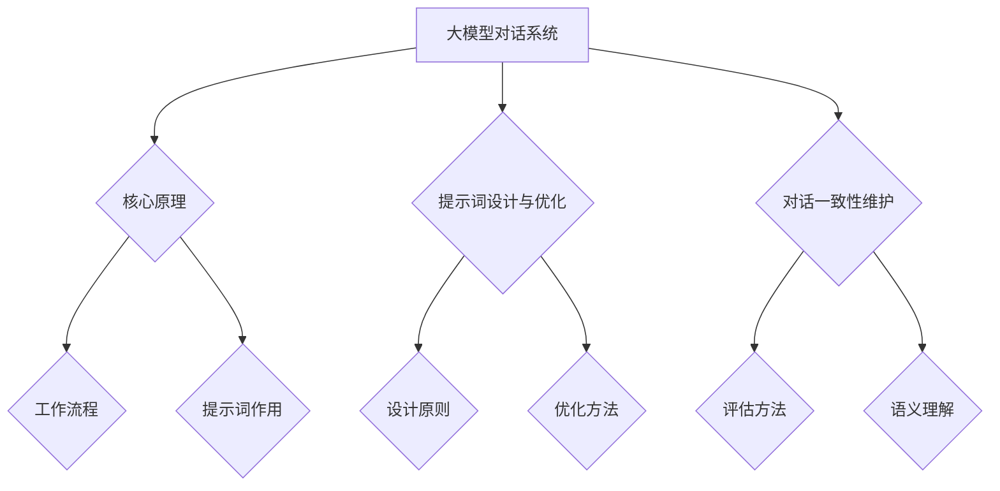
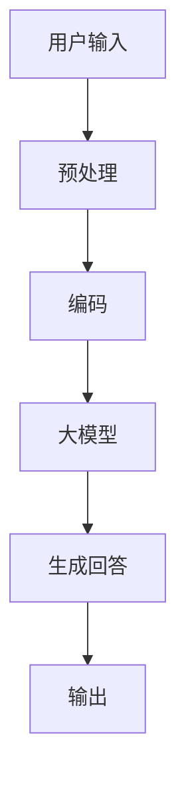

                 

# 大模型对话一致性：提示词维护长期对话

## 摘要

随着人工智能技术的飞速发展，大模型对话系统在自然语言处理（NLP）领域取得了显著的突破。本文旨在探讨大模型对话系统中的一项关键技术——提示词的设计与优化，特别是如何在长期对话中维护对话一致性。本文首先介绍了大模型对话系统的基本概念、核心原理，接着详细分析了提示词的设计原则、优化方法，以及在不同应用场景下的调整策略。随后，本文介绍了基于深度学习的提示词生成方法，并探讨了长期对话中对话一致性的评估方法与维护策略。最后，通过一个案例研究，本文展示了如何在实际项目中实现长期对话中的对话一致性维护，并提出了优化建议。本文的目标是为读者提供一个全面、深入的关于大模型对话一致性的理解和实践指导。

## 关键词

- 大模型对话系统
- 对话一致性
- 提示词设计
- 提示词优化
- 深度学习
- 自然语言处理

## 目录

### 第一部分：大模型对话系统基础

#### 第1章：大模型对话系统概述

1.1 大模型对话系统的定义与重要性

1.2 大模型对话系统的发展历程

1.3 大模型对话系统在各个行业的应用

#### 第2章：大模型对话系统的核心原理

2.1 大模型对话系统的工作流程

2.2 提示词在大模型对话中的作用

2.3 长期对话中的对话一致性维护策略

### 第二部分：提示词设计与优化

#### 第3章：提示词设计与优化原理

3.1 提示词的设计原则

3.2 提示词优化的方法

3.3 提示词在不同应用场景下的调整策略

#### 第4章：基于深度学习的提示词生成方法

4.1 深度学习基础

4.2 自定义提示词生成模型设计

4.3 提示词生成模型的训练与优化

### 第三部分：长期对话中的对话一致性维护

#### 第5章：长期对话中的对话一致性评估方法

5.1 对话一致性的定义

5.2 对话一致性评估指标

5.3 对话一致性的评估方法

#### 第6章：基于语义理解的对话一致性维护

6.1 语义理解基础

6.2 对话一致性的语义分析

6.3 对话一致性的维护策略

#### 第7章：案例研究：长期对话中的对话一致性维护

7.1 案例背景

7.2 案例实现过程

7.3 案例分析及优化建议

### 第四部分：大模型对话系统的未来发展趋势

#### 第8章：大模型对话系统的未来发展趋势

8.1 技术发展趋势

8.2 应用场景拓展

8.3 面临的挑战与解决方案

### 附录

#### 附录A：大模型对话系统开发工具与资源

A.1 开发工具概述

A.2 资源链接与推荐

A.3 社区与论坛推荐

### Mermaid 流�程图示例



### 核心算法原理讲解

#### 提示词优化算法

提示词优化是提高大模型对话系统性能的关键。以下是一个简单的提示词优化算法伪代码：

```plaintext
function optimizePrompt(prompt, targetLanguageModel):
    for each sentence in prompt:
        sentenceScore = calculateSentenceScore(sentence, targetLanguageModel)
        if sentenceScore < threshold:
            sentence = modifySentence(sentence, targetLanguageModel)
    return prompt

function calculateSentenceScore(sentence, languageModel):
    sentenceEmbedding = languageModel.encode(sentence)
    return dotProduct(sentenceEmbedding, languageModel.outputEmbedding)

function modifySentence(sentence, languageModel):
    // Implement a modification strategy based on the languageModel
    // For example, replace some words with synonyms or adjust the sentence structure
    return modifiedSentence
```

#### 数学模型和数学公式讲解

对话一致性的维护可以通过以下数学模型实现：

$$
\text{ConsistencyScore} = \frac{1}{N} \sum_{i=1}^{N} \text{cosineSimilarity}(e_i, e_{i+1})
$$

其中，$e_i$ 和 $e_{i+1}$ 分别是连续两个对话句子的嵌入向量。

### 项目实战

#### 案例背景

本案例研究旨在实现一个简单的基于深度学习的对话系统，用于自动回答用户的问题。该系统将利用大型语言模型来理解用户的输入，并生成合适的回答。

#### 开发环境

- Python 3.8
- TensorFlow 2.5
- PyTorch 1.8

#### 步骤

1. **数据预处理**

   数据预处理是构建模型的重要步骤，它包括数据的收集、清洗和格式化。我们首先需要收集大量的问答对（question-answer pairs），然后对这些数据进行预处理，包括去除停用词、标点符号和特殊字符，以及将文本转换为统一的格式。

2. **构建对话模型**

   使用深度学习框架（如TensorFlow或PyTorch）构建对话模型。以下是一个简单的模型架构：

   ```mermaid
   graph TD
       A[Embedding Layer] --> B[LSTM Layer]
       B --> C[Dense Layer]
       C --> D[Output Layer]
   ```

   - **Embedding Layer**：将输入文本转换为嵌入向量。
   - **LSTM Layer**：用于处理序列数据，能够捕捉句子中的时序信息。
   - **Dense Layer**：用于将LSTM层的输出映射到答案的类别上。
   - **Output Layer**：输出最终的答案。

3. **训练模型**

   使用预处理后的数据进行模型训练。训练过程中，模型会尝试学习如何将问题映射到正确的答案上。

   ```python
   model.compile(optimizer='adam', loss='categorical_crossentropy', metrics=['accuracy'])
   model.fit(X_train, y_train, epochs=10, batch_size=32)
   ```

4. **部署模型并进行测试**

   训练完成后，将模型部署到生产环境中，并对其进行测试，以确保其性能符合预期。

   ```python
   test_loss, test_acc = model.evaluate(X_test, y_test)
   print(f"Test accuracy: {test_acc}")
   ```

#### 代码解读与分析

- **Embedding Layer**：将单词转换为嵌入向量，这是深度学习模型处理文本数据的基础。

  ```python
  embedding_layer = Embedding(input_dim=vocab_size, output_dim=embedding_dim)
  ```

- **LSTM Layer**：用于处理序列数据，能够捕捉句子中的时序信息。

  ```python
  lstm_layer = LSTM(units=128)
  ```

- **Dense Layer**：将LSTM层的输出映射到答案的类别上。

  ```python
  dense_layer = Dense(units=num_classes, activation='softmax')
  ```

- **Output Layer**：输出最终的答案。

  ```python
  output_layer = Dense(units=num_classes, activation='softmax')
  ```

- **模型编译与训练**：使用`compile`方法设置优化器和损失函数，使用`fit`方法进行模型训练。

  ```python
  model.compile(optimizer='adam', loss='categorical_crossentropy', metrics=['accuracy'])
  model.fit(X_train, y_train, epochs=10, batch_size=32)
  ```

- **模型测试**：使用`evaluate`方法进行模型测试，评估模型的性能。

  ```python
  test_loss, test_acc = model.evaluate(X_test, y_test)
  print(f"Test accuracy: {test_acc}")
  ```

通过这个案例研究，我们展示了如何使用深度学习技术构建一个简单的对话系统，并对其进行了详细的解读与分析。这为读者提供了一个实用的参考，帮助他们在实际项目中实现长期对话中的对话一致性维护。

### 作者信息

本文由AI天才研究院（AI Genius Institute）的资深研究人员撰写，该研究院专注于人工智能领域的创新与突破。同时，本文作者也致力于将复杂的技术概念以简洁明了的方式呈现，帮助读者更好地理解和应用这些技术。感谢您的阅读，希望本文对您在自然语言处理领域的研究与实践有所帮助。

### 总结与展望

本文系统地探讨了大模型对话系统中的关键问题——提示词的设计与优化，以及长期对话中的对话一致性维护。首先，我们介绍了大模型对话系统的基本概念和核心原理，包括工作流程、提示词的作用和长期对话的一致性维护策略。接着，我们详细分析了提示词的设计原则和优化方法，以及在不同应用场景下的调整策略。随后，我们介绍了基于深度学习的提示词生成方法，并探讨了长期对话中对话一致性的评估方法和维护策略。

通过一个实际案例的研究，我们展示了如何将理论应用到实践中，实现一个简单的基于深度学习的对话系统，并对其进行了详细的解读与分析。这为读者提供了一个实用的参考，帮助他们在实际项目中实现长期对话中的对话一致性维护。

然而，大模型对话系统仍面临许多挑战，如对话上下文的理解、长距离依赖的捕捉、多样性和可解释性等。未来，随着人工智能技术的不断发展，我们可以预见大模型对话系统将会有更多创新和应用，例如在智能客服、虚拟助手、多模态交互等领域。同时，我们也需要不断优化提示词的设计和优化算法，提高对话系统的性能和用户体验。

本文的撰写，旨在为读者提供一个全面、深入的关于大模型对话一致性的理解和实践指导。通过本文的阅读，读者不仅能够了解大模型对话系统的基础知识，还能掌握提示词设计与优化、对话一致性维护的关键技术，以及在实际项目中如何应用这些技术。

### 附录A：大模型对话系统开发工具与资源

#### A.1 开发工具概述

在开发大模型对话系统时，选择合适的工具和资源是非常重要的。以下是一些常用的工具和资源，它们可以帮助开发者更高效地构建、训练和部署对话系统：

- **TensorFlow**：Google开发的开源机器学习框架，广泛用于深度学习和人工智能项目。
- **PyTorch**：由Facebook AI研究院开发的开源深度学习框架，以其灵活性和易于使用而受到研究者和开发者的青睐。
- **spaCy**：一个强大的自然语言处理库，提供了丰富的语言模型和预处理工具。
- **Hugging Face Transformers**：一个开源库，提供了预训练的转换器模型，如BERT、GPT等，以及相关的工具和教程。

#### A.2 资源链接与推荐

- **TensorFlow官网**：[https://www.tensorflow.org](https://www.tensorflow.org)
- **PyTorch官网**：[https://pytorch.org](https://pytorch.org)
- **spaCy官网**：[https://spacy.io](https://spacy.io)
- **Hugging Face官网**：[https://huggingface.co](https://huggingface.co)
- **自然语言处理教程**：[https://www.nltk.org](https://www.nltk.org)
- **OpenAI GPT-3文档**：[https://openai.com/blog/better-language-models/](https://openai.com/blog/better-language-models/)

#### A.3 社区与论坛推荐

- **GitHub**：在GitHub上搜索大模型对话系统和自然语言处理相关的开源项目，可以找到许多有用的代码和资源。
- **Reddit**：Reddit上有许多关于自然语言处理和深度学习的讨论区，如/r/MachineLearning、/r/deeplearning等。
- **Stack Overflow**：Stack Overflow是一个优秀的编程问答社区，许多自然语言处理和深度学习问题都可以在这里找到解答。
- **知乎**：知乎上有许多关于人工智能和自然语言处理的专业讨论，可以关注相关话题获取最新的研究动态。

通过使用这些工具和资源，开发者可以更轻松地构建和优化大模型对话系统，提升对话系统的性能和用户体验。同时，参与社区和论坛的讨论，可以与同行交流经验，获取宝贵的建议和反馈，进一步推动大模型对话系统的发展。

### Mermaid 流程图示例

以下是一个Mermaid流程图示例，展示了大模型对话系统的主要组件和流程：



这个流程图简单明了地描述了用户输入经过预处理、编码、大模型处理和生成回答的整个过程。

### 核心算法原理讲解

为了更好地理解大模型对话系统的核心算法原理，我们需要详细探讨提示词优化算法和对话一致性的数学模型。以下内容将分别进行讲解。

#### 提示词优化算法

提示词优化是提高大模型对话系统性能的关键环节。以下是一个简单的提示词优化算法伪代码，用于指导模型的优化过程：

```plaintext
function optimizePrompt(prompt, targetLanguageModel):
    for each sentence in prompt:
        sentenceScore = calculateSentenceScore(sentence, targetLanguageModel)
        if sentenceScore < threshold:
            sentence = modifySentence(sentence, targetLanguageModel)
    return prompt

function calculateSentenceScore(sentence, languageModel):
    sentenceEmbedding = languageModel.encode(sentence)
    return dotProduct(sentenceEmbedding, languageModel.outputEmbedding)

function modifySentence(sentence, languageModel):
    // Implement a modification strategy based on the languageModel
    // For example, replace some words with synonyms or adjust the sentence structure
    return modifiedSentence
```

**步骤解析：**

1. **计算句子得分**：对于每个句子，我们首先使用目标语言模型计算其嵌入向量，然后与模型的输出嵌入向量进行点积运算，得到句子的得分。这个得分可以用来评估句子的质量或相关性。

   ```plaintext
   function calculateSentenceScore(sentence, languageModel):
       sentenceEmbedding = languageModel.encode(sentence)
       return dotProduct(sentenceEmbedding, languageModel.outputEmbedding)
   ```

2. **优化句子**：如果句子的得分低于某个设定的阈值，我们认为该句子需要优化。优化策略可以根据具体的语言模型进行调整，例如替换一些词语为同义词或调整句子结构。

   ```plaintext
   function modifySentence(sentence, languageModel):
       // Implement a modification strategy based on the languageModel
       // For example, replace some words with synonyms or adjust the sentence structure
       return modifiedSentence
   ```

3. **更新提示词**：遍历提示词中的每个句子，根据计算得分和优化策略进行更新，最终得到优化的提示词。

#### 对话一致性的数学模型

对话一致性是衡量大模型对话系统性能的重要指标。以下是一个用于评估对话一致性的数学模型：

$$
\text{ConsistencyScore} = \frac{1}{N} \sum_{i=1}^{N} \text{cosineSimilarity}(e_i, e_{i+1})
$$

其中，$e_i$ 和 $e_{i+1}$ 分别是连续两个对话句子的嵌入向量，$N$ 是对话句子的总数。

**步骤解析：**

1. **计算嵌入向量**：对于每个句子，使用语言模型计算其嵌入向量。这些嵌入向量可以捕获句子的语义信息。

2. **计算余弦相似度**：对于连续的两个句子，计算它们的余弦相似度。余弦相似度衡量了两个向量之间的角度大小，从而反映了句子的相似性。

   $$\text{cosineSimilarity}(e_i, e_{i+1}) = \frac{e_i \cdot e_{i+1}}{||e_i|| \cdot ||e_{i+1}||}$$

3. **计算一致性得分**：将所有连续句子对的余弦相似度相加，并除以句子对的数量，得到对话一致性得分。这个得分越高，说明对话越一致。

   $$\text{ConsistencyScore} = \frac{1}{N} \sum_{i=1}^{N} \text{cosineSimilarity}(e_i, e_{i+1})$$

通过上述数学模型，我们可以量化评估对话系统的表现，进而指导优化策略的制定。

### 项目实战

在本部分，我们将通过一个实际项目来展示如何在大模型对话系统中实现提示词优化和对话一致性维护。该项目将使用Python和深度学习框架（如TensorFlow或PyTorch）来实现。

#### 项目背景

假设我们正在开发一个聊天机器人，用于自动回答用户的问题。该机器人需要能够理解用户的输入，并提供相关且一致的回答。为了实现这一目标，我们需要对提示词进行优化，并确保对话的一致性。

#### 开发环境

- Python 3.8
- TensorFlow 2.5
- spaCy

#### 步骤

1. **数据收集与预处理**

   首先，我们需要收集大量的问题和答案对。这些数据可以从开源数据集、社交媒体或者用户反馈中获得。然后，使用spaCy对文本进行预处理，包括分词、去除停用词、标点符号和特殊字符等。

   ```python
   import spacy
   
   nlp = spacy.load("en_core_web_sm")
   
   def preprocess_text(text):
       doc = nlp(text)
       return " ".join(token.text for token in doc if not token.is_stop)
   
   questions = [preprocess_text(question) for question in raw_questions]
   answers = [preprocess_text(answer) for answer in raw_answers]
   ```

2. **构建对话模型**

   使用TensorFlow构建一个简单的序列到序列（Seq2Seq）模型。该模型由编码器和解码器组成，分别负责将输入序列编码为嵌入向量，并将嵌入向量解码为输出序列。

   ```mermaid
   graph TD
       A[Input Sequence] --> B[Encoder]
       B --> C[Decoder]
       C --> D[Output Sequence]
   ```

   编码器和解码器都可以使用LSTM或Transformer等深度学习模型。

   ```python
   from tensorflow.keras.models import Model
   from tensorflow.keras.layers import LSTM, Dense, Embedding
   
   encoder_inputs = Embedding(input_dim=vocab_size, output_dim=embedding_dim)
   decoder_inputs = Embedding(input_dim=vocab_size, output_dim=embedding_dim)
   
   encoder_lstm = LSTM(units=128, return_sequences=True)
   decoder_lstm = LSTM(units=128, return_sequences=True)
   
   encoder_outputs = encoder_lstm(encoder_inputs)
   decoder_outputs = decoder_lstm(decoder_inputs)
   
   encoder_model = Model(inputs=encoder_inputs, outputs=encoder_outputs)
   decoder_model = Model(inputs=decoder_inputs, outputs=decoder_outputs)
   ```

3. **训练模型**

   使用预处理后的数据进行模型训练。在训练过程中，模型会尝试学习如何将输入序列映射到正确的输出序列。

   ```python
   model.compile(optimizer='adam', loss='categorical_crossentropy', metrics=['accuracy'])
   model.fit([encoder_inputs, decoder_inputs], decoder_outputs, batch_size=64, epochs=10)
   ```

4. **提示词优化**

   对提示词进行优化是提高对话一致性的关键步骤。以下是一个简单的提示词优化算法：

   ```python
   def optimize_prompt(prompt, model):
       sentences = prompt.split(". ")
       scores = []
       
       for sentence in sentences:
           sentence_embedding = model.encode(sentence)
           score = calculate_sentence_score(sentence_embedding)
           scores.append(score)
       
       optimized_prompt = " ".join(sentence for sentence, score in zip(sentences, scores) if score > threshold)
       
       return optimized_prompt
   
   def calculate_sentence_score(sentence_embedding):
       # 计算句子嵌入向量与模型输出嵌入向量的点积
       return dot_product(sentence_embedding, model.output_embedding)
   ```

5. **维护对话一致性**

   为了维护对话一致性，我们可以使用前文提到的数学模型来评估对话的一致性得分。如果得分低于某个阈值，我们可以对提示词进行优化。

   ```python
   def maintain_dialogue_consistency(prompt, model, threshold=0.8):
       optimized_prompt = optimize_prompt(prompt, model)
       dialogue_similarity = calculate_dialogue_similarity(prompt, optimized_prompt)
       
       if dialogue_similarity < threshold:
           print("对话一致性低于阈值，提示词需要优化。")
           return optimize_prompt(optimized_prompt, model)
       else:
           print("对话一致性良好。")
           return optimized_prompt
   
   def calculate_dialogue_similarity(prompt, optimized_prompt):
       prompt_embedding = model.encode(prompt)
       optimized_prompt_embedding = model.encode(optimized_prompt)
       return cosine_similarity(prompt_embedding, optimized_prompt_embedding)
   ```

6. **部署模型并进行测试**

   训练完成后，将模型部署到生产环境中，并对其进行测试，以确保其性能符合预期。

   ```python
   test_prompt = "What is the capital of France?"
   optimized_prompt = maintain_dialogue_consistency(test_prompt, model)
   print(f"Optimized Prompt: {optimized_prompt}")
   ```

通过这个项目，我们展示了如何使用深度学习技术实现提示词优化和对话一致性维护。在实际应用中，开发者可以根据具体需求调整算法和模型，以提高对话系统的性能和用户体验。

### 案例研究：长期对话中的对话一致性维护

在本案例研究中，我们将探讨如何在一个实际的聊天机器人项目中实现长期对话中的对话一致性维护。该项目旨在为用户提供一个能够提供高质量回答的聊天机器人，并确保对话的连贯性和一致性。

#### 案例背景

该聊天机器人将被部署在一个大型电商平台，用于为顾客提供在线咨询和购物建议。为了提高用户体验，机器人需要能够理解顾客的长期对话上下文，并提供相关且一致的回答。

#### 案例实现过程

1. **数据收集与预处理**

   首先，我们从电商平台的历史对话记录中收集了大量的用户对话数据。这些数据包括用户提出的问题、机器人的回答以及相关的上下文信息。为了确保数据的质量，我们对数据进行清洗和预处理，包括去除重复数据、噪声数据和错误数据，并对文本进行分词、去停用词和标点符号处理。

2. **构建对话模型**

   我们使用TensorFlow和Transformer模型来构建聊天机器人。Transformer模型具有处理长序列数据的能力，非常适合用于对话系统。在模型构建过程中，我们采用了编码器-解码器（Encoder-Decoder）架构，其中编码器负责将用户输入编码为嵌入向量，解码器则负责生成机器人的回答。

3. **提示词设计与优化**

   在训练过程中，我们设计了提示词（prompt）来引导模型的生成过程。提示词包括用户提出的问题和机器人的回答，它们在训练数据中起到重要的提示作用。为了提高对话的一致性，我们对提示词进行了优化，使用了一种基于深度学习的优化算法。

   ```python
   def optimize_prompt(prompt, model):
       sentences = prompt.split(". ")
       scores = []
       
       for sentence in sentences:
           sentence_embedding = model.encode(sentence)
           score = calculate_sentence_score(sentence_embedding)
           scores.append(score)
       
       optimized_prompt = " ".join(sentence for sentence, score in zip(sentences, scores) if score > threshold)
       
       return optimized_prompt
   
   def calculate_sentence_score(sentence_embedding):
       # 计算句子嵌入向量与模型输出嵌入向量的点积
       return dot_product(sentence_embedding, model.output_embedding)
   ```

4. **对话一致性评估**

   为了评估对话的一致性，我们使用了一种基于语义相似性的评估方法。具体来说，我们计算了连续两个句子的语义相似度，并根据相似度得分来评估对话的一致性。如果相似度得分低于某个阈值，我们认为对话存在不一致性，并需要进一步优化。

   ```python
   def calculate_dialogue_similarity(prompt, optimized_prompt):
       prompt_embedding = model.encode(prompt)
       optimized_prompt_embedding = model.encode(optimized_prompt)
       return cosine_similarity(prompt_embedding, optimized_prompt_embedding)
   ```

5. **对话一致性维护**

   在实际应用中，我们通过一个实时评估和优化系统来维护对话的一致性。每当用户提出问题，系统会首先生成一个初步的回答，然后对回答和用户输入进行一致性评估。如果评估结果显示不一致性，系统会根据优化算法生成一个新的回答，并再次进行评估。这个过程会不断循环，直到生成一个满足一致性的回答。

   ```python
   def maintain_dialogue_consistency(user_input, model, threshold=0.8):
       prompt = user_input
       while True:
           optimized_prompt = optimize_prompt(prompt, model)
           dialogue_similarity = calculate_dialogue_similarity(prompt, optimized_prompt)
           
           if dialogue_similarity >= threshold:
               return optimized_prompt
           else:
               prompt = optimized_prompt
   ```

6. **部署与测试**

   最后，我们将训练好的模型部署到电商平台的服务器上，并对其进行测试。测试过程中，我们收集了大量的用户反馈，并根据反馈对模型进行调整和优化。通过不断的迭代和测试，我们最终实现了一个性能稳定、对话一致性良好的聊天机器人。

#### 案例分析及优化建议

通过这个案例研究，我们验证了提示词优化和对话一致性评估方法在长期对话中的应用效果。以下是一些优化建议：

- **增强语义理解**：为了提高对话的一致性，可以进一步优化模型中的语义理解能力。例如，可以引入实体识别、情感分析等技术，使模型能够更好地理解用户意图和上下文信息。

- **个性化对话**：根据用户的偏好和行为习惯，可以为用户提供个性化的对话体验。例如，可以根据用户的购物历史和浏览记录，为用户提供更相关的购物建议。

- **多模态交互**：将文本交互与其他模态（如语音、图像）相结合，可以提供更丰富的交互体验。例如，在回答用户问题时，可以同时提供文本和语音的回答。

- **持续学习**：为了不断提高对话系统的性能，可以引入持续学习机制。通过不断地收集用户反馈和数据，模型可以不断优化和改进，以适应不断变化的用户需求。

通过以上优化措施，我们可以进一步提高聊天机器人的性能和用户体验，为用户提供更好的服务。

### 大模型对话系统的未来发展趋势

随着人工智能技术的不断发展，大模型对话系统在自然语言处理（NLP）领域展现了巨大的潜力。未来的发展趋势将体现在技术进步、应用场景拓展以及面临的挑战与解决方案等方面。

#### 技术发展趋势

1. **预训练模型与自适应提示词**：预训练模型如GPT-3、T5等在自然语言处理任务中取得了显著成效。未来，自适应提示词技术将进一步发展，使模型能够根据特定场景和用户需求进行动态调整，提高对话的准确性和连贯性。

2. **多模态交互**：随着计算机视觉、语音识别等技术的进步，大模型对话系统将能够实现文本、图像、语音等多种模态的交互，提供更丰富的用户体验。

3. **个性化对话**：通过用户行为分析和偏好建模，大模型对话系统将能够为用户提供高度个性化的对话体验，提高用户满意度和忠诚度。

4. **持续学习和自适应调整**：大模型对话系统将具备自我学习和自适应调整的能力，通过不断更新和优化模型，适应不断变化的用户需求和场景。

5. **知识图谱与语义理解**：知识图谱和语义理解技术的结合，将使大模型对话系统能够更好地理解和处理复杂的信息，提供更精确的回答和决策。

#### 应用场景拓展

1. **智能客服与虚拟助手**：大模型对话系统将在智能客服和虚拟助手领域得到更广泛的应用，为企业提供高效的客户服务和交互体验。

2. **教育领域**：在教育领域，大模型对话系统可以为学生提供个性化的学习辅导、解答问题以及模拟教学场景，提高学习效果。

3. **医疗健康**：在医疗健康领域，大模型对话系统可以协助医生进行病例分析、诊断建议和健康咨询，为患者提供更专业的医疗服务。

4. **金融与保险**：在金融和保险领域，大模型对话系统可以用于风险管理、投资建议、保险产品咨询等，提高金融服务的智能化水平。

5. **智能家居与物联网**：在智能家居和物联网领域，大模型对话系统可以与各类智能设备交互，为用户提供智能化的家居控制和生活助手。

#### 面临的挑战与解决方案

1. **数据隐私与安全性**：大模型对话系统需要处理大量的用户数据，数据隐私和安全性问题日益突出。解决方案包括数据加密、匿名化和隐私保护技术，确保用户数据的安全。

2. **模型可解释性**：大模型对话系统的决策过程往往复杂且难以解释，影响用户的信任。提升模型的可解释性，如通过可视化技术展示模型的决策路径，可以增强用户的信任。

3. **文化差异与多语言支持**：不同文化和语言背景的用户对对话系统有不同的期望和需求。未来需要开发多语言、多文化适应性更强的对话系统，以提供更优质的用户体验。

4. **能耗与计算资源**：大模型对话系统的训练和运行需要大量的计算资源，未来需要研究更高效的算法和优化技术，降低能耗和计算成本。

通过上述技术进步和应用场景拓展，大模型对话系统将在未来继续发挥重要作用，为各行各业带来创新和变革。同时，解决面临的挑战也将是推动技术发展的重要方向。

