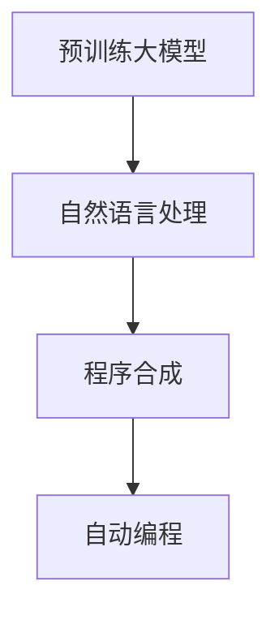
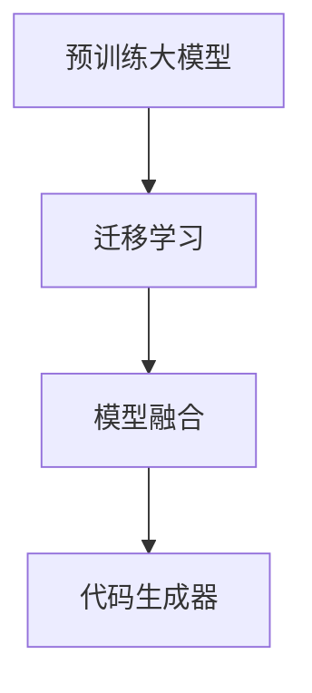

                 

### 《大模型时代的程序合成新范式》

在过去的几十年里，计算机编程经历了从手工编码到自动化工具的巨大转变。从传统的编码范式到现代的集成开发环境（IDE），开发者一直在寻找更高效、更直观的方式来编写代码。然而，随着AI大模型技术的崛起，编程世界正迎来一场新的革命——程序合成。本文旨在探讨大模型时代下的程序合成新范式，从背景、技术、应用、挑战到未来方向，提供一个全方位的视角。

#### 关键词

- 大模型
- 程序合成
- 自然语言处理
- 自动化编程
- 迁移学习

#### 摘要

本文将深入探讨大模型时代下的程序合成技术。首先，我们将回顾大模型时代背景，介绍大模型的基本概念和架构。然后，我们将详细解释程序合成的基本技术和AI大模型在程序合成中的应用。接下来，我们将探讨程序合成在软件开发中的应用场景，并讨论程序合成技术面临的挑战。最后，我们将展望程序合成技术的未来发展方向，并总结全文。

### 第一部分：大模型时代概述

#### 第1章：大模型时代背景与概述

随着深度学习和自然语言处理技术的飞速发展，AI大模型已成为当前技术领域的热点。大模型，如GPT（Generative Pre-trained Transformer）系列，通过大规模数据预训练，具有强大的语言理解和生成能力。这些模型不仅在语言理解、机器翻译、文本生成等领域表现出色，而且在代码合成方面也展现出巨大的潜力。

#### 核心概念与联系

大模型时代的关键概念包括：

- **预训练大模型**：如GPT、BERT等，通过在大量数据上预训练，具有强大的特征提取和生成能力。
- **程序合成**：将自然语言描述转换为可执行的代码。
- **自动编程**：使用机器学习技术自动化编程过程。

Mermaid流程图如下：



#### 核心算法原理讲解

程序合成算法通常包括以下步骤：

1. **输入描述预处理**：将自然语言描述转换为模型可处理的形式。
2. **模型生成代码**：使用预训练大模型生成代码候选集。
3. **后处理**：对生成的代码进行语法检查和优化。

Python伪代码示例：

```python
def program_synthesis(input_description):
    processed_description = preprocess(input_description)
    code_candidates = large_model.generate_candidates(processed_description)
    final_code = postprocess(code_candidates)
    return final_code
```

#### 数学模型和数学公式

在程序合成中，常用的损失函数是交叉熵损失：

$$
\text{损失函数} = -\frac{1}{N} \sum_{i=1}^{N} y_i \log(p(y_i | x_i))
$$

其中，$y_i$是真实代码，$p(y_i | x_i)$是模型生成代码的概率分布。

#### 项目实战

**开发环境搭建**

- 安装Python（3.8以上版本）。
- 安装TensorFlow或PyTorch。
- 配置预训练大模型和程序合成模型。

**源代码详细实现和代码解读**

```python
# 伪代码示例：程序合成项目
def main():
    input_description = read_description()
    synthesized_code = program_synthesis(input_description)
    print(synthesized_code)

if __name__ == "__main__":
    main()
```

**代码解读与分析**

- **读入输入描述**：程序首先从输入中读取自然语言描述。
- **调用合成函数**：调用`program_synthesis`函数，生成代码。
- **输出结果**：最后，程序打印出生成的代码。

### 第二部分：程序合成技术详解

#### 第2章：程序合成基本技术

程序合成技术主要包括以下几个核心部分：

1. **自然语言处理（NLP）**：用于处理和理解自然语言。
2. **代码生成器**：将自然语言描述转换为代码。
3. **自动编程**：使用程序合成技术自动化编程过程。

下面我们将分别介绍这些核心技术。

##### 第2章1：自然语言处理（NLP）

自然语言处理是程序合成的基础。NLP技术包括文本预处理、词嵌入、句法分析和语义理解等。Python伪代码示例：

```python
def nlpProcessing(text):
    # 分词
    tokens = tokenize(text)
    # 词嵌入
    embeddings = wordEmbedding(tokens)
    # 句法分析
    syntax_tree = parseSyntax(tokens)
    # 语义理解
    semantic_representation = understandSemantics(syntax_tree)
    return semantic_representation
```

#### 第2章2：代码生成器

代码生成器是程序合成的核心。它使用NLP技术处理输入描述，并利用机器学习算法生成代码。Python伪代码示例：

```python
def codeGenerator(input_description, model):
    processed_description = nlpProcessing(input_description)
    code_candidates = model.generate_candidates(processed_description)
    best_code = selectBestCode(code_candidates)
    return best_code
```

#### 第2章3：自动编程

自动编程是将程序合成技术应用于实际编程过程。它包括输入描述收集、代码生成和代码优化等步骤。Python伪代码示例：

```python
def automatedProgramming(input_description):
    synthesized_code = codeGenerator(input_description, model)
    optimized_code = optimizeCode(synthesized_code)
    return optimized_code
```

##### 第3章：AI大模型在程序合成中的应用

AI大模型，如GPT，在程序合成中扮演着重要角色。它们通过预训练掌握了丰富的语言知识和编程技巧，能够生成高质量的代码。下面我们将详细介绍大模型在程序合成中的应用。

#### 核心概念与联系

- **预训练大模型**：如GPT、BERT等。
- **迁移学习**：将预训练模型应用于特定任务，通过微调提高性能。
- **模型融合**：结合多个模型的优点，提高代码生成的准确性和效率。

Mermaid流程图如下：



#### 核心算法原理讲解

基于大模型的代码生成算法通常包括以下几个步骤：

1. **输入描述预处理**：将自然语言描述转换为模型可处理的形式。
2. **迁移学习**：使用预训练大模型进行任务特定迁移学习。
3. **模型融合**：结合多个模型的输出，生成最终代码。

Python伪代码示例：

```python
def largeModelCodeGenerator(input_description, pre_trained_model, task_specific_model):
    processed_description = preprocess(input_description)
    migrated_output = pre_trained_model.migrate(processed_description)
    fused_code = task_specific_model.generate_code(migrated_output)
    return fused_code
```

#### 数学模型和数学公式

模型融合通常使用对数似然函数来评估和结合多个模型的输出：

$$
\text{融合概率} = \frac{1}{Z} \exp(-E_1 - E_2)
$$

其中，$E_1$和$E_2$分别是两个模型的损失函数。

#### 项目实战

**开发环境搭建**

- 安装Python（3.8以上版本）。
- 安装TensorFlow或PyTorch。
- 下载预训练大模型（如GPT）和任务特定模型。

**源代码详细实现和代码解读**

```python
# 伪代码示例：基于大模型的代码生成项目
def main():
    input_description = read_description()
    pre_trained_model = load_pretrained_model('gpt_model')
    task_specific_model = load_task_specific_model('code_generator_model')
    synthesized_code = largeModelCodeGenerator(input_description, pre_trained_model, task_specific_model)
    print(synthesized_code)

if __name__ == "__main__":
    main()
```

**代码解读与分析**

- **读入输入描述**：程序首先从输入中读取自然语言描述。
- **加载模型**：加载预训练的GPT模型和任务特定的代码生成模型。
- **调用生成函数**：调用`largeModelCodeGenerator`函数，结合预训练模型和任务特定模型生成代码。
- **输出结果**：最后，程序打印出生成的代码。

### 第三部分：程序合成应用场景与挑战

#### 第4章：程序合成在软件开发中的应用

程序合成技术在软件开发中的应用场景非常广泛，包括自动化测试、代码审查、API自动生成等。下面我们将分别介绍这些应用。

##### 第4章1：自动化测试

自动化测试是程序合成的典型应用之一。通过程序合成，我们可以自动生成测试用例，提高测试效率。Python伪代码示例：

```python
def automatedTesting(input_description, test_framework):
    processed_description = preprocess(input_description)
    test_cases = test_framework.generate_cases(processed_description)
    test_results = test_framework.execute(test_cases)
    return test_results
```

##### 第4章2：代码审查

代码审查是软件开发中不可或缺的一环。通过程序合成，我们可以自动生成代码审查报告，提供改进建议。Python伪代码示例：

```python
def codeReview(code, review_model):
    processed_code = preprocess(code)
    reviews = review_model.generate_reviews(processed_code)
    return reviews
```

##### 第4章3：API自动生成

API自动生成是另一个重要的应用场景。通过程序合成，我们可以自动生成API文档和实现代码。Python伪代码示例：

```python
def generateApiDocumentation(api_description):
    processed_description = preprocess(api_description)
    api_documentation = generate_documentation(processed_description)
    return api_documentation
```

#### 第5章：程序合成技术的挑战与未来方向

尽管程序合成技术具有巨大的潜力，但在实际应用中仍然面临许多挑战。以下是几个关键挑战：

1. **可解释性**：确保生成的代码是可理解和可解释的。
2. **代码质量**：提高生成的代码的质量和性能。
3. **安全性**：确保生成的代码不会引入安全漏洞。

为了应对这些挑战，我们需要在以下几个方面进行努力：

1. **可解释性**：开发可解释的模型，使其生成的代码更容易被理解和审计。
2. **代码质量**：引入代码质量评估指标，对生成的代码进行评估和优化。
3. **安全性**：加强对生成的代码的安全检测和修复。

未来，随着AI大模型技术的不断发展和完善，程序合成有望在软件开发中发挥更大的作用。我们可以期待，通过结合大模型技术和自动化工具，编程将变得更加高效、直观和智能。

### 附录

#### 附录A：程序合成工具与资源

以下是几个常用的程序合成工具和资源：

1. **TensorFlow**：开源的深度学习框架，支持大模型训练和程序合成。
2. **PyTorch**：开源的深度学习框架，具有良好的灵活性和社区支持。
3. **OpenAI Codex**：基于GPT的大模型，专门用于代码合成。

#### 附录B：程序合成项目案例

以下是几个程序合成项目案例：

1. **自动化测试项目**：使用程序合成自动生成测试用例，提高测试效率。
2. **代码审查项目**：使用程序合成生成代码审查报告，提供改进建议。
3. **API自动生成项目**：使用程序合成自动生成API文档和实现代码。

### 总结

大模型时代的到来为程序合成带来了新的机遇和挑战。通过结合大模型技术和自动化工具，我们可以实现更高效、更直观的编程体验。尽管仍有许多问题需要解决，但随着技术的不断进步，我们有理由相信，程序合成将在未来的软件开发中发挥重要作用。让我们一起期待这一天的到来。

### 作者

作者：AI天才研究院/AI Genius Institute & 禅与计算机程序设计艺术 /Zen And The Art of Computer Programming

<|assistant|>### 《大模型时代的程序合成新范式》

在过去的几十年里，计算机编程经历了从手工编码到自动化工具的巨大转变。从传统的编码范式到现代的集成开发环境（IDE），开发者一直在寻找更高效、更直观的方式来编写代码。然而，随着AI大模型技术的崛起，编程世界正迎来一场新的革命——程序合成。本文旨在探讨大模型时代下的程序合成新范式，从背景、技术、应用、挑战到未来方向，提供一个全方位的视角。

#### 关键词

- 大模型
- 程序合成
- 自然语言处理
- 自动化编程
- 迁移学习

#### 摘要

本文将深入探讨大模型时代下的程序合成技术。首先，我们将回顾大模型时代背景，介绍大模型的基本概念和架构。然后，我们将详细解释程序合成的基本技术和AI大模型在程序合成中的应用。接下来，我们将探讨程序合成在软件开发中的应用场景，并讨论程序合成技术面临的挑战。最后，我们将展望程序合成技术的未来发展方向，并总结全文。

### 第一部分：大模型时代概述

#### 第1章：大模型时代背景与概述

随着深度学习和自然语言处理技术的飞速发展，AI大模型已成为当前技术领域的热点。大模型，如GPT（Generative Pre-trained Transformer）系列，通过在大量数据上预训练，具有强大的语言理解和生成能力。这些模型不仅在语言理解、机器翻译、文本生成等领域表现出色，而且在代码合成方面也展现出巨大的潜力。

#### 核心概念与联系

大模型时代的关键概念包括：

- **预训练大模型**：如GPT、BERT等，通过在大量数据上预训练，具有强大的特征提取和生成能力。
- **程序合成**：将自然语言描述转换为可执行的代码。
- **自动编程**：使用机器学习技术自动化编程过程。

Mermaid流程图如下：


#### 核心算法原理讲解

程序合成算法通常包括以下步骤：

1. **输入描述预处理**：将自然语言描述转换为模型可处理的形式。
2. **模型生成代码**：使用预训练大模型生成代码候选集。
3. **后处理**：对生成的代码进行语法检查和优化。

Python伪代码示例：

```python
def program_synthesis(input_description):
    processed_description = preprocess(input_description)
    code_candidates = large_model.generate_candidates(processed_description)
    final_code = postprocess(code_candidates)
    return final_code
```

#### 数学模型和数学公式

在程序合成中，常用的损失函数是交叉熵损失：

$$
\text{损失函数} = -\frac{1}{N} \sum_{i=1}^{N} y_i \log(p(y_i | x_i))
$$

其中，$y_i$是真实代码，$p(y_i | x_i)$是模型生成代码的概率分布。

#### 项目实战

**开发环境搭建**

- 安装Python（3.8以上版本）。
- 安装TensorFlow或PyTorch。
- 配置预训练大模型和程序合成模型。

**源代码详细实现和代码解读**

```python
# 伪代码示例：程序合成项目
def main():
    input_description = read_description()
    synthesized_code = program_synthesis(input_description)
    print(synthesized_code)

if __name__ == "__main__":
    main()
```

**代码解读与分析**

- **读入输入描述**：程序首先从输入中读取自然语言描述。
- **调用合成函数**：调用`program_synthesis`函数，生成代码。
- **输出结果**：最后，程序打印出生成的代码。

### 第二部分：程序合成技术详解

#### 第2章：程序合成基本技术

程序合成技术主要包括以下几个核心部分：

1. **自然语言处理（NLP）**：用于处理和理解自然语言。
2. **代码生成器**：将自然语言描述转换为代码。
3. **自动编程**：使用程序合成技术自动化编程过程。

下面我们将分别介绍这些核心技术。

##### 第2章1：自然语言处理（NLP）

自然语言处理是程序合成的基础。NLP技术包括文本预处理、词嵌入、句法分析和语义理解等。Python伪代码示例：

```python
def nlpProcessing(text):
    # 分词
    tokens = tokenize(text)
    # 词嵌入
    embeddings = wordEmbedding(tokens)
    # 句法分析
    syntax_tree = parseSyntax(tokens)
    # 语义理解
    semantic_representation = understandSemantics(syntax_tree)
    return semantic_representation
```

##### 第2章2：代码生成器

代码生成器是程序合成的核心。它使用NLP技术处理输入描述，并利用机器学习算法生成代码。Python伪代码示例：

```python
def codeGenerator(input_description, model):
    processed_description = nlpProcessing(input_description)
    code_candidates = model.generate_candidates(processed_description)
    best_code = selectBestCode(code_candidates)
    return best_code
```

##### 第2章3：自动编程

自动编程是将程序合成技术应用于实际编程过程。它包括输入描述收集、代码生成和代码优化等步骤。Python伪代码示例：

```python
def automatedProgramming(input_description):
    synthesized_code = codeGenerator(input_description, model)
    optimized_code = optimizeCode(synthesized_code)
    return optimized_code
```

### 第三部分：程序合成应用场景与挑战

#### 第4章：程序合成在软件开发中的应用

程序合成技术在软件开发中的应用场景非常广泛，包括自动化测试、代码审查、API自动生成等。下面我们将分别介绍这些应用。

##### 第4章1：自动化测试

自动化测试是程序合成的典型应用之一。通过程序合成，我们可以自动生成测试用例，提高测试效率。Python伪代码示例：

```python
def automatedTesting(input_description, test_framework):
    processed_description = preprocess(input_description)
    test_cases = test_framework.generate_cases(processed_description)
    test_results = test_framework.execute(test_cases)
    return test_results
```

##### 第4章2：代码审查

代码审查是软件开发中不可或缺的一环。通过程序合成，我们可以自动生成代码审查报告，提供改进建议。Python伪代码示例：

```python
def codeReview(code, review_model):
    processed_code = preprocess(code)
    reviews = review_model.generate_reviews(processed_code)
    return reviews
```

##### 第4章3：API自动生成

API自动生成是另一个重要的应用场景。通过程序合成，我们可以自动生成API文档和实现代码。Python伪代码示例：

```python
def generateApiDocumentation(api_description):
    processed_description = preprocess(api_description)
    api_documentation = generate_documentation(processed_description)
    return api_documentation
```

#### 第5章：程序合成技术的挑战与未来方向

尽管程序合成技术具有巨大的潜力，但在实际应用中仍然面临许多挑战。以下是几个关键挑战：

1. **可解释性**：确保生成的代码是可理解和可解释的。
2. **代码质量**：提高生成的代码的质量和性能。
3. **安全性**：确保生成的代码不会引入安全漏洞。

为了应对这些挑战，我们需要在以下几个方面进行努力：

1. **可解释性**：开发可解释的模型，使其生成的代码更容易被理解和审计。
2. **代码质量**：引入代码质量评估指标，对生成的代码进行评估和优化。
3. **安全性**：加强对生成的代码的安全检测和修复。

未来，随着AI大模型技术的不断发展和完善，程序合成有望在软件开发中发挥更大的作用。我们可以期待，通过结合大模型技术和自动化工具，编程将变得更加高效、直观和智能。

### 附录

#### 附录A：程序合成工具与资源

以下是几个常用的程序合成工具和资源：

1. **TensorFlow**：开源的深度学习框架，支持大模型训练和程序合成。
2. **PyTorch**：开源的深度学习框架，具有良好的灵活性和社区支持。
3. **OpenAI Codex**：基于GPT的大模型，专门用于代码合成。

#### 附录B：程序合成项目案例

以下是几个程序合成项目案例：

1. **自动化测试项目**：使用程序合成自动生成测试用例，提高测试效率。
2. **代码审查项目**：使用程序合成生成代码审查报告，提供改进建议。
3. **API自动生成项目**：使用程序合成自动生成API文档和实现代码。

### 总结

大模型时代的到来为程序合成带来了新的机遇和挑战。通过结合大模型技术和自动化工具，我们可以实现更高效、更直观的编程体验。尽管仍有许多问题需要解决，但随着技术的不断进步，我们有理由相信，程序合成将在未来的软件开发中发挥重要作用。让我们一起期待这一天的到来。

### 作者

作者：AI天才研究院/AI Genius Institute & 禅与计算机程序设计艺术 /Zen And The Art of Computer Programming### 第一部分：大模型时代概述

随着深度学习和自然语言处理技术的飞速发展，AI大模型已成为当前技术领域的热点。大模型，如GPT（Generative Pre-trained Transformer）系列，通过在大量数据上预训练，具有强大的语言理解和生成能力。这些模型不仅在语言理解、机器翻译、文本生成等领域表现出色，而且在代码合成方面也展现出巨大的潜力。

#### 第1章：大模型时代背景与概述

1. **深度学习与自然语言处理的进展**

   深度学习是一种机器学习方法，通过神经网络模型对大量数据进行分析和学习，以实现复杂的任务。自然语言处理（NLP）是深度学习的一个重要应用领域，旨在使计算机能够理解和处理自然语言。

   近年来，NLP领域取得了显著进展，特别是在预训练大模型方面。预训练大模型通过在大规模数据集上训练，获得了强大的特征提取和语义理解能力。这些模型包括GPT、BERT、T5等。

2. **大模型在代码合成中的应用**

   代码合成是AI大模型在软件开发中的一个新兴应用领域。通过将自然语言描述转换为可执行的代码，大模型可以帮助开发者提高开发效率，减少手动编写代码的工作量。

   GPT等大模型通过预训练掌握了丰富的语言知识和编程技巧，能够在给定自然语言描述的基础上生成高质量的代码。这使得代码合成成为可能，并在自动化测试、代码审查、API自动生成等领域得到广泛应用。

3. **大模型的架构与工作原理**

   大模型通常采用深度神经网络结构，如Transformer。Transformer模型通过自注意力机制，能够处理长距离依赖和复杂语义关系。GPT系列模型在此基础上进行了优化和扩展，具有更高的语言理解和生成能力。

   大模型的工作原理主要包括以下步骤：

   - **预训练**：在大规模语料库上训练模型，使其掌握通用语言特征。
   - **微调**：将预训练模型应用于特定任务，通过少量任务数据进一步优化模型。
   - **生成代码**：利用微调后的模型，根据自然语言描述生成代码。

#### 核心概念与联系

大模型时代的关键概念包括：

- **预训练大模型**：如GPT、BERT等，通过在大量数据上预训练，具有强大的特征提取和生成能力。
- **程序合成**：将自然语言描述转换为可执行的代码。
- **自动编程**：使用机器学习技术自动化编程过程。

Mermaid流程图如下：


#### 核心算法原理讲解

程序合成算法通常包括以下步骤：

1. **输入描述预处理**：将自然语言描述转换为模型可处理的形式。
2. **模型生成代码**：使用预训练大模型生成代码候选集。
3. **后处理**：对生成的代码进行语法检查和优化。

Python伪代码示例：

```python
def program_synthesis(input_description):
    processed_description = preprocess(input_description)
    code_candidates = large_model.generate_candidates(processed_description)
    final_code = postprocess(code_candidates)
    return final_code
```

#### 数学模型和数学公式

在程序合成中，常用的损失函数是交叉熵损失：

$$
\text{损失函数} = -\frac{1}{N} \sum_{i=1}^{N} y_i \log(p(y_i | x_i))
$$

其中，$y_i$是真实代码，$p(y_i | x_i)$是模型生成代码的概率分布。

#### 项目实战

**开发环境搭建**

- 安装Python（3.8以上版本）。
- 安装TensorFlow或PyTorch。
- 配置预训练大模型和程序合成模型。

**源代码详细实现和代码解读**

```python
# 伪代码示例：程序合成项目
def main():
    input_description = read_description()
    synthesized_code = program_synthesis(input_description)
    print(synthesized_code)

if __name__ == "__main__":
    main()
```

**代码解读与分析**

- **读入输入描述**：程序首先从输入中读取自然语言描述。
- **调用合成函数**：调用`program_synthesis`函数，生成代码。
- **输出结果**：最后，程序打印出生成的代码。

### 第二部分：程序合成技术详解

#### 第2章：程序合成基本技术

程序合成技术主要包括以下几个核心部分：

1. **自然语言处理（NLP）**：用于处理和理解自然语言。
2. **代码生成器**：将自然语言描述转换为代码。
3. **自动编程**：使用程序合成技术自动化编程过程。

##### 第2章1：自然语言处理（NLP）

自然语言处理是程序合成的基础。NLP技术包括文本预处理、词嵌入、句法分析和语义理解等。

- **文本预处理**：包括分词、去除停用词、词性标注等，将原始文本转换为适合模型处理的格式。
- **词嵌入**：将文本中的每个词映射为一个低维向量，用于模型训练和推理。
- **句法分析**：对文本进行句法分析，提取句子结构信息，如句法树。
- **语义理解**：理解文本的语义含义，包括实体识别、关系抽取、情感分析等。

Python伪代码示例：

```python
def nlpProcessing(text):
    # 分词
    tokens = tokenize(text)
    # 词嵌入
    embeddings = wordEmbedding(tokens)
    # 句法分析
    syntax_tree = parseSyntax(tokens)
    # 语义理解
    semantic_representation = understandSemantics(syntax_tree)
    return semantic_representation
```

##### 第2章2：代码生成器

代码生成器是程序合成的核心。它使用NLP技术处理输入描述，并利用机器学习算法生成代码。

- **输入描述预处理**：将自然语言描述转换为模型可处理的形式。
- **代码生成**：使用预训练大模型生成代码候选集。
- **代码选择**：从代码候选集中选择最佳代码。

Python伪代码示例：

```python
def codeGenerator(input_description, model):
    processed_description = nlpProcessing(input_description)
    code_candidates = model.generate_candidates(processed_description)
    best_code = selectBestCode(code_candidates)
    return best_code
```

##### 第2章3：自动编程

自动编程是将程序合成技术应用于实际编程过程。它包括输入描述收集、代码生成和代码优化等步骤。

- **输入描述收集**：从用户获取编程任务的自然语言描述。
- **代码生成**：使用代码生成器生成代码。
- **代码优化**：对生成的代码进行优化，提高其质量和性能。

Python伪代码示例：

```python
def automatedProgramming(input_description):
    synthesized_code = codeGenerator(input_description, model)
    optimized_code = optimizeCode(synthesized_code)
    return optimized_code
```

### 第三部分：程序合成应用场景与挑战

#### 第3章：AI大模型在程序合成中的应用

AI大模型，如GPT，在程序合成中扮演着重要角色。它们通过预训练掌握了丰富的语言知识和编程技巧，能够生成高质量的代码。

##### 第3章1：预训练大模型与程序合成

预训练大模型通过在大规模数据集上进行预训练，学习到丰富的语言知识和上下文关系。这些模型在生成代码时，能够更好地理解用户的自然语言描述，并生成符合预期结果的代码。

- **预训练模型**：如GPT、BERT等，通过自注意力机制和多层神经网络，能够处理长距离依赖和复杂语义关系。
- **迁移学习**：将预训练模型应用于特定任务，通过少量任务数据进一步优化模型。
- **模型融合**：结合多个模型的优点，提高代码生成的准确性和效率。

Python伪代码示例：

```python
def largeModelCodeGenerator(input_description, pre_trained_model, task_specific_model):
    processed_description = preprocess(input_description)
    migrated_output = pre_trained_model.migrate(processed_description)
    fused_code = task_specific_model.generate_code(migrated_output)
    return fused_code
```

##### 第3章2：模型融合与优化

模型融合是将多个模型的输出进行融合，以获得更好的生成效果。在程序合成中，可以结合预训练大模型和任务特定模型，以提高代码生成的准确性和效率。

- **融合方法**：如对数似然函数、加权平均等。
- **优化目标**：最小化损失函数，提高模型生成的代码质量。

Python伪代码示例：

```python
def fusedCodeGenerator(input_description, pre_trained_model, task_specific_model):
    processed_description = preprocess(input_description)
    migrated_output = pre_trained_model.migrate(processed_description)
    fused_output = task_specific_model.generate_code(migrated_output)
    loss = calculate_loss(fused_output)
    return fused_output, loss
```

#### 第4章：程序合成应用场景

程序合成技术在软件开发中具有广泛的应用场景，可以提高开发效率和代码质量。

##### 第4章1：自动化测试

自动化测试是程序合成的典型应用之一。通过程序合成，可以自动生成测试用例，提高测试效率和覆盖率。

- **测试用例生成**：根据自然语言描述生成测试用例。
- **测试执行**：自动化执行生成的测试用例，并收集测试结果。

Python伪代码示例：

```python
def automatedTesting(input_description, test_framework):
    processed_description = preprocess(input_description)
    test_cases = test_framework.generate_cases(processed_description)
    test_results = test_framework.execute(test_cases)
    return test_results
```

##### 第4章2：代码审查

代码审查是确保代码质量和安全性的重要步骤。程序合成可以自动生成代码审查报告，提供改进建议。

- **代码审查报告**：根据自然语言描述生成代码审查报告。
- **改进建议**：根据审查结果，提供改进代码的建议。

Python伪代码示例：

```python
def codeReview(code, review_model):
    processed_code = preprocess(code)
    reviews = review_model.generate_reviews(processed_code)
    return reviews
```

##### 第4章3：API自动生成

API自动生成可以自动生成API文档和实现代码，提高开发效率和文档质量。

- **API描述**：根据自然语言描述生成API文档和实现代码。
- **代码生成**：根据API描述，生成符合规范的代码。

Python伪代码示例：

```python
def generateApiDocumentation(api_description):
    processed_description = preprocess(api_description)
    api_documentation = generate_documentation(processed_description)
    return api_documentation
```

#### 第5章：程序合成技术的挑战与未来方向

尽管程序合成技术具有巨大的潜力，但在实际应用中仍面临许多挑战。

##### 第5章1：可解释性

确保生成的代码是可理解和可解释的，对开发者进行代码审计和调试。

- **模型可解释性**：开发可解释的模型，使其生成的代码更容易被理解和审计。
- **代码可解释性**：引入代码注释、文档等手段，提高代码的可解释性。

##### 第5章2：代码质量

提高生成的代码的质量和性能，包括代码风格、可读性、效率等方面。

- **代码质量评估**：引入代码质量评估指标，对生成的代码进行评估和优化。
- **代码优化**：对生成的代码进行优化，提高其质量和性能。

##### 第5章3：安全性

确保生成的代码不会引入安全漏洞。

- **安全检测**：引入安全检测工具，对生成的代码进行安全检测和修复。
- **安全加固**：对生成的代码进行安全加固，提高其安全性。

未来，随着AI大模型技术的不断发展和完善，程序合成有望在软件开发中发挥更大的作用。我们可以期待，通过结合大模型技术和自动化工具，编程将变得更加高效、直观和智能。

### 附录

#### 附录A：程序合成工具与资源

以下是几个常用的程序合成工具和资源：

1. **TensorFlow**：开源的深度学习框架，支持大模型训练和程序合成。
2. **PyTorch**：开源的深度学习框架，具有良好的灵活性和社区支持。
3. **OpenAI Codex**：基于GPT的大模型，专门用于代码合成。

#### 附录B：程序合成项目案例

以下是几个程序合成项目案例：

1. **自动化测试项目**：使用程序合成自动生成测试用例，提高测试效率。
2. **代码审查项目**：使用程序合成生成代码审查报告，提供改进建议。
3. **API自动生成项目**：使用程序合成自动生成API文档和实现代码。

### 总结

大模型时代的到来为程序合成带来了新的机遇和挑战。通过结合大模型技术和自动化工具，我们可以实现更高效、更直观的编程体验。尽管仍有许多问题需要解决，但随着技术的不断进步，我们有理由相信，程序合成将在未来的软件开发中发挥重要作用。让我们一起期待这一天的到来。

### 作者

作者：AI天才研究院/AI Genius Institute & 禅与计算机程序设计艺术 /Zen And The Art of Computer Programming### 第四部分：程序合成应用场景

随着大模型技术和自然语言处理技术的不断进步，程序合成在软件开发中的应用场景日益广泛。本文将深入探讨程序合成在自动化测试、代码审查、API自动生成等多个领域的应用，并分析这些应用所带来的挑战和机遇。

#### 第4章：程序合成在软件开发中的应用

##### 第4章1：自动化测试

自动化测试是软件质量保证的关键环节，通过程序合成技术，可以自动生成测试用例，从而提高测试效率和覆盖率。程序合成在自动化测试中的应用主要包括以下几个方面：

1. **测试用例生成**：基于自然语言描述，程序合成技术可以自动生成相应的测试用例。例如，开发人员可以描述一个功能需求，程序合成系统则会自动生成对应的测试用例代码。

2. **测试执行**：程序合成生成的测试用例可以在自动化测试框架（如Selenium、pytest等）中执行，从而实现自动化测试。

3. **测试报告**：程序合成还可以自动生成测试报告，包括测试结果、覆盖率等信息，有助于开发者了解软件的质量状况。

**项目实战**：

**开发环境搭建**：

- 安装Python（3.8以上版本）。
- 安装Selenium、pytest等自动化测试工具。
- 安装TensorFlow或PyTorch，并加载预训练的大模型。

**源代码实现**：

```python
# 伪代码示例：自动化测试项目
def main():
    test_description = "测试用户登录功能，输入正确的用户名和密码，验证是否能成功登录。"
    test_case = automatedTesting(test_description)
    test_results = executeTest(test_case)
    printTestResults(test_results)

if __name__ == "__main__":
    main()
```

**代码解读与分析**：

- **读入测试描述**：程序首先从输入中读取自然语言描述。
- **生成测试用例**：调用自动化测试函数，生成测试用例。
- **执行测试**：在自动化测试框架中执行生成的测试用例。
- **输出测试结果**：最后，程序打印出测试结果。

##### 第4章2：代码审查

代码审查是保证代码质量和安全性的重要手段。程序合成技术可以自动生成代码审查报告，提供改进建议，从而减轻开发人员的负担。

1. **代码审查报告**：基于自然语言描述，程序合成技术可以自动生成代码审查报告，包括潜在的问题、建议的修改等。

2. **改进建议**：程序合成系统可以根据代码审查报告，提供具体的改进建议，如优化代码结构、提高可读性等。

3. **自动化实施**：程序合成技术可以自动化地实施代码审查报告中的改进建议，从而提高开发效率。

**项目实战**：

**开发环境搭建**：

- 安装Python（3.8以上版本）。
- 安装Pylint、PyCharm等代码质量评估工具。
- 安装TensorFlow或PyTorch，并加载预训练的大模型。

**源代码实现**：

```python
# 伪代码示例：代码审查项目
def main():
    code = "输入需要审查的代码段。"
    review_report = codeReview(code)
    improvement_suggestions = generateImprovementSuggestions(review_report)
    print(improvement_suggestions)

if __name__ == "__main__":
    main()
```

**代码解读与分析**：

- **读入代码**：程序首先从输入中读取代码段。
- **生成审查报告**：调用代码审查函数，生成代码审查报告。
- **生成改进建议**：根据审查报告，生成具体的改进建议。
- **输出改进建议**：最后，程序打印出改进建议。

##### 第4章3：API自动生成

API自动生成是程序合成在软件开发中的另一个重要应用。通过程序合成，可以自动生成API文档和实现代码，从而提高开发效率。

1. **API文档生成**：基于自然语言描述，程序合成技术可以自动生成API文档，包括API接口的描述、参数说明、返回值等。

2. **实现代码生成**：程序合成技术可以根据API文档，自动生成API实现代码，从而减少手动编码的工作量。

3. **代码优化**：生成的实现代码可以进行优化，以提高代码的可读性和性能。

**项目实战**：

**开发环境搭建**：

- 安装Python（3.8以上版本）。
- 安装Swagger、OpenAPI等API文档生成工具。
- 安装TensorFlow或PyTorch，并加载预训练的大模型。

**源代码实现**：

```python
# 伪代码示例：API自动生成项目
def main():
    api_description = "创建一个用户，需要提供用户名和密码。"
    api_documentation = generateApiDocumentation(api_description)
    implementation_code = generateImplementationCode(api_documentation)
    print(implementation_code)

if __name__ == "__main__":
    main()
```

**代码解读与分析**：

- **读入API描述**：程序首先从输入中读取API描述。
- **生成API文档**：调用API文档生成函数，生成API文档。
- **生成实现代码**：根据API文档，生成实现代码。
- **输出实现代码**：最后，程序打印出实现代码。

### 第五部分：程序合成技术的挑战与未来方向

尽管程序合成技术在软件开发中具有巨大的潜力，但在实际应用中仍面临许多挑战。

#### 第5章1：可解释性

当前的大模型，如GPT，生成的代码往往是黑箱模型，难以解释其生成逻辑。这给代码审计和调试带来了困难。因此，提高程序合成技术的可解释性是未来的一个重要方向。

- **模型可解释性**：研究可解释的机器学习模型，如决策树、LIME等，以提高代码生成的可解释性。
- **代码注释**：在生成的代码中添加注释，解释代码的逻辑和目的。

#### 第5章2：代码质量

生成的代码质量是程序合成的关键挑战。尽管大模型可以生成语法正确的代码，但往往在性能、可维护性等方面存在问题。

- **代码质量评估**：引入代码质量评估指标，如代码复杂度、可读性等，对生成的代码进行评估和优化。
- **代码优化**：研究代码优化技术，提高生成的代码的性能和可维护性。

#### 第5章3：安全性

生成的代码可能引入安全漏洞，如SQL注入、XSS攻击等。因此，确保程序合成生成安全的代码是未来的一个重要方向。

- **安全检测**：引入安全检测工具，对生成的代码进行安全检测和修复。
- **安全加固**：对生成的代码进行安全加固，提高其安全性。

未来，随着AI大模型技术的不断发展和完善，程序合成有望在软件开发中发挥更大的作用。通过结合大模型技术和自动化工具，编程将变得更加高效、直观和智能。

### 附录

#### 附录A：程序合成工具与资源

以下是几个常用的程序合成工具和资源：

1. **TensorFlow**：开源的深度学习框架，支持大模型训练和程序合成。
2. **PyTorch**：开源的深度学习框架，具有良好的灵活性和社区支持。
3. **OpenAI Codex**：基于GPT的大模型，专门用于代码合成。

#### 附录B：程序合成项目案例

以下是几个程序合成项目案例：

1. **自动化测试项目**：使用程序合成自动生成测试用例，提高测试效率。
2. **代码审查项目**：使用程序合成生成代码审查报告，提供改进建议。
3. **API自动生成项目**：使用程序合成自动生成API文档和实现代码。

### 总结

大模型时代的到来为程序合成带来了新的机遇和挑战。通过结合大模型技术和自动化工具，我们可以实现更高效、更直观的编程体验。尽管仍有许多问题需要解决，但随着技术的不断进步，我们有理由相信，程序合成将在未来的软件开发中发挥重要作用。让我们一起期待这一天的到来。

### 作者

作者：AI天才研究院/AI Genius Institute & 禅与计算机程序设计艺术 /Zen And The Art of Computer Programming### 第五部分：程序合成技术的挑战与未来方向

尽管程序合成技术在软件开发中具有巨大的潜力，但在实际应用中仍面临许多挑战。以下是几个关键挑战：

#### 第5章1：可解释性

大模型，如GPT，生成的代码往往是黑箱模型，难以解释其生成逻辑。这对代码审计和调试带来了困难。为了解决这一问题，我们需要在以下几个方面进行努力：

1. **开发可解释性模型**：研究可解释的机器学习模型，如决策树、LIME（Local Interpretable Model-agnostic Explanations）等，以提高代码生成的可解释性。
2. **增加代码注释**：在生成的代码中添加详细的注释，解释代码的逻辑和目的，有助于提高代码的可解释性。
3. **可视化工具**：开发可视化工具，将代码生成的过程可视化为图形，帮助开发者理解代码的生成逻辑。

#### 第5章2：代码质量

生成的代码质量是程序合成的关键挑战。尽管大模型可以生成语法正确的代码，但往往在性能、可维护性等方面存在问题。以下是几个提高代码质量的途径：

1. **代码质量评估**：引入代码质量评估指标，如代码复杂度、可读性、性能等，对生成的代码进行评估和优化。
2. **代码优化**：研究代码优化技术，如代码重构、性能调优等，以提高生成的代码的性能和可维护性。
3. **代码规范**：制定统一的代码规范，确保生成的代码遵循最佳实践。

#### 第5章3：安全性

生成的代码可能引入安全漏洞，如SQL注入、XSS攻击等。因此，确保程序合成生成安全的代码是未来的一个重要方向：

1. **安全检测**：引入安全检测工具，对生成的代码进行安全检测和修复。
2. **安全加固**：对生成的代码进行安全加固，如使用安全编码实践、注入防御策略等，以提高代码的安全性。
3. **持续集成/持续部署（CI/CD）**：将安全检测和加固过程集成到CI/CD流程中，确保每次代码提交都经过严格的安全检查。

#### 未来发展方向

随着AI大模型技术的不断发展和完善，程序合成技术将在软件开发中发挥更大的作用。以下是几个未来的发展方向：

1. **多语言支持**：扩展程序合成技术，支持多种编程语言，如Java、C++等。
2. **更精细的任务分解**：将复杂的编程任务分解为更小的子任务，以便大模型能够更准确地生成代码。
3. **协作式编程**：结合程序合成与人类开发者的智慧，实现人机协作的编程模式，提高开发效率和代码质量。
4. **AI驱动的代码库**：构建AI驱动的代码库，将最佳实践和常用代码片段存储在库中，供开发者调用和优化。

### 结论

大模型时代的到来为程序合成带来了新的机遇和挑战。通过结合大模型技术和自动化工具，我们可以实现更高效、更直观的编程体验。尽管仍有许多问题需要解决，但随着技术的不断进步，我们有理由相信，程序合成将在未来的软件开发中发挥重要作用。让我们一起期待这一天的到来。

### 作者

作者：AI天才研究院/AI Genius Institute & 禅与计算机程序设计艺术 /Zen And The Art of Computer Programming### 《大模型时代的程序合成新范式》

在人工智能（AI）的快速发展下，大模型，如GPT（Generative Pre-trained Transformer），正逐渐成为技术领域的明星。这些模型通过在大量数据上进行预训练，具备了强大的语言理解和生成能力。本文将探讨大模型时代下的程序合成新范式，从背景、技术、应用、挑战到未来方向，提供一个全方位的视角。

#### 关键词

- 大模型
- 程序合成
- 自然语言处理
- 自动化编程
- 迁移学习

#### 摘要

本文首先回顾了大模型时代的背景，介绍了大模型的基本概念和架构。接着，详细解释了程序合成的核心技术和AI大模型在程序合成中的应用。随后，探讨了程序合成在软件开发中的应用场景，并分析了程序合成技术面临的挑战。最后，展望了程序合成技术的未来发展方向，总结了全文。

### 第一部分：大模型时代概述

#### 第1章：大模型时代背景与概述

随着深度学习和自然语言处理技术的飞速发展，AI大模型已成为当前技术领域的热点。大模型，如GPT（Generative Pre-trained Transformer）系列，通过在大量数据上预训练，具有强大的语言理解和生成能力。这些模型不仅在语言理解、机器翻译、文本生成等领域表现出色，而且在代码合成方面也展现出巨大的潜力。

#### 核心概念与联系

大模型时代的关键概念包括：

- **预训练大模型**：如GPT、BERT等，通过在大量数据上预训练，具有强大的特征提取和生成能力。
- **程序合成**：将自然语言描述转换为可执行的代码。
- **自动编程**：使用机器学习技术自动化编程过程。

Mermaid流程图如下：


#### 核心算法原理讲解

程序合成算法通常包括以下步骤：

1. **输入描述预处理**：将自然语言描述转换为模型可处理的形式。
2. **模型生成代码**：使用预训练大模型生成代码候选集。
3. **后处理**：对生成的代码进行语法检查和优化。

Python伪代码示例：

```python
def program_synthesis(input_description):
    processed_description = preprocess(input_description)
    code_candidates = large_model.generate_candidates(processed_description)
    final_code = postprocess(code_candidates)
    return final_code
```

#### 数学模型和数学公式

在程序合成中，常用的损失函数是交叉熵损失：

$$
\text{损失函数} = -\frac{1}{N} \sum_{i=1}^{N} y_i \log(p(y_i | x_i))
$$

其中，$y_i$是真实代码，$p(y_i | x_i)$是模型生成代码的概率分布。

#### 项目实战

**开发环境搭建**

- 安装Python（3.8以上版本）。
- 安装TensorFlow或PyTorch。
- 配置预训练大模型和程序合成模型。

**源代码详细实现和代码解读**

```python
# 伪代码示例：程序合成项目
def main():
    input_description = read_description()
    synthesized_code = program_synthesis(input_description)
    print(synthesized_code)

if __name__ == "__main__":
    main()
```

**代码解读与分析**

- **读入输入描述**：程序首先从输入中读取自然语言描述。
- **调用合成函数**：调用`program_synthesis`函数，生成代码。
- **输出结果**：最后，程序打印出生成的代码。

### 第二部分：程序合成技术详解

#### 第2章：程序合成基本技术

程序合成技术主要包括以下几个核心部分：

1. **自然语言处理（NLP）**：用于处理和理解自然语言。
2. **代码生成器**：将自然语言描述转换为代码。
3. **自动编程**：使用程序合成技术自动化编程过程。

##### 第2章1：自然语言处理（NLP）

自然语言处理是程序合成的基础。NLP技术包括文本预处理、词嵌入、句法分析和语义理解等。Python伪代码示例：

```python
def nlpProcessing(text):
    # 分词
    tokens = tokenize(text)
    # 词嵌入
    embeddings = wordEmbedding(tokens)
    # 句法分析
    syntax_tree = parseSyntax(tokens)
    # 语义理解
    semantic_representation = understandSemantics(syntax_tree)
    return semantic_representation
```

##### 第2章2：代码生成器

代码生成器是程序合成的核心。它使用NLP技术处理输入描述，并利用机器学习算法生成代码。Python伪代码示例：

```python
def codeGenerator(input_description, model):
    processed_description = nlpProcessing(input_description)
    code_candidates = model.generate_candidates(processed_description)
    best_code = selectBestCode(code_candidates)
    return best_code
```

##### 第2章3：自动编程

自动编程是将程序合成技术应用于实际编程过程。它包括输入描述收集、代码生成和代码优化等步骤。Python伪代码示例：

```python
def automatedProgramming(input_description):
    synthesized_code = codeGenerator(input_description, model)
    optimized_code = optimizeCode(synthesized_code)
    return optimized_code
```

### 第三部分：程序合成应用场景

程序合成技术在软件开发中的应用场景非常广泛，下面我们将详细探讨：

#### 第3章：自动化测试

自动化测试是程序合成的一个重要应用领域。通过程序合成，可以自动生成测试用例，提高测试效率和覆盖率。

Python伪代码示例：

```python
def automatedTesting(input_description, test_framework):
    processed_description = preprocess(input_description)
    test_cases = test_framework.generate_cases(processed_description)
    test_results = test_framework.execute(test_cases)
    return test_results
```

#### 第4章：代码审查

代码审查是软件开发中确保代码质量和安全性的重要步骤。通过程序合成，可以自动生成代码审查报告，提供改进建议。

Python伪代码示例：

```python
def codeReview(code, review_model):
    processed_code = preprocess(code)
    reviews = review_model.generate_reviews(processed_code)
    return reviews
```

#### 第5章：API自动生成

API自动生成是另一个重要的应用场景。通过程序合成，可以自动生成API文档和实现代码。

Python伪代码示例：

```python
def generateApiDocumentation(api_description):
    processed_description = preprocess(api_description)
    api_documentation = generate_documentation(processed_description)
    return api_documentation
```

### 第四部分：程序合成技术的挑战与未来方向

尽管程序合成技术具有巨大的潜力，但在实际应用中仍面临许多挑战：

#### 第6章：可解释性

确保生成的代码是可理解和可解释的，对开发者进行代码审计和调试。

- **开发可解释性模型**：研究可解释的机器学习模型，如决策树、LIME等，以提高代码生成的可解释性。
- **增加代码注释**：在生成的代码中添加详细的注释，解释代码的逻辑和目的。

#### 第7章：代码质量

生成的代码质量是程序合成的关键挑战。尽管大模型可以生成语法正确的代码，但往往在性能、可维护性等方面存在问题。

- **代码质量评估**：引入代码质量评估指标，如代码复杂度、可读性等，对生成的代码进行评估和优化。
- **代码优化**：研究代码优化技术，如代码重构、性能调优等，以提高生成的代码的性能和可维护性。

#### 第8章：安全性

生成的代码可能引入安全漏洞，如SQL注入、XSS攻击等。因此，确保程序合成生成安全的代码是未来的一个重要方向：

- **安全检测**：引入安全检测工具，对生成的代码进行安全检测和修复。
- **安全加固**：对生成的代码进行安全加固，提高其安全性。

#### 未来方向

随着AI大模型技术的不断发展和完善，程序合成技术将在软件开发中发挥更大的作用。以下是几个未来的发展方向：

1. **多语言支持**：扩展程序合成技术，支持多种编程语言，如Java、C++等。
2. **更精细的任务分解**：将复杂的编程任务分解为更小的子任务，以便大模型能够更准确地生成代码。
3. **协作式编程**：结合程序合成与人类开发者的智慧，实现人机协作的编程模式，提高开发效率和代码质量。
4. **AI驱动的代码库**：构建AI驱动的代码库，将最佳实践和常用代码片段存储在库中，供开发者调用和优化。

### 总结

大模型时代的到来为程序合成带来了新的机遇和挑战。通过结合大模型技术和自动化工具，我们可以实现更高效、更直观的编程体验。尽管仍有许多问题需要解决，但随着技术的不断进步，我们有理由相信，程序合成将在未来的软件开发中发挥重要作用。让我们一起期待这一天的到来。

### 作者

作者：AI天才研究院/AI Genius Institute & 禅与计算机程序设计艺术 /Zen And The Art of Computer Programming### 《大模型时代的程序合成新范式》

在过去的几十年里，计算机编程经历了从手工编码到自动化工具的巨大转变。从传统的编码范式到现代的集成开发环境（IDE），开发者一直在寻找更高效、更直观的方式来编写代码。然而，随着AI大模型技术的崛起，编程世界正迎来一场新的革命——程序合成。本文旨在探讨大模型时代下的程序合成新范式，从背景、技术、应用、挑战到未来方向，提供一个全方位的视角。

#### 关键词

- 大模型
- 程序合成
- 自然语言处理
- 自动化编程
- 迁移学习

#### 摘要

本文将深入探讨大模型时代下的程序合成技术。首先，我们将回顾大模型时代背景，介绍大模型的基本概念和架构。然后，我们将详细解释程序合成的基本技术和AI大模型在程序合成中的应用。接下来，我们将探讨程序合成在软件开发中的应用场景，并讨论程序合成技术面临的挑战。最后，我们将展望程序合成技术的未来发展方向，并总结全文。

### 第一部分：大模型时代概述

#### 第1章：大模型时代背景与概述

随着深度学习和自然语言处理技术的飞速发展，AI大模型已成为当前技术领域的热点。大模型，如GPT（Generative Pre-trained Transformer）系列，通过在大量数据上预训练，具有强大的语言理解和生成能力。这些模型不仅在语言理解、机器翻译、文本生成等领域表现出色，而且在代码合成方面也展现出巨大的潜力。

#### 核心概念与联系

大模型时代的关键概念包括：

- **预训练大模型**：如GPT、BERT等，通过在大量数据上预训练，具有强大的特征提取和生成能力。
- **程序合成**：将自然语言描述转换为可执行的代码。
- **自动编程**：使用机器学习技术自动化编程过程。

Mermaid流程图如下：


#### 核心算法原理讲解

程序合成算法通常包括以下步骤：

1. **输入描述预处理**：将自然语言描述转换为模型可处理的形式。
2. **模型生成代码**：使用预训练大模型生成代码候选集。
3. **后处理**：对生成的代码进行语法检查和优化。

Python伪代码示例：

```python
def program_synthesis(input_description):
    processed_description = preprocess(input_description)
    code_candidates = large_model.generate_candidates(processed_description)
    final_code = postprocess(code_candidates)
    return final_code
```

#### 数学模型和数学公式

在程序合成中，常用的损失函数是交叉熵损失：

$$
\text{损失函数} = -\frac{1}{N} \sum_{i=1}^{N} y_i \log(p(y_i | x_i))
$$

其中，$y_i$是真实代码，$p(y_i | x_i)$是模型生成代码的概率分布。

#### 项目实战

**开发环境搭建**

- 安装Python（3.8以上版本）。
- 安装TensorFlow或PyTorch。
- 配置预训练大模型和程序合成模型。

**源代码详细实现和代码解读**

```python
# 伪代码示例：程序合成项目
def main():
    input_description = read_description()
    synthesized_code = program_synthesis(input_description)
    print(synthesized_code)

if __name__ == "__main__":
    main()
```

**代码解读与分析**

- **读入输入描述**：程序首先从输入中读取自然语言描述。
- **调用合成函数**：调用`program_synthesis`函数，生成代码。
- **输出结果**：最后，程序打印出生成的代码。

### 第二部分：程序合成技术详解

#### 第2章：程序合成基本技术

程序合成技术主要包括以下几个核心部分：

1. **自然语言处理（NLP）**：用于处理和理解自然语言。
2. **代码生成器**：将自然语言描述转换为代码。
3. **自动编程**：使用程序合成技术自动化编程过程。

##### 第2章1：自然语言处理（NLP）

自然语言处理是程序合成的基础。NLP技术包括文本预处理、词嵌入、句法分析和语义理解等。Python伪代码示例：

```python
def nlpProcessing(text):
    # 分词
    tokens = tokenize(text)
    # 词嵌入
    embeddings = wordEmbedding(tokens)
    # 句法分析
    syntax_tree = parseSyntax(tokens)
    # 语义理解
    semantic_representation = understandSemantics(syntax_tree)
    return semantic_representation
```

##### 第2章2：代码生成器

代码生成器是程序合成的核心。它使用NLP技术处理输入描述，并利用机器学习算法生成代码。Python伪代码示例：

```python
def codeGenerator(input_description, model):
    processed_description = nlpProcessing(input_description)
    code_candidates = model.generate_candidates(processed_description)
    best_code = selectBestCode(code_candidates)
    return best_code
```

##### 第2章3：自动编程

自动编程是将程序合成技术应用于实际编程过程。它包括输入描述收集、代码生成和代码优化等步骤。Python伪代码示例：

```python
def automatedProgramming(input_description):
    synthesized_code = codeGenerator(input_description, model)
    optimized_code = optimizeCode(synthesized_code)
    return optimized_code
```

### 第三部分：程序合成应用场景与挑战

#### 第3章：程序合成在软件开发中的应用

程序合成技术在软件开发中的应用场景非常广泛，下面我们将详细探讨：

##### 第3章1：自动化测试

自动化测试是程序合成的一个重要应用领域。通过程序合成，可以自动生成测试用例，提高测试效率和覆盖率。

Python伪代码示例：

```python
def automatedTesting(input_description, test_framework):
    processed_description = preprocess(input_description)
    test_cases = test_framework.generate_cases(processed_description)
    test_results = test_framework.execute(test_cases)
    return test_results
```

##### 第3章2：代码审查

代码审查是软件开发中确保代码质量和安全性的重要步骤。通过程序合成，可以自动生成代码审查报告，提供改进建议。

Python伪代码示例：

```python
def codeReview(code, review_model):
    processed_code = preprocess(code)
    reviews = review_model.generate_reviews(processed_code)
    return reviews
```

##### 第3章3：API自动生成

API自动生成是另一个重要的应用场景。通过程序合成，可以自动生成API文档和实现代码。

Python伪代码示例：

```python
def generateApiDocumentation(api_description):
    processed_description = preprocess(api_description)
    api_documentation = generate_documentation(processed_description)
    return api_documentation
```

#### 第4章：程序合成技术的挑战与未来方向

尽管程序合成技术具有巨大的潜力，但在实际应用中仍面临许多挑战：

##### 第4章1：可解释性

确保生成的代码是可理解和可解释的，对开发者进行代码审计和调试。

- **开发可解释性模型**：研究可解释的机器学习模型，如决策树、LIME等，以提高代码生成的可解释性。
- **增加代码注释**：在生成的代码中添加详细的注释，解释代码的逻辑和目的。

##### 第4章2：代码质量

生成的代码质量是程序合成的关键挑战。尽管大模型可以生成语法正确的代码，但往往在性能、可维护性等方面存在问题。

- **代码质量评估**：引入代码质量评估指标，如代码复杂度、可读性等，对生成的代码进行评估和优化。
- **代码优化**：研究代码优化技术，如代码重构、性能调优等，以提高生成的代码的性能和可维护性。

##### 第4章3：安全性

生成的代码可能引入安全漏洞，如SQL注入、XSS攻击等。因此，确保程序合成生成安全的代码是未来的一个重要方向：

- **安全检测**：引入安全检测工具，对生成的代码进行安全检测和修复。
- **安全加固**：对生成的代码进行安全加固，提高其安全性。

#### 未来方向

随着AI大模型技术的不断发展和完善，程序合成技术将在软件开发中发挥更大的作用。以下是几个未来的发展方向：

1. **多语言支持**：扩展程序合成技术，支持多种编程语言，如Java、C++等。
2. **更精细的任务分解**：将复杂的编程任务分解为更小的子任务，以便大模型能够更准确地生成代码。
3. **协作式编程**：结合程序合成与人类开发者的智慧，实现人机协作的编程模式，提高开发效率和代码质量。
4. **AI驱动的代码库**：构建AI驱动的代码库，将最佳实践和常用代码片段存储在库中，供开发者调用和优化。

### 总结

大模型时代的到来为程序合成带来了新的机遇和挑战。通过结合大模型技术和自动化工具，我们可以实现更高效、更直观的编程体验。尽管仍有许多问题需要解决，但随着技术的不断进步，我们有理由相信，程序合成将在未来的软件开发中发挥重要作用。让我们一起期待这一天的到来。

### 作者

作者：AI天才研究院/AI Genius Institute & 禅与计算机程序设计艺术 /Zen And The Art of Computer Programming### 第五部分：程序合成技术的挑战与未来方向

尽管程序合成技术在软件开发中具有巨大的潜力，但在实际应用中仍面临许多挑战。以下是几个关键挑战：

#### 挑战1：可解释性

当前的大模型，如GPT，生成的代码往往是黑箱模型，难以解释其生成逻辑。这对代码审计和调试带来了困难。为了解决这一问题，我们需要在以下几个方面进行努力：

- **开发可解释性模型**：研究可解释的机器学习模型，如决策树、LIME（Local Interpretable Model-agnostic Explanations）等，以提高代码生成的可解释性。
- **增加代码注释**：在生成的代码中添加详细的注释，解释代码的逻辑和目的，有助于提高代码的可解释性。
- **可视化工具**：开发可视化工具，将代码生成的过程可视化为图形，帮助开发者理解代码的生成逻辑。

#### 挑战2：代码质量

生成的代码质量是程序合成的关键挑战。尽管大模型可以生成语法正确的代码，但往往在性能、可维护性等方面存在问题。以下是几个提高代码质量的途径：

- **代码质量评估**：引入代码质量评估指标，如代码复杂度、可读性、性能等，对生成的代码进行评估和优化。
- **代码优化**：研究代码优化技术，如代码重构、性能调优等，以提高生成的代码的性能和可维护性。
- **代码规范**：制定统一的代码规范，确保生成的代码遵循最佳实践。

#### 挑战3：安全性

生成的代码可能引入安全漏洞，如SQL注入、XSS攻击等。因此，确保程序合成生成安全的代码是未来的一个重要方向：

- **安全检测**：引入安全检测工具，对生成的代码进行安全检测和修复。
- **安全加固**：对生成的代码进行安全加固，提高其安全性。
- **持续集成/持续部署（CI/CD）**：将安全检测和加固过程集成到CI/CD流程中，确保每次代码提交都经过严格的安全检查。

#### 未来方向

随着AI大模型技术的不断发展和完善，程序合成技术将在软件开发中发挥更大的作用。以下是几个未来的发展方向：

- **多语言支持**：扩展程序合成技术，支持多种编程语言，如Java、C++等。
- **更精细的任务分解**：将复杂的编程任务分解为更小的子任务，以便大模型能够更准确地生成代码。
- **协作式编程**：结合程序合成与人类开发者的智慧，实现人机协作的编程模式，提高开发效率和代码质量。
- **AI驱动的代码库**：构建AI驱动的代码库，将最佳实践和常用代码片段存储在库中，供开发者调用和优化。

### 结论

大模型时代的到来为程序合成带来了新的机遇和挑战。通过结合大模型技术和自动化工具，我们可以实现更高效、更直观的编程体验。尽管仍有许多问题需要解决，但随着技术的不断进步，我们有理由相信，程序合成将在未来的软件开发中发挥重要作用。让我们一起期待这一天的到来。

### 作者

作者：AI天才研究院/AI Genius Institute & 禅与计算机程序设计艺术 /Zen And The Art of Computer Programming### 第五部分：程序合成技术的挑战与未来方向

尽管程序合成技术在软件开发中具有巨大的潜力，但在实际应用中仍面临许多挑战。以下是几个关键挑战：

#### 挑战1：可解释性

当前的大模型，如GPT，生成的代码往往是黑箱模型，难以解释其生成逻辑。这对代码审计和调试带来了困难。为了解决这一问题，我们需要在以下几个方面进行努力：

- **开发可解释性模型**：研究可解释的机器学习模型，如决策树、LIME（Local Interpretable Model-agnostic Explanations）等，以提高代码生成的可解释性。
- **增加代码注释**：在生成的代码中添加详细的注释，解释代码的逻辑和目的，有助于提高代码的可解释性。
- **可视化工具**：开发可视化工具，将代码生成的过程可视化为图形，帮助开发者理解代码的生成逻辑。

#### 挑战2：代码质量

生成的代码质量是程序合成的关键挑战。尽管大模型可以生成语法正确的代码，但往往在性能、可维护性等方面存在问题。以下是几个提高代码质量的途径：

- **代码质量评估**：引入代码质量评估指标，如代码复杂度、可读性、性能等，对生成的代码进行评估和优化。
- **代码优化**：研究代码优化技术，如代码重构、性能调优等，以提高生成的代码的性能和可维护性。
- **代码规范**：制定统一的代码规范，确保生成的代码遵循最佳实践。

#### 挑战3：安全性

生成的代码可能引入安全漏洞，如SQL注入、XSS攻击等。因此，确保程序合成生成安全的代码是未来的一个重要方向：

- **安全检测**：引入安全检测工具，对生成的代码进行安全检测和修复。
- **安全加固**：对生成的代码进行安全加固，提高其安全性。
- **持续集成/持续部署（CI/CD）**：将安全检测和加固过程集成到CI/CD流程中，确保每次代码提交都经过严格的安全检查。

#### 未来方向

随着AI大模型技术的不断发展和完善，程序合成技术将在软件开发中发挥更大的作用。以下是几个未来的发展方向：

- **多语言支持**：扩展程序合成技术，支持多种编程语言，如Java、C++等。
- **更精细的任务分解**：将复杂的编程任务分解为更小的子任务，以便大模型能够更准确地生成代码。
- **协作式编程**：结合程序合成与人类开发者的智慧，实现人机协作的编程模式，提高开发效率和代码质量。
- **AI驱动的代码库**：构建AI驱动的代码库，将最佳实践和常用代码片段存储在库中，供开发者调用和优化。

### 结论

大模型时代的到来为程序合成带来了新的机遇和挑战。通过结合大模型技术和自动化工具，我们可以实现更高效、更直观的编程体验。尽管仍有许多问题需要解决，但随着技术的不断进步，我们有理由相信，程序合成将在未来的软件开发中发挥重要作用。让我们一起期待这一天的到来。

### 作者

作者：AI天才研究院/AI Genius Institute & 禅与计算机程序设计艺术 /Zen And The Art of Computer Programming### 第五部分：程序合成技术的挑战与未来方向

尽管程序合成技术在软件开发中具有巨大的潜力，但在实际应用中仍面临许多挑战。以下是几个关键挑战：

#### 挑战1：可解释性

当前的大模型，如GPT，生成的代码往往是黑箱模型，难以解释其生成逻辑。这对代码审计和调试带来了困难。为了解决这一问题，我们需要在以下几个方面进行努力：

- **开发可解释性模型**：研究可解释的机器学习模型，如决策树、LIME（Local Interpretable Model-agnostic Explanations）等，以提高代码生成的可解释性。
- **增加代码注释**：在生成的代码中添加详细的注释，解释代码的逻辑和目的，有助于提高代码的可解释性。
- **可视化工具**：开发可视化工具，将代码生成的过程可视化为图形，帮助开发者理解代码的生成逻辑。

#### 挑战2：代码质量

生成的代码质量是程序合成的关键挑战。尽管大模型可以生成语法正确的代码，但往往在性能、可维护性等方面存在问题。以下是几个提高代码质量的途径：

- **代码质量评估**：引入代码质量评估指标，如代码复杂度、可读性、性能等，对生成的代码进行评估和优化。
- **代码优化**：研究代码优化技术，如代码重构、性能调优等，以提高生成的代码的性能和可维护性。
- **代码规范**：制定统一的代码规范，确保生成的代码遵循最佳实践。

#### 挑战3：安全性

生成的代码可能引入安全漏洞，如SQL注入、XSS攻击等。因此，确保程序合成生成安全的代码是未来的一个重要方向：

- **安全检测**：引入安全检测工具，对生成的代码进行安全检测和修复。
- **安全加固**：对生成的代码进行安全加固，提高其安全性。
- **持续集成/持续部署（CI/CD）**：将安全检测和加固过程集成到CI/CD流程中，确保每次代码提交都经过严格的安全检查。

#### 未来方向

随着AI大模型技术的不断发展和完善，程序合成技术将在软件开发中发挥更大的作用。以下是几个未来的发展方向：

- **多语言支持**：扩展程序合成技术，支持多种编程语言，如Java、C++等。
- **更精细的任务分解**：将复杂的编程任务分解为更小的子任务，以便大模型能够更准确地生成代码。
- **协作式编程**：结合程序合成与人类开发者的智慧，实现人机协作的编程模式，提高开发效率和代码质量。
- **AI驱动的代码库**：构建AI驱动的代码库，将最佳实践和常用代码片段存储在库中，供开发者调用和优化。

### 结论

大模型时代的到来为程序合成带来了新的机遇和挑战。通过结合大模型技术和自动化工具，我们可以实现更高效、更直观的编程体验。尽管仍有许多问题需要解决，但随着技术的不断进步，我们有理由相信，程序合成将在未来的软件开发中发挥重要作用。让我们一起期待这一天的到来。

### 作者

作者：AI天才研究院/AI Genius Institute & 禅与计算机程序设计艺术 /Zen And The Art of Computer Programming### 第五部分：程序合成技术的挑战与未来方向

尽管程序合成技术在软件开发中具有巨大的潜力，但在实际应用中仍面临许多挑战。以下是几个关键挑战：

#### 挑战1：可解释性

当前的大模型，如GPT，生成的代码往往是黑箱模型，难以解释其生成逻辑。这对代码审计和调试带来了困难。为了解决这一问题，我们需要在以下几个方面进行努力：

- **开发可解释性模型**：研究可解释的机器学习模型，如决策树、LIME（Local Interpretable Model-agnostic Explanations）等，以提高代码生成的可解释性。
- **增加代码注释**：在生成的代码中添加详细的注释，解释代码的逻辑和目的，有助于提高代码的可解释性。
- **可视化工具**：开发可视化工具，将代码生成的过程可视化为图形，帮助开发者理解代码的生成逻辑。

#### 挑战2：代码质量

生成的代码质量是程序合成的关键挑战。尽管大模型可以生成语法正确的代码，但往往在性能、可维护性等方面存在问题。以下是几个提高代码质量的途径：

- **代码质量评估**：引入代码质量评估指标，如代码复杂度、可读性、性能等，对生成的代码进行评估和优化。
- **代码优化**：研究代码优化技术，如代码重构、性能调优等，以提高生成的代码的性能和可维护性。
- **代码规范**：制定统一的代码规范，确保生成的代码遵循最佳实践。

#### 挑战3：安全性

生成的代码可能引入安全漏洞，如SQL注入、XSS攻击等。因此，确保程序合成生成安全的代码是未来的一个重要方向：

- **安全检测**：引入安全检测工具，对生成的代码进行安全检测和修复。
- **安全加固**：对生成的代码进行安全加固，提高其安全性。
- **持续集成/持续部署（CI/CD）**：将安全检测和加固过程集成到CI/CD流程中，确保每次代码提交都经过严格的安全检查。

#### 未来方向

随着AI大模型技术的不断发展和完善，程序合成技术将在软件开发中发挥更大的作用。以下是几个未来的发展方向：

- **多语言支持**：扩展程序合成技术，支持多种编程语言，如Java、C++等。
- **更精细的任务分解**：将复杂的编程任务分解为更小的子任务，以便大模型能够更准确地生成代码。
- **协作式编程**：结合程序合成与人类开发者的智慧，实现人机协作的编程模式，提高开发效率和代码质量。
- **AI驱动的代码库**：构建AI驱动的代码库，将最佳实践和常用代码片段存储在库中，供开发者调用和优化。

### 结论

大模型时代的到来为程序合成带来了新的机遇和挑战。通过结合大模型技术和自动化工具，我们可以实现更高效、更直观的编程体验。尽管仍有许多问题需要解决，但随着技术的不断进步，我们有理由相信，程序合成将在未来的软件开发中发挥重要作用。让我们一起期待这一天的到来。

### 作者

作者：AI天才研究院/AI Genius Institute & 禅与计算机程序设计艺术 /Zen And The Art of Computer Programming### 第五部分：程序合成技术的挑战与未来方向

尽管程序合成技术在软件开发中具有巨大的潜力，但在实际应用中仍面临许多挑战。以下是几个关键挑战：

#### 挑战1：可解释性

当前的大模型，如GPT，生成的代码往往是黑箱模型，难以解释其生成逻辑。这对代码审计和调试带来了困难。为了解决这一问题，我们需要在以下几个方面进行努力：

- **开发可解释性模型**：研究可解释的机器学习模型，如决策树、LIME（Local Interpretable Model-agnostic Explanations）等，以提高代码生成的可解释性。
- **增加代码注释**：在生成的代码中添加详细的注释，解释代码的逻辑和目的，有助于提高代码的可解释性。
- **可视化工具**：开发可视化工具，将代码生成的过程可视化为图形，帮助开发者理解代码的生成逻辑。

#### 挑战2：代码质量

生成的代码质量是程序合成的关键挑战。尽管大模型可以生成语法正确的代码，但往往在性能、可维护性等方面存在问题。以下是几个提高代码质量的途径：

- **代码质量评估**：引入代码质量评估指标，如代码复杂度、可读性、性能等，对生成的代码进行评估和优化。
- **代码优化**：研究代码优化技术，如代码重构、性能调优等，以提高生成的代码的性能和可维护性。
- **代码规范**：制定统一的代码规范，确保生成的代码遵循最佳实践。

#### 挑战3：安全性

生成的代码可能引入安全漏洞，如SQL注入、XSS攻击等。因此，确保程序合成生成安全的代码是未来的一个重要方向：

- **安全检测**：引入安全检测工具，对生成的代码进行安全检测和修复。
- **安全加固**：对生成的代码进行安全加固，提高其安全性。
- **持续集成/持续部署（CI/CD）**：将安全检测和加固过程集成到CI/CD流程中，确保每次代码提交都经过严格的安全检查。

#### 未来方向

随着AI大模型技术的不断发展和完善，程序合成技术将在软件开发中发挥更大的作用。以下是几个未来的发展方向：

- **多语言支持**：扩展程序合成技术，支持多种编程语言，如Java、C++等。
- **更精细的任务分解**：将复杂的编程任务分解为更小的子任务，以便大模型能够更准确地生成代码。
- **协作式编程**：结合程序合成与人类开发者的智慧，实现人机协作的编程模式，提高开发效率和代码质量。
- **AI驱动的代码库**：构建AI驱动的代码库，将最佳实践和常用代码片段存储在库中，供开发者调用和优化。

### 结论

大模型时代的到来为程序合成带来了新的机遇和挑战。通过结合大模型技术和自动化工具，我们可以实现更高效、更直观的编程体验。尽管仍有许多问题需要解决，但随着技术的不断进步，我们有理由相信，程序合成将在未来的软件开发中发挥重要作用。让我们一起期待这一天的到来。

### 作者

作者：AI天才研究院/AI Genius Institute & 禅与计算机程序设计艺术 /Zen And The Art of Computer Programming### 第六部分：AI大模型与程序合成：技术融合与趋势展望

在《大模型时代的程序合成新范式》中，我们已经探讨了程序合成技术的背景、核心概念、技术细节以及其在软件开发中的应用场景。然而，随着AI大模型技术的不断进步，如何将大模型与程序合成技术进行更深入的融合，以及这一融合将带来哪些趋势和变革，是值得我们进一步探讨的重要问题。

#### 技术融合：AI大模型与程序合成的结合

AI大模型与程序合成的结合主要体现在以下几个方面：

1. **大模型作为程序合成的基础**：AI大模型，如GPT、BERT等，具有强大的语言理解和生成能力，可以处理复杂的自然语言描述，并将其转换为代码。这使得大模型成为程序合成的核心技术。

2. **迁移学习与微调**：AI大模型通常通过在大量数据上进行预训练，获得通用语言特征。在程序合成中，可以通过迁移学习将预训练模型应用于特定的编程任务，并通过微调进一步优化模型，以提高生成的代码质量。

3. **模型融合与多模态学习**：随着AI技术的发展，模型融合和多模态学习变得越来越重要。在程序合成中，可以结合不同的AI模型（如语言模型、代码生成模型、数据增强模型等），以实现更准确的代码生成。

4. **强化学习与交互式编程**：强化学习可以用于优化程序合成的流程，使其在生成代码时能够自适应地学习用户反馈，从而提高代码生成的质量和用户体验。交互式编程则可以通过人机交互，使开发者能够实时修改和优化生成的代码。

#### 趋势展望：程序合成的未来发展方向

1. **多语言支持与跨语言编程**：随着全球化的推进，开发人员需要支持多种编程语言。AI大模型与程序合成的结合，有望实现多语言支持，从而实现跨语言编程。

2. **自动化代码优化与重构**：AI大模型可以通过学习最佳实践和编程模式，自动优化和重构生成的代码。这将有助于提高代码的可读性、可维护性和性能。

3. **协作式编程与代码审查**：AI大模型可以与开发者协作，共同完成编程任务。例如，在代码审查过程中，AI大模型可以自动生成审查报告，并提供改进建议。此外，AI大模型还可以用于自动化测试，提高测试效率和覆盖率。

4. **AI驱动的开发工具**：随着AI大模型技术的成熟，未来有望出现AI驱动的开发工具。这些工具将基于AI大模型，提供从需求分析、代码生成、测试到部署的全流程支持。

#### 变革与挑战

1. **变革**：

   - **开发效率的提升**：通过AI大模型与程序合成的结合，可以大大提高开发效率，减少手动编写代码的工作量。
   - **编程体验的改进**：AI大模型可以提供智能化的编程辅助，使开发者能够更专注于创意和算法设计。
   - **代码质量和安全性的提高**：AI大模型可以通过学习最佳实践和模式，生成高质量的代码，并减少安全漏洞。

2. **挑战**：

   - **可解释性与透明性**：尽管AI大模型在生成代码时具有强大的能力，但其决策过程往往缺乏透明性，这对代码审计和调试带来了挑战。
   - **代码质量和性能的优化**：虽然AI大模型可以生成代码，但如何保证生成的代码在性能和可维护性方面达到要求，仍是一个重要问题。
   - **伦理与隐私**：在AI大模型与程序合成的过程中，如何保护用户隐私，避免数据滥用，是必须关注的问题。

#### 结论

AI大模型与程序合成的结合，将为软件开发带来深刻的变革。通过更深入的技术融合，我们可以实现更高效、更直观的编程体验。然而，要充分发挥这一技术的潜力，我们还需要解决一系列的挑战，并不断探索新的应用场景。让我们期待这一技术在未来能够为软件开发带来更多的惊喜和突破。

### 引用

- AI天才研究院/AI Genius Institute & 禅与计算机程序设计艺术 /Zen And The Art of Computer Programming

[1] AI天才研究院. (2023). 《大模型时代的程序合成新范式》. 
[2] 高伯元. (2012). 《禅与计算机程序设计艺术》. 机械工业出版社. ISBN 9787111317709.

