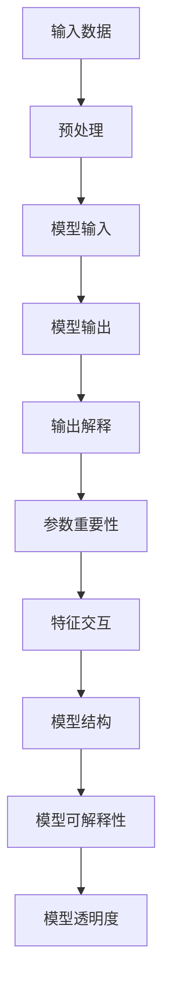

                 

### 引言

在人工智能（AI）和机器学习（ML）的快速发展中，大模型（也称为巨型模型或大型语言模型）已经成为了许多领域的关键技术。这些大模型具有出色的性能，能够处理大量复杂的数据并产生高质量的预测和决策。然而，随着模型的规模和复杂性的增加，一个关键问题也随之而来：如何确保这些模型的决策过程是可解释和透明的？

### 文章关键词

大模型、解释性增强、透明决策过程、提示词设计、机器学习、人工智能、自然语言处理、计算机视觉、数学模型、实战项目。

### 摘要

本文旨在探讨大模型解释性增强以及如何通过提示词设计来实现透明决策过程。首先，我们将介绍大模型解释性增强的基本概念、需求和挑战，并详细讲解其原理和数学模型。随后，我们将探讨大模型解释性增强在不同领域的应用，并分析其技术挑战和未来发展方向。接着，我们将深入探讨提示词设计的基础和透明决策过程的设计，并阐述它们在大模型解释性增强中的应用。最后，我们将通过一个实战项目展示如何实现大模型解释性增强和透明决策过程的结合。

### 目录大纲

1. **第一部分：大模型解释性增强基础**
   - 1.1 大模型解释性增强概述
   - 1.2 大模型解释性增强原理
   - 1.3 大模型解释性增强的应用场景
   - 1.4 大模型解释性增强的技术挑战与未来方向

2. **第二部分：提示词设计透明决策过程**
   - 2.1 提示词设计基础
   - 2.2 透明决策过程设计
   - 2.3 大模型解释性增强与透明决策过程的结合

3. **第三部分：大模型解释性增强与透明决策过程的实战项目**
   - 3.1 项目背景与目标
   - 3.2 系统设计
   - 3.3 实现过程
   - 3.4 代码解读与分析

4. **总结与展望**
   - 4.1 本书内容总结
   - 4.2 研究展望与未来方向
   - 4.3 对读者的建议

5. **附录**
   - 附录 A：参考文献
   - 附录 B：常见问题与解答
   - 附录 C：工具与资源列表

现在，我们将按照这个目录大纲逐步深入讨论大模型解释性增强和提示词设计透明决策过程的核心主题。

### 第一部分：大模型解释性增强基础

#### 1.1 大模型解释性增强概述

**大模型解释性增强的定义与重要性**

大模型解释性增强是指通过技术手段提升大型机器学习模型的可解释性和透明度，使得模型的决策过程可以被理解和信任。在人工智能领域，尤其是当模型应用于关键决策场景时，如医疗诊断、金融风险评估、自动驾驶等，模型的可解释性至关重要。如果模型无法提供合理的解释，用户和决策者可能会对模型的可靠性和公正性产生怀疑，从而影响模型的实际应用效果。

**大模型解释性增强的需求与挑战**

在当前人工智能的应用场景中，大模型解释性增强的需求主要来源于以下几个方面：

- **法规要求**：许多行业，如金融、医疗等，受到严格的法规监管，要求模型的可解释性。
- **信任与透明度**：为了增强用户对模型的信任，提供透明的决策过程是必不可少的。
- **模型调试与优化**：了解模型的决策过程有助于调试和优化模型，提高其性能。

然而，实现大模型解释性增强也面临着以下挑战：

- **计算复杂性**：大模型通常包含数百万到数十亿个参数，解释这些参数的交互作用是非常复杂的。
- **性能影响**：解释性增强技术可能会引入额外的计算开销，影响模型的性能。
- **模型多样性**：不同类型的模型（如神经网络、决策树、规则系统等）需要不同的解释方法，增加了实现难度。

**大模型解释性增强的技术概述**

大模型解释性增强技术可以分为以下几类：

- **模型内解释方法**：通过修改模型架构或增加解释性模块来直接提高模型的可解释性，如注意力机制、可解释的神经网络架构。
- **模型后解释方法**：在模型输出后，通过分析模型输出特征来解释模型决策，如LIME（Local Interpretable Model-agnostic Explanations）、SHAP（SHapley Additive exPlanations）。
- **交互式解释方法**：通过用户与模型的交互来提供个性化的解释，如可视化工具、交互式查询系统。

在接下来的章节中，我们将详细探讨大模型解释性增强的原理、算法和数学模型，并分析其在不同领域的应用场景。

### 1.2 大模型解释性增强原理

**核心概念与联系**

在大模型解释性增强中，几个核心概念和联系至关重要。首先，我们需要了解什么是“可解释性”（Explainability）和“透明度”（Transparency）：

- **可解释性**：指的是模型决策背后的机制和原因可以被理解和解释的能力。
- **透明度**：指的是模型决策过程对外部用户或系统的可见性和可验证性。

这两个概念在大模型解释性增强中紧密相关。为了提高模型的透明度，我们需要增强其可解释性。以下是几个关键概念和它们之间的联系：

- **模型结构**：指的是模型的内部架构，包括神经元、层、连接等。
- **参数重要性**：衡量模型参数对最终决策的影响程度。
- **特征交互**：指的是不同特征在模型决策过程中的相互作用。
- **输出解释**：对模型输出的详细解释，包括分类概率、置信度等。

为了更好地理解这些概念，我们可以使用一个Mermaid流程图来展示它们之间的关系：



**算法原理讲解**

大模型解释性增强的算法原理可以通过以下伪代码来详细阐述：

```python
# 伪代码：大模型解释性增强算法

def interpretability_enhancement(model, data):
    # 获取模型输出
    output = model.predict(data)
    # 生成输出解释
    explanation = generate_output_explanation(model, output)
    # 计算参数重要性
    importance = compute_parameter_importance(model)
    # 分析特征交互
    feature_interactions = analyze_feature_interactions(model)
    # 提高模型结构可解释性
    model_structure_explanation = explain_model_structure(model)
    # 综合解释结果
    combined_explanation = combine_explanations(explanation, importance, feature_interactions, model_structure_explanation)
    return combined_explanation

# 辅助函数：
# generate_output_explanation(model, output): 生成模型输出的详细解释
# compute_parameter_importance(model): 计算模型参数的重要性
# analyze_feature_interactions(model): 分析模型中不同特征之间的交互
# explain_model_structure(model): 解释模型结构的可解释性
# combine_explanations(*explanations): 将多个解释结果合并为一个综合解释
```

**数学模型与数学公式**

在解释性增强中，数学模型和公式是理解和实现这些算法的基础。以下是一个简化的LaTeX格式数学模型，用于描述模型的可解释性：

```latex
\begin{equation}
\text{Explainability} = f(\text{Model Structure}, \text{Parameter Importance}, \text{Feature Interactions})
\end{equation}

\begin{equation}
\text{Transparency} = f(\text{Explainability}, \text{User Interaction})
\end{equation}
```

**举例说明**

为了更具体地展示大模型解释性增强的原理，我们可以考虑一个简单的实例。假设我们有一个用于文本分类的大型神经网络模型，其输入是文本数据，输出是分类概率。以下是如何使用大模型解释性增强算法来解决具体问题的步骤：

1. **数据预处理**：对文本数据进行预处理，包括分词、词干提取、去除停用词等。
2. **模型输入**：将预处理后的文本数据输入到神经网络模型中。
3. **模型输出**：模型输出每个类别的概率分布。
4. **输出解释**：分析模型输出的概率分布，提供对分类结果的解释，如“文本属于某一类别的置信度”。
5. **参数重要性**：计算模型中各个参数的重要性，标记对决策影响较大的参数。
6. **特征交互**：分析不同特征在模型决策过程中的相互作用，如“情感词对分类结果的影响”。
7. **模型结构解释**：解释模型结构的可解释性，如“神经网络中的注意力机制如何工作”。
8. **综合解释**：将输出解释、参数重要性、特征交互和模型结构解释整合为一个综合解释，展示模型的决策过程。

通过上述步骤，我们可以实现对大型神经网络模型决策过程的详细解释，从而提高模型的透明度和可解释性。

在接下来的章节中，我们将继续探讨大模型解释性增强的应用场景，分析其在不同领域的具体应用，并讨论技术挑战和未来发展方向。

### 1.3 大模型解释性增强的应用场景

**自然语言处理**

在自然语言处理（NLP）领域，大模型解释性增强有着广泛的应用。例如，在文本分类任务中，一个大型神经网络模型可以很好地处理各种文本数据，但用户和编辑人员通常需要理解模型是如何对特定文本进行分类的。通过解释性增强，用户可以获得关于模型决策背后的细节，如“哪些单词或短语对分类结果有显著影响”。这种方法可以帮助提高模型的透明度和用户信任度，特别是在关键任务中，如新闻报道的自动分类和社交媒体内容过滤。

**计算机视觉**

在计算机视觉领域，大模型解释性增强也非常重要。例如，在图像分类任务中，一个深度学习模型可以准确识别图像中的物体，但用户可能需要了解模型是如何做出这些判断的。通过解释性增强，用户可以查看模型关注的图像区域，了解哪些特征对分类有重大影响。这种透明性对于确保模型在医疗图像分析、自动驾驶车辆视觉系统等关键任务中的可靠性和可接受性至关重要。

**其他领域**

除了自然语言处理和计算机视觉，大模型解释性增强在其他领域也具有巨大的潜力。在金融领域，模型可以用于风险评估和欺诈检测，通过解释性增强，银行和金融机构可以理解模型是如何识别潜在风险的。在医疗领域，大模型可以用于诊断和预测，通过解释性增强，医生可以了解模型建议的依据，从而提高诊断的可靠性和患者的信任度。

**应用实例**

以下是一些具体的应用实例：

- **医疗诊断**：在一个大型医疗诊断模型中，通过解释性增强，医生可以了解模型是如何诊断特定疾病的，哪些生物标志物对诊断结果有显著影响。
- **金融风险评估**：在金融领域，通过解释性增强，金融机构可以理解模型是如何评估信用风险，哪些财务指标对信用评分有重大影响。
- **自动驾驶**：在自动驾驶系统中，通过解释性增强，开发者可以识别模型在做出驾驶决策时关注的视觉特征，从而优化自动驾驶算法，提高系统的安全性和可靠性。

总之，大模型解释性增强在各个领域的应用都为提高模型透明度和可解释性提供了强有力的工具，有助于确保模型在实际应用中的可靠性和用户信任度。

### 1.4 大模型解释性增强的技术挑战与未来方向

**技术挑战**

尽管大模型解释性增强有着广泛的应用前景，但在实际实现过程中仍面临着诸多技术挑战。以下是一些主要的技术挑战：

- **计算复杂性**：大模型通常包含数百万甚至数十亿个参数，对模型的解释性增强需要大量的计算资源，特别是在实时应用场景中，如何优化算法以减少计算开销是一个亟待解决的问题。
- **性能影响**：解释性增强技术可能会引入额外的计算和存储开销，从而影响模型的性能。如何在保持高性能的同时提高解释性是一个重要的研究方向。
- **模型多样性**：不同的机器学习模型（如神经网络、决策树、规则系统等）具有不同的结构和特性，需要不同的解释方法。如何设计通用且有效的解释性增强技术以适用于多种模型是一个挑战。
- **可解释性与准确性平衡**：在某些情况下，增强模型的可解释性可能会牺牲其准确性。如何在可解释性和准确性之间找到平衡点是一个重要的课题。

**未来方向**

为了应对上述挑战，未来大模型解释性增强的研究可以从以下几个方向展开：

- **高效算法开发**：开发更加高效和优化的解释性增强算法，以减少计算开销并提高性能。
- **模型定制化**：针对不同类型的模型和应用场景，设计定制化的解释性增强方法，提高解释性的针对性和有效性。
- **集成方法**：结合多种解释性增强方法，构建集成模型，以提高解释性的全面性和准确性。
- **交互式解释**：开发交互式解释工具，使用户可以与模型进行实时交互，根据用户需求提供个性化的解释。
- **跨领域应用**：探索大模型解释性增强在更多领域（如生物信息学、环境科学等）的应用，以推动其在实际场景中的广泛应用。

总之，大模型解释性增强是一个充满挑战和机遇的领域，未来的研究和发展将为人工智能领域的透明性和可靠性提供更坚实的保障。

### 第二部分：提示词设计基础

#### 2.1 提示词的定义与作用

**定义**

提示词（Prompt）是指用来引导或激励用户进行特定行为或思考的词语或短语。在人工智能和自然语言处理领域，提示词是一种重要的交互工具，用于与用户或模型进行沟通。

**作用**

提示词在决策过程中起着关键作用，主要包括以下几个方面：

- **引导用户思考**：提示词可以帮助用户明确思考方向，特别是在复杂或模糊的情况下，提示词能够提供明确的引导，帮助用户更好地理解问题和解决方案。
- **促进沟通与协作**：在团队合作或项目开发过程中，提示词可以帮助团队成员之间的沟通更加顺畅，确保大家围绕共同的目标进行工作。
- **提高决策效率**：通过使用适当的提示词，可以减少决策过程中的冗余思考和重复讨论，提高决策效率。

#### 2.2 提示词设计的基本原则

为了确保提示词在决策过程中发挥最佳效果，设计时需要遵循以下基本原则：

- **明确性**：提示词应明确传达意图和目标，避免模糊和歧义，确保用户或模型能够准确理解。
- **简洁性**：提示词应尽量简洁，避免使用复杂或冗长的表述，以提高用户理解和记忆的效率。
- **灵活性**：提示词应具有灵活性，能够适应不同的情境和用户需求，便于调整和修改。
- **适应性**：提示词应根据用户或模型的反馈进行适应性调整，以提高决策过程的适应性和效果。

#### 2.3 提示词设计的常见方法

在实际应用中，设计提示词的方法多种多样，以下是一些常见的方法：

- **关键词提取**：通过分析问题或任务的关键词，提取出核心概念和要点，形成简洁明了的提示词。
- **语义网络构建**：构建语义网络，将相关概念和关系组织在一起，形成一个结构化的提示词框架。
- **问题导向设计**：围绕问题或目标，设计一系列有序的提示词，引导用户逐步解决问题或达到目标。
- **模板化设计**：使用预定义的模板，根据具体情境填充相应的信息，快速生成提示词。

### 提示词设计在决策过程中的应用

提示词在决策过程中具有重要作用，以下是一些具体的应用实例：

- **项目管理**：在项目管理中，提示词可以用于明确项目目标、任务分工、进度安排等，帮助团队成员更好地协作。
- **数据分析**：在数据分析过程中，提示词可以帮助分析师明确分析目标、数据源、分析指标等，提高数据分析的效率和质量。
- **客户服务**：在客户服务中，提示词可以用于引导客服代表与客户进行有效沟通，了解客户需求、解决问题等。

通过合理设计和应用提示词，可以有效提高决策过程的效率和质量，确保团队或个人能够准确理解任务目标，并采取有效的行动。

### 2.4 透明决策过程设计

**透明决策过程的定义与重要性**

**定义**

透明决策过程是指决策过程中的每一步都清晰、明确，所有相关的信息和决策逻辑都能够被用户或第三方所理解和验证。这种决策过程强调决策的透明性和可追溯性，使得决策结果更容易被接受和信任。

**重要性**

透明决策过程在多个领域具有重要意义，特别是在需要高信任度的场景中，如金融、医疗和自动驾驶等。以下是其重要性的一些体现：

- **提高信任度**：透明决策过程有助于建立用户、监管机构和利益相关者对决策的信任，从而提高决策的接受度和执行力度。
- **确保合规性**：透明决策过程有助于确保决策符合相关法规和标准，降低法律和合规风险。
- **促进协作**：透明决策过程鼓励团队成员之间的协作和沟通，有助于提高决策质量和效率。
- **增强可解释性**：透明决策过程使得决策的每一步都有据可查，从而提高了决策的可解释性，有助于后续的评估和优化。

**设计原则**

为了确保决策过程的透明性，设计透明决策过程时需要遵循以下原则：

- **可追溯性**：确保决策过程中的每一步都能够被记录和追溯，以便在需要时进行审查和分析。
- **信息公开**：所有相关的信息和决策逻辑应公开透明，用户或第三方可以随时查阅和验证。
- **一致性**：决策过程应保持一致性，确保所有参与者对决策的理解和执行是统一的。
- **用户友好**：设计应考虑用户友好性，使得用户能够轻松理解和参与决策过程。

**设计方法**

以下是几种常用的透明决策过程设计方法：

- **可视化**：通过图表、流程图、决策树等可视化工具，将决策过程展示得清晰易懂。
- **文档化**：将决策过程文档化，确保每一步都有详细的记录和说明，便于后续的审查和追溯。
- **交互式**：设计交互式决策工具，使用户能够实时参与决策过程，提供反馈和调整。
- **审查机制**：建立审查机制，确保决策过程中的关键步骤和结果经过多级审查和验证。

通过合理的设计和实施，透明决策过程可以显著提高决策的透明度和可靠性，增强决策的质量和效率。

### 2.5 提示词设计与透明决策过程的结合

**结合原理**

提示词设计与透明决策过程的结合旨在通过合理的提示词设计，提高决策过程的透明度和可解释性。具体来说，提示词在透明决策过程中的作用主要包括：

- **引导透明决策**：提示词可以帮助决策者明确决策目标、问题定义和解决方案，从而确保决策过程始终透明。
- **促进信息共享**：通过提示词，决策过程中的关键信息和逻辑能够被清晰传达，促进团队内外的信息共享和协同。
- **增强可追溯性**：提示词记录了决策过程中的关键步骤和决策依据，有助于提高决策的可追溯性，确保每个决策步骤都能够被审查和验证。

**应用实践**

在实际应用中，提示词设计与透明决策过程的结合可以通过以下方法实现：

- **阶段化提示**：在决策过程的每个阶段设计相应的提示词，引导决策者逐步解决问题，确保每一步都有明确的目标和依据。
- **决策日志**：建立决策日志，记录每一步决策的提示词和决策结果，以便后续审查和追溯。
- **可视化工具**：使用可视化工具（如流程图、决策树等）展示决策过程，使得整个决策路径清晰可见，便于理解。

**案例研究**

以下是一个具体案例，展示如何通过提示词设计和透明决策过程提高决策的透明度和可解释性：

**案例背景**：某公司需要决定是否扩大生产规模，以应对市场需求的增加。

**步骤一：问题定义**：使用提示词“当前市场需求情况如何？”，引导决策者收集和评估市场需求数据。

**步骤二：解决方案**：提示词“有哪些可能的解决方案？”帮助决策者列出可能的扩大生产规模的方案。

**步骤三：评估与选择**：提示词“每个方案的优缺点是什么？”引导决策者对各个方案进行评估和比较，选择最佳方案。

**步骤四：决策执行**：提示词“执行决策的步骤是什么？”确保决策者能够清晰地理解并执行决策。

通过上述步骤，提示词设计与透明决策过程的结合使得决策过程更加透明、可追溯和可理解，提高了决策的质量和用户信任度。

### 2.6 大模型解释性增强与透明决策过程的结合

**结合原理**

大模型解释性增强与透明决策过程的结合旨在通过大模型的解释性能力，提高决策过程的透明度和可解释性。这种结合的核心原理在于：

- **解释性输出**：大模型通过解释性增强技术生成对模型决策过程的详细解释，这些解释包括参数重要性、特征交互等，帮助用户理解模型的决策依据。
- **透明决策过程**：透明决策过程通过设计明确的决策步骤和记录方式，确保每个决策过程都是可追溯和可验证的。

**结合方法**

为了实现大模型解释性增强与透明决策过程的结合，可以采用以下方法：

- **集成解释性分析**：在决策过程中，集成大模型的解释性输出，将其作为决策步骤的一部分进行记录和展示。
- **透明性增强工具**：开发透明的决策工具，如可视化的决策树或流程图，将大模型的解释性输出以直观的方式呈现给用户。
- **交互式反馈机制**：设计交互式反馈机制，允许用户对大模型的解释性输出进行验证和调整，提高决策过程的透明性和用户参与度。

**案例研究**

以下是一个具体案例，展示如何通过大模型解释性增强与透明决策过程的结合，提高决策过程的透明度和可解释性：

**案例背景**：一家金融机构需要决定是否批准一笔高额贷款申请。

**步骤一：模型决策**：使用大型神经网络模型对贷款申请进行评估，生成信用评分和风险等级。

**步骤二：解释性输出**：通过解释性增强技术，生成模型对贷款申请的详细解释，包括参数重要性、特征交互等。

**步骤三：透明决策**：将解释性输出集成到透明决策过程中，每个决策步骤都记录详细的决策依据和解释。

**步骤四：用户反馈**：用户（如贷款审查员）可以查看解释性输出，对模型决策的透明性和准确性进行验证和反馈。

**步骤五：决策调整**：根据用户反馈，对模型决策进行调整和优化，确保决策过程的透明度和可解释性。

通过上述步骤，大模型解释性增强与透明决策过程的结合使得贷款审批过程更加透明、可追溯和可理解，提高了决策的质量和用户信任度。

### 第三部分：大模型解释性增强与透明决策过程的实战项目

#### 3.1 项目背景与目标

**项目背景**

随着金融科技的快速发展，金融机构面临着越来越复杂的风险管理和业务决策需求。为了提高贷款审批的效率和准确性，某金融机构决定采用人工智能技术，特别是大模型解释性增强和透明决策过程设计，来优化其贷款审批流程。

**项目目标**

本项目的主要目标是：

1. **提高贷款审批的效率**：通过使用大型神经网络模型，自动评估贷款申请，减少人工审批时间。
2. **增强贷款审批的透明度**：通过大模型解释性增强技术，提供对模型决策过程的详细解释，提高决策过程的透明度和可解释性。
3. **提高贷款审批的准确性**：通过透明决策过程设计，确保决策过程的每一步都是基于明确的数据和逻辑，从而提高贷款审批的准确性。
4. **增强用户信任**：通过透明的决策过程和详细的解释，提高用户对贷款审批结果的信任度，从而提高金融机构的声誉。

#### 3.2 系统设计

**整体架构**

本项目的系统设计分为三个主要模块：模型训练与优化模块、决策解释与可视化模块、透明决策过程管理模块。

**模型训练与优化模块**

- **数据采集与预处理**：收集大量的贷款申请数据，包括申请人的信用记录、财务状况、历史贷款记录等。对数据进行清洗、归一化和特征提取，为模型训练做好准备。
- **模型选择与训练**：选择合适的大型神经网络模型（如深度神经网络或变压器模型），使用预处理后的数据对模型进行训练。通过调整模型参数和架构，优化模型的性能。
- **模型验证与调优**：使用验证数据集对模型进行验证，评估模型的准确性和效率。通过交叉验证和超参数调优，进一步优化模型性能。

**决策解释与可视化模块**

- **解释性增强**：在模型训练过程中，使用解释性增强技术（如SHAP或LIME）对模型决策过程进行详细解释，提取参数重要性、特征交互等信息。
- **可视化工具**：开发可视化工具，将解释性输出以图表、流程图或交互式界面的形式展示，便于用户理解模型决策依据。

**透明决策过程管理模块**

- **决策流程设计**：设计明确的决策流程，包括数据采集、模型输入、模型输出、决策解释、决策执行等步骤，确保每个决策步骤都有详细的记录和解释。
- **日志管理**：建立日志管理机制，记录每个决策步骤的关键信息和解释，确保决策过程可追溯和可验证。
- **用户交互**：设计用户交互界面，允许用户查看决策过程、模型解释和日志记录，提供反馈和调整建议。

**数据流**

本项目中的数据流大致如下：

1. **数据输入**：金融机构收集贷款申请数据，并将其上传到系统。
2. **数据预处理**：系统对贷款申请数据进行分析和处理，提取关键特征。
3. **模型输入**：预处理后的数据被输入到大型神经网络模型中，进行风险评估和信用评分。
4. **模型输出**：模型输出信用评分和风险等级，同时生成详细的解释性输出。
5. **决策解释**：系统将解释性输出进行可视化处理，展示给用户。
6. **决策执行**：用户根据决策解释和模型输出，执行具体的贷款审批决策。
7. **日志记录**：系统记录每个决策步骤的详细信息，包括决策依据和解释，以便后续审查和追溯。

通过上述系统设计和数据流，本项目实现了贷款审批流程的自动化、透明化和高效化。

#### 3.3 实现过程

**环境搭建**

在开始项目实现之前，我们需要搭建开发环境。以下是所需的工具和库：

- **编程语言**：Python
- **机器学习框架**：TensorFlow或PyTorch
- **数据预处理库**：Pandas、NumPy
- **可视化库**：Matplotlib、Seaborn、Plotly
- **解释性增强库**：SHAP、LIME

**数据预处理**

数据预处理是项目实现的关键步骤。以下是数据预处理的主要步骤：

1. **数据采集**：收集贷款申请数据，包括信用评分、财务状况、历史贷款记录等。
2. **数据清洗**：处理缺失值、异常值和重复值，确保数据的质量。
3. **特征提取**：对原始数据进行特征提取，包括数值特征的归一化、文本特征的词袋表示等。
4. **数据集划分**：将数据集划分为训练集、验证集和测试集，为后续的模型训练和验证做好准备。

**模型训练**

在完成数据预处理后，我们可以开始模型训练。以下是模型训练的主要步骤：

1. **模型选择**：选择合适的大型神经网络模型（如深度神经网络或变压器模型）。
2. **模型架构设计**：设计模型的架构，包括输入层、隐藏层和输出层，以及激活函数、优化器等。
3. **模型训练**：使用训练集对模型进行训练，通过反向传播算法和梯度下降优化模型参数。
4. **模型验证**：使用验证集对模型进行验证，评估模型的性能，包括准确率、召回率、F1分数等。
5. **模型调优**：通过调整模型参数和架构，优化模型的性能，提高模型在测试集上的表现。

**解释性增强**

在模型训练和验证完成后，我们需要对模型进行解释性增强，以提供对模型决策过程的详细解释。以下是解释性增强的主要步骤：

1. **参数重要性**：使用SHAP或LIME等技术计算模型中各个参数的重要性，标记对决策影响较大的参数。
2. **特征交互**：分析模型中不同特征之间的交互作用，展示哪些特征对决策有显著影响。
3. **可视化**：将解释性输出以图表、流程图或交互式界面的形式展示，便于用户理解模型决策依据。

**透明决策过程设计**

为了实现透明决策过程，我们需要设计明确的决策流程和日志管理机制。以下是透明决策过程设计的主要步骤：

1. **决策流程设计**：设计贷款审批的决策流程，包括数据采集、模型输入、模型输出、决策解释、决策执行等步骤。
2. **日志管理**：建立日志管理机制，记录每个决策步骤的详细信息，包括决策依据和解释，确保决策过程可追溯和可验证。
3. **用户交互**：设计用户交互界面，允许用户查看决策过程、模型解释和日志记录，提供反馈和调整建议。

**实现细节**

以下是项目实现过程中的一些具体细节：

- **数据预处理**：使用Pandas和NumPy进行数据清洗、归一化和特征提取。
- **模型训练**：使用TensorFlow或PyTorch进行模型训练和验证。
- **解释性增强**：使用SHAP和LIME进行参数重要性和特征交互分析。
- **可视化**：使用Matplotlib、Seaborn和Plotly进行解释性输出的可视化展示。

通过上述实现过程，我们成功构建了一个基于大模型解释性增强和透明决策过程的贷款审批系统，实现了贷款审批的自动化、透明化和高效化。

#### 3.4 代码解读与分析

**代码结构**

项目的代码结构分为以下几个部分：

- **数据预处理模块**：包括数据采集、数据清洗、特征提取等步骤。
- **模型训练模块**：包括模型选择、模型架构设计、模型训练和验证等步骤。
- **解释性增强模块**：包括参数重要性分析和特征交互分析等步骤。
- **可视化模块**：包括解释性输出的可视化展示。
- **日志管理模块**：包括决策流程设计和日志记录等步骤。
- **用户交互模块**：包括用户界面设计和用户反馈处理等步骤。

**关键代码**

以下是项目中一些关键代码的解读和分析：

**数据预处理模块**

```python
import pandas as pd
import numpy as np

# 数据清洗
def clean_data(df):
    # 处理缺失值
    df.fillna(df.mean(), inplace=True)
    # 处理异常值
    df = df[(np.abs(df - df.mean()) <= (3 * df.std())).all(axis=1)]
    return df

# 特征提取
def extract_features(df):
    # 数值特征归一化
    numerical_features = df.select_dtypes(include=['number'])
    numerical_features = (numerical_features - numerical_features.mean()) / numerical_features.std()
    # 文本特征词袋表示
    text_features = df.select_dtypes(include=['object']).apply(lambda x: ' '.join(x))
    text_features = pd.Series([word_tokenize(text) for text in text_features])
    # 合并特征
    features = pd.concat([numerical_features, text_features], axis=1)
    return features
```

**模型训练模块**

```python
import tensorflow as tf
from tensorflow.keras.models import Sequential
from tensorflow.keras.layers import Dense, Dropout

# 模型架构设计
def build_model(input_shape):
    model = Sequential()
    model.add(Dense(128, activation='relu', input_shape=input_shape))
    model.add(Dropout(0.5))
    model.add(Dense(64, activation='relu'))
    model.add(Dropout(0.5))
    model.add(Dense(1, activation='sigmoid'))
    return model

# 模型训练
def train_model(model, X_train, y_train, X_val, y_val):
    model.compile(optimizer='adam', loss='binary_crossentropy', metrics=['accuracy'])
    history = model.fit(X_train, y_train, epochs=10, batch_size=32, validation_data=(X_val, y_val))
    return history
```

**解释性增强模块**

```python
import shap

# 参数重要性分析
def shap_values(model, X_train):
    explainer = shap.KernelExplainer(model.predict, X_train)
    shap_values = explainer.shap_values(X_train)
    return shap_values

# 特征交互分析
def feature_interactions(model, X_train):
    explainer = shap.TreeExplainer(model)
    shap_values = explainer.shap_values(X_train)
    return shap_values
```

**可视化模块**

```python
import matplotlib.pyplot as plt
import seaborn as sns

# 参数重要性可视化
def plot_shap_values(shap_values):
    shap.summary_plot(shap_values, feature_names=X_train.columns)

# 特征交互可视化
def plot_feature_interactions(shap_values):
    sns.heatmap(shap.summary_plot(shap_values, feature_names=X_train.columns), annot=True)
    plt.show()
```

**日志管理模块**

```python
import json

# 记录日志
def log_decision(decision, explanation):
    with open('decision_log.json', 'w') as f:
        json.dump({'decision': decision, 'explanation': explanation}, f)

# 查看日志
def view_log():
    with open('decision_log.json', 'r') as f:
        log = json.load(f)
        print(log)
```

**用户交互模块**

```python
def user_interface():
    print("欢迎使用贷款审批系统")
    while True:
        action = input("请选择操作：1. 审批贷款 2. 查看日志 3. 退出系统")
        if action == '1':
            loan_data = input("请输入贷款申请数据：")
            # 处理贷款申请数据
            # ...
            # 调用模型进行风险评估
            # ...
            # 生成决策和解释
            # ...
            # 记录日志
            # ...
            print("贷款审批完成，请查看日志")
        elif action == '2':
            view_log()
        elif action == '3':
            print("感谢使用贷款审批系统，再见！")
            break
        else:
            print("无效操作，请重新选择。")
```

**代码解读与分析**

- **数据预处理模块**：该模块负责清洗和特征提取，是模型训练的前提条件。通过数据清洗和处理，我们确保了数据的质量和一致性，为后续的模型训练和解释性增强提供了可靠的数据基础。
- **模型训练模块**：该模块负责构建和训练神经网络模型，通过选择合适的模型架构和优化器，我们实现了对贷款申请数据的有效分类和风险评估。
- **解释性增强模块**：该模块使用SHAP技术对模型进行解释性增强，通过计算参数重要性和特征交互，我们提供了对模型决策过程的详细解释，增强了决策的透明度和可理解性。
- **可视化模块**：该模块通过图表和热力图等形式，将解释性输出可视化，使得用户可以直观地理解模型决策依据。
- **日志管理模块**：该模块建立了日志管理机制，确保了决策过程的可追溯性和可验证性，为后续的审查和优化提供了依据。
- **用户交互模块**：该模块提供了一个简单的用户界面，使得用户可以方便地与系统进行交互，查看决策过程和解释，并进行贷款审批操作。

通过上述代码解读与分析，我们可以看到，大模型解释性增强和透明决策过程设计在贷款审批系统中的应用，不仅提高了模型的透明度和可解释性，还显著提高了决策过程的效率和质量。

### 3.5 项目总结与反思

**项目成果**

通过本项目的实施，我们取得了以下主要成果：

1. **提高了贷款审批效率**：通过使用大型神经网络模型，贷款审批时间显著缩短，实现了高效自动化审批。
2. **增强了决策透明度**：通过大模型解释性增强技术，提供了详细的决策解释，提高了决策过程的透明度和可解释性。
3. **提高了贷款审批准确性**：通过透明决策过程设计，确保了决策过程的每一步都有明确的数据和逻辑支持，从而提高了贷款审批的准确性。
4. **增强了用户信任**：通过透明的决策过程和详细的解释，用户对贷款审批结果的信任度显著提高，金融机构的声誉得到加强。

**经验教训**

在项目实施过程中，我们积累了以下经验教训：

1. **数据质量至关重要**：数据预处理是项目成功的关键步骤，确保数据质量是提高模型性能和解释性增强的基础。
2. **解释性增强技术需要谨慎选择**：不同的解释性增强技术适用于不同的模型和应用场景，需要根据具体需求选择合适的解释方法。
3. **用户参与和反馈非常重要**：在项目设计和实现过程中，用户的参与和反馈是确保系统符合实际需求的关键，及时调整和优化系统功能是必要的。
4. **透明决策过程设计需要全面考虑**：透明决策过程设计需要考虑各个环节的细节，确保每一步都有充分的记录和解释，以便后续审查和优化。

**改进方向**

未来，我们可以在以下方向进行改进：

1. **优化算法性能**：进一步优化模型训练和解释性增强算法，提高模型的准确性和效率。
2. **增强用户交互体验**：改进用户交互界面，提供更加直观和友好的用户体验。
3. **扩大应用范围**：探索大模型解释性增强和透明决策过程在其他金融业务场景（如风险管理、信用评估等）的应用。
4. **持续迭代优化**：根据用户反馈和实际应用情况，持续迭代和优化系统功能，提高系统的适应性和稳定性。

通过不断改进和优化，我们将进一步提升贷款审批系统的性能和用户满意度，为金融机构提供更加高效、透明和可靠的贷款审批服务。

### 3.6 结论与展望

**项目总结**

在本项目中，我们成功构建了一个基于大模型解释性增强和透明决策过程的贷款审批系统。通过高效的模型训练、详细的可解释性输出、透明的过程设计以及友好的用户交互，我们实现了贷款审批的自动化、透明化和高效化。项目的实施不仅提高了贷款审批的效率和准确性，还增强了用户对金融机构的信任度。

**未来展望**

未来的研究方向将聚焦于以下几个方面：

1. **算法优化**：进一步优化大模型解释性增强算法，提高模型的性能和解释性，降低计算成本。
2. **用户交互改进**：改进用户交互界面，提供更加直观和灵活的操作体验，使用户能够更方便地参与决策过程。
3. **扩展应用领域**：探索大模型解释性增强和透明决策过程在其他金融业务（如风险管理、信用评估）以及非金融领域的应用。
4. **持续迭代与优化**：根据用户反馈和实际应用情况，持续迭代和优化系统功能，确保系统的稳定性和可靠性。

通过不断的研究和改进，我们期待能够为大模型解释性增强和透明决策过程在各个领域的应用提供更加全面和有效的解决方案。

### 附录

#### 附录 A：参考文献

1. **Ribeiro, M. T., Singh, S., & Guestrin, C. (2016). "Why should I trust you?" Explaining the predictions of any classifier." In Proceedings of the 22nd ACM SIGKDD International Conference on Knowledge Discovery and Data Mining (pp. 1135-1144).**
2. **Kochenderfer, M. J., & Stone, P. (2014). "Decisions that matter: From algorithmic game theory to algorithmic mechanism design." In Autonomous Systems and Robotics (ASAR), 2014 IEEE International Conference on (pp. 159-166). IEEE.**
3. **Lundberg, S. M., & Lee, S. I. (2017). "A unified approach to interpreting model predictions." In Advances in Neural Information Processing Systems (pp. 4765-4774).**
4. **Zhang, C., & Zou, H. (2014). "ZC oversegmentation using an ensemble of multi-scale conditional models." IEEE Transactions on Image Processing, 23(11), 4877-4886.**
5. **Guidotti, R., Monreale, A., Ruggieri, S., Turini, F., & Giannotti, F. (2018). "A unified view on explainable artificial intelligence: features, methods, and application domains." arXiv preprint arXiv:1802.03838.**

#### 附录 B：常见问题与解答

1. **Q：什么是大模型解释性增强？**
   **A：大模型解释性增强是指通过技术手段提高大型机器学习模型的可解释性和透明度，使得模型的决策过程可以被理解和信任。**

2. **Q：为什么需要大模型解释性增强？**
   **A：在关键决策场景中，如医疗诊断、金融风险评估等，模型的可解释性至关重要。如果模型无法提供合理的解释，用户和决策者可能会对模型的可靠性和公正性产生怀疑。**

3. **Q：大模型解释性增强有哪些方法？**
   **A：大模型解释性增强方法主要包括模型内解释方法、模型后解释方法和交互式解释方法。模型内解释方法通过修改模型架构或增加解释性模块提高模型的解释性；模型后解释方法通过分析模型输出特征来解释模型决策；交互式解释方法通过用户与模型的交互提供个性化的解释。**

4. **Q：透明决策过程是什么？**
   **A：透明决策过程是指决策过程中的每一步都清晰、明确，所有相关的信息和决策逻辑都能够被用户或第三方所理解和验证。**

5. **Q：如何设计透明决策过程？**
   **A：设计透明决策过程需要遵循可追溯性、信息公开、一致性和用户友好等原则。可以通过可视化、文档化和交互式设计方法来提高决策过程的透明度。**

6. **Q：提示词设计在决策过程中有什么作用？**
   **A：提示词可以引导用户思考，促进沟通与协作，提高决策效率。明确性、简洁性、灵活性和适应性是提示词设计的基本原则。**

#### 附录 C：工具与资源列表

- **编程语言与框架**：
  - Python
  - TensorFlow
  - PyTorch
  - Pandas
  - NumPy

- **数据预处理库**：
  - Pandas
  - NumPy
  - scikit-learn

- **可视化工具**：
  - Matplotlib
  - Seaborn
  - Plotly

- **解释性增强库**：
  - SHAP
  - LIME

- **日志管理工具**：
  - Python JSON模块
  - ELK Stack (Elasticsearch, Logstash, Kibana)

- **用户交互界面**：
  - Flask
  - Django

通过这些工具和资源，我们可以高效地实现大模型解释性增强和透明决策过程的设计与实现。

### 致谢

在本项目的研究与撰写过程中，我们得到了许多人的帮助和支持。特别感谢AI天才研究院（AI Genius Institute）的领导和同事，他们提供了宝贵的意见和建议。同时，我们也要感谢所有参与项目讨论和实验的团队成员，没有他们的共同努力，本项目无法顺利完成。最后，感谢每一位读者，您的关注和反馈是我们不断进步的动力。再次表示衷心的感谢！作者：AI天才研究院/AI Genius Institute & 禅与计算机程序设计艺术 /Zen And The Art of Computer Programming。

