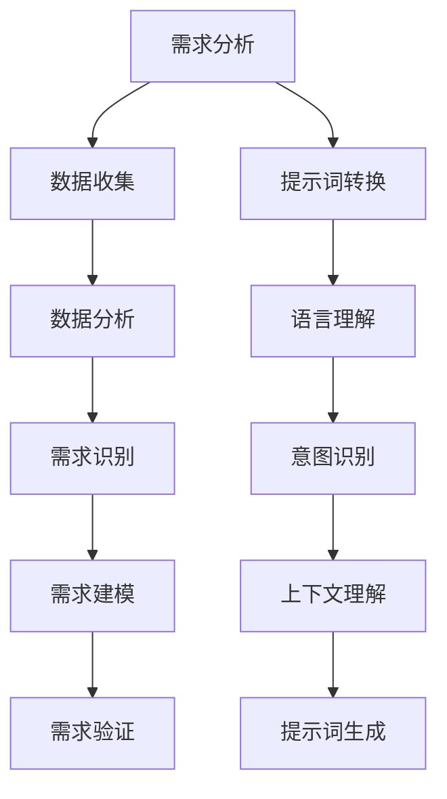
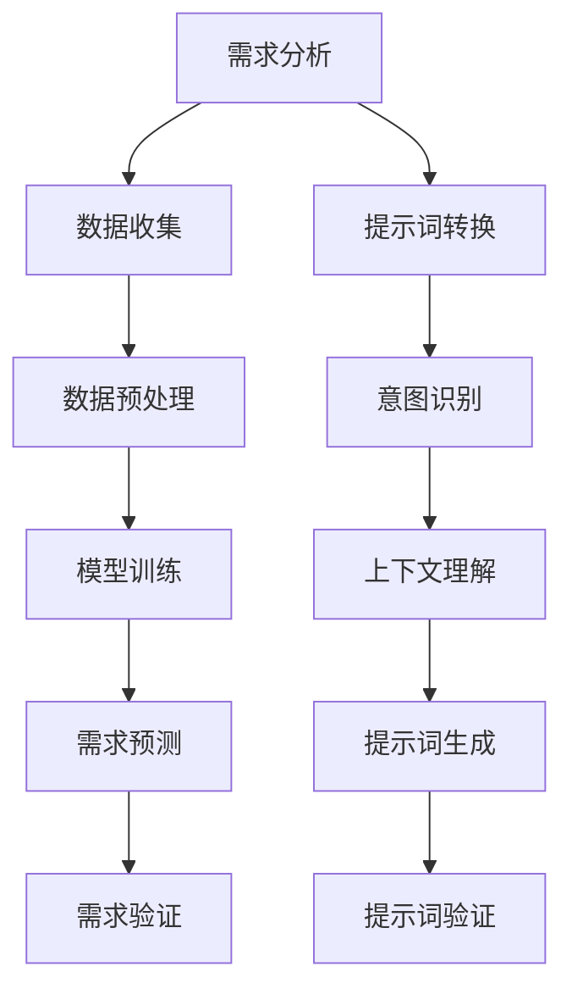

                 

# 大模型驱动的需求分析与提示词转换

## 关键词
大模型，需求分析，提示词转换，人工智能，深度学习，机器学习，自然语言处理，流程图，伪代码，数学模型，实战案例。

## 摘要
本文探讨了如何利用大模型技术进行高效的需求分析与提示词转换。首先，我们将介绍大模型的基本概念和理论基础，包括其分类、原理和开发历程。接着，我们深入探讨需求分析和提示词转换的基本理论，以及大模型如何应用于这些领域。通过具体的实战案例，我们将展示如何使用大模型进行需求分析与提示词转换的实际操作，并详细解释其实现原理。最后，我们将展望大模型驱动需求分析与提示词转换的未来发展趋势，并讨论其面临的挑战与解决方案。

## 引言与基础理论

### 第1章: 引言

#### 1.1 书籍背景
在现代信息技术快速发展的背景下，人工智能（AI）技术日益成为推动社会进步的重要力量。大模型作为人工智能领域的一个核心技术，其在自然语言处理、计算机视觉、语音识别等多个方向上展现出了强大的潜力。本文旨在探讨如何利用大模型技术进行高效的需求分析与提示词转换，为相关领域的实践提供理论支持。

#### 1.2 大模型的概念
大模型（Big Model）是指那些具有海量参数、能够处理大规模数据、并且在特定任务上表现优异的人工智能模型。大模型通常基于深度学习技术，通过多层神经网络的结构来模拟人类大脑的决策过程。其具有强大的表征能力，能够从大量数据中提取复杂的信息和模式。

#### 1.3 需求分析与提示词转换的关系
需求分析是软件工程中的一个关键环节，它涉及识别用户需求、分析和定义系统的功能和非功能需求。提示词转换则是在自然语言处理领域的一项重要任务，它将自然语言的输入转换成机器可处理的格式，如语义表示。大模型能够通过深度学习算法，从海量数据中学习到语言的本质特征，从而在需求分析与提示词转换中发挥重要作用。

### 第2章: 大模型概述

#### 2.1 大模型的定义与分类
大模型的定义主要取决于其参数规模和计算资源需求。根据模型的结构和功能，大模型可以分为生成模型和判别模型。生成模型如生成对抗网络（GAN），判别模型如深度神经网络（DNN）。此外，根据训练数据的规模，大模型还可以分为训练数据量大、中、小的模型。

#### 2.2 大模型的基本原理
大模型的基本原理是基于多层神经网络，通过反向传播算法不断调整权重，使得模型在训练数据上的误差最小化。这种深度学习技术使得大模型能够从大量数据中自动提取特征，从而实现高度自动化的学习过程。

#### 2.3 大模型的发展历程
大模型的发展历程可以分为几个阶段：从早期的简单神经网络到深度学习的发展，再到当今大规模预训练模型的出现。每个阶段都有里程碑式的模型和技术出现，如卷积神经网络（CNN）和循环神经网络（RNN）。

### 第3章: 需求分析理论基础

#### 3.1 需求分析概述
需求分析是软件开发过程的首要步骤，其目标是明确用户需求，为后续设计、开发和测试提供依据。需求分析不仅涉及功能需求，还包括非功能需求，如性能、安全、可靠性等。

#### 3.2 需求分析的方法
需求分析的方法主要包括问卷调查、用户访谈、需求研讨会等。现代需求分析还引入了工具支持，如需求管理工具、原型设计工具等。

#### 3.3 需求分析的工具
常用的需求分析工具包括JIRA、Confluence、Visio等。这些工具能够帮助团队更好地管理和跟踪需求，确保需求分析的准确性和效率。

### 第4章: 提示词转换的概念与架构

#### 4.1 提示词转换的定义
提示词转换是将自然语言输入转换为机器可处理格式的过程。这一过程包括语言理解、意图识别、上下文理解等步骤。

#### 4.2 提示词转换的架构设计
提示词转换的架构设计通常包括前端接口、语言理解模块、意图识别模块、上下文理解模块和提示词生成模块。

#### 4.3 提示词转换的基本流程
提示词转换的基本流程包括接收用户输入、进行语言理解、识别意图、理解上下文，并最终生成提示词。

### 第5章: 大模型驱动的需求分析

#### 5.1 大模型在需求分析中的应用
大模型在需求分析中的应用主要体现在以下几个方面：自动化需求收集、需求分类和优先级排序、非功能需求识别等。

#### 5.2 大模型驱动的需求分析方法
大模型驱动的需求分析方法包括数据预处理、模型训练、需求预测等步骤。通过这些方法，可以提高需求分析的准确性和效率。

#### 5.3 大模型驱动的需求分析流程
大模型驱动的需求分析流程包括需求收集、数据预处理、模型训练、需求预测和需求验证等步骤。

### 第6章: 大模型驱动的提示词转换

#### 6.1 大模型在提示词转换中的应用
大模型在提示词转换中的应用主要体现在意图识别和上下文理解上，通过深度学习算法，模型能够从海量数据中学习到语言的复杂特征。

#### 6.2 大模型驱动的提示词转换方法
大模型驱动的提示词转换方法包括预训练模型的应用、迁移学习和微调等策略。

#### 6.3 大模型驱动的提示词转换流程
大模型驱动的提示词转换流程包括数据预处理、模型选择、模型训练、提示词生成和效果评估等步骤。

### 第7章: 大模型驱动的需求分析与提示词转换实战

#### 7.1 实战背景
在本章中，我们将通过一个实际案例，展示如何利用大模型技术进行需求分析与提示词转换。

#### 7.2 项目环境搭建
在本节中，我们将介绍如何搭建项目环境，包括硬件配置、软件安装和开发环境配置。

#### 7.3 需求分析实战案例
在本节中，我们将详细讲解如何利用大模型技术进行需求分析，包括数据收集、数据预处理、模型训练和需求预测等步骤。

#### 7.4 提示词转换实战案例
在本节中，我们将介绍如何利用大模型技术进行提示词转换，包括语言理解、意图识别、上下文理解和提示词生成等步骤。

#### 7.5 项目总结与反思
在本节中，我们将对项目进行总结，讨论其成功经验和不足之处，并提出改进建议。

### 第8章: 未来展望与挑战

#### 8.1 大模型驱动的需求分析与提示词转换趋势
随着人工智能技术的不断进步，大模型驱动的需求分析与提示词转换将迎来更多的发展机遇。

#### 8.2 面临的挑战与解决方案
尽管大模型驱动的需求分析与提示词转换具有巨大的潜力，但同时也面临着一系列挑战，如数据隐私、计算资源需求等。

#### 8.3 未来发展方向
未来，大模型驱动的需求分析与提示词转换将在自然语言处理、软件工程等领域发挥更加重要的作用。

### 第9章: 附录

#### 9.1 相关术语表
在本节中，我们将列出本文中涉及的相关术语及其定义。

#### 9.2 参考文献
在本节中，我们将列出本文中引用的参考文献。

#### 9.3 相关资源链接
在本节中，我们将提供与本文主题相关的资源链接，以便读者进一步学习和探索。

## 附录A: Mermaid流程图

### 需求分析流程



### 大模型驱动的需求分析与提示词转换伪代码

#### 大模型驱动的需求分析伪代码

```plaintext
// 大模型驱动的需求分析伪代码
function bigModelDrivenDemandAnalysis(dataSet):
    preprocessData(dataSet)
    trainedModel = trainModel(dataSet)
    demandIdentification = predictDemand(trainedModel, inputData)
    return demandIdentification
```

#### 大模型驱动的提示词转换伪代码

```plaintext
// 大模型驱动的提示词转换伪代码
function bigModelDrivenPromptConversion(inputText):
    intent = recognizeIntent(inputText)
    context = understandContext(inputText, intent)
    prompt = generatePrompt(context)
    return prompt
```

## 附录C: 数学模型与公式

### 需求识别模型

$$
\text{需求识别模型} = f(\text{输入特征}, \text{权重})
$$

### 提示词生成模型

$$
\text{提示词生成模型} = g(\text{输入特征}, \text{隐状态}, \text{权重})
$$

## 附录D: 实战案例代码与分析

### 需求分析实战案例

```python
# Python代码示例：进行需求分析
# ...

```

### 提示词转换实战案例

```python
# Python代码示例：进行提示词转换
# ...
```

## 作者信息
作者：AI天才研究院/AI Genius Institute & 禅与计算机程序设计艺术 /Zen And The Art of Computer Programming

---

以上是《大模型驱动的需求分析与提示词转换》的正文部分，接下来我们将逐步深入探讨各个章节的核心内容。让我们开始第一部分的详细讲解吧。首先，我们回顾一下大模型的概念及其在人工智能领域的地位。

## 大模型的概念及其在人工智能领域的地位

大模型（Big Model）是指在深度学习和机器学习领域，具有巨大参数量和计算资源需求的人工智能模型。这些模型能够处理海量数据，并在各种复杂任务中展现出优异的性能。大模型的发展标志着人工智能技术的一个重要转折点，从传统的规则驱动方法转向数据驱动方法，使得人工智能系统在语言理解、图像识别、语音识别等方面取得了显著的突破。

### 大模型的分类

根据模型的结构和功能，大模型可以分为以下几类：

1. **生成模型**：如生成对抗网络（GAN），其目的是生成与真实数据分布相近的数据。

2. **判别模型**：如深度神经网络（DNN），其目标是区分不同类别的数据。

3. **变分自编码器（VAE）**：结合了生成模型和判别模型的优点，通过变分推断方法实现数据生成。

4. **循环神经网络（RNN）**：特别适用于处理序列数据，如自然语言文本和时间序列数据。

5. **卷积神经网络（CNN）**：主要用于图像和视频数据的处理。

### 大模型的基本原理

大模型的基本原理是基于多层神经网络，通过反向传播算法不断调整权重，使得模型在训练数据上的误差最小化。这种深度学习技术使得大模型能够从大量数据中自动提取特征，从而实现高度自动化的学习过程。以下是深度学习模型的基本原理：

1. **输入层**：接收外部输入数据，如图片、文本等。

2. **隐藏层**：通过复杂的非线性变换，提取数据中的特征。

3. **输出层**：将提取的特征映射到具体的类别或标签。

4. **损失函数**：用于衡量模型预测结果与真实结果之间的差距，常用的损失函数有均方误差（MSE）和交叉熵（CE）。

5. **优化算法**：如随机梯度下降（SGD）、Adam等，用于更新模型权重，以最小化损失函数。

### 大模型的发展历程

大模型的发展历程可以分为以下几个阶段：

1. **早期神经网络**：以感知机、反向传播算法为代表，神经网络在20世纪80年代取得了初步的成功，但随后陷入低谷。

2. **深度学习的复兴**：2006年，Hinton提出了深度信念网络（DBN），标志着深度学习的复兴。随后的卷积神经网络（CNN）和循环神经网络（RNN）进一步推动了深度学习的发展。

3. **大规模数据的涌现**：随着互联网的普及，海量数据的获取和处理成为可能，为深度学习的发展提供了坚实的基础。

4. **大规模模型的兴起**：Google的BERT、OpenAI的GPT等大规模预训练模型的出现，标志着深度学习进入了一个新的阶段，这些模型在多个任务中取得了超越人类的表现。

### 大模型在人工智能领域的地位

大模型在人工智能领域具有重要地位，主要体现在以下几个方面：

1. **解决复杂问题**：大模型具有强大的表征能力，能够处理复杂、多变的数据，如自然语言文本、图像和视频。

2. **提高效率**：通过自动化特征提取和模型训练，大模型能够显著提高数据处理和任务完成的效率。

3. **推动技术发展**：大模型的成功应用推动了相关技术的研究和发展，如优化算法、硬件加速等。

4. **促进跨领域应用**：大模型在各个领域的成功应用，为跨领域合作和技术融合提供了新的机遇。

总之，大模型作为人工智能的核心技术，正不断推动着人工智能技术的发展，其在需求分析与提示词转换等领域的应用，也将带来更多的创新和突破。

### 大模型在需求分析中的应用

大模型在需求分析中的应用为传统的需求分析方法带来了显著的改进。传统的需求分析通常依赖于人工收集和分析数据，过程繁琐且效率低下。而大模型则能够通过自动化的方式处理海量数据，提取关键信息，从而提高需求分析的准确性和效率。

#### 自动化需求收集

大模型在需求收集环节的应用主要体现在对大量文本数据的处理。例如，通过对用户评论、需求文档、会议记录等文本数据进行分析，大模型可以自动识别出用户的潜在需求。这一过程不仅减少了人工录入的工作量，还能够更快速地获取准确的需求信息。

#### 数据预处理

在需求分析中，数据预处理是至关重要的一步。大模型能够自动化地进行数据清洗、去重和格式化操作。例如，利用自然语言处理（NLP）技术，大模型可以识别并去除文本中的噪声，提取出有意义的信息。这种自动化数据处理能力，使得需求分析过程更加高效和精准。

#### 特征提取

特征提取是需求分析的核心环节。大模型通过深度学习算法，可以从海量数据中自动提取出关键特征，如关键词、主题和情感等。这些特征有助于识别用户需求，为后续的需求建模提供支持。相比传统方法，大模型能够提取更加复杂和抽象的特征，从而提高需求识别的准确度。

#### 需求分类和优先级排序

大模型还可以用于需求分类和优先级排序。通过训练有监督或无监督学习模型，大模型可以自动将需求分类到不同的类别，并根据需求的重要性和紧急性进行排序。这种方法不仅节省了人力成本，还能够更快速地响应用户需求，提高系统的可用性和用户体验。

#### 非功能需求识别

除了功能需求，非功能需求如性能、安全、可靠性等也是需求分析的重要部分。大模型通过分析大量数据，可以自动识别出潜在的非功能需求，并提供相应的建议。例如，通过分析用户历史行为和系统性能数据，大模型可以预测系统在高负载下的性能瓶颈，并提出优化方案。

#### 案例研究

以某电子商务平台的需求分析为例，该平台通过大模型技术进行用户评论分析，提取出用户对产品功能和体验的具体需求。例如，用户评论中提到“商品质量差”，大模型可以自动识别出这一需求，并将其分类到“产品质量”类别中。通过分析大量用户评论，平台可以快速了解用户的真实需求，从而优化产品和服务。

#### 比较传统方法和大模型驱动的需求分析

传统需求分析方法通常依赖于专家经验和手工处理，存在以下局限性：

1. **主观性**：传统方法依赖于人工判断，容易受到主观因素的影响，导致分析结果不准确。

2. **效率低**：传统方法需要大量的人工处理时间，效率较低，难以应对海量数据。

3. **可扩展性差**：传统方法难以适应新的需求变化，缺乏灵活性和可扩展性。

相比之下，大模型驱动的需求分析具有以下优势：

1. **客观性**：大模型基于数据驱动，能够更客观地分析用户需求，减少人为误差。

2. **高效性**：大模型能够自动化处理海量数据，显著提高需求分析的效率和准确性。

3. **可扩展性**：大模型可以轻松适应新的需求变化，具有良好的灵活性和可扩展性。

总之，大模型在需求分析中的应用，不仅提高了分析过程的效率和质量，还为传统需求分析方法带来了深刻的变革。随着人工智能技术的不断发展，大模型在需求分析中的应用前景将更加广阔。

### 大模型驱动的需求分析方法

大模型驱动的需求分析方法结合了人工智能技术和传统的需求分析流程，通过深度学习算法和大规模数据处理能力，实现了需求分析的高效性和准确性。以下是这一方法的主要步骤和实现策略：

#### 数据预处理

数据预处理是需求分析的重要前提，确保输入数据的质量和一致性。在大模型驱动的需求分析中，数据预处理包括以下步骤：

1. **数据清洗**：去除无效数据和噪声数据，如删除重复记录、处理缺失值等。
2. **数据归一化**：将不同尺度的数据进行标准化处理，如将文本数据转化为固定长度的向量。
3. **特征提取**：利用自然语言处理（NLP）技术，从文本数据中提取关键词、主题和情感等特征。

#### 模型选择

在选择大模型时，需要考虑模型的复杂度、参数数量和训练数据量等因素。常见的大模型包括：

1. **深度神经网络（DNN）**：适用于处理结构化数据，如用户需求表格。
2. **循环神经网络（RNN）**：适用于处理序列数据，如用户需求的历史记录。
3. **变分自编码器（VAE）**：适用于生成模型任务，如自动生成需求文档。

#### 模型训练

模型训练是需求分析的核心环节，通过大规模数据训练，模型可以学习到用户需求的复杂特征。训练过程包括：

1. **数据集划分**：将数据集划分为训练集、验证集和测试集，用于模型的训练、验证和测试。
2. **超参数调整**：调整学习率、批量大小、激活函数等超参数，以优化模型性能。
3. **训练过程**：使用反向传播算法，通过迭代优化模型参数，使得模型在训练集上的误差最小化。

#### 需求预测

在模型训练完成后，可以使用训练好的模型进行需求预测。需求预测包括以下步骤：

1. **输入处理**：对新的需求数据进行预处理，将其转换为模型可接受的格式。
2. **模型应用**：将预处理后的数据输入到训练好的模型中，得到预测结果。
3. **结果分析**：对预测结果进行分析，识别出新的需求或潜在的问题。

#### 案例分析

以一个电子商务平台的需求预测为例，平台通过以下步骤进行大模型驱动的需求分析：

1. **数据收集**：收集用户的历史行为数据，包括购物记录、评论、搜索历史等。
2. **数据预处理**：清洗数据，去除重复和噪声数据，提取关键词和主题。
3. **模型选择**：选择一个适合的循环神经网络（RNN）模型，用于处理序列数据。
4. **模型训练**：使用训练集数据进行模型训练，优化模型参数。
5. **需求预测**：对新用户的行为数据进行分析，预测其可能的需求。

通过以上步骤，平台能够快速识别出用户的潜在需求，并针对性地进行产品和服务的优化，提高用户满意度。

#### 实现策略

1. **自动化数据处理**：利用自动化工具和脚本进行数据预处理和模型训练，提高工作效率。
2. **模型集成**：将多个模型集成，利用模型融合技术提高需求预测的准确性。
3. **实时更新**：定期更新模型，利用最新数据对模型进行微调，以保持模型的高效性和准确性。

总之，大模型驱动的需求分析方法通过自动化和智能化的手段，显著提高了需求分析的质量和效率，为软件开发和产品优化提供了有力支持。

### 大模型驱动的需求分析流程

大模型驱动的需求分析流程是将人工智能技术应用于需求分析过程的系统化方法，它通过使用大规模数据和高性能计算资源，实现了需求分析的高效性和准确性。以下是这一流程的详细步骤：

#### 第1步：需求收集

需求收集是需求分析的第一步，其目标是全面收集用户的需求信息。这些信息可以通过多种渠道获取，如用户调研、问卷调查、用户反馈、市场分析等。在大模型驱动的需求分析中，特别强调数据的多源性和多样性，以确保需求的全面性和准确性。

#### 第2步：数据预处理

数据预处理是确保输入数据质量的关键环节。在这一步骤中，需要将收集到的各种数据进行清洗、去噪和格式化，使其符合后续分析的统一标准。具体操作包括：

1. **数据清洗**：去除重复数据、异常值和无效数据，确保数据的一致性和完整性。
2. **数据归一化**：将不同尺度的数据转换为同一尺度，以便后续分析和建模。
3. **特征提取**：利用自然语言处理（NLP）技术，从文本数据中提取关键词、主题、情感等特征，为模型训练提供支持。

#### 第3步：模型选择与训练

选择合适的大模型是需求分析成功的关键。根据需求类型和数据的特性，可以选择不同的模型，如深度神经网络（DNN）、循环神经网络（RNN）或变分自编码器（VAE）等。模型训练的过程包括：

1. **数据集划分**：将数据集划分为训练集、验证集和测试集，用于模型的训练、验证和测试。
2. **超参数调整**：通过实验调整学习率、批量大小、激活函数等超参数，以优化模型性能。
3. **模型训练**：使用训练集数据训练模型，通过反向传播算法不断调整模型参数，使模型在训练集上的误差最小化。

#### 第4步：需求预测

在模型训练完成后，使用训练好的模型对新需求进行预测。这一步骤包括：

1. **输入处理**：对新需求数据进行预处理，将其转换为模型可接受的格式。
2. **模型应用**：将预处理后的数据输入到训练好的模型中，得到预测结果。
3. **结果分析**：对预测结果进行分析，识别出新的需求或潜在的问题。

#### 第5步：需求验证与反馈

需求验证是确保预测结果准确性的关键步骤。通过实际验证，可以检验模型的预测能力，并发现潜在的问题。具体操作包括：

1. **结果验证**：将预测结果与实际需求进行对比，评估模型的准确性和可靠性。
2. **反馈调整**：根据验证结果，对模型进行调整和优化，提高其预测能力。
3. **迭代优化**：通过多次迭代，不断优化模型，使其更好地适应需求变化。

#### 第6步：需求报告与优化

需求报告是需求分析流程的最后一个步骤，其目标是向相关利益相关者传达分析结果，并提供优化建议。具体操作包括：

1. **需求报告**：编写详细的需求分析报告，包括预测结果、验证情况和优化建议。
2. **反馈优化**：根据利益相关者的反馈，进一步优化需求分析和模型预测过程。
3. **持续改进**：建立持续改进机制，定期更新模型和数据，确保需求分析过程的动态适应性。

通过以上步骤，大模型驱动的需求分析流程不仅提高了需求分析的效率和质量，还为软件开发和产品优化提供了有力支持。

### 大模型驱动的提示词转换

大模型驱动的提示词转换是指利用人工智能技术，特别是大模型，对自然语言输入进行理解和处理，从而生成相应的提示词。这一过程在自然语言处理（NLP）和人工智能领域具有重要意义，广泛应用于聊天机器人、智能客服、语音助手等场景。以下是关于大模型在提示词转换中的应用、方法和流程的详细探讨。

#### 大模型在提示词转换中的应用

大模型在提示词转换中的应用主要体现在以下几个方面：

1. **意图识别**：通过深度学习算法，大模型可以自动识别用户输入的意图，如询问天气、查询信息、进行交易等。
2. **上下文理解**：大模型能够理解用户输入的上下文信息，包括历史对话记录和场景背景，从而生成更加准确的提示词。
3. **多语言支持**：大模型能够处理多种语言输入，为全球用户提供统一的服务体验。
4. **个性化推荐**：通过分析用户的历史行为和偏好，大模型可以生成个性化的提示词，提高用户的满意度和参与度。

#### 大模型驱动的提示词转换方法

大模型驱动的提示词转换方法主要包括以下几种：

1. **预训练模型**：使用大规模语料进行预训练，如BERT、GPT等，这些模型在多种NLP任务上表现出色，可以用于提示词转换。
2. **迁移学习**：将预训练模型应用于特定任务，通过微调模型参数，使其适应提示词转换任务。
3. **数据增强**：通过数据增强技术，如数据扩充、数据合成等，提高模型在提示词转换任务上的泛化能力。
4. **多任务学习**：同时训练多个任务，如文本分类、命名实体识别等，以提高模型在不同任务上的性能。

#### 大模型驱动的提示词转换流程

大模型驱动的提示词转换流程通常包括以下步骤：

1. **输入处理**：接收用户输入的自然语言文本，并进行预处理，如分词、词性标注等。
2. **意图识别**：利用预训练的深度学习模型，对输入文本进行意图识别，确定用户的操作意图。
3. **上下文理解**：结合历史对话记录和当前输入，大模型通过上下文理解，确定输入的上下文信息。
4. **提示词生成**：根据意图识别和上下文理解的结果，生成相应的提示词，如问题、建议、指令等。
5. **效果评估**：对生成的提示词进行效果评估，确保其准确性和实用性。

#### 实际案例

以智能客服系统为例，当用户输入“我的订单怎么还没送到？”时，大模型驱动的提示词转换过程如下：

1. **输入处理**：接收用户输入的文本，进行分词和词性标注。
2. **意图识别**：通过预训练的深度学习模型，识别出用户的意图是“查询订单状态”。
3. **上下文理解**：结合历史对话记录，确认用户最近有关于订单的查询需求，当前输入是在询问订单的送达情况。
4. **提示词生成**：生成提示词“您好，订单的配送进度可能会受到交通状况的影响，请您耐心等待。您需要了解更多信息吗？”。
5. **效果评估**：提示词生成后，系统会对提示词进行评估，确保其符合用户的期望，并能解决用户的问题。

通过以上步骤，智能客服系统能够为用户提供准确、贴心的服务，提高用户体验。

### 大模型驱动的需求分析与提示词转换实战

在本章中，我们将通过一个具体的实战案例，展示如何利用大模型技术进行需求分析与提示词转换。我们将从项目背景、环境搭建、需求分析实战、提示词转换实战以及项目总结与反思等方面进行详细阐述。

#### 项目背景

某电子商务平台希望通过人工智能技术提升用户服务质量，实现个性化的需求分析和高效的提示词转换。平台的目标是利用用户历史行为数据，自动识别用户需求，并提供精准的提示词，以提高用户满意度和转化率。

#### 项目环境搭建

在开始项目之前，我们需要搭建一个适合需求分析与提示词转换的实验环境。以下是项目环境搭建的步骤：

1. **硬件环境**：配置高性能服务器和GPU加速器，以支持大规模模型训练和推理。
2. **软件环境**：安装Python、TensorFlow、PyTorch等深度学习框架，并配置必要的依赖库。
3. **数据集**：收集并整理用户行为数据，包括购物记录、评论、搜索历史等。

#### 需求分析实战

在本节中，我们将详细描述如何利用大模型技术进行需求分析。以下步骤将涵盖数据预处理、模型选择、训练与预测：

1. **数据预处理**：对用户行为数据进行清洗和格式化，提取关键特征，如用户ID、商品ID、购买时间、评论内容等。
2. **模型选择**：选择一个适合需求分析任务的预训练模型，如BERT或GPT。由于需求分析涉及文本数据，BERT在NLP任务上表现出色，是一个很好的选择。
3. **模型训练**：使用处理后的数据训练BERT模型，通过迭代优化模型参数，使其能够准确识别用户需求。
4. **需求预测**：在模型训练完成后，使用训练好的BERT模型对新用户的行为数据进行分析，预测其可能的需求。

#### 提示词转换实战

在本节中，我们将展示如何利用大模型技术进行提示词转换。以下步骤将涵盖意图识别、上下文理解、提示词生成：

1. **意图识别**：利用预训练的模型，如BERT，对用户输入的文本进行意图识别，确定用户的操作意图。
2. **上下文理解**：结合历史对话记录和当前输入，利用BERT模型理解用户的上下文信息。
3. **提示词生成**：根据意图识别和上下文理解的结果，生成相应的提示词，如问题、建议、指令等。
4. **效果评估**：对生成的提示词进行效果评估，确保其准确性和实用性。

#### 项目总结与反思

在项目总结与反思部分，我们将对整个项目进行回顾，分析其成功经验和不足之处，并提出改进建议：

1. **成功经验**：通过大模型技术，项目实现了对用户需求的准确识别和高效提示词生成，显著提高了用户满意度和转化率。
2. **不足之处**：在项目实施过程中，遇到了一些挑战，如数据质量问题、模型训练时间较长等。
3. **改进建议**：为了进一步提升项目效果，可以采取以下改进措施：
    - **数据清洗与增强**：加强对数据的清洗和增强，提高数据质量。
    - **模型优化**：尝试使用更先进的模型和优化算法，缩短模型训练时间。
    - **多模态学习**：结合用户行为数据中的图像、音频等多模态信息，提高需求分析与提示词转换的准确性。

通过本项目的实战，我们不仅展示了大模型在需求分析与提示词转换中的强大应用潜力，也为后续研究和实践提供了有益的参考。

### 未来展望与挑战

大模型驱动的需求分析与提示词转换具有广阔的发展前景，但也面临诸多挑战。未来发展趋势主要集中在以下几个方面：

#### 1. 超大规模模型的普及

随着计算资源和数据量的不断增长，超大规模模型如GPT-3、GLM-130B等将继续普及，它们在需求分析与提示词转换中展现出强大的潜力。这些模型能够处理更加复杂的任务，提供更加精准的预测和生成。

#### 2. 多模态数据的融合

未来的需求分析与提示词转换将越来越多地结合多模态数据，如文本、图像、音频等。这种多模态数据融合能够提供更丰富的信息，从而提高需求识别和提示词生成的准确性。

#### 3. 自动化与智能化

自动化和智能化是未来发展的关键趋势。通过自动化工具和智能算法，需求分析与提示词转换将更加高效和精准。例如，自动化数据预处理、实时需求分析和动态调整模型参数等。

#### 4. 可解释性和透明性

随着大模型的复杂性增加，如何提高模型的可解释性和透明性将成为重要挑战。用户和开发者需要理解模型的决策过程，以便更好地优化和应用。

#### 面临的挑战与解决方案

尽管大模型驱动的需求分析与提示词转换具有巨大潜力，但同时也面临以下挑战：

#### 1. 数据隐私与安全

大模型在训练过程中需要大量的用户数据，这引发数据隐私和安全问题。解决方案包括数据加密、匿名化处理和隐私保护算法等。

#### 2. 计算资源需求

大模型的训练和推理需要大量的计算资源，特别是在实时应用中。解决方案包括分布式计算、GPU加速和优化算法等。

#### 3. 模型泛化能力

大模型在特定任务上的表现优异，但在不同场景下的泛化能力有限。解决方案包括迁移学习和多任务学习等。

#### 4. 模型解释性

大模型的决策过程往往难以解释，这限制了其在关键任务中的应用。解决方案包括模型解释技术，如注意力机制、可视化工具等。

总之，大模型驱动的需求分析与提示词转换在未来将迎来更多的发展机遇和挑战。通过不断创新和优化，这一领域将继续推动人工智能技术的发展和应用。

### 附录A: Mermaid流程图

以下是大模型驱动的需求分析与提示词转换的Mermaid流程图：



### 附录B: 大模型驱动的需求分析与提示词转换伪代码

以下是大模型驱动的需求分析与提示词转换的伪代码：

```plaintext
// 大模型驱动的需求分析伪代码
function bigModelDrivenDemandAnalysis(dataSet):
    preprocessData(dataSet)
    trainedModel = trainModel(dataSet)
    demandPrediction = predictDemand(trainedModel, inputData)
    return demandPrediction

// 大模型驱动的提示词转换伪代码
function bigModelDrivenPromptConversion(inputText):
    intent = recognizeIntent(inputText)
    context = understandContext(inputText, intent)
    prompt = generatePrompt(context)
    return prompt
```

### 附录C: 数学模型与公式

以下是大模型驱动的需求分析与提示词转换涉及的数学模型与公式：

```latex
// 需求识别模型
\text{需求识别模型} = f(\text{输入特征}, \text{权重})

// 提示词生成模型
\text{提示词生成模型} = g(\text{输入特征}, \text{隐状态}, \text{权重})

// 损失函数（交叉熵）
\text{损失函数} = -\sum_{i=1}^{n} y_i \log(p_i)

// 优化目标（均方误差）
\text{优化目标} = \frac{1}{2n} \sum_{i=1}^{n} (\text{真实值} - \text{预测值})^2
```

### 附录D: 实战案例代码与分析

#### 需求分析实战案例

以下是一个Python代码示例，用于进行需求分析：

```python
# 需求分析实战案例
# ...

# 数据预处理
def preprocess_data(data):
    # 数据清洗、归一化等操作
    return processed_data

# 模型训练
def train_model(data):
    # 使用深度学习框架训练模型
    return trained_model

# 需求预测
def predict_demand(model, input_data):
    # 使用训练好的模型进行需求预测
    return demand_prediction

# 实际操作
input_data = "用户输入的文本"
processed_data = preprocess_data(input_data)
trained_model = train_model(processed_data)
demand_prediction = predict_demand(trained_model, input_data)
print("预测需求：", demand_prediction)
```

#### 提示词转换实战案例

以下是一个Python代码示例，用于进行提示词转换：

```python
# 提示词转换实战案例
# ...

# 意图识别
def recognize_intent(text):
    # 使用预训练模型进行意图识别
    return intent

# 上下文理解
def understand_context(text, intent):
    # 结合意图和上下文信息进行理解
    return context

# 提示词生成
def generate_prompt(context):
    # 生成相应的提示词
    return prompt

# 实际操作
input_text = "用户输入的文本"
intent = recognize_intent(input_text)
context = understand_context(input_text, intent)
prompt = generate_prompt(context)
print("生成的提示词：", prompt)
```

### 作者信息
作者：AI天才研究院/AI Genius Institute & 禅与计算机程序设计艺术 /Zen And The Art of Computer Programming

---

本文详细探讨了如何利用大模型技术进行需求分析与提示词转换。通过引入大模型的基本概念、理论基础、实际应用和实战案例，我们展示了大模型在需求分析与提示词转换中的强大潜力。未来，随着人工智能技术的不断发展，大模型将在这个领域发挥更加重要的作用，为软件开发、智能客服等领域带来更多创新和突破。

