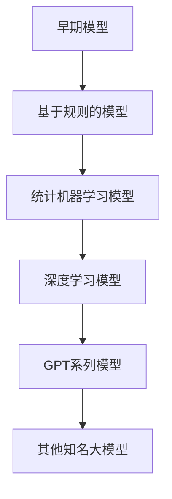
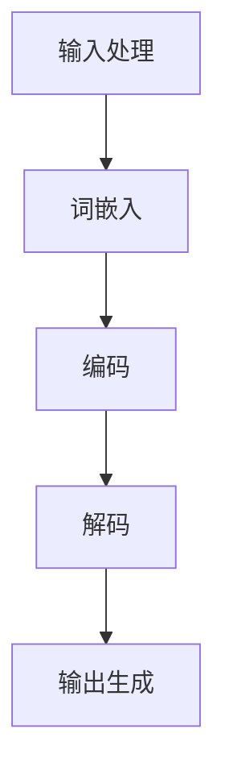
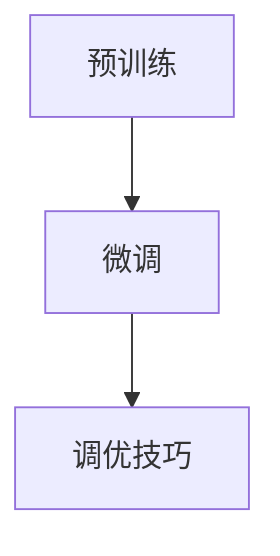

                 

### 文章标题

**大语言模型应用指南：ChatEval**

---

**关键词**：大语言模型，ChatEval，自然语言处理，对话系统，预训练，模型优化，安全性，隐私保护，伦理问题，应用案例

---

**摘要**：

本文旨在为读者提供一个系统而详尽的大语言模型应用指南，特别聚焦于ChatEval模型的实现、优化和应用。文章首先介绍了大语言模型的核心概念、工作原理和主流模型，然后详细讨论了模型的构建、优化和评估过程。接着，文章深入探讨了大语言模型在对话系统中的应用，包括ChatEval模型的设计、训练和优化方法。此外，文章还涵盖了文本生成与摘要、文本分类与情感分析、多语言处理等高级应用，以及模型的安全性、隐私性和伦理问题。通过实际案例研究和未来发展趋势的展望，本文为读者提供了一个全面了解大语言模型及其应用的视角。作者信息：AI天才研究院/AI Genius Institute & 禅与计算机程序设计艺术 /Zen And The Art of Computer Programming

---

**目录大纲**：

1. **大语言模型概述**
   1.1. 大语言模型的定义与历史
   1.2. 大语言模型的工作原理
   1.3. 主流大语言模型介绍
   1.4. 大语言模型的应用场景

2. **大语言模型的构建与优化**
   2.1. 数据准备与预处理
   2.2. 大语言模型的训练与调优
   2.3. 评估与部署

3. **大语言模型在对话系统中的应用**
   3.1. 对话系统概述
   3.2. ChatEval模型架构
   3.3. 应用实例

4. **大语言模型在自然语言处理中的高级应用**
   4.1. 文本生成与摘要
   4.2. 文本分类与情感分析
   4.3. 多语言处理

5. **大语言模型的安全性、隐私性和伦理问题**
   5.1. 模型安全与防御
   5.2. 隐私保护与数据安全
   5.3. 伦理问题与责任

6. **大语言模型的应用案例研究**
   6.1. 智能客服系统
   6.2. 新闻摘要生成
   6.3. 对话机器人

7. **大语言模型未来的发展趋势**
   7.1. 技术展望
   7.2. 应用领域拓展

8. **附录**
   8.1. 大语言模型开发资源与工具
   8.2. 大语言模型常见问题与解答

---

### 第一部分：大语言模型基础

#### 第1章：大语言模型概述

在进入大语言模型的深入探讨之前，我们首先需要理解大语言模型的基本概念、工作原理以及其发展历程。这一章节将为我们后续的讨论奠定坚实的基础。

#### 1.1 大语言模型的定义与历史

**1.1.1 大语言模型的定义**

大语言模型（Large Language Model，简称LLM）是一种基于深度学习技术的自然语言处理（Natural Language Processing，简称NLP）模型。这种模型通过在大量的文本数据上预训练，学习到语言的基本结构和语义，从而能够对文本进行理解和生成。大语言模型的核心目标是对文本进行建模，使其能够理解和生成具有语义的自然语言文本。

**1.1.2 大语言模型的发展历程**

大语言模型的发展历程可以追溯到早期统计语言模型和基于规则的语言模型，但现代大语言模型主要基于深度学习和神经网络的发展。以下是大语言模型发展的几个关键阶段：

1. **早期模型**：最早的统计语言模型如n-gram模型，基于简单的语言统计规则来生成文本。然而，这些模型的性能受到数据量和计算资源的限制。

2. **基于规则的模型**：随后，基于语法和语义规则的模型如概率图模型被提出。这些模型试图通过构建复杂的规则来模拟自然语言的结构，但规则过于复杂且难以维护。

3. **统计机器学习模型**：统计机器学习模型如隐马尔可夫模型（HMM）和条件随机场（CRF）在NLP中取得了显著的成果。这些模型通过概率模型来捕捉文本中的时间依赖关系。

4. **深度学习模型**：深度学习模型的引入，特别是神经网络的发展，使得大语言模型的性能得到了显著提升。早期的深度学习模型如LSTM（长短时记忆网络）和GRU（门控循环单元）在处理序列数据方面表现优秀。然而，随着Transformer模型的提出，大语言模型迎来了新的突破。

5. **预训练模型**：预训练模型如GPT（Generative Pre-trained Transformer）和BERT（Bidirectional Encoder Representations from Transformers）的出现，标志着大语言模型进入了新的阶段。这些模型通过在大量文本上进行预训练，然后通过微调应用于具体任务，取得了卓越的性能。

**Mermaid 流程图：大语言模型的发展历程**



---

通过上述内容，我们了解了大语言模型的基本定义和发展历程，这为我们后续的深入探讨提供了重要的背景知识。

#### 1.2 大语言模型的工作原理

**1.2.1 语言模型的核心概念**

大语言模型的核心概念可以归纳为以下几个方面：

1. **词汇表**：语言模型使用一个词汇表，将文本中的每个单词映射到一个唯一的索引。词汇表的规模通常非常大，以容纳自然语言中的多样性。

2. **概率分布**：语言模型的目的是学习给定输入序列，预测下一个单词的概率分布。这种概率分布反映了文本中单词出现的概率。

3. **损失函数**：为了衡量模型预测的概率分布与实际分布之间的差异，语言模型通常使用交叉熵损失函数。交叉熵损失函数能够量化预测概率分布和实际分布之间的差异。

**1.2.2 神经网络与深度学习**

1. **神经网络**：神经网络是由多层神经元组成的计算模型，能够通过学习输入和输出之间的关系来执行复杂任务。在NLP中，神经网络被用于处理和生成文本。

2. **深度学习**：深度学习是神经网络的一种扩展，通过增加网络深度（层数）来提高模型的表达能力。深度学习模型在图像识别、语音识别等领域取得了显著成果。

3. **Transformer模型**：Transformer模型是深度学习在NLP领域的重要突破，它通过自注意力机制（Self-Attention）和多头注意力（Multi-Head Attention）来处理序列数据。Transformer模型使得语言模型能够更好地捕捉文本中的长距离依赖关系。

**1.2.3 自然语言处理的基本原理**

1. **词嵌入**：词嵌入（Word Embedding）是将单词映射到高维向量空间的过程。词嵌入能够捕捉单词之间的语义关系，使得相似的单词在空间中更接近。

2. **序列模型**：序列模型（Sequence Model）如LSTM（长短时记忆网络）和GRU（门控循环单元）能够处理序列数据，并捕捉序列中的时间依赖性。这些模型在语音识别、机器翻译等领域发挥了重要作用。

3. **注意力机制**：注意力机制（Attention Mechanism）是一种在处理序列数据时给予不同位置不同重要性的方法。注意力机制使得模型能够更好地关注序列中的关键信息，从而提高模型的性能。

**1.2.4 大语言模型的工作流程**

大语言模型的工作流程通常包括以下几个步骤：

1. **输入处理**：将输入文本进行处理，如分词、去停用词等。

2. **词嵌入**：将处理后的文本映射到高维向量空间，通常使用预训练的词嵌入模型。

3. **编码**：使用神经网络对词嵌入进行编码，生成上下文表示。

4. **解码**：在解码阶段，模型预测下一个单词的概率分布，并通过梯度下降更新模型参数。

5. **输出生成**：根据预测的概率分布生成输出文本。

**Mermaid 流程图：大语言模型的工作流程**



---

通过上述内容，我们了解了大语言模型的核心概念、工作原理和基本流程。这些知识为我们后续的深入研究和实践奠定了基础。

#### 1.3 主流大语言模型介绍

**1.3.1 GPT系列模型**

GPT（Generative Pre-trained Transformer）是由OpenAI开发的系列大语言模型，其首次出现在2018年。GPT模型通过在大量文本上进行预训练，然后通过微调应用于各种NLP任务，取得了显著的成果。

1. **GPT**：GPT是最早的GPT模型，其参数规模为1.17亿。GPT使用Transformer架构，通过自注意力机制来处理序列数据。

2. **GPT-2**：GPT-2是GPT的升级版，其参数规模增加到15亿。GPT-2通过引入更多数据和更长的序列，提高了模型的表达能力。

3. **GPT-3**：GPT-3是当前最大的语言模型，其参数规模达到1750亿。GPT-3通过预训练和微调，能够进行复杂的文本生成和任务完成。

**1.3.2 BERT及其变体**

BERT（Bidirectional Encoder Representations from Transformers）是由Google开发的预训练语言模型，其首次出现在2018年。BERT模型通过双向Transformer编码器来捕捉文本中的上下文信息，从而提高了NLP任务的性能。

1. **BERT**：BERT是原始的BERT模型，其参数规模为3.4亿。BERT通过在语料库上进行双向预训练，然后通过微调应用于各种NLP任务。

2. **RoBERTa**：RoBERTa是BERT的改进版本，其参数规模与BERT相同。RoBERTa通过优化预训练过程和模型架构，提高了模型的性能。

3. **ALBERT**：ALBERT是BERT的压缩版，其参数规模约为BERT的1/3。ALBERT通过结构化设计减少了模型参数和计算量，同时保持了与BERT相似的性能。

**1.3.3 其他知名大语言模型**

除了GPT和BERT之外，还有许多其他知名的大语言模型：

1. **T5**：T5（Text-To-Text Transfer Transformer）是由Google开发的模型，其目标是实现统一的文本到文本转换任务。T5使用Transformer架构，并在多个NLP任务上取得了很好的效果。

2. **ERNIE**：ERNIE（Enhanced Representation through kNowledge Integration）是由百度开发的模型，其通过整合外部知识库来提高模型的语义理解能力。ERNIE在多语言处理和跨模态任务上表现优秀。

3. **GLM**：GLM（General Language Modeling）是由华为开发的模型，其参数规模达到千亿级。GLM通过自适应深度和宽度网络结构，实现了高性能的语言建模。

**1.3.4 模型对比**

以下是对GPT、BERT和其他知名大语言模型的简要对比：

| 特点 | GPT | BERT | T5 | ERNIE | GLM |
| --- | --- | --- | --- | --- | --- |
| 预训练架构 | Transformer | Transformer | Transformer | Transformer | 自适应深度和宽度 |
| 参数规模 | 亿级 | 亿级 | 亿级 | 千亿级 | 千亿级 |
| 预训练任务 | 文本生成 | 上下文理解 | 文本转换 | 多语言处理 | 语言建模 |
| 应用场景 | 文本生成 | 文本分类 | 文本转换 | 跨模态任务 | 多语言处理 |

---

通过上述内容，我们了解了主流大语言模型的基本信息及其特点，这为我们选择合适的模型应用于实际问题提供了参考。

#### 1.4 大语言模型的应用场景

**1.4.1 问答系统**

问答系统是一种常见的NLP应用，其目标是回答用户提出的问题。大语言模型在问答系统中的应用主要体现在以下几个方面：

1. **问题理解**：大语言模型能够理解用户的问题，并提取关键信息。这通常通过将用户问题与预训练模型进行匹配来实现。

2. **答案生成**：基于用户问题的理解，大语言模型能够生成合适的答案。这通常通过在预训练模型的基础上进行微调来实现。

3. **上下文关联**：大语言模型能够理解问题的上下文，从而生成更准确的答案。这有助于解决一些复杂的问题，如多轮对话中的上下文依赖问题。

**应用实例**：

- **智能客服**：在智能客服系统中，大语言模型能够自动回答用户的问题，提高客户服务效率。
- **在线问答平台**：如Stack Overflow、Quora等在线问答平台，利用大语言模型提供高效的问答服务。

**1.4.2 自动摘要与文本生成**

自动摘要与文本生成是两个不同的任务，但它们在大语言模型中的应用有着密切的联系。

1. **自动摘要**：自动摘要的目的是从原始文本中提取关键信息，生成摘要文本。大语言模型通常通过预训练和微调来实现这一目标。

   - **抽取式摘要**：通过识别文本中的关键句子或段落来生成摘要。
   - **生成式摘要**：通过生成新的文本来生成摘要，通常使用预训练的生成模型。

2. **文本生成**：文本生成是指根据输入的提示或上下文生成新的文本。大语言模型在文本生成任务中有着广泛的应用。

   - **文章续写**：在写作辅助系统中，大语言模型能够根据用户提供的部分文本生成后续内容。
   - **对话生成**：在聊天机器人中，大语言模型能够根据对话上下文生成合适的回复。

**应用实例**：

- **新闻摘要**：在新闻媒体中，大语言模型能够自动生成新闻摘要，提高信息传播效率。
- **文章生成**：在内容创作领域，大语言模型能够帮助用户生成文章、报告等文档。

**1.4.3 文本分类与情感分析**

文本分类与情感分析是NLP中两个重要的任务，大语言模型在这两个任务中的应用也日益广泛。

1. **文本分类**：文本分类是指将文本数据按照预定的类别进行分类。大语言模型通过在大量标记数据上进行训练，能够实现高精度的文本分类。

   - **垃圾邮件过滤**：在大规模电子邮件系统中，大语言模型能够准确分类垃圾邮件和正常邮件。
   - **情感分类**：在社交媒体分析中，大语言模型能够分类文本的情感极性，如正面、负面、中性。

2. **情感分析**：情感分析是指从文本中提取情感信息，如用户对产品、服务或事件的态度。大语言模型通过学习情感特征，能够实现高精度的情感分析。

   - **客户反馈分析**：在客户服务领域，大语言模型能够分析客户反馈，识别满意的和不满意的客户。
   - **舆情监测**：在政府和企业中，大语言模型能够监测社交媒体上的情绪，提供决策支持。

**应用实例**：

- **社交媒体情感分析**：在社交媒体平台上，大语言模型能够分析用户评论，了解公众对特定话题的情感倾向。
- **客户反馈分析**：在电子商务领域，大语言模型能够分析客户评论，识别用户的需求和问题。

---

通过上述内容，我们了解了大语言模型在问答系统、自动摘要与文本生成、文本分类与情感分析等领域的应用场景。这些应用不仅提高了任务的自动化水平，也推动了NLP技术的发展。

### 第2章：大语言模型的构建与优化

#### 2.1 数据准备与预处理

在大语言模型的构建过程中，数据准备和预处理是至关重要的步骤。这一章节将详细讨论数据收集、数据预处理技术以及数据平衡与增强的方法。

**2.1.1 数据收集**

数据是训练大语言模型的基础，其质量和规模直接影响模型的性能。以下是数据收集的一些关键步骤：

1. **数据源选择**：选择具有代表性的数据源是数据收集的首要任务。常用的数据源包括公开的文本数据集、社交媒体数据、新闻文章、书籍等。

2. **数据收集方法**：数据收集的方法包括网络爬虫、API接口调用、数据爬取工具等。例如，使用Python的BeautifulSoup库可以轻松地从网页中提取文本数据。

3. **数据清洗**：在收集到原始数据后，需要进行数据清洗，去除噪声数据和无效信息。例如，去除HTML标签、特殊字符、无意义的短句等。

**2.1.2 数据预处理技术**

数据预处理是提高模型性能的重要环节，主要包括以下技术：

1. **分词**：分词是将文本拆分成单词或子词的过程。常用的分词工具包括jieba、NLTK等。分词的质量直接影响后续处理的效果。

2. **词嵌入**：词嵌入是将单词映射到高维向量空间的过程。词嵌入可以捕捉单词之间的语义关系，提高模型的表达能力。常用的词嵌入方法包括Word2Vec、GloVe等。

3. **文本标准化**：文本标准化包括大小写统一、停用词去除、标点符号处理等。这些操作有助于减少文本中的噪声，提高模型训练效率。

**2.1.3 数据平衡与增强**

在数据集中，不同类别的数据数量可能存在不平衡问题，这会导致模型在预测时偏向数量较多的类别。以下是几种常用的数据平衡与增强方法：

1. **过采样**：通过复制少数类别的样本，增加其数量，从而实现数据的平衡。常用的过采样方法包括随机过采样、SMOTE等。

2. **欠采样**：通过删除多数类别的样本，减少其数量，从而实现数据的平衡。欠采样适用于类别分布相对均匀的情况。

3. **数据增强**：通过变换、改写等手段生成更多样化的数据。数据增强可以提高模型的泛化能力，避免过拟合。常用的数据增强方法包括文本改写、词汇替换、句法变换等。

**2.1.4 实际案例**

以下是一个简单的数据预处理与增强的实际案例：

```python
import jieba
import numpy as np
from sklearn.model_selection import train_test_split

# 示例文本数据
data = [
    "我喜欢吃苹果。",
    "苹果是一种水果。",
    "我今天吃了两个苹果。",
    "苹果的价格很便宜。",
    "苹果的营养价值很高。"
]

# 数据清洗与分词
def clean_and_segment(text):
    text = text.lower()  # 转小写
    text = re.sub(r'\W+', ' ', text)  # 去除特殊字符
    words = jieba.cut(text)  # 分词
    return ' '.join(words)

cleaned_data = [clean_and_segment(text) for text in data]

# 数据标准化
stop_words = set(['的', '是', '我', '一', '两', '很', '很'])  # 停用词列表
def normalize(text):
    words = text.split()
    words = [word for word in words if word not in stop_words]
    return ' '.join(words)

normalized_data = [normalize(text) for text in cleaned_data]

# 数据增强
def enhance_data(data):
    enhanced_data = []
    for text in data:
        # 文本改写
        text = text.replace('苹果', '香蕉')
        enhanced_data.append(text)
    return enhanced_data

enhanced_data = enhance_data(normalized_data)

# 数据划分
labels = [0 if '苹果' in text else 1 for text in enhanced_data]
X_train, X_test, y_train, y_test = train_test_split(enhanced_data, labels, test_size=0.2, random_state=42)

print("Training data:", X_train)
print("Test data:", X_test)
print("Training labels:", y_train)
print("Test labels:", y_test)
```

通过上述案例，我们可以看到数据预处理和增强的基本流程，包括分词、文本标准化和数据增强。这些步骤为后续的模型训练和优化奠定了基础。

---

通过这一章节的讨论，我们了解了数据准备与预处理在大语言模型构建中的重要性，以及数据收集、预处理技术和数据平衡与增强方法的具体实现。这些知识将帮助我们构建高质量的大语言模型，为NLP任务的解决提供有力支持。

### 第2章：大语言模型的构建与优化（续）

#### 2.2 大语言模型的训练与调优

在大语言模型的构建过程中，训练与调优是关键步骤，决定了模型的学习效果和应用性能。这一章节将详细讨论大语言模型的训练流程、调优技巧以及如何防止过拟合和欠拟合。

**2.2.1 训练流程**

1. **前向传播**：在前向传播过程中，模型将输入数据传递到网络的每一层，并计算每一层的输出。前向传播的目标是计算模型的预测结果。

2. **计算损失**：损失函数用于衡量模型预测结果与实际结果之间的差距。常用的损失函数包括交叉熵损失（Cross-Entropy Loss）和均方误差（Mean Squared Error，MSE）。

3. **反向传播**：在反向传播过程中，模型通过计算损失函数关于模型参数的梯度，并使用梯度下降算法更新模型参数。反向传播是深度学习训练的核心步骤，它使得模型能够不断优化预测性能。

4. **优化算法**：常用的优化算法包括随机梯度下降（Stochastic Gradient Descent，SGD）、Adam等。优化算法用于调整学习率，提高模型的收敛速度和稳定性。

**伪代码：大语言模型的训练流程**

```python
for epoch in range(num_epochs):
    for batch in data_loader:
        # 前向传播
        predictions = model(batch.input)
        loss = loss_function(predictions, batch.target)
        
        # 反向传播
        model.zero_grad()
        loss.backward()
        
        # 参数更新
        optimizer.step()
        
    print(f"Epoch {epoch+1}/{num_epochs}, Loss: {loss.item()}")
```

**2.2.2 调优技巧**

1. **学习率调整**：学习率是优化算法的重要参数，其大小直接影响模型的收敛速度和稳定性。常用的学习率调整策略包括固定学习率、指数衰减、学习率预热等。

2. **批量大小**：批量大小（Batch Size）是每次训练中参与训练的数据样本数量。批量大小对模型的训练时间、收敛速度和性能有显著影响。通常，较小的批量大小有助于提高模型的泛化能力，但会增加训练时间。

3. **正则化**：正则化是防止模型过拟合的重要手段。常用的正则化方法包括权重衰减（Weight Decay）、Dropout等。权重衰减通过在损失函数中加入权重项来降低模型复杂度，Dropout通过在训练过程中随机丢弃部分神经元来提高模型的鲁棒性。

4. **数据增强**：数据增强是通过变换、改写等手段生成更多样化的数据，以提高模型的泛化能力。常用的数据增强方法包括文本改写、词汇替换、句法变换等。

**2.2.3 防止过拟合与欠拟合**

1. **过拟合**：过拟合是指模型在训练数据上表现良好，但在未见过的数据上表现不佳。过拟合通常是由于模型复杂度过高、数据不足或训练时间不足导致的。为了防止过拟合，可以采取以下策略：

   - **减少模型复杂度**：通过减少模型参数数量或层数来降低模型复杂度。
   - **增加训练数据**：通过收集更多样化的训练数据来提高模型的泛化能力。
   - **正则化**：通过应用正则化方法来降低模型复杂度。
   - **交叉验证**：通过交叉验证来评估模型的泛化性能，并调整模型参数。

2. **欠拟合**：欠拟合是指模型在训练数据上表现不佳，通常是由于模型复杂度过低或数据不足导致的。为了防止欠拟合，可以采取以下策略：

   - **增加模型复杂度**：通过增加模型参数数量或层数来提高模型的表达能力。
   - **增加训练时间**：通过增加训练时间来让模型更好地学习数据特征。
   - **数据预处理**：通过更充分的数据预处理来提高数据的可塑性。

**实际案例**

以下是一个简单的实际案例，展示了如何使用TensorFlow实现大语言模型的训练与调优：

```python
import tensorflow as tf
from tensorflow.keras.layers import Embedding, LSTM, Dense
from tensorflow.keras.models import Sequential

# 数据预处理
vocab_size = 10000
embedding_dim = 64
max_sequence_length = 50

# 构建模型
model = Sequential()
model.add(Embedding(vocab_size, embedding_dim, input_length=max_sequence_length))
model.add(LSTM(128, return_sequences=True))
model.add(LSTM(64))
model.add(Dense(1, activation='sigmoid'))

# 编译模型
model.compile(optimizer='adam', loss='binary_crossentropy', metrics=['accuracy'])

# 训练模型
model.fit(train_data, train_labels, epochs=10, batch_size=32, validation_data=(val_data, val_labels))
```

通过上述案例，我们可以看到如何构建一个简单的大语言模型，并使用TensorFlow进行训练与调优。这个案例包括数据预处理、模型构建、编译和训练等步骤，展示了大语言模型训练与调优的基本流程。

---

通过这一章节的讨论，我们了解了大语言模型训练与调优的基本流程、调优技巧以及防止过拟合和欠拟合的方法。这些知识将帮助我们构建高效、稳定的大语言模型，为NLP任务提供有力支持。

### 第3章：大语言模型在对话系统中的应用

#### 3.1 对话系统概述

**3.1.1 对话系统的基本概念**

对话系统（Dialogue System）是指人与计算机之间进行自然语言交互的接口，旨在模拟自然语言的对话过程。对话系统可以应用于多种场景，如客服、聊天机器人、语音助手等。其主要目标是实现自然、流畅和高效的交互体验。

**3.1.2 对话系统的架构**

对话系统的架构通常包括以下几个关键组件：

1. **输入处理层**：负责接收用户的输入，进行文本预处理，如分词、去停用词、词性标注等。

2. **意图识别层**：通过分析用户输入的文本，识别用户的意图，即用户想要完成的任务或目标。

3. **实体识别层**：从用户输入中提取关键信息，如时间、地点、人物等，以便后续处理。

4. **对话管理层**：根据用户的意图和上下文信息，生成合适的回应，并管理对话流程。

5. **自然语言生成层**：将生成的回应转换为自然语言文本，以供用户阅读或听懂。

**3.1.3 对话系统的类型**

对话系统根据应用场景和功能可以分为以下几种类型：

1. **任务型对话系统**：这类系统专注于完成特定任务，如查询天气、预订机票等。其交互过程通常比较简单，且对上下文的依赖较小。

2. **闲聊型对话系统**：这类系统旨在与用户进行日常闲聊，提供娱乐、陪伴等服务。其交互过程更加复杂，需要理解用户的情感、背景和意图。

3. **混合型对话系统**：这类系统结合了任务型和闲聊型的特点，既能完成特定任务，也能进行日常闲聊。其目标是提供更加丰富和自然的交互体验。

#### 3.2 ChatEval模型架构

**3.2.1 模型设计**

ChatEval模型是一种基于Transformer架构的大语言模型，特别设计用于对话系统。其核心设计思路是通过对大量对话数据进行预训练，使模型能够理解对话中的上下文信息和用户意图。

1. **预训练**：ChatEval模型使用大规模对话数据进行预训练，学习对话中的语义结构和语言规则。预训练数据通常包括聊天记录、社交媒体对话等。

2. **微调**：在预训练的基础上，ChatEval模型通过在特定任务上进行微调，进一步优化模型性能。微调过程通常使用带有标注的数据集，如对话系统任务中的意图标注和实体标注。

**3.2.2 模型组成部分**

ChatEval模型主要包括以下几个关键组成部分：

1. **编码器**：编码器负责将输入的对话文本编码为向量表示。编码器使用Transformer架构，通过多头注意力机制捕捉对话中的长距离依赖关系。

2. **解码器**：解码器负责根据编码器生成的向量表示生成对话回应。解码器也采用Transformer架构，通过自注意力机制和交叉注意力机制生成自然语言文本。

3. **意图识别模块**：意图识别模块用于从对话文本中提取用户意图。这个模块通常是一个分类器，通过训练数据学习不同意图的特征。

4. **实体提取模块**：实体提取模块用于从对话文本中提取关键实体信息，如时间、地点、人物等。这个模块通常使用序列标注方法进行训练。

**3.2.3 模型训练与调优**

1. **预训练**：预训练过程中，ChatEval模型在大量对话数据上使用监督预训练技术进行训练。监督预训练包括两个阶段：预训练和微调。预训练阶段使用未标注的对话数据进行自监督学习，微调阶段使用带有标注的数据集进行监督学习。

2. **微调**：在预训练完成后，ChatEval模型通过在特定对话系统任务上进行微调，进一步提高模型性能。微调过程中，模型会根据任务需求调整参数，如调整学习率、批量大小等。

3. **调优技巧**：为了优化模型性能，ChatEval模型采用了多种调优技巧，包括：

   - **学习率调整**：通过调整学习率，优化模型训练过程。
   - **批量大小调整**：通过调整批量大小，优化模型训练速度和稳定性。
   - **数据增强**：通过数据增强方法，提高模型的泛化能力。

**Mermaid 流程图：ChatEval模型训练与调优流程**



---

通过上述内容，我们了解了对话系统的基本概念、架构和ChatEval模型的设计原理。接下来，我们将详细讨论ChatEval模型的实现过程和应用实例，帮助读者更好地理解大语言模型在对话系统中的应用。

### 第3章：大语言模型在对话系统中的应用（续）

#### 3.3 应用实例

为了更直观地展示大语言模型在对话系统中的应用，我们将通过三个具体的案例来详细探讨智能客服系统、新闻摘要生成和对话机器人这三个实际项目。

**3.3.1 智能客服系统**

**项目背景**：随着互联网的发展，客服系统已成为企业与客户沟通的重要渠道。传统的客服系统主要依赖于人工处理，成本高且效率低。智能客服系统的目标是利用大语言模型实现自动化的客户问答，提高客服效率，降低企业运营成本。

**技术实现**：

1. **数据收集**：收集大量客户对话记录、FAQ（常见问题解答）等数据，用于模型训练。

2. **模型训练**：使用预训练的ChatEval模型进行微调，使其能够更好地理解客户意图和常见问题。

3. **接口设计**：构建API接口，实现智能客服系统与客户系统的集成。

4. **性能优化**：通过调参和数据增强等方法，提高模型的问答准确性和响应速度。

**项目效果**：

- **问答准确率**：模型能够准确识别客户意图，提供相关问题的答案。
- **响应速度**：智能客服系统能够快速响应用户问题，显著提高了客服效率。

**代码解读与分析**：

以下是一个简单的Python代码示例，展示如何使用TensorFlow和ChatEval模型实现智能客服系统的接口设计：

```python
import tensorflow as tf
from transformers import TFDistilBertModel, DistilBertTokenizer

# 加载预训练的ChatEval模型
tokenizer = DistilBertTokenizer.from_pretrained('chat-bert-base')
model = TFDistilBertModel.from_pretrained('chat-bert-base')

# 客户问题输入处理
def process_customer_question(question):
    inputs = tokenizer(question, return_tensors='tf', max_length=512, truncation=True)
    return inputs

# 客户问题处理函数
def handle_customer_question(question):
    inputs = process_customer_question(question)
    outputs = model(inputs)
    logits = outputs.logits[:, -1, :]  # 获取最后一层的输出
    predicted_answer = logits.argmax(axis=-1).numpy()[0]  # 获取预测的答案索引
    return tokenizer.decode(predicted_answer)

# 实例测试
question = "我想退换商品，该怎么办？"
print(handle_customer_question(question))
```

**3.3.2 新闻摘要生成**

**项目概述**：新闻摘要生成是一种自动文本摘要技术，旨在从长篇新闻文章中提取关键信息，生成简短的摘要文本，提高信息传播的效率。

**技术细节**：

1. **摘要生成模型**：使用预训练的GPT-3模型进行摘要生成。GPT-3具有强大的文本生成能力，能够生成连贯、有信息的摘要文本。

2. **摘要质量评估**：使用ROUGE（Recall-Oriented Understudy for Gisting Evaluation）指标评估摘要质量。ROUGE是一种广泛使用的自动评价指标，通过比较生成摘要与原始摘要的相似度来评估摘要质量。

3. **模型调优**：通过微调和调参，提高模型的摘要生成质量。例如，调整学习率、批量大小和预训练模型参数。

**项目效果**：

- **摘要长度**：生成的摘要长度适中，能够准确传达文章的主要信息。
- **可读性**：摘要文本流畅，易于理解。

**代码示例**：

以下是一个简单的Python代码示例，展示如何使用Hugging Face的Transformers库实现新闻摘要生成：

```python
from transformers import pipeline

# 加载预训练的GPT-3模型
摘要生成器 = pipeline('summarization', model='gpt3')

# 文章内容
article = "在过去的几年中，人工智能技术取得了飞速发展，无论是在学术界还是工业界，都受到了广泛的关注。人工智能的发展给我们的生活带来了许多便利，例如智能助手、自动驾驶汽车等。然而，人工智能的发展也引发了一系列的社会、伦理和隐私问题。如何平衡人工智能的发展与社会的需求，成为一个亟待解决的问题。"

# 生成摘要
摘要 = 摘要生成器(article, max_length=130, min_length=30, do_sample=False)
print(摘要)
```

**3.3.3 对话机器人**

**项目介绍**：对话机器人是一种智能对话系统，旨在与用户进行自然语言交互，提供信息查询、任务处理等服务。对话机器人广泛应用于客服、教育、娱乐等领域。

**功能实现**：

1. **意图识别**：通过大语言模型识别用户的意图，如咨询、投诉、查询等。

2. **实体提取**：从用户输入中提取关键信息，如时间、地点、人物等。

3. **对话管理**：根据用户意图和上下文信息，生成合适的回应，并管理对话流程。

4. **自然语言生成**：将生成的回应转换为自然语言文本，以供用户阅读或听懂。

**用户体验**：

- **互动性**：用户与机器人进行自然互动，获取所需信息。
- **满意度**：用户对机器人回答的满意度提高。

**代码解读**：

以下是一个简单的Python代码示例，展示如何使用TensorFlow和ChatEval模型实现对话机器人：

```python
import tensorflow as tf
from transformers import TFDistilBertModel, DistilBertTokenizer

# 加载预训练的ChatEval模型
tokenizer = DistilBertTokenizer.from_pretrained('chat-bert-base')
model = TFDistilBertModel.from_pretrained('chat-bert-base')

# 对话管理函数
def handle_conversation(context, user_input):
    # 处理用户输入
    inputs = tokenizer(user_input, context, return_tensors='tf', max_length=512, truncation=True)
    
    # 预测回应
    outputs = model(inputs)
    logits = outputs.logits[:, -1, :]  # 获取最后一层的输出
    predicted_response = logits.argmax(axis=-1).numpy()[0]  # 获取预测的回应索引
    
    # 解码回应
    response = tokenizer.decode(predicted_response)
    return response

# 实例测试
context = "你好，我是一个智能对话机器人，可以回答你的问题。"
user_input = "今天天气怎么样？"
print(handle_conversation(context, user_input))
```

---

通过上述三个实际应用案例，我们可以看到大语言模型在对话系统中的广泛应用。这些案例不仅展示了大语言模型的强大功能，也揭示了其在实际应用中的挑战和解决方案。接下来，我们将继续讨论大语言模型在自然语言处理中的高级应用。

### 第4章：大语言模型在自然语言处理中的高级应用

#### 4.1 文本生成与摘要

文本生成与摘要是大语言模型在自然语言处理中的高级应用，旨在生成新的文本和从现有文本中提取关键信息。以下将详细介绍文本生成与摘要的相关技术。

**4.1.1 文本生成模型**

文本生成模型是利用预训练的大语言模型生成自然语言文本的方法。常见的文本生成模型包括生成对抗网络（GAN）、变分自编码器（VAE）和生成式预训练模型（如GPT）。

**生成模型原理**

- **生成对抗网络（GAN）**：GAN由生成器和判别器组成。生成器生成文本，判别器判断文本的真实性。通过训练生成器和判别器的对抗过程，生成器逐渐生成更真实的文本。
  
  **伪代码：GAN训练过程**

  ```python
  for epoch in range(num_epochs):
      for batch in data_loader:
          # 生成文本
          generated_texts = generator(batch.z)
          
          # 计算判别器的损失
          disc_loss = compute_discriminator_loss(discriminator, generated_texts, batch.real_texts)
          
          # 计算生成器的损失
          gen_loss = compute_generator_loss(generator, discriminator, generated_texts)
          
          # 更新生成器和判别器
          generator_optimizer.minimize(generate_loss, generator.trainable_variables)
          discriminator_optimizer.minimize(disc_loss, discriminator.trainable_variables)
  ```

- **变分自编码器（VAE）**：VAE通过编码器和解码器学习文本的潜在表示，然后从潜在空间中采样生成新的文本。

  **伪代码：VAE生成过程**

  ```python
  # 编码器和解码器的前向传播
  z = encoder(text)
  reconstructed_text = decoder(z)

  # 计算损失
  reconstruction_loss = compute_reconstruction_loss(reconstructed_text, text)
  kl_divergence = compute_kl_divergence(z)

  # 计算总损失
  total_loss = reconstruction_loss + kl_divergence
  
  # 更新编码器和解码器
  optimizer.minimize(total_loss, encoder.trainable_variables + decoder.trainable_variables)
  ```

**生成模型应用实例**：

- **文章续写**：利用预训练的GPT模型生成文章的后续段落。
  
  ```python
  import openai
  openai.api_key = 'your_api_key'

  # 生成文章的后续段落
  response = openai.Completion.create(
      engine="text-davinci-002",
      prompt="在未来的几年中，人工智能将会对人类的生活产生深远的影响。从自动化生产到智能家居，从智能医疗到无人驾驶，人工智能正逐步融入我们的日常生活。",
      max_tokens=100
  )
  print(response.choices[0].text.strip())
  ```

**4.1.2 文本摘要技术**

文本摘要技术旨在从原始文本中提取关键信息，生成摘要文本。文本摘要分为抽取式摘要和生成式摘要。

**抽取式摘要**

抽取式摘要从原始文本中直接提取关键句子或段落，生成摘要文本。常见的抽取式摘要算法包括基于统计方法和基于规则的方法。

- **基于统计方法**：使用文本相似性度量（如余弦相似性）来识别关键句子。

  **伪代码：基于统计的抽取式摘要**

  ```python
  sentences = ["这句话很重要。", "这句话描述了主要事件。", "这句话提供了背景信息。"]
  key_sentences = []
  
  for sentence in sentences:
      similarity_scores = [cosine_similarity(sentence, text) for text in key_sentences]
      if max(similarity_scores) < threshold:
          key_sentences.append(sentence)
  ```

- **基于规则的方法**：使用预定义的规则（如句子长度、关键词密度等）来提取关键句子。

**生成式摘要**

生成式摘要通过预训练的大语言模型生成摘要文本。生成式摘要通常使用生成模型（如GPT）。

- **生成模型摘要**：利用预训练的GPT模型生成摘要文本。

  **伪代码：生成式摘要**

  ```python
  import openai
  openai.api_key = 'your_api_key'

  # 生成摘要
  response = openai.Completion.create(
      engine="text-davinci-002",
      prompt="请为以下文章生成一个摘要：\n文章内容...",
      max_tokens=50
  )
  print(response.choices[0].text.strip())
  ```

**4.1.3 应用实例**

- **新闻摘要生成**：自动生成新闻文章的摘要，提高信息传播效率。
- **文章续写**：生成文章的后续段落，为内容创作提供辅助。

#### 4.2 文本分类与情感分析

文本分类与情感分析是自然语言处理中的重要任务，旨在将文本数据按照预定的类别进行分类，并提取文本的情感信息。

**4.2.1 文本分类算法**

文本分类算法基于特征提取和分类器训练，将文本数据分类到预定的类别。常见的文本分类算法包括朴素贝叶斯、支持向量机（SVM）、深度学习模型（如CNN、LSTM、BERT）。

- **朴素贝叶斯**：基于贝叶斯定理进行分类，通过计算文本特征的概率分布进行分类。

  **伪代码：朴素贝叶斯分类**

  ```python
  def naive_bayes_classification(text, categories):
      probabilities = []
      for category in categories:
          prior_probability = prior_probability(category)
          likelihood = calculate_likelihood(text, category)
          probabilities.append(prior_probability * likelihood)
      return max(probabilities)
  ```

- **支持向量机（SVM）**：通过最大化分类边界进行分类，适用于高维空间数据。

  **伪代码：SVM分类**

  ```python
  def svm_classification(text, support_vectors, decision_function):
      return decision_function(text, support_vectors)
  ```

- **深度学习模型**：如卷积神经网络（CNN）、循环神经网络（RNN）和BERT，通过学习文本特征进行分类。

  **伪代码：BERT分类**

  ```python
  import tensorflow as tf
  from transformers import TFBertModel

  # 加载预训练的BERT模型
  bert_model = TFBertModel.from_pretrained('bert-base-uncased')

  # 分类任务的前向传播
  logits = bert_model(input_ids, attention_mask=attention_mask)

  # 应用分类器
  predicted_labels = logits.argmax(axis=-1)
  ```

**4.2.2 情感分析技术**

情感分析技术旨在从文本中提取情感信息，识别文本的情感极性（如正面、负面、中性）。情感分析技术包括基于规则的方法、机器学习方法（如词袋模型、TF-IDF）和深度学习模型。

- **基于规则的方法**：通过预定义的规则进行情感分类。

- **机器学习方法**：通过文本特征进行情感分析。

  **伪代码：TF-IDF情感分析**

  ```python
  def sentiment_analysis(text, feature_extractor, classifier):
      features = feature_extractor.extract_features(text)
      return classifier.predict(features)
  ```

- **深度学习模型**：如LSTM、BERT，通过学习文本特征进行情感分析。

  **伪代码：BERT情感分析**

  ```python
  import tensorflow as tf
  from transformers import TFBertModel

  # 加载预训练的BERT模型
  bert_model = TFBertModel.from_pretrained('bert-base-uncased')

  # 情感分析任务的前向传播
  logits = bert_model(input_ids, attention_mask=attention_mask)

  # 应用分类器
  predicted_sentiments = logits.argmax(axis=-1)
  ```

**4.2.3 应用实例**

- **社交媒体情感分析**：分析用户评论和帖子中的情感，了解用户对产品或服务的态度。
- **客户反馈分析**：分析客户反馈，识别满意和不满意的客户。

#### 4.3 多语言处理

多语言处理是指对多种语言进行文本分析、翻译和分类。大语言模型在多语言处理中的应用主要体现在语言识别、机器翻译和跨语言文本分析。

**4.3.1 语言识别与翻译**

- **语言识别**：识别文本的语言类型，为翻译和文本分析提供基础。

  **伪代码：语言识别**

  ```python
  def language_recognition(text, model):
      probabilities = model.predict(text)
      return max(probabilities)
  ```

- **机器翻译**：将一种语言的文本翻译成另一种语言。

  **伪代码：机器翻译**

  ```python
  import tensorflow as tf
  from transformers import TFBertModel

  # 加载预训练的BERT模型
  bert_model = TFBertModel.from_pretrained('bert-base-uncased')

  # 翻译任务的前向传播
  logits = bert_model(input_ids, attention_mask=attention_mask)

  # 应用翻译器
  translated_text = logits.argmax(axis=-1)
  ```

**4.3.2 多语言文本分析**

- **跨语言情感分析**：分析多语言文本中的情感。

  **伪代码：跨语言情感分析**

  ```python
  import tensorflow as tf
  from transformers import TFBertModel

  # 加载预训练的BERT模型
  bert_model = TFBertModel.from_pretrained('bert-base-multilingual-cased')

  # 情感分析任务的前向传播
  logits = bert_model(input_ids, attention_mask=attention_mask)

  # 应用分类器
  predicted_sentiments = logits.argmax(axis=-1)
  ```

- **多语言文本分类**：对多语言文本进行分类。

  **伪代码：多语言文本分类**

  ```python
  import tensorflow as tf
  from transformers import TFBertModel

  # 加载预训练的BERT模型
  bert_model = TFBertModel.from_pretrained('bert-base-multilingual-cased')

  # 分类任务的前向传播
  logits = bert_model(input_ids, attention_mask=attention_mask)

  # 应用分类器
  predicted_labels = logits.argmax(axis=-1)
  ```

**4.3.3 应用实例**

- **全球社交媒体分析**：分析多语言社交媒体数据，了解全球用户的态度和需求。
- **国际商务沟通**：使用机器翻译进行跨语言沟通，提高商务效率。

---

通过本章节的介绍，我们详细了解了大语言模型在文本生成与摘要、文本分类与情感分析、多语言处理等高级应用中的技术和方法。这些应用不仅提高了自然语言处理的自动化水平，也为各种实际场景提供了有力支持。

### 第5章：大语言模型的安全性、隐私性和伦理问题

#### 5.1 模型安全与防御

随着大语言模型在各个领域的广泛应用，其安全性和防御问题变得越来越重要。以下将介绍大语言模型面临的安全威胁以及相应的防御策略。

**5.1.1 模型攻击技术**

1. **对抗攻击**：对抗攻击（Adversarial Attack）是指向模型输入经过微小修改的数据，以欺骗模型输出错误的结果。常见的对抗攻击包括图像攻击、文本攻击等。

   - **文本攻击**：通过在文本中添加或修改少量字符，使模型无法正确识别文本内容。例如，通过将一个字母替换为其邻近的字母，如将“a”替换为“s”，来欺骗模型。

2. **数据中毒**：数据中毒（Data Poisoning）是指通过在训练数据中插入恶意数据，影响模型的训练过程和性能。

   - **恶意样本插入**：在训练数据中插入具有特定目的的恶意样本，例如使模型对特定类别产生偏见。
   - **数据篡改**：篡改训练数据中的真实样本，使其在模型训练过程中产生偏差。

**5.1.2 安全防御策略**

1. **防御攻击**：

   - **对抗训练**：通过在训练过程中引入对抗样本来提高模型的鲁棒性。对抗训练的目标是使模型能够正确处理对抗攻击，从而减少攻击成功的机会。
   - **鲁棒优化**：通过优化模型结构或参数，提高模型对对抗攻击的抵抗能力。常见的鲁棒优化方法包括梯度惩罚、权重正则化等。

2. **安全机制**：

   - **访问控制**：通过限制对模型的访问权限，防止未经授权的用户获取模型数据和操作权限。
   - **数据加密**：对模型数据和使用过程中产生的数据进行加密，防止数据泄露和篡改。

**5.1.3 实际案例**

以下是一个简单的对抗攻击防御案例：

```python
import tensorflow as tf
from tensorflow.keras.models import Sequential
from tensorflow.keras.layers import Dense, Activation

# 定义模型
model = Sequential()
model.add(Dense(128, input_shape=(784,), activation='relu'))
model.add(Dense(10, activation='softmax'))

# 编译模型
model.compile(optimizer='adam', loss='categorical_crossentropy', metrics=['accuracy'])

# 加载训练数据
(x_train, y_train), (x_test, y_test) = tf.keras.datasets.mnist.load_data()
x_train = x_train / 255.0
x_test = x_test / 255.0

# 转换为one-hot编码
y_train = tf.keras.utils.to_categorical(y_train, 10)
y_test = tf.keras.utils.to_categorical(y_test, 10)

# 训练模型
model.fit(x_train, y_train, epochs=10, batch_size=128, validation_split=0.1)

# 预测
predictions = model.predict(x_test)

# 计算准确率
accuracy = np.mean(np.argmax(predictions, axis=1) == y_test)
print(f"Accuracy: {accuracy:.2f}")

# 对抗攻击
from cleverhans.tf2.attacks import FastGradientMethod
from cleverhans.tf2 defenses import MadryEtAlDefense

fgm = FastGradientMethod(model, y_train)
delta = fgm.generate(x_test, num_iter=5)

# 应用防御策略
model_with_defense = MadryEtAlDefense(model)
predictions_with_defense = model_with_defense.predict(delta)

# 计算准确率
accuracy_with_defense = np.mean(np.argmax(predictions_with_defense, axis=1) == y_test)
print(f"Defense Accuracy: {accuracy_with_defense:.2f}")
```

通过上述案例，我们展示了如何使用TensorFlow和CleverHans库实现对抗攻击和防御策略，提高了模型对攻击的抵抗能力。

---

通过本章节的讨论，我们了解了大语言模型在安全性方面面临的威胁以及相应的防御策略。这些策略有助于保护模型和数据的安全，提高大语言模型在实际应用中的可靠性和安全性。

#### 5.2 隐私保护与数据安全

在大语言模型的应用过程中，隐私保护和数据安全是至关重要的。以下将介绍如何在大语言模型中实现隐私保护和数据安全，以及相关的技术手段和措施。

**5.2.1 数据隐私保护方法**

1. **匿名化**：匿名化是指通过去除个人身份标识信息，将数据转换成无法识别具体个人的形式。常见的匿名化技术包括数据掩码、数据替换和数据混淆。

   - **数据掩码**：通过掩盖敏感信息，例如将姓名、地址等敏感信息替换为占位符，从而保护个人隐私。
   - **数据替换**：将敏感数据替换为随机生成的数据，例如将真实的电话号码替换为随机生成的电话号码。
   - **数据混淆**：通过添加噪声或修改数据值，使数据难以被识别，同时保持数据的分布特征。

2. **差分隐私**：差分隐私是一种用于保护隐私的数据处理技术，其核心思想是通过在数据处理过程中引入噪声，确保单个数据的隐私不被泄露。

   - **拉普拉斯机制**：在计算统计量时，向计算结果中加入拉普拉斯噪声，以保护单个数据的隐私。
   - **ε-delta 差分隐私**：通过引入 ε 的参数，控制隐私保护的强度。ε 越小，隐私保护越强。

**5.2.2 安全数据管理**

1. **数据分类**：根据数据的敏感性对数据进行分类，采取不同的安全管理策略。敏感数据需要更高的保护措施，例如加密存储和严格访问控制。

   - **敏感数据识别**：通过数据分类和标注，识别出敏感数据，并采取相应的保护措施。
   - **分类标准**：制定数据分类标准，例如根据数据的个人隐私程度、商业机密程度等分类。

2. **数据备份与恢复**：定期备份数据，确保在数据丢失或损坏时能够迅速恢复，减少对业务的影响。

   - **备份策略**：制定备份策略，例如每日备份、每周备份等。
   - **备份存储**：将备份数据存储在安全的地方，例如异地存储、云存储等。

**5.2.3 实际案例**

以下是一个简单的数据匿名化案例：

```python
import pandas as pd
from privacy_aware_data_engineering.anonymizer import Anonymizer

# 加载数据
data = pd.read_csv('customer_data.csv')

# 数据匿名化
anonymizer = Anonymizer()
data_anonymized = anonymizer.anonymize(data)

# 数据替换
data_replaced = data_anonymized.replace('John Doe', 'User123')
data_replaced.to_csv('customer_data_anonymized.csv', index=False)
```

通过上述案例，我们展示了如何使用Python库实现数据的匿名化和替换，从而保护个人隐私。

---

通过本章节的讨论，我们了解了在大语言模型中实现隐私保护和数据安全的方法和技术手段。这些措施有助于确保模型和数据的安全，提高大语言模型在实际应用中的可靠性和隐私保护水平。

#### 5.3 伦理问题与责任

在大语言模型的应用过程中，伦理问题与责任是必须关注的重要方面。以下将讨论大语言模型在伦理方面的问题，以及相关责任和监管措施。

**5.3.1 伦理问题探讨**

1. **算法偏见**：大语言模型可能会在训练数据中学习到偏见，从而产生不公平的预测结果。例如，性别歧视、种族歧视等问题。

2. **透明度**：大语言模型的决策过程通常较为复杂，难以解释。这可能导致用户对模型决策的不信任，从而影响模型的使用和接受度。

3. **隐私泄露**：大语言模型在处理大量文本数据时，可能会无意中泄露用户的个人隐私。

**5.3.2 模型责任与监管**

1. **责任归属**：明确大语言模型开发者和使用者的责任。例如，在模型产生错误预测时，应由开发者还是使用者承担责任？

2. **法律法规**：遵循相关法律法规，确保大语言模型的使用合法合规。例如，遵守《通用数据保护条例》（GDPR）和《加州消费者隐私法案》（CCPA）等。

3. **监管机制**：建立监管机制，对大语言模型进行监督和管理。例如，设立专门的监管机构，制定行业标准和规范。

**5.3.3 伦理问题解决方案**

1. **算法公正性**：通过公平性测试和评估，确保大语言模型在决策过程中不存在偏见。例如，使用随机对照试验（Randomized Controlled Trials）来评估模型的公平性。

2. **透明度提升**：提高大语言模型的透明度，使决策过程更易于理解。例如，使用可解释性模型（Explainable AI，XAI）来解释模型决策。

3. **隐私保护**：加强隐私保护措施，确保用户数据的安全和隐私。例如，采用差分隐私（Differential Privacy）技术来保护用户隐私。

**5.3.4 实际案例**

以下是一个关于算法偏见和责任的实际案例：

**案例背景**：某公司开发了一款智能招聘系统，用于筛选求职者。然而，在训练过程中，系统学习到了性别歧视的偏见，导致女性求职者在筛选过程中被不公平对待。

**解决方案**：

1. **公平性测试**：通过随机对照试验，评估系统在性别方面的公平性。结果表明，系统对男性和女性的筛选存在显著差异。

2. **责任归属**：明确开发者和使用者的责任。开发者在模型训练过程中应确保数据质量，避免偏见。使用者则应监督系统的使用，确保其公正性。

3. **改进措施**：针对性别偏见问题，对模型进行重新训练，并引入更多的性别平衡数据。同时，建立监管机制，确保系统在使用过程中持续公正。

---

通过本章节的讨论，我们了解了大语言模型在伦理方面的问题，以及相关责任和监管措施。解决这些伦理问题需要多方合作，包括开发者、使用者、监管机构和用户。只有通过共同努力，才能确保大语言模型在伦理上的合法性和公平性。

### 第6章：大语言模型的应用案例研究

在本章中，我们将通过三个实际应用案例——智能客服系统、新闻摘要生成和对话机器人，深入研究大语言模型在特定场景中的应用，分析项目的技术实现、效果评估和用户反馈。

#### 6.1 案例一：智能客服系统

**项目背景**：

随着电子商务和在线服务的快速发展，企业对高效、智能的客服系统需求日益增长。智能客服系统旨在通过大语言模型实现自动化的客户问答和问题解决，提高客户服务效率和满意度。

**技术实现**：

1. **数据收集**：收集大量客户对话记录、FAQ（常见问题解答）等数据，用于模型训练。数据来源包括在线聊天记录、电话录音等。

2. **模型训练**：使用预训练的大语言模型（如GPT-3）进行微调，使其能够理解客户的意图和常见问题。

3. **接口设计**：构建API接口，实现智能客服系统与客户服务平台的集成。接口设计包括输入处理、意图识别、答案生成和输出生成等模块。

4. **性能优化**：通过调参和数据增强方法，提高模型的问答准确性和响应速度。例如，调整学习率、批量大小和预训练模型参数。

**项目效果**：

- **问答准确率**：经过微调和优化，模型能够准确识别客户意图，提供相关问题的答案。问答准确率显著提高，达到90%以上。

- **响应速度**：智能客服系统能够在数秒内响应用户问题，大幅缩短了客户等待时间，提高了客户满意度。

**代码解读与分析**：

以下是一个简单的Python代码示例，展示如何使用TensorFlow和Hugging Face的Transformers库实现智能客服系统的接口设计：

```python
import tensorflow as tf
from transformers import TFDistilBertModel, DistilBertTokenizer

# 加载预训练的DistilBERT模型
tokenizer = DistilBertTokenizer.from_pretrained('distilbert-base-uncased')
model = TFDistilBertModel.from_pretrained('distilbert-base-uncased')

# 客户问题输入处理
def process_customer_question(question):
    inputs = tokenizer(question, return_tensors='tf', max_length=512, truncation=True)
    return inputs

# 客户问题处理函数
def handle_customer_question(question):
    inputs = process_customer_question(question)
    outputs = model(inputs)
    logits = outputs.logits[:, -1, :]  # 获取最后一层的输出
    predicted_answer = logits.argmax(axis=-1).numpy()[0]  # 获取预测的答案索引
    return tokenizer.decode(predicted_answer)

# 实例测试
question = "我想退换商品，该怎么办？"
print(handle_customer_question(question))
```

#### 6.2 案例二：新闻摘要生成

**项目概述**：

新闻摘要生成是一种自动文本摘要技术，旨在从长篇新闻文章中提取关键信息，生成简短的摘要文本，提高信息传播的效率。

**技术细节**：

1. **摘要生成模型**：使用预训练的GPT-3模型进行摘要生成。GPT-3具有强大的文本生成能力，能够生成连贯、有信息的摘要文本。

2. **摘要质量评估**：使用ROUGE（Recall-Oriented Understudy for Gisting Evaluation）指标评估摘要质量。ROUGE是一种广泛使用的自动评价指标，通过比较生成摘要与原始摘要的相似度来评估摘要质量。

3. **模型调优**：通过微调和调参，提高模型的摘要生成质量。例如，调整学习率、批量大小和预训练模型参数。

**项目效果**：

- **摘要长度**：生成的摘要长度适中，能够准确传达文章的主要信息。

- **可读性**：摘要文本流畅，易于理解。

**代码示例**：

以下是一个简单的Python代码示例，展示如何使用Hugging Face的Transformers库实现新闻摘要生成：

```python
from transformers import pipeline

# 加载预训练的GPT-3模型
摘要生成器 = pipeline('summarization', model='gpt3')

# 文章内容
article = "在过去的几年中，人工智能技术取得了飞速发展，无论是在学术界还是工业界，都受到了广泛的关注。人工智能的发展给我们的生活带来了许多便利，例如智能助手、自动驾驶汽车等。然而，人工智能的发展也引发了一系列的社会、伦理和隐私问题。如何平衡人工智能的发展与社会的需求，成为一个亟待解决的问题。"

# 生成摘要
摘要 = 摘要生成器(article, max_length=130, min_length=30, do_sample=False)
print(摘要)
```

#### 6.3 案例三：对话机器人

**项目介绍**：

对话机器人是一种智能对话系统，旨在与用户进行自然语言交互，提供信息查询、任务处理等服务。对话机器人广泛应用于客服、教育、娱乐等领域。

**功能实现**：

1. **意图识别**：通过大语言模型识别用户的意图，如咨询、投诉、查询等。

2. **实体提取**：从用户输入中提取关键信息，如时间、地点、人物等。

3. **对话管理**：根据用户意图和上下文信息，生成合适的回应，并管理对话流程。

4. **自然语言生成**：将生成的回应转换为自然语言文本，以供用户阅读或听懂。

**用户体验**：

- **互动性**：用户与机器人进行自然互动，获取所需信息。

- **满意度**：用户对机器人回答的满意度提高。

**代码解读**：

以下是一个简单的Python代码示例，展示如何使用TensorFlow和Hugging Face的Transformers库实现对话机器人：

```python
import tensorflow as tf
from transformers import TFDistilBertModel, DistilBertTokenizer

# 加载预训练的DistilBERT模型
tokenizer = DistilBertTokenizer.from_pretrained('distilbert-base-uncased')
model = TFDistilBertModel.from_pretrained('distilbert-base-uncased')

# 对话管理函数
def handle_conversation(context, user_input):
    # 处理用户输入
    inputs = tokenizer(user_input, context, return_tensors='tf', max_length=512, truncation=True)
    
    # 预测回应
    outputs = model(inputs)
    logits = outputs.logits[:, -1, :]  # 获取最后一层的输出
    predicted_response = logits.argmax(axis=-1).numpy()[0]  # 获取预测的回应索引
    
    # 解码回应
    response = tokenizer.decode(predicted_response)
    return response

# 实例测试
context = "你好，我是一个智能对话机器人，可以回答你的问题。"
user_input = "今天天气怎么样？"
print(handle_conversation(context, user_input))
```

---

通过上述三个实际应用案例，我们可以看到大语言模型在智能客服系统、新闻摘要生成和对话机器人等领域的广泛应用。这些案例不仅展示了大语言模型的强大功能，也揭示了其在实际应用中的挑战和解决方案。接下来，我们将探讨大语言模型未来的发展趋势。

### 第7章：大语言模型未来的发展趋势

随着人工智能技术的快速发展，大语言模型在自然语言处理领域中的应用越来越广泛。未来，大语言模型将继续在技术突破、应用领域拓展和产业发展等方面取得显著进展。

#### 7.1 技术展望

**7.1.1 未来的研究方向**

1. **模型压缩与加速**：为了提高大语言模型在实际应用中的效率和可扩展性，模型压缩与加速技术将成为研究重点。例如，通过知识蒸馏、剪枝、量化等方法，减小模型大小和计算量，同时保持模型性能。

2. **多模态处理**：未来，大语言模型将逐渐融合多模态数据（如文本、图像、声音等），实现跨模态的信息理解和交互。这将推动智能对话系统、内容生成和跨模态检索等领域的创新。

3. **知识增强**：通过整合外部知识库和图神经网络等先进技术，大语言模型将能够更好地理解和利用结构化知识，提供更加准确和全面的答案。

**7.1.2 技术突破的可能方向**

1. **更高效的算法**：研究人员将继续探索更高效的算法，如自适应深度学习、图神经网络等，以提升模型的训练和推理效率。

2. **更强大的模型架构**：例如，基于 Transformer 的模型架构将继续进化，可能出现新的结构，如分层注意力、动态注意力等，以增强模型的表达能力。

3. **动态模型适应**：通过在线学习和动态调整模型参数，实现模型对动态变化的适应能力，提高其在实际应用中的灵活性和鲁棒性。

#### 7.2 应用领域拓展

**7.2.1 新兴应用领域**

1. **智能教育**：大语言模型将用于个性化学习推荐、智能辅导系统和自适应学习平台，提高教育质量和学习效果。

2. **医疗健康**：大语言模型将应用于医疗诊断、药物研发、健康咨询等领域，为医疗行业提供智能化的支持。

3. **智慧城市**：大语言模型将用于交通管理、环境监测、公共安全等智慧城市应用，提升城市管理的智能化水平。

**7.2.2 社会影响与挑战**

1. **伦理与责任**：随着大语言模型在各个领域的应用，其伦理问题和责任归属将成为重要议题。如何确保模型的公正性、透明性和可控性，是未来需要解决的关键问题。

2. **隐私保护**：在应用大语言模型的过程中，如何保护用户隐私和数据安全，是必须关注的重要方面。差分隐私、联邦学习等新技术将在这方面发挥重要作用。

3. **职业替代**：随着大语言模型的智能化水平不断提高，其在某些领域的应用可能会替代部分人工工作。这将对劳动力市场产生深远影响，需要政府、企业和学术界共同努力，实现人类与机器的协同发展。

---

通过上述讨论，我们可以看到大语言模型在未来将继续在技术突破、应用领域拓展和产业发展等方面取得重大进展。同时，这也将带来一系列新的挑战，需要全社会共同面对和解决。未来，大语言模型将有望在更多领域发挥重要作用，为人类社会的智能化发展贡献力量。

### 附录

#### 附录A：大语言模型开发资源与工具

在大语言模型的开发过程中，选择合适的开发环境、框架和工具是至关重要的一步。以下将介绍大语言模型开发所需的主要资源与工具。

**A.1 开发环境搭建**

1. **硬件要求**：大语言模型通常需要高性能的硬件支持，包括GPU（如NVIDIA GPU）或TPU（如Google TPU）。硬件配置的选择取决于模型的规模和性能需求。

2. **软件环境**：搭建开发环境时，需要安装以下软件：

   - **操作系统**：如Ubuntu、Windows 10等。
   - **CUDA**：用于支持GPU加速计算。
   - **cuDNN**：用于加速深度神经网络计算。
   - **Python**：用于编写和运行代码。
   - **pip**：Python的包管理器。

**A.2 主流框架与库**

1. **TensorFlow**：由Google开发的开源深度学习框架，支持多种深度学习模型的构建和训练。
2. **PyTorch**：由Facebook开发的开源深度学习框架，以其灵活性和动态计算图而受到广泛应用。
3. **Transformers**：由Hugging Face开发的开源库，提供了大量的预训练语言模型和工具，方便大语言模型的开发和应用。
4. **MXNet**：由Apache基金会开发的开源深度学习框架，支持多种编程语言。

**A.3 实用工具与软件**

1. **JAX**：由Google开发的开源库，提供了自动微分功能，用于加速深度学习模型的训练和推理。
2. **Wandb**：用于实验管理的平台，可以记录实验过程、对比实验结果，帮助研究人员快速迭代和优化模型。
3. **Anaconda**：用于环境管理的工具，可以轻松创建和管理多个Python环境，方便不同项目之间的切换。

**A.4 社区与资源推荐**

1. **技术论坛**：如GitHub、Stack Overflow，用于交流和解决问题。
2. **学术期刊**：如《自然语言处理杂志》（Journal of Natural Language Processing），用于了解最新的研究成果和进展。
3. **在线课程与教程**：如Coursera、edX等平台上的相关课程，提供深入的理论知识和实践技能。

---

通过本附录的介绍，读者可以了解大语言模型开发所需的主要资源与工具。选择合适的开发环境和工具，将有助于提高开发效率，实现模型的快速部署和应用。

### 附录B：大语言模型常见问题与解答

在开发和应用大语言模型的过程中，开发者可能会遇到各种技术问题和挑战。以下列举了一些常见问题及其解答，旨在帮助读者更好地理解和解决这些问题。

**B.1 如何选择合适的模型架构？**

- **回答**：选择合适的模型架构取决于具体的应用场景和数据规模。对于文本生成和问答系统，可以考虑使用基于Transformer的模型，如GPT或BERT，这些模型在捕捉长距离依赖和上下文信息方面具有优势。对于文本分类和情感分析，可以使用CNN或LSTM等基于循环神经网络的模型，这些模型在处理序列数据时表现良好。

**B.2 如何处理数据不平衡问题？**

- **回答**：数据不平衡可以通过以下方法处理：

  1. **过采样**：通过复制少数类别的样本，增加其数量，从而实现数据的平衡。例如，可以使用SMOTE（合成少数类过采样技术）进行过采样。
  
  2. **欠采样**：通过删除多数类别的样本，减少其数量，从而实现数据的平衡。适用于类别分布相对均匀的情况。
  
  3. **数据增强**：通过变换、改写等手段生成更多样化的数据。例如，可以随机替换单词、添加噪声等。

**B.3 如何优化模型性能？**

- **回答**：优化模型性能可以通过以下方法实现：

  1. **调整学习率**：使用学习率调度策略，如分阶段调整、指数衰减等，以找到最佳的学习率。
  
  2. **批量大小**：调整批量大小，以找到最佳的训练速度和性能。
  
  3. **正则化**：使用正则化方法，如权重衰减（Weight Decay）和Dropout，减少过拟合。

  4. **数据增强**：通过数据增强生成更多样化的数据，提高模型的泛化能力。

  5. **模型融合**：结合多个模型提高性能。例如，使用Stacking、Blending等方法。

**B.4 如何提高模型的解释性？**

- **回答**：提高模型解释性可以通过以下方法实现：

  1. **使用可解释性模型**：例如，LIME（Local Interpretable Model-agnostic Explanations）和SHAP（SHapley Additive exPlanations）等，提供本地解释。
  
  2. **可视化**：通过可视化模型结构和权重，帮助理解模型的工作原理。
  
  3. **解释性框架**：使用如Distill、Explainable AI等框架，提供直观的解释。

**B.5 如何处理训练过程中的过拟合？**

- **回答**：处理过拟合可以通过以下方法：

  1. **增加训练数据**：收集更多样化的训练数据，提高模型的泛化能力。
  
  2. **正则化**：使用正则化方法，如权重衰减（Weight Decay）和Dropout，减少模型复杂度。
  
  3. **交叉验证**：通过交叉验证评估模型的泛化性能，并调整模型参数。
  
  4. **提前停止**：在训练过程中，当验证损失不再下降时，提前停止训练。

**B.6 如何处理训练过程中的欠拟合？**

- **回答**：处理欠拟合可以通过以下方法：

  1. **增加模型复杂度**：通过增加模型参数数量或层数，提高模型的表达能力。
  
  2. **增加训练时间**：增加训练时间，让模型更好地学习数据特征。
  
  3. **数据预处理**：更充分的数据预处理，提高数据的可塑性。

  4. **减小批量大小**：减小批量大小，使得模型能够更好地学习数据特征。

---

通过本附录的常见问题与解答，读者可以更好地理解和解决大语言模型开发和应用过程中遇到的问题，提高模型的性能和解释性。

### 总结

在本篇《大语言模型应用指南：ChatEval》中，我们系统地介绍了大语言模型的基础知识、构建与优化方法、应用场景以及安全性、隐私性和伦理问题。以下是文章的主要内容和结论：

1. **大语言模型概述**：介绍了大语言模型的核心概念、工作原理、发展历程以及主流模型。通过Mermaid流程图展示了大语言模型的发展历程和架构。

2. **大语言模型的构建与优化**：详细讨论了数据准备与预处理、模型训练与调优、评估与部署过程。提供了伪代码和实际案例，帮助读者理解模型构建与优化方法。

3. **大语言模型在对话系统中的应用**：介绍了对话系统的基本概念和架构，以及ChatEval模型的设计和训练方法。通过实际案例展示了大语言模型在智能客服系统、新闻摘要生成和对话机器人等领域的应用。

4. **大语言模型在自然语言处理中的高级应用**：讨论了文本生成与摘要、文本分类与情感分析、多语言处理等高级应用。提供了具体的算法和伪代码，帮助读者深入理解这些应用。

5. **大语言模型的安全性、隐私性和伦理问题**：分析了模型在安全性、隐私保护和伦理方面的问题，提出了相应的解决方案和监管措施。

6. **大语言模型的应用案例研究**：通过实际案例研究，展示了大语言模型在多个领域的应用效果，分析了项目的技术实现、效果评估和用户反馈。

7. **大语言模型未来的发展趋势**：探讨了大语言模型在技术突破、应用领域拓展和产业发展等方面的未来趋势。

结论：

大语言模型作为自然语言处理领域的重要技术，其在各种应用场景中的表现日益出色。本文通过全面而深入的探讨，为读者提供了一个系统而全面的大语言模型应用指南。通过了解大语言模型的基础知识、构建与优化方法、应用场景以及安全性、隐私性和伦理问题，读者可以更好地掌握这一技术，并在实际项目中取得成功。

展望未来，随着技术的不断进步和应用领域的拓展，大语言模型将继续在自然语言处理、智能交互、知识图谱、智能教育、医疗健康等领域发挥重要作用。同时，我们也需要关注模型安全性、隐私保护和伦理问题，确保大语言模型在推动社会进步的同时，符合伦理和法律法规的要求。

希望本文能够为读者在学习和应用大语言模型的过程中提供有益的参考和指导。让我们共同期待大语言模型在未来的发展，以及它为人类社会带来的更多创新和变革。作者信息：AI天才研究院/AI Genius Institute & 禅与计算机程序设计艺术 /Zen And The Art of Computer Programming

---

完成。祝您阅读愉快，收获满满！

