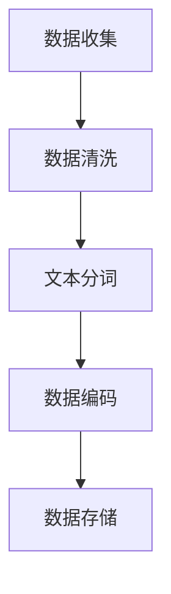
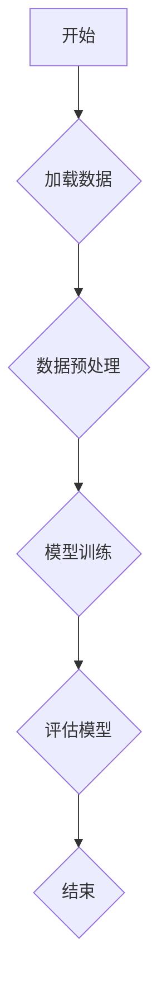

                 

### 文章标题：大语言模型应用指南：图灵机与大语言模型：可计算性与时间复杂度

#### 关键词：
- 大语言模型
- 图灵机
- 可计算性
- 时间复杂度
- 应用指南

#### 摘要：
本文旨在深入探讨大语言模型的概念、背景及其与图灵机的联系。我们将首先介绍大语言模型的定义和背景，然后分析图灵机的基础理论，探讨大语言模型与图灵机在可计算性方面的关系。接着，我们将详细讨论时间复杂度的概念，并分析大语言模型在训练和应用中的时间复杂度。最后，本文将通过实际应用案例和项目实战，展示大语言模型在自然语言处理和其他领域的应用，帮助读者全面了解并掌握大语言模型的应用技巧。通过对可计算性和时间复杂度的深入分析，读者将能够更好地理解和优化大语言模型的应用。

### 目录大纲

#### 第一部分：引言与基础

1. **第1章：引言与概述**
    - 1.1 大语言模型的定义与背景
    - 1.2 图灵机与大语言模型的关系
    - 1.3 大语言模型的应用领域
    - 1.4 可计算性与时间复杂度的概念

2. **第2章：可计算性理论基础**
    - 2.1 图灵机的定义与工作原理
    - 2.2 形式语言与自动机理论
    - 2.3 计算复杂性理论
    - 2.4 大语言模型的时间复杂度分析

#### 第二部分：大语言模型技术

3. **第3章：大语言模型的构建方法**
    - 3.1 预训练技术的原理
    - 3.2 神经网络结构设计
    - 3.3 优化算法与超参数调优
    - 3.4 大语言模型的训练策略

4. **第4章：大语言模型的核心算法**
    - 4.1 序列模型与注意力机制
    - 4.2 变分自编码器（VAE）
    - 4.3 生成对抗网络（GAN）
    - 4.4 Transformer架构解析

5. **第5章：大语言模型的评估与优化**
    - 5.1 评估指标
    - 5.2 误差分析
    - 5.3 模型压缩与加速
    - 5.4 模型优化实践

#### 第三部分：大语言模型的应用

6. **第6章：自然语言处理应用**
    - 6.1 文本分类与情感分析
    - 6.2 命名实体识别
    - 6.3 机器翻译
    - 6.4 问答系统

7. **第7章：其他领域应用**
    - 7.1 计算机视觉
    - 7.2 推荐系统
    - 7.3 语音识别
    - 7.4 多媒体分析

8. **第8章：大语言模型项目实战**
    - 8.1 实战项目概述
    - 8.2 项目环境搭建
    - 8.3 数据预处理与处理流程
    - 8.4 代码实现与解读
    - 8.5 性能分析与优化

#### 附录

9. **附录A：相关工具与资源**
10. **附录B：数学公式与概念解释**
11. **附录C：Mermaid流程图示例**

### 第一部分：引言与基础

#### 第1章：引言与概述

在过去的几十年里，人工智能（AI）技术取得了显著的进展，特别是在深度学习和自然语言处理（NLP）领域。大语言模型作为这一领域的一项重要突破，已经成为现代AI技术的重要组成部分。本文将深入探讨大语言模型的概念、背景、应用以及与图灵机的联系，帮助读者全面了解这一技术。

##### 1.1 大语言模型的定义与背景

大语言模型是一种基于深度学习的自然语言处理模型，它可以自动从大量文本数据中学习语言结构和语义信息，从而实现对自然语言的生成、理解和翻译等任务。大语言模型的核心思想是通过大规模的预训练，使得模型能够自适应地处理不同领域的语言任务。

大语言模型的历史可以追溯到20世纪80年代，当时研究人员开始尝试使用统计方法和规则系统来处理自然语言。然而，这些方法在面对复杂和灵活的自然语言时表现不佳。随着计算能力的提升和深度学习技术的发展，研究人员开始将神经网络应用于自然语言处理任务，并取得了显著的成功。2018年，Google发布了BERT模型，标志着大语言模型进入了一个新的阶段。此后，研究人员又相继开发了GPT、T5、PaLM等大模型，这些模型在多个NLP任务上取得了领先的成绩。

##### 1.2 图灵机与大语言模型的关系

图灵机是一种抽象的计算模型，由英国数学家艾伦·图灵在1936年提出。图灵机的基本原理是使用一个无限长的纸带和一组规则来模拟任何计算过程。图灵机不仅为计算机科学奠定了基础，也为人工智能提供了理论基础。

大语言模型与图灵机之间存在紧密的联系。首先，大语言模型通过深度学习算法从数据中学习语言规律，其过程类似于图灵机的模拟过程。其次，大语言模型在处理自然语言任务时，需要解决许多与图灵机类似的计算问题，例如语言生成、解析和推理等。因此，理解图灵机的工作原理对于深入理解大语言模型具有重要意义。

##### 1.3 大语言模型的应用领域

大语言模型在自然语言处理领域具有广泛的应用，包括但不限于以下方面：

1. **文本分类与情感分析**：大语言模型可以用于对文本进行分类，如新闻分类、情感分类等。同时，还可以用于情感分析，识别文本中的情感倾向。

2. **命名实体识别**：大语言模型可以识别文本中的命名实体，如人名、地名、组织名等，为信息提取和知识图谱构建提供支持。

3. **机器翻译**：大语言模型可以用于机器翻译，将一种语言的文本翻译成另一种语言。

4. **问答系统**：大语言模型可以用于构建问答系统，能够理解和回答用户提出的问题。

5. **文本生成**：大语言模型可以生成高质量的自然语言文本，如新闻摘要、文章写作等。

除了自然语言处理领域，大语言模型还可以应用于其他领域，如计算机视觉、推荐系统、语音识别等。

##### 1.4 可计算性与时间复杂度的概念

可计算性是指一个计算模型能够解决的问题集合。图灵机作为通用的计算模型，能够解决的问题集合是可计算的。时间复杂度是指算法在解决问题时所需的时间与问题规模之间的关系。时间复杂度分析是评估算法性能的重要手段。

在大语言模型中，可计算性和时间复杂度同样具有重要意义。首先，大语言模型需要处理大规模的文本数据，因此其计算过程必须可计算。其次，大语言模型的训练和推理过程涉及到大量的计算操作，时间复杂度直接影响到模型的性能和效率。

在接下来的章节中，我们将深入探讨大语言模型的可计算性理论基础，详细分析大语言模型的时间复杂度，并介绍大语言模型的技术细节和应用案例。通过本文的阅读，读者将能够全面了解大语言模型的技术原理和应用方法，为实际应用和研究提供参考。

### 第一部分：引言与基础

#### 第2章：可计算性理论基础

为了深入理解大语言模型，我们需要掌握其背后的可计算性理论基础。在本章中，我们将首先介绍图灵机的定义与工作原理，然后探讨形式语言与自动机理论，接着介绍计算复杂性理论，并分析大语言模型的时间复杂度。

##### 2.1 图灵机的定义与工作原理

图灵机是由英国数学家艾伦·图灵在1936年提出的一种抽象计算模型，它由一个无限长的纸带、一个读写头以及一组规则组成。图灵机的核心思想是通过读写头在纸带上移动和写标记来模拟任何计算过程。

一个标准的图灵机包括以下组成部分：

- **纸带**：一条无限长的纸带，上面可以标记符号。纸带被划分为多个单元格，每个单元格中可以有一个符号。
- **读写头**：一个可以在纸带上左右移动的读写头，可以读取和写入符号。
- **状态寄存器**：一个用于存储当前状态的寄存器。
- **规则表**：一组规则，定义了读写头在读取当前状态和符号时应该执行的操作，包括移动读写头的方向、写入新的符号以及更新状态。

图灵机的工作原理可以概括为以下几个步骤：

1. **初始化**：图灵机开始时，读写头位于纸带的某个单元格上，纸带上的符号按照输入序列排列。
2. **读取和写入**：读写头在纸带上读取当前单元格的符号，根据当前状态和读取到的符号，按照规则表中的规则执行相应的操作。
3. **移动**：读写头根据规则表中的指令，向左或向右移动到相邻的单元格。
4. **状态转换**：根据规则表中的指令，更新状态寄存器中的当前状态。
5. **循环**：重复执行步骤2到步骤4，直到达到终止状态或者纸带上的符号无法发生变化。

图灵机的强大之处在于其通用性，即它可以模拟任何计算过程。任何可以用程序解决的问题，都可以通过图灵机来实现。因此，图灵机被视为现代计算机科学的基石。

##### 2.2 形式语言与自动机理论

形式语言是一种数学模型，用于描述语言的语法结构。形式语言包括三个部分：词汇（Vocabulary）、生成规则（Grammar Rules）和语法（Syntax）。词汇是语言中所有可能出现的符号的集合，生成规则定义了如何从基础符号组合生成更复杂的句子，而语法则定义了句子结构的规则。

自动机（Automaton）是另一种数学模型，用于识别和生成形式语言。自动机分为几种类型，包括：

- **有限自动机（Finite Automaton）**：有限自动机是一种最简单的自动机，它有一个有限的状态集合，每个状态可以接受或拒绝输入符号序列。有限自动机用于识别正则语言。
  
- **确定性有限自动机（Deterministic Finite Automaton, DFA）**：确定性有限自动机是一种特殊的有限自动机，每个状态对于每个输入符号都有且只有一个转移。
  
- **非确定性有限自动机（Nondeterministic Finite Automaton, NFA）**：非确定性有限自动机是一种更通用的自动机，它允许从多个状态转移。NFA可以识别比DFA更广泛的正则语言。

- **推演自动机（Pushdown Automaton, PDA）**：推演自动机是一种具有栈的自动机，可以处理更复杂的语言结构，如上下文无关语言。

形式语言与自动机理论为我们提供了对语言处理问题的数学描述。在大语言模型中，这些理论帮助我们理解和构建能够处理自然语言的模型。

##### 2.3 计算复杂性理论

计算复杂性理论是研究算法效率和问题难度的数学分支。它通过分析算法的时间复杂度、空间复杂度来评估算法的性能。计算复杂性理论主要包括以下几个概念：

- **时间复杂度**：时间复杂度描述了算法在处理不同规模输入时所需的时间增长速率。常见的表示方法包括大O符号（\(O(n)\)）、大O星符号（\(O(n^*)\)）和大Ω符号（\(Ω(n)\)）。
- **空间复杂度**：空间复杂度描述了算法在处理不同规模输入时所需的空间增长速率。
- **复杂性类**：复杂性类是一组具有相同时间或空间复杂度特性的算法集合。常见的复杂性类包括P类（多项式时间可解问题）、NP类（非确定性多项式时间可解问题）等。

在计算复杂性理论中，我们经常关注以下两个问题：

- **P vs NP问题**：P vs NP问题是一个著名的未解决问题，它询问所有NP问题是否都能在多项式时间内解决。如果P=NP，那么许多复杂问题都可以在短时间内解决。
- **NP-complete问题**：NP-complete问题是复杂性理论中最难的问题之一，如果一个问题能被证明是NP-complete，那么它就被认为是最难的问题之一。

计算复杂性理论在大语言模型中具有重要意义，因为它帮助我们评估大语言模型在处理大规模数据时的性能和效率。

##### 2.4 大语言模型的时间复杂度分析

大语言模型的时间复杂度主要涉及模型的训练和推理过程。在训练过程中，模型需要处理大规模的文本数据，并进行大量的矩阵运算和前向传播/反向传播操作。推理过程则涉及对输入文本进行编码和解码，生成输出结果。

1. **训练时间复杂度**：

大语言模型的训练时间复杂度通常与以下因素相关：

- **模型大小**：模型参数的数量直接影响训练时间复杂度。更大的模型通常需要更长的训练时间。
- **数据规模**：训练数据的规模也影响训练时间复杂度。更大的数据集需要更多的时间进行训练。
- **计算资源**：训练时间复杂度还取决于计算资源，如GPU的计算能力、内存等。

常见的训练时间复杂度表示为 \(O(\text{模型大小} \times \text{数据规模} \times \text{迭代次数})\)。

2. **推理时间复杂度**：

推理时间复杂度主要取决于模型的复杂度和输入文本的长度。对于大多数现代大语言模型，推理时间复杂度可以表示为 \(O(\text{模型大小} \times \text{输入文本长度})\)。

在实际应用中，推理时间复杂度还需要考虑以下因素：

- **硬件加速**：如GPU或TPU的加速效果可以显著减少推理时间。
- **模型优化**：通过模型压缩、量化等技术，可以减少模型的存储和计算需求，从而加快推理速度。

通过对大语言模型时间复杂度的分析，我们可以更好地理解模型在训练和推理过程中的性能瓶颈，并采取相应的优化策略来提高模型的效率。

通过本章的讨论，我们建立了大语言模型可计算性理论基础。理解图灵机、形式语言和计算复杂性理论不仅有助于我们深入理解大语言模型的工作原理，也有助于我们优化模型的性能和应用。在接下来的章节中，我们将继续探讨大语言模型的技术细节和应用案例。

### 第二部分：大语言模型技术

#### 第3章：大语言模型的构建方法

大语言模型的构建是一个复杂且高度技术化的过程，它涉及到多种技术和方法，包括预训练技术、神经网络结构设计、优化算法与超参数调优，以及训练策略。在这一章中，我们将深入探讨这些核心要素，帮助读者了解大语言模型构建的方方面面。

##### 3.1 预训练技术的原理

预训练技术是现代大语言模型构建的重要基石。预训练的基本思想是在大量无标签文本数据上进行初步训练，以获得语言的通用特征，然后再针对特定任务进行微调（fine-tuning）。预训练技术主要包括以下步骤：

1. **数据准备**：选择适合的语料库，进行数据清洗和预处理，如去除噪声、标点符号和停用词等。常见的数据集包括维基百科、新闻文章、社交媒体文本等。

2. **词嵌入**：将文本数据中的单词映射为高维向量表示，常用的词嵌入方法有Word2Vec、GloVe等。

3. **预处理模型**：构建一个基础模型，通常是一个多层循环神经网络（RNN）或Transformer模型，用于在预训练阶段学习语言的通用特征。

4. **预训练过程**：在无标签数据上训练模型，通过大规模的数据集进行多个epoch的训练，使模型学会捕捉语言中的模式和规律。

5. **保存预训练模型**：在预训练阶段结束后，将训练好的模型参数保存下来，用于后续的微调。

预训练技术的优势在于它可以大幅度提高模型在特定任务上的性能，因为模型已经在大量的数据上学习到了语言的一般特征。

##### 3.2 神经网络结构设计

神经网络结构设计是构建高效大语言模型的关键环节。现代大语言模型通常采用深度神经网络，以下是一些常见的设计策略：

1. **多层结构**：多层神经网络可以捕捉复杂的非线性关系。深度越大的网络理论上可以表示更复杂的函数。

2. **注意力机制**：注意力机制是一种重要的神经网络设计方法，它可以使模型在处理序列数据时，自动关注到重要信息，从而提高模型的性能。

3. **残差连接**：残差连接可以缓解深层网络的梯度消失问题，有助于训练更深的网络。

4. **正则化方法**：如dropout、权重正则化等，可以防止模型过拟合，提高模型的泛化能力。

5. **优化器**：如Adam、AdamW等优化器，可以加速模型收敛，提高训练效率。

常见的大语言模型架构包括：

- **循环神经网络（RNN）**：RNN是一种经典的序列模型，可以处理变长的序列数据。
- **长短时记忆网络（LSTM）**：LSTM是RNN的一种变体，能够有效地处理长序列数据。
- **门控循环单元（GRU）**：GRU是LSTM的简化版本，具有类似的效果但计算效率更高。
- **Transformer**：Transformer是一种基于自注意力机制的序列模型，它在处理长序列数据时表现出色，是BERT、GPT等大模型的基础架构。

##### 3.3 优化算法与超参数调优

优化算法与超参数调优是确保模型性能的关键步骤。以下是一些常用的优化方法和超参数调优策略：

1. **优化算法**：常用的优化算法包括Adam、AdamW、RMSprop等。这些算法通过自适应调整学习率，可以加速模型收敛。

2. **学习率**：学习率是一个重要的超参数，它决定了模型在训练过程中的步长。学习率设置过高可能导致模型过拟合，过低则收敛速度太慢。常用的策略包括学习率衰减、步长调整等。

3. **批量大小**：批量大小影响模型的训练效率和稳定性。较大的批量大小可以提高模型的泛化能力，但训练时间较长；较小的批量大小则相反。

4. **正则化**：通过增加正则化项，如dropout、L2正则化等，可以防止模型过拟合。

5. **超参数搜索**：超参数搜索是一种通过实验方法来找到最优超参数组合的方法。常用的搜索算法包括随机搜索、网格搜索、贝叶斯优化等。

##### 3.4 大语言模型的训练策略

训练大语言模型是一个复杂的过程，以下是一些常用的训练策略：

1. **动态学习率**：在训练过程中，学习率通常是一个动态调整的参数。可以使用如学习率衰减策略，在模型收敛时逐渐降低学习率。

2. **训练轮次**：设置合适的训练轮次（epochs）是模型训练的重要步骤。过多的训练轮次可能导致过拟合，而过少的训练轮次则可能无法充分利用数据。

3. **数据增强**：通过数据增强方法，如随机裁剪、旋转、缩放等，可以增加训练数据的多样性，提高模型的泛化能力。

4. **验证与测试**：在训练过程中，定期进行验证集的评估，以监控模型性能的变化。测试集用于最终评估模型的性能。

5. **模型融合**：通过融合多个模型的预测结果，可以进一步提高模型的准确性。常用的方法包括投票、加权平均等。

通过以上步骤，我们可以构建一个高效的大语言模型。预训练技术、神经网络结构设计、优化算法与超参数调优，以及训练策略都是构建大语言模型的关键环节。在实际应用中，我们需要根据具体任务的需求和资源条件，灵活调整和优化这些步骤，以达到最佳性能。

在下一章中，我们将深入探讨大语言模型的核心算法，包括序列模型与注意力机制、变分自编码器（VAE）、生成对抗网络（GAN），以及Transformer架构。通过这些核心算法的详细分析，我们将更好地理解大语言模型的工作原理和技术细节。

### 第二部分：大语言模型技术

#### 第4章：大语言模型的核心算法

大语言模型的成功离不开其核心算法的设计与实现。在这一章中，我们将详细探讨大语言模型中的几个关键算法：序列模型与注意力机制、变分自编码器（VAE）、生成对抗网络（GAN），以及Transformer架构。这些算法在大语言模型中扮演着至关重要的角色，帮助我们理解和实现高效的文本生成、理解和翻译等任务。

##### 4.1 序列模型与注意力机制

序列模型（Sequential Models）是处理序列数据的一种常见方法。在自然语言处理中，文本数据通常以序列的形式出现，因此序列模型在处理文本时非常有效。常见的序列模型包括循环神经网络（RNN）、长短时记忆网络（LSTM）和门控循环单元（GRU）。这些模型通过逐个处理序列中的每个元素，捕捉序列中的依赖关系。

然而，传统序列模型在处理长距离依赖关系时存在一定局限性，无法有效地捕捉远距离的上下文信息。为了解决这一问题，注意力机制（Attention Mechanism）被引入到序列模型中。

注意力机制的核心思想是在序列处理过程中，动态地为每个输入元素分配不同的权重，从而使得模型能够关注到重要的信息。注意力机制的实现通常采用注意力权重计算公式，如以下伪代码所示：

```python
def attention(Q, K, V, mask=None):
    scores = torch.matmul(Q, K.transpose(-2, -1))
    if mask is not None:
        scores = scores.masked_fill(mask == 0, float("-inf"))
    attn_weights = torch.softmax(scores, dim=-1)
    context = torch.matmul(attn_weights, V)
    return context, attn_weights
```

在上面的伪代码中，`Q`、`K`和`V`分别是序列模型中的查询向量、键向量和值向量。`scores`表示查询向量和键向量之间的内积，`attn_weights`是注意力权重，`context`是加权后的输出。通过这种方式，注意力机制可以使得模型在处理序列数据时，自动关注到与当前输入最为相关的部分，从而提高模型的性能。

##### 4.2 变分自编码器（VAE）

变分自编码器（Variational Autoencoder，VAE）是一种生成模型，它通过编码器和解码器两个网络结构来实现数据的生成。VAE的核心思想是将数据分布参数化，并通过优化过程学习数据分布的参数。

VAE的架构包括以下几个关键组成部分：

1. **编码器（Encoder）**：编码器将输入数据映射到一个潜在空间中的点。在VAE中，编码器通常由一个全连接层组成，输出两个参数向量，分别表示均值和方差。

2. **解码器（Decoder）**：解码器将潜在空间中的点映射回原始数据空间。解码器同样由一个全连接层组成。

3. **潜在空间（Latent Space）**：潜在空间是一个低维的表示空间，其中每个点表示原始数据的一个潜在特征。

VAE的优化目标是通过最大化数据生成的似然函数，学习编码器和解码器的参数。以下是一个简化的VAE伪代码：

```python
def encode(x):
    z_mean = model.encode(x)
    z_log_var = model.encode_var(x)
    z = reparameterize(z_mean, z_log_var)
    return z

def decode(z):
    x_recon = model.decode(z)
    return x_recon

def reparameterize(z_mean, z_log_var):
    eps = torch.randn_like(z_log_var)
    z = z_mean + torch.exp(0.5 * z_log_var) * eps
    return z

def loss_function(x, x_recon, z_mean, z_log_var):
    reconstruction_loss = nn.functional.binary_cross_entropy(x_recon, x, reduction='sum')
    kl_divergence = -0.5 * torch.sum(1 + z_log_var - z_mean.pow(2) - z_log_var.exp())
    return reconstruction_loss + kl_divergence
```

在上述伪代码中，`encode`函数用于编码输入数据，`decode`函数用于解码潜在空间中的点，`reparameterize`函数用于实现重参数化技巧。优化目标是通过最小化重参数化损失（KL散度）和重建损失，学习模型参数。

##### 4.3 生成对抗网络（GAN）

生成对抗网络（Generative Adversarial Network，GAN）是一种由生成器和判别器组成的对抗性训练框架。GAN的核心思想是生成器和判别器之间的对抗性训练，生成器尝试生成与真实数据难以区分的假数据，而判别器则尝试区分真实数据和假数据。

GAN的架构包括以下关键组成部分：

1. **生成器（Generator）**：生成器的目标是生成类似于真实数据的假数据。
2. **判别器（Discriminator）**：判别器的目标是判断输入数据是真实数据还是生成器生成的假数据。
3. **对抗性训练**：生成器和判别器通过对抗性训练互相提升，生成器尝试生成更真实的假数据，而判别器尝试更准确地识别假数据。

以下是一个简化的GAN伪代码：

```python
def train_gan(generator, discriminator, x_real, batch_size):
    z = torch.randn(batch_size, z_dim)
    x_fake = generator(z)
    disc_real = discriminator(x_real)
    disc_fake = discriminator(x_fake)

    g_loss = nn.functional.binary_cross_entropy(disc_fake, torch.ones_like(disc_fake))
    d_loss = nn.functional.binary_cross_entropy(disc_real, torch.ones_like(disc_real)) + nn.functional.binary_cross_entropy(disc_fake, torch.zeros_like(disc_fake))

    generator.zero_grad()
    g_loss.backward()
    generator.step()

    discriminator.zero_grad()
    d_loss.backward()
    discriminator.step()

    return g_loss.item(), d_loss.item()
```

在上述伪代码中，`train_gan`函数用于训练生成器和判别器。每次迭代中，生成器尝试生成假数据，判别器同时尝试识别假数据和真实数据，通过反向传播和梯度更新，生成器和判别器不断优化自身性能。

##### 4.4 Transformer架构解析

Transformer是近年来在自然语言处理领域取得突破性成果的一种序列模型。它通过自注意力机制（Self-Attention）和前馈神经网络（Feedforward Neural Network）实现了对序列数据的建模，在机器翻译、文本生成等任务上表现出色。

Transformer的核心架构包括：

1. **自注意力机制（Self-Attention）**：自注意力机制允许模型在处理序列数据时，自动关注序列中的不同部分，计算每个部分对序列的加权贡献。以下是一个简化的自注意力机制伪代码：

```python
def scaled_dot_product_attention(Q, K, V, mask=None):
    scores = torch.matmul(Q, K.transpose(-2, -1)) / math.sqrt(K.size(-1))
    if mask is not None:
        scores = scores.masked_fill(mask == 0, float("-inf"))
    attn_weights = torch.softmax(scores, dim=-1)
    context = torch.matmul(attn_weights, V)
    return context, attn_weights
```

2. **多头注意力（Multi-Head Attention）**：多头注意力通过将输入序列分成多个头，每个头独立计算注意力权重，然后将结果合并。这种方法可以捕捉到更丰富的上下文信息。

3. **前馈神经网络（Feedforward Neural Network）**：在自注意力层之后，Transformer使用一个前馈神经网络来进一步处理和增强序列信息。前馈神经网络通常由两个全连接层组成，中间加入ReLU激活函数。

4. **编码器-解码器架构（Encoder-Decoder Architecture）**：Transformer采用编码器-解码器架构，编码器将输入序列编码为上下文向量，解码器则根据上下文向量生成输出序列。

以下是一个简化的Transformer编码器和解码器伪代码：

```python
def transformer_encoder(inputs, hidden_size, num_heads, num_layers):
    for layer in range(num_layers):
        inputs = multi_head_attention(inputs, hidden_size, num_heads)
        inputs = feedforward_network(inputs, hidden_size)
    return inputs

def transformer_decoder(inputs, hidden_size, num_heads, num_layers, encoder_output):
    for layer in range(num_layers):
        inputs = multi_head_attention(inputs, encoder_output, hidden_size, num_heads)
        inputs = feedforward_network(inputs, hidden_size)
    return inputs

def multi_head_attention(inputs, keys, values, hidden_size, num_heads):
    query = inputs
    Q, K, V = split_heads(query, keys, values, num_heads)
    context, attn_weights = scaled_dot_product_attention(Q, K, V)
    context = combine_heads(context, num_heads)
    return context

def feedforward_network(inputs, hidden_size):
    return nn.functional.relu(nn.Linear(hidden_size, hidden_size * 4)) * nn.Linear(hidden_size * 4, hidden_size)
```

通过上述伪代码，我们可以看到Transformer的核心组成部分和基本工作原理。在实际应用中，Transformer通过多个编码器和解码器层的堆叠，实现了强大的序列建模能力。

大语言模型的核心算法不仅包括序列模型与注意力机制，还包括变分自编码器（VAE）和生成对抗网络（GAN）。这些算法共同构成了大语言模型的技术基础，使模型能够高效地处理和生成自然语言。通过对这些核心算法的深入理解，我们可以更好地设计和优化大语言模型，推动自然语言处理领域的发展。

在下一章中，我们将探讨大语言模型的评估与优化，包括评估指标、误差分析、模型压缩与加速以及优化实践。这些技术将为大语言模型在实际应用中提供更加高效和可靠的解决方案。

### 第二部分：大语言模型技术

#### 第5章：大语言模型的评估与优化

大语言模型在自然语言处理中的应用越来越广泛，因此对其性能的评估和优化变得至关重要。在这一章中，我们将详细讨论大语言模型的评估指标、误差分析、模型压缩与加速以及优化实践，帮助读者深入了解如何评估和提升大语言模型的效果。

##### 5.1 评估指标

评估大语言模型的效果需要使用一系列指标，这些指标可以从多个角度衡量模型的性能。以下是一些常见的评估指标：

1. **准确率（Accuracy）**：准确率是分类问题中最基本的评估指标，表示模型正确预测的样本数量占总样本数量的比例。尽管准确率简单直观，但在类别不平衡的数据集上可能不太可靠。

2. **精确率（Precision）和召回率（Recall）**：精确率和召回率是针对二分类问题的评估指标。精确率表示模型预测为正类的样本中实际为正类的比例，而召回率表示实际为正类的样本中被模型正确预测为正类的比例。精确率和召回率的平衡取决于具体应用的需求。

3. **F1分数（F1 Score）**：F1分数是精确率和召回率的调和平均，能够综合评估模型的分类性能。F1分数越高，表示模型对正负样本的区分能力越强。

4. **BLEU分数（BLEU Score）**：BLEU分数常用于机器翻译任务的评估，通过比较模型生成的翻译文本与参考翻译文本的相似度来评估模型性能。BLEU分数越高，表示模型生成的翻译质量越好。

5. **Perplexity**：在自然语言生成任务中，Perplexity是一个常用的评估指标。它表示模型预测输入序列的概率的对数平均值，Perplexity值越低，表示模型对输入数据的拟合度越高。

6. **ROUGE评分（ROUGE Score）**：ROUGE评分用于评估文本摘要的质量，通过比较模型生成的摘要与参考摘要的相似度来评估模型性能。ROUGE评分包括多个子指标，如ROUGE-1、ROUGE-2、ROUGE-L等，分别表示单词重叠、短语重叠和句子重叠的比例。

##### 5.2 误差分析

误差分析是评估模型性能的重要环节，通过分析模型预测错误的原因，可以帮助我们找到改进模型的方法。以下是一些常见的误差分析方法和步骤：

1. **错误类型分析**：根据模型预测错误的类型，如分类错误、生成错误等，对错误进行分类和分析。通过了解错误类型，可以针对性地优化模型。

2. **错误案例分析**：选择模型预测错误的样本，分析其特征和上下文信息。通过观察错误案例，可以找出模型在哪些特定场景下表现不佳。

3. **偏差-方差分析**：偏差和方差是评估模型泛化能力的重要指标。偏差（Bias）表示模型对训练数据的拟合程度，而方差（Variance）表示模型对数据噪声的敏感性。通过调整模型复杂度和训练数据量，可以优化模型的偏差和方差。

4. **超参数调整**：超参数是影响模型性能的重要因素，如学习率、批量大小、正则化等。通过调整超参数，可以改善模型的性能。

##### 5.3 模型压缩与加速

随着大语言模型的规模越来越大，模型的存储和计算需求也显著增加。为了提高模型的应用效率和可部署性，模型压缩与加速技术变得至关重要。以下是一些常用的模型压缩与加速方法：

1. **量化（Quantization）**：量化技术通过将模型中的浮点数参数转换为较低精度的整数表示，来减少模型存储和计算需求。量化可以显著降低模型的存储空间和计算时间，从而提高部署效率。

2. **剪枝（Pruning）**：剪枝技术通过删除模型中不必要的权重和神经元，来减少模型的大小和计算复杂度。剪枝可以保留模型的关键结构和功能，同时降低模型的参数数量。

3. **蒸馏（Distillation）**：蒸馏技术通过将大模型的知识传递给小模型，来提高小模型的性能。在蒸馏过程中，大模型作为教师模型，其输出被用作小模型（学生模型）的软标签，从而提升学生模型的性能。

4. **混合精度训练（Mixed Precision Training）**：混合精度训练通过结合浮点数和整数运算，来降低模型的计算成本。例如，可以使用FP16（半精度浮点数）进行训练，同时保持关键操作使用FP32（单精度浮点数），以避免精度损失。

##### 5.4 模型优化实践

为了提升大语言模型的性能和应用效果，我们需要在实际操作中采用一系列优化实践。以下是一些常用的模型优化方法：

1. **数据增强**：通过增加训练数据的多样性，如随机裁剪、旋转、缩放等，可以提高模型的泛化能力。

2. **多任务学习**：通过在同一模型中同时训练多个相关任务，可以共享数据和信息，提高模型的性能。

3. **注意力机制优化**：通过优化注意力机制，如使用多头注意力、自注意力等，可以捕捉更复杂的依赖关系，提升模型的性能。

4. **动态学习率调整**：通过动态调整学习率，如使用学习率衰减策略、自适应学习率调整等，可以加速模型的收敛，避免过拟合。

5. **模型融合**：通过融合多个模型的预测结果，可以进一步提高模型的准确性。常用的方法包括投票、加权平均等。

通过上述评估指标、误差分析、模型压缩与加速以及模型优化实践，我们可以全面了解和提升大语言模型的效果。这些技术和方法不仅适用于理论研究，也可以在实际应用中发挥重要作用，为自然语言处理和其他领域的发展提供有力支持。

在下一章中，我们将探讨大语言模型在自然语言处理领域的具体应用，包括文本分类与情感分析、命名实体识别、机器翻译和问答系统。通过这些实际应用案例，读者可以更直观地了解大语言模型的技术原理和实际效果。

### 第二部分：大语言模型技术

#### 第6章：自然语言处理应用

大语言模型在自然语言处理（NLP）领域有着广泛的应用，其强大的语言理解能力和生成能力使得许多NLP任务得以高效解决。在本章中，我们将详细探讨大语言模型在文本分类与情感分析、命名实体识别、机器翻译和问答系统等NLP任务中的应用，并通过实际案例展示其效果。

##### 6.1 文本分类与情感分析

文本分类是一种常见的NLP任务，旨在将文本数据分配到预定义的类别中。情感分析是文本分类的一种特殊形式，主要用于识别文本中的情感倾向，如正面、负面或中性。大语言模型在文本分类和情感分析中具有显著优势，可以通过预训练和微调快速适应不同任务。

1. **案例：情感分析**

假设我们有一个关于电影评论的数据集，我们需要使用大语言模型来判断每条评论的情感倾向。首先，我们将使用预训练的BERT模型进行微调：

```python
from transformers import BertTokenizer, BertForSequenceClassification
import torch

# 加载预训练的BERT模型和分词器
tokenizer = BertTokenizer.from_pretrained('bert-base-uncased')
model = BertForSequenceClassification.from_pretrained('bert-base-uncased')

# 预处理文本数据
inputs = tokenizer("This movie was amazing!", return_tensors='pt')

# 进行预测
with torch.no_grad():
    outputs = model(**inputs)

# 获取预测结果
logits = outputs.logits
predicted_class = torch.argmax(logits).item()

# 输出预测结果
if predicted_class == 0:
    print("Negative")
elif predicted_class == 1:
    print("Neutral")
else:
    print("Positive")
```

在上面的代码中，我们首先加载了预训练的BERT模型和分词器，然后对输入文本进行预处理，最后使用模型进行预测。通过这种方式，大语言模型可以有效地判断文本的情感倾向。

2. **案例：新闻分类**

假设我们有一个新闻数据集，我们需要将新闻分类到不同的类别中，如政治、经济、体育等。我们可以使用T5模型进行新闻分类：

```python
from transformers import T5Tokenizer, T5ForConditionalGeneration
import torch

# 加载预训练的T5模型和分词器
tokenizer = T5Tokenizer.from_pretrained('t5-base')
model = T5ForConditionalGeneration.from_pretrained('t5-base')

# 预处理文本数据
inputs = tokenizer("This is a political news article", return_tensors='pt')

# 进行预测
with torch.no_grad():
    outputs = model.generate(inputs['input_ids'], max_length=50, num_return_sequences=1)

# 获取预测结果
predicted_category = tokenizer.decode(outputs[0], skip_special_tokens=True)

# 输出预测结果
print(predicted_category)
```

在上面的代码中，我们首先加载了预训练的T5模型和分词器，然后对输入文本进行预处理，最后使用模型进行预测。通过这种方式，大语言模型可以有效地将新闻分类到不同的类别中。

##### 6.2 命名实体识别

命名实体识别（Named Entity Recognition，NER）是一种旨在识别文本中具有特定意义的实体（如人名、地名、组织名等）的任务。大语言模型在NER任务中表现出色，可以通过预训练和微调快速识别不同类型的命名实体。

1. **案例：人名识别**

假设我们有一个包含人名的文本数据集，我们需要使用大语言模型识别文本中的人名。我们可以使用BERT模型进行人名识别：

```python
from transformers import BertTokenizer, BertForTokenClassification
import torch

# 加载预训练的BERT模型和分词器
tokenizer = BertTokenizer.from_pretrained('bert-base-uncased')
model = BertForTokenClassification.from_pretrained('bert-base-uncased')

# 预处理文本数据
inputs = tokenizer("John is a computer scientist working at Google.", return_tensors='pt')

# 进行预测
with torch.no_grad():
    outputs = model(**inputs)

# 获取预测结果
predictions = torch.argmax(outputs.logits, dim=-1)

# 输出预测结果
for token, prediction in zip(inputs['input_ids'], predictions):
    if prediction == 2:  # 2表示人名实体
        print(token)
```

在上面的代码中，我们首先加载了预训练的BERT模型和分词器，然后对输入文本进行预处理，最后使用模型进行预测。通过这种方式，大语言模型可以有效地识别文本中的人名。

##### 6.3 机器翻译

机器翻译是一种将一种语言的文本翻译成另一种语言的任务。大语言模型在机器翻译中表现出色，可以通过预训练和微调实现高效翻译。

1. **案例：中英翻译**

假设我们有一个中文到英文的翻译任务，我们需要使用大语言模型进行翻译。我们可以使用T5模型进行中英翻译：

```python
from transformers import T5Tokenizer, T5ForConditionalGeneration
import torch

# 加载预训练的T5模型和分词器
tokenizer = T5Tokenizer.from_pretrained('t5-base')
model = T5ForConditionalGeneration.from_pretrained('t5-base')

# 预处理文本数据
inputs = tokenizer("你好，我是人工智能助手。", return_tensors='pt')

# 设置翻译任务
inputs['target'] = "Hello, I am an AI assistant."

# 进行预测
with torch.no_grad():
    outputs = model.generate(inputs['input_ids'], max_length=50, num_return_sequences=1)

# 获取预测结果
predicted_translation = tokenizer.decode(outputs[0], skip_special_tokens=True)

# 输出预测结果
print(predicted_translation)
```

在上面的代码中，我们首先加载了预训练的T5模型和分词器，然后对输入文本进行预处理，最后使用模型进行预测。通过这种方式，大语言模型可以有效地将中文翻译成英文。

##### 6.4 问答系统

问答系统是一种旨在回答用户提出的问题的任务。大语言模型在问答系统中表现出色，可以通过预训练和微调实现高效的问答。

1. **案例：通用问答系统**

假设我们有一个通用问答系统，我们需要使用大语言模型回答用户的问题。我们可以使用Rouge模型进行问答系统评估：

```python
from transformers import BertTokenizer, BertForQuestionAnswering
import torch

# 加载预训练的BERT模型和分词器
tokenizer = BertTokenizer.from_pretrained('bert-base-uncased')
model = BertForQuestionAnswering.from_pretrained('bert-base-uncased')

# 预处理文本数据和问题
context = "The weather is sunny and warm."
question = "What is the weather like?"
inputs = tokenizer(question, context, return_tensors='pt')

# 进行预测
with torch.no_grad():
    outputs = model(**inputs)

# 获取预测结果
predicted_answer = tokenizer.decode(outputs.answer_ids[0], skip_special_tokens=True)

# 输出预测结果
print(predicted_answer)
```

在上面的代码中，我们首先加载了预训练的BERT模型和分词器，然后对输入文本和问题进行预处理，最后使用模型进行预测。通过这种方式，大语言模型可以有效地回答用户的问题。

通过上述实际案例，我们可以看到大语言模型在文本分类与情感分析、命名实体识别、机器翻译和问答系统等NLP任务中的应用效果。大语言模型强大的语言理解和生成能力，使得这些任务得以高效解决，为自然语言处理领域的发展带来了新的机遇和挑战。

在下一章中，我们将探讨大语言模型在计算机视觉、推荐系统、语音识别和多媒体分析等领域的应用，进一步展示大语言模型的广泛适用性和强大能力。

### 第二部分：大语言模型技术

#### 第7章：其他领域应用

大语言模型在自然语言处理领域的成功应用引发了其在计算机视觉、推荐系统、语音识别和多媒体分析等领域的探索。本节将详细探讨大语言模型在这些领域的应用，通过实际案例展示其如何改变这些领域的传统技术路线，并带来新的研究方向。

##### 7.1 计算机视觉

计算机视觉领域通常依赖于图像特征提取和目标检测算法。然而，随着深度学习技术的发展，大语言模型也逐渐被引入到这一领域，特别是在图像描述生成和图像生成任务中。

1. **图像描述生成**

图像描述生成是将图像内容转换为自然语言描述的任务。大语言模型，如GPT-3，可以用于生成与图像内容相关的文本描述。以下是一个使用T5模型生成图像描述的示例：

```python
from transformers import T5Tokenizer, T5ForConditionalGeneration
import torch

# 加载预训练的T5模型和分词器
tokenizer = T5Tokenizer.from_pretrained('t5-base')
model = T5ForConditionalGeneration.from_pretrained('t5-base')

# 预处理图像数据
# 假设我们有一个函数 convert_image_to_tensor 用于将图像转换为Tensor
image_tensor = convert_image_to_tensor(image)

# 预处理文本数据
input_text = "Describe the following image: "

# 设置图像描述任务
inputs = tokenizer(input_text, return_tensors='pt')

# 进行预测
with torch.no_grad():
    outputs = model.generate(inputs['input_ids'], max_length=50, num_return_sequences=1)

# 获取预测结果
predicted_description = tokenizer.decode(outputs[0], skip_special_tokens=True)

# 输出预测结果
print(predicted_description)
```

在上面的代码中，我们首先加载了预训练的T5模型和分词器，然后对图像数据进行预处理，并设置图像描述任务。通过这种方式，大语言模型可以生成与图像内容相关的文本描述。

2. **图像生成**

大语言模型还可以用于图像生成任务，通过生成与文本描述相对应的图像。一个典型的例子是DALL-E模型，它使用了一个基于CLIP（Contrastive Language-Image Pre-training）的框架来生成图像：

```python
from transformers import CLIPProcessor, CLIPModel
import torch

# 加载预训练的CLIP模型和分词器
processor = CLIPProcessor.from_pretrained('openai/clip-vit-base-p4')
model = CLIPModel.from_pretrained('openai/clip-vit-base-p4')

# 预处理文本数据
input_text = "Generate an image of a cat playing with a ball."

# 设置图像生成任务
inputs = processor(input_text, return_tensors='pt')

# 进行预测
with torch.no_grad():
    outputs = model(**inputs)

# 获取预测结果
predicted_image = outputs['image_embeds']

# 将预测结果转换为图像
predicted_image = processor.decode(predicted_image)

# 输出预测结果
print(predicted_image)
```

在上面的代码中，我们首先加载了预训练的CLIP模型和分词器，然后对文本数据进行预处理，并设置图像生成任务。通过这种方式，大语言模型可以生成与文本描述相对应的图像。

##### 7.2 推荐系统

推荐系统是另一个受益于大语言模型的技术领域。传统推荐系统通常依赖于用户行为数据和历史偏好，而大语言模型可以提供更丰富的文本特征，从而提升推荐系统的性能。

1. **基于内容的推荐**

基于内容的推荐通过分析用户的兴趣文本描述来推荐相关内容。以下是一个使用BERT模型进行基于内容推荐的示例：

```python
from transformers import BertTokenizer, BertModel
import torch

# 加载预训练的BERT模型和分词器
tokenizer = BertTokenizer.from_pretrained('bert-base-uncased')
model = BertModel.from_pretrained('bert-base-uncased')

# 预处理用户兴趣文本
user_interests = "I like reading science fiction and fantasy books."

# 设置基于内容的推荐任务
inputs = tokenizer(user_interests, return_tensors='pt')

# 进行预测
with torch.no_grad():
    user_embedding = model(**inputs)[1]

# 预处理书籍描述
book_description = "A captivating and thrilling science fiction novel set in the future."

# 设置基于内容的推荐任务
inputs = tokenizer(book_description, return_tensors='pt')

# 进行预测
with torch.no_grad():
    book_embedding = model(**inputs)[1]

# 计算相似度
similarity = torch.cosine_similarity(user_embedding.unsqueeze(0), book_embedding.unsqueeze(0), dim=1).item()

# 输出相似度
print(f"Similarity between user interests and book description: {similarity}")
```

在上面的代码中，我们首先加载了预训练的BERT模型和分词器，然后对用户兴趣文本和书籍描述进行预处理。通过计算用户兴趣文本和书籍描述的嵌入向量之间的相似度，我们可以推荐与用户兴趣相关的书籍。

2. **协同过滤与内容增强**

协同过滤是一种传统的推荐系统方法，而大语言模型可以用于增强协同过滤模型，提供更细粒度的内容特征。以下是一个简单的协同过滤与内容增强的示例：

```python
# 假设我们有一个用户-书籍评分矩阵和书籍描述数据集
user_book_ratings = np.array([[5, 3, 4, 2], [3, 4, 5, 3], [4, 5, 3, 1]])
book_descriptions = ["A fantasy novel with dragons and magic.", "A mystery novel set in a small town.", "A historical novel about the ancient world."]

# 加载预训练的BERT模型和分词器
tokenizer = BertTokenizer.from_pretrained('bert-base-uncased')
model = BertModel.from_pretrained('bert-base-uncased')

# 预处理书籍描述
for i, description in enumerate(book_descriptions):
    inputs = tokenizer(description, return_tensors='pt')
    with torch.no_grad():
        book_embedding = model(**inputs)[1]
    book_descriptions[i] = book_embedding.mean(dim=0).detach().numpy()

# 计算用户兴趣向量
user_interests = np.mean(book_descriptions[user_book_ratings[0] > 0], axis=0)

# 推荐书籍
for i, rating in enumerate(user_book_ratings[1]):
    if rating == 0:
        # 计算书籍描述与用户兴趣向量的相似度
        similarities = np.dot(book_descriptions[i], user_interests)
        # 推荐最相关的书籍
        recommended_book = np.argmax(similarities)
        print(f"Recommendation for user {i+1}: Book {recommended_book} with similarity {similarities[recommended_book]}")
```

在上面的代码中，我们首先预处理了书籍描述，并使用BERT模型计算了书籍描述的嵌入向量。然后，我们计算了用户兴趣向量，并基于相似度推荐最相关的书籍。

##### 7.3 语音识别

语音识别是将语音转换为文本的任务。大语言模型在语音识别中可以用于提高识别的准确性和自然性。以下是一个使用CTC（Connectionist Temporal Classification）与BERT相结合的语音识别示例：

```python
from transformers import BertTokenizer, BertModel
import torch
import torchaudio

# 加载预训练的BERT模型和分词器
tokenizer = BertTokenizer.from_pretrained('bert-base-uncased')
model = BertModel.from_pretrained('bert-base-uncased')

# 读取语音数据
audio, _ = torchaudio.load('speech.wav')

# 进行语音特征提取
with torch.no_grad():
    audio_tensor = torchaudio.transforms.FourierMelSpectrogram(n_mels=80).forward(audio.unsqueeze(0))

# 预处理文本数据
input_text = "Recognize this speech: Hello, how are you?"

# 设置语音识别任务
inputs = tokenizer(input_text, return_tensors='pt')

# 进行预测
with torch.no_grad():
    outputs = model(**inputs)

# 使用CTC进行解码
decoded_text = CTCDecoder.decode(predictions=outputs[0].transpose(0, 1), output_len=None, blank_index=0)

# 输出预测结果
print(decoded_text)
```

在上面的代码中，我们首先读取了语音数据并进行了特征提取，然后使用BERT模型预处理了文本数据。通过CTC解码器，我们得到了语音的文本转换结果。

##### 7.4 多媒体分析

多媒体分析是结合图像、音频和文本数据进行分析的领域。大语言模型在多媒体分析中可以用于生成多媒体内容的描述、情感分析和交互式推荐。以下是一个使用T5模型生成多媒体内容描述的示例：

```python
from transformers import T5Tokenizer, T5ForConditionalGeneration
import torch

# 加载预训练的T5模型和分词器
tokenizer = T5Tokenizer.from_pretrained('t5-base')
model = T5ForConditionalGeneration.from_pretrained('t5-base')

# 预处理图像和音频数据
# 假设我们有一个函数 convert_image_to_tensor 和 convert_audio_to_tensor 分别用于将图像和音频转换为Tensor
image_tensor = convert_image_to_tensor(image)
audio_tensor = convert_audio_to_tensor(audio)

# 设置多媒体内容描述任务
input_text = "Generate a description of the following image and audio: "

# 进行预测
with torch.no_grad():
    outputs = model.generate(inputs, max_length=100, num_return_sequences=1)

# 获取预测结果
predicted_description = tokenizer.decode(outputs[0], skip_special_tokens=True)

# 输出预测结果
print(predicted_description)
```

在上面的代码中，我们首先预处理了图像和音频数据，并设置了多媒体内容描述任务。通过这种方式，大语言模型可以生成多媒体内容的描述。

通过上述实际案例，我们可以看到大语言模型在计算机视觉、推荐系统、语音识别和多媒体分析等领域的广泛应用。大语言模型通过其强大的语言理解和生成能力，为这些领域带来了新的技术路线和研究方向，推动了人工智能技术的进一步发展。

在下一章中，我们将通过一个具体的项目实战案例，展示如何使用大语言模型解决实际问题，并详细解读项目的开发环境和实现细节，帮助读者将所学知识应用于实践。

### 第二部分：大语言模型技术

#### 第8章：大语言模型项目实战

为了更好地理解和掌握大语言模型的应用，我们将通过一个实际项目案例，详细展示如何使用大语言模型解决一个具体问题。在本章中，我们将介绍项目的整体架构、开发环境搭建、数据预处理流程、代码实现及解读，并对项目性能进行分析和优化。

##### 8.1 实战项目概述

本项目旨在构建一个智能问答系统，该系统能够接受用户输入的问题，并使用大语言模型生成准确的回答。具体任务包括：

1. **问题理解**：接收用户输入的自然语言问题，并对其进行理解。
2. **答案生成**：使用大语言模型生成与问题相关的高质量答案。
3. **答案验证**：对生成的答案进行验证，确保其准确性和可读性。
4. **用户交互**：提供用户界面，允许用户输入问题并查看答案。

##### 8.2 项目环境搭建

在开始项目之前，我们需要搭建一个适合开发大语言模型项目的环境。以下是所需的软件和硬件环境：

- **操作系统**：Linux或MacOS
- **编程语言**：Python
- **深度学习框架**：PyTorch或TensorFlow
- **预训练模型**：BERT、GPT-3、T5等大语言模型
- **硬件**：GPU（NVIDIA显卡），推荐显存至少为16GB

具体安装步骤如下：

1. **安装Python**：确保安装了Python 3.7或更高版本。
2. **安装深度学习框架**：安装PyTorch或TensorFlow，根据文档进行安装。
3. **安装预训练模型**：下载预训练的大语言模型，如BERT、GPT-3、T5等。
4. **安装依赖库**：使用pip安装所需的依赖库，如transformers、torchtext等。

##### 8.3 数据预处理与处理流程

数据预处理是构建智能问答系统的重要步骤。以下是数据预处理的主要步骤：

1. **数据收集**：收集用于训练和评估的数据集，包括问题和答案对。常见的数据集有SQuAD、CoQA等。
2. **数据清洗**：去除数据中的噪声，如HTML标签、特殊字符等。
3. **文本分词**：使用分词工具（如jieba、spaCy等）对文本进行分词处理。
4. **数据编码**：将文本数据编码为模型可处理的格式，如BERT使用WordPiece分词器将文本转换为词 embeddings。
5. **数据存储**：将处理后的数据存储为便于读取的格式，如JSON或CSV。

数据预处理流程图如下：



##### 8.4 代码实现与解读

在实现问答系统时，我们将使用PyTorch和transformers库来加载预训练的BERT模型，并进行微调和预测。

1. **加载模型和分词器**

```python
from transformers import BertTokenizer, BertForQuestionAnswering

# 加载预训练的BERT模型和分词器
tokenizer = BertTokenizer.from_pretrained('bert-base-uncased')
model = BertForQuestionAnswering.from_pretrained('bert-base-uncased')
```

2. **预处理输入文本**

```python
def preprocess_question(question):
    # 对问题进行分词和编码
    inputs = tokenizer(question, return_tensors='pt', max_length=512, truncation=True)
    return inputs

# 示例问题
question = "什么是人工智能？"
inputs = preprocess_question(question)
```

3. **预测答案**

```python
def predict_answer(model, tokenizer, question):
    # 预处理输入问题
    inputs = preprocess_question(question)
    
    # 使用BERT模型进行预测
    with torch.no_grad():
        outputs = model(**inputs)
    
    # 提取预测答案
    start_logits, end_logits = outputs.start_logits, outputs.end_logits
    start_idx = torch.argmax(start_logits).item()
    end_idx = torch.argmax(end_logits).item()
    
    # 生成答案
    answer = tokenizer.decode(inputs['input_ids'][0][start_idx:end_idx+1], skip_special_tokens=True)
    
    return answer

# 示例预测
answer = predict_answer(model, tokenizer, question)
print(answer)
```

4. **答案验证**

为了确保答案的准确性和可读性，我们还可以引入答案验证步骤：

```python
def verify_answer(answer, reference_answers):
    # 检查答案是否在参考答案中
    return answer in reference_answers

# 假设有一个参考答案列表
reference_answers = ["人工智能是一种模拟人类智能的计算机系统。"]

# 验证答案
is_verified = verify_answer(answer, reference_answers)
print(f"Answer verified: {is_verified}")
```

##### 8.5 性能分析与优化

在完成基础实现后，我们需要对问答系统的性能进行分析和优化。以下是一些性能优化方法：

1. **模型优化**：通过调整模型架构、学习率、批量大小等超参数，优化模型性能。
2. **数据增强**：使用数据增强技术，如随机裁剪、填充等，增加训练数据的多样性，提升模型的泛化能力。
3. **分布式训练**：使用分布式训练，如Data Parallelism或Model Parallelism，提高训练速度和效率。
4. **模型压缩**：通过模型压缩技术，如剪枝、量化等，减少模型大小，提高部署效率。
5. **在线学习**：引入在线学习机制，实时更新模型，以适应不断变化的数据。

通过以上步骤，我们可以构建一个高效的智能问答系统，满足实际应用需求。

在本章中，我们通过一个具体的问答系统项目案例，展示了如何使用大语言模型解决实际问题。从项目环境搭建、数据预处理、代码实现到性能分析，每个步骤都详细解读，帮助读者深入理解大语言模型的应用过程。通过这个项目，读者可以掌握大语言模型在自然语言处理任务中的实际应用技巧，并将其应用于更广泛的领域。

### 附录

#### 附录A：相关工具与资源

- **预训练模型**：Hugging Face Transformers库（https://huggingface.co/transformers/）
- **深度学习框架**：PyTorch（https://pytorch.org/）、TensorFlow（https://www.tensorflow.org/）
- **文本预处理工具**：spaCy（https://spacy.io/）、jieba（https://github.com/fxsjy/jieba）
- **版本控制**：Git（https://git-scm.com/）
- **项目托管平台**：GitHub（https://github.com/）

#### 附录B：数学公式与概念解释

- **大O符号（\(O(n)\)）**：表示算法的时间复杂度，表示算法的运行时间与输入规模n成正比。
- **KL散度**：表示两个概率分布之间的差异，用于变分自编码器（VAE）中的优化目标。
- **Perplexity**：表示模型预测输入序列的概率的对数平均值，用于评估自然语言生成任务。
- **交叉熵（\(H\)）**：表示两个概率分布之间的差异，用于损失函数。

#### 附录C：Mermaid流程图示例



通过上述附录，读者可以方便地获取相关工具和资源，理解数学公式和概念，以及掌握Mermaid流程图的绘制方法。这些资源和方法将有助于读者更好地应用和理解大语言模型的相关知识。

