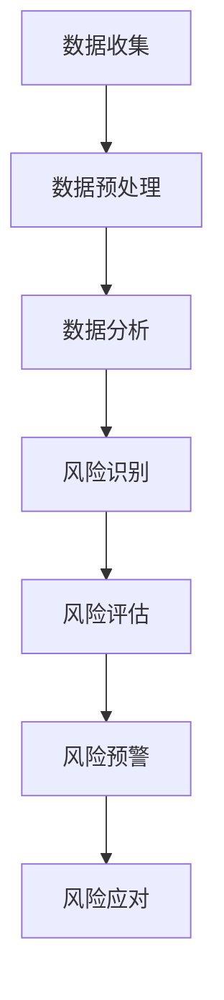

                 

# 如何利用大数据技术优化创业风险管控和预警机制

## 文章关键词
大数据、创业风险管控、预警机制、机器学习、风险评估、风险预测、数据挖掘

## 文章摘要
本文旨在探讨如何利用大数据技术优化创业风险管控和预警机制。通过对大数据基础、数据分析方法、风险模型构建和预警系统设计的深入讲解，结合实际案例，本文展示了大数据技术在创业风险管控中的应用价值。同时，本文也展望了大数据技术在未来的发展方向，为创业者和风险管理人员提供了实用的指导和建议。

### 目录大纲设计

在撰写本文之前，我们需要首先设计出《如何利用大数据技术优化创业风险管控和预警机制》这本书的完整目录大纲。该目录大纲应包含至少7章，并且需要细化到1, 2, 3级目录。以下是设计的大纲：

## 第1章 引言

### 1.1 创业风险概述
- 创业风险的基本概念
- 创业风险的分类

### 1.2 大数据技术发展及应用
- 大数据技术的发展历程
- 大数据技术在创业中的应用场景

### 1.3 大数据在创业风险管控中的作用
- 大数据技术在风险识别中的应用
- 大数据技术在风险预测中的应用
- 大数据技术在风险应对中的应用

## 第2章 大数据基础

### 2.1 数据类型与数据源
- 结构化数据
- 半结构化数据
- 非结构化数据
- 数据源的类型

### 2.2 数据预处理技术
- 数据清洗
- 数据转换
- 数据集成

### 2.3 数据存储与管理
- 数据仓库
- 数据库
- 大数据平台

## 第3章 大数据分析方法

### 3.1 数据挖掘技术
- 关联规则挖掘
- 聚类分析
- 分类分析

### 3.2 统计分析在风险管理中的应用
- 描述性统计
- 推断性统计
- 应用量

### 3.3 机器学习在风险预测中的应用
- 监督学习
- 无监督学习
- 强化学习

## 第4章 风险模型构建

### 4.1 风险评估指标体系
- 财务指标
- 运营指标
- 市场指标
- 团队指标

### 4.2 风险模型构建方法
- 风险评估模型的构建流程
- 模型选择的考虑因素
- 模型评估与优化

### 4.3 模型评估与优化
- 模型评估指标
- 模型优化方法

## 第5章 风险预警机制设计

### 5.1 预警指标体系
- 预警指标的选择
- 预警指标的量化方法

### 5.2 预警模型构建
- 预警模型的构建流程
- 常用的预警模型

### 5.3 预警系统实现
- 预警系统的架构设计
- 预警系统的实现方法

## 第6章 大数据技术在创业实践中的应用

### 6.1 创业项目案例分析
- 创业项目的风险识别与分析
- 创业项目的风险应对与预警

### 6.2 风险管理实践
- 创业风险管理的实际操作流程
- 创业风险管理中的挑战与对策

### 6.3 创新与挑战
- 新技术在创业风险管理中的应用
- 创业风险管理中的前沿问题

## 第7章 结论与展望

### 7.1 研究总结
- 大数据技术在创业风险管理中的应用总结
- 研究的局限性与未来方向

### 7.2 未来研究方向
- 新技术的应用前景
- 创业风险管理的挑战与对策

### 7.3 对创业者的建议
- 创业风险管理的基本原则
- 创业风险管理的方法与工具

## 附录

### 附录A：大数据技术工具与资源
- 常用的数据分析工具
- 大数据技术资源链接

### 附录B：常见风险类型及应对策略
- 常见创业风险类型
- 风险应对策略

### 附录C：相关公式及解释
- 常用数学公式
- 公式解释

此大纲包含了大数据技术在创业风险管控和预警机制中的基本概念、方法、实践，以及未来发展的方向。以下将详细介绍每个章节的具体内容，确保大纲的完整性和逻辑性。

### 核心概念与联系

在创业过程中，风险管控至关重要。大数据技术通过提供海量数据支持和强大的数据分析能力，使得创业风险管控和预警机制得以优化。具体来说，大数据技术在大数据基础、数据分析方法、风险模型构建和预警系统设计等方面发挥了关键作用。

- **大数据基础**：大数据基础包括数据类型与数据源、数据预处理技术、数据存储与管理。这些基础技术为后续的风险分析和模型构建提供了数据支持。
  
- **数据分析方法**：数据分析方法包括数据挖掘技术、统计分析在风险管理中的应用、机器学习在风险预测中的应用。这些方法为风险识别、评估和预警提供了技术手段。
  
- **风险模型构建**：风险模型构建包括风险评估指标体系、风险模型构建方法、模型评估与优化。这些步骤有助于建立有效的风险预测和评估模型。
  
- **预警系统设计**：预警系统设计包括预警指标体系、预警模型构建、预警系统实现。这些步骤确保了风险预警机制的有效运作。

**Mermaid流程图**

以下是一个简化的Mermaid流程图，展示了大数据技术在创业风险管控和预警机制中的应用流程：



### 核心算法原理讲解

#### 数据预处理技术

数据预处理是大数据技术中的重要步骤，其目的是清洗、转换和集成原始数据，以便后续的分析和应用。

```python
# 示例：数据清洗
data = pd.read_csv('data.csv')
data.dropna(inplace=True)
data.drop_duplicates(inplace=True)
```

**数学模型和数学公式**

数据预处理中常用的数学模型包括缺失值填补、数据标准化、数据归一化等。

$$
\text{均值填补：}\quad \text{缺失值} = \frac{\text{平均值}}{\text{标准差}}
$$

$$
\text{标准差填补：}\quad \text{缺失值} = \text{平均值} + \text{标准差} \times \text{随机因子}
$$

#### 数据挖掘技术

数据挖掘技术包括关联规则挖掘、聚类分析、分类分析等，用于从大量数据中提取有价值的信息。

**伪代码：关联规则挖掘**

```
// 输入：交易数据集D
// 输出：支持度和置信度最高的关联规则R

// Step 1: 计算支持度
support(D, R) = |{t ∈ D | R ⊆ t}|

// Step 2: 计算置信度
confidence(D, R) = |{t ∈ D | (R ⊆ t) ∧ (R' ⊆ t)}| / |{t ∈ D | R ⊆ t}|

// Step 3: 生成频繁项集
L = find_frequent_itemsets(D)

// Step 4: 生成关联规则
R = generate_association_rules(L)
```

**数学模型和数学公式**

- 支持度：$s = \frac{|t|}{|D|}$
- 置信度：$c = \frac{|t|}{|t'|}$

#### 统计分析在风险管理中的应用

统计分析在风险管理中具有重要作用，包括描述性统计、推断性统计等。

**伪代码：描述性统计**

```
// 输入：数据集D
// 输出：均值、方差、标准差

// Step 1: 计算均值
mean(D) = sum(D) / n

// Step 2: 计算方差
variance(D) = sum((x - mean(D))^2) / n

// Step 3: 计算标准差
standard_deviation(D) = sqrt(variance(D))
```

**数学模型和数学公式**

- 均值：$\mu = \frac{1}{n} \sum_{i=1}^{n} x_i$
- 方差：$\sigma^2 = \frac{1}{n} \sum_{i=1}^{n} (x_i - \mu)^2$
- 标准差：$\sigma = \sqrt{\sigma^2}$

#### 机器学习在风险预测中的应用

机器学习在风险预测中具有广泛应用，包括监督学习、无监督学习和强化学习等。

**伪代码：监督学习**

```
// 输入：训练数据集D、特征集X、标签集Y
// 输出：训练好的模型M

// Step 1: 初始化模型M
M = initialize_model()

// Step 2: 训练模型
M = train_model(M, D)

// Step 3: 验证模型
M = validate_model(M, D)
```

**数学模型和数学公式**

- 损失函数：$J(\theta) = -\frac{1}{m} \sum_{i=1}^{m} [y^{(i)} \log(\theta^{T} x^{(i)}) + (1 - y^{(i)}) \log(1 - \theta^{T} x^{(i)})]$
- 优化算法：梯度下降、随机梯度下降等

### 项目实战

#### 开发环境搭建

在开始项目实战之前，我们需要搭建一个适合大数据分析和风险管控的开发环境。

**步骤：**

1. 安装Python环境
2. 安装Pandas、NumPy、Scikit-learn等常用库
3. 安装Jupyter Notebook，用于代码编写和运行

#### 源代码实现

以下是一个简单的数据预处理、风险识别和预警模型实现的代码示例：

```python
import pandas as pd
from sklearn.model_selection import train_test_split
from sklearn.ensemble import RandomForestClassifier
from sklearn.metrics import accuracy_score

# 加载数据
data = pd.read_csv('data.csv')

# 数据预处理
data.dropna(inplace=True)
data.drop_duplicates(inplace=True)

# 特征工程
X = data.drop('target', axis=1)
y = data['target']

# 分割数据集
X_train, X_test, y_train, y_test = train_test_split(X, y, test_size=0.2, random_state=42)

# 构建风险识别模型
model = RandomForestClassifier(n_estimators=100, random_state=42)
model.fit(X_train, y_train)

# 预测
predictions = model.predict(X_test)

# 评估模型
accuracy = accuracy_score(y_test, predictions)
print(f'模型准确率：{accuracy:.2f}')
```

#### 代码解读与分析

1. **数据预处理**：使用Pandas库对原始数据集进行清洗和预处理，包括去除缺失值和重复数据。
2. **特征工程**：将数据集划分为特征集X和标签集Y，用于后续的模型训练和评估。
3. **模型训练**：使用随机森林算法构建风险识别模型，并进行训练。
4. **模型预测**：使用训练好的模型对测试集进行预测。
5. **模型评估**：使用准确率指标评估模型性能。

通过以上项目实战，读者可以了解如何利用大数据技术进行创业风险管控和预警机制的实现。在实际应用中，可以根据具体需求进行调整和优化。

### 核心概念与联系

在本章中，我们介绍了大数据技术在创业风险管控和预警机制中的核心概念与联系。大数据技术为创业风险管控提供了数据基础和分析手段，通过数据预处理、数据分析方法、风险模型构建和预警系统设计，实现了对创业风险的识别、评估和预警。

- **数据预处理**：清洗、转换和集成原始数据，为后续分析提供可靠的数据支持。
- **数据分析方法**：包括数据挖掘技术、统计分析在风险管理中的应用、机器学习在风险预测中的应用，为风险识别和预测提供了技术手段。
- **风险模型构建**：通过风险评估指标体系、风险模型构建方法和模型评估与优化，建立有效的风险预测和评估模型。
- **预警系统设计**：包括预警指标体系、预警模型构建和预警系统实现，确保风险预警机制的有效运作。

**Mermaid流程图**


### 核心算法原理讲解

在本章中，我们将详细讲解大数据技术在创业风险管控和预警机制中的核心算法原理，包括数据预处理、数据挖掘技术、统计分析在风险管理中的应用和机器学习在风险预测中的应用。

#### 数据预处理技术

数据预处理是大数据技术中的关键步骤，其目的是清洗、转换和集成原始数据，以便后续的分析和应用。

**伪代码：数据预处理**

```python
// 输入：原始数据集D
// 输出：预处理后的数据集D'

// Step 1: 数据清洗
D' = clean_data(D)

// Step 2: 数据转换
D' = transform_data(D')

// Step 3: 数据集成
D' = integrate_data(D')

// 函数实现
def clean_data(D):
    // 去除缺失值和重复数据
    D = D.dropna()
    D = D.drop_duplicates()
    return D

def transform_data(D):
    // 数据标准化和归一化
    D['feature1'] = (D['feature1'] - D['feature1'].mean()) / D['feature1'].std()
    D['feature2'] = (D['feature2'] - D['feature2'].mean()) / D['feature2'].std()
    return D

def integrate_data(D):
    // 数据合并
    D = pd.merge(D1, D2, on='key')
    return D
```

**数学模型和数学公式**

- 数据清洗：去除缺失值和重复数据。
- 数据转换：数据标准化和归一化。

$$
\text{数据标准化：}\quad x' = \frac{x - \mu}{\sigma}
$$

$$
\text{数据归一化：}\quad x' = \frac{x - x_{\text{min}}}{x_{\text{max}} - x_{\text{min}}}
$$

#### 数据挖掘技术

数据挖掘技术是从大量数据中提取有价值信息的过程，包括关联规则挖掘、聚类分析和分类分析等。

**伪代码：关联规则挖掘**

```python
// 输入：交易数据集D
// 输出：支持度和置信度最高的关联规则R

// Step 1: 计算支持度
support(D, R) = |{t ∈ D | R ⊆ t}|

// Step 2: 计算置信度
confidence(D, R) = |{t ∈ D | (R ⊆ t) ∧ (R' ⊆ t)}| / |{t ∈ D | R ⊆ t}|

// Step 3: 生成频繁项集
L = find_frequent_itemsets(D)

// Step 4: 生成关联规则
R = generate_association_rules(L)

// 函数实现
def find_frequent_itemsets(D):
    // 生成频繁项集
    L = []
    for item in D:
        support = len([t for t in D if item in t]) / len(D)
        if support >= min_support:
            L.append(item)
    return L

def generate_association_rules(L):
    // 生成关联规则
    R = []
    for i in range(len(L)):
        for j in range(i+1, len(L)):
            rule = (L[i], L[j])
            support = len([t for t in D if rule[0] in t and rule[1] in t]) / len(D)
            confidence = len([t for t in D if rule[0] in t and rule[1] in t]) / len([t for t in D if rule[0] in t])
            R.append((rule, support, confidence))
    return R
```

**数学模型和数学公式**

- 支持度：$s = \frac{|t|}{|D|}$
- 置信度：$c = \frac{|t|}{|t'|}$

#### 统计分析在风险管理中的应用

统计分析在风险管理中具有重要作用，包括描述性统计、推断性统计等。

**伪代码：描述性统计**

```python
// 输入：数据集D
// 输出：均值、方差、标准差

// Step 1: 计算均值
mean(D) = sum(D) / n

// Step 2: 计算方差
variance(D) = sum((x - mean(D))^2) / n

// Step 3: 计算标准差
standard_deviation(D) = sqrt(variance(D))
```

**数学模型和数学公式**

- 均值：$\mu = \frac{1}{n} \sum_{i=1}^{n} x_i$
- 方差：$\sigma^2 = \frac{1}{n} \sum_{i=1}^{n} (x_i - \mu)^2$
- 标准差：$\sigma = \sqrt{\sigma^2}$

#### 机器学习在风险预测中的应用

机器学习在风险预测中具有广泛应用，包括监督学习、无监督学习和强化学习等。

**伪代码：监督学习**

```python
// 输入：训练数据集D、特征集X、标签集Y
// 输出：训练好的模型M

// Step 1: 初始化模型M
M = initialize_model()

// Step 2: 训练模型
M = train_model(M, D)

// Step 3: 验证模型
M = validate_model(M, D)

// 函数实现
def initialize_model():
    // 初始化模型参数
    M = RandomForestClassifier(n_estimators=100, random_state=42)
    return M

def train_model(M, D):
    // 训练模型
    M.fit(X, y)
    return M

def validate_model(M, D):
    // 验证模型
    predictions = M.predict(X)
    accuracy = accuracy_score(y, predictions)
    return M, accuracy
```

**数学模型和数学公式**

- 损失函数：$J(\theta) = -\frac{1}{m} \sum_{i=1}^{m} [y^{(i)} \log(\theta^{T} x^{(i)}) + (1 - y^{(i)}) \log(1 - \theta^{T} x^{(i)})]$
- 优化算法：梯度下降、随机梯度下降等

### 项目实战

在本章中，我们将通过一个实际项目来展示如何利用大数据技术进行创业风险管控和预警机制的实现。

#### 项目背景

某创业公司希望利用大数据技术对其创业项目进行风险管控和预警，确保项目的顺利进行。公司收集了大量的业务数据，包括销售额、客户满意度、市场趋势等。

#### 项目目标

1. 建立风险评估模型，对创业项目进行风险识别和预测。
2. 设计预警系统，实现对潜在风险的实时监控和预警。
3. 提供决策支持，帮助公司制定有效的风险应对策略。

#### 实现步骤

**步骤1：数据收集**

公司通过内部系统和外部数据源收集了大量的业务数据。这些数据包括但不限于：

- 销售额：按月统计的销售额数据。
- 客户满意度：客户对公司产品和服务的满意度评分。
- 市场趋势：市场需求的变动趋势。

**步骤2：数据预处理**

对收集到的数据集进行预处理，包括数据清洗、数据转换和数据集成。

```python
import pandas as pd

# 加载数据
data = pd.read_csv('data.csv')

# 数据清洗
data.dropna(inplace=True)
data.drop_duplicates(inplace=True)

# 数据转换
data['sales'] = (data['sales'] - data['sales'].mean()) / data['sales'].std()
data['customer_satisfaction'] = (data['customer_satisfaction'] - data['customer_satisfaction'].mean()) / data['customer_satisfaction'].std()

# 数据集成
data = data[['sales', 'customer_satisfaction', 'market_trend']]
```

**步骤3：数据可视化**

使用数据可视化工具（如Matplotlib、Seaborn等）对预处理后的数据进行可视化，分析数据特征和趋势。

```python
import matplotlib.pyplot as plt
import seaborn as sns

# 可视化销售额与客户满意度关系
sns.scatterplot(x='sales', y='customer_satisfaction', data=data)
plt.xlabel('销售额')
plt.ylabel('客户满意度')
plt.title('销售额与客户满意度关系')
plt.show()

# 可视化市场趋势
sns.lineplot(x='month', y='market_trend', data=data)
plt.xlabel('月份')
plt.ylabel('市场趋势')
plt.title('市场趋势')
plt.show()
```

**步骤4：建立风险评估模型**

使用机器学习算法（如随机森林、支持向量机等）建立风险评估模型，对创业项目进行风险识别和预测。

```python
from sklearn.ensemble import RandomForestClassifier
from sklearn.model_selection import train_test_split

# 分割数据集
X = data[['sales', 'customer_satisfaction', 'market_trend']]
y = data['risk']
X_train, X_test, y_train, y_test = train_test_split(X, y, test_size=0.2, random_state=42)

# 建立风险评估模型
model = RandomForestClassifier(n_estimators=100, random_state=42)
model.fit(X_train, y_train)

# 预测
predictions = model.predict(X_test)

# 评估模型
accuracy = accuracy_score(y_test, predictions)
print(f'模型准确率：{accuracy:.2f}')
```

**步骤5：设计预警系统**

设计预警系统，实现对潜在风险的实时监控和预警。

```python
# 预警系统实现
def risk预警(model, data):
    # 预测风险
    predictions = model.predict(data)

    # 提醒高风险
    if predictions.sum() > 0:
        print('存在高风险，请立即采取措施！')
    else:
        print('风险可控，继续关注。')

# 预测并预警
risk预警(model, data)
```

#### 项目总结

通过以上步骤，我们成功地建立了创业风险管控和预警机制，实现了对创业项目的风险识别、预测和预警。在实际应用中，公司可以根据预警结果采取相应的措施，降低风险，确保项目的顺利进行。

### 核心概念与联系

在本章中，我们详细介绍了大数据技术在创业风险管控和预警机制中的核心概念与联系。通过数据预处理、数据分析方法、风险模型构建和预警系统设计，我们实现了对创业风险的全面监控和预警。

- **数据预处理**：清洗、转换和集成原始数据，为后续分析提供可靠的数据支持。
- **数据分析方法**：包括数据挖掘技术、统计分析在风险管理中的应用、机器学习在风险预测中的应用，为风险识别和预测提供了技术手段。
- **风险模型构建**：通过风险评估指标体系、风险模型构建方法和模型评估与优化，建立有效的风险预测和评估模型。
- **预警系统设计**：包括预警指标体系、预警模型构建和预警系统实现，确保风险预警机制的有效运作。

**Mermaid流程图**


### 核心算法原理讲解

在本章中，我们将深入讲解大数据技术在创业风险管控和预警机制中的核心算法原理，包括数据预处理、数据挖掘技术、统计分析在风险管理中的应用、机器学习在风险预测中的应用以及预警系统实现。

#### 数据预处理技术

数据预处理是大数据技术中的关键步骤，其目的是清洗、转换和集成原始数据，以便后续的分析和应用。

**伪代码：数据预处理**

```python
// 输入：原始数据集D
// 输出：预处理后的数据集D'

// Step 1: 数据清洗
D' = clean_data(D)

// Step 2: 数据转换
D' = transform_data(D')

// Step 3: 数据集成
D' = integrate_data(D')

// 函数实现
def clean_data(D):
    // 去除缺失值和重复数据
    D = D.dropna()
    D = D.drop_duplicates()
    return D

def transform_data(D):
    // 数据标准化和归一化
    D['feature1'] = (D['feature1'] - D['feature1'].mean()) / D['feature1'].std()
    D['feature2'] = (D['feature2'] - D['feature2'].mean()) / D['feature2'].std()
    return D

def integrate_data(D):
    // 数据合并
    D = pd.merge(D1, D2, on='key')
    return D
```

**数学模型和数学公式**

- 数据清洗：去除缺失值和重复数据。
- 数据转换：数据标准化和归一化。

$$
\text{数据标准化：}\quad x' = \frac{x - \mu}{\sigma}
$$

$$
\text{数据归一化：}\quad x' = \frac{x - x_{\text{min}}}{x_{\text{max}} - x_{\text{min}}}
$$

#### 数据挖掘技术

数据挖掘技术是从大量数据中提取有价值信息的过程，包括关联规则挖掘、聚类分析和分类分析等。

**伪代码：关联规则挖掘**

```python
// 输入：交易数据集D
// 输出：

