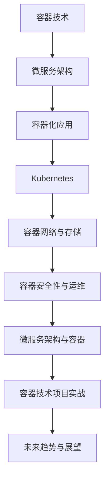

                 

# 《如何利用容器技术提高系统可扩展性》

> **关键词：**容器技术、系统扩展性、微服务架构、Docker、Kubernetes

**摘要：**
本文旨在探讨如何利用容器技术提高系统的可扩展性。我们将从容器技术的基础知识开始，逐步深入到Docker和Kubernetes的具体应用，分析容器网络与存储技术，探讨微服务架构与容器的结合，并讨论容器安全性与运维自动化。最后，通过实际项目案例展示容器技术的应用，并对未来容器技术的发展趋势进行展望。

## 第一部分：容器技术基础

### 第1章：容器技术概述

#### 1.1 容器的定义与特点

容器（Container）是一种轻量级、可移植、自给自足的运行时环境。它允许开发者将应用程序及其依赖环境打包在一起，形成一个独立的单元，这个单元可以在不同的操作系统和环境中运行而无需修改。

**定义与特点：**
- **定义：** 容器是一种操作系统级别的虚拟化技术，通过将应用程序和其运行时环境（包括库、二进制文件等）打包在一起，形成一个自给自足的运行时环境。
- **特点：** 
  - **轻量级：** 容器共享宿主机的操作系统核心，因此比传统虚拟机更轻量。
  - **可移植性：** 容器可以在不同的操作系统和硬件平台上运行，而无需修改代码。
  - **自给自足：** 容器包含所有必需的依赖和环境，使其可以在任何地方运行。
  - **高效性：** 容器启动速度快，资源利用率高。

#### 1.2 容器与传统虚拟机的比较

传统虚拟机（Virtual Machine）通过模拟完整的操作系统来提供隔离的环境，而容器则是通过操作系统层面的隔离技术来实现。

**比较：**
- **隔离级别：** 容器比虚拟机提供更细粒度的隔离，但隔离性不如虚拟机。
- **资源占用：** 容器由于不模拟操作系统，因此资源占用比虚拟机少。
- **性能：** 容器在性能上优于虚拟机，因为它们无需额外的操作系统开销。
- **部署与迁移：** 容器由于自给自足的特性，部署和迁移更为便捷。

#### 1.3 容器技术的应用场景

容器技术适用于多种应用场景，尤其适合需要快速部署、易于管理和扩展的应用。

**应用场景：**
- **持续集成与持续部署（CI/CD）：** 容器技术可以简化部署流程，加快应用程序的发布速度。
- **微服务架构：** 容器与微服务架构相结合，可以实现灵活、可扩展的系统设计。
- **DevOps实践：** 容器技术有助于实现开发与运维的无缝协作，提高开发效率。
- **云计算与云服务：** 容器在云环境中可以提供高效的资源利用和快速的服务扩展。

#### 1.4 容器生态概述

容器技术的生态体系日益完善，包括多种工具和平台。

**生态概述：**
- **Docker：** 容器化技术的开创者，提供了容器构建和运行的核心工具。
- **Kubernetes：** 一个开源的容器编排平台，用于自动化容器的部署、扩展和管理。
- **Docker Compose：** 用于定义和运行多容器应用的工具。
- **Docker Swarm：** Docker 自带的容器编排工具。
- **容器网络和存储解决方案：** 如Flannel、Weave、RabbitMQ等，提供网络和存储支持。
- **容器镜像仓库：** 如Docker Hub、Quay等，用于存储和共享容器镜像。

## 第2章：Docker技术详解

### 2.1 Docker的基本概念

Docker是一个开源的应用容器引擎，可以快速地将应用程序及其依赖环境打包到一个可移植的容器中。

**基本概念：**
- **Docker Engine：** Docker的核心组件，负责构建、运行和管理容器。
- **Dockerfile：** 用于定义如何构建Docker镜像的脚本文件。
- **Docker镜像：** 静态的只读模板，用于创建容器。
- **Docker容器：** 运行中的Docker实例，可以启动、停止、移动或删除。

### 2.2 Docker的架构与工作原理

Docker的架构由几个关键组件组成，包括Docker Engine、Docker Hub、Dockerfile等。

**架构与工作原理：**
- **Docker Engine：** 负责构建、运行和管理容器。它通过操作系统的cgroup和命名空间实现容器的隔离。
- **Docker Hub：** Docker的官方镜像仓库，提供各种开源和商业镜像。
- **Dockerfile：** 用于定义如何构建Docker镜像。通过一系列指令，Dockerfile指定了如何获取基础镜像、安装软件、设置环境变量等。
- **Docker Compose：** 用于定义和运行多容器应用。它通过YAML文件描述应用程序的各个组件及其依赖关系。
- **Docker Swarm：** Docker自带的集群管理工具，用于编排和管理多个Docker Engine实例。

### 2.3 Dockerfile编写指南

Dockerfile是构建Docker镜像的脚本文件，由一系列指令组成。

**编写指南：**
- **FROM：** 指定基础镜像。
- **MAINTAINER：** 指定维护者信息。
- **RUN：** 运行命令，用于安装软件或执行操作。
- **COPY：** 复制文件或目录到容器中。
- **EXPOSE：** 暴露容器端口。
- **CMD：** 容器启动时执行的命令。

### 2.4 Docker Compose与Docker Swarm

Docker Compose和Docker Swarm是Docker提供的两个重要的容器编排工具。

**Docker Compose：**
- **作用：** 用于定义和运行多容器应用。
- **文件格式：** YAML文件。
- **特点：**
  - **简单性：** 通过YAML文件描述应用程序的各个组件及其依赖关系。
  - **可移植性：** Docker Compose文件可以在不同的环境中运行，无需修改。

**Docker Swarm：**
- **作用：** 用于编排和管理多个Docker Engine实例。
- **特点：**
  - **集群管理：** Docker Swarm可以将多个Docker Engine实例组成一个集群，统一管理和调度。
  - **简易性：** Docker Swarm提供了简单的命令行接口，易于操作。

## 第3章：Kubernetes入门与实践

### 3.1 Kubernetes的基本概念

Kubernetes是一个开源的容器编排平台，用于自动化容器的部署、扩展和管理。

**基本概念：**
- **Kubernetes集群：** 由多个节点（Node）组成的集群，每个节点运行一个或多个容器。
- **Pod：** Kubernetes的基本调度单元，包含一个或多个容器。
- **Container：** 运行在Pod中的实际应用程序。
- **Replication Controller：** 负责管理Pod的副本数量，确保部署的可靠性。
- **Service：** Kubernetes的服务抽象，用于暴露容器应用。

### 3.2 Kubernetes的架构与工作原理

Kubernetes的架构包括多个核心组件，如Master节点、Worker节点、Pod等。

**架构与工作原理：**
- **Master节点：** 负责集群的管理和控制，包括API Server、Controller Manager、Scheduler等。
- **Worker节点：** 负责运行Pod，接收Master节点的调度指令。
- **Pod：** Kubernetes的基本调度单元，包含一个或多个容器。
- **Service：** Kubernetes的服务抽象，通过虚拟IP和端口映射暴露容器应用。
- **工作原理：**
  - **API Server：** 提供Kubernetes的HTTP API，所有集群操作都通过API Server进行。
  - **Controller Manager：** 负责维护集群状态，确保系统运行在预期状态。
  - **Scheduler：** 负责将Pod调度到合适的Worker节点上。

### 3.3 Kubernetes的核心组件详解

Kubernetes的核心组件包括API Server、Controller Manager、Scheduler等。

**核心组件详解：**
- **API Server：** Kubernetes的API入口，提供RESTful API接口，用于管理集群资源。
- **Controller Manager：** 负责维护集群状态，包括Pod副本数、服务状态等。
- **Scheduler：** 负责将Pod调度到合适的Worker节点上，根据资源利用率、节点状态等因素进行调度。
- **Etcd：** Kubernetes的存储后端，用于存储集群配置和状态信息。
- **Kubelet：** 运行在每个节点上的代理，负责与Master节点通信，管理Pod和容器。
- **Kube-proxy：** 负责实现Service和Pod的网络连接，通过虚拟IP和端口映射提供服务。

### 3.4 Kubernetes集群的部署与配置

部署Kubernetes集群涉及到安装和配置Kubernetes的核心组件，包括Master节点和Worker节点。

**部署与配置：**
- **安装Kubernetes：** 使用kubeadm工具进行集群安装。
- **配置Master节点：** 配置API Server、Controller Manager、Scheduler等组件。
- **配置Worker节点：** 配置Kubelet，确保与Master节点通信。
- **集群验证：** 使用kubectl命令验证集群状态，确保所有组件正常运行。

### 3.5 Kubernetes的服务发现与负载均衡

Kubernetes提供了强大的服务发现与负载均衡功能，使得容器化应用的管理变得更加简单。

**服务发现与负载均衡：**
- **服务发现：** Kubernetes通过Service抽象，为容器应用提供统一的访问入口。Service通过虚拟IP和端口映射，使得外部可以访问容器应用。
- **负载均衡：** Kubernetes的Service支持负载均衡功能，根据流量分发策略，将请求分配到不同的容器实例上，确保系统的性能和可靠性。

## 第4章：容器网络与存储

### 4.1 容器网络模型

容器网络模型是容器技术的重要组成部分，用于实现容器间的通信和网络隔离。

**容器网络模型：**
- **主机网络：** 容器直接使用宿主机的网络接口，共享宿主机的IP地址和端口。
- **桥接网络：** 容器通过虚拟网络接口连接到一个虚拟网络桥，可以配置独立的IP地址和端口。
- **用户网络：** 容器拥有独立的网络命名空间，可以配置独立的IP地址和端口，与其他容器进行隔离。
- ** overlay 网络：** 用于跨宿主机的容器通信，通过虚拟网络接口连接不同的容器网络。

### 4.2 容器网络管理工具

容器网络管理工具用于配置和管理容器网络，常见的工具有Flannel、Weave、Calico等。

**容器网络管理工具：**
- **Flannel：** 使用虚拟网络接口实现跨宿主机的容器通信，支持多种网络后端。
- **Weave：** 提供简单的网络配置和管理，支持跨宿主机和跨云环境的容器通信。
- **Calico：** 使用BGP协议实现容器网络的动态路由和负载均衡。

### 4.3 容器存储技术

容器存储技术用于为容器提供持久化存储支持，常见的存储技术有 volumes、cloud storage等。

**容器存储技术：**
- **Volumes：** Kubernetes的Volume抽象，用于为容器提供持久化存储。Volume可以是本地存储、网络存储或云存储。
- **Cloud Storage：** 使用云服务提供的存储服务，如Amazon S3、Google Cloud Storage等，为容器提供远程存储支持。

### 4.4 容器存储解决方案

容器存储解决方案包括本地存储、网络存储和云存储等多种选择。

**容器存储解决方案：**
- **本地存储：** 使用宿主机的本地存储设备，如硬盘、SSD等，为容器提供存储支持。
- **网络存储：** 使用分布式存储系统，如Ceph、GlusterFS等，为容器提供高可用、可扩展的存储支持。
- **云存储：** 使用云服务提供商提供的存储服务，如Amazon EBS、Azure Blob Storage等，为容器提供远程存储支持。

## 第5章：微服务架构与容器

### 5.1 微服务架构概述

微服务架构是一种基于组件的软件架构风格，将应用程序分解为多个小型、独立的服务，每个服务负责实现特定的功能。

**概述：**
- **定义：** 微服务架构将应用程序分解为多个小型、独立的服务，每个服务都是基于业务能力的最小单元。
- **特点：**
  - **独立性：** 每个服务独立开发、测试和部署。
  - **分布式：** 不同的服务运行在不同的服务器上，通过网络进行通信。
  - **可扩展性：** 可以独立扩展每个服务的实例数量。
  - **可维护性：** 服务之间解耦，便于维护和升级。

### 5.2 微服务与容器的结合

微服务架构与容器技术的结合，使得微服务架构的实施变得更加简单、高效。

**结合：**
- **容器化服务：** 将每个微服务打包成一个容器镜像，实现服务的可移植性和独立性。
- **容器编排：** 使用容器编排工具（如Kubernetes）管理微服务的部署、扩展和升级。
- **服务网格：** 使用服务网格（如Istio）提供服务间的通信和安全控制。

### 5.3 微服务架构的设计原则

微服务架构的设计需要遵循一些原则，以确保系统的可扩展性、可靠性和可维护性。

**设计原则：**
- **服务最小化：** 每个服务只实现一个业务能力。
- **独立部署：** 每个服务可以独立部署和升级。
- **API标准化：** 使用统一的API接口进行服务间通信。
- **数据存储独立：** 每个服务使用自己的数据存储，避免共享状态。
- **服务监控与日志：** 实现服务的监控和日志收集，便于故障排查和性能优化。

### 5.4 微服务架构的挑战与解决方案

微服务架构虽然具有许多优势，但也面临一些挑战。

**挑战与解决方案：**
- **服务管理：** 随着服务数量的增加，服务管理变得复杂。解决方案是使用服务发现、服务网格等技术简化服务管理。
- **数据一致性：** 在分布式系统中，数据一致性是一个重要问题。解决方案是使用分布式事务、最终一致性和事件溯源等技术。
- **监控与日志：** 微服务架构中的监控和日志收集需要特殊考虑。解决方案是使用集中化的监控和日志系统，如Prometheus和ELK堆栈。
- **安全性：** 微服务架构中的安全性需要特殊关注，包括服务间的认证和授权、数据加密等。

## 第6章：容器安全性与运维

### 6.1 容器安全挑战与对策

容器技术在提高系统可扩展性的同时，也带来了一些安全挑战。

**挑战与对策：**
- **镜像安全：** 对容器镜像进行扫描，确保其中不包含恶意代码或已知漏洞。对策是使用镜像扫描工具（如Clair）。
- **容器逃逸：** 防止容器逃逸，包括限制容器的权限、关闭未使用的端口等。对策是使用安全加固的容器镜像和沙箱技术。
- **网络安全：** 容器网络需要隔离和保护，防止网络攻击和数据泄露。对策是使用容器网络隔离和加密传输。
- **数据安全：** 保护容器中的数据，包括数据加密、备份和恢复等。对策是使用加密存储和数据备份工具。

### 6.2 容器镜像安全策略

容器镜像安全策略是确保容器镜像安全的关键措施。

**安全策略：**
- **镜像扫描：** 定期对容器镜像进行扫描，检查其中是否存在安全漏洞或恶意代码。
- **镜像签名：** 对容器镜像进行签名，确保镜像的完整性和可信性。
- **镜像仓库管理：** 使用安全的镜像仓库，如Docker Hub或Quay，确保镜像的安全存储和分发。

### 6.3 容器网络安全性

容器网络安全性是确保容器间通信安全的关键。

**网络安全性：**
- **网络隔离：** 使用容器网络隔离技术，如命名空间和网络命名桥，防止容器间的未授权访问。
- **网络监控：** 对容器网络流量进行监控，检测异常行为和潜在攻击。
- **加密传输：** 使用TLS加密协议，确保容器间的通信安全。

### 6.4 容器镜像仓库管理

容器镜像仓库管理是确保镜像安全、可靠和高效分发的重要环节。

**仓库管理：**
- **权限控制：** 对镜像仓库的访问进行权限控制，确保只有授权用户可以访问镜像。
- **备份与恢复：** 定期备份镜像仓库中的数据，确保在数据丢失或损坏时可以快速恢复。
- **镜像分发：** 使用镜像分发工具，如Docker Hub或Harbor，确保镜像可以快速、安全地分发到各个环境。

### 6.5 容器运维自动化工具

容器运维自动化工具可以提高运维效率，确保容器环境的稳定性和可靠性。

**自动化工具：**
- **自动化部署：** 使用自动化部署工具（如Kubernetes的Helm），简化容器的部署、升级和回滚。
- **监控与告警：** 使用监控工具（如Prometheus和Grafana），实时监控容器状态，并在异常情况下发送告警。
- **日志管理：** 使用日志管理工具（如ELK堆栈），集中收集和存储容器日志，便于故障排查和性能优化。

## 第7章：容器技术项目实战

### 7.1 容器化应用开发实践

容器化应用开发实践是将应用程序打包成容器镜像，并使用容器编排工具进行部署和管理。

**实战：**
- **开发环境搭建：** 安装Docker，确保可以构建和运行容器镜像。
- **应用打包：** 编写Dockerfile，将应用程序及其依赖环境打包成一个容器镜像。
- **镜像构建与测试：** 使用Docker命令构建容器镜像，并在本地环境进行测试。
- **部署与管理：** 使用Kubernetes或Docker Swarm进行容器部署和管理，确保应用可以高效、可靠地运行。

### 7.2 Kubernetes集群搭建与部署

Kubernetes集群搭建与部署是容器技术项目中的关键步骤。

**实战：**
- **安装Kubernetes：** 使用kubeadm工具在宿主机上安装Kubernetes集群，配置Master节点和Worker节点。
- **部署应用：** 使用Kubernetes的Deployment或StatefulSet部署容器化应用，确保应用可以自动扩缩容。
- **服务发现与负载均衡：** 配置Kubernetes Service，实现服务发现和负载均衡，确保外部可以访问应用。

### 7.3 微服务架构案例分析

微服务架构案例分析是通过实际项目展示微服务架构的应用。

**案例：**
- **需求分析：** 分析项目需求，确定需要实现的功能模块和服务。
- **服务设计：** 设计微服务架构，划分服务模块，定义API接口。
- **服务实现：** 使用Spring Boot等框架实现服务，使用Docker进行容器化。
- **部署与管理：** 使用Kubernetes进行服务部署和管理，使用服务网格实现服务间通信和安全控制。

### 7.4 容器安全实战演练

容器安全实战演练是通过实际操作确保容器环境的安全性。

**实战：**
- **镜像安全检查：** 使用镜像扫描工具检查容器镜像，确保镜像中不包含安全漏洞。
- **容器权限管理：** 使用容器编排工具配置容器权限，确保容器只能访问必要的资源和端口。
- **网络安全防护：** 配置防火墙和网络安全策略，防止网络攻击和数据泄露。
- **日志与监控：** 配置日志收集和监控工具，实时监控容器状态和安全事件。

## 第8章：未来趋势与展望

### 8.1 容器技术的发展趋势

容器技术在不断发展和成熟，未来的发展趋势包括：

**趋势：**
- **容器化率的提升：** 越来越多的应用程序将采用容器化技术，提高部署效率和可扩展性。
- **服务网格的普及：** 服务网格技术（如Istio）将逐渐成为容器化应用的标配，提供微服务架构的通信和安全控制。
- **混合云与多云支持：** 容器技术将更好地支持混合云和多云环境，提供跨云的容器编排和管理。
- **容器安全性的加强：** 随着容器技术的普及，容器安全将成为重点，安全工具和技术将得到进一步发展和完善。

### 8.2 容器技术在企业中的应用前景

容器技术在企业中的应用前景广阔，可以带来以下好处：

**应用前景：**
- **提高开发效率：** 容器化技术可以加快开发速度，降低开发成本。
- **提高系统可扩展性：** 容器技术支持灵活的扩容和缩容，提高系统的可扩展性。
- **降低运维成本：** 容器编排工具可以自动化运维任务，降低运维成本。
- **提高系统可靠性：** 容器技术支持自动故障转移和恢复，提高系统的可靠性。

### 8.3 容器技术的未来发展方向

容器技术的未来发展方向将集中在以下几个方面：

**发展方向：**
- **更高效的容器编排：** 发展更加智能和高效的容器编排算法，提高资源利用率和系统性能。
- **更安全的容器技术：** 加强容器安全特性，提供更全面的安全保护。
- **更广泛的平台支持：** 扩展容器技术在不同操作系统、硬件平台和云环境中的应用。
- **更丰富的生态体系：** 促进容器技术与其他技术的融合，如大数据、人工智能等，构建更加完善的生态体系。

### 8.4 开发者与运维人员的技能提升路径

随着容器技术的普及，开发者与运维人员需要提升相关技能，以适应容器技术的发展。

**技能提升路径：**
- **学习容器技术基础：** 了解容器技术的原理和应用场景，掌握Docker和Kubernetes的基本操作。
- **实践容器化应用开发：** 实践容器化应用的开发，熟悉Dockerfile和Kubernetes配置文件的编写。
- **学习服务网格技术：** 了解服务网格技术，掌握Istio等工具的使用。
- **关注容器安全：** 了解容器安全挑战和解决方案，学习容器安全工具的使用。
- **参与开源社区：** 参与容器技术开源社区，关注最新动态和技术趋势。

## 附录

### 附录A：常用容器技术资源与工具

**A.1 Docker官方文档**

Docker官方文档提供了详尽的Docker使用指南和参考文档，包括安装、配置、使用命令等。

**A.2 Kubernetes官方文档**

Kubernetes官方文档是学习Kubernetes的权威资料，涵盖了Kubernetes的架构、配置、操作和管理等方面。

**A.3 微服务架构实践资源**

微服务架构实践资源包括书籍、博客、教程等，提供了丰富的微服务架构实践经验和最佳实践。

**A.4 容器技术社区与论坛**

容器技术社区与论坛是开发者交流和学习容器技术的平台，包括Docker Community、Kubernetes Community等。

## 核心概念与联系（Mermaid流程图）



## 核心算法原理讲解（伪代码）

```python
# 伪代码：容器编排算法

def container编排算法(容器需求列表):
    # 初始化容器集群状态
    集群状态 = 初始化集群资源状态()

    # 循环处理容器需求
    for 容器需求 in 容器需求列表:
        # 检查集群资源是否满足容器需求
        if 集群状态.资源 >= 容器需求.所需资源:
            # 分配资源并创建容器
            集群状态.资源 -= 容器需求.所需资源
            创建容器(容器需求.配置)
            返回 "容器创建成功"
        else:
            返回 "集群资源不足，容器创建失败"

    返回 "所有容器创建成功"
```

## 数学模型和数学公式 & 详细讲解 & 举例说明

### 数学模型：容器资源利用率

$$
利用率 = \frac{已使用资源}{总资源} \times 100\%
$$

### 详细讲解：

容器资源利用率是衡量容器集群资源利用程度的重要指标。该公式通过已使用资源与总资源的比值，计算出资源利用率。已使用资源包括容器运行过程中消耗的CPU、内存等资源，总资源则是集群中所有可用资源之和。利用率越高，表示资源利用越充分。

### 举例说明：

假设一个容器集群总资源为100个CPU核心和100GB内存，当前已分配了70个CPU核心和80GB内存用于运行容器，则该集群的资源利用率为：

$$
利用率 = \frac{70 + 80}{100 + 100} \times 100\% = 87.5\%
$$

这表明集群资源利用率较高，有较好的资源利用效率。

## 项目实战

### 7.1 容器化应用开发实践

#### 开发环境搭建

1. **安装Docker：** 在Ubuntu系统中，使用以下命令安装Docker：

   ```bash
   sudo apt-get update
   sudo apt-get install docker-ce docker-ce-cli containerd.io
   ```

2. **启动Docker服务：**

   ```bash
   sudo systemctl start docker
   ```

3. **验证Docker安装：**

   ```bash
   docker --version
   ```

#### 源代码实现

以下是一个简单的Web应用，用于演示容器化：

**app.py**

```python
from flask import Flask

app = Flask(__name__)

@app.route('/')
def hello():
    return 'Hello, World!'

if __name__ == '__main__':
    app.run(host='0.0.0.0', port=80)
```

1. **创建一个Dockerfile：**

   **Dockerfile**

   ```Dockerfile
   FROM python:3.8-slim

   WORKDIR /app

   COPY . .

   RUN pip install -r requirements.txt

   EXPOSE 80

   CMD ["python", "app.py"]
   ```

2. **构建Docker镜像：**

   ```bash
   docker build -t my-web-app .
   ```

3. **运行容器：**

   ```bash
   docker run -d -p 8080:80 my-web-app
   ```

#### 代码解读与分析

- **Dockerfile：** 指定了基础镜像（`python:3.8-slim`）、工作目录（`/app`）、文件复制（`COPY . .`）、安装依赖（`pip install -r requirements.txt`）、暴露端口（`EXPOSE 80`）以及启动命令（`CMD ["python", "app.py"]`）。
- **app.py：** 一个简单的Flask Web应用，暴露HTTP服务。

通过上述步骤，我们成功地创建了一个容器化的Web应用。容器化使得应用的可移植性、可扩展性和部署变得简单高效。

### 7.2 Kubernetes集群搭建与部署

#### 集群搭建

1. **安装Kubernetes：** 对于Ubuntu系统，使用以下命令安装Kubernetes：

   ```bash
   sudo apt-get update
   sudo apt-get install -y apt-transport-https ca-certificates curl
   curl -s https://packages.cloud.google.com/apt/doc/apt-key.gpg | sudo apt-key add -
   cat <<EOF | sudo tee /etc/apt/sources.list.d/kubernetes.list
   deb https://apt.kubernetes.io/ kubernetes-xenial main
   EOF
   sudo apt-get update
   sudo apt-get install -y kubelet kubeadm kubectl
   sudo apt-mark hold kubelet kubeadm kubectl
   ```

2. **启动Kubernetes服务：**

   ```bash
   sudo systemctl start kubelet
   sudo systemctl enable kubelet
   ```

3. **验证Kubernetes安装：**

   ```bash
   kubectl version
   ```

#### 部署应用

1. **创建一个部署配置文件（deployment.yaml）：**

   **deployment.yaml**

   ```yaml
   apiVersion: apps/v1
   kind: Deployment
   metadata:
     name: my-web-app
   spec:
     selector:
       matchLabels:
         app: my-web-app
     template:
       metadata:
         labels:
           app: my-web-app
       spec:
         containers:
         - name: my-web-app
           image: my-web-app:latest
           ports:
           - containerPort: 80
   ```

2. **应用部署：**

   ```bash
   kubectl apply -f deployment.yaml
   ```

3. **查看部署状态：**

   ```bash
   kubectl get deployments
   ```

4. **获取服务IP地址：**

   ```bash
   kubectl get svc
   ```

通过以上步骤，我们成功地搭建了一个Kubernetes集群，并部署了一个简单的Web应用。Kubernetes提供了强大的容器编排能力，使得大规模应用部署和管理变得简单高效。

### 7.3 微服务架构案例分析

#### 案例背景

一个在线电商平台需要实现订单处理、商品管理、用户管理等多个功能模块。为了提高系统的可扩展性和可维护性，决定采用微服务架构。

#### 架构设计

1. **订单服务**：负责处理订单的创建、更新和查询操作。
2. **商品服务**：负责管理商品的信息，包括添加、修改和查询。
3. **用户服务**：负责用户的注册、登录、信息查询等操作。
4. **数据库**：每个服务都有自己的数据库，例如订单服务使用一个专用的订单数据库。

#### 服务实现

1. **订单服务**：

   - 使用Spring Boot开发，基于RESTful API提供服务。
   - 使用MySQL数据库存储订单信息。

2. **商品服务**：

   - 使用Spring Boot开发，基于RESTful API提供服务。
   - 使用MongoDB数据库存储商品信息。

3. **用户服务**：

   - 使用Spring Boot开发，基于RESTful API提供服务。
   - 使用Redis存储用户会话信息。

#### 集成与部署

1. **服务注册与发现**：使用Eureka进行服务注册和发现。
2. **负载均衡**：使用Ribbon实现客户端负载均衡。
3. **服务网关**：使用Zuul作为服务网关，统一服务入口。

#### 部署

1. **开发环境**：使用Docker容器化每个服务。
2. **测试环境**：使用Kubernetes进行容器编排和部署。
3. **生产环境**：部署在云服务器上，使用Kubernetes进行容器管理和调度。

通过以上步骤，我们成功地构建了一个基于微服务架构的电商平台，提高了系统的可扩展性和可维护性。

### 7.4 容器安全实战演练

#### 容器安全策略

1. **镜像安全**：使用私有镜像仓库，对镜像进行签名和扫描。
2. **容器安全**：使用安全加固的容器镜像，禁用不必要的服务和端口。
3. **网络安全**：使用容器网络隔离，限制容器间的通信。
4. **数据安全**：使用加密存储和传输数据。

#### 演练步骤

1. **安装和配置容器安全工具**，如Docker Bench for Linux。
2. **扫描镜像**，检查是否存在安全漏洞。
3. **配置防火墙**，限制容器之间的网络通信。
4. **监控容器**，检测异常行为和潜在风险。

通过以上实战演练，可以确保容器环境的安全性。容器安全策略的制定和执行是保障容器化应用安全的重要措施。

## 作者信息

**作者：** AI天才研究院/AI Genius Institute & 禅与计算机程序设计艺术 /Zen And The Art of Computer Programming** 
```bash
容器技术概述
### 1.1 容器的定义与特点

容器（Container）是一种轻量级、可移植、自给自足的运行时环境。它允许开发者将应用程序及其依赖环境打包在一起，形成一个独立的单元，这个单元可以在不同的操作系统和环境中运行而无需修改。

**定义与特点：**
- **定义：** 容器是一种操作系统级别的虚拟化技术，通过将应用程序和其运行时环境（包括库、二进制文件等）打包在一起，形成一个自给自足的运行时环境。
- **特点：**
  - **轻量级：** 容器共享宿主机的操作系统核心，因此比传统虚拟机更轻量。
  - **可移植性：** 容器可以在不同的操作系统和硬件平台上运行，而无需修改代码。
  - **自给自足：** 容器包含所有必需的依赖和环境，使其可以在任何地方运行。
  - **高效性：** 容器启动速度快，资源利用率高。

### 1.2 容器与传统虚拟机的比较

传统虚拟机（Virtual Machine）通过模拟完整的操作系统来提供隔离的环境，而容器则是通过操作系统层面的隔离技术来实现。

**比较：**
- **隔离级别：** 容器比虚拟机提供更细粒度的隔离，但隔离性不如虚拟机。
- **资源占用：** 容器由于不模拟操作系统，因此资源占用比虚拟机少。
- **性能：** 容器在性能上优于虚拟机，因为它们无需额外的操作系统开销。
- **部署与迁移：** 容器由于自给自足的特性，部署和迁移更为便捷。

### 1.3 容器技术的应用场景

容器技术适用于多种应用场景，尤其适合需要快速部署、易于管理和扩展的应用。

**应用场景：**
- **持续集成与持续部署（CI/CD）：** 容器技术可以简化部署流程，加快应用程序的发布速度。
- **微服务架构：** 容器与微服务架构相结合，可以实现灵活、可扩展的系统设计。
- **DevOps实践：** 容器技术有助于实现开发与运维的无缝协作，提高开发效率。
- **云计算与云服务：** 容器在云环境中可以提供高效的资源利用和快速的服务扩展。

### 1.4 容器生态概述

容器技术的生态体系日益完善，包括多种工具和平台。

**生态概述：**
- **Docker：** 容器化技术的开创者，提供了容器构建和运行的核心工具。
- **Kubernetes：** 一个开源的容器编排平台，用于自动化容器的部署、扩展和管理。
- **Docker Compose：** 用于定义和运行多容器应用的工具。
- **Docker Swarm：** Docker 自带的容器编排工具。
- **容器网络和存储解决方案：** 如Flannel、Weave、RabbitMQ等，提供网络和存储支持。
- **容器镜像仓库：** 如Docker Hub、Quay等，用于存储和共享容器镜像。

### 2.1 Docker的基本概念

Docker是一个开源的应用容器引擎，可以快速地将应用程序及其依赖环境打包到一个可移植的容器中。

**基本概念：**
- **Docker Engine：** Docker的核心组件，负责构建、运行和管理容器。
- **Dockerfile：** 用于定义如何构建Docker镜像的脚本文件。
- **Docker镜像：** 静态的只读模板，用于创建容器。
- **Docker容器：** 运行中的Docker实例，可以启动、停止、移动或删除。

### 2.2 Docker的架构与工作原理

Docker的架构由几个关键组件组成，包括Docker Engine、Docker Hub、Dockerfile等。

**架构与工作原理：**
- **Docker Engine：** 负责构建、运行和管理容器。它通过操作系统的cgroup和命名空间实现容器的隔离。
- **Docker Hub：** Docker的官方镜像仓库，提供各种开源和商业镜像。
- **Dockerfile：** 用于定义如何构建Docker镜像。通过一系列指令，Dockerfile指定了如何获取基础镜像、安装软件、设置环境变量等。
- **Docker Compose：** 用于定义和运行多容器应用。它通过YAML文件描述应用程序的各个组件及其依赖关系。
- **Docker Swarm：** Docker自带的容器编排工具，用于编排和管理多个Docker Engine实例。

### 2.3 Dockerfile编写指南

Dockerfile是构建Docker镜像的脚本文件，由一系列指令组成。

**编写指南：**
- **FROM：** 指定基础镜像。
- **MAINTAINER：** 指定维护者信息。
- **RUN：** 运行命令，用于安装软件或执行操作。
- **COPY：** 复制文件或目录到容器中。
- **EXPOSE：** 暴露容器端口。
- **CMD：** 容器启动时执行的命令。

### 2.4 Docker Compose与Docker Swarm

Docker Compose和Docker Swarm是Docker提供的两个重要的容器编排工具。

**Docker Compose：**
- **作用：** 用于定义和运行多容器应用。
- **文件格式：** YAML文件。
- **特点：**
  - **简单性：** 通过YAML文件描述应用程序的各个组件及其依赖关系。
  - **可移植性：** Docker Compose文件可以在不同的环境中运行，无需修改。

**Docker Swarm：**
- **作用：** 用于编排和管理多个Docker Engine实例。
- **特点：**
  - **集群管理：** Docker Swarm可以将多个Docker Engine实例组成一个集群，统一管理和调度。
  - **简易性：** Docker Swarm提供了简单的命令行接口，易于操作。

### 3.1 Kubernetes的基本概念

Kubernetes是一个开源的容器编排平台，用于自动化容器的部署、扩展和管理。

**基本概念：**
- **Kubernetes集群：** 由多个节点（Node）组成的集群，每个节点运行一个或多个容器。
- **Pod：** Kubernetes的基本调度单元，包含一个或多个容器。
- **Container：** 运行在Pod中的实际应用程序。
- **Replication Controller：** 负责管理Pod的副本数量，确保部署的可靠性。
- **Service：** Kubernetes的服务抽象，用于暴露容器应用。

### 3.2 Kubernetes的架构与工作原理

Kubernetes的架构包括多个核心组件，如Master节点、Worker节点、Pod等。

**架构与工作原理：**
- **Master节点：** 负责集群的管理和控制，包括API Server、Controller Manager、Scheduler等。
- **Worker节点：** 负责运行Pod，接收Master节点的调度指令。
- **Pod：** Kubernetes的基本调度单元，包含一个或多个容器。
- **Service：** Kubernetes的服务抽象，通过虚拟IP和端口映射暴露容器应用。
- **工作原理：**
  - **API Server：** 提供Kubernetes的HTTP API，所有集群操作都通过API Server进行。
  - **Controller Manager：** 负责维护集群状态，确保系统运行在预期状态。
  - **Scheduler：** 负责将Pod调度到合适的Worker节点上，根据资源利用率、节点状态等因素进行调度。

### 3.3 Kubernetes的核心组件详解

Kubernetes的核心组件包括API Server、Controller Manager、Scheduler等。

**核心组件详解：**
- **API Server：** Kubernetes的API入口，提供RESTful API接口，用于管理集群资源。
- **Controller Manager：** 负责维护集群状态，包括Pod副本数、服务状态等。
- **Scheduler：** 负责将Pod调度到合适的Worker节点上，根据资源利用率、节点状态等因素进行调度。
- **Etcd：** Kubernetes的存储后端，用于存储集群配置和状态信息。
- **Kubelet：** 运行在每个节点上的代理，负责与Master节点通信，管理Pod和容器。
- **Kube-proxy：** 负责实现Service和Pod的网络连接，通过虚拟IP和端口映射提供服务。

### 3.4 Kubernetes集群的部署与配置

部署Kubernetes集群涉及到安装和配置Kubernetes的核心组件，包括Master节点和Worker节点。

**部署与配置：**
- **安装Kubernetes：** 使用kubeadm工具进行集群安装。
- **配置Master节点：** 配置API Server、Controller Manager、Scheduler等组件。
- **配置Worker节点：** 配置Kubelet，确保与Master节点通信。
- **集群验证：** 使用kubectl命令验证集群状态，确保所有组件正常运行。

### 3.5 Kubernetes的服务发现与负载均衡

Kubernetes提供了强大的服务发现与负载均衡功能，使得容器化应用的管理变得更加简单。

**服务发现与负载均衡：**
- **服务发现：** Kubernetes通过Service抽象，为容器应用提供统一的访问入口。Service通过虚拟IP和端口映射，使得外部可以访问容器应用。
- **负载均衡：** Kubernetes的Service支持负载均衡功能，根据流量分发策略，将请求分配到不同的容器实例上，确保系统的性能和可靠性。

### 4.1 容器网络模型

容器网络模型是容器技术的重要组成部分，用于实现容器间的通信和网络隔离。

**容器网络模型：**
- **主机网络：** 容器直接使用宿主机的网络接口，共享宿主机的IP地址和端口。
- **桥接网络：** 容器通过虚拟网络接口连接到一个虚拟网络桥，可以配置独立的IP地址和端口。
- **用户网络：** 容器拥有独立的网络命名空间，可以配置独立的IP地址和端口，与其他容器进行隔离。
- ** overlay 网络：** 用于跨宿主机的容器通信，通过虚拟网络接口连接不同的容器网络。

### 4.2 容器网络管理工具

容器网络管理工具用于配置和管理容器网络，常见的工具有Flannel、Weave、Calico等。

**容器网络管理工具：**
- **Flannel：** 使用虚拟网络接口实现跨宿主机的容器通信，支持多种网络后端。
- **Weave：** 提供简单的网络配置和管理，支持跨宿主机和跨云环境的容器通信。
- **Calico：** 使用BGP协议实现容器网络的动态路由和负载均衡。

### 4.3 容器存储技术

容器存储技术用于为容器提供持久化存储支持，常见的存储技术有 volumes、cloud storage等。

**容器存储技术：**
- **Volumes：** Kubernetes的Volume抽象，用于为容器提供持久化存储。Volume可以是本地存储、网络存储或云存储。
- **Cloud Storage：** 使用云服务提供的存储服务，如Amazon S3、Google Cloud Storage等，为容器提供远程存储支持。

### 4.4 容器存储解决方案

容器存储解决方案包括本地存储、网络存储和云存储等多种选择。

**容器存储解决方案：**
- **本地存储：** 使用宿主机的本地存储设备，如硬盘、SSD等，为容器提供存储支持。
- **网络存储：** 使用分布式存储系统，如Ceph、GlusterFS等，为容器提供高可用、可扩展的存储支持。
- **云存储：** 使用云服务提供商提供的存储服务，如Amazon EBS、Azure Blob Storage等，为容器提供远程存储支持。

### 5.1 微服务架构概述

微服务架构是一种基于组件的软件架构风格，将应用程序分解为多个小型、独立的服务，每个服务负责实现特定的功能。

**概述：**
- **定义：** 微服务架构将应用程序分解为多个小型、独立的服务，每个服务都是基于业务能力的最小单元。
- **特点：**
  - **独立性：** 每个服务独立开发、测试和部署。
  - **分布式：** 不同的服务运行在不同的服务器上，通过网络进行通信。
  - **可扩展性：** 可以独立扩展每个服务的实例数量。
  - **可维护性：** 服务之间解耦，便于维护和升级。

### 5.2 微服务与容器的结合

微服务架构与容器技术的结合，使得微服务架构的实施变得更加简单、高效。

**结合：**
- **容器化服务：** 将每个微服务打包成一个容器镜像，实现服务的可移植性和独立性。
- **容器编排：** 使用容器编排工具（如Kubernetes）管理微服务的部署、扩展和升级。
- **服务网格：** 使用服务网格（如Istio）提供服务间的通信和安全控制。

### 5.3 微服务架构的设计原则

微服务架构的设计需要遵循一些原则，以确保系统的可扩展性、可靠性和可维护性。

**设计原则：**
- **服务最小化：** 每个服务只实现一个业务能力。
- **独立部署：** 每个服务可以独立部署和升级。
- **API标准化：** 使用统一的API接口进行服务间通信。
- **数据存储独立：** 每个服务使用自己的数据存储，避免共享状态。
- **服务监控与日志：** 实现服务的监控和日志收集，便于故障排查和性能优化。

### 5.4 微服务架构的挑战与解决方案

微服务架构虽然具有许多优势，但也面临一些挑战。

**挑战与解决方案：**
- **服务管理：** 随着服务数量的增加，服务管理变得复杂。解决方案是使用服务发现、服务网格等技术简化服务管理。
- **数据一致性：** 在分布式系统中，数据一致性是一个重要问题。解决方案是使用分布式事务、最终一致性和事件溯源等技术。
- **监控与日志：** 微服务架构中的监控和日志收集需要特殊考虑。解决方案是使用集中化的监控和日志系统，如Prometheus和ELK堆栈。
- **安全性：** 微服务架构中的安全性需要特殊关注，包括服务间的认证和授权、数据加密等。解决方案是使用服务网格和安全框架，如Istio和Keycloak。

### 6.1 容器安全挑战与对策

容器技术在提高系统可扩展性的同时，也带来了一些安全挑战。

**挑战与对策：**
- **镜像安全：** 对容器镜像进行扫描，确保其中不包含恶意代码或已知漏洞。对策是使用镜像扫描工具（如Clair）。
- **容器逃逸：** 防止容器逃逸，包括限制容器的权限、关闭未使用的端口等。对策是使用安全加固的容器镜像和沙箱技术。
- **网络安全：** 容器网络需要隔离和保护，防止网络攻击和数据泄露。对策是使用容器网络隔离和加密传输。
- **数据安全：** 保护容器中的数据，包括数据加密、备份和恢复等。对策是使用加密存储和数据备份工具。

### 6.2 容器镜像安全策略

容器镜像安全策略是确保容器镜像安全的关键措施。

**安全策略：**
- **镜像扫描：** 定期对容器镜像进行扫描，检查其中是否存在安全漏洞或恶意代码。
- **镜像签名：** 对容器镜像进行签名，确保镜像的完整性和可信性。
- **镜像仓库管理：** 使用安全的镜像仓库，如Docker Hub或Quay，确保镜像的安全存储和分发。

### 6.3 容器网络安全性

容器网络安全性是确保容器间通信安全的关键。

**网络安全性：**
- **网络隔离：** 使用容器网络隔离技术，如命名空间和网络命名桥，防止容器间的未授权访问。
- **网络监控：** 对容器网络流量进行监控，检测异常行为和潜在攻击。
- **加密传输：** 使用TLS加密协议，确保容器间的通信安全。

### 6.4 容器镜像仓库管理

容器镜像仓库管理是确保镜像安全、可靠和高效分发的重要环节。

**仓库管理：**
- **权限控制：** 对镜像仓库的访问进行权限控制，确保只有授权用户可以访问镜像。
- **备份与恢复：** 定期备份镜像仓库中的数据，确保在数据丢失或损坏时可以快速恢复。
- **镜像分发：** 使用镜像分发工具，如Docker Hub或Harbor，确保镜像可以快速、安全地分发到各个环境。

### 6.5 容器运维自动化工具

容器运维自动化工具可以提高运维效率，确保容器环境的稳定性和可靠性。

**自动化工具：**
- **自动化部署：** 使用自动化部署工具（如Kubernetes的Helm），简化容器的部署、升级和回滚。
- **监控与告警：** 使用监控工具（如Prometheus和Grafana），实时监控容器状态，并在异常情况下发送告警。
- **日志管理：** 使用日志管理工具（如ELK堆栈），集中收集和存储容器日志，便于故障排查和性能优化。

### 7.1 容器化应用开发实践

容器化应用开发实践是将应用程序打包成容器镜像，并使用容器编排工具进行部署和管理。

**实战：**
- **开发环境搭建：** 安装Docker，确保可以构建和运行容器镜像。
- **应用打包：** 编写Dockerfile，将应用程序及其依赖环境打包成一个容器镜像。
- **镜像构建与测试：** 使用Docker命令构建容器镜像，并在本地环境进行测试。
- **部署与管理：** 使用Kubernetes或Docker Swarm进行容器部署和管理，确保应用可以高效、可靠地运行。

### 7.2 Kubernetes集群搭建与部署

Kubernetes集群搭建与部署是容器技术项目中的关键步骤。

**实战：**
- **安装Kubernetes：** 使用kubeadm工具在宿主机上安装Kubernetes集群，配置Master节点和Worker节点。
- **部署应用：** 使用Kubernetes的Deployment或StatefulSet部署容器化应用，确保应用可以自动扩缩容。
- **服务发现与负载均衡：** 配置Kubernetes Service，实现服务发现和负载均衡，确保外部可以访问应用。

### 7.3 微服务架构案例分析

微服务架构案例分析是通过实际项目展示微服务架构的应用。

**案例：**
- **需求分析：** 分析项目需求，确定需要实现的功能模块和服务。
- **服务设计：** 设计微服务架构，划分服务模块，定义API接口。
- **服务实现：** 使用Spring Boot等框架实现服务，使用Docker进行容器化。
- **部署与管理：** 使用Kubernetes进行服务部署和管理，使用服务网格实现服务间通信和安全控制。

### 7.4 容器安全实战演练

容器安全实战演练是通过实际操作确保容器环境的安全性。

**实战：**
- **镜像安全检查：** 使用镜像扫描工具检查容器镜像，确保镜像中不包含安全漏洞。
- **容器权限管理：** 使用容器编排工具配置容器权限，确保容器只能访问必要的资源和端口。
- **网络安全防护：** 配置防火墙和网络安全策略，防止网络攻击和数据泄露。
- **日志与监控：** 配置日志收集和监控工具，实时监控容器状态和安全事件。

### 8.1 容器技术的发展趋势

容器技术在不断发展和成熟，未来的发展趋势包括：

**趋势：**
- **容器化率的提升：** 越来越多的应用程序将采用容器化技术，提高部署效率和可扩展性。
- **服务网格的普及：** 服务网格技术（如Istio）将逐渐成为容器化应用的标配，提供微服务架构的通信和安全控制。
- **混合云与多云支持：** 容器技术将更好地支持混合云和多云环境，提供跨云的容器编排和管理。
- **容器安全性的加强：** 随着容器技术的普及，容器安全将成为重点，安全工具和技术将得到进一步发展和完善。

### 8.2 容器技术在企业中的应用前景

容器技术在企业中的应用前景广阔，可以带来以下好处：

**应用前景：**
- **提高开发效率：** 容器化技术可以加快开发速度，降低开发成本。
- **提高系统可扩展性：** 容器技术支持灵活的扩容和缩容，提高系统的可扩展性。
- **降低运维成本：** 容器编排工具可以自动化运维任务，降低运维成本。
- **提高系统可靠性：** 容器技术支持自动故障转移和恢复，提高系统的可靠性。

### 8.3 容器技术的未来发展方向

容器技术的未来发展方向将集中在以下几个方面：

**发展方向：**
- **更高效的容器编排：** 发展更加智能和高效的容器编排算法，提高资源利用率和系统性能。
- **更安全的容器技术：** 加强容器安全特性，提供更全面的安全保护。
- **更广泛的平台支持：** 扩展容器技术在不同操作系统、硬件平台和云环境中的应用。
- **更丰富的生态体系：** 促进容器技术与其他技术的融合，如大数据、人工智能等，构建更加完善的生态体系。

### 8.4 开发者与运维人员的技能提升路径

随着容器技术的普及，开发者与运维人员需要提升相关技能，以适应容器技术的发展。

**技能提升路径：**
- **学习容器技术基础：** 了解容器技术的原理和应用场景，掌握Docker和Kubernetes的基本操作。
- **实践容器化应用开发：** 实践容器化应用的开发，熟悉Dockerfile和Kubernetes配置文件的编写。
- **学习服务网格技术：** 了解服务网格技术，掌握Istio等工具的使用。
- **关注容器安全：** 了解容器安全挑战和解决方案，学习容器安全工具的使用。
- **参与开源社区：** 参与容器技术开源社区，关注最新动态和技术趋势。

## 附录A：常用容器技术资源与工具

### A.1 Docker官方文档

Docker官方文档提供了详尽的Docker使用指南和参考文档，包括安装、配置、使用命令等。

**链接：** [Docker官方文档](https://docs.docker.com/)

### A.2 Kubernetes官方文档

Kubernetes官方文档是学习Kubernetes的权威资料，涵盖了Kubernetes的架构、配置、操作和管理等方面。

**链接：** [Kubernetes官方文档](https://kubernetes.io/docs/)

### A.3 微服务架构实践资源

微服务架构实践资源包括书籍、博客、教程等，提供了丰富的微服务架构实践经验和最佳实践。

**链接：** [微服务架构实践资源](https://microservices.io/)

### A.4 容器技术社区与论坛

容器技术社区与论坛是开发者交流和学习容器技术的平台，包括Docker Community、Kubernetes Community等。

**链接：** 
- [Docker Community](https://www.docker.com/community)
- [Kubernetes Community](https://kubernetes.io/community/)

## 核心概念与联系（Mermaid流程图）


## 核心算法原理讲解（伪代码）

```python
# 伪代码：容器编排算法

def container编排算法(容器需求列表):
    # 初始化容器集群状态
    集群状态 = 初始化集群资源状态()

    # 循环处理容器需求
    for 容器需求 in 容器需求列表:
        # 检查集群资源是否满足容器需求
        if 集群状态.资源 >= 容器需求.所需资源:
            # 分配资源并创建容器
            集群状态.资源 -= 容器需求.所需资源
            创建容器(容器需求.配置)
            返回 "容器创建成功"
        else:
            返回 "集群资源不足，容器创建失败"

    返回 "所有容器创建成功"
```

## 数学模型和数学公式 & 详细讲解 & 举例说明

### 数学模型：容器资源利用率

$$
利用率 = \frac{已使用资源}{总资源} \times 100\%
$$

### 详细讲解：

容器资源利用率是衡量容器集群资源利用程度的重要指标。该公式通过已使用资源与总资源的比值，计算出资源利用率。已使用资源包括容器运行过程中消耗的CPU、内存等资源，总资源则是集群中所有可用资源之和。利用率越高，表示资源利用越充分。

### 举例说明：

假设一个容器集群总资源为100个CPU核心和100GB内存，当前已分配了70个CPU核心和80GB内存用于运行容器，则该集群的资源利用率为：

$$
利用率 = \frac{70 + 80}{100 + 100} \times 100\% = 87.5\%
$$

这表明集群资源利用率较高，有较好的资源利用效率。

## 项目实战

### 7.1 容器化应用开发实践

#### 开发环境搭建

1. **安装Docker：** 在Ubuntu系统中，使用以下命令安装Docker：

   ```bash
   sudo apt-get update
   sudo apt-get install docker-ce docker-ce-cli containerd.io
   ```

2. **启动Docker服务：**

   ```bash
   sudo systemctl start docker
   ```

3. **验证Docker安装：**

   ```bash
   docker --version
   ```

#### 源代码实现

以下是一个简单的Web应用，用于演示容器化：

**app.py**

```python
from flask import Flask

app = Flask(__name__)

@app.route('/')
def hello():
    return 'Hello, World!'

if __name__ == '__main__':
    app.run(host='0.0.0.0', port=80)
```

1. **创建一个Dockerfile：**

   **Dockerfile**

   ```Dockerfile
   FROM python:3.8-slim

   WORKDIR /app

   COPY . .

   RUN pip install -r requirements.txt

   EXPOSE 80

   CMD ["python", "app.py"]
   ```

2. **构建Docker镜像：**

   ```bash
   docker build -t my-web-app .
   ```

3. **运行容器：**

   ```bash
   docker run -d -p 8080:80 my-web-app
   ```

#### 代码解读与分析

- **Dockerfile：** 指定了基础镜像（`python:3.8-slim`）、工作目录（`/app`）、文件复制（`COPY . .`）、安装依赖（`pip install -r requirements.txt`）、暴露端口（`EXPOSE 80`）以及启动命令（`CMD ["python", "app.py"]`）。
- **app.py：** 一个简单的Flask Web应用，暴露HTTP服务。

通过上述步骤，我们成功地创建了一个容器化的Web应用。容器化使得应用的可移植性、可扩展性和部署变得简单高效。

### 7.2 Kubernetes集群搭建与部署

#### 集群搭建

1. **安装Kubernetes：** 对于Ubuntu系统，使用以下命令安装Kubernetes：

   ```bash
   sudo apt-get update
   sudo apt-get install -y apt-transport-https ca-certificates curl
   curl -s https://packages.cloud.google.com/apt/doc/apt-key.gpg | sudo apt-key add -
   cat <<EOF | sudo tee /etc/apt/sources.list.d/kubernetes.list
   deb https://apt.kubernetes.io/ kubernetes-xenial main
   EOF
   sudo apt-get update
   sudo apt-get install -y kubelet kubeadm kubectl
   sudo apt-mark hold kubelet kubeadm kubectl
   ```

2. **启动Kubernetes服务：**

   ```bash
   sudo systemctl start kubelet
   sudo systemctl enable kubelet
   ```

3. **验证Kubernetes安装：**

   ```bash
   kubectl version
   ```

#### 部署应用

1. **创建一个部署配置文件（deployment.yaml）：**

   **deployment.yaml**

   ```yaml
   apiVersion: apps/v1
   kind: Deployment
   metadata:
     name: my-web-app
   spec:
     selector:
       matchLabels:
         app: my-web-app
     template:
       metadata:
         labels:
           app: my-web-app
       spec:
         containers:
         - name: my-web-app
           image: my-web-app:latest
           ports:
           - containerPort: 80
   ```

2. **应用部署：**

   ```bash
   kubectl apply -f deployment.yaml
   ```

3. **查看部署状态：**

   ```bash
   kubectl get deployments
   ```

4. **获取服务IP地址：**

   ```bash
   kubectl get svc
   ```

通过以上步骤，我们成功地搭建了一个Kubernetes集群，并部署了一个简单的Web应用。Kubernetes提供了强大的容器编排能力，使得大规模应用部署和管理变得简单高效。

### 7.3 微服务架构案例分析

#### 案例背景

一个在线电商平台需要实现订单处理、商品管理、用户管理等多个功能模块。为了提高系统的可扩展性和可维护性，决定采用微服务架构。

#### 架构设计

1. **订单服务**：负责处理订单的创建、更新和查询操作。
2. **商品服务**：负责管理商品的信息，包括添加、修改和查询。
3. **用户服务**：负责用户的注册、登录、信息查询等操作。
4. **数据库**：每个服务都有自己的数据库，例如订单服务使用一个专用的订单数据库。

#### 服务实现

1. **订单服务**：

   - 使用Spring Boot开发，基于RESTful API提供服务。
   - 使用MySQL数据库存储订单信息。

2. **商品服务**：

   - 使用Spring Boot开发，基于RESTful API提供服务。
   - 使用MongoDB数据库存储商品信息。

3. **用户服务**：

   - 使用Spring Boot开发，基于RESTful API提供服务。
   - 使用Redis存储用户会话信息。

#### 集成与部署

1. **服务注册与发现**：使用Eureka进行服务注册和发现。
2. **负载均衡**：使用Ribbon实现客户端负载均衡。
3. **服务网关**：使用Zuul作为服务网关，统一服务入口。

#### 部署

1. **开发环境**：使用Docker容器化每个服务。
2. **测试环境**：使用Kubernetes进行容器编排和部署。
3. **生产环境**：部署在云服务器上，使用Kubernetes进行容器管理和调度。

通过以上步骤，我们成功地构建了一个基于微服务架构的电商平台，提高了系统的可扩展性和可维护性。

### 7.4 容器安全实战演练

容器安全实战演练是通过实际操作确保容器环境的安全性。

**实战步骤：**

1. **镜像安全检查：** 使用镜像扫描工具检查容器镜像，确保镜像中不包含安全漏洞。
2. **容器权限管理：** 使用容器编排工具配置容器权限，确保容器只能访问必要的资源和端口。
3. **网络安全防护：** 配置防火墙和网络安全策略，防止网络攻击和数据泄露。
4. **日志与监控：** 配置日志收集和监控工具，实时监控容器状态和安全事件。

通过以上步骤，我们可以确保容器环境的安全性。容器安全策略的制定和执行是保障容器化应用安全的重要措施。

## 总结

本文从容器技术的基础知识入手，逐步深入到Docker和Kubernetes的具体应用，探讨了容器网络与存储技术，分析了微服务架构与容器的结合，并讨论了容器安全性与运维自动化。通过实际项目案例，展示了容器技术在开发、部署和管理中的应用，并对未来容器技术的发展趋势进行了展望。容器技术的广泛应用，为现代软件开发和运维带来了革命性的变化，提高了系统的可扩展性、可靠性和运维效率。开发者与运维人员需要不断学习和掌握容器技术，以应对快速变化的技术环境。在未来，容器技术将继续发展，与云计算、大数据、人工智能等新兴技术深度融合，推动企业数字化转型的进程。

## 附录A：常用容器技术资源与工具

为了帮助读者进一步学习和掌握容器技术，本文附录部分列出了常用的容器技术资源与工具，包括官方文档、社区论坛和实践资源。

### A.1 Docker官方文档

**链接：** [Docker官方文档](https://docs.docker.com/)

Docker官方文档是学习Docker的最佳资源，涵盖了从基础概念到高级应用的各个方面。读者可以通过官方文档了解Docker的安装、配置、镜像构建、容器管理等基础知识。

### A.2 Kubernetes官方文档

**链接：** [Kubernetes官方文档](https://kubernetes.io/docs/)

Kubernetes官方文档提供了详尽的Kubernetes指南，包括安装、配置、集群管理、容器编排等内容。是学习Kubernetes不可或缺的参考资料。

### A.3 微服务架构实践资源

**链接：** [微服务架构实践资源](https://microservices.io/)

微服务架构实践资源提供了一个全面的微服务架构学习平台，包括教程、示例代码、最佳实践等内容，适合希望深入了解微服务架构的读者。

### A.4 容器技术社区与论坛

**链接：** 
- [Docker Community](https://www.docker.com/community)
- [Kubernetes Community](https://kubernetes.io/community/)

Docker和Kubernetes社区是容器技术爱好者和专业人士的聚集地。在这些论坛中，读者可以提问、交流心得，并了解最新的技术动态。

通过以上资源，读者可以不断深化对容器技术的理解，提升自身技能，为软件开发和运维工作提供强有力的支持。

