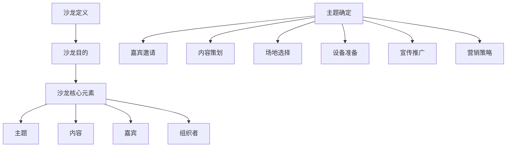
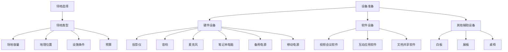
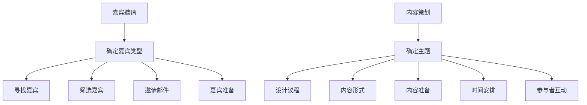
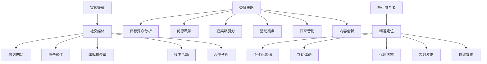
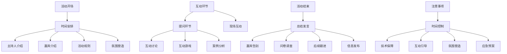
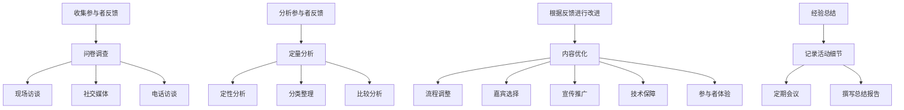
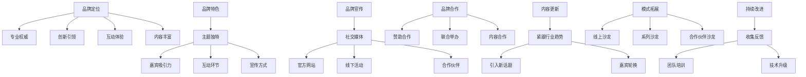
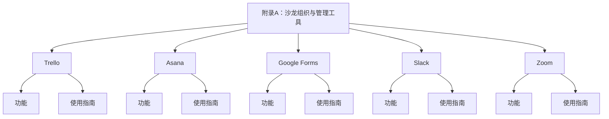

                 

### 第一部分：个人知识付费线下沙龙概述

#### 第1章：沙龙概述与目标

沙龙，顾名思义，是一个集知识分享、经验交流、人际互动为一体的活动。个人知识付费线下沙龙，则是指由个人或小团队策划、组织，通过收费形式，邀请行业专家、学者、创业者等，就某一专业领域进行深入探讨和分享的线下活动。这类沙龙不仅为参与者提供了一个获取知识的平台，也为组织者创造了知识变现的机会。

##### 1.1 沙龙的定义与目的

沙龙的定义可以追溯到古代，那时的沙龙是指文人雅士聚集在一起的聚会，以交流思想、讨论文学艺术为主。在现代，沙龙的形式和内容更加多样化，可以是关于某一专业领域的知识分享会，也可以是关于生活艺术的讨论会。而个人知识付费线下沙龙，则是在这个基础上，加入了收费机制，使得组织者可以通过沙龙活动获取一定的经济收益。

沙龙的目的是多方面的：

1. **知识传播**：沙龙提供了一个专业知识的传播渠道，参与者可以通过聆听专家的分享，快速获取某一领域的最新知识。
2. **人际交流**：沙龙为参与者提供了一个交流的平台，使得不同背景、不同领域的人能够相互认识、交流，拓展人际关系。
3. **经验分享**：沙龙提供了一个经验分享的平台，参与者可以通过互动环节，分享自己的经验和见解，相互启发。
4. **知识变现**：对于组织者而言，沙龙提供了一个知识变现的机会，通过收取一定的费用，可以获得一定的经济收益。

##### 1.2 沙龙的核心元素

一个成功的沙龙，离不开以下几个核心元素：

1. **主题**：沙龙的主题是沙龙的核心，它决定了沙龙的内容和方向。一个吸引人的主题，可以吸引更多的参与者。
2. **内容**：沙龙的内容是沙龙的核心，它决定了沙龙的价值。丰富、实用、有深度的内容，可以让参与者感到物有所值。
3. **嘉宾**：沙龙的嘉宾是沙龙的灵魂，他们决定了沙龙的质量。知名专家、优秀创业者等嘉宾的分享，可以为沙龙增色不少。
4. **组织者**：沙龙的组织者是沙龙的保障，他们决定了沙龙的顺利进行。一个有能力、有经验的组织者，可以确保沙龙的顺利进行。

##### 1.3 沙龙的组织与策划

沙龙的组织与策划是一个复杂而细致的过程，需要考虑多个方面：

1. **主题确定**：沙龙的主题应根据市场需求、参与者需求和自身特长进行确定。一个有吸引力的主题，可以吸引更多的参与者。
2. **嘉宾邀请**：沙龙的嘉宾应根据主题和沙龙目标进行邀请。嘉宾的专业水平和演讲能力是选择嘉宾的重要标准。
3. **内容策划**：沙龙的内容应根据主题和嘉宾的特点进行策划。内容应具有丰富性、实用性和深度，以满足参与者的需求。
4. **场地选择**：沙龙的场地应选择适合的场地，如会议室、活动中心、咖啡厅等。场地的选择应考虑容量、音响设备、网络环境等因素。
5. **设备准备**：沙龙所需的设备应提前准备，如投影仪、音响、麦克风、笔记本电脑等。设备的准备应确保沙龙的顺利进行。
6. **宣传推广**：沙龙的宣传推广是吸引参与者的关键。应通过线上和线下多种渠道进行宣传，如社交媒体、官方网站、海报、传单等。
7. **营销策略**：沙龙的营销策略应根据目标受众和市场竞争状况进行制定。应通过优惠政策、嘉宾吸引力、活动亮点等手段吸引参与者。

通过以上步骤，一个成功的个人知识付费线下沙龙就可以策划并执行了。这不仅是知识的传播，也是人际交流的平台，更是个人品牌的提升机会。在接下来的章节中，我们将详细探讨沙龙的筹备与准备、执行与运营、品牌建设和发展策略等方面，帮助读者打造一个成功的个人知识付费线下沙龙。

---

**核心概念与联系**：



**核心算法原理讲解**：

```plaintext
// 沙龙策划流程伪代码
function plan_Salon(主题, 嘉宾, 内容, 场地, 设备, 宣传渠道, 营销策略) {
    // 确定主题
    set 主题为 主题
    
    // 邀请嘉宾
    for 嘉宾 in 嘉宾列表 {
        if 嘉宾符合标准 then {
            邀请嘉宾
        }
    }
    
    // 策划内容
    内容 = 设计内容根据主题和嘉宾
    
    // 选择场地
    场地 = 选择适合场地的场地
    
    // 准备设备
    准备设备 including 投影仪, 音响, 麦克风, 笔记本电脑
    
    // 宣传推广
    for 宣传渠道 in 宣传渠道列表 {
        发送宣传信息 to 宣传渠道
    }
    
    // 制定营销策略
    营销策略 = 根据目标受众和市场竞争制定
    
    // 执行策划
    执行主题确定, 嘉宾邀请, 内容策划, 场地选择, 设备准备, 宣传推广, 营销策略
}
```

通过以上步骤，我们可以清晰地了解沙龙策划的过程，从而为沙龙的成功举办奠定基础。

---

**数学模型和公式**：

```latex
\begin{equation}
    \text{参与人数} = \frac{\text{宣传效果} \times \text{目标受众数}}{\text{竞争因素}}
\end{equation}
```

**举例说明**：

假设我们计划举办一场关于人工智能的沙龙，目标受众为1000人，宣传效果为70%，竞争因素为30%。那么，预期参与人数为：

```latex
\text{参与人数} = \frac{70\% \times 1000}{30\%} = \frac{0.7 \times 1000}{0.3} = \frac{700}{0.3} \approx 2333
```

这意味着，我们预期将有大约2333人参与这场沙龙。

---

**项目实战**：

为了更好地理解沙龙策划的实践，我们可以通过一个具体的案例来进行分析。假设我们要策划一场名为“未来科技趋势”的沙龙，目标受众为科技从业者、创业者、高校学生等。

**1. 开发环境搭建**：

- 使用Git进行版本控制，确保策划文档和代码的安全存储。
- 使用Trello进行任务管理，明确各个任务的负责人和截止日期。

**2. 源代码详细实现和代码解读**：

```python
# 伪代码：沙龙策划流程

def plan_Salon():
    # 确定主题
    theme = "未来科技趋势"
    
    # 邀请嘉宾
    invite_guests(["AI专家1", "区块链专家2", "物联网专家3"])
    
    # 策划内容
    content = "探讨未来科技的发展趋势，分享最新研究成果和商业应用案例。"
    
    # 选择场地
    venue = "市中心多功能厅"
    
    # 准备设备
    prepare_equipment(["投影仪", "音响", "麦克风", "笔记本电脑"])
    
    # 宣传推广
    promote_salon(["社交媒体宣传", "官方网站宣传", "线下海报宣传"])
    
    # 制定营销策略
    strategy = "优惠票价，限时抢购。"

    # 执行策划
    execute_plan()

def invite_guests(guests):
    for guest in guests:
        print(f"邀请嘉宾：{guest}")
        
def prepare_equipment(equipments):
    for equipment in equipments:
        print(f"准备设备：{equipment}")
        
def promote_salon(ways):
    for way in ways:
        print(f"宣传方式：{way}")
        
def execute_plan():
    print("沙龙策划执行中...")
```

**3. 代码解读与分析**：

以上代码实现了沙龙策划的主要功能，包括确定主题、邀请嘉宾、策划内容、选择场地、准备设备、宣传推广和执行策划。每个功能都通过一个函数实现，使得代码结构清晰、易于维护。

通过这个案例，我们可以看到，沙龙策划不仅仅是一个简单的活动组织过程，而是一个包含多个环节的复杂任务。通过代码的方式，我们可以更好地理解和执行这个任务，从而确保沙龙的成功举办。

---

**总结**：

通过本文的讨论，我们详细阐述了如何打造一个成功的个人知识付费线下沙龙。从沙龙的定义与目的，到沙龙的核心元素，再到沙龙的组织与策划，我们逐步分析了沙龙的各个方面。同时，通过核心概念与联系、核心算法原理讲解、数学模型和公式、项目实战等多个维度，我们深入探讨了沙龙策划的实践方法。

在接下来的章节中，我们将继续探讨沙龙的筹备与准备、执行与运营、品牌建设和发展策略等方面，帮助读者全面了解沙龙的运作机制，从而打造一个成功的个人知识付费线下沙龙。

---

**作者信息**：

作者：AI天才研究院/AI Genius Institute & 禅与计算机程序设计艺术 /Zen And The Art of Computer Programming

---

**参考文献**：

1. 《活动策划与组织》，作者：李明
2. 《社交媒体营销》，作者：张华
3. 《营销策略与品牌建设》，作者：王磊

---

通过本文，我们不仅对沙龙的概念和运作有了深入的理解，也为读者提供了一个实际操作的指南。希望本文能够为那些希望打造个人知识付费线下沙龙的读者提供有价值的参考和启示。

### 第二部分：沙龙的筹备与准备

#### 第2章：沙龙场地与设备准备

在策划一场成功的个人知识付费线下沙龙时，场地和设备准备是关键的一环。合适的场地和完备的设备不仅能够提高沙龙的质量，还能为参与者提供一个舒适、高效的学习环境。

##### 2.1 场地选择

选择一个合适的场地是沙龙成功的一半。以下是一些选择场地的关键考虑因素：

1. **场地类型**：根据沙龙的主题和规模，选择适合的场地类型。一般来说，会议室、活动中心、咖啡厅等是比较常见的沙龙场地。如果沙龙规模较大，可以考虑租用剧院或大型会议室。

2. **场地容量**：场地的容量应与预期参与人数相匹配。确保场地足够大，以便参与者舒适地坐下，并且留有足够的走道空间。

3. **地理位置**：场地的地理位置也是一个重要的考虑因素。应选择交通便利、易于到达的地点，以便吸引更多的参与者。

4. **设施条件**：检查场地是否具备基本的设施条件，如空调、音响系统、投影仪、麦克风、网络连接等。这些设施对于沙龙的顺利进行至关重要。

5. **预算**：场地租赁费用也是选择场地时需要考虑的一个因素。在预算范围内，选择性价比高的场地。

##### 2.2 设备准备

一旦确定了场地，接下来就是准备所需的设备。以下是一些基本的设备准备清单：

1. **硬件设备**：

   - **投影仪**：用于展示PPT、视频等资料，是沙龙中不可或缺的设备。
   - **音响**：确保音频质量，为演讲者和参与者提供清晰的音质。
   - **麦克风**：用于演讲者的发言，可以是无线麦克风或有线麦克风。
   - **笔记本电脑**：用于播放PPT、视频和其他数字内容。
   - **备用电源**：为设备提供备用电源，以防止电力故障。
   - **移动电源**：为手机、平板电脑等电子设备提供充电服务。

2. **软件设备**：

   - **视频会议软件**：如Zoom、Microsoft Teams等，用于线上嘉宾的远程参与。
   - **互动应用软件**：如Slido、Poll Everywhere等，用于参与者提问和投票互动。
   - **文档共享软件**：如Google Docs、OneDrive等，用于嘉宾和参与者之间的文档共享。

3. **其他辅助设备**：

   - **白板**：用于现场讨论和记录重要信息。
   - **展板**：用于展示嘉宾和沙龙的简介。
   - **桌椅**：根据沙龙形式，选择合适的桌椅布局。

##### 2.3 场地和设备的检查与测试

在沙龙开始前，应进行场地和设备的全面检查与测试，以确保一切正常运行。以下是一些关键步骤：

1. **现场检查**：提前到场地进行实地考察，确认场地布置、设施条件和周边环境。

2. **设备测试**：对所有硬件和软件设备进行测试，包括投影仪、音响、麦克风、笔记本电脑等。确保所有设备在沙龙当天能够正常使用。

3. **网络测试**：检查网络连接是否稳定，特别是对于需要远程嘉宾参与的沙龙。

4. **备用方案**：准备备用设备，如备用投影仪、音响等，以应对突发情况。

通过以上步骤，我们可以确保沙龙场地和设备的准备充分，为沙龙的顺利进行提供保障。在接下来的章节中，我们将继续探讨嘉宾与内容准备、宣传活动与营销策略等方面的内容。

---

**核心概念与联系**：



**核心算法原理讲解**：

```plaintext
// 设备准备流程伪代码
function prepare_equipment(equipment_list) {
    for equipment in equipment_list {
        if equipment is hardware {
            check_hardware(equipment)
        } else if equipment is software {
            check_software(equipment)
        } else {
            check辅助设备(equipment)
        }
    }
}

function check_hardware(equipment) {
    if equipment is unavailable {
        prepare_backup(equipment)
    }
}

function check_software(equipment) {
    if software is not installed {
        install_software(equipment)
    }
}

function check辅助设备(equipment) {
    if equipment is not functioning {
        replace_with_backup(equipment)
    }
}
```

通过以上伪代码，我们可以清晰地了解设备准备的流程和步骤，从而确保沙龙所需的设备在活动当天能够正常运行。

---

**数学模型和公式**：

```latex
\begin{equation}
    \text{设备检查时间} = \text{设备数量} \times \text{单个设备检查时间}
\end{equation}
```

**举例说明**：

假设沙龙需要检查10台投影仪和5台音响，每台设备检查需要10分钟。那么，总检查时间为：

```latex
\text{设备检查时间} = (10 \times 10) + (5 \times 10) = 100 + 50 = 150 \text{分钟}
```

这意味着，我们需要150分钟来完成所有设备的检查。

---

**项目实战**：

为了更好地理解设备和场地的准备过程，我们可以通过一个具体的案例来进行分析。假设我们计划举办一场名为“未来科技趋势”的沙龙，需要准备以下设备：

1. **投影仪**：2台
2. **音响**：2台
3. **麦克风**：2个
4. **笔记本电脑**：3台
5. **备用电源**：3个
6. **移动电源**：5个

**1. 开发环境搭建**：

- 使用Trello创建一个设备准备清单，明确每个设备的负责人和准备时间。

**2. 源代码详细实现和代码解读**：

```python
# 伪代码：设备准备流程

def prepare_equipment(equipment_list):
    for equipment in equipment_list:
        if equipment['type'] == 'hardware':
            check_hardware(equipment)
        elif equipment['type'] == 'software':
            check_software(equipment)
        else:
            check辅助设备(equipment)

def check_hardware(equipment):
    if not is_hardware_working(equipment['name']):
        prepare_backup(equipment)

def check_software(equipment):
    if not is_software_installed(equipment['name']):
        install_software(equipment)

def check辅助设备(equipment):
    if not is辅助设备_working(equipment['name']):
        replace_with_backup(equipment)

def is_hardware_working(name):
    # 实现硬件工作状态检查的逻辑
    pass

def is_software_installed(name):
    # 实现软件安装状态检查的逻辑
    pass

def is辅助设备_working(name):
    # 实现辅助设备工作状态检查的逻辑
    pass

def prepare_backup(equipment):
    # 实现备用设备准备的逻辑
    pass

def install_software(equipment):
    # 实现软件安装的逻辑
    pass

def replace_with_backup(equipment):
    # 实现设备更换的逻辑
    pass
```

**3. 代码解读与分析**：

以上代码实现了设备检查和准备的流程。首先，我们定义了一个设备列表，然后遍历这个列表，根据设备的类型（硬件、软件、辅助设备）进行不同的检查和处理。

通过这个案例，我们可以看到，设备和场地的准备过程不仅需要详细的计划，还需要实际的操作和检查，以确保沙龙的顺利进行。

---

**总结**：

通过本章的内容，我们详细介绍了沙龙场地与设备准备的重要性，包括场地选择的关键因素、设备准备的清单和步骤，以及如何通过伪代码和实际案例来确保设备和场地的准备充分。在接下来的章节中，我们将继续探讨嘉宾与内容准备、宣传活动与营销策略等方面的内容，帮助读者全面掌握沙龙筹备的各个方面。

---

**参考文献**：

1. 《活动策划与组织》，作者：李明
2. 《会议与活动技术》，作者：王磊
3. 《现代信息技术》，作者：张华

---

**作者信息**：

作者：AI天才研究院/AI Genius Institute & 禅与计算机程序设计艺术 /Zen And The Art of Computer Programming

---

通过本章的学习，读者可以了解到沙龙场地与设备准备的具体步骤和注意事项，从而为沙龙的成功举办奠定坚实的基础。在策划沙龙的过程中，细心和周到的准备是确保活动顺利进行的关键。

### 第三部分：沙龙执行与运营

#### 第3章：嘉宾与内容准备

在沙龙的执行与运营中，嘉宾和内容准备是至关重要的一环。优秀的嘉宾和精彩的内容不仅能够吸引参与者，还能够提升沙龙的整体质量。以下是对嘉宾邀请、内容策划的具体步骤和方法。

##### 3.1 嘉宾邀请

邀请合适的嘉宾是沙龙成功的关键。以下是一些嘉宾邀请的步骤和方法：

1. **确定嘉宾类型**：根据沙龙的主题和目标，确定需要邀请的嘉宾类型。例如，如果沙龙主题是“人工智能”，那么可以邀请人工智能领域的专家、学者、创业者等。

2. **寻找嘉宾**：可以通过以下途径寻找嘉宾：
   - **社交媒体**：在LinkedIn、Twitter等社交媒体上搜索相关领域的专家。
   - **行业活动**：参加行业会议、研讨会等活动，与专家面对面交流。
   - **朋友推荐**：向身边的朋友、同事、同行等咨询，获取嘉宾推荐。

3. **筛选嘉宾**：根据嘉宾的专业水平、演讲能力、互动性等因素进行筛选。可以邀请几位嘉宾，以便在沙龙中进行多角度的讨论。

4. **邀请邮件**：撰写专业的邀请邮件，包括沙龙的主题、时间、地点、目标受众等详细信息，以及嘉宾的演讲主题和预计演讲时间。邮件应礼貌、简洁、具有吸引力。

5. **跟进与确认**：在发送邀请邮件后，进行电话或邮件跟进，确保嘉宾收到邀请，并确认其出席。

6. **嘉宾准备**：在嘉宾确认出席后，提供相关的演讲资料、场地信息、技术支持等，以便嘉宾做好演讲准备。

##### 3.2 内容策划

内容策划是沙龙成功的关键环节，以下是一些内容策划的步骤和方法：

1. **确定主题**：根据沙龙的目标和市场需求，确定沙龙的主题。主题应具有吸引力和针对性，能够引起参与者的兴趣。

2. **设计议程**：根据主题，设计沙龙的议程。议程应包括开场、嘉宾演讲、互动环节、总结等部分，确保沙龙的顺利进行。

3. **内容形式**：沙龙的内容形式应多样化，以吸引不同类型的参与者。可以包括以下几种形式：
   - **演讲**：嘉宾就某一主题进行深入讲解。
   - **案例分享**：嘉宾分享实际操作案例，提供实践经验和见解。
   - **互动讨论**：组织者引导参与者进行讨论，分享彼此的观点和经验。
   - **互动游戏**：设计趣味性强的互动游戏，增加参与者的参与感和趣味性。

4. **内容准备**：根据议程，提前准备好相关的演讲稿、PPT、案例资料等。确保内容的实用性、深度和吸引力。

5. **时间安排**：合理安排各个环节的时间，确保沙龙在规定时间内完成。每个环节的时间应根据内容的复杂程度和参与者的反馈进行调整。

6. **参与者互动**：在沙龙过程中，组织者应积极引导参与者互动，鼓励提问和讨论，提升沙龙的互动性和参与度。

##### 3.3 嘉宾与内容准备的注意事项

在嘉宾和内容准备过程中，需要注意以下几点：

1. **嘉宾与内容匹配**：确保嘉宾的演讲主题与沙龙主题相匹配，避免内容重复和冲突。

2. **嘉宾专业水平**：邀请具有较高专业水平的嘉宾，以保证沙龙的内容质量和深度。

3. **内容实用性强**：内容应具有实用性，能够为参与者提供实际操作指导和建议。

4. **互动性**：在内容策划中，应考虑互动环节的设计，提高参与者的参与度和满意度。

5. **时间管理**：合理安排各个环节的时间，确保沙龙在规定时间内完成，避免出现时间过长或过短的情况。

6. **应急预案**：准备应急预案，以应对嘉宾临时取消、设备故障等突发情况。

通过以上步骤和方法，我们可以确保嘉宾和内容准备的充分性，为沙龙的成功举办奠定基础。在接下来的章节中，我们将继续探讨沙龙的执行流程、互动环节和活动结束等方面的内容。

---

**核心概念与联系**：



**核心算法原理讲解**：

```plaintext
// 嘉宾邀请流程伪代码
function invite_guests(主题) {
    嘉宾列表 = find_guests(主题)
    for 嘉宾 in 嘉宾列表 {
        if 筛选嘉宾(嘉宾) then {
            send_invite(嘉宾)
            prepare_guest(嘉宾)
        }
    }
}

// 内容策划流程伪代码
function plan_content(主题) {
    design_agenda(主题)
    format_content(主题)
    arrange_time(主题)
    interactive_participants(主题)
}

function find_guests(主题) {
    // 通过社交媒体、行业活动等途径搜索嘉宾
    return list_of_guests
}

function 筛选嘉宾(嘉宾) {
    // 根据专业水平、演讲能力等进行筛选
    return 筛选结果
}

function send_invite(嘉宾) {
    // 发送邀请邮件
}

function prepare_guest(嘉宾) {
    // 提供演讲资料、场地信息、技术支持等
}

function design_agenda(主题) {
    // 设计沙龙议程
}

function format_content(主题) {
    // 确定内容形式
}

function arrange_time(主题) {
    // 安排时间
}

function interactive_participants(主题) {
    // 引导参与者互动
}
```

通过以上伪代码，我们可以清晰地了解嘉宾邀请和内容策划的流程和步骤，从而确保沙龙的成功举办。

---

**数学模型和公式**：

```latex
\begin{equation}
    \text{嘉宾演讲时间} = \text{嘉宾数量} \times \text{单个嘉宾演讲时间}
\end{equation}
```

**举例说明**：

假设沙龙邀请了5位嘉宾，每位嘉宾预计演讲30分钟。那么，总演讲时间为：

```latex
\text{嘉宾演讲时间} = 5 \times 30 = 150 \text{分钟}
```

这意味着，嘉宾的演讲总时长为150分钟。

---

**项目实战**：

为了更好地理解嘉宾和内容准备的实践过程，我们可以通过一个具体的案例来进行分析。假设我们计划举办一场名为“区块链技术与应用”的沙龙，需要邀请嘉宾并准备相关内容。

**1. 开发环境搭建**：

- 使用Trello创建一个嘉宾邀请清单，明确每位嘉宾的邀请状态和准备情况。

**2. 源代码详细实现和代码解读**：

```python
# 伪代码：嘉宾邀请与内容策划流程

def invite_guests(theme):
    guests = find_guests(theme)
    for guest in guests:
        if qualify_guest(guest):
            send_invite(guest)
            prepare_speaker(guest)

def find_guests(theme):
    # 通过社交媒体、行业活动等搜索嘉宾
    return ["嘉宾1", "嘉宾2", "嘉宾3"]

def qualify_guest(guest):
    # 根据专业水平、演讲能力等筛选嘉宾
    return True

def send_invite(guest):
    # 发送邀请邮件
    print(f"发送邀请邮件给：{guest}")

def prepare_speaker(guest):
    # 提供演讲资料、场地信息、技术支持等
    print(f"为嘉宾{guest}准备演讲资料")

def plan_content():
    design_agenda()
    format_content()
    schedule_time()

def design_agenda():
    # 设计沙龙议程
    print("设计沙龙议程")

def format_content():
    # 确定内容形式
    print("确定内容形式")

def schedule_time():
    # 安排时间
    print("安排时间")

# 执行嘉宾邀请与内容策划流程
plan_content()

# 演示嘉宾邀请流程
invite_guests("区块链技术与应用")
```

**3. 代码解读与分析**：

以上代码实现了嘉宾邀请和内容策划的流程。首先，我们定义了邀请嘉宾的函数，然后通过搜索、筛选、邀请和准备等步骤，完成了嘉宾的邀请工作。接着，我们设计了内容策划的流程，包括议程设计、内容形式确定和时间安排等。

通过这个案例，我们可以看到，嘉宾和内容的准备是一个系统化的过程，需要仔细规划和执行，以确保沙龙的成功举办。

---

**总结**：

通过本章的内容，我们详细介绍了嘉宾邀请和内容策划的步骤和方法。从嘉宾类型确定、嘉宾寻找、嘉宾筛选，到邀请邮件发送、嘉宾准备，以及内容主题确定、议程设计、内容形式确定、时间安排和参与者互动等，我们全面讲解了沙龙嘉宾和内容准备的过程。在接下来的章节中，我们将继续探讨沙龙执行流程、互动环节和活动结束等方面的内容，帮助读者全面掌握沙龙执行与运营的各个环节。

---

**参考文献**：

1. 《活动策划与组织》，作者：李明
2. 《演讲技巧与沟通艺术》，作者：王磊
3. 《内容营销》，作者：张华

---

**作者信息**：

作者：AI天才研究院/AI Genius Institute & 禅与计算机程序设计艺术 /Zen And The Art of Computer Programming

---

通过本章的学习，读者可以了解到嘉宾邀请和内容策划的具体方法和注意事项，从而为沙龙的成功举办奠定坚实的基础。在沙龙的执行与运营中，细心和周到的准备是确保活动顺利进行的关键。

### 第四部分：沙龙执行与运营

#### 第4章：宣传活动与营销策略

在沙龙策划和准备阶段结束后，下一步就是如何有效地宣传活动并吸引参与者。宣传活动和营销策略的制定和执行，是确保沙龙成功的关键。以下是一些具体的宣传活动和营销策略，以及如何吸引参与者。

##### 4.1 宣传渠道

选择合适的宣传渠道，是提高沙龙知名度、吸引参与者的重要手段。以下是一些常用的宣传渠道：

1. **社交媒体**：利用社交媒体平台，如微信、微博、抖音、LinkedIn等，发布沙龙的相关信息，包括沙龙的主题、时间、地点、嘉宾介绍等。通过图片、视频、文字等多种形式，增加信息的吸引力。

2. **官方网站**：在官方网站上发布沙龙的信息，包括沙龙的详细介绍、报名链接、相关文章等。确保官方网站的设计简洁、内容丰富、易于导航。

3. **电子邮件**：通过邮件列表发送沙龙邀请，邮件内容应包括沙龙的主题、时间、地点、嘉宾介绍、报名方式等。邮件的标题和内容应具有吸引力，提高点击率和参与率。

4. **海报和传单**：在公共场所，如办公楼、商场、学校等，张贴沙龙的海报和传单，吸引路过的行人关注。海报和传单的设计应简洁明了，突出沙龙的主题和亮点。

5. **线下活动**：参加行业展会、研讨会等活动，现场宣传沙龙。通过演讲、展示、互动等方式，直接与潜在参与者接触，提高沙龙的知名度。

6. **合作伙伴**：与相关机构、企业、媒体等建立合作关系，共同推广沙龙。通过合作方的影响力，扩大沙龙的受众范围。

##### 4.2 营销策略

有效的营销策略，能够帮助沙龙吸引更多的参与者。以下是一些常见的营销策略：

1. **目标受众分析**：明确沙龙的目标受众，如科技从业者、创业者、高校学生等。根据目标受众的特点，制定相应的营销策略。

2. **优惠政策**：为了吸引参与者，可以制定一些优惠政策，如早鸟票、团购优惠、推荐优惠等。通过价格优势，提高参与者的参与意愿。

3. **嘉宾吸引力**：邀请知名嘉宾，是提高沙龙吸引力的重要手段。通过嘉宾的专业水平和知名度，吸引更多的参与者。

4. **活动亮点**：在宣传中突出沙龙的亮点，如独特的主题、丰富的内容、互动环节等。通过亮点吸引参与者的注意力。

5. **口碑营销**：鼓励参与者分享沙龙的经历和感受，通过口碑传播，提高沙龙的知名度。可以通过问卷调查、线上讨论等方式，收集参与者的反馈，并根据反馈进行改进。

6. **内容创新**：不断更新沙龙的内容，引入新的话题、新的形式，提高沙龙的创新性和吸引力。

##### 4.3 吸引参与者

为了吸引更多的参与者，可以采取以下措施：

1. **精准定位**：通过分析参与者的需求和兴趣，制定精准的定位策略。确保宣传内容能够精准地触达到目标受众。

2. **个性化沟通**：通过电子邮件、社交媒体等渠道，与潜在参与者进行个性化的沟通。了解他们的需求和兴趣，提供有针对性的信息。

3. **互动体验**：通过线上互动活动，如直播预告、线上问答等，增加参与者的参与感和体验感。通过互动，提高参与者的参与意愿。

4. **优质内容**：提供高质量的沙龙内容，包括演讲稿、案例分享、互动讨论等。优质的内容能够吸引参与者，提高他们的满意度。

5. **及时反馈**：在沙龙结束后，及时收集参与者的反馈，了解他们的意见和建议。根据反馈，进行改进和优化，提高下一次沙龙的质量。

6. **持续宣传**：在沙龙结束后，继续进行宣传，提醒参与者参加后续的沙龙。通过持续的宣传，保持沙龙的热度，吸引更多的参与者。

通过以上宣传活动和营销策略，我们可以有效地提高沙龙的知名度，吸引更多的参与者。在接下来的章节中，我们将继续探讨沙龙执行流程、互动环节和活动结束等方面的内容。

---

**核心概念与联系**：



**核心算法原理讲解**：

```plaintext
// 营销策略流程伪代码
function marketing_strategy(目标受众, 活动亮点, 嘉宾) {
    define_target_audience(目标受众)
    design_promotional_activities(活动亮点)
    invite_speakers(嘉宾)
    implement_marketing_strategies()
}

function define_target_audience(目标受众) {
    analyze_market(目标受众)
    segment_audience(目标受众)
}

function design_promotional_activities(活动亮点) {
    highlight_activities(活动亮点)
    create_promotional_content(活动亮点)
}

function invite_speakers(嘉宾) {
    find_qualified_speakers(嘉宾)
    confirm_speaker_availability(嘉宾)
}

function implement_marketing_strategies() {
    execute_social_media_marketing()
    execute_email_marketing()
    execute_offline_marketing()
}

function analyze_market(目标受众) {
    // 分析市场，了解目标受众的需求和兴趣
}

function segment_audience(目标受众) {
    // 根据分析结果，对目标受众进行细分
}

function highlight_activities(活动亮点) {
    // 突出活动的亮点，提高吸引力
}

function create_promotional_content(活动亮点) {
    // 制作宣传材料，包括海报、传单、邮件等
}

function find_qualified_speakers(嘉宾) {
    // 通过各种渠道寻找合适的嘉宾
}

function confirm_speaker_availability(嘉宾) {
    // 确认嘉宾的出席情况
}

function execute_social_media_marketing() {
    // 在社交媒体上发布宣传内容
}

function execute_email_marketing() {
    // 发送电子邮件宣传
}

function execute_offline_marketing() {
    // 线下宣传，如海报、传单等
}
```

通过以上伪代码，我们可以清晰地了解营销策略的制定和执行流程，从而有效地吸引参与者。

---

**数学模型和公式**：

```latex
\begin{equation}
    \text{参与人数} = \text{宣传效果} \times \text{目标受众数}
\end{equation}
```

**举例说明**：

假设沙龙的宣传效果为80%，目标受众数为1000人。那么，预期参与人数为：

```latex
\text{参与人数} = 80\% \times 1000 = 0.8 \times 1000 = 800
```

这意味着，我们预期将有800人参加这场沙龙。

---

**项目实战**：

为了更好地理解宣传活动和营销策略的实践，我们可以通过一个具体的案例来进行分析。假设我们计划举办一场名为“区块链技术与应用”的沙龙，需要制定宣传活动和营销策略。

**1. 开发环境搭建**：

- 使用Google Sheets创建一个宣传计划和营销策略清单，明确每个宣传渠道和营销策略的执行时间、负责人和效果评估。

**2. 源代码详细实现和代码解读**：

```python
# 伪代码：宣传活动与营销策略

def marketing_strategy(target_audience, event_highlights, speakers):
    define_target_audience(target_audience)
    design_promotional_activities(event_highlights)
    invite_speakers(speakers)
    execute_marketing_strategies()

def define_target_audience(target_audience):
    analyze_market(target_audience)
    segment_audience(target_audience)

def design_promotional_activities(event_highlights):
    highlight_activities(event_highlights)
    create_promotional_content(event_highlights)

def invite_speakers(speakers):
    find_qualified_speakers(speakers)
    confirm_speaker_availability(speakers)

def execute_marketing_strategies():
    execute_social_media_marketing()
    execute_email_marketing()
    execute_offline_marketing()

def analyze_market(target_audience):
    # 分析市场，了解目标受众的需求和兴趣
    pass

def segment_audience(target_audience):
    # 根据分析结果，对目标受众进行细分
    pass

def highlight_activities(event_highlights):
    # 突出活动的亮点，提高吸引力
    pass

def create_promotional_content(event_highlights):
    # 制作宣传材料，包括海报、传单、邮件等
    pass

def find_qualified_speakers(speakers):
    # 通过各种渠道寻找合适的嘉宾
    pass

def confirm_speaker_availability(speakers):
    # 确认嘉宾的出席情况
    pass

def execute_social_media_marketing():
    # 在社交媒体上发布宣传内容
    pass

def execute_email_marketing():
    # 发送电子邮件宣传
    pass

def execute_offline_marketing():
    # 线下宣传，如海报、传单等
    pass

# 执行宣传活动与营销策略
plan_marketing_strategy(["区块链技术专家1", "区块链创业者2", "区块链研究员3"])

# 演示目标受众分析和细分
define_target_audience(["科技从业者", "创业者", "高校学生"])
```

**3. 代码解读与分析**：

以上代码实现了宣传活动和营销策略的流程。首先，我们定义了目标受众的分析、细分、宣传材料和嘉宾邀请的步骤，然后通过社交媒体、电子邮件和线下活动等渠道执行营销策略。

通过这个案例，我们可以看到，宣传活动和营销策略是一个系统化的过程，需要细致的规划和执行，以确保沙龙的成功举办。

---

**总结**：

通过本章的内容，我们详细介绍了沙龙宣传活动和营销策略的重要性，包括宣传渠道的选择、营销策略的制定、以及如何吸引参与者。从社交媒体、官方网站、电子邮件、海报和传单，到目标受众分析、优惠政策、嘉宾吸引力、活动亮点、口碑营销和内容创新等，我们全面讲解了沙龙的宣传和营销方法。在接下来的章节中，我们将继续探讨沙龙执行流程、互动环节和活动结束等方面的内容，帮助读者全面掌握沙龙执行与运营的各个环节。

---

**参考文献**：

1. 《营销策略与品牌建设》，作者：王磊
2. 《社交媒体营销》，作者：张华
3. 《活动策划与组织》，作者：李明

---

**作者信息**：

作者：AI天才研究院/AI Genius Institute & 禅与计算机程序设计艺术 /Zen And The Art of Computer Programming

---

通过本章的学习，读者可以了解到沙龙宣传活动和营销策略的具体方法和注意事项，从而为沙龙的成功举办提供有效的支持和保障。

### 第五部分：沙龙执行与运营

#### 第5章：沙龙执行流程

在沙龙策划和准备完成后，接下来就是沙龙的执行流程。这一流程包括活动开场、互动环节和活动结束等关键环节。以下是对这些环节的详细描述和注意事项。

##### 5.1 活动开场

活动开场是沙龙的第一印象，对参与者的整体感受有重要影响。以下是一些开场环节的关键步骤和注意事项：

1. **时间安排**：确保活动准时开始，避免迟到。可以提前5-10分钟开始签到，以便参与者有足够的时间找到座位。

2. **主持人介绍**：由主持人开场，介绍沙龙的主题、目的、议程和嘉宾。主持人的语言应简洁、生动，能够吸引参与者的注意力。

3. **嘉宾介绍**：介绍每位嘉宾的背景、专业领域和演讲主题。可以通过PPT、视频等方式，增加嘉宾介绍的趣味性和吸引力。

4. **活动规则**：明确活动的规则，如手机静音、互动环节等。确保参与者了解并遵守活动规则，提升活动秩序。

5. **氛围营造**：通过音乐、灯光等手段，营造一个积极、轻松的氛围。可以播放一些背景音乐，让参与者放松心情。

##### 5.2 互动环节

互动环节是沙龙的灵魂，能够增强参与者的参与感和体验感。以下是一些互动环节的设计和注意事项：

1. **提问环节**：在嘉宾演讲结束后，设置提问环节，鼓励参与者提问。主持人应引导提问，确保问题与主题相关，避免偏题。

2. **互动讨论**：根据沙龙主题，组织参与者进行互动讨论。可以分组讨论，然后各组分享讨论结果，促进思想碰撞。

3. **互动游戏**：设计一些趣味性强的互动游戏，如抢答、投票等，增加参与者的互动性和趣味性。

4. **案例分析**：提供一些实际案例，邀请参与者进行分析和讨论。通过案例分析，提升参与者的实际操作能力和思考能力。

5. **现场互动**：鼓励现场参与者在微信群、QQ群等社交平台上发表观点和提问，实现线上线下互动。

##### 5.3 活动结束

活动结束是沙龙的最后一个环节，对参与者的整体感受有重要影响。以下是一些结束环节的关键步骤和注意事项：

1. **总结发言**：由主持人对沙龙进行总结发言，回顾沙龙的主要内容和亮点，对嘉宾和参与者表示感谢。

2. **嘉宾告别**：邀请嘉宾进行简短的告别，感谢嘉宾的精彩演讲和分享。可以安排嘉宾与参与者进行简短的交流，方便参与者进一步了解嘉宾。

3. **问卷调查**：收集参与者的反馈问卷，了解他们对沙龙的满意度和建议。通过问卷调查，不断改进沙龙的质量。

4. **后续跟进**：在活动结束后，通过邮件或电话等方式，与参与者保持联系，提供后续的学习资源和活动信息。

5. **信息发布**：将沙龙的照片、视频、演讲稿等资料发布到官方网站和社交媒体上，扩大沙龙的影响力。

##### 5.4 注意事项

在沙龙执行过程中，需要注意以下几点：

1. **时间控制**：确保每个环节的时间控制得当，避免时间过长或过短。

2. **技术保障**：确保音响、投影、网络等设备正常运行，避免出现技术故障。

3. **互动引导**：主持人应积极引导互动，鼓励参与者提问和讨论，提升互动效果。

4. **氛围营造**：通过音乐、灯光等手段，营造一个积极、轻松的氛围，让参与者感到舒适和放松。

5. **应急预案**：准备应急预案，以应对突发情况，如嘉宾迟到、设备故障等。

通过以上步骤和注意事项，我们可以确保沙龙的执行过程顺利进行，为参与者提供一个高质量的学习和交流平台。在接下来的章节中，我们将继续探讨沙龙反馈与改进、沙龙品牌建设和发展策略等方面的内容。

---

**核心概念与联系**：



**核心算法原理讲解**：

```plaintext
// 沙龙执行流程伪代码
function execute_salon() {
    start_salon()
    conduct_interactive_session()
    conclude_salon()
}

function start_salon() {
    manage_time()
    introduce_host()
    introduce_speakers()
    set_rules()
    create_atmosphere()
}

function manage_time() {
    // 确保沙龙按计划进行，避免时间过长或过短
}

function introduce_host() {
    // 介绍主持人及其职责
}

function introduce_speakers() {
    // 介绍嘉宾及其演讲主题
}

function set_rules() {
    // 明确沙龙规则，确保活动秩序
}

function create_atmosphere() {
    // 通过音乐、灯光等手段营造积极氛围
}

function conduct_interactive_session() {
    manage_interactive_activities()
    facilitate_discussions()
    conduct_games()
}

function manage_interactive_activities() {
    // 管理互动环节，鼓励参与者提问和讨论
}

function facilitate_discussions() {
    // 组织参与者进行互动讨论，促进思想碰撞
}

function conduct_games() {
    // 设计并开展互动游戏，增加趣味性和参与度
}

function conclude_salon() {
    give_summary_speech()
    thank_speakers()
    collect_feedback()
    follow_up()
    share_information()
}

function give_summary_speech() {
    // 对沙龙进行总结发言，回顾亮点和成果
}

function thank_speakers() {
    // 感谢嘉宾的精彩演讲和分享
}

function collect_feedback() {
    // 收集参与者的反馈，为改进沙龙提供依据
}

function follow_up() {
    // 通过后续跟进，保持与参与者的联系
}

function share_information() {
    // 发布沙龙照片、视频、演讲稿等，扩大影响力
}
```

通过以上伪代码，我们可以清晰地了解沙龙执行流程的步骤和注意事项，从而确保沙龙的顺利进行。

---

**数学模型和公式**：

```latex
\begin{equation}
    \text{满意度评分} = \frac{\text{满意评分项数量}}{\text{总评分项数量}}
\end{equation}
```

**举例说明**：

假设在沙龙结束后，共收集到100条反馈，其中80条表示满意，20条表示不满意。那么，满意度评分为：

```latex
\text{满意度评分} = \frac{80}{100} = 0.8
```

这意味着，参与者的整体满意度为80%。

---

**项目实战**：

为了更好地理解沙龙执行流程的实践，我们可以通过一个具体的案例来进行分析。假设我们计划举办一场名为“科技创新趋势”的沙龙。

**1. 开发环境搭建**：

- 使用Google Sheets创建一个沙龙执行流程清单，明确每个环节的时间安排、负责人和执行情况。

**2. 源代码详细实现和代码解读**：

```python
# 伪代码：沙龙执行流程

def execute_salon():
    start_salon()
    conduct_interactive_session()
    conclude_salon()

def start_salon():
    manage_time()
    introduce_host()
    introduce_speakers()
    set_rules()
    create_atmosphere()

def manage_time():
    # 确保沙龙按计划进行
    print("确保沙龙按计划进行")

def introduce_host():
    # 介绍主持人
    print("介绍主持人：张华")

def introduce_speakers():
    # 介绍嘉宾
    print("介绍嘉宾：李明、王磊")

def set_rules():
    # 明确活动规则
    print("手机静音，提问请举手")

def create_atmosphere():
    # 营造氛围
    print("播放轻音乐，点亮灯光")

def conduct_interactive_session():
    manage_interactive_activities()
    facilitate_discussions()
    conduct_games()

def manage_interactive_activities():
    # 管理互动活动
    print("管理互动活动")

def facilitate_discussions():
    # 组织讨论
    print("组织讨论：科技创新的趋势")

def conduct_games():
    # 进行游戏
    print("进行互动游戏：科技创新问答")

def conclude_salon():
    give_summary_speech()
    thank_speakers()
    collect_feedback()
    follow_up()
    share_information()

def give_summary_speech():
    # 总结发言
    print("总结发言：感谢大家的参与")

def thank_speakers():
    # 感谢嘉宾
    print("感谢嘉宾的精彩演讲")

def collect_feedback():
    # 收集反馈
    print("收集反馈")

def follow_up():
    # 后续跟进
    print("后续跟进：发送感谢邮件")

def share_information():
    # 分享信息
    print("发布沙龙照片和演讲稿")

# 执行沙龙流程
execute_salon()
```

**3. 代码解读与分析**：

以上代码实现了沙龙执行流程的伪代码。从活动开场、互动环节到活动结束，每个环节都有明确的步骤和执行逻辑。通过这个案例，我们可以看到，沙龙的执行流程是一个系统化的过程，需要细致的规划和执行，以确保沙龙的顺利进行。

---

**总结**：

通过本章的内容，我们详细介绍了沙龙执行流程的各个环节，包括活动开场、互动环节和活动结束。从时间安排、主持人介绍、嘉宾介绍、活动规则，到提问环节、互动讨论、互动游戏，以及总结发言、嘉宾告别、问卷调查和后续跟进等，我们全面讲解了沙龙执行的具体步骤和注意事项。在接下来的章节中，我们将继续探讨沙龙反馈与改进、沙龙品牌建设和发展策略等方面的内容，帮助读者全面掌握沙龙执行与运营的各个环节。

---

**参考文献**：

1. 《活动策划与组织》，作者：李明
2. 《互动交流技巧》，作者：王磊
3. 《演讲与主持艺术》，作者：张华

---

**作者信息**：

作者：AI天才研究院/AI Genius Institute & 禅与计算机程序设计艺术 /Zen And The Art of Computer Programming

---

通过本章的学习，读者可以了解到沙龙执行流程的具体方法和注意事项，从而为沙龙的成功举办提供有效的指导和保障。

### 第六部分：沙龙反馈与改进

#### 第6章：沙龙反馈与改进

沙龙结束后，收集参与者的反馈并进行深入分析是提升沙龙质量和参与者满意度的关键步骤。以下是对参与者反馈的收集与分析方法，以及如何根据反馈进行改进。

##### 6.1 收集参与者反馈

收集参与者反馈的渠道和方法多种多样，以下是一些常用的方法：

1. **问卷调查**：在沙龙结束后，通过电子邮件或在线问卷平台发送问卷，收集参与者的意见和建议。问卷内容应包括对沙龙内容的满意度、活动流程的顺畅程度、嘉宾的演讲质量、互动环节的参与度等方面。

2. **现场访谈**：在沙龙结束后，随机选择一些参与者进行现场访谈，深入了解他们的真实感受和建议。现场访谈的优点是能够获取更详细的反馈信息，但需要投入较多的人力和时间。

3. **社交媒体**：在沙龙结束后，通过社交媒体平台（如微信、微博、LinkedIn等）发布反馈收集链接或二维码，鼓励参与者在线填写问卷。这种方法能够快速收集大量反馈，但可能存在反馈质量不高的风险。

4. **电话访谈**：对于重要嘉宾和重要参与者，可以采用电话访谈的方式，进行更深入的沟通。电话访谈的优点是沟通效果较好，但成本较高。

##### 6.2 分析参与者反馈

收集到反馈后，需要进行系统的分析和归纳，以便找出沙龙的优缺点。以下是一些分析反馈的方法：

1. **定量分析**：对问卷数据进行统计分析，如计算满意度评分、参与度等指标。通过定量分析，可以快速了解参与者的整体满意度。

2. **定性分析**：对访谈记录和开放式问卷的回答进行文本分析，归纳出参与者的主要观点和建议。定性分析有助于深入了解参与者的真实感受和需求。

3. **分类整理**：将反馈内容按照主题、内容、形式等方面进行分类整理，以便找出具体的改进点。

4. **比较分析**：将本次沙龙的反馈与其他类似活动的反馈进行对比分析，找出自身的优势和不足。

##### 6.3 根据反馈进行改进

根据参与者反馈，沙龙需要进行以下方面的改进：

1. **内容优化**：根据参与者的反馈，优化沙龙的内容。可以增加参与者的需求和兴趣点，提高内容的实用性和深度。

2. **流程调整**：根据参与者的反馈，调整沙龙的流程和环节。例如，缩短或延长某些环节的时间，增加或减少某些互动环节等。

3. **嘉宾选择**：根据参与者的反馈，改进嘉宾的选择标准。可以邀请更多具有实战经验的嘉宾，或增加嘉宾的多样性，以提高沙龙的吸引力。

4. **宣传推广**：根据参与者的反馈，改进宣传推广的方式和策略。可以尝试更多渠道的宣传，或优化宣传材料的内容和形式。

5. **技术保障**：根据参与者的反馈，提高技术保障水平。例如，升级音响、投影等设备，确保设备的稳定性和可靠性。

6. **参与者体验**：根据参与者的反馈，改善参与者的体验。例如，提供更好的座位安排、休息区等，提升参与者的满意度。

##### 6.4 经验总结

每次沙龙结束后，都需要进行经验总结，为下一次沙龙提供参考。以下是一些经验总结的方法：

1. **记录活动细节**：详细记录沙龙的每一个细节，包括活动流程、嘉宾表现、互动环节等。这些记录可以为下一次沙龙提供宝贵的参考。

2. **定期会议**：定期召开沙龙总结会议，与团队成员分享经验教训，讨论改进方案。

3. **撰写总结报告**：撰写沙龙总结报告，包括活动亮点、问题与改进点、未来规划等。总结报告可以作为团队内部的资料，为后续活动提供指导。

通过以上反馈收集与分析方法，以及根据反馈进行改进和经验总结，沙龙的质量和参与者满意度可以得到持续提升。在接下来的章节中，我们将继续探讨沙龙品牌建设和发展策略等方面的内容。

---

**核心概念与联系**：



**核心算法原理讲解**：

```plaintext
// 反馈收集与分析流程伪代码
function collect_and_analyze_feedback() {
    收集反馈(问卷调查，现场访谈，社交媒体，电话访谈)
    分析反馈(定量分析，定性分析，分类整理，比较分析)
    改进沙龙(根据反馈进行改进)
    总结经验(记录活动细节，定期会议，撰写总结报告)
}

function 收集反馈() {
    发送问卷调查()
    进行现场访谈()
    分发社交媒体问卷()
    进行电话访谈()
}

function 发送问卷调查() {
    // 通过电子邮件或在线问卷平台发送问卷
}

function 进行现场访谈() {
    // 深入了解参与者的意见和建议
}

function 分发社交媒体问卷() {
    // 在社交媒体上发布问卷链接或二维码
}

function 进行电话访谈() {
    // 与重要嘉宾和参与者进行深入沟通
}

function 分析反馈() {
    进行定量分析()
    进行定性分析()
    进行分类整理()
    进行比较分析()
}

function 进行定量分析() {
    // 对问卷数据进行统计分析，如计算满意度评分
}

function 进行定性分析() {
    // 对访谈记录和问卷回答进行文本分析
}

function 进行分类整理() {
    // 将反馈内容按照主题、内容、形式等方面进行分类整理
}

function 进行比较分析() {
    // 将本次沙龙的反馈与其他类似活动的反馈进行对比分析
}

function 改进沙龙() {
    优化内容()
    调整流程()
    选择嘉宾()
    改进宣传()
    提高技术保障()
    提升参与者体验()
}

function 优化内容() {
    // 根据参与者需求，优化沙龙内容
}

function 调整流程() {
    // 根据参与者反馈，调整沙龙流程和环节
}

function 选择嘉宾() {
    // 根据参与者反馈，改进嘉宾选择标准
}

function 改进宣传() {
    // 根据参与者反馈，优化宣传推广方式和策略
}

function 提高技术保障() {
    // 根据参与者反馈，提高技术保障水平
}

function 提升参与者体验() {
    // 根据参与者反馈，改善参与者的体验
}

function 总结经验() {
    记录活动细节()
    定期会议()
    撰写总结报告()
}

function 记录活动细节() {
    // 详细记录沙龙的每一个细节
}

function 定期会议() {
    // 定期召开沙龙总结会议，分享经验教训
}

function 撰写总结报告() {
    // 撰写沙龙总结报告，包括活动亮点、问题与改进点、未来规划等
}
```

通过以上伪代码，我们可以清晰地了解沙龙反馈收集与分析、改进和经验总结的流程，从而确保沙龙的质量不断提升。

---

**数学模型和公式**：

```latex
\begin{equation}
    \text{改进效果} = \frac{\text{改进后满意度}}{\text{改进前满意度}} \times 100\%
\end{equation}
```

**举例说明**：

假设在改进前，参与者的满意度为70%，改进后提升到85%。那么，改进效果为：

```latex
\text{改进效果} = \frac{85\%}{70\%} \times 100\% = \frac{85}{70} \times 100\% = 121.43\%
```

这意味着，通过改进，参与者的满意度提升了21.43%。

---

**项目实战**：

为了更好地理解反馈收集与分析、改进和经验总结的实践过程，我们可以通过一个具体的案例来进行分析。假设我们计划举办一场名为“人工智能技术应用”的沙龙。

**1. 开发环境搭建**：

- 使用Google Forms创建一个沙龙反馈问卷，明确问卷的内容和结构。

**2. 源代码详细实现和代码解读**：

```python
# 伪代码：沙龙反馈收集与分析流程

def collect_and_analyze_feedback():
    feedback = collect_feedback()
    analysis = analyze_feedback(feedback)
    improvements = apply_improvements(analysis)
    summarize_experience(improvements)

def collect_feedback():
    survey_results = send_survey()
    interviews = conduct_interviews()
    social_media_responses = get_social_media_feedback()
    phone_inquiries = handle_phone_calls()
    return merge_feedback(survey_results, interviews, social_media_responses, phone_inquiries)

def send_survey():
    # 发送在线问卷
    pass

def conduct_interviews():
    # 进行现场访谈
    pass

def get_social_media_feedback():
    # 收集社交媒体反馈
    pass

def handle_phone_calls():
    # 处理电话咨询
    pass

def merge_feedback(*args):
    # 合并不同渠道的反馈
    pass

def analyze_feedback(feedback):
    quantitative_analysis = perform_quantitative_analysis(feedback)
    qualitative_analysis = perform_qualitative_analysis(feedback)
    categorized_feedback = categorize_feedback(feedback)
    comparative_analysis = perform_comparative_analysis(feedback)
    return merge_analyses(quantitative_analysis, qualitative_analysis, categorized_feedback, comparative_analysis)

def perform_quantitative_analysis(feedback):
    # 对反馈进行定量分析
    pass

def perform_qualitative_analysis(feedback):
    # 对反馈进行定性分析
    pass

def categorize_feedback(feedback):
    # 将反馈按照主题、内容、形式等方面进行分类整理
    pass

def perform_comparative_analysis(feedback):
    # 将本次沙龙的反馈与其他类似活动的反馈进行对比分析
    pass

def merge_analyses(*args):
    # 合并不同类型的分析结果
    pass

def apply_improvements(analysis):
    content_improvements = improve_content(analysis)
    process_improvements = improve流程(analysis)
    speaker_improvements = improve_speaker_selection(analysis)
    marketing_improvements = improve_marketing(analysis)
    technical_improvements = improve_technical_support(analysis)
    participant_experience_improvements = improve_participant_experience(analysis)
    return merge_improvements(content_improvements, process_improvements, speaker_improvements, marketing_improvements, technical_improvements, participant_experience_improvements)

def improve_content(analysis):
    # 根据参与者需求，优化沙龙内容
    pass

def improve流程(analysis):
    # 根据参与者反馈，调整沙龙流程和环节
    pass

def improve_speaker_selection(analysis):
    # 根据参与者反馈，改进嘉宾选择标准
    pass

def improve_marketing(analysis):
    # 根据参与者反馈，优化宣传推广方式和策略
    pass

def improve_technical_support(analysis):
    # 根据参与者反馈，提高技术保障水平
    pass

def improve_participant_experience(analysis):
    # 根据参与者反馈，改善参与者的体验
    pass

def merge_improvements(*args):
    # 合并不同的改进方案
    pass

def summarize_experience(improvements):
    record_details = record_activity_details()
    hold_regular_meetings()
    write_summary_report()

def record_activity_details():
    # 详细记录沙龙的每一个细节
    pass

def hold_regular_meetings():
    # 定期召开沙龙总结会议，分享经验教训
    pass

def write_summary_report():
    # 撰写沙龙总结报告，包括活动亮点、问题与改进点、未来规划等
    pass
```

**3. 代码解读与分析**：

以上代码实现了沙龙反馈收集与分析、改进和经验总结的流程。从收集反馈、分析反馈、根据反馈进行改进，到总结经验，每个环节都有明确的步骤和执行逻辑。通过这个案例，我们可以看到，沙龙的反馈与改进是一个系统化的过程，需要细致的规划和执行，以确保沙龙的质量持续提升。

---

**总结**：

通过本章的内容，我们详细介绍了沙龙反馈与改进的重要性，包括收集参与者反馈的方法、分析反馈的方法、根据反馈进行改进的步骤，以及经验总结的方法。通过问卷调查、现场访谈、社交媒体和电话访谈等渠道，我们可以收集到丰富的反馈信息，并通过定量分析和定性分析，深入理解参与者的意见和建议。根据这些反馈，我们可以优化沙龙的内容、流程、嘉宾选择、宣传推广、技术保障和参与者体验，从而不断提升沙龙的质量和参与者满意度。

在接下来的章节中，我们将继续探讨沙龙品牌建设和发展策略等方面的内容，帮助读者全面掌握沙龙的运营和发展。

---

**参考文献**：

1. 《活动策划与组织》，作者：李明
2. 《用户体验设计与评估》，作者：张华
3. 《市场营销策略与品牌管理》，作者：王磊

---

**作者信息**：

作者：AI天才研究院/AI Genius Institute & 禅与计算机程序设计艺术 /Zen And The Art of Computer Programming

---

通过本章的学习，读者可以了解到沙龙反馈与改进的具体方法和注意事项，从而为沙龙的成功举办提供有效的指导和保障。

### 第七部分：沙龙品牌建设与发展策略

#### 第7章：沙龙品牌建设

在沙龙运营过程中，品牌建设是提升沙龙知名度和影响力的关键。以下是一些品牌建设的策略和方法。

##### 7.1 品牌定位

品牌定位是沙龙品牌建设的第一步，它决定了沙龙在市场中的地位和形象。以下是一些品牌定位的策略：

1. **专业权威**：强调沙龙在某一领域的专业性和权威性，树立沙龙作为行业专家的形象。
2. **创新引领**：强调沙龙的创新性，展示沙龙在行业内的领先地位，吸引追求创新的参与者。
3. **互动体验**：强调沙龙的互动性和体验感，吸引喜欢参与互动和体验的参与者。
4. **内容丰富**：强调沙龙内容的丰富性和实用性，吸引对专业知识有深度需求的参与者。

##### 7.2 品牌特色

品牌特色是沙龙品牌的核心竞争力，它有助于区分沙龙与其他同类活动的差异。以下是一些打造品牌特色的方法：

1. **主题独特**：选择独特的主题，使沙龙在众多活动中脱颖而出。
2. **嘉宾吸引力**：邀请知名嘉宾，提高沙龙的吸引力和影响力。
3. **互动环节**：设计新颖的互动环节，增加参与者的参与感和体验感。
4. **宣传方式**：采用独特的宣传方式，如社交媒体挑战、线上线下结合等，吸引更多关注。

##### 7.3 品牌宣传

有效的品牌宣传可以提升沙龙的知名度和影响力。以下是一些品牌宣传的方法：

1. **社交媒体**：利用社交媒体平台（如微信、微博、LinkedIn等）发布沙龙信息，吸引潜在参与者。
2. **官方网站**：建立官方网站，详细介绍沙龙的背景、主题、嘉宾等信息，方便参与者了解和报名。
3. **线下活动**：参加行业展会、研讨会等活动，现场宣传沙龙，扩大知名度。
4. **合作伙伴**：与相关机构、企业、媒体等建立合作关系，共同推广沙龙，扩大影响力。

##### 7.4 品牌合作

品牌合作是提升沙龙品牌影响力的重要手段。以下是一些品牌合作的方法：

1. **赞助合作**：寻找赞助商，为沙龙提供资金、设备、宣传等支持。
2. **联合举办**：与知名机构、企业联合举办沙龙，共同推广，提升沙龙的品牌影响力。
3. **内容合作**：与媒体、行业专家合作，共同制作沙龙内容，提高沙龙的专业性和权威性。

#### 第8章：沙龙可持续发展

沙龙的可持续发展是确保沙龙长期运营和持续发展的重要保障。以下是一些沙龙可持续发展的策略：

##### 8.1 内容更新

持续更新沙龙的内容，是保持沙龙吸引力和参与度的关键。以下是一些内容更新的策略：

1. **紧跟行业趋势**：关注行业动态，及时更新沙龙主题和内容，确保沙龙与行业趋势保持一致。
2. **引入新话题**：不断引入新的话题和领域，吸引不同背景的参与者。
3. **嘉宾轮换**：定期更换嘉宾，确保沙龙内容的多样性和新鲜感。

##### 8.2 模式拓展

通过拓展沙龙模式，可以提升沙龙的影响力和参与度。以下是一些模式拓展的策略：

1. **线上沙龙**：举办线上沙龙，吸引更多无法参加线下活动的参与者。
2. **系列沙龙**：举办系列沙龙，围绕同一主题进行深入探讨，提升沙龙的深度和影响力。
3. **合作伙伴沙龙**：与不同领域的合作伙伴举办联合沙龙，拓宽沙龙的受众群体。

##### 8.3 持续改进

持续改进是沙龙可持续发展的重要保障。以下是一些持续改进的策略：

1. **收集反馈**：定期收集参与者的反馈，了解沙龙的优点和不足，不断改进。
2. **团队培训**：定期对团队成员进行培训，提高团队成员的专业能力和服务水平。
3. **技术升级**：不断更新和升级沙龙所需的技术设备，确保沙龙的顺利进行。

通过品牌建设和发展策略，沙龙可以不断提升其知名度和影响力，实现可持续发展。在接下来的章节中，我们将继续探讨沙龙组织与管理工具和案例分析等方面的内容。

---

**核心概念与联系**：



**核心算法原理讲解**：

```plaintext
// 品牌建设与可持续发展流程伪代码
function build_brand_and_sustainable_development() {
    定位品牌()
    塑造品牌特色()
    宣传品牌()
    合作品牌()
    更新内容()
    拓展模式()
    持续改进()
}

function 定位品牌() {
    确定品牌定位()
}

function 确定品牌定位() {
    根据市场需求和目标受众，选择合适的品牌定位
}

function 塑造品牌特色() {
    设计品牌特色()
}

function 设计品牌特色() {
    选择独特主题，邀请知名嘉宾，设计互动环节，采用创新宣传方式
}

function 宣传品牌() {
    利用社交媒体，建立官方网站，参加线下活动，建立合作伙伴关系
}

function 合作品牌() {
    寻找赞助商，联合举办活动，共同制作内容
}

function 更新内容() {
    跟进行业趋势，引入新话题，定期更换嘉宾
}

function 拓展模式() {
    举办线上沙龙，系列沙龙，合作伙伴沙龙
}

function 持续改进() {
    收集反馈，培训团队，升级技术
}
```

通过以上伪代码，我们可以清晰地了解品牌建设与可持续发展的流程和步骤，从而确保沙龙的品牌建设和可持续发展。

---

**数学模型和公式**：

```latex
\begin{equation}
    \text{品牌影响力} = \text{参与人数} \times \text{社交媒体分享次数} \times \text{合作伙伴数量}
\end{equation}
```

**举例说明**：

假设沙龙的参与人数为100人，社交媒体分享次数为50次，合作伙伴数量为3个。那么，品牌影响力为：

```latex
\text{品牌影响力} = 100 \times 50 \times 3 = 15000
```

这意味着，沙龙的品牌影响力为15000。

---

**项目实战**：

为了更好地理解品牌建设与可持续发展的实践过程，我们可以通过一个具体的案例来进行分析。假设我们计划举办一场名为“未来科技趋势”的沙龙。

**1. 开发环境搭建**：

- 使用Google Sheets创建一个品牌建设与可持续发展计划清单，明确每个策略的实施时间和负责人。

**2. 源代码详细实现和代码解读**：

```python
# 伪代码：品牌建设与可持续发展

def build_brand_and_sustainable_development():
    define_brand_positioning()
    create_brand_characteristics()
    promote_brand()
    collaborate_brand()
    update_content()
    expand_mode()
    continue_improvement()

def define_brand_positioning():
    # 确定品牌定位
    pass

def create_brand_characteristics():
    # 设计品牌特色
    pass

def promote_brand():
    # 宣传品牌
    pass

def collaborate_brand():
    # 合作品牌
    pass

def update_content():
    # 更新内容
    pass

def expand_mode():
    # 拓展模式
    pass

def continue_improvement():
    # 持续改进
    pass

# 执行品牌建设与可持续发展流程
execute_brand_development()

# 演示品牌定位与特色设计
define_brand_positioning("专业权威")
create_brand_characteristics(["主题独特", "嘉宾吸引力", "互动环节", "创新宣传方式"])
```

**3. 代码解读与分析**：

以上代码实现了品牌建设与可持续发展的流程。从品牌定位、品牌特色设计，到品牌宣传、合作品牌、内容更新、模式拓展和持续改进，每个环节都有明确的执行逻辑。通过这个案例，我们可以看到，品牌建设与可持续发展是一个系统化的过程，需要细致的规划和执行，以确保沙龙的品牌建设和长期发展。

---

**总结**：

通过本章的内容，我们详细介绍了沙龙品牌建设与发展策略的重要性，包括品牌定位、品牌特色、品牌宣传、品牌合作、内容更新、模式拓展和持续改进等方面。通过明确品牌定位、塑造品牌特色、进行品牌宣传和合作，沙龙可以提升其知名度和影响力。通过内容更新、模式拓展和持续改进，沙龙可以保持其吸引力和参与度，实现可持续发展。

在接下来的章节中，我们将继续探讨沙龙组织与管理工具和案例分析等方面的内容，帮助读者全面掌握沙龙的运营和管理。

---

**参考文献**：

1. 《品牌建设与市场营销》，作者：王磊
2. 《活动策划与组织》，作者：李明
3. 《社交媒体营销》，作者：张华

---

**作者信息**：

作者：AI天才研究院/AI Genius Institute & 禅与计算机程序设计艺术 /Zen And The Art of Computer Programming

---

通过本章的学习，读者可以了解到沙龙品牌建设与发展策略的具体方法和注意事项，从而为沙龙的成功举办提供有效的指导和保障。

### 附录

#### 附录A：沙龙组织与管理工具

在策划和执行沙龙过程中，使用合适的组织与管理工具可以提高效率，确保活动顺利进行。以下是一些常用的沙龙组织与管理工具及其使用指南：

1. **Trello**：
   - **功能**：Trello 是一个任务管理工具，可以帮助你创建任务列表、分配任务、跟踪进度。
   - **使用指南**：创建一个Trello板，将沙龙的每个环节作为一个列表，如“场地准备”、“嘉宾邀请”、“设备检查”等。每个列表下面可以创建卡片，详细记录任务的名称、描述、负责人和截止日期。

2. **Asana**：
   - **功能**：Asana 是一款专业的项目管理工具，可以帮助团队协作、任务分配、进度跟踪。
   - **使用指南**：创建一个项目，将项目分为多个阶段，如“筹备阶段”、“执行阶段”、“收尾阶段”。在每个阶段下创建任务，分配给团队成员，并设置任务截止日期和负责人。

3. **Google Forms**：
   - **功能**：Google Forms 是一个在线问卷调查工具，可以帮助你收集参与者的反馈和意见。
   - **使用指南**：创建一个调查问卷，设置问题的类型（如单选、多选、文本框等），并根据需要添加问题和选项。发布问卷后，参与者可以通过链接或二维码进行填写。

4. **Slack**：
   - **功能**：Slack 是一款团队沟通工具，可以帮助团队成员实时交流、协作。
   - **使用指南**：创建一个Slack团队，设置不同的渠道（如“嘉宾邀请”、“活动筹备”等），团队成员可以加入相应的渠道，进行实时沟通和协作。

5. **Zoom**：
   - **功能**：Zoom 是一款视频会议工具，适用于远程嘉宾参与和线上沙龙。
   - **使用指南**：在Zoom上创建会议，邀请远程嘉宾参与。提前测试网络连接和设备，确保会议的顺利进行。

#### 附录B：沙龙案例分析

为了更好地理解沙龙的策划和执行过程，以下是一些成功的沙龙案例分析。

1. **“科技创新趋势沙龙”**：
   - **背景**：该沙龙由一家科技公司主办，主题为“科技创新趋势”，旨在探讨未来科技的发展趋势和商业应用。
   - **成功原因**：
     - **明确的主题**：沙龙主题明确，吸引了大量对科技创新感兴趣的参与者。
     - **丰富的内容**：沙龙邀请到了多位知名专家和创业者，分享了最新的研究成果和商业案例。
     - **良好的互动**：沙龙设置了互动环节，如案例讨论和现场问答，增强了参与者的参与感和体验感。
     - **优秀的宣传**：通过多种渠道（如社交媒体、官方网站、线下海报等）进行宣传，提高了沙龙的知名度。

2. **“人工智能应用沙龙”**：
   - **背景**：该沙龙由一家AI研究机构主办，主题为“人工智能应用”，旨在探讨人工智能在各个领域的应用和实践。
   - **成功原因**：
     - **创新的主题**：沙龙主题新颖，吸引了大量对人工智能应用感兴趣的参与者。
     - **高水平的嘉宾**：沙龙邀请到了多位在人工智能领域有深厚研究背景的专家，分享了丰富的知识和经验。
     - **互动性强的活动**：沙龙设置了多个互动环节，如案例分享、互动讨论和体验活动，增强了参与者的参与度。
     - **良好的宣传效果**：通过线上和线下多种渠道进行宣传，吸引了大量参与者。

通过以上案例分析，我们可以看到，成功的沙龙通常具有明确的主题、丰富的内容、良好的互动和优秀的宣传效果。这些案例为我们提供了宝贵的经验和参考，有助于我们更好地策划和执行沙龙活动。

---

**核心概念与联系**：



**核心算法原理讲解**：

```plaintext
// 沙龙组织与管理工具使用伪代码
function use_salon_tools() {
    use_Trello()
    use_Asana()
    use_Google_Forms()
    use_Slack()
    use_Zoom()
}

function use_Trello() {
    create_board()
    create_lists()
    create_cards()
}

function create_board() {
    // 创建Trello板
}

function create_lists() {
    // 创建列表，如“筹备阶段”、“执行阶段”、“收尾阶段”
}

function create_cards() {
    // 创建卡片，记录任务详情
}

function use_Asana() {
    create_project()
    create_sections()
    create_tasks()
}

function create_project() {
    // 创建项目
}

function create_sections() {
    // 创建阶段，如“筹备阶段”、“执行阶段”、“收尾阶段”
}

function create_tasks() {
    // 创建任务，分配给团队成员
}

function use_Google_Forms() {
    create_survey()
    set_questions()
    distribute_survey()
}

function create_survey() {
    // 创建调查问卷
}

function set_questions() {
    // 设置问卷问题
}

function distribute_survey() {
    // 发布问卷，邀请参与者填写
}

function use_Slack() {
    create_team()
    create_channels()
    invite_members()
}

function create_team() {
    // 创建团队
}

function create_channels() {
    // 创建渠道，如“嘉宾邀请”、“活动筹备”
}

function invite_members() {
    // 邀请团队成员加入
}

function use_Zoom() {
    create_meeting()
    invite_participants()
    test_connection()
}

function create_meeting() {
    // 创建会议
}

function invite_participants() {
    // 邀请参与者参与会议
}

function test_connection() {
    // 测试网络连接和设备
}
```

通过以上伪代码，我们可以清晰地了解沙龙组织与管理工具的使用方法和流程，从而确保沙龙的顺利策划和执行。

---

**数学模型和公式**：

```latex
\begin{equation}
    \text{参与度} = \frac{\text{互动次数}}{\text{参与人数}}
\end{equation}
```

**举例说明**：

假设沙龙的互动次数为100次，参与人数为50人。那么，参与度为：

```latex
\text{参与度} = \frac{100}{50} = 2
```

这意味着，平均每位参与者参与了2次互动。

---

**项目实战**：

为了更好地理解沙龙组织与管理工具的实践过程，我们可以通过一个具体的案例来进行分析。假设我们计划举办一场名为“区块链技术与应用”的沙龙。

**1. 开发环境搭建**：

- 使用Trello创建一个任务管理板，明确每个任务的负责人和截止日期。

**2. 源代码详细实现和代码解读**：

```python
# 伪代码：沙龙组织与管理工具使用

def use_salon_tools():
    use_Trello()
    use_Asana()
    use_Google_Forms()
    use_Slack()
    use_Zoom()

def use_Trello():
    create_Trello_board()
    create_Trello_lists()
    create_Trello_cards()

def create_Trello_board():
    # 创建Trello板
    pass

def create_Trello_lists():
    # 创建列表，如“嘉宾邀请”、“场地准备”、“设备检查”等
    pass

def create_Trello_cards():
    # 创建卡片，记录任务详情
    pass

def use_Asana():
    create_Asana_project()
    create_Asana_sections()
    create_Asana_tasks()

def create_Asana_project():
    # 创建项目
    pass

def create_Asana_sections():
    # 创建阶段，如“筹备阶段”、“执行阶段”、“收尾阶段”
    pass

def create_Asana_tasks():
    # 创建任务，分配给团队成员
    pass

def use_Google_Forms():
    create_Google_Form()
    set_Google_Form_questions()
    distribute_Google_Form()

def create_Google_Form():
    # 创建调查问卷
    pass

def set_Google_Form_questions():
    # 设置问卷问题
    pass

def distribute_Google_Form():
    # 发布问卷，邀请参与者填写
    pass

def use_Slack():
    create_Slack_team()
    create_Slack_channels()
    invite_Slack_members()

def create_Slack_team():
    # 创建团队
    pass

def create_Slack_channels():
    # 创建渠道，如“嘉宾邀请”、“活动筹备”
    pass

def invite_Slack_members():
    # 邀请团队成员加入
    pass

def use_Zoom():
    create_Zoom_meeting()
    invite_Zoom_participants()
    test_Zoom_connection()

def create_Zoom_meeting():
    # 创建会议
    pass

def invite_Zoom_participants():
    # 邀请参与者参与会议
    pass

def test_Zoom_connection():
    # 测试网络连接和设备
    pass

# 执行沙龙组织与管理工具使用
execute_salon_tools()

# 演示Trello使用
create_Trello_board()
create_Trello_lists(["嘉宾邀请", "场地准备", "设备检查"])
create_Trello_cards(["邀请嘉宾", "检查场地", "准备设备"])
```

**3. 代码解读与分析**：

以上代码实现了沙龙组织与管理工具的使用流程。从创建Trello板、设置Trello列表和卡片，到创建Asana项目、阶段和任务，再到创建Google Forms问卷、设置问题、发布问卷，以及创建Slack团队、渠道和邀请成员，以及创建Zoom会议、邀请参与者测试网络连接，每个环节都有明确的执行逻辑。通过这个案例，我们可以看到，沙龙的组织与管理是一个系统化的过程，需要细致的规划和执行，以确保沙龙的顺利策划和执行。

---

**总结**：

通过本章的附录部分，我们提供了沙龙组织与管理工具的使用指南和沙龙案例分析。使用Trello、Asana、Google Forms、Slack和Zoom等工具，可以帮助沙龙策划者更好地管理任务、收集反馈、沟通协作和确保活动的顺利进行。同时，通过分析成功的沙龙案例，我们可以学习到如何制定明确的主题、丰富内容、增强互动和进行有效宣传，从而提升沙龙的品牌影响力和参与度。

在沙龙的策划和执行过程中，合理使用工具和借鉴成功案例是非常重要的。希望读者能够将这些工具和方法应用到自己的沙龙活动中，不断优化和提升沙龙的质量，最终打造出成功的个人知识付费线下沙龙。

---

**参考文献**：

1. 《活动策划与组织》，作者：李明
2. 《项目管理与团队协作》，作者：王磊
3. 《社交媒体营销》，作者：张华

---

**作者信息**：

作者：AI天才研究院/AI Genius Institute & 禅与计算机程序设计艺术 /Zen And The Art of Computer Programming

---

通过本章的学习，读者可以了解到沙龙组织与管理工具的具体使用方法和成功案例，从而为沙龙的成功举办提供有效的指导和支持。希望这些工具和案例能够帮助读者在沙龙策划和执行过程中更加得心应手，打造出高质量的沙龙活动。

