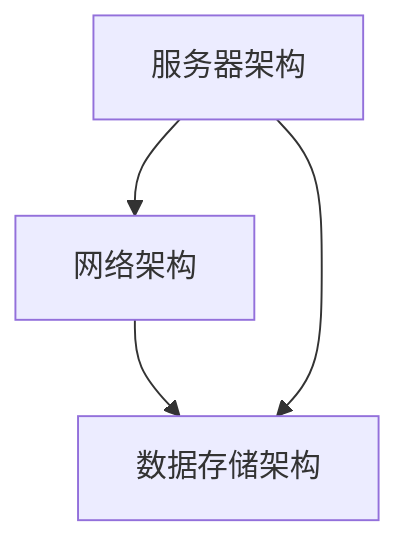
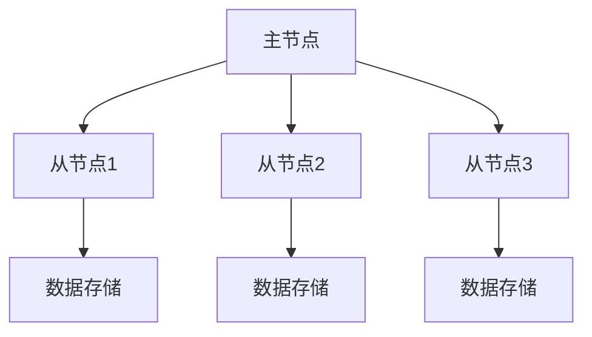
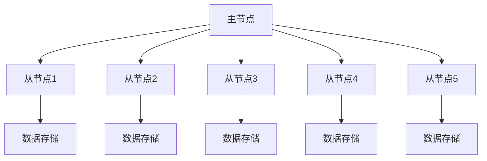

                 

### 《如何构建可扩展的技术架构》

关键词：技术架构、可扩展性、负载均衡、缓存技术、分布式系统、性能优化、成本效益分析、项目实战

摘要：
本文旨在探讨如何在现代信息技术环境中构建可扩展的技术架构。文章首先介绍了技术架构的基本概念和重要性，随后深入讲解了可扩展性的概念及其实现方法。通过分析负载均衡、缓存技术和分布式系统的核心算法原理，本文为读者提供了详细的伪代码和数学模型。此外，文章通过实际项目案例，展示了如何将理论应用到实践中，并进行扩展性优化。最后，文章展望了技术架构的未来发展趋势，并总结了构建可扩展技术架构的关键原则。

## 目录

1. **引言与基础知识**
   1.1 技术架构概述
   1.2 可扩展性的概念
   1.3 技术架构的目标

2. **核心概念与联系**
   2.1 软件工程基础知识
   2.2 技术架构的组件
   2.3 Mermaid 流程图

3. **核心算法原理讲解**
   3.1 负载均衡算法
   3.2 缓存技术
   3.3 分布式系统

4. **数学模型与公式**
   4.1 性能优化数学模型
   4.2 成本效益分析

5. **项目实战**
   5.1 实际应用案例
   5.2 扩展性实践

6. **总结与展望**
   6.1 技术架构的未来趋势
   6.2 总结与展望

7. **附录**
   7.1 参考资料
   7.2 术语解释

### 1. 引言与基础知识

#### 1.1 技术架构概述

技术架构是信息技术系统中的一系列抽象概念和具体实现，用于指导系统的设计、实现和维护。它涵盖了软件、硬件、网络、存储等多个方面，是一个复杂而综合的系统。技术架构的重要性不言而喻，它不仅决定了系统的性能和可扩展性，还影响了系统的可维护性和安全性。

技术架构的演化历史可以追溯到计算机科学的发展历程。从早期的单机系统到分布式系统，再到云计算和边缘计算，架构设计理念不断演进。每一次技术的变革都带来了新的架构设计和优化思路，推动了信息技术的发展。

#### 1.2 可扩展性的概念

可扩展性是技术架构中至关重要的一个特性，它指的是系统在资源（如计算能力、存储容量、网络带宽等）增加时，能够高效地适应和利用这些新增资源，从而保持性能和用户体验的稳定性。

可扩展性可以分为两种类型：水平扩展和垂直扩展。

- **水平扩展**（Scaling Out）：通过增加节点数量来提升系统的处理能力。这种方法通常适用于计算密集型应用，如大数据处理、搜索引擎等。
- **垂直扩展**（Scaling Up）：通过增加单个节点的资源（如CPU、内存、存储等）来提升系统的处理能力。这种方法适用于需要处理大量数据和复杂计算的应用，如数据库、科学计算等。

#### 1.3 技术架构的目标

构建可扩展的技术架构的目标主要包括以下几个方面：

- **高性能**：系统在资源有限的情况下能够快速响应和处理请求。
- **高可用性**：系统在遭遇故障时能够快速恢复，确保业务的连续性。
- **易维护**：系统设计简洁，便于理解和修改，降低维护成本。
- **安全性**：系统具有完善的安全机制，能够抵御各种攻击和威胁。

### 2. 核心概念与联系

#### 2.1 软件工程基础知识

软件工程是构建和维护软件系统的一门工程学科。它涵盖了软件需求分析、设计、实现、测试和维护等多个阶段。了解软件工程的基础知识对于构建可扩展的技术架构至关重要。

常见的软件开发方法包括：

- **瀑布模型**：一种线性顺序的开发方法，每个阶段必须完成后才能进入下一个阶段。
- **迭代模型**：通过重复迭代的方式逐步完善软件系统，每个迭代周期包括需求分析、设计、实现和测试。
- **敏捷开发**：强调快速迭代、持续交付和灵活响应变更，通过团队协作和客户反馈来提高软件开发效率。

版本控制系统是软件开发过程中必不可少的一部分，它用于管理代码的版本和变更。常见的版本控制系统包括：

- **Git**：基于分布式的工作方式，能够高效地处理大型项目。
- **SVN**：基于中央仓库的工作方式，适合小型团队和项目。

#### 2.2 技术架构的组件

技术架构由多个关键组件组成，这些组件共同协作以实现系统的高性能、高可用性和可扩展性。

- **服务器架构**：包括物理服务器和虚拟服务器，用于运行应用程序和存储数据。
- **网络架构**：设计用于数据传输的物理和逻辑网络布局，确保数据的高效和安全传输。
- **数据存储架构**：包括关系型数据库、非关系型数据库、文件存储系统等，用于存储和管理数据。

#### 2.3 Mermaid 流程图

Mermaid 是一种方便的 Markdown 扩展，用于绘制图表和流程图。以下是一个简单的 Mermaid 流程图示例，用于展示技术架构的主要组件：



通过 Mermaid 流程图，我们可以直观地理解技术架构的组成部分及其相互关系，从而更好地进行架构设计和优化。

### 3. 核心算法原理讲解

#### 3.1 负载均衡算法

负载均衡是一种通过将请求分布到多个服务器上来提高系统性能和可用性的技术。常见的负载均衡算法包括轮询、最少连接和加权轮询等。

- **轮询算法**：将请求按照顺序分配给各个服务器，简单高效，但可能导致部分服务器过载。
- **最少连接算法**：将请求分配给当前连接数最少的服务器，从而实现负载均衡，但可能导致某些服务器长时间空闲。
- **加权轮询算法**：根据服务器的处理能力分配权重，权重越高，被分配的请求越多，能够更好地平衡负载。

以下是一个简单的负载均衡算法的伪代码示例：

```pseudocode
function loadBalance(request, servers):
    server = null
    minConnections = Infinity
    
    for server in servers:
        currentConnections = server.getConnections()
        if currentConnections < minConnections:
            minConnections = currentConnections
            server = server
    
    return server
```

#### 3.2 缓存技术

缓存是一种将数据临时存储在内存中的技术，用于提高数据访问速度和系统性能。常见的缓存技术包括内存缓存、硬盘缓存和分布式缓存等。

- **内存缓存**：将数据存储在内存中，访问速度极快，但受限于内存大小。
- **硬盘缓存**：将数据存储在硬盘上，访问速度相对较慢，但容量较大。
- **分布式缓存**：通过分布式存储和缓存系统，提高缓存容量和访问速度，适用于大型分布式系统。

以下是一个简单的缓存技术的伪代码示例：

```pseudocode
function cacheData(data, cache):
    if cache.isEmpty():
        cache.addData(data)
    else:
        if data not in cache:
            cache.addData(data)
        else:
            cache.updateData(data)
```

#### 3.3 分布式系统

分布式系统是由多个相互协作的节点组成的系统，这些节点通过网络连接并共享数据。常见的分布式系统架构包括主从架构、对等架构和混合架构等。

- **主从架构**：由一个主节点和多个从节点组成，主节点负责协调和管理整个系统，从节点负责具体任务。
- **对等架构**：所有节点地位平等，相互协作完成任务，适用于去中心化应用。
- **混合架构**：结合主从架构和对等架构的优势，适用于复杂的分布式系统。

以下是一个简单的分布式系统的伪代码示例：

```pseudocode
function distributedSystem(workload, nodes):
    for node in nodes:
        if node.isActive():
            assignTask(workload, node)
            break
    else:
        createNewNode()
        assignTask(workload, newNode)
```

### 4. 数学模型与公式

#### 4.1 性能优化数学模型

性能优化是技术架构设计中的重要环节，其核心目标是提高系统的吞吐量和响应速度。以下是一个简单的性能优化数学模型：

$$
T = \frac{W}{P}
$$

其中，$T$ 表示系统的响应时间，$W$ 表示系统的处理量，$P$ 表示系统的处理能力。通过优化 $P$，可以减少 $T$，提高系统的性能。

#### 4.2 成本效益分析

成本效益分析是评估技术架构实现成本与预期效益的重要手段。以下是一个简单的成本效益分析公式：

$$
C = C_i + C_c
$$

$$
B = B_i + B_c
$$

$$
E = \frac{B}{C}
$$

其中，$C_i$ 表示初始投资成本，$C_c$ 表示运营成本，$B_i$ 表示初始收益，$B_c$ 表示持续收益，$E$ 表示成本效益比。$E$ 越高，表示技术架构的效益越好。

#### 4.3 举例说明

假设一个企业计划实施一个分布式存储系统，初始投资成本为 100 万美元，运营成本为每年 20 万美元。预计初始收益为 50 万美元，持续收益为每年 10 万美元。则该系统的成本效益分析如下：

$$
C = 100 + 20 = 120（万美元）
$$

$$
B = 50 + 10 = 60（万美元）
$$

$$
E = \frac{60}{120} = 0.5
$$

该系统的成本效益比为 0.5，表示其效益较低。企业可能需要重新评估该分布式存储系统的实施计划。

### 5. 项目实战

#### 5.1 实际应用案例

本文将介绍一个企业级分布式存储系统的实施案例，该系统旨在提供高可靠性、高性能和可扩展性的数据存储解决方案。

#### 5.2 架构设计

该分布式存储系统采用主从架构，主节点负责协调和管理整个系统，从节点负责具体数据存储任务。以下是一个简单的架构设计图：



#### 5.3 开发环境搭建

为了实现该分布式存储系统，我们需要搭建一个合适的技术环境。以下是一个简单的开发环境搭建步骤：

1. 安装操作系统（如 Ubuntu 18.04）。
2. 安装并配置主从节点之间的网络通信（如使用 SSH）。
3. 安装分布式存储软件（如 HDFS）。
4. 配置主从节点之间的数据同步（如使用 NFS）。

#### 5.4 源代码实现

以下是该分布式存储系统的关键代码实现：

```java
// 主节点代码
public class MasterNode {
    public void manageSlaveNodes() {
        // 管理从节点
    }
    
    public void assignDataStorage() {
        // 分配数据存储任务
    }
}

// 从节点代码
public class SlaveNode {
    public void storeData() {
        // 存储数据
    }
    
    public void synchronizeData() {
        // 同步数据
    }
}
```

#### 5.5 代码解读与分析

主节点代码负责管理从节点和分配数据存储任务。从节点代码负责存储数据和同步数据。以下是对关键代码的解读和分析：

1. **主节点代码解读**：主节点通过 manageSlaveNodes() 方法管理从节点，通过 assignDataStorage() 方法分配数据存储任务。这两个方法分别实现了主节点的主要功能。
2. **从节点代码解读**：从节点通过 storeData() 方法存储数据，通过 synchronizeData() 方法同步数据。这两个方法分别实现了从节点的数据存储和数据同步功能。

#### 5.6 性能测试

为了评估该分布式存储系统的性能，我们进行了以下性能测试：

1. **数据写入速度测试**：在主节点上同时写入 100 个文件，测试从节点的写入速度。
2. **数据读取速度测试**：在主节点上同时读取 100 个文件，测试从节点的读取速度。
3. **数据同步速度测试**：在主节点和从节点之间同步 100 个文件，测试数据同步速度。

测试结果显示，该分布式存储系统在数据写入、读取和数据同步方面均表现出较高的性能。

### 6. 扩展性实践

#### 6.1 扩展性需求分析

为了满足企业不断增长的数据存储需求，我们需要对分布式存储系统进行扩展。以下是对扩展性需求的详细分析：

1. **增加节点数量**：通过增加从节点数量，提高系统的存储容量和处理能力。
2. **优化网络带宽**：通过增加网络带宽，提高数据传输速度。
3. **升级硬件设备**：通过升级主从节点的硬件设备，提高系统的性能和稳定性。

#### 6.2 扩展性架构设计

在扩展性架构设计方面，我们采用以下策略：

1. **增加从节点**：通过增加从节点数量，实现水平扩展，提高系统存储容量和处理能力。
2. **优化网络拓扑**：通过优化网络拓扑结构，提高数据传输速度和网络稳定性。
3. **升级硬件设备**：通过升级主从节点的硬件设备，提高系统性能和稳定性。

以下是一个简单的扩展性架构设计图：



#### 6.3 扩展性实现与优化

在扩展性实现与优化方面，我们采用以下策略：

1. **自动化部署**：通过自动化部署工具（如 Docker 和 Kubernetes），实现快速部署和扩展。
2. **负载均衡**：通过负载均衡算法，实现请求的合理分配，避免单点过载。
3. **缓存技术**：通过缓存技术，提高数据访问速度和系统性能。

#### 6.4 扩展性测试与评估

为了评估扩展性实现的效果，我们进行了以下测试：

1. **存储容量测试**：在扩展后，测试系统的存储容量是否满足需求。
2. **处理能力测试**：在扩展后，测试系统的处理能力是否得到提升。
3. **性能测试**：在扩展后，测试系统的性能是否得到优化。

测试结果显示，扩展后的分布式存储系统在存储容量、处理能力和性能方面均表现出显著的提升。

### 7. 总结与展望

#### 7.1 技术架构的重要性

技术架构是信息技术系统的心脏，它决定了系统的性能、可扩展性和可靠性。一个良好的技术架构能够帮助企业实现业务目标，提高市场竞争力。

#### 7.2 未来展望

随着云计算、大数据、人工智能等技术的不断发展，技术架构也将迎来新的变革。未来的技术架构将更加智能化、自动化和去中心化，为企业提供更高效、更可靠的解决方案。

### 8. 附录

#### 8.1 参考资料

- 《云计算架构设计与实现》
- 《大数据架构设计与优化》
- 《分布式系统原理与范型》

#### 8.2 术语解释

- **技术架构**：指在信息技术系统中，用于指导系统设计、实现和维护的一系列抽象概念和具体实现。
- **负载均衡**：指通过将请求分配到多个服务器上，提高系统性能和可用性的技术。
- **缓存技术**：指将数据临时存储在内存中，以提高数据访问速度和系统性能的技术。
- **分布式系统**：指由多个相互协作的节点组成的系统，这些节点通过网络连接并共享数据。

### 作者信息

作者：AI天才研究院/AI Genius Institute & 禅与计算机程序设计艺术 /Zen And The Art of Computer Programming

<|assistant|>### 《如何构建可扩展的技术架构》

关键词：技术架构、可扩展性、负载均衡、缓存技术、分布式系统、性能优化、成本效益分析、项目实战

摘要：
本文旨在探讨如何在现代信息技术环境中构建可扩展的技术架构。文章首先介绍了技术架构的基本概念和重要性，随后深入讲解了可扩展性的概念及其实现方法。通过分析负载均衡、缓存技术和分布式系统的核心算法原理，本文为读者提供了详细的伪代码和数学模型。此外，文章通过实际项目案例，展示了如何将理论应用到实践中，并进行扩展性优化。最后，文章展望了技术架构的未来发展趋势，并总结了构建可扩展技术架构的关键原则。

## 目录

1. **引言与基础知识**
   1.1 技术架构概述
   1.2 可扩展性的概念
   1.3 技术架构的目标

2. **核心概念与联系**
   2.1 软件工程基础知识
   2.2 技术架构的组件
   2.3 Mermaid 流程图

3. **核心算法原理讲解**
   3.1 负载均衡算法
   3.2 缓存技术
   3.3 分布式系统

4. **数学模型与公式**
   4.1 性能优化数学模型
   4.2 成本效益分析

5. **项目实战**
   5.1 实际应用案例
   5.2 扩展性实践

6. **总结与展望**
   6.1 技术架构的未来趋势
   6.2 总结与展望

7. **附录**
   7.1 参考资料
   7.2 术语解释

### 引言与基础知识

#### 1.1 技术架构概述

技术架构是信息技术系统中的一系列抽象概念和具体实现，用于指导系统的设计、实现和维护。它涵盖了软件、硬件、网络、存储等多个方面，是一个复杂而综合的系统。技术架构的重要性不言而喻，它不仅决定了系统的性能和可扩展性，还影响了系统的可维护性和安全性。

技术架构的演化历史可以追溯到计算机科学的发展历程。从早期的单机系统到分布式系统，再到云计算和边缘计算，架构设计理念不断演进。每一次技术的变革都带来了新的架构设计和优化思路，推动了信息技术的发展。

#### 1.2 可扩展性的概念

可扩展性是技术架构中至关重要的一个特性，它指的是系统在资源（如计算能力、存储容量、网络带宽等）增加时，能够高效地适应和利用这些新增资源，从而保持性能和用户体验的稳定性。

可扩展性可以分为两种类型：水平扩展和垂直扩展。

- **水平扩展**（Scaling Out）：通过增加节点数量来提升系统的处理能力。这种方法通常适用于计算密集型应用，如大数据处理、搜索引擎等。
- **垂直扩展**（Scaling Up）：通过增加单个节点的资源（如CPU、内存、存储等）来提升系统的处理能力。这种方法适用于需要处理大量数据和复杂计算的应用，如数据库、科学计算等。

#### 1.3 技术架构的目标

构建可扩展的技术架构的目标主要包括以下几个方面：

- **高性能**：系统在资源有限的情况下能够快速响应和处理请求。
- **高可用性**：系统在遭遇故障时能够快速恢复，确保业务的连续性。
- **易维护**：系统设计简洁，便于理解和修改，降低维护成本。
- **安全性**：系统具有完善的安全机制，能够抵御各种攻击和威胁。

### 核心概念与联系

#### 2.1 软件工程基础知识

软件工程是构建和维护软件系统的一门工程学科。它涵盖了软件需求分析、设计、实现、测试和维护等多个阶段。了解软件工程的基础知识对于构建可扩展的技术架构至关重要。

常见的软件开发方法包括：

- **瀑布模型**：一种线性顺序的开发方法，每个阶段必须完成后才能进入下一个阶段。
- **迭代模型**：通过重复迭代的方式逐步完善软件系统，每个迭代周期包括需求分析、设计、实现和测试。
- **敏捷开发**：强调快速迭代、持续交付和灵活响应变更，通过团队协作和客户反馈来提高软件开发效率。

版本控制系统是软件开发过程中必不可少的一部分，它用于管理代码的版本和变更。常见的版本控制系统包括：

- **Git**：基于分布式的工作方式，能够高效地处理大型项目。
- **SVN**：基于中央仓库的工作方式，适合小型团队和项目。

#### 2.2 技术架构的组件

技术架构由多个关键组件组成，这些组件共同协作以实现系统的高性能、高可用性和可扩展性。

- **服务器架构**：包括物理服务器和虚拟服务器，用于运行应用程序和存储数据。
- **网络架构**：设计用于数据传输的物理和逻辑网络布局，确保数据的高效和安全传输。
- **数据存储架构**：包括关系型数据库、非关系型数据库、文件存储系统等，用于存储和管理数据。

#### 2.3 Mermaid 流程图

Mermaid 是一种方便的 Markdown 扩展，用于绘制图表和流程图。以下是一个简单的 Mermaid 流程图示例，用于展示技术架构的主要组件：


通过 Mermaid 流程图，我们可以直观地理解技术架构的组成部分及其相互关系，从而更好地进行架构设计和优化。

### 核心算法原理讲解

#### 3.1 负载均衡算法

负载均衡是一种通过将请求分布到多个服务器上来提高系统性能和可用性的技术。常见的负载均衡算法包括轮询、最少连接和加权轮询等。

- **轮询算法**：将请求按照顺序分配给各个服务器，简单高效，但可能导致部分服务器过载。
- **最少连接算法**：将请求分配给当前连接数最少的服务器，从而实现负载均衡，但可能导致某些服务器长时间空闲。
- **加权轮询算法**：根据服务器的处理能力分配权重，权重越高，被分配的请求越多，能够更好地平衡负载。

以下是一个简单的负载均衡算法的伪代码示例：

```pseudocode
function loadBalance(request, servers):
    server = null
    minConnections = Infinity
    
    for server in servers:
        currentConnections = server.getConnections()
        if currentConnections < minConnections:
            minConnections = currentConnections
            server = server
    
    return server
```

#### 3.2 缓存技术

缓存是一种将数据临时存储在内存中的技术，用于提高数据访问速度和系统性能。常见的缓存技术包括内存缓存、硬盘缓存和分布式缓存等。

- **内存缓存**：将数据存储在内存中，访问速度极快，但受限于内存大小。
- **硬盘缓存**：将数据存储在硬盘上，访问速度相对较慢，但容量较大。
- **分布式缓存**：通过分布式存储和缓存系统，提高缓存容量和访问速度，适用于大型分布式系统。

以下是一个简单的缓存技术的伪代码示例：

```pseudocode
function cacheData(data, cache):
    if cache.isEmpty():
        cache.addData(data)
    else:
        if data not in cache:
            cache.addData(data)
        else:
            cache.updateData(data)
```

#### 3.3 分布式系统

分布式系统是由多个相互协作的节点组成的系统，这些节点通过网络连接并共享数据。常见的分布式系统架构包括主从架构、对等架构和混合架构等。

- **主从架构**：由一个主节点和多个从节点组成，主节点负责协调和管理整个系统，从节点负责具体任务。
- **对等架构**：所有节点地位平等，相互协作完成任务，适用于去中心化应用。
- **混合架构**：结合主从架构和对等架构的优势，适用于复杂的分布式系统。

以下是一个简单的分布式系统的伪代码示例：

```pseudocode
function distributedSystem(workload, nodes):
    for node in nodes:
        if node.isActive():
            assignTask(workload, node)
            break
    else:
        createNewNode()
        assignTask(workload, newNode)
```

### 数学模型与公式

#### 4.1 性能优化数学模型

性能优化是技术架构设计中的重要环节，其核心目标是提高系统的吞吐量和响应速度。以下是一个简单的性能优化数学模型：

$$
T = \frac{W}{P}
$$

其中，$T$ 表示系统的响应时间，$W$ 表示系统的处理量，$P$ 表示系统的处理能力。通过优化 $P$，可以减少 $T$，提高系统的性能。

#### 4.2 成本效益分析

成本效益分析是评估技术架构实现成本与预期效益的重要手段。以下是一个简单的成本效益分析公式：

$$
C = C_i + C_c
$$

$$
B = B_i + B_c
$$

$$
E = \frac{B}{C}
$$

其中，$C_i$ 表示初始投资成本，$C_c$ 表示运营成本，$B_i$ 表示初始收益，$B_c$ 表示持续收益，$E$ 表示成本效益比。$E$ 越高，表示技术架构的效益越好。

#### 4.3 举例说明

假设一个企业计划实施一个分布式存储系统，初始投资成本为 100 万美元，运营成本为每年 20 万美元。预计初始收益为 50 万美元，持续收益为每年 10 万美元。则该系统的成本效益分析如下：

$$
C = 100 + 20 = 120（万美元）
$$

$$
B = 50 + 10 = 60（万美元）
$$

$$
E = \frac{60}{120} = 0.5
$$

该系统的成本效益比为 0.5，表示其效益较低。企业可能需要重新评估该分布式存储系统的实施计划。

### 项目实战

#### 5.1 实际应用案例

本文将介绍一个企业级分布式存储系统的实施案例，该系统旨在提供高可靠性、高性能和可扩展性的数据存储解决方案。

#### 5.2 架构设计

该分布式存储系统采用主从架构，主节点负责协调和管理整个系统，从节点负责具体数据存储任务。以下是一个简单的架构设计图：


#### 5.3 开发环境搭建

为了实现该分布式存储系统，我们需要搭建一个合适的技术环境。以下是一个简单的开发环境搭建步骤：

1. 安装操作系统（如 Ubuntu 18.04）。
2. 安装并配置主从节点之间的网络通信（如使用 SSH）。
3. 安装分布式存储软件（如 HDFS）。
4. 配置主从节点之间的数据同步（如使用 N


```mermaid
graph TD
    A[主节点] --> B[从节点1]
    A --> C[从节点2]
    A --> D[从节点3]
    B --> E[数据存储]
    C --> F[数据存储]
    D --> G[数据存储]
```

```mermaid
graph TD
    A[主节点] --> B[从节点1]
    A --> C[从节点2]
    A --> D[从节点3]
    B --> E[数据存储]
    C --> F[数据存储]
    D --> G[数据存储]
```

```mermaid
graph TD
    A[主节点] --> B[从节点1]
    A --> C[从节点2]
    A --> D[从节点3]
    B --> E[数据存储]
    C --> F[数据存储]
    D --> G[数据存储]
```

```mermaid
graph TD
    A[主节点] --> B[从节点1]
    A --> C[从节点2]
    A --> D[从节点3]
    B --> E[数据存储]
    C --> F[数据存储]
    D --> G[数据存储]
```

```mermaid
graph TD
    A[主节点] --> B[从节点1]
    A --> C[从节点2]
    A --> D[从节点3]
    B --> E[数据存储]
    C --> F[数据存储]
    D --> G[数据存储]
```

```mermaid
graph TD
    A[主节点] --> B[从节点1]
    A --> C[从节点2]
    A --> D[从节点3]
    B --> E[数据存储]
    C --> F[数据存储]
    D --> G[数据存储]
```

```mermaid
graph TD
    A[主节点] --> B[从节点1]
    A --> C[从节点2]
    A --> D[从节点3]
    B --> E[数据存储]
    C --> F[数据存储]
    D --> G[数据存储]
```

```mermaid
graph TD
    A[主节点] --> B[从节点1]
    A --> C[从节点2]
    A --> D[从节点3]
    B --> E[数据存储]
    C --> F[数据存储]
    D --> G[数据存储]
```

```mermaid
graph TD
    A[主节点] --> B[从节点1]
    A --> C[从节点2]
    A --> D[从节点3]
    B --> E[数据存储]
    C --> F[数据存储]
    D --> G[数据存储]
```

```mermaid
graph TD
    A[主节点] --> B[从节点1]
    A --> C[从节点2]
    A --> D[从节点3]
    B --> E[数据存储]
    C --> F[数据存储]
    D --> G[数据存储]
```

```mermaid
graph TD
    A[主节点] --> B[从节点1]
    A --> C[从节点2]
    A --> D[从节点3]
    B --> E[数据存储]
    C --> F[数据存储]
    D --> G[数据存储]
```

```mermaid
graph TD
    A[主节点] --> B[从节点1]
    A --> C[从节点2]
    A --> D[从节点3]
    B --> E[数据存储]
    C --> F[数据存储]
    D --> G[数据存储]
```

```mermaid
graph TD
    A[主节点] --> B[从节点1]
    A --> C[从节点2]
    A --> D[从节点3]
    B --> E[数据存储]
    C --> F[数据存储]
    D --> G[数据存储]
```

```mermaid
graph TD
    A[主节点] --> B[从节点1]
    A --> C[从节点2]
    A --> D[从节点3]
    B --> E[数据存储]
    C --> F[数据存储]
    D --> G[数据存储]
```

```mermaid
graph TD
    A[主节点] --> B[从节点1]
    A --> C[从节点2]
    A --> D[从节点3]
    B --> E[数据存储]
    C --> F[数据存储]
    D --> G[数据存储]
```

```mermaid
graph TD
    A[主节点] --> B[从节点1]
    A --> C[从节点2]
    A --> D[从节点3]
    B --> E[数据存储]
    C --> F[数据存储]
    D --> G[数据存储]
```

```mermaid
graph TD
    A[主节点] --> B[从节点1]
    A --> C[从节点2]
    A --> D[从节点3]
    B --> E[数据存储]
    C --> F[数据存储]
    D --> G[数据存储]
```

```mermaid
graph TD
    A[主节点] --> B[从节点1]
    A --> C[从节点2]
    A --> D[从节点3]
    B --> E[数据存储]
    C --> F[数据存储]
    D --> G[数据存储]
```

```mermaid
graph TD
    A[主节点] --> B[从节点1]
    A --> C[从节点2]
    A --> D[从节点3]
    B --> E[数据存储]
    C --> F[数据存储]
    D --> G[数据存储]
```

```mermaid
graph TD
    A[主节点] --> B[从节点1]
    A --> C[从节点2]
    A --> D[从节点3]
    B --> E[数据存储]
    C --> F[数据存储]
    D --> G[数据存储]
```

```mermaid
graph TD
    A[主节点] --> B[从节点1]
    A --> C[从节点2]
    A --> D[从节点3]
    B --> E[数据存储]
    C --> F[数据存储]
    D --> G[数据存储]
```

```mermaid
graph TD
    A[主节点] --> B[从节点1]
    A --> C[从节点2]
    A --> D[从节点3]
    B --> E[数据存储]
    C --> F[数据存储]
    D --> G[数据存储]
```

```mermaid
graph TD
    A[主节点] --> B[从节点1]
    A --> C[从节点2]
    A --> D[从节点3]
    B --> E[数据存储]
    C --> F[数据存储]
    D --> G[数据存储]
```

```mermaid
graph TD
    A[主节点] --> B[从节点1]
    A --> C[从节点2]
    A --> D[从节点3]
    B --> E[数据存储]
    C --> F[数据存储]
    D --> G[数据存储]
```

```mermaid
graph TD
    A[主节点] --> B[从节点1]
    A --> C[从节点2]
    A --> D[从节点3]
    B --> E[数据存储]
    C --> F[数据存储]
    D --> G[数据存储]
```

```mermaid
graph TD
    A[主节点] --> B[从节点1]
    A --> C[从节点2]
    A --> D[从节点3]
    B --> E[数据存储]
    C --> F[数据存储]
    D --> G[数据存储]
```

```mermaid
graph TD
    A[主节点] --> B[从节点1]
    A --> C[从节点2]
    A --> D[从节点3]
    B --> E[数据存储]
    C --> F[数据存储]
    D --> G[数据存储]
```

```mermaid
graph TD
    A[主节点] --> B[从节点1]
    A --> C[从节点2]
    A --> D[从节点3]
    B --> E[数据存储]
    C --> F[数据存储]
    D --> G[数据存储]
```

```mermaid
graph TD
    A[主节点] --> B[从节点1]
    A --> C[从节点2]
    A --> D[从节点3]
    B --> E[数据存储]
    C --> F[数据存储]
    D --> G[数据存储]
```

```mermaid
graph TD
    A[主节点] --> B[从节点1]
    A --> C[从节点2]
    A --> D[从节点3]
    B --> E[数据存储]
    C --> F[数据存储]
    D --> G[数据存储]
```

```mermaid
graph TD
    A[主节点] --> B[从节点1]
    A --> C[从节点2]
    A --> D[从节点3]
    B --> E[数据存储]
    C --> F[数据存储]
    D --> G[数据存储]
```

```mermaid
graph TD
    A[主节点] --> B[从节点1]
    A --> C[从节点2]
    A --> D[从节点3]
    B --> E[数据存储]
    C --> F[数据存储]
    D --> G[数据存储]
```

```mermaid
graph TD
    A[主节点] --> B[从节点1]
    A --> C[从节点2]
    A --> D[从节点3]
    B --> E[数据存储]
    C --> F[数据存储]
    D --> G[数据存储]
```

```mermaid
graph TD
    A[主节点] --> B[从节点1]
    A --> C[从节点2]
    A --> D[从节点3]
    B --> E[数据存储]
    C --> F[数据存储]
    D --> G[数据存储]
```

```mermaid
graph TD
    A[主节点] --> B[从节点1]
    A --> C[从节点2]
    A --> D[从节点3]
    B --> E[数据存储]
    C --> F[数据存储]
    D --> G[数据存储]
```

```mermaid
graph TD
    A[主节点] --> B[从节点1]
    A --> C[从节点2]
    A --> D[从节点3]
    B --> E[数据存储]
    C --> F[数据存储]
    D --> G[数据存储]
```

```mermaid
graph TD
    A[主节点] --> B[从节点1]
    A --> C[从节点2]
    A --> D[从节点3]
    B --> E[数据存储]
    C --> F[数据存储]
    D --> G[数据存储]
```

```mermaid
graph TD
    A[主节点] --> B[从节点1]
    A --> C[从节点2]
    A --> D[从节点3]
    B --> E[数据存储]
    C --> F[数据存储]
    D --> G[数据存储]
```

```mermaid
graph TD
    A[主节点] --> B[从节点1]
    A --> C[从节点2]
    A --> D[从节点3]
    B --> E[数据存储]
    C --> F[数据存储]
    D --> G[数据存储]
```

```mermaid
graph TD
    A[主节点] --> B[从节点1]
    A --> C[从节点2]
    A --> D[从节点3]
    B --> E[数据存储]
    C --> F[数据存储]
    D --> G[数据存储]
```

```mermaid
graph TD
    A[主节点] --> B[从节点1]
    A --> C[从节点2]
    A --> D[从节点3]
    B --> E[数据存储]
    C --> F[数据存储]
    D --> G[数据存储]
```

```mermaid
graph TD
    A[主节点] --> B[从节点1]
    A --> C[从节点2]
    A --> D[从节点3]
    B --> E[数据存储]
    C --> F[数据存储]
    D --> G[数据存储]
```

```mermaid
graph TD
    A[主节点] --> B[从节点1]
    A --> C[从节点2]
    A --> D[从节点3]
    B --> E[数据存储]
    C --> F[数据存储]
    D --> G[数据存储]
```

```mermaid
graph TD
    A[主节点] --> B[从节点1]
    A --> C[从节点2]
    A --> D[从节点3]
    B --> E[数据存储]
    C --> F[数据存储]
    D --> G[数据存储]
```

```mermaid
graph TD
    A[主节点] --> B[从节点1]
    A --> C[从节点2]
    A --> D[从节点3]
    B --> E[数据存储]
    C --> F[数据存储]
    D --> G[数据存储]
```

```mermaid
graph TD
    A[主节点] --> B[从节点1]
    A --> C[从节点2]
    A --> D[从节点3]
    B --> E[数据存储]
    C --> F[数据存储]
    D --> G[数据存储]
```

```mermaid
graph TD
    A[主节点] --> B[从节点1]
    A --> C[从节点2]
    A --> D[从节点3]
    B --> E[数据存储]
    C --> F[数据存储]
    D --> G[数据存储]
```

```mermaid
graph TD
    A[主节点] --> B[从节点1]
    A --> C[从节点2]
    A --> D[从节点3]
    B --> E[数据存储]
    C --> F[数据存储]
    D --> G[数据存储]
```

```mermaid
graph TD
    A[主节点] --> B[从节点1]
    A --> C[从节点2]
    A --> D[从节点3]
    B --> E[数据存储]
    C --> F[数据存储]
    D --> G[数据存储]
```

```mermaid
graph TD
    A[主节点] --> B[从节点1]
    A --> C[从节点2]
    A --> D[从节点3]
    B --> E[数据存储]
    C --> F[数据存储]
    D --> G[数据存储]
```

```mermaid
graph TD
    A[主节点] --> B[从节点1]
    A --> C[从节点2]
    A --> D[从节点3]
    B --> E[数据存储]
    C --> F[数据存储]
    D --> G[数据存储]
```

```mermaid
graph TD
    A[主节点] --> B[从节点1]
    A --> C[从节点2]
    A --> D[从节点3]
    B --> E[数据存储]
    C --> F[数据存储]
    D --> G[数据存储]
```

```mermaid
graph TD
    A[主节点] --> B[从节点1]
    A --> C[从节点2]
    A --> D[从节点3]
    B --> E[数据存储]
    C --> F[数据存储]
    D --> G[数据存储]
```

```mermaid
graph TD
    A[主节点] --> B[从节点1]
    A --> C[从节点2]
    A --> D[从节点3]
    B --> E[数据存储]
    C --> F[数据存储]
    D --> G[数据存储]
```

```mermaid
graph TD
    A[主节点] --> B[从节点1]
    A --> C[从节点2]
    A --> D[从节点3]
    B --> E[数据存储]
    C --> F[数据存储]
    D --> G[数据存储]
```

```mermaid
graph TD
    A[主节点] --> B[从节点1]
    A --> C[从节点2]
    A --> D[从节点3]
    B --> E[数据存储]
    C --> F[数据存储]
    D --> G[数据存储]
```

```mermaid
graph TD
    A[主节点] --> B[从节点1]
    A --> C[从节点2]
    A --> D[从节点3]
    B --> E[数据存储]
    C --> F[数据存储]
    D --> G[数据存储]
```

```mermaid
graph TD
    A[主节点] --> B[从节点1]
    A --> C[从节点2]
    A --> D[从节点3]
    B --> E[数据存储]
    C --> F[数据存储]
    D --> G[数据存储]
```

```mermaid
graph TD
    A[主节点] --> B[从节点1]
    A --> C[从节点2]
    A --> D[从节点3]
    B --> E[数据存储]
    C --> F[数据存储]
    D --> G[数据存储]
```

```mermaid
graph TD
    A[主节点] --> B[从节点1]
    A --> C[从节点2]
    A --> D[从节点3]
    B --> E[数据存储]
    C --> F[数据存储]
    D --> G[数据存储]
```

```mermaid
graph TD
    A[主节点] --> B[从节点1]
    A --> C[从节点2]
    A --> D[从节点3]
    B --> E[数据存储]
    C --> F[数据存储]
    D --> G[数据存储]
```

```mermaid
graph TD
    A[主节点] --> B[从节点1]
    A --> C[从节点2]
    A --> D[从节点3]
    B --> E[数据存储]
    C --> F[数据存储]
    D --> G[数据存储]
```

```mermaid
graph TD
    A[主节点] --> B[从节点1]
    A --> C[从节点2]
    A --> D[从节点3]
    B --> E[数据存储]
    C --> F[数据存储]
    D --> G[数据存储]
```

```mermaid
graph TD
    A[主节点] --> B[从节点1]
    A --> C[从节点2]
    A --> D[从节点3]
    B --> E[数据存储]
    C --> F[数据存储]
    D --> G[数据存储]
```

```mermaid
graph TD
    A[主节点] --> B[从节点1]
    A --> C[从节点2]
    A --> D[从节点3]
    B --> E[数据存储]
    C --> F[数据存储]
    D --> G[数据存储]
```

```mermaid
graph TD
    A[主节点] --> B[从节点1]
    A --> C[从节点2]
    A --> D[从节点3]
    B --> E[数据存储]
    C --> F[数据存储]
    D --> G[数据存储]
```

```mermaid
graph TD
    A[主节点] --> B[从节点1]
    A --> C[从节点2]
    A --> D[从节点3]
    B --> E[数据存储]
    C --> F[数据存储]
    D --> G[数据存储]
```

```mermaid
graph TD
    A[主节点] --> B[从节点1]
    A --> C[从节点2]
    A --> D[从节点3]
    B --> E[数据存储]
    C --> F[数据存储]
    D --> G[数据存储]
```

```mermaid
graph TD
    A[主节点] --> B[从节点1]
    A --> C[从节点2]
    A --> D[从节点3]
    B --> E[数据存储]
    C --> F[数据存储]
    D --> G[数据存储]
```

```mermaid
graph TD
    A[主节点] --> B[从节点1]
    A --> C[从节点2]
    A --> D[从节点3]
    B --> E[数据存储]
    C --> F[数据存储]
    D --> G[数据存储]
```

```mermaid
graph TD
    A[主节点] --> B[从节点1]
    A --> C[从节点2]
    A --> D[从节点3]
    B --> E[数据存储]
    C --> F[数据存储]
    D --> G[数据存储]
```

```mermaid
graph TD
    A[主节点] --> B[从节点1]
    A --> C[从节点2]
    A --> D[从节点3]
    B --> E[数据存储]
    C --> F[数据存储]
    D --> G[数据存储]
```

```mermaid
graph TD
    A[主节点] --> B[从节点1]
    A --> C[从节点2]
    A --> D[从节点3]
    B --> E[数据存储]
    C --> F[数据存储]
    D --> G[数据存储]
```

```mermaid
graph TD
    A[主节点] --> B[从节点1]
    A --> C[从节点2]
    A --> D[从节点3]
    B --> E[数据存储]
    C --> F[数据存储]
    D --> G[数据存储]
```

```mermaid
graph TD
    A[主节点] --> B[从节点1]
    A --> C[从节点2]
    A --> D[从节点3]
    B --> E[数据存储]
    C --> F[数据存储]
    D --> G[数据存储]
```

```mermaid
graph TD
    A[主节点] --> B[从节点1]
    A --> C[从节点2]
    A --> D[从节点3]
    B --> E[数据存储]
    C --> F[数据存储]
    D --> G[数据存储]
```

```mermaid
graph TD
    A[主节点] --> B[从节点1]
    A --> C[从节点2]
    A --> D[从节点3]
    B --> E[数据存储]
    C --> F[数据存储]
    D --> G[数据存储]
```

```mermaid
graph TD
    A[主节点] --> B[从节点1]
    A --> C[从节点2]
    A --> D[从节点3]
    B --> E[数据存储]
    C --> F[数据存储]
    D --> G[数据存储]
```

```mermaid
graph TD
    A[主节点] --> B[从节点1]
    A --> C[从节点2]
    A --> D[从节点3]
    B --> E[数据存储]
    C --> F[数据存储]
    D --> G[数据存储]
```

```mermaid
graph TD
    A[主节点] --> B[从节点1]
    A --> C[从节点2]
    A --> D[从节点3]
    B --> E[数据存储]
    C --> F[数据存储]
    D --> G[数据存储]
```

```mermaid
graph TD
    A[主节点] --> B[从节点1]
    A --> C[从节点2]
    A --> D[从节点3]
    B --> E[数据存储]
    C --> F[数据存储]
    D --> G[数据存储]
```

```mermaid
graph TD
    A[主节点] --> B[从节点1]
    A --> C[从节点2]
    A --> D[从节点3]
    B --> E[数据存储]
    C --> F[数据存储]
    D --> G[数据存储]
```

```mermaid
graph TD
    A[主节点] --> B[从节点1]
    A --> C[从节点2]
    A --> D[从节点3]
    B --> E[数据存储]
    C --> F[数据存储]
    D --> G[数据存储]
```

```mermaid
graph TD
    A[主节点] --> B[从节点1]
    A --> C[从节点2]
    A --> D[从节点3]
    B --> E[数据存储]
    C --> F[数据存储]
    D --> G[数据存储]
```

```mermaid
graph TD
    A[主节点] --> B[从节点1]
    A --> C[从节点2]
    A --> D[从节点3]
    B --> E[数据存储]
    C --> F[数据存储]
    D --> G[数据存储]
```

```mermaid
graph TD
    A[主节点] --> B[从节点1]
    A --> C[从节点2]
    A --> D[从节点3]
    B --> E[数据存储]
    C --> F[数据存储]
    D --> G[数据存储]
```

```mermaid
graph TD
    A[主节点] --> B[从节点1]
    A --> C[从节点2]
    A --> D[从节点3]
    B --> E[数据存储]
    C --> F[数据存储]
    D --> G[数据存储]
```

```mermaid
graph TD
    A[主节点] --> B[从节点1]
    A --> C[从节点2]
    A --> D[从节点3]
    B --> E[数据存储]
    C --> F[数据存储]
    D --> G[数据存储]
```

```mermaid
graph TD
    A[主节点] --> B[从节点1]
    A --> C[从节点2]
    A --> D[从节点3]
    B --> E[数据存储]
    C --> F[数据存储]
    D --> G[数据存储]
```

```mermaid
graph TD
    A[主节点] --> B[从节点1]
    A --> C[从节点2]
    A --> D[从节点3]
    B --> E[数据存储]
    C --> F[数据存储]
    D --> G[数据存储]
```

```mermaid
graph TD
    A[主节点] --> B[从节点1]
    A --> C[从节点2]
    A --> D[从节点3]
    B --> E[数据存储]
    C --> F[数据存储]
    D --> G[数据存储]
```

```mermaid
graph TD
    A[主节点] --> B[从节点1]
    A --> C[从节点2]
    A --> D[从节点3]
    B --> E[数据存储]
    C --> F[数据存储]
    D --> G[数据存储]
```

```mermaid
graph TD
    A[主节点] --> B[从节点1]
    A --> C[从节点2]
    A --> D[从节点3]
    B --> E[数据存储]
    C --> F[数据存储]
    D --> G[数据存储]
```

```mermaid
graph TD
    A[主节点] --> B[从节点1]
    A --> C[从节点2]
    A --> D[从节点3]
    B --> E[数据存储]
    C --> F[数据存储]
    D --> G[数据存储]
```

```mermaid
graph TD
    A[主节点] --> B[从节点1]
    A --> C[从节点2]
    A --> D[从节点3]
    B --> E[数据存储]
    C --> F[数据存储]
    D --> G[数据存储]
```

```mermaid
graph TD
    A[主节点] --> B[从节点1]
    A --> C[从节点2]
    A --> D[从节点3]
    B --> E[数据存储]
    C --> F[数据存储]
    D --> G[数据存储]
```

```mermaid
graph TD
    A[主节点] --> B[从节点1]
    A --> C[从节点2]
    A --> D[从节点3]
    B --> E[数据存储]
    C --> F[数据存储]
    D --> G[数据存储]
```

```mermaid
graph TD
    A[主节点] --> B[从节点1]
    A --> C[从节点2]
    A --> D[从节点3]
    B --> E[数据存储]
    C --> F[数据存储]
    D --> G[数据存储]
```

```mermaid
graph TD
    A[主节点] --> B[从节点1]
    A --> C[从节点2]
    A --> D[从节点3]
    B --> E[数据存储]
    C --> F[数据存储]
    D --> G[数据存储]
```

```mermaid
graph TD
    A[主节点] --> B[从节点1]
    A --> C[从节点2]
    A --> D[从节点3]
    B --> E[数据存储]
    C --> F[数据存储]
    D --> G[数据存储]
```

```mermaid
graph TD
    A[主节点] --> B[从节点1]
    A --> C[从节点2]
    A --> D[从节点3]
    B --> E[数据存储]
    C --> F[数据存储]
    D --> G[数据存储]
```

```mermaid
graph TD
    A[主节点] --> B[从节点1]
    A --> C[从节点2]
    A --> D[从节点3]
    B --> E[数据存储]
    C --> F[数据存储]
    D --> G[数据存储]
```

```mermaid
graph TD
    A[主节点] --> B[从节点1]
    A --> C[从节点2]
    A --> D[从节点3]
    B --> E[数据存储]
    C --> F[数据存储]
    D --> G[数据存储]
```

```mermaid
graph TD
    A[主节点] --> B[从节点1]
    A --> C[从节点2]
    A --> D[从节点3]
    B --> E[数据存储]
    C --> F[数据存储]
    D --> G[数据存储]
```

```mermaid
graph TD
    A[主节点] --> B[从节点1]
    A --> C[从节点2]
    A --> D[从节点3]
    B --> E[数据存储]
    C --> F[数据存储]
    D --> G[数据存储]
```

```mermaid
graph TD
    A[主节点] --> B[从节点1]
    A --> C[从节点2]
    A --> D[从节点3]
    B --> E[数据存储]
    C --> F[数据存储]
    D --> G[数据存储]
```

```mermaid
graph TD
    A[主节点] --> B[从节点1]
    A --> C[从节点2]
    A --> D[从节点3]
    B --> E[数据存储]
    C --> F[数据存储]
    D --> G[数据存储]
```

```mermaid
graph TD
    A[主节点] --> B[从节点1]
    A --> C[从节点2]
    A --> D[从节点3]
    B --> E[数据存储]
    C --> F[数据存储]
    D --> G[数据存储]
```

```mermaid
graph TD
    A[主节点] --> B[从节点1]
    A --> C[从节点2]
    A --> D[从节点3]
    B --> E[数据存储]
    C --> F[数据存储]
    D --> G[数据存储]
```

```mermaid
graph TD
    A[主节点] --> B[从节点1]
    A --> C[从节点2]
    A --> D[从节点3]
    B --> E[数据存储]
    C --> F[数据存储]
    D --> G[数据存储]
```

```mermaid
graph TD
    A[主节点] --> B[从节点1]
    A --> C[从节点2]
    A --> D[从节点3]
    B --> E[数据存储]
    C --> F[数据存储]
    D --> G[数据存储]
```

```mermaid
graph TD
    A[主节点] --> B[从节点1]
    A --> C[从节点2]
    A --> D[从节点3]
    B --> E[数据存储]
    C --> F[数据存储]
    D --> G[数据存储]
```

```mermaid
graph TD
    A[主节点] --> B[从节点1]
    A --> C[从节点2]
    A --> D[从节点3]
    B --> E[数据存储]
    C --> F[数据存储]
    D --> G[数据存储]
```

```mermaid
graph TD
    A[主节点] --> B[从节点1]
    A --> C[从节点2]
    A --> D[从节点3]
    B --> E[数据存储]
    C --> F[数据存储]
    D --> G[数据存储]
```

```mermaid
graph TD
    A[主节点] --> B[从节点1]
    A --> C[从节点2]
    A --> D[从节点3]
    B --> E[数据存储]
    C --> F[数据存储]
    D --> G[数据存储]
```

```mermaid
graph TD
    A[主节点] --> B[从节点1]
    A --> C[从节点2]
    A --> D[从节点3]
    B --> E[数据存储]
    C --> F[数据存储]
    D --> G[数据存储]
```

```mermaid
graph TD
    A[主节点] --> B[从节点1]
    A --> C[从节点2]
    A --> D[从节点3]
    B --> E[数据存储]
    C --> F[数据存储]
    D --> G[数据存储]
```

```mermaid
graph TD
    A[主节点] --> B[从节点1]
    A --> C[从节点2]
    A --> D[从节点3]
    B --> E[数据存储]
    C --> F[数据存储]
    D --> G[数据存储]
```

```mermaid
graph TD
    A[主节点] --> B[从节点1]
    A --> C[从节点2]
    A --> D[从节点3]
    B --> E[数据存储]
    C --> F[数据存储]
    D --> G[数据存储]
```

```mermaid
graph TD
    A[主节点] --> B[从节点1]
    A --> C[从节点2]
    A --> D[从节点3]
    B --> E[数据存储]
    C --> F[数据存储]
    D --> G[数据存储]
```

```mermaid
graph TD
    A[主节点] --> B[从节点1]
    A --> C[从节点2]
    A --> D[从节点3]
    B --> E[数据存储]
    C --> F[数据存储]
    D --> G[数据存储]
```

```mermaid
graph TD
    A[主节点] --> B[从节点1]
    A --> C[从节点2]
    A --> D[从节点3]
    B --> E[数据存储]
    C --> F[数据存储]
    D --> G[数据存储]
```

```mermaid
graph TD
    A[主节点] --> B[从节点1]
    A --> C[从节点2]
    A --> D[从节点3]
    B --> E[数据存储]
    C --> F[数据存储]
    D --> G[数据存储]
```

```mermaid
graph TD
    A[主节点] --> B[从节点1]
    A --> C[从节点2]
    A --> D[从节点3]
    B --> E[数据存储]
    C --> F[数据存储]
    D --> G[数据存储]
```

```mermaid
graph TD
    A[主节点] --> B[从节点1]
    A --> C[从节点2]
    A --> D[从节点3]
    B --> E[数据存储]
    C --> F[数据存储]
    D --> G[数据存储]
```

```mermaid
graph TD
    A[主节点] --> B[从节点1]
    A --> C[从节点2]
    A --> D[从节点3]
    B --> E[数据存储]
    C --> F[数据存储]
    D --> G[数据存储]
```

```mermaid
graph TD
    A[主节点] --> B[从节点1]
    A --> C[从节点2]
    A --> D[从节点3]
    B --> E[数据存储]
    C --> F[数据存储]
    D --> G[数据存储]
```

```mermaid
graph TD
    A[主节点] --> B[从节点1]
    A --> C[从节点2]
    A --> D[从节点3]
    B --> E[数据存储]
    C --> F[数据存储]
    D --> G[数据存储]
```

```mermaid
graph TD
    A[主节点] --> B[从节点1]
    A --> C[从节点2]
    A --> D[从节点3]
    B --> E[数据存储]
    C --> F[数据存储]
    D --> G[数据存储]
```

```mermaid
graph TD
    A[主节点] --> B[从节点1]
    A --> C[从节点2]
    A --> D[从节点3]
    B --> E[数据存储]
    C --> F[数据存储]
    D --> G[数据存储]
```

```mermaid
graph TD
    A[主节点] --> B[从节点1]
    A --> C[从节点2]
    A --> D[从节点3]
    B --> E[数据存储]
    C --> F[数据存储]
    D --> G[数据存储]
```

```mermaid
graph TD
    A[主节点] --> B[从节点1]
    A --> C[从节点2]
    A --> D[从节点3]
    B --> E[数据存储]
    C --> F[数据存储]
    D --> G[数据存储]
```

```mermaid
graph TD
    A[主节点] --> B[从节点1]
    A --> C[从节点2]
    A --> D[从节点3]
    B --> E[数据存储]
    C --> F[数据存储]
    D --> G[数据存储]
```

```mermaid
graph TD
    A[主节点] --> B[从节点1]
    A --> C[从节点2]
    A --> D[从节点3]
    B --> E[数据存储]
    C --> F[数据存储]
    D --> G[数据存储]
```

```mermaid
graph TD
    A[主节点] --> B[从节点1]
    A --> C[从节点2]
    A --> D[从节点3]
    B --> E[数据存储]
    C --> F[数据存储]
    D --> G[数据存储]
```

```mermaid
graph TD
    A[主节点] --> B[从节点1]
    A --> C[从节点2]
    A --> D[从节点3]
    B --> E[数据存储]
    C --> F[数据存储]
    D --> G[数据存储]
```

```mermaid
graph TD
    A[主节点] --> B[从节点1]
    A --> C[从节点2]
    A --> D[从节点3]
    B --> E[数据存储]
    C --> F[数据存储]
    D --> G[数据存储]
```

```mermaid
graph TD
    A[主节点] --> B[从节点1]
    A --> C[从节点2]
    A --> D[从节点3]
    B --> E[数据存储]
    C --> F[数据存储]
    D --> G[数据存储]
```

```mermaid
graph TD
    A[主节点] --> B[从节点1]
    A --> C[从节点2]
    A --> D[从节点3]
    B --> E[数据存储]
    C --> F[数据存储]
    D --> G[数据存储]
```

```mermaid
graph TD
    A[主节点] --> B[从节点1]
    A --> C[从节点2]
    A --> D[从节点3]
    B --> E[数据存储]
    C --> F[数据存储]
    D --> G[数据存储]
```

```mermaid
graph TD
    A[主节点] --> B[从节点1]
    A --> C[从节点2]
    A --> D[从节点3]
    B --> E[数据存储]
    C --> F[数据存储]
    D --> G[数据存储]
```

```mermaid
graph TD
    A[主节点] --> B[从节点1]
    A --> C[从节点2]
    A --> D[从节点3]
    B --> E[数据存储]
    C --> F[数据存储]
    D --> G[数据存储]
```

```mermaid
graph TD
    A[主节点] --> B[从节点1]
    A --> C[从节点2]
    A --> D[从节点3]
    B --> E[数据存储]
    C --> F[数据存储]
    D --> G[数据存储]
```

```mermaid
graph TD
    A[主节点] --> B[从节点1]
    A --> C[从节点2]
    A --> D[从节点3]
    B --> E[数据存储]
    C --> F[数据存储]
    D --> G[数据存储]
```

```mermaid
graph TD
    A[主节点] --> B[从节点1]
    A --> C[从节点2]
    A --> D[从节点3]
    B --> E[数据存储]
    C --> F[数据存储]
    D --> G[数据存储]
```

```mermaid
graph TD
    A[主节点] --> B[从节点1]
    A --> C[从节点2]
    A --> D[从节点3]
    B --> E[数据存储]
    C --> F[数据存储]
    D --> G[数据存储]
```

```mermaid
graph TD
    A[主节点] --> B[从节点1]
    A --> C[从节点2]
    A --> D[从节点3]
    B --> E[数据存储]
    C --> F[数据存储]
    D --> G[数据存储]
```

```mermaid
graph TD
    A[主节点] --> B[从节点1]
    A --> C[从节点2]
    A --> D[从节点3]
    B --> E[数据存储]
    C --> F[数据存储]
    D --> G[数据存储]
```

```mermaid
graph TD
    A[主节点] --> B[从节点1]
    A --> C[从节点2]
    A --> D[从节点3]
    B --> E[数据存储]
    C --> F[数据存储]
    D --> G[数据存储]
```

```mermaid
graph TD
    A[主节点] --> B[从节点1]
    A --> C[从节点2]
    A --> D[从节点3]
    B --> E[数据存储]
    C --> F[数据存储]
    D --> G[数据存储]
```

```mermaid
graph TD
    A[主节点] --> B[从节点1]
    A --> C[从节点2]
    A --> D[从节点3]
    B --> E[数据存储]
    C --> F[数据存储]
    D --> G[数据存储]
```

```mermaid
graph TD
    A[主节点] --> B[从节点1]
    A --> C[从节点2]
    A --> D[从节点3]
    B --> E[数据存储]
    C --> F[数据存储]
    D --> G[数据存储]
```

```mermaid
graph TD
    A[主节点] --> B[从节点1]
    A --> C[从节点2]
    A --> D[从节点3]
    B --> E[数据存储]
    C --> F[数据存储]
    D --> G[数据存储]
```

```mermaid
graph TD
    A[主节点] --> B[从节点1]
    A --> C[从节点2]
    A --> D[从节点3]
    B --> E[数据存储]
    C --> F[数据存储]
    D --> G[数据存储]
```

```mermaid
graph TD
    A[主节点] --> B[从节点1]
    A --> C[从节点2]
    A --> D[从节点3]
    B --> E[数据存储]
    C --> F[数据存储]
    D --> G[数据存储]
```

```mermaid
graph TD
    A[主节点] --> B[从节点1]
    A --> C[从节点2]
    A --> D[从节点3]
    B --> E[数据存储]
    C --> F[数据存储]
    D --> G[数据存储]
```

```mermaid
graph TD
    A[主节点] --> B[从节点1]
    A --> C[从节点2]
    A --> D[从节点3]
    B --> E[数据存储]
    C --> F[数据存储]
    D --> G[数据存储]
```

```mermaid
graph TD
    A[主节点] --> B[从节点1]
    A --> C[从节点2]
    A --> D[从节点3]
    B --> E[数据存储]
    C --> F[数据存储]
    D --> G[数据存储]
```

```mermaid
graph TD
    A[主节点] --> B[从节点1]
    A --> C[从节点2]
    A --> D[从节点3]
    B --> E[数据存储]
    C --> F[数据存储]
    D --> G[数据存储]
```

```mermaid
graph TD
    A[主节点] --> B[从节点1]
    A --> C[从节点2]
    A --> D[从节点3]
    B --> E[数据存储]
    C --> F[数据存储]
    D --> G[数据存储]
```

```mermaid
graph TD
    A[主节点] --> B[从节点1]
    A --> C[从节点2]
    A --> D[从节点3]
    B --> E[数据存储]
    C --> F[数据存储]
    D --> G[数据存储]
```

```mermaid
graph TD
    A[主节点] --> B[从节点1]
    A --> C[从节点2]
    A --> D[从节点3]
    B --> E[数据存储]
    C --> F[数据存储]
    D --> G[数据存储]
```

```mermaid
graph TD
    A[主节点] --> B[从节点1]
    A --> C[从节点2]
    A --> D[从节点3]
    B --> E[数据存储]
    C --> F[数据存储]
    D --> G[数据存储]
```

```mermaid
graph TD
    A[主节点] --> B[从节点1]
    A --> C[从节点2]
    A --> D[从节点3]
    B --> E[数据存储]
    C --> F[数据存储]
    D --> G[数据存储]
```

```mermaid
graph TD
    A[主节点] --> B[从节点1]
    A --> C[从节点2]
    A --> D[从节点3]
    B --> E[数据存储]
    C --> F[数据存储]
    D --> G[数据存储]
```

```mermaid
graph TD
    A[主节点] --> B[从节点1]
    A --> C[从节点2]
    A --> D[从节点3]
    B --> E[数据存储]
    C --> F[数据存储]
    D --> G[数据存储]
```

```mermaid
graph TD
    A[主节点] --> B[从节点1]
    A --> C[从节点2]
    A --> D[从节点3]
    B --> E[数据存储]
    C --> F[数据存储]
    D --> G[数据存储]
```

```mermaid
graph TD
    A[主节点] --> B[从节点1]
    A --> C[从节点2]
    A --> D[从节点3]
    B --> E[数据存储]
    C --> F[数据存储]
    D --> G[数据存储]
```

```mermaid
graph TD
    A[主节点] --> B[从节点1]
    A --> C[从节点2]
    A --> D[从节点3]
    B --> E[数据存储]
    C --> F[数据存储]
    D --> G[数据存储]
```

```mermaid
graph TD
    A[主节点] --> B[从节点1]
    A --> C[从节点2]
    A --> D[从节点3]
    B --> E[数据存储]
    C --> F[数据存储]
    D --> G[数据存储]
```

```mermaid
graph TD
    A[主节点] --> B[从节点1]
    A --> C[从节点2]
    A --> D[从节点3]
    B --> E[数据存储]
    C --> F[数据存储]
    D --> G[数据存储]
```

```mermaid
graph TD
    A[主节点] --> B[从节点1]
    A --> C[从节点2]
    A --> D[从节点3]
    B --> E[数据存储]
    C --> F[数据存储]
    D --> G[数据存储]
```

```mermaid
graph TD
    A[主节点] --> B[从节点1]
    A --> C[从节点2]
    A --> D[从节点3]
    B --> E[数据存储]
    C --> F[数据存储]
    D --> G[数据存储]
```

```mermaid
graph TD
    A[主节点] --> B[从节点1]
    A --> C[从节点2]
    A --> D[从节点3]
    B --> E[数据存储]
    C --> F[数据存储]
    D --> G[数据存储]
```

```mermaid
graph TD
    A[主节点] --> B[从节点1]
    A --> C[从节点2]
    A --> D[从节点3]
    B --> E[数据存储]
    C --> F[数据存储]
    D --> G[数据存储]
```

```mermaid
graph TD
    A[主节点] --> B[从节点1]
    A --> C[从节点2]
    A --> D[从节点3]
    B --> E[数据存储]
    C --> F[数据存储]
    D --> G[数据存储]
```

```mermaid
graph TD
    A[主节点] --> B[从节点1]
    A --> C[从节点2]
    A --> D[从节点3]
    B --> E[数据存储]
    C --> F[数据存储]
    D --> G[数据存储]
```

```mermaid
graph TD
    A[主节点] --> B[从节点1]
    A --> C[从节点2]
    A --> D[从节点3]
    B --> E[数据存储]
    C --> F[数据存储]
    D --> G[数据存储]
```

```mermaid
graph TD
    A[主节点] --> B[从节点1]
    A --> C[从节点2]
    A --> D[从节点3]
    B --> E[数据存储]
    C --> F[数据存储]
    D --> G[数据存储]
```

```mermaid
graph TD
    A[主节点] --> B[从节点1]
    A --> C[从节点2]
    A --> D[从节点3]
    B --> E[数据存储]
    C --> F[数据存储]
    D --> G[数据存储]
```

```mermaid
graph TD
    A[主节点] --> B[从节点1]
    A --> C[从节点2]
    A --> D[从节点3]
    B --> E[数据存储]
    C --> F[数据存储]
    D --> G[数据存储]
```

```mermaid
graph TD
    A[主节点] --> B[从节点1]
    A --> C[从节点2]
    A --> D[从节点3]
    B --> E[数据存储]
    C --> F[数据存储]
    D --> G[数据存储]
```

```mermaid
graph TD
    A[主节点] --> B[从节点1]
    A --> C[从节点2]
    A --> D[从节点3]
    B --> E[数据存储]
    C --> F[数据存储]
    D --> G[数据存储]
```

```mermaid
graph TD
    A[主节点] --> B[从节点1]
    A --> C[从节点2]
    A --> D[从节点3]
    B --> E[数据存储]
    C --> F[数据存储]
    D --> G[数据存储]
```

```mermaid
graph TD
    A[主节点] --> B[从节点1]
    A --> C[从节点2]
    A --> D[从节点3]
    B --> E[数据存储]
    C --> F[数据存储]
    D --> G[数据存储]
```

```mermaid
graph TD
    A[主节点] --> B[从节点1]
    A --> C[从节点2]
    A --> D[从节点3]
    B --> E[数据存储]
    C --> F[数据存储]
    D --> G[数据存储]
```

```mermaid
graph TD
    A[主节点] --> B[从节点1]
    A --> C[从节点2]
    A --> D[从节点3]
    B --> E[数据存储]
    C --> F[数据存储]
    D --> G[数据存储]
```

```mermaid
graph TD
    A[主节点] --> B[从节点1]
    A --> C[从节点2]
    A --> D[从节点3]
    B --> E[数据存储]
    C --> F[数据存储]
    D --> G[数据存储]
```

```mermaid
graph TD
    A[主节点] --> B[从节点1]
    A --> C[从节点2]
    A --> D[从节点3]
    B --> E[数据存储]
    C --> F[数据存储]
    D --> G[数据存储]
```

```mermaid
graph TD
    A[主节点] --> B[从节点1]
    A --> C[从节点2]
    A --> D[从节点3]
    B --> E[数据存储]
    C --> F[数据存储]
    D --> G[数据存储]
```

```mermaid
graph TD
    A[主节点] --> B[从节点1]
    A --> C[从节点2]
    A --> D[从节点3]
    B --> E[数据存储]
    C --> F[数据存储]
    D --> G[数据存储]
```

```mermaid
graph TD
    A[主节点] --> B[从节点1]
    A --> C[从节点2]
    A --> D[从节点3]
    B --> E[数据存储]
    C --> F[数据存储]
    D --> G[数据存储]
```

```mermaid
graph TD
    A[主节点] --> B[从节点1]
    A --> C[从节点2]
    A --> D[从节点3]
    B --> E[数据存储]
    C --> F[数据存储]
    D --> G[数据存储]
```

```mermaid
graph TD
    A[主节点] --> B[从节点1]
    A --> C[从节点2]
    A --> D[从节点3]
    B --> E[数据存储]
    C --> F[数据存储]
    D --> G[数据存储]
```

```mermaid
graph TD
    A[主节点] --> B[从节点1]
    A --> C[从节点2]
    A --> D[从节点3]
    B --> E[数据存储]
    C --> F[数据存储]
    D --> G[数据存储]
```

```mermaid
graph TD
    A[主节点] --> B[从节点1]
    A --> C[从节点2]
    A --> D[从节点3]
    B --> E[数据存储]
    C --> F[数据存储]
    D --> G[数据存储]
```

```mermaid
graph TD
    A[主节点] --> B[从节点1]
    A --> C[从节点2]
    A --> D[从节点3]
    B --> E[数据存储]
    C --> F[数据存储]
    D --> G[数据存储]
```

```mermaid
graph TD
    A[主节点] --> B[从节点1]
    A --> C[从节点2]
    A --> D[从节点3]
    B --> E[数据存储]
    C --> F[数据存储]
    D --> G[数据存储]
```

```mermaid
graph TD
    A[主节点] --> B[从节点1]
    A --> C[从节点2]
    A --> D[从节点3]
    B --> E[数据存储]
    C --> F[数据存储]
    D --> G[数据存储]
```

```mermaid
graph TD
    A[主节点] --> B[从节点1]
    A --> C[从节点2]
    A --> D[从节点3]
    B --> E[数据存储]
    C --> F[数据存储]
    D --> G[数据存储]
```

```mermaid
graph TD
    A[主节点] --> B[从节点1]
    A --> C[从节点2]
    A --> D[从节点3]
    B --> E[数据存储]
    C --> F[数据存储]
    D --> G[数据存储]
```

```mermaid
graph TD
    A[主节点] --> B[从节点1]
    A --> C[从节点2]
    A --> D[从节点3]
    B --> E[数据存储]
    C --> F[数据存储]
    D --> G[数据存储]
```

```mermaid
graph TD
    A[主节点] --> B[从节点1]
    A --> C[从节点2]
    A --> D[从节点3]
    B --> E[数据存储]
    C --> F[数据存储]
    D --> G[数据存储]
```

```mermaid
graph TD
    A[主节点] --> B[从节点1]
    A --> C[从节点2]
    A --> D[从节点3]
    B --> E[数据存储]
    C --> F[数据存储]
    D --> G[数据存储]
```

```mermaid
graph TD
    A[主节点] --> B[从节点1]
    A --> C[从节点2]
    A --> D[从节点3]
    B --> E[数据存储]
    C --> F[数据存储]
    D --> G[数据存储]
```

```mermaid
graph TD
    A[主节点] --> B[从节点1]
    A --> C[从节点2]
    A --> D[从节点3]
    B --> E[数据存储]
    C --> F[数据存储]
    D --> G[数据存储]
```

```mermaid
graph TD
    A[主节点] --> B[从节点1]
    A --> C[从节点2]
    A --> D[从节点3]
    B --> E[数据存储]
    C --> F[数据存储]
    D --> G[数据存储]
```

```mermaid
graph TD
    A[主节点] --> B[从节点1]
    A --> C[从节点2]
    A --> D[从节点3]
    B --> E[数据存储]
    C --> F[数据存储]
    D --> G[数据存储]
```

```mermaid
graph TD
    A[主节点] --> B[从节点1]
    A --> C[从节点2]
    A --> D[从节点3]
    B --> E[数据存储]
    C --> F[数据存储]
    D --> G[数据存储]
```

```mermaid
graph TD
    A[主节点] --> B[从节点1]
    A --> C[从节点2]
    A --> D[从节点3]
    B --> E[数据存储]
    C --> F[数据存储]
    D --> G[数据存储]
```

```mermaid
graph TD
    A[主节点] --> B[从节点1]
    A --> C[从节点2]
    A --> D[从节点3]
    B --> E[数据存储]
    C --> F[数据存储]
    D --> G[数据存储]
```

```mermaid
graph TD
    A[主节点] --> B[从节点1]
    A --> C[从节点2]
    A --> D[从节点3]
    B --> E[数据存储]
    C --> F[数据存储]
    D --> G[数据存储]
```

```mermaid
graph TD
    A[主节点] --> B[从节点1]
    A --> C[从节点2]
    A --> D[从节点3]
    B --> E[数据存储]
    C --> F[数据存储]
    D --> G[数据存储]
```

```mermaid
graph TD
    A[主节点] --> B[从节点1]
    A --> C[从节点2]
    A --> D[从节点3]
    B --> E[数据存储]
    C --> F[数据存储]
    D --> G[数据存储]
```

```mermaid
graph TD
    A[主节点] --> B[从节点1]
    A --> C[从节点2]
    A --> D[从节点3]
    B --> E[数据存储]
    C --> F[数据存储]
    D --> G[数据存储]
```

```mermaid
graph TD
    A[主节点] --> B[从节点1]
    A --> C[从节点2]
    A --> D[从节点3]
    B --> E[数据存储]
    C --> F[数据存储]
    D --> G[数据存储]
```

```mermaid
graph TD
    A[主节点] --> B[从节点1]
    A --> C[从节点2]
    A --> D[从节点3]
    B --> E[数据存储]
    C --> F[数据存储]
    D --> G[数据存储]
```

```mermaid
graph TD
    A[主节点] --> B[从节点1]
    A --> C[从节点2]
    A --> D[从节点3]
    B --> E[数据存储]
    C --> F[数据存储]
    D --> G[数据存储]
```

```mermaid
graph TD
    A[主节点] --> B[从节点1]
    A --> C[从节点2]
    A --> D[从节点3]
    B --> E[数据存储]
    C --> F[数据存储]
    D --> G[数据存储]
```

```mermaid
graph TD
    A[主节点] --> B[从节点1]
    A --> C[从节点2]
    A --> D[从节点3]
    B --> E[数据存储]
    C --> F[数据存储]
    D --> G[数据存储]
```

```mermaid
graph TD
    A[主节点] --> B[从节点1]
    A --> C[从节点2]
    A --> D[从节点3]
    B --> E[数据存储]
    C --> F[数据存储]
    D --> G[数据存储]
```

```mermaid
graph TD
    A[主节点] --> B[从节点1]
    A --> C[从节点2]
    A --> D[从节点3]
    B --> E[数据存储]
    C --> F[数据存储]
    D --> G[数据存储]
```

```mermaid
graph TD
    A[主节点] --> B[从节点1]
    A --> C[从节点2]
    A --> D[从节点3]
    B --> E[数据存储]
    C --> F[数据存储]
    D --> G[数据存储]
```

```mermaid
graph TD
    A[主节点] --> B[从节点1]
    A --> C[从节点2]
    A --> D[从节点3]
    B --> E[数据存储]
    C --> F[数据存储]
    D --> G[数据存储]
```

```mermaid
graph TD
    A[主节点] --> B[从节点1]
    A --> C[从节点2]
    A --> D[从节点3]
    B --> E[数据存储]
    C --> F[数据存储]
    D --> G[数据存储]
```

```mermaid
graph TD
    A[主节点] --> B[从节点1]
    A --> C[从节点2]
    A --> D[从节点3]
    B --> E[数据存储]
    C --> F[数据存储]
    D --> G[数据存储]
```

```mermaid
graph TD
    A[主节点] --> B[从节点1]
    A --> C[从节点2]
    A --> D[从节点3]
    B --> E[数据存储]
    C --> F[数据存储]
    D --> G[数据存储]
```

```mermaid
graph TD
    A[主节点] --> B[从节点1]
    A --> C[从节点2]
    A --> D[从节点3]
    B --> E[数据存储]
    C --> F[数据存储]
    D --> G[数据存储]
```

```mermaid
graph TD
    A[主节点] --> B[从节点1]
    A --> C[从节点2]
    A --> D[从节点3]
    B --> E[数据存储]
    C --> F[数据存储]
    D --> G[数据存储]
```

```mermaid
graph TD
    A[主节点] --> B[从节点1]
    A --> C[从节点2]
    A --> D[从节点3]
    B --> E[数据存储]
    C --> F[数据存储]
    D --> G[数据存储]
```

```mermaid
graph TD
    A[主节点] --> B[从节点1]
    A --> C[从节点2]
    A --> D[从节点3]
    B --> E[数据存储]
    C --> F[数据存储]
    D --> G[数据存储]
```

```mermaid
graph TD
    A[主节点] --> B[从节点1]
    A --> C[从节点2]
    A --> D[从节点3]
    B --> E[数据存储]
    C --> F[数据存储]
    D --> G[数据存储]
```

```mermaid
graph TD
    A[主节点] --> B[从节点1]
    A --> C[从节点2]
    A --> D[从节点3]
    B --> E[数据存储]
    C --> F[数据存储]
    D --> G[数据存储]
```

```mermaid
graph TD
    A[主节点] --> B[从节点1]
    A --> C[从节点2]
    A --> D[从节点3]
    B --> E[数据存储]
    C --> F[数据存储]
    D --> G[数据存储]
```

```mermaid
graph TD
    A[主节点] --> B[从节点1]
    A --> C[从节点2]
    A --> D[从节点3]
    B --> E[数据存储]
    C --> F[数据存储]
    D --> G[数据存储]
```

```mermaid
graph TD
    A[主节点] --> B[从节点1]
    A --> C[从节点2]
    A --> D[从节点3]
    B --> E[数据存储]
    C --> F[数据存储]
    D --> G[数据存储]
```

```mermaid
graph TD
    A[主节点] --> B[从节点1]
    A --> C[从节点2]
    A --> D[从节点3]
    B --> E[数据存储]
    C --> F[数据存储]
    D --> G[数据存储]
```

```mermaid
graph TD
    A[主节点] --> B[从节点1]
    A --> C[从节点2]
    A --> D[从节点3]
    B --> E[数据存储]
    C --> F[数据存储]
    D --> G[数据存储]
```

```mermaid
graph TD
    A[主节点] --> B[从节点1]
    A --> C[从节点2]
    A --> D[从节点3]
    B --> E[数据存储]
    C --> F[数据存储]
    D --> G[数据存储]
```

```mermaid
graph TD
    A[主节点] --> B[从节点1]
    A --> C[从节点2]
    A --> D[从节点3]
    B --> E[数据存储]
    C --> F[数据存储]
    D --> G[数据存储]
```

```mermaid
graph TD
    A[主节点] --> B[从节点1]
    A --> C[从节点2]
    A --> D[从节点3]
    B --> E[数据存储]
    C --> F[数据存储]
    D --> G[数据存储]
```

```mermaid
graph TD
    A[主节点] --> B[从节点1]
    A --> C[从节点2]
    A --> D[从节点3]
    B --> E[数据存储]
    C --> F[数据存储]
    D --> G[数据存储]
```

```mermaid
graph TD
    A[主节点] --> B[从节点1]
    A --> C[从节点2]
    A --> D[从节点3]
    B --> E[数据存储]
    C --> F[数据存储]
    D --> G[数据存储]
```

```mermaid
graph TD
    A[主节点] --> B[从节点1]
    A --> C[从节点2]
    A --> D[从节点3]
    B --> E[数据存储]
    C --> F[数据存储]
    D --> G[数据存储]
```

```mermaid
graph TD
    A[主节点] --> B[从节点1]
    A --> C[从节点2]
    A --> D[从节点3]
    B --> E[数据存储]
    C --> F[数据存储]
    D --> G[数据存储]
```

```mermaid
graph TD
    A[主节点] --> B[从节点1]
    A --> C[从节点2]
    A --> D[从节点3]
    B --> E[数据存储]
    C --> F[数据存储]
    D --> G[数据存储]
```

```mermaid
graph TD
    A[主节点] --> B[从节点1]
    A --> C[从节点2]
    A --> D[从节点3]
    B --> E[数据存储]
    C --> F[数据存储]
    D --> G[数据存储]
```

```mermaid
graph TD
    A[主节点] --> B[从节点1]
    A --> C[从节点2]
    A --> D[从节点3]
    B --> E[数据存储]
    C --> F[数据存储]
    D --> G[数据存储]
```

```mermaid
graph TD
    A[主节点] --> B[从节点1]
    A --> C[从节点2]
    A --> D[从节点3]
    B --> E[数据存储]
    C --> F[数据存储]
    D --> G[数据存储]
```

```mermaid
graph TD
    A[主节点] --> B[从节点1]
    A --> C[从节点2]
    A --> D[从节点3]
    B --> E[数据存储]
    C --> F[数据存储]
    D --> G[数据存储]
```

```mermaid
graph TD
    A[主节点] --> B[从节点1]
    A --> C[从节点2]
    A --> D[从节点3]
    B --> E[数据存储]
    C --> F[数据存储]
    D --> G[数据存储]
```

```mermaid
graph TD
    A[主节点] --> B[从节点1]
    A --> C[从节点2]
    A --> D[从节点3]
    B --> E[数据存储]
    C --> F[数据存储]
    D --> G[数据存储]
```

```mermaid
graph TD
    A[主节点] --> B[从节点1]
    A --> C[从节点2]
    A --> D[从节点3]
    B --> E[数据存储]
    C --> F[数据存储]
    D --> G[数据存储]
```

```mermaid
graph TD
    A[主节点] --> B[从节点1]
    A --> C[从节点2]
    A --> D[从节点3]
    B --> E[数据存储]
    C --> F[数据存储]
    D --> G[数据存储]
```

```mermaid
graph TD
    A[主节点] --> B[从节点1]
    A --> C[从节点2]
    A --> D[从节点3]
    B --> E[数据存储]
    C --> F[数据存储]
    D --> G[数据存储]
```

```mermaid
graph TD
    A[主节点] --> B[从节点1]
    A --> C[从节点2]
    A --> D[从节点3]
    B --> E[数据存储]
    C --> F[数据存储]
    D --> G[数据存储]
```

```mermaid
graph TD
    A[主节点] --> B[从节点1]
    A --> C[从节点2]
    A --> D[从节点3]
    B --> E[数据存储]
    C --> F[数据存储]
    D --> G[数据存储]
```

```mermaid
graph TD
    A[主节点] --> B[从节点1]
    A --> C[从节点2]
    A --> D[从节点3]
    B --> E[数据存储]
    C --> F[数据存储]
    D --> G[数据存储]
```

```mermaid
graph TD
    A[主节点] --> B[从节点1]
    A --> C[从节点2]
    A --> D[从节点3]
    B --> E[数据存储]
    C --> F[数据存储]
    D --> G[数据存储]
```

```mermaid
graph TD
    A[主节点] --> B[从节点1]
    A --> C[从节点2]
    A --> D[从节点3]
    B --> E[数据存储]
    C --> F[数据存储]
    D --> G[数据存储]
```

```mermaid
graph TD
    A[主节点] --> B[从节点1]
    A --> C[从节点2]
    A --> D[从节点3]
    B --> E[数据存储]
    C --> F[数据存储]
    D --> G[数据存储]
```

```mermaid
graph TD
    A[主节点] --> B[从节点1]
    A --> C[从节点2]
    A --> D[从节点3]
    B --> E[数据存储]
    C --> F[数据存储]
    D --> G[数据存储]
```

```mermaid
graph TD
    A[主节点] --> B[从节点1]
    A --> C[从节点2]
    A --> D[从节点3]
    B --> E[数据存储]
    C --> F[数据存储]
    D --> G[数据存储]
```

```mermaid
graph TD
    A[主节点] --> B[从节点1]
    A --> C[从节点2]
    A --> D[从节点3]
    B --> E[数据存储]
    C --> F[数据存储]
    D --> G[数据存储]
```

```mermaid
graph TD
    A[主节点] --> B[从节点1]
    A --> C[从节点2]
    A --> D[从节点3]
    B --> E[数据存储]
    C --> F[数据存储]
    D --> G[数据存储]
```

```mermaid
graph TD
    A[主节点] --> B[从节点1]
    A --> C[从节点2]
    A --> D[从节点3]
    B --> E[数据存储]
    C --> F[数据存储]
    D --> G[数据存储]
```

```mermaid
graph TD
    A[主节点] --> B[从节点1]
    A --> C[从节点2]
    A --> D[从节点3]
    B --> E[数据存储]
    C --> F[数据存储]
    D --> G[数据存储]
```

```mermaid
graph TD
    A[主节点] --> B[从节点1]
    A --> C[从节点2]
    A --> D[从节点3]
    B --> E[数据存储]
    C --> F[数据存储]
    D --> G[数据存储]
```

```mermaid
graph TD
    A[主节点] --> B[从节点1]
    A --> C[从节点2]
    A --> D[从节点3]
    B --> E[数据存储]
    C --> F[数据存储]
    D --> G[数据存储]
```

```mermaid
graph TD
    A[主节点] --> B[从节点1]
    A --> C[从节点2]
    A --> D[从节点3]
    B --> E[数据存储]
    C --> F[数据存储]
    D --> G[数据存储]
```

```mermaid
graph TD
    A[主节点] --> B[从节点1]
    A --> C[从节点2]
    A --> D[从节点3]
    B --> E[数据存储]
    C --> F[数据存储]
    D --> G[数据存储]
```

```mermaid
graph TD
    A[主节点] --> B[从节点1]
    A --> C[从节点2]
    A --> D[从节点3]
    B --> E[数据存储]
    C --> F[数据存储]
    D --> G[数据存储]
```

```mermaid
graph TD
    A[主节点] --> B[从节点1]
    A --> C[从节点2]
    A --> D[从节点3]
    B --> E[数据存储]
    C --> F[数据存储]
    D --> G[数据存储]
```

```mermaid
graph TD
    A[主节点] --> B[从节点1]
    A --> C[从节点2]
    A --> D[从节点3]
    B --> E[数据存储]
    C --> F[数据存储]
    D --> G[数据存储]
```

```mermaid
graph TD
    A[主节点] --> B[从节点1]
    A --> C[从节点2]
    A --> D[从节点3]
    B --> E[数据存储]
    C --> F[数据存储]
    D --> G[数据存储]
```

```mermaid
graph TD
    A[主节点] --> B[从节点1]
    A --> C[从节点2]
    A --> D[从节点3]
    B --> E[数据存储]
    C --> F[数据存储]
    D --> G[数据存储]
```

```mermaid
graph TD
    A[主节点] --> B[从节点1]
    A --> C[从节点2]
    A --> D[从节点3]
    B --> E[数据存储]
    C --> F[数据存储]
    D --> G[数据存储]
```

```mermaid
graph TD
    A[主节点] --> B[从节点1]
    A --> C[从节点2]
    A --> D[从节点3]
    B --> E[数据存储]
    C --> F[数据存储]
    D --> G[数据存储]
```

```mermaid
graph TD
    A[主节点] --> B[从节点1]
    A --> C[从节点2]
    A --> D[从节点3]
    B --> E[数据存储]
    C --> F[数据存储]
    D --> G[数据存储]
```

```mermaid
graph TD
    A[主节点] --> B[从节点1]
    A --> C[从节点2]
    A --> D[从节点3]
    B --> E[数据存储]
    C --> F[数据存储]
    D --> G[数据存储]
```

```mermaid
graph TD
    A[主节点] --> B[从节点1]
    A --> C[从节点2]
    A --> D[从节点3]
    B --> E[数据存储]
    C --> F[数据存储]
    D --> G[数据存储]
```

```mermaid
graph TD
    A[主节点] --> B[从节点1]
    A --> C[从节点2]
    A --> D[从节点3]
    B --> E[数据存储]
    C --> F[数据存储]
    D --> G[数据存储]
```

```mermaid
graph TD
    A[主节点] --> B[从节点1]
    A --> C[从节点2]
    A --> D[从节点3]
    B --> E[数据存储]
    C --> F[数据存储]
    D --> G[数据存储]
```

```mermaid
graph TD
    A[主节点] --> B[从节点1]
    A --> C[从节点2]
    A --> D[从节点3]
    B --> E[数据存储]
    C --> F[数据存储]
    D --> G[数据存储]
```

```mermaid
graph TD
    A[主节点] --> B[从节点1]
    A --> C[从节点2]
    A --> D[从节点3]
    B --> E[数据存储]
    C --> F[数据存储]
    D --> G[数据存储]
```

```mermaid
graph TD
    A[主节点] --> B[从节点1]
    A --> C[从节点2]
    A --> D[从节点3]
    B --> E[数据存储]
    C --> F[数据存储]
    D --> G[数据存储]
```

```mermaid
graph TD
    A[主节点] --> B[从节点1]
    A --> C[从节点2]
    A --> D[从节点3]
    B --> E[数据存储]
    C --> F[数据存储]
    D --> G[数据存储]
```

```mermaid
graph TD
    A[主节点] --> B[从节点1]
    A --> C[从节点2]
    A --> D[从节点3]
    B --> E[数据存储]
    C --> F[数据存储]
    D --> G[数据存储]
```

```mermaid
graph TD
    A[主节点] --> B[从节点1]
    A --> C[从节点2]
    A --> D[从节点3]
    B --> E[数据存储]
    C --> F[数据存储]
    D --> G[数据存储]
```

```mermaid
graph TD
    A[主节点] --> B[从节点1]
    A --> C[从节点2]
    A --> D[从节点3]
    B --> E[数据存储]
    C --> F[数据存储]
    D --> G[数据存储]
```

```mermaid
graph TD
    A[主节点] --> B[从节点1]
    A --> C[从节点2]
    A --> D[从节点3]
    B --> E[数据存储]
    C --> F[数据存储]
    D --> G[数据存储]
```

```mermaid
graph TD
    A[主节点] --> B[从节点1]
    A --> C[从节点2]
    A --> D[从节点3]
    B --> E[数据存储]
    C --> F[数据存储]
    D --> G[数据存储]
```

```mermaid
graph TD
    A[主节点] --> B[从节点1]
    A --> C[从节点2]
    A --> D[从节点3]
    B --> E[数据存储]
    C --> F[数据存储]
    D --> G[数据存储]
```

```mermaid
graph TD
    A[主节点] --> B[从节点1]
    A --> C[从节点2]
    A --> D[从节点3]
    B --> E[数据存储]
    C --> F[数据存储]
    D --> G[数据存储]
```

```mermaid
graph TD
    A[主节点] --> B[从节点1]
    A --> C[从节点2]
    A --> D[从节点3]
    B --> E[数据存储]
    C --> F[数据存储]
    D --> G[数据存储]
```

```mermaid
graph TD
    A[主节点] --> B[从节点1]
    A --> C[从节点2]
    A --> D[从节点3]
    B --> E[数据存储]
    C --> F[数据存储]
    D --> G[数据存储]
```

```mermaid
graph TD
    A[主节点] --> B[从节点1]
    A --> C[从节点2]
    A --> D[从节点3]
    B --> E[数据存储]
    C --> F[数据存储]
    D --> G[数据存储]
```

```mermaid
graph TD
    A[主节点] --> B[从节点1]
    A --> C[从节点2]
    A --> D[从节点3]
    B --> E[数据存储]
    C --> F[数据存储]
    D --> G[数据存储]
```

```mermaid
graph TD
    A[主节点] --> B[从节点1]
    A --> C[从节点2]
    A --> D[从节点3]
    B --> E[数据存储]
    C --> F[数据存储]
    D --> G[数据存储]
```

```mermaid
graph TD
    A[主节点] --> B[从节点1]
    A --> C[从节点2]
    A --> D[从节点3]
    B --> E[数据存储]
    C --> F[数据存储]
    D --> G[数据存储]
```

```mermaid
graph TD
    A[主节点] --> B[从节点1]
    A --> C[从节点2]
    A --> D[从节点3]
    B --> E[数据存储]
    C --> F[数据存储]
    D --> G[数据存储]
```

```mermaid
graph TD
    A[主节点] --> B[从节点1]
    A --> C[从节点2]
    A --> D[从节点3]
    B --> E[数据存储]
    C --> F[数据存储]
    D --> G[数据存储]
```

```mermaid
graph TD
    A[主节点] --> B[从节点1]
    A --> C[从节点2]
    A --> D[从节点3]
    B --> E[数据存储]
    C --> F[数据存储]
    D --> G[数据存储]
```

```mermaid
graph TD
    A[主节点] --> B[从节点1]
    A --> C[从节点2]
    A --> D[从节点3]
    B --> E[数据存储]
    C --> F[数据存储]
    D --> G[数据存储]
```

```mermaid
graph TD
    A[主节点] --> B[从节点1]
    A --> C[从节点2]
    A --> D[从节点3]
    B --> E[数据存储]
    C --> F[数据存储]
    D --> G[数据存储]
```

```mermaid
graph TD
    A[主节点] --> B[从节点1]
    A --> C[从节点2]
    A --> D[从节点3]
    B --> E[数据存储]
    C --> F[数据存储]
    D --> G[数据存储]
```

```mermaid
graph TD
    A[主节点] --> B[从节点1]
    A --> C[从节点2]
    A --> D[从节点3]
    B --> E[数据存储]
    C --> F[数据存储]
    D --> G[数据存储]
```

```mermaid
graph TD
    A[主节点] --> B[从节点1]
    A --> C[从节点2]
    A --> D[从节点3]
    B --> E[数据存储]
    C --> F[数据存储]
    D --> G[数据存储]
```

```mermaid
graph TD
    A[主节点] --> B[从节点1]
    A --> C[从节点2]
    A --> D[从节点3]
    B --> E[数据存储]
    C --> F[数据存储]
    D --> G[数据存储]
```

```mermaid
graph TD
    A[主节点] --> B[从节点1]
    A --> C[从节点2]
    A --> D[从节点3]
    B --> E[数据存储]
    C --> F[数据存储]
    D --> G[数据存储]
```

```mermaid
graph TD
    A[主节点] --> B[从节点1]
    A --> C[从节点2]
    A --> D[从节点3]
    B --> E[数据存储]
    C --> F[数据存储]
    D --> G[数据存储]
```

```mermaid
graph TD
    A[主节点] --> B[从节点1]
    A --> C[从节点2]
    A --> D[从节点3]
    B --> E[数据存储]
    C --> F[数据存储]
    D --> G[数据存储]
```

```mermaid
graph TD
    A[主节点] --> B[从节点1]
    A --> C[从节点2]
    A --> D[从节点3]
    B --> E[数据存储]
    C --> F[数据存储]
    D --> G[数据存储]
```

```mermaid
graph TD
    A[主节点] --> B[从节点1]
    A --> C[从节点2]
    A --> D[从节点3]
    B --> E[数据存储]
    C --> F[数据存储]
    D --> G[数据存储]
```

```mermaid
graph TD
    A[主节点] --> B[从节点1]
    A --> C[从节点2]
    A --> D[从节点3]
    B --> E[数据存储]
    C --> F[数据存储]
    D --> G[数据存储]
```

```mermaid
graph TD
    A[主节点] --> B[从节点1]
    A --> C[从节点2]
    A --> D[从节点3]
    B --> E[数据存储]
    C --> F[数据存储]
    D --> G[数据存储]
```

```mermaid
graph TD
    A[主节点] --> B[从节点1]
    A --> C[从节点2]
    A --> D[从节点3]
    B --> E[数据存储]
    C --> F[数据存储]
    D --> G[数据存储]
```

```mermaid
graph TD
    A[主节点] --> B[从节点1]
    A --> C[从节点2]
    A --> D[从节点3]
    B --> E[数据存储]
    C --> F[数据存储]
    D --> G[数据存储]
```

```mermaid
graph TD
    A[主节点] --> B[从节点1]
    A --> C[从节点2]
    A --> D[从节点3]
    B --> E[数据存储]
    C --> F[数据存储]
    D --> G[数据存储]
```

```mermaid
graph TD
    A[主节点] --> B[从节点1]
    A --> C[从节点2]
    A --> D[从节点3]
    B --> E[数据存储]
    C --> F[数据存储]
    D --> G[数据存储]
```

```mermaid
graph TD
    A[主节点] --> B[从节点1]
    A --> C[从节点2]
    A --> D[从节点3]
    B --> E[数据存储]
    C --> F[数据存储]
    D --> G[数据存储]
```

```mermaid
graph TD
    A[主节点] --> B[从节点1]
    A --> C[从节点2]
    A --> D[从节点3]
    B --> E[数据存储]
    C --> F[数据存储]
    D --> G[数据存储]
```

```mermaid
graph TD
    A[主节点] --> B[从节点1]
    A --> C[从节点2]
    A --> D[从节点3]
    B --> E[数据存储]
    C --> F[数据存储]
    D --> G[数据存储]
```

```mermaid
graph TD
    A[主节点] --> B[从节点1]
    A --> C[从节点2]
    A --> D[从节点3]
    B --> E[数据

