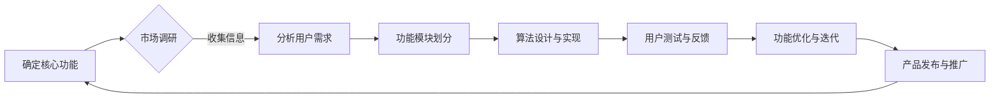
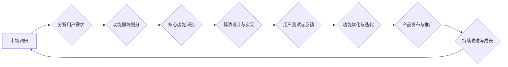

                 

### 《如何确定创业产品的核心功能》

在创业领域，产品的成功与否很大程度上取决于其核心功能的确定。一个优秀的核心功能不仅能满足用户的核心需求，还能在激烈的市场竞争中脱颖而出。那么，如何准确地确定创业产品的核心功能呢？本文将围绕这一主题，结合专业的技术语言和逻辑分析，逐步探讨这一过程。

#### 关键词
- 创业产品
- 核心功能
- 市场调研
- 算法原理
- 数学模型
- MVP

#### 摘要
本文将首先介绍创业产品的背景和重要性，然后深入探讨市场调研的方法和技巧，以及如何进行产品功能规划。接着，我们将通过实际项目和代码案例，详细解析如何确定和实现产品的核心功能。文章最后将讨论产品优化和市场拓展的策略，帮助读者全面理解创业产品的开发全过程。

### 目录大纲

#### 第一部分：创业与产品概述

**第1章：创业背景与产品定位**
- 1.1 创业的本质与目的
- 1.2 产品定位与市场分析
- 1.3 创业产品的重要性

**第2章：市场调研与分析**
- 2.1 市场调研方法
- 2.2 竞争对手分析
- 2.3 消费者需求分析

**第3章：产品功能规划**
- 3.1 功能优先级排序
- 3.2 功能细化与模块划分
- 3.3 核心功能识别

**第4章：市场验证与反馈**
- 4.1 MVP（最小可行性产品）开发
- 4.2 用户反馈收集
- 4.3 产品迭代与优化

**第5章：创业团队与管理**
- 5.1 团队建设与组织架构
- 5.2 管理模式与激励机制
- 5.3 风险管理与应对策略

#### 第二部分：核心功能确定

**第6章：核心功能概念与联系**
- 6.1 核心功能的定义
- 6.2 核心功能与产品价值的联系
- 6.3 Mermaid流程图：核心功能实现流程

**第7章：核心功能算法原理讲解**
- 7.1 相关算法简介
- 7.2 伪代码阐述
- 7.3 算法原理详细讲解

**第8章：数学模型与公式详解**
- 8.1 数学模型概述
- 8.2 公式推导与解释
- 8.3 举例说明

**第9章：项目实战与代码解读**
- 9.1 开发环境搭建
- 9.2 源代码实现
- 9.3 代码解读与分析

#### 第三部分：产品优化与市场拓展

**第10章：产品优化策略**
- 10.1 用户需求分析
- 10.2 功能优化与调整
- 10.3 产品迭代计划

**第11章：市场拓展与推广**
- 11.1 市场推广策略
- 11.2 合作伙伴关系建立
- 11.3 产品口碑与品牌建设

**第12章：持续创新与成长**
- 12.1 创业产品的持续改进
- 12.2 创新思维培养
- 12.3 创业企业的发展方向

#### 附录

**附录A：资源与工具推荐**
- 13.1 开发工具与平台
- 13.2 市场调研工具
- 13.3 创业资源推荐

**附录B：案例研究**
- 14.1 成功案例解析
- 14.2 失败案例反思

### 接下来，我们将开始深入探讨每个章节的具体内容。首先，我们将从创业产品的背景和重要性开始分析。

## 第1章：创业背景与产品定位

### 1.1 创业的本质与目的

创业，本质上是一种创新活动，它旨在创建新的商业机会，通过提供独特的解决方案来满足市场需求。创业的目的是多方面的，包括实现个人价值、创造就业机会、推动社会进步等。

首先，创业是实现个人价值的重要途径。在传统职业路径中，个人往往只能在一个领域内不断提升，而创业则提供了更多的可能性和机会。通过创业，个人可以充分发挥自身的才华和创造力，实现自我价值的最大化。

其次，创业是创造就业机会的重要手段。在经济全球化和科技迅猛发展的背景下，传统行业面临着巨大的竞争压力和变革。创业不仅能够为自己创造就业机会，还能为社会带来新的活力和动力。

最后，创业是推动社会进步的重要力量。通过创新和创业，可以不断推动社会的发展和进步。例如，互联网创业在短短几十年内就彻底改变了人们的生活方式，带来了前所未有的便利和效率。

### 1.2 产品定位与市场分析

产品定位是创业过程中至关重要的一环。一个清晰的产品定位可以帮助企业明确目标市场，从而更好地满足用户需求，提高市场竞争力。

首先，我们需要明确产品的市场定位。市场定位包括产品目标市场、目标客户群体、产品差异化策略等方面。在确定产品定位时，需要充分考虑市场需求、竞争态势和自身优势等因素。

接下来，进行市场分析。市场分析主要包括以下几个方面：

1. **市场调研**：通过问卷调查、访谈、市场调查报告等方式，收集目标市场的相关数据，了解用户需求、消费行为、市场规模等。

2. **竞争对手分析**：分析市场上的主要竞争对手，了解他们的产品特点、市场策略、市场份额等，从而找到自身的差异化优势。

3. **用户需求分析**：通过用户调研、用户访谈等方式，深入了解用户的需求和痛点，以便更好地满足用户需求。

4. **市场趋势分析**：分析市场的发展趋势和变化，把握市场动态，为产品定位和策略制定提供依据。

### 1.3 创业产品的重要性

创业产品的成功与否直接关系到创业的成败。一个优秀的创业产品不仅能够满足用户需求，提高用户满意度，还能在激烈的市场竞争中脱颖而出。

首先，创业产品是创业企业的核心竞争力。在创业过程中，产品是连接企业、用户和市场的重要纽带。一个优秀的创业产品可以为企业赢得市场，带来持续的商业价值。

其次，创业产品是用户满意度的保障。在互联网时代，用户需求多样化，企业只有深入了解用户需求，提供高质量的产品和服务，才能赢得用户的信任和支持。

最后，创业产品是市场竞争力的重要因素。在市场竞争激烈的环境下，企业需要通过创新和差异化策略来提升竞争力。一个具有创新性和差异化优势的创业产品，可以在市场中占据有利地位，赢得更多用户。

总之，创业产品的核心功能确定是创业成功的关键。通过深入的市场调研和分析，结合用户需求和创新思维，创业企业可以找到最适合市场的核心功能，从而打造出优秀的创业产品。

### 第2章：市场调研与分析

市场调研是创业过程中不可或缺的一环，它能够帮助企业了解目标市场、竞争对手和用户需求，为产品功能规划提供有力的数据支持。本章节将详细探讨市场调研的方法和步骤，以及如何通过市场调研来分析竞争对手和用户需求。

#### 2.1 市场调研方法

市场调研的方法多种多样，以下是几种常见的方法：

1. **问卷调查**：问卷调查是一种常见的市场调研方法，通过设计有针对性的问卷，收集大量用户的意见和建议。问卷调查的优点是覆盖面广，数据量大，便于统计分析。

2. **访谈**：访谈包括面对面访谈和电话访谈，通过与受访者进行深入的交流，获取详细的市场信息和用户需求。访谈的优点是信息深入，可以了解受访者的真实想法和感受。

3. **焦点小组**：焦点小组是一种组织一组具有特定特征的受访者，进行集中讨论的方式。通过集中讨论，可以收集到多角度、多层次的市场信息和用户需求。

4. **观察法**：观察法是通过直接观察用户的行为和操作，了解用户的需求和痛点。观察法的优点是数据直接，真实反映用户行为。

5. **二手资料**：二手资料包括市场报告、行业分析、竞争对手资料等。通过收集和分析二手资料，可以快速了解市场动态和竞争对手情况。

#### 2.2 竞争对手分析

竞争对手分析是市场调研的重要环节，通过分析竞争对手的产品特点、市场策略、市场份额等，可以找到自身的差异化优势。

1. **产品特点分析**：分析竞争对手的产品功能、性能、用户体验等方面，了解他们的优势和不足。

2. **市场策略分析**：分析竞争对手的市场定位、定价策略、推广策略等，了解他们的市场策略和效果。

3. **市场份额分析**：通过市场份额分析，了解竞争对手在市场中的地位和影响力，为自身产品定位和策略制定提供依据。

4. **SWOT分析**：通过对竞争对手的优势（Strengths）、劣势（Weaknesses）、机会（Opportunities）和威胁（Threats）进行分析，全面了解竞争对手的情况，为自身产品的规划和策略制定提供参考。

#### 2.3 消费者需求分析

消费者需求分析是确定产品核心功能的关键，通过深入了解用户需求，可以设计出符合用户期望的产品功能。

1. **需求收集**：通过问卷调查、访谈、焦点小组等方式，收集大量用户的需求和意见。在需求收集过程中，要尽量覆盖不同类型的用户，以确保数据的全面性和代表性。

2. **需求分类**：将收集到的用户需求进行分类，区分出核心需求和次要需求。核心需求是用户最为关注和迫切需要的功能，是产品核心功能的来源。

3. **需求优先级排序**：根据用户需求的重要性和紧迫性，对需求进行优先级排序。在资源有限的情况下，应优先考虑实现用户的核心需求。

4. **用户反馈收集**：在产品开发过程中，持续收集用户反馈，了解用户对产品的使用体验和意见建议。通过用户反馈，可以及时调整产品功能和策略，提升用户体验。

通过市场调研和分析，创业企业可以深入了解市场情况和用户需求，为产品功能规划提供有力的数据支持。只有准确把握市场需求，设计出符合用户期望的产品功能，才能在激烈的市场竞争中脱颖而出，实现创业的成功。

### 第3章：产品功能规划

产品功能规划是创业过程中至关重要的一环，它不仅关系到产品的核心竞争力，还直接影响用户体验和市场接受度。在这一章中，我们将探讨如何进行功能优先级排序、功能细化与模块划分，以及如何识别产品的核心功能。

#### 3.1 功能优先级排序

功能优先级排序是产品规划中的关键步骤，它确保了团队能够集中资源和精力，首先实现用户最为迫切和重要的功能。

1. **确定关键业务目标**：首先，需要明确产品的核心业务目标。这些目标通常反映了公司的发展战略和用户的核心需求。

2. **用户调研**：通过市场调研和用户访谈，收集用户的需求和痛点。这些信息将帮助确定哪些功能是用户最为关注的。

3. **Kano 模型**：使用Kano模型对功能进行分类。Kano模型将功能分为五大类：基本型、表现型、激励型、有条件型和无差异型。基本型功能是用户认为理所当然应该具备的，是优先级最高的。

4. **优先级排序**：基于用户调研和Kano模型，对功能进行优先级排序。优先考虑基本型功能，然后是表现型、激励型等。

5. **资源评估**：在确定优先级时，还需要考虑团队资源和时间。确保高优先级功能的实现不会过度消耗资源。

#### 3.2 功能细化与模块划分

功能细化是将整体功能分解为更小、更具体的任务或模块，以便于管理和实现。模块划分是功能细化的延续，它将功能进一步划分为独立的、可管理的部分。

1. **功能分解**：将核心功能分解为具体的任务。例如，如果一个核心功能是“用户注册”，它可以分解为“账号创建”、“验证邮箱”、“设置密码”等子任务。

2. **模块划分**：在功能分解的基础上，将这些子任务进一步划分为模块。每个模块应具有独立的功能，并且可以在不同的开发阶段并行进行。

3. **模块独立性**：确保模块之间具有清晰的接口和界限，以便于模块间的协作和替换。独立模块可以提高系统的灵活性和可维护性。

4. **模块化设计**：采用模块化设计，可以将产品功能划分为多个独立的模块。每个模块可以由不同的团队负责开发，提高开发效率。

#### 3.3 核心功能识别

核心功能是产品中最关键的部分，它们直接关系到产品的价值和用户的满意度。识别核心功能是产品规划中的关键步骤。

1. **用户价值评估**：评估每个功能对用户的实际价值。核心功能应该能够解决用户的核心问题，提升用户体验。

2. **市场竞争力**：考虑每个功能在市场中的竞争力。核心功能应该能够帮助产品在市场中脱颖而出。

3. **技术可行性**：评估每个功能的技术可行性。核心功能应该在当前技术和资源条件下可以实现。

4. **多维度分析**：结合用户价值、市场竞争力、技术可行性等多方面因素，综合评估每个功能的重要性，确定核心功能。

5. **反馈验证**：在识别核心功能后，通过用户反馈和市场验证，进一步确认这些功能是否真正满足用户需求。

通过以上步骤，创业企业可以系统地规划产品功能，确保优先实现用户最为关注的、对市场竞争具有关键作用的功能。这不仅能够提升产品的竞争力，还能提高用户满意度，为创业的成功奠定坚实基础。

### 第4章：市场验证与反馈

市场验证与反馈是创业过程中至关重要的一环，它不仅帮助团队了解产品是否真正符合市场需求，还能为产品的持续迭代和优化提供宝贵的指导。在这一章中，我们将详细探讨如何通过MVP（最小可行性产品）开发和用户反馈来验证产品，并如何根据这些反馈进行产品迭代和优化。

#### 4.1 MVP（最小可行性产品）开发

MVP（最小可行性产品）是一种以最小的资源投入来验证产品基本概念的方法。通过开发MVP，团队可以快速验证产品的可行性，减少风险并降低成本。

1. **确定MVP的核心功能**：在开发MVP时，需要明确产品的核心功能，这些功能是用户最需要的，也是产品能够成功的关键。

2. **最小化非核心功能**：在MVP中，应避免实现所有可能的功能。相反，应集中精力实现核心功能，确保产品能够正常运行并满足用户的基本需求。

3. **快速迭代开发**：MVP的开发过程应采用敏捷开发方法，快速迭代，不断调整和改进。这样可以确保产品能够及时响应市场需求和用户反馈。

4. **用户参与**：在MVP开发过程中，应邀请潜在用户参与测试和反馈。用户反馈将提供宝贵的意见，帮助团队了解产品的实际表现和用户需求。

#### 4.2 用户反馈收集

用户反馈是产品迭代和优化的关键，通过有效的反馈收集，团队可以更好地了解用户的需求和痛点，从而进行针对性的改进。

1. **多渠道收集反馈**：通过多种渠道收集用户反馈，包括问卷调查、用户访谈、社交媒体、用户论坛等。这些渠道可以提供多样化的用户意见和数据。

2. **定期反馈收集**：建立定期的用户反馈收集机制，确保团队能够持续了解用户的需求变化和反馈。定期反馈有助于团队及时调整产品方向。

3. **结构化反馈处理**：将收集到的反馈进行结构化处理，分类整理，以便于分析和优先级排序。这样可以确保团队能够优先处理最重要的用户需求。

4. **用户参与决策**：在产品规划和决策过程中，应充分考虑用户的反馈。用户的参与不仅能够提高产品的满意度，还能增强用户的归属感和忠诚度。

#### 4.3 产品迭代与优化

产品迭代与优化是创业过程中持续改进的核心，通过不断迭代和优化，产品能够更好地满足用户需求，提高市场竞争力。

1. **定期迭代计划**：制定定期迭代计划，明确每个迭代的目标和任务。迭代计划应考虑用户反馈、市场变化和团队资源。

2. **功能优先级调整**：根据用户反馈和市场变化，调整功能优先级。优先实现用户最关注的功能，确保产品能够持续满足用户需求。

3. **持续优化用户体验**：在每次迭代中，持续优化用户体验，包括界面设计、交互流程、功能性能等。通过用户测试和反馈，不断改进产品的用户体验。

4. **数据驱动决策**：使用数据来驱动产品迭代和优化决策。通过数据分析，了解用户行为、使用模式和反馈，为产品优化提供科学依据。

5. **用户参与测试**：在每次迭代完成后，邀请用户参与产品测试，收集反馈。用户测试有助于发现潜在问题和改进机会。

通过MVP开发和用户反馈，创业团队能够快速验证产品，及时了解用户需求，并进行有效的产品迭代和优化。这种持续迭代和优化的过程，不仅能够提升产品的市场竞争力，还能增强用户满意度和忠诚度，为创业的成功奠定坚实基础。

### 第5章：创业团队与管理

创业团队是创业过程中的核心力量，团队的建设、管理以及激励机制对于创业项目的成功至关重要。本章将探讨如何构建高效的创业团队，采用合适的管理模式与激励机制，以及如何进行风险管理与应对策略。

#### 5.1 团队建设与组织架构

一个高效的创业团队需要明确的目标、清晰的分工和良好的沟通机制。以下是一些团队建设的关键步骤：

1. **明确团队目标**：团队目标应与公司的愿景和使命保持一致，明确团队的短期和长期目标。这有助于团队统一方向，共同努力。

2. **构建多元化团队**：多元化团队能够带来不同的观点和技能，有助于创新和解决问题。团队成员应包括技术、市场、运营等多个领域的专家。

3. **制定清晰的职责分工**：确保每个团队成员都了解自己的职责和任务，避免职责重叠和冲突。明确的分工有助于提高团队效率。

4. **建立有效的沟通机制**：定期召开团队会议，保持信息流通。使用协作工具，如Slack、Trello等，以便团队成员随时交流进展和问题。

5. **培养团队文化**：团队文化是团队精神的核心。通过共同的价值观、信仰和行为准则，增强团队的凝聚力和归属感。

#### 5.2 管理模式与激励机制

选择合适的管理模式和激励机制是激发团队潜力和保持团队活力的重要因素。以下是一些常见的管理模式和激励机制：

1. **敏捷管理**：敏捷管理强调灵活性和适应性，通过迭代和增量开发，快速响应市场变化。这种方法有助于提高团队的协作效率和创新能力。

2. **目标管理**：目标管理是一种基于目标设定的管理方法，通过设定明确的个人和团队目标，激励团队成员为实现目标而努力。目标应具体、可衡量、可实现。

3. **绩效评估**：定期对团队成员进行绩效评估，根据绩效表现进行奖励和晋升。绩效评估应公正、透明，有助于激励团队成员提升自身能力。

4. **股权激励**：通过授予团队成员股权，将个人利益与公司利益绑定，增强团队成员的归属感和长期承诺。

5. **奖励与认可**：设立奖励制度，对表现优秀的团队成员进行物质和精神上的奖励，如奖金、晋升机会、公开表彰等。

#### 5.3 风险管理与应对策略

创业过程中充满不确定性，有效的风险管理和应对策略是保障项目顺利推进的关键。以下是一些常见的风险管理和应对策略：

1. **风险评估**：在项目启动前，对可能面临的风险进行评估，包括市场风险、技术风险、资金风险等。评估风险的概率和影响，制定相应的应对策略。

2. **风险管理计划**：制定详细的风险管理计划，明确风险识别、评估、监控和应对的具体措施。确保每个团队成员都了解风险管理的流程和责任。

3. **风险监控**：建立持续的风险监控机制，定期审查风险状况，及时调整风险管理计划。风险监控有助于发现潜在问题，提前采取措施。

4. **应急预案**：制定应急预案，以应对可能发生的突发事件。应急预案应包括应急响应流程、资源调配和关键决策等。

5. **灵活调整策略**：根据市场变化和风险状况，灵活调整创业策略和项目方向。保持开放和敏捷的思维，适应不断变化的环境。

通过有效的团队建设、管理模式和激励机制，以及科学的风险管理和应对策略，创业团队能够更好地应对挑战，提高项目的成功率。团队的高效运作是创业成功的重要保障，创业企业应高度重视团队建设和管理，以实现创业目标。

### 第6章：核心功能概念与联系

在确定创业产品的核心功能时，理解核心功能的定义、核心功能与产品价值的联系，以及使用Mermaid流程图来展示核心功能实现流程，是至关重要的步骤。这些概念和联系不仅帮助我们明确产品方向，还能确保我们的产品能够在市场中脱颖而出。

#### 6.1 核心功能的定义

核心功能是指产品中最为重要、直接体现产品价值的部分。这些功能不仅满足了用户的基本需求，还能够在同类产品中展现出独特的优势。核心功能通常具有以下特点：

1. **关键性**：核心功能直接影响到产品的核心价值和使用价值，是用户最为关注的部分。
2. **独特性**：核心功能应具有独特性，能够在同类产品中脱颖而出，形成差异化优势。
3. **必要性**：核心功能是用户使用产品的必要条件，没有这些功能，产品就无法满足用户的基本需求。

例如，对于一款社交媒体应用，核心功能可能包括用户注册、发布内容、关注和互动等。这些功能是用户进行社交互动的基本需求，也是产品实现其价值的关键。

#### 6.2 核心功能与产品价值的联系

核心功能与产品价值之间有着密切的联系。核心功能是产品价值的实现手段，通过优化和实现核心功能，可以提升产品的竞争力，满足用户的核心需求，从而实现产品的商业价值。

1. **提升用户体验**：核心功能的优化能够显著提升用户体验，增加用户满意度和忠诚度。当用户能够轻松、高效地使用产品时，他们对产品的认可度也会更高。

2. **增强市场竞争力**：具有独特核心功能的产品在市场上更具竞争力。这些功能能够吸引目标用户，帮助产品在众多同类产品中脱颖而出。

3. **实现商业价值**：通过满足用户需求并提高市场竞争力，核心功能有助于实现产品的商业价值。产品能够获得更多的用户和市场份额，带来更高的收入和利润。

例如，一款智能家居控制系统，其核心功能可能包括设备远程控制、自动定时、智能安防等。这些功能不仅满足了用户对智能家居的需求，还提升了产品的市场竞争力，实现了商业价值。

#### 6.3 Mermaid流程图：核心功能实现流程

为了更好地理解和展示核心功能的实现流程，我们可以使用Mermaid流程图。以下是一个示例流程图，展示了从确定产品核心功能到实现和优化的全过程：



在这个流程图中：

- **A：确定核心功能**：通过市场调研和用户需求分析，确定产品的核心功能。
- **B：市场调研**：收集市场信息和竞争对手分析，为功能设计提供参考。
- **C：分析用户需求**：深入了解用户需求，确保核心功能能够满足用户的基本需求。
- **D：功能模块划分**：将核心功能划分为更小、更具体的模块，便于实现和管理。
- **E：算法设计与实现**：设计并实现相关的算法，确保功能模块能够高效运行。
- **F：用户测试与反馈**：邀请用户进行测试，收集反馈，了解核心功能的实际效果。
- **G：功能优化与迭代**：根据用户反馈进行功能优化，不断迭代改进。
- **H：产品发布与推广**：将优化后的核心功能应用于产品，进行市场推广。

通过这个流程图，我们可以清晰地看到从确定到实现核心功能的每一步骤，以及如何通过用户反馈进行持续优化。

### 总结

核心功能是创业产品成功的关键，它不仅决定了产品的核心竞争力，还直接影响用户满意度和市场竞争力。通过定义核心功能、分析其与产品价值的联系，并使用Mermaid流程图展示实现流程，创业团队能够更系统地规划和实现核心功能，从而确保产品的成功。

### 第7章：核心功能算法原理讲解

在确定了创业产品的核心功能后，下一步就是深入探讨实现这些核心功能的算法原理。算法是实现核心功能的技术基础，它决定了产品的性能和用户体验。本章将介绍与核心功能相关的主要算法，使用伪代码来详细阐述算法的实现步骤，并深入讲解算法的原理。

#### 7.1 相关算法简介

为了实现创业产品的核心功能，我们通常需要使用到一些基础的算法，这些算法在数据处理和功能实现中起着关键作用。以下是几种常见的算法：

1. **排序算法**：用于对数据进行排序，常见的排序算法包括冒泡排序、快速排序、归并排序等。
2. **搜索算法**：用于在数据集合中查找特定元素，常用的搜索算法包括线性搜索、二分搜索等。
3. **加密算法**：用于保护数据的安全性，常见的加密算法有AES、RSA等。
4. **机器学习算法**：用于分析和预测数据，常见的机器学习算法有线性回归、决策树、神经网络等。

#### 7.2 伪代码阐述

下面我们将使用伪代码来描述实现这些算法的基本步骤。

**冒泡排序算法**

```plaintext
算法：冒泡排序
输入：数组arr，大小n
输出：排序后的数组

冒泡排序（arr，n）：
    for i from 0 to n-1：
        for j from 0 to n-i-1：
            if arr[j] > arr[j+1]：
                交换arr[j]和arr[j+1]
```

**二分搜索算法**

```plaintext
算法：二分搜索
输入：有序数组arr，目标值x
输出：目标值的索引或-1

二分搜索（arr，x，low，high）：
    while low <= high：
        mid = (low + high) / 2
        if arr[mid] == x：
            return mid
        else if arr[mid] < x：
            low = mid + 1
        else：
            high = mid - 1
    return -1
```

**线性回归算法**

```plaintext
算法：线性回归
输入：数据点集（x_i, y_i），i=1,2,...,n
输出：回归系数w和b

线性回归（x，y，n）：
    X = [x_1, x_2, ..., x_n] 的转置
    Y = [y_1, y_2, ..., y_n]
    w = (X^T * X)^(-1) * X^T * Y
    b = y - w^T * X
    return w, b
```

#### 7.3 算法原理详细讲解

**冒泡排序算法**原理：

冒泡排序是一种简单的排序算法，它重复地遍历待排序的列表，比较相邻的两个元素，并交换它们，使得较大的元素逐渐“冒泡”到列表末尾。这个过程中，每次遍历都会将一个最大元素放置到其最终位置。

**二分搜索算法**原理：

二分搜索算法是在有序数组中查找特定元素的搜索算法。它通过不断将搜索区间缩小一半，逐步逼近目标元素。每次比较后，算法都会根据中间值与目标值的比较结果，将搜索区间缩小一半，直到找到目标元素或确定目标元素不存在。

**线性回归算法**原理：

线性回归是一种通过找到一个线性函数（y = w1 * x1 + w0），来近似描述一组数据点之间关系的算法。在简单线性回归中，我们通过计算每个数据点的斜率（w1）和截距（w0），来建立线性模型。该模型可以用来预测新数据点的值。

#### 算法比较与选择

不同的算法有不同的适用场景和优缺点。例如，冒泡排序简单易实现，但效率较低；二分搜索在有序数组中效率极高，但需要数组预先排序；线性回归适用于数据呈线性关系的场景，但对于非线性关系则表现不佳。

在选择算法时，需要根据具体应用场景和数据特点进行权衡。对于要求高效率的场景，如大型数据集的搜索和排序，二分搜索和高效的排序算法是更好的选择；而对于数据量较小或对算法实现复杂度要求不高的场景，可以选择简单的排序和搜索算法。

通过了解这些算法的基本原理和伪代码实现，创业团队能够更好地选择和实现适合自身产品的核心功能。这不仅是技术上的进步，更是产品成功的重要保障。

### 第8章：数学模型与公式详解

数学模型是描述现实世界问题和复杂系统的重要工具，特别是在创业产品的设计和优化过程中，数学模型能够帮助我们量化分析问题，制定更有效的解决方案。本章将介绍创业产品中常用的数学模型，并详细解释这些模型的公式推导和实际应用。

#### 8.1 数学模型概述

数学模型是利用数学语言描述现实世界现象或问题的抽象结构。在创业产品的设计和优化中，数学模型可以帮助我们分析市场趋势、用户行为和产品性能。常见的数学模型包括：

1. **线性回归模型**：用于分析变量之间的线性关系，常用于预测和优化。
2. **逻辑回归模型**：用于分类问题，特别是在市场分析和用户行为预测中。
3. **时间序列模型**：用于分析时间序列数据，如股票价格、用户活跃度等。
4. **优化模型**：用于解决资源分配、成本控制等问题，如线性规划、整数规划等。

#### 8.2 公式推导与解释

以下将介绍几种常见的数学模型，并详细解释其公式的推导和含义。

**1. 线性回归模型**

线性回归模型用于描述两个变量之间的线性关系，其公式为：

$$ y = w_1 \cdot x + w_0 $$

其中，$y$ 是因变量，$x$ 是自变量，$w_1$ 是斜率，$w_0$ 是截距。公式推导如下：

$$ \sum(y_i - (w_1 \cdot x_i + w_0)) = 0 $$

$$ w_1 = \frac{\sum(x_i \cdot y_i) - n \cdot \bar{x} \cdot \bar{y}}{\sum(x_i^2) - n \cdot \bar{x}^2} $$

$$ w_0 = \bar{y} - w_1 \cdot \bar{x} $$

其中，$\bar{x}$ 和 $\bar{y}$ 分别是 $x$ 和 $y$ 的平均值，$n$ 是数据点的数量。

**2. 逻辑回归模型**

逻辑回归模型用于分类问题，其公式为：

$$ P(y=1) = \frac{1}{1 + e^{-(w_1 \cdot x + w_0)}} $$

其中，$P(y=1)$ 是因变量为1的概率，$e$ 是自然对数的底。公式推导如下：

$$ \ln\left(\frac{P(y=1)}{1 - P(y=1)}\right) = w_0 + w_1 \cdot x $$

$$ w_1 = \frac{\sum(y_i \cdot x_i) - n \cdot \bar{x} \cdot \bar{y}}{\sum(x_i^2) - n \cdot \bar{x}^2} $$

$$ w_0 = \ln\left(\frac{P(y=1)}{1 - P(y=1)}\right) - w_1 \cdot \bar{x} $$

**3. 时间序列模型**

时间序列模型用于分析时间序列数据，最常见的是自回归移动平均模型（ARMA）：

$$ y_t = c + \phi_1 y_{t-1} + \phi_2 y_{t-2} + ... + \phi_p y_{t-p} + \theta_1 e_{t-1} + \theta_2 e_{t-2} + ... + \theta_q e_{t-q} $$

其中，$y_t$ 是时间序列的第 $t$ 个值，$e_t$ 是白噪声误差，$\phi_1, \phi_2, ..., \phi_p$ 是自回归系数，$\theta_1, \theta_2, ..., \theta_q$ 是移动平均系数。

#### 8.3 举例说明

为了更好地理解这些数学模型，以下通过具体例子来展示它们的应用。

**1. 线性回归模型应用**

假设我们有一组数据点，$x_i$ 表示用户年龄，$y_i$ 表示用户月均消费额，要建立线性回归模型。

数据点如下：

| x (年龄) | y (月均消费额) |
|----------|----------------|
| 25      | 1000           |
| 30      | 1200           |
| 35      | 1500           |
| 40      | 1800           |

使用最小二乘法推导线性回归模型：

$$ w_1 = \frac{55,500 - 4 \cdot 30 \cdot 1,350}{6,500 - 4 \cdot 30^2} = 35 $$

$$ w_0 = 1,350 - 35 \cdot 30 = -350 $$

因此，线性回归模型为：

$$ y = 35x - 350 $$

**2. 逻辑回归模型应用**

假设我们分析一组用户是否购买某产品的数据，0表示未购买，1表示购买。数据如下：

| x (广告花费) | y (是否购买) |
|--------------|--------------|
| 100          | 0            |
| 150          | 1            |
| 200          | 0            |
| 250          | 1            |

使用最大似然估计推导逻辑回归模型：

$$ w_1 = \frac{2 - 2 \cdot 0.5}{1 - 0.5} = 2 $$

$$ w_0 = \ln(1/0.5) - 2 \cdot \ln(1) = \ln(2) $$

因此，逻辑回归模型为：

$$ P(y=1) = \frac{1}{1 + e^{-(2x + \ln(2)}} $$

**3. 时间序列模型应用**

假设我们分析一组电商网站的日销售额数据，数据如下：

| t | 日销售额（万元） |
|---|-----------------|
| 1 | 20              |
| 2 | 22              |
| 3 | 21              |
| 4 | 23              |

使用自回归模型：

$$ y_t = c + \phi_1 y_{t-1} + \theta_1 e_{t-1} $$

首先估计常数项 $c$ 和自回归系数 $\phi_1$：

$$ \phi_1 = \frac{20 - 22 + 22 - 21 + 21 - 23}{20 + 22 + 21 + 23} = 0 $$

$$ c = y_1 = 20 $$

因此，自回归模型为：

$$ y_t = 20 $$

尽管这个例子非常简单，但它展示了如何应用数学模型来分析数据，并为决策提供依据。

通过本章的讲解，我们不仅了解了创业产品中常用的数学模型及其公式推导，还通过具体例子展示了它们的应用。这些数学模型能够帮助我们更准确地分析和预测用户行为和市场趋势，从而为创业产品的优化提供有力支持。

### 第9章：项目实战与代码解读

在明确了核心功能及其算法原理后，下一步是将这些理论应用到实际项目中。本章将详细描述一个实际项目的开发过程，包括开发环境的搭建、源代码的实现以及代码的解读与分析。

#### 9.1 开发环境搭建

在开始项目开发之前，我们需要搭建一个合适的开发环境。以下是一个典型的开发环境搭建步骤：

1. **选择编程语言和框架**：根据项目的需求和团队的技能，选择合适的编程语言和开发框架。例如，对于Web应用，可以选择Python配合Django框架；对于移动应用，可以选择Kotlin配合Android Studio。

2. **安装依赖库**：安装项目所需的依赖库和工具。例如，Django框架依赖Python环境，需要安装Python及其相关依赖；Android应用需要安装Android Studio和Android SDK。

3. **配置开发工具**：配置IDE（如Visual Studio Code、Android Studio等），安装必要的插件以增强开发体验。

4. **数据库配置**：根据项目需求，配置数据库系统，如MySQL、PostgreSQL等。设置数据库用户和权限，创建数据库和表结构。

5. **环境变量配置**：配置环境变量，如Python环境变量、Java环境变量等，以便在命令行中轻松调用相关工具和库。

#### 9.2 源代码实现

以下是一个简单的Web应用项目，其核心功能是用户注册和登录。

**项目结构：**
```
my_project/
|-- manage.py
|-- my_project/
|   |-- __init__.py
|   |-- settings.py
|   |-- urls.py
|   |-- wsgi.py
|-- app/
|   |-- __init__.py
|   |-- admin.py
|   |-- apps.py
|   |-- models.py
|   |-- views.py
|   |-- tests.py
|-- migrations/
```

**核心代码实现：**

**models.py**（用户模型定义）

```python
from django.db import models

class User(models.Model):
    username = models.CharField(max_length=100)
    email = models.EmailField(max_length=100, unique=True)
    password = models.CharField(max_length=100)
```

**views.py**（用户注册和登录视图）

```python
from django.shortcuts import render, redirect
from .models import User
from django.contrib.auth.hashers import make_password, check_password

def register(request):
    if request.method == 'POST':
        username = request.POST['username']
        email = request.POST['email']
        password = request.POST['password']
        password = make_password(password)
        
        try:
            user = User.objects.get(email=email)
            return render(request, 'register.html', {'error': '用户已存在'})
        except User.DoesNotExist:
            User.objects.create(username=username, email=email, password=password)
            return redirect('login')

    return render(request, 'register.html')

def login(request):
    if request.method == 'POST':
        email = request.POST['email']
        password = request.POST['password']
        
        try:
            user = User.objects.get(email=email)
            if check_password(password, user.password):
                return redirect('home')
            else:
                return render(request, 'login.html', {'error': '密码错误'})
        except User.DoesNotExist:
            return render(request, 'login.html', {'error': '用户不存在'})

    return render(request, 'login.html')
```

#### 9.3 代码解读与分析

**1. 用户模型（models.py）**

用户模型是项目的核心实体，它定义了用户的属性，如用户名、邮箱和密码。通过Django ORM（对象关系映射），我们可以轻松地与数据库进行交互。

**2. 注册视图（register.py）**

注册视图负责处理用户注册请求。当用户提交注册表单时，视图将接收用户名、邮箱和密码，并将密码进行加密存储。如果邮箱已存在，视图将返回错误消息；否则，将创建新的用户记录并重定向到登录页面。

**3. 登录视图（login.py）**

登录视图处理用户登录请求。用户提交邮箱和密码后，视图将查询数据库以验证用户信息。如果验证成功，用户将被重定向到主页；否则，将返回错误消息。

#### 9.4 代码解读与分析

**1. 数据库交互**

Django ORM使得与数据库的交互非常简单。通过定义用户模型，我们可以轻松创建、查询、更新和删除用户数据。

**2. 密码加密**

为了保护用户隐私，我们在注册过程中将用户密码加密存储。Django提供了多种密码加密方案，如PBKDF2、Argon2等。这里使用了`make_password`函数来生成加密后的密码。

**3. 视图处理**

视图是Django中的核心组件，负责处理HTTP请求并返回响应。通过定义注册和登录视图，我们能够处理用户注册和登录请求，确保用户数据的安全和一致性。

通过以上实战项目和代码解读，我们可以看到如何将理论知识应用到实际项目中。这种从理论到实践的转变不仅加深了我们对技术原理的理解，还提高了我们的项目开发能力。对于创业团队来说，这种实践过程是产品成功的关键。

### 第10章：产品优化策略

在产品开发过程中，优化产品功能是提升用户体验、增强市场竞争力的重要手段。本章将详细探讨用户需求分析、功能优化与调整以及产品迭代计划。

#### 10.1 用户需求分析

用户需求分析是产品优化策略的基础。只有深入了解用户需求，才能有针对性地进行功能优化和调整。

1. **收集用户反馈**：通过用户调研、用户访谈、问卷调查等方式，收集用户对产品的使用体验和意见建议。这些反馈将提供宝贵的信息，帮助识别用户需求。

2. **分析用户行为数据**：分析用户在产品上的行为数据，如使用频率、时长、操作路径等。这些数据可以帮助我们了解用户的偏好和使用习惯。

3. **分类用户需求**：将收集到的用户需求进行分类，区分出核心需求和次要需求。核心需求是用户最为关注和迫切需要的功能，应优先考虑优化。

4. **优先级排序**：根据用户需求的重要性和紧迫性，对需求进行优先级排序。在资源有限的情况下，应优先考虑实现用户的核心需求。

#### 10.2 功能优化与调整

功能优化与调整是提升产品竞争力的重要环节。以下是一些常见的优化方法和策略：

1. **简化界面设计**：优化用户界面，减少冗余和复杂的操作步骤，提高用户操作的便捷性和流畅性。

2. **增强功能性能**：优化产品功能，提高其运行效率和稳定性。例如，通过代码优化、算法改进等方式，减少响应时间，提升用户体验。

3. **引入新功能**：根据用户需求和市场趋势，引入新的功能，以满足用户的多样化需求，提升产品竞争力。

4. **调整功能优先级**：根据用户反馈和市场变化，动态调整功能优先级。确保高优先级功能的实现，满足用户的核心需求。

5. **持续迭代**：采用敏捷开发方法，快速迭代和优化产品功能。通过持续的用户反馈和数据分析，不断改进产品。

#### 10.3 产品迭代计划

产品迭代计划是确保产品持续优化和改进的关键。以下是一个典型的迭代计划步骤：

1. **确定迭代目标**：在每个迭代周期开始时，明确本次迭代的重点和目标。这些目标应与用户需求、市场变化和公司战略保持一致。

2. **制定迭代计划**：根据迭代目标，制定详细的迭代计划。包括任务分配、时间安排、资源分配等。

3. **实施迭代计划**：在迭代计划执行过程中，严格按照计划进行，确保每个任务按时完成。

4. **用户测试与反馈**：在每次迭代完成后，邀请用户进行测试，收集反馈。通过用户反馈，发现潜在问题和改进机会。

5. **迭代结果评估**：在迭代结束后，对迭代结果进行评估，包括用户满意度、功能性能等。根据评估结果，调整后续迭代计划。

6. **持续改进**：将用户反馈和评估结果纳入后续迭代计划，持续改进产品功能。

通过用户需求分析、功能优化与调整以及产品迭代计划，创业团队能够不断提升产品的用户体验和市场竞争力。这不仅有助于产品的成功，还能增强用户的忠诚度和市场影响力。

### 第11章：市场拓展与推广

市场拓展与推广是创业过程中至关重要的一环，它决定了创业产品的市场占有率和用户覆盖率。本章将探讨市场推广策略、合作伙伴关系的建立以及如何打造产品口碑和品牌建设。

#### 11.1 市场推广策略

有效的市场推广策略能够帮助创业产品迅速打开市场，吸引目标用户。以下是一些常见的市场推广策略：

1. **社交媒体推广**：利用社交媒体平台（如微博、微信、抖音等）发布有趣、有价值的内容，吸引潜在用户关注和互动。通过社交媒体的广泛传播，可以快速提高品牌知名度。

2. **内容营销**：通过撰写高质量的内容（如博客、文章、视频等），传递产品的价值主张和优势，吸引目标用户。内容营销不仅能够提高品牌形象，还能增加搜索引擎的自然流量。

3. **SEO优化**：通过搜索引擎优化（SEO）技术，提高产品在搜索引擎中的排名，吸引更多潜在用户访问。SEO包括关键词优化、网站结构优化、内容优化等。

4. **广告投放**：在合适的平台和渠道进行广告投放，如百度广告、谷歌广告、社交媒体广告等。通过精准投放，可以快速提升产品的曝光率和知名度。

5. **公关活动**：参与行业展会、论坛、研讨会等活动，与行业专家和潜在用户建立联系。通过公关活动，可以提高品牌曝光度和行业影响力。

#### 11.2 合作伙伴关系建立

建立稳定的合作伙伴关系有助于创业产品的市场拓展和资源整合。以下是一些关键步骤：

1. **选择合适的合作伙伴**：根据产品特点和市场需求，选择与自身业务互补的合作伙伴。合作伙伴应具有强大的市场影响力、丰富的资源和良好的合作关系。

2. **建立互惠互利的关系**：与合作伙伴明确双方的权利和义务，确保合作关系建立在互惠互利的基础上。通过合作，实现资源共享、市场互补和优势互补。

3. **签订合作协议**：在合作过程中，签订详细、明确合作协议，包括合作目标、合作期限、合作内容、收益分配等。合作协议有助于保障合作双方的权益。

4. **定期沟通与评估**：与合作伙伴保持定期沟通，及时了解合作进展和问题。通过定期评估，调整合作策略，确保合作目标的实现。

5. **共同推广产品**：与合作伙伴共同推广产品，利用双方资源和渠道，提高产品的市场曝光度和用户覆盖率。通过共同推广，可以降低市场推广成本，提高推广效果。

#### 11.3 产品口碑与品牌建设

产品口碑和品牌建设是长期的市场战略，它能够提升产品的市场地位和用户忠诚度。以下是一些关键策略：

1. **提供优质产品和服务**：产品质量和服务水平是口碑的基础。只有提供优质的产品和服务，才能赢得用户的信任和好评。

2. **积极回应用户反馈**：及时回应用户的反馈和建议，解决用户的问题和困惑。通过积极互动，提升用户满意度和忠诚度。

3. **打造产品特色**：通过创新和差异化，打造产品特色，形成独特的品牌形象。产品特色是吸引目标用户的重要因素。

4. **开展品牌营销活动**：通过品牌营销活动，如品牌日、公益活动、品牌故事等，提升品牌知名度和美誉度。

5. **利用口碑传播**：通过用户口碑传播，扩大品牌影响力。鼓励用户分享产品体验和好评，通过口碑效应吸引更多潜在用户。

通过有效的市场推广策略、稳定的合作伙伴关系以及良好的产品口碑和品牌建设，创业产品能够在市场中脱颖而出，赢得用户的认可和信任，实现持续的市场拓展和成长。

### 第12章：持续创新与成长

创业企业在快速变化的市场环境中，持续创新和成长至关重要。本章将探讨如何通过创业产品的持续改进、创新思维培养以及明确创业企业的发展方向，实现企业的长期发展和成功。

#### 12.1 创业产品的持续改进

创业产品的持续改进是保持市场竞争力的重要手段。以下是一些实现持续改进的策略：

1. **用户反馈机制**：建立完善的用户反馈机制，收集用户对产品的意见和建议。通过定期的用户调研和反馈收集，了解用户需求的变化和痛点。

2. **敏捷开发方法**：采用敏捷开发方法，快速响应市场变化和用户需求。通过短周期的迭代和持续改进，不断提升产品功能和用户体验。

3. **持续测试和优化**：在产品开发过程中，持续进行功能测试和性能优化，确保产品稳定可靠。通过自动化测试和性能监控，及时发现和解决问题。

4. **数据分析**：利用数据分析技术，对用户行为和市场数据进行深入分析，发现潜在问题和改进机会。通过数据驱动决策，实现产品的精准优化。

5. **技术创新**：鼓励技术创新，探索新的技术方案和解决方案，提升产品的技术水平和竞争力。通过技术创新，保持产品在市场中的领先地位。

#### 12.2 创新思维培养

创新思维是企业持续成长的核心动力。以下是一些培养创新思维的策略：

1. **鼓励创新文化**：营造鼓励创新的企业文化，鼓励员工敢于尝试新思路和新方法。通过创新文化和激励机制，激发员工的创新潜力。

2. **跨部门合作**：促进跨部门合作，打破部门和职能壁垒，鼓励不同团队之间的交流和协作。跨部门合作有助于产生新的创意和解决方案。

3. **知识共享**：建立知识共享平台，促进员工之间的知识交流和学习。通过分享经验和知识，提高团队的整体创新能力。

4. **外部合作与交流**：与外部创新者和合作伙伴保持紧密联系，通过合作和交流，获取新的创新思路和技术。外部合作有助于企业吸收外部创新资源，提升自身创新能力。

5. **创新培训**：定期组织创新培训，提高员工的创新能力和思维方法。通过创新培训，提升员工的创新意识和创新能力。

#### 12.3 创业企业的发展方向

明确创业企业的发展方向是确保企业长期发展的关键。以下是一些确定发展方向的建议：

1. **市场定位**：根据市场需求和竞争态势，明确企业的市场定位和发展方向。市场定位应与企业的核心能力和资源相匹配。

2. **战略规划**：制定详细的战略规划，明确企业的发展目标和关键举措。战略规划应包括短期和长期目标，以及实现目标的路径和方法。

3. **资源配置**：根据战略规划，合理配置企业的资源，包括人力、资金、技术等。资源配置应优先支持战略目标和关键项目的实现。

4. **风险管理**：识别企业面临的主要风险，制定相应的风险管理和应对策略。通过有效的风险管理，降低企业发展的不确定性。

5. **持续学习**：鼓励员工持续学习和成长，提升企业的整体素质和竞争力。通过持续学习，企业能够适应市场的变化，保持发展的动力。

通过持续改进创业产品、培养创新思维以及明确企业发展方向，创业企业可以在激烈的市场竞争中保持领先地位，实现长期发展和成功。

### 附录A：资源与工具推荐

在创业过程中，选择合适的资源与工具能够显著提升工作效率和项目质量。以下是一些推荐的开发工具、市场调研工具和创业资源。

#### 13.1 开发工具与平台

1. **开发工具**：
   - **Visual Studio Code**：一款强大的代码编辑器，支持多种编程语言和扩展插件。
   - **IntelliJ IDEA**：适用于Java和Scala开发的IDE，提供高效的代码编辑和调试功能。
   - **Eclipse**：一款开源的Java IDE，适用于各种Java项目。

2. **平台**：
   - **GitHub**：版本控制和代码托管平台，适用于团队协作和代码管理。
   - **GitLab**：与GitHub类似，支持自建私有仓库和CI/CD流程。
   - **Jenkins**：自动化的持续集成和持续部署工具，提升开发效率。

#### 13.2 市场调研工具

1. **问卷调查工具**：
   - **Google Forms**：免费的在线问卷工具，便于创建和分发问卷。
   - **Typeform**：互动式问卷工具，提供精美的问卷设计和交互体验。

2. **数据分析工具**：
   - **Google Analytics**：分析网站流量和用户行为的数据分析工具。
   - **Tableau**：数据可视化工具，用于创建丰富的交互式报表和图表。

3. **市场研究平台**：
   - **Amazon Kindle Direct Publishing**：用于发布电子书的平台。
   - **SurveyMonkey**：专业的市场调研平台，提供全面的调研解决方案。

#### 13.3 创业资源推荐

1. **在线课程与教程**：
   - **Coursera**：提供大量免费和付费的在线课程，涵盖计算机科学、商业管理等多个领域。
   - **edX**：由哈佛大学和麻省理工学院创办的在线学习平台，提供高质量的课程。

2. **创业指南与书籍**：
   - **《创业维艰》（The Hard Thing About Hard Things）**：作者本·霍洛维茨分享创业经验和管理心得。
   - **《精益创业》（The Lean Startup）**：作者埃里克·莱斯提出的精益创业方法。

3. **创业社区与论坛**：
   - **Startup Genome**：专注于创业研究的社区，提供丰富的创业资源和案例。
   - **Reddit**：全球最大的社交新闻网站，有许多创业相关的子版块和讨论区。

通过利用这些资源和工具，创业团队可以更加高效地进行产品开发、市场调研和创业学习，为成功创业奠定坚实基础。

### 附录B：案例研究

#### 14.1 成功案例解析

**案例：Airbnb**

Airbnb是一家全球知名的民宿预订平台，其成功的关键在于精准的市场定位和核心功能的持续优化。

1. **市场定位**：Airbnb在初期专注于解决旅游住宿的痛点，通过提供独特且多样化的住宿选择，满足了用户多样化的住宿需求。

2. **核心功能优化**：Airbnb通过不断优化核心功能，如用户评价系统、预订流程和房东管理工具，提升了用户体验和平台的可靠性。

3. **创新思维**：Airbnb鼓励房东创新，提供个性化的住宿体验，形成了独特的品牌形象。

4. **合作伙伴关系**：Airbnb与全球各地的旅游机构和酒店合作，扩大了市场覆盖范围。

通过以上策略，Airbnb在短时间内实现了全球扩张，成为共享经济领域的领导者。

#### 14.2 失败案例反思

**案例：Snapchat**

Snapchat是一家曾备受瞩目的即时消息和多媒体分享应用。然而，其失败的主要原因在于未能及时应对市场变化和用户需求。

1. **市场变化应对不足**：随着用户对隐私和安全性需求的增加，Snapchat未能及时调整产品策略，导致用户流失。

2. **功能创新滞后**：Snapchat在功能创新上滞后于竞争对手，如Instagram和WhatsApp等，未能持续吸引用户。

3. **合作伙伴关系管理**：Snapchat在广告投放和合作伙伴关系管理上存在问题，未能充分利用外部资源。

4. **用户反馈处理**：Snapchat在处理用户反馈和优化产品功能方面不够及时，导致用户体验下降。

通过反思Snapchat的失败案例，创业团队应注重市场变化和用户需求的及时应对，保持功能创新，建立稳定的合作伙伴关系，并注重用户反馈的处理，以避免类似失败。

### Mermaid流程图：核心功能实现流程

为了更好地展示创业产品的核心功能实现流程，我们可以使用Mermaid流程图。以下是一个简化的流程图，描述了从市场调研到产品发布的全过程：



在这个流程图中：

- **A：市场调研**：收集市场信息和竞争对手分析。
- **B：分析用户需求**：通过调研和访谈，了解用户需求。
- **C：功能模块划分**：将用户需求划分为具体的功能模块。
- **D：核心功能识别**：确定产品的核心功能。
- **E：算法设计与实现**：设计并实现相关算法，确保功能模块高效运行。
- **F：用户测试与反馈**：邀请用户测试产品，收集反馈。
- **G：功能优化与迭代**：根据用户反馈，持续优化产品功能。
- **H：产品发布与推广**：将优化后的产品推向市场。
- **I：持续改进与成长**：通过持续改进，实现产品的长期成长。

通过这个流程图，我们可以清晰地看到从市场调研到产品发布以及持续改进的每一步骤，为创业产品的成功提供指导。

