                 

### 如何设计高并发的系统架构

> 关键词：高并发、系统架构、负载均衡、分布式系统、CAP 定理、BASE 定理、微服务、缓存策略

> 摘要：随着互联网技术的快速发展，高并发系统设计已成为现代系统架构中不可或缺的一部分。本文将深入探讨高并发系统架构的设计原则和方法，包括基础概念、架构设计、负载均衡与流量控制、数据存储与缓存、高可用性与容灾恢复以及监控与优化等方面。通过实际案例，读者将更好地理解高并发系统架构的实战技巧和关键挑战。

---

### 目录大纲

1. **如何设计高并发的系统架构**
   - 关键词
   - 摘要
2. **第一部分：基础概念与架构设计**
   - 第1章：高并发系统概述
     - 1.1 高并发系统的重要性
     - 1.2 高并发系统面临的挑战
     - 1.3 高并发系统的典型场景
     - 1.4 高并发系统设计原则
   - 第2章：核心概念与联系
     - 2.1 并发、并行与分布式
     - 2.2 CAP 定理
     - 2.3 BASE 定理
3. **第二部分：架构设计与实现**
   - 第3章：系统架构设计基础
     - 3.1 架构设计方法论
     - 3.2 分层架构设计
     - 3.3 微服务架构设计
     - 3.4 API 网关设计
   - 第4章：负载均衡与流量控制
     - 4.1 负载均衡原理
     - 4.2 常见负载均衡算法
     - 4.3 流量控制策略
   - 第5章：数据存储与缓存
     - 5.1 数据存储架构设计
     - 5.2 缓存策略与实现
     - 5.3 分布式数据库设计
     - 5.4 数据一致性保障
   - 第6章：高可用性与容灾恢复
     - 6.1 高可用性设计原则
     - 6.2 故障转移与恢复机制
     - 6.3 容灾备份策略
     - 6.4 灾难恢复计划
   - 第7章：监控与优化
     - 7.1 系统监控工具选择
     - 7.2 性能优化方法
     - 7.3 自动化运维
     - 7.4 性能测试与调优
4. **第三部分：实战案例与总结**
   - 第8章：高并发系统实战案例
     - 8.1 案例背景与目标
     - 8.2 系统架构设计
     - 8.3 关键技术实现
     - 8.4 优化与调优
   - 第9章：高并发系统设计总结
     - 9.1 设计经验总结
     - 9.2 面临的挑战与展望
     - 9.3 对未来高并发系统设计的思考
   - 第10章：附录
     - 10.1 常用技术栈与工具
     - 10.2 参考文献

### 引言

随着互联网业务的不断扩张，高并发系统设计已成为现代软件工程中的重要课题。高并发系统是指在短时间内处理大量请求的能力，它不仅关系到用户体验，还直接影响业务的稳定性和可靠性。一个设计良好的高并发系统能够有效地应对突如其来的流量高峰，保证系统的稳定运行。

本文旨在为读者提供一份系统化、全面的高并发系统架构设计指南。通过深入剖析基础概念、架构设计原则以及关键实现技术，读者将能够更好地理解高并发系统的设计思路和方法，从而在实际项目中游刃有余。

本文分为三大部分：

- **第一部分**介绍了高并发系统的基本概念和架构设计原则，包括并发、并行与分布式等核心概念，以及CAP定理和BASE定理。
- **第二部分**详细探讨了系统架构设计的具体实现，包括分层架构、微服务架构、API网关设计、负载均衡与流量控制、数据存储与缓存、高可用性与容灾恢复以及监控与优化。
- **第三部分**通过一个实际案例，展示了高并发系统设计的过程、关键技术和优化方法，并对整个设计过程进行了总结和展望。

通过本文的阅读，读者将能够掌握高并发系统设计的基本方法，并在实际项目中应用这些知识，提升系统的性能和稳定性。

### 第一部分：基础概念与架构设计

在深入探讨高并发系统架构的设计之前，我们需要先了解一些基础概念。这些概念将帮助我们更好地理解高并发系统的本质和架构设计的关键要素。

#### 第1章：高并发系统概述

**1.1 高并发系统的重要性**

高并发系统在现代互联网应用中扮演着至关重要的角色。随着互联网用户的快速增长和业务需求的不断变化，系统能够在高流量情况下保持稳定运行已成为基本要求。以下是一些高并发系统的重要性：

- **用户体验**：高并发系统能够确保在大量用户同时访问时，系统的响应速度和稳定性不受影响，从而提供良好的用户体验。
- **业务连续性**：对于许多互联网业务来说，一旦系统崩溃或响应缓慢，可能会导致严重的业务损失。高并发系统能够保证业务的连续性和稳定性。
- **资源利用**：合理的高并发系统设计能够最大化利用系统资源，避免资源浪费，提高系统的性能和效率。

**1.2 高并发系统面临的挑战**

尽管高并发系统的重要性不言而喻，但其设计也面临许多挑战：

- **性能瓶颈**：在高并发环境下，系统可能会遇到性能瓶颈，如CPU、内存、网络等资源的瓶颈。
- **资源争用**：多线程或多进程并发执行时，可能会出现资源争用问题，导致系统不稳定。
- **数据一致性**：在高并发环境下，如何保证数据的一致性是一个重要问题，尤其是在分布式系统中。
- **可靠性**：高并发系统需要在高负载下保持高可靠性，避免因异常处理不当而导致的系统崩溃。

**1.3 高并发系统的典型场景**

以下是一些典型的需要高并发系统支持的场景：

- **电商秒杀**：在秒杀活动中，大量用户同时抢购商品，系统需要能够快速处理这些请求。
- **在线教育平台**：在线教育平台需要支持大量的学生同时在线学习，系统需要能够处理并发登录、视频播放等请求。
- **社交媒体**：社交媒体平台需要处理海量的用户请求，包括消息推送、内容发布、评论等。
- **金融交易**：金融交易系统需要能够实时处理大量的交易请求，确保交易的准确性和及时性。

**1.4 高并发系统设计原则**

为了应对高并发系统面临的挑战，设计高并发系统时需要遵循以下原则：

- **模块化设计**：将系统拆分为独立的模块，每个模块负责特定的功能，有助于提高系统的可维护性和扩展性。
- **分布式架构**：采用分布式架构，将系统部署在多个节点上，通过负载均衡和分布式计算提高系统的并发处理能力。
- **缓存策略**：合理使用缓存策略，减少对后端存储的访问压力，提高系统的响应速度。
- **异步处理**：采用异步处理机制，将耗时的操作放入异步队列中处理，避免阻塞主线程，提高系统的并发能力。
- **故障转移**：设计故障转移机制，确保在某个节点或系统出现故障时，其他节点能够接管其工作，保证系统的可靠性。
- **性能测试**：进行充分的性能测试，确保系统在高并发环境下能够稳定运行。

#### 第2章：核心概念与联系

**2.1 并发、并行与分布式**

在讨论高并发系统时，我们需要明确几个关键概念：并发、并行和分布式。

- **并发**：并发是指系统在多个任务之间交替执行的能力。在单处理器系统中，通过时间片轮转等方式实现并发。在多处理器系统中，多个任务可以同时执行，从而提高处理效率。
  
  ```mermaid
  graph TD
  A[单处理器系统] --> B[时间片轮转]
  A --> C[多处理器系统]
  C --> D[任务并行执行]
  ```

- **并行**：并行是指系统在多个任务之间同时执行的能力。并行可以发生在单处理器和多处理器系统中，但通常在多处理器系统中更加常见。

  ```mermaid
  graph TD
  A[多处理器系统] --> B[多任务并行执行]
  ```

- **分布式**：分布式是指系统由多个独立的节点组成，这些节点通过网络进行通信，共同完成一个任务。分布式系统可以显著提高系统的并发处理能力和容错能力。

  ```mermaid
  graph TD
  A[节点1] --> B[节点2]
  B --> C[节点3]
  ```

**2.2 CAP 定理**

CAP定理是分布式系统设计中的一个基本原理，由Eric Brewer提出。CAP定理指出，在一个分布式系统中，一致性（Consistency）、可用性（Availability）和分区容错性（Partition tolerance）这三个特性中，只能同时满足两个。

- **一致性（Consistency）**：所有节点在同一时刻看到的数据是一致的。
- **可用性（Availability）**：系统始终能够响应请求，即使某些节点出现故障。
- **分区容错性（Partition tolerance）**：系统能够在分区（即节点之间通信失败）的情况下继续运行。

CAP定理可以表示为以下公式：

\[ CP \lor AP \]

- **CP（一致性+分区容错性）**：系统在一致性和分区容错性之间做出选择。例如，Google的Bigtable就是一个CP系统。
- **AP（可用性+分区容错性）**：系统在可用性和分区容错性之间做出选择。例如，Amazon的Dynamo是一个AP系统。

**2.3 BASE 定理**

BASE定理是对CAP定理的一种扩展，由Eric Brewer在2012年提出。BASE定理指出，在不可靠的系统中，数据最终一致性是可实现的，但系统必须同时满足基本可用性和最终一致性。

- **基本可用性（Basic Availability）**：系统在大部分时间都能够对外提供服务，即使某些部分出现故障。
- **软状态（Soft state）**：系统允许临时不一致的状态存在，因为最终会达到一致。
- **最终一致性（Eventual consistency）**：系统最终会达到一致状态，但可能需要一段时间。

BASE定理可以表示为以下公式：

\[ BA \land EA \]

- **BA（基本可用性+最终一致性）**：系统在基本可用性和最终一致性之间做出选择。例如，Cassandra是一个BA系统。
- **EA（最终可用性+最终一致性）**：系统在最终可用性和最终一致性之间做出选择。这种情况在实际中较为少见。

#### 结论

通过本部分的基础概念和架构设计概述，我们了解了高并发系统的重要性、面临的挑战以及典型场景，同时明确了并发、并行、分布式等核心概念以及CAP定理和BASE定理的基本原理。这些基础概念和设计原则将为后续的架构设计和实现提供重要的理论支持。

### 第二部分：架构设计与实现

#### 第3章：系统架构设计基础

系统架构设计是高并发系统实现的核心环节。一个良好的系统架构不仅能够提高系统的性能和可靠性，还能够为后续的扩展和维护提供便利。在这一章中，我们将介绍系统架构设计的基础知识，包括架构设计方法论、分层架构设计、微服务架构设计以及API网关设计。

**3.1 架构设计方法论**

架构设计方法论是系统架构设计的基本指导原则。以下是几种常用的架构设计方法论：

- **自顶向下设计**：从系统的整体需求出发，逐步分解为各个模块，然后设计各个模块的内部细节。
- **自底向上设计**：从具体的模块和组件开始，逐步向上构建整个系统，直至满足整体需求。
- **迭代式设计**：在开发过程中不断迭代和改进，每次迭代都关注于解决特定问题，逐步完善整个系统。
- **面向服务架构（SOA）**：将系统功能拆分为多个服务，每个服务都是独立的功能模块，通过服务接口进行通信。

**3.2 分层架构设计**

分层架构设计是系统架构设计中最常用的一种方法。分层架构将系统划分为多个层次，每个层次负责特定的功能。常见的层次包括：

- **表现层（Presentation Layer）**：负责与用户的交互，包括前端界面和客户端应用程序。
- **业务逻辑层（Business Logic Layer）**：包含系统的核心业务逻辑，不依赖于具体的表现形式或数据存储方式。
- **数据访问层（Data Access Layer）**：负责与数据存储系统的交互，提供数据访问接口。

以下是分层架构设计的一个示例：

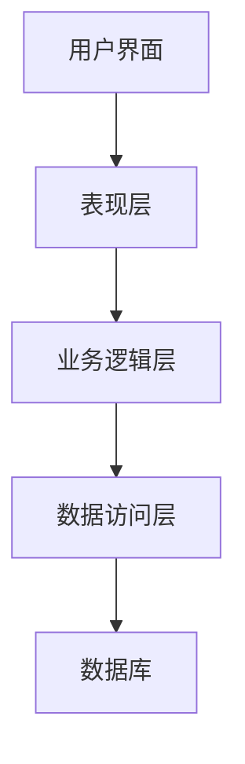

**3.3 微服务架构设计**

微服务架构设计是一种基于组件的架构设计方法，它将系统功能拆分为多个独立的微服务。每个微服务都是一个小型、自治的服务单元，可以独立部署、扩展和更新。微服务架构具有以下优点：

- **高可扩展性**：每个微服务都可以独立扩展，从而提高系统的整体并发处理能力。
- **高容错性**：当一个微服务出现问题时，不会影响其他微服务的运行。
- **快速迭代**：每个微服务都可以独立开发和部署，从而提高开发效率。

以下是微服务架构设计的一个示例：

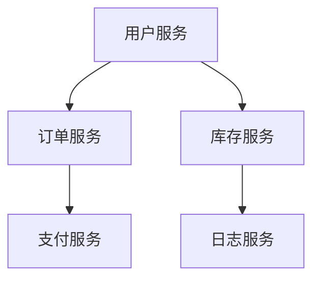

**3.4 API网关设计**

API网关是微服务架构中的一个关键组件，它位于客户端和微服务之间，负责处理客户端请求、路由请求到相应的微服务，并对响应进行处理。API网关具有以下功能：

- **请求路由**：根据请求的URL或其他参数，将请求路由到相应的微服务。
- **负载均衡**：对请求进行负载均衡，确保系统的高并发处理能力。
- **安全控制**：对请求进行认证和授权，确保系统的安全性。
- **监控和日志**：记录系统的请求和响应信息，方便监控和故障排查。

以下是API网关设计的一个示例：

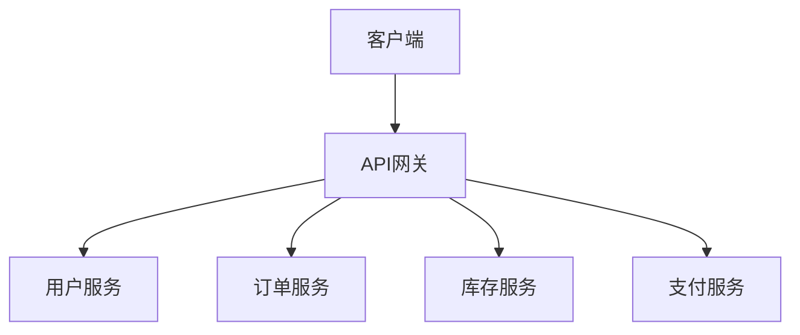

#### 第4章：负载均衡与流量控制

负载均衡和流量控制是高并发系统架构设计中至关重要的一环。负载均衡通过将请求分布到多个服务器节点上，提高系统的并发处理能力；而流量控制则通过限制请求速率，防止系统过载。

**4.1 负载均衡原理**

负载均衡的基本原理是将进入系统的请求分配到多个服务器节点上，以避免单点瓶颈。负载均衡算法有很多种，以下是几种常见的负载均衡算法：

- **轮询算法**：将请求依次分配到每个服务器节点，每个节点都有相同的机会处理请求。
- **最小连接数算法**：将请求分配到当前连接数最少的服务器节点，以平衡各节点的负载。
- **源地址哈希算法**：根据请求的源地址进行哈希运算，将请求分配到具有相同哈希值的服务器节点。

以下是轮询算法和最小连接数算法的示例：

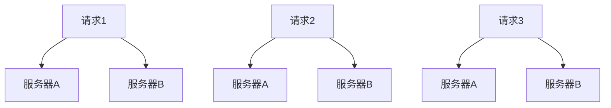

**4.2 常见负载均衡算法**

- **轮询算法**：最简单的负载均衡算法，将请求按顺序分配到服务器节点，无需额外计算，实现简单。
- **最小连接数算法**：根据服务器节点的当前连接数进行负载均衡，能够有效平衡各节点的负载。
- **源地址哈希算法**：根据请求的源IP地址进行哈希运算，将请求分配到具有相同哈希值的服务器节点，能够实现会话保持。

以下是源地址哈希算法的示例：


**4.3 流量控制策略**

流量控制策略用于限制请求的速率，以防止系统过载。常见的流量控制策略包括：

- **限流算法**：通过对请求进行限流，限制每秒或每分钟的处理请求数量，避免系统过载。
- **熔断器（Circuit Breaker）**：当系统错误率达到一定阈值时，自动切断请求，防止系统崩溃。

以下是限流算法和熔断器的工作原理：

- **限流算法**：使用令牌桶或漏桶算法，限制每秒或每分钟的请求数量。
  ```mermaid
  graph TD
  A[请求] --> B[令牌桶]
  B --> C[处理]
  ```
- **熔断器（Circuit Breaker）**：当错误率达到一定阈值时，自动切断请求，等待一段时间后恢复。
  ```mermaid
  graph TD
  A[请求] --> B[错误计数]
  B --> C{错误率<阈值?}
  C -->|是| D[继续处理]
  C -->|否| E[熔断]
  E --> F[等待恢复]
  ```

#### 第5章：数据存储与缓存

数据存储和缓存是高并发系统架构设计中的重要组成部分，直接影响系统的性能和响应速度。合理的数据存储与缓存策略能够显著提高系统的并发处理能力和用户体验。

**5.1 数据存储架构设计**

数据存储架构设计需要考虑以下因素：

- **数据一致性**：确保在多节点环境下，数据的一致性不受影响。
- **数据访问速度**：提高数据的访问速度，降低系统的响应时间。
- **数据持久性**：确保数据能够在系统故障时恢复。

常见的数据存储架构设计包括：

- **关系数据库**：如MySQL、PostgreSQL等，适合存储结构化数据。
- **NoSQL数据库**：如MongoDB、Redis等，适合存储非结构化或半结构化数据。
- **分布式数据库**：如Cassandra、HBase等，适合大规模分布式存储场景。

以下是关系数据库和NoSQL数据库的一个对比示例：

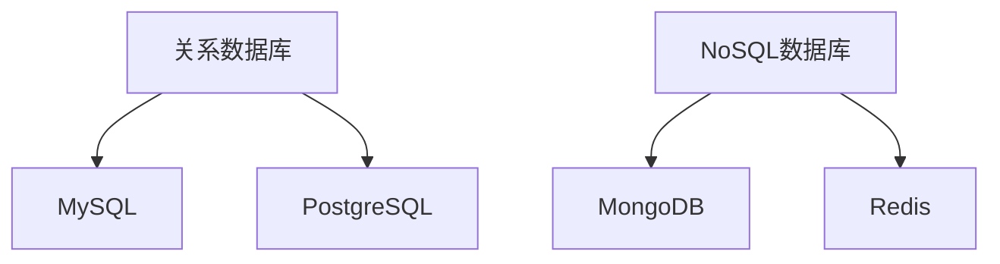

**5.2 缓存策略与实现**

缓存策略可以显著提高系统的响应速度和并发处理能力。常见的缓存策略包括：

- **内存缓存**：如Redis，适合存储临时数据，具有高速访问能力。
- **分布式缓存**：如Memcached，适合大规模分布式系统，能够缓存多个节点的数据。

以下是内存缓存和分布式缓存的一个对比示例：

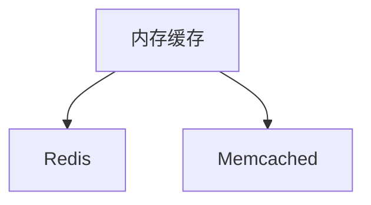

**5.3 分布式数据库设计**

分布式数据库设计是高并发系统架构设计中的重要环节，它能够提高系统的并发处理能力和数据一致性。以下是几种常见的分布式数据库设计方法：

- **分片（Sharding）**：将数据按照一定的规则分布在多个数据库节点上，每个节点负责一部分数据。
- **复制（Replication）**：将数据复制到多个节点，提高数据的可靠性和访问速度。
- **分布式事务**：在分布式环境下实现事务的一致性。

以下是分片和复制的一个对比示例：

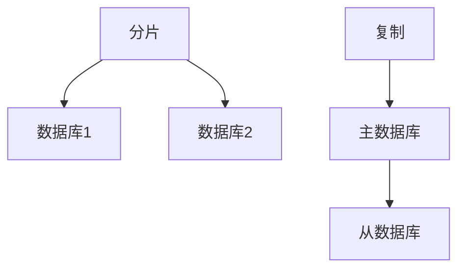

**5.4 数据一致性保障**

数据一致性保障是分布式数据库设计中的重要问题。以下是几种常见的数据一致性保障方法：

- **强一致性**：确保在所有节点上看到的数据是一致的，但可能会导致性能下降。
- **最终一致性**：允许系统在一段时间内存在临时不一致状态，但最终会达到一致。
- **BASE理论**：基本可用性、软状态和最终一致性，是分布式系统中数据一致性的一种实现策略。

以下是强一致性和最终一致性对比的一个示例：

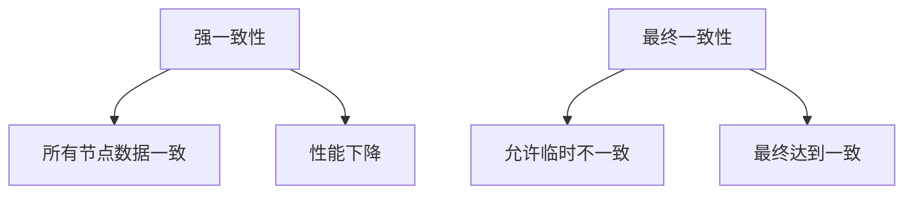

#### 第6章：高可用性与容灾恢复

高可用性和容灾恢复是高并发系统架构设计中至关重要的一环，它能够保证系统在面临故障时能够快速恢复，从而确保业务的连续性和稳定性。

**6.1 高可用性设计原则**

高可用性设计原则包括以下几个方面：

- **冗余设计**：通过硬件、软件和网络等方面的冗余设计，确保系统在部分组件故障时仍能正常运行。
- **故障转移**：在主节点故障时，自动将负载转移到备用节点，确保系统的连续性。
- **数据备份**：定期备份数据，确保在系统故障时能够快速恢复。

以下是冗余设计和故障转移的一个示例：

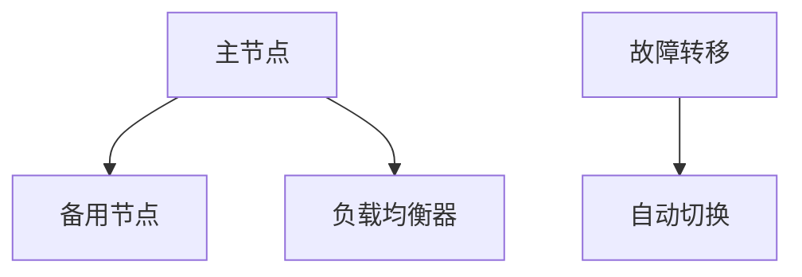

**6.2 故障转移与恢复机制**

故障转移与恢复机制是高可用性设计的关键组成部分，主要包括以下几个方面：

- **自动故障检测**：定期检测系统状态，一旦发现故障，立即触发故障转移。
- **手动故障转移**：在自动故障检测无法正常工作时，通过人工干预进行故障转移。
- **恢复机制**：在故障转移后，系统需要进行恢复，以确保业务连续性。

以下是自动故障检测和手动故障转移的一个示例：

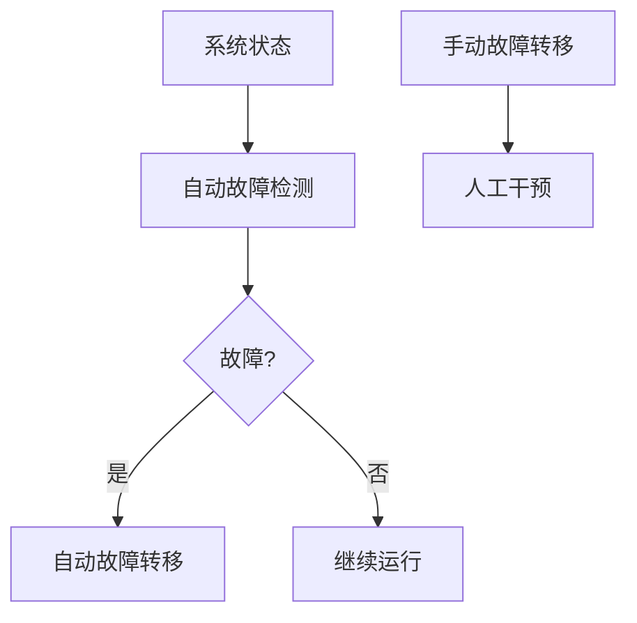

**6.3 容灾备份策略**

容灾备份策略是确保系统在重大灾难（如地震、火灾等）发生时能够恢复业务的关键。常见的容灾备份策略包括：

- **本地备份**：在本地数据中心进行数据备份，确保在本地灾难发生时能够快速恢复。
- **异地备份**：在异地数据中心进行数据备份，确保在本地灾难无法恢复时，仍然能够恢复业务。
- **云备份**：将数据备份到云服务提供商的数据中心，确保数据的安全性和可恢复性。

以下是本地备份和异地备份的一个示例：

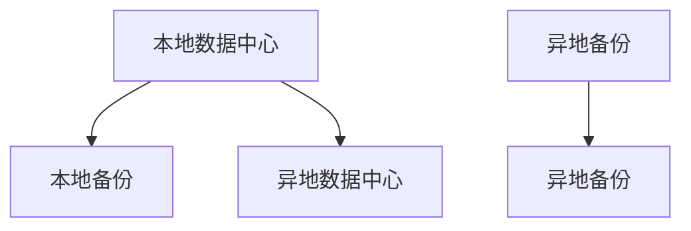

**6.4 灾难恢复计划**

灾难恢复计划是确保系统在灾难发生后能够快速恢复业务的关键。灾难恢复计划应包括以下几个方面：

- **灾难恢复团队**：成立专门的灾难恢复团队，负责灾难发生时的应急响应和恢复工作。
- **灾难恢复演练**：定期进行灾难恢复演练，确保团队成员熟悉灾难恢复流程和操作。
- **灾难恢复计划文档**：制定详细的灾难恢复计划文档，明确灾难发生时的应急响应步骤和恢复流程。

以下是灾难恢复团队和灾难恢复计划文档的一个示例：

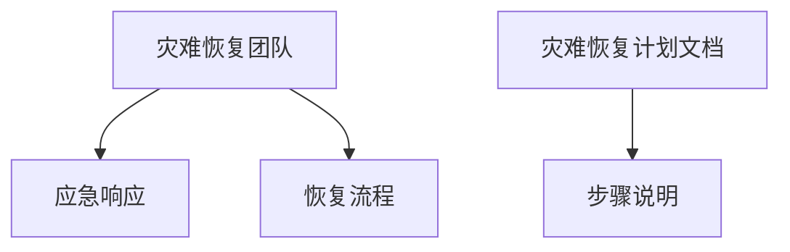

#### 第7章：监控与优化

监控与优化是高并发系统架构设计中的重要环节，它能够实时监测系统的运行状态，发现潜在的问题，并采取相应的优化措施，确保系统的稳定性和性能。

**7.1 系统监控工具选择**

选择合适的系统监控工具对于实时监测系统运行状态至关重要。以下是几种常见的系统监控工具：

- **Prometheus**：开源监控解决方案，适用于大规模分布式系统，支持多维数据收集和告警。
- **Grafana**：开源数据可视化和监控工具，与Prometheus等监控工具集成，提供丰富的图表和仪表盘。
- **Zabbix**：开源监控解决方案，支持多种监控方法和告警机制，适用于各种规模的企业级系统。

以下是Prometheus和Grafana的一个集成示例：

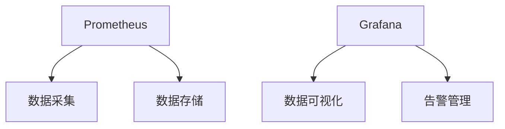

**7.2 性能优化方法**

性能优化方法包括以下几个方面：

- **代码优化**：通过优化代码结构和算法，减少系统运行时的资源消耗，提高系统性能。
- **架构优化**：通过改进系统架构，提高系统的并发处理能力和可扩展性，降低系统延迟。
- **数据库优化**：通过优化数据库配置、索引、查询等，提高数据库的访问速度和性能。

以下是代码优化和架构优化的一些方法：

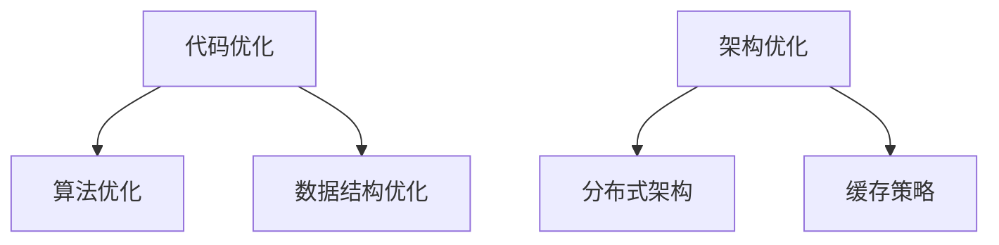

**7.3 自动化运维**

自动化运维通过自动化脚本和工具，实现系统的自动化部署、监控、优化和故障处理，提高系统的运维效率和可靠性。常见的自动化运维工具包括：

- **Ansible**：开源自动化运维工具，适用于配置管理、应用部署和自动化任务执行。
- **Puppet**：开源自动化运维平台，支持自动化部署、配置管理和资源管理。
- **Chef**：开源自动化运维工具，通过Ruby语言实现自动化部署和管理。

以下是Ansible和Puppet的一个自动化部署示例：

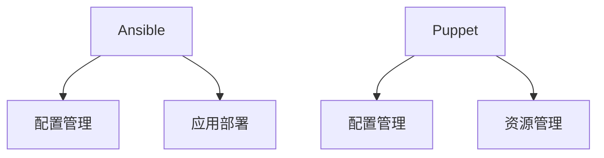

**7.4 性能测试与调优**

性能测试与调优是确保系统在高并发环境下稳定运行的关键。性能测试通过模拟实际业务场景，评估系统的性能和稳定性；调优则通过分析测试结果，发现潜在问题并采取相应的优化措施。

以下是性能测试与调优的一些方法：

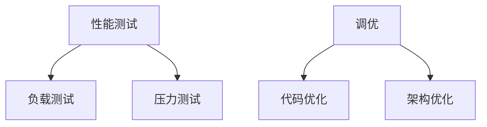

#### 结论

通过本部分的详细讲解，我们了解了系统架构设计的基础知识，包括架构设计方法论、分层架构设计、微服务架构设计、API网关设计、负载均衡与流量控制、数据存储与缓存、高可用性与容灾恢复以及监控与优化。这些知识为我们设计和实现高并发系统提供了重要的理论支持和实践经验。在接下来的部分，我们将通过一个实际案例，进一步展示高并发系统设计的具体实现过程。

### 第8章：高并发系统实战案例

在本章中，我们将通过一个实际案例，详细展示高并发系统设计的过程、关键技术和优化方法。该案例将涵盖系统架构设计、关键技术的实现以及优化与调优的过程。

#### 8.1 案例背景与目标

**案例背景**：

该案例是一个电商网站，提供在线购物、商品搜索、订单处理和支付等功能。随着用户量的增长和业务的发展，系统需要能够处理大量的并发请求，同时保证系统的稳定性、可靠性和高性能。

**案例目标**：

- 设计一个能够支持高并发访问的电商系统架构。
- 实现系统中的关键技术和组件，如负载均衡、缓存策略、分布式数据库等。
- 对系统进行优化与调优，确保其在高并发环境下能够稳定运行。

#### 8.2 系统架构设计

**系统架构设计**：

该电商系统采用微服务架构，将系统功能拆分为多个独立的微服务。以下是系统的主要微服务架构设计：

1. **用户服务**：负责用户注册、登录、个人信息管理等。
2. **商品服务**：负责商品信息的存储、查询和展示。
3. **订单服务**：负责订单的创建、查询、取消和支付等。
4. **支付服务**：负责处理订单支付功能。
5. **搜索服务**：负责商品搜索功能。
6. **缓存服务**：负责缓存系统的热点数据，提高访问速度。

**架构设计图**：

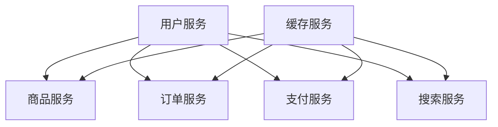

#### 8.3 关键技术实现

**负载均衡**：

为了处理大量并发请求，我们采用了Nginx作为负载均衡器，将请求分发到不同的微服务实例上。Nginx支持多种负载均衡算法，如轮询、最小连接数等。我们选择了轮询算法，因为它简单且适用于大多数场景。

**缓存策略**：

我们使用了Redis作为缓存服务，将系统的热点数据（如商品信息、用户信息等）缓存到Redis中，以减少对数据库的访问压力。Redis支持内存存储，具有极高的访问速度，非常适合作为缓存使用。

**分布式数据库**：

订单服务需要处理大量的订单数据，为了确保数据的一致性和高可用性，我们采用了MySQL分布式数据库。MySQL支持主从复制，可以保证数据的同步和备份。

**API网关**：

为了统一管理系统的API接口，我们采用了Spring Cloud Gateway作为API网关。Spring Cloud Gateway支持基于路由规则的请求转发、负载均衡、熔断器等功能，能够有效地提高系统的并发处理能力和可靠性。

#### 8.4 优化与调优

**代码优化**：

我们针对系统的关键模块进行了代码优化，如优化SQL查询语句、减少不必要的数据库访问、优化数据结构等。通过这些优化，我们显著提高了系统的响应速度和并发处理能力。

**架构优化**：

为了进一步提高系统的性能和可扩展性，我们对系统架构进行了优化。例如，将搜索服务拆分为独立的搜索引擎服务，采用Elasticsearch进行全文搜索，从而提高了搜索性能。

**数据库优化**：

我们优化了MySQL数据库的配置，如调整缓存参数、增加索引等，以提高数据库的访问速度和性能。此外，我们还采用了分库分表策略，将订单数据分散存储到多个数据库实例上，从而提高了系统的并发处理能力。

**缓存优化**：

我们优化了Redis的配置，如调整过期时间、内存管理等，以提高缓存的使用效率和性能。此外，我们还采用了Redis集群模式，确保在Redis节点故障时能够自动切换到备用节点。

**监控与告警**：

我们使用了Prometheus和Grafana进行系统监控，实时监测系统的运行状态和性能指标。通过设置告警规则，我们能够及时发现系统故障和性能瓶颈，并采取相应的优化措施。

#### 结论

通过本案例，我们详细展示了高并发系统设计的全过程，包括系统架构设计、关键技术实现以及优化与调优。通过这些实战经验，我们深刻认识到高并发系统设计的重要性和复杂性。在实际项目中，我们需要根据具体业务需求和技术条件，灵活运用各种设计方法和优化技术，确保系统在高并发环境下能够稳定、高效地运行。

### 第9章：高并发系统设计总结

#### 9.1 设计经验总结

在高并发系统设计过程中，我们积累了丰富的经验，以下是一些关键的经验总结：

1. **架构设计优先**：在高并发系统设计中，架构设计是至关重要的。良好的架构设计能够提高系统的可扩展性、可靠性和可维护性。在架构设计时，应充分考虑系统的业务需求、性能要求和未来扩展性。

2. **分层架构**：分层架构设计能够将系统功能模块化，提高系统的可维护性和可扩展性。常见的分层架构包括表现层、业务逻辑层和数据访问层。

3. **分布式系统**：分布式系统具有高并发处理能力和容错性。在分布式系统中，通过负载均衡和分布式计算，能够有效地提高系统的性能和可靠性。

4. **缓存策略**：合理使用缓存策略，可以显著提高系统的响应速度和并发处理能力。缓存策略包括内存缓存和分布式缓存，适用于不同场景。

5. **性能测试**：进行充分的性能测试，可以及时发现系统性能瓶颈和潜在问题。性能测试应涵盖各种业务场景和并发级别，确保系统在高并发环境下能够稳定运行。

6. **监控与优化**：系统监控与优化是确保系统稳定运行的重要环节。通过实时监控和性能优化，可以及时发现和解决问题，提高系统的性能和稳定性。

#### 9.2 面临的挑战与展望

尽管高并发系统设计取得了一定的成功，但仍然面临一些挑战和问题：

1. **数据一致性**：在高并发环境下，如何保证数据的一致性是一个难题。分布式系统中的数据一致性需要采用特定的机制，如分布式事务、最终一致性等。

2. **性能瓶颈**：在高并发环境下，系统可能会遇到性能瓶颈，如CPU、内存、网络等。需要通过优化代码、调整系统配置等方式，解决这些性能瓶颈。

3. **容灾备份**：在高并发系统设计中，容灾备份是确保业务连续性的关键。需要设计合理的容灾备份策略，确保在灾难发生时能够快速恢复业务。

4. **运维成本**：高并发系统设计需要更多的运维资源和成本，包括硬件、软件、人力资源等。如何降低运维成本，提高运维效率，是一个需要关注的问题。

对于未来高并发系统设计，以下是一些展望：

1. **云计算与边缘计算**：随着云计算和边缘计算的发展，未来高并发系统设计将更加依赖于这些技术。云计算提供弹性的计算资源，边缘计算则提供低延迟、高带宽的网络连接。

2. **人工智能与机器学习**：人工智能和机器学习技术在系统监控与优化方面具有巨大的潜力。通过引入这些技术，可以实现更智能的监控与优化，提高系统的性能和可靠性。

3. **分布式数据库**：分布式数据库技术将继续发展，提供更强大的数据一致性和高并发处理能力。未来分布式数据库将更加成熟，适用于更多场景。

4. **微服务架构**：微服务架构将继续是高并发系统设计的主流选择。通过微服务架构，可以更好地实现系统的可扩展性、可维护性和高可用性。

#### 9.3 对未来高并发系统设计的思考

未来高并发系统设计需要考虑以下趋势和方向：

1. **弹性伸缩**：系统应具备弹性伸缩能力，能够根据业务需求和负载情况自动调整资源。通过容器化技术和自动化部署，实现系统的弹性伸缩。

2. **智能化监控与优化**：引入人工智能和机器学习技术，实现更智能的系统监控与优化。通过数据分析和预测，提前发现和解决问题，提高系统的性能和稳定性。

3. **数据治理与安全**：在高并发环境下，数据治理和安全问题至关重要。需要设计合理的数据治理策略，确保数据的一致性、完整性和安全性。

4. **用户体验**：高并发系统设计不仅要关注系统的性能和稳定性，还要关注用户体验。通过优化页面加载速度、减少响应时间等，提升用户的满意度。

5. **可持续性**：高并发系统设计需要考虑可持续性，包括能耗、资源消耗等。通过绿色技术和可持续设计，实现系统的可持续发展和环保。

### 结论

通过本文的详细讨论，我们深入了解了高并发系统架构设计的基本概念、架构设计原则、关键技术实现以及优化方法。在实际案例的展示中，我们看到了这些理论知识的实践应用。未来，随着技术的不断进步和业务需求的变化，高并发系统设计将面临新的挑战和机遇。通过持续学习和实践，我们可以不断优化高并发系统设计，为互联网业务的稳定、高效运行提供有力支持。

### 附录

#### 10.1 常用技术栈与工具

在高并发系统设计过程中，以下技术栈和工具是常用的：

- **开发框架**：Spring Boot、Django、Node.js等。
- **数据库**：MySQL、PostgreSQL、MongoDB、Redis等。
- **缓存**：Redis、Memcached等。
- **负载均衡**：Nginx、HAProxy等。
- **容器化与编排**：Docker、Kubernetes等。
- **监控与日志**：Prometheus、Grafana、ELK（Elasticsearch、Logstash、Kibana）等。
- **自动化运维**：Ansible、Puppet、Chef等。
- **分布式计算**：Apache Storm、Spark等。

#### 10.2 参考文献

- 《分布式系统原理与范型》（Martin small）
- 《微服务设计》（Chris Richardson）
- 《大规模分布式存储系统：原理解析与架构实战》（杨传平）
- 《深入理解LINUX网络技术内幕》（姜宏峰）
- 《云原生应用架构指南》（刘欣）

### 作者信息

**作者：AI天才研究院/AI Genius Institute & 禅与计算机程序设计艺术 /Zen And The Art of Computer Programming**

本文由AI天才研究院撰写，旨在为读者提供高并发系统架构设计的全面指南。作者凭借丰富的实践经验和深厚的理论功底，为读者呈现了一篇具有深度和广度的技术博客文章。同时，本文结合了禅与计算机程序设计艺术的理念，力求在技术传承与创新中寻找最佳平衡点。希望本文能为读者在系统架构设计领域带来启示和帮助。

