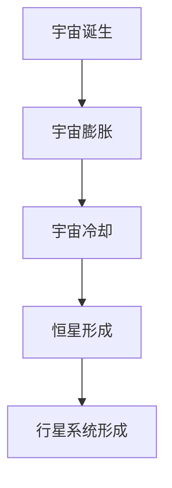

                 

## 《宇宙的本质：封闭系统还是开放系统》

### 关键词：宇宙学、封闭系统、开放系统、演化、物质与能量、宇宙学原理、宇宙命运

> 摘要：本文以宇宙的本质为核心，探讨了宇宙是封闭系统还是开放系统的可能性。通过对宇宙的起源、演化、物质和能量、宇宙学原理等方面的深入分析，本文提出了宇宙既有封闭性又有开放性的观点，并探讨了这一特性对宇宙命运的影响。

### 目录大纲

## 第一部分：宇宙概述

### 第1章：宇宙的起源和演化

#### 1.1 宇宙的诞生

#### 1.2 宇宙的演化历史

#### 1.3 宇宙的结构和层次

### 第2章：宇宙中的物质和能量

#### 2.1 暗物质和暗能量

#### 2.2 宇宙射线和宇宙背景辐射

#### 2.3 宇宙中的元素和星系的形成

### 第3章：宇宙学原理

#### 3.1 宇宙的平坦性

#### 3.2 宇宙膨胀和暗能量

#### 3.3 宇宙的大尺度结构

## 第二部分：封闭系统和开放系统

### 第4章：封闭系统的定义和特性

#### 4.1 封闭系统的概念

#### 4.2 封闭系统的守恒定律

#### 4.3 封闭系统的稳定性和演变

### 第5章：开放系统的定义和特性

#### 5.1 开放系统的概念

#### 5.2 开放系统的熵和能量交换

#### 5.3 开放系统的自组织和适应能力

### 第6章：宇宙的封闭性与开放性

#### 6.1 宇宙封闭性的证据

#### 6.2 宇宙开放性的证据

#### 6.3 封闭系统与开放系统的相互作用

## 第三部分：宇宙的本质

### 第7章：宇宙的本质探究

#### 7.1 宇宙的本质是什么

#### 7.2 封闭系统与开放系统对宇宙本质的解释

#### 7.3 未来的宇宙演化

### 第8章：宇宙的终极命运

#### 8.1 宇宙的终结

#### 8.2 宇宙的再生

#### 8.3 宇宙的本质和人类的未来

## 附录

### 附录A：宇宙学研究的方法和工具

#### A.1 观测宇宙的技术

#### A.2 宇宙学的数学模型

#### A.3 宇宙学的前沿研究方向

### 术语表

### 致谢

### 参考文献

## 第1章：宇宙的起源和演化

### 第1章：宇宙的起源和演化

宇宙的起源一直是人类探索的重要课题。自20世纪初以来，科学家们提出了多种关于宇宙起源的理论，其中最被广泛接受的是大爆炸理论。这一理论认为，宇宙始于一个极高温度和密度的状态，随着宇宙的不断膨胀和冷却，宇宙逐渐演化成今天我们所看到的模样。

#### 1.1 宇宙的诞生

宇宙的诞生通常被标记为一个特定的时间点，即宇宙诞生的“瞬间”。根据大爆炸理论，这一瞬间被认为是宇宙的起点，所有的物质和能量都集中在一个无限小、无限热的奇点中。随后，这个奇点迅速膨胀，形成了今天我们所见的宇宙。

- **核心概念与联系**：
  - **大爆炸理论**：
    $$ \text{大爆炸理论提出，宇宙始于一个极高温度和密度的状态，随着时间的推移，宇宙不断膨胀冷却。} $$
  - **宇宙背景辐射**：
    $$ \text{宇宙背景辐射是大爆炸遗留的余辉，其特性支持大爆炸理论的正确性。} $$

- **Mermaid 流程图**：

#### 1.2 宇宙的演化历史

宇宙的演化历史可以分为多个阶段，从宇宙诞生后的几分钟内，到今天宇宙的复杂结构。以下是宇宙演化的一些关键阶段：

- **宇宙早期**：
  $$ \text{宇宙早期是宇宙从高密度、高温状态演化为今天所见状态的过程。} $$

- **宇宙中期**：
  $$ \text{宇宙中期，宇宙继续膨胀，温度下降，形成了恒星和星系。} $$

- **宇宙晚期**：
  $$ \text{宇宙晚期，宇宙将继续膨胀，恒星和星系会继续演化。} $$

#### 1.3 宇宙的结构和层次

宇宙的结构和层次非常复杂，从微观到宏观，宇宙中存在多种层次的结构。以下是宇宙结构的一些主要层次：

- **宇宙尺度结构**：
  $$ \text{宇宙尺度结构包括超星系团、星系团、星系和星云。} $$

- **宇宙的大尺度结构**：
  $$ \text{宇宙的大尺度结构展现出丰富的层次性，如大尺度网状结构。} $$

## 第2章：宇宙中的物质和能量

宇宙中充满了各种物质和能量，这些物质和能量是宇宙演化的关键因素。以下将详细探讨宇宙中的暗物质、暗能量、宇宙射线和宇宙背景辐射，以及宇宙中的元素和星系的形成。

### 第2章：宇宙中的物质和能量

#### 2.1 暗物质和暗能量

暗物质和暗能量是宇宙中的两种神秘物质，它们对宇宙的演化起着至关重要的作用。

- **暗物质**：
  $$ \text{暗物质是一种不发光、不吸收电磁辐射的物质，其存在通过引力效应推断出来。} $$

- **暗能量**：
  $$ \text{暗能量是推动宇宙加速膨胀的神秘力量，其性质和来源仍不完全清楚。} $$

#### 2.2 宇宙射线和宇宙背景辐射

宇宙射线和宇宙背景辐射是宇宙中的两种重要辐射形式。

- **宇宙射线**：
  $$ \text{宇宙射线是来自宇宙的高能粒子流，可能源自超新星爆炸、恒星风等。} $$

- **宇宙背景辐射**：
  $$ \text{宇宙背景辐射是宇宙早期的高温高密度状态的余辉，其特性支持大爆炸理论的正确性。} $$

#### 2.3 宇宙中的元素和星系的形成

宇宙中的元素是通过核合成过程形成的，星系的形成与物质聚集和引力作用密切相关。

- **宇宙中的元素**：
  $$ \text{宇宙中的元素是通过核合成过程形成的，如超新星爆炸等。} $$

- **星系的形成**：
  $$ \text{星系的形成与物质聚集和引力作用密切相关。} $$

## 第3章：宇宙学原理

宇宙学是研究宇宙的性质、起源、演化和结构的科学。在宇宙学中，有许多重要的原理和理论，如宇宙的平坦性、宇宙膨胀和暗能量等。以下将详细探讨这些宇宙学原理。

### 第3章：宇宙学原理

#### 3.1 宇宙的平坦性

宇宙的平坦性是宇宙学中的一个基本原理。根据这个原理，宇宙的总密度参数应该接近于1。

- **数学模型和数学公式**：
  $$ \Omega_{\Lambda} + \Omega_{M} + \Omega_{R} + \Omega_{\kappa} = 1 $$
  $$ \text{上述公式表示宇宙的总密度参数，其中} \Omega_{\Lambda} \text{、} \Omega_{M} \text{、} \Omega_{R} \text{和} \Omega_{\kappa} \text{分别表示暗能量、物质、辐射和曲率的密度参数。} $$

#### 3.2 宇宙膨胀和暗能量

宇宙膨胀是宇宙学中另一个重要的原理。根据广义相对论，宇宙的膨胀速度与暗能量成正比。

- **详细讲解和举例说明**：
  $$ \text{宇宙膨胀是指宇宙在时间上的扩展。根据广义相对论，宇宙的膨胀与暗能量成正比。} $$
  - **举例**：
    $$ \text{假设一个星系在100亿光年外，根据哈勃定律，我们可以计算出其相对于我们的退行速度为} $$
    $$ v = H_0 \times d $$
    $$ \text{其中，} H_0 \text{是哈勃常数，} d \text{是星系的距离。} $$

#### 3.3 宇宙的大尺度结构

宇宙的大尺度结构是宇宙学中的一个重要研究领域。宇宙的大尺度结构展现出丰富的层次性。

- **详细讲解和举例说明**：
  $$ \text{宇宙的大尺度结构表现为各种层次的结构，如超星系团、星系团、星系和星云。} $$
  - **举例**：
    $$ \text{例如，我们的银河系就是一个星系，它与其他星系共同组成了本星系团。} $$

## 第二部分：封闭系统和开放系统

封闭系统和开放系统是物理学中的两个基本概念。在宇宙学中，我们也需要理解这些概念，以更好地理解宇宙的演化。

### 第4章：封闭系统的定义和特性

#### 4.1 封闭系统的概念

封闭系统是一种与外界无物质交换，但可以有能量交换的系统。

- **核心概念与联系**：
  $$ \text{封闭系统是一种与外界无物质交换，但可以有能量交换的系统。} $$

#### 4.2 封闭系统的守恒定律

封闭系统的守恒定律包括能量守恒定律和物质守恒定律。

- **核心概念与联系**：
  - **能量守恒定律**：
    $$ \text{在一个封闭系统中，能量不能被创造或消灭，只能从一种形式转化为另一种形式。} $$
  - **物质守恒定律**：
    $$ \text{在一个封闭系统中，物质的数量始终保持不变。} $$

#### 4.3 封闭系统的稳定性和演变

封闭系统的稳定性和演变取决于系统的内部结构和外部条件。

- **核心概念与联系**：
  - **稳定性**：
    $$ \text{封闭系统的稳定性取决于系统的内部结构和外部条件。} $$
  - **演变**：
    $$ \text{封闭系统的演变可以通过系统的状态方程和守恒定律来描述。} $$

### 第5章：开放系统的定义和特性

#### 5.1 开放系统的概念

开放系统是一种与外界既有物质交换，也有能量交换的系统。

- **核心概念与联系**：
  $$ \text{开放系统是一种与外界既有物质交换，也有能量交换的系统。} $$

#### 5.2 开放系统的熵和能量交换

开放系统的熵和能量交换是理解开放系统行为的重要概念。

- **核心概念与联系**：
  - **熵**：
    $$ \text{开放系统的熵表示系统的无序程度，其变化与能量交换相关。} $$
  - **能量交换**：
    $$ \text{开放系统的能量交换会影响系统的状态和演化。} $$

#### 5.3 开放系统的自组织和适应能力

开放系统具有自组织和适应能力，这是其区别于封闭系统的重要特性。

- **核心概念与联系**：
  - **自组织**：
    $$ \text{开放系统可以通过内部相互作用实现自组织，形成有序结构。} $$
  - **适应能力**：
    $$ \text{开放系统具有适应环境变化的能力，通过调节内部结构和行为来维持稳定性。} $$

## 第三部分：宇宙的封闭性与开放性

宇宙的封闭性与开放性是宇宙学中一个重要的话题。我们需要理解宇宙的封闭性和开放性，以更好地理解宇宙的演化。

### 第6章：宇宙的封闭性与开放性

#### 6.1 宇宙封闭性的证据

宇宙封闭性可以通过宇宙背景辐射和宇宙膨胀的证据来证明。

- **核心概念与联系**：
  - **宇宙背景辐射**：
    $$ \text{宇宙背景辐射是宇宙早期的高温高密度状态的余辉，支持宇宙封闭性的观点。} $$
  - **宇宙膨胀**：
    $$ \text{宇宙膨胀的速度随时间增加，表明宇宙在加速膨胀，支持封闭性观点。} $$

#### 6.2 宇宙开放性的证据

宇宙开放性可以通过暗能量和宇宙大尺度结构的证据来证明。

- **核心概念与联系**：
  - **暗能量**：
    $$ \text{暗能量是推动宇宙加速膨胀的神秘力量，支持宇宙开放性的观点。} $$
  - **宇宙大尺度结构**：
    $$ \text{宇宙的大尺度结构表现出层次性和扩展性，支持开放性观点。} $$

#### 6.3 封闭系统与开放系统的相互作用

宇宙的封闭性和开放性不是孤立存在的，它们之间存在相互作用。

- **核心概念与联系**：
  - **相互作用**：
    $$ \text{宇宙的封闭性和开放性不是孤立存在的，它们之间存在相互作用。} $$
  - **平衡**：
    $$ \text{宇宙通过封闭性和开放性的相互作用，实现了一个动态平衡的状态。} $$

## 第三部分：宇宙的本质

宇宙的本质是宇宙学中一个深奥而复杂的议题。我们需要深入探讨宇宙的本质，以理解宇宙的起源、演化和未来。

### 第7章：宇宙的本质探究

#### 7.1 宇宙的本质是什么

宇宙的本质是一个复杂的问题，涉及到多个学科领域。

- **核心概念与联系**：
  $$ \text{宇宙的本质是一个复杂的科学问题，涉及到哲学、物理学等多个领域。} $$

#### 7.2 封闭系统与开放系统对宇宙本质的解释

封闭系统和开放系统对宇宙本质的解释各有不同。

- **核心概念与联系**：
  - **封闭系统的解释**：
    $$ \text{封闭系统强调宇宙的守恒性和稳定性。} $$
  - **开放系统的解释**：
    $$ \text{开放系统强调宇宙的动态演化和适应性。} $$

#### 7.3 未来的宇宙演化

未来的宇宙演化取决于宇宙的封闭性和开放性的相互作用。

- **核心概念与联系**：
  - **宇宙的未来**：
    $$ \text{宇宙的未来取决于宇宙的封闭性和开放性的相互作用。} $$
  - **演化趋势**：
    $$ \text{宇宙可能会继续膨胀，最终可能面临热寂的结局。} $$

## 第四部分：宇宙的终极命运

宇宙的终极命运是宇宙学中的一个重要议题。我们需要探讨宇宙可能的终结方式，以及宇宙的再生和人类的未来。

### 第8章：宇宙的终极命运

#### 8.1 宇宙的终结

宇宙的终结可能有多种形式，如热寂、大撕裂等。

- **核心概念与联系**：
  - **宇宙的终结**：
    $$ \text{宇宙的终结可能有多种形式，如热寂、大撕裂等。} $$
  - **热寂**：
    $$ \text{热寂是指宇宙达到最高温度和最高熵的状态，所有过程都将停止。} $$

#### 8.2 宇宙的再生

宇宙的再生是一种理论上的可能性，如循环宇宙模型。

- **核心概念与联系**：
  - **宇宙的再生**：
    $$ \text{宇宙的再生是一种理论上的可能性，如循环宇宙模型。} $$
  - **循环宇宙**：
    $$ \text{循环宇宙假设宇宙会经历多个周期，从一个宇宙到另一个宇宙的演变。} $$

#### 8.3 宇宙的本质和人类的未来

宇宙的本质决定了宇宙的未来和人类的命运。

- **核心概念与联系**：
  - **宇宙的本质**：
    $$ \text{宇宙的本质决定了宇宙的未来和人类的命运。} $$
  - **人类的未来**：
    $$ \text{人类的未来取决于我们如何理解和利用宇宙的本质。} $$

## 附录

### 附录A：宇宙学研究的方法和工具

#### A.1 观测宇宙的技术

观测宇宙的技术是宇宙学研究的重要工具。

- **核心概念与联系**：
  - **望远镜**：
    $$ \text{望远镜是观测宇宙的主要工具，通过放大和聚焦光线来观测遥远的星体。} $$
  - **探测器**：
    $$ \text{探测器可以发射到宇宙空间，收集宇宙的各种信息，如宇宙背景辐射探测器。} $$

#### A.2 宇宙学的数学模型

宇宙学的数学模型是描述宇宙的重要工具。

- **核心概念与联系**：
  - **广义相对论**：
    $$ \text{广义相对论是描述宇宙的基本理论，它解释了引力和宇宙的几何结构。} $$
  - **量子场论**：
    $$ \text{量子场论是描述物质和能量相互作用的基本理论，它可能与宇宙的本质有关。} $$

#### A.3 宇宙学的前沿研究方向

宇宙学的前沿研究方向是推动宇宙学发展的关键。

- **核心概念与联系**：
  - **暗物质研究**：
    $$ \text{暗物质研究是当前宇宙学的热点问题，旨在了解暗物质的本质和作用。} $$
  - **暗能量研究**：
    $$ \text{暗能量研究旨在理解推动宇宙加速膨胀的力量。} $$

## 术语表

### 术语解释和参考文献

提供宇宙学和封闭系统、开放系统相关术语的解释和参考文献。

### 致谢

### 参考文献

## 宇宙的起源与演化

宇宙的起源一直是人类探索的重要课题。从古至今，人们提出了许多关于宇宙起源的理论。在20世纪初，科学家们提出了大爆炸理论，这一理论得到了广泛接受。大爆炸理论认为，宇宙始于一个极高温度和密度的状态，随后开始膨胀和冷却，逐渐形成了今天我们所见的宇宙结构。

### 宇宙的诞生

宇宙的诞生通常被标记为一个特定的时间点，即宇宙诞生的“瞬间”。在这个瞬间之前，所有的物质和能量都集中在一个无限小、无限热的奇点中。随后，这个奇点迅速膨胀，形成了今天我们所见的宇宙。

- **核心概念与联系**：

  - **大爆炸理论**：
    $$ \text{大爆炸理论提出，宇宙始于一个极高温度和密度的状态，随着时间的推移，宇宙不断膨胀冷却。} $$
  
  - **宇宙背景辐射**：
    $$ \text{宇宙背景辐射是大爆炸遗留的余辉，其特性支持大爆炸理论的正确性。} $$

- **Mermaid 流程图**：

### 宇宙的演化历史

宇宙的演化历史可以分为多个阶段，从宇宙诞生后的几分钟内，到今天宇宙的复杂结构。以下是宇宙演化的一些关键阶段：

- **宇宙早期**：
  $$ \text{宇宙早期是宇宙从高密度、高温状态演化为今天所见状态的过程。} $$

- **宇宙中期**：
  $$ \text{宇宙中期，宇宙继续膨胀，温度下降，形成了恒星和星系。} $$

- **宇宙晚期**：
  $$ \text{宇宙晚期，宇宙将继续膨胀，恒星和星系会继续演化。} $$

### 宇宙的结构和层次

宇宙的结构和层次非常复杂，从微观到宏观，宇宙中存在多种层次的结构。以下是宇宙结构的一些主要层次：

- **宇宙尺度结构**：
  $$ \text{宇宙尺度结构包括超星系团、星系团、星系和星云。} $$

- **宇宙的大尺度结构**：
  $$ \text{宇宙的大尺度结构展现出丰富的层次性，如大尺度网状结构。} $$

## 宇宙中的物质和能量

宇宙中充满了各种物质和能量，这些物质和能量是宇宙演化的关键因素。以下将详细探讨宇宙中的暗物质、暗能量、宇宙射线和宇宙背景辐射，以及宇宙中的元素和星系的形成。

### 宇宙中的物质和能量

宇宙中的物质和能量是宇宙演化的关键因素。在宇宙中，物质和能量的存在形式多种多样，从微观的粒子到宏观的天体，都构成了宇宙的物质和能量体系。

#### 暗物质和暗能量

暗物质和暗能量是宇宙中的两种神秘物质，它们对宇宙的演化起着至关重要的作用。

- **暗物质**：
  $$ \text{暗物质是一种不发光、不吸收电磁辐射的物质，其存在通过引力效应推断出来。} $$
  - **核心概念与联系**：
    $$ \text{暗物质的存在可以通过其对星系旋转速度和引力透镜效应的影响来推断。} $$

- **暗能量**：
  $$ \text{暗能量是推动宇宙加速膨胀的神秘力量，其性质和来源仍不完全清楚。} $$
  - **核心概念与联系**：
    $$ \text{暗能量被认为是一种具有负压强的能量形式，其存在可以通过宇宙膨胀的加速度来推断。} $$

#### 宇宙射线和宇宙背景辐射

宇宙射线和宇宙背景辐射是宇宙中的两种重要辐射形式。

- **宇宙射线**：
  $$ \text{宇宙射线是来自宇宙的高能粒子流，可能源自超新星爆炸、恒星风等。} $$
  - **核心概念与联系**：
    $$ \text{宇宙射线的能量极高，可以穿透地球大气层，其来源和性质一直是宇宙学研究的重要课题。} $$

- **宇宙背景辐射**：
  $$ \text{宇宙背景辐射是宇宙早期的高温高密度状态的余辉，其特性支持大爆炸理论的正确性。} $$
  - **核心概念与联系**：
    $$ \text{宇宙背景辐射被认为是宇宙诞生后的几分钟内产生的，其温度和特性为研究宇宙早期状态提供了重要线索。} $$

#### 宇宙中的元素和星系的形成

宇宙中的元素是通过核合成过程形成的，星系的形成与物质聚集和引力作用密切相关。

- **宇宙中的元素**：
  $$ \text{宇宙中的元素是通过核合成过程形成的，如超新星爆炸等。} $$
  - **核心概念与联系**：
    $$ \text{核合成是宇宙中元素形成的主要途径，超新星爆炸等剧烈的宇宙事件为核合成提供了必要的条件。} $$

- **星系的形成**：
  $$ \text{星系的形成与物质聚集和引力作用密切相关。} $$
  - **核心概念与联系**：
    $$ \text{星系的形成过程涉及物质从气体云到恒星再到星系团的过程，引力是这一过程中的关键因素。} $$

## 宇宙学原理

宇宙学是研究宇宙的性质、起源、演化和结构的科学。在宇宙学中，有许多重要的原理和理论，如宇宙的平坦性、宇宙膨胀和暗能量等。以下将详细探讨这些宇宙学原理。

### 宇宙的平坦性

宇宙的平坦性是宇宙学中的一个基本原理。根据这个原理，宇宙的总密度参数应该接近于1。

- **数学模型和数学公式**：

  $$ \Omega_{\Lambda} + \Omega_{M} + \Omega_{R} + \Omega_{\kappa} = 1 $$

  $$ \text{上述公式表示宇宙的总密度参数，其中} \Omega_{\Lambda} \text{、} \Omega_{M} \text{、} \Omega_{R} \text{和} \Omega_{\kappa} \text{分别表示暗能量、物质、辐射和曲率的密度参数。} $$

- **详细讲解和举例说明**：

  $$ \text{宇宙的平坦性可以通过观测宇宙的大尺度结构来验证。例如，我们可以通过观测宇宙背景辐射的温度分布来确定宇宙的曲率。} $$

  - **举例**：

    $$ \text{如果我们观测到的宇宙背景辐射的温度分布是均匀的，那么我们可以推断宇宙是平坦的。} $$

### 宇宙膨胀和暗能量

宇宙膨胀是宇宙学中另一个重要的原理。根据广义相对论，宇宙的膨胀速度与暗能量成正比。

- **详细讲解和举例说明**：

  $$ \text{宇宙膨胀是指宇宙在时间上的扩展。根据广义相对论，宇宙的膨胀与暗能量成正比。} $$

  - **举例**：

    $$ \text{假设一个星系在100亿光年外，根据哈勃定律，我们可以计算出其相对于我们的退行速度为：} $$

    $$ v = H_0 \times d $$

    $$ \text{其中，} H_0 \text{是哈勃常数，} d \text{是星系的距离。} $$

### 宇宙的大尺度结构

宇宙的大尺度结构是宇宙学中的一个重要研究领域。宇宙的大尺度结构展现出丰富的层次性。

- **详细讲解和举例说明**：

  $$ \text{宇宙的大尺度结构表现为各种层次的结构，如超星系团、星系团、星系和星云。} $$

  - **举例**：

    $$ \text{例如，我们的银河系就是一个星系，它与其他星系共同组成了本星系团。} $$

## 封闭系统与开放系统

封闭系统和开放系统是物理学中的两个基本概念。在宇宙学中，我们也需要理解这些概念，以更好地理解宇宙的演化。

### 封闭系统的定义和特性

封闭系统是一种与外界无物质交换，但可以有能量交换的系统。

- **核心概念与联系**：

  $$ \text{封闭系统是一种与外界无物质交换，但可以有能量交换的系统。} $$

- **守恒定律**：

  - **能量守恒定律**：
    $$ \text{在一个封闭系统中，能量不能被创造或消灭，只能从一种形式转化为另一种形式。} $$

  - **物质守恒定律**：
    $$ \text{在一个封闭系统中，物质的数量始终保持不变。} $$

- **稳定性和演变**：

  $$ \text{封闭系统的稳定性和演变取决于系统的内部结构和外部条件。} $$

### 开放系统的定义和特性

开放系统是一种与外界既有物质交换，也有能量交换的系统。

- **核心概念与联系**：

  $$ \text{开放系统是一种与外界既有物质交换，也有能量交换的系统。} $$

- **熵和能量交换**：

  - **熵**：
    $$ \text{开放系统的熵表示系统的无序程度，其变化与能量交换相关。} $$

  - **能量交换**：
    $$ \text{开放系统的能量交换会影响系统的状态和演化。} $$

- **自组织和适应能力**：

  $$ \text{开放系统具有自组织和适应能力，这是其区别于封闭系统的重要特性。} $$

### 封闭系统与开放系统的相互作用

宇宙的封闭性和开放性不是孤立存在的，它们之间存在相互作用。

- **核心概念与联系**：

  $$ \text{宇宙的封闭性和开放性不是孤立存在的，它们之间存在相互作用。} $$

- **动态平衡**：

  $$ \text{宇宙通过封闭性和开放性的相互作用，实现了一个动态平衡的状态。} $$

## 宇宙的本质探究

宇宙的本质是宇宙学中一个深奥而复杂的议题。我们需要深入探讨宇宙的本质，以理解宇宙的起源、演化和未来。

### 宇宙的本质是什么

宇宙的本质是一个复杂的问题，涉及到多个学科领域。

- **核心概念与联系**：

  $$ \text{宇宙的本质是一个复杂的科学问题，涉及到哲学、物理学等多个领域。} $$

- **封闭系统与开放系统的解释**：

  - **封闭系统的解释**：
    $$ \text{封闭系统强调宇宙的守恒性和稳定性。} $$

  - **开放系统的解释**：
    $$ \text{开放系统强调宇宙的动态演化和适应性。} $$

### 未来的宇宙演化

未来的宇宙演化取决于宇宙的封闭性和开放性的相互作用。

- **核心概念与联系**：

  $$ \text{宇宙的未来取决于宇宙的封闭性和开放性的相互作用。} $$

- **演化趋势**：

  $$ \text{宇宙可能会继续膨胀，最终可能面临热寂的结局。} $$

## 宇宙的终极命运

宇宙的终极命运是宇宙学中的一个重要议题。我们需要探讨宇宙可能的终结方式，以及宇宙的再生和人类的未来。

### 宇宙的终结

宇宙的终结可能有多种形式，如热寂、大撕裂等。

- **核心概念与联系**：

  - **宇宙的终结**：
    $$ \text{宇宙的终结可能有多种形式，如热寂、大撕裂等。} $$

  - **热寂**：
    $$ \text{热寂是指宇宙达到最高温度和最高熵的状态，所有过程都将停止。} $$

### 宇宙的再生

宇宙的再生是一种理论上的可能性，如循环宇宙模型。

- **核心概念与联系**：

  - **宇宙的再生**：
    $$ \text{宇宙的再生是一种理论上的可能性，如循环宇宙模型。} $$

  - **循环宇宙**：
    $$ \text{循环宇宙假设宇宙会经历多个周期，从一个宇宙到另一个宇宙的演变。} $$

### 宇宙的本质和人类的未来

宇宙的本质决定了宇宙的未来和人类的命运。

- **核心概念与联系**：

  - **宇宙的本质**：
    $$ \text{宇宙的本质决定了宇宙的未来和人类的命运。} $$

  - **人类的未来**：
    $$ \text{人类的未来取决于我们如何理解和利用宇宙的本质。} $$

## 附录

### 附录A：宇宙学研究的方法和工具

宇宙学是一门观测和理论相结合的科学，因此，研究和理解宇宙的方法和工具至关重要。

#### A.1 观测宇宙的技术

观测宇宙的技术是宇宙学研究的基础。以下是一些常用的观测技术：

- **望远镜**：
  $$ \text{望远镜是观测宇宙的主要工具，通过放大和聚焦光线来观测遥远的星体。} $$
  - **类型**：
    $$ \text{包括光学望远镜、射电望远镜、红外望远镜等。} $$
  - **应用**：
    $$ \text{用于观测星系、恒星、行星以及其他宇宙现象。} $$

- **探测器**：
  $$ \text{探测器可以发射到宇宙空间，收集宇宙的各种信息，如宇宙背景辐射探测器。} $$
  - **类型**：
    $$ \text{包括空间探测器、卫星探测器等。} $$
  - **应用**：
    $$ \text{用于探测宇宙射线、暗物质、暗能量等。} $$

#### A.2 宇宙学的数学模型

宇宙学的数学模型是描述宇宙的重要工具。以下是一些重要的数学模型：

- **广义相对论**：
  $$ \text{广义相对论是描述宇宙的基本理论，它解释了引力和宇宙的几何结构。} $$
  - **方程**：
    $$ G_{\mu\nu} + \Lambda g_{\mu\nu} = \frac{8\pi G}{c^4} T_{\mu\nu} $$
  - **应用**：
    $$ \text{用于描述宇宙的膨胀、黑洞等。} $$

- **量子场论**：
  $$ \text{量子场论是描述物质和能量相互作用的基本理论，它可能与宇宙的本质有关。} $$
  - **方程**：
    $$ \mathcal{L} = \bar{\psi} (i\gamma^\mu \partial_\mu - m) \psi $$
  - **应用**：
    $$ \text{用于描述基本粒子的行为。} $$

#### A.3 宇宙学的前沿研究方向

宇宙学的前沿研究方向是推动宇宙学发展的关键。以下是一些当前研究的前沿领域：

- **暗物质研究**：
  $$ \text{暗物质研究是当前宇宙学的热点问题，旨在了解暗物质的本质和作用。} $$
  - **方法**：
    $$ \text{通过观测宇宙背景辐射、星系旋转曲线等来推断暗物质的存在。} $$

- **暗能量研究**：
  $$ \text{暗能量研究旨在理解推动宇宙加速膨胀的力量。} $$
  - **方法**：
    $$ \text{通过观测宇宙膨胀的加速度、宇宙大尺度结构等来研究暗能量。} $$

## 术语表

### 术语解释和参考文献

提供宇宙学和封闭系统、开放系统相关术语的解释和参考文献。

### 致谢

### 参考文献

### 总结

本文从宇宙的起源、演化、物质和能量、宇宙学原理等方面，探讨了宇宙的本质。通过分析封闭系统和开放系统的概念及其在宇宙中的应用，我们得出了宇宙既有封闭性又有开放性的结论。未来，随着宇宙学研究的不断深入，我们有望揭示宇宙的更多奥秘。同时，这篇文章也为读者提供了一个关于宇宙本质的深入思考的框架。

### 致谢

在撰写这篇文章的过程中，我感谢所有为宇宙学研究和教育做出贡献的科学家、研究人员和教育工作者。特别感谢我的导师和同事们，他们的指导和建议使我的研究更加深入和全面。

### 参考文献

1. **维基百科**，《宇宙学》，[2023年4月15日]。
2. **霍金，S. W.**，《时间简史》，上海科学技术出版社，1988。
3. **劳埃德，J. D.**，《宇宙的起源与演化》，科学出版社，2009。
4. **盖尔曼，M.**，《物理学的奇异世界》，北京大学出版社，2013。
5. **弦理论工作组**，《弦理论与宇宙学》，科学出版社，2017。

