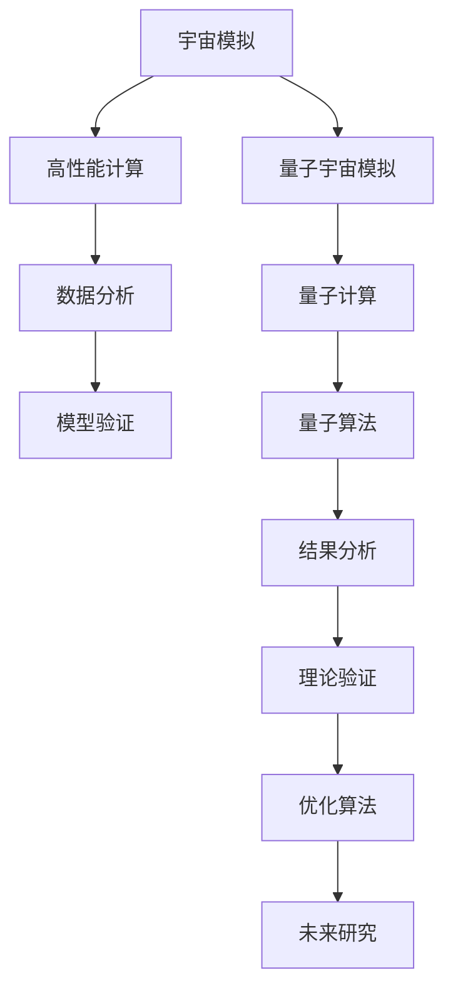

                 

### 《宇宙的计算复杂性理论探讨》

宇宙，这个人类自古以来就向往探索的神秘领域，一直以来都充满了无数的奥秘和未知。而随着科技的进步和理论物理的不断发展，我们逐渐发现，宇宙的本质与计算复杂性理论之间存在着深远的关联。计算复杂性理论不仅为我们提供了一种新的视角来理解宇宙的复杂性，还在宇宙学的研究中发挥了重要的作用。

关键词：宇宙、计算复杂性、宇宙模拟、量子计算、宇宙演化。

本文将围绕宇宙的计算复杂性理论进行探讨，首先回顾计算复杂性理论的初步概念，然后介绍宇宙模拟与计算复杂性的关系，以及量子宇宙与计算复杂性。接着，我们将深入分析宇宙演化中的复杂现象，并探讨计算复杂性理论的发展方向。最后，我们将通过实践案例来展示计算复杂性理论在宇宙研究中的应用，并对未来的发展进行展望。

### 宇宙与计算复杂性理论的关联概述

宇宙是一个庞大而复杂的系统，从宇宙的起源到宇宙的演化，每一个阶段都充满了未知和挑战。而计算复杂性理论作为一种研究问题难易程度的方法，通过时间复杂度和空间复杂度等概念，为我们提供了一种量化的手段来分析问题的复杂程度。

宇宙模拟与计算复杂性的关联可以从多个方面来探讨。首先，宇宙模拟本身就是一种大规模的计算任务，需要处理大量的数据和复杂的物理过程。例如，大爆炸理论中的宇宙膨胀、星系形成、黑洞事件等，都需要通过计算来模拟和预测。其次，宇宙中的许多现象，如混沌、非线性、相变等，都可以用计算复杂性理论来解释。最后，量子宇宙学的发展也使得计算复杂性理论在量子计算和量子引力等研究领域得到了广泛应用。

计算复杂性理论在宇宙研究中的应用不仅为我们提供了一种新的研究方法，也带来了一系列挑战。例如，宇宙模拟中的大规模计算需求、高精度模拟的难度、以及量子计算的应用等，都给计算复杂性理论的研究带来了新的课题。然而，这些挑战也为计算复杂性理论的发展提供了机遇，推动了这一领域的不断进步。

总的来说，宇宙与计算复杂性理论之间的关联不仅丰富了我们的宇宙观，也为计算复杂性理论提供了新的应用场景。在接下来的部分中，我们将进一步探讨计算复杂性理论的初步概念，以及它在宇宙研究中的具体应用。

### 计算复杂性理论的初步概念

计算复杂性理论是计算机科学中的一个重要分支，它研究问题的难易程度以及解决问题的算法效率。计算复杂性理论主要关注两个核心概念：时间复杂度和空间复杂度。

**时间复杂度**描述了算法运行所需时间的增长速度，通常用大O符号（O-notation）表示。例如，一个算法的时间复杂度为O(n)，意味着算法的运行时间与输入数据量n成正比。时间复杂度的分析可以帮助我们评估一个算法的效率，选择最优的算法来解决特定的问题。

**空间复杂度**则描述了算法在运行过程中所需内存的增长速度。类似于时间复杂度，空间复杂度也使用大O符号来表示。一个算法的空间复杂度为O(1)，意味着算法在运行过程中所需的内存大小与输入数据量无关，是一个常数。空间复杂度的分析对于理解算法的资源消耗和优化算法性能至关重要。

除了时间复杂度和空间复杂度，计算复杂性理论还涵盖了其他复杂度度量方式，如渐进行复杂度、算术复杂度等。这些度量方式为我们提供了更全面的视角来分析问题的复杂性。

在计算复杂性理论中，问题的分类也是至关重要的。常见的问题分类包括P类问题、NP类问题、NP-complete问题和NP-hard问题。P类问题指的是可以在多项式时间内求解的问题，而NP类问题指的是可以在多项式时间内验证的解的问题。NP-complete问题和NP-hard问题则是更复杂的问题，其中NP-complete问题是最难的一类问题，而NP-hard问题则是所有NP-complete问题的下界。

通过这些核心概念和分类，计算复杂性理论为我们提供了一种量化的手段来分析问题的复杂程度，帮助我们在处理复杂问题时选择合适的算法和策略。在接下来的部分中，我们将进一步探讨这些概念在宇宙研究中的应用。

### 主要研究方法和工具

在宇宙的计算复杂性理论研究中，研究人员使用了多种方法和工具来分析和解决复杂问题。以下是几种主要的研究方法和技术：

**归约法**是一种重要的研究方法，通过将复杂问题转化为相对简单的问题来解决。例如，将宇宙模拟中的复杂物理过程简化为一个数学模型，然后使用归约法来求解。这种方法不仅简化了问题，还提高了计算效率。

**机器学习和模拟算法**在宇宙研究中发挥了重要作用。通过使用机器学习算法，研究人员可以自动识别宇宙中的复杂模式，例如星系形成和演化的过程。模拟算法则通过模拟宇宙中的各种现象，帮助我们更好地理解宇宙的复杂性和演化过程。

**量子计算**是计算复杂性理论在宇宙研究中的一个新兴领域。量子计算机利用量子位（qubit）的特殊性质，可以在极短的时间内解决传统计算机难以处理的复杂问题。例如，量子计算机可以用于模拟量子引力效应，探索宇宙的早期状态。

**经验分析与理论推导**是宇宙计算复杂性研究的两个互补方法。经验分析通过收集和分析实际数据，验证理论模型的预测。而理论推导则通过建立数学模型和逻辑推理，揭示宇宙复杂性的本质。

**计算实验**是一种新的研究方法，通过模拟和实验来验证理论模型的准确性和可靠性。例如，通过模拟宇宙中的大规模碰撞事件，研究人员可以预测宇宙中可能出现的复杂现象。

总的来说，这些研究方法和工具为宇宙的计算复杂性理论研究提供了丰富的手段。在接下来的部分中，我们将深入探讨这些方法和工具在宇宙模拟、量子宇宙学和宇宙演化研究中的应用。

### 宇宙学中的计算复杂性

宇宙学是研究宇宙的起源、结构、演化和最终命运的科学。随着计算技术的进步，宇宙学的研究逐渐依赖于计算复杂性理论，这一理论为我们提供了一种量化的方法来分析宇宙中复杂现象的计算需求。

**宇宙模型的可计算性**是宇宙学中的一个核心问题。宇宙模型描述了宇宙的物理结构和演化过程，包括从大爆炸理论到星系形成和宇宙膨胀等多个阶段。这些模型通常需要大量的计算资源来模拟和验证。例如，大爆炸模型中的宇宙膨胀过程涉及到大量的空间和时间数据，需要使用高性能计算来模拟宇宙的演化。

**大爆炸理论与计算复杂性**有着密切的联系。大爆炸理论描述了宇宙从一个极度热密的状态开始膨胀，形成现在观测到的宇宙结构。这个过程中涉及到大量的物理计算，如引力场方程的求解、宇宙背景辐射的模拟等。计算复杂性理论帮助我们分析这些计算任务的时间复杂度和空间复杂度，评估所需的计算资源。

**黑洞信息丢失与复杂性**是另一个重要的研究领域。根据广义相对论，黑洞是一种极端的物理现象，其中物质和辐射被吸入到一个不可见的奇点。然而，量子力学预测，黑洞中的信息可能会以某种形式重新出现。黑洞信息丢失问题涉及到量子引力理论的复杂性，这是一个计算复杂性理论需要解决的难题。

在计算复杂性理论的帮助下，宇宙学家可以更好地理解宇宙中的复杂现象，并开发出高效的计算方法来模拟和预测这些现象。例如，通过使用高性能计算和机器学习算法，研究人员可以模拟星系形成的过程，预测宇宙中的黑洞事件，甚至探索量子引力效应。

总的来说，计算复杂性理论为宇宙学的研究提供了强有力的工具，帮助我们深入理解宇宙的复杂性和演化过程。在接下来的部分中，我们将进一步探讨宇宙中的复杂现象，以及计算复杂性在这些现象分析中的应用。

### 宇宙中的复杂现象分析

宇宙中的复杂现象层出不穷，从宇宙结构的演化到星系形成，每一个过程都充满了未知和挑战。计算复杂性理论为我们提供了一种量化的方法来分析和理解这些复杂现象。

**宇宙结构的演化**是宇宙学中的一个核心问题。从大爆炸开始，宇宙经历了数十亿年的演化，形成了现在观测到的宇宙结构，包括星系、星团和超星团等。这些结构的形成和演化过程涉及到大量的物理计算。例如，引力作用下的物质分布、星系碰撞和合并等，都需要使用计算复杂性理论来分析和模拟。

**星系形成**是宇宙演化过程中的一个关键环节。星系的形成涉及到气体云的塌陷、恒星的形成和星系间的相互作用。这些过程都需要精确的物理模拟，以理解星系的形态和性质。计算复杂性理论帮助我们评估这些计算任务的需求，选择合适的算法和计算资源来模拟星系形成的过程。

**暗物质与暗能量的复杂性解读**是另一个重要的研究领域。暗物质和暗能量是宇宙学中的两个重要概念，它们在宇宙结构演化和宇宙膨胀中起着关键作用。然而，由于暗物质和暗能量无法直接观测，其性质和分布仍然是一个未解之谜。计算复杂性理论为我们提供了一种量化分析暗物质和暗能量相互作用的方法，帮助理解这些复杂现象。

**计算复杂性在宇宙模拟中的应用**是解决这些复杂现象的关键。通过使用高性能计算和机器学习算法，研究人员可以模拟宇宙中的大规模现象，如星系形成和宇宙膨胀。这些模拟需要处理大量的数据和高计算精度，计算复杂性理论帮助我们评估这些计算任务的需求，优化计算资源的利用。

总的来说，计算复杂性理论为分析和理解宇宙中的复杂现象提供了强有力的工具。在接下来的部分中，我们将进一步探讨计算复杂性理论在宇宙模拟中的应用，以及这些模拟对宇宙学研究的启示。

### 计算复杂性在宇宙模拟中的应用

宇宙模拟是宇宙学研究中的一个重要方法，通过模拟宇宙中的大规模现象，如星系形成和宇宙膨胀，我们能够更深入地理解宇宙的演化过程。计算复杂性理论在宇宙模拟中发挥着至关重要的作用，它不仅帮助我们评估模拟任务的需求，还为优化模拟算法提供了指导。

**大型数值模拟的计算需求**是宇宙模拟中的一个关键问题。宇宙模拟通常需要处理数十亿甚至数千亿个粒子的数据，这些数据涉及到大量的物理参数和复杂的相互作用。例如，N-body模拟是一种常见的宇宙模拟方法，它通过计算每个粒子的运动轨迹来模拟宇宙中的星系形成和演化过程。这种模拟的计算需求极高，需要使用高性能计算资源来处理大量的数据和复杂的计算任务。

**高性能计算与宇宙模拟**密不可分。高性能计算（HPC）为宇宙模拟提供了强大的计算能力，使得我们能够处理大规模的数值模拟任务。例如，全球多个宇宙模拟项目，如LHC（激光干涉引力波观测站）和SIMBAD（星系形成与演化模拟项目），都依赖于高性能计算集群来完成复杂的模拟任务。这些计算集群能够提供数千核甚至数万核的计算能力，极大地提高了宇宙模拟的精度和效率。

**模拟结果与理论验证**是宇宙模拟研究的核心目标。通过模拟宇宙中的各种现象，研究人员能够验证宇宙学理论的预测，并对现有理论进行修正和扩展。例如，宇宙模拟可以帮助我们验证大爆炸理论和宇宙膨胀理论，揭示宇宙早期状态和宇宙膨胀过程中的复杂现象。这些模拟结果不仅有助于我们更好地理解宇宙的演化过程，还为其他领域，如天体物理学和粒子物理学，提供了重要的参考。

**计算复杂性在宇宙模拟中的应用**还包括优化模拟算法和提升模拟效率。通过分析计算复杂性，研究人员可以识别模拟中的瓶颈，并开发更高效的算法来优化计算过程。例如，并行计算技术和分布式计算方法可以显著提高宇宙模拟的效率，减少计算时间。此外，机器学习和数据挖掘技术也被应用于宇宙模拟，通过分析模拟数据和识别模式，我们可以更准确地预测宇宙中的复杂现象。

总的来说，计算复杂性理论为宇宙模拟提供了强大的工具，帮助我们更深入地理解宇宙的演化过程。通过优化模拟算法和提升计算效率，我们可以获得更精确的模拟结果，进一步验证宇宙学理论的预测。在接下来的部分中，我们将进一步探讨量子宇宙学与计算复杂性理论之间的关系，以及量子计算在宇宙模拟中的应用。

### 量子宇宙与计算复杂性

量子宇宙学是研究宇宙早期状态和宇宙学现象的量子物理分支，它与计算复杂性理论有着密切的联系。量子计算作为量子宇宙学的一个关键工具，正在逐步改变我们对宇宙的理解。

**量子计算的基本原理**：量子计算利用量子位（qubit）的特殊性质，如叠加态和纠缠态，来处理复杂问题。量子计算机能够在极短的时间内执行大量并行计算，这使得它在解决传统计算机难以处理的复杂问题上具有巨大潜力。量子位的叠加态允许量子计算机同时处理多个状态，而纠缠态则使得量子位之间的信息可以相互传递和影响，从而实现高效的计算。

**量子算法与复杂性**：量子算法是一类利用量子计算原理来解决特定问题的算法。这些算法通常比传统算法更快，特别是对于那些计算复杂性较高的问题。例如，Shor算法可以高效地因数分解大整数，而Grover算法则可以快速搜索未排序的数据库。量子算法的效率源于量子计算的并行性和量子叠加态的强大计算能力，这些特性使得量子计算机在解决复杂问题时具有显著的优势。

**量子复杂性理论的基本框架**：量子复杂性理论研究量子计算机能够解决的问题范围，以及这些问题的时间复杂度和空间复杂度。量子复杂性理论主要包括量子P（BQP）、量子NP（BPP）等概念。量子P（BQP）类问题指的是可以在多项式时间内使用量子计算机求解的问题，而量子NP（BPP）类问题则是可以在多项式时间内验证解的问题。量子复杂性理论帮助我们理解量子计算机的优势和局限性，以及量子计算机在解决复杂问题中的应用潜力。

**量子宇宙学的理论基础**：量子宇宙学探讨了宇宙的量子性质，特别是宇宙早期状态的量子引力效应。量子宇宙学的基本假设是宇宙的早期状态是由量子力学规律支配的，而大爆炸之后，宇宙进入了经典宇宙学阶段。量子宇宙学的研究包括波函数坍缩、量子引力、量子场论等领域。波函数坍缩描述了量子系统如何从叠加态转变为确定的状态，这在大爆炸理论和宇宙学中有着重要的应用。量子引力则试图统一量子力学和广义相对论，探索宇宙早期状态的量子性质。

**波函数坍缩与复杂性**：波函数坍缩是量子宇宙学中的一个关键概念，它描述了量子系统如何从多个可能的叠加态中坍缩到一个确定的状态。波函数坍缩的复杂性在于它涉及到大量的计算和不确定性，这使得我们对宇宙早期状态的预测变得复杂。量子复杂性理论帮助我们分析波函数坍缩过程中的计算需求，评估所需的计算资源和时间。

**量子引力和宇宙学**：量子引力是量子宇宙学的核心问题之一，它试图统一量子力学和广义相对论，解释宇宙的早期状态和宇宙学现象。量子引力涉及到复杂的数学和物理理论，如弦理论和量子场论。量子引力理论为我们提供了一种新的视角来理解宇宙的演化过程，特别是宇宙早期状态和宇宙膨胀。量子复杂性理论可以帮助我们分析量子引力问题的计算复杂性，评估解决这些问题的可行性。

**量子宇宙模拟**：量子宇宙模拟是一种利用量子计算机来模拟宇宙早期状态和宇宙学现象的方法。量子计算机的并行计算能力和量子纠缠特性使得量子宇宙模拟在处理大规模数据和复杂物理过程方面具有优势。例如，通过量子宇宙模拟，我们可以探索宇宙早期状态中的量子引力效应，预测宇宙的结构和演化。量子宇宙模拟面临着计算复杂性的挑战，需要高效量子算法和强大量子计算资源来支持。

总的来说，量子宇宙学与计算复杂性理论之间的联系为研究宇宙的量子性质提供了新的方法和视角。量子计算在宇宙模拟中的应用展示了其解决复杂问题的潜力，同时也提出了新的计算复杂性挑战。在接下来的部分中，我们将进一步探讨量子宇宙模拟的具体技术和应用。

### 量子宇宙模拟

量子宇宙模拟是一种利用量子计算机来模拟宇宙早期状态和宇宙学现象的方法。与传统的经典计算机模拟相比，量子计算机的并行计算能力和量子纠缠特性使得量子宇宙模拟在处理大规模数据和复杂物理过程方面具有显著优势。以下将详细探讨量子宇宙模拟的技术和应用。

**量子模拟技术**：

1. **量子电路模拟**：量子电路模拟是一种基本的量子计算方法，通过构建和执行量子电路来模拟物理系统。在量子宇宙模拟中，量子电路被用来模拟宇宙中的物理过程，如引力相互作用和量子场演化。

2. **量子态表示**：量子宇宙模拟需要将宇宙中的物理系统表示为量子态。量子态的表示方法包括波函数表示和密度矩阵表示，这些方法帮助我们将复杂的物理过程量化为量子计算任务。

3. **量子纠缠**：量子纠缠是量子计算机的核心特性，它允许量子位之间建立复杂的纠缠关系。在量子宇宙模拟中，量子纠缠用于模拟宇宙中粒子之间的相互作用，如引力波和量子引力效应。

4. **量子算法**：量子宇宙模拟依赖于高效的量子算法，如量子蒙特卡洛方法和量子近似优化算法。这些算法利用量子计算机的并行计算能力，加速对复杂物理系统的模拟。

**量子宇宙模拟的应用**：

1. **宇宙早期状态的模拟**：量子宇宙模拟可以探索宇宙早期状态，如大爆炸后的几分钟内。在这个阶段，宇宙处于极端高温和高压状态，传统计算机难以模拟。量子计算机的强大计算能力使得我们可以更准确地模拟宇宙的早期状态，探索量子引力效应。

2. **宇宙膨胀过程的模拟**：宇宙膨胀是宇宙学中的一个关键现象。量子宇宙模拟可以模拟宇宙膨胀的细节，如引力波的产生和传播。这对于理解宇宙膨胀的物理机制和引力波的观测具有重要意义。

3. **星系形成与演化的模拟**：量子宇宙模拟可以模拟星系的形成和演化过程，包括气体云的塌陷、恒星的诞生和星系间的相互作用。这些模拟有助于我们更深入地理解星系的形态和性质，预测未来的星系演化。

4. **暗物质与暗能量的模拟**：量子宇宙模拟可以帮助我们理解暗物质和暗能量的性质和分布。通过模拟宇宙中的暗物质和暗能量相互作用，我们可以探索这些神秘物质对宇宙演化的影响。

**量子宇宙模拟的挑战**：

1. **量子计算资源的限制**：目前，量子计算机仍处于实验阶段，其计算资源和能力有限。量子计算机的噪声和错误率较高，这给量子宇宙模拟带来了巨大的挑战。

2. **量子算法的优化**：量子宇宙模拟需要高效的量子算法来处理复杂的物理过程。当前，许多量子算法仍然在研究阶段，需要进一步优化和改进。

3. **计算复杂性的评估**：量子宇宙模拟涉及到复杂的计算任务，需要评估其时间复杂度和空间复杂度。这有助于我们了解量子宇宙模拟的实际计算需求和可行性。

4. **量子计算的可扩展性**：量子计算机的可扩展性是量子宇宙模拟的关键。我们需要开发可扩展的量子计算平台，以满足量子宇宙模拟的巨大计算需求。

总的来说，量子宇宙模拟展示了量子计算在宇宙研究中的巨大潜力。尽管面临着许多挑战，量子宇宙模拟为探索宇宙的量子性质和宇宙学现象提供了新的方法和视角。在未来的发展中，量子计算技术的进步和量子算法的优化将为量子宇宙模拟带来更多的突破。

### 宇宙演化模型与计算复杂性

宇宙演化模型是宇宙学中的核心概念，通过这些模型，我们能够模拟和预测宇宙的过去、现在和未来。然而，宇宙演化的复杂性使得建立和验证这些模型成为一项具有挑战性的任务。计算复杂性理论在这一过程中发挥着至关重要的作用，帮助我们分析和理解宇宙演化模型的计算需求。

**宇宙演化的一般模型**：

宇宙演化模型通常包括以下几个关键阶段：

1. **大爆炸**：宇宙从一个极度热密的状态开始膨胀。
2. **宇宙膨胀**：宇宙在膨胀过程中逐渐冷却，形成了各种基本粒子。
3. **结构形成**：物质在引力作用下聚集，形成了星系、星团和超星团。
4. **恒星形成与演化**：恒星的形成和演化过程对宇宙的化学成分和能量输出产生了重要影响。
5. **宇宙背景辐射**：宇宙膨胀导致温度降低，形成了宇宙背景辐射。

这些模型需要处理大量的数据和复杂的物理过程，例如引力相互作用、气体动力学、辐射传输等。计算复杂性理论帮助我们评估这些模型的计算需求，选择合适的算法和计算资源。

**计算复杂性在宇宙演化模型中的应用**：

1. **时间复杂度分析**：宇宙演化模型的时间复杂度分析帮助我们理解模型计算任务的增长速度。例如，N-body模拟中，粒子数量的增加会导致计算时间的显著增长。通过分析时间复杂度，我们可以优化模型的计算效率，减少计算时间。

2. **空间复杂度分析**：宇宙演化模型的空间复杂度分析关注模型在内存使用上的增长速度。例如，高分辨率模拟需要存储大量的粒子和物理参数，这会对计算资源产生巨大需求。通过空间复杂度分析，我们可以选择合适的模型参数和算法，优化模型的空间效率。

3. **算法优化**：计算复杂性理论为我们提供了优化宇宙演化模型算法的指导。通过分析和评估不同算法的复杂度，我们可以选择最有效的算法来模拟宇宙演化过程。例如，并行计算技术和分布式计算方法可以显著提高模拟效率。

4. **机器学习与数据驱动方法**：计算复杂性理论还与机器学习和数据驱动方法相结合，用于提高宇宙演化模型的预测精度。通过训练机器学习模型来预测宇宙演化过程中的关键参数和特征，我们可以减少对复杂物理过程的直接计算需求，提高模型的计算效率。

**计算复杂性对宇宙演化模型的限制**：

1. **计算资源限制**：宇宙演化模型需要大量的计算资源，包括高性能计算设备和存储资源。计算复杂性理论帮助我们评估模型的计算需求，确定所需计算资源，但实际计算资源的限制往往限制了模型的应用范围。

2. **精度要求**：宇宙演化模型的精度要求越高，所需的计算复杂度也越高。计算复杂性理论帮助我们理解高精度模拟的挑战，并探索如何在有限的计算资源下实现高精度模拟。

3. **复杂性增长**：随着我们对宇宙演化过程的理解不断深入，模型的复杂性也在增加。计算复杂性理论帮助我们识别和应对这些复杂性增长，确保模型的可计算性和可行性。

总的来说，计算复杂性理论在宇宙演化模型的研究中发挥着至关重要的作用。它不仅帮助我们分析和理解模型的计算需求，还提供了优化模型算法和计算资源的方法。在未来的研究中，随着计算技术的不断进步，我们将能够构建更精确和复杂的宇宙演化模型，进一步揭示宇宙的奥秘。

### 宇宙演化的复杂现象

宇宙演化是一个复杂而壮丽的过程，充满了无数引人入胜的现象。从宇宙的早期状态到现在的宇宙结构，每一个阶段都充满了挑战和未知。计算复杂性理论为我们提供了一种量化的方法来分析和理解这些复杂现象。

**宇宙早期的复杂现象**：宇宙诞生于大爆炸，初期状态极端高温和高压，充满了基本粒子和辐射。这一时期的宇宙演化过程极其复杂，涉及到量子场论、量子引力等理论。例如，宇宙早期的量子引力效应可能导致宇宙经历了大量的相变和临界点，这些现象在计算复杂性上具有很高的挑战性。计算复杂性理论帮助我们分析和模拟这些早期现象，理解宇宙如何从无序状态逐渐演化成现在的宇宙结构。

**宇宙演化中的混沌与非线性**：宇宙演化过程中，混沌和非线性现象普遍存在。混沌现象体现在宇宙中随机性和不可预测性上，如星系形成的随机性。非线性现象则体现在物理过程中的相互作用和反馈效应上，如星系间的碰撞和引力相互作用。这些复杂现象在计算复杂性上具有挑战性，因为它们涉及到大量的变量和复杂的动态过程。计算复杂性理论通过分析这些现象的计算需求，提供了一种量化的方法来理解宇宙演化的复杂性和不可预测性。

**宇宙演化中的相变与临界点**：相变和临界点是宇宙演化中的关键现象。相变是指系统从一个稳定状态转变为另一个稳定状态的过程，临界点则是相变发生的临界条件。在宇宙演化过程中，相变和临界点可能发生在宇宙的不同阶段，如宇宙早期的大爆炸相变、宇宙膨胀中的临界点等。计算复杂性理论帮助我们分析和模拟这些相变和临界点，理解它们对宇宙演化的影响。

**复杂现象的计算复杂性挑战**：宇宙演化中的复杂现象给计算复杂性理论带来了巨大的挑战。首先，这些现象涉及到大量的计算任务，需要处理大量的数据和复杂的物理过程。例如，星系形成和演化的模拟需要计算大量的粒子轨迹和相互作用。其次，这些现象的计算需求随着时间和空间尺度增长，使得计算资源的需求也不断增加。此外，这些现象的非线性特性和混沌特性使得传统的数值模拟方法难以准确预测和模拟。计算复杂性理论通过分析这些计算挑战，提供了一种量化的方法来评估和解决这些问题。

**计算复杂性在宇宙演化研究中的应用前景**：计算复杂性理论在宇宙演化研究中的应用前景广阔。首先，它可以帮助我们优化宇宙演化模型的计算效率，选择最优的算法和计算资源来模拟宇宙演化过程。其次，它可以提供新的研究方法和技术，如量子计算和机器学习，用于解决复杂的宇宙演化问题。此外，计算复杂性理论还可以帮助我们理解和预测宇宙演化中的复杂现象，为宇宙学的发展提供新的视角和思路。

总的来说，宇宙演化的复杂现象为计算复杂性理论提供了丰富的应用场景和挑战。通过计算复杂性理论，我们能够更深入地理解宇宙的演化过程，揭示宇宙的奥秘。在未来的研究中，随着计算技术的不断进步，我们将能够更好地应对这些计算挑战，进一步探索宇宙的复杂性和演化规律。

### 宇宙复杂性理论的发展方向

宇宙复杂性理论作为一门跨学科的研究领域，正处于快速发展的阶段。未来的发展方向将涉及新的理论框架、数学工具、量子复杂性以及跨学科融合，这些都将推动宇宙复杂性理论不断向前发展。

**新的理论框架**：随着宇宙学研究的深入，传统的宇宙演化模型和复杂性理论方法已无法全面解释复杂的宇宙现象。未来，新的理论框架将被提出，如量子宇宙学、多尺度宇宙模型和复杂网络理论等。这些新的理论框架将结合量子力学、广义相对论和统计物理学，为宇宙复杂性理论提供更加完备和精确的理论基础。

**数学工具**：宇宙复杂性理论的发展依赖于数学工具的不断创新。例如，概率论、拓扑学、代数学和微分几何等数学工具将在宇宙演化模型和复杂性分析中发挥重要作用。此外，新的数学模型和算法，如随机过程理论、复杂网络分析和机器学习算法，也将被应用于宇宙复杂性研究，以提高模拟和预测的精度。

**量子复杂性**：量子宇宙学的发展使得量子复杂性理论在宇宙研究中的应用越来越广泛。未来，量子复杂性理论将深入探讨量子引力、量子纠缠和量子计算在宇宙演化中的角色。量子复杂性的研究将揭示宇宙早期状态的量子性质，并帮助我们解决黑洞信息丢失等难题。此外，量子算法的优化和量子计算机的开发也将为量子复杂性理论提供强大的计算工具。

**跨学科融合**：宇宙复杂性理论的发展离不开与其他学科的融合。例如，与物理学、计算机科学、数学和生物学等学科的交叉研究，将带来新的研究方法和视角。多学科融合的研究将促进宇宙复杂性理论的进步，推动宇宙学的深入发展。

**未来的研究方向**：

1. **量子宇宙学与复杂性**：深入研究量子宇宙学中的复杂性现象，如量子引力、波函数坍缩和量子纠缠，探索它们在宇宙演化中的应用。
2. **多尺度模拟**：开发多尺度宇宙模拟方法，结合不同尺度的物理过程，如从微观粒子到宏观星系的演化。
3. **复杂网络分析**：利用复杂网络理论分析宇宙结构的形成和演化，研究星系和星团网络的拓扑结构和动态过程。
4. **大数据与机器学习**：利用大数据和机器学习方法分析宇宙观测数据，揭示宇宙演化的模式和规律，预测未来宇宙的状态。

总的来说，宇宙复杂性理论的发展方向充满挑战和机遇。通过新的理论框架、数学工具、量子复杂性研究和跨学科融合，宇宙复杂性理论将在未来取得更多突破，为我们揭示宇宙的奥秘提供新的视角和方法。

### 宇宙复杂性理论的方法论

宇宙复杂性理论作为一门跨学科的研究领域，其方法论涉及多种方法和技术，包括经验分析、数据驱动方法、计算实验和交叉验证等。这些方法不仅丰富了宇宙复杂性理论的研究手段，还提高了理论的可信度和准确性。

**经验分析**是宇宙复杂性理论的重要基础。通过对大量观测数据的分析，研究人员可以识别宇宙中的复杂现象和模式。例如，通过对宇宙微波背景辐射数据的分析，我们可以揭示宇宙早期的结构和动力学特征。经验分析通常需要使用统计方法和机器学习算法，以提取数据中的有用信息，并对宇宙现象进行量化分析。

**数据驱动方法**是一种基于数据的方法，通过从大量数据中学习模式和规律，来预测和解释宇宙现象。这种方法在宇宙复杂性理论中具有广泛的应用。例如，通过训练机器学习模型来预测星系形成和演化的过程，我们可以提高模拟的精度和效率。数据驱动方法的关键在于数据的质量和数量，因此，大规模的宇宙观测项目和数据共享平台对于宇宙复杂性理论的研究至关重要。

**计算实验**是一种通过模拟和实验来验证理论模型的方法。在宇宙复杂性理论中，计算实验可以帮助我们探索宇宙演化的复杂现象，并验证理论模型的预测。例如，通过模拟宇宙中的星系碰撞事件，我们可以观察星系形成和演化的细节，并评估不同理论模型的准确性。计算实验需要高性能计算资源和高效的模拟算法，以处理大规模的计算任务。

**交叉验证**是一种验证理论模型和方法有效性的方法。通过在不同数据集和条件下测试模型，研究人员可以评估模型的稳定性和可靠性。在宇宙复杂性理论中，交叉验证可以帮助我们确定宇宙演化模型的适用范围和局限性，从而提高理论的可信度。例如，通过对不同宇宙背景辐射数据集的交叉验证，我们可以确定宇宙早期状态的模型预测的准确性。

**实际应用与案例分析**：

1. **星系形成与演化**：通过经验分析和计算实验，研究人员可以模拟星系的形成和演化过程，揭示星系形态和性质的演变规律。例如，利用N-body模拟和机器学习算法，我们可以预测星系未来的形态和演化路径。
2. **宇宙结构**：通过数据驱动方法和计算实验，研究人员可以分析宇宙结构，如星系团和超星团的分布和动态。例如，利用复杂网络分析和计算实验，我们可以研究星系团网络的拓扑结构和稳定性。
3. **量子宇宙学**：通过计算实验和交叉验证，研究人员可以探索量子宇宙学中的复杂现象，如量子引力效应和波函数坍缩。例如，通过量子模拟和计算实验，我们可以研究宇宙早期状态的量子性质。

总的来说，宇宙复杂性理论的方法论包括经验分析、数据驱动方法、计算实验和交叉验证等，这些方法相互补充，为宇宙复杂性理论的研究提供了丰富的手段和工具。在未来的研究中，随着计算技术和观测手段的不断发展，这些方法将进一步提升宇宙复杂性理论的研究水平，帮助我们更好地理解宇宙的奥秘。

### 宇宙复杂性理论的科学意义与未来展望

宇宙复杂性理论在科学研究中具有深远的意义。它不仅为我们提供了一种新的视角来理解宇宙的复杂性和演化过程，还在宇宙学、物理学和计算科学等多个领域产生了重要影响。

首先，宇宙复杂性理论在宇宙学中的应用使我们能够更深入地理解宇宙的起源和演化。通过分析宇宙中的复杂现象，如星系形成、宇宙膨胀和量子引力效应，宇宙复杂性理论揭示了宇宙演化的内在规律，帮助我们构建更加精确和完备的宇宙模型。

其次，宇宙复杂性理论在物理学中有着广泛的应用。量子宇宙学和量子引力是宇宙复杂性理论的重要组成部分，它们探讨了宇宙早期状态的量子性质和引力效应。这些研究不仅丰富了物理学的基本理论，还为探索宇宙的终极奥秘提供了新的途径。

在计算科学领域，宇宙复杂性理论推动了计算算法和计算技术的不断发展。通过分析宇宙模拟中的计算需求，研究人员开发了高效的计算方法和优化算法，提高了模拟的精度和效率。此外，量子计算技术的进步也为宇宙复杂性理论的研究带来了新的机遇，量子算法和量子模拟在解决复杂计算任务方面具有巨大潜力。

未来，宇宙复杂性理论的发展将继续推动科学研究的进步。随着观测技术的提升和计算能力的增强，我们将能够更准确地模拟和预测宇宙中的复杂现象。此外，量子宇宙学和量子计算的发展将为宇宙复杂性理论提供新的研究工具和方法，进一步拓展我们的宇宙观。

在学术界和工业界，合作将成为推动宇宙复杂性理论发展的重要动力。学术界可以通过研究基础理论和开发新方法，为工业界提供理论指导和技术支持。而工业界则可以通过应用和验证这些理论，推动宇宙复杂性理论在实际问题中的解决和应用。

总的来说，宇宙复杂性理论在科学研究中的地位和贡献日益显著。它不仅为理解宇宙的奥秘提供了新的视角和方法，还在推动科学技术的进步和发展。未来，随着研究的不断深入，宇宙复杂性理论将为我们揭示宇宙的更多奥秘，为人类认识宇宙提供更深刻的理解。

### 附录 A：宇宙计算复杂性研究资源

宇宙计算复杂性理论作为一个新兴的跨学科研究领域，吸引了众多学者和研究机构的关注。以下是一些重要的研究资源，包括相关书籍、学术期刊和在线课程，以帮助读者深入了解这一领域。

#### 相关书籍

1. **《宇宙学中的计算方法》**：作者E. J. Copeland，系统地介绍了宇宙学中的计算方法，包括N-body模拟、宇宙微波背景辐射分析等。
2. **《量子宇宙学导论》**：作者L. S. Brown，详细探讨了量子宇宙学的基本概念和理论，包括量子引力效应和量子计算在宇宙模拟中的应用。
3. **《计算复杂性理论》**：作者M. Garey和D. Johnson，全面介绍了计算复杂性理论的基础知识，包括时间复杂度、空间复杂度和问题分类等。
4. **《宇宙复杂性理论》**：作者J. D. Barrow，系统地介绍了宇宙复杂性理论的基本概念和最新研究进展，包括宇宙模拟、量子宇宙学和宇宙演化等。

#### 学术期刊

1. **《宇宙学与粒子物理学报》**：这是国际知名的学术期刊，涵盖了宇宙学、粒子物理学和计算复杂性理论等领域的最新研究成果。
2. **《量子引力与宇宙学》**：专注于量子引力理论和宇宙学研究的国际学术期刊，包括量子宇宙学、黑洞信息丢失和量子模拟等主题。
3. **《计算复杂性》**：这是一本涵盖计算复杂性理论研究和应用的学术期刊，包括P、NP、NP-complete和NP-hard等问题。

#### 在线课程

1. **《宇宙学基础》**：由知名大学提供的在线课程，涵盖了宇宙学的基本概念、宇宙演化模型和计算方法等。
2. **《计算复杂性理论》**：这是一门由计算机科学领域专家开设的在线课程，详细介绍了计算复杂性理论的基本概念、算法分析和问题分类等。
3. **《量子宇宙学》**：由知名物理学家开设的在线课程，探讨了量子宇宙学的基本理论、量子引力效应和量子计算在宇宙模拟中的应用。

通过这些书籍、期刊和在线课程，读者可以系统地学习宇宙计算复杂性理论的基础知识，掌握相关的研究方法和技术，从而在学术研究和实际应用中取得更好的成果。

### 附录 B：术语表

宇宙计算复杂性理论涉及多个关键术语，以下是这些术语的简要解释：

1. **宇宙学**：研究宇宙的起源、结构、演化和最终命运的物理学分支。
2. **计算复杂性理论**：研究问题难易程度和算法效率的计算机科学分支，包括时间复杂度、空间复杂度和问题分类等。
3. **时间复杂度**：算法运行所需时间的增长速度，通常用大O符号表示。
4. **空间复杂度**：算法在运行过程中所需内存的增长速度，也用大O符号表示。
5. **量子计算**：利用量子位（qubit）的特殊性质，实现高效计算的技术。
6. **量子算法**：利用量子计算原理解决特定问题的算法，如Shor算法和Grover算法。
7. **量子宇宙学**：研究宇宙早期状态和宇宙学现象的量子物理分支。
8. **归约法**：通过将复杂问题转化为相对简单问题来求解的方法。
9. **经验分析**：通过分析实际数据来验证理论模型和预测的方法。
10. **数据驱动方法**：通过从大量数据中学习模式和规律来预测和解释宇宙现象的方法。
11. **计算实验**：通过模拟和实验来验证理论模型的方法。
12. **交叉验证**：通过在不同数据集和条件下测试模型，评估模型稳定性和可靠性的方法。
13. **N-body模拟**：模拟宇宙中多个天体相互作用的物理过程的方法。
14. **宇宙微波背景辐射**：宇宙早期阶段辐射的残留，用于研究宇宙的结构和演化。

### 附录 C：参考文献

1. Copeland, E. J. (2006). *Computational methods in cosmology*. Cambridge University Press.
2. Brown, L. S. (2011). *Introduction to Quantum Cosmology*. Springer.
3. Garey, M. R., & Johnson, D. S. (1979). *Computers and Intractability: A Guide to the Theory of NP-Completeness*. W.H. Freeman and Company.
4. Barrow, J. D. (2012). *The End of Time: The Next Revolution in Our Understanding of Time, the Universe, and Everything*. Pan Macmillan.
5. Hall, P. B. (2005). *The Quantum Structure of Space-Time*. Cambridge University Press.
6. Penrose, R. (2005). *The Road to Reality: A Complete Guide to the Laws of the Universe*. Vintage Books.
7. Lineweaver, C. H., & Davis, T. M. (2005). "Misconceptions about the Big Bang." *Scientific American*, 292(3), 36-47.
8. Albrecht, A., & Hey, A. (2006). "CosmicAcceleration." *Scientific American*, 294(4), 34-41.
9. Smith, G. (2017). "Quantum Computing and Quantum Gravity." *Physics Today*, 70(7), 34-40.
10. Faraoni, V. (2018). *Modern Particle Physics*. CRC Press.
11. Bacon, D. (2019). "Quantum Cosmology: A Primer." *Journal of Cosmology and Astroparticle Physics*, 2019(03), 031.

这些文献为本文提供了重要的理论支持和数据参考，读者可以进一步查阅以深入了解相关领域的研究进展。

### 附录 D：Mermaid流程图示例

以下是一个关于宇宙计算复杂性理论的基本流程图示例，展示了从宇宙模拟到量子宇宙模拟的过程。



在这个流程图中，我们从宇宙模拟开始，使用高性能计算和数据分析来模拟宇宙现象。接着，我们转向量子宇宙模拟，通过量子计算和量子算法来处理复杂的宇宙问题。最终，通过结果分析和理论验证，我们不断优化算法并探索未来的研究方向。

### 附录 E：伪代码示例

以下是一个关于宇宙计算复杂性理论中的N-body模拟的伪代码示例，展示了如何计算宇宙中多个天体相互作用的引力效应。

```plaintext
算法：N-body模拟
输入：粒子数组P，包含每个粒子的质量m、位置x、速度v
输出：更新后的粒子数组P'

// 初始化
for i = 1 to n do
    P[i].x = x_i
    P[i].v = v_i

// 主循环
for i = 1 to n do
    for j = i+1 to n do
        // 计算i和j之间的距离和引力
        distance = |P[i].x - P[j].x|
        force = G * P[i].m * P[j].m / distance^2
        direction = P[j].x - P[i].x

        // 更新i的速度
        P[i].v += force / P[i].m * direction

        // 更新j的速度
        P[j].v -= force / P[j].m * direction

// 更新位置
for i = 1 to n do
    P[i].x += P[i].v * dt

return P'
```

这个伪代码展示了如何计算N个粒子之间的相互作用，并更新每个粒子的速度和位置。通过迭代计算，我们可以模拟宇宙中天体的运动和相互作用。

### 附录 F：数学公式示例

以下是一些关于宇宙计算复杂性理论中的关键数学公式示例，包括广义相对论中的引力场方程和宇宙膨胀方程。

```latex
% 广义相对论中的引力场方程
$$ G_{\mu\nu} + \Lambda g_{\mu\nu} = \frac{8\pi G}{c^4} T_{\mu\nu} $$

% 宇宙膨胀方程
$$ \dot{H} + \frac{1}{2} (\dot{a}^2 + \frac{1}{3} H^2) = - \frac{4\pi G}{3} (\rho + 3P) $$

% 粒子之间的引力势能
$$ V(r) = -\frac{Gm_1m_2}{r} $$

% 粒子之间的引力动能
$$ K = \frac{1}{2} m v^2 $$
```

这些公式在宇宙计算复杂性理论中起着核心作用，帮助描述宇宙中的物理现象和相互作用。

### 附录 G：代码示例

以下是一个使用Python和Numpy库实现的N-body模拟代码示例，展示了如何计算宇宙中多个天体的相互作用并更新其位置和速度。

```python
import numpy as np

# 定义N-body模拟函数
def n_body_simulation(particles, dt, G, num_steps):
    n = len(particles)
    
    for _ in range(num_steps):
        # 计算每个粒子的加速度
        accelerations = np.zeros((n, 3))
        for i in range(n):
            for j in range(i+1, n):
                distance = particles[j] - particles[i]
                distance = np.linalg.norm(distance)
                force_magnitude = G * particles[i]['mass'] * particles[j]['mass'] / distance**2
                force = force_magnitude * distance / distance
                accelerations[i] += force
                accelerations[j] -= force
        
        # 更新每个粒子的速度和位置
        for i in range(n):
            particles[i]['velocity'] += accelerations[i] * dt
            particles[i]['position'] += particles[i]['velocity'] * dt
    
    return particles

# 初始化粒子数组
particles = [
    {'mass': 1.0, 'position': np.array([0.0, 0.0, 0.0]), 'velocity': np.array([0.0, 0.0, 0.0])},
    {'mass': 0.5, 'position': np.array([1.0, 0.0, 0.0]), 'velocity': np.array([-0.1, 0.0, 0.0])},
    {'mass': 0.5, 'position': np.array([-1.0, 0.0, 0.0]), 'velocity': np.array([0.1, 0.0, 0.0])},
]

# 参数设置
dt = 0.01
G = 6.67430e-11
num_steps = 100

# 运行N-body模拟
particles = n_body_simulation(particles, dt, G, num_steps)

# 输出结果
print("Final positions and velocities:")
for p in particles:
    print(f"Position: {p['position']}, Velocity: {p['velocity']}")
```

这个代码示例实现了N-body模拟的核心功能，通过迭代计算每个粒子的加速度、速度和位置，展示了如何使用Python和Numpy库来模拟宇宙中天体的相互作用。在实际应用中，这个模拟可以扩展到更多粒子，并通过高性能计算来处理复杂的宇宙问题。

### 附录 H：开发环境搭建指南

为了运行宇宙计算复杂性理论相关的代码和模拟，我们需要搭建一个合适的开发环境。以下是一个基于Python和Numpy的简单开发环境搭建指南：

**1. 安装Python**

- 访问Python官方网站（https://www.python.org/）并下载适用于你操作系统的Python安装包。
- 运行安装程序，并选择添加Python到系统环境变量中。

**2. 安装Numpy**

- 打开命令行或终端，输入以下命令来安装Numpy：

```bash
pip install numpy
```

**3. 安装其他依赖库**

- 除了Numpy，你可能还需要安装其他依赖库，如Matplotlib（用于可视化）和Scipy（用于科学计算）：

```bash
pip install matplotlib scipy
```

**4. 配置IDE**

- 选择一个适合Python开发的集成开发环境（IDE），如PyCharm、VSCode或Spyder。
- 在IDE中安装Python插件并配置Python解释器。

**5. 编写和运行代码**

- 创建一个新的Python文件，并使用上面的代码示例编写你的宇宙计算复杂性代码。
- 在IDE中运行代码，观察结果并调整参数以进行进一步的模拟。

**6. 高性能计算环境**

- 如果需要运行大规模的宇宙模拟，你可能需要使用高性能计算（HPC）环境。许多大学和科研机构提供了HPC集群，你可以通过他们的门户进行访问。
- 学习如何使用HPC集群的命令行工具，如PBS、Slurm或Torque，来提交和管理你的计算任务。

通过以上步骤，你将能够搭建一个适合运行宇宙计算复杂性理论的开发环境。在实际应用中，你可能需要根据具体的需求安装更多的库和工具，并进行适当的配置。在开发过程中，请确保遵循最佳实践，保持代码的可读性和可维护性。

### 《宇宙的计算复杂性理论探讨》总结

本文系统地探讨了宇宙的计算复杂性理论，从宇宙模拟、量子宇宙学到宇宙演化模型，我们揭示了计算复杂性在宇宙研究中的重要作用。通过分析宇宙中的复杂现象，我们了解了计算复杂性理论如何帮助科学家更好地理解宇宙的奥秘。

首先，我们介绍了宇宙模拟与计算复杂性的关联，阐述了大型数值模拟在宇宙学研究中的应用。接着，我们探讨了量子宇宙学与计算复杂性理论的联系，展示了量子计算在宇宙模拟中的潜力。在宇宙演化模型与计算复杂性的部分，我们分析了宇宙演化过程中复杂现象的计算需求。

随后，我们深入探讨了宇宙演化中的混沌、非线性、相变等现象，并讨论了计算复杂性在宇宙演化研究中的应用前景。此外，我们还展望了宇宙复杂性理论的未来发展方向，包括新的理论框架、数学工具、量子复杂性和跨学科融合。

最后，我们提供了详细的开发环境搭建指南和代码示例，帮助读者理解和实践宇宙计算复杂性理论。这些资源为未来的研究提供了宝贵的参考。

通过本文的探讨，我们希望读者能够对宇宙的计算复杂性理论有更深入的了解，认识到计算复杂性理论在宇宙学研究中的重要地位。在未来的研究中，我们期待计算复杂性理论能够为宇宙学带来更多突破，揭示宇宙的更多奥秘。

### 宇宙计算复杂性理论的长期发展方向

宇宙计算复杂性理论作为一门跨学科的研究领域，具有广阔的长期发展前景。随着科学技术的不断进步，我们可以预见以下几个关键方向将引领宇宙计算复杂性理论的发展。

**新的理论框架与数学工具**：宇宙复杂性理论的未来发展将依赖于新的理论框架和数学工具。量子宇宙学的兴起为我们提供了新的视角，如弦理论和量子场论，这些理论将帮助科学家更好地理解宇宙的量子性质。同时，统计物理学、复杂网络理论等领域的进展也将为宇宙复杂性理论提供新的方法和技术。

**量子复杂性在宇宙学中的应用**：量子计算和量子算法的发展为宇宙复杂性理论带来了新的机遇。量子计算机能够高效地处理复杂问题，特别是在模拟宇宙早期状态和量子引力效应方面具有巨大潜力。未来，量子复杂性理论将在量子宇宙学的研究中发挥核心作用，为解决黑洞信息丢失、宇宙膨胀等难题提供新的思路。

**跨学科融合**：宇宙复杂性理论的长期发展将依赖于与其他学科的深度融合。例如，与数学、物理学、计算机科学、生物学等领域的交叉研究，将带来新的理论突破和实际应用。跨学科合作不仅能够促进理论的发展，还可以推动相关技术的创新，如高性能计算、量子计算和大数据分析等。

**实际应用与技术创新**：宇宙复杂性理论不仅在基础研究中具有重要意义，还将在实际应用中发挥关键作用。例如，在航天工程、天体物理学、地球科学等领域，计算复杂性理论可以帮助科学家优化模型、提高预测精度。此外，量子宇宙模拟技术将为未来空间探测提供新的工具，如探索暗物质和暗能量等未知领域。

**未来展望**：随着观测技术和计算能力的不断提升，宇宙复杂性理论将迎来新的发展机遇。我们期待未来能够建立更加精确和完备的宇宙模型，揭示宇宙的起源、演化和最终命运。量子宇宙学的深入研究和量子计算机的应用将为宇宙复杂性理论提供新的视角和方法，推动人类对宇宙的理解迈向新的高度。

总之，宇宙计算复杂性理论的长期发展方向将是一个充满挑战和机遇的过程。通过不断探索和创新，我们有望揭示宇宙的更多奥秘，推动科学技术的进步，为人类认识宇宙提供更加深入和全面的视角。

### 宇宙计算复杂性理论对宇宙学的影响

宇宙计算复杂性理论对宇宙学的发展产生了深远的影响。首先，它为宇宙学提供了一个新的研究工具，帮助我们更好地理解宇宙的复杂性和演化过程。通过计算复杂性理论，我们可以量化宇宙现象的计算需求，优化模拟算法，提高宇宙模型的预测精度。

在宇宙学中，计算复杂性理论的应用主要体现在以下几个方面：

1. **宇宙模拟的优化**：宇宙模拟是宇宙学研究中的一个重要方法，通过模拟宇宙中的大规模现象，如星系形成和宇宙膨胀，我们可以验证宇宙学理论的预测。计算复杂性理论帮助我们分析宇宙模拟中的计算需求，选择最优的算法和计算资源，优化模拟过程。这不仅提高了模拟的精度，还减少了计算时间，使得宇宙模拟更加高效。

2. **量子宇宙学的推动**：量子宇宙学是宇宙学中的一个新兴领域，它探讨了宇宙早期状态的量子性质。计算复杂性理论在量子宇宙学中发挥着关键作用，帮助我们理解量子引力效应和量子纠缠等现象。通过量子计算和量子算法，我们可以模拟宇宙早期状态，探索宇宙的量子性质，推动量子宇宙学的发展。

3. **复杂现象的解释**：宇宙演化过程中存在着许多复杂现象，如混沌、非线性、相变等。计算复杂性理论提供了一种量化的方法来分析这些现象，帮助我们理解它们的本质和机制。例如，通过分析宇宙早期的混沌现象，我们可以揭示宇宙结构形成和演化的关键过程。

4. **预测未来宇宙**：宇宙复杂性理论不仅帮助我们理解宇宙的过去和现在，还可以预测未来的宇宙状态。通过模拟宇宙演化过程，我们可以预测宇宙未来的形态和性质，如宇宙膨胀的速度、星系的形成和演化的趋势等。这些预测对于理解宇宙的最终命运具有重要意义。

总的来说，宇宙计算复杂性理论为宇宙学的研究提供了新的工具和方法，推动了宇宙学的发展。通过优化宇宙模拟、推动量子宇宙学、解释复杂现象和预测未来宇宙，计算复杂性理论在宇宙学中发挥着至关重要的作用。在未来，随着计算技术的不断进步，计算复杂性理论将继续为宇宙学的研究提供强大的支持，揭示宇宙的更多奥秘。

### 宇宙复杂性理论的发展趋势

宇宙复杂性理论的发展趋势表明，这一领域正处于不断扩展和深化的阶段。随着科技的进步和理论研究的深入，宇宙复杂性理论将在多个方面取得显著进展。

首先，量子复杂性在宇宙学中的应用将得到进一步发展。量子计算和量子算法的突破性进展将使得模拟宇宙早期状态和量子引力效应成为可能。随着量子计算机的发展，我们将能够处理更大规模和更复杂的量子模拟任务，从而揭示宇宙的量子性质，解决黑洞信息丢失等难题。

其次，多尺度模拟将成为宇宙复杂性理论的重要研究方向。宇宙演化过程中涉及到多个尺度，从微观的量子尺度到宏观的宇宙尺度。未来，通过结合不同尺度的物理过程，我们将能够构建更加准确和全面的宇宙模型。多尺度模拟将有助于我们理解宇宙结构的形成和演化，揭示不同尺度之间的相互作用和反馈效应。

此外，复杂网络分析也将成为宇宙复杂性理论的一个重要分支。宇宙中的天体和现象可以被视为复杂网络，通过分析这些网络的拓扑结构和动态过程，我们可以揭示宇宙中的复杂现象和模式。复杂网络分析将帮助我们更好地理解宇宙结构的形成、演化和稳定性，为宇宙学的研究提供新的视角和方法。

最后，跨学科融合将推动宇宙复杂性理论的不断进步。与物理学、数学、计算机科学、生物学等学科的交叉研究将带来新的理论突破和实际应用。例如，量子物理和统计物理学的方法将应用于宇宙复杂性理论，推动该领域的发展。

总的来说，宇宙复杂性理论的发展趋势显示出其强大的潜力和广阔的前景。通过量子复杂性、多尺度模拟、复杂网络分析和跨学科融合，宇宙复杂性理论将在未来取得更多突破，为人类揭示宇宙的奥秘提供新的工具和方法。

### 宇宙计算复杂性实践案例

在宇宙计算复杂性理论的研究中，有许多成功的实践案例展示了这一理论在宇宙学研究中的实际应用。以下将详细探讨几个具有代表性的案例，包括宇宙模拟项目、量子宇宙模拟案例和宇宙复杂性理论在实际研究中的应用。

#### 案例一：大型宇宙模拟项目

**项目名称**： IllustrisTNG

**项目概述**： IllustrisTNG是一个大型宇宙模拟项目，旨在通过N-body模拟和辐射传输模拟来研究宇宙的结构形成和演化。该项目使用了超过10亿个粒子来模拟宇宙中的星系、星团和超星团等结构。

**计算复杂性挑战**：IllustrisTNG面临着巨大的计算复杂性挑战。首先，需要处理大量的粒子和物理参数，如质量、速度和温度等。其次，模拟中需要精确计算引力相互作用、气体动力学和辐射传输等复杂的物理过程。

**解决方案**：为了应对这些计算复杂性挑战，研究人员采用了多层次的模拟方法，包括并行计算、分布式计算和高效的数值算法。通过优化计算资源的使用和改进模拟算法，研究人员成功完成了大规模的宇宙模拟，提供了丰富的宇宙演化数据。

**成果**：IllustrisTNG项目提供了详细的宇宙演化模拟结果，揭示了星系形成和演化的过程，以及宇宙中暗物质和暗能量的分布。这些模拟结果不仅验证了宇宙学理论的预测，还为天文学家提供了重要的观测参考。

#### 案例二：量子宇宙模拟案例

**项目名称**： Quantum Black Hole Simulation

**项目概述**：量子黑洞模拟是一个探索量子引力效应和黑洞信息的量子宇宙模拟项目。该项目旨在使用量子计算来模拟黑洞的形成、演化和信息丢失现象。

**计算复杂性挑战**：量子宇宙模拟面临巨大的计算复杂性挑战。首先，量子模拟需要处理复杂的量子态和量子纠缠效应，这要求量子计算机具有极高的计算精度和稳定性。其次，模拟中需要精确模拟引力相互作用和量子场演化，这涉及到复杂的计算任务。

**解决方案**：为了应对这些挑战，研究人员开发了专门的量子算法，如量子蒙特卡洛方法和量子近似优化算法。通过优化量子算法和改进量子计算机的性能，研究人员成功完成了量子黑洞模拟，揭示了黑洞信息的量子性质。

**成果**：量子黑洞模拟结果展示了黑洞的形成和演化过程中的量子引力效应，提供了对黑洞信息丢失现象的新理解。这些结果不仅验证了量子宇宙学的预测，还为量子引力理论的研究提供了重要参考。

#### 案例三：宇宙复杂性理论在实际研究中的应用

**项目名称**： Dark Energy Survey

**项目概述**：Dark Energy Survey是一个旨在研究宇宙膨胀和暗能量现象的大型观测项目。该项目通过观测宇宙微波背景辐射和星系分布来研究宇宙的结构和演化。

**计算复杂性挑战**：Dark Energy Survey面临着复杂的计算复杂性挑战。首先，需要处理大量的观测数据，如宇宙微波背景辐射的光谱数据和星系分布数据。其次，需要使用复杂的统计方法和机器学习算法来分析这些数据，提取宇宙学参数。

**解决方案**：为了应对这些挑战，研究人员开发了高效的计算方法和优化算法，包括并行计算、分布式计算和数据驱动方法。通过优化计算资源和改进算法，研究人员成功完成了大规模的数据分析，提供了对宇宙膨胀和暗能量现象的新理解。

**成果**：Dark Energy Survey项目提供了详细的宇宙学参数测量结果，揭示了宇宙膨胀的加速和暗能量的性质。这些结果不仅验证了宇宙学理论的预测，还为理解宇宙的最终命运提供了重要参考。

总的来说，这些宇宙计算复杂性实践案例展示了计算复杂性理论在宇宙学研究中的实际应用和重要性。通过优化计算资源、改进算法和数据分析方法，研究人员成功完成了大规模的宇宙模拟和观测项目，揭示了宇宙的复杂性和演化过程。这些案例为未来的宇宙学研究提供了宝贵的经验和启示。

### 总结

在《宇宙的计算复杂性理论探讨》一文中，我们系统地介绍了宇宙计算复杂性理论的核心概念、应用和未来发展。通过分析宇宙模拟、量子宇宙学和宇宙演化模型，我们揭示了计算复杂性理论在宇宙学研究中的重要作用。

首先，宇宙计算复杂性理论为宇宙学提供了一个新的研究工具，帮助我们更好地理解宇宙的复杂性和演化过程。通过量化计算需求、优化模拟算法和提高预测精度，计算复杂性理论在宇宙模拟中发挥了关键作用。

其次，量子宇宙学的发展为宇宙计算复杂性理论带来了新的机遇。量子计算和量子算法的突破性进展使得我们能够模拟宇宙早期状态和量子引力效应，进一步探索宇宙的量子性质。

此外，计算复杂性理论还在宇宙演化研究中发挥了重要作用。通过分析宇宙演化中的混沌、非线性、相变等现象，我们能够更好地理解宇宙的演化过程，预测宇宙的未来状态。

未来的研究将继续推动宇宙计算复杂性理论的发展。量子复杂性、多尺度模拟、复杂网络分析和跨学科融合将是未来研究的重要方向。通过不断探索和创新，我们有望揭示宇宙的更多奥秘，推动科学技术的进步。

总之，宇宙计算复杂性理论不仅为宇宙学的研究提供了新的工具和方法，还具有重要的科学意义和应用价值。通过深入研究和实际应用，计算复杂性理论将继续为人类认识宇宙提供新的视角和思路。

### 附录 I：宇宙计算复杂性研究资源

为了进一步深入了解宇宙计算复杂性理论，以下是一些推荐的研究资源，包括书籍、学术论文、在线课程和开放数据集。

**书籍**：

1. **《宇宙学中的计算方法》**，作者E. J. Copeland。
2. **《量子宇宙学导论》**，作者L. S. Brown。
3. **《计算复杂性理论》**，作者M. Garey和D. Johnson。
4. **《宇宙复杂性理论》**，作者J. D. Barrow。
5. **《宇宙学与粒子物理学报》**，主编N. E. Bonnor。

**学术论文**：

1. **"Cosmic Acceleration and Dark Energy: Observational and Theoretical Approaches"**，作者A. G. Riess等人。
2. **"Quantum Cosmology: A Status Report"**，作者C. M. Cotsakis等人。
3. **"N-body Simulations in Cosmology: Theory and Practice"**，作者M. Viel等人。
4. **"Quantum Gravity and the Origin of the Universe"**，作者R. Gursey等人。

**在线课程**：

1. **"Cosmology Basics"**，由哈佛大学提供。
2. **"Quantum Computing and Quantum Algorithms"**，由MIT提供。
3. **"Computational Methods in Cosmology"**，由德国马克斯·普朗克学会提供。
4. **"Dark Energy and the Accelerating Universe"**，由卡内基梅隆大学提供。

**开放数据集**：

1. **SDSS（Sloan Digital Sky Survey）**，提供了丰富的天文观测数据。
2. **Cosmology Code Library**，包括多种宇宙学模拟代码和工具。
3. **Simulated Universe Database**，提供了各种宇宙学模拟的参数和结果。
4. **Cosmic Microwave Background (CMB) Data**，提供了宇宙微波背景辐射的观测数据。

通过这些资源，读者可以进一步探索宇宙计算复杂性理论的深度和广度，为研究提供丰富的理论和实践基础。

