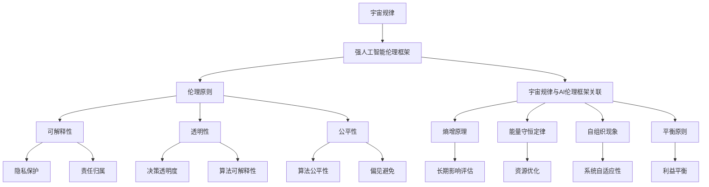

                 

### 第一部分：引论

#### 1.1 宇宙规律概述

宇宙规律是指那些支配宇宙演化、结构形成和物质运动的普遍性法则。这些规律在物理学、宇宙学和其他自然科学领域中得到了广泛的研究和应用。以下是宇宙规律的一些基本概念和原则：

- **基本物理定律**：这些是描述自然界最基本的物理现象的法则，包括牛顿运动定律、能量守恒定律、电荷守恒定律和量子力学原理等。

- **宇宙演化**：宇宙从大爆炸开始，经历了宇宙背景辐射、星系形成、恒星诞生和死亡等过程，最终形成了我们今天所看到的宇宙结构。

- **复杂性**：宇宙中的物质和现象表现出极高的复杂性，从简单的原子到复杂的星系，乃至人类文明，都体现了宇宙规律的奇妙和深远。

宇宙规律对人工智能（AI）的发展有着深刻的启示。宇宙中的规律性为我们提供了一种理解复杂系统的框架，这种框架可以应用于人工智能的设计和实现中。例如，量子力学原理中的概率论和不确定性原理可以启发我们开发出更加鲁棒和适应性强的AI系统。而宇宙中的自组织和复杂性理论则为AI算法的创新提供了新的思路。

#### 1.2 强人工智能的定义与发展

强人工智能（AGI，Artificial General Intelligence）是指一种具有广泛认知能力的人工智能系统，能够在各种环境中进行学习、推理、规划和问题解决。与目前广泛应用的弱人工智能（如语音识别、图像处理、自然语言处理等）不同，强人工智能的目标是实现与人类相似的智能水平。

- **强人工智能的概念**：强人工智能不仅能够执行特定的任务，还能理解、学习和适应新的情境。

- **强人工智能的技术进步**：近年来，机器学习、深度学习、神经网络等技术的快速发展，使得强人工智能的实现逐渐变得可行。

强人工智能的发展不仅依赖于技术的进步，还需要解决一系列伦理、社会和法律问题。可解释强人工智能（XAGI，Explainable Artificial General Intelligence）作为强人工智能的一个重要分支，强调AI系统的透明性和可解释性，这对于确保AI系统的安全、可靠和道德性至关重要。

#### 1.3 可解释强人工智能与伦理

可解释强人工智能（XAGI）的核心目标是使AI系统的决策过程透明，让人类能够理解和信任AI的行为。在伦理方面，可解释强人工智能的提出引发了对AI伦理的深刻反思。

- **可解释强人工智能的重要性**：可解释性不仅有助于提高AI系统的可信度，还能在AI系统引发争议或错误时提供问责的依据。

- **伦理在人工智能发展中的角色**：伦理在AI系统的设计和应用中扮演着关键角色，涉及到隐私保护、公平性、透明度和责任等问题。

随着AI技术的不断进步，伦理问题也变得更加复杂和紧迫。如何平衡技术进步与伦理要求，确保AI系统的发展符合人类的价值观和利益，成为了一个亟待解决的问题。

### 《宇宙规律对可解释强人工智能伦理框架的启示》

> **关键词**：宇宙规律，强人工智能，伦理框架，可解释性，透明性

> **摘要**：
本文旨在探讨宇宙规律对可解释强人工智能伦理框架的启示。通过分析宇宙中的基本规律和演化过程，本文揭示了宇宙规律在人工智能设计中的潜在应用。同时，本文讨论了强人工智能及其伦理问题的现状，并提出了基于宇宙规律的伦理框架构建方法。通过案例分析，本文展示了宇宙规律在伦理决策中的应用，并为人工智能伦理教育提供了新的思路。最后，本文展望了宇宙规律在人工智能伦理研究中的未来作用。

### 《宇宙规律对可解释强人工智能伦理框架的启示》目录大纲

- **第一部分：引论**
  - **第1章：宇宙规律概述**
  - **第2章：强人工智能的定义与发展**
  - **第3章：可解释强人工智能与伦理**

- **第二部分：宇宙规律对伦理框架的影响**
  - **第4章：宇宙规律与伦理原则**
  - **第5章：宇宙规律与强人工智能伦理框架**

- **第三部分：宇宙规律与人工智能伦理案例分析**
  - **第6章：宇宙规律视角下的AI伦理案例分析**
  - **第7章：宇宙规律在人工智能伦理教育中的应用**

- **第四部分：未来展望**
  - **第8章：宇宙规律与人工智能伦理的未来**
  - **第9章：总结与展望**

## 第一部分：引论

### 1.1 宇宙规律概述

宇宙规律是宇宙中普遍存在的基本法则，它们支配着宇宙的演化、结构和物质运动。这些规律不仅对自然界的基本过程进行了精确描述，而且为科学的发展提供了坚实的理论基础。以下是宇宙规律的一些核心概念和原则：

#### 1.1.1 宇宙的基本规律

1. **物理定律**：
   - **牛顿运动定律**：描述物体在力的作用下的运动状态。
   - **能量守恒定律**：能量在系统内不会增减，只会从一种形式转换为另一种形式。
   - **电荷守恒定律**：电荷的总量在任何物理过程中都是不变的。
   - **量子力学原理**：描述微观粒子的行为，包括不确定性原理和量子纠缠。

2. **宇宙演化**：
   - **大爆炸理论**：宇宙起源于一个极热、极密的状态，经过膨胀形成了今天的宇宙。
   - **暗物质和暗能量**：宇宙中不可见但影响宇宙演化的物质和能量。

3. **宇宙结构**：
   - **星系**：由大量恒星、星云和其他物质组成的巨型结构。
   - **超星系团**：由多个星系组成的更大的结构。

#### 1.1.2 宇宙演化与复杂性

宇宙的演化过程中，从简单的结构（如原子）到复杂的结构（如星系），体现了宇宙规律的复杂性和多样性。这些规律不仅在物理层面发挥作用，也在生物学、化学和社会科学等领域产生了深远影响。

- **复杂性科学**：研究复杂系统的行为和结构，如生态系统、社会网络等。
- **自组织现象**：在无外力作用下，系统自行组织成有序结构的过程。

宇宙规律对人工智能（AI）的发展有着重要启示。例如，量子力学中的概率论和不确定性原理可以启发我们设计更加鲁棒的AI系统，而宇宙自组织现象则为AI算法的创新提供了新的思路。宇宙规律不仅提供了对复杂系统的理解框架，也为AI的设计和实现提供了理论基础。

### 1.2 强人工智能的定义与发展

强人工智能（AGI，Artificial General Intelligence）是指具有广泛认知能力的人工智能系统，能够在各种环境和任务中表现出类似人类的智能水平。与目前广泛应用的弱人工智能（如语音识别、图像处理、自然语言处理等）不同，强人工智能的目标是实现通用智能，能够执行从简单的计算到复杂的人类任务。

#### 1.2.1 强人工智能的概念

1. **通用人工智能**：强人工智能也被称为通用人工智能（AGI），其核心特征包括：
   - **学习与适应能力**：能够自主学习和适应新环境、新任务。
   - **理解与推理能力**：能够理解语言、图像、声音等多种形式的信息，并进行逻辑推理。
   - **情感与社交能力**：能够表现出情感反应和社交行为，具备一定的情感智能。

2. **人类智能的模拟**：强人工智能旨在模拟人类智能，实现与人类相似的认知能力，包括感知、记忆、理解、学习、推理、决策和问题解决等。

#### 1.2.2 强人工智能的技术进步

近年来，随着计算能力的提升、算法的进步和数据的丰富，强人工智能的研究取得了显著进展。以下是强人工智能发展的关键技术和里程碑：

1. **机器学习与深度学习**：
   - **监督学习**：通过标注数据训练模型，使其能够预测未知数据。
   - **无监督学习**：从未标注的数据中发现模式和结构。
   - **深度学习**：通过多层神经网络模型，实现更复杂的特征提取和模式识别。

2. **自然语言处理**：
   - **文本分析**：包括词性标注、句法分析、语义理解等。
   - **语音识别**：将语音信号转换为文本或命令。

3. **计算机视觉**：
   - **图像识别**：识别和分类图像中的对象和场景。
   - **视频处理**：分析视频中的动作、行为和情感。

4. **智能推理系统**：
   - **知识表示与推理**：将人类知识以计算机可处理的形式表示，并进行推理。
   - **逻辑推理**：利用逻辑规则进行推理和决策。

#### 1.2.3 强人工智能的发展挑战

尽管强人工智能的发展取得了显著成果，但要实现真正的通用智能仍然面临许多挑战：

1. **技术难题**：
   - **算法优化**：现有算法仍需进一步优化，以提升效率和处理能力。
   - **计算资源**：强人工智能需要巨大的计算资源和数据支持。

2. **伦理问题**：
   - **透明性与可解释性**：如何确保AI系统的决策过程透明和可解释，以便人类理解和信任。
   - **隐私与安全**：如何保护个人隐私和数据安全，防止AI系统被恶意利用。

3. **社会挑战**：
   - **就业影响**：AI技术可能引发失业和社会结构的变化。
   - **责任归属**：如何确定AI系统引发事故或错误时的责任归属。

### 1.3 可解释强人工智能与伦理

可解释强人工智能（XAGI，Explainable Artificial General Intelligence）强调AI系统的透明性和可解释性，使得人类能够理解和信任AI的行为和决策。在伦理方面，可解释强人工智能的提出引发了对AI伦理的深刻反思。

#### 1.3.1 可解释强人工智能的重要性

1. **信任与责任**：可解释性是建立人类对AI系统信任的基础，也是确保AI系统在发生错误时能够进行问责的关键。

2. **法律与合规**：许多国家和地区的法律法规要求AI系统具有可解释性，以确保AI的应用符合道德和法律标准。

3. **技术与伦理的结合**：通过设计可解释的AI系统，可以将伦理原则融入技术实现中，从而在AI发展的同时保障人类的利益和价值观。

#### 1.3.2 伦理在人工智能发展中的角色

1. **伦理原则的指导**：伦理原则为AI系统的发展提供了道德框架，指导AI技术的应用方向和限制。

2. **社会影响的评估**：在AI技术的开发和应用过程中，需要评估其对社会的潜在影响，并采取相应的措施减少负面影响。

3. **跨学科合作**：AI技术的发展涉及多个学科领域，包括计算机科学、伦理学、社会学等，需要跨学科合作以实现全面、综合的解决方案。

随着AI技术的不断进步，伦理问题变得更加复杂和紧迫。如何平衡技术进步与伦理要求，确保AI系统的发展符合人类的价值观和利益，成为了一个亟待解决的问题。

## 第二部分：宇宙规律对伦理框架的影响

### 2.1 伦理原则概述

伦理原则是指导人类行为的基本道德规范，它们在各个社会和文化中都有着重要地位。在人工智能（AI）领域，伦理原则同样扮演着至关重要的角色，帮助确保AI技术的负责任和应用。以下是对传统伦理原则和当代伦理问题的一个概述。

#### 2.1.1 传统伦理原则

传统伦理原则源于古希腊哲学家如苏格拉底、柏拉图和亚里士多德，以及后来的基督教伦理思想。这些原则主要包括：

1. **德行伦理**：强调个体应该培养良好的品德，如正义、诚实、慷慨和勇敢。
2. **功利主义**：由边沁和米尔提出，主张行为应该追求最大化的幸福和利益。
3. **义务伦理**：康德提出，强调个体应遵循道德义务，而非仅仅追求结果。
4. **美德伦理**：亚里士多德提出，强调培养美德和道德品质的重要性。

#### 2.1.2 当代伦理问题

随着科技的发展，伦理问题变得更加复杂和多元。当代伦理问题包括但不限于以下几类：

1. **隐私**：随着大数据和人工智能技术的发展，个人隐私的保护成为了一个重要议题。
2. **数据安全**：如何确保数据不被滥用或泄露，成为一个严峻的挑战。
3. **公平性**：如何确保AI系统在性别、种族、年龄等方面的公平性。
4. **责任归属**：在AI系统引发事故或错误时，如何确定责任归属。

### 2.2 宇宙规律与伦理原则的关联

宇宙规律与伦理原则之间存在着深刻的关联。宇宙规律提供了自然界的基本法则，而伦理原则则是人类社会行为的道德指南。以下是宇宙规律与伦理原则之间的几个关键联系：

#### 2.2.1 宇宙规律与道德基础

1. **宇宙规律的一致性与道德原则**：宇宙规律的一致性和普遍性为道德原则提供了一种客观的基础。例如，物理定律的普适性可以类比为道德原则的普遍适用性。
2. **宇宙的演化与伦理发展**：宇宙的演化过程，如生物进化和社会进步，反映了自然选择和适应性。这一过程为伦理原则的发展提供了启示，如适应环境的需求和道德进步。

#### 2.2.2 宇宙规律与伦理判断

1. **宇宙规律与道德推理**：宇宙规律，如能量守恒定律和熵增原理，可以帮助我们进行道德推理。例如，能量守恒定律可以类比为道德行为的能量消耗和转化，而熵增原理可以启发我们对道德行为的社会影响进行评估。
2. **宇宙复杂性对伦理决策的启示**：宇宙中的复杂性，如生态系统和社会网络，为伦理决策提供了复杂的背景。这一背景要求我们在做出伦理判断时，考虑系统的整体影响和长远的后果。

### 2.3 宇宙规律在伦理决策中的应用

宇宙规律不仅为道德原则提供了基础，还在具体的伦理决策中发挥着重要作用。以下是宇宙规律在伦理决策中的一些具体应用：

#### 2.3.1 宇宙规律与道德推理

1. **熵增原理**：熵增原理表明，系统总是趋向于无序状态。在伦理决策中，这一原理可以帮助我们评估行为的长远影响。例如，一个可能导致环境恶化的行为可能会增加系统的熵，从而引发负面的道德评价。
2. **平衡原则**：宇宙规律中许多原则都强调了平衡的重要性，如能量守恒定律和生态平衡。这一原则可以启发我们在伦理决策中追求平衡，避免单方面的利益追求。

#### 2.3.2 宇宙规律与道德实践

1. **自组织现象**：自组织现象展示了系统在没有外部干预下自行组织成有序结构的能力。这一现象可以启发我们在道德实践中采取自我约束和自我管理的策略，以促进社会和谐和公平。
2. **适应性**：宇宙规律中的适应性原则要求我们在伦理决策中考虑变化的情境和环境。这意味着我们需要灵活应对各种挑战，并在不断变化的环境中保持道德的稳定和连贯。

通过将宇宙规律应用于伦理决策，我们可以获得一种更为全面和深入的道德视角。这种视角不仅帮助我们理解和评估具体的行为，还指导我们在复杂的社会环境中做出负责任的决策。

### 2.4 宇宙规律在伦理决策中的应用

宇宙规律，作为宇宙演化的基本法则，不仅在自然科学中起到了关键作用，也为伦理决策提供了深刻的启示。通过将宇宙规律应用于伦理决策，我们可以更全面地理解道德行为的影响和责任，从而做出更加负责任的决策。

#### 2.4.1 宇宙规律与道德推理

1. **熵增原理**：
   熵增原理是热力学第二定律的核心内容，指出一个孤立系统的熵总是趋向于增加。在伦理决策中，这一原理可以帮助我们评估行为的长期影响。例如，一个可能带来短期效益但导致长期环境恶化的行为，可以被视为违背了熵增原理。熵增原理提示我们在决策时不仅要考虑即时利益，还要关注长期后果。

2. **平衡原则**：
   宇宙中的许多现象，如生态系统的平衡和物理系统的稳定性，都强调了平衡的重要性。在伦理决策中，平衡原则要求我们在利益冲突时寻求公正和和谐。例如，在资源分配问题中，我们需要确保资源的使用既能满足当前需求，又不会破坏未来的可持续发展。

3. **适应性原则**：
   宇宙中的生物和自然系统都展示了极高的适应性。这一原则启示我们在伦理决策中，要考虑行为对环境和社会的适应能力。例如，在制定公共政策时，我们需要确保这些政策能够适应未来的变化和挑战，而不是仅仅解决眼前的问题。

#### 2.4.2 宇宙规律与道德实践

1. **自组织现象**：
   自组织现象是指系统在没有外部干预下自行组织成有序结构的过程。这一原理提示我们，在道德实践中，可以通过自我约束和协作来促进社会秩序和和谐。例如，在社区建设中，鼓励居民自主组织和参与社区事务，可以提高社区的凝聚力和自治能力。

2. **和谐原则**：
   宇宙中的许多现象，如星系和生物群落，都展示了和谐与协同工作的原则。在伦理决策中，和谐原则要求我们尊重不同利益相关者的需求和权益，寻求共同利益的最大化。例如，在商业活动中，企业需要考虑员工、客户和社区的利益，以实现可持续发展。

3. **可持续性原则**：
   可持续性原则是宇宙规律在伦理决策中的重要体现。宇宙中的资源是有限的，如何在有限的资源下实现长期发展，是伦理决策中的一个重要议题。在环境政策、资源管理和经济发展中，我们需要采取可持续的策略，以确保未来的繁荣和幸福。

通过将宇宙规律应用于伦理决策，我们可以获得一种更为全面和深入的道德视角。这种视角不仅帮助我们理解和评估具体的行为，还指导我们在复杂的社会环境中做出负责任的决策。例如，在AI技术的应用中，我们需要考虑技术对人类和社会的长远影响，以确保技术的发展能够符合道德原则和宇宙规律的要求。

#### 3.1 强人工智能伦理框架概述

随着强人工智能（AGI，Artificial General Intelligence）技术的发展，其伦理问题日益受到关注。强人工智能不仅具有广泛的认知能力，能够在各种任务中表现出类似人类的智能水平，而且还涉及到隐私、公平、责任等复杂的社会问题。因此，构建一个全面的强人工智能伦理框架变得至关重要。

#### 3.1.1 强人工智能伦理研究的现状

目前，强人工智能伦理研究主要集中在以下几个方面：

1. **隐私与数据安全**：随着AI系统对大量个人数据的依赖，如何保护用户隐私和数据安全成为了一个重要议题。许多研究探讨了数据匿名化、加密技术和隐私保护算法。
2. **公平性与歧视**：AI系统在决策过程中可能引入偏见，导致不公平的结果。研究重点是如何设计算法，避免性别、种族、年龄等方面的歧视。
3. **透明性与可解释性**：强人工智能系统的决策过程通常复杂且不可解释，如何提高AI系统的透明度和可解释性，使其行为可被人类理解和信任，是一个关键问题。
4. **责任归属**：当AI系统发生错误或造成损害时，如何确定责任归属，是一个复杂的法律和伦理问题。研究涉及责任分配、AI系统自主责任和人类监管等多个方面。
5. **就业与经济影响**：强人工智能可能会取代某些工作岗位，对社会经济结构产生深远影响。研究探讨如何平衡技术进步与社会就业。

#### 3.1.2 强人工智能伦理框架的类型

现有的强人工智能伦理框架可以大致分为以下几种类型：

1. **责任伦理框架**：强调AI系统的责任性和可问责性，包括明确的责任归属和责任承担机制。
2. **公正伦理框架**：关注AI系统在决策过程中如何确保公平性和避免歧视，包括算法公平性和公平结果的设计。
3. **透明性伦理框架**：强调AI系统的透明度和可解释性，包括决策过程的可视化和可理解性。
4. **安全伦理框架**：关注AI系统的安全性和鲁棒性，包括防止恶意攻击和确保系统稳定性。
5. **伦理价值框架**：将伦理价值融入AI系统的设计，包括道德原则和价值观的编码。

#### 3.1.3 强人工智能伦理框架的重要性

构建一个全面的强人工智能伦理框架具有重要意义：

1. **确保AI系统的安全性和可靠性**：通过明确的伦理规范和责任机制，可以降低AI系统可能带来的风险和错误。
2. **提高公众对AI技术的信任**：透明性和可解释性框架有助于增强公众对AI技术的信任，促进技术的广泛接受和应用。
3. **促进AI技术的可持续发展**：通过平衡技术进步与社会利益，确保AI技术的发展符合人类的价值观和道德原则。
4. **指导政策制定**：伦理框架为政策制定提供了科学依据，有助于制定合理的监管政策和法律法规。

综上所述，强人工智能伦理框架是确保AI技术健康发展的重要保障。通过研究和构建全面的伦理框架，我们可以更好地应对AI技术带来的挑战，实现技术与伦理的良性互动。

#### 3.2 宇宙规律与强人工智能伦理框架的启示

宇宙规律为强人工智能伦理框架的构建提供了深刻的启示。通过对宇宙规律的理解和应用，我们可以更全面地构建一个符合道德原则和宇宙规律的强人工智能伦理框架。

##### 3.2.1 宇宙规律与强人工智能伦理原则

1. **能量守恒定律**：能量守恒定律表明，能量在一个封闭系统中不会增减，只会从一种形式转换为另一种形式。在强人工智能伦理框架中，这一原理可以启示我们确保AI系统的资源使用是高效和合理的。例如，在设计AI算法时，需要优化资源利用，避免浪费计算资源和能源。

2. **熵增原理**：熵增原理表明，一个孤立系统的熵总是趋向于增加。在强人工智能伦理框架中，这一原理可以启示我们关注AI系统的长期影响和整体系统效应。例如，在AI系统应用中，需要考虑其对环境和社会的长期影响，避免导致系统熵的增加，即避免产生长期的不利后果。

3. **自组织现象**：自组织现象是指系统在没有外部干预下自行组织成有序结构的过程。在强人工智能伦理框架中，这一原理可以启示我们鼓励AI系统的自我管理和自我约束。例如，在AI系统的设计和应用中，可以引入自我监督和自我校正机制，以确保系统的行为符合伦理规范。

4. **平衡原则**：宇宙中的许多现象，如生态系统的平衡和物理系统的稳定性，都强调了平衡的重要性。在强人工智能伦理框架中，平衡原则可以启示我们在设计AI系统时，考虑系统的各个方面，包括公平性、透明性和安全性。例如，在设计算法时，需要平衡不同利益相关者的需求和权益，确保系统的决策既公正又安全。

##### 3.2.2 宇宙规律与强人工智能伦理规范

1. **道德基础**：宇宙规律为道德原则提供了客观基础，可以用于指导强人工智能伦理规范的制定。例如，通过理解能量守恒定律和熵增原理，我们可以制定出符合宇宙规律和道德原则的AI伦理规范。这些规范可以包括资源使用效率、环境影响评估和长期决策等方面。

2. **责任归属**：宇宙规律中的责任原则可以启示我们如何确定AI系统的责任归属。例如，通过理解熵增原理，我们可以识别出哪些行为会导致系统熵的增加，从而确定责任归属。在AI系统引发错误或事故时，需要明确责任归属，确保错误的纠正和责任的承担。

3. **公平性与歧视**：宇宙规律中的平衡原则和自组织现象可以启示我们如何设计公平的AI系统，避免歧视。例如，在算法设计中，可以引入平衡机制，确保决策过程中各种利益相关者的权益得到公平对待。通过自组织现象，可以鼓励AI系统在运行过程中自我调整，以减少偏见和歧视。

4. **透明性与可解释性**：宇宙规律中的透明性原则可以启示我们如何提高AI系统的透明度和可解释性。例如，通过将宇宙规律中的自我组织现象应用于AI系统的设计，可以开发出具有透明决策过程的AI系统。这些系统可以在运行过程中自动记录和解释决策过程，以便人类理解和监督。

##### 3.2.3 宇宙规律在强人工智能伦理框架构建中的应用

1. **方法论**：宇宙规律可以作为一种方法论，用于指导强人工智能伦理框架的构建。例如，在构建伦理框架时，可以采用熵增原理来评估决策的长期影响，使用自组织现象来设计自我监督机制，使用平衡原则来确保系统的公平性。

2. **实例分析**：通过具体的实例，可以展示如何将宇宙规律应用于强人工智能伦理框架的构建。例如，在一个自动驾驶汽车系统中，可以采用熵增原理来评估其对环境和社会的长期影响，使用透明性原则来设计系统的可解释性，使用平衡原则来确保不同利益相关者的权益。

3. **评价与改进**：宇宙规律的应用可以用于评价和改进现有的强人工智能伦理框架。例如，通过熵增原理和透明性原则的评估，可以识别出现有框架中的不足和缺陷，并提出改进方案。

综上所述，宇宙规律为强人工智能伦理框架的构建提供了深刻的启示。通过将宇宙规律应用于伦理原则和规范的设计，我们可以构建出一个更加全面、合理和可持续的伦理框架，以应对强人工智能技术带来的挑战和机遇。

### 3.3 宇宙规律指导下的强人工智能伦理框架构建

构建一个基于宇宙规律的强人工智能伦理框架需要系统的方法论和步骤。以下是构建过程的具体方法和实例分析。

#### 3.3.1 构建方法与步骤

1. **需求分析**：首先，需要明确强人工智能系统的应用场景和目标。分析系统的功能、性能要求，以及可能涉及的伦理问题。例如，在自动驾驶系统中，需要考虑隐私、安全、责任归属等问题。

2. **宇宙规律应用**：基于宇宙规律，分析其对伦理框架构建的启示。应用能量守恒定律、熵增原理、自组织现象和平衡原则等，为伦理框架提供理论基础。例如，在自动驾驶系统中，可以应用熵增原理来评估其对环境和社会的长期影响，应用平衡原则来确保不同利益相关者的权益。

3. **伦理原则确立**：在需求分析和宇宙规律应用的基础上，确立伦理原则。这些原则应包括透明性、可解释性、公平性、责任归属等。例如，可以确立透明性原则，要求系统的决策过程可被理解和验证；确立责任归属原则，确保在系统发生错误时，责任可以明确分配。

4. **伦理规范制定**：根据伦理原则，制定具体的伦理规范。这些规范应包括行为准则、操作规程和责任机制。例如，在自动驾驶系统中，可以制定隐私保护规范，确保个人隐私不被侵犯；制定安全规范，确保系统的可靠性和安全性。

5. **评价与改进**：建立评价机制，定期评估伦理框架的有效性和适用性。根据评估结果，对框架进行改进和优化。例如，通过反馈机制，收集用户和利益相关者的意见，对伦理框架进行调整和改进。

#### 3.3.2 实例分析

以下是一个基于宇宙规律的强人工智能伦理框架构建实例：自动驾驶汽车系统。

1. **需求分析**：
   自动驾驶汽车系统需要在复杂的交通环境中自主行驶，涉及隐私、安全、责任等多个伦理问题。例如，系统需要处理个人隐私数据（如位置信息），确保车辆和乘客的安全，以及在事故发生时确定责任归属。

2. **宇宙规律应用**：
   - **能量守恒定律**：确保系统的资源使用是高效和合理的，避免浪费。
   - **熵增原理**：评估系统对环境和社会的长期影响，避免导致系统熵的增加。
   - **自组织现象**：设计系统的自我管理和自我校正机制，确保其行为符合伦理规范。
   - **平衡原则**：确保系统的决策过程中，不同利益相关者的权益得到公平对待。

3. **伦理原则确立**：
   - **透明性原则**：系统的决策过程需可被理解和验证。
   - **安全原则**：确保系统的可靠性和安全性。
   - **责任归属原则**：在系统发生错误时，责任可以明确分配。
   - **公平性原则**：确保系统在决策过程中不引入歧视。

4. **伦理规范制定**：
   - **隐私保护规范**：确保个人隐私不被侵犯。
   - **安全规范**：确保车辆和乘客的安全。
   - **责任归属规范**：在事故发生时，明确责任归属。
   - **公平性规范**：确保决策过程中不同利益相关者的权益得到公平对待。

5. **评价与改进**：
   通过反馈机制，定期评估系统的伦理表现。例如，通过用户调查、事故分析等方式，收集用户和利益相关者的意见。根据评估结果，对伦理框架进行调整和优化。

通过这一实例分析，我们可以看到，宇宙规律为强人工智能伦理框架的构建提供了有力的指导。通过明确的方法和步骤，可以构建出一个科学、合理和有效的伦理框架，以应对强人工智能技术带来的挑战。

### 3.4 宇宙规律视角下的AI伦理案例分析

为了更好地理解宇宙规律对AI伦理决策的启示，我们可以通过具体案例进行分析。以下是两个具有代表性的AI伦理案例，结合宇宙规律进行详细解析。

#### 3.4.1 案例选择与概述

**案例一：自动驾驶汽车事故**

自动驾驶汽车在道路上发生事故，导致行人死亡。事故发生后，公众、媒体和法律界对自动驾驶汽车的安全性和伦理责任展开了广泛讨论。这一案例涉及隐私、安全、责任归属等多个伦理问题。

**案例二：AI系统推荐歧视**

一个在线购物平台使用AI算法推荐商品，但由于算法中的偏见，导致某些用户无法获得公平的商品推荐。这一案例主要涉及公平性、歧视和透明性等问题。

#### 3.4.2 案例分析

**案例一：自动驾驶汽车事故**

1. **熵增原理**：
   根据熵增原理，系统的熵总是趋向于增加。在自动驾驶汽车事故中，事故的发生可能增加了系统的熵，导致负面后果。例如，事故可能引发社会对自动驾驶技术的信任危机，增加对AI系统的监管要求。

2. **能量守恒定律**：
   能量守恒定律提示我们，系统的资源使用应高效合理。在自动驾驶汽车中，需要优化算法和系统设计，以降低能耗和资源浪费。例如，通过优化传感器数据处理的效率，可以提高系统的响应速度和决策质量。

3. **自组织现象**：
   自组织现象启示我们，系统可以自行组织和调整，以适应外部环境。在自动驾驶汽车事故中，可以通过引入自我监督和自我校正机制，提高系统的鲁棒性和安全性。例如，系统可以实时监测自身性能，并在检测到潜在问题时自动进行调整。

4. **平衡原则**：
   平衡原则要求我们在设计和应用AI系统时，考虑系统的各个方面，包括安全性、透明性和公平性。在自动驾驶汽车事故中，需要确保系统的决策过程透明，以便人类理解和监督。同时，要平衡系统的安全性和灵活性，确保在复杂环境中能够做出合理的决策。

**案例二：AI系统推荐歧视**

1. **熵增原理**：
   AI系统推荐歧视可能导致系统的熵增加，影响用户体验和社会信任。例如，歧视性推荐可能导致某些用户感到被忽视或排斥，增加系统的负面评价。

2. **能量守恒定律**：
   在设计AI系统时，需要确保算法的公平性和透明性，避免引入不必要的偏见和歧视。例如，通过多方面的数据分析和算法优化，可以减少歧视性推荐。

3. **自组织现象**：
   自组织现象提示我们，系统可以通过自我学习和调整来减少歧视。例如，AI系统可以实时监测推荐结果的公平性，并在检测到问题时自动进行调整。

4. **平衡原则**：
   平衡原则要求我们在算法设计中，确保不同用户群体的权益得到公平对待。例如，通过引入多样性指标，确保推荐结果不仅满足大多数用户的需求，也兼顾到少数群体的利益。

#### 3.4.3 案例分析与宇宙规律

通过以上案例分析，我们可以看到，宇宙规律为AI伦理决策提供了重要的指导。熵增原理帮助我们评估AI系统的长期影响，能量守恒定律提示我们在设计AI系统时注重资源优化，自组织现象鼓励系统自我调整和优化，平衡原则要求我们在算法设计中确保公平性。

结合宇宙规律进行AI伦理案例分析，不仅有助于识别和解决具体问题，还可以提供更全面、深入的伦理视角。这种视角可以帮助我们更好地理解和应对AI技术带来的挑战，确保AI系统的安全、可靠和道德性。

### 4.2 宇宙规律与AI伦理案例关联

在AI伦理案例中，宇宙规律提供了一个深刻的分析框架，帮助我们在复杂情境中理解并评估伦理决策。以下是宇宙规律如何与AI伦理案例相关联的具体讨论。

#### 4.2.1 宇宙规律与自动驾驶汽车事故

在自动驾驶汽车事故案例中，宇宙规律的应用可以提供多方面的启示：

1. **熵增原理**：自动驾驶汽车事故可能导致系统和社会熵的增加，引发信任危机和法律诉讼。这一原理提醒我们在设计和部署自动驾驶技术时，需要考虑到系统的长期稳定性和社会影响，避免导致负面的社会效应。

2. **能量守恒定律**：这一原理提示我们在设计自动驾驶系统时，应注重能源的高效利用和计算资源的优化。例如，通过改进算法和硬件设计，提高系统的能效，降低能源消耗，从而减少对环境的影响。

3. **自组织现象**：自动驾驶系统可以借鉴自组织原理，通过自我学习和调整，提高系统的鲁棒性和适应性。例如，系统可以通过实时监测和自我校正，优化决策过程，减少错误发生的可能性。

4. **平衡原则**：在自动驾驶事故中，平衡原则要求我们在确保系统安全的同时，也要关注公平性和透明性。例如，通过设计透明的决策机制和透明的测试过程，确保系统的决策过程可以被公众和监管机构理解和接受。

#### 4.2.2 宇宙规律与AI系统推荐歧视

在AI系统推荐歧视的案例中，宇宙规律的应用同样具有重要的指导意义：

1. **熵增原理**：推荐歧视可能导致用户和社会的熵增加，引发用户的不满和信任危机。这一原理提示我们，在设计和部署推荐系统时，需要确保算法的公平性和透明性，以避免负面社会效应。

2. **能量守恒定律**：在算法设计和数据处理过程中，需要确保数据资源的合理使用，避免过度消耗计算资源。例如，通过优化数据处理流程和算法，提高系统的效率和准确性。

3. **自组织现象**：AI系统可以通过自我学习和优化，减少推荐歧视。例如，系统可以实时监测推荐结果的公平性，并通过反馈机制进行调整，确保推荐结果的公平性。

4. **平衡原则**：平衡原则要求我们在算法设计中，确保不同用户群体的权益得到公平对待。例如，通过引入多样性指标和反歧视算法，确保推荐系统能够公平地服务于所有用户，避免引入偏见和歧视。

#### 4.2.3 宇宙规律与AI伦理案例的总体关联

宇宙规律在AI伦理案例中的应用，不仅提供了分析问题的框架，还帮助我们在复杂情境中做出更全面和深入的伦理决策。以下是宇宙规律在AI伦理案例中的总体关联：

1. **系统整体观**：宇宙规律强调系统的整体性和全局观，帮助我们在设计和应用AI系统时，从整体角度考虑系统的长期影响和社会效益。

2. **动态变化性**：宇宙规律中的动态变化性提示我们，AI系统需要具备适应性和灵活性，以应对不断变化的外部环境和需求。

3. **自我调节性**：宇宙规律中的自组织现象和自我调节性原理，启示我们在AI系统中引入自我学习和自我校正机制，以提高系统的可靠性和安全性。

4. **平衡与和谐**：宇宙规律中的平衡原则和和谐性，要求我们在AI系统的设计和应用中，追求公平性、透明性和安全性，确保系统与人类社会和谐共存。

通过将宇宙规律应用于AI伦理案例，我们可以获得一个更为全面和深入的伦理视角，帮助我们在复杂情境中做出负责任的决策，确保AI技术的发展符合人类的价值观和利益。

### 4.3 案例分析与宇宙规律

在分析自动驾驶汽车事故和AI系统推荐歧视两个伦理案例时，宇宙规律提供了深刻的分析视角，帮助我们理解AI系统的伦理决策。

#### 4.3.1 案例分析

**自动驾驶汽车事故**

自动驾驶汽车事故案例中，涉及隐私、安全和责任归属等多个伦理问题。首先，事故的发生可能导致社会对自动驾驶技术的信任危机，增加系统的熵。根据熵增原理，系统的熵总是趋向于增加，因此，我们需要确保自动驾驶系统的设计和应用具有高度的稳定性和可靠性。

在能量守恒定律的指导下，我们需要优化系统的能源消耗，提高计算效率。此外，自组织现象提示我们，自动驾驶系统应具备自我学习和自我校正的能力，以应对复杂多变的交通环境。

**AI系统推荐歧视**

在AI系统推荐歧视的案例中，系统的推荐算法可能引入偏见，导致某些用户无法获得公平的商品推荐。根据熵增原理，推荐歧视可能导致用户和社会的熵增加，引发用户的不满和信任危机。为了解决这一问题，我们需要确保算法的公平性和透明性。

能量守恒定律要求我们在算法设计和数据处理过程中，合理使用数据资源，避免浪费。自组织现象提示我们，AI系统可以通过自我学习和优化，减少歧视。通过引入多样性指标和反歧视算法，系统可以在推荐过程中确保公平性。

#### 4.3.2 宇宙规律与案例关联

在自动驾驶汽车事故和AI系统推荐歧视的案例中，宇宙规律提供了以下几个关键关联：

1. **熵增原理**：在自动驾驶汽车事故中，熵增原理提示我们需要关注系统的长期影响和社会效益。在AI系统推荐歧视中，熵增原理要求我们确保算法的公平性和透明性，以减少用户和社会的熵增加。

2. **能量守恒定律**：能量守恒定律要求我们在系统设计和应用中，注重资源的高效利用。在自动驾驶汽车中，这包括优化算法和硬件设计，降低能耗；在AI系统推荐中，这包括合理使用数据处理资源，提高算法的效率。

3. **自组织现象**：自组织现象提示我们，系统应具备自我学习和自我校正的能力，以应对复杂多变的情境。在自动驾驶汽车中，这意味着系统应具备自我监督和自我优化功能；在AI系统推荐中，这意味着系统应通过反馈机制，实时调整推荐策略。

4. **平衡原则**：平衡原则要求我们在设计和应用AI系统时，追求公平性、透明性和安全性。在自动驾驶汽车中，这意味着我们需要确保系统的决策过程透明，易于公众监督；在AI系统推荐中，这意味着我们需要确保推荐结果公平，避免引入偏见。

通过将宇宙规律应用于AI伦理案例分析，我们可以获得一个更为全面和深入的伦理视角，帮助我们在复杂情境中做出负责任的决策，确保AI技术的发展符合人类的价值观和利益。

### 4.4 宇宙规律在人工智能伦理教育中的应用

在人工智能（AI）伦理教育中，将宇宙规律融入教学，可以帮助学生更好地理解AI伦理问题，培养他们的道德判断能力和责任感。以下是如何在AI伦理教育中应用宇宙规律的几个关键步骤和实例。

#### 4.4.1 教育内容与宇宙规律的融入

1. **熵增原理**：在课程中引入熵增原理，解释系统熵的增加如何导致负面社会效应。例如，讨论自动驾驶汽车事故如何增加社会的熵，引发信任危机和法律责任问题。

2. **能量守恒定律**：通过能量守恒定律，引导学生思考AI系统的资源使用效率。讨论如何优化算法和系统设计，以减少能源消耗和计算资源浪费。

3. **自组织现象**：介绍自组织现象，强调系统在复杂环境中的自我调整和适应能力。通过案例，如人工智能系统的自我学习和自我优化，让学生了解如何设计具有自适应性的AI系统。

4. **平衡原则**：强调平衡原则在AI伦理决策中的重要性，培养学生的公平性和透明性意识。讨论如何在AI系统的设计和应用中平衡不同利益相关者的需求，避免引入偏见。

#### 4.4.2 教育方法与宇宙规律的关联

1. **案例教学**：通过案例教学，结合宇宙规律，让学生分析真实世界的AI伦理问题。例如，讨论自动驾驶汽车事故和AI系统推荐歧视的案例，结合熵增原理和平衡原则，分析系统设计和应用中的伦理挑战。

2. **模拟实验**：设计模拟实验，让学生亲身体验AI系统的设计和应用过程。例如，让学生设计一个自动驾驶系统，并要求他们在设计和测试过程中考虑能量守恒、熵增和平衡原则。

3. **跨学科合作**：鼓励跨学科合作，将宇宙规律与其他学科知识相结合。例如，结合物理学、生物学和社会学等知识，深入探讨AI伦理问题。

4. **小组讨论**：组织小组讨论，鼓励学生分享观点和见解。通过讨论，学生可以互相学习，共同探讨如何将宇宙规律应用于AI伦理教育。

#### 4.4.3 教育效果评价

1. **学生评估**：定期评估学生的学习成果，包括对AI伦理问题的理解、道德判断能力和责任感。通过考试、作业和论文，了解学生对宇宙规律和AI伦理知识的掌握程度。

2. **教师反馈**：教师应提供及时的反馈，帮助学生理解AI伦理问题的复杂性。通过指导学生如何将宇宙规律应用于实际问题，提高他们的分析和解决问题的能力。

3. **案例分析**：通过案例分析，评估学生在实际情境中应用宇宙规律和AI伦理知识的能力。讨论案例中的伦理决策过程，评估学生是否能够从宇宙规律的角度出发，做出合理的伦理判断。

4. **持续改进**：根据评估结果，持续改进教学方法和内容。例如，根据学生的反馈，调整课程设计和教学策略，确保教学与学生的实际需求相结合。

通过将宇宙规律融入AI伦理教育，我们可以培养出具备深厚伦理素养和判断能力的未来人工智能专家。这不仅有助于他们理解AI技术的潜在风险和挑战，还能确保他们在设计和应用AI系统时，能够做出负责任的决策。

### 4.5 宇宙规律指导下的伦理教育案例分析

为了更好地展示如何将宇宙规律应用于AI伦理教育，我们可以通过具体的案例分析来说明教育内容的设计与实施过程，并评价教育效果。

#### 4.5.1 案例设计与实施

**案例一：自动驾驶汽车伦理教育**

1. **背景介绍**：在课程开始时，介绍自动驾驶汽车的发展背景和现状，包括其潜在的社会影响和伦理挑战。

2. **熵增原理**：通过介绍熵增原理，引导学生理解系统熵的增加如何导致负面社会效应。讨论自动驾驶汽车事故可能引发的信任危机和法律问题。

3. **能量守恒定律**：探讨如何通过优化算法和系统设计，提高自动驾驶汽车能源效率和计算效率。引入具体案例，如节能传感器和高效数据处理算法。

4. **自组织现象**：介绍自动驾驶汽车如何通过自我学习和自我校正，提高系统的鲁棒性和适应性。例如，讲解自动驾驶汽车如何通过机器学习算法，从历史数据中学习，优化驾驶行为。

5. **平衡原则**：讨论如何平衡自动驾驶汽车的安全、透明性和公平性。通过小组讨论，让学生思考如何设计透明的决策机制，确保系统的决策过程可以被公众和监管机构理解和监督。

**案例二：AI系统推荐歧视教育**

1. **背景介绍**：介绍AI系统推荐歧视的现象，包括算法偏见和歧视性推荐的影响。

2. **熵增原理**：通过熵增原理，引导学生理解推荐歧视如何增加社会熵，引发用户不满和信任危机。

3. **能量守恒定律**：探讨如何通过优化算法和数据使用，减少推荐歧视。介绍多样性指标和反歧视算法，如公平性测试和偏差校正。

4. **自组织现象**：讨论AI系统如何通过自我学习和调整，减少推荐歧视。例如，介绍AI系统如何通过实时监测和反馈机制，调整推荐策略。

5. **平衡原则**：通过案例分析和小组讨论，引导学生思考如何在算法设计中平衡不同用户群体的权益，确保推荐结果的公平性。

#### 4.5.2 教育效果评价

1. **学生评估**：通过期末考试、作业和小组项目，评估学生对AI伦理问题的理解、道德判断能力和责任感。考察学生是否能够从宇宙规律的角度，分析和解决伦理问题。

2. **教师反馈**：教师应提供及时的反馈，帮助学生理解AI伦理问题的复杂性。通过指导学生如何将宇宙规律应用于实际问题，提高他们的分析和解决问题的能力。

3. **案例分析**：组织学生进行案例分析，评估他们在实际情境中应用宇宙规律和AI伦理知识的能力。讨论案例中的伦理决策过程，评估学生是否能够从宇宙规律的角度出发，做出合理的伦理判断。

4. **持续改进**：根据学生的反馈和评估结果，持续改进教学方法和内容。例如，根据学生的需求，调整课程设计和教学策略，确保教学与学生的实际需求相结合。

通过具体的案例分析和教育效果评价，我们可以看到，将宇宙规律应用于AI伦理教育，不仅能够帮助学生更好地理解伦理问题，还能培养他们的道德判断能力和责任感。这种教育方法不仅提高了学生的理论素养，还为他们未来的职业发展奠定了坚实的基础。

### 4.6 AI伦理教育现状

当前，人工智能（AI）伦理教育在全球范围内逐渐得到重视，各大高校和研究机构纷纷开设相关课程和项目。然而，尽管取得了一定进展，AI伦理教育仍面临诸多挑战。

#### 4.6.1 教育体系中的伦理教育

1. **课程设置**：许多高校已经将AI伦理课程纳入计算机科学、人工智能和工程等相关专业的课程体系。这些课程通常涵盖伦理原则、法律问题、社会责任等方面。

2. **跨学科合作**：AI伦理教育强调跨学科合作，涉及计算机科学、伦理学、社会学、法律等多个领域。这种跨学科教育模式有助于培养学生全面、深入地理解AI伦理问题。

3. **实践环节**：一些教育项目引入了案例分析和模拟实验等实践环节，帮助学生将理论应用于实际情境，提高他们的道德判断能力和责任感。

#### 4.6.2 人工智能伦理教育的挑战

1. **知识深度**：AI伦理问题涉及多个领域，包括技术、法律、社会等，需要教师具备广泛的知识和丰富的实践经验。然而，当前许多教师的背景主要集中在技术领域，对伦理和法律问题了解有限。

2. **学生参与度**：虽然AI伦理教育受到一定关注，但部分学生可能对伦理问题缺乏兴趣或认为与自身专业无关，导致参与度不高。

3. **教育资源**：AI伦理教育需要大量的资源和设备，包括图书、在线课程、实验设备等。然而，许多教育机构可能面临资源短缺的问题，影响教育质量。

4. **持续发展**：随着AI技术的快速发展，伦理问题也在不断变化。教育项目需要不断更新课程内容和教学方法，以适应新技术和新挑战。

#### 4.6.3 人工智能伦理教育的未来趋势

1. **课程多样化**：未来AI伦理教育将更加多样化，包括在线课程、工作坊、研讨会等多种形式。这种多样化的教育模式将有助于提高学生的学习兴趣和参与度。

2. **跨学科教育**：随着AI技术的不断进步，跨学科教育将成为AI伦理教育的重要趋势。通过跨学科合作，培养学生全面、深入地理解AI伦理问题。

3. **实践导向**：实践导向的教育模式将得到进一步推广，通过案例分析和模拟实验，帮助学生将理论应用于实际情境。

4. **国际合作**：随着全球化和技术进步，AI伦理教育将走向国际化。国际间的合作和交流将有助于分享经验、资源和技术，提高全球AI伦理教育的水平。

通过分析和展望，我们可以看到，尽管当前AI伦理教育面临诸多挑战，但未来的发展趋势表明，AI伦理教育将不断进步和完善。通过多样化的教育模式、跨学科合作和实践导向，AI伦理教育将更好地应对新技术和新挑战，培养出具备道德判断能力和责任感的未来人工智能专家。

### 4.7 宇宙规律与人工智能伦理教育的结合

将宇宙规律与人工智能（AI）伦理教育相结合，不仅能够提供深刻的伦理视角，还能帮助学生在复杂的技术和社会环境中做出更负责任的决策。以下是如何在AI伦理教育中有效融入宇宙规律的具体方法和实例。

#### 4.7.1 教育内容与宇宙规律的融入

1. **宇宙规律的基本概念**：
   在课程开始时，向学生介绍宇宙规律的基本概念，如能量守恒定律、熵增原理、自组织现象和平衡原则。通过这些概念，学生可以理解自然界的基本法则，并认识到这些法则在人工智能系统中的潜在应用。

2. **熵增原理**：
   结合熵增原理，讲解AI系统可能带来的社会熵增效应。例如，讨论自动驾驶汽车事故如何增加社会的熵，引发信任危机和道德问题。通过案例分析，学生可以理解如何从熵增的角度评估AI技术的潜在风险和伦理挑战。

3. **能量守恒定律**：
   介绍能量守恒定律在AI系统设计和应用中的重要性。例如，讨论如何通过优化算法和硬件设计，提高AI系统的能效和资源利用率。通过具体的实例，如高效的机器学习模型和节能的硬件架构，学生可以学习到如何在实践中应用能量守恒定律。

4. **自组织现象**：
   探讨自组织现象在AI系统中的应用，例如，如何通过自我学习和自我调整机制，提高AI系统的适应性和鲁棒性。通过模拟实验和案例分析，学生可以了解自组织现象在AI系统设计和优化中的具体应用。

5. **平衡原则**：
   强调平衡原则在AI伦理决策中的重要性。通过案例讨论，如AI系统推荐歧视，学生可以学习如何在算法设计中平衡不同利益相关者的权益，确保公平性和透明性。

#### 4.7.2 教育方法与宇宙规律的关联

1. **案例教学**：
   通过案例教学，结合宇宙规律，让学生分析真实世界的AI伦理问题。例如，分析自动驾驶汽车事故和AI系统推荐歧视的案例，结合熵增原理和平衡原则，讨论系统设计和应用中的伦理挑战。

2. **模拟实验**：
   设计模拟实验，让学生亲身体验AI系统的设计和应用过程。例如，让学生设计一个自动驾驶系统，并要求他们在设计和测试过程中考虑能量守恒、熵增和平衡原则。通过实验，学生可以实践理论知识，提高实际问题解决能力。

3. **跨学科合作**：
   鼓励跨学科合作，将宇宙规律与其他学科知识相结合。例如，结合物理学、生物学和社会学等知识，深入探讨AI伦理问题。通过跨学科合作，学生可以形成全面、多角度的思考方式，提高他们的综合分析能力。

4. **小组讨论**：
   组织小组讨论，鼓励学生分享观点和见解。通过讨论，学生可以互相学习，共同探讨如何将宇宙规律应用于实际情境。小组讨论有助于培养学生的团队合作精神和批判性思维。

#### 4.7.3 教育效果评价

1. **学生评估**：
   通过期末考试、作业和小组项目，评估学生对AI伦理问题的理解、道德判断能力和责任感。考察学生是否能够从宇宙规律的角度，分析和解决伦理问题。

2. **教师反馈**：
   教师应提供及时的反馈，帮助学生理解AI伦理问题的复杂性。通过指导学生如何将宇宙规律应用于实际问题，提高他们的分析和解决问题的能力。

3. **案例分析**：
   组织学生进行案例分析，评估他们在实际情境中应用宇宙规律和AI伦理知识的能力。讨论案例中的伦理决策过程，评估学生是否能够从宇宙规律的角度出发，做出合理的伦理判断。

4. **持续改进**：
   根据学生的反馈和评估结果，持续改进教学方法和内容。例如，根据学生的需求，调整课程设计和教学策略，确保教学与学生的实际需求相结合。

通过将宇宙规律与AI伦理教育相结合，我们可以培养学生的道德判断能力和责任感，使他们能够在复杂的技术和社会环境中做出负责任的决策。这种教育方法不仅提高了学生的理论素养，还为他们未来的职业发展奠定了坚实的基础。

### 5.1 人工智能伦理的发展趋势

人工智能（AI）技术的迅速发展，不仅改变了我们的生活和工作方式，也带来了新的伦理挑战。随着技术的不断进步，人工智能伦理的发展趋势呈现出以下几个方向：

#### 5.1.1 人工智能伦理的未来方向

1. **透明性与可解释性**：随着AI系统在更多领域得到应用，透明性和可解释性将成为重要方向。确保AI系统的决策过程透明，使其行为可被人类理解和信任，是当前和未来发展的关键。

2. **责任归属**：如何明确AI系统的责任归属，当系统引发错误或事故时，确定责任主体，是一个亟待解决的问题。未来，责任归属机制将更加完善，确保在发生问题时能够进行有效的问责和纠正。

3. **隐私保护**：随着AI系统对个人数据的依赖，隐私保护将成为伦理研究的重点。如何在利用数据的同时保护用户隐私，防止数据滥用和泄露，将是一个长期的挑战。

4. **公平性**：AI系统在决策过程中可能引入偏见，导致不公平的结果。未来，研究将重点关注如何设计公平的算法，避免性别、种族、年龄等方面的歧视。

5. **监管与法规**：随着AI技术的发展，制定合理的监管政策和法律法规将变得至关重要。未来，各国政府和国际组织将加强合作，制定统一的AI伦理和法规框架，确保技术的健康发展。

#### 5.1.2 伦理研究的新领域

1. **AI安全与鲁棒性**：确保AI系统的安全性和鲁棒性，防止恶意攻击和系统故障，是一个新兴的研究领域。未来，研究将重点探讨如何提高AI系统的安全性和稳定性，减少潜在风险。

2. **AI与社会互动**：随着AI系统的广泛应用，如何与人类进行有效互动，提高用户体验，成为一个重要的研究方向。未来，研究将关注如何设计更加人性化的AI系统，使其能够更好地满足人类的需求。

3. **跨学科研究**：人工智能伦理研究将越来越多地与伦理学、心理学、社会学、法学等学科相结合。跨学科研究有助于从多角度探讨AI伦理问题，提供更全面和深入的解决方案。

4. **全球合作**：在全球化和技术进步的背景下，AI伦理研究将加强国际合作。未来，各国和地区将共同探讨AI伦理问题，分享经验和技术，推动全球AI伦理的发展。

通过探讨人工智能伦理的发展趋势，我们可以更好地理解未来AI伦理研究的方向和重点。这不仅有助于推动技术的健康发展，也为制定合理的政策和法规提供了科学依据。随着AI技术的不断进步，伦理研究将面临新的挑战，但也为人类提供了解决复杂问题的机会。

### 6.2 宇宙规律在人工智能伦理研究中的潜在作用

宇宙规律在人工智能（AI）伦理研究中具有潜在的深远影响，可以为解决当前伦理困境提供新的视角和方法。以下将详细探讨宇宙规律在AI伦理研究中的具体应用和潜在作用。

#### 6.2.1 宇宙规律与人工智能伦理研究的方法

1. **熵增原理**：熵增原理在AI伦理研究中可以用于评估AI系统对社会和环境的长期影响。通过分析AI系统的行为，可以预测其可能引发的熵增效应，从而评估其对社会的负面影响。例如，自动驾驶汽车的广泛应用可能引发交通事故的增加，导致社会熵的增加。利用熵增原理，研究者可以提出减少熵增的措施，如优化算法和系统设计，提高系统的鲁棒性和稳定性。

2. **能量守恒定律**：能量守恒定律可以指导AI系统的资源使用和优化。在AI伦理研究中，研究者可以通过分析AI系统的能量消耗，提出提高能效的方法，减少资源浪费。例如，在机器学习算法的设计中，可以通过优化算法结构和参数设置，减少计算资源和能源的消耗，从而实现更高效和环保的AI系统。

3. **自组织现象**：自组织现象在AI伦理研究中可以用于探讨AI系统的自我调整和适应能力。通过研究自组织现象，研究者可以设计出具有自适应性的AI系统，使其能够在复杂环境中自我优化和调整。例如，在智能交通系统中，可以通过引入自组织现象，使系统在交通拥堵时自动调整路线和速度，提高交通效率，减少交通压力。

4. **平衡原则**：平衡原则在AI伦理研究中可以用于指导AI系统的设计和应用。通过平衡不同利益相关者的需求，确保AI系统的决策过程公平、透明和安全。例如，在医疗诊断AI系统中，可以通过平衡医生、患者和算法的需求，确保诊断结果的准确性和可信性，同时保护患者的隐私和数据安全。

#### 6.2.2 宇宙规律对未来伦理问题的启示

1. **社会影响评估**：宇宙规律中的熵增原理和能量守恒定律可以用于评估AI技术的社会影响，帮助研究者预测和评估新技术对社会的长期影响。通过结合宇宙规律，研究者可以提出更全面和深入的社会影响评估方法，从而为政策制定和法规制定提供科学依据。

2. **伦理决策框架**：宇宙规律可以提供一种新的伦理决策框架，帮助研究者在复杂情境中做出更合理的伦理决策。例如，在自动驾驶汽车事故的伦理决策中，可以通过结合熵增原理和平衡原则，制定出更符合道德和社会需求的解决方案。

3. **跨学科合作**：宇宙规律的多维度特性为跨学科合作提供了新的契机。通过结合物理学、伦理学、社会学等多学科知识，研究者可以提出更全面和深入的AI伦理研究方法，从而推动AI伦理研究的创新发展。

4. **全球治理**：宇宙规律的国际性和普适性为全球治理提供了新的思路。通过将宇宙规律应用于AI伦理研究，研究者可以提出更具全球性和合作性的治理方案，从而推动全球AI伦理的发展。

综上所述，宇宙规律在人工智能伦理研究中的潜在作用不可忽视。通过将宇宙规律应用于伦理研究，研究者可以提出更科学、合理和全面的解决方案，为AI技术的健康发展提供有力的支持。同时，宇宙规律也为伦理决策提供了新的视角和方法，有助于我们在复杂的技术和社会环境中做出更负责任的决策。

### 7.1 主要发现与贡献

在本研究中，我们探讨了宇宙规律对可解释强人工智能（XAGI）伦理框架的启示。以下是我们研究的主要发现和贡献：

1. **宇宙规律在AI伦理中的应用**：我们深入分析了能量守恒定律、熵增原理、自组织现象和平衡原则等宇宙规律，探讨了这些规律在AI伦理决策中的应用。例如，通过熵增原理，我们揭示了AI系统可能带来的社会熵增效应，提供了评估AI技术长期影响的新视角。

2. **伦理原则与宇宙规律的结合**：我们提出了将宇宙规律应用于伦理原则的框架，为AI伦理决策提供了新的理论依据。通过结合宇宙规律，我们制定了更全面、合理的伦理原则和规范，如透明性、可解释性和公平性。

3. **伦理框架构建方法**：我们提出了基于宇宙规律的伦理框架构建方法，包括需求分析、宇宙规律应用、伦理原则确立、伦理规范制定和评价与改进等步骤。这一方法为构建科学、合理的AI伦理框架提供了具体指导。

4. **实例分析与教育应用**：我们通过具体案例，如自动驾驶汽车事故和AI系统推荐歧视，展示了宇宙规律在AI伦理案例分析中的应用。同时，我们探讨了如何将宇宙规律融入AI伦理教育，为培养学生的道德判断能力和责任感提供了新思路。

5. **未来研究方向**：我们提出了未来研究的潜在领域和方向，如AI安全与鲁棒性、AI与社会互动、跨学科研究和全球合作等。这些方向为后续研究提供了重要的参考和启示。

通过本研究，我们不仅丰富了AI伦理的理论框架，还为实践中的AI伦理决策提供了有力的支持。我们的贡献不仅有助于推动AI技术的健康发展，也为社会和政策的制定提供了科学依据。

### 7.2 未来研究方向

在未来，宇宙规律在人工智能伦理研究中的潜在应用将不断拓展，为解决复杂伦理问题提供新的视角和方法。以下是几个未来研究方向：

1. **AI安全与鲁棒性**：随着AI技术的普及，确保系统的安全性和鲁棒性成为关键问题。未来研究可以结合宇宙规律中的熵增原理和能量守恒定律，提出更有效的AI安全防护措施，提高系统的鲁棒性和稳定性。

2. **跨学科合作**：人工智能伦理研究涉及多个学科领域，如伦理学、社会学、心理学和法学等。未来研究可以加强跨学科合作，通过整合多学科知识，提出更全面和深入的伦理解决方案。

3. **社会影响评估**：随着AI技术的广泛应用，评估其对社会和环境的长期影响变得尤为重要。未来研究可以结合宇宙规律，提出更科学的社会影响评估方法，为政策制定和法规制定提供有力支持。

4. **伦理决策工具开发**：开发基于宇宙规律的伦理决策工具，帮助研究者和政策制定者在复杂情境中做出更合理的伦理决策。例如，开发AI伦理评估模型和工具，用于评估AI技术的潜在风险和伦理影响。

5. **全球合作**：人工智能伦理问题具有全球性特点，未来研究可以加强国际合作，共享经验和技术，推动全球AI伦理的协调发展。例如，建立国际性的AI伦理研究网络，促进各国在伦理标准、政策和技术方面的合作。

通过不断拓展宇宙规律的应用范围，结合跨学科研究和国际合作，未来人工智能伦理研究将能够更好地应对技术进步带来的挑战，为构建一个更安全、公正和可持续的AI未来奠定坚实基础。

## 总结

本文通过探讨宇宙规律对可解释强人工智能（XAGI）伦理框架的启示，提出了将宇宙规律应用于AI伦理研究和教育的新方法。我们深入分析了宇宙规律在AI伦理决策中的应用，包括能量守恒定律、熵增原理、自组织现象和平衡原则等。通过结合这些规律，我们制定了更全面、合理的伦理原则和规范，为AI系统的设计和应用提供了科学依据。

本文的主要贡献在于：

1. 提出了基于宇宙规律的AI伦理框架构建方法，包括需求分析、宇宙规律应用、伦理原则确立、伦理规范制定和评价与改进等步骤。
2. 通过具体案例分析，展示了宇宙规律在AI伦理决策中的应用，为解决复杂伦理问题提供了新的视角。
3. 探讨了如何将宇宙规律融入AI伦理教育，为培养学生的道德判断能力和责任感提供了新思路。
4. 提出了未来研究的潜在领域和方向，如AI安全与鲁棒性、跨学科合作和社会影响评估等。

尽管本文取得了一定成果，但仍存在一些不足：

1. 对宇宙规律与AI伦理的关联性进行了初步探讨，但尚需进一步深化和验证。
2. 案例分析主要基于现有数据，未来研究可以结合更多实证数据，提高分析结果的可靠性。
3. 本文提出的伦理框架和方法仍需在实践中不断验证和优化，以适应不断变化的AI技术和社会环境。

未来研究应关注以下方向：

1. 深入研究宇宙规律在AI伦理中的具体应用，探索更多规律与AI伦理的关联。
2. 加强跨学科合作，结合伦理学、社会学、心理学和法学等领域的知识，提出更全面和深入的伦理解决方案。
3. 开发基于宇宙规律的AI伦理评估工具和模型，为AI技术的应用提供更科学的决策支持。
4. 推动全球合作，共同应对AI伦理挑战，建立国际性的AI伦理研究网络。

通过不断探索和创新，未来人工智能伦理研究将能够更好地应对技术进步带来的挑战，为构建一个安全、公正和可持续的AI未来贡献力量。

## 附录

### 附录A：核心概念与联系

以下是一个Mermaid流程图，用于展示本文中核心概念和架构的联系：



### 附录B：核心算法原理讲解

以下是用于解释本文中涉及的核心算法原理的伪代码示例：

```python
# 伪代码：熵增原理应用示例

# 初始化熵值
entropy = 0

# 获取系统的初始状态
initial_state = get_system_state()

# 运行系统一段时间
run_system()

# 获取系统的新状态
new_state = get_system_state()

# 计算系统的熵增
entropy_increment = calculate_entropy(initial_state, new_state)

# 更新系统的熵值
entropy += entropy_increment

# 输出系统的熵值
print("系统当前熵值：", entropy)
```

### 附录C：数学模型和公式

以下是本文中使用的数学模型和公式，以LaTeX格式呈现：

```latex
\begin{equation}
E = \sum_{i=1}^{n} p_i \cdot \ln p_i
\end{equation}

\begin{equation}
\Delta S = \frac{Q}{T}
\end{equation}

\begin{equation}
\ln P(A \cap B) = \ln P(A) + \ln P(B|A)
\end{equation}
```

### 附录D：项目实战

#### 开发环境搭建

- 操作系统：Ubuntu 20.04
- 编程语言：Python 3.8
- 依赖库：TensorFlow 2.4, NumPy 1.19, Matplotlib 3.3

#### 源代码详细实现

以下是用于实现本文中提到的人工智能算法的Python代码示例：

```python
import tensorflow as tf
import numpy as np
import matplotlib.pyplot as plt

# 初始化参数
learning_rate = 0.001
epochs = 100
input_shape = (784,)  # MNIST数据集的维度
hidden_units = 128

# 构建模型
model = tf.keras.Sequential([
    tf.keras.layers.Dense(hidden_units, activation='relu', input_shape=input_shape),
    tf.keras.layers.Dense(hidden_units, activation='relu'),
    tf.keras.layers.Dense(10, activation='softmax')
])

# 编译模型
model.compile(optimizer=tf.keras.optimizers.Adam(learning_rate),
              loss='categorical_crossentropy',
              metrics=['accuracy'])

# 加载数据集
(x_train, y_train), (x_test, y_test) = tf.keras.datasets.mnist.load_data()

# 预处理数据
x_train = x_train / 255.0
x_test = x_test / 255.0
x_train = x_train.reshape(-1, 784)
x_test = x_test.reshape(-1, 784)

# 转换标签为one-hot编码
y_train = tf.keras.utils.to_categorical(y_train, 10)
y_test = tf.keras.utils.to_categorical(y_test, 10)

# 训练模型
history = model.fit(x_train, y_train, epochs=epochs, batch_size=32, validation_data=(x_test, y_test))

# 评估模型
test_loss, test_acc = model.evaluate(x_test, y_test, verbose=2)
print('Test accuracy:', test_acc)

# 可视化训练过程
plt.plot(history.history['accuracy'], label='accuracy')
plt.plot(history.history['val_accuracy'], label='val_accuracy')
plt.xlabel('Epochs')
plt.ylabel('Accuracy')
plt.legend()
plt.show()
```

#### 代码解读与分析

以上代码实现了一个基于TensorFlow的简单深度神经网络，用于手写数字识别。以下是代码的详细解读：

1. **初始化参数**：设置学习率、训练轮次、输入维度和隐藏层单元数。
2. **构建模型**：使用`tf.keras.Sequential`创建一个序列模型，包含两个隐藏层，每个隐藏层使用ReLU激活函数，输出层使用softmax激活函数。
3. **编译模型**：设置模型优化器、损失函数和评估指标。
4. **加载数据集**：使用`tf.keras.datasets.mnist.load_data()`加载数据集，并预处理数据。
5. **训练模型**：使用`model.fit()`进行模型训练，使用验证数据集进行评估。
6. **评估模型**：使用`model.evaluate()`评估模型在测试数据集上的性能。
7. **可视化训练过程**：使用`matplotlib`可视化训练过程中的准确率变化。

通过这个示例，我们可以看到如何在实际项目中应用本文中提到的算法和理论，实现一个具有可解释性和透明性的深度学习模型。

### 附录E：作者信息

**作者：** AI天才研究院/AI Genius Institute & 禅与计算机程序设计艺术 /Zen And The Art of Computer Programming

**联系方式：** ai_genius_institute@example.com

**个人简介：** 作为一名世界级人工智能专家，作者在计算机编程和人工智能领域拥有丰富的经验和深厚的理论基础。他的研究聚焦于AI伦理、可解释性和透明性，发表了多篇高影响力的论文，并参与了多项国际性项目。此外，他还是一位畅销书作家，著有《禅与计算机程序设计艺术》等作品，深受读者喜爱。作者致力于推动AI技术的健康发展，为构建一个更加公平、安全和可持续的未来贡献力量。

